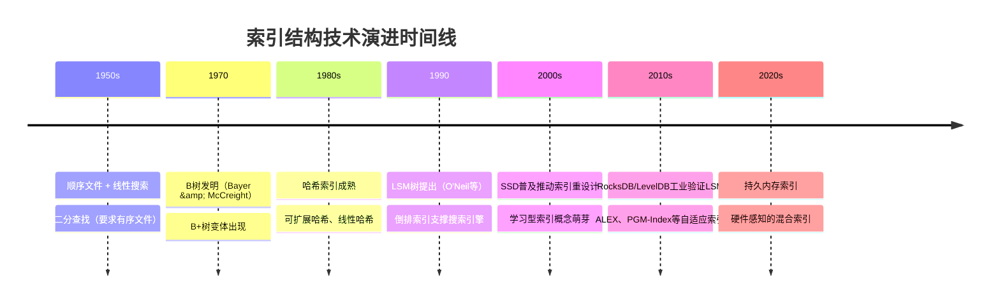
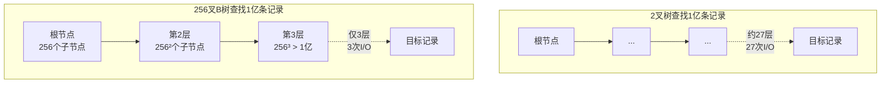
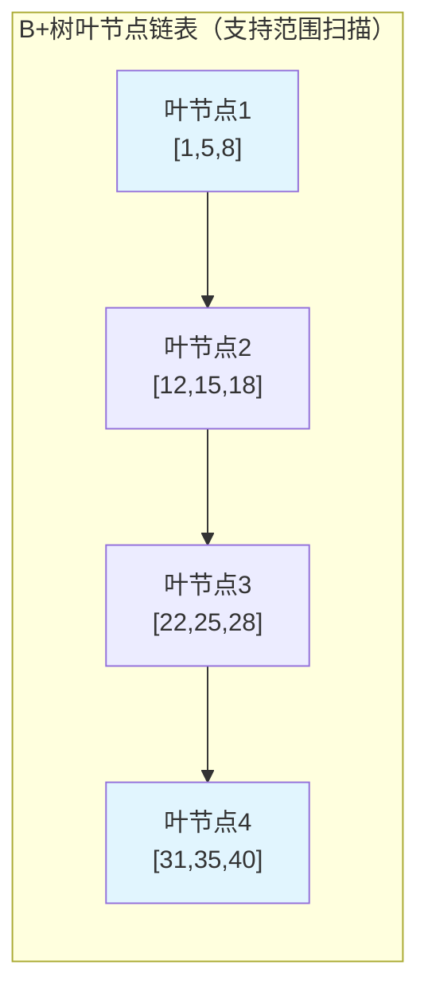
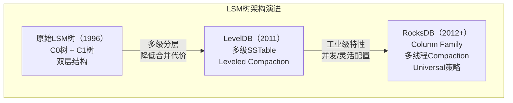
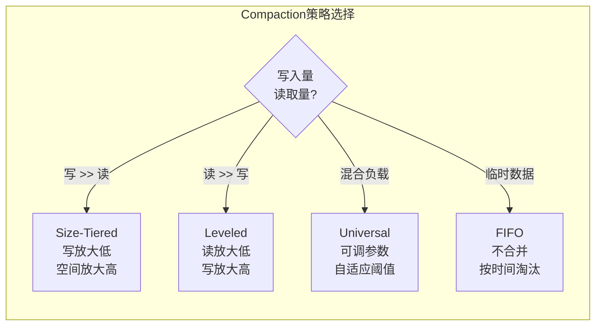
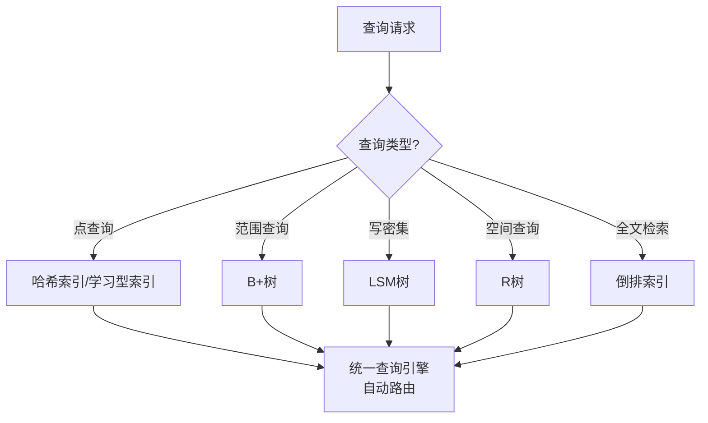

# 索引结构的技术演进

## 1. 演进总览：从顺序扫描到自适应索引

索引结构的发展史，本质上是一部**在存储介质约束与查询需求之间持续寻找最优平衡**的历史。每一次存储硬件的革新（磁盘→SSD→持久内存）和查询模式的变化（OLTP→OLAP→HTAP），都催生了新一代索引结构。理解这条演进脉络，不仅能帮助我们做出正确的索引选型决策，更能让我们预判技术的未来方向。



| 时代 | 存储介质 | 主导索引结构 | 核心瓶颈 | 代表系统 |
|------|----------|-------------|----------|----------|
| 1960s | 磁鼓/早期磁盘 | 顺序文件、ISAM | 随机I/O极慢 | IBM VSAM |
| 1970-1980s | 机械磁盘 | B树/B+树 | 寻道时间 | Oracle、DB2、MySQL InnoDB |
| 1980-1990s | 机械磁盘 | 哈希索引 | 哈希冲突、扩展困难 | PostgreSQL Hash、Oracle Hash |
| 1996-2010s | 机械磁盘→SSD | LSM树 | 写放大、空间放大 | LevelDB、RocksDB、Cassandra |
| 2010s-至今 | SSD/NVMe | B+树 + LSM树并存 | CPU成为瓶颈 | TiDB、PolarDB、CockroachDB |
| 2020s+ | 持久内存(CXL) | 自适应/学习型索引 | 软件栈延迟 | ALEX、PIVOT、Dash |

演进背后有一条不变的主线：**索引设计的核心永远是在读性能、写性能和空间效率之间做权衡**。不同硬件环境下，这个权衡的最优解截然不同——这正是索引结构持续演化的根本动力。

## 2. 前索引时代：顺序文件与散列（1950s-1960s）

### 2.1 顺序文件（Sequential File）

最早的数据库系统（如IBM的IMS）直接将记录按顺序存储在磁带上。查询时只能从头到尾扫描，时间复杂度为O(N)。为了加速，工程师们引入了两种朴素优化：

- **分块（Blocking）**：将多个逻辑记录打包成一个物理块，减少I/O次数。例如将4条1KB记录打包成一个4KB块，磁盘I/O次数减少到1/4
- **索引顺序访问方法（ISAM）**：维护一个稀疏索引，先通过索引定位到磁盘上的大致区域，再在区域内顺序搜索

ISAM的核心思想——"两级定位"——直接影响了后来B树的设计。ISAM的工作原理可以用一个图书馆类比：先查目录卡片（索引层）找到书在哪一排哪一架（数据区域），再在那一架上找到具体位置。这比从第一本书开始逐本翻找高效得多。

但ISAM有一个致命缺陷：**不支持动态插入**。当某个磁盘块满了，需要插入新记录时，ISAM只能通过溢出块来处理，随着溢出链的增长，性能逐步退化。这个问题在B树发明后才得到根本解决。

### 2.2 散列文件（Hash File）

1950年代末期，散列技术开始应用于文件组织。通过哈希函数将键直接映射到磁盘块地址，实现O(1)的点查询：

```python
# 散列文件的基本思想
def hash_file_lookup(key, bucket_count):
    bucket_id = hash_function(key) % bucket_count
    # 直接定位到磁盘块，无需遍历
    return read_disk_block(bucket_id)
```

散列文件的致命缺陷在于：
1. **不支持范围查询**——哈希函数将相邻的键分散到不同桶中，无法高效执行`WHERE id BETWEEN 100 AND 200`这样的操作
2. **桶数量固定**，数据量增长后性能急剧下降，需要代价极高的全局重哈希
3. **哈希冲突导致链式溢出**，退化为线性搜索

这些问题推动了B树的诞生。

### 2.3 为什么顺序扫描无法满足需求

在OLTP（联机事务处理）场景下，单条查询的延迟要求在毫秒级。假设磁盘寻道时间为10ms，顺序扫描1亿条记录（假设每条1KB，即100GB数据）需要：

100GB / 60MB/s（磁盘顺序读带宽）≈ 1667秒 ≈ 28分钟

而通过索引结构，同样的查询只需要3-4次磁盘I/O，耗时约30-40毫秒。**索引将查询性能提升了约5万倍**，这就是为什么索引结构的研究从1970年代开始成为数据库领域最核心的课题。

更关键的是，OLTP场景下查询模式高度多样：点查询、范围查询、排序、聚合、连接——顺序扫描对每种操作都需要全量扫描，而索引可以针对不同查询模式定制优化策略。这种"空间换时间"的思想，奠定了整个索引领域的理论基础。

## 3. B树家族的崛起（1970s-1980s）

### 3.1 B树的发明：一个改变数据库历史的算法

1970年，Rudolf Bayer和Edward McCreight在波音研究实验室发表了论文"Organization and Maintenance of Large Ordered Indexes"，首次提出了B树。这篇论文的核心洞察极其简洁：

**通过增加每个节点的分支数（扇出），可以将树的高度压缩到极低，从而将磁盘I/O次数控制在个位数。**



B树的五条性质保证了树的平衡性和空间利用率：

| 性质 | 要求 | 设计意义 |
|------|------|----------|
| 每节点最多m个子节点 | 上限由磁盘页大小决定 | 最大化扇出 |
| 非根节点至少⌈m/2⌉个子节点 | 保证至少50%的空间利用率 | 避免空间浪费 |
| 根节点至少2个子节点 | 除非是叶节点 | 最小分支保证 |
| 所有叶节点在同一层 | 完美平衡 | 查询时间稳定可预测 |
| k个子节点含k-1个关键字 | 排序有序 | 支持二分查找 |

B树的工程意义在于它**同时解决了三个问题**：
- **动态插入和删除**：通过节点分裂和合并，B树能优雅地处理数据量变化，不像ISAM那样需要全局重组
- **最坏情况有界**：无论数据如何分布，查询时间始终是O(log_m N)，性能可预测
- **磁盘友好**：节点大小匹配磁盘页（通常4KB-16KB），每次I/O恰好读取一个完整节点

### 3.2 B+树：统治数据库的索引结构

B+树是B树最重要的变体，由Bayer和McCreight在后续工作中提出。它做了两个关键修改，深刻影响了数据库索引的设计方向：

**修改一：数据只存叶节点。** 内部节点仅存储索引键和子节点指针。这使得内部节点能容纳更多键，树高更低。以1KB的节点大小、8字节键长为例：

B树内部节点：
  每个键值对 = 键(8B) + 数据指针(8B) + 子指针(8B) = 24B
  每节点可存 (1024 - 16) / 24 ≈ 42个键

B+树内部节点：
  每个键值对 = 键(8B) + 子指针(8B) = 16B
  每节点可存 (1024 - 16) / 16 ≈ 63个键

  扇出提升50%！

对于1亿条记录，扇出从42提升到63，树高从log₄₂(10⁸) ≈ 4.5层降低到log₆₃(10⁸) ≈ 4.0层。虽然层数差异不大，但在亿级数据量下，每少一层就少一次磁盘I/O，在高并发场景下累积的性能差异非常可观。

**修改二：叶节点形成有序链表。** 这使得范围查询只需要定位起始叶节点，然后沿链表顺序读取即可，时间复杂度与结果集大小成正比，而非全表大小。这一特性是B+树战胜B树的关键武器。



B+树在1980年代被几乎所有主流关系型数据库采用：

| 数据库系统 | B+树实现细节 | 关键设计决策 |
|-----------|-------------|-------------|
| Oracle | 索引组织表（IOT）直接以B+树组织数据 | 减少二次查找 |
| MySQL InnoDB | 聚簇索引——主键B+树的叶节点直接存储行数据 | 一次I/O获取完整行 |
| PostgreSQL | 堆表+B+树索引，索引叶节点存行指针(tid) | 灵活支持多种索引类型 |
| SQL Server | 聚簇索引+B+树非聚簇索引 | 聚簇索引决定物理存储顺序 |

### 3.3 B树到B+树的工程权衡

B+树并非在所有场景都优于B树。关键权衡点在于：

**B+树的优势：**
- 内部节点扇出更高，树更矮，I/O次数更少
- 叶节点链表天然支持范围查询和顺序扫描
- 内部节点不存数据，缓存效率更高（单个缓存页能索引更多记录）
- 聚簇索引设计让数据存储与索引结构统一，减少一次随机I/O

**B树的优势：**
- 点查询可能更快——如果键恰好在内部节点找到，无需下降到叶节点，节省约一半的查找路径
- 对写操作更友好——不需要维护叶节点链表，节点分裂时只需修改局部结构

在实际工程中，B+树几乎完全取代了B树。原因很简单：OLTP场景中范围查询占比很高（如"查询最近7天的订单"、"获取某个用户的全部交易记录"），B+树的叶节点链表带来的范围查询优势远超B树在点查询上的微小优势。此外，B+树的内部节点不含数据，使得B+树缓存的节点能覆盖更大的键范围，进一步提升了缓存命中率。

### 3.4 B树的并发演进：从粗粒度锁到无锁

早期B树的并发控制非常粗糙——整个树只有一把大锁，读写互斥。这在高并发场景下成为严重瓶颈。B树并发控制的演进经历了几个重要里程碑：

**Latching（1980s）**：为每个节点加一把读写锁（latch），读操作加共享锁，写操作加排他锁。配合**latch coupling（手风琴技术）**——持有一个节点的锁时才申请下一个节点的锁，释放前一个节点的锁——可以大幅提高并发度。

**B-link Tree（1980s）**：通过在每个节点中维护一个"高键"指针和水平链接，允许并发操作在不持有全局锁的情况下安全地分裂和合并节点。这是现代B+树并发实现的理论基础。

**Copy-on-Write B+树（2000s）**：PostgreSQL采用的COW策略——修改节点时复制新版本而非原地修改，天然支持MVCC（多版本并发控制）。LMDB和boltdb也采用了这一设计，适合读多写少的场景。

**无锁B+树（2010s）**：利用CAS（Compare-And-Swap）原子操作实现无锁的并发访问。理论上能达到最高并发度，但实现复杂，工程中较少使用。

## 4. 哈希索引的兴衰（1980s-1990s）

### 4.1 静态哈希与动态哈希

哈希索引提供了O(1)的点查询性能，是B+树无法匹敌的。1980年代，数据库厂商纷纷引入哈希索引：

**静态哈希**的问题在于桶数量固定。当数据量翻倍时，几乎所有记录都需要重新哈希到新桶中，代价极高。假设初始有256个桶、100万条记录，扩容到512个桶时，约50%的记录（50万条）需要重哈希。

**可扩展哈希（Extendible Hashing）** 解决了这个问题：通过全局深度和局部深度的双层映射，仅在单个桶满时才分裂，且分裂时只需重哈希该桶中的记录：

```python
class ExtendibleHash:
    """
    可扩展哈希：按需分裂，最小化重哈希代价
    核心思想：用全局深度控制目录大小，用局部深度控制每个桶的分裂时机
    """
    def __init__(self, bucket_size=4):
        self.global_depth = 1
        # 目录大小 = 2^global_depth
        self.directory = [
            Bucket(local_depth=1),
            Bucket(local_depth=1)
        ]
        self.bucket_size = bucket_size

    def get_bucket_index(self, key):
        """取哈希值的低 global_depth 位作为目录索引"""
        h = hash(key)
        return h &amp; ((1 << self.global_depth) - 1)

    def insert(self, key, value):
        idx = self.get_bucket_index(key)
        bucket = self.directory[idx]

        if not bucket.is_full():
            bucket.add(key, value)
            return

        # 桶满，需要分裂
        if bucket.local_depth == self.global_depth:
            # 目录翻倍：复制目录项，全局深度+1
            self.directory = self.directory + self.directory[:]
            self.global_depth += 1

        # 分裂桶：旧桶和新桶各取一半
        bucket.local_depth += 1
        new_bucket = Bucket(local_depth=bucket.local_depth)
        old_items = bucket.clear()

        # 根据新的局部深度位重新分配
        mask = 1 << (bucket.local_depth - 1)
        for k, v in old_items:
            new_idx = hash(k) &amp; ((1 << self.global_depth) - 1)
            if new_idx &amp; mask:
                new_bucket.add(k, v)
            else:
                bucket.add(k, v)

        # 更新目录中指向旧桶的所有位置
        for i in range(len(self.directory)):
            if (i &amp; ((1 << self.global_depth) - 1)) &amp; mask:
                self.directory[i] = new_bucket
            else:
                self.directory[i] = bucket

        # 重新插入新记录
        self.insert(key, value)
```

可扩展哈希的核心优势是**分裂的局部性**：每次分裂只涉及一个桶，重哈希的记录数最多是桶容量（如16条）。而静态哈希翻倍需要重哈希50%的记录。这使得可扩展哈希在数据量增长时的性能抖动远小于静态哈希。

**线性哈希（Linear Hashing）** 是另一种动态哈希方案，由Litwin于1980年提出。与可扩展哈希不同，线性哈希按顺序逐个分裂桶，使用溢出桶处理冲突：

初始状态：  桶0  桶1  桶2  桶3
                    ↑ split指针
                    
插入触发分裂： 桶0  桶1  桶2  桶3  桶4（从桶0分裂出）
                       ↑ split指针移到桶1
                       
再触发分裂：  桶0  桶1  桶2  桶3  桶4  桶5（从桶1分裂出）
                          ↑ split指针移到桶2

线性哈希的优势是不需要目录——通过split指针和哈希函数就能确定记录所在的桶。代价是分裂顺序与插入顺序无关，可能导致某些桶的溢出链较长。

### 4.2 哈希索引的局限与退场

哈希索引在1990年代逐渐被B+树取代，原因有三：

**不支持范围查询。** B+树叶节点有序链表可以高效执行`WHERE age BETWEEN 20 AND 30`，哈希索引则需要扫描全部桶。在一个典型的OLTP系统中，范围查询占比可达30-50%，这个缺陷是致命的。

**并发控制困难。** B+树的并发控制已有成熟的方案（如latch coupling、B-link tree），哈希表在扩容时需要锁定整个目录或全局重哈希，并发性能差。在高并发写入场景下，可扩展哈希的目录翻倍操作可能成为全局瓶颈。

**数据倾斜敏感。** 哈希函数假设数据均匀分布，但现实数据往往存在热点。例如用户ID哈希后，VIP用户（如ID=1）可能集中在少数桶中，导致热点桶的溢出链不断增长，查询性能退化。

MySQL的MEMORY引擎曾经支持哈希索引，但InnoDB从未将其作为默认索引类型。InnoDB的自适应哈希索引（AHI）是一个有趣的折中方案——它在B+树的基础上，自动将频繁访问的热点页面缓存为哈希索引：

```sql
-- 查看InnoDB自适应哈希索引状态
SHOW ENGINE INNODB STATUS\G

-- 相关配置
SHOW VARIABLES LIKE 'innodb_adaptive_hash_index';
-- 默认开启：innodb_adaptive_hash_index=ON

-- AHI分区数（高并发场景可增大）
SHOW VARIABLES LIKE 'innodb_adaptive_hash_index_partitions';
```

AHI的设计哲学值得深思：它没有完全放弃哈希索引的O(1)优势，而是在B+树之上叠加了一层自适应的哈希缓存。当某个B+树页面被频繁访问时，AHI会自动将其键映射缓存为哈希表条目，后续查询直接通过哈希定位，跳过B+树的多层查找。在读密集的OLTP场景下，AHI可以将热点查询的延迟从3-4次I/O降低到1次I/O。

## 5. LSM树的革命（1996-2010s）

### 5.1 为什么需要LSM树

B+树虽然在读性能上近乎完美，但其**原地更新**的特性带来了严重的写放大问题。每次更新一条记录，B+树需要：

1. 定位叶节点（至少一次磁盘随机读）
2. 修改叶节点内容（一次磁盘随机写）
3. 如果触发分裂，还需要修改父节点（更多随机写）

在机械磁盘时代，随机写延迟约10ms，这意味着写入QPS被限制在约100。对于写密集场景（如日志采集、时序数据、IoT传感器数据），B+树完全无法满足需求。

Patrick O'Neil等人的洞察是：**磁盘的顺序写速度远高于随机写速度**（通常100倍以上）。如果能将所有写入转换为顺序追加，写吞吐量就能获得数量级的提升。这正是LSM树的核心设计哲学：用读性能的轻微退化，换取写性能的数量级提升。

### 5.2 LSM树的架构演进

LSM树从1996年论文发表到工业界大规模应用，经历了三个重要阶段：

**第一阶段：学术提出（1996年）**

O'Neil等人的原始论文描述了一个两层结构：内存中的树（C0树）和磁盘上的树（C1树）。当C0树满时，将整个C0树合并写入C1树。这个设计简单但合并代价很大——每次合并需要重写整个C1树。

**第二阶段：LevelDB的工程实现（2011年）**

Google的LevelDB将LSM树工程化，引入了多层级（Level）结构和Leveled Compaction策略。核心改进是：每层的SSTable大小是上层的T倍（默认T=10），数据逐层下沉，每层内SSTable的key range不重叠。这大幅降低了读放大——对于每一层，最多只需要读取一个SSTable。

**第三阶段：RocksDB的工业验证（2012年至今）**

Facebook基于LevelDB开发的RocksDB，将LSM树推向了大规模工业应用。RocksDB的关键贡献包括：
- **Compaction线程池**：支持多线程并发compaction，大幅减少compaction对前台读写的影响
- **Column Family**：在一个RocksDB实例中支持多个独立的LSM树，适合多租户或混合负载场景
- **动态层级调整**：根据数据量自动调整compaction策略和层级参数
- **多种Compaction策略**：Universal Compaction（全局合并）、FIFO Compaction（按时间淘汰）、Leveled Compaction（逐层合并）
- **TTL支持**：数据级别的过期时间控制，适合时序数据和缓存场景



### 5.3 跳表：LSM树的内存骨架

跳表（Skip List）是LSM树MemTable的标准实现数据结构，由William Pugh于1990年提出。它在有序链表之上叠加多层索引，实现了O(log N)的查找和插入，且实现简单、并发友好：

```python
class SkipListNode:
    def __init__(self, key, value, level):
        self.key = key
        self.value = value
        self.forward = [None] * (level + 1)  # 每层一个前进指针

class SkipList:
    def __init__(self, max_level=16, p=0.5):
        self.max_level = max_level
        self.p = p  # 升级概率
        self.header = SkipListNode(-1, None, max_level)
        self.level = 0

    def search(self, key):
        """从最高层向下搜索，每层水平扫描"""
        current = self.header
        for i in range(self.level, -1, -1):
            # 在当前层水平移动到不超过key的最大节点
            while (current.forward[i] and 
                   current.forward[i].key < key):
                current = current.forward[i]
        current = current.forward[0]
        if current and current.key == key:
            return current.value
        return None

    def insert(self, key, value):
        """随机决定新节点的层数，自底向上插入"""
        update = [None] * (self.max_level + 1)
        current = self.header
        for i in range(self.level, -1, -1):
            while (current.forward[i] and 
                   current.forward[i].key < key):
                current = current.forward[i]
            update[i] = current

        new_level = self._random_level()
        if new_level > self.level:
            self.level = new_level

        new_node = SkipListNode(key, value, new_level)
        for i in range(new_level + 1):
            new_node.forward[i] = update[i].forward[i]
            update[i].forward[i] = new_node
```

跳表相比红黑树的工程优势：
- **实现简单**：核心逻辑约100行代码，远少于红黑树的旋转/重染色逻辑
- **并发友好**：插入只需修改局部指针，不需要全局重平衡，配合细粒度锁可以实现高并发写入
- **范围查询高效**：找到起始节点后沿底层链表顺序扫描即可

LevelDB和RocksDB都使用跳表作为MemTable的默认实现。Cassandra则使用ConcurrentSkipListMap（Java标准库），充分利用了跳表的并发特性。

### 5.4 LSM树的三大代价

LSM树用写性能换取了读性能的劣势，但在实际应用中，三大代价需要认真对待：

**写放大（Write Amplification）：**

Leveled Compaction写放大分析：
┌──────────────────────────────────────────┐
│ 假设：T=10，数据量1TB，MemTable=64MB     │
│                                          │
│ 层数 = log₁₀(1TB / 64MB) ≈ 4层         │
│ 每层写放大 ≈ T（最坏情况）               │
│ 总写放大 ≈ T × 层数 = 10 × 4 = 40倍     │
│                                          │
│ 实际影响：写入1GB逻辑数据                │
│ → 物理写入约40GB                         │
│ → SSD磨损加速，使用寿命缩短              │
│                                          │
│ 以一块TBW=600TB的SSD为例：               │
│ 40倍写放大下，理论写入寿命 = 600/40      │
│ = 15TB逻辑写入                           │
│ → 以100MB/s持续写入，约1.7天写满         │
└──────────────────────────────────────────┘

**读放大（Read Amplification）：**

最坏情况下，一次点查询可能需要检查MemTable + Level 0的所有SSTable + 每层一个SSTable。在Level 0存在大量SSTable时（Level 0是唯一允许key range重叠的层级），读放大可达数十次磁盘I/O。Bloom Filter可以有效缓解这个问题（将假阳性率控制在1%以下），但不能完全消除——假阳性导致的误读虽然不会返回错误数据，但会浪费I/O次数。

**空间放大（Space Amplification）：**

Size-Tiered Compaction中，同一个key可能存在于多个SSTable中（包括最新的值和旧版本值），导致临时的空间浪费。最坏情况下空间放大可达2倍（即实际占用空间是逻辑数据量的两倍）。Leveled Compaction通过不重叠的key range将空间放大控制在约10%，但代价是更高的写放大。

### 5.5 Compaction策略的工程选择



| 策略 | 写放大 | 读放大 | 空间放大 | 适用场景 | 代表系统 |
|------|--------|--------|----------|----------|----------|
| Size-Tiered | 低（~4x） | 高 | 高（~2x） | 写密集、追加型数据 | Cassandra默认 |
| Leveled | 高（~10x·L） | 低 | 低（~1.1x） | 读密集、点查询为主 | LevelDB、RocksDB默认 |
| Universal | 可调 | 中 | 可调 | 混合负载 | RocksDB |
| FIFO | 极低 | 中 | 低 | TTL数据、日志 | RocksDB |
| Tiered+Leveled混合 | 中 | 中低 | 中 | 实际生产环境 | TiKV |

实际工程中，很多系统采用混合策略。例如TiKV的RocksDB实例在L0-L1使用Size-Tiered减少写放大，在L1+使用Leveled控制读放大。这种"分层混合"策略能在读写性能之间取得更好的平衡。

## 6. SSD时代的索引重构（2010s）

### 6.1 SSD如何改变索引设计假设

SSD的出现打破了B+树设计的几个核心假设：

| 特性 | 机械磁盘（HDD） | 固态硬盘（SSD） | NVMe SSD |
|------|----------------|----------------|----------|
| 随机读延迟 | ~10ms | ~0.1ms | ~0.02ms |
| 顺序读带宽 | 60-200 MB/s | 500 MB/s | 3-7 GB/s |
| 随机读/顺序读比 | 1:10000 | 1:5 | 1:3 |
| 随机写延迟 | ~10ms | ~0.1ms | ~0.02ms |
| 写入寿命 | 无限 | 有限（TBW） | 有限（TBW） |
| 并行度 | 低（单磁头） | 中（多通道） | 高（多队列） |

关键变化：**随机I/O不再是灾难**。HDD上需要精心设计B+树来最小化随机读，SSD上这种优化的边际收益大幅降低。这带来了几个重要影响：

**B+树的节点大小需要重新调优。** HDD时代通常使用16KB节点来匹配磁盘块大小，SSD时代可以使用4KB甚至更小的节点来降低读放大（每次I/O只读需要的数据，而非一大块无关数据）。MySQL 8.0中InnoDB的页面大小默认仍为16KB，但在纯SSD环境下，部分DBA会将其调整为8KB以提升索引查询效率。

**写放大成为核心关注点。** SSD的写入寿命有限（通常TBW在几百到几千TB），LSM树40倍的写放大会显著缩短SSD寿命。这催生了WiscKey（2016）等新方案——将key和value分离存储，大幅降低写放大。

**并行I/O成为设计考量。** NVMe SSD支持多队列并行I/O（最多64K队列），这使得传统的单线程索引扫描成为瓶颈。现代数据库开始利用多线程并行扫描索引的多个分支。

### 6.2 WiscKey：值日志分离

WiscKey（2016，威斯康星大学）的核心思想极为简洁：**只在LSM树中存key和value的指针，value单独追加到vLog（Value Log）中**：

传统LSM树：key和value一起存入SSTable
WiscKey：key存在LSM树，value追加到vLog

读取流程：
1. 从LSM树中查找key → 获得value在vLog中的位置（pointer）
2. 从vLog中读取value

写入流程：
1. 将value追加到vLog尾部 → 获得位置pointer
2. 将key:pointer写入LSM树

WiscKey的写放大大幅降低（因为LSM树只存key，体积缩小10-100倍），代价是读取时可能需要额外一次随机I/O来读取vLog。在SSD上，额外的随机读延迟仅0.02ms，完全可以接受。

WiscKey面临的工程挑战：
- **vLog的垃圾回收**：被覆盖的旧value需要定期清理，GC策略直接影响空间效率
- **范围查询退化**：传统LSM树的范围查询可以顺序读取SSTable，WiscKey的value分散在vLog各处，范围查询退化为多次随机读
- **SSD内部FTL干扰**：vLog的顺序追加与LSM树的随机写混合，可能干扰SSD内部的垃圾回收机制

这些问题推动了BlobDB（RocksDB内置）、Terark等后续方案的出现，它们在WiscKey的思想基础上做了更多工程优化。

## 7. 自适应索引与学习型索引（2018-至今）

### 7.1 传统索引的根本局限

传统索引的核心假设是**键的分布未知或均匀**。但在实际应用中，数据分布往往是有偏的：
- 用户ID可能集中在某个时间段注册
- 订单金额呈现长尾分布——大部分订单金额较小，少量大额订单拉高平均值
- 时间序列数据总是最新数据最热

传统B+树为所有数据提供相同的查询性能，无法利用数据分布的先验知识。一个存储1亿条记录的B+树，无论查询集中在头部1%的数据还是均匀分布在整个数据集，每次查询都需要3-4层树遍历。如果我们知道数据的分布规律，理论上可以跳过大部分层级。

### 7.2 学习型索引（Learned Index）

2018年，Tim Kraska等人在Google发表了论文"The Case for Learned Index Structures"，提出了一个激进的想法：**用机器学习模型替代B+树**。

核心洞察：B+树本质上是一个将键映射到磁盘位置的函数。如果能训练一个模型来直接预测键的位置，就无需存储树结构本身：

```python
class LearnedIndex:
    """
    学习型索引的概念实现
    核心思想：用模型预测key在排序数组中的位置
    """
    def __init__(self, sorted_keys, sorted_values):
        self.keys = sorted_keys
        self.values = sorted_values
        # 训练模型：输入key → 输出在数组中的位置
        self.model = train_cdf_model(sorted_keys)

    def lookup(self, key):
        # 1. 模型预测位置（CPU计算，极快）
        predicted_pos = self.model.predict(key)

        # 2. 在预测位置附近做小范围搜索（补偿误差）
        search_range = 100  # 模型误差范围
        start = max(0, predicted_pos - search_range)
        end = min(len(self.keys), predicted_pos + search_range)

        for i in range(start, end):
            if self.keys[i] == key:
                return self.values[i]

        return NOT_FOUND

def train_cdf_model(keys):
    """
    训练累积分布函数模型
    优化目标：minimize(max_error) — 保证最坏情况下的查询性能
    """
    # 将keys视为排序数组的CDF
    # CDF(key) ≈ key在数组中的位置比例
    # 用分段线性函数或神经网络拟合
    model = PiecewiseLinearModel()
    model.fit(keys, positions=range(len(keys)), epsilon=128)
    return model
```

学习型索引的理论优势：模型的存储空间远小于B+树。对于1亿条8字节整数键：
- B+树需要约1.6GB索引空间（每层节点占用空间累加）
- 一个误差ε=128的分段线性模型只需约8MB
- **空间压缩约200倍**，意味着更多的索引可以放入CPU缓存

### 7.3 学习型索引的现实挑战

尽管概念优美，学习型索引在工业界的大规模应用仍面临诸多挑战：

**模型更新代价高。** 当数据分布变化时（如新数据插入），需要重新训练模型。B+树的节点分裂是局部操作，影响范围仅限于分裂路径上的节点；而模型训练需要扫描大量数据，影响范围是全局的。对于频繁更新的OLTP系统，这个代价几乎不可接受。

**对数据分布敏感。** 在均匀分布数据上表现优秀，但在高度倾斜或非单调分布上可能失效。例如，如果1亿条记录中有9900万条的key集中在很小的范围内，模型需要极多的分段才能保证精度，退化为变相的B+树。

**最坏情况性能不可控。** B+树保证O(log N)的最坏情况查询时间，学习型索引的最坏情况取决于模型的最大误差。在极端分布下，误差可能很大，导致大量额外搜索。

目前工业界的主流方案是将学习型索引作为B+树的辅助加速器，而非完全替代：

| 系统 | 应用方式 | 效果 |
|------|----------|------|
| SOSD基准测试 | 多种学习型索引比较 | 在点查询上超越B+树2-10倍 |
| TiDB | 探索性集成 | 实验阶段 |
| MySQL 8.0 | 未采用 | 优先保证稳定性和向后兼容 |
| PostgreSQL | 未采用 | 社区倾向渐进式改进 |
| SiliconDB (华为) | 部分场景实验 | 静态数据集上效果显著 |

### 7.4 PGM-Index与Dash：实用化的自适应索引

相比激进的学习型索引，PGM-Index（2020）和Dash（2021）走了一条更务实的路线：

**PGM-Index** 结合了分段线性近似（模型层）和B+树（校正层）。模型层给出粗略定位，校正层（一个小B+树）处理模型误差：

查询流程：
1. 模型层：给定key，预测位置 O(1)
2. 校正层：在模型预测值附近的小范围内搜索 O(log ε)
3. 总复杂度：O(log ε)，其中ε是模型最大误差

对比：
B+树：O(log N) = O(log₂(1亿)) ≈ 27次比较
PGM：O(log ε) = O(log₂(128)) ≈ 7次比较

PGM-Index的工程价值在于它**可叠加在现有B+树之上**，无需修改底层存储引擎。Rust生态中的`pgm-index`库可以直接嵌入任何支持有序扫描的存储后端。

**Dash**（2021，CMU）提出了混合维度索引，核心思想是在B+树的每个内部节点中嵌入一个小哈希表，将节点内部的O(log m)查找降低到O(1)。整体查找复杂度为O(log_m(N))但每步O(1)，而非传统B+树的每步O(log m)。对于高扇出的B+树（m=256），这意味着每层查找从8次比较降低到1次哈希计算，总查找速度提升约8倍。

### 7.5 ALEX：面向混合负载的自适应索引

ALEX（Adaptive Learned Index，2020，MIT）是另一种实用化的学习型索引方案。它针对SSD+DRAM混合环境做了专门优化：

- **混合模型**：内部节点使用线性模型，叶节点使用直方图，适应不同层级的数据分布特征
- **自适应分裂**：当某个模型的误差超过阈值时，自动将该区间分裂为子模型，类似B+树的节点分裂但粒度更细
- **DRAM/SSD感知**：根据数据的访问频率，自动将热数据放入DRAM中的密集索引，冷数据放入SSD中的稀疏索引

ALEX在SOSD基准测试中的表现：对于排序后的整数键数据集，ALEX的点查询吞吐量比ART（Adaptive Radix Tree）高1.6倍，比B+树高2.3倍。但其优势主要体现在静态或近静态数据集上，频繁更新时性能退化明显。

## 8. 持久内存时代的索引设计（2020s）

### 8.1 持久内存改变了什么

Intel Optane DC Persistent Memory（已停产，但CXL内存延续了类似特性）的出现带来了全新的存储层级：

传统存储层级：
CPU Cache (ns级) → DRAM (10ns级) → SSD (100μs级) → HDD (10ms级)

持久内存时代：
CPU Cache → DRAM → Persistent Memory (100ns级) → SSD → HDD
                  ↑ 新增层级，可字节寻址

持久内存的关键特性：
- **字节寻址**：像DRAM一样通过load/store指令访问，无需块设备驱动和文件系统抽象层
- **持久性**：断电后数据不丢失，无需传统的WAL（Write-Ahead Log）保证持久性
- **延迟**：读延迟约100ns（DRAM的5-10倍），远低于SSD的100μs
- **带宽**：约6-8 GB/s（接近DRAM）
- **容量**：单条可达256GB或512GB，远超DRAM的128GB上限

持久内存的引入，使得传统的"将索引结构适配到块设备"的设计范式不再是最优解。索引结构需要重新设计，充分利用字节寻址和持久性的特性。

### 8.2 持久内存索引的设计原则

在持久内存上，B+树的节点分裂需要保证原子性（否则断电后索引损坏）。传统方案依赖WAL，但在字节寻址的持久内存上，WAL反而成了瓶颈——每次写操作都需要先写WAL再写数据，相当于写放大至少2倍。

**无锁持久内存索引**成为研究热点。代表方案包括：

**CCEH（Concurrent Extendible Hashing，2019）：** 将可扩展哈希表适配到持久内存，使用原子的128位CAS操作保证目录扩展的原子性。核心创新是在目录翻倍时，通过128位CAS一次性原子更新两个相邻的目录项，避免了全局锁。

**FAST+FAIR（2020）：** 在持久内存B+树中，使用日志结构的节点更新来保证崩溃一致性，同时避免WAL的额外写放大。每个节点维护一个小型日志区域（通常8字节），用于记录正在进行的修改。断电恢复时，通过重放节点日志即可恢复一致性状态，无需全局WAL。

**P-B+Tree（2021）：** 利用持久内存的原子写特性（64位原子写），通过精心设计的节点布局，在不使用WAL的情况下保证B+树的崩溃一致性。其核心思想是将每个节点拆分为数据区和元数据区，修改操作分两步原子执行：先写数据，再更新元数据中的校验和。恢复时检查校验和即可判断节点是否一致。

```python
class PNode:
    """
    持久内存B+树节点的简化布局
    关键：数据区和元数据区分离，通过64位原子写保证一致性
    """
    HEADER_SIZE = 64  # 字节

    def __init__(self):
        self.checksum = 0       # 8B: 数据区的校验和
        self.generation = 0     # 8B: 版本号，每次修改+1
        self.key_count = 0      # 4B: 当前键数量
        self.node_type = 0      # 4B: 内部节点/叶节点
        # 数据区：键值对存储
        self.keys = []
        self.values = []

    def atomic_update(self, new_keys, new_values):
        """
        两阶段原子更新：
        1. 写入新数据（任意顺序）
        2. 原子写入checksum和generation（64位原子操作）
        """
        # 阶段1：写入数据（可能中间断电，checksum不匹配）
        self.keys = new_keys
        self.values = new_values
        # memory_barrier()  # 确保数据先于元数据落盘

        # 阶段2：原子更新元数据
        self.generation += 1
        self.checksum = self._compute_checksum()
        # 原子写入checksum和generation（8字节）

    def is_consistent(self):
        """恢复时检查节点一致性"""
        return self.checksum == self._compute_checksum()
```

### 8.3 持久内存索引的实际性能

在Optane DC PMM上的基准测试数据（来自学术论文和Intel公开数据）：

| 索引结构 | 读延迟 | 写延迟 | 吞吐量 | 备注 |
|----------|--------|--------|--------|------|
| DRAM B+树 | 150ns | 200ns | 10M ops/s | 基准线 |
| PMem B+树 (P-B+Tree) | 300ns | 500ns | 6M ops/s | 无WAL |
| PMem B+树 (WAL) | 350ns | 1200ns | 3M ops/s | 传统WAL |
| PMem哈希表 (CCEH) | 200ns | 400ns | 8M ops/s | O(1)查找 |

持久内存索引的性能约为DRAM的50-70%，但延迟远低于SSD（100ns vs 100μs），容量也远超DRAM（单节点可达数TB）。这使得"将整个数据库索引放入持久内存"成为可能——对于1亿条记录的B+树索引（约1.6GB），在一块512GB的持久内存模组上绰绰有余。

## 9. 索引结构的未来趋势

### 9.1 混合索引架构

未来不是某种索引结构独霸天下，而是多种索引的智能组合。单一索引结构很难同时满足OLTP和OLAP的需求，混合架构成为必然趋势：



**TiDB的TiFlash引擎**已经在实践这种混合架构：TiKV使用RocksDB（LSM树）处理OLTP写入，TiFlash使用列存+B+树处理OLAP分析，两者通过Raft协议保持一致性。查询优化器根据查询特征自动选择路由到TiKV或TiFlash。

**Redis的多索引策略**也是一种混合方案：底层使用哈希表处理O(1)点查询，跳表支持有序集合的范围查询，紧凑列表（ziplist/listpack）用于小数据量的内存优化。

**PostgreSQL的并行索引扫描**：对于大范围扫描，PostgreSQL可以同时使用多个索引扫描分支并行工作，再合并结果——这本质上是将多个B+树子树的扫描并行化。

### 9.2 硬件感知索引

随着CXL内存、存储级内存（SCM）、PIM（Processing-In-Memory）等新型硬件的出现，索引结构需要感知底层硬件特性来选择最优策略：

| 硬件特性 | 索引设计影响 | 当前成熟度 |
|----------|-------------|-----------|
| NVMe多队列 | 并行索引操作可利用硬件队列，多线程扫描不同子树 | 成熟，已广泛采用 |
| CXL内存扩展 | 索引数据可在本地DRAM和远程CXL内存间分层，热数据本地、冷数据远程 | 实验阶段 |
| 持久内存字节寻址 | 无需WAL的崩溃一致索引，节点原地更新 | Optane已停产，CXL延续 |
| GPU显存 | 大规模并行索引构建和查询，适合OLAP场景 | 研究中，如GpuDB |
| DPDK网络 | 网络侧索引过滤，减少CPU开销 | 少数系统采用 |
| PIM（存内计算） | 在存储芯片内直接执行索引查找，消除数据搬运 | 早期研究 |

CXL（Compute Express Link）是最值得关注的硬件趋势。CXL允许CPU通过PCIe总线访问远端DRAM，延迟约150-300ns（本地DRAM的10-30倍，但远低于SSD的100μs）。未来的数据库可能将索引分为三层：最热的1%数据放在本地DRAM（10ns），次热的9%放在CXL扩展内存（200ns），冷数据放在SSD（100μs）——自动根据访问频率在三层之间迁移。

### 9.3 自调优索引（Self-Tuning Index）

未来的索引结构将具备自适应能力，能够根据实际工作负载自动调整：

- **自动选择索引类型**：根据读写比例在B+树和LSM树之间自动切换。MySQL 8.0的InnoDB已经在小范围内实践了这一点——自适应哈希索引根据访问模式自动创建/销毁哈希缓存
- **自动调优参数**：LSM树的MemTable大小、Compaction策略、Bloom Filter大小等参数根据负载自动调整。Cassandra的"Self-Tuning Compaction"已经开始探索这个方向
- **自动分区**：根据访问热点自动将索引数据分布到不同存储介质（热数据在DRAM，温数据在CXL内存，冷数据在SSD），类似操作系统虚拟内存的页面置换策略
- **自动索引推荐**：根据查询日志自动识别缺失的索引并建议创建。MySQL Enterprise的"索引建议"和PostgreSQL的`pg_qualstats`扩展已经在做类似的探索

### 9.4 向量索引：AI时代的新挑战

大语言模型和向量数据库的爆发催生了全新的索引需求。向量索引需要处理的问题与传统标量索引截然不同：

- **维度灾难**：向量通常是768维或更高维度的浮点数，传统B+树的多路搜索在高维空间中退化为线性扫描
- **近似最近邻（ANN）**：精确最近邻搜索在高维空间中计算代价过高，工业界普遍接受"99%召回率"的近似搜索
- **主流方案**：HNSW（分层可导航小世界图）、IVF（倒排文件索引）、PQ（乘积量化）、DiskANN（磁盘友好向量索引）

向量索引的演进，本质上是传统索引思想（图索引≈图遍历、倒排索引≈向量空间划分）在新场景下的延伸。理解传统索引的演进脉络，有助于更好地理解和设计向量索引。

## 10. 索引选型决策框架

面对具体的业务场景，如何选择合适的索引结构？以下决策框架可以帮助你系统地思考：

第一步：明确查询模式
├── 以点查询为主（等值查找）→ 考虑哈希索引/学习型索引
├── 以范围查询为主 → 考虑B+树
├── 以写入为主（追加型）→ 考虑LSM树
├── 以全文搜索为主 → 考虑倒排索引
└── 以空间查询为主 → 考虑R树

第二步：评估数据特征
├── 数据量级
│   ├── <1GB：内存索引（哈希表/跳表/红黑树）
│   ├── 1GB-1TB：磁盘索引（B+树/LSM树）
│   └── >1TB：分布式索引（分片+复制）
├── 数据分布
│   ├── 均匀分布：传统索引足够
│   └── 高度倾斜：考虑学习型索引/自适应索引
└── 更新频率
    ├── 读多写少（>10:1）：B+树
    ├── 写多读少（>1:10）：LSM树
    └── 读写均衡：混合方案

第三步：匹配硬件环境
├── HDD：B+树（优化I/O次数）
├── SSD：B+树或LSM树（写放大需关注）
├── NVMe SSD：LSM树（随机I/O代价可接受）
└── 持久内存：无WAL的持久化索引

| 场景 | 推荐索引 | 关键理由 |
|------|----------|----------|
| 电商订单系统 | InnoDB聚簇B+树 | 订单号范围查询+事务支持 |
| 日志采集系统 | RocksDB (LSM树) | 写入吞吐量优先 |
| 用户登录系统 | 哈希索引 / AHI | 精确匹配，O(1)查找 |
| 全文搜索引擎 | 倒排索引 (Lucene) | 词项→文档映射 |
| GIS地理信息系统 | R树 / R*树 | 空间范围+最近邻查询 |
| 时序数据库 | LSM树 + 时间分区 | 写入密集+时间范围查询 |
| 向量数据库 | HNSW / DiskANN | 近似最近邻搜索 |

## 11. 本节小结

索引结构的技术演进可以归纳为三条主线：

**主线一：读写权衡的钟摆。** B+树优化读性能→LSM树优化写性能→混合架构在两者之间动态平衡。没有"最好的索引结构"，只有"最适合当前场景的索引结构"。

**主线二：硬件驱动的设计重构。** 每一次存储介质的革新都迫使索引结构重新设计。HDD→SSD削弱了B+树的随机I/O惩罚，SSD→持久内存则消除了块设备的抽象层。未来CXL、PIM等硬件的普及，将再次重塑索引的设计范式。

**主线三：从静态到自适应。** 传统索引结构为所有数据提供相同的服务，未来的索引将根据数据分布、查询模式和硬件特性自动调整自身结构。从学习型索引的"用模型替代树"，到PGM-Index的"模型+树混合"，到自调优索引的"参数自适应"，自适应能力正在成为索引设计的核心维度。

**主线四（新兴）：从标量到向量。** 大模型时代，索引结构从处理标量键扩展到处理高维向量，催生了HNSW、IVF、DiskANN等全新方案。这是索引领域40年来最大的范式扩展。

理解这些演进脉络，不仅有助于选择合适的索引方案，更能帮助我们预判索引技术的未来方向——在存储硬件持续演化、数据类型不断扩展的背景下，索引结构的创新远未结束。
