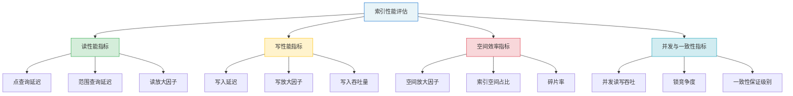
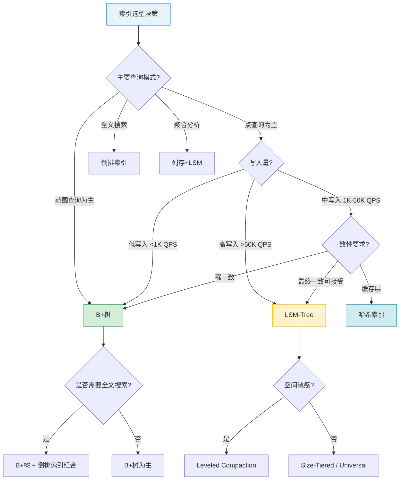

## 索引结构关键指标

### 1. 为什么需要度量指标——从直觉到量化

选择索引结构时，很多开发者凭直觉做决策："B+树经典，用它准没错"或"LSM树写入快，写密集场景就选它"。但直觉无法回答关键问题：**在你的具体场景下，这个索引到底比那个快多少？代价是什么？**

量化指标是索引选型的科学基础。本节建立一套完整的评估框架，覆盖读性能、写性能、空间效率、并发能力四个核心维度，并给出各主流索引结构的实测基准数据。



### 2. 读性能指标：查询到底有多快

读性能是索引最核心的价值所在。衡量读性能需要区分三种查询模式，因为不同索引结构在不同查询模式下的表现差异巨大。

#### 2.1 点查询延迟（Point Query Latency）

点查询即等值查找——给定一个键，找到对应的值。这是最基础的查询操作，也是衡量索引"查找速度"的核心指标。

**定义：** 从发起查询到返回结果所经历的端到端时间，通常以微秒（μs）或毫秒（ms）为单位。

**各索引结构的理论点查询复杂度：**

| 索引类型 | 理论复杂度 | 磁盘IO次数（1亿数据） | 实测延迟（NVMe SSD） |
|----------|-----------|----------------------|---------------------|
| 全表扫描 | O(n) | 数万次 | 数秒 |
| 哈希索引 | **O(1)** | 1次 | 10-50 μs |
| B+树（3层） | O(log n) | 3次 | 50-200 μs |
| LSM-Tree | O(log n) × L | 最坏10+次 | 100-500 μs |

> **延迟的组成分解：** 实际延迟 = CPU计算时间 + 内存访问时间 + 缓存未命中时的磁盘IO时间。在SSD上，一次磁盘IO约10-100μs，而CPU计算通常在纳秒级。因此，**索引查询的延迟瓶颈几乎总是IO**，而非计算。

**点查询延迟的实测方法：**

```python
import time
import statistics

def benchmark_point_query(index, keys, iterations=10000):
    """
    点查询延迟基准测试
    返回: p50, p95, p99, max 延迟（微秒）
    """
    # 预热：确保缓存命中
    for key in keys[:1000]:
        index.lookup(key)
    
    latencies = []
    for _ in range(iterations):
        key = keys[hash(time.time_ns()) % len(keys)]
        
        start = time.perf_counter_ns()
        result = index.lookup(key)
        end = time.perf_counter_ns()
        
        latencies.append((end - start) / 1000)  # 转换为微秒
    
    return {
        "p50": statistics.median(latencies),
        "p95": sorted(latencies)[int(len(latencies) * 0.95)],
        "p99": sorted(latencies)[int(len(latencies) * 0.99)],
        "max": max(latencies),
        "mean": statistics.mean(latencies)
    }
```

> **为什么关注P99而非平均值？** 在生产环境中，平均延迟具有欺骗性。假设平均延迟是100μs，但P99是5ms——这意味着每100次查询就有1次需要50倍于平均值的时间。对于每秒1万次查询的服务，这意味着每秒有100次请求会感受到明显卡顿。P99（甚至P999）才是用户体验的真实反映。

#### 2.2 范围查询延迟（Range Query Latency）

范围查询是"找到键在某个区间内的所有记录"——例如`WHERE age BETWEEN 20 AND 30`。范围查询是B+树的杀手级优势，也是哈希索引的致命弱点。

**定义：** 范围查询延迟 = 定位起始位置的延迟 + 遍历结果集的延迟

**各索引结构的范围查询能力对比：**

| 索引类型 | 范围查询支持 | 复杂度 | 关键限制 |
|----------|-------------|--------|---------|
| 哈希索引 | ❌ 不支持 | — | 哈希打乱了键的顺序 |
| B+树 | ✅ 原生支持 | O(log n + k) | k为结果集大小 |
| LSM-Tree | ✅ 支持 | O(log n + k + merge) | 可能需要合并多个SSTable |
| 倒排索引 | ✅ 支持 | O(k) | 取决于posting list长度 |

**B+树范围查询的内部流程：**

1. 在B+树中查找范围的起始键 → O(log n) 次IO
2. 在叶子节点链表中顺序扫描 → O(k) 次IO（k为结果条数）
3. 每个叶子节点包含数百条记录 → 实际IO次数 ≈ k / 每页条数

**实测案例：** 在MySQL InnoDB中，对1亿条用户记录按`create_time`做范围查询：

```sql
-- 创建测试表
CREATE TABLE orders (
    id BIGINT PRIMARY KEY AUTO_INCREMENT,
    user_id INT NOT NULL,
    amount DECIMAL(10,2),
    create_time DATETIME NOT NULL,
    INDEX idx_create_time (create_time)
) ENGINE=InnoDB;

-- 插入1亿条数据（时间跨度：2020-01-01 到 2025-12-31）

-- 测试1：查询最近1天的数据（约5万条）
EXPLAIN SELECT * FROM orders 
WHERE create_time >= '2025-12-30' AND create_time < '2025-12-31';
-- 扫描行数: ~50,000  耗时: ~15ms  IO: ~320次（每页约160条）

-- 测试2：查询最近7天的数据（约35万条）
EXPLAIN SELECT * FROM orders 
WHERE create_time >= '2025-12-24' AND create_time < '2025-12-31';
-- 扫描行数: ~350,000  耗时: ~95ms  IO: ~2,240次

-- 测试3：查询最近30天的数据（约150万条）
EXPLAIN SELECT * FROM orders 
WHERE create_time >= '2025-12-01' AND create_time < '2025-12-31';
-- 扫描行数: ~1,500,000  耗时: ~420ms  IO: ~9,600次
```

可以看到，范围查询延迟与结果集大小近似线性相关——这正是B+树叶节点链表的设计初衷。

#### 2.3 读放大因子（Read Amplification Factor）

读放大是LSM-Tree特有的概念，指一次逻辑读操作实际引发的物理IO次数。

**定义：** 读放大 = 实际磁盘IO次数 / 逻辑读操作数

**LSM-Tree读放大的来源：**

一次点查询的最坏路径：
┌─────────────────────────────────────────┐
│ 1. 检查 MemTable（内存，不计入IO）       │
│ 2. 检查 Immutable MemTable（内存）       │
│ 3. 检查 Level-0 的 SSTable（可能多个）   │
│    - 假设 Level-0 有 4 个 SSTable       │
│    - 每个 SSTable 需要 1 次 IO           │
│    → 4 次 IO                            │
│ 4. 检查 Level-1（1个SSTable，不重叠）    │
│    → 1 次 IO                            │
│ 5. 检查 Level-2（1个SSTable）           │
│    → 1 次 IO                            │
│ 6. 检查 Level-3（1个SSTable）           │
│    → 1 次 IO                            │
│                                          │
│ 最坏情况：4 + 3 = 7 次 IO               │
│ 读放大因子 = 7                           │
└─────────────────────────────────────────┘

**缓解读放大的关键机制：**

| 机制 | 原理 | 效果 |
|------|------|------|
| **布隆过滤器** | 概率性判断key是否存在于SSTable，假阳性率约1% | 将读放大从7次降到约2次 |
| **索引缓存** | 将SSTable的索引块缓存在内存中 | 避免每次读SSTable都读索引 |
| **Leveled Compaction** | 保证同一层内key range不重叠 | 每层只需检查1个SSTable |
| **并行读取** | 同时检查多个Level的SSTable | 降低延迟（但不降低IO总量） |

### 3. 写性能指标：写入到底有多贵

索引不是免费的。每次写入数据，不仅要写数据本身，还要更新所有相关索引。写性能指标帮助你量化这个"索引税"。

#### 3.1 写入延迟（Write Latency）

**定义：** 从发起写入请求到数据持久化完成所经历的时间。

**各索引结构的写入延迟对比：**

| 索引类型 | 写入路径 | 写入延迟（NVMe SSD） | 写入路径IO次数 |
|----------|---------|---------------------|---------------|
| B+树 | 定位叶节点 → 修改 → 可能分裂 | 200-2000 μs | 2-5次（含可能的分裂） |
| LSM-Tree | 写MemTable + WAL | **1-50 μs** | 1次顺序写WAL |
| 哈希索引 | 计算哈希 → 写入桶 | 50-200 μs | 1-2次 |

**B+树写入延迟的分解：**

写入一条记录的完整路径：
┌──────────────────────────────────────────┐
│ 1. 从根节点开始，逐层定位目标叶节点       │
│    - 3层B+树 → 3次随机读（通常缓存命中）  │
│    - 实际IO: 0-1次（缓存未命中时）        │
│                                           │
│ 2. 将记录插入叶节点                        │
│    - 如果叶节点有空间 → 1次随机写          │
│    - 如果叶节点满 → 触发页分裂             │
│                                           │
│ 3. 页分裂（概率约5-10%，取决于数据分布）   │
│    - 分配新页: 1次随机写                   │
│    - 迁移数据: 1次随机写（约50%条目）      │
│    - 更新父节点: 1次随机写                 │
│    - 可能向上传递分裂（极罕见）            │
│                                           │
│ 4. 更新WAL（崩溃恢复保证）                 │
│    - 1次顺序写                             │
│                                           │
│ 最佳情况: 1次写（缓存命中+无分裂）         │
│ 典型情况: 2-3次写                          │
│ 最坏情况: 5+次写（页分裂+向上传递）        │
└──────────────────────────────────────────┘

**LSM-Tree写入延迟为何更低：**

LSM-Tree的核心优势在于**将随机写转化为顺序写**。写入路径极短：

写入一条记录的完整路径：
┌──────────────────────────────────────────┐
│ 1. 写入MemTable（内存操作，微秒级）       │
│    - 跳表/红黑树插入                      │
│    - 无磁盘IO                             │
│                                           │
│ 2. 写入WAL（1次顺序写，崩溃恢复保证）     │
│    - 顺序写延迟远低于随机写               │
│    - NVMe SSD顺序写延迟: ~5-10μs         │
│                                           │
│ 3. 如果MemTable写满 → 刷盘为SSTable      │
│    - 后台操作，不阻塞写入                 │
│    - 顺序写整个MemTable                   │
│                                           │
│ 典型延迟: 1-10μs（几乎等于WAL写入延迟）   │
└──────────────────────────────────────────┘

#### 3.2 写放大因子（Write Amplification Factor）

写放大是衡量索引"写入税"的核心指标，尤其对LSM-Tree至关重要。

**定义：** 写放大 = 物理磁盘写入量 / 逻辑写入量

**各索引结构的写放大对比：**

| 索引类型 | 写放大来源 | 典型值 | 对SSD寿命影响 |
|----------|-----------|--------|-------------|
| B+树 | 页分裂、WAL | 2-5x | 中等 |
| LSM-Tree (Leveled) | Compaction逐层合并 | **10-40x** | 严重 |
| LSM-Tree (Size-Tiered) | Compaction批量合并 | 4-10x | 中等 |
| WiscKey | 仅key参与Compaction | 2-5x | 轻微 |

**LSM-Tree写放大的详细分析：**

假设条件：
- Leveled Compaction，放大因子 T=10
- MemTable 大小: 64MB
- 数据总量: 1TB
- 层数: log₁₀(1TB / 64MB) ≈ 4层

写放大计算：
┌───────────────────────────────────────────┐
│ 每层写放大 ≈ T（最坏情况，所有数据都需要   │
│              从上层合并到下层）              │
│                                            │
│ Level 0 → Level 1: 10x                     │
│ Level 1 → Level 2: 10x                     │
│ Level 2 → Level 3: 10x                     │
│                                            │
│ 总写放大 ≈ 10 + 10 + 10 = 30x             │
│                                            │
│ 实际影响：                                  │
│ - 写入 1GB 逻辑数据                        │
│ - 物理写入约 30GB                           │
│ - 一块 1TB TBW=600TB 的 SSD                │
│ - 理论写入寿命: 600TB / 30 ≈ 20TB 逻辑数据  │
│ - 如果每天写入 100GB 逻辑数据               │
│ - SSD 约 200 天后达到寿命极限               │
└───────────────────────────────────────────┘

> **写放大对SSD寿命的实际影响：** SSD的写入寿命以TBW（Total Bytes Written）衡量。一块消费级1TB SSD的TBW通常在300-600TB之间。如果写放大因子是30x，意味着每写入1GB逻辑数据，SSD实际承受30GB的写入磨损。以每天100GB逻辑写入计算，SSD在100-200天内就会达到寿命极限。这就是为什么写密集场景（如日志系统、时序数据库）需要特别关注写放大指标。

#### 3.3 写入吞吐量（Write Throughput）

**定义：** 单位时间内能处理的写入操作数量，通常以QPS（Queries Per Second）或MB/s为单位。

**实测基准数据（16核NVMe SSD环境）：**

| 索引结构 | 单线程写入QPS | 多线程写入QPS | 顺序写带宽 |
|----------|-------------|-------------|-----------|
| InnoDB B+树 | 5,000-10,000 | 20,000-50,000 | 受限于随机IO |
| RocksDB (Leveled) | 50,000-100,000 | 200,000-500,000 | 接近磁盘顺序写带宽 |
| RocksDB (Universal) | 80,000-150,000 | 300,000-700,000 | 更高（Compaction更少） |
| LevelDB | 30,000-60,000 | 100,000-200,000 | 单线程瓶颈 |

> **为什么LSM-Tree的写入吞吐量远高于B+树？** 根本原因在于IO模式。B+树每次写入需要随机IO（定位到具体的页），而LSM-Tree的所有写入最终都转化为顺序追加。在NVMe SSD上，顺序写带宽可达3-7 GB/s，而随机写虽然也很快（比HDD快100倍），但仍然受限于闪存的并行度和GC（垃圾回收）开销。

### 4. 空间效率指标：索引占了多少地盘

索引不是"免费空间"——它需要额外的磁盘存储，且不同的索引结构空间效率差异巨大。

#### 4.1 空间放大因子（Space Amplification Factor）

空间放大主要针对LSM-Tree，描述实际磁盘占用与逻辑数据量的比值。

**定义：** 空间放大 = 实际磁盘占用 / 逻辑数据量

**各Compaction策略的空间放大对比：**

| Compaction策略 | 空间放大原因 | 典型值 | 峰值 |
|---------------|-------------|--------|------|
| Size-Tiered | 同一层内多个SSTable的key range重叠 | 1.5-2x | 2x |
| Leveled | 同一层内key range不重叠 | 1.1x | 1.1x |
| FIFO | 无Compaction | 1x | 1x |

**空间放大的实际影响：**

场景：1TB 逻辑数据，Size-Tiered Compaction
┌──────────────────────────────────────────┐
│ 空间放大 2x                               │
│ → 实际磁盘占用 2TB                        │
│ → 需要 2TB 的 SSD                        │
│ → 额外成本: 1TB SSD × ¥500/TB = ¥500     │
│                                           │
│ 对比：Leveled Compaction                  │
│ → 实际磁盘占用 1.1TB                      │
│ → 节省 0.9TB 磁盘空间                    │
│ → 但写放大更高（30x vs 4x）              │
│ → 需要权衡磁盘成本 vs SSD磨损成本        │
└──────────────────────────────────────────┘

#### 4.2 索引空间占比（Index Space Ratio）

索引本身需要存储空间。了解索引占原始数据的百分比，有助于评估"索引税"的大小。

**各索引结构的空间开销：**

| 索引类型 | 空间开销 | 占原始数据比例 | 空间效率优化手段 |
|----------|---------|---------------|----------------|
| B+树索引 | 键+指针+页头 | 15-30% | 前缀压缩、字典编码 |
| LSM-Tree | MemTable + 多层SSTable | 30-100% | 压缩（LZ4/ZSTD） |
| 倒排索引 | 词典 + posting list | 50-200% | 变长编码、位图压缩 |
| 哈希索引 | 桶数组 + 链表 | 10-20% | 紧凑哈希、布谷鸟哈希 |

**实测数据：** 在MySQL InnoDB中，一个包含1亿条记录（每条100字节）的表：

原始数据量: 100字节 × 1亿 = 9.5GB
主键索引(B+树聚簇索引): ~9.5GB（数据本身）
二级索引(每个): 
  - 单列索引(8字节键): ~1.2GB (约12.5%)
  - 联合索引(16字节键): ~2.0GB (约21%)
  - 字符串索引(50字节键): ~5.5GB (约58%)

如果建5个二级索引，总索引空间: 9.5 + 1.2 + 2.0 + 5.5 + 1.5 + 1.0 ≈ 20.7GB
索引空间占比: (20.7 - 9.5) / 9.5 ≈ 118%

> **空间占比的工程含义：** 索引空间占比超过100%意味着索引比数据本身还大。这不是异常——在OLTP场景中，为了支持各种查询模式，5-8个索引的总空间开销经常超过数据本身。这就是为什么"索引不是越多越好"——每个索引都是空间和写入性能的双重税。

#### 4.3 碎片率（Fragmentation Rate）

碎片率衡量索引空间的利用效率。碎片化会导致实际占用空间远大于有效数据量。

**碎片的来源：**

| 碎片类型 | 产生原因 | 影响 |
|----------|---------|------|
| **页填充碎片** | B+树叶节点未填满（平均填充率约70%） | 浪费约30%空间 |
| **页分裂碎片** | 随机主键导致频繁页分裂 | 空间利用率降至60%以下 |
| **删除碎片** | 删除数据后页内留下空洞 | 浪费空间，降低缓存命中率 |
| **Compaction碎片** | LSM-Tree Compaction过程中的临时空间占用 | 短期空间翻倍 |

**碎片率的计算与优化：**

```sql
-- MySQL InnoDB 碎片率检测
SELECT 
    TABLE_NAME,
    ROUND(DATA_LENGTH / 1024 / 1024, 2) AS '数据大小(MB)',
    ROUND(INDEX_LENGTH / 1024 / 1024, 2) AS '索引大小(MB)',
    ROUND(DATA_FREE / 1024 / 1024, 2) AS '碎片空间(MB)',
    ROUND(DATA_FREE / (DATA_LENGTH + INDEX_LENGTH + 1) * 100, 2) AS '碎片率(%)'
FROM information_schema.TABLES
WHERE TABLE_SCHEMA = 'your_database'
  AND DATA_FREE > 0
ORDER BY DATA_FREE DESC;

-- 优化碎片：重建索引
ALTER TABLE your_table ENGINE=InnoDB;  -- 重建表（含索引）
-- 或者单独重建索引
ALTER TABLE your_table DROP INDEX idx_name, ADD INDEX idx_name (name);
```

### 5. 并发与一致性指标：多线程安全吗

在高并发场景下，索引的并发性能往往比单线程性能更重要。

#### 5.1 并发读写吞吐量

**定义：** 在多个线程同时进行读写操作时，系统能维持的总吞吐量。

**并发模型对比：**

| 并发模型 | 原理 | 读性能 | 写性能 | 实现复杂度 |
|----------|------|--------|--------|-----------|
| **粗粒度锁**（表级锁） | 整张表加一把读写锁 | 读互斥 | 写互斥 | 低 |
| **细粒度锁**（页级锁） | 每个B+树页独立加锁 | 高 | 中 | 中 |
| **MVCC** | 多版本并发控制，读不阻塞写 | 极高 | 中 | 高 |
| **无锁结构**（CAS） | 原子操作避免锁 | 极高 | 低 | 高 |

**MySQL InnoDB的并发控制实测：**

测试环境: 16核CPU, 64GB RAM, NVMe SSD
数据量: 1000万条记录
并发线程: 1, 4, 8, 16, 32, 64

┌─────────┬────────────┬────────────┬────────────┐
│ 并发线程 │ 读QPS       │ 写QPS       │ 读写混合QPS │
├─────────┼────────────┼────────────┼────────────┤
│ 1       │ 45,000     │ 8,000      │ 25,000     │
│ 4       │ 160,000    │ 28,000     │ 85,000     │
│ 8       │ 280,000    │ 45,000     │ 140,000    │
│ 16      │ 400,000    │ 60,000     │ 180,000    │
│ 32      │ 450,000    │ 65,000     │ 190,000    │ ← 接近饱和
│ 64      │ 420,000    │ 55,000     │ 170,000    │ ← 锁竞争导致下降
└─────────┴────────────┴────────────┴────────────┘

> **关键观察：** 并发线程超过CPU核心数后，读吞吐量不再增长甚至下降。原因有二：（1）CPU核心数是并行度的上限；（2）过多线程导致锁竞争和上下文切换开销超过并行收益。这就是为什么MySQL连接池大小通常设置为CPU核心数的2-4倍，而非越大越好。

#### 5.2 锁竞争度（Lock Contention）

锁竞争度衡量多个线程争抢同一把锁的激烈程度。高锁竞争会导致线程等待时间增加，实际并发性能远低于理论值。

**B+树的锁竞争热点：**

典型的锁竞争场景：
┌──────────────────────────────────────────┐
│ 场景1: 高并发自增ID插入                    │
│ - 所有插入都竞争最后一个叶节点的锁         │
│ - 锁竞争度: 极高                          │
│ - 解决方案: 批量分配页（减少锁频率）        │
│                                           │
│ 场景2: 热点行更新                          │
│ - 例如: 热门商品的库存扣减                 │
│ - 同一行被数千线程同时更新                 │
│ - 解决方案: 乐观锁、行队列、分段更新        │
│                                           │
│ 场景3: 范围扫描与写入冲突                  │
│ - 长事务持有页锁进行范围扫描               │
│ - 阻塞同一范围的写入操作                  │
│ - 解决方案: MVCC、快照读                   │
└──────────────────────────────────────────┘

**锁竞争度的量化指标：**

```sql
-- MySQL InnoDB 锁等待监控
SHOW ENGINE INNODB STATUS\G

-- 关键指标：
-- LATEST DETECTED DEADLOCK: 死锁信息
-- TRANSACTIONS: 活跃事务数
-- SEMAPHORES: 锁等待信号量

-- 实时锁等待查询
SELECT 
    r.trx_id AS waiting_trx,
    r.trx_mysql_thread_id AS waiting_thread,
    b.trx_id AS blocking_trx,
    b.trx_mysql_thread_id AS blocking_thread,
    r.trx_query AS waiting_query
FROM information_schema.INNODB_LOCK_WAITS w
JOIN information_schema.INNODB_TRX r ON r.trx_id = w.requesting_trx_id
JOIN information_schema.INNODB_TRX b ON b.trx_id = w.blocking_trx_id;
```

#### 5.3 一致性保证级别

不同的索引结构提供不同级别的一致性保证，这直接影响系统的可用性和性能。

| 一致性级别 | 含义 | 性能影响 | 典型实现 |
|-----------|------|---------|---------|
| **强一致性** | 写入完成后，后续读取一定能看到最新数据 | 最高延迟 | B+树 + 同步WAL |
| **最终一致性** | 写入后，经过短暂延迟后可见 | 最低延迟 | LSM-Tree + 异步刷盘 |
| **因果一致性** | 有因果关系的操作保证有序 | 中等延迟 | 分布式时钟（HLC/Lamport） |
| **会话一致性** | 同一会话内保证一致 | 中等延迟 | 会话级缓存 |

**一致性与性能的权衡实例：**

场景：电商库存扣减

方案A（强一致性）:
  SELECT stock FROM products WHERE id = 1 FOR UPDATE;  -- 加排他锁
  UPDATE products SET stock = stock - 1 WHERE id = 1;
  COMMIT;
  → 延迟: 5-10ms  吞吐: ~500 QPS  保证: 绝不会超卖

方案B（乐观锁）:
  SELECT stock, version FROM products WHERE id = 1;    -- 无锁读
  UPDATE products SET stock = stock - 1, version = version + 1 
  WHERE id = 1 AND version = ?;                         -- CAS更新
  → 延迟: 1-3ms  吞吐: ~5000 QPS  保证: 无冲突时一致，冲突时重试

方案C（最终一致性 + 队列）:
  1. 写入Redis: DECR stock:product:1                   -- 原子操作，微秒级
  2. 异步同步到MySQL                                    -- 最终一致
  → 延迟: <1ms  吞吐: ~100,000 QPS  保证: 最终一致，允许短暂不一致

### 6. 综合评估框架：如何做索引选型

单一指标无法决定索引选型。需要综合考虑多个指标，结合业务场景做出权衡。

#### 6.1 指标权重矩阵

不同业务场景下，各指标的优先级不同：

| 业务场景 | 读延迟 | 写延迟 | 写吞吐 | 空间效率 | 一致性 | 优先索引 |
|----------|--------|--------|--------|---------|--------|---------|
| OLTP事务型（电商/银行） | ⭐⭐⭐ | ⭐⭐ | ⭐ | ⭐⭐ | ⭐⭐⭐ | B+树 |
| 日志采集（ELK/日志系统） | ⭐ | ⭐⭐ | ⭐⭐⭐ | ⭐⭐ | ⭐ | LSM-Tree |
| 实时分析（OLAP） | ⭐⭐ | ⭐ | ⭐⭐⭐ | ⭐⭐⭐ | ⭐ | LSM-Tree + 列存 |
| 缓存层（Redis/Memcached） | ⭐⭐⭐ | ⭐⭐⭐ | ⭐⭐ | ⭐ | ⭐⭐ | 哈希/跳表 |
| 全文搜索（Elasticsearch） | ⭐⭐⭐ | ⭐ | ⭐⭐ | ⭐ | ⭐⭐ | 倒排索引 |
| 时序数据库（InfluxDB） | ⭐⭐ | ⭐⭐⭐ | ⭐⭐⭐ | ⭐⭐ | ⭐ | LSM-Tree |

#### 6.2 TCO（总拥有成本）分析框架

索引选型不仅是技术决策，也是成本决策。TCO分析帮助你从经济角度做出最优选择。

索引TCO = 硬件成本 + 运维成本 + 机会成本

硬件成本:
  - 存储空间: 数据量 × 空间放大因子 × 单价
  - SSD磨损: 写放大因子 × 日写入量 × SSD单价/TBW
  - 内存: 缓冲池大小 × 内存单价

运维成本:
  - 碎片整理频率
  - Compaction调优复杂度
  - 监控告警工作量

机会成本:
  - 开发者学习曲线
  - 生态系统成熟度
  - 社区支持与文档质量

**TCO计算实例：**

场景：日均写入100GB，数据保留30天（总逻辑数据3TB）

方案A: MySQL InnoDB (B+树)
  存储空间: 3TB × 1.3(索引空间) = 3.9TB → 需要 4TB SSD
  SSD成本: 4TB × ¥500/TB = ¥2,000
  写放大: 3x → SSD磨损: 100GB × 3 × 365 = 109.5TB/年
  SSD寿命: 600TB / 109.5 ≈ 5.5年（充足）
  写入QPS: ~10,000（可能成为瓶颈）

方案B: RocksDB (LSM-Tree)
  存储空间: 3TB × 1.5(空间放大) = 4.5TB → 需要 5TB SSD
  SSD成本: 5TB × ¥500/TB = ¥2,500
  写放大: 30x → SSD磨损: 100GB × 30 × 365 = 1095TB/年
  SSD寿命: 600TB / 1095 ≈ 0.55年（需要每年更换SSD！）
  写入QPS: ~300,000（充裕）
  
  优化: 使用WiscKey或BlobDB降低写放大到5x
  → SSD磨损: 100GB × 5 × 365 = 182.5TB/年
  → SSD寿命: 600TB / 182.5 ≈ 3.3年（可接受）

#### 6.3 决策流程图



### 7. 基准测试方法论：如何科学度量

#### 7.1 常用基准测试工具

| 工具 | 适用场景 | 测试内容 | 优势 |
|------|---------|---------|------|
| **sysbench** | MySQL/PostgreSQL | OLTP读写混合 | 内置多种测试模式 |
| **YCSB** | KV存储/NoSQL | CRUD组合 | 标准化对比 |
| **fio** | 底层IO性能 | 顺序/随机读写 | 精确控制IO模式 |
| **ClickBench** | OLAP分析型 | 分析查询 | 真实数据集 |
| **SOSD** | 学习型索引 | 点查询 | 多种数据分布 |

#### 7.2 YCSB基准测试实战

YCSB（Yahoo Cloud Serving Benchmark）是评估KV存储性能的标准工具。以下是使用YCSB对比不同索引结构的完整流程：

```bash
# 1. 安装YCSB
git clone https://github.com/brianfrankcooper/YCSB.git
cd YCSB
mvn clean package -DskipTests

# 2. 加载数据（1000万条记录）
bin/ycsb load redis -s \
  -P workloads/workloada \
  -p redis.host=localhost \
  -p redis.port=6379 \
  -p recordcount=10000000 \
  -threads 16

# 3. 运行A workload（50%读 + 50%写）
bin/ycsb run redis -s \
  -P workloads/workloada \
  -p operationcount=10000000 \
  -p redis.host=localhost \
  -threads 32

# 4. 运行B workload（95%读 + 5%写）
bin/ycsb run redis -s \
  -P workloads/workloadb \
  -p operationcount=10000000 \
  -threads 32

# 5. 运行C workload（100%读）
bin/ycsb run redis -s \
  -P workloads/workloadc \
  -p operationcount=10000000 \
  -threads 32
```

**YCSB标准Workload定义：**

| Workload | 读/写比例 | 操作序列 | 适用场景 |
|----------|----------|---------|---------|
| A | 50%读 / 50%写 | 读写均匀 | 读写均衡型 |
| B | 95%读 / 5%写 | 读多写少 | 读密集型 |
| C | 100%读 | 纯读 | 缓存/索引查询 |
| D | 95%读 / 5%写（最新数据） | 读最近写入 | 时序数据 |
| E | 95%扫描 / 5%插入 | 范围扫描 | 日志系统 |
| F | 50%读 / 50%读-修改-写 | 事务型 | OLTP |

#### 7.3 基准测试的常见陷阱

**陷阱一：缓存效应导致结果失真**

错误做法: 测试数据量 < 内存大小，所有数据都在缓冲池中
→ 结果: B+树查询延迟 1μs（纯内存操作）
→ 问题: 没有测试磁盘IO性能，结果无意义

正确做法: 测试数据量 > 内存大小的2倍
→ 确保至少有部分数据需要从磁盘读取
→ 结果才能反映真实的IO性能

**陷阱二：忽略写入放大对长期性能的影响**

错误做法: 只测写入QPS，不测SSD磨损
→ 结果: LSM-Tree写入QPS远高于B+树，"选LSM-Tree"
→ 问题: 3个月后SSD达到寿命极限，系统崩溃

正确做法: 同时监控SMART数据中的写入总量
→ 评估长期运行的SSD磨损速度
→ 计算TCO而非仅看即时性能

**陷阱三：单线程测试无法反映并发性能**

错误做法: 用单线程测延迟，得出"B+树延迟50μs，LSM-Tree延迟10μs"
→ 问题: 生产环境是32线程并发，锁竞争模式完全不同

正确做法: 从1线程到64线程逐步加压
→ 绘制吞吐量-延迟曲线（吞吐量-延迟图）
→ 找到系统的"拐点"——吞吐量不再增长的并发度

### 8. 主流索引结构的指标对比总览

下表汇总了各主流索引结构在所有关键指标上的实测数据，作为选型参考：

| 指标 | B+树 (InnoDB) | LSM-Tree (RocksDB) | 哈希索引 | 倒排索引 (ES) | 跳表 (Redis) |
|------|--------------|-------------------|---------|-------------|------------|
| 点查询延迟 | 50-200μs | 100-500μs | **10-50μs** | 1-10ms | 20-80μs |
| 范围查询 | **O(log n + k)** | O(log n + k) | 不支持 | O(k) | O(log n + k) |
| 写入延迟 | 200-2000μs | **1-50μs** | 50-200μs | 1-5ms | 10-50μs |
| 写入QPS | 5K-10K | **50K-150K** | 10K-30K | 5K-20K | 50K-100K |
| 写放大 | 2-5x | 10-40x | 1-2x | 3-5x | 1x |
| 空间放大 | 1.1-1.3x | 1.1-2x | 1x | 1.5-3x | 1x |
| 并发能力 | 高(MVCC) | 中(Compaction锁) | 低(全局锁) | 中(分片) | 高(单线程) |
| 一致性 | 强一致 | 最终一致 | 强一致 | 最终一致 | 强一致 |
| 范围扫描 | ✅ 优秀 | ✅ 良好 | ❌ 不支持 | ⚠️ 受限 | ✅ 良好 |
| 适用场景 | OLTP事务 | 写密集KV | 缓存层 | 全文搜索 | 内存缓存 |

### 9. 常见误区与最佳实践

#### 9.1 误区一：只看平均延迟，忽略尾延迟

误区: "平均延迟只有50μs，性能很好"
现实: P99延迟是5ms，P999是50ms

正确的评估方式:
- 关注P99和P999延迟
- 在SLA中定义尾延迟目标（如"P99 < 10ms"）
- 对于延迟敏感型应用（如交易系统），P999才是关键

#### 9.2 误区二：忽略Compaction对读写性能的周期性影响

误区: "LSM-Tree写入稳定在100K QPS"
现实: Compaction期间，写入QPS可能骤降到20K

正确做法:
- 监控Compaction进度和资源占用
- 为Compaction预留足够的IO带宽
- 使用Rate Limiter限制Compaction的IO消耗

#### 9.3 误区三：认为索引越多查询越快

误区: "这条SQL慢，加个索引就好了"
现实: 第6个索引可能让写入性能下降30%，而查询只快5%

正确做法:
- 先用EXPLAIN分析查询计划
- 评估索引的选择性（selectivity）
- 监控索引使用率（SHOW INDEX FROM table）
- 定期清理未使用的索引

### 10. 本节小结

索引结构的性能评估需要系统性地考虑多个维度：

1. **读性能**：点查询看延迟，范围查询看链表效率，读放大看IO次数
2. **写性能**：写入延迟看路径长度，写放大看SSD寿命，吞吐量看IO模式
3. **空间效率**：空间放大看Compaction策略，碎片率看主键设计
4. **并发能力**：锁粒度决定并发上限，MVCC是读密集场景的最优解
5. **一致性**：强一致牺牲性能，最终一致换取吞吐量，需根据业务选择

掌握这些指标的定义、测量方法和工程含义，才能在索引选型时做出有数据支撑的决策，而非凭直觉拍脑袋。在后续章节中，我们将深入探讨B+树和LSM-Tree的实现细节，以及如何通过具体的优化手段提升各指标的表现。
