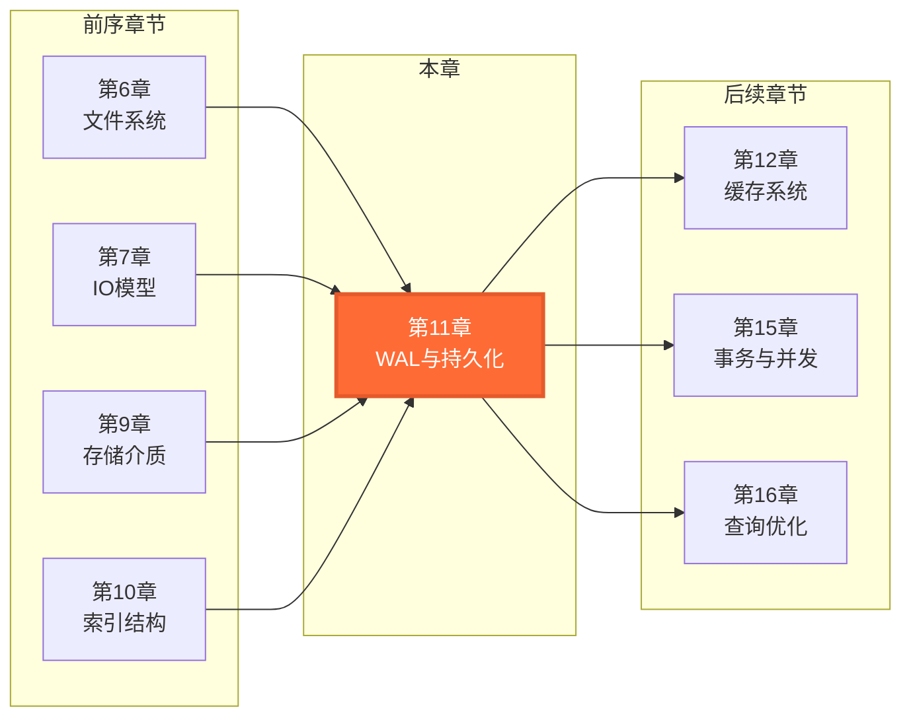
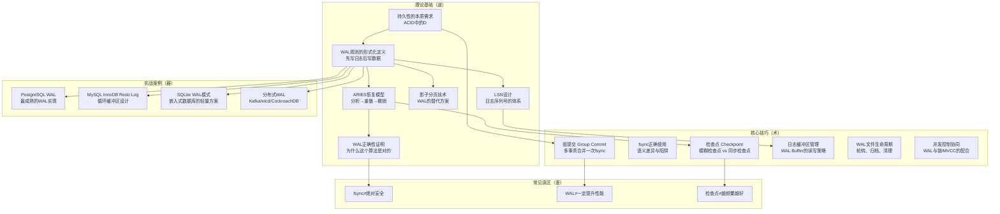

# 第11章 WAL与持久化 — 章节概览

## 为什么这一章重要

想象一个场景：数据库正在处理一笔转账事务——A账户扣款1000元已写入磁盘，B账户加款1000元还在内存缓冲区。此时突然断电。重启后，A的钱没了，B也没收到。1000元凭空消失。

这不是假设。在没有WAL的早期数据库系统中，这类数据丢失是真实存在的风险。Write-Ahead Logging（预写日志）正是为解决"如何在崩溃后保证数据不丢失"这一根本问题而诞生的技术。它是现代所有主流关系型数据库——PostgreSQL、MySQL InnoDB、Oracle、SQL Server——持久性保证的基石。

更深层地说，WAL代表了一种经典的系统设计哲学：**通过增加一次顺序写入（日志），换取随机写入的安全性和性能**。这种"用顺序写保护随机写"的思想不仅限于数据库，在分布式系统（Kafka的Commit Log、etcd的WAL）、文件系统（ext4的journaling）、甚至操作系统虚拟内存（swap的写回策略）中都有体现。

本章将带你从理论到实践，彻底掌握WAL的设计原理、工程实现和调优方法。

## 本章在全书中的位置

WAL与持久化在本书的知识体系中处于承上启下的关键位置：

**WAL与前序章节的关系**：第6章的文件系统知识（inode、page cache、buffered I/O）是理解WAL写入路径的基础；第7章的同步/异步I/O模型解释了fsync/fdatasync的语义差异；第9章的SSD/HDD写入特性决定了WAL的性能特征；第10章的B+树操作（页分裂、页面修改）产生了需要被WAL保护的数据变更。

**WAL与后续章节的关系**：第12章缓存系统中的WAL Buffer是本章日志缓冲区管理的延伸；第15章事务的原子性和持久性保证依赖本章的ARIES恢复模型；第16章查询优化器在评估执行计划时需要考虑WAL写入的开销。

## WAL的技术演进：从1970年代到今天

理解WAL的历史演进，有助于认识每个设计决策背后的时代背景和技术约束：

| 年代 | 里程碑 | 关键创新 | 代表系统 |
|------|--------|---------|---------|
| **1970s** | System R引入日志概念 | IBM System R首次在数据库中使用日志实现原子性 | IBM System R |
| **1978** | 影子分页技术 | 不依赖日志的崩溃恢复方案（后来被WAL超越） | System R（早期） |
| **1981** | ARIES论文前驱 | WAL规则的形式化定义、LSN概念雏形 | 研究原型 |
| **1992** | ARIES恢复模型 | IBM发表完整论文：分析→重做→撤销三阶段恢复 | DB2 |
| **1996** | PostgreSQL引入WAL | 从早期的非WAL方案切换到WAL，奠定现代PG架构 | PostgreSQL 6.x |
| **2000s** | InnoDB成熟 | MySQL的InnoDB引擎以WAL为核心的Redo Log走向成熟 | MySQL 4.x/5.x |
| **2005** | SQLite WAL模式 | SQLite引入WAL模式，突破嵌入式数据库的并发限制 | SQLite 3.7+ |
| **2010s** | 分布式WAL | WAL从单机扩展到分布式，成为共识协议的核心组件 | etcd, Kafka, CockroachDB |
| **2020s** | 硬件感知WAL | 针对NVMe/持久内存优化的WAL设计 | PebbleDB, TiKV |

从这张时间线可以看出：WAL的核心规则（先写日志后写数据）自1970年代以来从未改变，但工程实现方式随着硬件发展和应用场景扩展不断演进。本章不仅会讲清楚这些核心规则，还会覆盖最新的工程优化手段。

## 本章学习目标

完成本章学习后，你将能够：

1. **理解WAL的核心机制**：掌握预写日志的工作原理、LSN的设计逻辑、ARIES恢复模型的三个阶段（分析→重做→撤销），理解为什么这些设计能保证崩溃恢复的正确性
2. **掌握持久化的工程实现**：理解fsync/fdatasync的语义差异与性能特征、组提交（Group Commit）如何将吞吐量提升10-100倍、检查点（Checkpoint）的多种策略及其对恢复时间的影响、日志缓冲区的管理与优化
3. **分析主流数据库的WAL实现**：能够对比PostgreSQL WAL、MySQL InnoDB Redo Log、SQLite WAL模式的设计差异，理解每种实现背后的设计权衡
4. **动手实现简化版WAL**：从零构建一个支持崩溃恢复的WAL引擎，包含日志记录、LSN管理、ARIES恢复流程
5. **诊断持久化相关问题**：能够排查数据丢失、性能瓶颈、一致性异常等生产问题，识别WAL相关的常见误区

## 知识架构总览

## 前置知识

本章内容建立在以下知识基础之上。如果对这些概念不熟悉，建议先回顾对应章节：

| 知识领域 | 具体要求 | 对应章节 | 重要程度 | 不具备的影响 |
|----------|---------|---------|---------|------------|
| 文件系统 | 理解inode、文件写入流程、页缓存（Page Cache） | 第6章 | ★★★ | 无法理解WAL写入路径中page cache与磁盘之间的缓冲层次，以及为什么需要fsync来强制刷盘 |
| I/O模型 | 理解同步/异步I/O、Direct I/O、buffered I/O的区别 | 第7章 | ★★★ | 无法区分fsync/fdatasync/O_DIRECT的语义差异，这是核心技巧模块的基础 |
| 存储介质 | 了解SSD/HDD的写入特性、随机写vs顺序写的性能差异 | 第9章 | ★★☆ | 无法理解WAL"用顺序写保护随机写"这一核心设计哲学的性能优势来源 |
| 索引结构 | 理解B+树的基本操作（插入、删除、分裂） | 第10章 | ★★☆ | 不了解数据页面的修改模式，难以理解为什么WAL需要记录页面级的变更日志 |
| 事务基础 | 了解ACID概念、事务的生命周期 | 第15章 | ★★★ | 不理解"原子性"和"持久性"的含义，无法理解WAL要解决的核心问题 |

> **提示**：即使没有完整的前置知识，也可以先阅读本章的理论基础部分（11.1-11.2），建立WAL的基本概念后再回头补充。但如果你对fsync和page cache完全陌生，建议至少先浏览第6章和第7章的核心概念。

## 学习路径

```mermaid
graph LR
    subgraph "第一阶段：理解原理"
        T1[持久性的本质需求<br/>~30min] --> T2[WAL规则与LSN<br/>~45min]
        T2 --> T3[ARIES恢复模型<br/>~60min]
        T3 --> T4[影子分页对比<br/>~20min]
    end
    
    subgraph "第二阶段：掌握技巧"
        T4 --> T5[组提交<br/>~30min]
        T5 --> T6[fsync与检查点<br/>~45min]
        T6 --> T7[日志缓冲区与<br/>文件管理<br/>~30min]
    end
    
    subgraph "第三阶段：实战分析"
        T7 --> T8[PostgreSQL WAL<br/>~30min]
        T8 --> T9[MySQL Redo Log<br/>~25min]
        T9 --> T10[SQLite WAL +<br/>分布式WAL<br/>~25min]
    end
    
    subgraph "第四阶段：巩固提升"
        T10 --> T11[常见误区<br/>~20min]
        T11 --> T12[动手练习<br/>~4h]
        T12 --> T13[本章小结<br/>~15min]
    end
    
    style T1 fill:#e1f5fe
    style T2 fill:#e1f5fe
    style T3 fill:#e1f5fe
    style T4 fill:#e1f5fe
    style T5 fill:#fff3e0
    style T6 fill:#fff3e0
    style T7 fill:#fff3e0
    style T8 fill:#e8f5e9
    style T9 fill:#e8f5e9
    style T10 fill:#e8f5e9
    style T11 fill:#fce4ec
    style T12 fill:#fce4ec
    style T13 fill:#fce4ec
```

## 预计学习时间

| 内容模块 | 阅读理解 | 动手实践 | 合计 | 难度 |
|---------|---------|---------|------|------|
| **理论基础** | 2.5h | 1h | 3.5h | ★★★★ |
| **核心技巧** | 1.5h | 2h | 3.5h | ★★★☆ |
| **实战案例** | 1h | 2h | 3h | ★★★☆ |
| **常见误区** | 0.5h | 0.5h | 1h | ★★☆☆ |
| **练习方法** | 0.5h | 4h | 4.5h | ★★★★ |
| **本章小结** | 0.5h | — | 0.5h | ★☆☆☆ |
| **总计** | **6.5h** | **9.5h** | **16h** | — |

> **零基础读者**：建议预留20小时，包含补充前置知识的时间。
> **有经验的开发者**：可跳过理论基础中的概念部分，重点关注ARIES模型和工程实现，预计8-10小时。

## 难点预警与攻克策略

本章有几个公认的学习难点，提前了解有助于合理分配精力：

### 难点一：ARIES三阶段恢复模型（理论基础 11.3）

**为什么难**：ARIES的分析→重做→撤销三阶段涉及多个交互变量——LSN、pageLSN、recLSN、CLR、Undo链——需要同时理解它们各自的含义和协作关系。初学者最常见的困惑是"为什么Redo要在Undo之前"以及"CLR为什么只记Redo不记Undo"。

**攻克策略**：先不追求细节，用一个3条日志的小例子手动画出三阶段的执行过程。画清楚后再回头看形式化定义，会豁然开朗。本节的代码示例就是为这个目的设计的。

### 难点二：组提交的实现机制（核心技巧 11.1）

**为什么难**：组提交涉及多线程协作——Leader-Follower模式、等待队列管理、信号量/条件变量的使用——这些并发编程概念对不熟悉多线程的读者构成门槛。

**攻克策略**：先理解"为什么需要组提交"（单次fsync的开销），再理解"组提交的核心思想"（把多次fsync合并为一次），最后看代码实现。不要试图一次理解所有代码，先抓住主流程。

### 难点三：fsync/fdatasync/O_DIRECT的语义区分（核心技巧 11.2）

**为什么难**：这三个概念都与"确保数据写入磁盘"相关，但语义微妙——fsync刷数据+元数据、fdatasync只刷数据、O_DIRECT绕过page cache。它们在不同硬件和OS上的行为还有差异。

**攻克策略**：用表格对比三者的输入/输出/性能特征，建立清晰的区分框架。生产环境中最常见的错误是"用了O_DIRECT就以为不需要fsync"，理解了每个概念的职责边界就不会犯这个错。

### 难点四：PostgreSQL WAL与MySQL Redo Log的设计对比（实战案例 11.1-11.2）

**为什么难**：两者的WAL规则相同，但工程实现差异巨大——追加写入vs循环写入、段文件vs固定文件组、Full Page Writevs Doublewrite Buffer。初学者容易混淆"相同的规则"和"不同的实现"。

**攻克策略**：先确认两者都遵循相同的WAL规则（日志先于数据），然后用对比表逐维度比较实现差异。重点关注每种实现应对的约束条件不同——PostgreSQL要支持PITR和逻辑复制，MySQL要追求高并发OLTP下的写入效率。

## 核心问题清单

在学习本章之前，带着以下问题阅读效果更佳。每个问题都对应本章的一个核心知识点：

### 基础问题（入门）

1. **为什么不能直接写数据文件，而要先写日志？** 直接写不是更简单吗？
   - *提示：思考磁盘写入的两种模式——顺序写与随机写的性能差异*

2. **LSN（日志序列号）是什么？** 它如何保证日志的有序性和可恢复性？
   - *提示：LSN通常就是日志文件中的字节偏移量，单调递增*

3. **什么是检查点？** 为什么不能只靠日志来恢复？
   - *提示：日志会无限增长，恢复时间与日志量成正比*

### 进阶问题（理解）

4. **组提交（Group Commit）为什么能大幅提高吞吐量？** 它的收益上限在哪里？
   - *提示：单次fsync的开销是固定的，把多个事务的日志合并后一次fsync，吞吐量近似线性提升*

5. **fsync的代价有多大？** fdatasync和fsync有什么区别？O_DIRECT又是什么？
   - *提示：fsync需要等待数据从page cache刷到磁盘，包括元数据；fdatasync跳过元数据；O_DIRECT绕过page cache*

6. **PostgreSQL WAL和MySQL Redo Log在设计哲学上有何根本区别？** 各有什么优劣？
   - *提示：追加写入 vs 循环写入，前者支持PITR和归档，后者空间管理更简单*

### 深度问题（精通）

7. **ARIES恢复模型的三个阶段分别解决什么问题？** 为什么顺序是分析→重做→撤销？
   - *提示：分析确定崩溃时的状态，重做确保不丢已修改，撤销保证未提交事务的原子性*

8. **影子分页（Shadow Paging）是WAL的替代方案，为什么现代数据库几乎都选择WAL？**
   - *提示：从空间开销、恢复速度、并发支持、实现复杂度四个维度对比*

9. **在分布式系统中（如Kafka、etcd），WAL的角色发生了什么变化？**
   - *提示：从单机持久化保障演变为跨节点一致性基石，与共识协议深度绑定*

## 章节文件导航

本章内容分为三大模块，外加误区总结、练习和小结：

### 理论基础模块

| 文件 | 核心内容 | 关键概念 |
|------|---------|---------|
| `理论基础/01-持久性的本质需求` | 为什么需要持久化，ACID中D的含义 | 持久性、崩溃恢复、数据安全 |
| `理论基础/02-WAL规则的形式化定义` | WAL的两条核心规则及其证明 | 先写日志、日志优先于数据 |
| `理论基础/03-ARIES恢复模型` | 分析→重做→撤销三阶段恢复 | Analysis、Redo、Undo、CLR |
| `理论基础/04-影子分页技术` | WAL的替代方案及其局限 | Shadow Paging、Copy-on-Write |
| `理论基础/05-WAL的正确性证明` | 为什么WAL能保证恢复的正确性 | 形式化证明、不变量 |
| `理论基础/06-日志序列号LSN的设计` | LSN的体系结构与作用 | LSN、page_lsn、rec_lsn、Prev_LSN |

### 核心技巧模块

| 文件 | 核心内容 | 关键概念 |
|------|---------|---------|
| `核心技巧/01-组提交Group Commit` | 多事务合并fsync的实现 | Leader-Follower、等待队列、吞吐量 |
| `核心技巧/02-fsync的正确使用` | fsync/fdatasync/O_DIRECT的语义 | POSIX语义、磁盘缓存、写屏障 |
| `核心技巧/03-检查点Checkpoint` | 模糊检查点、增量检查点策略 | checkpoint_lsn、脏页刷盘、恢复时间 |
| `核心技巧/04-日志缓冲区管理` | WAL Buffer的设计与优化 | 双缓冲、WAL Writer、写入策略 |
| `核心技巧/05-WAL文件的生命周期管理` | 文件轮转、归档、清理 | 段文件、归档、PITR |
| `核心技巧/06-并发控制与日志的协同` | WAL与MVCC/锁的配合 | redo/undo日志、隔离级别 |

### 实战案例模块

| 文件 | 核心内容 | 关键概念 |
|------|---------|---------|
| `实战案例/01-PostgreSQL的WAL架构详解` | PG WAL的完整架构与配置 | wal_level、同步提交、流复制 |
| `实战案例/02-MySQL InnoDB的Redo Log` | InnoDB Redo Log的设计与优化 | 循环缓冲区、MTR、Doublewrite |
| `实战案例/03-SQLite的WAL模式` | SQLite WAL模式的原理与使用 | journal_mode、读写并发、检查点 |
| `实战案例/04-分布式系统中的WAL应用` | Kafka/etcd/CockroachDB中的WAL | Commit Log、Raft Log、WAL Shipping |

### 辅助模块

| 文件 | 核心内容 |
|------|---------|
| `04-常见误区.md` | 6个关于WAL和持久化的常见错误认知与纠正方法 |
| `05-练习方法.md` | 4个循序渐进的实践练习：实现简化WAL、分析PG WAL、fsync基准测试、SQLite WAL对比 |
| `06-本章小结.md` | 核心知识点回顾、公式模型总结、进一步学习建议 |

## 适合谁读

| 读者类型 | 建议阅读方式 | 预期收获 |
|---------|------------|---------|
| 数据库初学者 | 按顺序完整阅读，重点理解理论基础 | 建立WAL的完整知识框架，理解"为什么数据库断电后不丢数据" |
| 后端开发工程师 | 快速过理论，重点看核心技巧和实战案例 | 掌握数据库持久化的调优方法，能排查WAL相关的生产问题 |
| DBA/运维工程师 | 重点关注实战案例和常见误区 | 掌握WAL相关的生产问题诊断、参数调优、空间管理 |
| 存储系统开发者 | 理论+技巧全部精读，实现练习必做 | 能够设计和实现自己的WAL系统，理解正确性证明 |
| 系统架构师 | 浏览全章，重点关注设计权衡和分布式WAL | 理解不同WAL方案的适用场景，在架构选型中做出正确决策 |

## 学完能做什么

完成本章后，你将具备以下实际能力：

### 场景一：解释数据库的持久性保证

当团队成员问"为什么PostgreSQL在断电后不会丢失已提交的数据"时，你能够从WAL规则、fsync语义、检查点机制三个层面给出完整的技术解释，而不是简单地说"因为数据库有日志"。

### 场景二：优化WAL参数提升写入性能

当写入密集型应用遇到瓶颈时，你能够：
- 计算组提交的等待时间窗口，平衡延迟与吞吐量
- 调整 `wal_buffers` 和 `checkpoint_timeout`，减少WAL写入频率
- 根据业务的持久性需求选择合适的 `synchronous_commit` 级别
- 在MySQL中调整 `innodb_log_file_size` 和 `innodb_flush_log_at_trx_commit`

### 场景三：诊断持久化相关生产问题

当出现以下问题时，你能够快速定位根因并给出解决方案：
- **"WAL文件占用过多磁盘空间"**：判断是归档未清理、检查点不频繁还是长事务阻止回收
- **"检查点导致I/O尖峰"**：通过调整 `checkpoint_completion_target` 平滑检查点写入
- **"组提交延迟过高"**：分析事务到达频率与fsync开销的关系
- **"数据库恢复时间过长"**：优化检查点策略，减少需要重放的日志量

### 场景四：技术选型与架构决策

在选择数据库或存储方案时，你能够基于WAL特性做出有据可依的判断：
- PostgreSQL的WAL支持PITR和逻辑复制，适合需要数据回溯和CDC的场景
- MySQL InnoDB的循环Redo Log在纯OLTP高并发写入下更高效
- SQLite的WAL模式适合嵌入式和移动端，支持读写并发但无复制能力
- 分布式WAL（Raft Log）适合需要跨节点一致性的高可用系统

### 场景五：动手实现简化WAL引擎

通过练习1，你将能够从零构建一个包含以下组件的简化WAL引擎：
- 日志记录的序列化与反序列化
- LSN的生成与管理
- 检查点的写入与恢复
- ARIES三阶段恢复流程（分析→重做→撤销）
- 补偿日志（CLR）的正确使用

## 自检清单

学完本章后，逐项核对。每项都能自信回答"是"，说明本章知识已内化：

- [ ] 我能解释为什么WAL规则1（日志先于数据写入）能保证原子性
- [ ] 我能解释为什么WAL规则2（提交前日志必须刷盘）能保证持久性
- [ ] 我能画出ARIES恢复模型三阶段的执行流程图
- [ ] 我能区分fsync、fdatasync、O_DIRECT的语义差异和适用场景
- [ ] 我能解释组提交的工作原理，并说明其吞吐量的理论上限
- [ ] 我能对比PostgreSQL WAL和MySQL Redo Log的设计差异及各自优劣
- [ ] 我能描述检查点的作用，以及为什么"检查点越频繁越好"是错误的
- [ ] 我能说明LSN在恢复过程中如何判断一个日志记录是否需要重做
- [ ] 我能解释CLR（补偿日志）为什么只记Redo不记Undo
- [ ] 我能说出分布式WAL（如Raft Log）与单机WAL的关键区别
