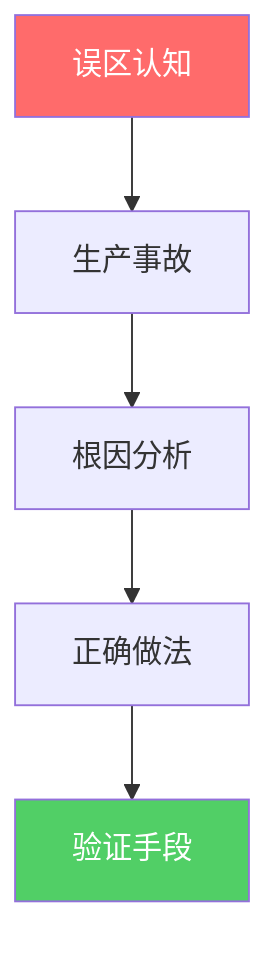
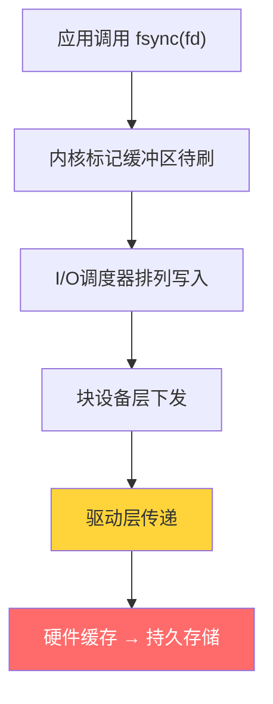
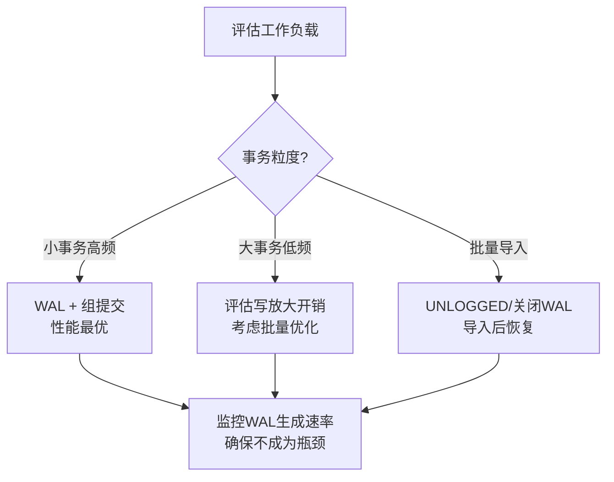
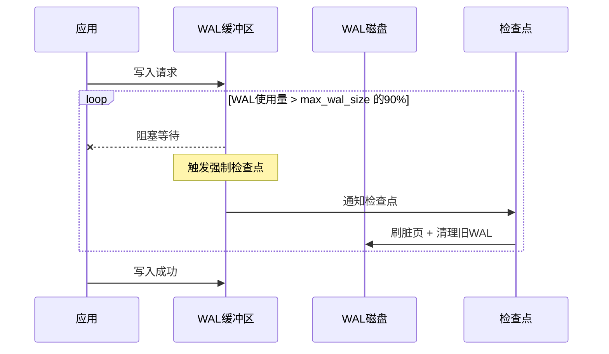
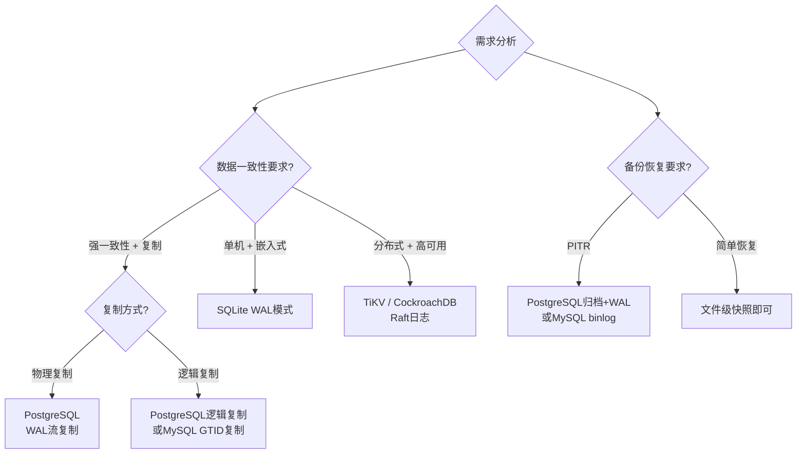

# 第11章 WAL与持久化 — 常见误区

在前面的小节中，我们从理论到实践系统地学习了WAL的设计原理、组提交优化、fsync的正确使用、检查点策略和日志缓冲区管理。理论和技巧掌握之后，真正考验功力的是在生产环境中避开那些看似合理、实则致命的认知陷阱。

本节列举WAL与持久化领域**最常犯的八个误区**——它们不是初学者的低级错误，而是资深工程师也会踩的坑。每个误区都配有真实生产事故案例、深层原因分析和经过验证的正确做法。



---

## 误区1：fsync调用后数据就绝对安全了

### 错误认知

"只要在写入后调用了fsync，数据就已经持久化到磁盘，断电也不会丢失。"

这是WAL领域流传最广的误解。许多开发者在实现自定义WAL时，第一反应就是"写完日志后调一次fsync"，然后就放心地返回成功。但fsync的语义远没有这么简单——它是一个依赖于硬件、文件系统和操作系统内核实现的软语义，不是硬件层面的原子承诺。

### 真实案例

2008年，PostgreSQL社区发现了一个影响数据完整性的严重问题：某些廉价SSD控制器在收到fsync调用后会返回"成功"，但数据实际上只写入了SSD内部的DRAM缓存，并未持久化到NAND闪存。断电后这些数据彻底丢失。这就是臭名昭著的"假fsync"问题。PostgreSQL 8.3被迫在Linux上禁用了O_DIRECT，因为O_DIRECT配合这些有问题的SSD会绕过页缓存直接写入，而写入本身可能是假的。

更隐蔽的场景发生在文件系统层面。ext4在`data=ordered`模式（Linux默认模式）下，fsync只保证数据在元数据提交**之前**写入磁盘，但并不保证数据写入的具体顺序。如果两次fsync之间存在数据依赖（例如先写日志头，再写日志体），崩溃恢复后可能出现日志头指向一个尚未写入的日志体。

### 深层原因

fsync到底承诺了什么？需要分层理解：



从上图可以看到，从应用调用fsync到数据真正落入持久化存储，中间经历了至少五个层次。任何一层都可能出问题：

| 层次 | 可能的故障 | 影响 |
|------|-----------|------|
| 内核页缓存 | 脏页标记但未实际下发 | 数据留在内存，断电丢失 |
| I/O调度器 | 合并写入导致顺序打乱 | WAL头尾不一致 |
| 块设备层 | 掉电导致写入不完整 | 部分写入（torn write） |
| SSD固件 | 写缓存未刷入NAND | 数据停留在DRAM |
| 磨损均衡 | 擦除块操作被中断 | 数据损坏 |

### 正确做法

**第一层：正确的系统调用选择**

```python
import os

def safe_write(file_path, data):
    """真正安全的写入方式——三层防护"""
    # 1. 打开文件时使用O_DSYNC，确保每次write都同步到介质
    fd = os.open(file_path,
                 os.O_WRONLY | os.O_CREAT | os.O_DSYNC, 0o644)
    
    # 2. 写入数据
    os.write(fd, data)
    
    # 3. 再次fsync（O_DSYNC保证写入同步，fsync保证元数据同步）
    os.fsync(fd)
    os.close(fd)
    
    # 4. 同步目录元数据（确保文件名和inode的映射持久化）
    #    这一步经常被遗漏，但对新创建的文件至关重要
    dir_fd = os.open(os.path.dirname(file_path), os.O_RDONLY)
    os.fsync(dir_fd)
    os.close(dir_fd)
```

**第二层：验证fsync的真实行为**

不要信任fsync的返回值，用工具验证它是否真的工作：

```bash
# 方法1：使用fio测试fsync的实际延迟和吞吐量
fio --name=fsync_verify --ioengine=sync --fsync=1 \
    --bs=4k --size=256M --numjobs=4 --rw=randwrite \
    --group_reporting --output=fsync_result.json

# 方法2：使用blktrace追踪块设备层面的写入行为
blktrace -d /dev/sda -o - | blkparse -i -
# 观察fsync调用后是否真的有flush命令下发到块设备

# 方法3：使用powercut测试（最可靠但成本最高）
# 在fsync后立即拔电源，检查数据是否存活
# 这是PostgreSQL社区验证fsync正确性的标准方法
```

**第三层：应用层双写校验**

对于极端重要的数据（如金融交易日志），在WAL之外维护一份校验：

```python
import hashlib, json

def write_with_checksum(log_file, record):
    """写入带校验和的WAL记录"""
    record_bytes = json.dumps(record, ensure_ascii=False).encode()
    checksum = hashlib.sha256(record_bytes).hexdigest()
    
    # 写入记录
    log_file.write(record_bytes)
    log_file.write(b'\n')
    
    # 写入校验和
    log_file.write(f"CHECKSUM:{checksum}\n".encode())
    
    # fsync
    os.fsync(log_file.fileno())
    
    return checksum

def verify_log(log_file):
    """恢复时校验每条记录的完整性"""
    for line in log_file:
        line = line.strip()
        if line.startswith(b"CHECKSUM:"):
            expected = line[10:].decode()
            # 对比校验和，检测部分写入
            ...
```

**关键结论**：fsync不是"调了就安全"的银弹。真正的数据安全需要：正确的系统调用组合 + 硬件层面的验证 + 应用层的校验机制。参考本章第11.2节"fsync的正确使用"获取完整的跨平台行为对比。

---

## 误区2：WAL一定能提高写入性能

### 错误认知

"WAL将随机写转为顺序写，所以使用WAL后写入性能一定会提升。"

这个说法只在特定条件下成立。WAL引入的本质是一个**写放大**（Write Amplification）机制：每笔写入既要写日志，又要写数据页面。WAL的性能优势来自于"将多次随机小写合并为一次顺序大写"，但如果这个合并条件不成立，WAL反而会成为性能负担。

### 性能影响模型

WAL的净性能收益可以用以下公式理解：

净收益 = 顺序写入的吞吐提升 - WAL本身的写放大开销

| 工作负载类型 | WAL收益 | 原因 |
|-------------|---------|------|
| 大量小事务（OLTP） | 高（10-100x） | 组提交将多次fsync合并，随机→顺序收益最大 |
| 少量大事务 | 低甚至负 | 每个事务写日志+写数据=两倍写入量 |
| 批量导入（ETL） | 负 | WAL日志量与数据量成正比，总I/O翻倍 |
| 混合读写 | 中等 | 取决于写入占比和事务粒度 |
| 读密集型 | 低 | WAL对读性能无直接帮助 |

### 真实案例

某数据分析平台使用PostgreSQL存储时序数据，每日执行一次全量数据刷新——先DELETE旧数据再INSERT新数据，单次事务涉及5000万行。DBA发现刷新耗时比预期慢了一倍，排查后发现：WAL在该事务期间产生了约120GB的日志文件（因为每次INSERT都要写WAL），这些日志写入本身消耗了大量的I/O带宽。

### 正确做法

**策略1：大批量操作时优化WAL使用**

```sql
-- PostgreSQL：使用COPY替代逐行INSERT
-- COPY是批量操作，WAL记录更紧凑
COPY my_table FROM '/path/to/data.csv' WITH (FORMAT csv);

-- 对于非关键数据表，使用UNLOGGED（崩溃后数据丢失）
ALTER TABLE staging_table SET UNLOGGED;
-- 执行大批量导入
INSERT INTO staging_table SELECT * FROM source_table;
-- 完成后重建为LOGGED表
ALTER TABLE staging_table SET LOGGED;

-- MySQL：关闭自动提交 + 批量优化
SET autocommit = 0;
SET unique_checks = 0;
SET foreign_key_checks = 0;
SET sql_log_bin = 0;  -- 如果不需要binlog复制
LOAD DATA INFILE '/path/to/data.csv' INTO TABLE mytable;
SET unique_checks = 1;
SET foreign_key_checks = 1;
SET sql_log_bin = 1;
COMMIT;
```

**策略2：根据工作负载选择WAL模式**



**策略3：监控WAL写入的实际开销**

```sql
-- PostgreSQL：查看WAL写入统计
SELECT 
    wal_records,
    wal_fpi,          -- full page images（首次修改页面的完整镜像）
    wal_bytes,
    wal_buffers_full,
    wal_write,
    wal_sync,
    wal_write_time,
    wal_sync_time
FROM pg_stat_wal;

-- 如果wal_bytes远大于实际数据修改量，说明WAL写放大严重
-- 此时应评估是否需要优化批量操作策略
```

---

## 误区3：检查点越频繁越好

### 错误认知

"检查点越频繁，恢复时需要重放的WAL越少，恢复时间越短，所以系统越安全。"

这个推理逻辑本身没有错——更频繁的检查点确实能缩短恢复时间。但它忽略了一个关键问题：**检查点是有成本的**，而且这个成本可能远超你的预期。

### 检查点的真实代价

检查点的核心操作是将缓冲池中的脏页面写入磁盘。这个过程带来的代价包括：

**I/O带宽争用**：检查点写入和前台查询写入共享同一块磁盘的I/O带宽。在HDD上，这种争用尤为严重——磁盘的顺序写入带宽可能被检查点独占数十秒，导致前台查询的写入延迟飙升。即使在SSD上，过高的I/O压力也会触发内部的垃圾回收（GC），间接影响性能。

**WAL放大**：PostgreSQL的检查点会触发"full page image"写入——在检查点后第一次修改某个页面时，WAL中会记录该页面的完整镜像（而不仅仅是修改的增量）。如果检查点过于频繁，大量页面在检查点后被修改，WAL中的full page image会急剧增加。

**内存压力**：检查点需要扫描整个缓冲池来识别脏页面，这会消耗CPU缓存（cache pollution），导致前台查询的缓存命中率下降。

### 真实案例

某游戏公司的主数据库PostgreSQL 14，DBA将`checkpoint_timeout`设为5分钟（默认15分钟），`max_wal_size`设为1GB（默认1GB）。结果发现：

- 每5分钟一次检查点，每次持续8-12秒
- 检查点期间，应用的P99延迟从10ms飙升到200ms
- 每天约3000次检查点，占用了总I/O带宽的约15%
- full page image导致WAL体积比实际数据修改量大了约3倍

### 正确做法

**核心原则：让检查点"渐进式"地平滑执行**

```sql
-- PostgreSQL：使用渐进式检查点
-- checkpoint_completion_target = 0.9 表示在两次检查点之间
-- 尽可能均匀地分摊刷盘工作
ALTER SYSTEM SET checkpoint_completion_target = 0.9;  -- 0.0~1.0，默认0.9
ALTER SYSTEM SET checkpoint_timeout = '15min';       -- 默认15min，适当延长
ALTER SYSTEM SET max_wal_size = '4GB';               -- 允许更多WAL积累
ALTER SYSTEM SET min_wal_size = '1GB';               -- 保证最低WAL空间
```

**监控检查点效率**

```sql
-- 核心监控查询
SELECT 
    checkpoints_timed,                -- 定时触发的检查点数
    checkpoints_req,                  -- 被迫触发的检查点数（WAL满了）
    buffers_checkpoint,               -- 检查点写入的缓冲区数
    buffers_backend,                  -- 后台写入的缓冲区数（检查点来不及时）
    checkpoint_write_time,            -- 检查点写入耗时（毫秒）
    checkpoint_sync_time,             -- 检查点同步耗时（毫秒）
    buffers_backend_checkpoint        -- 因检查点导致的后台写入
FROM pg_stat_bgwriter;

-- 健康指标：
-- 1. checkpoints_req 应远小于 checkpoints_timed
--    如果 req 频繁，说明 max_wal_size 太小
-- 2. buffers_backend 应为0或接近0
--    如果 backend 很高，说明后台写入跟不上
-- 3. checkpoint_sync_time 应 < 1000ms
--    如果很高，说明 fsync 有瓶颈
```

**MySQL InnoDB的检查点调优**

```sql
-- InnoDB的检查点更自动化，但仍需关注
SHOW ENGINE INNODB STATUS\G
-- 关注 LOG 部分：
-- Log sequence number：当前LSN
-- Last checkpoint at：上次检查点LSN
-- 两者差值越大，恢复时间越长

-- 调整redo log大小（影响检查点频率）
SET GLOBAL innodb_log_file_size = 2G;      -- 默认48MB太小
SET GLOBAL innodb_log_files_in_group = 2;  -- 总共4GB
```

**正确的平衡策略**：检查点频率不是越快越好，也不是越慢越好。目标是让`checkpoints_req`接近0（WAL不会写满触发强制检查点），同时让检查点的I/O对前台查询的影响最小。具体参数需要根据磁盘I/O能力和业务写入量进行基准测试调优。

---

## 误区4：WAL日志写满就是系统故障

### 错误认知

"当WAL日志写满、数据库开始拒绝写入时，说明系统出了故障，需要紧急处理。"

实际上，WAL日志写满在某些场景下是**正常行为**，而非故障。区分两者的关键在于理解WAL的流量控制机制。

### WAL写满的两种场景

**正常场景（无需恐慌）**

1. **大批量事务执行中**：一个涉及数百万行的UPDATE事务正在执行，期间产生的WAL量超过了`max_wal_size`。这是正常的——事务太大，检查点来不及清理。事务提交后，检查点完成，WAL空间自然释放。

2. **归档延迟**：启用了WAL归档后，如果归档目标（如S3、NFS）暂时变慢，归档槽（replication slot）会阻止旧WAL被清理。此时日志空间会持续增长直到写满。

3. **复制从库延迟**：主库的WAL保留策略要求等待从库消费。如果从库严重滞后（如网络故障或从库负载过高），主库的WAL无法清理，最终可能写满。

**异常场景（需要处理）**

1. **检查点进程卡住**：检查点进程因为I/O错误（坏盘、文件系统损坏）无法完成，导致旧WAL无法回收。

2. **磁盘空间不足**：WAL所在分区的磁盘空间确实耗尽，不是WAL写满，而是物理空间没了。

3. **进程死锁或Bug**：WAL清理需要协调多个进程（checkpoint、walwriter、archiver），如果出现死锁或进程崩溃，WAL可能无法正常回收。

### 流量控制机制



当WAL使用量接近`max_wal_size`时，数据库会启动流量控制——**阻塞新的写入请求**，强制等待检查点完成后释放WAL空间。这正是导致应用层出现超时或卡顿的根本原因。

### 正确做法

**1. 区分正常和异常**

```sql
-- PostgreSQL：检查WAL堆积的原因
-- 查询1：WAL使用量
SELECT 
    pg_wal_lsn_diff(pg_current_wal_lsn(), pg_control_checkpoint()) / 1024 / 1024 
    AS wal_usage_mb;

-- 查询2：检查点是否被强制触发
SELECT 
    checkpoints_timed,
    checkpoints_req,
    CASE 
        WHEN checkpoints_req > checkpoints_timed * 0.1 
        THEN 'WARNING: 频繁强制检查点'
        ELSE 'OK'
    END AS status
FROM pg_stat_bgwriter;

-- 查询3：是否有复制槽阻止WAL清理
SELECT 
    slot_name, 
    active,
    pg_wal_lsn_diff(pg_current_wal_lsn(), restart_lsn) / 1024 / 1024 
    AS retained_wal_mb
FROM pg_replication_slots;

-- 查询4：归档状态
SELECT * FROM pg_stat_archiver;
-- 查看 last_failed_time 和 last_archived_time 的差异
```

**2. 设置分级告警**

```yaml
# 告警策略示例
alerts:
  - name: WAL使用率告警
    condition: wal_usage_mb > max_wal_size_mb * 0.7
    severity: warning
    message: "WAL使用率达到70%，可能触发流量控制"
    
  - name: WAL使用率紧急告警
    condition: wal_usage_mb > max_wal_size_mb * 0.9
    severity: critical
    message: "WAL使用率达到90%，即将阻塞写入！"
    
  - name: 复制槽WAL堆积告警
    condition: retained_wal_mb > 1000
    severity: warning
    message: "复制槽保留超过1GB WAL，检查从库状态"
```

**3. MySQL InnoDB的应对**

```sql
-- MySQL：检查redo log状态
SHOW ENGINE INNODB STATUS\G
-- 关注 LOG 部分：
--   Log sequence number：当前写入位置
--   Last checkpoint at：上次检查点位置
--   差值 > redo log总大小的75% 时需要关注

-- InnoDB的自适应刷新
SET GLOBAL innodb_adaptive_flushing = ON;  -- 自动调节刷脏速度
SET GLOBAL innodb_max_dirty_pages_pct = 75;  -- 脏页比例阈值
```

---

## 误区5：所有数据库的WAL实现都一样

### 错误认知

"WAL是标准技术，所有关系型数据库的实现应该差不多，学一种就够了。"

WAL确实是一种通用的设计思想——"先写日志，后写数据"——但不同数据库在具体实现上差异巨大。这些差异直接决定了你在调优、备份、复制和故障恢复时的策略选择。

### 核心实现差异对比

| 特性 | PostgreSQL WAL | MySQL InnoDB Redo Log | SQLite WAL | TiKV Raft Log |
|------|---------------|----------------------|------------|---------------|
| **日志格式** | 物理+逻辑混合 | 物理（页面级） | 物理（页面级） | 逻辑（命令级） |
| **文件管理** | 独立目录，连续编号 | 固定大小循环写入 | 单文件(WAL) | 随RocksDB存储 |
| **检查点** | 独立进程(bgwriter) | 内建在主线程中 | 简单的页面回写 | 由Raft状态机驱动 |
| **复制支持** | 物理复制+逻辑复制 | binlog物理/逻辑复制 | 不支持 | Raft多数派复制 |
| **PITR支持** | 原生支持 | 需要binlog配合 | 不支持 | 依赖快照 |
| **并发模型** | WAL Insert Lock | Mini-transaction锁 | WAL模式读写并发 | 无锁（MVCC） |
| **空间回收** | 归档+删除 | 自动轮转覆盖 | 检查点时截断/删除 | Compaction时清理 |

### 关键设计差异详解

**PostgreSQL WAL的Full Page Image**

PostgreSQL在检查点之后第一次修改某个数据页面时，WAL中会记录该页面的**完整镜像**（Full Page Image，FPI），而非仅记录修改增量。这是为了防止"部分页面写入"（torn page）——操作系统以4KB为单位写入，但数据库页面可能是8KB或16KB，断电可能导致一个页面只写了一半。有了FPI，恢复时可以用完整的页面覆盖那个只写了一半的坏页面。

代价是WAL体积增大——在写入密集型负载下，WAL可能比实际数据修改量大3-5倍。

**MySQL InnoDB的Doublewrite Buffer**

InnoDB采用了不同的策略来应对torn page问题：它在写入数据页面之前，先将页面写入一个连续的doublewrite buffer区域（128个页面，2MB），然后再写入实际位置。如果崩溃发生在写入过程中，恢复时可以从doublewrite buffer中找到完整的页面副本。

这个策略的代价是额外的2MB写入，但避免了PostgreSQL那样在WAL中存储完整页面。

**SQLite WAL的简化设计**

SQLite的WAL设计最为简洁——一个单独的WAL文件，记录所有修改。检查点时将WAL中的页面写回主数据库文件。WAL模式支持读写并发（读者不阻塞写者，写者不阻塞读者），但不支持远程复制。适合嵌入式场景，不适合分布式部署。

### 正确做法

根据需求选择数据库和WAL配置策略：



在实际项目中，这些差异的影响远比理论对比更具体。例如，如果你从MySQL迁移到PostgreSQL，不能简单地认为"WAL就是redo log换了个名字"——两者的调优参数、监控指标、备份方式和故障恢复流程都完全不同。

---

## 误区6：WAL日志可以随意删除

### 错误认知

"磁盘空间不足时，直接删除旧的WAL日志文件就能释放空间。"

这可能是所有误区中后果最严重的一个。随意删除WAL文件会导致**数据丢失**或**数据库无法启动**，而且在很多情况下，这些损失是不可逆的。

### 删除WAL的后果矩阵

| 数据库 | 删除未归档WAL | 删除正在使用WAL | 删除归档WAL |
|--------|-------------|----------------|-------------|
| **PostgreSQL** | PITR失败，无法恢复到删除点之前的状态 | 数据库无法启动，报"WAL file removed"错误 | 归档恢复不完整 |
| **MySQL** | binlog断裂，从库无法同步 | InnoDB检测到redo log不匹配，拒绝启动 | 复制中断 |
| **SQLite** | — | WAL中的未检查点数据永久丢失 | — |

### 真实案例

某运维工程师在凌晨值班时收到磁盘空间告警——PostgreSQL的WAL目录占用了200GB，磁盘仅剩5GB。他执行了以下命令清理了大部分旧WAL文件：

```bash
# 极其危险的操作！
cd /var/lib/postgresql/15/main/pg_wal
ls -lt | tail -50 | xargs rm  # 删除了50个旧WAL文件
```

结果：
- 主库因缺少归档WAL无法完成归档，归档进程持续报错
- 从库正在使用被删除的WAL进行流复制，复制中断
- DBA不得不从3天前的基础备份恢复，丢失了3天的数据
- 恢复过程中业务停机超过6小时

### 正确做法

**PostgreSQL：安全清理WAL的标准流程**

```sql
-- 步骤1：确认哪些WAL可以安全删除
-- 检查归档进度
SELECT 
    archived_count,
    failed_count,
    last_archived_wal,
    last_failed_wal,
    last_archived_time
FROM pg_stat_archiver;

-- 步骤2：检查复制槽保留的最小WAL位置
SELECT 
    slot_name,
    active,
    restart_lsn,
    pg_wal_lsn_diff(pg_current_wal_lsn(), restart_lsn) / 1024 / 1024 
    AS retained_mb
FROM pg_replication_slots;

-- 步骤3：如果确认某个复制槽不再需要，安全删除
SELECT pg_drop_replication_slot('inactive_slot_name');

-- 步骤4：使用pg_archivecleanup安全清理归档目录
-- 这个命令会找出所有活跃WAL的最小LSN，只删除在此之前的归档
pg_archivecleanup /path/to/archive \
    $(SELECT pg_walfile_name(restart_lsn) 
     FROM pg_replication_slots 
     WHERE active = true 
     ORDER BY restart_lsn ASC 
     LIMIT 1);

-- 步骤5：调整WAL保留策略（防止再次写满）
ALTER SYSTEM SET wal_keep_size = '2GB';  -- 至少保留2GB
ALTER SYSTEM SET max_wal_size = '8GB';   -- 给WAL更多空间
SELECT pg_reload_conf();
```

**SQLite：安全清理WAL**

```sql
-- SQLite的WAL清理相对简单
-- TRUNCATE模式：检查点完成后截断WAL文件
PRAGMA wal_checkpoint(TRUNCATE);

-- PASSIVE模式：尽量检查点，但不阻塞写入
PRAGMA wal_checkpoint(PASSIVE);

-- 完全关闭WAL模式（慎用：会阻塞所有并发）
PRAGMA wal_checkpoint(RESTART);
```

**核心原则**：永远不要手动删除WAL文件。如果磁盘空间不足，正确的处理顺序是：(1) 检查复制槽是否有不活跃的需要清理；(2) 检查归档目标是否正常；(3) 调整WAL保留参数；(4) 如果仍然不够，考虑扩展磁盘空间。

---

## 误区7：WAL只保护写入，与读取无关

### 错误认知

"WAL是为写入持久化设计的，只影响写入性能和安全性，读取操作不需要关心WAL。"

这种认知忽略了WAL与并发控制的紧密耦合关系。在MVCC（多版本并发控制）实现中，WAL不仅保护写入，还间接影响读取的一致性和性能。

### WAL如何影响读取

**1. WAL缓冲区争用**

PostgreSQL中，WAL写入需要获取`WALInsertLock`。在高写入负载下，大量会话竞争这个锁，不仅影响写入吞吐，还会间接影响读取——因为某些需要更新hint bit的读操作也需要获取轻量级锁。

**2. 脏页驱逐与读放大**

如果WAL写入过慢（例如fsync延迟高），检查点会被延迟，导致缓冲池中的脏页积压。脏页占用的缓冲池空间无法被替换给新读取的数据页，读取操作不得不从磁盘加载数据——这就是"读放大"。

**3. 一致性快照的代价**

MVCC读取需要看到数据的一致性快照。在PostgreSQL中，长事务会阻止旧版本数据被清理（因为清理需要重写WAL），导致表膨胀，进而影响所有读取查询的性能。

```sql
-- PostgreSQL：检查长事务是否在阻碍清理
SELECT 
    pid,
    now() - xact_start AS transaction_duration,
    state,
    query
FROM pg_stat_activity
WHERE state != 'idle'
  AND xact_start < now() - interval '5 minutes'
ORDER BY transaction_duration DESC;

-- 长事务的连锁反应：
-- 长事务 → 无法清理旧版本 → 表膨胀 → 缓冲池效率下降 → 读取变慢
```

### 正确做法

```sql
-- PostgreSQL：避免长事务影响读取性能
-- 设置语句超时
ALTER SYSTEM SET statement_timeout = '30s';
-- 设置空闲事务超时
ALTER SYSTEM SET idle_in_transaction_session_timeout = '60s';

-- MySQL InnoDB：MVCC与undo log的关系
-- 长事务会导致undo log无法清理
-- 进而影响所有使用该快照的读取操作
SHOW ENGINE INNODB STATUS\G
-- 关注 TRANSACTIONS 部分的 "Trx id counter" 和活跃事务列表
```

---

## 误区8：WAL配置参数设置一次就够了

### 错误认知

"WAL相关参数（max_wal_size、checkpoint_timeout等）在部署时配好就行，后续不需要调整。"

数据库的工作负载是动态变化的——业务量增长、大促活动、数据迁移、新功能上线——这些都会改变WAL的写入特征。如果参数不随负载变化而调整，轻则性能下降，重则引发故障。

### 需要动态关注的WAL参数

| 参数 | 默认值 | 需要调整的信号 | 调整方向 |
|------|--------|---------------|---------|
| `max_wal_size` | 1GB | checkpoints_req频繁 | 增大 |
| `checkpoint_timeout` | 15min | 检查点影响前台查询 | 增大 |
| `checkpoint_completion_target` | 0.9 | 检查点I/O尖峰明显 | 保持0.9 |
| `wal_buffers` | -1(auto) | WAL缓冲区频繁溢出 | 增大 |
| `wal_keep_size` | 1GB | 从库因缺少WAL断开 | 增大 |
| `innodb_log_file_size` | 48MB | redo log频繁切换 | 增大(1-2GB) |

### 正确做法

**建立WAL参数的定期审查机制**

```sql
-- 每月审查WAL健康状态（建议纳入DBA定期巡检）
WITH wal_stats AS (
    SELECT 
        checkpoints_timed,
        checkpoints_req,
        buffers_checkpoint,
        buffers_backend,
        checkpoint_sync_time,
        CASE 
            WHEN checkpoints_timed + checkpoints_req > 0 
            THEN round(100.0 * checkpoints_req / 
                 (checkpoints_timed + checkpoints_req), 1)
            ELSE 0 
        END AS forced_checkpoint_pct
    FROM pg_stat_bgwriter
)
SELECT 
    *,
    CASE 
        WHEN forced_checkpoint_pct > 10 THEN '需要增大max_wal_size'
        WHEN buffers_backend > buffers_checkpoint * 0.1 THEN '后台写入不足'
        WHEN checkpoint_sync_time > 5000 THEN 'fsync瓶颈'
        ELSE 'WAL参数健康'
    END AS recommendation
FROM wal_stats;
```

**大促/批量操作前的WAL预配置**

```sql
-- 大促前临时调整WAL参数
ALTER SYSTEM SET max_wal_size = '16GB';      -- 给WAL更多空间
ALTER SYSTEM SET checkpoint_timeout = '30min'; -- 延长检查点间隔
SELECT pg_reload_conf();

-- 大促后恢复默认值
ALTER SYSTEM SET max_wal_size = '4GB';
ALTER SYSTEM SET checkpoint_timeout = '15min';
SELECT pg_reload_conf();
```

---

## 本节小结

| 误区 | 错误认知 | 正确认识 | 关键验证手段 |
|------|---------|---------|-------------|
| fsync绝对安全 | 调了fsync就万事大吉 | fsync是软语义，需多层保障 | blktrace验证、powercut测试 |
| WAL一定提升性能 | WAL将随机写转顺序写 | 写放大效应在批量场景下适得其反 | 监控wal_bytes vs 实际数据量 |
| 检查点越频繁越好 | 频繁检查点=恢复快 | 过频检查点导致I/O争用和WAL放大 | 监控checkpoints_req vs timed |
| 日志写满=故障 | WAL写满说明系统异常 | 需区分大事务/归档延迟/复制滞后 | 检查pg_replication_slots和archiver |
| WAL实现都一样 | 学一种就够了 | 不同数据库差异巨大 | 对比设计文档和调优参数 |
| WAL可以随意删除 | 手动删文件释放空间 | 删除可能导致数据丢失和系统故障 | 使用pg_archivecleanup等工具 |
| WAL与读取无关 | WAL只保护写入 | WAL影响MVCC一致性、缓冲池效率 | 监控长事务和表膨胀 |
| 参数设置一次够了 | 部署时配好就行 | 负载变化需动态调整 | 定期审查WAL健康指标 |

### 自检清单

在你的WAL相关工作完成后，对照以下清单进行检查：

1. **fsync验证**：是否用工具（blktrace/fio）验证了fsync在你的硬件上真正工作？
2. **WAL写放大**：监控过WAL字节数与实际数据修改量的比值吗？超过3倍需要优化
3. **检查点效率**：`checkpoints_req`是否接近0？是否使用了`checkpoint_completion_target`？
4. **WAL空间管理**：是否设置了合适的`max_wal_size`？是否有不活跃的复制槽在阻止清理？
5. **备份验证**：是否定期验证基于WAL的PITR备份可以成功恢复？
6. **参数审查**：最近一次WAL参数审查是什么时候？负载是否发生了变化？
7. **告警配置**：是否为WAL使用率设置了分级告警（70%预警/90%紧急）？
8. **复制健康**：从库的复制延迟是否在可接受范围内？是否影响了主库的WAL清理？


