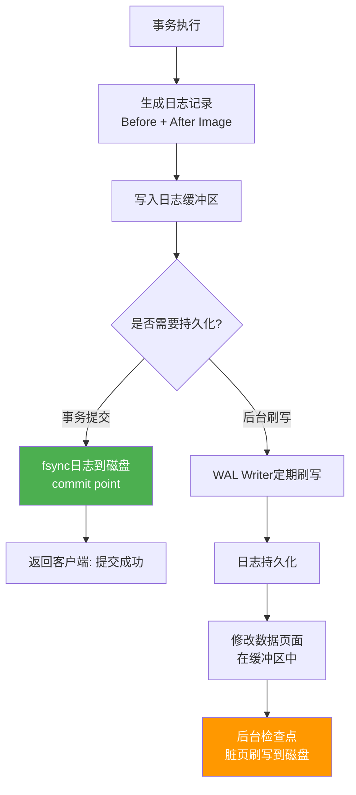
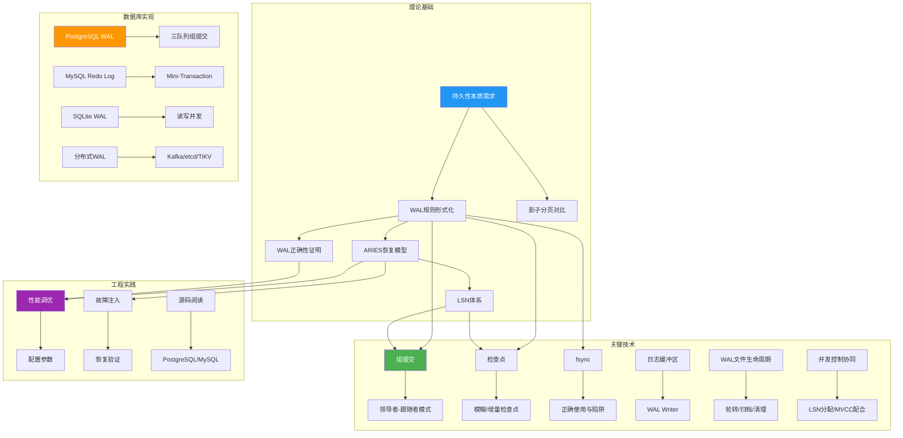

# 第11章 WAL与持久化 — 本章小结

本章从持久性的本质需求出发，系统性地讲解了Write-Ahead Logging（预写日志）的理论基础、关键实现技术、主流数据库的WAL实现、常见误区以及实践方法。以下对全章核心内容进行回顾、提炼与延伸，帮助读者建立完整的知识体系，并为下一章——缓存系统的学习做好准备。

---

## 一、核心知识体系回顾

### 1.1 WAL的本质与设计动机

WAL（Write-Ahead Logging）的核心思想是**先写日志，后写数据**——在修改数据页面之前，必须先将描述该修改的日志记录持久化到磁盘。这个看似简单的规则解决了数据库持久化中最核心的矛盾：**如何在保证数据安全的同时获得可接受的性能**。

WAL通过将随机写转化为顺序写，利用顺序写远高于随机写的带宽（HDD上顺序写可达200MB/s而随机写仅2MB/s，差距约100倍），实现了性能和安全性的平衡。具体来说，WAL同时解决了三个问题：

- **原子性（Atomicity）**：通过Undo信息（Before Image）支持事务回滚，确保未提交的事务可以被完整撤销
- **持久性（Durability）**：通过Redo信息（After Image）支持崩溃恢复，确保已提交的事务数据不会丢失
- **性能（Performance）**：顺序写日志比随机写数据快得多，且通过组提交等技术可以进一步摊销fsync的固定开销

> **设计哲学**：WAL本质上是一种"用顺序写保护随机写"的策略。这个思想不仅限于数据库——Kafka的Commit Log、ext4的文件系统日志（journaling）、etcd的WAL都遵循相同的哲学。理解这一点，就把握了WAL最深层的设计逻辑。

### 1.2 WAL规则的形式化定义

WAL的核心规则可以形式化为两条严格的约束：

**规则1（日志先于数据）**：在数据页面的修改写入磁盘之前，对应的日志记录必须已经持久化到磁盘。

形式化表述：如果数据页面P的修改对应的日志记录为L，则 `flush(L) → write(P)`

**规则2（提交先于完成）**：事务提交时，其所有日志记录必须已经持久化。

形式化表述：如果事务T提交，则 `flush(all_logs(T)) → commit_return(T)`

这两条规则共同保证了：无论系统在任何时刻崩溃，恢复过程都能利用日志将数据库恢复到一致状态。规则1保证了重做的可能性（日志在数据之前到达磁盘），规则2保证了已提交事务的可恢复性（提交意味着日志已持久化）。

> **深入理解**：这两条规则看似简单，但其正确性需要严格的数学证明——详见本章11.5节"WAL的正确性证明"。证明的核心思路是建立三个不变式：(1) Redo阶段后，所有已持久化的修改都被重放；(2) Undo阶段后，所有未提交事务的修改被撤销；(3) 恢复过程本身也是可恢复的（通过CLR补偿日志记录）。这种形式化的正确性保证，是数据库能在生产环境中被信任的根本原因。

### 1.3 ARIES恢复模型

ARIES（Algorithm for Recovery and Isolation Exploiting Semantics）是现代数据库恢复的事实标准，基于三个基本原则：

1. **Write-Ahead Logging**：日志先于数据到达持久化介质
2. **Repeating History During Redo**：恢复时重做所有操作（包括未提交事务的操作），回到崩溃时的状态
3. **Logging Changes During Undo**：撤销操作也记录日志（CLR，补偿日志记录），支持恢复过程中的再次崩溃

三个恢复阶段共同保证了数据库从任何崩溃状态都能恢复到一致状态：

┌─────────────────────────────────────────────────────────────────┐
│                    ARIES 恢复三阶段                              │
├─────────────┬───────────────────┬───────────────────────────────┤
│   阶段      │     输入          │     输出                      │
├─────────────┼───────────────────┼───────────────────────────────┤
│ Analysis    │ 最后检查点 +      │ • 活跃事务列表                 │
│ (分析)      │ 全部日志          │ • 脏页面集合                   │
│             │                   │ • Redo起始LSN (dirty_page_table)│
├─────────────┼───────────────────┼───────────────────────────────┤
│ Redo        │ Analysis输出 +    │ • 数据库恢复到崩溃时的状态      │
│ (重做)      │ 全部日志          │   (包括未提交事务的修改)        │
│             │                   │ • 重做所有LSN ≥ page_lsn的修改  │
├─────────────┼───────────────────┼───────────────────────────────┤
│ Undo        │ 活跃事务列表      │ • 所有未提交事务的修改被撤销     │
│ (撤销)      │ 日志(逆序扫描)    │ • 写入CLR记录                  │
│             │                   │ • 数据库达到一致状态             │
└─────────────┴───────────────────┴───────────────────────────────┘

**关键细节**：Redo阶段采用"早重做"策略——即使某个修改来自未提交事务，也会先重做，然后在Undo阶段统一撤销。这种设计简化了恢复算法，因为Redo阶段不需要判断事务状态，只需比较LSN即可决定是否重做。

### 1.4 日志序列号（LSN）体系

LSN是WAL系统中最核心的数据结构，它建立了日志记录、数据页面和检查点之间的关联：

| 数据结构 | 定义 | 作用 | 位置 |
|---------|------|------|------|
| LSN | 日志序列号，单调递增 | 唯一标识每条日志记录 | 日志记录头部 |
| PageLSN | 数据页上最近修改的LSN | 判断页面是否需要重做 | 数据页面头部 |
| RecLSN | 页面首次变脏的LSN | 确定Redo起始位置 | 缓冲池元数据 |
| FlushLSN | 已刷写到磁盘的最大LSN | 标识持久化进度 | 内存中的全局变量 |
| Prev_LSN | 同事务前一条日志的LSN | 支持事务的逆序遍历 | 日志记录 |
| Checkpoint_LSN | 检查点位置 | 恢复的起始扫描点 | 检查点记录 |

LSN的比较是WAL系统中最频繁的操作之一。例如在Redo阶段，对于每条日志记录，需要比较 `log_record.LSN` 与 `page.PageLSN`：如果 `log_record.LSN > page.PageLSN`，说明该修改尚未应用到数据页，需要重做；否则跳过。

**并发安全**：在高并发场景下，多个事务线程同时分配LSN需要原子性保证。常见的实现方式包括：(1) 互斥锁保护的全局计数器（简单但有锁竞争）；(2) 原子CAS操作的无锁分配器（高性能但实现复杂）；(3) 预分配槽位（PostgreSQL的做法，减少锁竞争）。无论采用哪种方式，都必须保证LSN全局唯一且单调递增——这是WAL恢复正确性的基础。

### 1.5 影子分页（Shadow Paging）

影子分页是WAL的替代方案，采用写时复制（Copy-on-Write）的思想：

- 修改时不直接覆盖原页面，而是写入新页面（影子页面）
- 事务提交时，原子性地更新根指针，使新版本生效
- 不需要单独的日志文件，因为旧版本自然保留在原位置

| 对比维度 | WAL | 影子分页 |
|---------|-----|---------|
| 日志开销 | 需要额外的日志文件和I/O | 无需日志文件 |
| 写放大 | 低（日志是紧凑的增量记录） | 高（整个页面被复制） |
| 并发支持 | 好（通过锁和MVCC） | 差（指针更新需要独占） |
| 空间回收 | 需要显式清理旧日志 | 需要GC回收旧版本页面 |
| 实现复杂度 | 中等 | 恢复简单，但碎片化管理复杂 |
| 实际采用 | PostgreSQL、MySQL、SQLite | LMDB、早期System R |

影子分页在单用户或低并发场景下有优势（恢复简单、无需日志管理），但在高并发OLTP场景下，WAL通过日志解耦了数据页写入时机和事务提交时机，在大多数场景下是更优的选择。

---

## 二、关键技术深入回顾

### 2.1 组提交（Group Commit）

组提交是WAL性能优化的核心技术。其原理是将多个事务的日志合并为一次fsync操作，摊销fsync的固定开销（HDD约10ms，SSD约0.1-1ms）。

**领导者-跟随者模式**：

事务1 ──┐
事务2 ──┤──→ 提交队列 ──→ 领导者: 收集所有日志 → 一次fsync → 唤醒所有跟随者
事务3 ──┘

- 第一个到达的事务成为领导者，负责执行fsync
- 后续到达的事务成为跟随者，等待领导者完成
- 领导者完成fsync后，唤醒所有等待的跟随者

**PostgreSQL的三队列实现**：PostgreSQL 9.2+使用三个独立队列分别管理flush（日志刷写）、apply（逻辑复制应用）、sync（同步确认）三个阶段，允许不同阶段的事务并行处理，进一步提高了并发度。

**性能影响**：在高并发场景下，组提交可以将提交吞吐量提升10-100倍。假设单次fsync耗时10ms，单事务吞吐量上限为100 TPS；如果每次组提交合并100个事务，则吞吐量可达10,000 TPS。

### 2.2 检查点（Checkpoint）

检查点是控制WAL文件大小和恢复时间的关键机制。其核心思想是定期将缓冲池中的脏页刷写到磁盘，标记一个"安全点"——在此之前的修改已持久化，恢复时无需重做。

**检查点策略对比**：

| 策略 | 原理 | 优点 | 缺点 | 代表实现 |
|------|------|------|------|---------|
| 静态检查点 | 暂停所有事务，刷完所有脏页 | 实现简单，恢复快 | 造成服务中断 | 早期数据库 |
| 模糊检查点 | 后台逐步刷脏页，不阻塞事务 | 无服务中断 | 实现复杂，恢复需扫描更多日志 | PostgreSQL |
| 增量检查点 | 按脏页变脏时间顺序逐步刷写 | I/O均匀分布 | 需要维护脏页时间戳 | MySQL 8.0+ |
| 基于WAL量的检查点 | WAL文件达到阈值时触发 | 控制WAL空间占用 | 可能与I/O负载叠加 | PostgreSQL (max_wal_size) |

**检查点频率的权衡**：

- **过于频繁**：增加后台I/O负载，SSD上加速设备磨损，可能导致写入性能的周期性抖动
- **过于稀少**：WAL文件持续增长占用磁盘空间，恢复时间显著增加（需重放更多日志），缓冲池中的脏页无法被安全逐出
- **最佳实践**：基于恢复时间目标（RTO）设置——如果要求恢复时间不超过T秒，检查点频率应保证在T秒内完成日志重放

### 2.3 fsync与数据安全

fsync是保证数据从操作系统缓冲区写入物理磁盘的关键系统调用，但其行为远比想象中复杂：

**fsync的真实语义链**：

应用数据 → write() → OS Page Cache → fsync() → 磁盘控制器缓存 → 磁盘介质
                                                    ↑
                                              这里有风险！
                                    (非BBU控制器掉电会丢数据)

**常见陷阱**：

1. **控制器缓存**：某些磁盘控制器有写缓存，fsync可能只保证数据写入了控制器缓存而非持久化介质。没有电池备份单元（BBU）的控制器在掉电后会丢失缓存中的数据
2. **返回值忽略**：许多应用程序不检查fsync的返回值。如果fsync返回EIO，数据可能并未持久化
3. **目录fsync遗漏**：创建新文件后，需要同时对文件和目录调用fsync，否则文件名映射可能丢失
4. **SSD固件bug**：某些SSD的固件可能导致fsync返回成功但数据未真正写入

**fsync变体对比**：

| 调用 | 刷写范围 | 元数据 | 性能 | 适用场景 |
|------|---------|--------|------|---------|
| fsync(fd) | 数据 + 元数据 | 包含atime等 | 最慢 | 需要完整持久化保证 |
| fdatasync(fd) | 仅数据 + 必要元数据 | 仅size/mtime | 较快 | WAL日志刷写（推荐） |
| O_DIRECT + fsync | 绕过Page Cache | 包含 | 最快 | 数据库数据文件 |

### 2.4 日志缓冲区与WAL Writer

日志缓冲区是内存中暂存日志记录的区域，WAL Writer是专门负责将日志缓冲区刷写到磁盘的后台线程。两者的配合实现了日志写入的流水线化：

- **事务线程**：只需将日志记录写入内存缓冲区（微秒级），不需要等待磁盘I/O
- **WAL Writer**：定期或在缓冲区满时将日志刷写到磁盘
- **提交线程**：在事务提交时，确保其日志已刷写（可能需要主动触发WAL Writer）

这种设计将日志写入的延迟从"每次提交都fsync"降低到"大部分提交只需写内存"，显著提高了小事务的提交延迟。

### 2.5 WAL文件的生命周期管理

WAL文件不是"写满一个再创建一个"这么简单——它涉及创建命名、段文件组织、轮转策略、保留控制、归档备份、空间回收等多个环节。任何一个环节出问题，轻则磁盘空间耗尽导致数据库停机，重则归档日志缺失导致无法恢复到指定时间点。

**文件命名与组织**：

| 数据库 | 文件命名规则 | 文件大小 | 组织方式 |
|--------|------------|---------|---------|
| PostgreSQL | `<TimeLineID>/<SegmentNumber>` (24位16进制) | 16MB（可配置） | 独立文件序列，LSN连续递增 |
| MySQL InnoDB | `ib_logfile0`, `ib_logfile1`（循环命名） | 1GB（可配置） | 固定数量的循环缓冲区 |
| SQLite | `database.db-wal`（单个文件） | 动态增长 | 单文件，帧号递增 |

**PostgreSQL时间线ID**：这是PostgreSQL的一个精妙设计——当备库被提升为主库（promote）时，Timeline ID加1，此后写入的WAL文件使用新的时间线编号。这使得归档日志形成一棵树状结构而非线性链，恢复程序可以沿着不同的时间线分支回退到任意历史时刻（PITR时间点恢复的基础）。

**WAL文件轮转与清理**：

- **轮转触发**：当前WAL文件写满（达到`wal_segment_size`）时自动创建下一个段文件
- **清理策略**：已归档且不再被复制槽（Replication Slot）引用的WAL文件可以被清理
- **磁盘保护**：`max_wal_size`限制WAL总量，超出时强制触发检查点以回收空间
- **归档配合**：归档完成是WAL文件可以被清理的前提条件——未归档的WAL文件必须保留

> **生产陷阱**：在归档配置不当或复制槽堆积的场景下，WAL文件可能持续增长耗尽磁盘空间。PostgreSQL的`pg_archivecleanup`工具和MySQL的`innodb_purge_truncateuncate`机制正是为了解决这个问题。

### 2.6 并发控制与WAL的协同

WAL子系统的日志写入与事务并发控制是两个深度耦合的子系统——日志负责记录"发生了什么"，并发控制负责协调"谁可以同时做什么"。二者必须在时序、内存可见性和持久化语义上精密配合。

**LSN分配的并发安全**：多个事务线程同时分配LSN时，必须保证三条不变量：(1) LSN全局唯一且单调递增；(2) 日志文件中的物理顺序与LSN顺序一致；(3) 同一事务的日志记录通过Prev_LSN链保持连续性。常见的实现方案包括原子CAS无锁分配器、预分配槽位、以及互斥锁保护的全局计数器。

**WAL与锁的交互**：当事务T1持有行锁并修改数据时，其WAL日志必须在锁释放前完成写入（否则崩溃恢复后锁状态与日志不一致）。同时，WAL的日志缓冲区本身也需要并发控制——多个线程同时写入缓冲区时，需要轻量级的同步机制（如latch/门闩）来保证写入顺序与LSN递增一致。

**WAL与MVCC的时序协调**：MVCC依赖多版本数据来实现一致性读，而WAL记录了这些版本变化的完整历史。两者的关键约束是：旧版本数据（用于MVCC读）的清理（VACUUM/vacuum）必须在对应的WAL日志完成归档或不再被任何活跃事务引用后才能执行。这就是PostgreSQL中`Replication Slot`存在的根本原因——它防止过早清理尚在被复制消费的WAL段文件。

---

## 三、主流数据库WAL实现对比

### 3.1 四大实现全面对比

| 维度 | PostgreSQL WAL | MySQL InnoDB Redo Log | SQLite WAL | Kafka Commit Log |
|------|---------------|----------------------|------------|-----------------|
| **日志文件组织** | 独立文件序列（16MB/文件） | 循环缓冲区（固定2-4个文件） | 单个WAL文件 | 分段追加日志 |
| **LSN定义** | 64位，高32位文件号+低32位偏移 | 64位，初始化以来的字节数 | 32位帧号 | 64位offset |
| **日志类型** | 物理+逻辑（支持复制） | 物理（Redo Log） | 物理（页级） | 逻辑（消息） |
| **检查点机制** | 模糊检查点（后台刷脏页） | Master Thread检查点 | WAL文件自动checkpoint | 消费者offset管理 |
| **特殊机制** | 三队列组提交 | Mini-Transaction + Doublewrite | 读写并发 | 分区复制 |
| **复制支持** | 流式复制（物理+逻辑） | Binlog（逻辑复制） | 不支持原生复制 | ISR副本同步 |
| **配置灵活性** | 极高（20+相关参数） | 中等（10+相关参数） | 低（3-4个PRAGMA） | 中等 |
| **典型配置** | wal_level= replica, max_wal_size= 1GB | innodb_log_file_size= 1G, innodb_flush_log_at_trx_commit= 1 | journal_mode= WAL, wal_autocheckpoint= 1000 | log.retention.hours= 168 |

### 3.2 PostgreSQL WAL核心配置速查

| 参数 | 默认值 | 作用 | 调优建议 |
|------|--------|------|---------|
| wal_level | replica | WAL详细程度 | minimal/replica/logical |
| synchronous_commit | on | 提交同步级别 | on/off/remote_write/remote_apply |
| wal_buffers | -1 (自动) | WAL缓冲区大小 | 通常64KB-1MB |
| max_wal_size | 1GB | 触发检查点的WAL量 | 根据写入负载调整，高写入可设10GB+ |
| checkpoint_timeout | 5min | 自动检查点间隔 | 5min-30min，根据RTO需求 |
| checkpoint_completion_target | 0.9 | 检查点完成目标 | 0.5-1.0，越大越平滑 |

### 3.3 MySQL InnoDB Redo Log核心配置速查

| 参数 | 默认值 | 作用 | 调优建议 |
|------|--------|------|---------|
| innodb_log_file_size | 48MB (旧)/1G (8.0.30+) | 单个Redo Log文件大小 | 1-4GB，写入密集可增大 |
| innodb_log_files_in_group | 2 | Redo Log文件数量 | 通常2个（8.0.30+改为单文件） |
| innodb_log_buffer_size | 16MB | Redo Log缓冲区 | 16-256MB |
| innodb_flush_log_at_trx_commit | 1 | 提交时刷写策略 | 1(安全)/2(性能)/0(最快但不安全) |
| innodb_flush_method | fsync | 刷写方式 | O_DIRECT避免双缓存 |

**innodb_flush_log_at_trx_commit的三种模式**：

- **=1**（默认）：每次提交都fsync到磁盘，最安全但最慢
- **=2**：每次提交写入OS缓存，每秒fsync一次，兼顾安全和性能
- **=0**：每秒才写入OS缓存并fsync，最快但崩溃可能丢失1秒数据

### 3.4 分布式系统中的WAL

WAL在分布式系统中的角色从单机的"持久化保障"扩展为"数据复制的基础"。核心挑战在于：如何将本地WAL可靠地传播到远程节点，并在节点故障后通过WAL追赶恢复一致性。

**TiKV（TiDB存储层）**：基于Raft协议的分布式WAL。每个Region的写入先通过Raft Log（本质是分布式WAL）在多数节点确认后才返回客户端。Raft Log替代了传统的单机WAL，实现了跨节点的持久性和一致性。当Follower节点宕机重启后，通过日志追赶（log catch-up）恢复到最新状态。

**Apache Kafka**：将WAL思想应用于消息系统。每个Topic Partition是一个追加写入的日志段，Producer的写入等价于日志记录的持久化，Consumer的消费进度通过Offset管理。Kafka通过ISR（In-Sync Replicas）机制保证消息的持久性——与数据库WAL的`fsync`语义高度类似。

**etcd**：基于Raft的日志复制系统。客户端的每次写入都通过Raft日志传播到所有节点，在多数节点持久化后才视为提交。etcd的WAL实现直接服务于Raft共识协议，是分布式一致性的底层基础设施。

**分布式WAL的核心权衡**：

| 权衡维度 | 同步复制 | 异步复制 |
|---------|---------|---------|
| 数据安全 | 高（不丢数据） | 低（可能丢失未同步数据） |
| 延迟 | 高（等待多数节点确认） | 低（本地确认即返回） |
| 可用性 | 低（多数节点故障则不可用） | 高（单节点可用即可服务） |
| 适用场景 | 金融交易、元数据存储 | 日志收集、实时分析 |

---

## 四、常见误区总结

本章纠正了关于WAL和持久化的八个核心误区，这些是在实际工程中最容易犯的错误：

| 误区 | 真实情况 | 工程建议 |
|------|---------|---------|
| fsync保证数据安全 | fsync语义依赖硬件和OS，非BBU控制器掉电仍丢数据 | 检查返回值 + 使用fdatasync + 监控硬件BBU状态 |
| WAL一定提高性能 | 读多写少/大批量顺序写场景下WAL可能反而降低性能 | 根据工作负载特征评估，监控WAL生成速率 |
| 检查点越频繁越安全 | 过频增加I/O负载和SSD磨损，过少增加恢复时间和空间占用 | 基于RTO计算最优间隔，使用增量检查点 |
| 日志和数据页独立处理 | PageLSN约束、部分写入问题、严格写入顺序要求 | 维护PageLSN一致性，使用checksum/doublewrite |
| Redo和Undo是同一回事 | Redo保证持久性（After Image），Undo保证原子性（Before Image） | ARIES模型中两者都需要，CLR是undo的日志记录 |
| WAL只影响本地持久化 | WAL是流式复制的基础（物理复制+逻辑复制） | 复制场景需设置足够WAL保留量，监控复制延迟 |
| 只需Redo不需要Undo | Undo还支持MVCC一致性读、事务回滚、死锁检测 | 理解Redo/Undo的互补关系，合理配置undo表空间 |
| 日志缓冲区写入无需并发控制 | LSN分配、缓冲区指针推进都需要同步机制 | 了解latch机制，理解无锁LSN分配器的原理 |

---

## 五、核心公式与模型

### 5.1 fsync开销模型

理解fsync的性能影响是WAL调优的基础：

单事务延迟 = 日志写入时间 + fsync时间
           = log_record_size / write_bandwidth + fsync_latency

组提交延迟 = 收集时间 + 写入时间 + fsync时间
           = wait_time + batch_count × log_record_size / write_bandwidth + fsync_latency

吞吐量上限(无组提交) = 1 / fsync_latency
                     ≈ 100 TPS (HDD, fsync=10ms)
                     ≈ 10,000 TPS (SSD, fsync=0.1ms)

吞吐量上限(有组提交) = batch_count / (wait_time + fsync_latency)
                     ≈ 10,000+ TPS (HDD, batch=100)

**关键洞察**：组提交的性能增益取决于batch_size与fsync_latency的比值。batch越大，fsync开销被摊销得越薄，但等待时间也越长。最优batch_size需要在延迟和吞吐量之间权衡。

### 5.2 检查点间隔计算

恢复时间 ≈ checkpoint_interval × redo_rate + undo_time
其中:
- checkpoint_interval: 检查点间隔（秒）
- redo_rate: WAL产生速率（MB/s）
- undo_time: 撤销阶段耗时（通常很短）

示例: checkpoint_interval=300s, redo_rate=10MB/s
      恢复时间 ≈ 300 × 10 / 1024 ≈ 3分钟 (假设redo重放速率为100MB/s)

最优检查点间隔 = sqrt(2 × checkpoint_cost / redo_rate²)

### 5.3 WAL空间需求

WAL空间 = 写入速率 × checkpoint_interval × 安全系数
其中:
- 写入速率: 每秒产生的WAL字节数
- checkpoint_interval: 检查点间隔
- 安全系数: 通常取2（应对突发写入和检查点延迟）

示例: 写入速率=50MB/s, checkpoint_interval=300s
      WAL空间 ≈ 50 × 300 × 2 = 30GB

---

## 六、知识架构全景

---

## 七、与其他章节的关联

WAL不是孤立的技术，它与数据库系统的多个核心组件紧密关联：

| 关联章节 | 关联内容 | 关联方式 |
|---------|---------|---------|
| 第6章 文件系统 | 文件I/O、页缓存、fsync语义 | WAL的性能和正确性依赖于文件系统的行为 |
| 第7章 I/O模型 | 同步/异步I/O、Direct I/O | WAL的日志写入可以使用异步I/O优化 |
| 第9章 存储介质 | SSD/HDD特性、写入放大 | 存储设备特性直接影响fsync延迟和检查点策略 |
| 第10章 索引结构 | B+树操作的原子性 | WAL通过Mini-Transaction保证B+树操作的原子性 |
| 第12章 缓存系统 | 缓冲池管理、脏页刷写 | 缓冲池的脏页管理与检查点密切相关 |
| 第13章 关系型数据库架构 | 存储引擎整体架构 | WAL是存储引擎的核心组件之一 |
| 第15章 事务与并发控制 | ACID、MVCC、锁 | WAL提供持久性保证，Undo Log支持MVCC |
| 第17章 分布式数据库 | WAL shipping、Raft复制 | WAL是分布式复制的基础 |
| 第23章 分布式存储 | 日志复制、一致性 | 分布式WAL设计需要考虑网络分区和一致性 |

---

## 八、实践方法总结

本章提供了从理论到实践的完整学习路径：

### 8.1 动手实现

| 练习 | 难度 | 核心收获 | 预计时间 |
|------|------|---------|---------|
| 基础WAL系统 | ⭐⭐ | 理解日志记录格式、append/flush/read | 2-3天 |
| 组提交机制 | ⭐⭐⭐ | 理解领导者-跟随者模式、同步原语 | 2天 |
| 影子分页实现 | ⭐⭐ | 对比WAL和影子分页的写放大差异 | 1-2天 |
| ARIES恢复实现 | ⭐⭐⭐⭐ | 实现完整的Analysis-Redo-Undo三阶段恢复 | 3-4天 |

### 8.2 真实系统分析

- **PostgreSQL**：使用 `pg_waldump` 分析WAL记录内容，观察不同操作（INSERT/UPDATE/DELETE）产生的WAL量差异
- **MySQL InnoDB**：通过 `SHOW ENGINE INNODB STATUS` 观察Redo Log的LSN推进和检查点行为
- **SQLite**：使用 `PRAGMA journal_mode=WAL` 启用WAL模式，对比传统模式的性能差异

### 8.3 性能基准测试

使用sysbench或fio测量不同配置下的性能表现：
- 不同 `synchronous_commit` 设置的TPS和延迟对比
- 不同检查点频率下的性能抖动分析
- fsync vs fdatasync在不同存储设备上的延迟对比

### 8.4 故障注入与恢复验证

使用自动化框架模拟各种崩溃场景：
- 事务提交期间崩溃 → 验证恢复后事务完整性
- 检查点期间崩溃 → 验证恢复后数据一致性
- 大量并发事务期间崩溃 → 验证ARIES恢复的正确性
- 连续多次崩溃 → 验证恢复过程自身的崩溃恢复能力（CLR的作用）

---

## 九、进一步学习指引

### 9.1 推荐论文

| 论文 | 作者 | 年份 | 核心贡献 |
|------|------|------|---------|
| ARIES: A Transaction Recovery Method... | Mohan et al. | 1992 | WAL恢复算法的奠基论文，定义了Analysis-Redo-Undo三阶段 |
| The Log-Structured Merge-Tree | O'Neil et al. | 1996 | 另一种基于日志的存储结构，影响了LevelDB/RocksDB |
| Write-Ahead Logging in PostgreSQL | PostgreSQL Wiki | 持续更新 | PostgreSQL WAL实现的详细文档 |
| No Compromises: Transaction Processing... |TU Peter Bailis et al. | 2014 | 现代数据库中WAL在分布式场景下的角色 |

### 9.2 推荐书籍

| 书籍 | 作者 | 相关章节 | 推荐理由 |
|------|------|---------|---------|
| Database Internals | Alex Petrov | 第5章 | 存储引擎和WAL的深入讲解，配有架构图 |
| Designing Data-Intensive Applications | Martin Kleppmann | 第7章 | 从事务角度理解WAL，与分布式系统关联 |
| Transaction Processing: Concepts and Techniques | Jim Gray | 第4-6章 | 事务处理的经典教材，WAL的理论基础 |

### 9.3 推荐源码阅读

| 数据库 | 核心文件 | 阅读重点 |
|--------|---------|---------|
| PostgreSQL | `src/backend/access/transam/xlog.c` | WAL核心实现、日志缓冲区管理 |
| PostgreSQL | `src/backend/access/transam/xloginsert.c` | WAL记录的构造和插入 |
| PostgreSQL | `src/backend/postmaster/checkpointer.c` | 检查点调度和执行 |
| MySQL | `storage/innobase/log/log0log.cc` | 日志系统核心、LSN管理 |
| MySQL | `storage/innobase/log/log0recv.cc` | 恢复过程实现 |
| SQLite | `src/wal.c` | WAL模式的完整实现 |

### 9.4 分阶段学习路径

**短期（1-2周）**：巩固基础
1. 完成本章的4个练习（从基础WAL实现开始）
2. 使用 `pg_waldump` 分析实际数据库的WAL内容
3. 对比不同 `synchronous_commit` 设置的性能差异

**中期（1-2月）**：深化理解
1. 学习第13章关系型数据库架构，理解WAL在数据库引擎中的位置
2. 学习第15章事务与并发控制，理解WAL如何支持MVCC
3. 尝试实现一个完整的简化版数据库引擎（包含WAL + 缓冲池 + B+树）

**长期（3-6月）**：前沿探索
1. 研究分布式WAL（TiKV的Raft Log、CockroachDB的WAL）
2. 学习LSM-Tree架构，理解WAL在LevelDB/RocksDB中的角色
3. 阅读ARIES原论文，深入理解恢复算法的形式化证明

---

## 十、本章核心收获自检

完成本章学习后，你应该能够回答以下问题。如果任何一项回答不确定，建议回到对应章节复习：

| # | 问题 | 对应章节 |
|---|------|---------|
| 1 | 为什么WAL能保证数据持久性？WAL规则的形式化定义是什么？ | 11.2 WAL规则 |
| 2 | LSN在WAL系统中起什么作用？PageLSN和RecLSN的区别是什么？ | 11.6 LSN设计 |
| 3 | ARIES恢复的三个阶段分别做什么？为什么Redo要先于Undo？ | 11.3 ARIES恢复 |
| 4 | 组提交如何提高写入吞吐量？领导者-跟随者模式的实现细节？ | 11.1 组提交 |
| 5 | fsync的真实行为是什么？有哪些硬件和软件层面的陷阱？ | 11.2 fsync |
| 6 | 如何平衡检查点频率和恢复时间？增量检查点的原理？ | 11.3 检查点 |
| 7 | PostgreSQL、MySQL、SQLite的WAL实现有何异同？各自的特殊机制？ | 11.3 实战案例 |
| 8 | 影子分页和WAL的核心区别是什么？各自的适用场景？ | 11.4 影子分页 |
| 9 | Redo日志和Undo日志的区别是什么？CLR的作用？ | 11.4 常见误区 |
| 10 | WAL如何支持流式复制？物理复制和逻辑复制的区别？ | 11.3 分布式WAL |
| 11 | WAL文件的命名规则是什么？时间线ID有什么作用？ | 11.5 WAL文件生命周期 |
| 12 | LSN分配如何保证并发安全？WAL与MVCC如何协同？ | 11.6 并发控制协同 |

---

带着这些知识，进入下一章的学习——**缓存系统**。缓存是另一个以空间换时间的核心技术，它与WAL形成有趣的对比：WAL通过顺序写优化写入性能，缓存通过内存加速读取性能。理解两者的配合（缓冲池 + WAL），才能真正理解现代数据库的存储引擎架构。从本章的检查点机制中，你已经看到了缓冲池与WAL的第一次交汇——检查点本质上就是缓冲池脏页刷写的调度过程。下一章将从缓存的角度重新审视这个配合关系，帮助你建立更完整的存储引擎全局视图。
