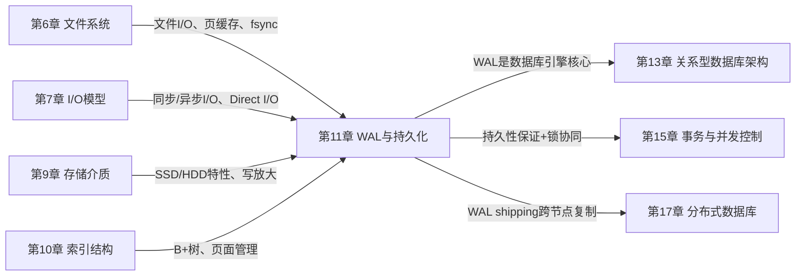
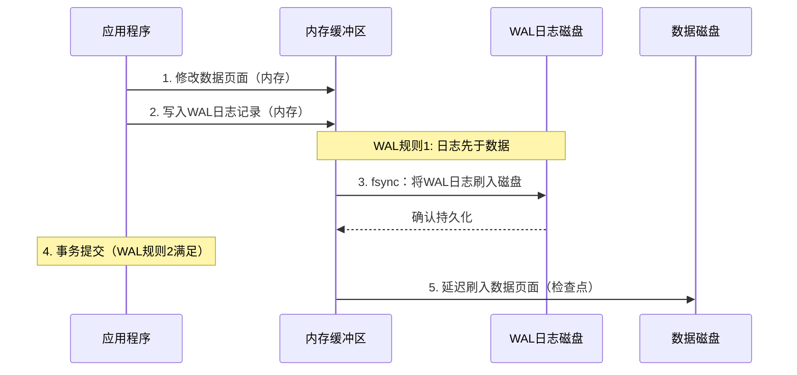

# 第11章 WAL与持久化

数据库的价值不仅在于它能高效地存储和检索数据，更在于它能在任何意外情况下——断电、崩溃、硬件故障——忠实地恢复到一致状态。这种能力的基石，就是本章要深入探讨的核心技术：**WAL（Write-Ahead Logging，预写日志）与持久化**。

## 为什么WAL是数据库的命脉

想象这样一个场景：你正在银行转账，从A账户扣除1000元并存入B账户。数据库需要同时修改两个数据页，而磁盘写入并非原子操作——恰好在A扣款完成后、B入账之前系统崩溃了。如果没有WAL，这次转账既没有完成也没有回滚，数据陷入不一致状态——更糟糕的是，你甚至无法知道数据损坏到了什么程度。有了WAL，数据库可以在重启后通过日志重放或回滚，精确地将数据恢复到事务提交前或提交后的状态，确保每一笔交易要么完整执行，要么完全不生效。

这个场景揭示了一个深刻的事实：**数据库的可靠性不是靠"尽量不崩溃"来保证的，而是靠"崩溃后能正确恢复"来保证的**。操作系统会崩溃，硬件会故障，甚至数据库自身的代码也可能存在bug。唯一能信任的，是那些已经按照正确规则写入磁盘的日志记录。

WAL的设计哲学可以用一句话概括：**先写日志，后写数据**。将随机的数据页面写入转化为顺序的日志写入，不仅解决了持久性问题，还意外地带来了显著的性能提升——因为顺序I/O的吞吐量通常是随机I/O的10-100倍。这个看似简单的规则，经过A. Mohan、C. Mohan等研究者在1992年发表的ARIES恢复算法的系统化，已经演变为现代数据库中最核心的子系统之一。从PostgreSQL的WAL到MySQL InnoDB的Redo Log，从SQLite的WAL模式到分布式系统中TiKV的Raft Log，WAL的思想无处不在。

更进一步说，WAL不仅是持久性的保证，它还驱动了数据库的多个关键能力：

- **崩溃恢复**：通过重放日志，将数据库恢复到最近一次一致状态
- **时间点恢复（PITR）**：结合归档日志，可以将数据库恢复到任意历史时刻
- **复制与高可用**：将WAL流式传输到副本节点，实现主从同步或异步复制
- **MVCC支持**：通过Undo Log支持多版本并发控制，实现读写不阻塞
- **复制到新存储**：支持数据库在线迁移、备份等运维操作

这意味着，理解WAL不仅是理解持久性，更是理解整个数据库架构的关键钥匙。

---

## 本章结构

本章按照"理论→技巧→案例→误区→实践"的递进结构组织，共分为五个部分：

**第一部分：理论基础**——从持久性的本质需求出发，建立WAL的完整理论框架。包括WAL规则的形式化定义（日志先于数据、提交先于完成）、ARIES恢复模型的三个阶段（分析、重做、撤销）、影子分页技术的对比分析、WAL正确性的形式化证明，以及日志序列号（LSN）的设计原理。这部分为后续所有内容奠定理论基础。

**第二部分：核心技巧**——深入讲解WAL在工程实践中的六项关键技术。组提交（Group Commit）如何将多次fsync合并为一次，大幅提升写入吞吐量；fsync的正确使用方式及其在不同操作系统和文件系统上的行为差异；检查点（Checkpoint）策略如何在恢复时间和运行时性能之间取得平衡；日志缓冲区管理的双缓冲设计；WAL文件的生命周期管理（创建、轮转、归档、清理）；以及并发控制与WAL的协同机制。

**第三部分：实战案例**——通过四个真实系统的深入剖析，展示WAL的不同设计哲学。PostgreSQL WAL的独立子系统架构与物理复制支持、MySQL InnoDB Redo Log的循环写入设计与doublewrite buffer机制、SQLite WAL模式的简化实现与读写并发支持、以及分布式系统中WAL在数据复制和一致性保证中的应用。

**第四部分：常见误区**——列举六个在WAL和持久化领域最常犯的错误认知，包括"fsync一定安全"、"WAL一定提升性能"、"检查点越频繁越好"等，每个误区都配有详细的原因分析和正确做法。

**第五部分：练习方法**——提供四个循序渐进的实践练习，从零实现简化版WAL引擎、分析PostgreSQL的WAL行为、进行fsync性能基准测试，到SQLite WAL模式的对比测试，帮助读者将理论知识转化为工程能力。

---

## 学习目标

完成本章学习后，读者应当能够：

1. **理论层面**：理解WAL的核心机制，掌握预写日志的工作原理、LSN的设计逻辑和ARIES恢复模型的三个阶段；理解WAL规则的形式化表述及其正确性证明
2. **工程层面**：掌握fsync语义、组提交优化、检查点策略、日志缓冲区管理等关键技术的原理和实现方式
3. **分析层面**：能够对比分析PostgreSQL WAL、MySQL InnoDB Redo Log、SQLite WAL模式的设计差异，理解不同设计哲学背后的权衡考量
4. **实操层面**：能够从零构建一个支持崩溃恢复的简化WAL引擎，使用pg_waldump等工具分析真实数据库的WAL行为
5. **诊断层面**：能够排查数据丢失、性能瓶颈、一致性异常等与持久化相关的生产问题，识别并纠正WAL相关的常见误区

---

## 前置知识

学习本章需要具备以下基础知识：

| 知识领域 | 具体要求 | 对应章节 |
|----------|---------|---------| 
| 文件系统 | 理解inode、文件写入流程、页缓存、文件系统日志 | 第6章 |
| I/O模型 | 理解同步/异步I/O、Direct I/O、I/O调度器 | 第7章 |
| 存储介质 | 了解SSD/HDD的写入特性、写放大、耐久度 | 第9章 |
| 索引结构 | 理解B+树基本操作、页面分裂与合并 | 第10章 |

如果读者对文件系统和I/O模型还不够熟悉，建议先回顾第6章和第7章的内容。WAL的性能优化很大程度上依赖于对底层I/O机制的深入理解，例如fsync的代价、顺序写入与随机写入的性能差异、页缓存的作用等。

特别值得注意的是，WAL的性能瓶颈往往出现在磁盘层面——一个fsync调用可能需要数毫秒甚至数十毫秒（取决于硬件和文件系统），而一组精心设计的组提交可以将这个代价摊销到几十个事务上。如果你对Linux的I/O栈（从应用层到文件系统到块设备到磁盘硬件）还不够清晰，第7章的I/O模型分析将是理解本章性能优化部分的关键前提。

---

## 核心问题清单

在学习本章之前，带着以下问题阅读效果更佳：

1. **为什么不能直接写数据文件，而要先写日志？**——这个问题引导你理解WAL存在的根本原因。答案涉及原子性、持久性和性能三个维度，将在11.1和11.2节详细解答。
2. **LSN（日志序列号）是如何保证日志的有序性和可恢复性的？**——LSN是WAL系统中最重要的设计概念，它将物理时间转化为逻辑序列，使恢复算法能够精确定位到任意事务的状态。
3. **组提交（Group Commit）为什么能大幅提高吞吐量？**——理解fsync的代价是理解WAL性能优化的关键。一次fsync的延迟可能高达10ms，而组提交可以将数百个事务的fsync合并为一次。
4. **fsync的代价有多大？不同操作系统上的行为有何差异？**——这是WAL工程实践中最容易踩坑的地方。Linux的ext4、XFS、ZFS在fsync语义上存在微妙但重要的差异。
5. **检查点频率如何影响恢复时间和运行时性能？**——检查点是WAL系统中最需要调优的参数。太频繁则运行时I/O压力大，太稀疏则恢复时间过长。
6. **PostgreSQL WAL和MySQL Redo Log在设计哲学上有何根本区别？**——理解不同设计选择背后的权衡，是成为数据库内核开发者或高级DBA的必经之路。

---

## 与其他章节的关系

WAL不是孤立的技术，它与数据库系统的多个核心组件紧密关联：

这个关系图揭示了WAL在数据库知识体系中的枢纽地位：它建立在文件系统和I/O模型的基础之上，同时为上层的数据库架构、事务并发控制和分布式一致性提供核心支撑。学好WAL，将为理解后续多个关键章节打下坚实基础。

---

## 预计学习时间

| 内容 | 阅读 | 实践 | 合计 |
|------|------|------|------|
| 理论基础（7节） | 2h | 1h | 3h |
| 核心技巧（7节） | 1.5h | 2h | 3.5h |
| 实战案例（5节） | 1h | 2h | 3h |
| 常见误区 | 0.5h | 0.5h | 1h |
| 练习方法（4个练习） | 0.5h | 4h | 4.5h |
| 本章小结 | 0.5h | — | 0.5h |
| **总计** | **6h** | **9.5h** | **15.5h** |

实践环节的时间投入显著高于阅读，这是有意为之——WAL的核心概念（如组提交、检查点、fsync语义）如果不亲手实验，很难真正内化。特别是练习1（零实现简化WAL引擎）和练习3（fsync性能基准测试），建议预留充足的时间反复调试。

---

## 本章导航

### 理论基础
- [11.1 持久性的本质需求](理论基础/01-111持久性的本质需求.md) — 从CAP定理到ACID，理解持久性为何不可或缺
- [11.2 WAL规则的形式化定义](理论基础/02-112WAL规则的形式化定义.md) — 日志先于数据、提交先于完成的形式化表述
- [11.3 ARIES恢复模型](理论基础/03-113ARIES恢复模型.md) — 分析→重做→撤销的三阶段恢复算法
- [11.4 影子分页技术](理论基础/04-114影子分页技术.md) — WAL的替代方案：直接写入完整页面
- [11.5 WAL的正确性证明](理论基础/05-115WAL的正确性证明.md) — 为什么WAL规则能保证事务的原子性和持久性
- [11.6 日志序列号LSN的设计](理论基础/06-116日志序列号LSN的设计.md) — LSN的全局唯一性、有序性与恢复定位

### 核心技巧
- [11.1 组提交（Group Commit）](核心技巧/01-111组提交GroupCommit.md) — 多事务合并一次fsync，吞吐量提升10-100倍
- [11.2 fsync的正确使用](核心技巧/02-112fsync的正确使用.md) — 不同操作系统、文件系统、硬件上的行为差异与陷阱
- [11.3 检查点（Checkpoint）](核心技巧/03-113检查点Checkpoint.md) — 恢复时间与运行时性能的平衡艺术
- [11.4 日志缓冲区管理](核心技巧/04-114日志缓冲区管理.md) — 双缓冲设计与WAL Writer线程
- [11.5 WAL文件的生命周期管理](核心技巧/05-115WAL文件的生命周期管理.md) — 创建、轮转、归档、清理的完整流程
- [11.6 并发控制与日志的协同](核心技巧/06-116并发控制与日志的协同.md) — WAL与锁机制、MVCC的协作关系

### 实战案例
- [案例1：PostgreSQL的WAL架构详解](实战案例/01-案例1PostgreSQL的WAL架构详解.md) — 物理复制、逻辑复制与PITR时间点恢复
- [案例2：MySQL InnoDB的Redo Log机制](实战案例/02-案例2MySQLInnoDB的RedoLog机制.md) — 循环写入、doublewrite buffer与崩溃恢复
- [案例3：SQLite的WAL模式](实战案例/03-案例3SQLite的WAL模式.md) — 嵌入式场景的简化WAL实现与读写并发
- [案例4：分布式系统中的WAL应用](实战案例/04-案例4分布式系统中的WAL应用.md) — WAL shipping、Raft Log与跨节点一致性

### 总结与实践
- [常见误区](04-常见误区.md) — 六个WAL领域的典型认知陷阱与纠正方法
- [练习方法](05-练习方法.md) — 四个从入门到进阶的动手实践练习
- [本章小结](06-本章小结.md) — 核心知识点回顾、公式总结与下一步学习建议

---

## 核心思想速览

在正式开始之前，先用一张图概括WAL的核心工作流程：

这张图揭示了WAL的精髓：**应用程序感知到的提交时刻，是日志刷盘完成的时刻，而非数据页面写入磁盘的时刻**。数据页面的刷盘可以延迟到后续的检查点（Checkpoint）中完成，这既保证了持久性，又将随机的数据写入转化为顺序的日志写入。

### WAL的三个核心设计权衡

WAL系统的设计不是非此即彼的选择，而是在三个关键维度上的精密平衡：

| 维度 | 权衡 | 典型选择 | 工程影响 |
|------|------|---------|---------|
| **持久性 vs 性能** | 每次提交都fsync最安全，但最慢 | 组提交：合并多个事务的fsync | 吞吐量提升10-100倍，但增加毫秒级延迟 |
| **恢复时间 vs 运行时开销** | 检查点越频繁恢复越快，但运行时I/O压力越大 | 温和检查点：均匀分散刷盘开销 | 恢复时间从分钟级降到秒级 |
| **日志量 vs 恢复精度** | 记录越详细的日志恢复越精确，但占用空间越大 | Full Page Write：首次修改记录完整页面 | 防止partial page write，但日志膨胀2-5倍 |

### 一个关键的时间线视角

理解WAL的另一个有效方式是从时间线角度审视一个事务的生命周期：

```mermaid
gantt
    title 一个写事务的时间线
    dateFormat X
    axisFormat %s

    section 事务执行
    读取数据页到内存     :a1, 0, 2
    修改内存中的数据页   :a2, 2, 3
    生成WAL日志记录     :a3, 3, 4

    section WAL持久化
    写入日志缓冲区      :b1, 4, 5
    WAL Writer刷盘      :crit, b2, 5, 7
    fsync完成           :milestone, b3, 7, 7

    section 事务提交
    通知应用提交成功     :c1, 7, 8

    section 延迟操作
    数据页刷盘(检查点)  :d1, 8, 15
    WAL日志清理         :d2, 15, 16
```

从这条时间线可以清晰看到：**事务的提交并不意味着所有数据都已写入磁盘**——它只意味着日志已持久化。数据页面的最终写入是一个延迟的、批量的、由检查点驱动的过程。这个分离是WAL高性能的核心秘密。

掌握这三个维度的权衡和时间线视角，就掌握了WAL系统设计的核心思维框架。接下来，让我们从第一部分——理论基础开始，系统地构建WAL的知识体系。
