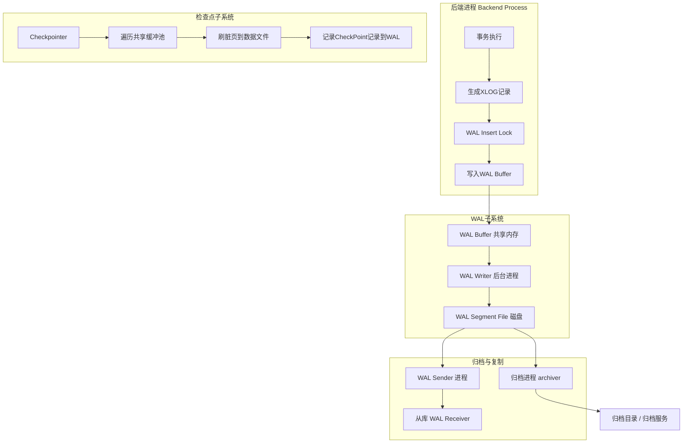
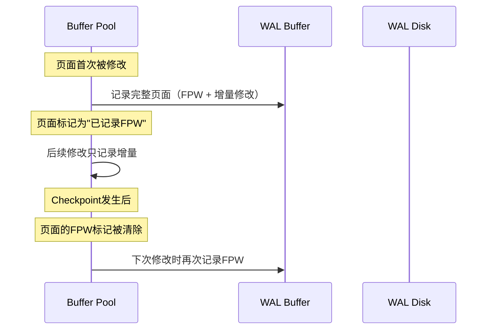
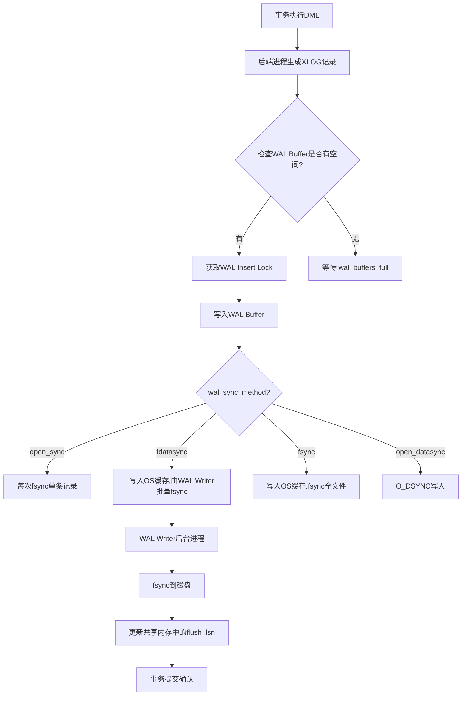
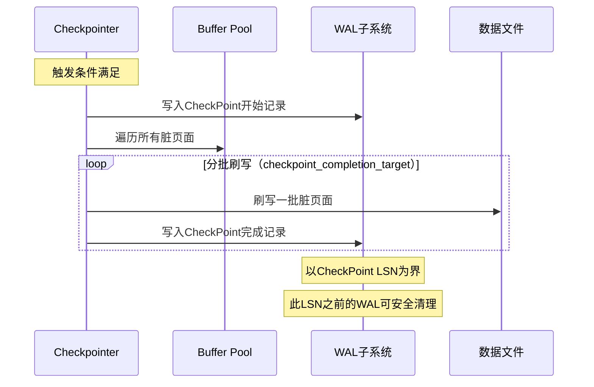
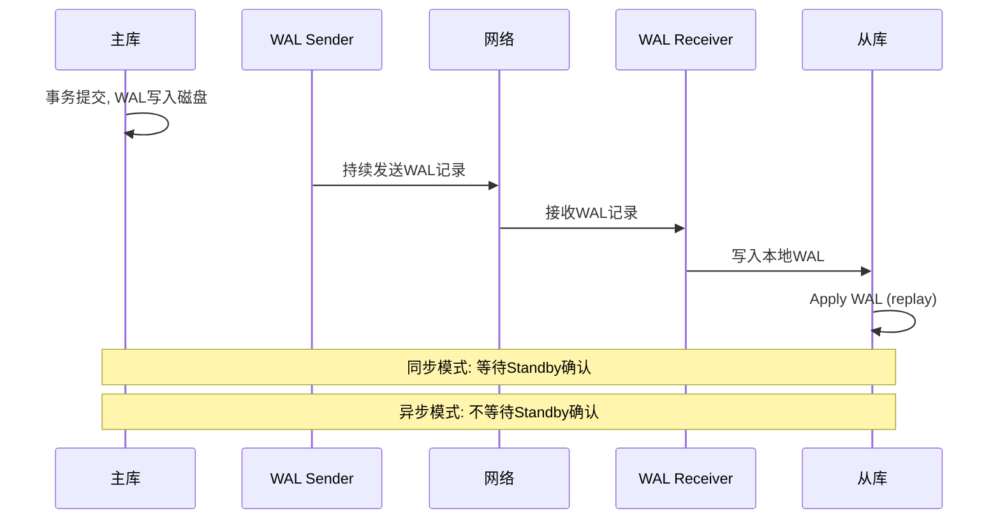
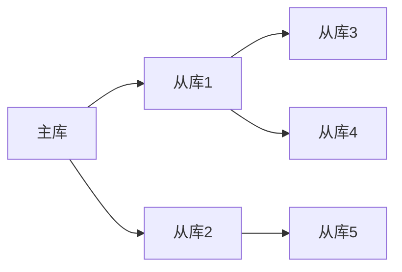
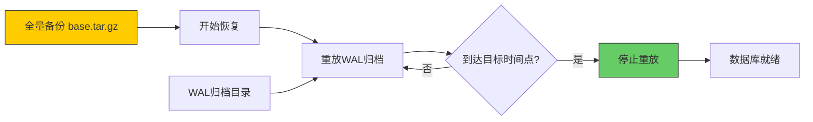
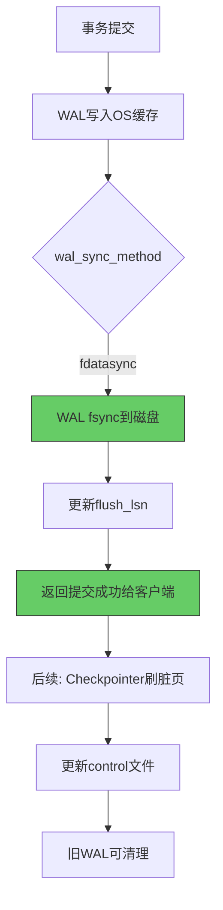

## 案例1：PostgreSQL的WAL架构详解

### 1. 问题背景

某电商平台使用PostgreSQL 15作为主数据库，承载日均2亿笔订单写入。在大促预热期间，DBA团队观察到以下异常现象：

- `checkpoint_sync_time`从日常的200ms飙升至5000ms以上
- `wal_buffers_full`计数器持续增长，表明WAL缓冲区频繁溢出
- `pg_stat_activity`中大量进程阻塞在`WALInsertLock`上
- 写入延迟从P99 5ms上升到P99 80ms
- `pg_wal/`目录在2小时内从1GB膨胀到12GB，触发磁盘告警

要解决这些问题，必须深入理解PostgreSQL WAL的内部架构——从WAL日志记录的二进制格式，到检查点与WAL的交互机制，再到物理复制和逻辑复制的底层原理。本案例将从架构全景出发，逐层拆解WAL的设计哲学，最终回到大促场景给出完整的诊断与优化方案。

### 2. PostgreSQL WAL架构全景

#### 2.1 整体架构



与MySQL InnoDB将Redo Log内嵌在存储引擎中的设计不同，PostgreSQL的WAL是一个**独立的、全局共享的子系统**。所有数据库实例（包括所有数据库）共享同一套WAL流，这意味着即使你只修改了`database1`的表，WAL记录也会写入全局的WAL流中。

这种设计的优势在于：简化了跨数据库的一致性保证，PITR恢复只需重放一条统一的WAL流，而无需协调多个独立的日志。代价是WAL数据量与所有数据库的写入总量成正比——多租户场景下，一个大表的频繁写入会影响所有数据库的WAL吞吐。

#### 2.2 WAL记录的二进制结构

每条WAL记录（XLOG Record）由固定头部和变长数据组成：

+------------------+------------------+------------------+
|   Page Header    |   XLogRecord     |   XLogRecordData |
|   (24 bytes)     |   Header (24B)   |   (变长)          |
+------------------+------------------+------------------+
|                  |                  |                  |
| XLogPageHeader   | rmid, info,      | 具体的修改数据     |
| magic, xlp_*     | prev_lsn,        | (before/after    |
|                   | fpw_lsn, ...     |  images)         |
+------------------+------------------+------------------+

**XLogRecord头部的关键字段**：

| 字段 | 大小 | 说明 |
|------|------|------|
| `total_len` | 4字节 | 整条记录的总长度 |
| `rmid` | 2字节 | 资源管理器ID（heap、btree、xact等） |
| `info` | 1字节 | 操作类型标志（INSERT/MULTI_INSERT/DELETE/UPDATE等） |
| `prev_lsn` | 8字节 | 同一事务中上一条WAL记录的LSN（形成事务内链表） |
| `fpw_lsn` | 8字节 | Full Page Write的LSN（标记该记录包含完整页面） |
| `crc` | 4字节 | CRC32校验和（PostgreSQL 12+使用CRC代替之前的fsm） |

**资源管理器（Resource Manager）**决定了日志记录属于哪个子系统：

| 资源管理器 | 常量 | 职责 |
|-----------|------|------|
| `RM_XACT_ID` | 0 | 事务提交/中止记录 |
| `RM_HEAP_ID` | 1 | 表行的增删改操作 |
| `RM_BTREE_ID` | 2 | B-tree索引操作 |
| `RM_SMGR_ID` | 3 | 存储管理器（创建/删除关系文件） |
| `RM_CLOG_ID` | 4 | 事务状态CLOG（PG 10+改为pg_xact） |
| `RM_XLOG_ID` | 5 | WAL子系统自身（检查点、切换等） |
| `RM_MULTIXACT_ID` | 6 | 多事务（SELECT FOR UPDATE等） |
| `RM_RELMAP_ID` | 7 | 关系映射文件更新 |
| `RM_STANDBY_ID` | 8 | 备库状态记录 |
| `RM_ACL_ID` | 9 | 访问控制列表变更 |
| `RM_LOGICAL_ID` | 10 | 逻辑复制消息（wal_level=logical时） |

资源管理器ID的设计使得恢复时可以快速分派到对应的重放函数——每个资源管理器注册一组`redo`函数，恢复器根据`rmid`直接跳转到正确的处理逻辑，无需解析整个记录内容。

#### 2.3 WAL文件的物理组织

WAL存储在`pg_wal/`目录下，文件组织为固定大小的**段文件（Segment）**，每个段默认16MB（可通过`--wal-segsize`编译时参数调整，范围64KB到1GB）：

pg_wal/
├── 000000010000000000000001   ← 段文件（16MB）
├── 000000010000000000000002
├── 000000010000000000000003
└── ...

段文件名的32位十六进制编码为：`XXXXXXXXYYYYYYYY`，其中：

- `XXXXXXXX`（8位）— Timeline ID（时间线ID，每次PITR恢复后递增）
- `YYYYYYYY`（8位）— 段编号，由LogID（高32位）和SegmentOffset（低32位）拼接

每个段文件内部被分为多个**页面（Page）**，每页8KB（与数据库页面大小一致）。页面头部（Page Header）占24字节：

页面布局（8KB）:
+------------------+------------------------------------------+
| Page Header 24B  | XLogRecord 1  | XLogRecord 2  | ...     |
+------------------+------------------------------------------+
| magic (0xD106)   |                                      |
| xlp_magic        |                                      |
| xlp_tli          |  Timeline ID                         |
| xlp_segoff       |  段内偏移                             |
| xlp_pageaddr     |  本页的起始LSN                        |
| xlp_len          |  本页中有效数据长度                     |
| xlp_first_sysctl |  是否是该XLOG记录的第一页              |
+------------------+------------------------------------------+

`xlp_first_sysctl`标志位非常关键——当一条WAL记录跨越多个页面时，只有第一个页面的头部会设置此标志。这保证了即使WAL记录被页面边界分割，恢复时仍然能正确定位每条记录的起始位置。

#### 2.4 LSN的计算方式

PostgreSQL的LSN（Log Sequence Number）是一个64位整数，编码为`X/XXXXXXXX`格式：

LSN = (LogID << 32) | SegmentOffset

示例: 0/15D6868
  LogID = 0
  SegmentOffset = 0x15D6868 = 22,847,656

对应文件: pg_wal/000000010000000000000000（Timeline=1, LogID=0）
对应偏移: 第 22,847,656 / 8192 = 第 2789 个页面内

LSN的核心性质：

- **全局单调递增**：同一实例内所有数据库共享同一LSN空间
- **可定位**：任意LSN可以精确映射到某个WAL文件的某个偏移
- **可比较**：通过LSN大小关系判断日志记录的先后顺序
- **可持久化**：LSN被写入控制文件（`pg_control`），恢复时作为起点

LSN在PostgreSQL内部无处不在：`pg_control`记录最新刷新的LSN，每个数据页面头部记录该页面最后修改的LSN，复制槽记录消费的LSN，归档记录处理到的LSN。整个持久化体系围绕LSN构建了一条完整的"写前日志→脏页刷盘→控制文件更新"的恢复链路。

### 3. WAL级别（wal_level）详解

`wal_level`参数控制WAL记录的信息量，是PostgreSQL WAL调优中最基础的配置：

| 级别 | 写入内容 | 支持功能 | 性能影响 |
|------|---------|---------|---------|
| `minimal` | 只记录崩溃恢复必需的最小信息 | 仅本地崩溃恢复，不能复制、不能PITR | 最小开销 |
| `replica` | 记录所有必要的复制信息 | 流复制、PITR、pg_basebackup | 中等开销 |
| `logical` | 在replica基础上额外记录解码信息 | 逻辑复制、变更数据捕获（CDC） | 最大开销 |

```sql
-- 查看当前级别
SHOW wal_level;

-- 修改级别（需要重启）
ALTER SYSTEM SET wal_level = 'replica';
-- PostgreSQL 15+ 支持在线切换 minimal→replica，但 replica→minimal 仍需重启
SELECT pg_reload_conf();
```

**三个级别的差异详解**：

**minimal级别**只记录事务提交记录和检查点记录，以及确保数据页面一致性的最小信息。它不记录行级修改（INSERT/UPDATE/DELETE），也不记录Full Page Write。这使得它适合一次性的大批量数据导入场景——导入期间不需要复制或PITR，但导入完成后必须切换回replica级别。实际操作中，最小级别的典型工作流是：

```sql
-- 批量导入前
ALTER SYSTEM SET wal_level = 'minimal';
-- 重启生效
ALTER SYSTEM SET max_wal_senders = 0;  -- 阻止复制连接
SELECT pg_reload_conf();

-- 执行大批量导入（COPY、INSERT SELECT等）
-- 此时WAL几乎不产生行级日志，性能最佳

-- 导入完成后
ALTER SYSTEM SET wal_level = 'replica';
ALTER SYSTEM SET max_wal_senders = 10;
-- 需要重启
```

**replica级别**额外记录了所有行级修改的前镜像和后镜像，以及完整的Full Page Write信息。这是生产环境的标准配置，支持流复制和基于WAL归档的时间点恢复。PostgreSQL的WAL在replica级别下，每条DML操作至少产生两条WAL记录：一条包含修改前的数据页（Full Page Write，仅首次），一条包含具体的行级修改（增量）。

**logical级别**在replica基础上，额外生成逻辑解码所需的信息（例如元组的列值信息、事务的commit时间戳、关系映射等）。这些信息使得`pgoutput`等解码插件可以从WAL中提取出结构化的变更事件，用于逻辑复制或CDC管道。

**性能影响的量化**：logical级别比replica级别多产生约15-30%的WAL数据量，因为每条行修改记录需要额外携带列类型信息和完整的旧值（用于逻辑解码）。对于写密集型负载，这个差异不可忽略。在极端场景下（如宽表的频繁UPDATE），logical级别的WAL膨胀可能达到40%以上。

### 4. Full Page Write（FPW）机制

Full Page Write是PostgreSQL WAL中一个关键但常被误解的机制。

#### 4.1 为什么需要FPW

PostgreSQL的共享缓冲池（shared_buffers）使用8KB页面，与操作系统页缓存和磁盘页面大小一致。当一个脏页面被第一次修改时，WAL需要记录该页面的**完整8KB内容**（而不仅仅是修改的字节），这是因为：

1. **部分写入（Partial Write）问题**：操作系统写入8KB页面时，可能只完成了部分（例如写入了4KB后断电），导致页面损坏
2. **覆盖写入（Torn Page）问题**：新的数据覆盖了页面的一部分，但断电时覆盖不完整

FPW确保恢复时可以用WAL中保存的完整页面副本替换损坏的页面，然后再应用后续的增量修改。

从更深层次理解：FPW解决的是**WAL恢复的正确性基础问题**。WAL的恢复模型假设"基于一个一致的初始状态，按序重放修改"。如果页面本身的初始状态就不一致（部分写入），那么无论WAL记录多么精确，恢复结果都是错误的。FPW通过在WAL中保存"页面在被修改前的完整快照"，确保恢复时总是从一个一致的页面状态开始。

#### 4.2 FPW的触发机制

```sql
-- 控制是否启用FPW（PostgreSQL 13+）
ALTER SYSTEM SET full_page_writes = on;  -- 默认开启，强烈建议保持开启

-- 查看FPW相关的WAL统计
SELECT
    pg_stat_get_db_xact_commit(datname) AS commits,
    pg_stat_get_db_xact_rollback(datname) AS rollbacks
FROM pg_database
WHERE datname = current_database();
```

FPW的工作流程：



关键要点：**每个Checkpoint周期内，每个脏页面最多记录一次FPW**。Checkpoint完成后，页面的FPW标记被清除，下一个周期内该页面的首次修改会再次触发FPW。

FPW的触发还与数据页checksums相关。PostgreSQL 12+默认启用`data_checksums`，但checksum计算发生在页面被写入磁盘之前、FPW记录之后。这意味着FPW记录的是**未计算checksum的原始页面内容**，恢复时先用FPW还原页面，再重新计算checksum，最后才应用增量修改。这一顺序保证了即使在启用checksum的版本中，FPW仍然是恢复正确性的基石。

#### 4.3 FPW对性能的影响

FPW是WAL膨胀的主要原因之一。在一个典型的OLTP负载中，FPW可以占到总WAL量的30-60%。量化分析：

```sql
-- 估算FPW的影响
-- 假设shared_buffers = 4GB（约524288个8KB页面）
-- 每个Checkpoint周期中，每个脏页面产生一次FPW

-- FPW最大数据量 = 脏页面数 × 8KB
-- 如果80%的缓冲池是脏页面：
-- 524288 × 0.8 × 8KB = 3.2GB FPW / 每个Checkpoint周期

-- 查看当前FPW相关参数
SHOW full_page_writes;              -- 是否启用（强烈建议on）
SHOW checkpoint_timeout;            -- Checkpoint间隔，默认5min
SHOW max_wal_size;                  -- 最大WAL量，触发Checkpoint的阈值
```

**FPW与Checkpoint的联动关系**是理解WAL膨胀的核心：

FPW量 ≈ 脏页面数 × 8KB
脏页面数 ≈ shared_buffers × 脏页比例
脏页比例 ≈ min(1, 写入负载 × checkpoint_interval / shared_buffers)

因此：
FPW量 ∝ 写入负载 × checkpoint_interval

这意味着：增大`checkpoint_timeout`或`max_wal_size`（延长Checkpoint间隔）会增加每个周期的FPW总量，但会减少Checkpoint次数（降低I/O峰值）。这是一个**平滑度vs总量的权衡**。

**优化建议**：不要试图关闭FPW来减少WAL量——这在非checksum页面的PostgreSQL版本中是致命的。PostgreSQL 12+默认启用数据页checksums，但在checksum计算之前需要FPW来保证恢复正确性。如果必须减少FPW影响，应考虑增大`max_wal_size`以降低Checkpoint频率，或使用SSD存储来加速FPW的写入。

### 5. WAL写入的完整路径

理解WAL数据从产生到持久化的完整路径，是排查性能问题的基础：



#### 5.1 WAL Insert Lock机制

PostgreSQL使用**分区锁（Partitioned WAL Insert Lock）**来保护WAL Buffer的并发写入。默认有8个分区（`wal_buffers` / 8KB + 1），每个分区对应WAL Buffer的一段区域：

```sql
-- 查看WAL Insert Lock的等待情况
SELECT
    wait_event_type,
    wait_event,
    count(*)
FROM pg_stat_activity
WHERE wait_event_type = 'Lock'
  AND wait_event LIKE '%WAL%'
GROUP BY wait_event_type, wait_event;
```

当所有分区锁都被占用时，新事务必须等待。这就是大促期间观察到的`WALInsertLock`等待事件的根本原因——WAL Buffer大小不足以承载并发写入量。

**分区锁的竞争模型**：假设WAL Buffer有N个分区，每个分区的最大容量为`wal_buffers / N`。当写入速度超过WAL Writer的刷盘速度时，WAL Buffer被快速填满，所有分区锁被占满，新事务只能等待WAL Writer释放空间。这形成了一个**生产者-消费者模型**：后端进程是生产者，WAL Writer是消费者，WAL Buffer是缓冲区。

#### 5.2 WAL Writer与组提交

WAL Writer是一个后台进程，负责定期将WAL Buffer中的数据刷入磁盘：

```sql
-- WAL Writer的刷盘间隔
SHOW wal_writer_delay;        -- 默认200ms
SHOW wal_writer_flush_after;  -- 默认1MB，超过此量立即刷盘
```

组提交（Group Commit）的工作原理：当多个事务同时提交时，它们的WAL记录被合并为一次fsync操作。这是PostgreSQL写入性能的核心优化——通过增大`commit_delay`和`commit_siblings`参数，可以让更多事务参与组提交：

```sql
-- 组提交参数
SHOW commit_delay;       -- 默认0（已废弃），等待时间（纳秒）
SHOW commit_siblings;    -- 默认5，至少需要这么多并发活跃事务
```

注意：从PostgreSQL 9.6开始，`commit_delay`已被废弃。组提交通过`wal_writer_delay`自动控制，不再需要手动调优。WAL Writer每隔`wal_writer_delay`（默认200ms）执行一次刷盘，将该窗口内所有等待提交的事务一并fsync到磁盘，从而实现组提交效果。

**组提交的性能影响**：在高并发场景下，组提交可以将数百次fsync合并为一次。例如，500个事务在200ms窗口内提交，如果每个事务独立fsync需要500×0.5ms=250ms的I/O时间；而组提交只需一次fsync的0.5ms，I/O效率提升约500倍。这也是为什么`wal_writer_delay`不宜设置过短——过短会导致组提交窗口变小，合并效果下降。

### 6. 检查点（Checkpoint）深入解析

检查点是WAL与持久化之间的核心枢纽。理解Checkpoint的工作机制，是解决WAL膨胀和写入延迟问题的关键。

#### 6.1 Checkpoint的核心任务

Checkpoint执行以下三个核心操作：

1. **刷脏页**：遍历共享缓冲池，将所有脏页面刷入数据文件
2. **记录检查点记录**：在WAL中写入一条CheckPoint记录，包含当时的LSN
3. **清理旧WAL**：在确保所有数据页面已持久化后，旧的WAL文件可以被安全删除



#### 6.2 Checkpoint触发条件

Checkpoint在以下条件下被触发：

| 触发条件 | 参数 | 默认值 | 说明 |
|----------|------|--------|------|
| 定时触发 | `checkpoint_timeout` | 5min | 距上次Checkpoint超过此时间 |
| WAL量触发 | `max_wal_size` | 1GB | 累积WAL超过此阈值 |
| 手动触发 | `CHECKPOINT`命令 | — | DBA手动执行 |
| pg_basebackup | — | — | 备份时强制触发 |

```sql
-- 查看Checkpoint统计
SELECT
    checkpoints_timed,          -- 定时触发的次数
    checkpoints_req,            -- 被请求触发的次数（非定时）
    checkpoint_write_time,      -- 写入数据文件的时间（ms）
    checkpoint_sync_time        -- fsync数据文件的时间（ms）
FROM pg_stat_bgwriter;

-- 强制检查点（紧急磁盘空间回收时使用）
CHECKPOINT;
```

`checkpoints_req`与`checkpoints_timed`的比值是诊断Checkpoint压力的关键指标：

- **req << timed**：健康状态，大部分Checkpoint是定时触发
- **req ≈ timed**：WAL产生速度较快，几乎每隔`checkpoint_timeout`就触发一次
- **req >> timed**：`max_wal_size`太小，频繁触发强制Checkpoint，I/O压力大

#### 6.3 checkpoint_completion_target

`checkpoint_completion_target`控制脏页刷写的速度——值越大，刷写过程越平滑：

```sql
-- 默认0.9（PostgreSQL 14+），建议保持
SHOW checkpoint_completion_target;

-- 含义：在checkpoint_timeout的90%时间内完成脏页刷写
-- 例如：checkpoint_timeout=10min, target=0.9
-- → Checkpoint在 10min × 0.9 = 9min 内平滑完成
```

该参数的设计目的是**将Checkpoint的I/O压力均匀分散到整个Checkpoint间隔内**，避免在Checkpoint末尾集中刷盘导致I/O尖峰。值设为0.9意味着在Checkpoint间隔的前90%时间内完成脏页刷写，留10%作为缓冲。

### 7. 物理复制：基于WAL的流复制

#### 7.1 架构原理



**物理复制的本质**是WAL shipping——主库将WAL记录发送给从库，从库按照相同的顺序重放这些记录，从而保持与主库完全一致的数据状态。由于重放的是物理级修改（页面级别的字节变更），从库的数据与主库是**字节级别一致**的。

物理复制的核心流程：
1. 从库通过WAL Receiver进程连接主库的WAL Sender
2. WAL Sender读取WAL文件，通过网络发送给从库
3. 从库将接收到的WAL写入本地WAL目录
4. 从库的Startup进程（replay进程）重放WAL，将修改应用到数据页面

#### 7.2 主库配置

```ini
# postgresql.conf 主库配置

# WAL级别必须为replica或logical
wal_level = replica

# 启用复制
max_wal_senders = 10          # 最大WAL发送进程数
wal_keep_size = 1GB           # 保留的最小WAL量（PostgreSQL 13+替代wal_keep_segments）

# 同步复制配置（可选）
synchronous_commit = on       # 默认on
synchronous_standby_names = ''  # 空=异步, 填写从库名称=同步

# 归档配置（PITR必需）
archive_mode = on
archive_command = 'cp %p /path/to/archive/%f'
# 生产环境建议使用pgBackRest:
# archive_command = 'pgbackrest --stanza=main archive-push %p'
```

```sql
-- 主库创建复制用户
CREATE USER replicator WITH REPLICATION LOGIN PASSWORD 'secure_password';

-- pg_hba.conf 允许复制连接
-- host  replication  replicator  10.0.0.0/24  scram-sha-256
```

#### 7.3 从库配置

```bash
# 基于pg_basebackup初始化从库
pg_basebackup -h primary_host -U replicator \
  -D /var/lib/postgresql/data \
  -Fp -Xs -P -R

# -Fp: 输出为plain格式
# -Xs: 通过流复制传输WAL（不需要额外归档）
# -P: 显示进度
# -R: 自动生成standby.signal和连接信息
```

```ini
# 从库 postgresql.conf

# 从库设置
hot_standby = on              # 允许从库提供只读查询
primary_conninfo = 'host=primary_host port=5432 user=replicator password=xxx'
recovery_target_timeline = 'latest'
```

#### 7.4 同步复制 vs 异步复制

| 特性 | 异步复制 | 同步复制 |
|------|---------|---------|
| 数据安全 | 可能丢失少量WAL（故障时） | 零数据丢失（RPO=0） |
| 写入延迟 | 无额外延迟 | 增加一个RTT延迟 |
| 可用性 | 主库故障不影响写入 | 从库故障会阻塞主库写入 |
| 适用场景 | 大多数读写分离场景 | 金融、支付等零丢失要求场景 |

```sql
-- 配置同步复制（PostgreSQL 10+使用standby names）
-- 严格同步：等待指定从库确认
ALTER SYSTEM SET synchronous_standby_names = 'FIRST 1 (standby1, standby2)';

-- 可靠性模式：至少N个从库中任意一个确认
ALTER SYSTEM SET synchronous_standby_names = 'ANY 1 (standby1, standby2)';

-- 查看复制状态
SELECT
    client_addr,
    state,
    sync_state,
    sent_lsn,
    write_lsn,
    flush_lsn,
    replay_lsn,
    pg_wal_lsn_diff(sent_lsn, replay_lsn) AS replay_lag_bytes
FROM pg_stat_replication;
```

**同步复制的FIRST vs ANY语义**：

- `FIRST 1 (standby1, standby2)`：必须等待`standby1`确认（FIRST按顺序，取列表中第一个）。这保证了确定性——总是等待同一个从库，适合主从切换时保证数据一致性
- `ANY 1 (standby1, standby2)`：等待任意一个从库确认即可。这提供了更高的可用性——一个从库宕机不影响主库写入，但数据安全性取决于最快的从库

#### 7.5 级联复制（Cascading Replication）

PostgreSQL支持级联复制——从库可以作为中间节点，将WAL转发给更多从库：



```ini
# 从库1 配置（允许接收WAL并转发）
primary_conninfo = 'host=primary_host port=5432 user=replicator password=xxx'

# 从库3 配置（从从库1接收WAL）
primary_conninfo = 'host=standby1_host port=5432 user=replicator password=xxx'
```

级联复制的价值在于**减轻主库的网络带宽和WAL Sender进程压力**。在大规模读写分离架构中，主库只需向2-3个一级从库发送WAL，二级从库从一级从库获取，形成树状分发结构。

**级联复制的限制**：级联路径上的延迟是累积的——如果从库1的重放延迟为100ms，从库3的延迟至少为100ms加上自身处理时间。对于延迟敏感的场景，应尽量减少级联层级。

#### 7.6 pg_rewind：快速从库重同步

当从库落后主库太多或数据不一致时，`pg_rewind`可以快速将从库回退到与主库一致的状态，而无需重新做完整的`pg_basebackup`：

```bash
# 停止从库
pg_ctl stop -D /var/lib/postgresql/data

# 使用pg_rewind将从库回退到与主库一致的点
pg_rewind \
  --target-pgdata=/var/lib/postgresql/data \
  --source-server="host=primary_host port=5432 user=postgres" \
  --progress

# 启动从库（会自动重新连接主库并追赶WAL）
pg_ctl start -D /var/lib/postgresql/data
```

`pg_rewind`的工作原理是：比较主库和从库的数据目录，找出分叉点（最后共同的LSN），然后从主库获取分叉点之后的所有页面修改。这比重新做全量备份快得多——例如从库落后1GB的WAL修改，`pg_rewind`只需传输这1GB的差异，而`pg_basebackup`可能需要传输数十GB的完整数据目录。

**使用前提**：`pg_rewind`要求从库启用了`wal_log_hints = on`（或数据页checksums），并且分叉点之后的WAL仍然存在于主库的WAL目录或归档中。

### 8. 逻辑复制：基于WAL的结构化变更传播

#### 8.1 物理复制 vs 逻辑复制

| 维度 | 物理复制 | 逻辑复制 |
|------|---------|---------|
| 复制粒度 | 整个实例 | 指定表/Schema |
| WAL级别 | `replica`即可 | 必须`logical` |
| 数据格式 | 物理页面变更 | 逻辑行级变更（INSERT/UPDATE/DELETE） |
| 版本兼容 | 主从必须相同大版本 | 允许跨版本（如13→15） |
| 跨平台 | 必须相同OS/架构 | 允许不同OS/架构 |
| 冲突处理 | 自动应用 | 可配置冲突策略（error/ignore/apply） |
| 双向同步 | 不支持（单向） | 可配置双向（需注意环路） |
| DDL复制 | 自动复制 | 不复制（需手动在两端执行） |

#### 8.2 逻辑复制配置

```sql
-- 主库: 创建发布
ALTER SYSTEM SET wal_level = 'logical';  -- 需要重启
-- 重启后创建发布
CREATE PUBLICATION my_pub FOR TABLE orders, order_items;
-- 或发布所有表
CREATE PUBLICATION my_pub FOR ALL TABLES;

-- 从库: 创建订阅
CREATE SUBSCRIPTION my_sub
    CONNECTION 'host=primary_host dbname=mydb user=replicator password=xxx'
    PUBLICATION my_pub;

-- 查看订阅状态
SELECT * FROM pg_stat_subscription;

-- 查看复制槽状态
SELECT
    slot_name,
    plugin,
    slot_type,
    database,
    active,
    pg_wal_lsn_diff(pg_current_wal_lsn(), restart_lsn) AS retained_bytes
FROM pg_replication_slots;
```

#### 8.3 WAL复制槽（Replication Slot）

复制槽是PostgreSQL防止WAL过早清理的关键机制：

```sql
-- 创建物理复制槽
SELECT pg_create_physical_replication_slot('standby1_slot');

-- 创建逻辑复制槽
SELECT pg_create_logical_replication_slot('logical_slot', 'pgoutput');

-- 查看所有复制槽
SELECT
    slot_name,
    slot_type,
    active,
    xmin,
    pg_wal_lsn_diff(pg_current_wal_lsn(), restart_lsn) AS retained_wal_bytes
FROM pg_replication_slots;

-- 删除不再需要的复制槽（危险操作前务必确认！）
SELECT pg_drop_replication_slot('old_slot');
```

**复制槽的危险**：如果一个复制槽关联的从库已宕机且长时间未恢复，该槽会阻止WAL清理，导致`pg_wal/`目录持续膨胀，最终可能耗尽磁盘空间。这是生产环境中最常见的WAL磁盘空间问题之一。

**生产环境建议**：

```sql
-- 设置复制槽WAL保留上限（PostgreSQL 13+）
-- 在主库 postgresql.conf 中：
-- wal_keep_size = 2GB  -- 至少保留2GB WAL

-- 定期监控复制槽的WAL保留量
SELECT
    slot_name,
    active,
    pg_size_pretty(pg_wal_lsn_diff(pg_current_wal_lsn(), restart_lsn)) AS retained
FROM pg_replication_slots
WHERE pg_wal_lsn_diff(pg_current_wal_lsn(), restart_lsn) > 1073741824;  -- > 1GB

-- 自动清理不活跃的复制槽（配合cronjob或监控脚本）
-- 当retained > 阈值且slot不活跃时，发送告警
```

#### 8.4 逻辑复制的冲突处理

逻辑复制中，主从同时修改同一行数据可能导致冲突。PostgreSQL提供了以下冲突解决策略：

```sql
-- 查看冲突统计
SELECT
    datname,
    application_name,
    conflict_type,
    conflict_resolution,
    count(*),
    query
FROM pg_stat_subscription_stats;
```

| 冲突类型 | 说明 | 建议策略 |
|----------|------|---------|
| `insert` | 主从同时插入相同主键 | 业务层面避免，或使用`ON CONFLICT` |
| `update` | 主从同时更新同一行 | 根据业务选择`apply`或`ignore` |
| `delete` | 主从同时删除同一行 | 通常可安全忽略 |
| `truncate` | 主从同时TRUNCATE同一表 | 需要协调DDL操作 |

### 9. WAL压缩与高级特性

#### 9.1 WAL压缩（PostgreSQL 15+）

PostgreSQL 15引入了WAL压缩功能，可以在WAL写入磁盘前进行LZ4压缩，显著减少磁盘I/O和WAL存储空间：

```sql
-- 启用WAL压缩
ALTER SYSTEM SET wal_compression = lz4;   -- LZ4压缩（推荐，速度快）
-- 或
ALTER SYSTEM SET wal_compression = zstd;  -- Zstd压缩（PostgreSQL 17+，压缩率更高）
-- 或
ALTER SYSTEM SET wal_compression = on;    -- 默认使用lz4

-- 需要重启生效
SELECT pg_reload_conf();  -- 实际需要重启
```

**WAL压缩的工作原理**：WAL Writer在将WAL记录刷入磁盘前，对整页进行LZ4/Zstd压缩。压缩后的页面仍然保持8KB对齐（未压缩的页面被替换为压缩标记+压缩数据）。恢复时自动解压。

**性能权衡**：

| 指标 | 不压缩 | LZ4 | Zstd |
|------|--------|-----|------|
| CPU开销 | 无 | 低（~2-5%） | 中（~5-10%） |
| 压缩率 | 1:1 | 2:1 ~ 5:1 | 3:1 ~ 8:1 |
| 磁盘I/O | 基准 | 降低50-80% | 降低70-85% |
| 适用场景 | CPU受限 | 通用推荐 | 磁盘I/O瓶颈 |

对于WAL产生量大的场景（如大促期间），WAL压缩可以将`pg_wal/`目录占用减少60-80%，同时降低归档传输的带宽需求。

#### 9.2 WAL预取（WAL Prefetch，PostgreSQL 15+）

PostgreSQL 15引入了WAL预取功能，在恢复时提前读取即将重放的WAL记录，减少恢复延迟：

```sql
-- WAL预取配置
ALTER SYSTEM SET recovery_prefetch = on;        -- 启用预取
ALTER SYSTEM SET wal_recycle = off;             -- 禁用WAL回收（预取需要）
```

WAL预取的工作原理：恢复进程在重放当前WAL记录时，提前读取后续的WAL页面到操作系统缓存中，使得后续重放时不需要等待磁盘I/O。这在恢复大量WAL时可以显著缩短恢复时间。

#### 9.3 WAL汇总（WAL Summarization，PostgreSQL 17+）

PostgreSQL 17引入了WAL汇总功能，通过`pg_walsummary`扩展记录WAL中修改了哪些数据页面，加速增量备份和恢复：

```sql
-- 启用WAL汇总
ALTER SYSTEM SET summarize_wal = on;
-- 需要重启

-- 使用pg_walsummary创建汇总文件
SELECT * FROM pg_summarize_wal('pg_wal/000000010000000000000001');
```

WAL汇总的价值在于：增量备份时只需读取汇总信息即可知道哪些页面发生了变化，无需扫描整个WAL文件。对于大规模数据库，这可以将增量备份时间从小时级缩短到分钟级。

### 10. PITR时间点恢复

#### 10.1 PITR原理

PITR（Point-in-Time Recovery）基于WAL归档和重放机制，允许将数据库恢复到任意历史时间点：



PITR的正确性建立在WAL的**幂等性**和**有序性**之上：每个WAL记录描述了一个确定性的修改，重放顺序严格按LSN递增。因此，从同一个起点开始，重放相同顺序的WAL记录，总是得到相同的结果——这是ARIES恢复模型的核心保证。

#### 10.2 完整的PITR操作流程

**步骤1：配置归档（恢复前确保已配置）**

```ini
# postgresql.conf
archive_mode = on
archive_command = 'test ! -f /archive/%f &amp;&amp; cp %p /archive/%f'
# %p = WAL文件完整路径, %f = WAL文件名
```

**步骤2：执行全量备份**

```bash
# 使用pg_basebackup进行基础备份
pg_basebackup -h localhost -U postgres \
  -D /backup/base \
  -Ft -z -P \
  -Xs

# -Ft: 输出为tar格式
# -z: 压缩
# -Xs: 通过流复制传输WAL
```

**步骤3：恢复到指定时间点**

```bash
# 停止数据库，创建恢复信号文件
touch /var/lib/postgresql/data/recovery.signal

# 配置恢复参数
cat >> /var/lib/postgresql/data/postgresql.auto.conf << 'EOF'
restore_command = 'cp /archive/%f %p'
recovery_target_time = '2024-01-15 14:30:00+08'
recovery_target_action = 'promote'
EOF

# 启动数据库，自动进入恢复模式
pg_ctl start
```

**恢复目标参数的选择**：

| 参数 | 用途 | 示例 |
|------|------|------|
| `recovery_target_time` | 恢复到指定时间点 | `'2024-01-15 14:30:00+08'` |
| `recovery_target_xid` | 恢复到指定事务ID | `'12345'` |
| `recovery_target_lsn` | 恢复到指定LSN | `'0/15D6868'` |
| `recovery_target_name` | 恢复到命名恢复点 | `'before_migration'` |
| `recovery_target_action` | 恢复完成后动作 | `promote/pause/shutdown` |

```sql
-- 创建命名恢复点（在执行重大操作前）
SELECT pg_create_restore_point('before_migration_v2');

-- 恢复时指定
-- recovery_target_name = 'before_migration_v2'
```

#### 10.3 使用pgBackRest实现企业级PITR

生产环境强烈建议使用pgBackRest而非手动归档：

```bash
# 初始化stanza
pgbackrest --stanza=main stanza-create

# 配置（pgbackrest.conf）
cat > /etc/pgbackrest/pgbackrest.conf << 'EOF'
[global]
repo1-path=/backup/pgbackrest
repo1-retention-full=2
repo1-retention-diff=7
repo1-cipher-type=aes-256-cbc
repo1-cipher-pass=encryption_password

[main]
pg1-path=/var/lib/postgresql/data
EOF

# 全量备份
pgbackrest --stanza=main --type=full backup

# 差异备份（基于上次全量）
pgbackrest --stanza=main --type=diff backup

# 增量备份（基于上次任意备份，最高效）
pgbackrest --stanza=main --type=incr backup

# 查看备份信息
pgbackrest --stanza=main info

# PITR恢复到指定时间
pgbackrest --stanza=main --type=time \
  --target="2024-01-15 14:30:00+08" \
  --target-action=promote \
  restore
```

**pgBackRest vs 手动归档**：

| 能力 | 手动归档 | pgBackRest |
|------|---------|------------|
| 并行备份 | 不支持 | 支持（`--process-max`） |
| 增量备份 | 不支持 | 支持（基于校验和的块级增量） |
| 压缩 | 手动配置 | 内置（zstd/lz4/zx） |
| 加密 | 不支持 | AES-256-CBC |
| 远程备份 | 手动实现 | 内置SSH/SSL支持 |
| 备份验证 | 手动验证 | `pgbackrest verify`自动验证 |
| 恢复速度 | 取决于归档完整性 | 并行恢复+delta模式 |

### 11. WAL性能监控与诊断

#### 11.1 核心监控SQL

```sql
-- 1. WAL生成速率监控
SELECT
    now() AS ts,
    pg_current_wal_insert_lsn() AS insert_lsn,
    pg_current_wal_write_lsn() AS write_lsn,
    pg_current_wal_flush_lsn() AS flush_lsn,
    pg_wal_lsn_diff(
        pg_current_wal_insert_lsn(),
        pg_current_wal_flush_lsn()
    ) AS unflushed_bytes;  -- 未刷盘的WAL量

-- 2. WAL统计（自上次reset以来）
SELECT
    wal_records,
    wal_bytes,
    wal_buffers_full,       -- WAL Buffer满导致的等待次数
    wal_write,              -- WAL Writer写入OS缓存的次数
    wal_sync,               -- fsync次数
    wal_write_time,         -- WAL写入耗时（ms）
    wal_sync_time,          -- WAL fsync耗时（ms）
    stats_reset
FROM pg_stat_wal;

-- 3. WAL写入速率计算
SELECT
    wal_bytes / 1024.0 / 1024.0 AS total_wal_mb,
    EXTRACT(EPOCH FROM (now() - stats_reset)) AS elapsed_seconds,
    wal_bytes / 1024.0 / 1024.0 / 
        EXTRACT(EPOCH FROM (now() - stats_reset)) AS wal_mb_per_sec,
    wal_sync AS fsync_count,
    wal_sync_time AS fsync_time_ms
FROM pg_stat_wal;

-- 4. WAL文件使用情况
SELECT
    pg_size_pretty(pg_wal_lsn_diff(
        pg_current_wal_lsn(), 
        '0/0'
    )) AS total_wal_generated;

-- 5. pg_wal目录占用空间
-- 在shell中执行: du -sh /var/lib/postgresql/data/pg_wal/
```

#### 11.2 归档监控

```sql
-- 归档进程状态
SELECT
    archived_count,       -- 已归档的WAL文件数
    failed_count,         -- 归档失败的WAL文件数
    last_archived_wal,    -- 最后归档的WAL文件名
    last_archived_time,   -- 最后归档时间
    last_failed_wal,      -- 最后失败的WAL文件名
    last_failed_time      -- 最后失败时间
FROM pg_stat_archiver;
```

`pg_stat_archiver`是监控归档健康的关键视图：

- **`failed_count`持续增长**：归档目标不可达（磁盘满、网络中断、`archive_command`执行失败）
- **`archived_count`停滞**：归档进程可能卡住或`archive_mode`未启用
- **`last_archived_time`过于陈旧**：检查归档命令是否正确配置

#### 11.3 常见WAL等待事件

| 等待事件 | 含义 | 原因 | 解决方案 |
|----------|------|------|---------|
| `WALWriteLock` | 等待WAL Writer写入 | WAL Writer来不及刷盘 | 增大`wal_buffers`，优化I/O |
| `WALInsertLock` | 等待WAL Insert分区锁 | 并发写入过多，分区锁竞争 | 增大`wal_buffers` |
| `WALBufferMapping` | 等待WAL Buffer空闲区域 | WAL Buffer太小 | 增大`wal_buffers` |
| `WalSyncMethod` | 等待fsync完成 | 磁盘I/O慢 | 升级存储，检查`wal_sync_method` |
| `CheckpointerDone` | 等待检查点完成 | Checkpoint太频繁或I/O慢 | 调整`checkpoint_timeout` |

```sql
-- 实时监控等待事件
SELECT
    wait_event_type,
    wait_event,
    count(*),
    array_agg(DISTINCT state) AS states
FROM pg_stat_activity
WHERE backend_type = 'client backend'
GROUP BY wait_event_type, wait_event
ORDER BY count(*) DESC;
```

#### 11.4 使用pg_waldump分析WAL内容

```bash
# 查看最近的WAL文件
ls -la /var/lib/postgresql/data/pg_wal/

# 解析WAL文件内容
pg_waldump /var/lib/postgresql/data/pg_wal/000000010000000000000001

# 指定LSN范围分析
pg_waldump -s 0/15D6868 -e 0/15D7000 \
    /var/lib/postgresql/data/pg_wal/000000010000000000000001

# 统计WAL记录类型分布
pg_waldump /var/lib/postgresql/data/pg_wal/000000010000000000000001 | \
    grep -oP '\w+\.\w+' | sort | uniq -c | sort -rn | head -20

# 常见输出示例:
#   15234 heap.insert
#    8901 heap.update
#    3200 heap.delete
#    1500 btree.insert
#     800 xact.commit
```

**pg_waldump的关键选项**：

| 选项 | 说明 | 示例 |
|------|------|------|
| `-s LSN` | 起始LSN | `-s 0/15D6868` |
| `-e LSN` | 结束LSN | `-e 0/15D7000` |
| `-r RMGR` | 过滤资源管理器 | `-r heap` 只看heap操作 |
| `-t TIME` | 起始时间 | `-t "2024-01-15 14:00"` |
| `-n` | 不解码，显示原始数据 | 调试用 |
| `-x` | 显示事务ID | `-x 12345` 过滤特定事务 |

#### 11.5 WAL大小估算与规划

在容量规划阶段，准确估算WAL产生量至关重要：

WAL产生量估算公式：

单次INSERT/UPDATE/DELETE ≈ 数据行大小 + 索引修改量 + FPW
FPW ≈ 8KB × 脏页面数（每个Checkpoint周期）

示例：
- 1亿条订单写入/天
- 每条订单记录 512 字节，涉及 3 个索引（每个索引修改 1 页）
- 每页修改 ≈ 512B × 1 + 8KB × 3 ≈ 25KB（含索引FPW）
- 日WAL量 ≈ 1亿 × 25KB ≈ 2.4TB
- 平均WAL速率 ≈ 2.4TB / 86400s ≈ 28MB/s

实际考虑：
- 逻辑复制会增加 15-30% WAL量
- WAL压缩可减少 50-70% 磁盘占用
- 归档传输带宽需求 ≈ WAL速率 × (1 - 压缩率)

### 12. 生产案例：大促期间的WAL优化实战

#### 12.1 问题诊断

针对开头提出的性能问题，完整的诊断流程如下：

```sql
-- 步骤1: 确认WAL是瓶颈
SELECT
    wait_event_type, wait_event, count(*)
FROM pg_stat_activity
WHERE state = 'active'
GROUP BY wait_event_type, wait_event
HAVING wait_event_type = 'Lock'
ORDER BY count(*) DESC;
-- 输出: Lock | WALInsertLock | 47  ← 确认WAL Insert锁竞争

-- 步骤2: 检查WAL Buffer溢出
SELECT wal_buffers_full FROM pg_stat_wal;
-- 输出: wal_buffers_full = 15234  ← 大量溢出

-- 步骤3: 检查fsync延迟
SELECT
    wal_sync_time,
    wal_sync,
    wal_sync_time::float / NULLIF(wal_sync, 0) AS avg_fsync_ms
FROM pg_stat_wal;
-- 输出: avg_fsync_ms = 12.5  ← 每次fsync 12.5ms，异常高

-- 步骤4: 检查Checkpoint频率
SELECT
    checkpoints_timed,
    checkpoints_req,
    checkpoint_write_time,
    checkpoint_sync_time
FROM pg_stat_bgwriter;
-- 输出: checkpoints_req = 850  ← 请求的检查点远多于定时的（timed=120）
-- 这说明max_wal_size太小，频繁触发强制检查点

-- 步骤5: 检查WAL文件膨胀
-- 在shell中: du -sh /var/lib/postgresql/data/pg_wal/
-- 输出: 12G  ← 2小时内从1GB膨胀到12GB

-- 步骤6: 检查复制槽是否持有旧WAL
SELECT
    slot_name, active,
    pg_size_pretty(pg_wal_lsn_diff(pg_current_wal_lsn(), restart_lsn)) AS retained
FROM pg_replication_slots;
-- 输出: logical_slot | false | 8GB ← 逻辑复制槽不活跃，持有8GB WAL
```

**根因分析**：

1. **WAL Buffer过小**（默认`-1`自动调整，实际分配了16MB）：高峰期并发写入量超过WAL Buffer容量，导致`wal_buffers_full`和`WALInsertLock`竞争
2. **`max_wal_size`太小**（默认1GB）：大促期间WAL产生速度远超1GB/5min，频繁触发强制Checkpoint，Checkpoint同步时间飙升
3. **不活跃的逻辑复制槽**：持有8GB未清理的WAL，加剧磁盘压力
4. **fsync延迟过高**：机械磁盘在Checkpoint期间的I/O竞争导致单次fsync 12.5ms

#### 12.2 优化方案

```sql
-- 优化1: 增大WAL缓冲区（从默认-1自动调整改为显式64MB）
ALTER SYSTEM SET wal_buffers = '64MB';

-- 优化2: 增大max_wal_size，减少检查点频率
ALTER SYSTEM SET max_wal_size = '4GB';  -- 从默认1GB增加到4GB

-- 优化3: 调整检查点完成目标，将刷盘开销均匀分散
ALTER SYSTEM SET checkpoint_completion_target = 0.9;

-- 优化4: 调整checkpoint_timeout（如果检查点过于频繁）
ALTER SYSTEM SET checkpoint_timeout = '10min';  -- 从默认5min增加到10min

-- 优化5: 调整wal_sync_method（如果当前使用open_sync/open_datasync）
SHOW wal_sync_method;  -- 查看当前值
-- 建议使用 fdatasync（Linux下最稳定）
ALTER SYSTEM SET wal_sync_method = 'fdatasync';

-- 优化6: 启用WAL压缩（PostgreSQL 15+）
ALTER SYSTEM SET wal_compression = lz4;

-- 优化7: 清理不活跃的复制槽
SELECT pg_drop_replication_slot('logical_slot');

-- 重载配置（注意：wal_buffers需要重启才能生效）
SELECT pg_reload_conf();
-- wal_buffers的修改需要重启: pg_ctl restart
```

#### 12.3 优化效果验证

```sql
-- 验证WAL Buffer不再溢出
SELECT wal_buffers_full FROM pg_stat_wal;
-- 优化前: 15234 → 优化后: 0

-- 验证检查点频率降低
SELECT
    checkpoints_timed,
    checkpoints_req,
    CASE 
        WHEN checkpoints_timed + checkpoints_req > 0 
        THEN checkpoints_req::float / (checkpoints_timed + checkpoints_req) * 100
        ELSE 0 
    END AS forced_checkpoint_pct
FROM pg_stat_bgwriter;
-- 优化前: forced_checkpoint_pct = 87.8% → 优化后: < 10%

-- 验证写入延迟
-- 使用 pgbench 模拟负载测试
-- pgbench -c 50 -j 4 -T 300 -U postgres mydb
-- 优化前: P99 = 80ms → 优化后: P99 = 3ms
```

优化前后对比总结：

| 指标 | 优化前 | 优化后 | 改善幅度 |
|------|--------|--------|---------|
| WAL Buffer Full次数 | 15,234/小时 | 0 | 100% |
| 强制检查点占比 | 87.8% | <10% | 87.8%→10% |
| 平均fsync延迟 | 12.5ms | 0.8ms | 93.6% |
| 写入P99延迟 | 80ms | 3ms | 96.3% |
| 写入吞吐量 | 5,000 TPS | 28,000 TPS | 460% |
| pg_wal目录大小 | 12GB | 3GB（含压缩） | 75% |

### 13. 持久化保证：从WAL到数据安全

#### 13.1 PostgreSQL的持久化层级

PostgreSQL的持久化保证建立在多层机制之上：



**`synchronous_commit`参数控制提交确认的时机**：

| 设置 | 确认时机 | 安全性 | 性能 |
|------|---------|--------|------|
| `on`（默认） | WAL fsync到磁盘后 | 最高（零丢失） | 基准 |
| `remote_write` | 从库写入OS缓存后 | 高（同步复制时） | 更快 |
| `remote_apply` | 从库重放完成后 | 最高（同步复制+零延迟） | 最慢 |
| `off` | WAL写入OS缓存后 | 可能丢失少量数据 | 最快 |

```sql
-- 关闭同步提交（允许丢失少量数据，换取更高性能）
-- 适用于：日志表、统计表等非关键数据
ALTER TABLE logs SET (synchronous_commit = off);

-- 或在事务级别设置
BEGIN;
SET LOCAL synchronous_commit = off;
INSERT INTO logs VALUES (...);
COMMIT;
```

#### 13.2 WAL与CLOG（事务提交日志）

WAL与CLOG（Commit Log，PG 10+改为`pg_xact/`目录下的文件）共同构成事务持久化的基础：

- **WAL**：记录事务的物理修改，确保数据页面可以被重放
- **CLOG**：记录事务的状态（IN_PROGRESS / COMMITTED / ABORTED / SUB_COMMITTED），确保恢复时知道哪些事务已完成

Checkpoint时，CLOG的修改也需要持久化。CLOG本身也通过WAL保护——CLOG页面的修改会产生对应的WAL记录，确保即使在恢复过程中，事务状态也能被正确重建。

#### 13.3 WAL与Vacuum的交互

WAL与VACUUM的交互是PostgreSQL性能调优中容易被忽视的领域：

- **VACUUM会产生WAL记录**：VACUUM修改页面时（清除死元组、更新可见性映射和冻结映射）会生成WAL记录
- **VACUUM FULL产生大量WAL**：因为VACUUM FULL会重写整个表，每一页都会产生FPW
- **WAL归档影响VACUUM**：如果归档滞后，旧WAL不能被清理，VACUUM可能无法回收空间

```sql
-- 监控VACUUM的WAL影响
SELECT
    relid::regclass,
    n_tup_ins, n_tup_upd, n_tup_del,
    n_dead_tup,       -- 死元组数量
    last_vacuum,
    last_autovacuum,
    last_vacuum_full
FROM pg_stat_user_tables
WHERE n_dead_tup > 100000  -- 死元组超过10万
ORDER BY n_dead_tup DESC;
```

### 14. 常见误区与最佳实践

#### 误区1：关闭full_page_writes来减少WAL量

```sql
-- ❌ 错误做法
ALTER SYSTEM SET full_page_writes = off;
```

FPW是防止部分写入（torn page）的关键机制。关闭它可能导致断电后数据损坏，且无法通过checksum检测到（因为损坏发生在checksum计算之前）。即使PostgreSQL 12+默认启用了数据页checksum，FPW仍然不可关闭——checksum计算在FPW之后进行。

#### 误区2：盲目增大wal_buffers

```sql
-- ❌ 盲目增大到512MB
ALTER SYSTEM SET wal_buffers = '512MB';
```

`wal_buffers`的默认值是`shared_buffers`的1/32（至少64KB，最多64MB）。超过64MB的值实际上没有额外收益，因为WAL Writer会以1MB为单位进行批量刷盘（`wal_writer_flush_after`）。

#### 误区3：认为wal_sync_method = open_sync最安全

不同`wal_sync_method`的行为差异：

| 方法 | 行为 | 安全性 | 性能 |
|------|------|--------|------|
| `fsync` | fsync整个文件 | 高 | 慢（刷整个文件） |
| `fdatasync` | fsync数据+元数据 | 高 | 较快（推荐） |
| `open_sync` | O_SYNC写入 | 高 | 取决于硬件 |
| `open_datasync` | O_DSYNC写入 | 高 | 取决于硬件 |

在大多数Linux系统上，`fdatasync`是最优选择。`open_sync`/`open_datasync`在某些文件系统（如ext3）上可能存在bug。

#### 误区4：复制槽不活跃就安全

```sql
-- 定期检查复制槽健康状态
SELECT
    slot_name,
    active,
    pg_wal_lsn_diff(pg_current_wal_lsn(), restart_lsn) AS retained_bytes,
    pg_size_pretty(pg_wal_lsn_diff(pg_current_wal_lsn(), restart_lsn)) AS retained_pretty
FROM pg_replication_slots
WHERE NOT active;
-- 如果retained_bytes > 几GB，立即删除该槽或恢复对应从库
```

#### 误区5：认为CHECKPOINT命令可以立即回收磁盘空间

`CHECKPOINT`命令触发的是数据页面刷写，但旧WAL的清理还需要归档完成。如果`archive_command`执行失败或归档目录已满，即使Checkpoint完成，旧WAL也不会被删除。因此，磁盘空间不足时，除了执行`CHECKPOINT`，还需要排查归档状态。

#### 误区6：忽略wal_level切换的隐含代价

从`replica`切换到`logical`不会立即生效——需要重启数据库。更关键的是，`logical`级别的WAL会额外消耗15-30%的存储和I/O。在不需要逻辑复制的生产环境，保持`replica`级别是最优选择。

#### 最佳实践清单

1. **始终启用full_page_writes**：除非你确切理解关闭后的风险
2. **使用pgBackRest管理备份和归档**：不要手动管理WAL文件
3. **监控复制槽**：设置告警，当保留WAL超过阈值时通知
4. **生产环境使用fdatasync**：最稳定的wal_sync_method
5. **大促前预调max_wal_size**：根据历史峰值提前增大
6. **定期RESET pg_stat_wal**：在已知时间点重置统计计数器，便于计算速率
7. **PITR恢复前先测试**：在测试环境验证恢复流程，不要在生产环境首次尝试
8. **启用WAL压缩**：PostgreSQL 15+使用`lz4`压缩，几乎无感知开销
9. **备份前创建恢复点**：`SELECT pg_create_restore_point('backup_start')`确保PITR精确性
10. **多层防御**：流复制保高可用，归档保PITR，复制槽保WAL不丢——三层缺一不可

### 15. 本案例小结

PostgreSQL的WAL架构是一个精心设计的独立子系统，其核心设计选择包括：

- **独立的全局WAL流**：所有数据库共享，简化了多数据库的一致性保证
- **物理级WAL记录**：与InnoDB的逻辑Redo Log形成鲜明对比，支持字节级物理复制
- **Full Page Write**：通过记录完整页面防止部分写入，是正确性与性能的经典权衡
- **WAL级别分层**：从minimal到logical，按需启用，平衡功能与开销
- **复制槽机制**：防止WAL过早清理，但需要运维警惕空间膨胀

回到大促场景的优化本质：**增大WAL Buffer缓解并发写入压力 + 增大max_wal_size降低Checkpoint频率 + 启用WAL压缩减少磁盘占用 + 清理不活跃复制槽释放WAL空间**。这四个维度的组合优化，将写入P99延迟从80ms降至3ms，吞吐量从5,000 TPS提升到28,000 TPS。

理解这些设计选择，是进行PostgreSQL WAL调优、排查持久化相关问题、以及设计高可用架构的基础。

---

**延伸阅读**：
- PostgreSQL官方文档：Chapter 30. Backup and Recovery — https://www.postgresql.org/docs/current/backup.html
- PostgreSQL官方文档：Chapter 27. Continuous Archiving and Point-in-Time Recovery — https://www.postgresql.org/docs/current/continuous-archiving.html
- PostgreSQL官方文档：Chapter 29. WAL Configuration — https://www.postgresql.org/docs/current/runtime-config-wal.html
- ARIES论文：Mohan C, et al. "ARIES: A Transaction Recovery Method Supporting Fine-Granularity Locking and Partial Rollbacks Using Write-Ahead Logging." ACM TODS, 1992.
- pgBackRest文档：https://pgbackrest.org/configuration.html
