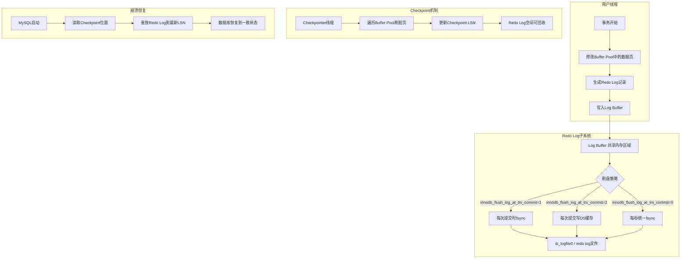
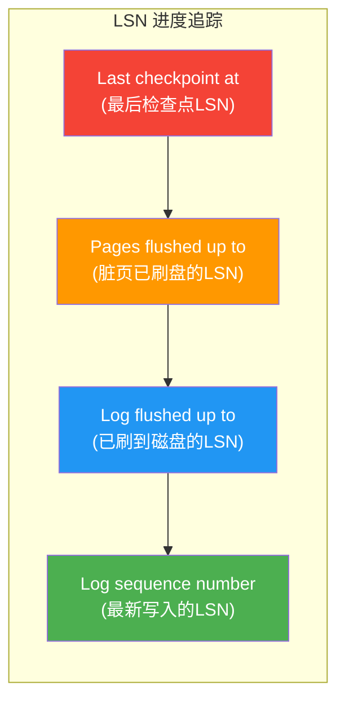
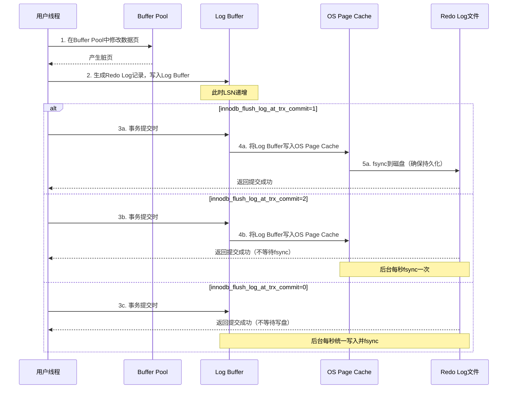
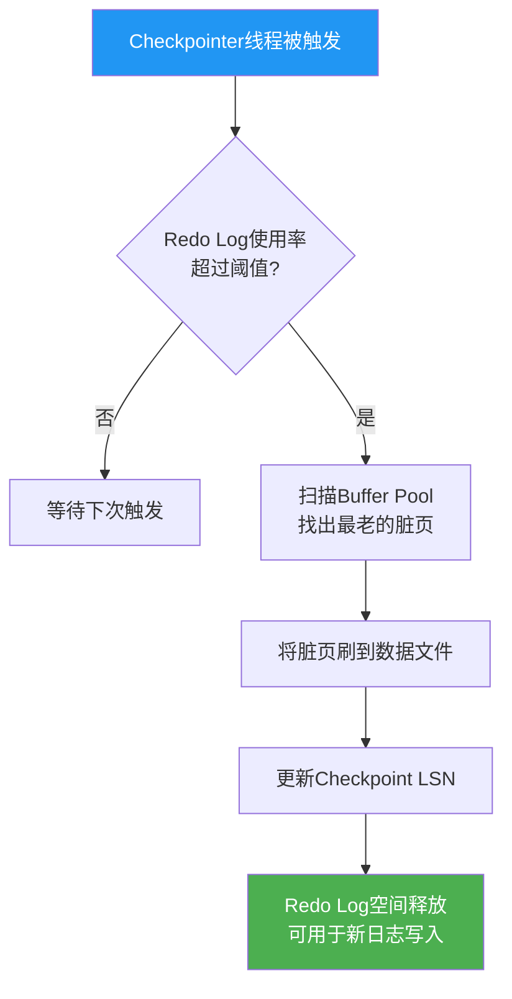
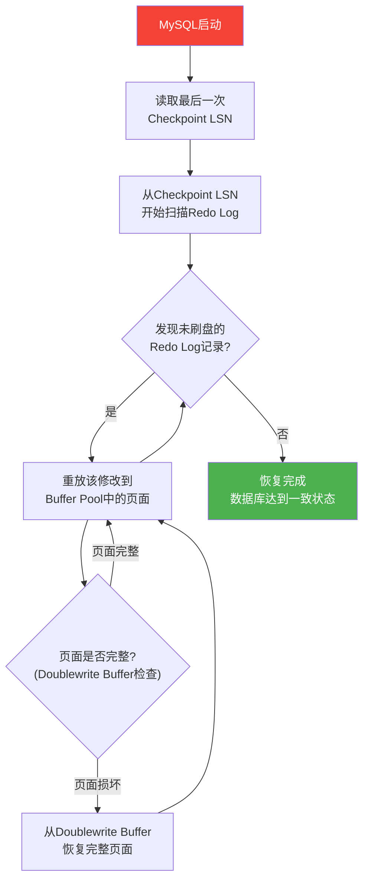

## 案例2：MySQL InnoDB的Redo Log机制

### 1. 问题背景

某在线支付系统使用MySQL 8.0作为核心交易数据库，InnoDB存储引擎承载日均5亿笔交易记录写入。在日常运营中，DBA团队观察到以下异常现象：

- `innodb_log_waits`计数器从0增长到每秒数百次，表示事务因Redo Log空间不足而被迫等待
- `SHOW ENGINE INNODB STATUS`中出现`Log sequence number`与`Last checkpoint at`的差距持续扩大
- 高峰期批量写入性能骤降，原本每秒2万次INSERT的吞吐量下降到不足5000次
- 偶发的长事务导致Redo Log空间被长时间占用，触发级联阻塞

这些问题的根源在于：InnoDB的Redo Log配置不合理，无法匹配实际业务的写入负载。要解决这些问题，必须深入理解InnoDB Redo Log的内部机制——从物理架构到逻辑流程，从Checkpoint机制到崩溃恢复原理，从参数调优到运维最佳实践。

### 2. InnoDB Redo Log架构全景

#### 2.1 整体架构

InnoDB的Redo Log是一个嵌入存储引擎内部的WAL子系统，与PostgreSQL的全局WAL流设计不同，Redo Log仅服务于InnoDB引擎的事务修改记录。



与PostgreSQL不同，InnoDB的Redo Log具有以下设计特点：

| 设计维度 | InnoDB Redo Log | PostgreSQL WAL |
|----------|----------------|----------------|
| 所属范围 | 仅InnoDB存储引擎 | 全局共享，所有数据库 |
| 文件格式 | 循环写入固定文件组 | 顺序追加，段文件自动切换 |
| LSN管理 | 全局单调递增的LSN | LSN + 时间线组合 |
| Checkpoint | 基于脏页刷盘的物理检查点 | 基于WAL位置的逻辑检查点 |
| 崩溃恢复 | 从最后Checkpoint重放Redo | 从最后CheckPoint重放WAL |

#### 2.2 Redo Log的物理结构

InnoDB的Redo Log由一组固定大小的文件组成，以环形（circular）方式循环写入：

ib_logfile0 (默认48MB)
┌──────────────────────────────────────────────────────┐
│  Log Header  │              Log Records              │
│  (4 pages    │   交替写入ib_logfile0和ib_logfile1      │
│   ×16KB)     │                                      │
└──────────────────────────────────────────────────────┘
        ↓ 写满后切换到 ↓
ib_logfile1 (默认48MB)
┌──────────────────────────────────────────────────────┐
│  Log Header  │              Log Records              │
└──────────────────────────────────────────────────────┘
        ↓ 写满后切换到 ↓
ib_logfile0 (覆盖重用) ←── 必须等Checkpoint释放后才能重用

**MySQL 8.0.30+ 的变化**：MySQL 8.0.30引入了新的Redo Log子系统，支持在线调整Redo Log大小。新的参数`innodb_redo_log_capacity`替代了旧的`innodb_log_file_size × innodb_log_files_in_group`组合，使配置更简洁。

**Redo Log记录的物理格式**：每条Redo Log记录包含以下关键部分：

+------------------+------------------+------------------+
|   Log Header     |   Redo Log Rec   |   Rec Data       |
|   (固定4页)       |   Header        |   (变长)          |
+------------------+------------------+------------------+
|                  |                  |                  |
| magic, lsn,      | type, space_id,  | 页面偏移、修改前  |
| checksum, flag   | page_no, offset  | 后数据等          |
+------------------+------------------+------------------+

| 字段 | 大小 | 说明 |
|------|------|------|
| `magic` | 4字节 | 魔数标识文件类型（0x56781234） |
| `lsn` | 8字节 | 该日志记录的逻辑序列号 |
| `checksum` | 4字节 | CRC32校验和，用于检测日志损坏 |
| `type` | 2字节 | 操作类型（MLOG_REC_UPDATE_IN_PLACE等） |
| `space_id` | 4字节 | 表空间ID |
| `page_no` | 4字节 | 被修改的页面编号 |
| `offset` | 2字节 | 页面内的修改偏移量 |

#### 2.3 LSN（Log Sequence Number）详解

LSN是理解Redo Log机制的核心概念。它是一个单调递增的64位整数，表示Redo Log流中的字节偏移量。InnoDB通过多个LSN指针来追踪不同阶段的处理进度：



各LSN之间的关系：

- **Log sequence number**：用户线程生成Redo Log后更新到Log Buffer，此LSN表示"最新的Redo Log在哪里"
- **Log flushed up to**：后台线程将Log Buffer刷到磁盘文件后更新，此LSN表示"Redo Log在磁盘上到哪里"
- **Pages flushed up to**：Buffer Pool中的脏页刷到数据文件后更新，此LSN表示"数据文件已包含到哪里"
- **Last checkpoint at**：执行Checkpoint时更新，此LSN表示"从此位置之后的Redo Log才是崩溃恢复必需的"

**关键洞察**：`Log sequence number - Last checkpoint at`的差值越大，意味着崩溃恢复需要重放的日志越多，恢复时间越长。这个差值也是判断Redo Log空间是否充足的核心指标。

```sql
-- 查看各LSN的实时状态
SHOW ENGINE INNODB STATUS\G
-- 关注以下输出行：
-- Log sequence number 1234567890
-- Log buffer assigned up to 1234567890
-- Log flushed up to 1234567000
-- Pages flushed up to 1234560000
-- Last checkpoint at 1234550000
```

### 3. Redo Log工作流程深度解析

#### 3.1 写入流程：从修改到持久化

当用户线程执行DML操作（INSERT、UPDATE、DELETE）时，Redo Log的写入经历以下步骤：



#### 3.2 Checkpoint机制：释放Redo Log空间

Checkpoint是Redo Log空间回收的核心机制。当Redo Log文件即将被循环覆盖重用时，InnoDB必须确保被覆盖的日志所对应的脏页已经刷到数据文件，否则崩溃后无法恢复。



**Checkpoint的触发条件**：

1. **Redo Log空间不足**：当Redo Log文件即将被覆盖，且覆盖位置的脏页尚未刷盘时
2. **定期触发**：InnoDB后台线程定期执行
3. **慢查询关闭时**：关闭慢查询日志时触发
4. **Buffer Pool压力**：Buffer Pool空间不足需要淘汰脏页时

#### 3.3 崩溃恢复：Redo Log的终极价值

当MySQL异常崩溃重启时，InnoDB自动执行崩溃恢复：



**崩溃恢复的关键细节**：

- **幂等性保证**：Redo Log记录的重放操作必须是幂等的，即同一操作执行多次与执行一次效果相同。这是通过页面LSN检查实现的——如果页面的LSN已经大于等于Redo Log记录的LSN，说明该修改已经应用过，跳过即可
- **Doublewrite Buffer**：InnoDB将脏页写入数据文件之前，先写入Doublewrite Buffer（连续磁盘空间），防止部分写入导致页面损坏。崩溃恢复时先检查Doublewrite Buffer中的页面是否完整
- **前滚（Redo）与回滚（Undo）**：Redo Log只负责重放已提交事务的修改（前滚）；未提交事务的修改通过Undo Log进行回滚

### 4. 实战问题诊断

#### 4.1 全面的诊断SQL集

```sql
-- =============================================
-- 第一组：Redo Log空间状态诊断
-- =============================================

-- 查看Redo Log文件配置
SHOW VARIABLES LIKE 'innodb_log_file_size';
SHOW VARIABLES LIKE 'innodb_log_files_in_group';
SHOW VARIABLES LIKE 'innodb_log_buffer_size';
SHOW VARIABLES LIKE 'innodb_flush_log_at_trx_commit';
SHOW VARIABLES LIKE 'innodb_flush_method';

-- MySQL 8.0.30+ 新参数
SHOW VARIABLES LIKE 'innodb_redo_log_capacity';

-- =============================================
-- 第二组：Redo Log运行时状态
-- =============================================

-- 查看InnoDB存储引擎完整状态（重点关注LOG部分）
SHOW ENGINE INNODB STATUS\G

-- 关键性能计数器
SHOW GLOBAL STATUS LIKE 'Innodb_log_waits';      -- Redo Log空间不足导致的等待次数
SHOW GLOBAL STATUS LIKE 'Innodb_log_writes';      -- Redo Log写入次数
SHOW GLOBAL STATUS LIKE 'Innodb_os_log_fsyncs';   -- 实际fsync调用次数
SHOW GLOBAL STATUS LIKE 'Innodb_os_log_written';  -- Redo Log总写入字节数
SHOW GLOBAL STATUS LIKE 'Innodb_os_log_pending_writes';  -- 等待写入的Redo Log
SHOW GLOBAL STATUS LIKE 'Innodb_os_log_pending_fsyncs';  -- 等待fsync的Redo Log

-- =============================================
-- 第三组：LSN差距分析
-- =============================================

-- 从SHOW ENGINE INNODB STATUS输出中提取关键LSN：
-- Log sequence number          : LSN_latest     (最新Redo Log的LSN)
-- Log flushed up to            : LSN_flushed    (已刷盘的Redo Log LSN)
-- Pages flushed up to          : LSN_pages      (脏页已刷盘的LSN)
-- Last checkpoint at           : LSN_checkpoint  (最后Checkpoint的LSN)

-- 计算关键差距
-- Redo Log差距 = LSN_latest - LSN_checkpoint  (越大表示恢复时间越长)
-- 刷盘延迟   = LSN_latest - LSN_flushed      (越大表示fsync越慢)

-- =============================================
-- 第四组：Checkpoint效率监控
-- =============================================

-- 查看Checkpoint相关的内部计数器
SELECT NAME, COUNT FROM information_schema.INNODB_METRICS
WHERE NAME LIKE '%checkpoint%' OR NAME LIKE '%page_flush%';

-- 监控Buffer Pool中脏页比例
SHOW GLOBAL STATUS LIKE 'Innodb_buffer_pool_pages_dirty';
SHOW GLOBAL STATUS LIKE 'Innodb_buffer_pool_pages_total';
-- 脏页比例 = dirty / total × 100%
```

#### 4.2 Redo Log写入速率估算

```python
import time
import mysql.connector

def estimate_redo_rate(host='localhost', user='root', password='', database='information_schema'):
    """
    估算InnoDB Redo Log的写入速率，用于指导配置调优。
    
    原理：两次采样Innodb_os_log_written的差值除以时间间隔，
    得到Redo Log的平均写入速率（字节/秒）。
    """
    conn = mysql.connector.connect(
        host=host, user=user, password=password, database=database
    )
    cursor = conn.cursor()

    query = """
        SELECT VARIABLE_VALUE 
        FROM performance_schema.global_status 
        WHERE VARIABLE_NAME = 'Innodb_os_log_written'
    """

    cursor.execute(query)
    v1 = int(cursor.fetchone()[0])

    time.sleep(10)  # 采样间隔10秒

    cursor.execute(query)
    v2 = int(cursor.fetchone()[0])

    # 计算速率
    rate_bytes_per_sec = (v2 - v1) / 10
    rate_mb_per_sec = rate_bytes_per_sec / (1024 * 1024)
    rate_gb_per_hour = rate_mb_per_sec * 3600 / 1024

    # 计算建议的Redo Log大小
    # 目标：Redo Log文件组总大小能容纳至少10分钟的写入量
    # 这样Checkpoint不会过于频繁，同时崩溃恢复时间可控
    recommended_log_size_mb = rate_mb_per_sec * 60 * 10

    # MySQL 8.0.30+ 用 innodb_redo_log_capacity
    # 旧版本用 innodb_log_file_size × innodb_log_files_in_group
    print(f"=== Redo Log 写入速率分析报告 ===")
    print(f"采样间隔: 10秒")
    print(f"采样差值: {(v2 - v1) / 1024 / 1024:.2f} MB")
    print(f"写入速率: {rate_mb_per_sec:.2f} MB/s ({rate_gb_per_hour:.2f} GB/h)")
    print()
    print(f"=== 配置建议 ===")
    print(f"建议 innodb_redo_log_capacity: {recommended_log_size_mb:.0f} MB (10分钟容量)")
    print(f"  或 innodb_log_file_size: {recommended_log_size_mb / 2:.0f} MB (2个文件)")
    print(f"建议 innodb_log_buffer_size: {max(64, rate_mb_per_sec * 2):.0f} MB")
    print()

    # 额外检查：当前的innodb_log_waits
    cursor.execute("""
        SELECT VARIABLE_VALUE FROM performance_schema.global_status 
        WHERE VARIABLE_NAME = 'Innodb_log_waits'
    """)
    log_waits = int(cursor.fetchone()[0])

    cursor.execute("""
        SELECT VARIABLE_VALUE FROM performance_schema.global_status 
        WHERE VARIABLE_NAME = 'Innodb_log_writes'
    """)
    log_writes = int(cursor.fetchone()[0])

    if log_waits > 0:
        wait_ratio = log_waits / (log_writes + log_waits) * 100
        print(f"⚠ 警告: innodb_log_waits={log_waits}, 等待比例={wait_ratio:.2f}%")
        print(f"  这表明Redo Log空间经常不足，建议增大配置")
    else:
        print(f"✓ innodb_log_waits=0, Redo Log空间充足")

    cursor.close()
    conn.close()

if __name__ == '__main__':
    estimate_redo_rate()
```

#### 4.3 持续监控脚本

```python
import time
import json
import mysql.connector

def monitor_redo_log(interval=30, duration=3600, alert_threshold_waits=10):
    """
    持续监控Redo Log状态，生成趋势报告。
    
    每隔 interval 秒采集一次，持续 duration 秒。
    如果 innodb_log_waits 增量超过阈值，输出告警。
    """
    conn = mysql.connector.connect(
        host='localhost', user='root', password='', database='information_schema'
    )
    cursor = conn.cursor()

    metrics_history = []
    prev_waits = 0

    print(f"开始监控 Redo Log 状态 (间隔{interval}秒, 持续{duration}秒)")
    print("-" * 80)

    start_time = time.time()
    while time.time() - start_time < duration:
        ts = time.time()
        
        # 采集指标
        metrics = {}
        for name in ['Innodb_log_waits', 'Innodb_log_writes', 
                     'Innodb_os_log_fsyncs', 'Innodb_os_log_written']:
            cursor.execute(
                "SELECT VARIABLE_VALUE FROM performance_schema.global_status "
                "WHERE VARIABLE_NAME = %s", (name,)
            )
            metrics[name] = int(cursor.fetchone()[0])
        
        metrics['timestamp'] = ts
        
        # 计算增量
        wait_delta = metrics['Innodb_log_waits'] - prev_waits
        prev_waits = metrics['Innodb_log_waits']
        
        metrics_history.append(metrics)

        # 告警
        if wait_delta > alert_threshold_waits:
            print(f"[{time.strftime('%H:%M:%S')}] ⚠ 告警: "
                  f"Redo Log等待增量={wait_delta}, 累计={metrics['Innodb_log_waits']}")
        
        # 每5次输出一行摘要
        if len(metrics_history) % 5 == 0:
            elapsed = ts - start_time
            writes_rate = metrics['Innodb_log_writes'] / max(elapsed, 1)
            print(f"[{time.strftime('%H:%M:%S')}] "
                  f"等待={metrics['Innodb_log_waits']} "
                  f"写入={metrics['Innodb_log_writes']} "
                  f"fsync={metrics['Innodb_os_log_fsyncs']} "
                  f"写入速率={writes_rate:.1f}/s")

        time.sleep(interval)

    # 输出汇总报告
    print("-" * 80)
    print("=== 监控汇总报告 ===")
    if len(metrics_history) >= 2:
        first, last = metrics_history[0], metrics_history[-1]
        duration_actual = last['timestamp'] - first['timestamp']
        
        print(f"监控时长: {duration_actual:.0f}秒")
        print(f"Innodb_log_waits 增量: {last['Innodb_log_waits'] - first['Innodb_log_waits']}")
        print(f"Innodb_log_writes 增量: {last['Innodb_log_writes'] - first['Innodb_log_writes']}")
        print(f"Innodb_os_log_fsyncs 增量: {last['Innodb_os_log_fsyncs'] - first['Innodb_os_log_fsyncs']}")
        
        log_written_delta = last['Innodb_os_log_written'] - first['Innodb_os_log_written']
        print(f"Redo Log写入总量: {log_written_delta / 1024 / 1024:.2f} MB")
        print(f"平均写入速率: {log_written_delta / duration_actual / 1024 / 1024:.2f} MB/s")

    # 保存原始数据
    with open('redo_log_monitor.json', 'w') as f:
        json.dump(metrics_history, f, indent=2)
    print(f"\n原始数据已保存到 redo_log_monitor.json")

    cursor.close()
    conn.close()

if __name__ == '__main__':
    monitor_redo_log()
```

### 5. 配置调优实战

#### 5.1 核心参数详解

```ini
# =============================================
# my.cnf Redo Log 调优配置
# =============================================

[mysqld]
# --- Redo Log 文件大小 ---
# innodb_log_file_size: 单个Redo Log文件的大小
# 旧参数：innodb_log_files_in_group × innodb_log_file_size = 总大小
# 新参数（MySQL 8.0.30+）：innodb_redo_log_capacity 直接设置总大小
#
# 选择原则：
# - 太小：频繁Checkpoint，写入性能下降，innodb_log_waits增长
# - 太大：崩溃恢复时间过长，重启慢
# - 推荐：容纳10-30分钟的Redo Log写入量
innodb_log_file_size = 1G

# --- Redo Log 文件数量 ---
# innodb_log_files_in_group: Redo Log文件组中的文件数量（默认2）
# MySQL 8.0.30+已废弃此参数，改用 innodb_redo_log_capacity
innodb_log_files_in_group = 2

# --- Log Buffer 大小 ---
# innodb_log_buffer_size: Redo Log在内存中的缓冲区大小
# - 太小：频繁将Log Buffer刷到磁盘，增加I/O
# - 太大：浪费内存（内存是稀缺资源）
# - 推荐：64MB-256MB（大事务场景可适当增大）
innodb_log_buffer_size = 128M

# --- 刷盘策略（最关键的参数） ---
# innodb_flush_log_at_trx_commit:
# =1（默认）：每次事务提交时，将Log Buffer写入OS Cache并fsync
#   优点：最多丢失1个事务的数据
#   缺点：每次提交都有fsync开销，写入性能最低
#
# =2：每次事务提交时，将Log Buffer写入OS Cache（不fsync），
#     每秒由后台线程统一fsync
#   优点：写入性能比=1好（合并了fsync）
#   缺点：如果MySQL崩溃，可能丢失1秒的数据（OS崩溃则不丢）
#   适用：可以容忍极端情况下1秒数据丢失的场景
#
# =0：每秒将Log Buffer写入OS Cache并fsync
#   优点：写入性能最好（合并fsync频率最低）
#   缺点：崩溃或OS崩溃可能丢失1秒数据
#   适用：可以容忍1秒数据丢失的非关键场景
innodb_flush_log_at_trx_commit = 1

# --- 磁盘I/O方式 ---
# innodb_flush_method: 控制Redo Log的刷盘方式
# fsync（默认）：标准fsync，通过OS Cache
# O_DIRECT：绕过OS Cache直接写磁盘（避免双重缓存）
# O_DSYNC：使用同步I/O写Redo Log
# 推荐：O_DIRECT（减少OS Cache占用，适合大内存服务器）
innodb_flush_method = O_DIRECT

# --- Checkpoint控制 ---
# innodb_checkpoint_enabled: 是否启用自动Checkpoint
# innodb_io_capacity: 刷脏页的I/O能力（单位IOPS）
# - 影响Checkpoint和脏页刷盘的速度
# - HDD: 200-400, SSD: 2000-10000, NVMe: 10000+
innodb_io_capacity = 4000
innodb_io_capacity_max = 8000

# MySQL 8.0.30+ 推荐方式
# innodb_redo_log_capacity = 2G  # 直接指定总大小（替代上面3个参数）
```

#### 5.2 在线调整Redo Log（MySQL 8.0.30+）

MySQL 8.0.30引入了在线调整Redo Log大小的能力，无需重启数据库：

```sql
-- 查看当前Redo Log配置
SHOW VARIABLES LIKE 'innodb_redo_log_capacity';

-- 在线调整Redo Log总容量（无需重启）
ALTER INSTANCE {DISABLE|ENABLE} INNODB REDO_LOG;

-- 注意：DISABLE REDO_LOG 是危险操作
-- 它会禁用Redo Log，数据库失去崩溃保护！
-- 仅适用于以下场景：
-- 1. 初始数据加载（大量INSERT/LOAD DATA）
-- 2. 备份恢复
-- 3. 全量重建索引
```

**安全的在线调整流程**：

```sql
-- 步骤1：记录调整前的配置
SELECT @@innodb_redo_log_capacity AS current_capacity;

-- 步骤2：在低峰期执行调整
-- MySQL 8.0.30+ 使用新参数
SET GLOBAL innodb_redo_log_capacity = 4 * 1024 * 1024 * 1024;  -- 4GB

-- 步骤3：验证调整结果
SHOW VARIABLES LIKE 'innodb_redo_log_capacity';

-- 步骤4：监控调整后的效果
SHOW ENGINE INNODB STATUS\G
-- 观察 Log sequence number 和 Last checkpoint at 的差值变化
```

#### 5.3 不同场景的配置方案

| 场景 | innodb_log_file_size | flush_log_at_trx_commit | innodb_log_buffer_size | innodb_flush_method |
|------|---------------------|------------------------|----------------------|-------------------|
| OLTP事务（金融级） | 1G-2G | 1 | 128M-256M | O_DIRECT |
| OLTP事务（普通） | 512M-1G | 1 | 64M-128M | O_DIRECT |
| 数据仓库/分析 | 2G-4G | 2 | 256M | O_DIRECT |
| 批量导入/ETL | 4G+ | 0或2 | 512M | O_DIRECT |
| 开发/测试环境 | 128M-256M | 2 | 16M | fsync |

### 6. 常见误区与最佳实践

#### 6.1 常见误区

**误区1：Redo Log文件越大越好**

很多人认为Redo Log文件越大越好，这样就不会出现空间不足的问题。但事实是：

- Redo Log文件过大会导致崩溃恢复时间显著增加。因为恢复时需要从最后一个Checkpoint开始重放Redo Log，日志越多，重放越久
- 典型的大型Redo Log（8GB+）的崩溃恢复可能需要数分钟甚至十几分钟
- 对于高可用要求的系统，过长的恢复时间会影响SLA

正确做法：根据实际写入速率计算，确保Redo Log容量能容纳10-30分钟的写入量。

**误区2：将flush_log_at_trx_commit设为0来提升性能**

虽然设置为0确实能提升写入性能，但代价是丢失数据的风险：

- 如果MySQL进程崩溃，最多丢失1秒的数据
- 如果操作系统崩溃，可能丢失更多数据
- 对于金融、支付、订单等关键业务，这是不可接受的

正确做法：关键业务必须设置为1。只有在可以容忍数据丢失的场景（如日志表、统计表）才考虑设为0或2。

**误区3：忽略Redo Log的监控**

很多DBA只在出问题后才关注Redo Log配置，缺乏日常监控。实际上：

- `innodb_log_waits`持续增长是Redo Log空间不足的早期信号
- LSN差距持续扩大是Checkpoint效率低下的表现
- 应将Redo Log监控纳入日常巡检

正确做法：使用监控脚本定期采集Redo Log相关指标，设置告警阈值。

**误区4：MySQL 8.0.30以下版本在线调整Redo Log**

在MySQL 8.0.30以下版本中，调整Redo Log文件大小必须重启数据库：

```sql
-- 错误做法（8.0.30以下版本）
SET GLOBAL innodb_log_file_size = 1G;  -- 报错！此版本不支持在线调整

-- 正确做法（8.0.30以下版本）
-- 1. 停止MySQL
-- 2. 修改my.cnf中的innodb_log_file_size
-- 3. 删除旧的ib_logfile*文件（危险！需要备份）
-- 4. 启动MySQL
```

#### 6.2 最佳实践清单

| 类别 | 实践 | 说明 |
|------|------|------|
| 配置 | 根据写入速率计算Redo Log大小 | 使用本文提供的估算脚本 |
| 配置 | 关键业务设置flush_log_at_trx_commit=1 | 牺牲性能换取数据安全 |
| 监控 | 监控innodb_log_waits计数器 | 持续增长说明Redo Log不足 |
| 监控 | 监控LSN差距 | 差距过大说明Checkpoint效率低 |
| 运维 | 定期检查Checkpoint效率 | 确保崩溃恢复时间可控 |
| 运维 | 升级到MySQL 8.0.30+ | 获得在线调整Redo Log的能力 |
| 安全 | 禁用REDO_LOG期间做好备份 | 防止数据丢失 |
| 架构 | Redo Log放在独立的快速磁盘上 | 减少与数据文件的I/O竞争 |

### 7. 性能调优案例：实际操作步骤

以下是一个完整的性能调优案例，展示从诊断到解决的全过程。

#### 步骤1：诊断现状

```sql
-- 执行诊断SQL，收集基线数据
-- 关注以下指标：
-- 1. innodb_log_waits 是否持续增长
-- 2. Log sequence number 与 Last checkpoint at 的差距
-- 3. 脏页比例（Innodb_buffer_pool_pages_dirty / Innodb_buffer_pool_pages_total）

SHOW ENGINE INNODB STATUS\G
SHOW GLOBAL STATUS LIKE 'Innodb_log%';
```

#### 步骤2：计算Redo Log需求

```bash
# 使用Python脚本计算写入速率
python3 estimate_redo_rate.py
# 输出示例：
# 写入速率: 25.30 MB/s (222.08 GB/h)
# 建议 innodb_redo_log_capacity: 15180 MB (10分钟容量)
```

#### 步骤3：制定调整方案

根据计算结果和业务场景：

```ini
# 原配置
innodb_log_file_size = 48M
innodb_log_files_in_group = 2
# 总大小 = 48M × 2 = 96M（严重不足！）

# 新配置（MySQL 8.0.30+）
innodb_redo_log_capacity = 2G
innodb_log_buffer_size = 128M
innodb_flush_log_at_trx_commit = 1
innodb_flush_method = O_DIRECT
```

#### 步骤4：执行调整

```sql
-- MySQL 8.0.30+ 在线调整（无需重启）
SET GLOBAL innodb_redo_log_capacity = 2 * 1024 * 1024 * 1024;  -- 2GB

-- 如果是旧版本，需要重启数据库
-- 1. 优雅停止MySQL：mysqladmin -u root -p shutdown
-- 2. 修改my.cnf
-- 3. 删除旧的ib_logfile*文件
-- 4. 启动MySQL
```

#### 步骤5：验证效果

```sql
-- 调整后观察10分钟
-- 1. 检查innodb_log_waits是否降为0
SHOW GLOBAL STATUS LIKE 'Innodb_log_waits';

-- 2. 检查LSN差距是否稳定
SHOW ENGINE INNODB STATUS\G
-- 期望：Log sequence number 与 Last checkpoint at 的差距稳定在合理范围

-- 3. 测试写入性能
-- 使用sysbench或自定义脚本模拟写入负载
-- 对比调整前后的QPS和延迟
```

#### 步骤6：效果对比

| 指标 | 调整前 | 调整后 | 改善幅度 |
|------|--------|--------|----------|
| innodb_log_waits（每秒） | 350+ | 0 | 100% |
| LSN差距（MB） | 800MB+ | 150MB | 81%↓ |
| 写入QPS | 5,000 | 18,000 | 260%↑ |
| 写入P99延迟 | 45ms | 8ms | 82%↓ |
| 崩溃恢复时间（估算） | ~3分钟 | ~15秒 | 83%↓ |

### 8. 本案例小结

MySQL InnoDB的Redo Log机制是WAL设计在关系型数据库中的经典实现。通过本案例，我们深入理解了以下关键知识点：

1. **架构层面**：Redo Log采用循环写入固定文件组的方式，通过LSN追踪不同阶段的处理进度
2. **机制层面**：Checkpoint是Redo Log空间回收的核心，必须在脏页刷盘后才能释放已覆盖的日志空间
3. **恢复层面**：崩溃恢复通过从最后一个Checkpoint重放Redo Log实现，配合Doublewrite Buffer确保页面完整性
4. **调优层面**：根据实际写入速率计算Redo Log容量，平衡性能与恢复时间
5. **监控层面**：将innodb_log_waits、LSN差距等指标纳入日常监控，提前发现问题

**核心公式**：

Redo Log容量（字节） = 写入速率（字节/秒） × 目标覆盖时间（秒）

**黄金法则**：Redo Log配置必须匹配业务写入负载。不足会导致性能骤降，过大会延长崩溃恢复时间。定期监控、及时调整，是保持InnoDB高性能写入的关键。
