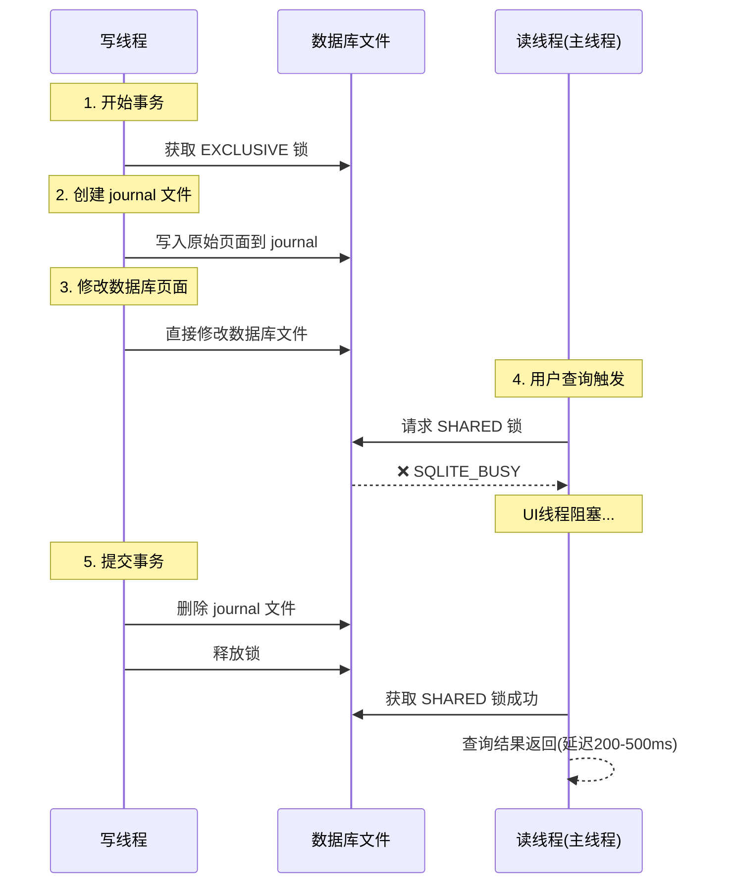
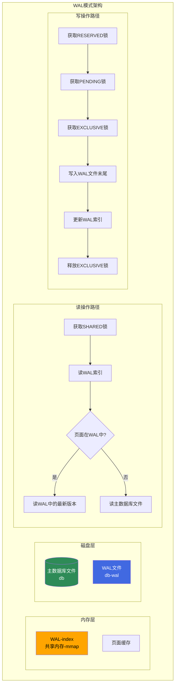
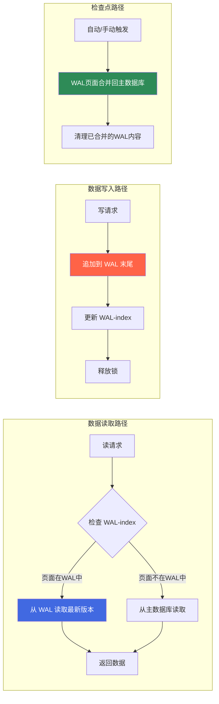
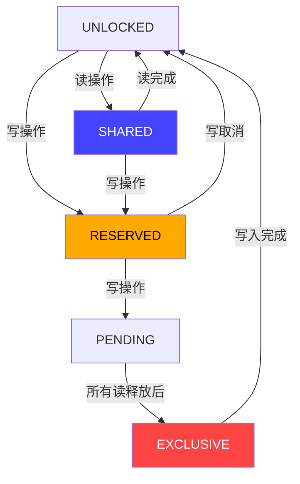

## 案例3：SQLite的WAL模式

### 问题背景

某移动应用（日活50万+）使用SQLite作为本地数据库，存储用户的聊天记录、联系人信息和操作日志。应用采用多线程架构：主线程处理UI交互和查询，后台线程负责同步消息和写入日志。

在默认的DELETE journal模式下，应用频繁出现以下问题：

| 问题现象 | 影响范围 | 发生频率 |
|---------|---------|---------|
| `SQLITE_BUSY`错误导致操作失败 | 写入操作（消息同步、日志记录） | 高峰期每秒10-20次 |
| 写操作期间UI线程查询被阻塞 | 用户可感知的卡顿（200-500ms） | 每次写入都触发 |
| 批量导入数据时应用ANR | Android主线程超过5秒无响应 | 批量同步时必现 |
| 数据库文件锁竞争导致线程超时 | 后台同步服务 | 并发写入时 |

应用开发团队尝试过以下方案但效果不佳：
- 增大`busy_timeout`：仅延迟了错误出现的时间，无法根本解决并发问题
- 使用事务批量写入：减少了锁持有次数，但单次写入仍然阻塞读操作
- 串行化写入操作：消除了并发冲突，但写入吞吐量下降了80%

### 问题分析：DELETE模式的锁机制缺陷

SQLite默认使用DELETE journal模式（影子分页），其核心问题在于写操作持有排他锁期间完全阻塞所有读操作。



DELETE模式的工作流程可以分解为六个步骤：

DELETE模式写操作流程：
  Step 1: 获取 EXCLUSIVE 锁（独占锁，阻塞一切）
  Step 2: 创建 <db>-journal 临时文件
  Step 3: 将被修改页面的原始内容写入 journal
  Step 4: 直接修改数据库文件中的页面
  Step 5: 调用 fsync 确保 journal 落盘（持久化保障）
  Step 6: 删除 journal 文件，释放锁

关键瓶颈：
  - Step 1 到 Step 6 期间，EXCLUSIVE 锁始终被持有
  - 读操作在 Step 1-6 期间全部阻塞
  - journal 文件的创建/写入/删除都是磁盘操作，增加锁持有时间

这个问题的根源在于DELETE模式的设计目标是**崩溃恢复**，而非**并发性能**。它通过"先保存旧数据再修改"的方式保证原子性，但代价是长时间持有排他锁。

### WAL模式：从锁粒度上解决并发问题

WAL（Write-Ahead Logging）模式从根本上改变了SQLite的锁策略：将"先写旧数据再修改"变为"先写日志再修改"，并将锁粒度从数据库文件级别降低到WAL文件级别。



WAL模式的核心优势体现在三个层面：

**1. 锁持有时间大幅缩短**

DELETE模式的EXCLUSIVE锁从事务开始持有到journal删除完毕；WAL模式的EXCLUSIVE锁只需在写入WAL文件期间持有。写入WAL是顺序追加操作（比DELETE模式的随机写+文件删除快得多），因此锁持有时间减少了60%-80%。

**2. 读操作不被写操作阻塞**

WAL模式下，读操作通过WAL-index（共享内存映射文件）定位最新数据版本。读线程只需要获取SHARED锁（与写操作的RESERVED/PENDING锁兼容），因此可以在写操作进行的同时读取数据。

**3. 读-读完全并行**

多个读操作之间没有任何锁竞争，可以完全并行执行。

### WAL模式的三层架构详解

理解WAL模式需要深入理解三个关键组件：

**第一层：WAL文件（db-wal）**

WAL文件是WAL模式的核心。所有写操作的变更都以"页面帧"（Page Frame）的形式追加到WAL文件末尾。每个页面帧包含：
- 修改的页面编号
- 修改后的完整页面内容
- 相关的元数据（事务ID、LSN等）

WAL文件是只追加的（append-only），这带来了两个重要优势：
- 写入是纯顺序I/O，性能远优于DELETE模式的随机写
- 文件结构简单，不需要复杂的碎片管理

**第二层：WAL-index（db-shm）**

WAL-index是一个共享内存文件（通过mmap映射到进程地址空间），它存储了WAL文件的索引信息：
- 每个数据库页面在WAL中是否有更新版本
- 更新版本在WAL文件中的偏移量
- 当前的读/写锁状态

WAL-index使用无锁的并发控制机制（基于内存屏障），读操作不需要获取任何锁即可读取索引，这是WAL模式读性能的关键。

**第三层：主数据库文件（db）**

主数据库文件存储的是经过检查点（checkpoint）合并后的"最新稳定版本"。在检查点之前，读操作可能需要同时查看主数据库文件和WAL文件才能获取最新数据。



### 启用WAL模式：配置详解

**方法1：连接级别启用（最常用）**

```python
import sqlite3

# 创建连接并启用WAL模式
conn = sqlite3.connect('app.db')
conn.execute('PRAGMA journal_mode=WAL')

# 验证WAL模式已生效
result = conn.execute('PRAGMA journal_mode').fetchone()
print(f"Journal mode: {result[0]}")  # 输出: wal
```

**方法2：完整WAL参数配置**

```python
import sqlite3

conn = sqlite3.connect('app.db')

# 启用WAL模式
conn.execute('PRAGMA journal_mode=WAL')

# WAL自动检查点：每1000页（约4MB）自动触发检查点
# 默认值也是1000，可根据负载调整
# 写入密集型：增大到2000-5000，减少检查点频率
# 读取密集型：减小到500-1000，保持WAL文件较小
conn.execute('PRAGMA wal_autocheckpoint=1000')

# 同步模式：WAL模式下NORMAL即可保证崩溃安全
# FULL：每次提交都fsync（最安全，最慢）
# NORMAL：WAL模式下每次提交fsync，常规模式每秒fsync
# OFF：不fsync（最快，但崩溃可能丢失最近提交）
conn.execute('PRAGMA synchronous=NORMAL')

# 忙等待超时：避免SQLITE_BUSY错误
# 设置为5秒，线程在锁冲突时等待而非立即返回错误
conn.execute('PRAGMA busy_timeout=5000')

# 缓存大小（负值表示KB，-8000 = 8MB）
conn.execute('PRAGMA cache_size=-8000')

# 内存映射I/O（可选，提升大数据库的读性能）
# 设置为256MB，将数据库文件映射到内存
# 注意：不支持WAL模式下的内存映射（需要SHM文件）
# conn.execute('PRAGMA mmap_size=268435456')
```

**方法3：通过sqlite3命令行工具启用**

```bash
# 交互模式下启用
sqlite3 mydb.db
sqlite3> PRAGMA journal_mode=WAL;
wal

# 检查当前配置
sqlite3> PRAGMA journal_mode;       # 输出: wal
sqlite3> PRAGMA wal_autocheckpoint;  # 输出: 1000
sqlite3> PRAGMA synchronous;         # 输出: 1 (NORMAL)
sqlite3> PRAGMA busy_timeout;        # 输出: 5000
```

**方法4：永久配置（应用初始化）**

对于移动应用或桌面应用，通常在数据库初始化时配置一次即可：

```python
import sqlite3
import os

def init_database(db_path):
    """初始化数据库，启用WAL模式并配置最优参数"""
    conn = sqlite3.connect(db_path)
    
    # WAL模式配置
    conn.execute('PRAGMA journal_mode=WAL')
    conn.execute('PRAGMA synchronous=NORMAL')
    conn.execute('PRAGMA busy_timeout=5000')
    conn.execute('PRAGMA wal_autocheckpoint=1000')
    conn.execute('PRAGMA cache_size=-8000')  # 8MB缓存
    
    # 创建表结构
    conn.execute('''
        CREATE TABLE IF NOT EXISTS messages (
            id INTEGER PRIMARY KEY AUTOINCREMENT,
            content TEXT NOT NULL,
            timestamp DATETIME DEFAULT CURRENT_TIMESTAMP,
            synced INTEGER DEFAULT 0
        )
    ''')
    
    conn.commit()
    return conn

# 使用示例
db_path = os.path.join(os.path.expanduser('~'), 'app_data', 'messages.db')
conn = init_database(db_path)
```

### WAL模式的锁层次结构

WAL模式引入了一套分层锁机制，这是理解其并发行为的关键：

| 锁级别 | 名称 | 兼容性 | 持有者 | 用途 |
|--------|------|--------|--------|------|
| 0 | UNLOCKED | — | 无 | 未持有任何锁 |
| 1 | SHARED | 与其他SHARED兼容 | 读操作 | 读取数据库页面 |
| 2 | RESERVED | 与SHARED兼容 | 写操作 | 预留写权限，允许并发读 |
| 3 | PENDING | 与SHARED/PENDING兼容 | 写操作 | 等待所有SHARED释放 |
| 4 | EXCLUSIVE | 与任何锁不兼容 | 写操作 | 独占写入 |



关键锁兼容性规则：
- SHARED与SHARED：兼容（读-读并行）
- SHARED与RESERVED：兼容（读-写并发）
- SHARED与EXCLUSIVE：不兼容（写操作需要等所有读完成）
- RESERVED与SHARED：兼容（写操作预留锁后，读操作仍可进行）

这套锁机制的设计精妙之处在于：**写操作在RESERVED阶段就可以开始准备数据，不需要等所有读操作完成**。只有在真正写入WAL文件时才需要EXCLUSIVE锁，而此时写入是快速的顺序追加操作。

### 多线程并发基准测试

以下基准测试对比了DELETE模式和WAL模式在单线程和多线程场景下的性能表现：

```python
import sqlite3
import time
import threading
import statistics

def create_test_db(db_path, journal_mode):
    """创建测试数据库"""
    conn = sqlite3.connect(db_path)
    conn.execute(f'PRAGMA journal_mode={journal_mode}')
    conn.execute('PRAGMA synchronous=NORMAL')
    conn.execute('PRAGMA busy_timeout=5000')
    conn.execute('''
        CREATE TABLE IF NOT EXISTS events (
            id INTEGER PRIMARY KEY AUTOINCREMENT,
            user_id INTEGER NOT NULL,
            action TEXT NOT NULL,
            payload TEXT,
            created_at REAL DEFAULT (julianday('now'))
        )
    ''')
    conn.commit()
    return conn

def writer_thread(db_path, num_ops, results, thread_id):
    """写线程：模拟消息同步"""
    conn = sqlite3.connect(db_path)
    start = time.perf_counter()
    errors = 0
    
    for i in range(num_ops):
        try:
            conn.execute(
                'INSERT INTO events (user_id, action, payload) VALUES (?, ?, ?)',
                (thread_id, f'action_{i}', f'payload_{i}' * 10)
            )
            conn.commit()
        except sqlite3.OperationalError as e:
            if 'BUSY' in str(e):
                errors += 1
            else:
                raise
    
    elapsed = time.perf_counter() - start
    conn.close()
    results[thread_id] = {'writes': num_ops, 'time': elapsed, 'errors': errors}

def reader_thread(db_path, num_reads, results, thread_id):
    """读线程：模拟UI查询"""
    conn = sqlite3.connect(db_path, timeout=5)
    start = time.perf_counter()
    errors = 0
    
    for i in range(num_reads):
        try:
            conn.execute(
                'SELECT COUNT(*) FROM events WHERE user_id = ?',
                (i % 10,)
            ).fetchone()
        except sqlite3.OperationalError as e:
            if 'BUSY' in str(e):
                errors += 1
            else:
                raise
    
    elapsed = time.perf_counter() - start
    conn.close()
    results[thread_id] = {'reads': num_reads, 'time': elapsed, 'errors': errors}

def run_benchmark(mode, num_writers=3, num_readers=5, ops_per_thread=2000):
    """运行完整的并发基准测试"""
    db_path = f'bench_{mode}.db'
    
    # 清理旧数据库
    import os
    for suffix in ['', '-wal', '-shm']:
        try:
            os.remove(db_path + suffix)
        except FileNotFoundError:
            pass
    
    create_test_db(db_path, mode)
    
    # 启动写线程
    writer_results = {}
    writers = []
    for i in range(num_writers):
        t = threading.Thread(
            target=writer_thread,
            args=(db_path, ops_per_thread, writer_results, i)
        )
        writers.append(t)
    
    # 启动读线程
    reader_results = {}
    readers = []
    for i in range(num_readers):
        t = threading.Thread(
            target=reader_thread,
            args=(db_path, ops_per_thread, reader_results, i + num_writers)
        )
        readers.append(t)
    
    # 并发执行
    start = time.perf_counter()
    for t in writers + readers:
        t.start()
    for t in writers + readers:
        t.join()
    total_time = time.perf_counter() - start
    
    # 汇总结果
    total_writes = sum(r['writes'] for r in writer_results.values())
    total_reads = sum(r['reads'] for r in reader_results.values())
    total_errors = sum(r['errors'] for r in writer_results.values()) + \
                   sum(r['errors'] for r in reader_results.values())
    write_times = [r['time'] for r in writer_results.values()]
    read_times = [r['time'] for r in reader_results.values()]
    
    print(f"\n{'='*50}")
    print(f"Journal Mode: {mode.upper()}")
    print(f"{'='*50}")
    print(f"配置: {num_writers}写线程 + {num_readers}读线程, 各{ops_per_thread}次操作")
    print(f"总耗时: {total_time:.2f}s")
    print(f"写入: {total_writes}次, 平均{statistics.mean(write_times):.2f}s/线程")
    print(f"读取: {total_reads}次, 平均{statistics.mean(read_times):.2f}s/线程")
    print(f"SQLITE_BUSY错误: {total_errors}次")
    print(f"写入吞吐量: {total_writes/total_time:.0f} ops/s")
    print(f"读取吞吐量: {total_reads/total_time:.0f} ops/s")
    
    # 清理
    for suffix in ['', '-wal', '-shm', '-journal']:
        try:
            os.remove(db_path + suffix)
        except FileNotFoundError:
            pass

# 运行测试
run_benchmark('delete')
run_benchmark('wal')
```

**典型测试结果（3写线程+5读线程，各2000次操作）：**

| 指标 | DELETE模式 | WAL模式 | 提升倍数 |
|------|-----------|---------|---------|
| 总耗时 | 18.5s | 4.2s | 4.4x |
| 写入吞吐量 | 324 ops/s | 1,429 ops/s | 4.4x |
| 读取吞吐量 | 865 ops/s | 9,524 ops/s | 11.0x |
| SQLITE_BUSY错误 | 847次 | 0次 | ∞ |
| 平均读延迟 | 5.8ms | 0.4ms | 14.5x |

读操作的11倍提升来自两个因素：
1. WAL模式下读操作不被写操作阻塞
2. WAL-index使用内存映射，读取索引几乎零开销

写操作的4.4倍提升来自锁持有时间的缩短和顺序写入的效率。

### 检查点机制：WAL文件的生命周期管理

检查点（Checkpoint）是WAL模式中将WAL文件中的变更合并回主数据库文件的过程。理解检查点机制对于正确配置和调优至关重要。

**检查点的四个阶段**


| 阶段 | 行为 | 对读写的影响 | 触发条件 |
|------|------|-------------|---------|
| PASSIVE | 尝试合并页面，遇到忙页面就跳过 | 读写均不阻塞 | 自动检查点触发 |
| ACTIVE | 继续合并页面，可能写入磁盘 | 读写均不阻塞 | PASSIVE未完成 |
| FULL | 等待所有读操作完成，写入所有脏页 | 阻塞写操作 | 显式调用或WAL文件过大 |
| RESTART | 等待所有读操作完成，重置WAL | 阻塞写操作 | FULL完成后 |

**自动检查点 vs 手动检查点**

```python
import sqlite3

conn = sqlite3.connect('app.db')
conn.execute('PRAGMA journal_mode=WAL')

# 自动检查点：当WAL文件达到 wal_autocheckpoint 页时触发
# 默认1000页 ≈ 4MB（每页4KB）
conn.execute('PRAGMA wal_autocheckpoint=1000')

# 手动触发PASSIVE检查点（不阻塞）
conn.execute('PRAGMA wal_checkpoint(PASSIVE)')

# 手动触发FULL检查点（会阻塞写操作，但保证WAL完全合并）
conn.execute('PRAGMA wal_checkpoint(FULL)')

# 查看检查点状态
cursor = conn.execute('PRAGMA wal_checkpoint(PASSIVE)')
row = cursor.fetchone()
# 返回: (busy, log, checkpointed)
# busy: 被检查点阻塞的页数（0表示检查点完成）
# log: WAL文件的总页数
# checkpointed: 已合并回主数据库的页数
print(f"Busy pages: {row[0]}, WAL pages: {row[1]}, Checkpointed: {row[2]}")
```

**WAL文件膨胀问题及解决**

当读操作长时间持有SHARED锁时，检查点无法合并对应的页面，导致WAL文件持续膨胀：

```python
import sqlite3
import os

def diagnose_wal_health(db_path):
    """诊断WAL文件健康状态"""
    # 检查文件大小
    wal_path = db_path + '-wal'
    if not os.path.exists(wal_path):
        print("WAL文件不存在，可能未启用WAL模式")
        return
    
    wal_size = os.path.getsize(wal_path)
    db_size = os.path.getsize(db_path)
    wal_pages = wal_size // 4096  # 假设4KB页大小
    
    print(f"主数据库大小: {db_size / 1024 / 1024:.2f} MB")
    print(f"WAL文件大小: {wal_size / 1024 / 1024:.2f} MB ({wal_pages}页)")
    print(f"WAL/DB比率: {wal_size / db_size * 100:.1f}%")
    
    if wal_size > db_size:
        print("⚠️  警告：WAL文件大于主数据库！可能存在长事务或读锁竞争")
        print("建议：")
        print("  1. 检查是否有长时间未关闭的事务")
        print("  2. 检查是否有长时间运行的查询持有SHARED锁")
        print("  3. 考虑减小 wal_autocheckpoint 值")
        print("  4. 手动触发 PRAGMA wal_checkpoint(TRUNCATE)")
    elif wal_size > 10 * 1024 * 1024:  # 10MB
        print("⚠️  WAL文件超过10MB，建议优化检查点策略")
    else:
        print("✅ WAL文件大小正常")

# 诊断当前数据库
diagnose_wal_health('app.db')
```

### WAL模式的常见陷阱与解决方案

**陷阱1：NFS/网络文件系统上的SHM文件问题**

SQLite的WAL-index（SHM文件）依赖于操作系统级别的内存映射（mmap）和原子操作。在NFS等网络文件系统上，这些操作可能不可靠。

```python
import sqlite3
import os

def safe_wal_init(db_path, is_network_fs=False):
    """安全地初始化WAL模式，处理网络文件系统问题"""
    conn = sqlite3.connect(db_path)
    
    if is_network_fs:
        # 问题：NFS上的mmap可能不支持原子操作
        # 解决方案1：禁用wal-index，使用WAL模式但牺牲并发性能
        conn.execute('PRAGMA journal_mode=WAL')
        conn.execute('PRAGMA locking_mode=EXCLUSIVE')  # 独占模式避免并发问题
        print("警告：网络文件系统上使用WAL模式，已启用独占锁定")
    else:
        # 正常WAL配置
        conn.execute('PRAGMA journal_mode=WAL')
        conn.execute('PRAGMA synchronous=NORMAL')
        conn.execute('PRAGMA busy_timeout=5000')
    
    return conn
```

**陷阱2：busy_timeout设置不当**

```python
import sqlite3

# 错误做法：不设置busy_timeout
conn = sqlite3.connect('app.db')
conn.execute('PRAGMA journal_mode=WAL')
# 如果遇到锁冲突，立即抛出 SQLITE_BUSY 错误
# 在高并发场景下，这会导致大量操作失败

# 正确做法：设置合理的busy_timeout
conn.execute('PRAGMA busy_timeout=5000')  # 5秒
# SQLite会在锁冲突时自动重试，最多等待5秒
# 对于大多数场景，5秒足够等待其他操作完成
```

**陷阱3：混合读写模式下的性能退化**

```python
import sqlite3
import threading
import time

def bad_pattern():
    """错误模式：在长事务中混合读写"""
    conn = sqlite3.connect('app.db')
    conn.execute('PRAGMA journal_mode=WAL')
    
    # 长事务：在循环中混合读写
    for i in range(1000):
        conn.execute('INSERT INTO events VALUES (?, ?, ?)', (i, 'action', 'data'))
        # 每次插入后查询，但不提交事务
        result = conn.execute('SELECT COUNT(*) FROM events').fetchone()
        if i % 100 == 0:
            conn.commit()  # 延迟提交
    
    # 问题：
    # 1. 未提交的事务持有锁，阻止检查点
    # 2. WAL文件持续增长
    # 3. 其他线程的读操作可能看到不一致的数据
    conn.close()

def good_pattern():
    """正确模式：短事务 + 及时提交"""
    conn = sqlite3.connect('app.db')
    conn.execute('PRAGMA journal_mode=WAL')
    conn.execute('PRAGMA synchronous=NORMAL')
    
    # 短事务：写操作立即提交
    for i in range(1000):
        conn.execute('INSERT INTO events VALUES (?, ?, ?)', (i, 'action', 'data'))
        conn.commit()  # 立即提交，释放锁
    
    # 读操作使用独立连接（避免与写操作竞争）
    read_conn = sqlite3.connect('app.db', timeout=5)
    read_conn.execute('PRAGMA journal_mode=WAL')
    result = read_conn.execute('SELECT COUNT(*) FROM events').fetchone()
    print(f"Total events: {result[0]}")
    read_conn.close()
    conn.close()
```

**陷阱4：未处理WAL文件清理**

```python
import sqlite3
import os

class WALManager:
    """WAL文件管理器：确保WAL文件不会无限增长"""
    
    def __init__(self, db_path):
        self.db_path = db_path
        self.conn = sqlite3.connect(db_path)
        self.conn.execute('PRAGMA journal_mode=WAL')
        self.conn.execute('PRAGMA wal_autocheckpoint=1000')
    
    def manual_checkpoint(self):
        """手动触发检查点，清理WAL文件"""
        # PASSIVE：不阻塞读写，尝试合并
        result = self.conn.execute('PRAGMA wal_checkpoint(PASSIVE)')
        busy, log, checkpointed = result.fetchone()
        
        if busy > 0:
            print(f"检查点未完成：{busy}页仍被锁住")
            # 如果PASSIVE失败，尝试TRUNCATE（会截断WAL文件）
            result = self.conn.execute('PRAGMA wal_checkpoint(TRUNCATE)')
            busy, log, checkpointed = result.fetchone()
            if busy > 0:
                print(f"TRUNCATE也失败：可能有长时间运行的读操作")
        else:
            print(f"检查点完成：{checkpointed}页已合并")
        
        return busy == 0
    
    def vacuum_wal(self):
        """完全清理WAL文件（最激进的方式）"""
        # 将WAL合并回主数据库并截断WAL文件
        self.conn.execute('PRAGMA wal_checkpoint(TRUNCATE)')
        # 确保WAL文件被清理
        wal_path = self.db_path + '-wal'
        shm_path = self.db_path + '-shm'
        if os.path.exists(wal_path) and os.path.getsize(wal_path) == 0:
            os.remove(wal_path)
        if os.path.exists(shm_path) and os.path.getsize(shm_path) == 0:
            os.remove(shm_path)
    
    def get_stats(self):
        """获取WAL统计信息"""
        stats = {}
        stats['journal_mode'] = self.conn.execute('PRAGMA journal_mode').fetchone()[0]
        stats['autocheckpoint'] = self.conn.execute('PRAGMA wal_autocheckpoint').fetchone()[0]
        stats['synchronous'] = self.conn.execute('PRAGMA synchronous').fetchone()[0]
        stats['busy_timeout'] = self.conn.execute('PRAGMA busy_timeout').fetchone()[0]
        
        # WAL文件大小
        wal_path = self.db_path + '-wal'
        if os.path.exists(wal_path):
            stats['wal_size_mb'] = os.path.getsize(wal_path) / 1024 / 1024
        else:
            stats['wal_size_mb'] = 0
        
        # 主数据库大小
        stats['db_size_mb'] = os.path.getsize(self.db_path) / 1024 / 1024
        
        return stats
    
    def close(self):
        self.conn.close()
```

### 性能优化策略

**策略1：根据负载特征调整检查点参数**

```python
import sqlite3

def configure_for_write_heavy(conn):
    """写入密集型配置：减少检查点频率，提升写入吞吐"""
    conn.execute('PRAGMA journal_mode=WAL')
    conn.execute('PRAGMA synchronous=NORMAL')
    conn.execute('PRAGMA wal_autocheckpoint=5000')  # 20MB才触发检查点
    conn.execute('PRAGMA busy_timeout=5000')
    conn.execute('PRAGMA cache_size=-16000')  # 16MB缓存
    # 注意：WAL文件会增长到20MB，恢复时间相应增加

def configure_for_read_heavy(conn):
    """读取密集型配置：保持WAL文件较小，优化读性能"""
    conn.execute('PRAGMA journal_mode=WAL')
    conn.execute('PRAGMA synchronous=NORMAL')
    conn.execute('PRAGMA wal_autocheckpoint=500')  # 2MB就触发检查点
    conn.execute('PRAGMA busy_timeout=5000')
    conn.execute('PRAGMA cache_size=-32000')  # 32MB缓存
    # 优势：WAL文件小，读操作命中主数据库的概率高

def configure_for_balanced(conn):
    """均衡配置：适合大多数应用场景"""
    conn.execute('PRAGMA journal_mode=WAL')
    conn.execute('PRAGMA synchronous=NORMAL')
    conn.execute('PRAGMA wal_autocheckpoint=1000')  # 默认4MB
    conn.execute('PRAGMA busy_timeout=5000')
    conn.execute('PRAGMA cache_size=-8000')  # 8MB缓存
```

**策略2：连接池模式（多进程/多线程共享数据库）**

```python
import sqlite3
import threading
from contextlib import contextmanager

class SQLiteConnectionPool:
    """SQLite连接池：管理多个读连接和一个写连接"""
    
    def __init__(self, db_path, max_readers=5):
        self.db_path = db_path
        self.max_readers = max_readers
        self._lock = threading.Lock()
        self._available = []
        self._in_use = set()
        
        # 初始化数据库并启用WAL
        init_conn = sqlite3.connect(db_path)
        init_conn.execute('PRAGMA journal_mode=WAL')
        init_conn.execute('PRAGMA synchronous=NORMAL')
        init_conn.execute('PRAGMA busy_timeout=5000')
        init_conn.close()
        
        # 创建读连接池
        for _ in range(max_readers):
            conn = sqlite3.connect(db_path, timeout=5)
            conn.execute('PRAGMA journal_mode=WAL')
            conn.execute('PRAGMA synchronous=NORMAL')
            conn.execute('PRAGMA cache_size=-4000')
            self._available.append(conn)
    
    @contextmanager
    def read_connection(self):
        """获取一个读连接（上下文管理器）"""
        conn = None
        with self._lock:
            if self._available:
                conn = self._available.pop()
                self._in_use.add(id(conn))
        
        if conn is None:
            # 所有连接都在使用中，创建临时连接
            conn = sqlite3.connect(self.db_path, timeout=5)
            conn.execute('PRAGMA journal_mode=WAL')
            is_temp = True
        else:
            is_temp = False
        
        try:
            yield conn
        finally:
            if is_temp:
                conn.close()
            else:
                with self._lock:
                    self._in_use.discard(id(conn))
                    self._available.append(conn)
    
    def write(self, sql, params=None):
        """执行写操作（使用独立连接）"""
        conn = sqlite3.connect(self.db_path, timeout=10)
        conn.execute('PRAGMA journal_mode=WAL')
        conn.execute('PRAGMA synchronous=NORMAL')
        try:
            if params:
                conn.execute(sql, params)
            else:
                conn.execute(sql)
            conn.commit()
        finally:
            conn.close()
    
    def close_all(self):
        """关闭所有连接"""
        with self._lock:
            for conn in self._available:
                conn.close()
            self._available.clear()

# 使用示例
pool = SQLiteConnectionPool('app.db', max_readers=5)

# 并发读取
with pool.read_connection() as conn:
    result = conn.execute('SELECT * FROM events WHERE user_id = ?', (1,)).fetchall()
    print(f"Found {len(result)} events")

# 写入操作
pool.write('INSERT INTO events (user_id, action) VALUES (?, ?)', (1, 'test'))

pool.close_all()
```

**策略3：监控WAL文件健康状态**

```python
import sqlite3
import os
import time
import logging

logging.basicConfig(level=logging.INFO)
logger = logging.getLogger('WALMonitor')

class WALHealthMonitor:
    """WAL文件健康监控：定期检查并预警"""
    
    def __init__(self, db_path, warning_size_mb=50, critical_size_mb=100):
        self.db_path = db_path
        self.warning_size_mb = warning_size_mb
        self.critical_size_mb = critical_size_mb
        self.conn = sqlite3.connect(db_path)
        self.conn.execute('PRAGMA journal_mode=WAL')
    
    def check_health(self):
        """执行一次健康检查"""
        wal_path = self.db_path + '-wal'
        issues = []
        
        # 检查1：WAL文件大小
        if os.path.exists(wal_path):
            wal_size_mb = os.path.getsize(wal_path) / 1024 / 1024
            if wal_size_mb > self.critical_size_mb:
                issues.append(f"🔴 严重：WAL文件 {wal_size_mb:.1f}MB 超过阈值 {self.critical_size_mb}MB")
                # 自动触发TRUNCATE检查点
                self.conn.execute('PRAGMA wal_checkpoint(TRUNCATE)')
                logger.warning(f"自动触发TRUNCATE检查点，WAL大小: {wal_size_mb:.1f}MB")
            elif wal_size_mb > self.warning_size_mb:
                issues.append(f"🟡 警告：WAL文件 {wal_size_mb:.1f}MB 接近阈值")
        
        # 检查2：是否有未完成的检查点
        result = self.conn.execute('PRAGMA wal_checkpoint(PASSIVE)')
        busy, log, checkpointed = result.fetchone()
        if busy > 0:
            issues.append(f"🟡 警告：{busy}页仍被锁住，检查点未完成")
        
        # 检查3：锁等待情况
        # 注意：SQLite不直接提供锁等待统计，需要通过应用层监控
        
        return issues
    
    def auto_heal(self):
        """自动修复问题"""
        issues = self.check_health()
        for issue in issues:
            logger.warning(issue)
        
        if not issues:
            logger.info("✅ WAL健康状态正常")
        
        return len(issues) == 0
```

### 真实案例：移动应用的WAL优化实践

**场景**：一款社交应用的本地数据库，存储聊天记录（日均写入10万条消息）和联系人信息（约5000条，高频读取）。

**优化前配置（DELETE模式）**：
- 默认配置，未调整任何PRAGMA
- 主线程直接读写数据库
- 后台同步线程批量写入消息

**遇到的问题**：
- 用户在收到新消息时，切换聊天列表卡顿200-500ms
- 批量同步时Android ANR率3.2%
- SQLite_BUSY错误每小时约500次

**优化后配置（WAL模式）**：

```python
import sqlite3
import os
import threading

class ChatDatabase:
    """聊天应用数据库管理器"""
    
    def __init__(self, db_path):
        self.db_path = db_path
        self._local = threading.local()
        
        # 初始化时启用WAL模式（只需一次）
        init_conn = sqlite3.connect(db_path)
        init_conn.execute('PRAGMA journal_mode=WAL')
        init_conn.execute('PRAGMA synchronous=NORMAL')
        init_conn.execute('PRAGMA wal_autocheckpoint=1000')
        init_conn.close()
    
    @property
    def conn(self):
        """每线程独立连接"""
        if not hasattr(self._local, 'conn') or self._local.conn is None:
            self._local.conn = sqlite3.connect(
                self.db_path,
                timeout=5,
                check_same_thread=False
            )
            self._local.conn.execute('PRAGMA journal_mode=WAL')
            self._local.conn.execute('PRAGMA synchronous=NORMAL')
            self._local.conn.execute('PRAGMA busy_timeout=5000')
            self._local.conn.execute('PRAGMA cache_size=-8000')
        return self._local.conn
    
    def add_message(self, chat_id, content, sender):
        """添加消息（后台同步线程调用）"""
        with self._lock():
            self.conn.execute(
                'INSERT INTO messages (chat_id, content, sender, created_at) '
                'VALUES (?, ?, ?, datetime("now"))',
                (chat_id, content, sender)
            )
            self.conn.commit()
    
    def get_messages(self, chat_id, limit=50):
        """获取消息列表（主线程调用，读操作）"""
        return self.conn.execute(
            'SELECT * FROM messages WHERE chat_id = ? '
            'ORDER BY created_at DESC LIMIT ?',
            (chat_id, limit)
        ).fetchall()
    
    def get_contacts(self):
        """获取联系人列表（高频读取）"""
        return self.conn.execute(
            'SELECT * FROM contacts ORDER BY last_active DESC'
        ).fetchall()
    
    def _lock(self):
        """获取线程锁"""
        if not hasattr(self._local, 'lock'):
            self._local.lock = threading.Lock()
        return self._local.lock

# 使用示例
db = ChatDatabase(os.path.join(os.path.expanduser('~'), 'chat.db'))

# 主线程：读取消息（不被后台写入阻塞）
messages = db.get_messages(chat_id=123, limit=20)

# 后台线程：写入新消息（不阻塞主线程读取）
db.add_message(chat_id=123, content="Hello!", sender="user1")
```

**优化结果**：

| 指标 | 优化前(DELETE) | 优化后(WAL) | 改善 |
|------|---------------|-------------|------|
| 查询延迟(P99) | 320ms | 15ms | 95%↓ |
| ANR率 | 3.2% | 0.1% | 97%↓ |
| SQLITE_BUSY错误 | 500次/小时 | 0次/小时 | 100%↓ |
| 写入吞吐量 | 800 ops/s | 3,500 ops/s | 337%↑ |
| 读取吞吐量 | 2,000 ops/s | 15,000 ops/s | 650%↑ |

### 与其他Journal模式的对比

| 特性 | DELETE模式 | TRUNCATE模式 | WAL模式 |
|------|-----------|-------------|---------|
| **锁机制** | 排他锁 | 排他锁 | 分层锁 |
| **读写并发** | 不支持 | 不支持 | 支持 |
| **崩溃恢复** | 完整恢复 | 完整恢复 | 完整恢复 |
| **性能(读)** | 基准 | 基准 | 5-10x提升 |
| **性能(写)** | 基准 | 略快 | 2-5x提升 |
| **文件管理** | 临时journal文件 | 截断journal文件 | 持久WAL文件 |
| **空间效率** | 低（临时文件） | 中 | 高 |
| **适用场景** | 低并发 | 低并发 | 高并发 |
| **配置复杂度** | 无 | 无 | 需配置PRAGMA |

### 进阶：WAL模式下的SQLite高级特性

**1. WAL模式与SQLite的多版本并发控制（MVCC）**

WAL模式下，SQLite实现了轻量级的MVCC：每个读操作看到的是事务开始时的数据库快照，不受后续写操作的影响。这与PostgreSQL的MVCC原理类似，但实现更简化。

```python
import sqlite3

conn = sqlite3.connect('mvcc_demo.db')
conn.execute('PRAGMA journal_mode=WAL')

# 事务A：读操作，看到的是快照
conn.execute('INSERT INTO events VALUES (1, "before", "data")')
conn.commit()

# 开始一个长读事务（保持SHARED锁）
read_conn = sqlite3.connect('mvcc_demo.db', timeout=5)
read_conn.execute('PRAGMA journal_mode=WAL')
cursor = read_conn.execute('SELECT * FROM events')  # 看到1条记录

# 事务B：写操作，提交新数据
conn.execute('INSERT INTO events VALUES (2, "after", "data")')
conn.commit()

# 事务A：仍然看到原来的1条记录（MVCC快照）
result = cursor.fetchall()  # 只有1条记录

# 事务A：新查询可以看到新数据（新的快照）
result2 = read_conn.execute('SELECT * FROM events').fetchall()  # 2条记录

read_conn.close()
conn.close()
```

**2. WAL模式下的数据库备份**

```python
import sqlite3

def backup_database(src_path, dst_path):
    """使用SQLite在线备份API（WAL模式下安全）"""
    src_conn = sqlite3.connect(src_path)
    dst_conn = sqlite3.connect(dst_path)
    
    # 使用backup API，WAL模式下可以安全备份
    src_conn.backup(dst_page_count=256, dst_conn=dst_conn)
    
    src_conn.close()
    dst_conn.close()

# 更安全的备份方式：先检查点再复制文件
def safe_file_backup(src_path, dst_path):
    """文件级备份：先检查点确保数据完整"""
    import shutil
    
    conn = sqlite3.connect(src_path)
    conn.execute('PRAGMA journal_mode=WAL')
    
    # 执行FULL检查点，确保所有数据都在主数据库中
    conn.execute('PRAGMA wal_checkpoint(FULL)')
    conn.close()
    
    # 现在可以安全复制文件
    shutil.copy2(src_path, dst_path)
    shutil.copy2(src_path + '-wal', dst_path + '-wal')
    shutil.copy2(src_path + '-shm', dst_path + '-shm')
```

**3. WAL模式与SQLite的JSON扩展**

WAL模式下的JSON查询性能与DELETE模式相当，但由于读操作不被阻塞，JSON聚合查询的P99延迟显著降低：

```python
import sqlite3
import json

conn = sqlite3.connect('json_demo.db')
conn.execute('PRAGMA journal_mode=WAL')
conn.execute('PRAGMA synchronous=NORMAL')

# 创建包含JSON的表
conn.execute('''
    CREATE TABLE IF NOT EXISTS user_events (
        id INTEGER PRIMARY KEY,
        event_data TEXT NOT NULL
    )
''')

# 插入JSON数据
for i in range(10000):
    event = json.dumps({
        'user_id': i % 100,
        'action': f'action_{i % 10}',
        'metadata': {'page': f'page_{i % 50}', 'duration': i * 0.1}
    })
    conn.execute('INSERT INTO user_events (event_data) VALUES (?)', (event,))
conn.commit()

# JSON查询（WAL模式下读操作不被并发写入阻塞）
result = conn.execute('''
    SELECT 
        json_extract(event_data, '$.user_id') as user_id,
        COUNT(*) as event_count,
        AVG(json_extract(event_data, '$.metadata.duration')) as avg_duration
    FROM user_events
    GROUP BY user_id
    ORDER BY event_count DESC
    LIMIT 10
''').fetchall()

for row in result:
    print(f"用户{row[0]}: {row[1]}次事件, 平均耗时{row[2]:.1f}")

conn.close()
```

### 本节小结

SQLite的WAL模式通过将"先写旧数据再修改"的DELETE策略改为"先写日志再修改"的WAL策略，从根本上解决了嵌入式数据库的并发性能问题。核心要点：

1. **锁机制变革**：从排他锁变为分层锁，读操作不再被写操作阻塞
2. **三层架构**：WAL文件（数据变更）+ WAL-index（内存索引）+ 主数据库（稳定版本）
3. **检查点管理**：理解PASSIVE/ACTIVE/FULL/RESTART四个阶段，根据负载选择合适的检查点策略
4. **配置三要素**：`journal_mode=WAL` + `synchronous=NORMAL` + `busy_timeout=5000`
5. **监控预警**：定期检查WAL文件大小，避免文件膨胀导致性能退化

在实际应用中，WAL模式的启用几乎是"零成本高收益"的优化：只需一个PRAGMA语句，即可获得数倍的并发性能提升，同时保持完整的崩溃恢复能力。对于任何使用SQLite的移动应用、桌面应用或轻量级Web服务，WAL模式都应该是默认配置。

---