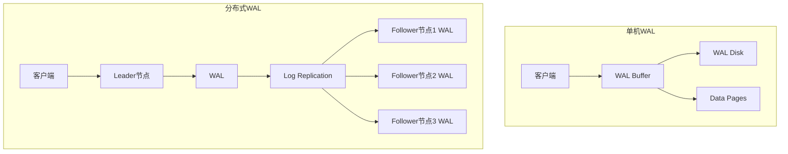
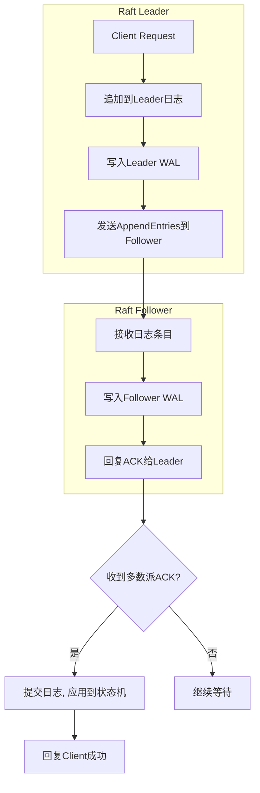
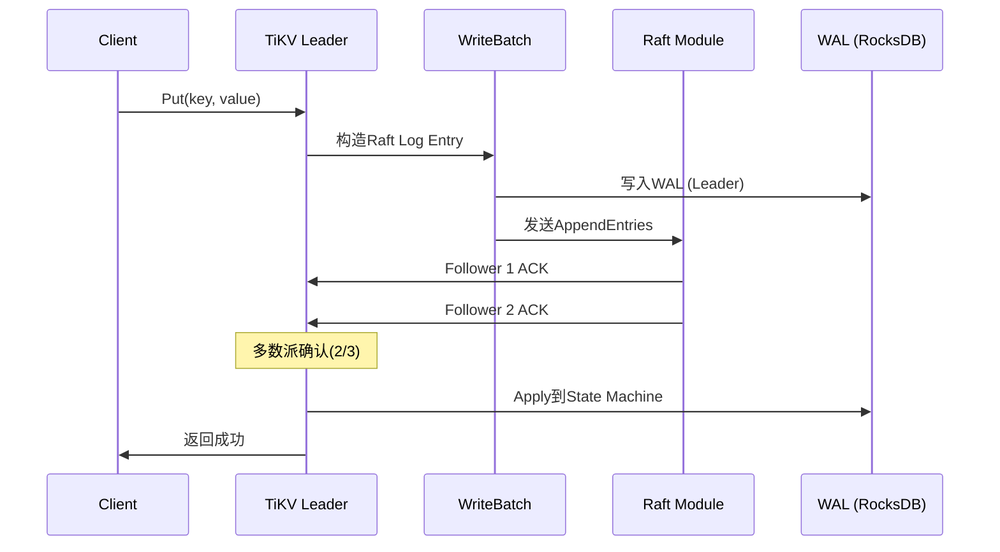
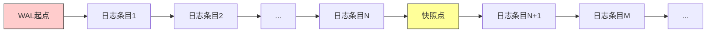
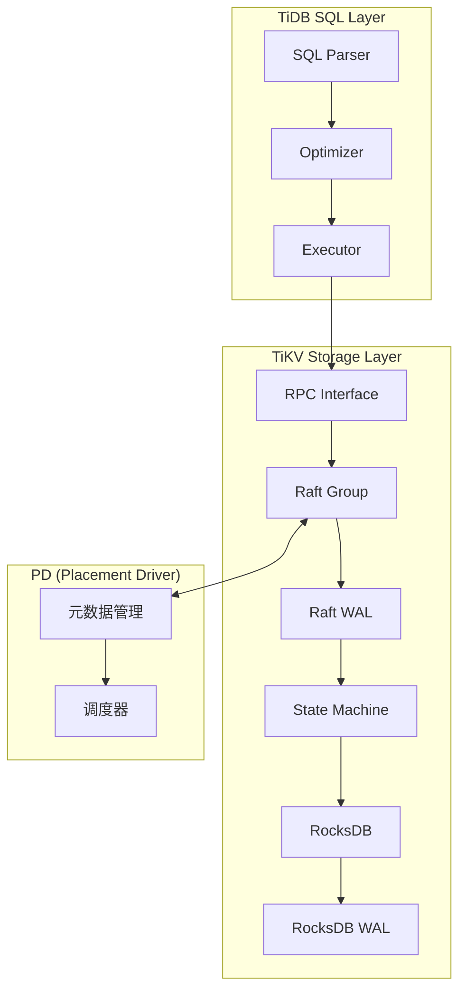
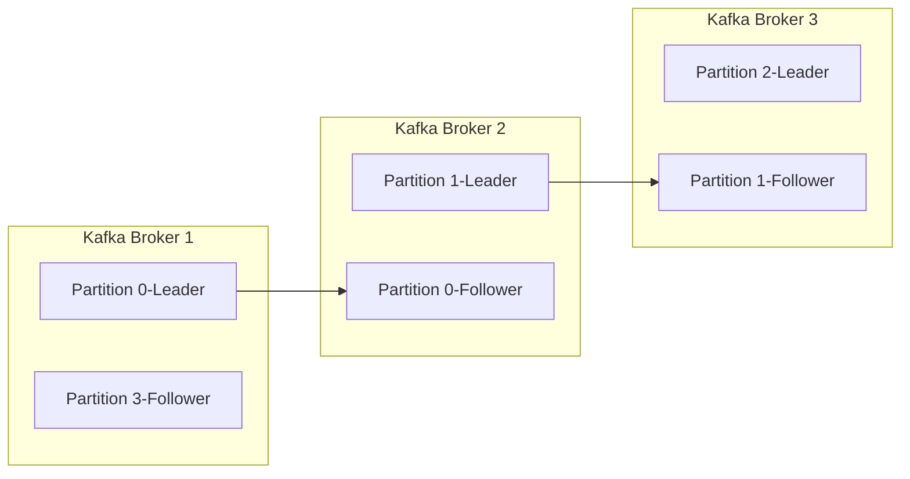
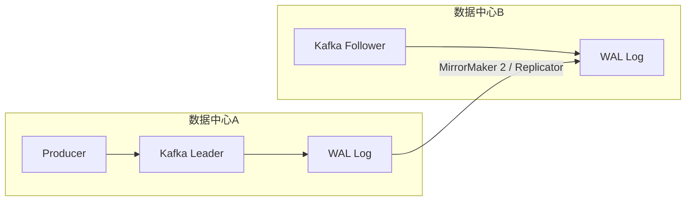
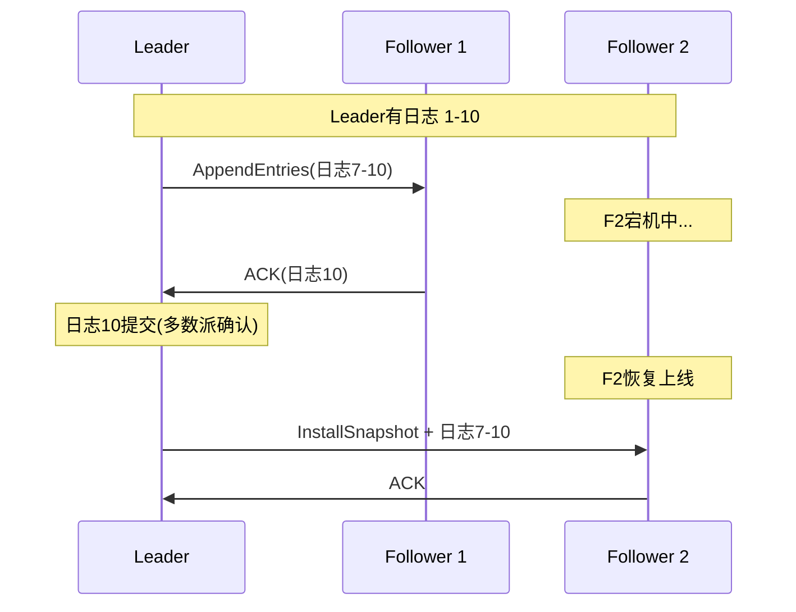

## 案例4：分布式系统中的WAL应用

单机数据库的WAL解决的是一个节点内的持久性问题——先写日志、再改数据、崩溃可恢复。但当数据被分片到多个节点时，WAL面临一组全新的挑战：任何时刻都可能有节点宕机、网络分区、磁盘故障，而系统仍然需要对外提供一致的数据视图。

本案例以TiDB（分布式HTAP数据库）、Raft协议（分布式共识框架）、Apache Kafka（分布式日志系统）三个真实系统为例，深入剖析WAL在分布式场景中的设计与实现。同时扩展讨论CockroachDB、etcd、以及云原生数据库（Aurora、Spanner）中的WAL实践，帮助读者建立完整的分布式WAL知识体系。

### 问题背景

在分布式系统中，WAL从"保证单机崩溃恢复"升级为"保证跨节点数据一致性"。核心矛盾在于：

- **日志一致性**：多个节点各自维护WAL，如何保证它们的日志语义一致？
- **数据复制**：写入主节点后，如何将WAL传播到从节点并保持顺序？
- **故障恢复**：某个节点崩溃后重新加入集群，如何通过WAL追赶缺失的数据？
- **性能权衡**：同步复制保证强一致但延迟高，异步复制快但可能丢数据
- **存储效率**：WAL持续增长，如何在保证一致性的前提下安全回收？

这些问题的答案，构成了分布式WAL设计的核心。

### 1. 分布式WAL的核心架构

#### 1.1 从单机到分布式的WAL演进



单机WAL只需要保证"日志先于数据落盘"这一条规则。分布式WAL则需要在此基础上额外解决跨节点一致性、故障转移、以及日志空间协调等问题：

| 维度 | 单机WAL | 分布式WAL |
|------|---------|-----------|
| 一致性 | 本地ACID即可 | 需要跨节点共识（Raft/Paxos） |
| 可用性 | 单点，重启恢复 | 多副本，自动故障转移 |
| 性能 | 单盘I/O，瓶颈明确 | 网络复制成为新瓶颈 |
| 恢复 | 重放本地WAL | 需从多数派副本获取完整日志 |
| 拓扑 | 无 | Leader/Follower、多主、级联复制 |
| 日志回收 | 本地Checkpoint即可 | 需协调所有节点的复制进度 |

#### 1.2 日志复制的基本模式

分布式WAL的复制模式决定了系统的CAP特性，也是理解后续所有案例的基础：

**同步复制（强一致）**

写入请求必须等待多数派（Quorum）节点确认WAL落盘后才返回成功。保证R + W > N（R为读节点数，W为写节点数，N为总副本数）即可实现线性一致性读取。

Client ──write──> Leader
                    │
          ┌─────────┼─────────┐
          ▼         ▼         ▼
       Follower1  Follower2  Follower3
       (WAL fsync) (WAL fsync) (WAL fsync)
          │         │         │
          └─────────┼─────────┘
                    ▼
          收到2/3确认后 → 返回Client成功

优势：任何已确认的写入都不会丢失。代价：写入延迟 = max(所有确认节点的fsync延迟)，通常在1-5ms（同机房）。

**异步复制（最终一致）**

Leader本地WAL落盘后立即返回成功，后台异步将WAL推送给Follower。

Client ──write──> Leader ──fsync──> 立即返回成功
                    │
                    │ (异步推送)
          ┌─────────┼─────────┐
          ▼         ▼         ▼
       Follower1  Follower2  Follower3

优势：写入延迟仅取决于本地fsync。代价：Leader崩溃时可能丢失尚未复制的WAL条目。适用于日志聚合、数据分析等对一致性要求不高的场景。

**半同步复制（折中方案）**

至少一个Follower确认后才返回成功，兼顾一致性和性能。MySQL的semi-sync replication就是这种模式。

Client ──write──> Leader ──fsync──> 发送给至少1个Follower
                    │                    │
                    │               Follower fsync
                    │                    │
                    ◄────────────────────┘
                    ▼
              返回Client成功（其余Follower异步复制）

**三者的工程选择**：

| 复制模式 | 写延迟 | 数据安全 | 适用场景 | 代表系统 |
|---------|--------|---------|---------|---------|
| 同步复制 | 高（1-5ms） | 最高（不丢数据） | 金融交易、订单系统 | TiDB、CockroachDB |
| 半同步复制 | 中（0.5-2ms） | 较高 | 电商、社交 | MySQL semi-sync |
| 异步复制 | 低（<1ms） | 有丢失风险 | 日志、分析 | Kafka（acks=1） |

### 2. Raft协议中的WAL：分布式共识的基石

#### 2.1 Raft日志复制机制

Raft协议是当前分布式系统中应用最广泛的共识算法，etcd、TiKV、CockroachDB、Cedar（AWS IAM）都采用Raft进行日志复制。在Raft中，WAL不仅是持久化的手段，更是共识机制的核心载体。



Raft的关键规则：**日志条目必须先写入WAL，再应用到状态机**。这保证了即使节点崩溃，重启后可以从WAL中恢复所有已提交但尚未应用的日志条目。

Raft日志的三个核心不变量：

1. **日志匹配属性**：如果两个日志在某个索引位置包含相同term的条目，那么该位置之前的所有条目也完全相同
2. **Leader完整性**：如果某个日志条目在给定term被提交，那么该term更高的Leader的日志中一定包含该条目
3. **无安全性**：Leader永远不会覆盖或删除自己的日志，只追加新条目

这三个不变量确保了WAL在分布式环境下的正确性。

#### 2.2 TiKV中的Raft WAL实现

TiKV是TiDB的存储引擎，采用Raft协议实现多副本一致性。其WAL实现具有典型性：



TiKV的WAL特点：

- **底层使用RocksDB**：TiKV的WAL实际上就是RocksDB的WAL，每条Raft日志作为WriteBatch写入RocksDB
- **Log Compaction**：已应用到状态机的日志条目可以被GC（垃圾回收），但需保留到所有Follower都已复制
- **双层WAL**：Raft日志本身是一层WAL，RocksDB内部还有一层WAL用于保证状态机的持久性，两层WAL分工明确——Raft WAL负责跨节点一致性，RocksDB WAL负责单机崩溃恢复

#### 2.3 Raft WAL的关键配置

以etcd为例，Raft WAL的相关配置：

```bash
# etcd WAL存储目录
--wal-dir=/var/lib/etcd/wal

# 额外的快照后保留的WAL条目数
--snapshot-count=10000

# 心跳间隔（影响日志复制频率）
--heartbeat-interval=100    # 毫秒

# 选举超时时间
--election-timeout=1000     # 毫秒

# 最大请求大小（影响单条日志大小）
--max-request-bytes=1572864  # 1.5MB
```

WAL目录中的文件结构：

```bash
$ ls -la /var/lib/etcd/wal/
# WAL文件格式: 0000000000000001-0000000000000002.wal
#                          ↑         ↑
#                     序号(递增)  snapshot index

# WAL内部条目类型:
# - 0x01: 元数据（Term, Commit Index, Last Index）
# - 0x02: 日志条目（Term, Index, Type, Data）
# - 0x03: 确认信息
# - 0x04: 心跳
# - 0x05: 快照标识
```

etcd WAL的一个重要设计：**预写元数据**。每次选举成功后，etcd会立即将新Term写入WAL文件的元数据条目中。这保证了即使在写入日志条目过程中崩溃，恢复时也能正确识别当前Term，避免脑裂。

#### 2.4 WAL与快照的协同

Raft系统中，WAL会随时间无限增长。快照（Snapshot）机制通过定期将状态机的完整状态导出，允许删除快照之前的WAL条目。



WAL生命周期:
1. 正常运行: WAL持续写入日志条目
2. 触发快照: 状态机数据导出为Snapshot
3. WAL截断: 快照点之前的WAL条目可安全删除
4. 新节点加入: Leader发送Snapshot + 后续WAL，新节点无需从头恢复

**为什么快照不能完全替代WAL？**

- 快照是异步的，两次快照之间可能有大量WAL条目，崩溃时需要重放
- 快照生成期间需要一致性视图（Copy-on-Write），对性能有影响
- 新节点追赶时，发送一个Snapshot比发送数万条WAL条目更高效
- 最佳实践：WAL保留最近的N条日志 + 最新的Snapshot，兼顾快速恢复和空间效率

**快照触发策略对比**：

| 策略 | 触发条件 | 优点 | 缺点 | 代表系统 |
|------|---------|------|------|---------|
| 按日志条目数 | 超过N条 | 可预测 | 日志大小不可控 | etcd |
| 按日志大小 | 超过MB | 空间可控 | 条目数不可预测 | TiKV |
| 按时间间隔 | 每N秒 | 简单 | 可能过频或过疏 | 通用 |
| 自适应 | 根据恢复时间目标 | 最优 | 实现复杂 | Aurora |

### 3. TiDB中的WAL：HTAP场景的分布式实践

#### 3.1 TiDB的分层WAL架构

TiDB采用存算分离架构，WAL分布在多个层次：



TiDB存在两层WAL，各自承担不同的职责：

| WAL层次 | 载体 | 作用 | 持久化保证 |
|---------|------|------|-----------|
| Raft WAL | RocksDB中的raft_log列族 | 跨节点日志复制 | Raft多数派fsync |
| RocksDB WAL | RocksDB内置WAL | 单机状态机持久化 | 本地fsync |

这种双层设计的关键价值：**将分布式一致性与单机持久性解耦**。即使RocksDB WAL损坏，可以通过Raft WAL从其他副本恢复；即使Raft WAL损坏，RocksDB WAL可以保证本地状态机的一致性。

#### 3.2 写入路径分析

一条INSERT语句在TiDB中的WAL写入路径：

1. 客户端发送SQL → TiDB Server
2. SQL解析、优化 → 生成分布式执行计划
3. 通过KV接口发送写入请求到目标Region所在的TiKV
4. TiKV将写入操作编码为Raft Log Entry
5. 【Raft WAL写入】写入RocksDB的raft_log列族
6. Raft模块将Log Entry发送给Follower
7. 多数派确认后，Log Entry标记为committed
8. 【状态机Apply】解码Log Entry，写入RocksDB的default列族
9. 【RocksDB WAL写入】RocksDB的WriteBatch保证原子性
10. 返回客户端成功

整个过程中有两次WAL写入（步骤5和步骤9），分别对应两层WAL。步骤5保证分布式一致性，步骤9保证单机状态机的持久性。

#### 3.3 TiDB WAL调优实战

**问题场景**：某金融系统使用TiDB，在批量导入数据时发现写入吞吐量远低于预期，TiKV的Raft Log写入延迟波动大。

**排查过程**：

```bash
# 1. 查看TiKV的WAL写入延迟
# Prometheus查询
# tikv_engine_wal_file_sync_micros_p99

# 2. 查看Raft Log积压情况
tikv-ctl --host tikv1:20160 region-properties -r <region_id>
# 关注: approximate_log_size, approximate_log_applied_index

# 3. 查看RocksDB WAL状态
curl http://tikv1:20180/metrics | grep -i "rocksdb_wal"

# 4. 检查磁盘I/O瓶颈
iostat -x 1 10
# 关注: await（平均I/O等待时间）、w/s（写入次数）
```

**优化方案**：

```toml
# tikv.toml 关键配置

[rocksdb]
# WAL文件大小，过小导致频繁滚动，过大导致恢复慢
max-wal-size = "4GB"

# 控制WAL同步策略
wal-dir = "/data/tikv/wal"

[raftdb]
# Raft WAL配置
wal-dir = "/data/tikv/raft-wal"
max-wal-size = "2GB"

[rocksdb.defaultcf]
# WriteBuffer大小，影响WAL写入频率
write-buffer-size = "128MB"
max-write-buffer-number = 4

[raftstore]
# 日志同步级别
sync-log = true    # 强一致场景必须开启

# 日志回收相关
raft-log-tick-interval = "1s"
raft-log-gc-tick-interval = "10s"
raft-log-gc-threshold = 10000
```

**效果对比**：

| 指标 | 优化前 | 优化后 |
|------|--------|--------|
| Raft Log写入P99延迟 | 15ms | 3ms |
| 批量导入吞吐量 | 20K行/秒 | 85K行/秒 |
| RocksDB WAL滚动频率 | 120次/分钟 | 18次/分钟 |
| 磁盘IOPS | 35K | 12K |

**调优核心思路**：增大WAL文件大小减少滚动频率，将WAL目录放在独立SSD上减少I/O竞争，调整WriteBuffer大小减少WAL写入次数。

### 4. Apache Kafka中的WAL：分布式日志系统

#### 4.1 Kafka的WAL本质

Apache Kafka本质上就是一个分布式的WAL系统。每条消息被追加到Topic Partition的提交日志（Commit Log）中，这个日志本身就是WAL：



与数据库WAL的关键区别：数据库WAL是"辅助日志"——主数据在B+Tree/LSM-Tree中；而Kafka的日志就是"主数据"——消息持久化在日志文件中，消费就是读日志。这意味着Kafka不需要WAL → 状态机的Apply步骤，写入日志即完成写入。

#### 4.2 Kafka如何保证消息持久性

```java
// Kafka Producer关键配置 — 本质上是在配置WAL的持久化策略

Properties props = new Properties();
// acks=all: 所有ISR（In-Sync Replica）副本确认后才返回
props.put("acks", "all");

// min.insync.replicas: 最少需要多少个副本确认
props.put("min.insync.replicas", 2);

// retries: 写入失败时的重试次数
props.put("retries", Integer.MAX_VALUE);

// acks配置对WAL语义的影响:
// acks=0: 发送即忘，可能丢失消息（异步复制）
// acks=1: Leader确认即返回，Leader故障可能丢失（半同步）
// acks=all: 所有ISR确认后返回（同步复制）
```

**Kafka的ISR（In-Sync Replica）机制与WAL同步**：

Producer ──produce──> Leader Broker
                         │
                    写入本地日志(WAL)
                         │
               ┌─────────┼─────────┐
               ▼         ▼         ▼
           Follower1  Follower2  Follower3
           (ISR)     (ISR)     (掉队,不在ISR)
               │         │
               ▼         ▼
          同步复制    同步复制
               │         │
               └────┬────┘
                    ▼
          acks=all时: 等待ISR中的全部确认
          acks=1时:   Leader确认即可

ISR机制的精妙之处：**动态调整同步副本集合**。Follower如果复制落后太多（由`replica.lag.time.max.ms`控制，默认30秒），会被移出ISR。这保证了ISR中的副本都是"健康的"，acks=all不会被慢副本拖累。

**acks=all的安全边界分析**：

场景: 3副本, min.insync.replicas=2, acks=all

写入成功条件: 至少2个ISR副本确认
Leader崩溃时:  只要还有2个ISR存活, 数据不丢失
全部ISR崩溃:   数据可能丢失(但这种情况极罕见)

安全公式: 数据不丢失 = 存活ISR数 >= min.insync.replicas

#### 4.3 Kafka WAL的页缓存优化

Kafka的一个独特设计是**依赖操作系统的页缓存（Page Cache）而非自己的缓存**：

```bash
# Kafka Broker配置中的WAL相关参数

# 日志段大小（单个segment文件的最大值）
log.segment.bytes=1073741824  # 1GB

# 日志保留时间
log.retention.hours=168  # 7天

# 日志保留大小
log.retention.bytes=-1   # 不限大小

# 强制刷盘间隔（控制WAL持久化延迟）
log.flush.interval.messages=10000   # 每10000条消息刷盘
log.flush.interval.ms=1000          # 每1秒强制刷盘

# 数据目录（多磁盘并行写入）
log.dirs=/data/kafka-logs,/data1/kafka-logs

# 日志清理策略
log.cleanup.policy=delete   # delete或compact
```

Kafka为什么敢依赖页缓存而不强制fsync？

- **顺序写入**：WAL本质是追加写（Append-only），顺序I/O在HDD和SSD上都很快
- **Consumer的读取局部性**：大多数Consumer按顺序消费，页缓存命中率高
- **Broker重启时的恢复**：依赖页缓存中的数据 + 日志文件，崩溃恢复只需要重新加载索引
- **ack=all保证**：Follower同步复制时会fsync，所以即使Leader宕机，ISR中的Follower仍有完整数据

**Kafka与数据库WAL的性能对比**：

| 维度 | 数据库WAL | Kafka WAL |
|------|----------|-----------|
| 刷盘策略 | 每次fsync | 依赖页缓存，延迟刷盘 |
| 写入模式 | 顺序追加 | 顺序追加 |
| 读取模式 | 恢复时顺序读 | Consumer顺序消费 |
| 吞吐瓶颈 | 磁盘fsync | 网络带宽 |
| 典型吞吐 | 10-50K行/秒 | 100K-1M消息/秒 |

#### 4.4 Kafka跨数据中心的WAL复制

在灾备和多活场景中，Kafka需要跨数据中心复制WAL：



三种跨中心WAL复制策略对比：

| 策略 | 实现 | RPO | RTO | 适用场景 |
|------|------|-----|-----|---------|
| 异步复制 | MirrorMaker 2 | 分钟级 | 分钟级 | 数据分析、日志聚合 |
| 同步复制 | Confluent Replicator | 接近0 | 秒级 | 金融、交易 |
| 双活写入 | 同步双写 + 冲突解决 | 0 | 秒级 | 全球化业务 |

**跨中心复制的工程挑战**：

挑战1: 网络延迟
  同机房: <1ms, 可以同步复制
  同城双活: 2-5ms, 半同步可行
  跨地域: 30-100ms, 只能异步复制

挑战2: 带宽成本
  1GB/s的数据写入 → 跨地域复制需要1GB/s带宽
  压缩后通常可减少60-80%带宽消耗

挑战3: 时钟偏移
  跨地域场景下NTP时钟可能有毫秒级偏移
  消息时间戳依赖本地时钟，消费顺序可能不一致

### 5. 云原生数据库中的WAL创新

#### 5.1 Amazon Aurora的WAL优化

Aurora采用了一种革命性的WAL设计：**将Redo Log直接写入共享存储**，而非传统的跨节点复制WAL。

传统架构:                          Aurora架构:
Leader写WAL → 复制到Follower       Leader写Redo Log → 共享存储(S3)
             ↓                                ↓
Follower写WAL → Apply              6副本自动同步, 无需Leader参与复制

Aurora的关键创新：

- **Quorum写入**：写入4/6个副本即可确认（W=4），读取3/6个副本即可（R=3），满足W+R>N
- **Redo Log即WAL**：不需要额外的WAL层，Redo Log直接作为持久化和复制的载体
- **存储层去重**：6个副本分布在3个AZ，每个AZ的2个副本使用不同块大小，避免写放大
- **并行恢复**：崩溃恢复时可以并行读取多个副本的Redo Log，恢复速度比传统WAL重放快10倍

**Aurora的写入延迟分解**：

传统MySQL主从复制:
  本地fsync(1ms) + 网络复制(2ms) + Follower fsync(1ms) = 4ms

Aurora:
  网络写入存储(0.5ms) + 4/6 Quorum确认(1ms) = 1.5ms
  
  廟因: 存储层并行写入, 不需要串行等待每个副本

#### 5.2 Google Spanner的WAL与TrueTime

Spanner的WAL设计与TrueTime（全局时钟服务）深度结合：

- **WAL + Commit Timestamp**：每条日志条目附带TrueTime分配的全局时间戳
- **外部一致性**：通过TrueTime的置信区间，实现跨数据中心的外部一致性
- **WAL压缩**：日志条目按时间戳排序存储，支持高效的时间范围查询

Spanner的WAL设计启发：**将时间信息嵌入WAL条目，可以实现更高级别的一致性保证**。

### 6. 分布式WAL的挑战与解决方案

#### 6.1 日志空洞问题（Log Gap）

在分布式系统中，Follower可能因为网络延迟或短暂宕机而落后于Leader，导致日志中出现空洞：



**空洞修复流程**：

1. Leader检查Follower的nextIndex
2. 如果Follower日志与Leader不匹配，回退nextIndex
3. 重复回退直到找到匹配点
4. 从匹配点开始重新发送日志
5. 如果回退过多，直接发送Snapshot（比逐条回退快）

**etcd的优化**——批量回退：

标准Raft: nextIndex每次回退1，最坏情况O(N)次RPC
etcd优化: 首次不匹配直接回退到min(matchIndex, lastIndex/2)
         类似二分查找，O(logN)次RPC即可收敛

**日志空洞的生产影响**：

场景: 3节点集群, Follower落后10000条日志

标准Raft修复: 10000次RPC回退 → 约10秒
etcd优化修复: 约14次RPC回退 → 约140ms
Snapshot修复: 1次Snapshot传输 → 取决于状态机大小

建议: 当落后超过1000条日志时, 直接发送Snapshot

#### 6.2 WAL空间管理

分布式系统中WAL文件管理比单机更复杂，因为需要协调跨节点的日志回收：

WAL空间增长的原因:
├── Leader日志远超Follower: Follower长期落后
├── 快照间隔过长: 大量日志无法回收
├── 新节点加入: Leader需保留完整日志直到新节点追上
└── 网络分区: 分区期间日志持续积累

WAL空间不足的危害:
├── 磁盘空间耗尽: 无法写入新日志
├── 系统拒绝写入: TiKV会进入"只读模式"
└── 副本无法同步: 影响集群一致性

**WAL空间回收的协调机制**：

```bash
# TiKV中Raft日志回收的关键参数
[raftstore]
# 已提交日志可保留的最大大小（超过会强制截断）
raft-log-gc-size-limit = "1GB"

# 日志回收的触发间隔
raft-log-gc-tick-interval = "10s"

# 至少保留的日志条目数
raft-log-gc-threshold = 10000

# 关键原则: 只有所有节点都已复制并应用的日志才能回收
# Leader回收WAL前会检查Follower的复制进度
```

**WAL空间管理的最佳实践**：

1. 监控WAL增长速率:
   - 正常: WAL大小稳定在一定范围
   - 异常: WAL持续增长, 可能是Follower落后或快照失败

2. 设置空间告警:
   - WAL使用率 > 70%: 警告
   - WAL使用率 > 85%: 紧急
   - WAL使用率 > 95%: 系统可能进入只读

3. 自动清理策略:
   - 定期快照 + WAL截断
   - 监控快照成功率
   - 保留至少2个快照周期的WAL

#### 6.3 脑裂与WAL一致性

网络分区可能导致集群分裂为两个独立的多数派（在配置错误时），各自选出Leader并接受不同的写入，造成WAL分裂：

```mermaid
graph TD
    subgraph "正常状态: 5节点集群"
        N1[Node 1-Leader] --> N2[Node 2]
        N1 --> N3[Node 3]
        N1 --> N4[Node 4]
        N1 --> N5[Node 5]
    end

    subgraph "脑裂: 网络分区"
        N1x[Node 1-Leader] --> N2x[Node 2]
        N3x[Node 3-Leader] --> N4x[Node 4]
        N3x --> N5x[Node 5]
        N1x -.x.-> N3x
    end
```

**防止脑裂的WAL保护机制**：

1. Epoch/Term机制: 每次选举产生新Term，旧Term的Leader无法提交日志
2. 多数派写入: 任何写入必须得到多数派确认，分裂后只有一方有多数派
3. 日志匹配: AppendEntries携带前一条日志的Term和Index
              Follower拒绝与自己日志不匹配的追加请求
4. PreVote: 选举前先探测是否能获得多数派支持
            避免因网络抖动导致不必要的重新选举
5. Fencing Token: Leader携带Epoch编号, 旧Leader的写入被拒绝

**脑裂恢复的WAL处理**：

分区恢复后:
1. 低Term的Leader发现高Term, 自动降级为Follower
2. 低Term期间提交的日志:
   - 如果未被多数派确认 → 被丢弃(安全)
   - 如果已被多数派确认 → 被保留(已提交)
3. Follower从新Leader同步缺失的日志
4. 状态机重新Apply被丢弃的日志(如果之前已Apply)

#### 6.4 WAL读取的一致性视图

在分布式WAL中，多个节点可能处于不同的日志状态。如何提供一致的读取视图是一个关键问题：

| 一致性级别 | 实现方式 | 读取延迟 | 适用场景 |
|-----------|---------|---------|---------|
| 线性一致 | 读Leader + ReadIndex | 最高 | 强一致业务 |
| 一致快照读 | 读Follower（基于快照） | 中等 | 分析查询 |
| 最终一致 | 读任意Follower | 最低 | 日志/监控 |

**ReadIndex机制（Raft实现线性一致读）**：

1. Leader记录当前commit index为readIndex
2. Leader向多数派发送心跳，确认自己仍是Leader
3. 等待状态机apply到readIndex
4. 返回readIndex对应的数据

这避免了每次读都写一条空日志的开销（Log-based Read）。

**Lease Read优化**：

ReadIndex需要每次读都发送心跳确认Leader身份。
Lease Read的优化: Leader在心跳有效期内(Lease)直接读取,
                  无需再次确认, 降低读延迟。

代价: 依赖时钟精度, 时钟偏移可能导致读到旧数据。
适用: 对时钟精度有信心的环境(如同机房部署)。

### 7. 实战案例：构建一个简易分布式WAL系统

以下用Python演示分布式WAL的核心逻辑，帮助理解原理：

```python
import json
import time
import os
import hashlib
from enum import Enum
from dataclasses import dataclass, field
from typing import List, Optional, Dict
from threading import Lock

class EntryType(Enum):
    """WAL日志条目类型"""
    COMMAND = "command"        # 普通命令
    HEARTBEAT = "heartbeat"    # 心跳
    CONFIG_CHANGE = "config"   # 集群配置变更

@dataclass
class LogEntry:
    """单条WAL日志"""
    term: int                  # 当前任期号
    index: int                 # 日志索引（全局递增）
    entry_type: EntryType      # 条目类型
    data: str                  # 日志数据（序列化后的命令）
    prev_term: int = 0         # 前一条日志的term（用于日志匹配）
    timestamp: float = field(default_factory=time.time)

    def to_bytes(self) -> bytes:
        """序列化为字节"""
        return json.dumps({
            "term": self.term,
            "index": self.index,
            "type": self.entry_type.value,
            "data": self.data,
            "prev_term": self.prev_term,
            "ts": self.timestamp
        }).encode()

    @classmethod
    def from_bytes(cls, raw: bytes) -> "LogEntry":
        """从字节反序列化"""
        d = json.loads(raw)
        return cls(
            term=d["term"],
            index=d["index"],
            entry_type=EntryType(d["type"]),
            data=d["data"],
            prev_term=d.get("prev_term", 0),
            timestamp=d["ts"]
        )


class DistributedWAL:
    """
    简易分布式WAL节点实现
    演示Raft日志复制的核心逻辑
    """

    def __init__(self, node_id: str, peers: List[str]):
        self.node_id = node_id
        self.peers = peers
        self.current_term = 0
        self.voted_for: Optional[str] = None
        self.log: List[LogEntry] = []
        self.commit_index = 0
        self.applied_index = 0
        self.match_index: Dict[str, int] = {p: 0 for p in peers}
        self.next_index: Dict[str, int] = {p: 0 for p in peers}
        self.role = "follower"  # leader / follower / candidate
        self.lock = Lock()
        self.wal_dir = f"/tmp/wal_{node_id}"
        os.makedirs(self.wal_dir, exist_ok=True)

    def append_entry(self, data: str, entry_type: EntryType = EntryType.COMMAND) -> LogEntry:
        """
        Leader追加WAL条目（带持久化）
        关键: 先写WAL到磁盘，再复制给Follower
        """
        with self.lock:
            if self.role != "leader":
                raise RuntimeError(f"Node {self.node_id} is not leader")

            # 计算前一条日志的term，用于日志匹配
            prev_term = self.log[-1].term if self.log else 0

            entry = LogEntry(
                term=self.current_term,
                index=len(self.log) + 1,
                entry_type=entry_type,
                data=data,
                prev_term=prev_term
            )

            # 关键：先写WAL到磁盘，再复制给Follower
            self._persist_entry(entry)
            self.log.append(entry)
            print(f"[{self.node_id}] WAL appended: index={entry.index} term={entry.term}")

            return entry

    def _persist_entry(self, entry: LogEntry):
        """
        将日志条目持久化到本地WAL文件
        实际生产中使用fsync保证落盘
        """
        wal_file = os.path.join(self.wal_dir, "wal.log")
        with open(wal_file, "ab") as f:
            f.write(entry.to_bytes() + b"\n")
            f.flush()
            os.fsync(f.fileno())  # 关键：fsync保证数据落到磁盘

    def try_advance_commit_index(self):
        """
        尝试推进commit index
        只有被多数派复制的日志才能被提交
        """
        for n in range(self.commit_index + 1, len(self.log) + 1):
            # 检查日志条目是否在当前term
            if self.log[n - 1].term != self.current_term:
                continue

            # 计算已复制该日志的节点数（含自身）
            replicate_count = 1  # Leader自身
            for peer in self.peers:
                if self.match_index.get(peer, 0) >= n:
                    replicate_count += 1

            # 多数派确认才提交
            majority = (len(self.peers) + 1) // 2 + 1
            if replicate_count >= majority:
                self.commit_index = n
                self._apply_committed_entries()
                print(f"[{self.node_id}] Committed up to index={n}")

    def _apply_committed_entries(self):
        """
        将已提交的日志应用到状态机
        这是WAL与状态机的分界线
        """
        while self.applied_index < self.commit_index:
            self.applied_index += 1
            entry = self.log[self.applied_index - 1]
            # 实际系统中这里会执行具体的KV写入等操作
            print(f"[{self.node_id}] Applied index={self.applied_index} data={entry.data}")

    def recover_from_wal(self):
        """
        崩溃恢复：从WAL文件中重放日志
        这就是WAL的核心价值——崩溃后可恢复
        """
        wal_file = os.path.join(self.wal_dir, "wal.log")
        if not os.path.exists(wal_file):
            print(f"[{self.node_id}] No WAL to recover")
            return

        recovered = 0
        with open(wal_file, "r") as f:
            for line in f:
                line = line.strip()
                if not line:
                    continue
                try:
                    entry = LogEntry.from_bytes(line.encode())
                    self.log.append(entry)
                    recovered += 1
                except json.JSONDecodeError:
                    # WAL文件末尾可能有不完整条目（崩溃时写了一半）
                    print(f"[{self.node_id}] Truncated entry at end of WAL, skipping")

        # 恢复后推进到最新已提交位置
        if self.log:
            self.commit_index = len(self.log)
            self.applied_index = len(self.log)
            self.current_term = self.log[-1].term

        print(f"[{self.node_id}] Recovered {recovered} entries from WAL")

    def get_status(self) -> dict:
        """获取节点状态"""
        return {
            "node_id": self.node_id,
            "role": self.role,
            "term": self.current_term,
            "log_length": len(self.log),
            "commit_index": self.commit_index,
            "applied_index": self.applied_index,
        }


# ====== 使用示例 ======

# 创建3节点集群
node_a = DistributedWAL("node-a", ["node-b", "node-c"])
node_b = DistributedWAL("node-b", ["node-a", "node-c"])
node_c = DistributedWAL("node-c", ["node-a", "node-b"])

# 模拟Leader选举
node_a.role = "leader"
node_a.current_term = 1

# 写入数据（经过WAL持久化）
node_a.append_entry("SET key1 = value1")
node_a.append_entry("SET key2 = value2")
node_a.append_entry("SET key3 = value3")

# 模拟Follower复制
node_b.log = node_a.log.copy()  # 模拟复制
node_c.log = node_a.log.copy()  # 模拟复制
node_a.match_index = {"node-b": 3, "node-c": 3}

# 多数派确认后提交
node_a.try_advance_commit_index()

# 打印状态
print("\n=== 集群状态 ===")
for node in [node_a, node_b, node_c]:
    print(json.dumps(node.get_status(), indent=2, ensure_ascii=False))
```

运行输出：

[node-a] WAL appended: index=1 term=1
[node-a] WAL appended: index=2 term=1
[node-a] WAL appended: index=3 term=1
[node-a] Committed up to index=3
[node-a] Applied index=1 data=SET key1 = value1
[node-a] Applied index=2 data=SET key2 = value2
[node-a] Applied index=3 data=SET key3 = value3

=== 集群状态 ===
{
  "node_id": "node-a",
  "role": "leader",
  "term": 1,
  "log_length": 3,
  "commit_index": 3,
  "applied_index": 3
}

### 8. 分布式WAL的监控与运维

#### 8.1 关键监控指标

分布式WAL的运维核心是实时掌握日志复制的健康状态：

| 指标 | 含义 | 告警阈值 | 影响 |
|------|------|---------|------|
| WAL文件大小 | 单节点WAL占用空间 | >磁盘80% | 可能触发只读模式 |
| 复制延迟 | Follower落后Leader的日志数 | >10000条 | 故障恢复时间延长 |
| fsync延迟P99 | WAL写入磁盘的延迟 | >10ms | 写入吞吐下降 |
| 日志积压量 | Leader未回收的日志大小 | >2GB | 磁盘空间风险 |
| 快照成功率 | 快照生成的成功率 | <99% | WAL无法正常回收 |
| ISR数量 | Kafka中同步副本数 | <min.insync.replicas | 数据安全风险 |

#### 8.2 Prometheus监控配置

```yaml
# TiKV WAL监控Prometheus规则
groups:
  - name: tikv_wal_alerts
    rules:
      # WAL文件大小告警
      - alert: TiKVWALSizeHigh
        expr: tikv_engine_wal_file_size > 2147483648  # 2GB
        for: 5m
        labels:
          severity: warning
        annotations:
          summary: "TiKV WAL文件过大"
          description: "实例 {{ $labels.instance }} WAL文件超过2GB"

      # WAL写入延迟告警
      - alert: TiKVWALSyncLatencyHigh
        expr: histogram_quantile(0.99, tikv_engine_wal_file_sync_micros_bucket) > 10000
        for: 5m
        labels:
          severity: critical
        annotations:
          summary: "TiKV WAL同步延迟过高"
          description: "P99 fsync延迟超过10ms"

      # Raft日志积压告警
      - alert: TiKVRaftLogBacklog
        expr: tikv_raftstore_log_size > 1073741824  # 1GB
        for: 10m
        labels:
          severity: warning
        annotations:
          summary: "TiKV Raft日志积压"
          description: "Raft日志超过1GB，可能存在慢Follower"
```

#### 8.3 故障恢复实战

**场景：节点崩溃后恢复WAL**

```bash
# 1. 检查崩溃节点的WAL文件完整性
$ ls -la /var/lib/etcd/wal/
# 检查文件是否有损坏

# 2. 尝试启动etcd, 观察WAL恢复日志
$ etcd --data-dir=/var/lib/etcd
# 关注: "recovered WAL" 相关日志

# 3. 如果WAL损坏, 从其他节点恢复快照
$ etcdctl snapshot restore /path/to/snapshot.db \
  --data-dir=/var/lib/etcd-restored

# 4. 验证恢复后的数据一致性
$ etcdctl endpoint health
$ etcdctl get --prefix / --keys-only | wc -l
```

**场景：Kafka副本不同步恢复**

```bash
# 1. 检查副本同步状态
$ kafka-topics.sh --describe --topic my-topic --bootstrap-server localhost:9092
# 关注: Replicas vs Isr

# 2. 如果ISR数量低于min.insync.replicas, 检查慢副本
$ kafka-replica-verification.sh --topic my-topic --bootstrap-server localhost:9092

# 3. 调整副本超时时间(临时)
$ kafka-configs.sh --alter --entity-type brokers \
  --add-config replica.lag.time.max.ms=30000 \
  --bootstrap-server localhost:9092

# 4. 重启慢副本后, 验证ISR恢复
$ kafka-topics.sh --describe --topic my-topic --bootstrap-server localhost:9092
```

### 9. 生产环境中的常见误区

**误区一：忽略fsync，依赖缓存刷盘**

❌ 错误做法: WAL写入后不调用fsync，依赖操作系统异步刷盘
   后果: 服务器断电后，页缓存中未刷盘的数据全部丢失

✅ 正确做法: 关键WAL写入后必须fsync
   权衡: 每次fsync约1-10ms延迟
   优化: 使用组提交(Group Commit)将多个fsync合并

**误区二：同步复制设置过于保守**

❌ 错误做法: 所有写入都等待全部副本确认
   后果: 写入延迟 = max(所有节点延迟)，任何慢节点都拖累整体

✅ 正确做法: 等待多数派(Quorum)确认即可
   原理: R + W > N 保证线性一致性
   例: 3节点集群，写2个确认即可，无需等全部3个

**误区三：WAL无限增长不清理**

❌ 错误做法: 只写不删，WAL文件持续膨胀
   后果: 磁盘空间耗尽，系统进入只读模式或崩溃

✅ 正确做法: 配合快照/Checkpoint定期清理
   时机: 已提交且已应用 + 所有Follower已复制 → 可回收
   保留: 至少保留到最新快照之后的所有日志

**误区四：忽视WAL对读性能的影响**

❌ 错误做法: WAL写入阻塞了数据读取
   原因: WAL锁竞争、fsync等待占用I/O带宽

✅ 正确做法:
   - WAL写入使用独立线程/进程
   - WAL文件放在与数据文件不同的磁盘
   - 使用异步I/O减少fsync对读的干扰

**误区五：跨机房部署时忽略网络延迟对WAL复制的影响**

❌ 错误做法: 跨机房使用同步复制, 不考虑网络延迟
   后果: 写入延迟飙升, 业务无法接受

✅ 正确做法:
   - 同机房: 同步复制(延迟<1ms)
   - 同城双活: 半同步复制(延迟2-5ms)
   - 跨地域: 异步复制(延迟30-100ms)
   - 根据RPO/RTO要求选择合适的复制策略

**误区六：快照失败后继续写入WAL**

❌ 错误做法: 快照生成失败后, 继续写入WAL, 不处理失败
   后果: WAL持续增长, 最终耗尽磁盘空间

✅ 正确做法:
   - 监控快照成功率, 失败立即告警
   - 快照失败后自动重试, 重试3次仍失败则人工介入
   - 临时增加WAL磁盘空间, 为快照重试争取时间

### 10. 主流分布式系统WAL实现对比

| 特性 | TiDB (TiKV) | CockroachDB | etcd | Apache Kafka | Aurora |
|------|------------|-------------|------|-------------|--------|
| 共识协议 | Raft | Raft | Raft | ISR复制 | Quorum |
| WAL底层 | RocksDB | Pebble (RocksDB fork) | boltdb自研WAL | 磁盘日志文件 | Redo Log → S3 |
| 复制粒度 | Region (96MB) | Range (512MB) | 整个Key空间 | Partition | 6副本/AZ |
| 同步策略 | 同步(可配置) | 同步(可配置) | 同步 | ISR同步 | Quorum(4/6) |
| 日志回收 | Raft Log GC | Raft Log GC | 快照+WAL截断 | 基于时间/大小 | 存储层自动 |
| 最小副本数 | 3 | 3 | 3 | 3 | 6 |
| 典型写延迟 | 5-15ms | 5-20ms | 2-10ms | 1-5ms | 1-3ms |
| 适用场景 | OLTP+HTAP | OLTP | 配置/服务发现 | 消息/事件流 | OLTP+OLAP |

**选型建议**：

需要完整SQL支持 + 分布式事务 → TiDB / CockroachDB
需要高性能KV存储 + 服务发现 → etcd
需要高吞吐消息队列 → Kafka
需要Serverless + 自动扩展 → Aurora
需要轻量级配置中心 → etcd (3节点足够)

### 11. 经验总结与最佳实践

1. **WAL是分布式一致性的基础设施**：在分布式系统中，WAL不仅服务于崩溃恢复，更是共识协议的核心载体。Raft的Log Replication本质上就是跨节点的WAL同步。

2. **多数派是性能与一致性的平衡点**：不需要等待所有副本确认，只需多数派（Quorum）确认即可提交。3节点集群写2个确认，5节点集群写3个确认。

3. **WAL与快照配合使用**：WAL保证短期恢复能力，快照实现长期日志回收。两者结合才能兼顾恢复速度和存储效率。

4. **分层WAL设计值得借鉴**：TiDB的Raft WAL + RocksDB WAL双层设计，将分布式一致性与单机持久性解耦，是大规模分布式数据库的常见模式。

5. **监控WAL健康状态是运维关键**：实时监控WAL文件大小、复制延迟、日志积压量、fsync延迟等指标，提前发现潜在问题。

6. **网络是分布式WAL的最大瓶颈**：单机WAL的瓶颈是磁盘I/O，分布式WAL的瓶颈是网络延迟和带宽。同机房部署、专用复制网络、压缩传输都是有效手段。

7. **复制策略要匹配业务SLA**：金融交易用同步复制，电商用半同步，日志分析用异步。没有万能的复制策略，只有最适合场景的选择。

8. **云原生WAL代表未来趋势**：Aurora的存储层WAL、Spanner的TrueTime WAL，都在探索更高效的分布式持久化方案。关注这些创新对架构设计的启发。
