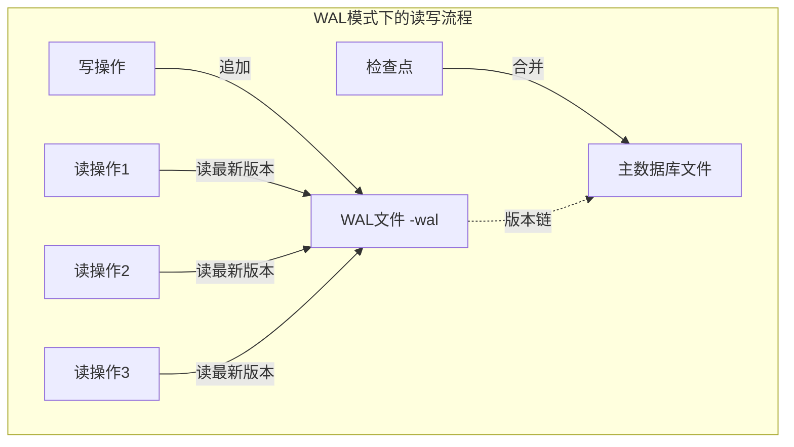
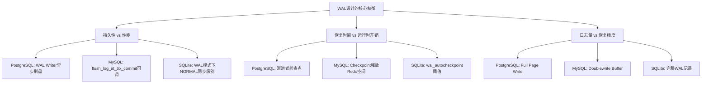
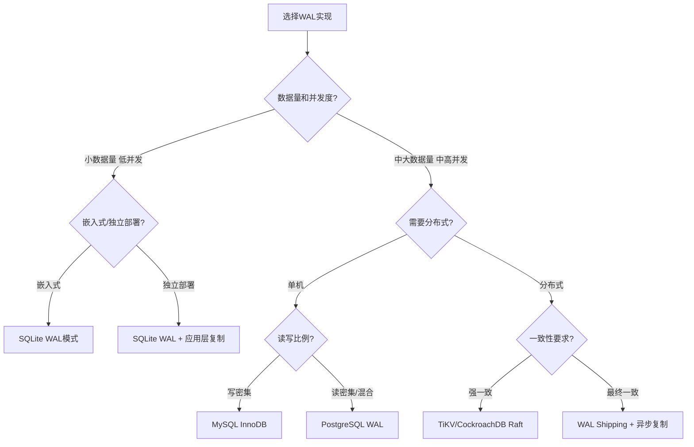

# 实战案例小结

本章通过四个真实系统的深入剖析，展示了WAL在不同约束条件下的具体实现形态。从PostgreSQL的独立WAL子系统到MySQL InnoDB的循环Redo Log，从SQLite的嵌入式简化到分布式系统中的跨节点日志共识——每个案例都是"先写日志，后写数据"这一核心原则在特定工程约束下的最优表达。本小结将系统回顾四个案例的核心要点，提炼跨案例的共性规律与设计直觉，最终提供从案例认知到工程实践的完整转化路径。

---

## 四个案例的核心要点回顾

### 案例1：PostgreSQL WAL——独立子系统的完整设计

PostgreSQL将WAL实现为一个独立的、功能完备的子系统，这在主流关系型数据库中是独一无二的设计选择。其设计的核心理念是：**WAL不仅是崩溃恢复工具，更是整个数据复制和时间点恢复体系的基石**。

**架构层次**：Backend Process（后端进程）产生WAL记录 → 写入WAL Buffer（内存缓冲区） → WAL Writer线程定期刷盘 → 生成WAL Segment文件 → 供归档和复制使用。Checkpointer进程独立负责脏页面刷盘，与WAL写入解耦。

这种解耦设计使得WAL写入和数据刷盘可以独立调优——你可以通过WAL Writer的刷盘频率控制事务提交延迟，通过Checkpointer的执行策略控制磁盘I/O压力，两者互不干扰。

**关键配置参数与调优**：

| 参数 | 默认值 | 调优建议 | 影响 |
|------|--------|---------|------|
| `wal_buffers` | -1（自动，约shared_buffers的1/32） | 高写入场景设为64MB | 减少WAL Buffer Full等待 |
| `max_wal_size` | 1GB | 大促前增至4GB-16GB | 降低检查点频率，减少I/O尖峰 |
| `min_wal_size` | 80MB | 设为max_wal_size的25% | 避免WAL文件频繁创建/删除 |
| `checkpoint_timeout` | 5min | 可增至15min-30min | 延长检查点间隔，减少运行时开销 |
| `checkpoint_completion_target` | 0.9 | 保持0.9 | 检查点平滑完成，避免I/O突发 |

**WAL级别的选择策略**：

- `minimal`：仅支持PITR的基础备份，不产生WAL用于复制。适用于只读报表库或初始数据加载
- `replica`：支持物理复制和PITR，是生产环境的标准选择
- `logical`：支持逻辑复制和CDC（Change Data Capture），用于跨版本迁移或异构数据同步

**PostgreSQL的独特优势**：

1. **物理复制与逻辑复制的统一支持**：物理复制通过WAL Shipping实现，从库直接重放WAL的物理字节流；逻辑解析（logical decoding）则将WAL解析为事务级的逻辑变更事件，支持选择性复制和消息队列集成
2. **PITR（Point-in-Time Recovery）**：基于WAL归档，可以将数据库恢复到任意时间点，精度到单条事务。这是PostgreSQL在备份恢复领域的核心竞争力
3. **WAL与MVCC的深度集成**：通过`pg_waldump`工具可以精确查看每条WAL记录对应的事务、表和操作类型，便于调试和审计

**诊断命令速查**：

```sql
-- 查看当前WAL写入位置
SELECT pg_current_wal_lsn();

-- 计算WAL写入速率（MB/s）
SELECT wal_bytes / 1024.0 / 1024.0 / 
       EXTRACT(EPOCH FROM (now() - stats_reset)) AS mb_per_second
FROM pg_stat_wal;

-- 查看WAL缓冲区等待情况
SELECT * FROM pg_stat_wal;

-- 查看归档状态
SELECT * FROM pg_stat_archiver;

-- 使用pg_waldump分析WAL内容
-- pg_waldump 000000010000000000000001
```

### 案例2：MySQL InnoDB Redo Log——循环写入的极致效率

MySQL InnoDB的Redo Log采用了与PostgreSQL截然不同的设计哲学：**循环写入的固定大小文件组**。这种设计的核心权衡是用空间换时间，用简单换效率——不需要管理归档和清理，所有日志空间在固定文件组内循环复用。

**架构核心**：Log Buffer → ib_logfile0 → ib_logfile1 → 循环写回ib_logfile0。Checkpoint机制负责在数据页刷盘后释放已不再需要的Redo Log空间。写入是顺序追加，空间通过Checkpoint回收复用。

**`innodb_flush_log_at_trx_commit`的三个级别**：

| 值 | 行为 | 数据安全性 | 性能 | 适用场景 |
|----|------|-----------|------|---------|
| 1 | 每次提交调用fsync | 最高：不丢任何已提交事务 | 最低 | 财务、订单等核心业务 |
| 2 | 每次提交写入OS缓存，每秒fsync | 中等：OS崩溃可能丢1秒 | 中等 | 一般业务，默认推荐 |
| 0 | 每秒写入+fsync | 最低：MySQL崩溃可能丢1秒 | 最高 | 日志、统计等容忍少量丢失的场景 |

**Redo Log容量规划方法**：

```python
# 核心公式：Redo Log容量 = 写入速率 × 目标覆盖时间
# 
# 步骤1：测量写入速率
#   SELECT VARIABLE_VALUE FROM performance_schema.global_status 
#   WHERE VARIABLE_NAME = 'Innodb_os_log_written';
#   等待60秒后再次查询，计算差值
#
# 步骤2：计算建议大小
#   建议大小 = 写入速率(MB/s) × 覆盖时间(秒)
#   覆盖时间通常设为30-60分钟（兼顾恢复速度和磁盘空间）
#
# 例如：写入速率 10MB/s，覆盖30分钟
#   建议大小 = 10 × 30 × 60 = 18000MB ≈ 18GB
```

**MySQL 8.0.30+的在线Redo Log调整**：

MySQL 8.0.30引入了动态调整Redo Log大小的能力，无需重启实例：

```sql
-- 在线调整（MySQL 8.0.30+）
ALTER INSTANCE DISABLE INNODB REDO_LOG;  -- 临时禁用
-- 执行大批量导入操作
ALTER INSTANCE ENABLE INNODB REDO_LOG;   -- 重新启用
```

**重要警告**：禁用Redo Log期间数据库完全失去崩溃保护能力。仅适用于初始数据加载等一次性场景，生产环境慎用。

**InnoDB特有的Doublewrite Buffer机制**：

InnoDB将数据页写入分为两步：先将脏页写入Doublewrite Buffer（磁盘上的连续区域），再写入实际的数据文件位置。这解决了"partial page write"（部分页写入）问题——如果在写入数据文件过程中断电，恢复时可以从Doublewrite Buffer中找到完整的页面副本。这个机制在PostgreSQL中不需要，因为PostgreSQL使用Full Page Write（在WAL中记录完整页面的首次修改）来解决同样的问题。

**诊断命令速查**：

```sql
-- 查看Redo Log等待事件
SHOW GLOBAL STATUS LIKE 'Innodb_log_waits';        -- 等待次数
SHOW GLOBAL STATUS LIKE 'Innodb_log_writes';       -- 写入次数
SHOW GLOBAL STATUS LIKE 'Innodb_os_log_fsyncs';    -- fsync次数

-- 查看当前配置
SHOW VARIABLES LIKE 'innodb_log_file_size';
SHOW VARIABLES LIKE 'innodb_log_buffer_size';
SHOW VARIABLES LIKE 'innodb_flush_log_at_trx_commit';

-- 查看InnoDB状态（包含Redo Log信息）
SHOW ENGINE INNODB STATUS\G
```

### 案例3：SQLite WAL模式——嵌入式场景的优雅简化

SQLite的WAL模式是在嵌入式约束下的精简实现，核心目标是**用最少的复杂度实现读写并发**。与PostgreSQL和MySQL的服务器模式不同，SQLite运行在应用程序进程内，没有独立的后台线程或复杂的内存管理——所有WAL操作都必须在单进程、单文件的约束下完成。

**从Journal模式到WAL模式的范式转变**：

| 维度 | Journal模式（DELETE） | WAL模式 |
|------|---------------------|---------|
| 写入方式 | 先写journal，再修改数据页 | 追加写入WAL文件 |
| 锁机制 | 写操作持有EXCLUSIVE锁，阻塞所有读 | 读写使用不同锁，可并发 |
| 读操作 | 需要等待写操作完成 | 读取WAL中的最新版本，不阻塞 |
| 典型性能 | 写入2.5s / 读取1.8s（10K操作） | 写入0.8s / 读取0.6s（10K操作） |
| 适用场景 | 低并发、简单应用 | 高并发读写、移动应用 |

**启用WAL模式的三种方式**：

```python
import sqlite3

# 方式1：连接级别启用（最常用）
conn = sqlite3.connect('mydb.db')
conn.execute('PRAGMA journal_mode=WAL')

# 方式2：通过URI参数启用（连接时指定）
conn = sqlite3.connect('file:mydb.db?mode=rwc&amp;journal_mode=WAL', uri=True)

# 方式3：通过sqlite3_db_config全局设置（影响所有新连接）
# 需要在编译时或通过sqlite3_db_config() API配置
```

**WAL模式的关键PRAGMA参数**：

| PRAGMA | 默认值 | 说明 | 调优建议 |
|--------|--------|------|---------|
| `wal_autocheckpoint` | 1000页 | 触发自动检查点的WAL大小阈值 | 独立进程场景可增大到10000 |
| `synchronous` | FULL | fsync频率 | WAL模式下NORMAL通常足够 |
| `busy_timeout` | 0ms | 等待锁的超时时间 | 设为5000ms避免SQLITE_BUSY |
| `wal_checkpoint` | PASSIVE | 检查点模式 | PASSIVE不会阻塞读写 |

**WAL模式的工作原理**：



写操作追加到WAL末尾，读操作通过版本链找到最新数据。检查点（Checkpoint）将WAL内容合并回主数据库文件，释放WAL空间。**关键洞察**：SQLite WAL模式下，多个读操作可以完全并行，因为它们各自读取WAL的不同快照版本，不需要锁。

**SQLite WAL的局限性**：

1. **不支持跨设备WAL**：WAL文件必须与主数据库在同一文件系统上（或支持共享内存的tmpfs）
2. **单写入者**：虽然支持多读并发，但同一时刻只有一个写入者
3. **WAL文件膨胀**：如果长时间没有检查点，WAL文件会持续增长
4. **不支持复制**：SQLite是嵌入式数据库，没有内置的WAL Shipping机制

### 案例4：分布式系统中的WAL应用——从本地日志到全局一致性

分布式系统将WAL的思想从单机扩展到多节点，核心挑战变为：**如何在多个独立节点之间保持日志的一致性和有序性**。这不再是简单的"写日志保护本地数据"，而是"通过日志同步保证全局状态一致"。

**分布式WAL的两大应用场景**：

**场景一：WAL Shipping（日志传输）**

将主节点的WAL日志实时传输到从节点，从节点重放日志以保持数据同步。这是主从复制的底层机制。

主节点 → WAL写入 → WAL日志传输 → 从节点接收 → 日志重放 → 数据同步
                                    ↓
                              延迟监控：从库lag

典型实现：
- PostgreSQL Streaming Replication：基于WAL的物理复制，从库持续接收并重放WAL
- MySQL Semi-Synchronous Replication：至少一个从库确认收到Redo Log后才返回提交成功
- Oracle Data Guard：支持同步/异步两种WAL传输模式

**场景二：基于日志的一致性协议**

在分布式共识协议中，每个节点维护自己的WAL（通常称为Log），通过多数派投票保证所有节点的日志最终一致。

客户端写入 → Leader节点 → WAL记录 → Raft协议复制到Follower
                                          ↓
                                    多数派确认 → 提交 → 响应客户端

**Raft Log与传统WAL的异同**：

| 维度 | 传统WAL（单机） | Raft Log（分布式） |
|------|----------------|-------------------|
| 目的 | 崩溃恢复 | 节点间一致性 + 崩溃恢复 |
| 写入者 | 单个进程 | Leader节点 |
| 有序性 | LSN全局递增 | Log Index全局递增 |
| 复制 | 本地磁盘（可选归档到远程） | 多节点同步复制 |
| 截断/清理 | Checkpoint后可删除 | 多数派提交后可截断 |
| 典型系统 | PostgreSQL, MySQL | TiKV, etcd, CockroachDB |

**TiKV的Raft Log实现**：

TiKV（TiDB的存储引擎）将数据分为多个Region（约96MB），每个Region由Raft Group管理。每个Region的Leader维护独立的Raft Log，写入流程为：

1. 客户端写入请求到达Leader
2. Leader将写入操作追加到本地Raft Log
3. Leader通过网络将Log复制到Follower
4. 多数派确认后，Leader提交Log并应用到状态机（RocksDB）
5. Leader通知Follower提交并应用

**WAL Shipping的延迟优化**：

在跨地域部署中，WAL传输延迟成为关键瓶颈。常见的优化策略包括：

1. **异步复制**：主节点不等待从节点确认，牺牲一致性换取低延迟
2. **批量传输**：将多条WAL记录打包传输，减少网络往返次数
3. **压缩传输**：对WAL日志进行压缩后再传输，减少带宽占用
4. **本地WAL + 异步复制**：在本地保证持久性，异步复制到远程节点

---

## 跨案例对比分析

### 设计哲学对比

四个案例体现了两种截然不同的设计哲学：

**哲学一：功能完备的独立子系统（PostgreSQL）**

PostgreSQL将WAL设计为一个独立的、功能完备的子系统，支持物理复制、逻辑复制、PITR等多种功能。这种设计的优势是灵活性强、功能丰富，代价是系统复杂度高、调优参数多。

**哲学二：极致效率的精简实现（MySQL/SQLite）**

MySQL和SQLite将WAL（或等效机制）设计为内嵌在存储引擎中的精简组件，专注于最核心的写入保证。MySQL的循环写入设计追求极致的写入效率，SQLite的WAL模式追求最小的实现复杂度。

**哲学三：跨节点一致性基石（分布式系统）**

分布式系统将WAL的角色从"本地持久化保障"升级为"全局一致性基础设施"。WAL不再仅仅服务于崩溃恢复，而是成为节点间状态同步的协议载体。

### 关键设计决策对比

| 设计维度 | PostgreSQL | MySQL InnoDB | SQLite WAL | 分布式(Raft) |
|---------|-----------|-------------|-----------|-------------|
| 日志格式 | 物理+逻辑 | 物理 | 物理 | 操作日志 |
| 文件管理 | 段文件，可归档 | 固定大小循环 | 单文件追加 | 多数派截断 |
| 刷盘策略 | WAL Writer定期刷 | 每次提交可配置 | 自动检查点 | Leader写入即刷 |
| 崩溃恢复 | ARIES三阶段 | Redo重放 | WAL重放 | Raft状态机重建 |
| 复制支持 | 物理+逻辑 | 物理+半同步 | 无 | Raft共识 |
| 部分写入保护 | Full Page Write | Doublewrite Buffer | 无（依赖文件系统） | N/A（状态机重放） |
| 典型延迟 | 1-10ms | 1-5ms | <1ms | 10-100ms(跨地域) |

### 性能特征对比

| 指标 | PostgreSQL | MySQL InnoDB | SQLite WAL |
|------|-----------|-------------|-----------|
| 单线程写入QPS | 5K-10K | 10K-20K | 50K-100K |
| 写入延迟(P99) | 5-20ms | 2-10ms | <1ms |
| 读写并发能力 | 中等（MVCC） | 中等（MVCC） | 高（WAL快照） |
| 配置复杂度 | 高（15+参数） | 中（5-8参数） | 低（3-5个PRAGMA） |
| 运维成本 | 高（需DBA） | 中 | 低（嵌入式） |

> **注意**：上述性能数据为典型场景下的经验参考值，实际性能受硬件配置、数据量、查询复杂度等因素影响。建议在实际环境中进行基准测试。

### 部分写入保护机制对比

这是一个容易被忽视但至关重要的设计维度——当操作系统或硬件在数据页写入过程中发生故障时，如何保证数据页的完整性：

| 机制 | 实现方式 | 适用系统 | 额外I/O开销 |
|------|---------|---------|------------|
| Full Page Write | 首次修改时将完整页面写入WAL | PostgreSQL | 高（大页面写入） |
| Doublewrite Buffer | 先写连续区域，再写实际位置 | MySQL InnoDB | 中（两倍写入） |
| 依赖文件系统 | 假设文件系统原子写入4KB-64KB块 | SQLite | 无 |

PostgreSQL的Full Page Write虽然I/O开销较高，但恢复速度更快——直接从WAL中读取完整页面覆盖即可。MySQL的Doublewrite Buffer在写入性能和恢复安全之间取得了较好的平衡。SQLite则将这个责任交给了文件系统和硬件——在大多数现代硬件上这已经足够可靠，但在极端场景下可能面临风险。

---

## 跨案例的核心规律

### 规律一：WAL的核心权衡三维度

四个案例反复体现同一个核心权衡框架：



- **持久性 vs 性能**：每次fsync最安全但最慢，组提交和异步刷盘是平衡手段
- **恢复时间 vs 运行时开销**：检查点越频繁恢复越快，但运行时I/O压力越大
- **日志量 vs 恢复精度**：记录越详细恢复越精确，但占用空间越大

这个三维度框架是理解所有WAL设计决策的钥匙——无论面对什么新系统，都可以用这三个维度来分析其WAL设计的权衡取向。

### 规律二：fsync是WAL系统的性能瓶颈

所有案例中，fsync都是写入路径上的主要性能瓶颈：

| 系统 | fsync优化策略 |
|------|-------------|
| PostgreSQL | WAL Writer + Group Commit，多个事务的fsync合并为一次 |
| MySQL | innodb_flush_log_at_trx_commit=2，延迟到每秒批量fsync |
| SQLite | WAL模式下synchronous=NORMAL，部分写入依赖OS缓存 |
| 分布式 | Leader本地fsync + 异步网络复制 |

**关键认知**：fsync的硬件成本是固定的（HDD约10ms，SSD约0.1-1ms），所有优化策略本质上都是在减少fsync的调用频率。理解这一点，就能理解为什么Group Commit如此重要——它不是可选的优化手段，而是WAL系统在高并发下保持可用的核心机制。

### 规律三：检查点是连接内存与磁盘的桥梁

检查点（Checkpoint）在所有系统中都扮演同一个角色：将内存中的脏页面刷回磁盘，同时允许清理不再需要的日志记录。不同系统的检查点策略差异主要体现在触发时机和执行方式上：

- **PostgreSQL**：渐进式检查点（checkpoint_completion_target=0.9），将刷盘开销均匀分散到检查点间隔内
- **MySQL**：Checkpointer线程负责刷脏页，释放Redo Log空间
- **SQLite**：自动检查点（autocheckpoint），当WAL达到阈值时触发
- **分布式**：Raft协议中的Commit Index推进等效于分布式检查点

**实践启示**：检查点是连接WAL持久化保证与数据文件一致性的桥梁。没有检查点，WAL会无限增长；检查点过于频繁，又会增加运行时I/O压力。找到适合自己工作负载的检查点节奏，是WAL调优中最关键的一环。

### 规律四：从单机到分布式的范式升级

从单机WAL到分布式WAL，核心变化不是技术本身，而是**一致性保证的范围**：

| 层级 | 一致性范围 | 技术手段 | 典型延迟 |
|------|-----------|---------|---------|
| 单机WAL | 单个进程/线程 | 文件系统fsync | <1ms |
| 主从复制 | 主从两个节点 | WAL Shipping + 网络传输 | 1-10ms(同机房) |
| 分布式共识 | 多数派节点 | Raft/Paxos协议 | 10-100ms(跨地域) |

每一次范围扩展都引入了新的挑战——网络延迟、分区容错、脑裂处理。WAL的核心思想（日志先于数据）在每一层都成立，但实现复杂度呈指数增长。

### 规律五：WAL设计与存储硬件深度耦合

四个案例共同揭示了一个容易被忽视的规律：**WAL的设计选择必须考虑底层存储硬件的特性**。

| 存储类型 | 对WAL设计的影响 | 优化方向 |
|---------|---------------|---------|
| HDD（旋转磁盘） | 随机写入极慢（~10ms），顺序写入受限于转速 | 尽量合并fsync，增大WAL缓冲区 |
| SATA SSD | 随机写入快（~0.1ms），但写入寿命有限 | 适度合并fsync，避免不必要的日志写入 |
| NVMe SSD | 极低延迟（~0.01ms），高IOPS | 可以更频繁地fsync，减小WAL缓冲区 |
| Optane持久内存 | 接近内存速度，字节寻址 | 可以考虑将WAL放在Optane上，彻底消除fsync瓶颈 |

理解硬件特性对WAL设计的影响，有助于在架构层面做出更合理的选择——同样的WAL配置在HDD和NVMe上的表现可能天差地别。

---

## 实战经验与常见陷阱

### 陷阱一：忽视WAL配置的默认值陷阱

许多WAL相关的默认值是为通用场景设计的，在特定工作负载下可能成为性能瓶颈：

- **PostgreSQL `max_wal_size=1GB`**：高写入场景下会导致过于频繁的检查点，建议根据写入速率调整到4GB-16GB
- **MySQL `innodb_log_file_size=48M`**（旧版本默认）：大事务场景下可能不够用，建议根据事务大小和并发度调整
- **SQLite `wal_autocheckpoint=1000`**：在长时间运行的服务中可能导致WAL文件膨胀

**正确做法**：部署前根据实际工作负载进行基准测试，用测量数据驱动配置决策，而非依赖默认值。

### 陷阱二：混淆WAL刷盘与数据刷盘

WAL刷盘（WAL Writer/fsync WAL日志）和数据刷盘（Checkpointer/脏页面刷盘）是两个完全不同的操作：

- **WAL刷盘**：在事务提交时发生，保证已提交事务的持久性。频率高，延迟敏感
- **数据刷盘**：在检查点时发生，将内存中的修改应用到数据文件。频率低，可以容忍较高延迟

**常见错误**：将"数据刷盘慢"误诊为"WAL写入瓶颈"。正确的诊断路径是先查看WAL等待事件（如PostgreSQL的`wal_write_wait`），再查看数据刷盘等待事件（如`bgwriter`统计）。

### 陷阱三：过度追求WAL性能而忽视安全性

在优化WAL写入性能时，容易过度降低持久性保证：

- MySQL `innodb_flush_log_at_trx_commit=0` 可能在MySQL崩溃时丢失已提交事务
- SQLite `synchronous=OFF` 在OS崩溃时可能导致数据库损坏
- PostgreSQL在某些归档模式下可能跳过必要的WAL刷盘

**原则**：性能优化的前提是不降低业务要求的持久性级别。财务、订单等核心业务必须使用最安全的配置。在降低持久性保证之前，先问自己一个问题：**如果这些数据丢失，业务后果是什么？**

### 陷阱四：忽视WAL文件的空间管理

WAL文件如果管理不当，会占用大量磁盘空间甚至导致系统故障：

- PostgreSQL：确保`archive_command`正常运行，否则WAL文件无法清理，磁盘会被耗尽
- MySQL：Redo Log是循环写入的，空间管理相对简单，但在线调整大小时需要注意磁盘空间
- SQLite：长时间运行的服务需要定期执行`PRAGMA wal_checkpoint(TRUNCATE)`清理WAL文件

**最佳实践**：为WAL文件设置磁盘空间监控告警，阈值设为磁盘总容量的80%。同时定期检查WAL归档状态，确保归档链完整。

### 陷阱五：忽视恢复能力的定期验证

配置了WAL和备份策略不等于具备了恢复能力。最常见的灾难是：平时配置齐全，恢复时发现归档文件缺失或恢复流程不熟练。

**验证清单**：

```sql
-- PostgreSQL：验证WAL归档完整性
SELECT * FROM pg_stat_archiver
WHERE archived_count = 0 OR last_failed_time IS NOT NULL;

-- MySQL：验证Redo Log状态
SHOW ENGINE INNODB STATUS\G
-- 关注"LATEST CHECKPOINT"部分的flush_lsn和log_lsn

-- SQLite：验证WAL文件状态
PRAGMA wal_checkpoint(PASSIVE);  -- 不阻塞读写，安全验证
```

---

## 从案例学习到工程实践的转化路径

### 第一步：选择合适的WAL实现

根据项目需求选择WAL实现：



**选型决策矩阵**：

| 需求场景 | 推荐方案 | 理由 |
|---------|---------|------|
| 移动App本地存储 | SQLite WAL | 零配置、读写并发、嵌入式友好 |
| 高并发OLTP（电商、支付） | MySQL InnoDB | 循环写入高效、配置简单、生态成熟 |
| OLTP+OLAP混合（数据仓库） | PostgreSQL WAL | 物理+逻辑复制、PITR、CDC支持 |
| 跨地域高可用 | TiKV/CockroachDB | Raft共识、自动故障转移、强一致性 |
| 数据异构同步 | PostgreSQL logical | CDC支持、选择性复制、消息队列集成 |

### 第二步：配置与调优清单

| 步骤 | PostgreSQL | MySQL | SQLite |
|------|-----------|-------|--------|
| 1. 确定持久性级别 | wal_level=replica | innodb_flush_log_at_trx_commit=1 | synchronous=FULL |
| 2. 调整日志缓冲区 | wal_buffers=64MB | innodb_log_buffer_size=64M | N/A（OS管理） |
| 3. 设置日志容量 | max_wal_size=4GB | innodb_log_file_size=1G | wal_autocheckpoint=10000 |
| 4. 配置检查点策略 | checkpoint_completion_target=0.9 | N/A（自动） | PRAGMA wal_checkpoint(PASSIVE) |
| 5. 监控关键指标 | pg_stat_wal | Innodb_log_waits | 无内置监控 |
| 6. 验证恢复能力 | pg_archivecleanup | innodb_force_recovery | sqlite3 .recover |

### 第三步：建立监控体系

无论使用哪种WAL实现，都需要监控以下关键指标：

| 指标类别 | 具体指标 | 告警阈值 | 含义 |
|---------|---------|---------|------|
| 写入速率 | WAL bytes/sec | >磁盘带宽的50% | WAL写入可能成为瓶颈 |
| 刷盘延迟 | fsync latency P99 | >10ms(HDD) / >1ms(SSD) | 磁盘I/O可能饱和 |
| 检查点频率 | checkpoint interval | <60s | 检查点过于频繁 |
| 日志空间 | WAL disk usage | >磁盘的80% | 需要清理或扩容 |
| 复制延迟 | replica lag | >10s | 从库可能落后过多 |

**监控实施建议**：使用Prometheus + Grafana构建WAL监控面板，将上述指标可视化。对于PostgreSQL，可以使用`postgres_exporter`；对于MySQL，可以使用`mysqld_exporter`。SQLite由于是嵌入式数据库，通常需要在应用层实现监控逻辑。

---

## 本节核心公式与速查表

### 关键公式

| 公式 | 含义 | 应用 |
|------|------|------|
| `Recovery Time ≈ WAL总量 / 磁盘顺序写速率` | 恢复时间与WAL总量成正比 | 评估max_wal_size设置 |
| `Checkpoint Interval = max_wal_size / 写入速率` | 检查点间隔与日志容量成正比 | 规划检查点频率 |
| `Group Commit Throughput = 物理fsync频率 × 事务数/fsync` | 组提交吞吐量取决于fsync频率 | 评估组提交效果 |
| `WAL Space = 写入速率 × 覆盖时间` | WAL空间需求与覆盖时间成正比 | 规划磁盘容量 |
| `Replication Lag ≈ WAL传输延迟 + 重放延迟` | 复制延迟由传输和重放两部分组成 | 优化复制架构 |

### 一句话速查

| 场景 | 诊断命令 | 期望值 |
|------|---------|--------|
| PostgreSQL WAL写入速率 | `SELECT wal_bytes/1024/1024/EXTRACT(EPOCH FROM (now()-stats_reset)) FROM pg_stat_wal;` | <磁盘带宽50% |
| MySQL Redo Log等待 | `SHOW GLOBAL STATUS LIKE 'Innodb_log_waits';` | = 0 |
| SQLite WAL模式验证 | `PRAGMA journal_mode;` | = wal |
| PostgreSQL检查点统计 | `SELECT * FROM pg_stat_bgwriter;` | checkpoints_timed > checkpoints_req |
| MySQL Redo Log大小 | `SHOW VARIABLES LIKE 'innodb_log_file_size';` | >10分钟写入量 |

---

## 思考题

1. **设计选型**：如果你正在设计一个日均写入1亿条记录的订单系统，你会选择PostgreSQL还是MySQL作为WAL实现？为什么？需要考虑哪些关键因素？

2. **性能调优**：某系统在高并发写入时出现`Innodb_log_waits`持续增长，但磁盘利用率只有30%。可能的原因是什么？应该从哪些方面排查？

3. **分布式决策**：在跨地域部署场景中，WAL Shipping的同步模式和异步模式分别适用于什么业务场景？如何在一致性和延迟之间做出权衡？

4. **SQLite选型**：一个移动应用需要在离线状态下缓存10万条数据，上线后同步到服务器。SQLite的WAL模式是否适合？有哪些需要注意的限制？

5. **故障恢复**：PostgreSQL主库突然崩溃，从库已经通过WAL Shipping同步了大部分数据。恢复过程中可能遇到哪些问题？如何确保数据完整性？

6. **硬件适配**：如果你将同一个PostgreSQL实例从HDD迁移到NVMe SSD，WAL相关的配置参数应该如何调整？哪些参数可以保持不变，哪些需要重新评估？

7. **综合设计**：假设你要设计一个新的嵌入式数据库，需要支持多读并发和崩溃恢复，但不需要复制功能。你会选择什么样的WAL实现？PostgreSQL的独立子系统、MySQL的循环写入、SQLite的简化WAL，哪一种最接近你的设计？为什么？
