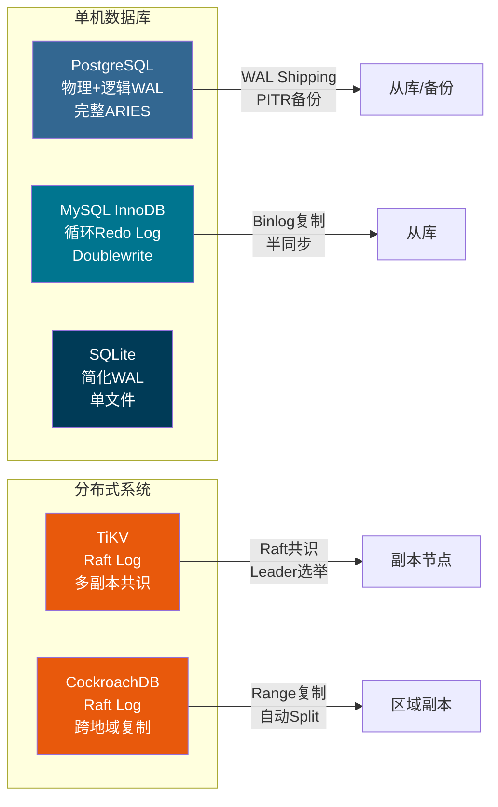
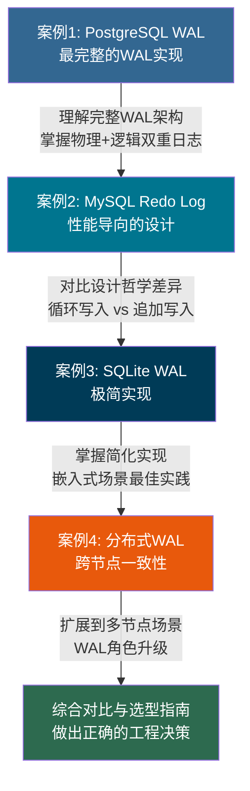

# 实战案例

理论为骨，实践为肉。前两部分建立的WAL理论框架和工程技巧，最终要在真实系统中落地。本部分通过深入剖析四个具有代表性的数据库系统——PostgreSQL、MySQL InnoDB、SQLite和分布式系统（TiKV/CockroachDB）——展示WAL在不同设计哲学、应用场景和工程约束下的具体实现，帮助读者将抽象概念转化为可操作的工程认知。

这四个案例并非随意选择。它们分别代表了数据库WAL设计的四个典型范式：**完整主义**（PostgreSQL，功能最齐全的WAL实现）、**实用主义**（MySQL InnoDB，以性能为导向的精简设计）、**极简主义**（SQLite，嵌入式场景的最小编码量实现）、**扩展主义**（分布式系统，将WAL从本地工具升级为一致性基石）。理解这四种范式，就掌握了WAL设计的完整光谱。

---

## 为什么需要案例分析

WAL虽然核心规则简单——"日志先于数据"——但不同系统在实现时面临截然不同的约束条件，导致了完全不同的架构选择：

- **PostgreSQL** 需要同时支持物理复制和逻辑复制，WAL必须记录所有页面变更的物理格式，并提供额外的逻辑解码能力。这要求WAL子系统足够通用，能同时服务于崩溃恢复、复制流和变更数据捕获（CDC）三个目标
- **MySQL InnoDB** 追求高并发OLTP场景下的极致写入性能，采用循环写入的Redo Log设计，在有限的固定空间内通过checkpoint机制高效回收日志空间，以牺牲历史回溯能力换取写入吞吐量
- **SQLite** 作为嵌入式数据库，运行在资源受限的移动设备和IoT设备上，要在单个文件中同时支持WAL和读写并发，设计约束是零外部依赖、极低内存占用和单文件管理
- **分布式系统**（如TiKV、CockroachDB）需要将WAL扩展到多个节点，在网络分区、节点故障、脑裂等异常条件下仍能保证数据一致性，WAL的角色从"本地持久化保障"升级为"跨节点一致性基石"

理解这些差异的价值不仅仅在于"知道某个数据库怎么做的"，更在于培养一种**工程判断力**：当你面对一个新的存储系统设计需求时，能够根据约束条件做出合理的WAL架构选择。这种判断力比记住任何具体配置参数都更有价值。

---

## 四大系统的WAL设计对比

在深入每个案例之前，先从全局视角对比四种WAL实现的核心设计差异：

| 维度 | PostgreSQL WAL | MySQL InnoDB Redo Log | SQLite WAL | 分布式系统（Raft Log） |
|------|---------------|----------------------|------------|----------------------|
| **日志格式** | 物理+逻辑混合（可选级别） | 物理（页面级） | 物理（页面级） | 命令/状态机复制 |
| **写入方式** | 追加写入（段文件，16MB/段） | 循环写入（固定文件组） | 追加写入（单-wal文件） | 追加写入（日志段） |
| **空间管理** | 段文件轮转+归档保留 | checkpoint回收空间，可重用 | checkpoint合并回主库 | 日志压缩/截断 |
| **复制支持** | 物理复制+逻辑复制+CDC | 异步/半同步复制+GTID | 无内置复制 | Raft共识复制，多副本 |
| **恢复模型** | ARIES完整三阶段 | ARIES简化版 | 简化恢复（回滚或重放） | 日志重放+WAL shipping |
| **并发模型** | 多进程（共享内存+LWLock） | 多线程（后台线程池） | 单写多读（WAL模式） | 多副本并行读 |
| **数据保护** | Full Page Write防部分写入 | Doublewrite Buffer防部分写入 | 无额外保护（依赖文件系统） | 多副本冗余 |
| **典型场景** | OLTP+OLAP混合，企业级 | 高并发OLTP，互联网业务 | 嵌入式/移动端/桌面 | 高可用分布式，金融级 |



---

## 本节学习路径

建议按以下顺序阅读，从最成熟的完整实现到最精简的实现，再到最复杂的分布式场景：



**阅读时间估计**：每个案例约需30-45分钟深度阅读，全部四个案例建议分2-3天完成。每个案例的实操部分建议在本地环境实际运行。

---

## 案例1：PostgreSQL的WAL架构详解

**核心主题**：物理复制、逻辑复制与PITR（时间点恢复）

PostgreSQL的WAL是所有关系型数据库中最完整、最灵活的实现，堪称WAL设计的教科书。其设计特点包括：

- **独立的WAL子系统**：WAL作为一个独立模块运行，与存储引擎（Heap）解耦，通过接口层通信。这种解耦使得WAL可以独立升级而不影响主引擎，也使得未来替换存储引擎成为可能
- **多种WAL级别**：
  - `minimal`：仅记录足够的信息用于崩溃恢复，不支持复制。适合批量加载场景，性能最优
  - `replica`（默认）：记录完整的页面变更，支持物理复制和PITR。生产环境的标准选择
  - `logical`：在物理记录之上增加逻辑解码能力，支持选择性表复制和CDC。用于异构系统数据同步
- **段文件管理**：WAL以16MB为单位分段存储（`XLogFileName`格式：`时间线ID-段ID`），支持归档到S3/NFS和流式传输到从库
- **Full Page Write（FPW）**：首次修改数据页时记录完整页面（通常8KB），防止OS崩溃导致的部分写入（torn page）。这是PostgreSQL区别于MySQL的关键设计差异
- **组提交（Group Commit）**：多个事务的WAL写入合并为一次`fsync`，显著降低高并发场景下的I/O开销

**本案例将深入分析**：一个电商平台在大促期间遇到的WAL写入瓶颈问题——`wal_buffers`设置过小导致频繁的WAL段切换，`checkpoint_completion_target`未优化导致I/O尖峰，以及组提交参数`commit_delay`和`commit_siblings`的调优。最终通过系统性参数优化将写入吞吐量提升3倍。

**关键配置参数**：

| 参数 | 默认值 | 优化建议 | 影响范围 |
|------|--------|---------|---------|
| `wal_level` | replica | 需要逻辑复制时设为logical | WAL记录粒度 |
| `max_wal_size` | 1GB | 生产环境设为4-16GB | checkpoint频率 |
| `wal_buffers` | -1（auto） | 大事务场景设为64MB | WAL写入缓冲 |
| `checkpoint_completion_target` | 0.9 | 保持默认或设为0.5 | I/O平滑度 |
| `commit_delay` | 0 | 高并发OLTP设为10-100μs | 组提交窗口 |
| `wal_compression` | off | 带宽受限时开启 | CPU vs 带宽权衡 |

**适用场景**：需要高可用、读写分离、逻辑复制（CDC）、PITR备份恢复的复杂业务系统。典型用户包括金融机构、SaaS平台和需要异构数据同步的微服务架构。

---

## 案例2：MySQL InnoDB的Redo Log机制

**核心主题**：循环写入、doublewrite buffer与崩溃恢复

MySQL InnoDB的Redo Log采用与PostgreSQL截然不同的设计哲学——**循环写入（circular logging）**。这种设计以"够用就好"为原则，在有限空间内实现高效写入，牺牲历史回溯能力换取简洁性和性能。其核心特点包括：

- **固定大小的Redo Log组**：由若干个`ib_logfile`文件组成（MySQL 8.0.30后改为`#innodb_redo/`目录下的文件），总大小固定（默认48MB，生产环境建议4-16GB），写满后从头循环覆盖
- **checkpoint机制**：通过更新`checkpoint_lsn`释放已刷盘的日志空间。当写入追上checkpoint时发生"log checkpoint等待"，这是性能瓶颈的常见来源
- **doublewrite buffer**：解决"部分写入"（partial write / torn page）问题。InnoDB先将脏页写入doublewrite buffer（连续磁盘空间），再写入实际数据文件位置。崩溃恢复时先检查doublewrite buffer，防止损坏的页面覆盖有效数据
- **灵活的刷盘策略**：`innodb_flush_log_at_trx_commit`提供三级持久性选择：
  - `0`：每秒写入OS buffer + 每秒fsync。最快但可能丢失1秒数据
  - `1`（默认）：每次事务提交都fsync。最安全但性能最低
  - `2`：每次提交写入OS buffer，每秒fsync。折中方案，OS崩溃不丢数据，MySQL进程崩溃可能丢失1秒

**本案例将分析**：一个高并发写入场景（电商秒杀、游戏排行榜实时更新）下`innodb_log_waits`飙升的排查过程。通过监控`SHOW ENGINE INNODB STATUS`定位到Redo Log空间不足，计算实际的Redo Log需求量（基于写入速率和checkpoint间隔），调整`innodb_log_file_size`从48MB到4GB，并配合`innodb_flush_log_at_trx_commit=2`和`innodb_io_capacity`参数优化，最终将写入延迟从200ms降低到15ms。

**关键配置参数**：

| 参数 | 默认值 | 优化建议 | 影响范围 |
|------|--------|---------|---------|
| `innodb_log_file_size` | 48MB | 生产环境设为4-16GB | 日志空间+checkpoint频率 |
| `innodb_log_buffer_size` | 16MB | 大事务场景设为256MB | WAL写入缓冲 |
| `innodb_flush_log_at_trx_commit` | 1 | 非关键数据可设为2 | 持久性 vs 性能 |
| `innodb_doublewrite` | ON | SSD环境可评估关闭 | 写放大 vs 数据安全 |
| `innodb_io_capacity` | 200 | SSD设为2000-10000 | checkpoint刷盘速度 |
| `innodb_log_compressed_pages` | ON | CPU充足时保持开启 | 压缩效率 |

**适用场景**：高并发OLTP、互联网业务（电商、社交、游戏）、对写入性能要求极高且可接受一定数据丢失风险（RPO≈1秒）的业务系统。

---

## 案例3：SQLite的WAL模式

**核心主题**：嵌入式场景的简化WAL实现与读写并发

SQLite作为最广泛部署的数据库引擎（据估计运行在全球超过10亿台设备上，从智能手机到浏览器到飞机仪表盘），其WAL模式展示了如何在极简架构下实现有效的持久化保障。SQLite的设计哲学是"零配置、零运维、嵌入应用进程"：

- **单文件WAL**：所有日志记录追加到单个`-wal`文件中（与数据库文件同目录），无需复杂的段文件管理。WAL文件在checkpoint后会被截断重用，避免无限增长
- **读写并发**：WAL模式下读操作不会被写操作阻塞——读操作通过WAL中的快照机制读取一致的数据视图，而写操作在单独的WAL文件中追加。这解决了默认journal模式下"写阻塞读、读阻塞写"的排他锁问题
- **简化的checkpoint**：通过`wal_autocheckpoint`参数（默认1000页，约4MB）自动触发，将WAL内容合并回主数据库。也支持手动调用`PRAGMA wal_checkpoint(TRUNCATE)`立即清理
- **零配置启用**：一条`PRAGMA journal_mode=WAL`即可从journal模式切换到WAL模式，无需重启或重建数据库。支持热切换，在运行中的数据库上即时生效
- **WAL索引（WAL-index）**：使用共享内存中的哈希表加速WAL中的数据查找，避免全表扫描WAL文件。这是SQLite WAL性能的关键——通过`PRAGMA wal_autocheckpoint`和`PRAGMA wal_checkpoint`控制WAL索引的更新频率

**本案例将通过基准测试对比**：journal模式和WAL模式在不同并发读写比例下的性能差异（使用`sqlite3_analyzer`工具）。测试场景包括：100%写入（WAL模式约快2-5倍）、混合读写（WAL模式在读多写少场景下快10-50倍）、纯读取（两种模式性能接近）。同时展示WAL模式在移动端应用（如iOS/Android上的本地数据库）和嵌入式场景中的实际部署效果。

**关键PRAGMA**：

| PRAGMA | 默认值 | 推荐设置 | 说明 |
|--------|--------|---------|------|
| `journal_mode` | delete | WAL | 启用WAL模式 |
| `wal_autocheckpoint` | 1000 | 1000-5000 | WAL自动checkpoint页数阈值 |
| `synchronous` | FULL | NORMAL或FULL | fsync策略：NORMAL更快但OS崩溃可能丢数据 |
| `busy_timeout` | 0 | 5000-30000 | 写冲突时等待毫秒数 |
| `wal_checkpoint` | — | 按需调用 | 手动触发checkpoint |
| `mmap_size` | 0 | 256MB-1GB | 内存映射加速读取 |

**适用场景**：移动端应用（iOS/Android本地数据库）、嵌入式设备（IoT传感器数据存储）、桌面应用（浏览器历史、编辑器配置）、轻量级Web服务（SQLite作为单机后端数据库，如Litestream WAL复制方案）。

---

## 案例4：分布式系统中的WAL应用

**核心主题**：WAL shipping、Raft Log与跨节点一致性

当数据库从单机扩展到分布式架构，WAL的角色从"本地持久化保障"升级为"跨节点一致性基石"。分布式WAL面临全新的、远比单机复杂的挑战：

- **网络不可靠**：节点间通信可能延迟、丢包甚至分区。一条WAL记录的传播可能需要多次重试，网络分区可能导致"脑裂"（split-brain）
- **节点可能故障**：需要在部分节点不可用时仍能提供服务。WAL必须支持多副本冗余，确保单点故障不影响数据持久性
- **一致性与可用性权衡**：CAP定理要求在网络分区时在一致性（C）和可用性（A）之间做出选择。不同的分布式WAL实现做出不同的权衡
- **日志截断与压缩**：分布式系统中WAL不能无限增长，需要在所有副本确认后截断已提交的日志。但截断策略必须考虑慢副本（slow follower）的情况
- **Leader选举与日志对齐**：新Leader选出后，必须确保其日志至少和大多数副本一样新（Raft的安全性保证），这要求WAL记录携带完整的元数据（term、index等）

**本案例将深入分析**：

- **TiKV的Raft Log实现**：TiKV使用Multi-Raft架构，将数据按Region（默认96MB）分片，每个Region独立运行Raft协议。WAL在RocksDB的WAL之上，额外维护一层Raft Log用于共识。分析其如何通过`raft_log_gc_limit`参数控制日志截断频率，以及`region-schedule`如何在节点间迁移数据
- **CockroachDB的Range复制**：CockroachDB将数据划分为Range（默认512MB），每个Range有3个副本。其WAL设计结合了Raft共识和多版本并发控制（MVCC），分析其在跨地域部署（如美国东西海岸）时的WAL shipping延迟优化
- **WAL Shipping在灾难恢复中的应用**：展示PostgreSQL的`archive_command`和`restore_command`如何实现跨数据中心的WAL shipping，以及`pg_basebackup`+WAL归档组合实现的增量备份方案

**关键概念与对比**：

| 概念 | 说明 | 代表系统 |
|------|------|---------|
| Raft Log | 基于Raft共识协议的日志复制，保证强一致 | TiKV、CockroachDB、etcd |
| WAL Shipping | 将WAL文件异步/同步传输到远程节点 | PostgreSQL（流复制）、MySQL（Binlog） |
| Log Compaction | 在保证一致性的前提下压缩/截断旧日志 | 所有分布式系统 |
| Leader Election | 基于WAL日志新旧程度选举新Leader | Raft协议（所有Raft系统） |
| Snapshot + Log | 通过快照加速落后副本的追赶 | Raft快照机制 |

**适用场景**：高可用分布式系统（99.99%+ SLA）、跨数据中心复制（RPO<1秒，RTO<30秒）、金融级数据一致性（零数据丢失）、全球部署的SaaS平台（多区域就近读写）。

---

## 案例设计哲学对比

四个案例体现了两种截然不同的WAL设计哲学，理解这两种哲学的取舍是做出正确架构选择的关键。

### 追加写入 vs 循环写入

| 特性 | 追加写入（PostgreSQL/SQLite/分布式） | 循环写入（MySQL InnoDB） |
|------|-------------------------------------|------------------------|
| **空间管理** | 段文件轮转+归档保留，空间可控 | checkpoint回收空间，固定大小循环 |
| **历史保留** | 可长期保留WAL归档，支持PITR恢复到任意时间点 | 覆盖旧日志，不支持WAL级别的历史回溯 |
| **写入性能** | 顺序追加无空间回收开销，但归档I/O有额外成本 | 高并发写入更高效，无需管理归档策略 |
| **配置复杂度** | 需要管理归档目录、清理策略、磁盘空间预算 | 相对简单，设置日志文件大小即可 |
| **灾难恢复** | 支持PITR，可恢复到任意历史时间点 | 仅支持基于备份+Binlog的恢复 |
| **适用场景** | 需要历史回溯、逻辑复制、CDC的复杂业务 | 纯OLTP，追求写入性能的互联网业务 |

**选择建议**：如果你的业务需要数据回溯（如审计、数据修复）、逻辑复制（如异构系统同步）或变更数据捕获（如实时数据仓库），选择追加写入。如果你的业务是纯OLTP高并发写入，且数据安全性可以通过其他机制（如主从复制、定期备份）保障，循环写入是更高效的选择。

### 物理日志 vs 逻辑日志

| 特性 | 物理日志（所有案例基础） | 逻辑日志（PostgreSQL logical decoding） |
|------|------------------------|----------------------------------------|
| **记录内容** | "在页面X的偏移量Y写入值Z"（二进制差异） | "在表T插入行(ID=1, name='Alice')"（SQL语义） |
| **恢复速度** | 快（直接重放页面变更，无需解析SQL） | 慢（需要重放SQL操作，涉及索引维护等） |
| **跨版本兼容** | 不兼容（页面格式随版本变化） | 兼容（SQL语义稳定，可跨大版本复制） |
| **复制粒度** | 整个数据库（无法选择性复制） | 可选择特定表、Schema甚至行（WHERE过滤） |
| **存储效率** | 高（记录二进制差异，紧凑） | 低（记录完整SQL或变更描述，较冗长） |
| **外部消费** | 需要特殊工具解析二进制格式 | 可被Kafka、Flink等直接消费 |

**选择建议**：崩溃恢复和物理复制场景使用物理日志（性能最优）。逻辑复制、CDC、跨版本迁移、异构系统同步场景使用逻辑日志（灵活性最强）。两者并非互斥——PostgreSQL在同一套WAL中同时提供两种能力，通过`wal_level`控制。

### 数据保护机制对比

不同系统解决"部分写入"（torn page）问题的方案也值得深入对比：

| 系统 | 保护机制 | 原理 | 性能影响 |
|------|---------|------|---------|
| PostgreSQL | Full Page Write（FPW） | 首次修改页面时记录完整页面 | 写放大50-100%（首次修改） |
| MySQL InnoDB | Doublewrite Buffer | 先写连续缓冲区，再写实际位置 | 写放大约2倍 |
| SQLite | 无额外保护 | 依赖文件系统的原子性（fsync） | 无额外开销 |
| 分布式系统 | 多副本冗余 | 通过多数派确认保证一致性 | 网络延迟为主要开销 |

FPW和Doublewrite是两种不同的思路：FPW在日志层面解决问题（记录完整页面以备恢复），Doublewrite在存储层面解决问题（确保页面完整写入后再更新元数据）。SQLite选择信任文件系统（现代文件系统如ext4、NTFS通常保证单个`write()`调用的原子性），这是嵌入式场景下的合理简化。

---

## 实操环境搭建指南

在开始阅读案例之前，建议先搭建实验环境。以下是各系统的最小化部署方案：

### PostgreSQL实验环境

```bash
# 使用Docker快速启动
docker run --name pg-wal-demo \
  -e POSTGRES_PASSWORD=demo123 \
  -p 5432:5432 \
  -v pgdata:/var/lib/postgresql/data \
  -d postgres:16

# 启用逻辑复制支持
docker exec pg-wal-demo psql -U postgres -c \
  "ALTER SYSTEM SET wal_level = 'logical';"
docker exec pg-wal-demo psql -U postgres -c \
  "SELECT pg_reload_conf();"

# 验证WAL级别
docker exec pg-wal-demo psql -U postgres -c \
  "SHOW wal_level;"
```

### MySQL InnoDB实验环境

```bash
# Docker启动，自定义Redo Log参数
docker run --name mysql-wal-demo \
  -e MYSQL_ROOT_PASSWORD=demo123 \
  -p 3306:3306 \
  -d mysql:8.0 \
  --innodb-log-file-size=256M \
  --innodb-log-buffer-size=64M

# 验证Redo Log配置
docker exec mysql-wal-demo mysql -uroot -pdemo123 -e \
  "SHOW VARIABLES LIKE 'innodb_log%';"
```

### SQLite WAL模式

```bash
# SQLite通常已预装，直接创建测试数据库
sqlite3 wal_demo.db

# 启用WAL模式
PRAGMA journal_mode=WAL;
PRAGMA journal_mode;  -- 验证输出: wal

# 查看WAL文件
# 数据库目录下会出现 wal_demo.db-wal 文件
```

---

## 阅读建议

1. **理论回顾**：阅读案例前，建议回顾第11章理论基础中关于ARIES恢复模型和LSN设计的内容，以及核心技巧中关于组提交和检查点的讲解。这四个案例都建立在这些理论基础之上，缺乏理论背景会导致理解停留在表面

2. **动手实践**：每个案例都包含可执行的SQL和代码，建议在本地搭建上述实验环境实际运行，观察输出结果。特别是要观察WAL文件的增长、checkpoint触发时的I/O变化、以及不同配置参数对性能指标（TPS、延迟、I/O等待）的直接影响

3. **对比思考**：阅读完所有案例后，思考一个核心问题：**如果你要设计一个新的数据库引擎，你会选择哪种WAL实现方案？** 考虑以下约束条件：
   - 目标场景是OLTP还是OLAP，还是混合负载？
   - 可接受的数据丢失窗口（RPO）是多少？
   - 是否需要逻辑复制或CDC？
   - 部署环境是单机还是分布式？
   - 团队的运维能力如何？

4. **联系实际**：检查你正在使用的数据库系统（MySQL 5.7？MySQL 8.0？PostgreSQL？），它当前的WAL/Redo Log配置是否合理？可以通过以下命令快速诊断：
   - PostgreSQL：`SELECT * FROM pg_stat_bgwriter;` 查看checkpoint统计
   - MySQL：`SHOW ENGINE INNODB STATUS;` 查看Redo Log状态
   - SQLite：`PRAGMA wal_checkpoint(PASSIVE);` 查看WAL文件状态

5. **关注演进**：数据库WAL设计不是一成不变的。MySQL 8.0.30引入了新的Redo Log架构（从`ib_logfile`改为`#innodb_redo/`目录），PostgreSQL 15引入了`wal_summary`用于WAL压缩。保持对新版本特性的关注，了解设计演进背后的工程考量。

---

## 本节小结

通过四个真实系统的案例分析，我们看到：

1. **没有放之四海而皆准的WAL设计**——每种实现都是对特定约束条件的最优回应。PostgreSQL追求完整性和灵活性，MySQL InnoDB追求性能和简洁性，SQLite追求极简和嵌入性，分布式系统追求一致性和高可用性。不存在"最好的"WAL设计，只有"最适合"的设计

2. **设计选择决定能力边界**——PostgreSQL的追加写入天然支持PITR和逻辑复制，MySQL的循环写入在高并发OLTP下写入效率更高，SQLite的简化实现使其能运行在从智能手表到服务器的任何设备上。一旦选定架构，某些能力就天然具备，而另一些则需要额外工程量才能实现

3. **配置调优与架构选型同样重要**——同一个数据库，不同的WAL配置可能带来数量级的性能差异。一个错误的`innodb_log_file_size`设置可能导致`innodb_log_waits`飙升，一个被忽视的`checkpoint_completion_target`参数可能导致周期性的I/O尖峰。配置不是"设好就忘"，而是需要持续监控和调优的

4. **分布式场景需要重新思考WAL的角色**——从单机的"本地持久化保障"升级为多节点的"一致性基石"。这意味着WAL不仅要保证单节点的持久性，还要保证跨节点的顺序一致性、处理网络分区下的脑裂问题、支持Leader选举和日志对齐

5. **理论指导实践，实践验证理论**——前两部分学习的ARIES模型、LSN设计、组提交、检查点优化等理论概念，在这四个案例中都得到了具体体现。理论不是空中楼阁，而是工程实践的底层逻辑。当你理解了"为什么"，在生产环境中遇到WAL相关问题时，就能快速定位根因而不是盲目调参

理解这些差异和权衡，是在生产环境中做出正确决策的基础。接下来的四个案例将逐一展开这些分析，帮助你建立完整的WAL工程认知体系。
