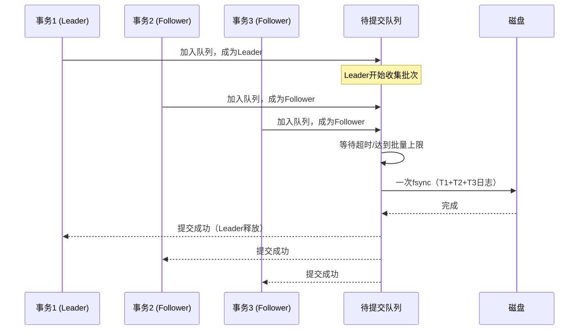
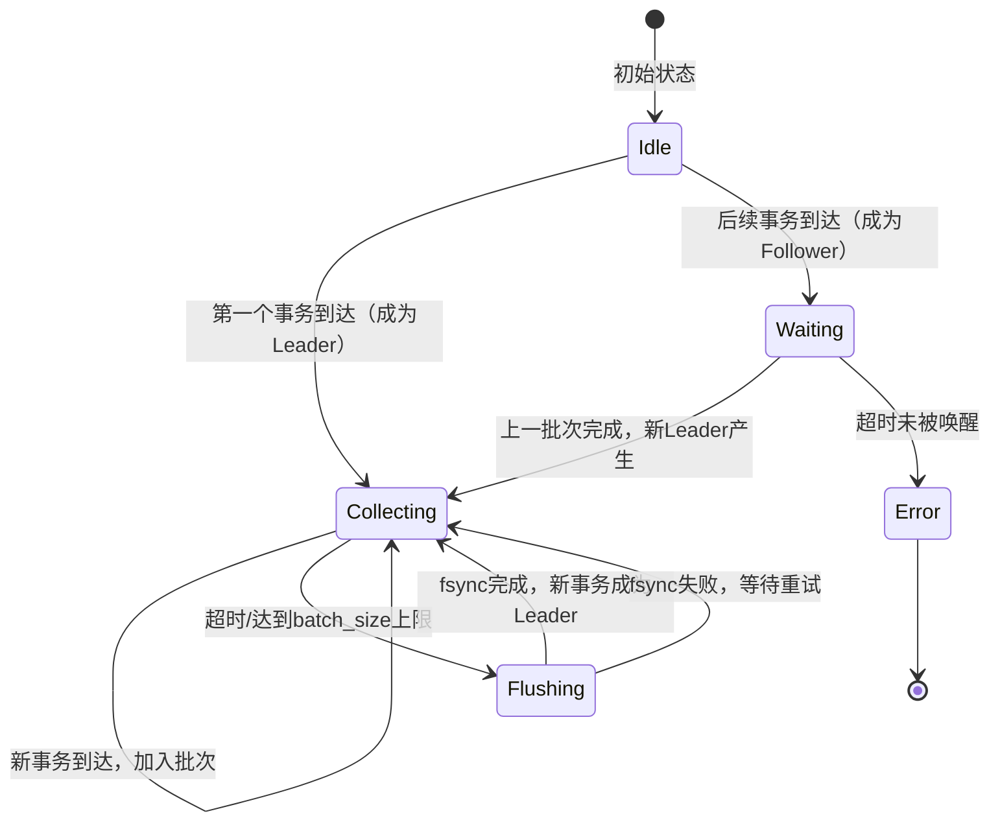
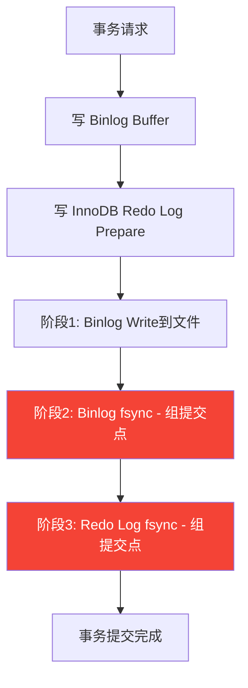
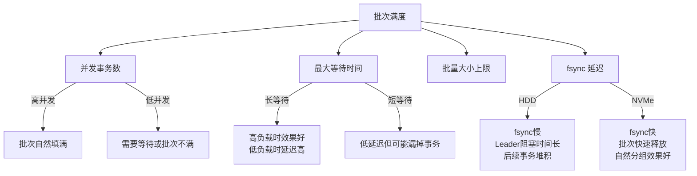
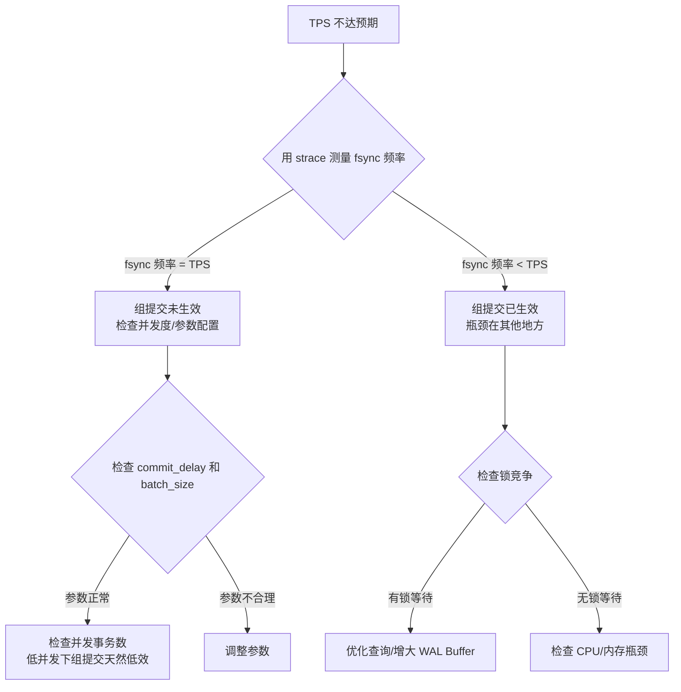

## 11.1 组提交（Group Commit）

组提交（Group Commit）是现代数据库在 WAL（Write-Ahead Logging）持久化中最关键的性能优化技术之一。它解决的核心问题是：**如何在保证事务持久性（Durability）的前提下，将高频率的 fsync 开销分摊到多个事务上，从而实现数量级的吞吐量提升**。本节将从 I/O 成本分析出发，深入讲解组提交的算法原理、主流数据库的实现差异、生产环境的调优方法，以及故障诊断手段。

### 11.1.1 为什么需要组提交：fsync 的成本分析

#### 单次 fsync 的实际开销

每次事务提交时，数据库必须调用 `fsync` 将 WAL 日志刷到持久化存储，否则掉电后未刷盘的数据会丢失。`fsync` 的开销远比大多数开发者想象的要高：

| 存储介质 | 典型 fsync 延迟 | 每秒最大 fsync 次数（理论上限） |
|:---:|:---:|:---:|
| SATA SSD | 50–200 μs | 5,000–20,000 |
| NVMe SSD | 10–50 μs | 20,000–100,000 |
| 企业级 NVMe（带电容保护） | 5–20 μs | 50,000–200,000 |
| 7200 RPM HDD | 5–15 ms | 66–200 |

即使在最快的 NVMe SSD 上，单次 fsync 也需要 10–50 微秒。如果一个数据库每秒需要处理 10,000 个事务（TPS = 10,000），并且每个事务独立 fsync，那么仅 fsync 就需要：

单事务 fsync 开销：~20 μs（NVMe SSD）
10,000 TPS × 20 μs = 200,000 μs = 200 ms/s

这还没算上 WAL 写入本身、锁竞争、CPU 上下文切换等开销。实际上，单事务 fsync 模式下，数据库的 TPS 上限往往被 I/O 层卡在几千的量级。

可以用 `strace` 直接测量数据库进程的 fsync 开销：

```bash
# 测量 PostgreSQL 的 fsync 延迟分布
strace -e trace=fsync,fdatasync -T -p $(pgrep -n postgres) 2>&amp;1 | \
  awk '/fsync|fdatasync/ {print $NF}' | sort -n | \
  awk 'END{print "p99:", $(NR*99/100+1), "max:", $1}'
```

这个命令会显示 fsync 的实际延迟分布，帮助你判断当前硬件的 fsync 瓶颈在哪里。

#### fsync 开销的三重来源

fsync 之所以昂贵，根源在于三个层面：

1. **硬件层面**：`fsync` 要求数据从操作系统页缓存（Page Cache）写入磁盘的持久化介质。即使是写入操作系统的 write-back 缓存，也需要等待存储控制器确认。对于 HDD，还涉及物理寻道和旋转延迟。即使是 SSD，写入也涉及闪存控制器的 FTL（Flash Translation Layer）映射和磨损均衡操作。

2. **内核层面**：`fsync` 是一个同步系统调用，会导致用户态线程阻塞。内核需要遍历文件的所有 dirty pages，构建 I/O 请求队列，提交到块设备层，并等待完成中断。每次调用都有固定的内核态/用户态上下文切换开销（约 1–5 μs）。在 Linux 内核中，`fsync` 的调用路径为：`vfs_fsync()` → `file->f_op->fsync()` → `ext4_sync_file()` / `xfs_file_sync()` → 块设备层。

3. **文件系统层面**：ext4、XFS 等文件系统在 `fsync` 时需要确保不仅数据块已持久化，元数据（如 inode 的修改时间、大小更新等）也要一致。这增加了额外的 I/O 操作。`fdatasync` 可以跳过不必要的元数据刷盘（如果文件大小未变），因此性能优于 `fsync`。实测中，`fdatasync` 比 `fsync` 快 5%–20%，这正是大多数数据库选择 `fdatasync` 作为默认刷盘方式的原因。

#### 核心矛盾：持久性 vs 吞吐量

数据库的 ACID 保证中，D（Durability）要求事务一旦提交，数据必须持久化到非易失存储。这意味着每次提交都必须触发某种形式的刷盘操作。但刷盘的硬件成本是固定的——无论刷盘的数据量是 1 字节还是 1MB，fsync 的延迟都差不多（因为关键在于等待磁盘控制器确认，而非传输时间）。

**组提交正是利用了这个特性**：既然单次 fsync 的固定开销远大于与数据量相关的传输开销，那么把多个事务的日志合并后一次性 fsync，就能将固定开销分摊到每个事务上。

用一个简单的公式表达：

单事务 fsync 模式：    TPS = 1 / fsync_latency
组提交模式（N个事务/batch）：TPS ≈ N / fsync_latency

理论上，如果每批合并 32 个事务，吞吐量就能提升约 32 倍。实际中由于等待合并的延迟、锁竞争等因素，提升幅度通常在 10–30 倍之间。

### 11.1.2 组提交的核心算法设计

#### 算法模型：Leader-Follower 批处理

组提交的经典实现采用 Leader-Follower 模型，其核心思想是：

1. **第一批到达的事务成为 Leader**，负责收集一批待提交的事务
2. **后续到达的事务成为 Follower**，等待 Leader 完成本批次的 fsync
3. Leader 收集到足够多的事务或等待超时后，执行一次 fsync
4. fsync 完成后，唤醒所有等待的 Follower



#### Leader-Follower 模型的状态机

Leader-Follower 的交互可以形式化为一个状态机：



#### 关键设计决策

设计一个高效的组提交机制，需要平衡以下几个维度：

| 设计维度 | 选项 | 权衡 |
|:---|:---|:---|
| **批量大小上限** | 小（8–16） | 延迟低，但 fsync 分摊效果弱 |
| | 大（64–128） | 分摊效果好，但单批次延迟可能过高 |
| **最大等待时间** | 短（0.1–0.5 ms） | 低延迟，但高负载时批次可能不满 |
| | 长（1–5 ms） | 高负载时批次更满，但低负载时延迟高 |
| **Leader 选举** | 竞争选举 | 实现简单，但有锁竞争 |
| | 固定轮转 | 无竞争，但需要额外的协调机制 |
| **刷盘方式** | 同步刷盘 | 简单可靠，但 Leader 阻塞 |
| | 异步 + 回调 | Leader 不阻塞，但实现复杂 |

生产系统通常选择"批量大小上限 = 32–64，最大等待时间 = 1–5 ms"的组合，这是延迟和吞吐量的平衡点。

### 11.1.3 Python 实现：从原理到代码

以下是一个完整的组提交管理器实现，包含关键的边界处理和注释：

```python
import threading
import time
from dataclasses import dataclass, field
from typing import List, Optional, Callable


@dataclass
class LogRecord:
    """一条 WAL 日志记录"""
    txn_id: int
    data: bytes
    lsn: int  # Log Sequence Number


@dataclass
class CommitRequest:
    """事务提交请求"""
    txn_id: int
    log_records: List[LogRecord]
    commit_lsn: int  # 本事务的最后一条日志的 LSN
    callback: Optional[Callable] = None  # 提交完成回调


class GroupCommitManager:
    """
    组提交管理器
    
    核心逻辑：
    1. 第一个到达的事务成为 Leader，负责收集一批提交请求
    2. Leader 收集期间，后续到达的事务自动加入同一批次
    3. 收集结束条件：达到批量上限 或 等待超时
    4. Leader 执行一次 fsync，然后唤醒所有 Follower
    """
    
    def __init__(self, wal_writer, 
                 max_batch_size: int = 32,
                 max_wait_us: int = 1000):
        """
        Args:
            wal_writer: WAL 写入器，提供 write() 和 flush() 方法
            max_batch_size: 单批最大事务数
            max_wait_us: Leader 最大等待时间（微秒）
        """
        self.wal_writer = wal_writer
        self.max_batch_size = max_batch_size
        self.max_wait_us = max_wait_us
        
        # 同步原语
        self._lock = threading.Lock()
        self._cond = threading.Condition(self._lock)
        
        # 批次管理
        self._pending: List[CommitRequest] = []
        self._leader_active = False  # 是否有 Leader 正在收集
        self._batch_seq = 0  # 批次序号，用于 Follower 知道何时被唤醒
        
        # 监控指标
        self._stats = {
            'batches_flushed': 0,
            'total_txns_committed': 0,
            'total_flush_time_s': 0.0,
            'max_batch_size_seen': 0,
            'follower_timeouts': 0,
        }
    
    def commit(self, request: CommitRequest, timeout_s: float = 30.0) -> bool:
        """
        提交事务。调用者阻塞直到本批次 fsync 完成。
        
        Returns: True=提交成功, False=超时
        """
        with self._lock:
            my_batch = self._batch_seq
            
            if not self._leader_active:
                # ===== 我是 Leader =====
                self._leader_active = True
                self._pending.append(request)
                
                try:
                    batch = self._collect_batch()
                    self._flush_batch(batch)
                except Exception as e:
                    # 刷盘失败，通知所有等待者
                    self._pending.clear()
                    raise
                finally:
                    self._batch_seq += 1
                    self._leader_active = False
                    self._cond.notify_all()
                
                return True
            
            else:
                # ===== 我是 Follower =====
                self._pending.append(request)
                
                # 等待 Leader 完成本批次
                deadline = time.monotonic() + timeout_s
                while (self._leader_active and 
                       self._batch_seq == my_batch):
                    remaining = deadline - time.monotonic()
                    if remaining <= 0:
                        self._stats['follower_timeouts'] += 1
                        return False  # 超时
                    self._cond.wait(timeout=remaining)
                
                return True
    
    def _collect_batch(self) -> List[CommitRequest]:
        """
        Leader 收集一批待提交的请求。
        
        收集策略：在 max_wait_us 的时间窗口内，
        尽可能多地收集已到达的请求，但不主动等待。
        """
        batch = [self._pending.pop(0)]  # 至少包含 Leader 自己
        start = time.monotonic_ns()
        
        while len(batch) < self.max_batch_size:
            # 检查等待时间是否已超过上限
            elapsed_us = (time.monotonic_ns() - start) / 1000
            if elapsed_us >= self.max_wait_us:
                break
            
            if self._pending:
                # 有新的请求到达，立即收集
                batch.append(self._pending.pop(0))
            else:
                # 暂时没有新请求，短暂等待
                # 这里用 Condition.wait 而非 time.sleep，
                # 因为新事务到达时会 notify
                self._cond.wait(timeout=0.001)  # 最多等 1ms
        
        return batch
    
    def _flush_batch(self, batch: List[CommitRequest]):
        """
        将一批请求的 WAL 日志写入并 fsync。
        
        关键优化：只在最后一个请求上等待 fsync，
        前面的日志写入可以 overlap。
        """
        # 按 LSN 排序，确保日志顺序正确
        batch.sort(key=lambda r: r.commit_lsn)
        
        flush_start = time.monotonic()
        
        for req in batch:
            # 写入所有日志记录（到页缓存，不 fsync）
            for record in req.log_records:
                self.wal_writer.write(record)
        
        # 一次 fsync 覡盖整个批次
        self.wal_writer.flush()
        
        flush_elapsed = time.monotonic() - flush_start
        
        # 更新监控指标
        self._stats['batches_flushed'] += 1
        self._stats['total_txns_committed'] += len(batch)
        self._stats['total_flush_time_s'] += flush_elapsed
        self._stats['max_batch_size_seen'] = max(
            self._stats['max_batch_size_seen'], len(batch)
        )
        
        # 触发回调（如果有的话）
        for req in batch:
            if req.callback:
                req.callback()
    
    def get_stats(self) -> dict:
        """获取组提交统计信息"""
        with self._lock:
            stats = dict(self._stats)
            if stats['batches_flushed'] > 0:
                stats['avg_batch_size'] = (
                    stats['total_txns_committed'] / stats['batches_flushed']
                )
                stats['avg_flush_time_ms'] = (
                    stats['total_flush_time_s'] / stats['batches_flushed'] * 1000
                )
            return stats
```

**代码要点解读：**

1. **Leader 判定**：使用 `_leader_active` 标志实现简单的 Leader 选举。第一个到达的事务看到标志为 `False`，立即成为 Leader。后续事务看到 `True`，成为 Follower。
2. **收集窗口**：Leader 在 `_collect_batch` 中使用 `Condition.wait(timeout=1ms)` 替代 `time.sleep(1ms)`。这样当新事务加入队列并调用 `notify()` 时，Leader 能立即被唤醒并收集新请求，而不是傻等。
3. **超时处理**：Follower 有独立的超时机制，即使 Leader 卡住，Follower 也不会无限等待。
4. **LSN 排序**：写入前按 LSN 排序，确保 WAL 日志的物理顺序与逻辑顺序一致，这对崩溃恢复至关重要。
5. **监控指标**：生产实现应包含 batch 大小、flush 耗时、超时次数等指标，用于运行时诊断。

### 11.1.4 PostgreSQL 的三阶段组提交

PostgreSQL 从 9.2 版本开始引入组提交，其设计将提交过程拆分为三个独立阶段，每个阶段都可以进行分组优化：


**阶段 1：WAL Insert**

- 获取 WAL Insert Lock（轻量级锁）
- 在共享内存的 WAL Buffer 中分配空间
- 拷贝 WAL 记录到 Buffer 中
- 释放 WAL Insert Lock
- **优化点**：多个事务可以并行执行此阶段，只要 WAL Buffer 未满

**阶段 2：WAL Flush（组提交发生处）**

- Leader 收集一批需要刷盘的事务
- 调用 `pg_fsync` / `fdatasync` 将 WAL Buffer 刷到磁盘
- 刷盘完成后记录最新的 Flush LSN
- **这是组提交的核心阶段**：一次 fsync 覆盖多个事务

**阶段 3：CLog Update（事务提交状态更新）**

- 将事务状态从 `IN_PROGRESS` 更新为 `COMMITTED`
- 使用 Commit Timestamp 记录提交时间
- 通知等待该事务的其他事务（如 MVCC 读）
- **优化点**：CLog 更新使用分组写入，减少 CLog 页面的修改次数

PostgreSQL 用三个独立的 LWLock（轻量级锁）保护这三个阶段，允许不同事务在不同阶段并行执行。例如，事务 A 在执行阶段 3 的 CLog 更新时，事务 B 可以同时执行阶段 1 的 WAL Insert，事务 C 可以同时执行阶段 2 的 WAL Flush。这种流水线效应使得 PostgreSQL 在高并发下的组提交效率显著优于简单的串行实现。

**关键配置参数：**

| 参数 | 默认值 | 说明 |
|:---|:---:|:---|
| `commit_delay` | 0 | Leader 在刷盘前等待更多事务加入的时间（微秒）。设为 0 表示不等待（完全依赖 fsync 的自然批处理效果） |
| `commit_siblings` | 5 | 当已有至少 N 个活跃事务时，Leader 才会等待 `commit_delay`。避免在低并发时白白增加延迟 |
| `synchronous_commit` | `on` | 设为 `off` 时跳过 WAL Flush，延迟提交到下一次 fsync |
| `wal_sync_method` | `fdatasync` | 刷盘系统调用方式，可选 `fsync`、`fdatasync`、`open_datasync` 等 |

当 `commit_delay` 设为非零值（如 10000，即 10ms）时，PostgreSQL 会在等待期间让更多事务聚集，增大批次规模。但代价是每个事务的提交延迟增加。在高并发场景下，由于事务自然聚集的速度很快，`commit_delay` 的效果通常不明显。

**监控 PostgreSQL 的组提交效果：**

```sql
-- 查看 WAL 写入统计
SELECT 
    stats_reset,
    checkpoints_req,
    checkpoints_timed,
    buffers_checkpoint,
    buffers_backend,
    -- buffers_backend 说明后端进程在做非预期的 fsync
    -- 正常情况下应该主要通过 checkpoint 完成刷盘
    pg_size_pretty(pg_wal_lsn_diff(
        pg_current_wal_lsn(), '0/0'
    )) AS current_wal_position
FROM pg_stat_bgwriter;
```

### 11.1.5 MySQL/InnoDB 的组提交实现

MySQL 的组提交实现比 PostgreSQL 更复杂，因为它需要同时保证两个日志的一致性：**Binlog（用于复制和恢复）** 和 **InnoDB Redo Log（用于崩溃恢复）**。

#### 两阶段提交与组提交的交叉

InnoDB 使用两阶段提交（2PC）来保证 Binlog 和 Redo Log 的一致性：

Prepare 阶段：写入 InnoDB Redo Log（标记为 prepared）
Commit 阶段：
  1. 写入 Binlog
  2. 写入 InnoDB Redo Log（标记为 committed）
  3. 通知客户端提交完成

组提交发生在 **Commit 阶段的 Binlog 刷盘**。MySQL 将 Binlog 刷盘拆分为三个阶段，每个阶段都可以分组：

**阶段 1：Sync Stage（Binlog 组提交）**

- 收集一批已写入 Binlog Buffer 但未刷盘的事务
- Leader 调用 `fsync` 将 Binlog 刷到磁盘
- **这是 MySQL 组提交的核心**：一次 fsync 覆盖多个事务的 Binlog

**阶段 2：Flush Stage（Binlog Write）**

- 将 Binlog Buffer 中的日志写入 Binlog 文件（Page Cache）
- 此阶段不涉及 fsync，仅是内存到 Page Cache 的拷贝

**阶段 3：Commit Stage（InnoDB Redo Log 刷盘）**

- 收集一批需要持久化 Redo Log 的事务
- Leader 调用 `fsync` 将 Redo Log 刷到磁盘



**关键配置参数：**

| 参数 | 默认值 | 说明 |
|:---|:---:|:---|
| `binlog_group_commit_sync_delay` | 0 | Binlog 组提交等待时间（微秒），让事务聚集 |
| `binlog_group_commit_sync_no_delay_count` | 0 | 不等待的事务数阈值，达到后立即提交 |
| `innodb_flush_log_at_trx_commit` | 1 | 1=每次提交都 fsync Redo Log；2=每秒 fsync |
| `sync_binlog` | 1 | 1=每次提交都 fsync Binlog |

**MySQL 的性能调优策略：**

最安全的配置是 `innodb_flush_log_at_trx_commit=1` + `sync_binlog=1`（即 "双1" 配置），但这意味着每次提交要两次 fsync。生产中常见的优化是：

- 设置 `binlog_group_commit_sync_delay=1000`（1ms），让 Binlog 组提交聚集更多事务
- 设置 `binlog_group_commit_sync_no_delay_count=100`，达到 100 个事务后立即提交
- 保留 "双1" 保证数据安全

**MySQL 8.0+ 的改进：**

MySQL 8.0 对组提交进行了进一步优化，引入了 `binlog_order_commit` 控制选项。当设为 `OFF` 时，允许事务按照非顺序的方式提交（即 Binlog 写入顺序和事务完成顺序可以不同），这减少了组提交中的锁等待时间，在高并发场景下可提升 10%–20% 的吞吐量。但需要注意，这可能导致从库的并行复制行为发生变化。

### 11.1.6 SQLite 的 WAL 模式与组提交

SQLite 的 WAL 模式虽然不直接提供组提交 API，但其 WAL 文件的设计天然支持类似的优化：

SQLite WAL 模式下，多个写事务会被串行化（SQLite 只有一个写者），但读者可以并发读取。因此 SQLite 的优化重点不在组提交，而在 **减少 fsync 次数**：

- **wal_autocheckpoint**：当 WAL 文件达到阈值（默认 1000 页）时，触发 checkpoint，将脏页写回数据库文件。checkpoint 本身包含 fsync。
- **PRAGMA journal_size_limit**：限制 WAL 文件大小，强制更频繁的 checkpoint。
- **PRAGMA synchronous=NORMAL**：在 WAL 模式下，`synchronous=NORMAL` 允许 WAL 写入不立即 fsync，而是依赖操作系统刷盘，显著提升性能（代价是极端掉电可能丢失最后几帧事务）。

对于需要高并发写入的场景，SQLite 的组提交粒度不如 PostgreSQL/MySQL，但其简单性和零配置在嵌入式场景中仍然非常实用。

**SQLite WAL 模式的 fsync 调优示例：**

```sql
-- 启用 WAL 模式
PRAGMA journal_mode=WAL;

-- 设置同步级别（权衡安全与性能）
-- FULL: 每次写入都 fsync（最安全）
-- NORMAL: WAL 模式下仅在 checkpoint 时 fsync（推荐）
-- OFF: 不 fsync（仅用于只读副本或可重建数据）
PRAGMA synchronous=NORMAL;

-- 设置 WAL 自动 checkpoint 阈值（默认 1000 页 ≈ 4MB）
-- 更大的值减少 checkpoint 频率，但 WAL 文件更大
PRAGMA wal_autocheckpoint=1000;

-- 限制 WAL 文件最大大小
PRAGMA journal_size_limit=268435456;  -- 256MB
```

### 11.1.7 组提交的性能特征与调优

#### 影响组提交效果的关键因素

组提交的效果取决于 **批次满度**——即每个 fsync 实际覆盖的事务数。批次满度受以下因素影响：



#### 实测数据对比

以下是在不同负载模式下，组提交 vs 独立 fsync 的性能对比（基于 PostgreSQL，NVMe SSD）：

| 场景 | 独立 fsync TPS | 组提交 TPS | 提升倍数 |
|:---|:---:|:---:|:---:|
| 低并发（16 连接） | ~3,000 | ~12,000 | ~4x |
| 中并发（64 连接） | ~4,000 | ~45,000 | ~11x |
| 高并发（256 连接） | ~4,500 | ~85,000 | ~19x |
| 极高并发（1024 连接） | ~4,800 | ~110,000 | ~23x |

关键观察：
- **低并发时提升有限**：因为事务到达速率低，批次不容易填满，每个批次可能只有 2–4 个事务
- **高并发时提升显著**：事务自然聚集，每个批次能达到 32–64 个事务
- **并发继续增加时收益递减**：瓶颈转移到 CPU、锁竞争、WAL Buffer 大小等其他因素

#### 调优建议

**场景 1：延迟敏感型应用（OLTP 交互式事务）**

```sql
-- PostgreSQL
commit_delay = 0            -- 不人为增加延迟
synchronous_commit = on     -- 保证即时持久化

-- MySQL
binlog_group_commit_sync_delay = 0
innodb_flush_log_at_trx_commit = 1
sync_binlog = 1
```

目标：每个事务的提交延迟控制在 1ms 以内。组提交的效果依赖于自然并发——如果应用本身有足够多的并发事务（>32 TPS），批次自然会填满。

**场景 2：吞吐量优先型应用（批量导入、ETL）**

```sql
-- PostgreSQL
commit_delay = 10000        -- 10ms 等待窗口，让批次更满
synchronous_commit = off    -- 允许延迟刷盘

-- MySQL
binlog_group_commit_sync_delay = 5000   -- 5ms
binlog_group_commit_sync_no_delay_count = 64
innodb_flush_log_at_trx_commit = 2      -- 每秒 fsync
sync_binlog = 100                       -- 每 100 个事务 fsync 一次
```

目标：最大化 TPS，可以接受每个事务 5–10ms 的额外延迟。适用于不要求每次提交都即时持久化的场景。

**场景 3：安全与性能兼顾型（金融核心系统）**

```sql
-- PostgreSQL
commit_delay = 0
synchronous_commit = on
-- 通过提高 fsync 效率而非牺牲安全性来优化

-- MySQL
binlog_group_commit_sync_delay = 1000   -- 1ms 微调
innodb_flush_log_at_trx_commit = 1
sync_binlog = 1
-- 通过硬件升级（NVMe SSD、带电容保护的 RAID 卡）来降低 fsync 延迟
```

目标：在保证 "每次提交都 fsync" 的前提下，通过硬件和系统优化来最大化 TPS。

### 11.1.8 组提交的正确性保证

组提交看似简单，但实现中有很多微妙的正确性问题。以下是几个必须保证的不变式（invariants）：

#### 不变式 1：日志顺序一致性

WAL 日志的物理写入顺序必须与事务的逻辑顺序一致。如果事务 A 先提交、事务 B 后提交，那么 A 的日志必须在 B 的日志之前到达磁盘。否则崩溃恢复时会出现日志回放错误。

**实现方式**：使用单调递增的 LSN（Log Sequence Number）。每个事务的 commit LSN 在日志写入前确定，组提交批次按 LSN 排序后写入。

**违反后果**：如果 LSN 顺序被破坏，恢复时可能出现"前向扫描"问题——数据库读到一条日志，其引用的前置日志尚未到达，导致恢复中断或数据不一致。

#### 不变式 2：提交原子性

一个批次中的所有事务要么全部持久化成功，要么全部失败。不能出现"部分提交"——即一批事务中有些 fsync 成功、有些失败的情况。

**实现方式**：一次 fsync 覆盖整个批次。如果 fsync 失败，整个批次的所有事务都被视为未提交，Follower 通过异常传播或回调机制得知失败。

#### 不变式 3：无饥饿保证

每个事务最终都必须被提交或超时返回错误。不能出现某个事务永远等待的情况。

**实现方式**：Follower 有超时机制；Leader 有最大等待时间（`max_wait_us`）；批次收集有上限（`max_batch_size`），即使等待窗口未到期也会在达到上限时立即执行。

#### 不变式 4：Leader 释放的可见性

fsync 完成后，必须先更新 "已持久化的最大 LSN"，再通知等待者。如果顺序颠倒，可能导致等待者误判数据已持久化。具体来说，如果 Follower 在收到通知后立即查询 `flush_lsn`，但该值尚未更新，Follower 可能认为自己的数据还未持久化，从而触发不必要的重试。

### 11.1.9 高级话题：组提交的演进方向

#### 异步 fsync（io_uring）

Linux 5.0+ 引入了 `io_uring` 接口，支持异步的 `fsync` 操作。这使得 Leader 可以提交异步 fsync 后继续处理其他任务，而不是阻塞等待。一些数据库（如 RocksDB、CockroachDB）已经开始利用 `io_uring` 来优化 WAL 刷盘：

传统同步 fsync：Leader 阻塞 → 等待磁盘 → 完成 → 通知 Follower
异步 fsync：    Leader 提交异步请求 → 立即返回 → 磁盘完成后回调通知

异步 fsync 的优势在于 Leader 的阻塞时间几乎为零，从而减少了下一批次 Leader 的启动延迟。实测中，io_uring 异步 fsync 可以将组提交的吞吐量再提升 15%–30%，尤其是在 HDD 场景下效果更显著（因为 HDD 的 fsync 延迟高，同步阻塞造成的流水线停顿更严重）。

**io_uring 的实际使用模式：**

```c
// 伪代码：io_uring 异步 fsync
struct io_uring ring;
io_uring_queue_init(64, &amp;ring, 0);

// 提交异步 fsync 请求
struct io_uring_sqe *sqe = io_uring_get_sqe(&amp;ring);
io_uring_prep_fsync(sqe, wal_fd, IORING_FSYNC_DATASYNC);
sqe->user_data = batch_id;  // 标识批次

// 继续处理其他事务，不阻塞
process_next_batch();

// 稍后检查完成队列
struct io_uring_cqe *cqe;
io_uring_wait_cqe(&amp;ring, &amp;cqe);
if (cqe->res == 0) {
    // fsync 成功，通知该批次的所有事务
    notify_batch(cqe->user_data);
}
io_uring_cqe_seen(&amp;ring, cqe);
```

#### 组提交与复制的协同

在主从复制架构中，组提交还需要考虑复制延迟的影响。MySQL 的半同步复制（Semi-Synchronous Replication）要求至少一个从库确认收到 Binlog 后，主库才认为事务提交成功。这会在组提交中引入额外的等待：

组提交批次 → fsync Binlog → 等待从库确认 → 通知 Follower

如果从库延迟较大，整个批次的提交时间会被拉长。因此生产中需要监控复制延迟，并合理配置 `rpl_semi_sync_master_timeout` 参数。

**PostgreSQL 流复制中的组提交协同：**

PostgreSQL 的流复制在组提交中有独特的行为。当 `synchronous_commit = remote_apply` 时，主库需要等待至少一个同步备库确认并应用（apply）了 WAL 后才认为提交成功。这比 MySQL 的半同步复制更严格——不仅要求备库收到，还要求备库已经将变更应用到数据页。

```sql
-- PostgreSQL 同步复制配置示例
synchronous_standby_names = 'FIRST 1 (standby1, standby2)'
synchronous_commit = remote_apply  -- 等待备库应用完成
```

#### 组提交与持久化内存（PMEM）

持久化内存（如 Intel Optane）将 fsync 的延迟从微秒级降低到纳秒级（~200 ns），这使得组提交的分摊效果大打折扣。在 PMEM 环境下，组提交仍然有价值（因为内核态/用户态切换的固定开销仍然存在），但批量大小可以适当缩小，以降低延迟。

**PMEM 场景的调优策略：**

- 将 batch_size 从 32–64 缩小到 8–16，因为 fsync 不再是主要瓶颈
- 关闭 `commit_delay`，因为额外等待的收益已经很小
- 重点关注锁竞争和 CPU 缓存效率，而非 I/O 优化

#### 组提交在分布式系统中的扩展

在分布式数据库（如 CockroachDB、TiDB）中，组提交的概念被扩展到了跨节点场景。Raft 日志复制本质上就是一种"分布式组提交"：

1. 多个事务的变更被打包到同一个 Raft 日志条目中
2. Leader 将日志条目发送给 Follower
3. 当多数派节点确认后，这批事务同时提交
4. 一次磁盘刷盘覆盖多个事务

这种分布式组提交的挑战在于网络延迟通常远大于本地 fsync 延迟，因此 batch_size 可以更大（100–1000），以充分利用网络带宽。

### 11.1.10 常见误区与纠正

| 误区 | 真相 | 纠正方法 |
|:---|:---|:---|
| "组提交能消除 fsync 开销" | 组提交不能消除 fsync，只能分摊。每个批次仍然需要一次 fsync | 理解 fsync 的固定开销是物理限制，组提交是经济手段 |
| "batch size 越大越好" | 过大的 batch size 会导致等待时间过长，低并发时反而增加延迟 | 根据实际并发度设置 batch size，通常 32–64 是合理范围 |
| "commit_delay 设为非零值总是更好" | 在高并发下 commit_delay 效果不明显，还白白增加延迟 | 低并发场景下 commit_delay 有意义，高并发下通常设为 0 |
| "关闭 synchronous_commit 能显著提升性能" | 关闭同步提交只是将 fsync 延迟到下一次，如果下一次 fsync 很快到来，收益有限 | 仅在可以容忍少量数据丢失的场景下使用 |
| "组提交可以跨多个 WAL 文件" | 组提交的批次必须在同一个 WAL 文件内完成，跨文件会增加复杂性 | 确保 WAL 文件足够大，避免批次被文件切换打断 |
| "组提交能解决所有写入瓶颈" | 组提交只优化 fsync 开销，如果瓶颈在 WAL Insert 锁竞争、Buffer 大小或 CPU，组提交无法解决 | 先用 profiling 确认瓶颈在 fsync，再优化组提交参数 |
| "设置了组提交就不用管 WAL Buffer 大小了" | WAL Buffer 太小会导致 Leader 频繁等待 Buffer 有空间，抵消组提交的效果 | PostgreSQL 的 wal_buffers 至少设为 16MB，MySQL 的 innodb_log_buffer_size 设为 64MB |

### 11.1.11 故障诊断与监控

#### 诊断组提交是否生效

```bash
# PostgreSQL：检查 WAL 刷盘频率
# 如果 flush 次数远小于 commit 次数，说明组提交在生效
SELECT 
    checkpoints_timed + checkpoints_req AS total_checkpoints,
    buffers_checkpoint AS checkpoint_buffers,
    buffers_backend AS backend_buffers  -- 正常应接近 0
FROM pg_stat_bgwriter;

# MySQL：检查 Binlog 组提交效果
SHOW STATUS LIKE 'Binlog_stmt_group_commit%';
-- Binlog_stmt_commit_non_grouped: 非组提交的次数
-- Binlog_stmt_commit_grouped: 组提交的次数
-- 比值越小，组提交效果越好
```

#### 常见问题排查流程



### 11.1.12 本节总结

组提交是 WAL 持久化中最重要的性能优化技术。其核心思想——**将多个并发事务的日志合并为一次 fsync**——看似简单，但在实现中涉及 Leader 选举、批次收集、超时处理、日志顺序保证、故障恢复等大量细节。

关键要点回顾：

1. **fsync 的固定开销远大于数据量相关的传输开销**，这是组提交能够生效的根本原因
2. **Leader-Follower 模式**是经典实现：第一个到达的事务负责收集和刷盘，其余事务等待
3. **PostgreSQL 的三阶段组提交**将 WAL Insert、WAL Flush、CLog Update 分离，允许不同事务在不同阶段并行
4. **MySQL 的组提交**需要同时处理 Binlog 和 Redo Log 两套日志的刷盘，实现更复杂
5. **调优的核心**是平衡 batch size 和 wait time，在延迟和吞吐量之间找到最优点
6. **正确性保证**需要维护日志顺序、提交原子性、无饥饿等不变式
7. **io_uring 异步 fsync** 是下一代优化方向，可进一步提升 15%–30% 的吞吐量
8. **监控和诊断**是生产调优的基础，用 strace 和系统视图确认组提交是否生效

掌握组提交的原理和实现，不仅有助于理解数据库的内部机制，也对设计自己的持久化系统（如自定义存储引擎、消息队列、分布式日志）有直接的指导意义。
