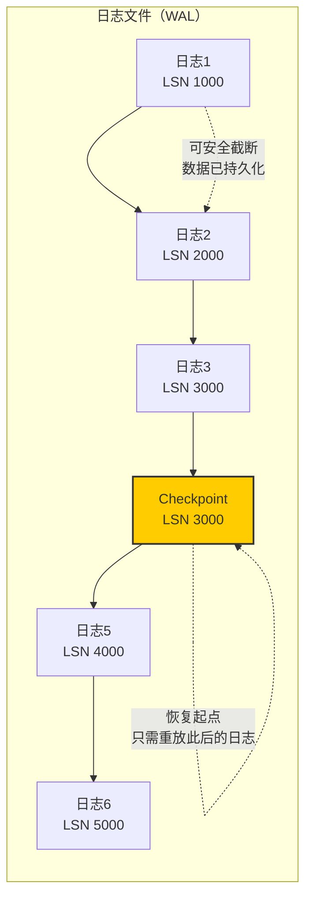
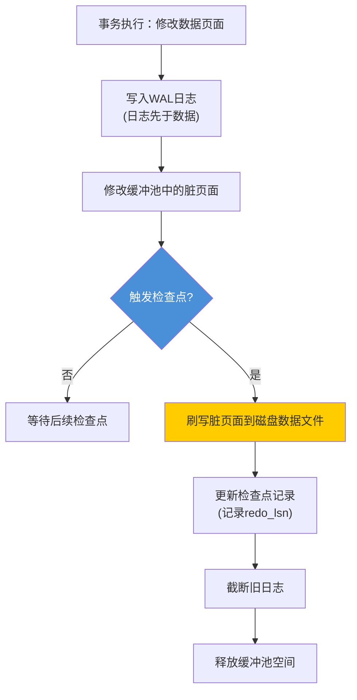
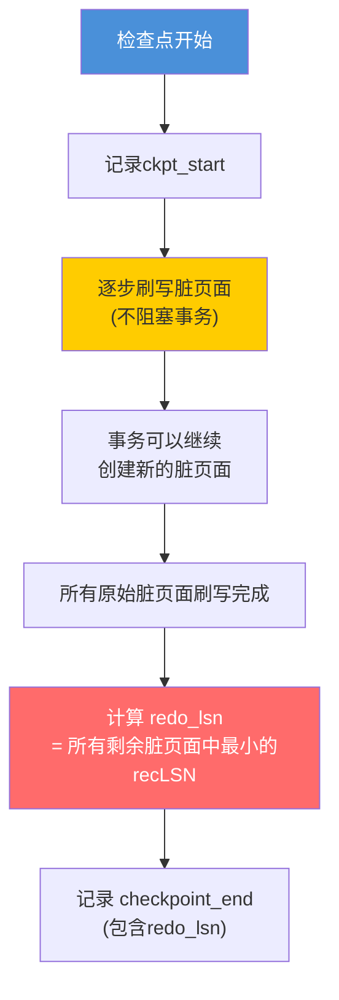
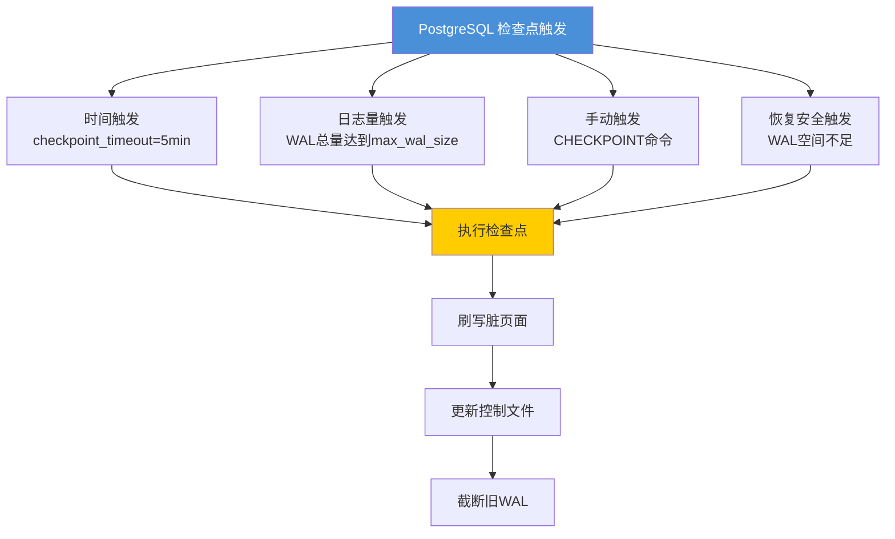
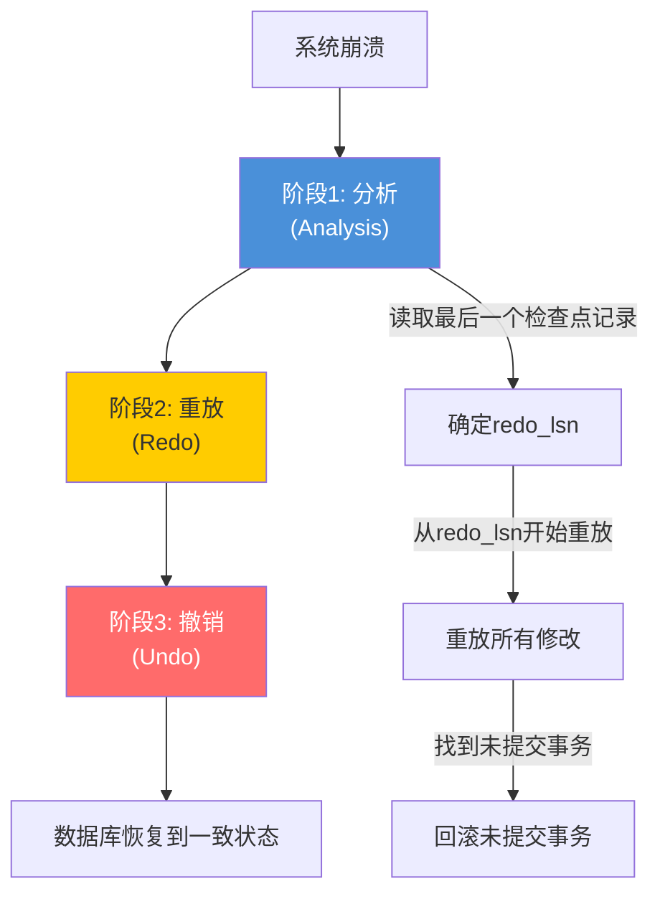

## 11.3 检查点（Checkpoint）

在WAL体系中，日志记录了所有对数据页面的修改，但日志本身不是数据的最终归宿——磁盘上的数据文件才是。随着时间推移，缓冲池中的脏页面越来越多，日志文件越来越长，崩溃恢复需要重放的日志量越来越大。**检查点（Checkpoint）就是解决这三个问题的核心机制**：它将缓冲池中的脏页面刷写到磁盘数据文件中，同时标记"从这个点之后的日志才需要用于恢复"，从而截断旧日志、缩短恢复时间、释放缓冲池空间。

如果说WAL保证了"数据修改不丢失"，那么检查点保证了"系统能在合理时间内恢复到一致状态"。没有检查点，WAL日志将无限增长，恢复时间将线性增长直至不可接受。本节将从检查点的本质需求出发，深入剖析其内部机制，对比Sharp与Fuzzy两种检查点模式的实现差异，分析检查点频率的调优策略，并结合PostgreSQL和MySQL InnoDB的实际实现给出工程实践指南。

---

### 11.3.1 检查点的本质需求：为什么必须有检查点

要理解检查点，首先需要回答一个根本问题：**如果没有检查点，会发生什么？**

假设一个数据库运行了30天，产生了500GB的WAL日志。此时系统崩溃，恢复过程需要从日志的第一条记录开始，逐条重放所有修改。即使日志写入速度是100MB/s，重放500GB日志也需要约83分钟。对于一个要求高可用的OLTP系统来说，这是完全不可接受的。

检查点的引入从根本上改变了这个局面：

**需求一：限制恢复时间（Recovery Time Objective）**

检查点记录了"在这个时刻，所有到此为止的修改都已持久化到磁盘数据文件中"。因此崩溃恢复只需要从最后一个检查点开始重放日志，而不是从日志的起点开始。如果检查点之间间隔5分钟，那么恢复最多只需要重放5分钟的日志量。

**需求二：截断日志，释放磁盘空间**

检查点之前的日志记录了在检查点时刻之前的所有修改。由于这些修改已经通过检查点刷写到了磁盘数据文件中，旧日志就不再需要保留。日志文件可以安全地回收或覆盖，避免日志无限增长。

**需求三：释放缓冲池空间**

缓冲池（Buffer Pool）的大小是有限的。如果脏页面一直不刷盘，缓冲池中就没有空闲页面可供新数据使用。检查点通过刷写脏页面，将其标记为"可替换"，释放缓冲池空间给后续查询使用。



**检查点与WAL规则的关系**：WAL规则要求"日志先于数据"——先写日志，后写数据。检查点正是"写数据"这一步的执行者。在检查点之前，WAL规则保证了所有修改都有日志备份；在检查点期间，脏页面被安全地刷写到磁盘数据文件。两者配合，构成了数据库持久性的完整保证。



---

### 11.3.2 Sharp Checkpoint与Fuzzy Checkpoint

检查点的实现有两种基本模式，它们在正确性、性能和实现复杂度之间做出了不同的权衡。

#### Sharp Checkpoint（锐检查点）

Sharp Checkpoint是最直观的实现方式：**暂停所有事务，将缓冲池中所有脏页面刷写到磁盘，然后恢复事务处理**。

Sharp Checkpoint 执行流程：

  时间线 ──────────────────────────────────────────────►

  事务：  ████████████████|（暂停）|████████████████████
                                  ↑            ↑
                              开始检查点    检查点完成

  磁盘I/O：              ░░░░░░░░░░░░░░░░░░
                         （刷写所有脏页面）

  优势：实现简单，一致性保证强
  劣势：服务暂停时间 = 刷写所有脏页面的时间

**实现代码**：

```python
class SharpCheckpoint:
    """锐检查点实现"""
    
    def __init__(self, buffer_pool, log_manager):
        self.buffer_pool = buffer_pool
        self.log_manager = log_manager
    
    def execute_checkpoint(self):
        """执行一次锐检查点
        
        警告：此操作会阻塞所有事务！
        """
        # 1. 停止接受新事务
        self._quiesce_transactions()
        
        # 2. 等待所有活跃事务完成
        self._wait_for_active_transactions()
        
        # 3. 记录检查点开始
        begin_lsn = self.log_manager.current_lsn()
        self.log_manager.write_checkpoint_begin(begin_lsn)
        
        # 4. 刷写所有脏页面
        dirty_pages = self.buffer_pool.get_dirty_pages()
        for page_id in dirty_pages:
            page = self.buffer_pool.fetch(page_id)
            self._write_page_to_disk(page)
            self.buffer_pool.unpin(page_id, dirty=False)
        
        # 5. 等待所有I/O完成（fsync）
        self._wait_for_io_completion()
        
        # 6. 记录检查点结束（包含redo_lsn）
        redo_lsn = self._compute_redo_lsn(dirty_pages)
        self.log_manager.write_checkpoint_end(
            redo_lsn=redo_lsn
        )
        
        # 7. 恢复事务处理
        self._resume_transactions()
    
    def _quiesce_transactions(self):
        """停止接受新事务"""
        # 设置全局标志位，新事务提交时会等待
        self.transaction_manager.stop_new_transactions()
    
    def _wait_for_active_transactions(self):
        """等待所有正在执行的事务完成"""
        while self.transaction_manager.has_active_transactions():
            time.sleep(0.001)  # 1ms轮询
    
    def _write_page_to_disk(self, page):
        """将页面写入磁盘"""
        # 写入数据文件
        disk_offset = self._page_to_disk_offset(page.page_id)
        self.data_file.write_at(disk_offset, page.data)
    
    def _compute_redo_lsn(self, dirty_pages):
        """计算redo_lsn：所有脏页面中最小的recLSN"""
        if not dirty_pages:
            return self.log_manager.current_lsn()
        return min(
            self.buffer_pool.get_rec_lsn(pid)
            for pid in dirty_pages
        )
```

**Sharp Checkpoint的使用场景**：

- **SQLite的默认检查点模式**：SQLite的WAL模式默认使用Sharp Checkpoint。当WAL文件超过阈值（默认1000页，约4MB）时，SQLite会暂停所有读写操作，将WAL中的所有更改写回数据库文件，然后清空WAL文件。这也是为什么SQLite官方建议在空闲时手动执行`PRAGMA wal_checkpoint(TRUNCATE)`。
- **嵌入式数据库**：对于单用户或低并发的嵌入式场景，Sharp Checkpoint的简单性是优势。
- **系统关闭时**：数据库正常关闭时，通常执行一次Sharp Checkpoint确保所有数据落盘。

#### Fuzzy Checkpoint（模糊检查点）

Fuzzy Checkpoint是现代数据库的标准选择：**不阻塞事务，在后台逐步刷写脏页面，同时记录一个恢复起点（redo_lsn）**。

"模糊"一词来源于其核心特征：检查点开始时，我们不知道最终的恢复起点在哪里——它取决于刷写过程中哪些页面被修改。只有检查点完成时，才能确定最终的redo_lsn。



**关键概念：recLSN与redo_lsn**

理解Fuzzy Checkpoint需要掌握两个LSN概念：

- **recLSN（Record LSN）**：每个缓冲池页面都有一个recLSN，记录了该页面最后一次被修改时的日志LSN。它表示"要恢复这个页面，至少需要从这个LSN开始重放日志"。
- **redo_lsn**：检查点完成时，所有仍在缓冲池中的脏页面中最小的recLSN。它表示"恢复时只需要从这个LSN开始重放日志"。

缓冲池页面状态示例：

  页面A: recLSN=1000 (脏，正在刷写中)
  页面B: recLSN=2000 (脏，已刷写完成)
  页面C: recLSN=3500 (脏，尚未开始刷写)
  页面D: recLSN=1500 (在检查点期间被新修改为脏)

  检查点结束时的redo_lsn = min(3500, 1500) = 1500
  （页面A和B已经刷写完成，不再影响redo_lsn计算）

**实现代码**：

```python
class FuzzyCheckpoint:
    """模糊检查点实现"""
    
    def __init__(self, buffer_pool, log_manager):
        self.buffer_pool = buffer_pool
        self.log_manager = log_manager
        self.redo_lsn = None  # 所有脏页面中最小的recLSN
    
    def execute_checkpoint(self):
        """执行一次模糊检查点"""
        # 1. 记录检查点开始日志
        begin_lsn = self.log_manager.current_lsn()
        self.log_manager.write_checkpoint_begin(begin_lsn)
        
        # 2. 快照当前脏页面列表（不锁定新修改）
        dirty_pages = self.buffer_pool.snapshot_dirty_pages()
        
        # 3. 逐步刷出脏页面（不阻塞事务）
        for page_id in dirty_pages:
            # 在刷写每个页面之前，先写入该页面的before-image
            # 这保证了即使在刷写过程中页面被修改，
            # 我们仍然有恢复的手段
            page = self.buffer_pool.fetch(page_id)
            self.log_manager.write_page_before_image(page)
            
            self.buffer_pool.flush_page(page_id)
        
        # 4. 计算redo_lsn
        #    检查点期间可能有新页面变为脏，
        #    这些新脏页面的recLSN可能更小
        remaining_dirty = self.buffer_pool.get_dirty_pages()
        self.redo_lsn = min(
            self.buffer_pool.get_rec_lsn(pid)
            for pid in remaining_dirty
        ) if remaining_dirty else self.log_manager.current_lsn()
        
        # 5. 记录检查点结束日志
        self.log_manager.write_checkpoint_end(
            redo_lsn=self.redo_lsn,
            active_txns=self.get_active_txns()
        )
        
        # 6. 刷写检查点记录本身到磁盘
        self.log_manager.sync()
    
    def get_active_txns(self):
        """获取检查点结束时的活跃事务列表"""
        return self.transaction_manager.get_active_transactions()
```

#### 两种模式的全面对比

| 维度 | Sharp Checkpoint | Fuzzy Checkpoint |
|------|-----------------|-----------------|
| **事务阻塞** | 完全阻塞 | 不阻塞 |
| **实现复杂度** | 低 | 高 |
| **服务暂停时间** | 长（秒到分钟级） | 几乎为零 |
| **redo_lsn确定性** | 确定（检查点前所有修改已落盘） | 模糊（取决于刷写过程中的并发修改） |
| **恢复复杂度** | 简单（从检查点开始） | 需要重放redo_lsn之后的所有日志 |
| **适用场景** | 嵌入式/单用户/关闭时 | 生产级OLTP系统 |
| **代表数据库** | SQLite（默认模式） | PostgreSQL, MySQL InnoDB, Oracle |

---

### 11.3.3 检查点的触发机制

数据库并非随意执行检查点，而是由多种条件触发。理解触发机制是调优检查点性能的关键。

#### 触发条件一：时间间隔

最基本的方式是每隔固定时间执行一次检查点。这保证了无论系统负载如何，恢复时间都不会超过一个检查点间隔。

PostgreSQL:
  checkpoint_timeout = 5min  -- 每5分钟至少执行一次检查点

MySQL InnoDB:
  -- InnoDB通过checkpoint_lsn与当前lsn的差值自动决定
  -- 没有直接的时间间隔参数，但通过以下参数间接控制
  innodb_log_file_size = 48M   -- redo log文件大小
  innodb_log_buffer_size = 16M  -- redo log缓冲区大小

#### 触发条件二：WAL日志量

当日志文件积累到一定量时触发检查点，防止日志文件无限增长。

PostgreSQL:
  max_wal_size = 1GB    -- WAL总量达到此值时触发检查点
  min_wal_size = 80MB   -- WAL回收后的最小保留量

MySQL InnoDB:
  -- 当redo log空间不足时（所有log file都被写满），
  -- InnoDB必须执行checkpoint来释放redo log空间
  innodb_log_file_size = 48M × 2个文件 = 96MB总空间

**日志量触发的内部机制**：

```python
class LogSpaceManager:
    """日志空间管理器（简化版）"""
    
    def __init__(self, max_log_size, checkpoint_manager):
        self.max_log_size = max_log_size
        self.checkpoint_manager = checkpoint_manager
        self.current_log_size = 0
    
    def on_log_written(self, bytes_written):
        """日志写入后的回调"""
        self.current_log_size += bytes_written
        
        # 检查是否需要触发检查点
        usage_ratio = self.current_log_size / self.max_log_size
        
        if usage_ratio > 0.75:
            # 日志空间使用超过75%，触发检查点
            # 在75%时触发而不是100%，给检查点留出执行时间
            self._trigger_checkpoint()
    
    def on_checkpoint_complete(self, freed_bytes):
        """检查点完成后的回调"""
        self.current_log_size -= freed_bytes
```

#### 触发条件三：脏页面比例

当缓冲池中脏页面占比超过阈值时触发检查点，防止缓冲池被脏页面占满。

MySQL InnoDB:
  innodb_max_dirty_pages_pct = 90    -- 脏页面占比达90%时强制刷写
  innodb_max_dirty_pages_pct_lwm = 10 -- 达到10%时开始渐进刷写

PostgreSQL:
  -- 通过backend_flush_after参数间接控制
  backend_flush_after = '512kB'  -- 单个后端进程刷写超过此量后主动刷盘

#### 触发条件四：恢复安全

这是最容易被忽略但最重要的触发条件。当日志空间即将耗尽，而检查点尚未完成时，数据库必须执行一个"紧急检查点"来释放日志空间。

```python
class EmergencyCheckpoint:
    """紧急检查点：当日志空间不足时触发"""
    
    def check_log_space(self):
        """检查日志空间是否足够"""
        free_space = self.log_manager.total_log_space() - self.log_manager.used_log_space()
        
        if free_space < self.min_required_space:
            # 紧急触发检查点
            # 注意：此时可能需要等待当前检查点完成
            # 或者跳过当前检查点直接执行新的
            self._force_checkpoint()
            
            if free_space < self.min_required_space:
                # 检查点完成后空间仍然不足
                # 这是严重错误，可能导致数据库停机
                raise LogSpaceExhaustedError(
                    f"日志空间不足：剩余 {free_space} 字节，"
                    f"最少需要 {self.min_required_space} 字节"
                )
```

#### PostgreSQL的触发条件汇总



---

### 11.3.4 检查点的内部执行流程

一个完整的Fuzzy Checkpoint内部涉及多个步骤，每个步骤都有其正确性保证。以PostgreSQL为例，详细剖析其执行流程：

PostgreSQL Checkpoint 执行流程（简化）：

步骤1: 进入checkpoint主函数
  │
  ├── 记录 checkpoint-record 到WAL（ckpt_start）
  │   此时记录了所有需要刷写的脏页面的LSN快照
  │
  ├── 获取所有需要刷写的buffer tag列表
  │
  ├── 设置 bgwriter 开始刷写这些buffer
  │   （通过共享内存中的 request 数组通知）
  │
  ├── 等待 bgwriter 完成刷写
  │
  ├── 计算 redo_lsn
  │   = 所有仍在 dirty 状态的 buffer 中最小的 recLSN
  │
  ├── 更新 pg_control 文件
  │   写入新的 checkPointRedo、checkPointTime 等
  │
  ├── 记录 checkpoint-record 到WAL（ckpt_end）
  │
  └── 截断/回收旧WAL文件

**关键步骤解析**：

**步骤一：记录checkpoint-record**

在开始刷写脏页面之前，必须先在WAL中记录一条checkpoint记录。这条记录包含了：
- 检查点开始时的LSN
- 所有活跃事务的列表（用于回滚未提交事务）
- 下一个事务ID（用于判断事务的新旧）

```python
class CheckpointRecord:
    """检查点记录结构"""
    
    def __init__(self):
        self.redo_lsn = 0          # 恢复起点
        self.next_xid = 0          # 下一个事务ID
        self.next_oid = 0          # 下一个对象ID
        self.next_multi_xact = 0   # 下一个多事务ID
        self.time = 0              # 检查点时间戳
        self.oldest_xid = 0        # 最老的活跃事务ID
        self.oldest_multi_xact = 0 # 最老的多事务
        self.oldest_commit_ts = 0  # 最老的提交时间戳
        self.next_commit_ts = 0    # 下一个提交时间戳
        self.active_xids = []      # 活跃事务ID列表
```

**步骤二：通知后台写入器（Background Writer）**

PostgreSQL不直接在检查点主流程中刷写脏页面，而是通过共享内存中的request数组通知bgwriter线程去执行。这样可以利用bgwriter的批量刷写能力和I/O调度优化。

```python
class CheckpointNotifier:
    """通过共享内存通知bgwriter"""
    
    def notify_bgwriter(self, dirty_buffers):
        """将需要刷写的buffer列表写入共享内存"""
        with self.shared_mem_lock:
            for buf_id in dirty_buffers:
                self.shared_mem.request_array[buf_id] = True
            
            # 设置信号量通知bgwriter
            self.shared_mem.signal_bgwriter()
    
    def wait_for_completion(self, dirty_buffers):
        """等待bgwriter完成所有刷写"""
        while True:
            all_done = all(
                not self.shared_mem.request_array[buf_id]
                for buf_id in dirty_buffers
            )
            if all_done:
                break
            time.sleep(0.001)  # 1ms轮询
```

**步骤三：计算redo_lsn**

这是Fuzzy Checkpoint中最关键的计算。redo_lsn的正确性直接决定了崩溃恢复是否能正确重放所有需要的日志。

```python
def compute_redo_lsn(self):
    """计算redo_lsn
    
    redo_lsn = 所有仍在缓冲池中的脏页面中最小的recLSN
    
    为什么取最小值？
    - 如果某个脏页面的recLSN=X，说明该页面的修改从LSN=X开始
    - 恢复时必须从LSN=X开始重放日志才能正确恢复该页面
    - 因此redo_lsn必须<=所有脏页面的recLSN
    - 取最小值确保不遗漏任何需要重放的日志
    """
    dirty_pages = self.buffer_pool.get_dirty_pages()
    
    if not dirty_pages:
        # 没有脏页面，可以使用当前LSN
        return self.log_manager.current_lsn()
    
    min_rec_lsn = float('inf')
    for page_id in dirty_pages:
        rec_lsn = self.buffer_pool.get_rec_lsn(page_id)
        if rec_lsn < min_rec_lsn:
            min_rec_lsn = rec_lsn
    
    return min_rec_lsn
```

**步骤四：更新控制文件（pg_control）**

检查点完成后，必须将redo_lsn等关键信息写入持久化的控制文件。控制文件是数据库启动时首先读取的文件，它告诉恢复进程从哪里开始重放日志。

pg_control 文件中的检查点相关信息：

  checkPointRedo      -- redo_lsn，恢复起点
  checkPointTime      -- 检查点完成的时间戳
  checkPointCopy      -- 完整的检查点记录副本
  minRecoveryPoint    -- 最小恢复点（用于standby）
  minRecoveryPointTLI -- 最小恢复点的时间线ID

**步骤五：截断旧WAL文件**

检查点完成后，redo_lsn之前的WAL文件可以安全删除。PostgreSQL通过检查WAL文件的段号来决定哪些文件可以回收。

```python
def cleanup_old_wal_files(self, redo_lsn):
    """清理redo_lsn之前的WAL文件"""
    # 获取redo_lsn对应的WAL文件段号
    redo_seg_no = self.get_segment_number(redo_lsn)
    
    for seg in self.get_all_wal_segments():
        if seg.segment_number < redo_seg_no:
            # 这个段的所有内容都在redo_lsn之前
            # 可以安全删除（但要保留min_wal_size）
            if self.get_total_wal_size() > self.min_wal_size:
                os.unlink(seg.filepath)
                self.log_info(f"回收WAL文件: {seg.filepath}")
```

---

### 11.3.5 检查点频率的权衡：性能与安全的博弈

检查点频率是WAL系统中最重要的调优参数之一。它直接影响两个相互矛盾的目标：

检查点频率权衡矩阵：

  频率高（间隔短）                频率低（间隔长）
  ┌─────────────────────┐      ┌─────────────────────┐
  │ ✅ 恢复快（日志少）   │      │ ❌ 恢复慢（日志多）   │
  │ ❌ 运行时性能下降    │      │ ✅ 运行时性能好       │
  │ ❌ 日志I/O频繁       │      │ ✅ 日志I/O少         │
  │ ❌ 缓冲池污染多      │      │ ❌ 缓冲池被脏页面占满  │
  │ ✅ 日志空间占用小    │      │ ❌ 日志空间占用大      │
  │ ✅ 在险数据少        │      │ ❌ 在险数据多         │
  └─────────────────────┘      └─────────────────────┘

#### PostgreSQL的配置参数详解

```sql
-- ============================================
-- PostgreSQL 检查点相关参数
-- ============================================

-- 检查点超时间隔（默认5分钟）
-- 作用：无论系统负载如何，至少每5分钟执行一次检查点
-- 调优建议：
--   - OLTP高并发：保持5min默认值
--   - 数据仓库/批量加载：可设为15-30min减少检查点开销
--   - 高可用环境：可设为1-2min缩短恢复时间
checkpoint_timeout = 5min

-- WAL最大空间（默认1GB）
-- 作用：WAL总量达到此值时触发检查点
-- 调优建议：
--   - 设太小：检查点过于频繁，性能下降
--   - 设太大：恢复时间增长，日志占用空间大
--   - 经验值：设为预期恢复时间 × 日志写入速率
--     例如：期望恢复时间1min，日志速率100MB/min → max_wal_size=100MB
max_wal_size = 1GB

-- WAL最小空间（默认80MB）
-- 作用：回收WAL文件后保留的最小空间
-- 确保有足够的WAL空间供活跃事务使用
min_wal_size = 80MB

-- 检查点完成目标时间（默认0.9）
-- 作用：将检查点的刷盘操作均匀分散到两个检查点之间的间隔内
-- 0.9表示在下一个检查点到来之前，用90%的时间完成本次检查点的刷盘
-- 调优建议：
--   - 0.5：较激进地刷写，运行时I/O峰值较高
--   - 0.9：较平缓地刷写，I/O更均匀（推荐）
--   - 1.0：允许无限时间完成（可能导致日志空间紧张）
checkpoint_completion_target = 0.9

-- 每次刷写的最大WAL量（默认1MB）
-- 作用：控制单次WAL刷写的批量大小
wal_writer_delay = 200ms
wal_writer_flush_after = 1MB
```

**checkpoint_completion_target的深入解析**：

这个参数控制了检查点刷盘操作的时间分布。假设两个检查点之间间隔5分钟，checkpoint_completion_target=0.9：

时间线：
  |←─── 5分钟（checkpoint_timeout）───→|
  |                                      |
  checkpoint_start                  checkpoint_end
  |←──── 4.5分钟（刷盘时间窗口）────→|←0.5min→|
                                   ↑
                           checkpoint_completion_target × timeout
                           = 0.9 × 5min = 4.5min

  刷盘速率 = 总脏页面量 / 4.5min
  而不是 总脏页面量 / 0.5min（如果没有分散的话）

#### MySQL InnoDB的配置参数详解

```ini
# ============================================
# MySQL InnoDB 检查点相关参数
# ============================================

# Redo Log文件大小（默认48M，8.0.30+建议1G）
# InnoDB通过redo log的使用量自动调整检查点
# 当redo log空间不足时，InnoDB会强制执行checkpoint
# 调优建议：
#   - OLTP写入密集：1-4GB，减少checkpoint频率
#   - 通用场景：512MB-1GB
#   - 注意：8.0.30+支持动态修改
innodb_log_file_size = 1G

# Redo Log缓冲区大小（默认16M）
innodb_log_buffer_size = 64M

# Redo Log文件数量（默认2个）
# 总redo log空间 = innodb_log_file_size × innodb_log_files_in_group
innodb_log_files_in_group = 2

# fsync策略（默认1）
# 1 = 每次提交都fsync（最安全，性能最低）
# 2 = 每次提交写入OS cache，每秒fsync
# 0 = 每秒写入OS cache + fsync（最快但最不安全）
innodb_flush_log_at_trx_commit = 1

# 脏页面刷写阈值
innodb_max_dirty_pages_pct = 90
innodb_max_dirty_pages_pct_lwm = 10
```

**InnoDB的自适应检查点机制**：

MySQL InnoDB的检查点与PostgreSQL不同，它没有显式的checkpoint命令，而是基于redo log的空间使用情况自动触发：

```python
class InnoDBCheckpoint:
    """InnoDB自适应检查点机制（简化版）"""
    
    def __init__(self, log_files):
        self.log_files = log_files
        self.total_log_capacity = sum(f.size for f in log_files)
        self.checkpoint_lsn = 0  # 当前检查点LSN
        self.current_lsn = 0     # 当前写入LSN
    
    def on_log_write(self, bytes_written):
        """日志写入后的检查"""
        self.current_lsn += bytes_written
        
        # 计算日志使用率
        log_used = self.current_lsn - self.checkpoint_lsn
        usage_ratio = log_used / self.total_log_capacity
        
        if usage_ratio > 0.75:
            # 日志空间使用超过75%，触发checkpoint
            # 但不会立即执行，而是标记为"需要checkpoint"
            self._mark_checkpoint_needed()
    
    def advance_checkpoint(self, new_checkpoint_lsn):
        """推进检查点LSN
        
        当脏页面刷写完成后，检查点LSN可以前进
        这个新LSN表示：该LSN之前的所有日志对应的
        数据修改都已持久化到磁盘
        """
        old_checkpoint_lsn = self.checkpoint_lsn
        self.checkpoint_lsn = new_checkpoint_lsn
        
        # 计算释放的日志空间
        freed = new_checkpoint_lsn - old_checkpoint_lsn
        self.log_info(
            f"检查点前进: LSN {old_checkpoint_lsn} → {new_checkpoint_lsn}, "
            f"释放 {freed} 字节日志空间"
        )
        
        # 可以安全重用这部分日志空间
        self._reusable_log_space += freed
```

---

### 11.3.6 检查点对性能的影响

检查点虽然是必要的，但其执行过程会与前台事务竞争I/O资源和缓冲池空间。理解这些影响有助于做出更好的调优决策。

#### I/O放大效应

检查点会将缓冲池中的脏页面批量写入磁盘，产生大量的顺序I/O。如果检查点期间前台事务也在进行随机I/O（查询、修改），两种I/O会相互干扰：

检查点期间的I/O竞争：

  前台事务I/O:  ░░░▓▓░░░░▓░░░░▓▓░░░░▓░░░░░▓░  (随机读写)
  检查点I/O:    ████████████████████████████░░░  (顺序写)
  
  总I/O带宽:    ████████████████████████████████  (可能饱和)
  
  结果：前台事务的I/O延迟显著增加

**PostgreSQL的解决方案——checkpoint_completion_target**：

通过将检查点的刷盘操作分散到整个检查点间隔内，降低I/O峰值：

不使用分散（旧方式）：
  时间: ──────────────────────────────────────────►
  I/O:  ░░░░░░░░░░░░████████████████░░░░░░░░░░░░░░
                       ↑ 检查点期间I/O峰值

使用分散（checkpoint_completion_target=0.9）：
  时间: ──────────────────────────────────────────►
  I/O:  ░░░░░░░░░░░░░░░░░░░░░░░░░░░░░░░░░░░░░░░░░
        ░░▒▒▒▒▒▒▒▒▒▒▒▒▒▒▒▒▒▒▒▒▒▒▒▒▒▒▒▒▒▒▒▒▒▒▒▒░░
              ↑ I/O均匀分散，峰值降低

#### 缓冲池污染

检查点刷写脏页面时，会将这些页面的"热"状态清除。如果这些页面在不久后又被查询访问，就需要重新从磁盘加载到缓冲池，造成性能抖动。

缓冲池污染示例：

  检查点前：
    页面A（热）：频繁被查询访问 → 在缓冲池中
    页面B（热）：频繁被修改   → 在缓冲池中（脏）

  检查点刷写页面B后：
    页面B（冷）：状态标记为"可替换"
    如果此时有新的大查询进来，页面B可能被替换出去
    后续对页面B的访问需要重新从磁盘加载

  这就是"缓冲池污染"——检查点将热数据变冷

**PostgreSQL的解决方案——bgwriter与checkpointer分离**：

PostgreSQL将脏页面刷写（bgwriter）和检查点（checkpointer）分为两个独立的后台进程。bgwriter持续地、渐进地刷写脏页面，减少检查点时需要一次性刷写的页面数量。

```sql
-- bgwriter参数：控制渐进式刷写
bgwriter_lru_maxpages = 100       -- 每次最多刷写100个页面
bgwriter_lru_multiplier = 2.0     -- 预测未来需要的页面数的倍数
bgwriter_flush_after = '512kB'    -- 累计刷写超过此量后主动sleep
```

#### 写放大（Write Amplification）

检查点期间，即使某个页面只修改了一个字节，也需要将整个页面（通常8KB或16KB）写入磁盘。如果缓冲池中有很多只被轻微修改的页面，就会产生显著的写放大。

```python
def calculate_write_amplification(self):
    """计算检查点的写放大系数"""
    total_bytes_written = 0
    total_bytes_modified = 0
    
    for page_id in self.buffer_pool.get_dirty_pages():
        page = self.buffer_pool.fetch(page_id)
        total_bytes_written += page.size  # 整个页面写入
        total_bytes_modified += page.modified_bytes  # 实际修改量
    
    amplification = total_bytes_written / max(total_bytes_modified, 1)
    print(f"写放大系数: {amplification:.1f}x")
    print(f"  写入量: {total_bytes_written / 1024:.1f} KB")
    print(f"  实际修改量: {total_bytes_modified / 1024:.1f} KB")
    return amplification
```

---

### 11.3.7 检查点与崩溃恢复的关系

检查点的最终目的是加速崩溃恢复。理解两者的关系有助于设计正确的检查点策略。

#### 崩溃恢复的三个阶段



**阶段一：分析（Analysis）**

恢复进程首先找到WAL中最后一个完整的检查点记录。这个检查点记录包含了：
- `redo_lsn`：恢复的起点
- 活跃事务列表：需要回滚的事务
- 下一个事务ID：用于判断事务的新旧

```python
def analysis_phase(self, wal_dir):
    """分析阶段：找到最后一个检查点"""
    # 扫描WAL文件，找到最后一条checkpoint记录
    last_checkpoint = None
    
    for wal_file in sorted(self.get_wal_files(wal_dir)):
        for record in self.scan_wal_file(wal_file):
            if record.type == 'checkpoint':
                last_checkpoint = record
    
    if last_checkpoint is None:
        raise RecoveryError("找不到检查点记录，数据库可能从未成功检查点")
    
    self.redo_lsn = last_checkpoint.redo_lsn
    self.active_xids = set(last_checkpoint.active_xids)
    self.next_xid = last_checkpoint.next_xid
    
    return last_checkpoint
```

**阶段二：重放（Redo）**

从`redo_lsn`开始，逐条重放WAL日志中的修改。注意：重放时会重新执行所有修改，包括那些已经通过检查点刷写到磁盘的修改。这是因为重放操作是**幂等的**（多次执行结果相同），所以即使重复执行也没问题。

```python
def redo_phase(self, start_lsn):
    """重放阶段：从redo_lsn开始重放所有日志"""
    current_lsn = start_lsn
    
    while True:
        record = self.read_wal_record(current_lsn)
        if record is None:
            break  # 没有更多日志
        
        # 重放修改（幂等操作）
        if record.type == 'insert':
            self.data_file.insert(record.page_id, record.data)
        elif record.type == 'update':
            self.data_file.update(record.page_id, record.offset, record.data)
        elif record.type == 'delete':
            self.data_file.delete(record.page_id, record.record_id)
        
        current_lsn = record.next_lsn
```

**阶段三：撤销（Undo）**

重放完成后，找出所有在崩溃时仍然活跃（未提交）的事务，回滚它们的修改。回滚通过写入undo日志来实现。

```python
def undo_phase(self, active_xids):
    """撤销阶段：回滚未提交事务"""
    for xid in active_xids:
        # 找到该事务的所有undo日志
        undo_records = self.find_undo_records(xid)
        
        # 按LSN逆序回滚（后修改的先回滚）
        for record in sorted(undo_records, key=lambda r: r.lsn, reverse=True):
            self._apply_undo(record)
        
        # 标记事务为已回滚
        self.transaction_table.mark_rolled_back(xid)
```

#### 检查点间隔对恢复时间的影响

恢复时间 ≈ 检查点间隔内的日志量 / 日志重放速度

示例（PostgreSQL）：
  checkpoint_timeout = 5min
  日志写入速率 = 50MB/min
  日志重放速度 = 200MB/s（SSD）

  恢复时间 ≈ (5min × 50MB/min) / 200MB/s
            ≈ 250MB / 200MB/s
            ≈ 1.25秒

  如果checkpoint_timeout = 30min：
  恢复时间 ≈ (30min × 50MB/min) / 200MB/s
            ≈ 1500MB / 200MB/s
            ≈ 7.5秒

---

### 11.3.8 常见误区与最佳实践

#### 误区一：检查点越频繁越好

**错误认知**：检查点频率越高，恢复越快，系统越安全。

**实际情况**：过于频繁的检查点会产生以下问题：
1. **I/O风暴**：大量脏页面被频繁刷写，与前台事务竞争I/O带宽
2. **缓冲池污染**：热数据被频繁标记为"可替换"，导致查询性能下降
3. **日志浪费**：检查点记录本身也会占用日志空间
4. **CPU开销**：检查点涉及大量的锁竞争和状态计算

**正确做法**：根据业务的RTO（恢复时间目标）来设置检查点间隔。如果RTO是30秒，那么检查点间隔应该不超过30秒除以日志重放速度。

#### 误区二：Sharp Checkpoint更安全

**错误认知**：Sharp Checkpoint将所有脏页面刷写完毕，所以更安全。

**实际情况**：两种模式的安全性取决于实现质量，而非模式本身。Fuzzy Checkpoint通过正确的redo_lsn计算和checkpoint记录，可以提供与Sharp Checkpoint同等的安全保证。Sharp Checkpoint的优势在于实现简单、推理容易，适合资源受限的嵌入式场景。

#### 误区三：检查点后可以立即删除所有旧日志

**错误认知**：检查点完成后，redo_lsn之前的所有日志都可以立即删除。

**实际情况**：需要考虑以下因素：
1. **流复制（Streaming Replication）**：备库可能还没有接收完所有日志，不能删除备库需要的日志
2. **归档（Archiving）**：如果启用了WAL归档，需要等待归档完成才能删除
3. **备份一致性**：进行增量备份时，可能需要保留部分旧日志

```sql
-- PostgreSQL中，检查点后的日志回收由以下参数控制
-- 即使检查点完成，也不会回收到min_wal_size以下
min_wal_size = 80MB

-- 如果有备库连接，日志回收会等待备库确认
-- 通过wal_keep_size控制保留量
wal_keep_size = '1GB'
```

#### 最佳实践一：监控检查点统计

```sql
-- PostgreSQL: 查看检查点统计
SELECT
    checkpoints_timed,           -- 按时间间隔触发的检查点数
    checkpoints_req,             -- 按请求（日志量/手动）触发的检查点数
    checkpoint_write_time,       -- 检查点写入时间（ms）
    checkpoint_sync_time,        -- 检查点同步时间（ms）
    buffers_checkpoint,          -- 检查点刷写的缓冲区数
    buffers_backend,             -- 后端进程直接刷写的缓冲区数
    buffers_alloc                -- 分配的新缓冲区数
FROM pg_stat_bgwriter;

-- 关键指标：
-- checkpoints_req 应远小于 checkpoints_timed
-- 如果 req 过多，说明 max_wal_size 太小或写入负载过重
```

```sql
-- MySQL InnoDB: 查看检查点相关状态
SHOW ENGINE INNODB STATUS\G

-- 关键输出段落：
-- LOG
-- ---
-- Log sequence number XXXXX     -- 当前LSN
-- Log buffer assigned up to XXXXX
-- Log buffer completed up to XXXXX
-- Log flushed up to XXXXX       -- 已刷盘的LSN
-- OS file fsyncs up to XXXXX
-- Checked point LSN XXXXX       -- 当前检查点LSN
--
-- 如果 log sequence number 与 checked point LSN 差距过大，
-- 说明检查点滞后，可能需要调优
```

#### 最佳实践二：检查点调优决策树

检查点调优决策：

  问题1: 恢复时间是否满足RTO要求？
  ├── 是 → 保持当前配置
  └── 否 → 问题2

  问题2: 是否可以接受更高的检查点开销？
  ├── 是 → 缩短 checkpoint_timeout 或 减小 max_wal_size
  └── 否 → 问题3

  问题3: 是否可以增加硬件资源？
  ├── 是 → 使用更快的SSD（缩短刷写时间）
  │        增加内存（增大Buffer Pool，减少脏页面比例）
  └── 否 → 考虑以下优化：
           1. 启用 checkpoint_completion_target 分散I/O
           2. 调优 bgwriter 参数减少检查点时的脏页面量
           3. 考虑使用异步提交（牺牲少量安全性）

#### 最佳实践三：不同场景的配置模板

```sql
-- ============================================
-- 场景1: 高并发OLTP（电商/支付）
-- 目标: 低延迟，RTO < 1分钟
-- ============================================
checkpoint_timeout = 3min
max_wal_size = 2GB
min_wal_size = 1GB
checkpoint_completion_target = 0.9
wal_buffers = 64MB

-- ============================================
-- 场景2: 数据仓库/批量加载
-- 目标: 高吞吐量，RTO可接受5-10分钟
-- ============================================
checkpoint_timeout = 15min
max_wal_size = 4GB
min_wal_size = 1GB
checkpoint_completion_target = 0.9

-- ============================================
-- 场景3: 高可用主从复制
-- 目标: 快速故障切换，RTO < 30秒
-- ============================================
checkpoint_timeout = 1min
max_wal_size = 1GB
min_wal_size = 512MB
checkpoint_completion_target = 0.8
-- 注意: 太短的检查点间隔会增加备库的同步压力
```

---

### 11.3.9 进阶：增量检查点与并行检查点

#### 增量检查点（Incremental Checkpoint）

传统检查点在一次操作中需要刷写所有脏页面。增量检查点将这个过程分解为多个小步骤，每次只刷写一部分脏页面，从而进一步降低I/O峰值。

增量检查点 vs 传统检查点：

  传统检查点：
    时间: ──────────────────────────────────►
    I/O:  ░░░░░░░████████████████████░░░░░░░░░
                     ↑ 集中刷写

  增量检查点：
    时间: ──────────────────────────────────►
    I/O:  ░░▒▒▒▒▒▒▒▒▒▒▒▒▒▒▒▒▒▒▒▒▒▒▒▒▒▒▒▒▒░░░
              ↑ 持续、均匀地刷写

**InnoDB的增量检查点实现**：

MySQL InnoDB实际上就使用了增量检查点的方式。它不是一次性刷写所有脏页面，而是通过`page_cleaner`线程持续地、渐进地刷写脏页面。当redo log空间不足时，它会加速刷写，但不会暂停前台事务。

```python
class IncrementalCheckpoint:
    """增量检查点实现（概念版）"""
    
    def __init__(self, buffer_pool, log_manager, max_pages_per_round=100):
        self.buffer_pool = buffer_pool
        self.log_manager = log_manager
        self.max_pages_per_round = max_pages_per_round
        self.scan_position = 0  # LRU链表扫描位置
    
    def run_incremental_round(self):
        """执行一轮增量刷写"""
        dirty_pages = self.buffer_pool.get_dirty_pages()
        
        # 从上次扫描位置开始，刷写最多N个脏页面
        pages_flushed = 0
        for i in range(self.scan_position, len(dirty_pages)):
            if pages_flushed >= self.max_pages_per_round:
                break
            
            page_id = dirty_pages[i]
            self.buffer_pool.flush_page(page_id)
            pages_flushed += 1
        
        self.scan_position = (self.scan_position + pages_flushed) % len(dirty_pages)
        
        # 如果完成了一轮扫描，更新检查点
        if self.scan_position == 0:
            self._advance_checkpoint()
    
    def _advance_checkpoint(self):
        """推进检查点LSN"""
        dirty_pages = self.buffer_pool.get_dirty_pages()
        if not dirty_pages:
            redo_lsn = self.log_manager.current_lsn()
        else:
            redo_lsn = min(
                self.buffer_pool.get_rec_lsn(pid)
                for pid in dirty_pages
            )
        self.log_manager.update_checkpoint(redo_lsn)
```

#### 并行检查点（Parallel Checkpoint）

在多核系统上，检查点可以利用多个CPU核心并行刷写脏页面，显著缩短检查点的完成时间。

串行检查点（单线程刷写）：
  页面1 → 页面2 → 页面3 → 页面4 → 页面5 → 页面6
  时间: |████████████████████████████████████████|

并行检查点（3线程刷写）：
  线程1: 页面1 → 页面4
  线程2: 页面2 → 页面5
  线程3: 页面3 → 页面6
  时间: |████████████████|
          ↑ 时间缩短为1/3

**PostgreSQL的并行检查点**：

PostgreSQL从15版本开始支持并行检查点，通过`checkpoint_completion_limit`参数控制并行度。

```sql
-- PostgreSQL 15+ 并行检查点
-- 控制检查点期间允许多少个后台进程同时刷写
checkpoint_completion_limit = 10  -- 默认值
```

**实现原理**：

```python
class ParallelCheckpoint:
    """并行检查点实现（概念版）"""
    
    def __init__(self, buffer_pool, num_workers=4):
        self.buffer_pool = buffer_pool
        self.num_workers = num_workers
    
    def execute_parallel_checkpoint(self):
        """并行执行检查点"""
        dirty_pages = self.buffer_pool.snapshot_dirty_pages()
        
        # 将脏页面均匀分配给多个工作线程
        page_chunks = self._divide_pages(dirty_pages, self.num_workers)
        
        # 启动多个刷写线程
        threads = []
        for chunk in page_chunks:
            t = threading.Thread(
                target=self._flush_pages_worker,
                args=(chunk,)
            )
            threads.append(t)
            t.start()
        
        # 等待所有线程完成
        for t in threads:
            t.join()
        
        # 计算redo_lsn（串行，需要锁）
        self._finalize_checkpoint()
    
    def _flush_pages_worker(self, page_ids):
        """单个刷写线程的工作函数"""
        for page_id in page_ids:
            self.buffer_pool.flush_page(page_id)
    
    def _divide_pages(self, pages, n):
        """将页面列表均匀分为n份"""
        chunk_size = (len(pages) + n - 1) // n
        return [
            pages[i:i + chunk_size]
            for i in range(0, len(pages), chunk_size)
        ]
```

---

### 11.3.10 检查点监控与诊断

#### 实时监控脚本

```bash
#!/bin/bash
# PostgreSQL 检查点监控脚本

echo "=== PostgreSQL Checkpoint Monitor ==="
echo "时间: $(date '+%Y-%m-%d %H:%M:%S')"
echo ""

# 获取检查点统计
psql -t -A -F'|' -c "
SELECT
    checkpoints_timed AS '定时检查点',
    checkpoints_req AS '请求检查点',
    CASE 
        WHEN checkpoints_timed + checkpoints_req > 0
        THEN round(checkpoints_req * 100.0 / (checkpoints_timed + checkpoints_req), 1)
        ELSE 0
    END AS '请求占比%',
    buffers_checkpoint AS '检查点刷写页',
    buffers_backend AS '后端刷写页',
    CASE 
        WHEN buffers_checkpoint + buffers_backend > 0
        THEN round(buffers_backend * 100.0 / (buffers_checkpoint + buffers_backend), 1)
        ELSE 0
    END AS '后端刷写占比%',
    checkpoint_write_time AS '写入时间ms',
    checkpoint_sync_time AS '同步时间ms'
FROM pg_stat_bgwriter;
"

echo ""

# 获取当前WAL状态
psql -t -A -F'|' -c "
SELECT
    pg_current_wal_lsn() AS '当前WAL LSN',
    pg_walfile_name(pg_current_wal_lsn()) AS '当前WAL文件',
    (SELECT count(*) FROM pg_stat_bgwriter 
     WHERE checkpoints_req > 0) AS '请求检查点数'
;"

echo ""

# 获取最近一次检查点信息
psql -t -A -F'|' -c "
SELECT
    pg_current_wal_lsn() - 
        (SELECT checkpoint_lsn FROM pg_control_checkpoint()) 
    AS '检查点到当前LSN的日志量',
    now() - 
        (SELECT checkpoint_time FROM pg_control_checkpoint())
    AS '距离上次检查点的时间'
;"

echo ""
echo "=== 告警阈值 ==="
echo "请求检查点占比 > 20%: 需要增大 max_wal_size"
echo "后端刷写占比 > 20%: 需要调优 bgwriter 参数"
echo "检查点到当前LSN > max_wal_size: 检查点可能滞后"
```

#### 检查点性能基准测试

```python
import time
import statistics

class CheckpointBenchmark:
    """检查点性能基准测试"""
    
    def __init__(self, buffer_pool, log_manager):
        self.buffer_pool = buffer_pool
        self.log_manager = log_manager
        self.results = []
    
    def benchmark_checkpoint_frequency(self, 
                                       intervals=[1, 5, 15, 30, 60],
                                       duration_per_test=60):
        """测试不同检查点间隔对性能的影响"""
        
        print("=" * 60)
        print("检查点频率性能测试")
        print("=" * 60)
        
        for interval_sec in intervals:
            print(f"\n测试检查点间隔: {interval_sec}秒")
            
            # 模拟不同间隔的检查点
            checkpoint_times = []
            throughput_samples = []
            
            start_time = time.time()
            last_checkpoint = start_time
            total_transactions = 0
            
            while time.time() - start_time < duration_per_test:
                # 模拟事务处理
                self._simulate_workload()
                total_transactions += 1
                
                # 检查是否需要执行检查点
                current_time = time.time()
                if current_time - last_checkpoint >= interval_sec:
                    cp_start = time.time.perf_counter()
                    self._execute_checkpoint()
                    cp_duration = time.time.perf_counter() - cp_start
                    
                    checkpoint_times.append(cp_duration)
                    last_checkpoint = current_time
                    
                    # 计算当前吞吐量
                    elapsed = current_time - start_time
                    throughput = total_transactions / elapsed
                    throughput_samples.append(throughput)
            
            avg_cp_time = statistics.mean(checkpoint_times) if checkpoint_times else 0
            p99_cp_time = sorted(checkpoint_times)[int(len(checkpoint_times) * 0.99)] if checkpoint_times else 0
            avg_throughput = statistics.mean(throughput_samples[-10:]) if throughput_samples else 0
            
            self.results.append({
                'interval': interval_sec,
                'avg_cp_time_ms': avg_cp_time * 1000,
                'p99_cp_time_ms': p99_cp_time * 1000,
                'avg_throughput': avg_throughput,
                'checkpoint_count': len(checkpoint_times)
            })
            
            print(f"  平均检查点耗时: {avg_cp_time*1000:.1f}ms")
            print(f"  P99检查点耗时: {p99_cp_time*1000:.1f}ms")
            print(f"  平均吞吐量: {avg_throughput:.0f} txn/s")
            print(f"  检查点次数: {len(checkpoint_times)}")
        
        # 输出对比表
        print("\n" + "=" * 60)
        print("结果对比")
        print("=" * 60)
        print(f"{'间隔(秒)':>10} {'平均耗时(ms)':>12} {'P99耗时(ms)':>12} {'吞吐量':>12}")
        for r in self.results:
            print(f"{r['interval']:>10} {r['avg_cp_time_ms']:>12.1f} {r['p99_cp_time_ms']:>12.1f} {r['avg_throughput']:>12.0f}")
```

---

### 小结

检查点是WAL持久化体系中不可或缺的组成部分。它的核心作用可以总结为三点：

1. **限制恢复时间**：通过定期将脏页面刷写到磁盘，确保崩溃恢复只需要重放有限的日志量
2. **截断日志**：释放已完成持久化的旧日志空间，防止日志无限增长
3. **释放缓冲池**：为新数据腾出缓冲池空间，保证系统持续运行

在选择检查点策略时，需要在**恢复时间**（频率越高恢复越快）和**运行时性能**（频率越低性能越好）之间找到平衡点。对于大多数生产环境，Fuzzy Checkpoint配合合理的时间间隔（1-5分钟）和日志量阈值（max_wal_size）是最优选择。通过监控检查点统计指标（timed vs requested比率、后端刷写占比等），可以及时发现配置问题并做出调整。
