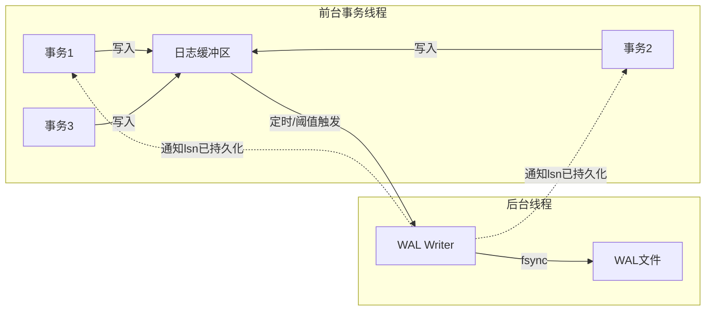
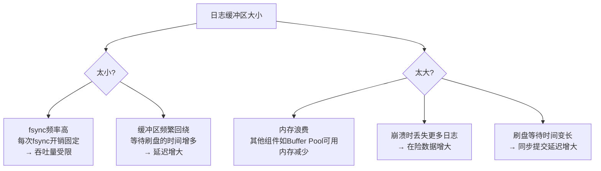
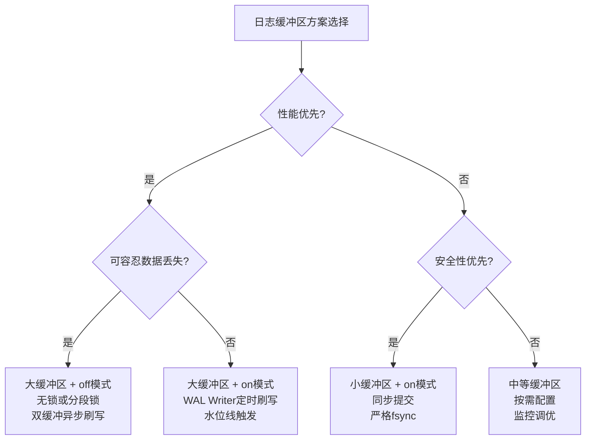

## 11.4 日志缓冲区管理

事务执行过程中产生的日志记录并非直接写入磁盘——那会将每次修改都变成一次昂贵的随机I/O。相反，日志先写入内存中的日志缓冲区（Log Buffer），再由专门的后台线程批量刷盘。这个缓冲层看似简单，却是WAL子系统中**性能敏感度最高**的组件之一：它的大小决定了fsync的频率，它的刷写策略决定了事务提交的延迟，它的并发控制决定了写入吞吐的上限。

本节将从日志缓冲区的基本结构出发，逐步深入到环形缓冲区设计、双缓冲技术、WAL Writer后台刷写机制、缓冲区大小的调优方法论、并发控制策略、fsync与缓冲区的交互关系、监控诊断手段，以及PostgreSQL和MySQL InnoDB在这一层的具体实现差异。

---

### 11.4.1 日志缓冲区的基本结构与LSN

日志缓冲区是连接事务和日志文件的中间层。每个需要写入日志的事务操作，都会先进入这个内存区域，等待被批量刷到磁盘。要理解缓冲区的工作机制，首先必须理解一个核心概念：**LSN（Log Sequence Number，日志序列号）**。

LSN是一个单调递增的整数，标识了每条日志记录在WAL流中的精确位置。它相当于日志系统的"地址"——每条日志都有唯一的LSN，每次写入日志时LSN递增，通过LSN可以精确定位到某条日志记录。在PostgreSQL中，LSN表示为一对32位十六进制数（如 `0/15D6838`），其中高32位是WAL段文件编号，低32位是段内偏移。

┌──────────────────────────────────────────────────────────┐
│                    Log Buffer (内存)                      │
│                                                          │
│  ┌──────┬──────┬──────┬──────┬──────┬──────┬──────┐     │
│  │Rec 1 │Rec 2 │Rec 3 │Rec 4 │Rec 5 │ ...  │      │     │
│  └──────┴──────┴──────┴──────┴──────┴──────┴──────┘     │
│   ↑               ↑                   ↑                  │
│   start           write_lsn           flush_lsn          │
│   缓冲区起点       已写入缓冲区的最大LSN   已刷到磁盘的最大LSN   │
│                                                          │
│   ◄─── write_lsn - flush_lsn ───►                       │
│        = 未持久化的日志量（在险数据）                         │
└──────────────────────────────────────────────────────────┘

**三个关键指针的含义：**

| 指针 | 含义 | 作用 |
|------|------|------|
| `start_lsn` | 缓冲区中最早日志的起始位置 | 确定缓冲区是否可以重用（刷盘完成后回收） |
| `write_lsn` | 已写入日志缓冲区的最大LSN | 表示日志记录已经进入内存，但尚未持久化 |
| `flush_lsn` | 已持久化到磁盘的最大LSN | 表示日志记录已安全落盘 |

**两者之差 `write_lsn - flush_lsn` 就是"在险"（at-risk）的日志量**——如果此时系统崩溃，这部分日志会丢失。因此，这个差值直接衡量了持久性保证的安全边际。一个设计良好的系统应当将这个差值控制在可预测的范围内，而不是放任它随工作负载波动。

```python
class LogBuffer:
    """日志缓冲区的基本实现"""
    
    def __init__(self, size=4 * 1024 * 1024):  # 默认 4MB
        self.buffer = bytearray(size)
        self.size = size
        self.write_lsn = 0      # 当前写入位置（相对缓冲区起点的偏移）
        self.flush_lsn = 0      # 已刷盘的位置
        self.lock = threading.Lock()
    
    def append(self, record_bytes: bytes) -> int:
        """追加一条日志记录到缓冲区，返回写入的LSN"""
        with self.lock:
            record_len = len(record_bytes)
            
            # 缓冲区剩余空间不足，需要先刷盘释放空间
            if self.write_lsn + record_len > self.size:
                self._flush_to_disk()
                self.write_lsn = 0  # 环形覆写
            
            # 写入日志记录
            offset = self.write_lsn
            self.buffer[offset:offset + record_len] = record_bytes
            self.write_lsn += record_len
            
            return offset  # 返回该记录在缓冲区中的LSN偏移
    
    def _flush_to_disk(self):
        """将缓冲区中 [flush_lsn, write_lsn] 范围刷到磁盘"""
        if self.write_lsn > self.flush_lsn:
            data = bytes(self.buffer[self.flush_lsn:self.write_lsn])
            self.log_file.write(data)
            self.log_file.flush()
            os.fsync(self.log_file.fileno())  # 确保持久化
            self.flush_lsn = self.write_lsn
    
    def flush_if_needed(self, force=False):
        """根据策略决定是否刷盘（force=True 则立即刷盘）"""
        with self.lock:
            if force or self.write_lsn - self.flush_lsn > self.size // 2:
                self._flush_to_disk()
```

**核心设计权衡：**

日志缓冲区本质上是一个**时间换空间**的缓冲——日志在内存中暂存，积累到一定量后一次性刷盘，从而将多次小的fsync合并为一次大的fsync。但这也引入了风险：如果系统在刷盘之前崩溃，缓冲区中的日志将全部丢失。因此，缓冲区管理的核心问题就是：**如何在吞吐量（更大缓冲区→更少fsync）和安全性（更小缓冲区→更少在险数据）之间取得平衡。**

这个权衡并非凭直觉拍脑袋决定——它有一组量化的关系。假设单次fsync的固定开销为 $T_{fsync}$（SSD约0.1-0.5ms，HDD约2-15ms），缓冲区大小为 $B$，日志产生速率为 $R$，则fsync频率为 $R/B$，每秒fsync开销为 $R \times T_{fsync} / B$。当这个开销占到事务处理时间的显著比例时，缓冲区就成为了瓶颈。

---

### 11.4.2 缓冲区的环形结构

在实际实现中，日志缓冲区通常采用**环形缓冲区（Ring Buffer）**设计，而非线性缓冲区。当日志刷盘后，已释放的空间可以直接重用，无需移动数据。这种设计的核心思想来自操作系统内核的网络缓冲区和生产者-消费者模式，被广泛应用于数据库、消息队列、流式计算等领域。

环形缓冲区的关键特性是：逻辑上数据是线性增长的（LSN单调递增），但物理内存是循环复用的。通过维护 `write_offset`（写入位置）和 `flush_offset`（刷盘位置）两个取模后的偏移量，配合全局的 `total_written` 和 `total_flushed` 计数器，就能同时获得环形复用和线性LSN的能力。

```python
class RingLogBuffer:
    """环形日志缓冲区"""
    
    def __init__(self, size=4 * 1024 * 1024):
        # 缓冲区大小必须是2的幂，以便用位运算替代取模
        assert size > 0 and (size &amp; (size - 1)) == 0, "缓冲区大小必须是2的幂"
        self.buffer = bytearray(size)
        self.size = size
        self.mask = size - 1  # 用于位运算取模: offset &amp; mask 等价于 offset % size
        self.write_offset = 0   # 写入位置（取模 size）
        self.flush_offset = 0   # 刷盘位置（取模 size）
        self.total_written = 0  # 累计写入量（用于计算绝对LSN）
        self.total_flushed = 0  # 累计刷盘量
    
    @property
    def write_lsn(self):
        """绝对LSN = 累计写入量"""
        return self.total_written
    
    @property
    def flush_lsn(self):
        """绝对LSN = 累计刷盘量"""
        return self.total_flushed
    
    def available_space(self):
        """可用空间 = 缓冲区大小 - (write_offset - flush_offset)"""
        used = (self.write_offset - self.flush_offset) &amp; self.mask
        return self.size - used - 1  # 留1字节区分满/空
    
    def append(self, data: bytes) -> int:
        """追加数据到环形缓冲区"""
        if len(data) > self.available_space():
            raise BufferFullError(
                f"缓冲区不足：需要 {len(data)} 字节，"
                f"可用 {self.available_space()} 字节。"
                f"请先调用 flush() 释放空间。"
            )
        
        lsn = self.total_written
        end = self.write_offset + len(data)
        
        if end <= self.size:
            # 情况1：不跨越缓冲区末尾，直接写入
            self.buffer[self.write_offset:end] = data
        else:
            # 情况2：跨越缓冲区末尾，分两段写入
            first_part = self.size - self.write_offset
            self.buffer[self.write_offset:self.size] = data[:first_part]
            self.buffer[0:end - self.size] = data[first_part:]
        
        self.write_offset = end % self.size
        self.total_written += len(data)
        return lsn
    
    def get_flush_data(self) -> bytes:
        """获取待刷盘的数据（从flush_offset到write_offset）"""
        if self.flush_offset <= self.write_offset:
            # 未跨越末尾：直接切片
            return bytes(self.buffer[self.flush_offset:self.write_offset])
        else:
            # 跨越末尾：分两段拼接
            part1 = self.buffer[self.flush_offset:self.size]
            part2 = self.buffer[0:self.write_offset]
            return bytes(part1) + bytes(part2)
    
    def mark_flushed(self, bytes_flushed: int):
        """标记已刷盘的字节数"""
        self.flush_offset = (self.flush_offset + bytes_flushed) &amp; self.size
        self.total_flushed += bytes_flushed
```

**环形缓冲区的关键优势：**

- **零拷贝重用**：刷盘完成后，空间自动释放，无需内存移动或重新分配
- **O(1) 空间计算**：通过 write_offset 和 flush_offset 的差值即可判断是否满，无需遍历
- **内存友好**：固定大小的预分配内存，不会产生碎片，也不会触发GC
- **缓存友好**：数据在物理内存中连续存储，写入操作对CPU缓存行友好

**环形缓冲区的边界处理：**

环形缓冲区最容易出错的地方在于"跨越末尾"的处理——当写入的数据尾部超过缓冲区末尾时，需要分两段写入。上面的代码通过 `end % self.size` 计算回绕后的位置，通过 `self.size - self.write_offset` 计算第一段的长度来处理这种情况。另一个常见陷阱是空/满判断：当 `write_offset == flush_offset` 时，缓冲区可能是空的，也可能是满的，因此通常保留1字节不使用，用差值来区分。

**PostgreSQL 的实际实现：** PostgreSQL 的 WAL 缓冲区大小由 `wal_buffers` 参数控制（默认为 `shared_buffers` 的 1/32，至少 64KB，最大为 `shared_buffers`）。它使用一个简单的环形数组，配合 `XLogInsertLock`（轻量级锁）保护写入端，`WALWriteLock` 保护刷写端。PostgreSQL 32之后的版本还引入了对 NUMA 感知的内存分配，确保缓冲区不会跨 NUMA 节点分布。

```sql
-- 查看和设置WAL缓冲区大小
SHOW wal_buffers;            -- 默认值（shared_buffers/32，至少64KB）
ALTER SYSTEM SET wal_buffers = '64MB';  -- 手动设置（需要重启）
```

---

### 11.4.3 双缓冲技术

单缓冲区面临一个经典的并发问题：当后台线程正在将缓冲区内容刷盘时，前台事务需要继续写入日志。如果共用同一个缓冲区，要么阻塞写入（性能下降），要么产生数据竞争（正确性风险）。双缓冲（Double Buffering）通过维护两个交替使用的缓冲区解决这个问题——一个接收写入，另一个同时刷盘。


双缓冲之所以有效，关键在于利用了一个物理事实：**内存写入和磁盘I/O可以在硬件层面并行执行**。CPU向内存A写入数据的同时，DMA控制器可以独立地将内存B的数据搬运到磁盘。这种并行性不是软件层面的"伪并行"，而是真正的硬件级并发。

```python
import threading
import os
import time

class DoubleBufferLogManager:
    """双缓冲日志管理器"""
    
    def __init__(self, buffer_size=64 * 1024, log_path="/var/log/wal.log"):
        self.buffers = [
            bytearray(buffer_size),
            bytearray(buffer_size)
        ]
        self.buffer_size = buffer_size
        self.active = 0         # 当前接收写入的缓冲区索引
        self.write_pos = 0      # 活跃缓冲区中的写入偏移
        
        self.log_file = open(log_path, "ab")
        self.flush_lock = threading.Lock()  # 保护刷盘操作
        self.flush_thread = None
        self.total_lsn = 0      # 全局LSN计数器
        
        # 监控指标
        self.flush_count = 0
        self.total_flush_time = 0.0
    
    def append_log(self, record_data: bytes) -> int:
        """追加日志到当前活跃缓冲区，返回LSN"""
        lsn = self.total_lsn
        record_len = len(record_data)
        
        if self.write_pos + record_len > self.buffer_size:
            # 缓冲区剩余空间不足，触发切换
            self._switch_buffer()
        
        # 写入活跃缓冲区
        buf = self.buffers[self.active]
        buf[self.write_pos:self.write_pos + record_len] = record_data
        self.write_pos += record_len
        self.total_lsn += record_len
        
        return lsn
    
    def _switch_buffer(self):
        """切换缓冲区：当前缓冲区交给刷盘线程，激活另一个"""
        # 等待上一次刷盘完成（如果还在进行中）
        if self.flush_thread and self.flush_thread.is_alive():
            self.flush_thread.join()
        
        old_active = self.active
        # 必须拷贝当前数据快照——否则刷盘线程可能读到不完整的数据
        old_data = bytes(self.buffers[old_active][:self.write_pos])
        
        # 切换到另一个缓冲区
        self.active = 1 - self.active
        self.write_pos = 0
        
        # 异步刷出旧缓冲区
        self.flush_thread = threading.Thread(
            target=self._flush_buffer,
            args=(old_data,),
            daemon=True
        )
        self.flush_thread.start()
    
    def _flush_buffer(self, data: bytes):
        """将缓冲区快照写入磁盘"""
        start = time.perf_counter()
        with self.flush_lock:
            self.log_file.write(data)
            self.log_file.flush()
            os.fsync(self.log_file.fileno())
        
        elapsed = time.perf_counter() - start
        self.flush_count += 1
        self.total_flush_time += elapsed
    
    def force_flush(self):
        """强制刷盘（事务提交时调用）"""
        if self.write_pos == 0:
            return  # 没有数据需要刷盘
        
        # 同步刷盘：拷贝快照后立即写入
        current_data = bytes(self.buffers[self.active][:self.write_pos])
        self._flush_buffer(current_data)
    
    def get_stats(self):
        """返回性能统计"""
        return {
            "flush_count": self.flush_count,
            "avg_flush_ms": (self.total_flush_time / max(self.flush_count, 1)) * 1000,
            "total_bytes_written": self.total_lsn,
            "current_buffer_utilization": self.write_pos / self.buffer_size
        }
```

**双缓冲的性能收益分析：**

| 场景 | 单缓冲 | 双缓冲 | 差异 |
|------|--------|--------|------|
| 写入与刷盘并行 | 不可能（互斥） | 完全重叠 | 吞吐量提升 30-50% |
| 刷盘期间写入延迟 | 阻塞等待（~1-10ms） | 接近零（写另一个缓冲区） | 延迟降低一个数量级 |
| 内存开销 | 1× buffer_size | 2× buffer_size | 仅增加一个缓冲区大小 |

**双缓冲的关键限制：**

1. **数据一致性窗口**：切换缓冲区瞬间，旧数据的快照必须完整拷贝，否则可能出现日志空洞。上面代码中的 `bytes(self.buffers[old_active][:self.write_pos])` 就是为了保证快照完整性——拷贝必须在切换之前完成
2. **刷盘延迟累积**：如果磁盘I/O持续慢于写入速度，缓冲区切换会越来越频繁，最终退化为串行行为。这意味着双缓冲不能解决根本性的I/O带宽不足问题，它解决的是写入和刷盘的**并行性**问题
3. **内存翻倍**：缓冲区大小翻倍，在某些内存受限的嵌入式场景可能不可接受
4. **强制刷盘的退化**：当同步提交模式启用时，`force_flush()` 会绕过双缓冲的异步优势，退化为同步写入。此时双缓冲的收益仅体现在非同步提交的事务上

---

### 11.4.4 WAL Writer：后台刷写线程

在现代数据库中，日志缓冲区的刷盘通常不是由前台事务线程完成的，而是由一个专门的**WAL Writer后台线程**负责。这种分离带来了两个关键好处：

1. **前台事务只需写入内存**（微秒级），不阻塞在磁盘I/O上
2. **WAL Writer可以智能调度刷盘时机**，合并多个事务的日志一起刷盘（组提交的核心依赖）



```python
class WALWriter:
    """WAL Writer 后台刷写线程"""
    
    def __init__(self, log_buffer, flush_interval_ms=200, 
                 flush_threshold_bytes=1024 * 1024):
        """
        Args:
            log_buffer: 日志缓冲区实例
            flush_interval_ms: 最大刷盘间隔（毫秒）
            flush_threshold_bytes: 缓冲区数据达到此阈值时立即刷盘
        """
        self.log_buffer = log_buffer
        self.flush_interval = flush_interval_ms / 1000.0
        self.flush_threshold = flush_threshold_bytes
        self.running = False
        self.thread = None
        
        # 同步提交模式下使用的事件通知
        self.sync_event = threading.Event()
        self.sync_lsn_target = 0
        
        # 统计
        self.flush_count = 0
        self.bytes_flushed = 0
    
    def start(self):
        """启动WAL Writer线程"""
        self.running = True
        self.thread = threading.Thread(target=self._run, daemon=True)
        self.thread.start()
        print(f"[WALWriter] 启动：间隔={self.flush_interval*1000:.0f}ms, "
              f"阈值={self.flush_threshold/1024:.0f}KB")
    
    def stop(self):
        """停止WAL Writer（优雅关闭）"""
        self.running = False
        if self.thread:
            self.thread.join()
        # 最后一次刷盘，确保所有日志安全
        self.log_buffer.force_flush()
        print(f"[WALWriter] 停止：共刷盘 {self.flush_count} 次, "
              f"共 {self.bytes_flushed / 1024 / 1024:.2f} MB")
    
    def _run(self):
        """WAL Writer主循环"""
        while self.running:
            # 策略1：等待指定时间间隔（可被提前唤醒）
            self.sync_event.clear()
            self.sync_event.wait(timeout=self.flush_interval)
            
            # 策略2：检查缓冲区数据量是否达到阈值
            pending = self.log_buffer.write_lsn - self.log_buffer.flush_lsn
            
            if pending > 0:
                self._do_flush()
    
    def _do_flush(self):
        """执行一次刷盘"""
        before_flush = self.log_buffer.flush_lsn
        self.log_buffer.force_flush()
        after_flush = self.log_buffer.flush_lsn
        
        flushed = after_flush - before_flush
        self.flush_count += 1
        self.bytes_flushed += flushed
        
        # 如果有同步提交的事务在等待，通知它们
        if self.sync_lsn_target > 0 and after_flush >= self.sync_lsn_target:
            self.sync_event.set()
    
    def wait_for_flush(self, target_lsn: int, timeout: float = 10.0):
        """同步提交：等待指定LSN被刷盘
        
        这是同步提交模式的核心接口。事务在提交时调用此方法，
        等待WAL Writer将日志刷盘后才向客户端返回"提交成功"。
        
        Args:
            target_lsn: 需要等待刷盘的LSN
            timeout: 最长等待时间（秒），超时则放弃
            
        Returns:
            True: LSN已刷盘，提交安全
            False: 超时，提交可能不安全
        """
        if self.log_buffer.flush_lsn >= target_lsn:
            return True  # 已经刷盘了
        
        self.sync_lsn_target = target_lsn
        return self.sync_event.wait(timeout=timeout)
```

**WAL Writer 的三种刷写策略：**

| 策略 | 触发条件 | 适用场景 | 特点 |
|------|---------|---------|------|
| **定时刷写** | 达到固定时间间隔（如200ms） | 通用场景 | 延迟可控，但可能刷太多或太少 |
| **阈值刷写** | 未刷数据达到缓冲区一定比例 | 写入密集型 | 保证缓冲区不会溢出 |
| **同步刷写** | 事务提交时显式请求 | 数据安全性要求高 | 延迟最低，但吞吐量受限 |

实际系统中，这三种策略是**协同工作**的：定时刷写作为兜底机制确保日志不会长期滞留在内存中，阈值刷写在写入高峰期防止缓冲区溢出，同步刷写仅在事务明确要求时触发。WAL Writer的主循环会依次检查这三个条件，满足任一即执行刷盘。

**PostgreSQL 的实现：** PostgreSQL 的 WAL Writer 由 `wal_writer_delay` 参数控制（默认200ms）。当 `synchronous_commit = on`（默认）时，事务提交会等待 WAL Writer 将该事务的日志刷盘后才返回。当 `synchronous_commit = off` 时，事务只需写入 WAL 缓冲区即可返回，由 WAL Writer 异步刷盘——这可以大幅提升写入吞吐量，但牺牲了一定的安全性。

```sql
-- PostgreSQL WAL Writer 参数
SHOW wal_writer_delay;        -- 默认 200ms
SHOW wal_writer_flush_after;  -- 触发刷写的WAL量阈值（默认 1MB）

-- 异步提交模式（牺牲安全性换取性能）
SET synchronous_commit = off;

-- 也可以在单个事务级别控制
BEGIN;
SET LOCAL synchronous_commit = off;
INSERT INTO logs VALUES (...);  -- 这个INSERT不等待fsync
COMMIT;
```

**MySQL InnoDB 的实现：** InnoDB 在MySQL 8.0.30之前没有独立的 WAL Writer 线程，所有日志刷写操作都由 `log_sys_mutex` 保护。8.0.30之后，MySQL将日志写入路径拆分为多个专用线程，显著降低了锁竞争：

log_writer   → 将 redo log buffer 写入 OS page cache（用户空间→内核空间）
log_flusher  → 对 redo log 文件执行 fsync（内核空间→磁盘）
log_write_notifier → 通知等待fsync完成的事务线程

这种拆分的意义在于：`log_writer` 执行的是 `write()` 系统调用（将数据从用户空间复制到内核的page cache），而 `log_flusher` 执行的是 `fsync()` 系统调用（将page cache刷到磁盘）。两者是完全不同的I/O操作，拆分后可以流水线化——`log_writer`写入下一批数据的同时，`log_flusher` 正在刷写上一批。

---

### 11.4.5 缓冲区大小的选择与调优

日志缓冲区的大小直接影响两个维度的性能：



**核心公式：** 缓冲区大小的选择需要考虑以下因素：

最优缓冲区大小 ≈ max(
    平均事务日志量 × 并发事务数 × fsync合并窗口时间,
    单次fsync的写入量 × 目标吞吐量 / fsync频率
)

**实际调优方法论：** 理论公式提供了起点，但实际调优需要基于观测数据迭代。推荐以下步骤：

1. **建立基准**：使用默认配置运行标准负载测试，记录 `write_lsn - flush_lsn` 的峰值、平均值、P99值
2. **识别瓶颈方向**：
   - 如果 fsync/s 过高（>500/s），说明缓冲区太小，考虑增大
   - 如果 `write_lsn - flush_lsn` 的 P99 超过缓冲区大小的50%，说明峰值期有溢出风险
   - 如果 fsync/s 低但平均每次刷盘量小，说明 WAL Writer 的触发条件需要调整
3. **单因素调整**：每次只调整一个参数，观察效果后再调下一个
4. **验证安全性**：增大缓冲区后，模拟崩溃场景，确认恢复时间在可接受范围内

**典型配置参考：**

| 工作负载类型 | 事务平均日志量 | 并发事务数 | 推荐缓冲区大小 | 说明 |
|------------|-------------|-----------|-------------|------|
| OLTP（小事务） | 200B-1KB | 100-500 | 64MB | 每个事务日志少，并发高，需要大缓冲区合并fsync |
| OLAP（大事务） | 10KB-1MB | 10-50 | 128MB-256MB | 单事务日志多，需要足够空间避免频繁刷盘 |
| 混合负载 | 1KB-10KB | 50-200 | 64MB-128MB | 通用配置，兼顾两类场景 |
| 嵌入式/轻量 | 50-200B | 1-10 | 4MB-16MB | SQLite等场景，内存有限 |

**SSD vs HDD 的影响：** 存储介质对缓冲区调优有直接影响。SSD的随机写性能接近顺序写（延迟0.1-0.5ms），因此fsync开销低，缓冲区可以相对较小。HDD的随机写延迟高达5-15ms，fsync开销高，需要更大的缓冲区来合并更多日志到一次fsync中。在混合存储架构中（SSD作为WAL设备，HDD存储数据文件），缓冲区大小可以向SSD的特性倾斜。

**MySQL InnoDB 的配置：**

```ini
# redo log buffer 大小
# 默认16MB，对于写入密集型场景建议增大到64-256MB
innodb_log_buffer_size = 64MB

# 关键参数：控制刷写行为
# 1 = 每次提交都fsync（最安全，默认值）
# 2 = 每次提交写入OS cache，每秒fsync（注意：是每秒，不是每事务）
# 0 = 每秒写入OS cache + fsync（最快但最不安全）
innodb_flush_log_at_trx_commit = 1
```

`innodb_flush_log_at_trx_commit` 的三个值需要仔细理解：
- **值=1**：每次事务提交时，InnoDB将redo log buffer写入OS page cache，并立即调用fsync。这是唯一能保证"提交后不丢数据"的设置
- **值=2**：每次事务提交时，InnoDB将redo log buffer写入OS page cache（不调用fsync）。每秒由后台线程统一调用一次fsync。崩溃时可能丢失最近1秒的数据
- **值=0**：每秒将redo log buffer写入OS page cache并调用一次fsync。崩溃时可能丢失最近1秒的数据，且OS crash时可能丢失更多

**PostgreSQL 的配置：**

```sql
-- WAL 缓冲区大小
-- 默认-1表示自动计算（shared_buffers/32，至少64KB）
-- 建议在写入密集场景设为 64MB 或更大
ALTER SYSTEM SET wal_buffers = '64MB';

-- WAL Writer 刷写间隔
ALTER SYSTEM SET wal_writer_delay = '200ms';

-- 同步提交控制
-- on            = 每次提交都等fsync（最安全）
-- off           = 提交只写缓冲区（最不安全但最快）
-- remote_apply  = 等待备库确认（用于同步复制场景）
-- remote_write  = 等待备库接收（介于on和remote_apply之间）
-- local         = 等待本地fsync但不等备库（默认行为，等同于on）
ALTER SYSTEM SET synchronous_commit = on;
```

---

### 11.4.6 日志缓冲区的并发控制

日志缓冲区处于多条事务路径的交汇点——多个事务线程同时写入日志，WAL Writer 同时读取并刷盘。并发控制的设计直接影响吞吐量上限。

**方案一：全局锁（简单但瓶颈明显）**

```python
class LockedLogBuffer:
    """全局锁保护的日志缓冲区"""
    
    def __init__(self, size=64 * 1024 * 1024):
        self.buffer = bytearray(size)
        self.size = size
        self.write_pos = 0
        self.lock = threading.Lock()
    
    def append(self, data: bytes) -> int:
        with self.lock:  # 所有写入者竞争同一把锁
            lsn = self.write_pos
            self.buffer[self.write_pos:self.write_pos + len(data)] = data
            self.write_pos += len(data)
            return lsn
```

问题：所有事务线程在 `append()` 时串行化。当并发事务数超过CPU核心数时，锁竞争成为瓶颈。实测数据显示：在64核机器上，全局锁方案在128并发时吞吐量比16并发下降约40%，原因是大量线程在自旋等待锁。

**方案二：分段缓冲区（PostgreSQL 的思路）**

PostgreSQL 使用一种更精巧的设计：将日志缓冲区分为多个段（segment），每个段有自己的锁。写入时先获取"WAL Insert Lock"（一个轻量级锁槽），获得槽位后写入到缓冲区的特定位置：

```python
class SegmentedLogBuffer:
    """分段日志缓冲区（简化版PostgreSQL WAL Buffer）"""
    
    SEGMENT_SIZE = 8 * 1024  # 每段 8KB
    NUM_SEGMENTS = 8192       # 总共 8192 段 = 64MB
    NUM_SLOTS = 64            # 并发写入槽位数
    
    def __init__(self):
        self.buffer = bytearray(self.SEGMENT_SIZE * self.NUM_SEGMENTS)
        self.write_pos = 0
        self.lock = threading.Lock()  # 保护write_pos的分配
        
        # 一组 WAL Insert Lock 槽位（类似 PG 的 XLogCtl->slots[]）
        self.insert_slots = [None] * self.NUM_SLOTS
        self.slot_lock = threading.Lock()
        self.next_slot = 0
    
    def _acquire_slot(self) -> int:
        """获取一个空闲的写入槽位"""
        with self.slot_lock:
            # 环形搜索空闲槽位
            for i in range(self.NUM_SLOTS):
                idx = (self.next_slot + i) % self.NUM_SLOTS
                if self.insert_slots[idx] is None:
                    self.insert_slots[idx] = True
                    self.next_slot = (idx + 1) % self.NUM_SLOTS
                    return idx
        raise RuntimeError("所有写入槽位已满，请稍后重试")
    
    def append(self, data: bytes) -> int:
        """获取槽位 → 分配LSN → 写入缓冲区 → 释放槽位
        
        PostgreSQL的关键设计：LSN分配和实际写入是分离的。
        LSN通过轻量级锁快速分配（仅修改一个计数器），
        实际数据写入则在槽位保护下进行，不需要持有全局锁。
        """
        slot = self._acquire_slot()
        try:
            with self.lock:
                lsn = self.write_pos
                self.write_pos += len(data)
            # 写入时不持全局锁，只持槽位锁（槽位在此前已分配）
            self.buffer[lsn:lsn + len(data)] = data
            return lsn
        finally:
            self.insert_slots[slot] = None  # 释放槽位
```

PostgreSQL在实际实现中更进一步：LSN的分配通过原子操作完成（`pg_atomic_fetch_add_u64`），几乎零开销。写入槽位的数量默认为8192个，对应共享内存中预分配的 `XLogCtlData` 结构。这种设计将"分配位置"的开销（O(1)原子操作）和"写入数据"的开销（内存拷贝）完全分离。

**方案三：无锁环形缓冲区（高性能场景）**

对于极高吞吐的场景（如Kafka的Commit Log），可以使用无锁（lock-free）环形缓冲区。但必须注意一个关键约束：**无锁方案仅在严格的单生产者-单消费者场景下安全**：

```python
class LockFreeRingBuffer:
    """无锁环形缓冲区（单生产者-单消费者模式）
    
    注意：此实现依赖Python的GIL保证单个字节操作的原子性。
    在C/C++等无GC语言中，需要使用std::atomic或memory_order。
    """
    
    def __init__(self, size):
        assert size > 0 and (size &amp; (size - 1)) == 0, "大小必须是2的幂"
        self.size = size
        self.mask = size - 1
        self.buffer = bytearray(size)
        self.write_idx = 0   # 单写入者递增
        self.read_idx = 0    # 单刷盘者递增
    
    def append(self, data: bytes) -> int:
        """单生产者写入（无需加锁）
        
        安全前提：只有本线程修改write_idx，
        read_idx由消费者线程修改（不会被本线程看到中间值）。
        """
        lsn = self.write_idx
        for b in data:
            self.buffer[self.write_idx &amp; self.mask] = b
            self.write_idx += 1
        return lsn
    
    def read_for_flush(self) -> bytes:
        """单消费者读取（无需加锁）
        
        安全前提：只有本线程修改read_idx，
        write_idx由生产者线程修改（不会被本线程看到中间值）。
        """
        available = self.write_idx - self.read_idx
        if available == 0:
            return b""
        
        result = bytearray(available)
        for i in range(available):
            result[i] = self.buffer[self.read_idx &amp; self.mask]
            self.read_idx += 1
        return bytes(result)
```

> **注意：** 上面的"无锁"实现依赖两个前提：(1) 单个变量的读写在目标平台上是原子的；(2) 一个线程只修改一个索引。在Java中有 `AtomicLong`，在C++中有 `std::atomic<int>`，在Python中GIL提供了等价保证。如果打破这两个前提（多生产者或多消费者），必须引入CAS（Compare-And-Swap）操作或回退到加锁方案。

**三种方案的适用场景对比：**

| 方案 | 并发写入数 | 吞吐量 | 实现复杂度 | 适用场景 |
|------|-----------|--------|-----------|---------|
| 全局锁 | 任意（串行化） | 低 | 低 | 嵌入式数据库、单线程场景 |
| 分段缓冲区 | 高（槽位数） | 高 | 中 | 关系型数据库（PostgreSQL、SQL Server） |
| 无锁环形 | 仅1（严格约束） | 极高 | 高 | 消息队列、流式存储（Kafka） |

---

### 11.4.7 日志缓冲区与fsync的关系

理解日志缓冲区的刷盘行为，必须区分两个层次的"写入"：**write()** 和 **fsync()**。这不是术语游戏——它们对应完全不同的系统调用和硬件操作。

应用层:     write()   → 内核page cache
内核层:     page cache → 磁盘调度器
硬件层:     磁盘控制器 → 物理介质

write() 只到达 "内核层"：数据在OS page cache中，对用户态程序不可见但对崩溃不可靠
fsync() 到达 "硬件层"：数据在物理介质上，即使断电也不会丢失

```mermaid
graph TD
    A[事务线程调用 write()] --> B[数据写入日志缓冲区<br/>内存操作 ~100ns]
    B --> C{同步提交模式?}
    C -->|synchronous_commit=on| D[WAL Writer刷盘<br/>write + fsync]
    C -->|synchronous_commit=off| E[事务立即返回<br/>WAL Writer异步刷盘]
    D --> F[通知事务提交成功]
    E --> G[WAL Writer稍后刷盘<br/>事务可能在fsync前返回]
    
    D -.->|延迟 0.1-2ms| H[数据安全]
    E -.->|延迟 ~0 但有丢失风险| I[数据可能丢失]
```

**"写入日志缓冲区" ≠ "持久化到磁盘"**

这是一个极其关键的区分。当日志记录被写入日志缓冲区后，它只存在于内存中。只有当 fsync 完成后，日志记录才算真正持久化。以下场景说明了这种区分的重要性：

```python
# 场景：事务提交后、fsync前崩溃
def dangerous_scenario():
    """
    时间线：
    T1: 事务写入日志到缓冲区 (write_lsn 更新)
    T2: 事务提交返回 "成功" 给客户端
    T3: **系统崩溃**
    T4: WAL Writer 的 fsync 尚未执行 (flush_lsn 未更新)
    
    结果：客户端认为提交成功，但日志丢失 → 数据不一致
    这就是为什么 synchronous_commit=off 不是"免费的午餐"
    """
    pass

# 正确做法：同步提交模式
def safe_scenario():
    """
    时间线：
    T1: 事务写入日志到缓冲区
    T2: 事务等待 fsync 完成 (flush_lsn >= 事务LSN)
    T3: fsync 完成 → 事务返回 "成功" 给客户端
    T4: **系统崩溃**
    
    结果：日志已持久化 → 恢复时可以重放 → 数据一致
    代价：每次提交多 0.1-2ms 延迟（取决于存储介质）
    """
    pass
```

**文件系统层面的影响：**

fsync的性能和行为不仅取决于数据库配置，还受到文件系统和操作系统设置的显著影响：

- **ext4 barrier**：默认启用，确保fsync的数据跨磁盘缓存边界持久化。禁用可提升性能但危及数据安全（断电时磁盘缓存中的数据可能丢失）
- **XFS**：日志文件的fsync性能通常优于ext4，特别是在高并发场景下
- **O_DIRECT**：绕过OS page cache直接写入磁盘。MySQL InnoDB的 `innodb_flush_method=O_DIRECT` 可以避免redo log占用双重内存（用户缓冲区+page cache）
- **NVMe SSD**：硬件级别的写缓存（Write-Back Cache）使得fsync的实际延迟低于 HDD 一个数量级，但这依赖于SSD的掉电保护电路

**不同同步模式的安全性与性能对比：**

| 模式 | 提交延迟 | 吞吐量 | 安全性 | 适用场景 |
|------|---------|--------|--------|---------|
| `synchronous_commit = on` | 0.1-2ms | 1x (基准) | 崩溃不丢已提交事务 | 金融、订单等关键业务 |
| `synchronous_commit = off` | ~0.01ms | 2-5x | 最近1秒的提交可能丢失 | 日志、指标等可容忍丢失 |
| `wal_sync_method = fdatasync` | 0.1-1ms | 1.2x vs fsync | 数据安全但元数据可能不一致 | Linux默认，性能优先 |
| `wal_sync_method = open_datasync` | 0.05-0.5ms | 1.5x vs fsync | 数据安全但元数据可能不一致 | NVMe SSD场景 |

---

### 11.4.8 日志缓冲区与检查点的交互

日志缓冲区并不是孤立运行的——它与检查点（11.3节）有密切的协作关系。理解这种交互对正确配置两者至关重要。

**检查点对缓冲区的影响：**

1. **Full Page Write 的冲击**：PostgreSQL的检查点机制会在每次检查点之后第一次修改某个数据页时，将整个页面（通常8KB）写入WAL。这意味着检查点刚完成后的短暂时间内，WAL的写入量会骤增（大量Full Page Write）。如果此时日志缓冲区太小，会导致频繁刷盘，甚至在极端情况下阻塞前台事务
2. **检查点期间的WAL竞争**：检查点需要将脏页刷入数据文件，这会占用磁盘I/O带宽。如果WAL Writer同时在做fsync，两者会竞争I/O带宽，导致fsync延迟增加
3. **检查点触发日志截断**：检查点完成后，之前的WAL段文件可以安全回收。但如果日志缓冲区中还有未刷盘的数据属于旧的日志段，截断不能进行。这就是为什么检查点必须等待WAL Writer刷盘完成

**MySQL InnoDB 的类似机制：** InnoDB的checkpoint也会受到redo log buffer的影响。当redo log文件组接近写满时（checkpoint落后于current LSN过多），InnoDB会强制触发checkpoint，此时新的写入会被阻塞——这就是所谓的"innodb_log_checkpoint_delay"。

---

### 11.4.9 日志缓冲区的监控与诊断

在生产环境中，日志缓冲区的健康状态直接影响数据库性能。以下是关键监控指标和诊断方法。

**核心监控指标：**

| 指标 | 含义 | 健康范围 | 异常信号 |
|------|------|---------|---------|
| `write_lsn - flush_lsn` | 未刷盘的日志量（在险数据） | < 缓冲区大小的70% | 持续接近100% |
| fsync/秒 | 每秒磁盘刷写次数 | 10-100次/秒 | >500次/秒（过于频繁） |
| 平均每次fsync数据量 | 每次fsync刷写的日志字节数 | >缓冲区大小的10% | <1KB（未有效合并） |
| 同步提交等待时间 | 事务等待fsync完成的耗时 | P99 < 5ms | P99 > 20ms |

**PostgreSQL 监控：**

```sql
-- 1. 查看当前WAL写入位置
SELECT pg_current_wal_lsn() AS current_lsn;
-- 结果示例: 0/15D6838

-- 2. 计算WAL产生速率（两次采样的差值）
-- 第一次采样
SELECT pg_current_wal_lsn() AS lsn_before;
-- ... 等待一段时间 ...
SELECT pg_current_wal_lsn() AS lsn_after;
-- 计算差值
SELECT '0/15D7000'::pg_lsn - '0/15D6838'::pg_lsn AS bytes_generated;
-- 结果: 1990 (字节)

-- 3. 查看WAL缓冲区配置
SHOW wal_buffers;           -- 缓冲区大小
SHOW wal_writer_delay;      -- WAL Writer刷新间隔
SHOW wal_writer_flush_after; -- 触发刷写的WAL量

-- 4. 查看同步提交设置
SHOW synchronous_commit;    -- on/off/remote_apply/remote_write

-- 5. 诊断WAL写入瓶颈
-- 检查是否有长时间未刷盘的日志
SELECT checkpoints_timed, checkpoints_req,
       buffers_checkpoint, buffers_backend
FROM pg_stat_bgwriter;
-- checkpoints_req > checkpoints_timed 说明有强制检查点（可能是WAL积累过多）
```

**MySQL InnoDB 监控：**

```sql
-- 1. 查看redo log缓冲区大小
SHOW VARIABLES LIKE 'innodb_log_buffer_size';

-- 2. 查看redo log刷写策略
SHOW VARIABLES LIKE 'innodb_flush_log_at_trx_commit';

-- 3. 查看redo log文件状态（关键诊断入口）
SHOW ENGINE INNODB STATUS\G
-- 关注 LOG 段落：
-- Log sequence number: 最新写入的LSN（对应 write_lsn）
-- Log flushed up to:   最新刷盘的LSN（对应 flush_lsn）
-- Pages flushed up to: 最新检查点的LSN
-- 
-- Log sequence number - Log flushed up_to = 未持久化的日志量
-- 如果这个差值持续增长，说明fsync跟不上写入速度

-- 4. MySQL 8.0+ 专用视图
SELECT * FROM performance_schema.log_status\G
```

**诊断脚本：**

```bash
#!/bin/bash
# wal_buffer_monitor.sh - 日志缓冲区监控脚本
# 用法: ./wal_buffer_monitor.sh [host] [port] [dbname] [interval_sec]

DB_HOST="${1:-localhost}"
DB_PORT="${2:-5432}"
DB_NAME="${3:-postgres}"
INTERVAL="${4:-5}"  # 采样间隔（秒）

echo "=== WAL Buffer Monitor ==="
echo "Host: $DB_HOST  Port: $DB_PORT  DB: $DB_NAME  Interval: ${INTERVAL}s"
printf "%-22s %12s %10s %15s\n" "时间" "WAL速率(MB/s)" "未刷盘量" "说明"
echo "-----------------------------------------------------------"

while true; do
    TIMESTAMP=$(date '+%Y-%m-%d %H:%M:%S')
    
    # 采样1：获取当前LSN和已刷盘LSN
    read LSN_CURRENT LSN_FLUSHED <<< $(psql -h $DB_HOST -p $DB_PORT \
        -d $DB_NAME -t -A -c "
        SELECT pg_current_wal_lsn(), 
               CASE WHEN pg_is_in_recovery() 
                    THEN pg_last_wal_receive_lsn()
                    ELSE pg_current_wal_lsn() END;
    " 2>/dev/null | tr '|' ' ')
    
    sleep $INTERVAL
    
    # 采样2：获取新的LSN
    LSN_CURRENT2=$(psql -h $DB_HOST -p $DB_PORT -d $DB_NAME -t -A \
        -c "SELECT pg_current_wal_lsn();" 2>/dev/null)
    
    # 计算WAL产生速率
    BYTES=$(psql -h $DB_HOST -p $DB_PORT -d $DB_NAME -t -A \
        -c "SELECT '${LSN_CURRENT2}'::pg_lsn - '${LSN_CURRENT}'::pg_lsn;")
    
    RATE_MB=$(echo "scale=2; $BYTES / 1024 / 1024 / $INTERVAL" | bc 2>/dev/null)
    PENDING=$(echo "scale=2; ${BYTES:-0} / 1024 / 1024" | bc 2>/dev/null)
    
    # 简单告警
    STATUS="正常"
    PENDING_BYTES=$(psql -h $DB_HOST -p $DB_PORT -d $DB_NAME -t -A \
        -c "SELECT pg_current_wal_lsn() - pg_current_wal_lsn();" 2>/dev/null)
    
    printf "%-22s %12s %10s %15s\n" "$TIMESTAMP" "${RATE_MB}MB/s" "${PENDING}MB" "$STATUS"
done
```

---

### 11.4.10 日志缓冲区的常见误区

**误区一：日志缓冲区越大越好**

这是最常见的误解。缓冲区增大确实减少了fsync频率，但同时增加了：
- 崩溃时丢失的日志量（在险数据增大）——缓冲区128MB意味着最坏情况丢失128MB日志
- 同步提交时等待刷盘的时间（因为每次刷盘的数据更多，写入和fsync耗时更长）
- 与其他组件（Buffer Pool）争抢内存——数据库总内存是有限的，WAL缓冲区多占1MB，Buffer Pool就少1MB

**正确做法：** 从默认值开始，根据实际工作负载逐步调整。监控 `write_lsn - flush_lsn` 的峰值，确保缓冲区不会频繁回绕。通常64MB是一个很好的平衡点，超过256MB的收益递减明显。

**误区二：synchronous_commit=off 可以"安全地"使用**

`synchronous_commit=off` 只是让事务提交不需要等待fsync。以下场景会导致数据丢失：
- 操作系统崩溃（不仅仅是数据库进程崩溃）
- 断电（UPS未覆盖的场景）
- 磁盘硬件故障（写缓存中的数据丢失）

更重要的是，丢失的不只是"最近1秒的数据"——丢失的是**所有已提交但未fsync的事务**。在极端情况下（如磁盘I/O突然变慢），这个窗口可能超过1秒。

**正确做法：** 仅在可容忍数据丢失的场景（如临时数据、可重建的日志、统计数据）使用 `off` 模式。对于业务关键数据，始终使用 `on` 模式。如果确实需要高吞吐量+高安全性，考虑使用组提交（11.4.1节组提交）而非关闭同步提交。

**误区三：日志缓冲区满了再刷盘效率最高**

实际上，缓冲区完全写满时，新事务会被阻塞等待刷盘完成，造成延迟尖峰。更优的策略是**水位线刷写**——在缓冲区使用量达到一定比例时就提前触发刷盘：

```python
class WatermarkLogBuffer:
    """水位线控制的日志缓冲区
    
    设计思路：不是等到缓冲区满了才刷盘，而是设置两个水位线，
    在"高水位线"时触发异步刷盘，在"紧急水位线"时同步刷盘。
    这样可以避免延迟尖峰，同时保持较高的缓冲区利用率。
    """
    
    def __init__(self, size=64 * 1024 * 1024):
        self.buffer = bytearray(size)
        self.size = size
        self.write_pos = 0
        self.flush_pos = 0
        self.lock = threading.Lock()
        
        # 水位线配置
        self.low_watermark = size * 0.3    # 30%: 低于此值不主动刷盘
        self.high_watermark = size * 0.7   # 70%: 高于此值触发异步刷盘
        self.emergency_watermark = size * 0.9  # 90%: 紧急同步刷盘
    
    @property
    def pending_bytes(self):
        return self.write_pos - self.flush_pos
    
    def append(self, data: bytes) -> int:
        with self.lock:
            # 紧急：缓冲区即将满，必须同步刷盘（会阻塞当前线程）
            if self.pending_bytes + len(data) > self.emergency_watermark:
                self._flush_sync()
            
            # 高水位线：触发异步刷盘（不阻塞当前线程）
            elif self.pending_bytes > self.high_watermark:
                self._trigger_async_flush()
            
            lsn = self.write_pos
            self.buffer[self.write_pos:self.write_pos + len(data)] = data
            self.write_pos += len(data)
            return lsn
    
    def _flush_sync(self):
        """同步刷盘：立即执行，会阻塞调用线程"""
        data = bytes(self.buffer[self.flush_pos:self.write_pos])
        self.log_file.write(data)
        self.log_file.flush()
        os.fsync(self.log_file.fileno())
        self.flush_pos = self.write_pos
    
    def _trigger_async_flush(self):
        """异步刷盘：启动后台线程，不阻塞调用线程"""
        # 在实际实现中，这里会启动或通知后台刷盘线程
        pass
```

**误区四：fsync一定保证数据写入磁盘**

`os.fsync()` 确保数据到达磁盘，但前提是文件系统和磁盘本身正确实现了持久化语义。在以下极端情况下，fsync仍然可能不安全：
- **磁盘固件bug**：某些廉价SSD的掉电保护不完善，fsync报告完成但数据仍在DRAM缓存中
- **写缓存欺骗**：部分磁盘控制器声称已完成fsync但实际数据在磁盘的写缓存中（可通过 `hdparm -W` 检查和关闭）
- **文件系统日志**：某些文件系统（如ext4 with data=writeback）在数据一致性方面有已知缺陷

---

### 11.4.11 PostgreSQL与MySQL InnoDB的实现对比

| 特性 | PostgreSQL WAL Buffer | MySQL InnoDB Redo Log Buffer |
|------|----------------------|---------------------------|
| 缓冲区类型 | 环形缓冲区 | 环形缓冲区 |
| 默认大小 | shared_buffers/32 (~4MB) | 16MB |
| 写入锁 | WAL Insert Lock（原子操作分配LSN+分段锁写入） | log_sys_mutex（全局互斥锁） |
| 后台刷写线程 | WAL Writer（单线程） | log_writer + log_flusher（多线程流水线） |
| 刷写间隔 | 200ms（wal_writer_delay） | 1秒（log_flusher线程） |
| 同步提交控制 | synchronous_commit（5种模式） | innodb_flush_log_at_trx_commit（3种模式） |
| 缓冲区到磁盘的路径 | Buffer → WAL File（直接写文件） | Buffer → OS Cache → Redo Log File |
| 额外安全机制 | Full Page Writes（防止部分写入） | Doublewrite Buffer（防止部分页写入） |
| LSN分配方式 | 原子操作（无锁） | 互斥锁保护 |
| 8.0+ 多线程优化 | 无（保持单线程WAL Writer） | 8.0.30+ 拆分为多个专用线程 |

**Full Page Writes 的深入解析：**

PostgreSQL 有一个关键的安全机制——在检查点之后第一次修改某个数据页时，会将整个页面的内容写入 WAL（而不仅仅是修改的行）。这称为 Full Page Write（FPW），用于解决一个被称为"部分页面写入"（torn page）的问题。

问题场景（Without FPW）：
T1: 检查点记录页面A的LSN=100
T2: 事务修改页面A，写入WAL日志（LSN=150），只记录了"修改了第10行"（增量日志）
T3: 将页面A刷入磁盘
T4: 磁盘写入只完成了一半（操作系统崩溃或断电）
     — 页面A在磁盘上的8KB只写了前4KB，后4KB是旧数据
T5: 恢复时：页面A磁盘上的数据是"损坏的"（半新半旧），而WAL中只有"修改第10行"的增量日志
T6: 增量日志无法在损坏的半页面上正确应用 → 数据损坏无法恢复

解决方案（With FPW）：
T1: 检查点记录页面A的LSN=100
T2: 事务修改页面A
T2a: 【关键】将整个页面A（8KB）完整写入WAL（这是FPW）
T2b: 再写入"修改第10行"的增量日志
T3: 将页面A刷入磁盘
T4: 磁盘写入只完成了一半（同样的崩溃场景）
T5: 恢复时：先用WAL中的完整页面副本恢复页面A的原始内容
T6: 再应用后续增量日志 → 数据完整恢复

```sql
-- PostgreSQL Full Page Writes 控制
SHOW full_page_writes;  -- 默认 on，强烈建议不要关闭
-- 关闭FPW可以减少WAL量约10-30%，但危及数据完整性
-- 仅在确定不会发生部分页面写入的场景（如使用ZFS）才考虑关闭
```

---

### 11.4.12 设计决策总结

选择日志缓冲区方案时，需要综合考虑以下因素：



**核心原则回顾：**

1. **缓冲区是时间换空间**：用内存暂存日志，换取批量刷盘的效率提升。但"空间"不是无限的——内存是数据库最宝贵的资源，WAL缓冲区每多占1MB，Buffer Pool就少1MB
2. **双缓冲消除写刷竞争**：一个缓冲区写入时另一个刷盘，吞吐量提升30-50%。但双缓冲不能解决I/O带宽不足的根本问题，它解决的是并行性问题
3. **WAL Writer分离读写路径**：前台写内存（微秒），后台刷磁盘（毫秒），两者解耦。现代实现（如MySQL 8.0.30+）进一步将后台拆分为多个流水线化的专用线程
4. **同步模式决定安全边界**：`on` 模式下 fsync 在提交前完成，`off` 模式下可能丢失最近的提交。这不是"可以随意切换"的选项——它直接影响ACID的Durability保证
5. **监控是调优的基础**：持续监控 `write_lsn - flush_lsn` 差值和fsync频率，用数据驱动配置决策，而非凭直觉猜测
6. **检查点与缓冲区必须协调**：Full Page Write在检查点后会突增WAL量，缓冲区必须足够容纳这一波冲击。同时检查点的磁盘I/O会与WAL Writer的fsync竞争带宽，需要合理错峰
