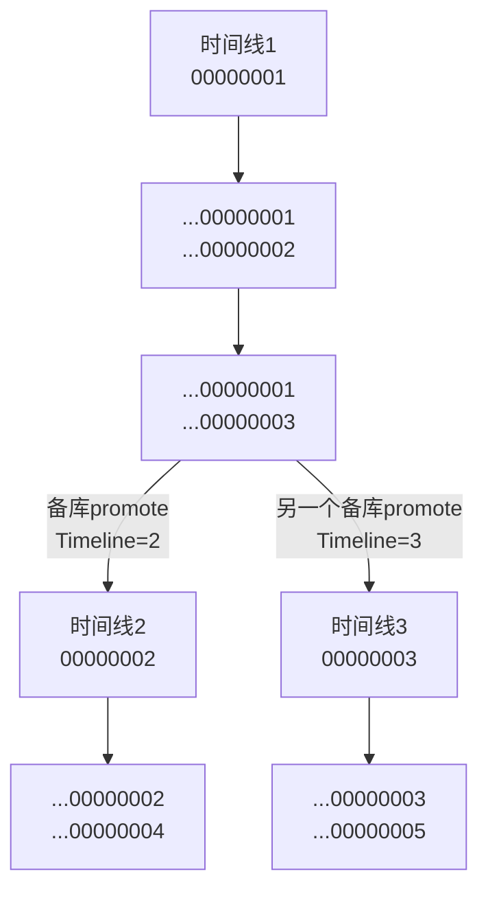
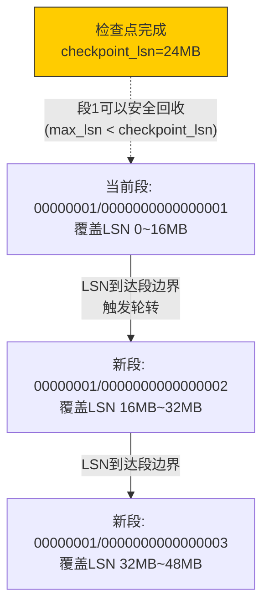
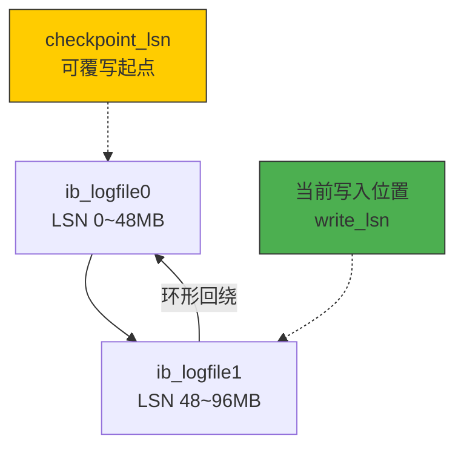
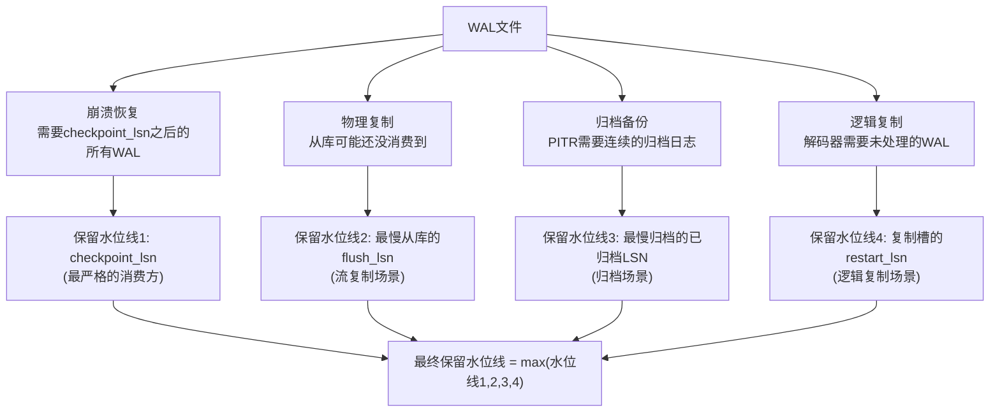
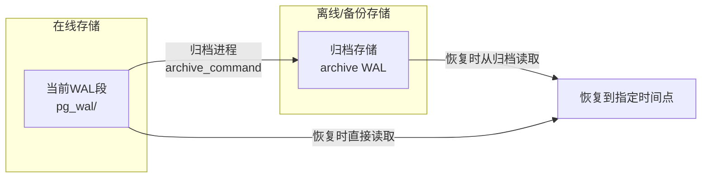
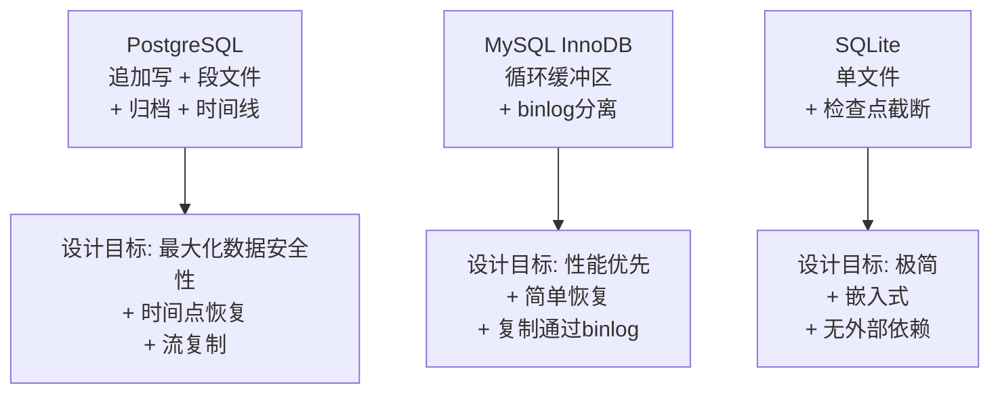

## 11.5 WAL文件的生命周期管理

日志缓冲区中的数据最终要落盘，而落盘的目标就是WAL文件。但WAL文件不是"写满一个再创建一个"这么简单——它涉及创建命名、段文件组织、轮转策略、保留控制、归档备份、空间回收等多个环节。任何一个环节出问题，轻则磁盘空间耗尽导致数据库停机，重则归档日志缺失导致无法恢复到指定时间点。

本节将完整覆盖WAL文件从诞生到消亡的全生命周期，结合PostgreSQL、MySQL InnoDB和SQLite三个主流实现，逐一拆解每个阶段的设计原理和工程实践。

---

### 11.5.1 WAL文件的创建与命名规范

WAL文件的命名不是随意的——它携带着关键的元信息，使得恢复程序能在崩溃后快速定位需要重放的日志范围。

**PostgreSQL的WAL文件命名：**

PostgreSQL的WAL文件采用16进制命名，格式为 `<TimeLineID>/<SegmentNumber>`，其中SegmentNumber由LSN除以`wal_segment_size`（默认16MB）得到：

pg_wal/
├── 000000010000000000000001    ← 第1个段文件，覆盖LSN 0 ~ 16MB
├── 000000010000000000000002    ← 第2个段文件，覆盖LSN 16MB ~ 32MB
├── 000000010000000000000003    ← 第3个段文件，覆盖LSN 32MB ~ 48MB
└── ...

文件名的结构拆解：

| 字段 | 长度(字符) | 含义 | 示例 |
|------|-----------|------|------|
| TimeLineID | 8 | 时间线ID，主库从1开始，每次promote递增 | `00000001` |
| LogSegment | 8 | LSN高32位（段号），由LSN / wal_segment_size计算 | `00000000` |
| LogOffset | 8 | LSN低32位（段内偏移） | `00000001` |
| 合计 | 24 | | `000000010000000000000001` |

时间线ID（Timeline ID）是PostgreSQL的一个精妙设计。当一个备库被提升为主库（promote）时，Timeline ID加1，此后写入的WAL文件使用新的时间线编号。这使得归档日志形成一棵树状结构而非线性链，恢复程序可以沿着不同的时间线分支回退到任意历史时刻：



**MySQL InnoDB的Redo Log文件命名：**

InnoDB的redo log使用简单的递增编号：

# MySQL 5.7 及更早版本（固定文件名 + 固定数量）
ib_logfile0
ib_logfile1

# MySQL 8.0.30+（支持动态调整，文件名带编号）
#innodb_redo_log_capacity 替代了 innodb_log_file_size * innodb_log_files_in_group
#128MB默认容量，自动管理文件数量和轮转

MySQL 8.0.30之前的固定循环方案有一个著名的问题：修改`innodb_log_file_size`需要停库、删除旧日志、重启——在生产环境中这几乎是不可能操作。8.0.30引入的动态redo log解决了这个痛点。

**SQLite的WAL文件命名：**

SQLite的WAL文件固定使用数据库名加 `-wal` 后缀，只有一个文件：

mydb.db        ← 主数据库文件
mydb.db-wal    ← WAL文件（固定名称，固定一个文件）
mydb.db-shm    ← 共享内存文件（索引WAL帧位置）

SQLite不做文件轮转，所有WAL数据写入同一个文件，检查点完成后截断该文件释放空间。这种简化设计非常适合嵌入式场景，但也意味着无法做WAL归档和PITR。

---

### 11.5.2 WAL文件的内部结构

要理解文件轮转和清理，首先需要理解WAL文件内部的数据组织方式。

**PostgreSQL WAL段文件的页结构：**

每个16MB的段文件被分为若干个8KB的页（与数据页大小一致）。每个页包含页头和日志记录：

┌─────────────────────────────────────────────────────┐
│ WAL Page 0 (8KB)                                    │
│ ┌────────────────────┬────────────────────────────┐  │
│ │    页头 (24B)       │    日志记录1               │  │
│ │  Magic: 0xD106     │    ┌──────┬──────┬──────┐  │  │
│ │  Checksum: xxx     │    │ Head │ Data │ Tail │  │  │
│ │  TimeLineID: 1     │    └──────┴──────┴──────┘  │  │
│ │  BlockNo: 0        │    日志记录2 ...            │  │
│ └────────────────────┴────────────────────────────┘  │
├─────────────────────────────────────────────────────┤
│ WAL Page 1 (8KB)                                    │
│ ...                                                  │
├─────────────────────────────────────────────────────┤
│ WAL Page 2047 (8KB)                                 │
│ ...                                                  │
└─────────────────────────────────────────────────────┘
  共 2048 页 × 8KB = 16MB

每条日志记录的结构：

| 字段 | 大小 | 说明 |
|------|------|------|
| 总长度 | 4字节 | 该记录的总字节数（含自身） |
| 记录类型 | 1字节 | XLOG_SWITCH、XLOG_CHECKPOINT等 |
| 备用 | 2字节 | 填充 |
| 起始LSN | 8字节 | 该记录的全局LSN |
| 上一条LSN | 8字节 | 同一事务的上一条记录LSN（Prev_LSN链） |
| 事务ID | 4字节 | 关联的事务 |
| 数据 | 可变 | 具体的redo/undo数据 |
| 页尾 | 4字节 | = 总长度（用于反向定位） |

**MySQL InnoDB Redo Log的页结构：**

InnoDB的redo log page大小为512字节（与数据页的16KB不同），结构更紧凑：

┌──────────────────────────────────────┐
│ Redo Log Page (512B)                  │
│ ┌──────────────────┬───────────────┐  │
│ │   Header (12B)   │  MTR Records  │  │
│ │  type: log_block │  ...          │  │
│ │  group number    │               │  │
│ │  data length     │               │  │
│ └──────────────────┴───────────────┘  │
│         Footer (8B)                   │
│  checksum + lsn                       │
└──────────────────────────────────────┘

**SQLite WAL文件的帧结构：**

SQLite WAL采用帧（Frame）为基本单位，每帧包含一个数据库页的完整副本或修改后的内容：

| 字段 | 大小 | 说明 |
|------|------|------|
| 页号 | 4字节 | 对应的数据库页号（1开始） |
| 提交帧标记 | 4字节 | >0 表示这是事务最后一帧，值为该事务修改的总页数 |
| 数据库页内容 | 数据库页大小 | 默认4KB，完整页内容或增量内容 |
| Salt校验 | 8字节 | 用于检测WAL文件是否完整（防止部分写入） |

---

### 11.5.3 WAL文件的轮转机制

当当前WAL文件写满后，需要创建新的WAL文件继续写入。轮转机制的核心问题是：**什么时候创建新文件、新文件的LSN从哪里开始、旧文件何时可以被清理。**

**PostgreSQL的轮转机制：**

PostgreSQL使用`XLogSegNo`来跟踪当前正在写入的段文件。当新写入的LSN超过当前段文件的边界时，WAL写入线程会自动创建下一个段文件：



段文件轮转的关键代码逻辑（简化版）：

```python
import os
import struct

class XLogSegment:
    """PostgreSQL WAL段文件管理"""
    
    # 段文件大小（默认16MB）
    DEFAULT_SEGMENT_SIZE = 16 * 1024 * 1024  # 16MB
    
    # 段文件偏移掩码：LSN的低 bit 位用于段内偏移
    # XLogSegNo = LSN >> wal_segment_size_bits
    # OffsetInSeg = LSN &amp; (wal_segment_size - 1)
    
    def __init__(self, wal_dir, segment_size=DEFAULT_SEGMENT_SIZE):
        self.wal_dir = wal_dir
        self.segment_size = segment_size
        # 计算段大小的位移量（24 = log2(16MB)）
        self.seg_size_bits = segment_size.bit_length() - 1
    
    def segment_number(self, lsn: int) -> int:
        """根据LSN计算段文件编号（高32位）"""
        return lsn >> self.seg_size_bits
    
    def offset_in_segment(self, lsn: int) -> int:
        """计算LSN在当前段文件中的偏移"""
        return lsn &amp; (self.segment_size - 1)
    
    def segment_filename(self, timeline_id: int, lsn: int) -> str:
        """生成WAL段文件名"""
        seg_no = self.segment_number(lsn)
        # 格式: 8位timeline + 8位seg_high + 8位seg_low = 24位hex
        return f"{timeline_id:08X}{(seg_no >> 32):08X}{(seg_no &amp; 0xFFFFFFFF):08X}"
    
    def needs_rotation(self, lsn: int, segment_bytes_written: int) -> bool:
        """判断是否需要轮转：当段内偏移到达段大小时"""
        return segment_bytes_written >= self.segment_size
    
    def create_new_segment(self, timeline_id: int, next_lsn: int) -> str:
        """创建新的WAL段文件"""
        filename = self.segment_filename(timeline_id, next_lsn)
        filepath = os.path.join(self.wal_dir, filename)
        
        # 预分配文件空间（加速后续写入，避免频繁扩展文件系统）
        with open(filepath, 'wb') as f:
            os.fallocate(f.fileno(), 0, self.segment_size)
        
        print(f"[WAL] 创建新段文件: {filename} "
              f"(LSN范围: {next_lsn:,} ~ {next_lsn + self.segment_size:,})")
        return filepath
```

**PostgreSQL段文件轮转的三个触发条件：**

| 触发条件 | 说明 | 发生频率 |
|---------|------|---------|
| LSN到达段边界 | 当前段写满16MB | 每16MB一次 |
| WAL总量超过max_wal_size | 触发检查点后轮转 | 由配置控制 |
| 手动执行pg_switch_wal() | DBA主动切换（如归档前） | 手动触发 |

```sql
-- 查看当前WAL写入位置
SELECT pg_current_wal_lsn();

-- 手动触发WAL切换（用于归档或清理前）
SELECT pg_switch_wal();

-- 查看当前段文件
SELECT pg_walfile_name(pg_current_wal_lsn());
```

**MySQL InnoDB的轮转机制：**

InnoDB 5.7及更早版本使用经典的**循环缓冲区（Circular Buffer）**设计——固定数量的redo log文件形成一个环，写到末尾后回到开头覆写：



InnoDB的核心约束：**write_lsn和checkpoint_lsn之间的距离不能超过redo log总大小。** 否则未检查点的日志会被覆写，导致数据丢失。这就是为什么写入密集场景需要较大的redo log——太小会导致InnoDB被迫频繁做checkpoint来释放空间，造成性能抖动。

```python
class InnoDBRedoLog:
    """InnoDB Redo Log循环缓冲区模拟"""
    
    def __init__(self, log_files, log_file_size):
        """
        Args:
            log_files: redo log文件数量（如2）
            log_file_size: 每个文件大小（如48MB）
        """
        self.total_size = log_files * log_file_size
        self.log_file_size = log_file_size
        self.log_files = log_files
        self.write_lsn = 0      # 当前写入位置
        self.checkpoint_lsn = 0  # 最老的未检查点LSN
    
    def available_space(self) -> int:
        """可写入空间 = 总大小 - (write_lsn - checkpoint_lsn)"""
        used = self.write_lsn - self.checkpoint_lsn
        return self.total_size - used
    
    def advance_write(self, bytes_written: int):
        """推进写入指针"""
        self.write_lsn += bytes_written
        if self.write_lsn >= self.total_size:
            self.write_lsn -= self.total_size  # 环形回绕
    
    def advance_checkpoint(self, new_checkpoint_lsn: int):
        """推进检查点指针"""
        self.checkpoint_lsn = new_checkpoint_lsn
    
    def is_full(self) -> bool:
        """判断redo log是否已满（需要做checkpoint）"""
        return self.available_space() <= 0
    
    def get_log_file_index(self, lsn: int) -> int:
        """计算LSN对应的文件索引"""
        return (lsn // self.log_file_size) % self.log_files
    
    def get_offset_in_file(self, lsn: int) -> int:
        """计算LSN在文件内的偏移"""
        return lsn % self.log_file_size
```

**MySQL 8.0.30+的动态Redo Log：**

8.0.30引入`innodb_redo_log_capacity`替代了之前的固定文件数配置，InnoDB自动管理文件的创建、轮转和删除：

```ini
# 旧配置（MySQL 5.7 / 8.0.0~8.0.29）
innodb_log_file_size = 48M
innodb_log_files_in_group = 2
# 总redo log = 48MB × 2 = 96MB

# 新配置（MySQL 8.0.30+）
innodb_redo_log_capacity = 256M
# InnoDB自动管理文件数量和轮转
```

---

### 11.5.4 WAL文件的保留策略

WAL文件不能随意删除。删除过早，崩溃恢复无法找到完整的日志链；删除过晚，磁盘空间被大量占用。保留策略需要同时考虑三个消费方：



**PostgreSQL的WAL保留控制：**

PostgreSQL通过多个机制协同控制WAL保留：

```python
class WALRetentionPolicy:
    """PostgreSQL WAL保留策略（简化模型）"""
    
    def __init__(self, wal_dir, max_wal_size_mb=1024):
        self.wal_dir = wal_dir
        self.max_wal_size = max_wal_size_mb * 1024 * 1024
    
    def compute_retain_lsn(self, 
                           checkpoint_lsn: int,
                           replica_flush_lsn: int = 0,
                           archive_flush_lsn: int = 0,
                           replication_slot_lsn: int = 0) -> int:
        """
        计算应该保留的最低LSN（所有消费方中的最大值）
        
        在此LSN之前的WAL文件可以安全删除。
        """
        consumers = [
            ("checkpoint", checkpoint_lsn),
            ("replica", replica_flush_lsn),
            ("archive", archive_flush_lsn),
            ("replication_slot", replication_slot_lsn),
        ]
        
        # 取最大值：最慢的消费方决定保留水位线
        retain_lsn = max(lsn for _, lsn in consumers if lsn > 0)
        
        for name, lsn in consumers:
            if lsn > 0:
                marker = " ← 最慢" if lsn == retain_lsn else ""
                print(f"  [{name}] LSN = {lsn:>12,}{marker}")
        
        return retain_lsn
    
    def cleanup_wal_files(self, wal_files: list, retain_lsn: int):
        """清理可以安全删除的WAL文件"""
        removed = []
        
        for wal_file in sorted(wal_files, key=lambda f: f.max_lsn):
            if wal_file.max_lsn < retain_lsn:
                # 该文件中所有日志都在保留水位线之前
                # 可以安全删除
                filepath = os.path.join(self.wal_dir, wal_file.filename)
                os.remove(filepath)
                removed.append(wal_file.filename)
                print(f"  [删除] {wal_file.filename} "
                      f"(max_lsn={wal_file.max_lsn:,} < retain_lsn={retain_lsn:,})")
        
        return removed
```

**四个关键的保留控制参数（PostgreSQL）：**

| 参数 | 默认值 | 作用 | 调优建议 |
|------|--------|------|---------|
| `max_wal_size` | 1GB | 触发检查点的WAL积累阈值 | 写密集场景设为4-16GB |
| `min_wal_size` | 80MB | 预分配的最小WAL空间 | 设为预期2次检查点之间的WAL量 |
| `wal_keep_size` | 0 | 为流复制保留的WAL量 | 有从库时设为2-4GB |
| `wal_keep_segments` | 0 | 旧参数，已被wal_keep_size替代 | 不推荐使用 |

**复制槽（Replication Slot）的保护作用：**

复制槽是PostgreSQL防止WAL被过早清理的强力机制。当一个复制槽存在时，即使从库断开连接，WAL也会被保留：

```sql
-- 创建物理复制槽
SELECT pg_create_physical_replication_slot('standby1');

-- 查看复制槽信息和保留的WAL量
SELECT 
    slot_name,
    slot_type,
    active,
    restart_lsn,
    pg_wal_lsn_diff(pg_current_wal_lsn(), restart_lsn) AS retained_bytes
FROM pg_replication_slots;
```

**重要警告：** 复制槽会导致WAL无限堆积。如果从库长期断开，而对应的复制槽没有清理，WAL文件会持续增长直到磁盘满。必须设置`max_slot_wal_keep_size`限制单个复制槽的最大WAL保留量：

```sql
-- 限制复制槽最多保留10GB的WAL
ALTER SYSTEM SET max_slot_wal_keep_size = '10GB';
```

**MySQL InnoDB的保留策略：**

InnoDB的策略更简单——它使用循环缓冲区，检查点推进后自然释放空间：

可用空间 = 总redo log大小 - (write_lsn - checkpoint_lsn)

如果可用空间不足:
  1. 阻塞写入
  2. 强制刷出脏页推进checkpoint
  3. 释放redo log空间后继续写入

这意味着InnoDB的redo log不需要"删除文件"——空间通过checkpoint自动回收。但如果需要做基于时间点恢复（PITR），就需要开启binlog归档。

---

### 11.5.5 WAL归档与时间点恢复

WAL归档是将WAL文件复制到外部存储（如归档目录、S3、NFS）的过程。它是实现时间点恢复（PITR）和流复制的基础。



**PostgreSQL的归档配置：**

```ini
# postgresql.conf

# 开启归档（archive_mode = on时需要重启才能生效）
archive_mode = on
archive_command = 'cp %p /archive/wal/%f'           # 简单复制
# 或更安全的方式（带校验）:
archive_command = 'rsync -a %p /archive/wal/%f &amp;&amp; test -f /archive/wal/%f'

# 实际生产环境常用pgBackRest或Barman
# archive_command = 'pgbackrest --stanza=main archive-push %p'
```

归档进程的工作流程：

```python
class WALArchiver:
    """WAL归档进程简化模型"""
    
    def __init__(self, archive_dir, archive_command_template):
        self.archive_dir = archive_dir
        self.archive_command = archive_command_template
        self.archived_lsn = 0  # 已归档到的最高LSN
    
    def archive_segment(self, segment_filename: str, lsn: int):
        """
        归档一个WAL段文件
        
        关键保证：
        1. 每个段文件只归档一次（幂等性）
        2. 归档失败会重试直到成功（不跳过）
        3. 归档顺序可能不连续（但最终一致）
        """
        archive_path = os.path.join(self.archive_dir, segment_filename)
        
        if os.path.exists(archive_path):
            print(f"  [归档跳过] {segment_filename} 已存在")
            return True
        
        cmd = self.archive_command.replace('%p', segment_filename)
        cmd = cmd.replace('%f', segment_filename)
        
        try:
            subprocess.run(cmd, shell=True, check=True, timeout=300)
            self.archived_lsn = max(self.archived_lsn, lsn)
            print(f"  [归档成功] {segment_filename} → {self.archive_dir}")
            return True
        except subprocess.CalledProcessError as e:
            print(f"  [归档失败] {segment_filename}: {e}")
            return False
```

**时间点恢复（PITR）的工作原理：**

PITR利用归档的WAL文件，将数据库恢复到任意指定时间点：

步骤1: 从基础备份恢复（恢复到备份时的状态）
步骤2: 从归档目录读取WAL文件，重放到目标时间点
步骤3: 数据库达到一致状态，可以接受连接

```python
class PointInTimeRecovery:
    """时间点恢复流程"""
    
    def __init__(self, base_backup_dir, archive_dir):
        self.base_backup = base_backup_dir
        self.archive_dir = archive_dir
        self.recovery_target_time = None
    
    def configure_recovery(self, target_time: str):
        """
        配置恢复目标时间
        
        在 postgresql.auto.conf 中设置:
        restore_command = 'cp /archive/wal/%f %p'
        recovery_target_time = '2026-06-26 14:30:00'
        recovery_target_action = 'pause'
        """
        self.recovery_target_time = target_time
        config = f"""
# Recovery configuration
restore_command = 'cp {self.archive_dir}/%f %p'
recovery_target_time = '{target_time}'
recovery_target_action = 'pause'
"""
        print(f"[PITR] 恢复目标: {target_time}")
        return config
    
    def execute_recovery(self):
        """执行恢复流程"""
        # 1. 恢复基础备份
        print("[PITR] 步骤1: 恢复基础备份...")
        self._restore_base_backup()
        
        # 2. 应用WAL归档
        print("[PITR] 步骤2: 应用WAL归档至目标时间点...")
        self._apply_archive_wal()
        
        # 3. 验证恢复结果
        print("[PITR] 步骤3: 验证数据一致性...")
        self._verify_recovery()
```

---

### 11.5.6 WAL文件的清理与空间回收

清理是生命周期的最后一个环节。清理策略必须精确——太激进会导致无法恢复，太保守会导致磁盘空间浪费。

**PostgreSQL的自动清理：**

PostgreSQL通过`wal_checkpointer`和` WAL recycling`两个机制自动清理旧WAL文件：

清理条件（满足任意一个即可）:
1. 段文件的最大LSN < checkpoint_lsn（已被检查点覆盖）
2. 所有从库的flush_lsn > 该文件的最大LSN（从库已消费）
3. 所有归档命令已成功归档该文件（且 archive_cleanup_command 执行）
4. 没有复制槽引用该文件

```python
class WALCleanup:
    """PostgreSQL WAL清理逻辑"""
    
    def __init__(self, wal_dir, archive_cleanup_command=None):
        self.wal_dir = wal_dir
        self.archive_cleanup = archive_cleanup_command
    
    def perform_cleanup(self, 
                        checkpoint_lsn: int,
                        replica_flush_lsn: int = 0,
                        archive_flush_lsn: int = 0,
                        slot_lsn: int = 0):
        """
        执行WAL文件清理
        
        清理水位线 = max(checkpoint, replica, archive, slot)
        """
        retain_lsn = max(checkpoint_lsn, replica_flush_lsn, 
                        archive_flush_lsn, slot_lsn)
        
        wal_files = self._list_wal_files()
        removed = []
        
        for wal_file in sorted(wal_files, key=lambda f: f['max_lsn']):
            if wal_file['max_lsn'] < retain_lsn:
                # 安全条件1：检查点已覆盖
                if wal_file['max_lsn'] < checkpoint_lsn:
                    filepath = os.path.join(self.wal_dir, wal_file['name'])
                    os.remove(filepath)
                    removed.append(wal_file['name'])
                    print(f"  [回收] {wal_file['name']}")
        
        # 执行归档清理命令（如pg_archivecleanup）
        if self.archive_cleanup and removed:
            self._run_archive_cleanup(removed[-1])  # 最旧的安全文件
        
        return removed
    
    def _list_wal_files(self) -> list:
        """列出WAL目录中的所有段文件"""
        files = []
        for f in os.listdir(self.wal_dir):
            if len(f) == 24 and f.endswith(('0','1','2','3','4','5','6','7','8','9','a','b','c','d','e','f')):
                filepath = os.path.join(self.wal_dir, f)
                files.append({
                    'name': f,
                    'size': os.path.getsize(filepath),
                    'max_lsn': self._lsn_from_filename(f)
                })
        return files
    
    def _lsn_from_filename(self, filename: str) -> int:
        """从文件名解析出该段的起始LSN"""
        # 文件名格式: TTTTTTTTLLLLLLLLLLLLLLLL
        timeline = int(filename[:8], 16)
        seg_high = int(filename[8:16], 16)
        seg_low = int(filename[16:24], 16)
        return (seg_high << 32) | seg_low
```

**PostgreSQL的归档清理工具 `pg_archivecleanup`：**

```bash
# 删除指定归档之前的旧文件（保留004之前的，删除更早的）
pg_archivecleanup /archive/wal/ 000000010000000000000004

# 带dry-run模式（只显示会删除什么，不实际删除）
pg_archivecleanup --dry-run /archive/wal/ 000000010000000000000004
```

**MySQL InnoDB的空间回收：**

InnoDB不需要显式清理redo log——通过checkpoint推进自然释放。但需要关注的是binlog的清理：

```ini
# binlog保留策略
expire_logs_days = 7           # 保留最近7天（MySQL 5.7）
# 或
binlog_expire_logs_seconds = 604800  # 7天（MySQL 8.0+）
max_binlog_size = 100M         # 单个binlog文件最大100MB
```

---

### 11.5.7 WAL文件大小的配置与调优

WAL文件大小（段大小）的选择影响多个维度的性能和可靠性：

**PostgreSQL的wal_segment_size配置：**

```sql
-- 查看当前段大小（只能在初始化时设置）
SHOW wal_segment_size;  -- 默认 16MB

-- 初始化新数据库集群时设置（initdb时指定）
-- initdb --wal-segmentsize=64 /data/pgdata
```

| 段大小 | 优点 | 缺点 | 适用场景 |
|--------|------|------|---------|
| 4MB | 文件轮转快，清理粒度细 | 文件数量多，管理开销大 | 小型数据库，快速归档 |
| 16MB（默认） | 平衡点 | 通用 | 大多数场景 |
| 64MB | 文件数量少，归档效率高 | 轮转间隔长，单文件损坏影响大 | 写密集、大数据量 |
| 256MB | 极少轮转 | 恢复时需要读取更大文件 | 特殊大事务场景 |

**MySQL InnoDB的redo log大小调优：**

InnoDB redo log大小的选择直接影响性能和崩溃恢复时间：

```python
def recommend_innodb_log_size(
    transactions_per_second: int,
    avg_bytes_per_transaction: int,
    checkpoint_interval_ms: int = 30000,
    safety_margin: float = 1.5
) -> dict:
    """
    推荐InnoDB redo log大小
    
    Args:
        transactions_per_second: 每秒事务数
        avg_bytes_per_transaction: 每个事务平均产生的redo量
        checkpoint_interval_ms: 目标检查点间隔（毫秒）
        safety_margin: 安全系数
    
    Returns:
        推荐配置
    """
    # 每次检查点之间积累的redo量
    redo_per_checkpoint = (
        transactions_per_second 
        * avg_bytes_per_transaction 
        * (checkpoint_interval_ms / 1000.0)
    )
    
    # 推荐大小 = 每次检查点redo量 × 安全系数
    recommended_total = int(redo_per_checkpoint * safety_margin)
    
    # 每个文件最大32MB（MySQL 5.7限制）
    # 或无限制（MySQL 8.0.30+）
    file_size = min(recommended_total // 2, 32 * 1024 * 1024)
    file_count = max(2, recommended_total // file_size + 1)
    
    return {
        "transactions_per_second": transactions_per_second,
        "avg_bytes_per_transaction": avg_bytes_per_transaction,
        "redo_per_checkpoint_MB": redo_per_checkpoint / 1024 / 1024,
        "recommended_total_MB": recommended_total / 1024 / 1024,
        "innodb_log_file_size": f"{file_size // 1024 // 1024}M",
        "innodb_log_files_in_group": file_count,
        "mysql_80_30_plus": f"innodb_redo_log_capacity = {recommended_total // 1024 // 1024}M"
    }

# 示例：1000 TPS，每个事务平均1KB redo
result = recommend_innodb_log_size(
    transactions_per_second=1000,
    avg_bytes_per_transaction=1024
)
print(result)
# redo_per_checkpoint_MB ≈ 30.5MB (30秒间隔)
# recommended_total_MB ≈ 45.8MB (1.5倍安全)
# 建议 innodb_redo_log_capacity = 64M
```

---

### 11.5.8 WAL文件生命周期的监控与排障

生产环境中，WAL相关的监控是DBA的核心日常。以下是需要持续关注的指标和常见问题的排查方法。

**关键监控指标：**

```sql
-- PostgreSQL WAL 监控查询

-- 1. 当前WAL写入位置
SELECT pg_current_wal_lsn() AS current_lsn,
       pg_walfile_name(pg_current_wal_lsn()) AS current_file;

-- 2. WAL目录磁盘使用
SELECT pg_size_pretty(pg_wal_lsn_diff(
    pg_current_wal_lsn(), 
    '0/0'::pg_lsn
)) AS wal_written_total;

-- 3. 各从库的复制延迟
SELECT 
    client_addr,
    state,
    sent_lsn,
    write_lsn,
    flush_lsn,
    replay_lsn,
    pg_size_pretty(pg_wal_lsn_diff(sent_lsn, replay_lsn)) AS replication_lag
FROM pg_stat_replication;

-- 4. 复制槽的WAL保留量
SELECT 
    slot_name,
    active,
    pg_size_pretty(pg_wal_lsn_diff(
        pg_current_wal_lsn(), restart_lsn
    )) AS retained_wal
FROM pg_replication_slots;

-- 5. WAL归档状态
SELECT 
    archived_count,
    last_archived_wal,
    last_archived_time,
    failed_count,
    last_failed_wal,
    last_failed_time
FROM pg_stat_archiver;
```

**MySQL InnoDB redo log监控：**

```sql
-- InnoDB redo log状态

-- 1. 查看redo log空间使用
SHOW ENGINE INNODB STATUS\G
-- 关注 LOG 部分:
-- Log sequence number: 当前LSN
-- Log buffer assigned up to: 已分配到的LSN
-- Log flushed up to: 已刷盘的LSN
-- Pages flushed up to: 检查点LSN

-- 2. redo log等待事件
SELECT * FROM performance_schema.events_waits_summary_global_by_event_name
WHERE EVENT_NAME LIKE '%log%';

-- 3. redo log写入延迟
SELECT * FROM performance_schema.events_waits_summary_global_by_event_name
WHERE EVENT_NAME = 'wait/synch/sync_file/inline/os_aio_linux:io_getevents';
```

**常见问题排查：**

| 问题 | 原因 | 排查方法 | 解决方案 |
|------|------|---------|---------|
| WAL文件堆积不删除 | 有未消费的复制槽或归档失败 | 检查复制槽状态和归档日志 | 清理无效复制槽、修复归档 |
| 磁盘空间被WAL耗尽 | max_wal_size太小或检查点受阻 | `du -sh pg_wal/` + 检查脏页数量 | 增大max_wal_size、加速检查点 |
| WAL切换频繁 | 段大小太小或写入速率过高 | 监控WAL切换频率 | 增大wal_segment_size |
| 检查点I/O尖峰 | checkpoint_completion_target太小 | 观察I/O模式 | 调大到0.9，配合bgwriter |
| 从库复制延迟 | 从库apply速度跟不上 | pg_stat_replication | 优化从库配置、增加并行apply |
| PITR失败 | 归档不连续或WAL缺失 | 检查归档目录完整性 | 修复归档、使用pgBackRest |

**WAL空间告警脚本：**

```bash
#!/bin/bash
# wal_space_alert.sh - WAL空间监控脚本

WAL_DIR="${PGDATA:-/var/lib/postgresql/data}/pg_wal"
WARN_THRESHOLD_MB=500
CRIT_THRESHOLD_MB=2000

wal_size_mb=$(du -sm "$WAL_DIR" | awk '{print $1}')

if [ "$wal_size_mb" -ge "$CRIT_THRESHOLD_MB" ]; then
    echo "[CRITICAL] WAL目录大小: ${wal_size_mb}MB (阈值: ${CRIT_THRESHOLD_MB}MB)"
    echo "  检查是否有复制槽未清理、归档失败、或从库长期断开"
    # 自动操作（可选）：清理最旧的归档
    # pg_archivecleanup "$WAL_DIR" $(pg_walfile_name $(pg_current_wal_lsn()))
elif [ "$wal_size_mb" -ge "$WARN_THRESHOLD_MB" ]; then
    echo "[WARNING] WAL目录大小: ${wal_size_mb}MB (阈值: ${WARN_THRESHOLD_MB}MB)"
    echo "  建议检查归档状态和复制槽"
else
    echo "[OK] WAL目录大小: ${wal_size_mb}MB"
fi
```

---

### 11.5.9 三大数据库的WAL文件管理对比

| 特性 | PostgreSQL | MySQL InnoDB | SQLite |
|------|-----------|--------------|--------|
| **文件命名** | 16进制LSN（24字符） | 递增编号（ib_logfileN） | 固定名称（db-wal） |
| **文件大小** | 16MB段（可配置4MB~1GB） | 48MB（可配置） | 动态增长，无上限 |
| **文件数量** | 无限增长，按需创建 | 固定数量，环形覆写 | 固定1个 |
| **轮转策略** | LSN到达段边界 | 写到末尾回绕开头 | 检查点后截断复用 |
| **保留策略** | 基于多消费方水位线 | 基于checkpoint推进 | 无（检查点即清理） |
| **归档支持** | 原生支持（archive_command） | 需要binlog辅助 | 不支持 |
| **PITR能力** | 原生支持（归档+WAL重放） | 需要binlog+redo log | 不支持 |
| **空间管理** | 自动清理 + pg_archivecleanup | 自动回收（循环覆写） | 自动截断 |

**设计哲学的根本差异：**



---

### 11.5.10 常见误区与最佳实践

**误区一：WAL文件越多越安全**

事实：WAL文件堆积并不意味着更安全。真正决定安全性的是最新的检查点LSN和最后一个fsync。过多的WAL文件只是浪费磁盘空间，还增加了恢复时间。

**误区二：删除WAL文件不会影响数据库**

事实：删除正在使用的WAL文件会导致数据库崩溃后无法恢复。只有当WAL文件的最大LSN < checkpoint_lsn时才能安全删除。手动删除前必须确认保留水位线。

**误区三：InnoDB的redo log大小可以随意调整**

事实：MySQL 5.7及更早版本修改redo log大小需要停库操作。MySQL 8.0.30+虽然支持动态调整，但频繁调整会导致旧的redo log文件等待清理，短期内仍然占用空间。

**最佳实践清单：**

✅ 定期监控WAL目录大小和归档状态
✅ 使用复制槽保护WAL，但设置max_slot_wal_keep_size
✅ 配置合理的归档失败告警
✅ 使用pgBackRest或Barman管理备份和归档
✅ 定期执行 pg_archivecleanup 清理归档目录
✅ 根据写入速率调整 max_wal_size
✅ 测试PITR恢复流程（至少每季度一次）
✅ 复制槽不用时及时删除

❌ 不要在生产环境手动删除pg_wal中的文件
❌ 不要忽视归档失败告警
❌ 不要设置过大的max_wal_size（会延迟检查点）
❌ 不要同时运行过多的复制槽
❌ 不要在磁盘空间不足时才开始清理WAL

---

### 11.5.11 本节小结

WAL文件的生命周期管理覆盖了从创建、命名、轮转、保留、归档到清理的完整链路。核心要点：

**创建与命名：** WAL文件名携带时间线ID和LSN信息，使得恢复程序能快速定位日志范围。PostgreSQL的24字符16进制命名设计尤其精妙，通过时间线ID支持分支恢复。

**轮转机制：** PostgreSQL采用追加写+段文件轮转，MySQL InnoDB采用固定数量的循环缓冲区，SQLite采用单文件截断复用。三种方案分别面向不同的应用场景。

**保留策略：** WAL文件的保留由多个消费方共同决定——崩溃恢复、从库复制、归档备份、逻辑复制。保留水位线取所有消费方的最大值，确保没有任何一方的消费被中断。

**归档与PITR：** WAL归档是时间点恢复的基础。PostgreSQL通过archive_command原生支持归档，MySQL需要binlog辅助。PITR的核心是：基础备份 + 连续的归档WAL = 恢复到任意时间点。

**清理与监控：** WAL清理必须精确——过早删除导致恢复失败，过晚删除导致空间耗尽。生产环境必须建立WAL空间监控和归档状态告警机制。
