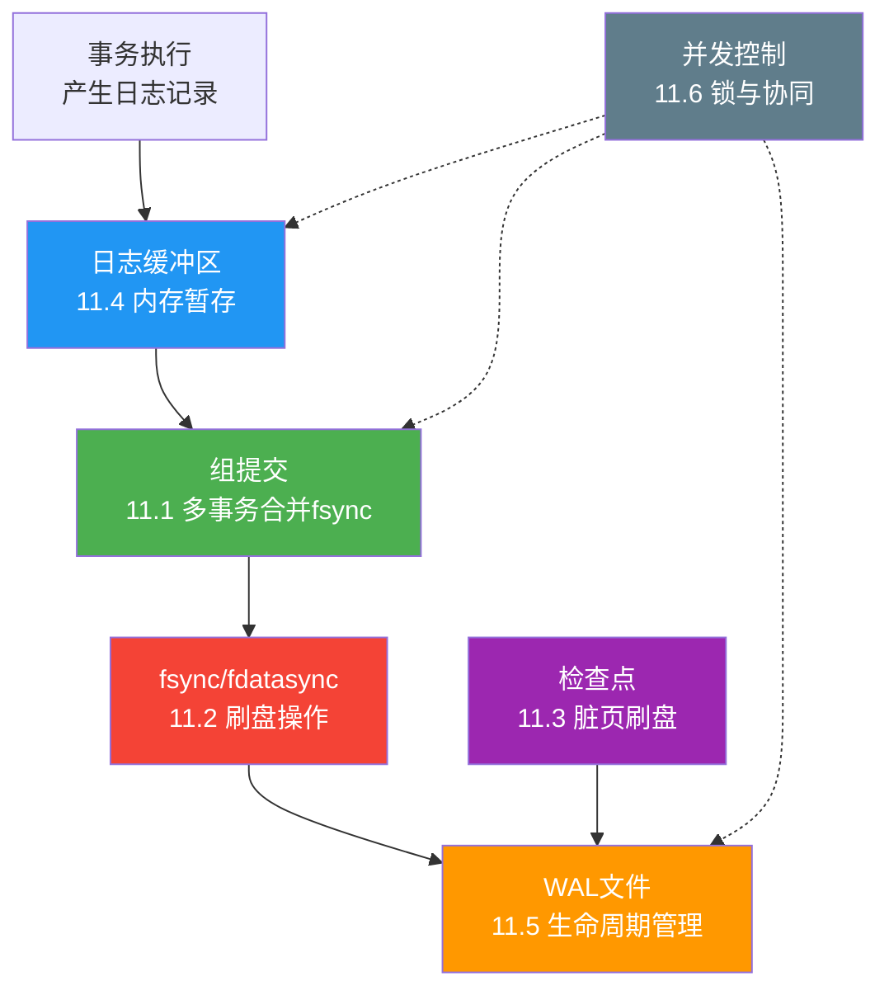

# 核心技巧小结

本节围绕 WAL 从内存到磁盘的完整写入路径，系统讲解了六项核心工程技巧。它们不是孤立的技术点，而是一条完整的数据流——从事务产生日志，到日志缓冲区暂存，到组提交合并刷盘，到检查点控制恢复边界，再到文件生命周期管理和并发安全保障。理解它们之间的协作关系，比单独记住每个技术的细节更重要。

---

## 一、六项技术的协作全景



整条路径可以概括为：**事务在内存中生成日志 → 缓冲区暂存 → 组提交批量刷盘 → WAL 文件持久存储 → 检查点推进恢复边界 → 文件生命周期回收**。并发控制贯穿始终，确保这条路径在多线程环境下正确运行。

---

## 二、各项技术核心要点回顾

### 2.1 组提交：用一次 fsync 覆盖多个事务

组提交解决的根本问题是 **fsync 的固定开销远大于数据传输开销**。既然一次 fsync 的延迟在 NVMe SSD 上也需要 10-50 μs，那么把多个事务的日志合并后一次性刷盘，就能将这个固定成本分摊到每个事务上。

**Leader-Follower 模型的核心流程：**

事务1到达 → 成为Leader → 收集批次（等待超时/达到上限）→ 一次fsync → 唤醒所有Follower
事务2到达 → 加入队列 → 等待Leader完成
事务3到达 → 加入队列 → 等待Leader完成

**关键设计参数及其权衡：**

| 参数 | 低值效果 | 高值效果 | 典型生产值 |
|------|---------|---------|-----------|
| 批量大小上限 | 延迟低，分摊弱 | 分摊好，延迟高 | 32-64 |
| 最大等待时间 | 低延迟，批次不满 | 高负载好，低负载慢 | 1-5 ms |
| commit_delay (PG) | 不人为增延迟 | 更多事务聚集 | 0 或 10000 μs |
| binlog_group_commit_sync_delay (MySQL) | 快速提交 | 更多事务批处理 | 0-5000 μs |

**吞吐量提升实测：** 在 NVMe SSD + PostgreSQL 场景下，高并发（256 连接）时组提交可将 TPS 从约 4,500 提升到约 85,000，提升约 19 倍。但低并发（16 连接）时仅提升约 4 倍，因为批次不容易填满。

**三个正确性不变式必须保证：**
1. **日志顺序一致性**：物理写入顺序与事务逻辑顺序一致（通过 LSN 排序保证）
2. **提交原子性**：一批事务要么全部持久化成功，要么全部失败（一次 fsync 覆盖整批）
3. **无饥饿保证**：每个事务最终必须被提交或超时返回错误（Follower 有超时机制）

### 2.2 fsync：连接内存与持久化的桥梁

fsync 是 WAL 体系中最底层、最不可绕过的操作。理解其真实语义是正确实现持久化的前提。

**三个容易被忽视的语义细节：**

1. **fsync 只保证数据持久化，不保证写入顺序**——两次 fsync 之间有顺序依赖时，必须在 WAL 系统中显式管理，不能依赖 fsync 本身
2. **fsync 会刷新文件的所有脏页面**——包括不属于本次修改的页面，这既是组提交能工作的基础，也是性能需要考量的因素
3. **目录项的持久化不在 fsync 保证范围内**——创建新文件后必须对目录调用 fsync，否则文件名映射可能丢失

**四种同步原语的性能对比：**

| 操作 | 延迟（NVMe） | 元数据开销 | 推荐场景 |
|------|------------|-----------|---------|
| write() + fsync() | 0.05-2ms | 全部元数据 | 需要完整保证时 |
| write() + fdatasync() | 0.03-1.5ms | 仅必要元数据 | **WAL 日志刷写（首选）** |
| O_SYNC | 0.05-2ms/次 | 每次 write 都同步 | 不推荐（无法批处理） |
| O_DSYNC | 0.03-1.5ms/次 | 每次 write 都同步 | 不推荐（粒度过细） |

**多层缓存陷阱——fsync 无法保证的环节：**

应用 write() → 内核页缓存 → 文件系统日志 → 块设备层 → 设备驱动缓存 → RAID控制器缓存 → SSD/HDD控制器缓存 → 持久化介质
                   ↑                                    ↑                    ↑
              fsync控制范围                     可能丢失数据！         可能丢失数据！

- **设备驱动缓存**：廉价 SSD 可能不正确实现 FLUSH CACHE 命令
- **RAID 控制器缓存**：没有 BBU（电池备份单元）时，掉电会丢失缓存数据
- **SSD 控制器缓存**：企业级 SSD 通常可靠，消费级需验证

**ext4 的经典陷阱：** rename 后必须对目标目录调用 fsync，否则崩溃后可能出现"孤儿文件"（数据在磁盘上但文件系统找不到）。生产环境中推荐使用 XFS 代替 ext4 用于 WAL 存储。

### 2.3 检查点：控制恢复边界的关键机制

检查点的本质是**定期将缓冲池中的脏页刷写到磁盘**，从而标记一个"安全点"——在此之前的修改已持久化，恢复时无需重做这部分日志。

**Sharp Checkpoint vs Fuzzy Checkpoint：**

| 特性 | Sharp Checkpoint | Fuzzy Checkpoint |
|------|-----------------|-----------------|
| 事务影响 | 阻塞所有事务 | 不阻塞事务 |
| 实现复杂度 | 简单 | 复杂 |
| 服务中断 | 有 | 无 |
| 代表实现 | SQLite 默认 | PostgreSQL, MySQL |

**检查点频率的权衡公式：**

恢复时间 ≈ checkpoint_interval × WAL产生速率 / 重放速率

- 过于频繁：增加后台 I/O 负载，SSD 加速磨损，写入性能周期性抖动
- 过于稀少：WAL 文件持续增长占用磁盘空间，恢复时间增加，脏页无法安全逐出
- 最佳实践：基于恢复时间目标（RTO）设置——如果要求恢复不超过 T 秒，检查点间隔应保证 T 秒内能完成日志重放

**PostgreSQL 的关键参数：**
```sql
checkpoint_timeout = 5min          -- 检查点间隔时间
max_wal_size = 1GB                 -- 触发检查点的WAL量
checkpoint_completion_target = 0.9 -- 检查点完成目标（软限制）
```

**MySQL InnoDB 的关键参数：**
```ini
innodb_log_file_size = 48M        -- Redo Log 文件大小
innodb_log_buffer_size = 16M      -- Redo Log 缓冲区
```

### 2.4 日志缓冲区：性能敏感度最高的组件

日志缓冲区是连接事务和日志文件的中间层。它的大小决定了 fsync 的频率，刷写策略决定了事务提交的延迟，并发控制决定了写入吞吐的上限。

**三个关键指针：**

| 指针 | 含义 | 作用 |
|------|------|------|
| start_lsn | 缓冲区中最早日志的起始位置 | 确定缓冲区何时可重用 |
| write_lsn | 已写入缓冲区的最大 LSN | 表示数据在内存中，尚未持久化 |
| flush_lsn | 已持久化到磁盘的最大 LSN | 表示数据已安全落盘 |

**在险数据（at-risk）= write_lsn - flush_lsn**——崩溃时这部分日志会丢失。这个差值直接影响持久性保证的安全边际。

**双缓冲技术的核心收益：** 写入与刷盘可以完全并行，吞吐量提升 30-50%，刷盘期间写入延迟从 1-10ms 降低到接近零。代价是内存翻倍。

**WAL Writer 的三种刷写策略：**

| 策略 | 触发条件 | 适用场景 |
|------|---------|---------|
| 定时刷写 | 达到固定时间间隔（如 200ms） | 通用场景 |
| 阈值刷写 | 未刷数据达到缓冲区一定比例 | 写入密集型 |
| 同步刷写 | 事务提交时显式请求 | 数据安全性要求高 |

**缓冲区大小选择参考：**

| 工作负载 | 推荐缓冲区大小 | 说明 |
|---------|--------------|------|
| OLTP（小事务） | 64MB | 事务日志少，并发高 |
| OLAP（大事务） | 128-256MB | 单事务日志多 |
| 混合负载 | 64-128MB | 通用配置 |
| 嵌入式/轻量 | 4-16MB | SQLite 等场景 |

### 2.5 WAL 文件生命周期：从创建到回收

WAL 文件不是"写完就删"——它们的生命周期受检查点、复制进度、归档策略等多重因素约束。

**WAL 文件的轮转流程：**

WAL文件1写满 → 创建WAL文件2 → WAL文件2正在写入 → 检查点完成 → WAL文件1可以删除

**WAL 保留策略必须满足的条件：**
1. 对应的日志数据已经被检查点覆盖（检查点 LSN >= 文件最大 LSN）
2. 对于复制场景，还需要考虑从库的消费进度（所有从库已消费该段日志）
3. 对于归档场景，需要等待归档完成

**PostgreSQL 的 WAL 管理参数：**
```sql
max_wal_size = 1GB        -- WAL 文件总量上限
min_wal_size = 80MB       -- WAL 文件最小保留量
wal_keep_size = 0         -- 流复制保留量（PG13+ 替代 wal_keep_segments）
archive_mode = on         -- 启用归档
archive_command = 'cp %p /archive/%f'  -- 归档命令
```

**生产环境的常见问题与应对：**

| 问题 | 原因 | 解决方案 |
|------|------|---------|
| WAL 文件堆积 | 检查点频率过低或归档阻塞 | 调整 max_wal_size 和检查点参数 |
| WAL 空间不足 | 突发大量写入 + 归档延迟 | 增大磁盘空间 + 优化归档速度 |
| 恢复时间过长 | 检查点间隔过大 | 减小 checkpoint_timeout |
| 复制延迟 | 从库消费慢 + WAL 保留过多 | 优化从库性能 + 调整保留策略 |

### 2.6 并发控制与日志的协同

多个事务同时写入日志时，需要确保三个关键约束：

1. **每个事务的 LSN 是唯一的**——通过原子计数器分配
2. **日志记录在文件中按 LSN 有序**——通过写入锁保证
3. **一个事务的日志记录是连续的**——通过 Prev_LSN 链保证

**日志写入的并发模型：**

```python
class ConcurrentLogManager:
    def __init__(self):
        self.lsn_counter = 0
        self.lsn_lock = threading.Lock()      # 保护LSN分配
        self.write_lock = threading.Lock()     # 保护日志写入

    def append_log(self, record):
        # 1. 原子分配LSN（在锁保护下）
        with self.lsn_lock:
            record.lsn = self.lsn_counter
            self.lsn_counter += len(record.serialize())

        # 2. 在锁保护下顺序写入
        with self.write_lock:
            self._write_to_buffer(record)
```

**WAL 与 MVCC 的协同关系：**
- WAL 中的 Undo 日志记录（Before Image）支持 MVCC 的一致性读——当读事务看到一个被修改的页面时，通过 Undo 日志回退到该事务开始时的版本
- WAL 中的 Redo 日志记录（After Image）支持崩溃恢复——恢复时重做已提交事务的修改
- 两者互补：Redo 保证持久性，Undo 保证原子性和隔离性

**WAL 与锁的协同关系：**
- 事务获取行锁时，锁信息本身也需要通过 WAL 持久化，确保崩溃恢复后锁状态一致
- 死锁检测产生的回滚操作也需要记录 WAL 日志（CLR，补偿日志记录）

---

## 三、技术选型决策指南

在实际工程中，不同的应用场景对这六项技术的配置有不同侧重。以下是三个典型场景的配置建议：

### 场景一：金融核心系统（延迟敏感 + 数据安全优先）

```sql
-- PostgreSQL 配置
synchronous_commit = on          -- 每次提交都等fsync
commit_delay = 0                 -- 不人为增延迟
checkpoint_timeout = 5min        -- 适中检查点间隔
max_wal_size = 2GB               -- 适中WAL保留

-- MySQL 配置
innodb_flush_log_at_trx_commit = 1  -- 每次提交都fsync
sync_binlog = 1                    -- 每次提交fsync Binlog
```

**核心策略：** 不牺牲安全性换取性能，通过硬件升级（NVMe SSD + 带电容保护的 RAID 卡）降低 fsync 延迟。

### 场景二：高吞吐量日志系统（写入密集 + 可容忍少量丢失）

```sql
-- PostgreSQL 配置
synchronous_commit = off         -- 不等fsync，写入缓冲区即返回
wal_writer_delay = 200ms        -- WAL Writer 定时刷写
checkpoint_timeout = 15min       -- 较长检查点间隔
max_wal_size = 10GB              -- 允许更多WAL积累

-- MySQL 配置
innodb_flush_log_at_trx_commit = 2  -- 每秒fsync
sync_binlog = 100                    -- 每100个事务fsync一次
```

**核心策略：** 利用组提交和异步刷写最大化吞吐量，接受极端崩溃时可能丢失最后几帧数据。

### 场景三：嵌入式/边缘设备（资源受限 + 简单可靠）

```sql
-- SQLite 配置
PRAGMA journal_mode = WAL        -- 启用WAL模式
PRAGMA synchronous = NORMAL      -- WAL模式下可安全使用
PRAGMA wal_autocheckpoint = 1000 -- 自动检查点
PRAGMA journal_size_limit = 67108864  -- 限制WAL文件64MB
```

**核心策略：** 依赖 SQLite WAL 模式的简单性，synchronous=NORMAL 在 WAL 模式下仅在关键点 fsync，大幅降低 I/O 开销。

---

## 四、核心公式速查

以下公式帮助快速估算 WAL 系统的关键性能指标：

### fsync 吞吐量模型

无组提交:  TPS_max = 1 / fsync_latency
                ≈ 100 TPS    (HDD,  fsync = 10ms)
                ≈ 10,000 TPS (SSD,  fsync = 0.1ms)

有组提交:  TPS_max = batch_size / (wait_time + fsync_latency)
                ≈ 10,000+ TPS (HDD,  batch=100)
                ≈ 100,000+ TPS (SSD, batch=32)

### 日志缓冲区在险数据

在险数据量 = write_lsn - flush_lsn
           = 缓冲区中尚未持久化的日志量

在险时间 ≈ 在险数据量 / fsync频率
         = (write_lsn - flush_lsn) × 刷盘间隔 / 缓冲区大小

### 检查点恢复时间

恢复时间 ≈ (checkpoint_interval × WAL生成速率) / 重放速率
         = (300s × 10MB/s) / 100MB/s ≈ 3 分钟

### WAL 空间需求

WAL空间 ≈ 写入速率 × checkpoint_interval × 安全系数(2)
        = 50MB/s × 300s × 2 ≈ 30GB

---

## 五、常见配置错误与纠正

| 错误配置 | 后果 | 正确做法 |
|---------|------|---------|
| `innodb_flush_log_at_trx_commit=0` + 生产环境 | 掉电丢失1秒数据 | 生产环境至少设为 1 |
| `synchronous_commit=off` + 金融系统 | 已提交事务可能丢失 | 金融场景必须 `on` |
| `wal_buffers` 过小（如 64KB）+ 高并发 | 频繁刷盘，吞吐受限 | 写入密集场景设为 64MB+ |
| `checkpoint_timeout` 过长 + 磁盘空间有限 | WAL 文件堆积占满磁盘 | 根据磁盘空间和写入速率计算 |
| 忽略目录 fsync（ext4 上） | rename 后崩溃导致文件丢失 | 创建/重命名文件后 fsync 目录 |
| WAL 存储在 Btrfs 上 | COW 机制导致性能差、bug 多 | 使用 XFS 或 ext4 |

---

## 六、从核心技巧到实战案例的过渡

本节的六项核心技术在不同的数据库实现中有不同的侧重和组合方式：

- **PostgreSQL** 的特色在于三阶段组提交（WAL Insert → WAL Flush → CLog Update）和精细的 `synchronous_commit` 控制
- **MySQL InnoDB** 的特色在于 Binlog + Redo Log 的两阶段提交，以及 `innodb_flush_log_at_trx_commit` 的三种模式
- **SQLite** 的特色在于 WAL 模式的简洁性——单写者 + 多读者，`synchronous=NORMAL` 在 WAL 模式下即可获得良好性能
- **分布式系统**（Kafka、etcd）将 WAL 的概念扩展到网络层面，通过日志复制实现分布式一致性

在接下来的实战案例中，我们将看到这六项技术如何在真实数据库中落地，以及它们在分布式场景下的演进。

---

> **本节核心收获：** WAL 的核心技巧不是六个独立的知识点，而是一条完整的数据持久化流水线。事务产生日志 → 缓冲区暂存 → 组提交批量刷盘 → fsync 持久化 → 检查点推进边界 → 文件生命周期管理。理解这条流水线上每个环节的设计权衡，才能在生产环境中做出正确的配置决策。
