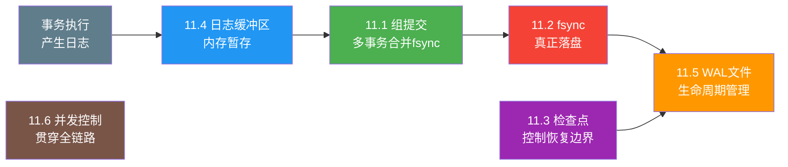
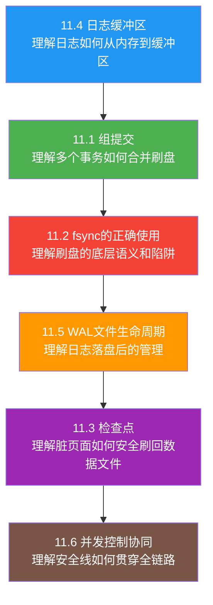

# 核心技巧

在前一部分，我们建立了WAL的完整理论框架——从持久性的本质需求到ARIES恢复模型，从影子分页到LSN的设计原理。理论告诉我们"WAL为什么能保证正确性"，但真正让WAL在生产环境中高效运转的，是本节要深入讲解的六项核心工程技巧。

如果说理论基础是WAL的"法"（为什么这样做是对的），那么核心技巧就是WAL的"术"（具体怎么做才能既快又安全）。这六项技巧不是孤立的技术点，而是构成了一条完整的数据流路径：事务产生日志 → 日志缓冲区暂存 → 组提交合并刷盘 → fsync真正落盘 → WAL文件生命周期管理 → 检查点控制恢复边界。而并发控制则像一条贯穿所有环节的安全线，确保每个步骤在高并发场景下仍然正确。

## 为什么理论之外还需要技巧

理论上的WAL规则非常简洁：日志先于数据、提交先于完成。但把这个规则落实到一个每秒处理数万事务的OLTP系统中，工程师会立刻面对一系列棘手的问题：

**性能问题**：每次事务提交都调用fsync是最安全的做法，但一次fsync的延迟可能高达数毫秒。如果每个事务独立fsync，即使在最快的NVMe SSD上，吞吐量也被卡在几万TPS的上限。如何在不牺牲持久性的前提下突破这个瓶颈？

**操作系统陷阱**：fsync在不同操作系统、不同文件系统上的行为存在微妙但致命的差异。ext4的rename后不fsync目录会导致数据丢失，Btrfs的COW机制让fsync的刷新范围远超预期，ZFS的事务组机制引入了不可预测的延迟。不了解这些差异，系统看似正确实则脆弱。

**资源管理问题**：WAL日志文件不能无限增长，但也不能在不恰当时机被清理。检查点触发太频繁会增加运行时I/O压力，触发太稀疏则崩溃恢复时间过长。日志缓冲区太小会导致频繁fsync，太大则浪费宝贵的缓冲池内存。这些参数之间存在精密的耦合关系。

**并发正确性**：多个事务线程同时写入日志时，LSN的分配必须全局唯一且单调递增，日志的物理写入顺序必须与LSN顺序一致，锁的获取和释放必须与日志记录正确关联。任何一个环节的并发安全问题都可能导致恢复时数据不一致。

这六项技巧正是为了解决这些问题而存在的。它们共同构成了WAL子系统的工程实践指南——从理论到生产之间的桥梁。

## 六项技巧的全景图

上图展示了这六项技巧在WAL数据流中的位置。它们并非线性排列——并发控制（11.6）像一根安全线贯穿所有环节，检查点（11.3）则在后台独立运行，周期性地将脏页面刷回数据文件。理解它们的协作关系，比单独记住每个技术的细节更重要。

## 11.1 组提交（Group Commit）：用一次fsync覆盖多个事务

组提交是WAL性能优化中收益最显著的技术。它的核心洞察是：**fsync的固定开销（约10-50微秒）远大于与数据量相关的传输开销**。既然如此，把多个事务的日志合并后一次性fsync，就能将固定开销分摊到每个事务上。

组提交采用经典的Leader-Follower模型：第一个到达的事务成为Leader，负责收集一批待提交的事务；后续到达的事务成为Follower，等待Leader完成本批次的fsync。理论上，如果每批合并32个事务，吞吐量就能提升约32倍。实际中由于等待合并的延迟和锁竞争等因素，提升幅度通常在10-30倍之间。

本节将完整讲解组提交的算法设计、Python实现代码、PostgreSQL的三阶段组提交、MySQL/InnoDB的两阶段提交与组提交的交叉、SQLite WAL模式的简化优化，以及生产环境的调优策略。

## 11.2 fsync的正确使用：跨越操作系统和文件系统的陷阱

fsync是连接内存世界与持久化世界的唯一桥梁，但它的行为远比大多数人想象的复杂。本节深入剖析fsync在Linux内核中的实现流程，揭示三个容易被忽视的关键细节：fsync只保证数据的持久化而不保证元数据的顺序、fsync不保证两次调用之间的写入顺序、fsync会刷新文件的所有脏页面而非仅本次修改的页面。

更重要的是，本节系统对比了四种同步原语（fsync、fdatasync、O_SYNC、O_DSYNC）的行为差异，分析了ext4、XFS、Btrfs、ZFS四大文件系统的fsync语义差异，揭示了写回缓存在多层存储架构中可能引入的"假持久化"问题，并给出了ext4经典的rename+fsync陷阱及其修复方案。这些知识是WAL工程实践中的"雷区地图"——不了解它们，你的系统看似正确实则脆弱。

## 11.3 检查点（Checkpoint）：恢复时间与运行时性能的平衡艺术

如果说WAL保证了"数据修改不丢失"，那么检查点保证了"系统能在合理时间内恢复到一致状态"。没有检查点，WAL日志将无限增长，崩溃恢复需要从日志起点重放所有修改，恢复时间可能从秒级退化到小时级。

检查点的核心挑战在于权衡：太频繁则运行时I/O压力大（每次检查点都要刷写大量脏页面），太稀疏则恢复时间过长。本节对比了Sharp Checkpoint（阻塞所有事务）和Fuzzy Checkpoint（不阻塞事务）两种实现模式，详细分析了检查点的四种触发机制（时间间隔、WAL日志量、脏页面比例、恢复安全），并以PostgreSQL和MySQL InnoDB为例，剖析了检查点的内部执行流程，特别是recLSN和redo_lsn这两个关键概念的计算逻辑。

## 11.4 日志缓冲区管理：WAL Writer的双缓冲设计

事务执行过程中产生的日志记录并非直接写入磁盘——那会将每次修改都变成一次昂贵的I/O操作。日志先写入内存中的日志缓冲区（Log Buffer），再由专门的后台线程（WAL Writer）批量刷盘。这个缓冲层是WAL子系统中性能敏感度最高的组件之一：它的大小决定了fsync的频率，它的刷写策略决定了事务提交的延迟，它的并发控制决定了写入吞吐的上限。

本节从日志缓冲区的基本结构出发，深入讲解双缓冲技术（应用层缓冲区 + 内核页缓存的协同）、WAL Writer的后台刷写机制与唤醒策略、缓冲区大小的调优方法，以及PostgreSQL和MySQL InnoDB在这一层的具体实现差异。

## 11.5 WAL文件的生命周期管理：从创建到消亡

日志缓冲区中的数据最终要落盘，而落盘的目标就是WAL文件。WAL文件的管理不是"写满一个再创建一个"这么简单——它涉及创建命名、段文件组织、轮转策略、保留控制、归档备份、空间回收等多个环节。任何一个环节出问题，轻则磁盘空间耗尽导致数据库停机，重则归档日志缺失导致无法恢复到指定时间点。

本节完整覆盖WAL文件从诞生到消亡的全生命周期。以PostgreSQL的16进制段文件命名、MySQL InnoDB的循环写入ib_logfile、SQLite的wal-index共享内存文件为例，逐一拆解每个阶段的设计原理和工程实践，包括如何安全地轮转WAL文件（避免ext4的rename陷阱）、如何配置归档策略以支持时间点恢复（PITR）、如何在磁盘空间和恢复能力之间找到平衡点。

## 11.6 并发控制与日志的协同：贯穿全链路的安全线

WAL子系统的日志写入与事务并发控制是两个深度耦合的子系统：日志负责记录"发生了什么"，并发控制负责协调"谁可以同时做什么"。二者必须在时序、内存可见性和持久化语义上精密配合，否则就会出现数据不一致或性能崩溃。

本节从LSN分配的并发安全出发，讲解全局唯一且单调递增的LSN如何在高并发下安全分配（CAS原子操作 vs 互斥锁的权衡），日志与锁的交互机制（写前日志如何支持锁的回滚），WAL与MVCC的时序协调（提交LSN如何决定数据对其他事务的可见性），以及无锁优化技术（PostgreSQL的WAL Insert Lock优化、MySQL InnoDB的log_sys->mutex优化）。这些内容将并发控制的知识（第15章）与WAL的机制深度交织，是理解数据库内部运作的关键枢纽。

## 学习建议

这六项技巧的最佳学习路径是沿着数据流的方向推进：

如果你对I/O模型还不太熟悉，建议先阅读11.4（日志缓冲区），它从内存层面建立了日志写入的基础认知；然后进入11.1（组提交），理解性能优化的核心手段；再阅读11.2（fsync），深入了解底层的语义陷阱。11.3（检查点）和11.5（WAL文件管理）可以按需阅读，11.6（并发控制协同）建议放在最后，因为它综合了前面所有内容的并发安全需求。

每一节都包含完整的代码实现和实测数据对比，建议边阅读边动手实验——特别是组提交的Python实现和fsync的性能基准测试，亲手跑一遍比看十遍理论更有效。

## 本节导航

- [11.1 组提交（Group Commit）](01-111组提交GroupCommit.md) — 多事务合并一次fsync，吞吐量提升10-100倍
- [11.2 fsync的正确使用](02-112fsync的正确使用.md) — 不同操作系统、文件系统、硬件上的行为差异与陷阱
- [11.3 检查点（Checkpoint）](03-113检查点Checkpoint.md) — 恢复时间与运行时性能的平衡艺术
- [11.4 日志缓冲区管理](04-114日志缓冲区管理.md) — 双缓冲设计与WAL Writer线程
- [11.5 WAL文件的生命周期管理](05-115WAL文件的生命周期管理.md) — 创建、轮转、归档、清理的完整流程
- [11.6 并发控制与日志的协同](06-116并发控制与日志的协同.md) — WAL与锁机制、MVCC的协作关系
- [核心技巧小结](07-本节小结.md) — 六项技巧的协作全景与关键要点回顾
