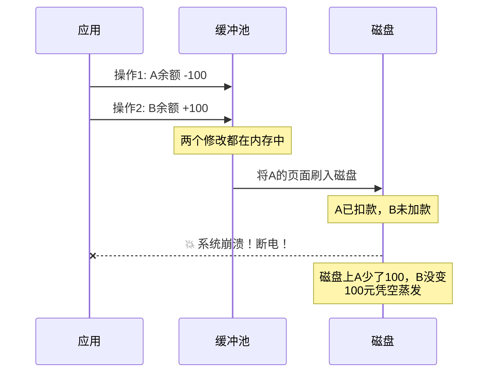
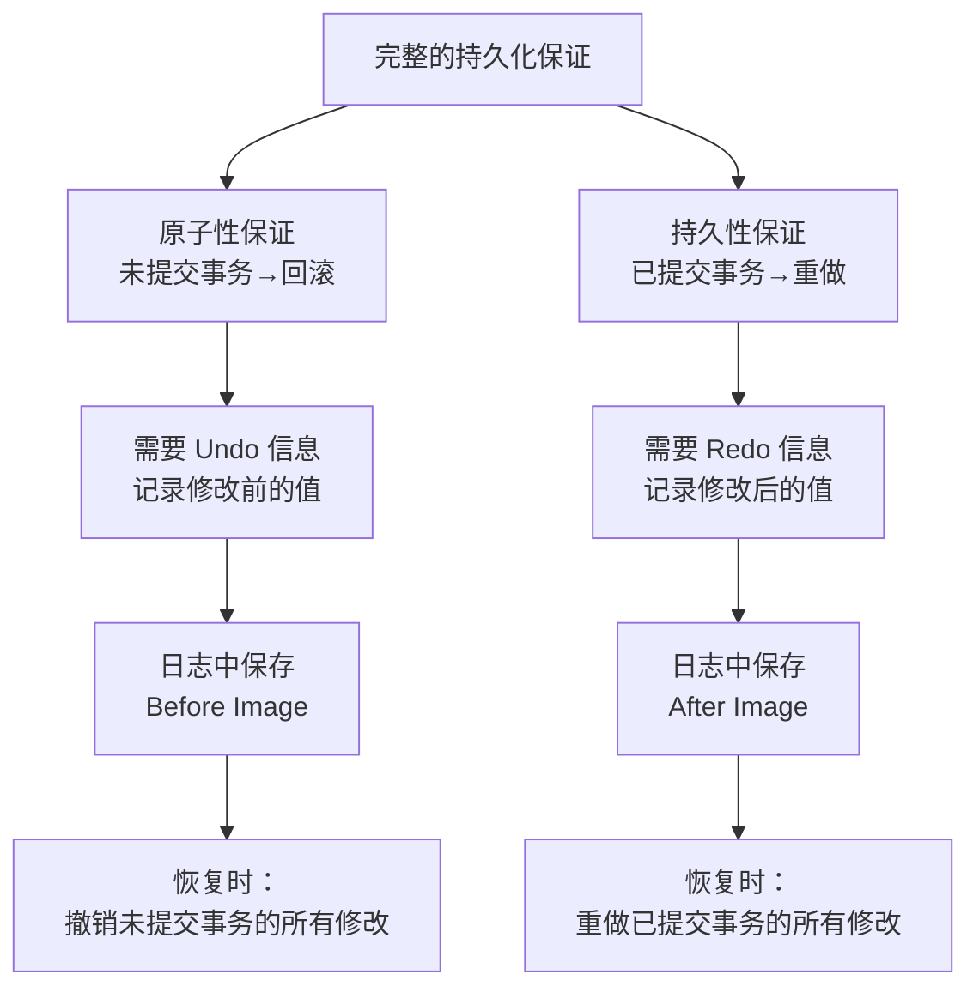
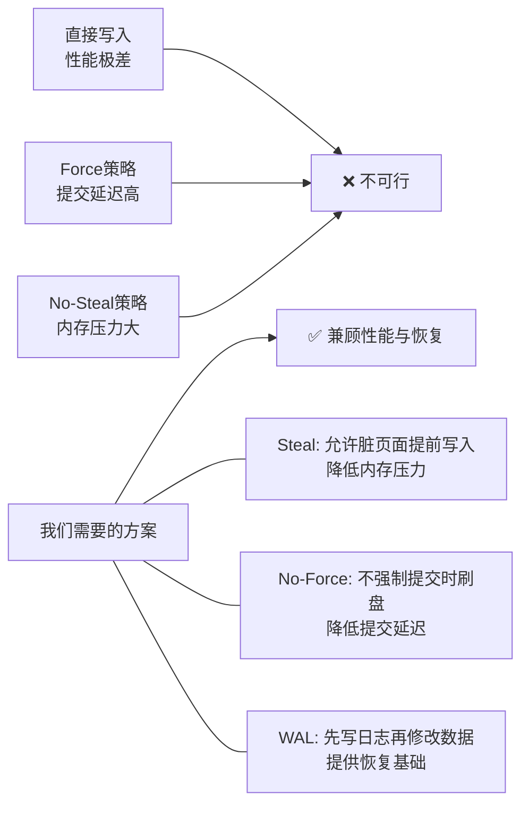
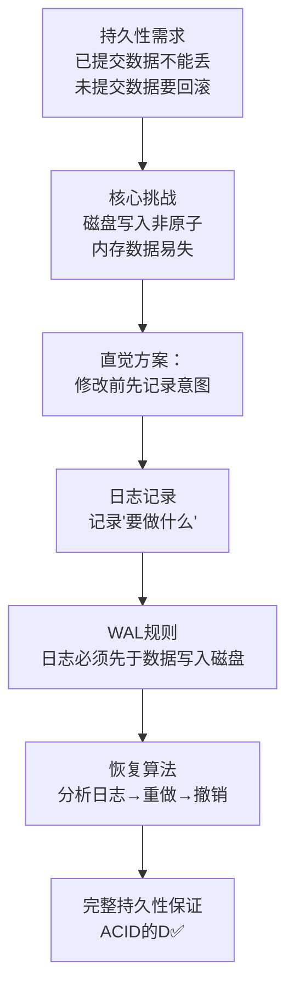

## 11.1 持久性的本质需求

> **核心问题**：数据库断电后，如何保证已提交的数据不丢失？

这是整个WAL理论体系的起点。在深入WAL规则、ARIES恢复模型、正确性证明之前，我们必须先回答一个更根本的问题：**持久性到底是什么？为什么它对数据库如此重要？** 理解了持久性的本质需求，才能真正理解后续所有设计决策的动机。

### 11.1.1 ACID模型中的持久性

事务是数据库操作的基本单元。ACID是事务正确执行的四大支柱：

| 属性 | 全称 | 含义 | 一句话概括 |
|------|------|------|-----------|
| **A** | Atomicity（原子性） | 事务中的操作要么全部成功，要么全部回滚，不存在中间状态 | "全有或全无" |
| **C** | Consistency（一致性） | 事务执行前后，数据库从一个合法状态转移到另一个合法状态 | "数据永远是对的" |
| **I** | Isolation（隔离性） | 并发事务之间互不干扰，效果等同于串行执行 | "互不踩踏" |
| **D** | Durability（持久性） | 事务一旦提交，其效果永久保留，即使系统发生崩溃 | "写进去就别想丢" |

在这四个属性中，持久性是最终的"底线保证"。前面三个属性无论做得多好——原子性保证了回滚的正确性、一致性保证了约束不被违反、隔离性保证了并发的正确——如果持久性缺失，一切都将化为乌有：用户以为提交成功的转账记录在断电后凭空消失，银行账本和实际余额对不上，信任崩塌。

**持久性的形式化定义**：

Durability ≡ ∀T (committed(T) → after_crash(effects(T) ⊂ disk))

读作：对于任意事务T，如果T已提交（committed），那么在任何崩溃事件e之后，T的效果（effects(T)）必须已经持久化到磁盘上（⊂ disk）。注意这里的"任何崩溃事件"——包括断电、操作系统崩溃、磁盘故障等一切非正常终止场景。

### 11.1.2 为什么持久性如此困难

理解了持久性的定义后，一个自然的问题是：**把数据写入磁盘不就行了，有什么难的？**

问题远比表面看起来复杂。磁盘写入并非原子操作，一次"写入"可能涉及多个底层步骤。更重要的是，数据库的修改不是单条记录的写入，而是涉及多个数据结构的协调更新。让我们通过一个具体场景来理解这个困难。

#### 场景：银行转账

假设账户A向账户B转账100元，数据库需要执行以下操作：

操作1: UPDATE accounts SET balance = balance - 100 WHERE id = 'A'
操作2: UPDATE accounts SET balance = balance + 100 WHERE id = 'B'

这两个操作需要作为一个原子单元执行。现在考虑以下时序：



这个场景暴露了持久性面临的核心挑战：

1. **写入不是原子的**：即使单次`write()`系统调用看起来是原子的（取决于硬件和文件系统），数据库的修改涉及多个页面，不可能同时写入。
2. **内存是易失的**：缓冲池（Buffer Pool）中的数据在断电后全部丢失。如果修改只存在于内存中，崩溃意味着修改丢失。
3. **部分写入（Partial Write）**：一个8KB的页面写入磁盘可能需要多次磁盘I/O操作（特别是当页面跨磁道时），断电可能发生在写入的中间时刻，导致页面处于损坏状态。

#### 更多灾难场景

除了"写入过程中的崩溃"，还有其他需要持久性保证的场景：

| 场景 | 描述 | 后果 |
|------|------|------|
| **断电崩溃** | 突然断电，CPU立即停止，内存数据消失 | 内存中的所有未落盘修改全部丢失 |
| **操作系统崩溃** | OS内核panic或蓝屏，文件系统处于不一致状态 | 可能出现撕裂页（torn page），文件系统元数据损坏 |
| **磁盘故障** | 磁盘坏道或控制器故障 | 单个或多个数据页面不可读 |
| **进程崩溃** | 数据库进程被OOM Killer杀死或segfault | 同断电，所有未落盘修改丢失 |
| **恢复中的再次崩溃** | 数据库正在恢复时再次发生崩溃 | 恢复算法本身必须能处理这种情况 |

特别是最后一种场景——**恢复中的再次崩溃**——是很多持久性方案失败的原因。一个看似正确的恢复算法，如果不能处理"恢复到一半又崩溃了"的情况，就不是真正的持久性保证。

### 11.1.3 原子性与持久性的交织

在ACID的讨论中，原子性（Atomicity）和持久性（Durability）经常被放在一起讨论，因为它们共享同一个核心挑战：**如何在不保证原子写入的硬件上，实现原子的逻辑效果？**

但两者的关注点不同：

原子性关注的是：崩溃后，未提交的事务不应该留下痕迹（回滚）
持久性关注的是：崩溃后，已提交的事务效果不应该丢失（重做）

一个完整的持久化方案必须**同时**解决这两个问题。只解决持久性（已提交的不丢失）而不解决原子性（未提交的要回滚），数据库可能在崩溃后保留不一致的中间状态。只解决原子性（能回滚未提交事务）而不解决持久性（已提交的不丢失），用户提交的数据可能消失。



**关键洞察**：无论是原子性（回滚需要修改前的值）还是持久性（重做需要修改后的值），都需要在修改数据之前，先将"要做什么"记录到某个地方。这个"某个地方"就是日志（Log），这个"先记录再修改"的策略就是Write-Ahead Logging（WAL）。这是下一节要详细讨论的内容。

### 11.1.4 崩溃恢复的基本思路

理解了持久性的困难之后，我们来看解决这个问题的基本思路。

数据库系统解决持久性问题的核心策略是**日志先行**：在对数据页面做任何修改之前，先将修改意图记录到一个持久化的日志中。这样即使崩溃发生，系统也能通过重放日志来恢复数据。

这个思路可以用一个比喻来理解：

> **白板和笔记本的比喻**
>
> 想象你要在白板上做一系列修改（相当于修改数据库页面）。如果你直接修改白板，中途被打断后可能忘记改到哪一步。但如果你先在笔记本上记录每一步操作（"擦掉第3行"、"在第5行写上XXX"），即使被打断，你也能看着笔记本从头重做所有步骤，确保白板最终状态正确。

用形式化的方式表达，崩溃恢复需要遵循以下不变量：

恢复不变量1（Redo保证）：
  ∀page P: 如果 P 的修改对应的日志记录已刷盘，
            那么恢复时必须重做该修改（即使崩溃前该修改已在磁盘上）

恢复不变量2（Undo保证）：
  ∀txn T: 如果 T 在崩溃时未提交，
           那么恢复时必须撤销 T 的所有修改（即使部分修改已在磁盘上）

这两个不变量看似简单，但实现起来需要精妙的设计：

- **Redo需要幂等性**：重做操作可能执行多次（如果第一次重做后又崩溃），必须保证执行一次和执行多次的效果相同。
- **Undo需要补偿日志**：撤销操作本身也需要记录到日志中，否则撤销到一半又崩溃时，无法继续完成撤销。
- **Redo和Undo的顺序**：必须先重做所有修改（包括已提交和未提交的），再撤销未提交的。如果先撤销再重做，可能撤销了应该重做的数据。

### 11.1.5 简单持久化方案及其局限

在介绍WAL之前，我们先看看一些看似直观但实际不可行的持久化方案，理解它们的局限有助于理解WAL的设计动机。

#### 方案一：直接写入（No Buffer）

最简单的方案：不做任何缓冲，每次修改都直接写入磁盘。

```python
def update_balance(account_id, new_balance):
    # 直接写磁盘，没有缓冲
    disk.write(account_id, new_balance)
```

**优点**：实现简单，无需恢复机制。

**缺点**：
- 性能极差。磁盘I/O比内存操作慢4-5个数量级（~100ns vs ~10μs），每次修改都等待磁盘写入，吞吐量极低。
- 如果修改涉及多个页面（如转账需要修改两个账户的余额），无法保证原子性——修改A成功后、修改B之前崩溃，数据处于不一致状态。
- 没有利用缓冲池来合并多次修改、减少I/O次数。

**适用场景**：几乎不存在。嵌入式数据库在极端简单场景下可能退化为此方案。

#### 方案二：强制刷盘（Force Policy）

使用缓冲池缓存修改，但在事务提交时，强制将所有脏页面刷入磁盘。

```python
def commit_transaction(txn):
    for page in txn.dirty_pages:
        flush_to_disk(page)  # 强制刷盘
    txn.status = COMMITTED
```

**优点**：提交后数据一定在磁盘上，无需Redo。

**缺点**：
- 提交延迟极高。一次提交可能涉及数十甚至数百个页面的刷盘，需要等待所有I/O完成。
- 如果页面分散在磁盘不同位置，随机I/O的延迟会进一步恶化。
- 没有解决原子性问题——如果页面写入是部分完成的（撕裂页），仍然需要Undo机制。

#### 方案三：不偷窃策略（No-Steal Policy）

只允许已提交事务的脏页面写入磁盘。未提交事务的修改始终保留在内存中。

```python
def flush_if_needed():
    for page in buffer_pool:
        if page.is_dirty and page.owner_txn.is_committed:
            write_to_disk(page)
        # 未提交事务的脏页面不写入磁盘
```

**优点**：无需Undo。崩溃后，未提交事务的修改都在内存中（已丢失），磁盘上的数据都是已提交事务的修改。

**缺点**：
- 内存压力巨大。如果有长事务持有大量脏页面，缓冲池可能被占满，影响其他事务的正常操作。
- 不适用于大规模数据处理——内存有限，不可能将所有修改都留在内存中等待提交。
- 提交时仍需刷盘，延迟问题依然存在。

#### 为什么这些方案都不可行？



性能最优的方案是 **Steal + No-Force** 组合——允许脏页面提前写入磁盘（Steal），提交时不要求立即刷盘（No-Force）。但这个组合引入了最大的恢复复杂度：Steal意味着可能需要Undo（未提交事务的修改已在磁盘上），No-Force意味着可能需要Redo（已提交事务的修改还在内存中）。WAL正是在Steal + No-Force策略下，解决恢复问题的核心机制。

### 11.1.6 从需求到WAL：持久性的工程实现路径

让我们回顾一下从持久性需求到WAL方案的推导过程：



这个推导链条中的关键环节：

1. **持久性需求** → 需要在崩溃后恢复数据
2. **磁盘写入非原子** → 不能依赖单次写入的原子性
3. **内存数据易失** → 不能依赖内存来保存关键信息
4. **解决思路** → 将修改意图记录到持久化存储，再修改实际数据
5. **WAL规则** → 日志记录必须先于数据页面写入磁盘（先记账后花钱）
6. **恢复算法** → 崩溃后通过日志重做已提交事务、撤销未提交事务
7. **最终保证** → 满足ACID中的Durability

### 11.1.7 实际系统中的持久性保证

现代数据库都在不同程度上实现了持久性保证，但在具体策略上有差异：

| 数据库 | 缓冲策略 | WAL机制 | 刷盘控制 |
|--------|---------|---------|---------|
| **PostgreSQL** | Steal + No-Force | WAL（XLog） | `synchronous_commit`控制 |
| **MySQL InnoDB** | Steal + No-Force | Redo Log | `innodb_flush_log_at_trx_commit` |
| **Oracle** | Steal + No-Force | Redo Log | `COMMIT`时强制写Redo Log |
| **SQL Server** | Steal + No-Force | Write-Ahead Log | `CHECKPOINT` + `WAL` |
| **SQLite** | Steal + No-Force | Journal/WAL模式 | 取决于journal_mode |

注意所有主流数据库都选择了 **Steal + No-Force** 策略。这不是巧合——这是性能和恢复复杂度之间的最佳平衡点。Steal + No-Force的恢复最复杂（需要同时处理Redo和Undo），但它带来的性能收益（低延迟提交、高吞吐量）远超恢复复杂度的代价——毕竟恢复只在崩溃时发生，而提交每秒可能发生成千上万次。

**MySQL InnoDB的参数选择示例**：

```sql
-- MySQL中控制WAL刷盘策略的参数
SHOW VARIABLES LIKE 'innodb_flush_log_at_trx_commit';

-- 值为1（默认）：每次提交都刷盘 —— 最安全，延迟最高
-- 值为2：每次提交写入OS缓存，每秒刷盘 —— 折中方案
-- 值为0：每秒刷盘，不保证每次提交都刷盘 —— 最快，可能丢1秒数据
```

这组参数直观地展示了持久性和性能之间的权衡：`innodb_flush_log_at_trx_commit=1`对应最强的持久性保证（ACID完全合规），而`innodb_flush_log_at_trx_commit=0`则牺牲了部分持久性来换取更高的性能。在金融等关键场景中，必须使用值1；在日志分析等可容忍少量丢失的场景中，可以使用值2或0。

### 11.1.8 本节要点回顾

本节从ACID中Durability的定义出发，解释了持久性的本质含义和实现困难：

1. **持久性的定义**：事务一旦提交，其效果永久保留，即使系统崩溃。
2. **为什么困难**：磁盘写入非原子、内存数据易失、部分写入（torn page）可能损坏页面。
3. **原子性与持久性**：两者交织——原子性需要Undo，持久性需要Redo，都需要日志先行。
4. **崩溃恢复的基本思路**：记录修改意图到日志，崩溃后通过重做和撤销恢复一致状态。
5. **简单方案的局限**：直接写入太慢、Force太慢、No-Steal内存不够，最优解是Steal + No-Force + WAL。
6. **WAL的核心思想**：先记账后花钱——日志必须先于数据写入磁盘。

> **下一节预告**：理解了持久性的本质需求后，下一节将把WAL的直觉提升到形式化层面，给出两条严格的规则定义——**日志先于数据**和**提交先于完成**，以及日志记录的完整内部结构。这是理解后续ARIES恢复模型和正确性证明的必备基础。
