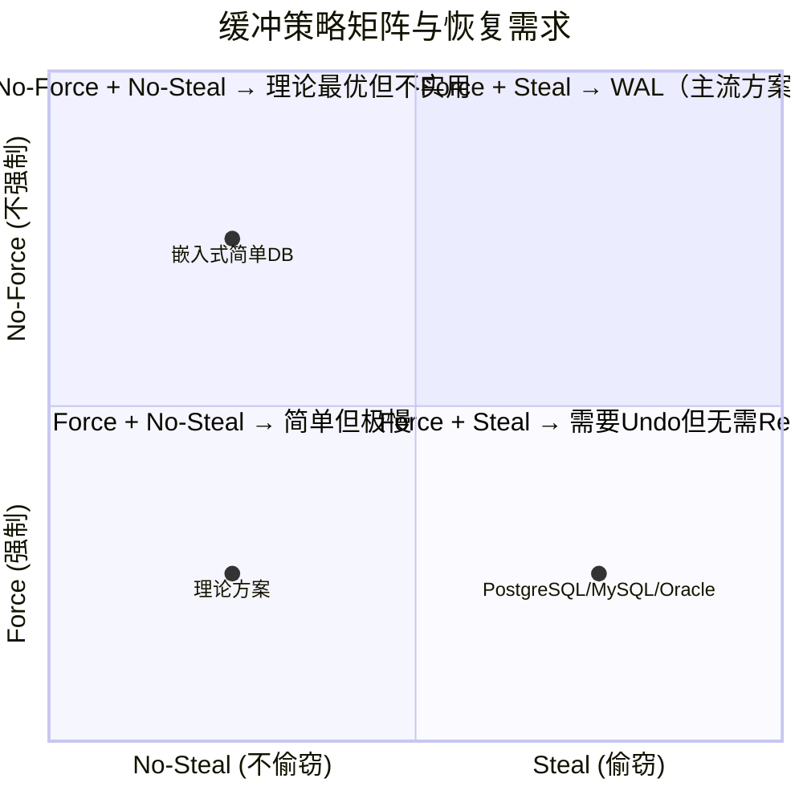
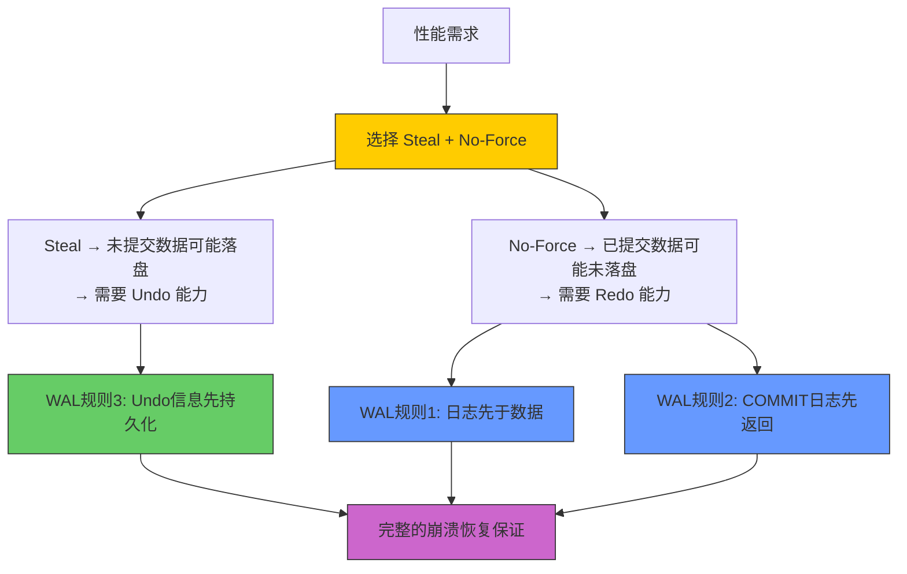
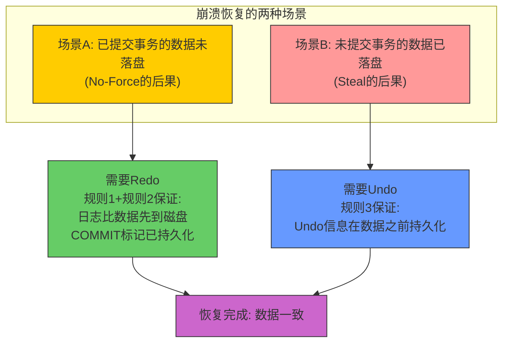
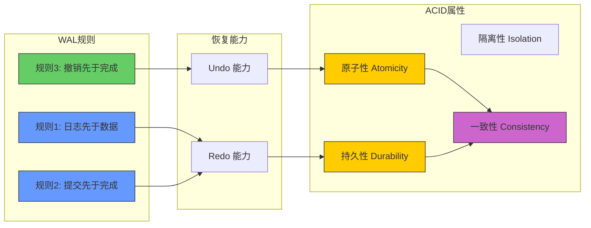
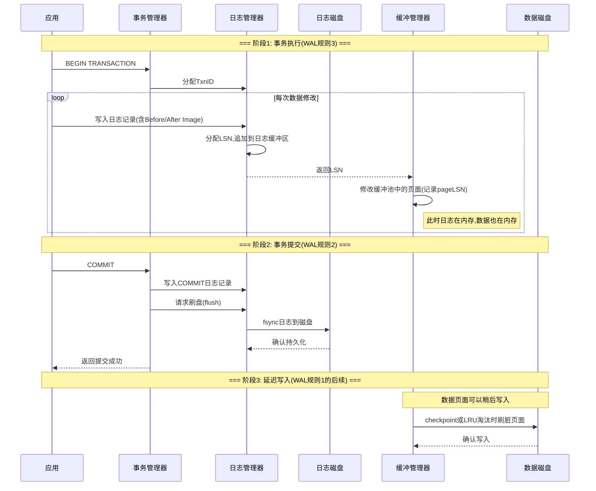

## 11.2 WAL规则的形式化定义

上一节我们理解了持久性的本质需求——数据库必须在任何故障后恢复到一致状态。WAL（Write-Ahead Logging，预写式日志）正是解决这一问题的核心机制。本节将WAL从直觉层面提升到形式化层面，给出严格的规则定义、缓冲策略矩阵和正确性语义，为后续ARIES恢复模型（11.3节）和正确性证明（11.5节）奠定理论基础。

### 11.2.1 缓冲策略矩阵：WAL存在的根本原因

在讨论WAL规则之前，必须先理解一个更基本的问题：**数据页面何时写入磁盘？** 这个问题的答案决定了数据库的性能特征和恢复复杂度。

#### 两个独立的策略维度

数据库的缓冲管理涉及两个独立的策略选择——**Steal/No-Steal** 决定"未提交事务的脏页面能否提前写盘"，**Force/No-Force** 决定"已提交事务的脏页面是否必须立即写盘"：

| 策略维度 | 选项 | 含义 | 性能特征 | 恢复影响 |
|----------|------|------|----------|----------|
| **Steal策略** | Steal（偷窃） | 未提交事务的脏页面可以写入磁盘 | ✅ 减少内存占用 | ❌ 需要Undo能力 |
| | No-Steal（不偷窃） | 只有已提交事务的页面才能写入磁盘 | ✅ 无需Undo | ❌ 内存压力大 |
| **Force策略** | Force（强制） | 事务提交时立即将所有脏页面刷入磁盘 | ✅ 无需Redo | ❌ 提交延迟高 |
| | No-Force（不强制） | 事务提交时不需要立即刷盘 | ✅ 提交快 | ❌ 需要Redo能力 |

#### 四种组合的代价分析

这四种策略组合形成一个2×2矩阵，每个组合的恢复代价截然不同：



逐一分析每种组合：

| 组合 | 缓冲策略 | Undo | Redo | 性能 | 恢复复杂度 | 实际采用 |
|------|---------|------|------|------|-----------|---------|
| **Force + No-Steal** | 提交时刷盘 + 不允许脏页面提前写入 | ❌ 不需要 | ❌ 不需要 | 极低（每次提交等多页刷盘） | 最低（无需日志） | 极少（极端简单的嵌入式DB） |
| **Force + Steal** | 提交时刷盘 + 允许脏页面提前写入 | ✅ 需要 | ❌ 不需要 | 低（提交延迟仍高） | 中（需要Undo日志） | 少见 |
| **No-Force + No-Steal** | 提交时不刷盘 + 不允许脏页面提前写入 | ❌ 不需要 | ✅ 需要 | 中（内存压力大限制并发） | 中（需要Redo日志） | 理论方案 |
| **No-Force + Steal** | 提交时不刷盘 + 允许脏页面提前写入 | ✅ 需要 | ✅ 需要 | **最高** | **最高（需要完整WAL）** | **所有主流数据库** |

#### 为什么主流数据库选择 No-Force + Steal？

**No-Force** 带来的性能收益是数量级的。在Force策略下，一次事务提交可能需要等待数十甚至上百个分散在磁盘不同位置的脏页面完成随机I/O写入，在HDD上单次随机写入延迟约5-10ms，100个页面就是500ms-1s。而No-Force下，提交只需等待一次顺序的日志刷盘，在HDD上仅需0.5-2ms，性能提升可达250-2000倍。在SSD上差距缩小但仍有5-50倍。

**Steal** 策略则解决了内存管理的关键问题。想象一个批处理事务需要修改百万行数据，如果采用No-Steal策略，所有修改都必须保留在内存中直到提交完成，这将耗尽数GB的缓冲池内存。Steal策略允许缓冲管理器在内存紧张时将未提交事务的脏页面提前写盘，从而释放宝贵的内存空间供其他事务使用。

**但这个组合的代价是：必须同时支持Undo和Redo。** Steal意味着已修改但未提交的页面可能已落盘（崩溃后需Undo），No-Force意味着已提交但未刷盘的页面可能丢失（崩溃后需Redo）。WAL正是以最小代价同时提供Undo和Redo能力的机制。



### 11.2.2 WAL核心规则的形式化定义

WAL的核心约束可以形式化为三条规则。前两条是WAL名称的直接来源（Write-Ahead Logging——日志写在数据之前），第三条是正确恢复的隐含要求（尤其在Steal策略下不可或缺）。三条规则分别保障不同的恢复能力，缺一不可。

#### 规则1：日志先于数据（Log-Before-Data）

**自然语言表述**：对数据页面P的任何修改，在该修改对应的日志记录刷新到稳定存储之前，禁止将P的修改写入磁盘。

**形式化表述**：

∀ 事务T, 页面P:
  如果 T 写入了页面 P 的修改，
  且该修改对应的日志记录为 L(P)，
  则 flush(L(P)) 必须先于 write(P) 发生。

用时序逻辑（Temporal Logic）表示：

G( (write(P) → ∃ L: flush(L) ∧ lsn(L) ≥ lsn(P_modification)) )

读作："在所有时刻（G），如果对页面P发生了写入（write(P)），那么必然存在一条日志记录L，使得L已经被刷盘（flush(L)），且L的LSN不小于P的修改对应的LSN。"

用前置/后置条件的形式表达：

前置条件（Precondition）: write(P) 即将发生，P 被事务T修改
操作约束（Constraint）:   ∃ L ∈ WAL, type(L) = MODIFY(P), flush(L) = true
后置条件（Postcondition）: P的新版本已写入磁盘
保证（Guarantee）:         L 在 P 之前持久化 → 恢复时可从 L 重做 P 的修改

**语义解读**：这条规则保证了"如果崩溃后磁盘上的数据页面包含某个修改，那么描述该修改的日志一定已经在磁盘上"。这是Redo能够工作的前提——Redo要求日志永远比数据"更早到达"磁盘。

**违反后果的详细推演**：

假设违反规则1，即修改已写入磁盘但对应的日志尚未刷盘。此时崩溃发生：

时间线：
  t1: 事务T执行 UPDATE page P SET x = 10
  t2: 日志记录 L(P) 写入日志缓冲区（内存中）
  t3: 页面P的新版本写入磁盘（违反规则1，因为L(P)尚未flush）
  t4: 💥 系统崩溃！

崩溃后，磁盘上的页面P包含 x=10，但日志中没有记录L(P)。恢复过程面临以下困境：

1. **无法判断x=10是否应该保留**：可能T在t1之前已经将x改为5，磁盘上可能保留的是正确的5，也可能是未提交的10——恢复程序无法区分
2. **无法确定修改的完整语义**：即使知道x被改为10，也可能需要知道x的旧值才能判断事务的其他约束（如CHECK约束、外键引用）是否被违反
3. **无法重建一致性状态**：数据库的其他页面可能仍然引用x的旧值，导致引用不一致

**一个具体数值例子**：假设转账事务T1从账户A扣款100元（A余额从500变为400），但页面P（包含账户A）写入磁盘后日志才刷盘就崩溃了。恢复时日志中找不到这条扣款记录，无法判断A应该是500还是400——100元的去向成了永久的谜。

#### 规则2：提交先于完成（Commit-Before-Return）

**自然语言表述**：事务T提交时，描述T的所有日志记录必须已经刷新到稳定存储，然后才能向应用返回提交成功。

**形式化表述**：

∀ 事务T:
  如果 T 发出 COMMIT 请求，
  则 flush(all_logs(T)) 必须先于 commit_return(T) 发生。

其中 `all_logs(T)` 表示事务T的所有日志记录（包括数据修改日志和COMMIT标记日志）。

用时序逻辑表示：

G( commit_request(T) → 
    (∀ L ∈ logs(T): flush(L)) ∧ 
    commit_return(T) )

读作："在所有时刻，如果T发出了提交请求，那么T的所有日志记录都已经被刷盘，并且向T返回了提交成功。"

更精确的时序约束（使用 happens-before 关系 →）：

commit_request(T) 
  → write(COMMIT_RECORD(T))          -- 先写COMMIT标记到日志缓冲
  → flush(all_logs(T))               -- 再刷盘所有日志
  → commit_return(T)                 -- 最后返回成功给应用

**语义解读**：这条规则保证了"如果应用收到了提交成功的确认，那么该事务的所有日志（包括COMMIT标记）一定已经在磁盘上"。即使崩溃后数据页面全部丢失，只要日志完好，就能通过Redo重放所有已提交事务。

**违反后果的详细推演**：

假设违反规则2，在日志刷盘之前就向应用返回提交成功：

时间线：
  t1: 事务T执行 UPDATE page P SET x = 10
  t2: 日志记录 L(P) 写入日志缓冲区
  t3: COMMIT_RECORD(T) 写入日志缓冲区
  t4: 向应用返回 "COMMIT成功" ← 违反规则2！日志尚未flush
  t5: 💥 系统崩溃！

崩溃后，应用已认为T成功提交，但T的日志可能未持久化。恢复过程面临：

1. **COMMIT标记可能丢失**：如果COMMIT记录在日志缓冲区中未刷盘，恢复时无法确定T是否应该被Redo
2. **部分日志可能丢失**：如果日志缓冲区中有部分L(P)未刷盘，即使COMMIT标记丢失（恢复会Undo T），也可能导致数据页面部分修改已落盘但无法正确Undo
3. **Durability承诺被违反**：用户已确认提交成功，但数据可能丢失——这是ACID中最严重的违反

**实际影响**：在电商场景中，用户下单后看到"支付成功"，但由于违反规则2，这笔订单在数据库崩溃后消失。用户以为钱已扣、货已发，实际一切归零。

**规则2的隐含要求——COMMIT标记日志**：规则2要求所有日志在返回前刷盘，这个"所有"包括了COMMIT标记本身。COMMIT标记日志的持久化是判断事务是否需要Redo的关键依据——恢复时，有COMMIT标记的事务会被Redo，没有的则被Undo。

#### 规则3：撤销先于完成（Undo-Before-Complete）

**自然语言表述**：事务T的所有修改对应的日志记录（包含Undo信息）必须在T的任何修改被写入磁盘之前持久化。

**形式化表述**：

∀ 事务T, 页面P:
  如果 T 修改了页面P，
  且该修改的Undo信息为 U(T,P)，
  则 flush(U(T,P)) 必须先于 write(P) 发生。

用时序逻辑表示：

G( write(P, by=T) → ∃ U: undo_log(U, T, P) ∧ flush(U) )

**语义解读**：这条规则看似与规则1重复，但强调的重点不同。规则1强调"日志先于数据"（关注Redo能力），规则3强调"Undo信息必须可用"（关注回滚能力）。在Steal策略下，未提交事务的脏页面可能被提前刷盘，如果此时Undo信息尚未持久化，崩溃后就无法回滚该事务。

**规则1与规则3的本质区别**：

| 对比维度 | 规则1 (Log-Before-Data) | 规则3 (Undo-Before-Complete) |
|----------|------------------------|----------------------------|
| **关注焦点** | Redo能力——崩溃后能否重做 | Undo能力——崩溃后能否回滚 |
| **保护的场景** | No-Force：已提交但未落盘的修改 | Steal：未提交但已落盘的修改 |
| **保证的信息** | After Image（修改后的新值） | Before Image（修改前的旧值） |
| **对应的操作** | 重做已提交事务 | 回滚未提交事务 |
| **日志类型** | 数据修改日志（UPDATE/INSERT/DELETE） | 同上，但强调其中的Before Image字段 |

**为什么两者都不可或缺？** 如果只有规则1而没有规则3，那么在Steal策略下：未提交事务T的脏页面被缓冲管理器提前刷盘，日志中虽然有修改记录（满足规则1），但该记录中的Before Image可能不完整或尚未持久化（规则3未满足），崩溃后虽然知道T做了什么修改，但无法回滚到修改前的状态。

**违反后果的详细推演**：

时间线：
  t1: 事务T执行 UPDATE page P SET x = 10（x原来是5）
  t2: 日志记录 L(P) 的 Redo 部分写入日志缓冲区（After Image: x=10）
  t3: 缓冲管理器内存紧张，将页面P刷盘（Steal策略允许）
  t4: Before Image 尚未 flush ← 违反规则3！
  t5: 💥 系统崩溃！

崩溃后，磁盘上P的x=10（未提交的修改），但日志中可能没有完整的Before Image（x=5）。恢复时：
- 如果COMMIT标记不存在（T未提交），需要Undo T
- 但Undo需要知道x的旧值是5
- 如果Before Image未持久化，Undo无法执行
- 结果：x永久停留在10，数据不一致

#### 三条规则的协作关系

三条规则并非独立存在，它们协同工作，覆盖了崩溃恢复的所有可能场景：



**三条规则的覆盖矩阵**：

| 崩溃场景 | 恢复操作 | 依赖的WAL规则 | 缺失规则的后果 |
|----------|---------|--------------|--------------|
| 已提交事务的数据在内存中丢失 | Redo重放 | 规则1 + 规则2 | 已提交数据永久丢失 |
| 未提交事务的数据已写入磁盘 | Undo回滚 | 规则3 | 未提交数据残留磁盘 |
| 恢复过程中再次崩溃 | 重新分析+重做+撤销 | 三条规则共同保证 | 恢复过程不幂等 |
| 日志文件部分损坏 | 尽量恢复可恢复的部分 | 规则1的日志完整性 | 部分数据不可恢复 |

### 11.2.3 WAL规则与ACID的对应关系

WAL的三条规则并非凭空设计，它们精确对应了事务的ACID属性：

| ACID属性 | WAL规则保障 | 机制说明 | 无此规则的影响 |
|----------|-----------|---------|--------------|
| **原子性 (Atomicity)** | 规则3 + Undo | 未提交事务的数据落盘后，可通过Undo信息回滚到修改前状态 | 数据库可能保留不一致的中间状态 |
| **持久性 (Durability)** | 规则1 + 规则2 + Redo | 已提交事务的日志先于数据到达磁盘，崩溃后可通过Redo重放恢复 | 已提交数据可能永久丢失 |
| **隔离性 (Isolation)** | 间接保障 | WAL本身不直接提供隔离，但为MVCC的版本链提供了持久化基础 | 并发事务可能互相干扰 |
| **一致性 (Consistency)** | 以上三者之和 | 原子性+持久性保证了事务要么完全执行，要么完全不执行，从而维持一致性 | 数据可能违反业务约束 |

**WAL与ACID的精确映射关系**：



**关键洞察**：WAL本质上是一种**用日志的顺序写性能换取数据页面随机写延迟**的技术。一次事务提交只需要一次顺序的日志刷盘，而不需要将多个分散在缓冲池中的脏页面逐一随机写入磁盘。这个性能差距在传统HDD上可达100倍（顺序写~100MB/s vs 随机写~1MB/s），在SSD上也有5-10倍（顺序写~3GB/s vs 随机写~300MB/s，尽管差距已大幅缩小）。

**更深层的洞察**：WAL的三规则体系体现了分布式系统中一个经典的设计思想——**预写日志（Write-Ahead Log）是实现原子性的通用原语**。无论是数据库事务、分布式共识（Raft的Log）、消息队列（Kafka的Commit Log），还是文件系统日志（ext4的journaling），其核心都是同一个模式：在执行操作之前，先将操作意图持久化。WAL规则的形式化定义是这个通用模式在数据库领域的精确表达。

### 11.2.4 日志记录的完整结构

每条WAL日志记录是恢复过程的最小信息单元。其结构设计直接影响恢复的正确性和效率。理解日志记录的内部结构，是理解后续ARIES恢复算法和LSN设计的关键。

┌─────────────────────────────────────────────────────────┐
│                   WAL Log Record                        │
├─────────────────────────────────────────────────────────┤
│  Header (固定开销, 约32字节)                              │
│  ┌──────────┬─────────────────────────────────────────┐ │
│  │ LSN      │ 日志序列号(8B)，全局唯一递增             │ │
│  │ Prev_LSN │ 同事务前一条日志的LSN(8B)                │ │
│  │ TxnID    │ 事务ID(8B)                              │ │
│  │ Type     │ 操作类型(4B): INSERT/UPDATE/DELETE/      │ │
│  │          │   COMMIT/ABORT/BEGINPAGE/ENDPAGE/CLR     │ │
│  │ Length   │ 记录总长度(4B)                           │ │
│  └──────────┴─────────────────────────────────────────┘ │
│  Data (变长部分，因操作类型而异)                          │
│  ┌──────────┬─────────────────────────────────────────┐ │
│  │ PageID   │ 被修改的页面ID(8B)                       │ │
│  │ Offset   │ 页面内的偏移量(4B)                       │ │
│  │ Before   │ 修改前的字节序列(Undo信息)，仅UPDATE有   │ │
│  │ After    │ 修改后的字节序列(Redo信息)               │ │
│  └──────────┴─────────────────────────────────────────┘ │
└─────────────────────────────────────────────────────────┘

#### Header字段的设计意图

**LSN（Log Sequence Number）——全局时钟**

LSN是WAL系统中最重要的数据结构，它为整个系统提供了一个全局的逻辑时钟。LSN的物理含义通常是日志文件内的字节偏移量，这使得读取某条日志只需一次文件seek操作。

LSN的三个核心性质：

| 性质 | 定义 | 恢复中的作用 |
|------|------|-------------|
| **唯一性** | 每条日志记录拥有全局唯一的LSN | 精确定位任意日志记录，支持直接寻址 |
| **单调递增** | LSN严格递增，反映写入的因果顺序 | 判断"日志A是否在日志B之前写入" |
| **持久性** | LSN一旦分配永不变更 | 作为页面修改的时间戳（pageLSN），判断是否需要Redo |

LSN在恢复中的核心用途是**避免重复操作**。Redo阶段通过比较pageLSN和record.lsn来判断一个修改是否已经应用到磁盘：如果pageLSN >= record.lsn，说明该修改已生效，无需再次Redo。这个机制保证了Redo的幂等性——即使恢复过程中再次崩溃，重做阶段也不会重复执行已经成功的修改。

**Prev_LSN——事务内因果链**

Prev_LSN将同一事务的所有日志记录串联成一个单向链表。链表头是事务的最后一条日志，沿着Prev_LSN可以回溯到事务的第一条日志。

事务T的日志链:
┌──────────┐    ┌──────────┐    ┌──────────┐    ┌──────────┐
│ LSN=100  │───→│ LSN=120  │───→│ LSN=150  │───→│ LSN=180  │
│ BEGIN    │    │ UPDATE   │    │ UPDATE   │    │ COMMIT   │
│Prev=0    │    │Prev=100  │    │Prev=120  │    │Prev=150  │
└──────────┘    └──────────┘    └──────────┘    └──────────┘
  链尾(最早)                                            链头(最新)

这条链表在Undo过程中至关重要：恢复时需要按逆序撤销一个事务的所有操作，Prev_LSN提供了不需要扫描全部日志就能完成这一操作的机制。没有Prev_LSN，Undo必须扫描整个日志文件来找出属于某个事务的所有记录，时间复杂度从O(K)（K为该事务的日志数）退化为O(N)（N为全部日志数）。

**Prev_LSN与CLR的配合**：当Undo过程中遇到CLR（补偿日志记录）时，CLR中的UndoNextLSN可以跳过已经被Undo的操作，直接指向下一个需要Undo的原始操作。这进一步加速了Undo过程，尤其在长事务部分回滚后再次崩溃的场景中。

#### Data字段的设计意图

**Before Image / After Image——时间的两个切面**

- **Before Image**（前镜像）：修改前页面指定区域的原始字节。用于Undo——回滚时将页面恢复到修改前的状态。
- **After Image**（后镜像）：修改后页面指定区域的新字节。用于Redo——重做时将页面应用到修改后的状态。

不同操作类型的镜像组合：

| 操作类型 | Before Image | After Image | 说明 |
|----------|-------------|-------------|------|
| **INSERT** | 空（页面原来没有该记录） | 完整的新记录 | Undo = 物理删除该记录 |
| **DELETE** | 被删除的完整记录 | 空 | Redo = 物理删除该记录 |
| **UPDATE** | 修改前的字段值 | 修改后的字段值 | 两者都有，支持双向恢复 |
| **CLR** | 无（不可Undo） | Undo操作的效果 | CLR只支持Redo，不支持Undo |

**生理日志（Physiological Logging）的选择**：日志记录应该记录"哪个字节被改成什么"（物理日志）还是"对哪个表执行了什么操作"（逻辑日志）？现代数据库采用折中方案——**生理日志**：在物理层面描述修改位置（哪个页面、哪个偏移），在逻辑层面描述操作语义（INSERT/UPDATE/DELETE）。这种设计兼具物理日志的精确性和逻辑日志的紧凑性，是ARIES恢复模型的基础。

### 11.2.5 LSN的物理表示与语义层次

LSN在不同系统中有不同的物理表示方式，但语义相同——都是日志记录的全局唯一标识和时序标记。

```python
class LSN:
    """日志序列号的多种表示方式"""
    
    # 方式1: 物理偏移量（PostgreSQL采用）
    # LSN直接是日志文件中的字节偏移
    # 格式: "文件号/偏移量"，如 "0/016B3980"
    # 优势: 读取日志只需seek操作，O(1)复杂度
    # 劣势: 日志文件重组/归档后LSN需要重新映射
    physical_offset: int  # 例如: 0/016B3980 (文件号/偏移)
    
    # 方式2: 逻辑递增ID（早期Oracle采用）
    # 单调递增的整数，与物理存储无关
    # 优势: 不依赖日志文件布局，便于分布式复制
    # 劣势: 每次读取需通过映射表定位日志，O(log n)
    logical_sequence: int  # 例如: 42856
    
    # 方式3: 混合编码（现代系统常见）
    # 高位编码时间戳或世代号，低位编码偏移
    # 格式: [世代号 32bit][文件内偏移 32bit]
    # 优势: 兼具时序信息和定位能力
    # 劣势: 编码/解码有一定开销
    hybrid: int  # 高32位=世代号, 低32位=文件内偏移
```

**关键设计决策：LSN应该是物理地址还是逻辑ID？**

| 方案 | 优势 | 劣势 | 适用场景 | 代表系统 |
|------|------|------|----------|---------|
| 物理偏移 | 读取O(1)，直接定位 | 日志文件重组困难，分布式不友好 | 单机数据库 | PostgreSQL |
| 逻辑递增ID | 与存储解耦，分布式友好 | 每次读取需映射表，O(log n) | 分布式系统、多主复制 | 早期Oracle, CockroachDB |
| 混合编码 | 兼顾两者优势 | 编码/解码有一定开销 | 通用场景 | MySQL InnoDB |

**PostgreSQL的LSN实现细节**：PostgreSQL使用64位整数编码LSN，高32位为日志段文件编号，低32位为文件内字节偏移。这使得LSN既是全局唯一的时序标记，又是可以直接用于文件定位的物理地址。当需要读取LSN=0/016B3980的日志时，直接打开段文件0，seek到偏移0x016B3980处即可——无需任何额外的索引查找。

**LSN与pageLSN的关系**：每个数据页面都维护一个pageLSN字段，记录最后一次修改该页面的日志记录的LSN。Redo阶段通过比较pageLSN和record.lsn来判断是否需要重做：如果pageLSN >= record.lsn，说明该修改已反映到磁盘上，可以跳过。这个机制是ARIES恢复算法正确性的基石。

### 11.2.6 WAL规则的完整执行时序

将三条WAL规则放入完整的事务生命周期中，可以看到严格的执行顺序约束：



**时序图中的关键观察**：

1. **日志写入是事务提交的唯一同步瓶颈**。日志缓冲区到日志磁盘的flush操作是唯一必须等待的IO操作。数据页面写入与事务提交完全解耦，不影响已提交事务的持久性。
2. **数据页面写入与事务提交完全解耦**。数据页面可以在事务提交后的任意时间写入磁盘，不影响已提交事务的持久性。这正是No-Force策略的核心优势。
3. **日志的写入顺序等于LSN的分配顺序**。LSN不仅标识一条日志，还编码了全局的写入顺序。这个顺序一致性使得恢复时可以按照LSN递增的顺序扫描日志，简化了恢复算法。
4. **规则3在阶段1中隐式生效**。每次数据修改时，日志记录（包含Undo信息）被写入日志缓冲区。虽然此时日志尚未flush到磁盘，但规则3保证：在缓冲管理器将该页面刷盘之前，对应的日志记录必须已经flush。

**一个完整的事务生命周期示例**：

假设事务T执行以下操作：
```sql
BEGIN;
UPDATE accounts SET balance = balance - 100 WHERE id = 'A';  -- A: 500→400
UPDATE accounts SET balance = balance + 100 WHERE id = 'B';  -- B: 300→400
COMMIT;
```

对应的WAL日志序列：

| 序号 | LSN | Type | TxnID | PageID | Before | After | 说明 |
|------|-----|------|-------|--------|--------|-------|------|
| 1 | 100 | UPDATE | T | P_A | balance=500 | balance=400 | 规则3: Before Image已记录 |
| 2 | 120 | UPDATE | T | P_B | balance=300 | balance=400 | Prev_LSN=100 |
| 3 | 150 | COMMIT | T | - | - | - | 规则2: 此记录flush后才返回成功 |

如果在LSN=150的COMMIT记录flush到磁盘之前崩溃，T将被Undo（恢复时找不到COMMIT标记）。如果在flush之后崩溃，T将被Redo（COMMIT标记已持久化）。

### 11.2.7 日志刷盘的性能优化：组提交

规则2要求每次提交都必须flush日志到磁盘，这看起来是巨大的性能瓶颈。**组提交（Group Commit）**是解决这一问题的标准技术，也是连接本节理论定义与核心技巧模块（11.1节组提交详解）的关键桥梁。

#### 为什么组提交是必要的？

单次fsync的开销是固定的：在HDD上约0.5-2ms，在SSD上约0.05-0.2ms。如果每个事务提交都独立调用fsync：
- HDD上：最多 1000/0.5 = 2000 TPS
- SSD上：最多 1000/0.05 = 20000 TPS

但实际OLTP场景需要 50000-100000+ TPS。组提交通过将多个并发事务的fsync合并为一次，将吞吐量提升10-50倍。

#### 组提交的核心机制

```python
class GroupCommitManager:
    """组提交管理器：将多个并发事务的flush合并为一次磁盘操作"""
    
    def __init__(self, max_wait_ms=1, max_batch=64):
        self.pending_commits = []   # 等待提交的事务队列
        self.max_wait_ms = max_wait_ms  # 最大等待时间
        self.max_batch = max_batch  # 最大批次大小
    
    async def commit(self, txn_id, all_logs):
        """事务提交请求"""
        # 将提交请求加入等待队列
        future = asyncio.Future()
        self.pending_commits.append((txn_id, all_logs, future))
        
        # 如果达到批次上限，立即触发flush
        if len(self.pending_commits) >= self.max_batch:
            await self._flush_batch()
        
        # 等待flush完成（带超时）
        try:
            await asyncio.wait_for(future, timeout=self.max_wait_ms / 1000)
        except asyncio.TimeoutError:
            # 超时触发flush，避免单个事务等待过久
            await self._flush_batch()
        
        return future.result()
    
    async def _flush_batch(self):
        """将一批提交请求合并为一次flush"""
        batch = self.pending_commits[:]
        self.pending_commits.clear()
        
        if not batch:
            return
        
        # 写入COMMIT日志标记（如果尚未写入）
        for txn_id, all_logs, _ in batch:
            log_buffer.append(COMMIT_RECORD(txn_id))
        
        # 一次性flush所有日志到磁盘
        await log_buffer.flush_to_disk()
        
        # 通知所有等待的事务
        for txn_id, _, future in batch:
            future.set_result(True)
```

#### 组提交的性能影响

| 场景 | 单独提交 | 组提交(批量=32) | 提升倍数 |
|------|---------|----------------|---------|
| 每次flush延迟 | 0.5ms (HDD) | 0.5ms | - |
| 每次flush的事务数 | 1 | 32 | 32x |
| 每事务提交延迟 | 0.5ms | 0.016ms | 31x |
| 吞吐量(事务/秒) | 2,000 | 50,000+ | 25x |

**组提交的权衡**：组提交在降低每事务提交延迟的同时，引入了额外的等待时间（max_wait_ms）。这个等待时间需要精心调优——太短则批次太小、提升有限，太长则单事务延迟增加。PostgreSQL的默认值是200μs，MySQL的默认值是1ms。详见核心技巧模块11.1节的完整分析。

### 11.2.8 WAL规则的正确性直觉

在11.5节我们将给出WAL正确性的严格数学证明，这里先建立直觉理解。

#### 核心思想：日志是"时间的保险"

想象数据库是一个画家在画布上作画。画布（数据页面）上的每一笔修改都需要先在草稿本（日志）上记录下来。WAL规则要求：

1. **草稿本先于画布**（规则1）：如果画布被洪水冲毁（崩溃），只要草稿本还在，画家就能照着草稿把画重新画出来（Redo）。
2. **签名先于完成**（规则2）：只有当草稿本上记录了"此画已完成"的签名，画家才对外宣布作品完成。这样即使洪水发生在宣布之后，签名也能证明画应该被重现。
3. **橡皮痕迹先于画布**（规则3）：如果画家在画布上画了一笔但还没签"完成"（未提交），那么画布上原来的底色（Before Image）必须先记录在草稿本上。这样洪水后可以擦掉错误的笔触（Undo）。

#### 形式化直觉

设崩溃发生在时刻 t_crash。崩溃后的恢复需要满足：

恢复后的状态 = 逻辑上应该存在的状态
            = 所有已提交事务的效果 ∪ 初始状态

WAL的三条规则保证了：
- 所有已提交事务的日志在 t_crash 之前已持久化（规则2）→ 可以Redo
- 所有已提交事务的日志足以重放其数据修改（规则1）→ Redo可以成功
- 所有未提交事务的Undo信息可用（规则3）→ 可以Undo

因此恢复后的状态恰好等于所有已提交事务的累积效果，即正确状态。

#### 不变量视角

从不变量的角度理解WAL的正确性——WAL维护了一个关键不变量：

不变量（WAL Invariant）:
  ∀ 页面 P on disk:
    ∃ 日志序列 L₁, L₂, ..., Lₖ such that:
      1. ∀i: flush(Lᵢ) happened before P was written
      2. L₁, L₂, ..., Lₖ 恰好描述了P当前状态的所有修改
      3. 如果存在 COMMIT(Tⱼ) for any Tⱼ that modified P,
         then COMMIT(Tⱼ) 也已 flush

这个不变量保证了：磁盘上的任何页面状态都能被日志完全描述和重建。崩溃后，恢复过程只需要重建这个不变量——重做已提交事务的日志（保证条件2和3），撤销未提交事务的日志（恢复到条件1描述的状态）。

#### 用反证法理解

假设WAL规则被违反，即存在某个页面P在磁盘上的状态无法被日志完全描述。那么恢复过程将无法确定P应该处于什么状态——这与数据库的一致性要求矛盾。因此，WAL规则是实现崩溃恢复正确性的**必要条件**。

### 11.2.9 WAL在不同数据库系统中的实现差异

虽然WAL的形式化定义是通用的，但不同数据库系统的具体实现存在显著差异。这些差异源于各系统的设计目标、应用场景和技术约束的不同。

| 特性 | PostgreSQL | MySQL/InnoDB | SQLite WAL | Oracle |
|------|-----------|-------------|-----------|--------|
| **日志名称** | WAL (XLog) | Redo Log | WAL File | Redo Log |
| **日志格式** | 物理日志+逻辑混合 | 物理日志 | 物理日志 | 物理+逻辑混合 |
| **LSN格式** | 文件号/偏移 (8B) | 日志序号 (4B) | WAL文件内偏移 | 系统变更号SCN |
| **组提交** | 支持 | 支持(group_commit) | 不适用(单写者) | 支持 |
| **日志文件管理** | 多个WAL段循环写 | 循环写redo log文件 | 单文件+wal-index | 多组redo日志 |
| **检查点触发** | 归档/时间/手动 | 原理上支持但redo log自动切换 | 每1000页自动checkpoint | 每3秒或日志切换 |
| **崩溃恢复** | ARIES | ARIES(简化版) | ARIES变体 | ARIES |
| **Full Page Write** | 支持 | 不需要(Doublewrite Buffer) | 不需要 | 不需要 |
| **流复制** | 原生支持(WAL Shipping) | binlog复制 | 不支持 | Data Guard |

#### PostgreSQL的WAL特色

PostgreSQL的WAL是最完整的ARIES实现之一。日志记录以LSN = 文件号/偏移的方式编码（如 `0/016B3980`），支持流复制（Streaming Replication）——从库实时接收主库的WAL流，实现近乎零延迟的热备。

**Full Page Write（FPW）**是PostgreSQL特有的保护机制。在检查点之后第一次修改某个页面时，PostgreSQL会将整个页面（通常8KB）写入WAL。这解决了"部分写入"（torn page）问题——即使页面在写入磁盘的过程中崩溃导致损坏，恢复时也能通过WAL中的完整页面副本修复。代价是WAL日志量增大，但安全性显著提高。

#### MySQL/InnoDB的Redo Log特色

InnoDB将Redo Log分为两组固定大小的文件（ib_logfile0, ib_logfile1），以循环写入方式使用。当写到文件末尾时回到文件头继续写入，形成一个环形缓冲区。这简化了日志管理，但限制了日志保留时间——如果检查点推进太慢，Redo Log可能被覆盖，导致无法恢复。

**Doublewrite Buffer**是InnoDB替代Full Page Write的方案。InnoDB先将脏页面写入Doublewrite Buffer（磁盘上的连续区域），再写入实际位置。如果写入过程中崩溃导致页面损坏，可以从Doublewrite Buffer恢复完整页面。相比PostgreSQL的FPW，Doublewrite Buffer将"页面备份"集中在一次写入中，减少了WAL日志量。

#### SQLite WAL的特色

SQLite作为嵌入式数据库，采用WAL模式时写入者独占WAL文件，读取者可以并发读取数据库快照。WAL文件是一个普通文件，通过mmap wal-index文件实现读取端的零拷贝。

SQLite WAL的独特之处在于其**极简设计**：没有组提交（单写者模型）、没有流复制、没有复杂的检查点策略。每次checkpoint时将WAL文件中的所有修改合并到主数据库文件。这使得SQLite的WAL实现只有几百行代码，但足以满足嵌入式场景的需求。

### 11.2.10 常见误区与纠正

#### 误区1：WAL能防止数据不一致

> "有了WAL，数据库就不会出现数据不一致。"

**纠正**：WAL只保证**崩溃恢复后数据库状态的一致性**，不防止**运行时的逻辑错误**。如果应用程序写入了错误的业务数据（比如向错误的账户转账），WAL会忠实地记录这个错误并持久化。WAL是持久化机制，不是业务逻辑校验机制。

**区分两个层次的"一致性"**：
- **结构一致性**：数据库页面之间没有引用断裂、没有损坏的数据结构——这是WAL保证的
- **语义一致性**：数据满足业务约束（外键、CHECK、应用逻辑）——这不是WAL保证的

#### 误区2：WAL日志越多越好

> "日志越完整，恢复越可靠。"

**纠正**：日志记录需要平衡完整性和性能。每条日志记录都有开销（序列化、缓冲区占用、刷盘IO）。过细粒度的日志（如逐字节记录）会导致日志膨胀，反而降低性能。

现代数据库使用**生理日志（Physiological Logging）**——在页面级描述修改（物理层面），用操作语义描述操作类型（逻辑层面），在信息完整性和日志大小之间取得平衡。例如，一个UPDATE语句修改了10个字节，生理日志只记录"页面X的偏移Y处的10个字节从A变为B"，而不是记录"对表T执行了UPDATE SET col1=..."（纯逻辑日志，缺少恢复所需的物理位置）或"页面X的第1-8192字节全部记录"（纯物理日志，信息冗余）。

#### 误区3：WAL可以替代备份

> "有WAL日志，数据库崩溃后一定能恢复。"

**纠正**：WAL解决的是**崩溃恢复**问题（进程崩溃、断电），不解决**介质故障**问题（磁盘损坏、文件系统损坏）。介质故障可能导致日志文件本身丢失或损坏。因此WAL + 定期备份（全量备份 + WAL归档）才是完整的数据保护方案。

**数据保护的层次**：

| 层次 | 保护的对象 | 机制 | 恢复能力 |
|------|-----------|------|---------|
| **WAL** | 崩溃恢复 | 日志先行 | 恢复到崩溃前的最新一致状态 |
| **备份+归档** | 介质故障 | 全量备份 + WAL归档 | 恢复到任意历史时间点（PITR） |
| **异地备份** | 灾难恢复 | 异地副本/云存储 | 跨地域的数据保护 |

#### 误区4：日志刷盘后就绝对安全了

> "fsync日志到磁盘后，数据就万无一失了。"

**纠正**：实际上，即使调用了fsync，在某些极端情况下数据仍然可能丢失：

- **磁盘固件bug**：某些磁盘的写缓存欺骗操作系统，报告数据已写入但实际仍在易失性缓存中。应对：使用具有断电保护（Power-Loss Protection）的企业级SSD。
- **文件系统bug**：ext3等旧文件系统在某些情况下即使调用fsync也无法保证数据落盘。应对：使用ext4/XFS/Btrfs等现代文件系统。
- **硬件错误**：位翻转、扇区损坏等硬件级错误。应对：ECC内存 + RAID + 定期备份。

**PostgreSQL的实践建议**：在PostgreSQL中，`synchronous_commit = on`（默认值）确保每次提交都调用fsync。但在极端安全需求下（如金融核心系统），可以结合 `synchronous_replication = on` 要求至少一个从库确认收到WAL后才返回提交成功——这将持久性保证从"单机磁盘可靠"扩展到"多机副本可靠"。

#### 误区5：WAL的顺序写入意味着没有随机写

> "WAL全是顺序写，性能一定很好。"

**纠正**：WAL的日志追加确实是顺序写，但日志刷盘（fsync/fdatasync）仍然涉及磁盘的物理操作。在HDD上，即使顺序写，每次fsync也需要等待磁盘旋转到正确位置并写入数据。在SSD上，fsync的延迟虽然更低，但仍然不是零。组提交技术正是为了摊薄每次fsync的固定开销。

此外，当WAL日志量超过文件系统缓存时，日志缓冲区的flush会触发真实的磁盘写入，此时的延迟取决于存储设备的性能。这就是为什么高性能数据库通常推荐使用专用的低延迟存储（如NVMe SSD）来存放WAL文件。

### 11.2.11 本节小结

本节从形式化角度完整定义了WAL的三条核心规则：

1. **日志先于数据**：保证Redo能力——任何页面修改写入磁盘前，对应的日志记录必须已持久化
2. **提交先于完成**：保证Durability承诺——向应用返回提交成功前，COMMIT标记必须已持久化
3. **撤销先于完成**：保证Undo能力——未提交事务的脏页面写盘前，Undo信息必须已持久化

这三条规则的组合，在No-Force + Steal的缓冲策略下，以最小的IO开销同时提供了Undo和Redo能力。组提交技术进一步将"每次提交一次刷盘"的开销摊薄到接近零。理解这些形式化定义，是理解ARIES恢复算法（11.3节）、WAL正确性证明（11.5节）和LSN设计（11.6节）的基础。

**核心公式速记**：

WAL = flush(L(P)) before write(P)        // 规则1: 日志先于数据
    + flush(all_logs(T)) before return(T) // 规则2: 提交先于完成  
    + flush(U(T,P)) before write(P)       // 规则3: 撤销先于完成
    → Undo ∩ Redo 能力                   // 结果: 支持Steal+No-Force

**下一节预告**：理解了WAL的形式化规则后，下一节将介绍ARIES恢复模型——如何利用WAL日志实现崩溃后的三阶段恢复（分析→重做→撤销），以及补偿日志记录（CLR）如何优雅地处理恢复中的再次崩溃。
