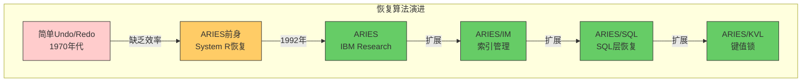
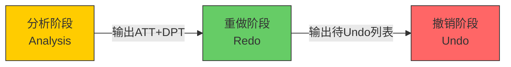
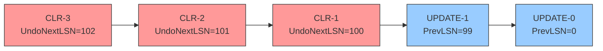
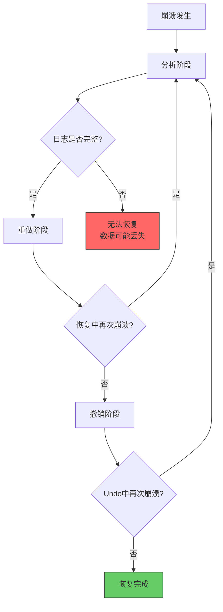

## 11.3 ARIES恢复模型

ARIES（Algorithms for Recovery and Isolation Exploiting Semantics，利用语义的恢复和隔离算法）是IBM Almaden研究中心于1992年提出的数据库恢复算法，由C. Mohan、Don Haderle、Bruce Lindsay、Hamid Pirahesh和Peter Schwarz共同设计。该论文至今已被引用超过3000次，是数据库恢复领域最具影响力的学术成果之一。

ARIES的核心思想是**生理恢复（Physiological Recovery）**——在物理层面描述页面和偏移（哪一页的哪个字节被修改），在逻辑层面描述操作语义（插入、删除、更新等）。这种混合设计使得ARIES既能处理物理页面的精确恢复，又能处理逻辑操作的语义信息。

ARIES被几乎所有现代关系数据库采用作为恢复算法的基础：PostgreSQL的WAL实现、MySQL InnoDB的Redo Log、Microsoft SQL Server的恢复引擎都深受ARIES思想影响。理解ARIES，就理解了现代数据库恢复的基石。

### 11.3.1 ARIES的历史背景

在ARIES之前，数据库系统采用的恢复算法存在诸多局限：



**早期恢复算法的问题：**

- **System R恢复**：需要在恢复期间持有独占锁，导致恢复时间与系统规模线性增长，恢复期间整个数据库不可用
- **ARJW算法（Aries/Jordan/Wiese）**：虽然引入了生理恢复思想，但Undo逻辑复杂且低效
- **ARIES的突破**：通过引入补偿日志记录（CLR）和单向Undo链，实现了O(1)的Undo恢复复杂度

ARIES相比之前方案的三大优势：

| 特性 | 传统方案 | ARIES | 优势说明 |
|------|----------|-------|----------|
| Undo机制 | 需扫描全部日志 | CLR + Prev_LSN单向链 | Undo时间从O(N)降到O(K)，K为实际需Undo的操作数 |
| 恢复期间可用性 | 需独占锁 | 恢复可并发进行 | Redo阶段不影响查询，系统更快恢复服务 |
| 实现复杂度 | 视实现而定 | 标准化、可验证 | 清晰的三阶段划分，便于正确性证明 |

### 11.3.2 ARIES的三个核心数据结构

ARIES恢复算法依赖三个核心数据结构，它们在崩溃恢复的分析阶段被构建：

**1. 活动事务表（Active Transaction Table，ATT）**

记录崩溃时刻仍然活跃（未提交也未回滚）的事务。每条记录包含：

| 字段 | 含义 | 作用 |
|------|------|------|
| TxnID | 事务的唯一标识 | 区分不同事务 |
| Status | 事务状态（Active/Committed/Aborting） | 决定是Redo还是Undo |
| LastLSN | 该事务最后一条日志的LSN | 用于沿Prev_LSN链回溯 |
| UndoNextLSN | 下一个需要Undo的LSN（仅Aborting状态） | CLR中记录，跳过已Undo的操作 |

**2. 脏页面表（Dirty Page Table，DPT）**

记录所有被修改但尚未写回磁盘的页面。每条记录包含：

| 字段 | 含义 | 作用 |
|------|------|------|
| PageID | 页面的唯一标识 | 定位物理页面 |
| RecLSN | 该页面第一次变脏时的LSN | Redo的起始点——这个页面最早需要从哪条日志开始重做 |

**3. 检查点记录（Checkpoint Record）**

定期保存的系统快照，包含ATT和DPT的完整内容，以及检查点写入时的日志序列号（CheckpointLSN）。检查点的作用是缩小恢复扫描的范围——不需要从日志文件的最开头开始扫描。

```python
class ARIESState:
    """ARIES恢复算法的核心数据结构"""
    
    def __init__(self):
        # 活动事务表：txn_id -> (status, last_lsn, undo_next_lsn)
        self.active_txn_table = {}
        # 脏页面表：page_id -> rec_lsn
        self.dirty_page_table = {}
        # 检查点LSN
        self.checkpoint_lsn = None
    
    def build_from_checkpoint(self, checkpoint_record):
        """从检查点记录重建状态"""
        self.checkpoint_lsn = checkpoint_record.lsn
        # 复制检查点中的ATT和DPT
        self.active_txn_table = dict(checkpoint_record.att)
        self.dirty_page_table = dict(checkpoint_record.dpt)
    
    def update_on_record(self, record):
        """处理单条日志记录，更新ATT和DPT"""
        txn_id = record.txn_id
        
        if record.type in ('UPDATE', 'INSERT', 'DELETE'):
            # 记录事务的最后LSN
            self.active_txn_table[txn_id] = (
                'Active', record.lsn, None
            )
            # 页面首次变脏时记录RecLSN
            if record.page_id not in self.dirty_page_table:
                self.dirty_page_table[record.page_id] = record.lsn
        
        elif record.type == 'COMMIT':
            # 事务提交，从ATT中移除
            self.active_txn_table.pop(txn_id, None)
        
        elif record.type == 'ABORT':
            # 事务中止，标记为Aborting
            self.active_txn_table[txn_id] = (
                'Aborting', record.lsn, record.lsn
            )
        
        elif record.type == 'CLR':
            # CLR记录：更新UndoNextLSN
            if txn_id in self.active_txn_table:
                status, last_lsn, _ = self.active_txn_table[txn_id]
                self.active_txn_table[txn_id] = (
                    status, record.lsn, record.undo_next_lsn
                )
```

### 11.3.3 ARIES的三个恢复阶段

ARIES恢复算法分为三个严格有序的阶段。每个阶段都有明确的输入和输出，阶段之间通过ATT和DPT传递状态。



#### 阶段1：分析阶段（Analysis）

分析阶段从最后一个检查点开始，顺序扫描所有日志记录，直到日志末尾。其目标是构建恢复所需的完整状态：哪些事务在崩溃时是活跃的、哪些页面是脏的、Redo应该从哪里开始。

**分析阶段的具体工作：**

1. **读取检查点记录**：从检查点中恢复ATT和DPT，这是分析的初始状态
2. **扫描检查点之后的所有日志**：
   - 遇到UPDATE/INSERT/DELETE记录：将对应事务加入ATT，如果页面首次变脏则在DPT中记录RecLSN
   - 遇到COMMIT记录：从ATT中移除该事务（已提交，无需Undo）
   - 遇到ABORT记录：将事务标记为Aborting状态（需要Undo）
   - 遇到CLR记录：更新对应事务的UndoNextLSN
3. **确定Redo起始LSN**：DPT中所有RecLSN的最小值，即redo_lsn = min(dpt.values())

```python
def analysis_phase(log, checkpoint_record):
    """分析阶段：从检查点扫描到日志末尾，构建ATT和DPT"""
    att = {}  # txn_id -> (status, last_lsn, undo_next_lsn)
    dpt = {}  # page_id -> rec_lsn
    
    # Step 1: 从检查点恢复初始状态
    att.update(checkpoint_record.att)
    dpt.update(checkpoint_record.dpt)
    
    # Step 2: 从检查点LSN开始扫描日志
    for record in log.scan_from(checkpoint_record.lsn):
        txn_id = record.txn_id
        
        if record.type in ('UPDATE', 'INSERT', 'DELETE'):
            # 更新事务的最后LSN
            att[txn_id] = ('Active', record.lsn, None)
            # 页面首次变脏时记录RecLSN
            if record.page_id not in dpt:
                dpt[record.page_id] = record.lsn
        
        elif record.type == 'COMMIT':
            att.pop(txn_id, None)
        
        elif record.type == 'ABORT':
            att[txn_id] = ('Aborting', record.lsn, record.lsn)
        
        elif record.type == 'CLR':
            if txn_id in att:
                status, _, _ = att[txn_id]
                att[txn_id] = (status, record.lsn, record.undo_next_lsn)
    
    # Step 3: 确定Redo起始LSN
    redo_lsn = min(dpt.values()) if dpt else checkpoint_record.lsn
    
    return att, dpt, redo_lsn
```

**分析阶段的时间复杂度**：O(N)，其中N是检查点之后的日志记录数。在生产系统中，检查点每隔几秒触发一次，因此分析阶段通常只需扫描很少的日志量。

**关键洞察**：分析阶段的输出是确定性的——无论崩溃发生在何时，分析阶段都会得到相同的结果。这是因为所有未提交事务的修改日志都已写入（WAL规则保证），分析阶段只需要正确识别这些事务即可。

#### 阶段2：重做阶段（Redo）

重做阶段是ARIES恢复中最关键的阶段。其目标是**将数据库恢复到崩溃前的精确状态**，包括已提交和未提交事务的所有修改。

为什么需要重做已提交事务？因为在崩溃前，虽然日志已持久化（WAL规则保证），但数据页面可能尚未写入磁盘。重做阶段确保所有修改都反映到磁盘上。

**Redo的判断条件**（ARIES的精确匹配规则）：

对于每条日志记录L（类型为UPDATE/INSERT/DELETE），需要重做当且仅当：
1. L对应的页面P在DPT中（即RecLSN(P)存在）
2. L.LSN >= RecLSN(P)（日志记录在页面变脏之后或同时产生）
3. P.pageLSN < L.LSN（页面的当前版本早于这条日志记录）

条件3的含义是：如果页面的pageLSN已经 >= L.LSN，说明这条日志记录的效果已经应用到磁盘上了（可能是正常的脏页写回，也可能是之前恢复时重做过），无需再次重做。

```python
def redo_phase(log, redo_lsn, dpt):
    """重做阶段：重放所有必要的修改，恢复到崩溃前状态"""
    redo_count = 0
    skip_count = 0
    
    for record in log.scan_from(redo_lsn):
        if record.type not in ('UPDATE', 'INSERT', 'DELETE'):
            continue
        
        page_id = record.page_id
        
        # 条件1：页面必须在脏页面表中
        if page_id not in dpt:
            continue
        
        # 条件2：LSN >= RecLSN（日志在页面变脏之后）
        if record.lsn < dpt[page_id]:
            continue
        
        # 获取页面（从磁盘或缓冲池）
        page = buffer_pool.fetch(page_id)
        
        # 条件3：页面当前版本早于日志记录（核心判断）
        if page.page_lsn < record.lsn:
            # 应用修改到页面
            page.apply(record.offset, record.after_image)
            # 更新页面的pageLSN
            page.page_lsn = record.lsn
            # 按需刷盘
            buffer_pool.mark_dirty(page_id)
            redo_count += 1
        else:
            skip_count += 1
    
    return redo_count, skip_count
```

**Redo阶段的性能特征**：
- 顺序扫描日志，磁盘IO效率高（顺序读比随机读快100倍以上）
- 大部分修改可能已刷盘，实际需要重做的操作很少
- 重做阶段完成后，数据库处于崩溃前的精确状态——包括所有已提交和未提交的修改

**Redo阶段的幂等性（Idempotency）**：Redo操作是幂等的——对同一条日志记录重做多次与重做一次效果相同。这是因为Redo只在pageLSN < record.lsn时才应用修改，第二次重做时pageLSN已经等于record.lsn，会被跳过。这一性质使得恢复算法在再次崩溃后仍能正确工作。

#### 阶段3：撤销阶段（Undo）

Undo阶段回滚所有在崩溃时仍然活跃（未提交）的事务。ARIES通过CLR和Prev_LSN链实现了高效的Undo机制。

**Undo的工作原理**：

1. 从ATT中获取所有需要Undo的事务的LastLSN
2. 沿每个事务的Prev_LSN链逆序回溯，对每条UPDATE/INSERT/DELETE日志应用反向操作
3. 每完成一个操作的Undo，写入一条CLR记录
4. CLR记录中的UndoNextLSN指向该事务下一个需要Undo的LSN（即原始日志的Prev_LSN）
5. 如果Undo过程中再次崩溃，恢复时CLR会被重做，但CLR不会被Undo（这是ARIES的关键性质）

```python
def undo_phase(log, att):
    """撤销阶段：回滚所有未完成的事务"""
    undo_count = 0
    
    # 收集所有需要Undo的LSN，按LSN逆序排列（从最新到最早）
    undo_stack = []
    for txn_id, (status, last_lsn, undo_next_lsn) in att.items():
        if status in ('Active', 'Aborting'):
            start_lsn = undo_next_lsn if undo_next_lsn else last_lsn
            undo_stack.append((txn_id, start_lsn))
    
    # 按LSN逆序处理（确保先处理最新操作）
    undo_stack.sort(key=lambda x: x[1], reverse=True)
    
    while undo_stack:
        txn_id, current_lsn = undo_stack.pop(0)
        
        if current_lsn is None or current_lsn == 0:
            continue  # 该事务已完全Undo
        
        record = log.read(current_lsn)
        
        if record.type == 'UPDATE':
            # 应用Undo：恢复Before Image
            page = buffer_pool.fetch(record.page_id)
            page.apply(record.offset, record.before_image)
            page.page_lsn = record.lsn  # 更新pageLSN
            buffer_pool.mark_dirty(record.page_id)
            
            # 写入CLR记录（补偿日志）
            clr = CompensationLogRecord(
                txn_id=txn_id,
                lsn=log.allocate_lsn(),
                prev_lsn=record.lsn,
                undo_next_lsn=record.prev_lsn,  # 下一个需要Undo的LSN
                redone_image=record.after_image  # CLR中的Redo信息
            )
            log.append(clr)
            
            undo_count += 1
        
        elif record.type == 'INSERT':
            # Undo INSERT = 物理删除该记录
            page = buffer_pool.fetch(record.page_id)
            page.delete(record.offset)
            page.page_lsn = record.lsn
            buffer_pool.mark_dirty(record.page_id)
            
            clr = CompensationLogRecord(
                txn_id=txn_id,
                lsn=log.allocate_lsn(),
                prev_lsn=record.lsn,
                undo_next_lsn=record.prev_lsn,
                undo_type='DELETE'
            )
            log.append(clr)
        
        elif record.type == 'DELETE':
            # Undo DELETE = 重新插入记录
            page = buffer_pool.fetch(record.page_id)
            page.insert(record.offset, record.before_image)
            page.page_lsn = record.lsn
            buffer_pool.mark_dirty(record.page_id)
            
            clr = CompensationLogRecord(
                txn_id=txn_id,
                lsn=log.allocate_lsn(),
                prev_lsn=record.lsn,
                undo_next_lsn=record.prev_lsn,
                undo_type='INSERT'
            )
            log.append(clr)
        
        # 继续沿Prev_LSN链回溯
        if record.prev_lsn and record.prev_lsn != 0:
            undo_stack.append((txn_id, record.prev_lsn))
            undo_stack.sort(key=lambda x: x[1], reverse=True)
    
    return undo_count
```

**Undo阶段的关键性质**：

- **CLR不会被Undo**：即使在Undo过程中再次崩溃，恢复时分析阶段会识别出这些CLR，重做阶段会重放CLR的效果，但Undo阶段不会再次Undo CLR。这是通过CLR不包含Before Image实现的——没有Undo信息，自然无法Undo
- **UndoNextLSN的跳过能力**：如果一个事务在崩溃前已经开始回滚（部分操作已被Undo），CLR中的UndoNextLSN可以跳过已Undo的操作，避免重复Undo
- **Undo的原子性**：每个Undo操作都伴随一条CLR的写入，确保Undo操作本身也是可恢复的

### 11.3.4 补偿日志记录（CLR）详解

CLR（Compensation Log Record）是ARIES中最精妙的设计之一，它解决了传统恢复算法中"Undo信息可能丢失"的问题。

**CLR的核心思想**：每执行一次Undo操作，就写入一条CLR。CLR本质上是"Undo操作的Redo记录"——它记录了Undo操作做了什么（Redo信息），但不记录如何撤销它（没有Before Image）。这样，如果恢复过程中再次崩溃，重做阶段可以重放CLR的效果，而Undo阶段不会再次Undo CLR。

**CLR的结构**：

| 字段 | 含义 | 与普通日志的区别 |
|------|------|------------------|
| LSN | CLR自身的日志序列号 | 与普通日志相同 |
| Prev_LSN | 前一条日志的LSN | 指向被Undo的原始日志 |
| TxnID | 事务ID | 与普通日志相同 |
| Type | 固定为'CLR' | 区别于UPDATE/INSERT/DELETE |
| UndoNextLSN | 下一个需要Undo的LSN | CLR独有字段 |
| RedoImage | Undo操作的Redo信息 | 相当于普通日志的After Image |

**CLR的单向链结构**：

CLR通过Prev_LSN形成一个单向链，链的头部是事务的最后一条日志（可能是CLR也可能是普通日志），链的尾部是该事务的第一条日志。恢复时，Undo阶段沿这个链从头到尾回溯，执行每个操作的反向操作。



**CLR的正确性保证**：

1. **幂等性**：CLR的重做是幂等的，多次重做效果相同
2. **不可Undo性**：CLR不包含Before Image，因此Undo阶段无法也不会Undo CLR
3. **跳过能力**：UndoNextLSN允许跳过已Undo的操作，避免重复回滚
4. **向前兼容**：CLR在恢复的任何阶段都安全——分析阶段正确识别，重做阶段正确重放

**CLR在实际数据库中的实现**：

在MySQL InnoDB中，CLR对应的是"ROLLBACK"类型的Undo Log记录。PostgreSQL虽然不直接使用"CLR"术语，但其Undo机制中的"反向操作日志"本质上就是CLR的变体。

### 11.3.5 ARIES的正确性证明

ARIES恢复算法的正确性依赖于两个核心性质：

**性质1：幂等性（Idempotency）**

Redo阶段的重做操作是幂等的——对同一条日志记录重做多次，效果与重做一次相同。这通过pageLSN实现：第一次重做后pageLSN被更新为record.lsn，后续重做时由于pageLSN >= record.lsn而被跳过。

**性质2：恢复终止性（Termination）**

Undo阶段必然终止，不会陷入无限循环。这通过两个机制保证：
- 每个事务的Prev_LSN链是有限的（事务的日志记录数有限）
- CLR的UndoNextLSN确保不会重复Undo同一个操作

**ARIES的正确性定理**：在满足WAL规则的系统中，ARIES恢复算法保证：
1. 所有已提交事务的修改最终反映在磁盘上（Durability）
2. 所有未提交事务的修改最终被回滚（Atomicity）
3. 恢复算法本身是可恢复的——即使在恢复过程中再次崩溃，算法仍能正确终止



### 11.3.6 检查点机制

ARIES的检查点机制是恢复效率的关键。检查点定期将ATT和DPT的快照写入日志，使得恢复时不需要从日志文件的最开头开始扫描。

**模糊检查点（Fuzzy Checkpoint）**：

ARIES采用模糊检查点——在写入检查点时不要求所有脏页面都刷盘。检查点记录只包含ATT和DPT的内容，不强制任何IO操作。这使得检查点的开销极低，可以频繁触发。

检查点记录的结构：

┌─────────────────────────────────────────┐
│ Checkpoint Record                       │
├─────────────────────────────────────────┤
│ LSN          │ 检查点记录自身的LSN      │
│ Type         │ 固定为'CHECKPOINT'       │
│ ATT          │ 活动事务表快照           │
│ DPT          │ 脏页面表快照             │
│ CheckpointLSN│ 检查点开始时的最小LSN    │
└─────────────────────────────────────────┘

**检查点的触发时机**：

| 触发条件 | 典型配置 | 说明 |
|----------|----------|------|
| 时间间隔 | 每30秒-5分钟 | 定期触发，平衡恢复时间和检查点开销 |
| 日志文件大小 | 每256MB-1GB | 防止日志文件过大导致恢复时间过长 |
| 脏页面数量 | 超过缓冲池的50%-70% | 防止缓冲池压力过大 |
| 手动触发 | DBA操作 | 维护或升级前的手动检查点 |

**检查点对恢复时间的影响**：

假设检查点间隔为T秒，日志产生速率为R MB/s，则恢复时需要扫描的日志量约为 `T × R` MB。例如，检查点间隔60秒，日志速率10MB/s，则恢复只需扫描约600MB日志，相比扫描整个日志文件（可能数十GB）大大减少了恢复时间。

**检查点的实际配置建议**：

```sql
-- MySQL InnoDB 检查点配置
-- checkpoint_timeout: 检查点超时时间（秒）
SET GLOBAL innodb_checkpoint_timeout = 180;  -- 3分钟

-- PostgreSQL WAL 检查点配置
-- checkpoint_timeout: 检查点超时时间
ALTER SYSTEM SET checkpoint_timeout = '5min';

-- checkpoint_completion_target: 检查点完成目标（0.0-1.0）
-- 控制检查点IO的平滑程度
ALTER SYSTEM SET checkpoint_completion_target = 0.9;
```

### 11.3.7 ARIES的实际应用场景

**场景1：MySQL InnoDB的Redo Log**

InnoDB的Redo Log是ARIES的典型实现。其Redo Log采用物理日志（记录页面的物理修改），结合ARIES的三阶段恢复：

- **Redo Log格式**：包含日志类型、空间ID、页面号、偏移量和数据
- **Checkpoint机制**：InnoDB的checkpoint会推进"已刷盘的最小LSN"（checkpoint_lsn），确保该LSN之前的日志可以被覆盖
- **崩溃恢复流程**：读取checkpoint → 分析ATT/DPT → 重做Redo Log → 回滚Undo Log中的未提交事务

```sql
-- InnoDB Redo Log 配置
-- innodb_log_file_size: Redo Log文件大小（MySQL 8.0.30+已移除此参数）
SHOW VARIABLES LIKE 'innodb_log_file_size';

-- innodb_flush_log_at_trx_commit: 刷盘策略
-- 0: 每秒刷盘（可能丢失1秒数据）
-- 1: 每次提交刷盘（最安全，推荐生产环境）
-- 2: 每次提交写入OS缓存，每秒刷盘
SET GLOBAL innodb_flush_log_at_trx_commit = 1;

-- 查看当前LSN状态
SHOW ENGINE INNODB STATUS\G
```

**场景2：PostgreSQL的WAL**

PostgreSQL的WAL实现采用了ARIES的变体：

- **WAL日志格式**：采用逻辑+物理混合格式（与ARIES的生理恢复思想一致）
- **Full Page Write**：为防止部分写入问题，PostgreSQL在首次修改页面时写入整个页面到WAL
- **恢复过程**：分析阶段读取最后的checkpoint → 重做WAL → 回滚未完成事务

```sql
-- PostgreSQL WAL 配置
-- wal_level: WAL级别（replica默认，minimal最省空间）
ALTER SYSTEM SET wal_level = 'replica';

-- max_wal_size: WAL最大大小（触发checkpoint）
ALTER SYSTEM SET max_wal_size = '1GB';

-- checkpoint_timeout: 检查点超时时间
ALTER SYSTEM SET checkpoint_timeout = '5min';

-- full_page_write: 是否开启Full Page Write（强烈建议开启）
ALTER SYSTEM SET full_page_write = on;

-- 查看WAL状态
SELECT * FROM pg_stat_bgwriter;
```

**场景3：分布式数据库中的ARIES思想**

在分布式数据库（如CockroachDB、TiDB）中，ARIES思想被扩展到多节点场景：

- **每个节点独立维护WAL**：每个节点本地运行ARIES恢复
- **全局检查点**：通过分布式事务协调器（如Raft）确保全局一致性
- **Redo日志复制**：将Redo日志复制到其他节点，实现高可用

```sql
-- TiDB 分布式场景中的ARIES应用
-- TiKV每个Region独立维护Raft日志（类似WAL）
-- 分布式事务通过2PC保证原子性

-- 查看TiKV WAL状态
tikv-ctl --host tikv0:20160 status

-- 查看Raft日志状态
tikv-ctl --host tikv0:20160 region-properties -r <region_id>
```

**场景4：NoSQL数据库中的ARIES思想**

虽然NoSQL数据库不直接使用ARIES，但其核心思想（WAL + Redo + Undo）被广泛应用：

- **RocksDB**：采用类似的Redo-only恢复，通过WAL保证数据持久性
- **MongoDB**：journal机制是ARIES思想的简化实现
- **Cassandra**：CommitLog本质上就是WAL的变体

```bash
# RocksDB WAL 配置示例
# 在LevelDB/RocksDB中，WAL是可选的（可通过WriteOptions禁用）
# 但生产环境强烈建议开启

# 查看RocksDB WAL统计
# db_bench --benchmarks=readwhilewriting --wal_dir=/path/to/wal
```

### 11.3.8 ARIES的性能优化

在实际系统中，ARIES的性能优化主要集中在以下几个方面：

**1. 日志缓冲区优化**

日志先写入内存缓冲区，再批量刷盘，减少IO次数。日志缓冲区的大小直接影响写入性能：

| 缓冲区大小 | 刷盘频率 | 写入吞吐量 | 适用场景 |
|-----------|----------|-----------|----------|
| 1MB | 高 | 低（~10K TPS） | 开发环境 |
| 8MB | 中 | 中（~50K TPS） | 一般生产 |
| 64MB | 低 | 高（~200K TPS） | 高吞吐生产 |
| 256MB+ | 极低 | 极高（~500K+ TPS） | 超高吞吐场景 |

**2. Group Commit（组提交）**

多个并发事务的日志记录合并为一次IO刷盘，大幅减少磁盘IO次数。这是ARIES在高并发场景下性能的关键优化。

**3. 并行Redo**

在多核系统中，不同页面的Redo可以并行执行。由于Redo只修改不同页面，不存在数据竞争，天然适合并行化。

**4. 检查点与Redo的重叠**

检查点可以与正常的查询处理并行执行。模糊检查点不要求在检查点期间停止所有修改，只需在检查点记录中正确反映当时的ATT和DPT即可。

**5. 日志压缩与归档**

- **日志压缩**：使用zstd等算法压缩历史日志，减少存储空间
- **日志归档**：定期将旧日志归档到对象存储（如S3），实现长期保留

```bash
# PostgreSQL WAL 归档配置
ALTER SYSTEM SET archive_mode = on;
ALTER SYSTEM SET archive_command = 'cp %p /path/to/archive/%f';
ALTER SYSTEM SET archive_timeout = 300;  -- 5分钟强制归档

# 查看归档状态
SELECT * FROM pg_stat_archiver;
```

### 11.3.9 ARIES在现代存储技术中的适配

随着NVMe SSD、持久内存（Persistent Memory，PM）等新型存储技术的出现，ARIES也需要相应的适配优化。

**NVMe SSD对ARIES的影响**：

- **随机读写性能提升**：NVMe SSD的随机读写性能接近顺序读写，Redo阶段的随机页面访问不再是瓶颈
- **降低检查点开销**：模糊检查点的刷盘操作在NVMe上更快，可以更频繁地触发检查点
- **减少日志缓冲区需求**：更快的刷盘速度意味着更小的日志缓冲区也能满足性能要求

**持久内存对ARIES的影响**：

- **字节寻址能力**：PM支持字节寻址，ARIES可以直接在PM上操作，无需页面级别的读写
- **减少日志开销**：在PM上，数据修改可以直接持久化，WAL的角色从"持久化保证"变为"顺序化保证"
- **新的恢复模式**：ARIES/VM（Virtual Memory）变体专门针对PM优化，通过DRAM+PM的混合架构减少恢复时间

```python
# 持久内存场景下的ARIES优化思路
class ARIES_PM:
    """ARIES在持久内存上的优化实现"""
    
    def __init__(self):
        # PM上的数据区域（字节寻址）
        self.data_region = PersistentMemoryRegion()
        # DRAM上的日志缓冲区
        self.log_buffer = DRAMBuffer()
        # PM上的日志区域
        self.log_region = PersistentMemoryRegion()
    
    def redo_phase_optimized(self, redo_lsn):
        """优化后的Redo阶段：利用PM的字节寻址能力"""
        # 直接在PM上定位页面，无需页面级别的读取
        for record in self.log_region.scan_from(redo_lsn):
            if record.type in ('UPDATE', 'INSERT', 'DELETE'):
                page_addr = self.data_region.get_page_address(record.page_id)
                # 直接在PM上检查pageLSN
                if page_addr.page_lsn < record.lsn:
                    # 直接在PM上应用修改
                    page_addr.apply(record.offset, record.after_image)
                    page_addr.page_lsn = record.lsn
    
    def checkpoint_optimized(self):
        """优化后的检查点：利用PM的原子写入能力"""
        # PM支持8字节原子写入，可以安全地更新检查点
        self.log_region.write_checkpoint(
            att=self.active_txn_table,
            dpt=self.dirty_page_table,
            lsn=self.current_lsn
        )
```

### 11.3.10 ARIES的常见误区

**误区1：ARIES只处理Redo，不处理Undo**

纠正：ARIES完整覆盖Redo和Undo两个阶段。Redo确保所有修改（包括未提交的）都应用到磁盘，Undo回滚所有未提交事务。两者缺一不可。

**误区2：恢复时间与数据库大小成正比**

纠正：恢复时间与检查点间隔和日志产生速率相关，与数据库总大小无关。只要检查点足够频繁，恢复时间可以控制在秒级。

**误区3：CLR增加了恢复开销**

纠正：CLR恰恰减少了恢复开销。没有CLR，恢复时需要扫描所有日志来判断哪些操作需要Undo。有了CLR和UndoNextLSN，恢复时直接沿CLR链跳过已Undo的操作，时间复杂度从O(N)降到O(K)，K为实际需要Undo的操作数。

**误区4：ARIES的Redo阶段会重做所有日志**

纠正：Redo阶段只重做DPT中页面对应的日志，且只在pageLSN < record.lsn时才真正应用修改。大部分页面可能已经刷盘，Redo阶段通常是轻量级的。

**误区5：ARIES保证恢复一定成功**

纠正：ARIES依赖WAL规则——如果日志本身丢失或损坏（例如磁盘故障），恢复无法保证完整性。ARIES保证的是：在日志完整的前提下，恢复算法一定能正确执行并终止。

**误区6：检查点会阻塞正常操作**

纠正：ARIES的模糊检查点不要求在检查点期间停止所有修改。检查点只需要记录当时的ATT和DPT快照，可以与正常查询处理并行执行。

**误区7：恢复期间数据库完全不可用**

纠正：ARIES的Redo阶段可以并发进行查询处理。只有Undo阶段需要独占资源，但通常Undo时间很短（取决于未提交事务数量）。

### 11.3.11 ARIES恢复算法的完整流程示例

为了加深理解，以下展示一个完整的ARIES恢复示例：

**初始状态**：
- 检查点LSN=100，检查点中的ATT={T1:(Active,90), T2:(Active,85)}，DPT={P1:80, P2:90}
- 日志序列：LSN 101-110为检查点之后的日志

**日志记录**：

| LSN | Type | TxnID | PageID | Before | After | Prev_LSN |
|-----|------|-------|--------|--------|-------|----------|
| 101 | UPDATE | T1 | P1 | A | A' | 90 |
| 102 | UPDATE | T2 | P2 | B | B' | 85 |
| 103 | UPDATE | T1 | P1 | A' | A'' | 101 |
| 104 | COMMIT | T1 | - | - | - | 103 |
| 105 | UPDATE | T2 | P3 | C | C' | 102 |
| 106 | UPDATE | T3 | P1 | A'' | A''' | 0 |
| 107 | UPDATE | T3 | P2 | B' | B'' | 106 |
| 108 | COMMIT | T3 | - | - | - | 107 |
| 109 | UPDATE | T2 | P1 | A''' | A'''' | 105 |
| - | **CRASH** | | | | | |

**分析阶段**：
- ATT = {T2:(Active,109)}（T1已提交，T3已提交，只有T2活跃）
- DPT = {P1:80, P2:90, P3:105}（P3首次变脏在LSN 105）
- redo_lsn = min(80, 90, 105) = 80

**重做阶段**：
- 从LSN=80开始扫描
- LSN 80的记录：P1.pageLSN可能 < 80？需要重做
- LSN 101-109：逐条检查pageLSN，应用需要重做的修改
- 重做完成后，数据库状态与崩溃前完全一致（包括T2的未提交修改）

**撤销阶段**：
- ATT = {T2:(Active,109)}
- 从LSN=109开始Undo T2
- Undo LSN 109：恢复P1的Before Image (A''')，写CLR(undo_next=105)
- Undo LSN 105：恢复P3的Before Image (C)，写CLR(undo_next=102)
- Undo LSN 102：恢复P2的Before Image (B)，写CLR(undo_next=85)
- Undo LSN 85：该记录在检查点之前，已通过检查点处理
- T2完全Undo，恢复完成

### 11.3.12 ARIES的变体与扩展

随着数据库技术的发展，ARIES也衍生出多种变体：

| 变体 | 针对场景 | 核心改进 |
|------|----------|----------|
| ARIES/IM | 索引管理 | 针对B+树等索引结构的恢复优化，支持跨页面操作 |
| ARIES/SQL | SQL层恢复 | 支持SQL层的Undo操作（如约束违反的回滚） |
| ARIES/KVL | 键值锁 | 在恢复期间维护锁信息，减少恢复后的锁冲突 |
| ARIES/SD | 软删除 | 针对软删除场景的优化恢复 |
| ARIES+TLS | 分布式 | 结合TLS的分布式ARIES实现 |
| ARIES/VM | 虚拟内存 | 针对持久内存优化，利用字节寻址能力 |
| ARIES/MV | 多版本 | 支持多版本并发控制（MVCC）的恢复优化 |

**ARIES/IM的特殊性**：在索引管理中，一个逻辑操作可能跨多个物理页面（如B+树分裂），ARIES/IM通过逻辑Undo Log解决这类问题——不是回滚物理修改，而是回滚逻辑操作。

**ARIES在NoSQL中的应用**：虽然NoSQL数据库不直接使用ARIES，但其核心思想（WAL + Redo + Undo）被广泛应用。例如RocksDB的WAL采用类似的Redo-only恢复，MongoDB的journal机制也是ARIES思想的简化实现。

### 11.3.13 ARIES与其他恢复算法的对比

| 恢复算法 | 恢复类型 | Undo机制 | CLR支持 | 并发恢复 | 典型应用 |
|----------|----------|----------|---------|----------|----------|
| ARIES | 生理恢复 | CLR + Prev_LSN | 支持 | 支持 | PostgreSQL, MySQL InnoDB |
| Simple Undo/Redo | 物理恢复 | 全量Undo | 不支持 | 不支持 | 早期数据库 |
| No-Undo/Redo | 物理恢复 | 无需Undo | N/A | 支持 | 仅Redo系统 |
| ARIES/IM | 逻辑恢复 | 逻辑Undo | 支持 | 支持 | 索引管理 |
| Shadow Paging | 物理恢复 | 恢复旧版本 | N/A | 不支持 | 早期文件系统 |

**关键对比点**：ARIES的生理恢复在灵活性和效率之间取得了最佳平衡。物理恢复效率高但不支持逻辑操作，逻辑恢复灵活但开销大。ARIES通过在物理层面描述页面修改、在逻辑层面描述操作语义，兼顾了两者的优势。

### 11.3.14 本节小结

ARIES恢复算法是现代数据库恢复的理论基础，其核心贡献包括：

1. **生理恢复范式**：结合物理和逻辑层面的信息，实现高效且灵活的恢复
2. **三阶段恢复**：分析 → Redo → Undo，每个阶段职责清晰，可正确性证明
3. **CLR机制**：通过补偿日志记录实现高效的Undo，保证恢复的幂等性和终止性
4. **模糊检查点**：低开销的检查点机制，将恢复时间控制在可预测范围内
5. **Prev_LSN链**：高效的事务回溯机制，避免全量日志扫描

理解ARIES不仅有助于深入理解数据库恢复机制，也为设计高可靠系统提供了理论指导。在实际工程中，ARIES的思想被广泛应用——从关系数据库到分布式存储，从文件系统到消息队列，WAL + Redo + Undo的组合是保证数据持久性和一致性的基石。

**延伸阅读**：
- C. Mohan et al., "ARIES: A Transaction Recovery Method Supporting Fine-Granularity Locking and Partial Rollbacks Using Write-Ahead Logging", ACM TODS, 1992
- C. Mohan, "ARIES/IM: An Efficient and High Concurrency Index Management Method Using Write-Ahead Logging", 1992
- PostgreSQL Documentation: "Write-Ahead Log"
- MySQL Documentation: "InnoDB Redo Log"
