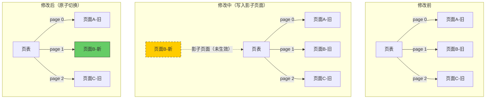
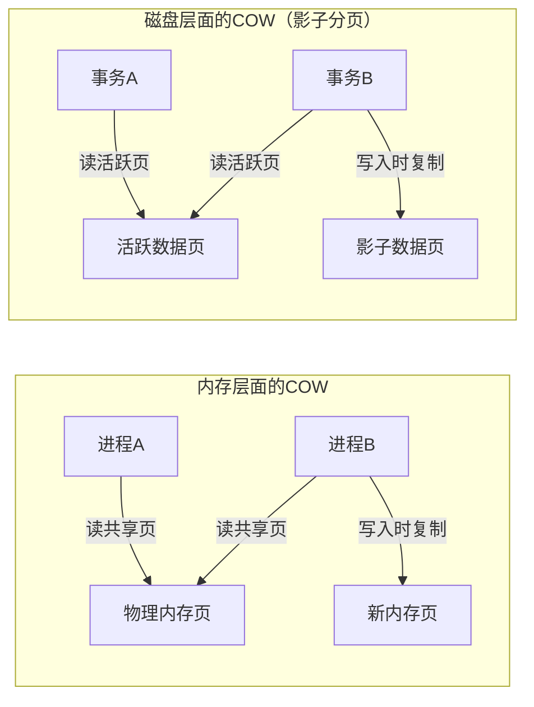
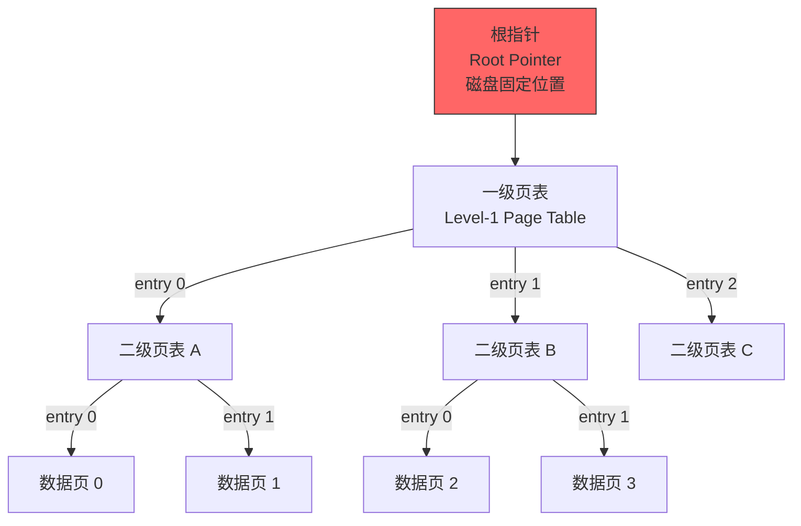
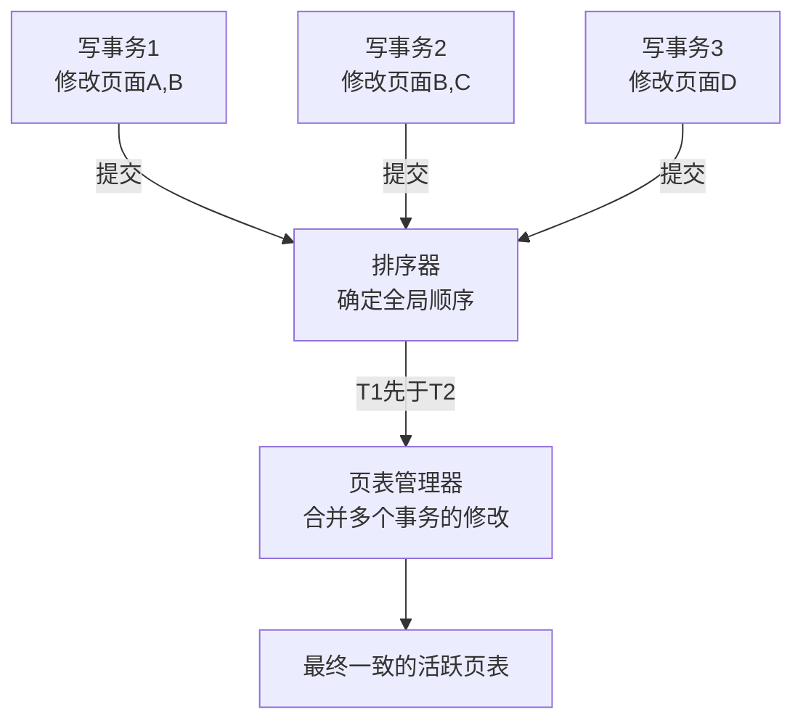
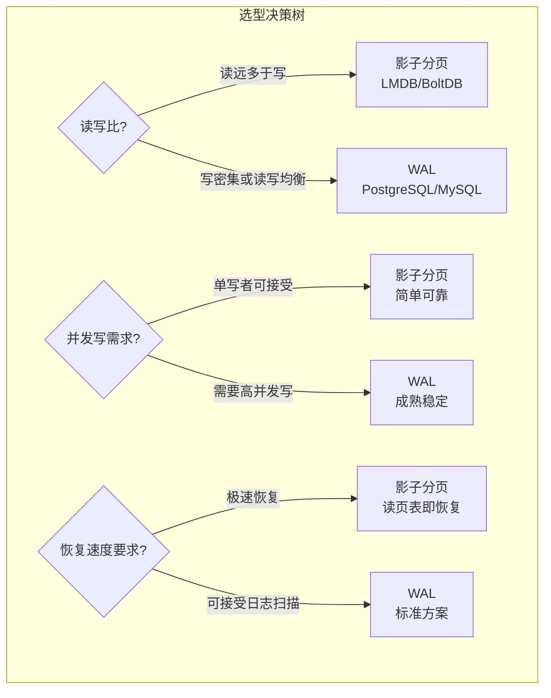
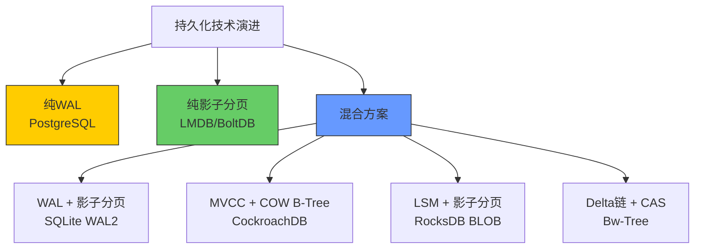

## 11.4 影子分页技术

影子分页（Shadow Paging）是数据库事务持久化领域中与WAL并列的两大核心技术路线之一。如果说WAL的思路是"先记日志再改数据"，那么影子分页的思路则是"从不改旧数据，只写新副本"。这种Copy-on-Write的设计哲学赋予了影子分页天然的原子性和崩溃恢复能力，使其成为LMDB、BoltDB等现代嵌入式数据库的首选持久化方案。

### 11.4.1 历史渊源与核心思想

**历史背景**

影子分页最早由 Elliott 和 Stumm 在1978年的论文 *"Shadow Paging Database Techniques"* 中提出，最初应用于 Multics 操作系统的文件系统。该论文的核心洞察是：如果永远不原地修改数据，而是将修改写入新位置并原子地切换指针，那么崩溃恢复就变得异常简单——因为数据库要么处于修改前的完整状态，要么处于修改后的完整状态，不可能处于中间态。

这一思想在1980年代被 Jim Gray 的事务处理理论进一步形式化，后来成为嵌入式数据库持久化的核心范式。2000年代末，Howard Chu 在开发 LMDB 时将影子分页与 mmap 结合，创造出了一种读性能接近内存操作、写性能优于WAL的嵌入式KV存储方案，重新引发了工业界对影子分页的关注。

**核心思想：不修改，只复制**

传统数据库采用就地更新（In-Place Update）策略：事务修改数据时，直接在原页面上覆盖写入。这种方式虽然简单高效，但带来了一个根本性问题——**如果写入过程中系统崩溃，页面可能处于半写状态，原始数据和新数据都不可用**。为了解决这个问题，WAL选择在修改前先写日志，而影子分页选择了另一条路：**永远不在原地修改数据**。

影子分页的核心规则：

- **写入新页面**：每次修改数据时，将修改后的数据写入磁盘上的一个**全新页面**（称为影子页面），原页面保持不变
- **更新指针**：所有修改完成后，原子性地更新指向这些页面的指针（页表），使其从旧页面指向新页面
- **崩溃安全**：如果在更新指针之前崩溃，旧指针仍然有效，数据库自动回退到修改前的完整一致状态
- **垃圾回收**：旧页面在确认不再被任何活跃事务引用后，可以被安全回收重用



**形式化定义**

从形式化角度看，影子分页维护一个**映射函数** `f: L → P`，将逻辑页面号（Logical Page）映射到物理磁盘地址（Physical Address）。事务执行期间：

1. 创建映射函数的副本 `f'`，对需要修改的逻辑页 `l`，设置 `f'(l) = allocate()` 并将新数据写入该物理地址
2. 事务提交时，通过原子操作将 `f` 替换为 `f'`
3. 崩溃时，`f` 未被替换，数据库保持一致状态

这个模型的关键性质是：**映射函数的切换是原子的**，因此数据库在任何时刻都处于一个明确定义的一致状态。

### 11.4.2 影子分页的工作流程

影子分页的完整事务执行流程可以分为以下步骤：

**步骤1：事务开始，记录当前页表快照**

事务启动时，系统记录当前的活跃页表（Active Page Table）。这个页表定义了逻辑页面号到物理磁盘地址的映射关系。页表本身也是一个数据结构，需要持久化存储。

```python
class ShadowPageTable:
    """影子分页的页表管理"""
    
    def __init__(self, disk):
        self.disk = disk
        self.active_page_table = {}   # 逻辑页号 -> 物理磁盘地址
        self.shadow_page_table = {}   # 修改期间的新映射
    
    def begin_transaction(self):
        """事务开始：记录当前页表快照"""
        self.shadow_page_table = dict(self.active_page_table)
```

**步骤2：事务执行修改，写入影子页面**

当事务需要修改某个页面时，系统不修改原页面，而是将修改后的完整页面写入磁盘上的一个新位置，然后在影子页表中更新对应的映射。

```python
    def write_page(self, logical_page, new_data):
        """写入影子页面"""
        # 1. 分配一个新的物理磁盘块
        new_physical_addr = self.disk.allocate_block()
        
        # 2. 将修改后的完整页面写入新位置
        self.disk.write(new_physical_addr, new_data)
        
        # 3. 在影子页表中更新映射（不触碰活跃页表）
        self.shadow_page_table[logical_page] = new_physical_addr
```

**步骤3：事务提交，原子更新页表**

所有修改都成功写入磁盘后，系统将影子页表的内容原子性地替换为新的活跃页表。这一步是影子分页原子性的关键。

```python
    def commit(self):
        """提交：原子性地切换页表"""
        # 1. 将影子页表本身写入磁盘（持久化）
        new_pt_addr = self.disk.allocate_block()
        self.disk.write(new_pt_addr, serialize(self.shadow_page_table))
        
        # 2. 原子性地更新"根指针"（指向当前活跃页表的位置）
        # 根指针只有一个，更新它本身就是原子操作
        self.disk.write_root_pointer(new_pt_addr)
        
        # 3. 刷新到磁盘，确保持久化
        self.disk.flush()
        
        # 4. 切换活跃页表
        self.active_page_table = self.shadow_page_table
```

**步骤4：事务中止，丢弃影子页面**

如果事务需要回滚，系统只需丢弃影子页表和所有新写入的影子页面，活跃页表保持不变。

```python
    def abort(self):
        """回滚：丢弃影子页面，保留原页面"""
        # 释放所有新分配的影子页面
        for logical_page, new_addr in self.shadow_page_table.items():
            if new_addr != self.active_page_table.get(logical_page):
                self.disk.free_block(new_addr)
        
        # 丢弃影子页表
        self.shadow_page_table.clear()
```

**时序分析**

一次典型的影子分页写操作的磁盘IO时序如下：

| 阶段 | 操作 | IO类型 | 次数 |
|------|------|--------|------|
| 事务执行 | 分配新块 | 内存/元数据 | O(1) |
| 事务执行 | 写入影子数据页 | 随机写 | 每修改页1次 |
| 提交阶段 | 写入新页表节点 | 随机写 | 每级页表1次 |
| 提交阶段 | 更新根指针 | 顺序写 | 1次 |
| 提交阶段 | fsync刷盘 | 同步IO | 1次 |
| **总计** | | | **修改页数 × (1+级数) + 2** |

对比WAL模式的一次修改：1次顺序追加日志记录 + 1次延迟的脏页写回，可以看出影子分页在写入开销上确实更大。

### 11.4.3 崩溃恢复机制

影子分页最优雅的特性之一就是其崩溃恢复的简洁性。与WAL需要复杂的分析-重做-撤销三阶段不同，影子分页的恢复过程几乎不需要任何额外的日志分析：

**恢复规则极其简单**：系统启动时，只需读取根指针，找到当前活跃页表即可。所有不在活跃页表中的影子页面都是无效的，可以被回收。

```python
def recover(disk):
    """影子分页的崩溃恢复"""
    # 1. 读取根指针，获取当前活跃页表地址
    root_ptr = disk.read_root_pointer()
    
    # 2. 加载活跃页表
    active_page_table = disk.read(root_ptr)
    
    # 3. 验证页表完整性
    for logical_page, physical_addr in active_page_table.items():
        if not verify_checksum(disk.read(physical_addr)):
            raise CorruptedPageError(
                f"数据页 {physical_addr} 校验和不匹配"
            )
    
    # 4. 扫描磁盘，找出所有不属于活跃页表的页面
    allocated_blocks = disk.scan_all_blocks()
    used_blocks = set(active_page_table.values())
    orphan_blocks = allocated_blocks - used_blocks
    
    # 5. 回收孤立的影子页面
    for block in orphan_blocks:
        disk.free_block(block)
    
    return active_page_table
```

这种恢复机制的优势在于：

| 恢复特性 | WAL方式 | 影子分页方式 |
|----------|---------|-------------|
| 恢复数据来源 | 日志记录 + 数据页 | 仅数据页本身 |
| 恢复算法复杂度 | O(N) 扫描日志 | O(P) 扫描页表（P为页数） |
| 恢复时间 | 与日志量成正比 | 与数据库大小成正比 |
| 需要额外日志 | 是（WAL本身） | 否 |
| 需要Undo机制 | 是（未提交事务） | 否（未提交的自然不存在于活跃页表中） |
| 恢复失败风险 | 日志损坏可能导致数据丢失 | 页表损坏是唯一风险点 |

**恢复时间的数学分析**

假设数据库总大小为 `D` 字节，页大小为 `P` 字节，则总页数为 `D/P`。影子分页恢复需要：

1. 读取根指针：1次IO
2. 读取根页表节点：1次IO
3. 遍历所有页表节点验证校验和：`D/P × (1/级数)` 次IO（假设页表节点也有缓存）
4. 回收孤立页面（可后台异步执行）

对于一个1GB的数据库（页大小4KB），总页数约26万，恢复时需要验证的数据量约26万 × 4KB ≈ 1GB。在SSD上这大约需要几秒到十几秒，在HDD上可能需要几十秒。

关键优化：许多实现（如LMDB）在恢复时并不立即执行全量扫描和回收，而是**延迟到下一次写事务开始时再执行**，这样恢复本身几乎是瞬间完成的。

### 11.4.4 与Copy-on-Write（COW）的关系

影子分页本质上是Copy-on-Write（写时复制）技术在磁盘持久化层面的应用。COW最早应用于内存管理领域——当进程尝试修改共享内存页时，操作系统才复制该页并赋予进程独立的副本。

影子分页将这一思想从内存延伸到了磁盘：



两者的关键差异：

| 维度 | 内存COW | 磁盘COW（影子分页） |
|------|---------|---------------------|
| 触发机制 | MMU页表保护位，硬件中断 | 数据库软件逻辑判断 |
| 持久性 | 临时（进程退出即失效） | 持久化（通过根指针固化到磁盘） |
| 粒度 | 操作系统内存页（通常4KB） | 数据库页面（4KB-16KB不等） |
| 管理成本 | 内核自动管理，对应用透明 | 数据库自行管理垃圾回收 |
| 性能开销 | 首次写入触发页错误（~微秒级） | 每次写入都需要分配+写新块（~毫秒级） |
| 原子性保证 | 单次指针赋值即原子 | 依赖硬件原子扇区写或双指针策略 |

### 11.4.5 根指针与多级页表

影子分页的"原子性切换"依赖于一个关键的数据结构设计——**根指针（Root Pointer）**。根指针是系统中唯一指向当前活跃页表的指针，它的更新必须是原子的。

**根指针的存储与原子更新**

根指针通常存储在数据库文件的固定偏移位置（如文件开头的前8字节）。为了保证更新的原子性，工程实践中有三种策略：

**策略一：硬件原子扇区写**

现代磁盘和SSD支持原子扇区写入。4KB扇区对齐的写入在断电时要么完全成功，要么完全不发生。因此，将根指针存储在4KB对齐的位置，一次写入即可保证原子性。这是LMDB和BoltDB采用的方案。

```python
class AtomicRootPointer:
    """利用4KB对齐保证原子写入"""
    
    ROOT_OFFSET = 0  # 文件起始位置，天然4KB对齐
    ROOT_SIZE = 8    # 根指针大小（字节）
    
    def update_root(self, disk, new_page_table_addr):
        """原子更新根指针——单次4KB扇区写入"""
        # 将新地址写入缓冲区
        buffer = struct.pack('<Q', new_page_table_addr)
        buffer += b'\x00' * (4096 - self.ROOT_SIZE)  # 填充到4KB
        
        # 一次原子写入——断电要么完整写入，要么不写入
        disk.write_aligned(self.ROOT_OFFSET, buffer)
        disk.flush()  # 确保持久化到非易失存储
```

**策略二：双根指针交替（Log-structured Root）**

对于不保证原子扇区写的存储介质，可以使用两个根指针槽位交替写入。每次提交时写入另一个槽位，并在头部记录一个序列号（epoch）。恢复时选择序列号更大的有效槽位。

```python
class DualRootPointer:
    """双根指针交替写入，不依赖硬件原子性"""
    
    def __init__(self):
        self.epoch = 0
    
    def update_root(self, disk, new_addr):
        self.epoch += 1
        slot = self.epoch % 2  # 交替使用槽位0和槽位1
        
        # 写入序列号 + 新地址到对应槽位
        record = struct.pack('<QQ', self.epoch, new_addr)
        disk.write(slot * 4096, record)  # 每个槽位占一个4KB块
        disk.flush()
    
    def recover_root(self, disk):
        """读取两个槽位，选择epoch更大的有效那个"""
        r0 = disk.read(0)
        r1 = disk.read(4096)
        epoch0, addr0 = struct.unpack('<QQ', r0[:16])
        epoch1, addr1 = struct.unpack('<QQ', r1[:16])
        
        # 选择epoch更大的，若相等则0号槽位有效
        if epoch0 >= epoch1:
            return addr0 if self._valid(disk, addr0) else addr1
        else:
            return addr1 if self._valid(disk, addr1) else addr0
```

**策略三：日志结构根指针**

将根指针更新作为一条追加记录写入一个小型日志文件中。每次提交时追加一条记录，恢复时从日志末尾回溯找到最后一条有效记录。这种方案本质上将根指针管理退化为一个微型WAL。

**多级页表的写入策略**

在实际实现中，页表通常不是单级的，而是多级结构，类似于操作系统的多级页表：



**多级页表的写入策略**：

当修改一个数据页时，需要更新从根到叶的完整路径上的所有页表节点。假设一个数据库有2^20个逻辑页面，使用3级页表（每级10位）：

1. 三级页表（叶节点）：修改目标数据页的映射 → 写入新的三级页表节点
2. 二级页表：更新指向新三级页表的指针 → 写入新的二级页表节点
3. 一级页表：更新指向新二级页表的指针 → 写入新的一级页表节点
4. 根指针：更新指向新一级页表 → 写入新的根指针

这意味着**每次页面修改都需要写入4个磁盘块**（3个页表节点 + 1个数据页），再加上根指针的更新。这是影子分页的主要性能开销。

```python
def write_with_multilevel_pt(logical_page, new_data, disk):
    """多级页表下的影子分页写入"""
    # 解析逻辑页号为各级索引
    idx_l1 = (logical_page >> 20) &amp; 0x3FF
    idx_l2 = (logical_page >> 10) &amp; 0x3FF
    idx_l3 = logical_page &amp; 0x3FF
    
    # 1. 写入新的数据页
    new_data_addr = disk.allocate_and_write(new_data)
    
    # 2. 复制并更新三级页表
    new_l3 = disk.copy_page(old_l3_addr)
    new_l3[idx_l3] = new_data_addr
    new_l3_addr = disk.allocate_and_write(new_l3)
    
    # 3. 复制并更新二级页表
    new_l2 = disk.copy_page(old_l2_addr)
    new_l2[idx_l2] = new_l3_addr
    new_l2_addr = disk.allocate_and_write(new_l2)
    
    # 4. 复制并更新一级页表
    new_l1 = disk.copy_page(old_l1_addr)
    new_l1[idx_l1] = new_l2_addr
    new_l1_addr = disk.allocate_and_write(new_l1)
    
    # 5. 原子更新根指针
    disk.write_root_pointer(new_l1_addr)
    disk.flush()
```

**各级页表的扇出与高度计算**

页表的扇出（Fan-out）取决于页大小和指针大小。假设页大小为4KB（4096字节），指针为8字节（64位地址），则每级页表可容纳 4096/8 = 512 个条目。不同级数能寻址的逻辑页面数：

| 页表级数 | 每级扇出 | 可寻址逻辑页面数 | 可寻址空间（4KB页） |
|----------|----------|-------------------|---------------------|
| 1级 | 512 | 512 | 2MB |
| 2级 | 512 | 262,144 (2^18) | 1GB |
| 3级 | 512 | 134,217,728 (2^27) | 512GB |
| 4级 | 512 | 68,719,476,736 (2^36) | 256TB |

对于绝大多数嵌入式数据库场景，2-3级页表已经足够。LMDB使用B+树而非传统页表，树的高度通常为3-4层，效果类似。

### 11.4.6 写放大问题与优化

从上面的分析可以看出，影子分页面临一个严重的**写放大（Write Amplification）**问题：修改1个数据页面，需要额外写入3个页表节点，写放大比为4倍。在多级页表层数更多时，写放大会进一步恶化。

写放大的量化分析：

| 数据库大小 | 页表级数 | 修改1页的总写入 | 写放大比 |
|------------|----------|-----------------|----------|
| < 2MB | 1 | 2页（1数据+1页表） | 2× |
| < 1GB | 2 | 3页 | 3× |
| < 512GB | 3 | 4页 | 4× |
| < 256TB | 4 | 5页 | 5× |

对于SSD而言，写放大不仅增加延迟，还会加速SSD的写入磨损（SSD闪存块的擦写寿命有限）。因此，控制影子分页的写放大对SSD友好性至关重要。

针对这一问题，工程实践中发展出多种优化策略：

**优化一：脏页日志（Dirty Page Log）**

在事务执行期间，不立即更新中间层的页表节点，而是将所有修改记录到一个小型的脏页日志中。提交时，一次性将脏页日志和修改过的叶节点写入磁盘，然后更新根指针。这减少了事务期间的随机IO次数。

```python
class OptimizedShadowPaging:
    """带脏页日志的影子分页优化"""
    
    def __init__(self):
        self.dirty_log = []  # 脏页日志：记录 (逻辑页, 新物理地址)
    
    def write_page(self, logical_page, new_data):
        new_addr = self.disk.allocate_and_write(new_data)
        # 只记录叶节点级别的修改
        self.dirty_log.append((logical_page, new_addr))
    
    def commit(self):
        # 批量更新所有层级的页表
        self._batch_update_page_tables()
        self.dirty_log.clear()
```

**优化二：批量提交（Batch Commit）**

多个小事务合并为一次页表切换，避免频繁的根指针更新。这在高并发场景下尤为重要。具体做法是维护一个待提交的修改队列，当队列积累到一定数量或超过时间阈值时，一次性执行提交。

批量提交的效果：
- 根指针更新频率：从每事务1次降低到每批1次
- 磁盘刷盘次数：从每事务1次fsync降低到每批1次
- 吞吐量提升：典型场景下可提升3-10倍

**优化三：部分页表缓存**

将高频访问的页表节点缓存在内存中，减少磁盘读取次数。BoltDB正是采用了这种策略，将最热的B+树节点保持在内存映射中。

```python
class CachedPageTable:
    """带内存缓存的页表"""
    
    def __init__(self, disk, cache_size=1024):
        self.disk = disk
        self.cache = OrderedDict()  # LRU缓存
        self.cache_size = cache_size
    
    def get_page_table_node(self, addr):
        """读取页表节点，优先从缓存获取"""
        if addr in self.cache:
            self.cache.move_to_end(addr)
            return self.cache[addr]
        
        node = self.disk.read(addr)
        
        if len(self.cache) >= self.cache_size:
            self.cache.popitem(last=False)  # 淘汰最久未访问的
        self.cache[addr] = node
        
        return node
```

LMDB的做法更为激进：它利用mmap将整个数据库文件映射到进程的虚拟地址空间，操作系统负责页面的缓存和换入换出。读事务完全在用户态完成，无需任何系统调用，读性能接近内存操作。

**优化四：写放大感知的页面布局**

通过将频繁修改的页面聚集在一起，减少修改单个页面时需要复制的页表节点数量。如果一页中的多个逻辑页面共享相同的页表祖先节点，那么批量修改这些页面时，共同祖先节点只需要复制一次。

```python
def batch_write_optimized(modifications, disk):
    """批量写入优化：合并共享祖先的修改"""
    # 按页表路径分组
    groups = defaultdict(list)
    for logical_page, new_data in modifications:
        path = get_page_table_path(logical_page)
        groups[path[:2]].append((logical_page, new_data))
    
    # 对每组只复制一次共享的祖先节点
    for shared_ancestors, pages in groups.items():
        ancestor_copy = disk.copy_page(shared_ancestors[-1])
        for logical_page, new_data in pages:
            write_to_copied_ancestors(logical_page, new_data, ancestor_copy)
```

### 11.4.7 垃圾回收策略

影子分页的另一个核心挑战是**垃圾回收（Garbage Collection）**。每当写入新的影子页面，旧页面就变成了"垃圾"。如果不及时回收，磁盘空间会持续膨胀。

**引用计数法**

最直接的方法是为每个页面维护引用计数。当某个页面不再被任何活跃事务的页表引用时，其引用计数降为零，可以被回收。

```python
class ReferenceCountingGC:
    """基于引用计数的垃圾回收"""
    
    def __init__(self, disk):
        self.disk = disk
        self.ref_counts = {}  # 物理块地址 -> 引用计数
    
    def on_page_table_swap(self, old_pt, new_pt):
        """页表切换时更新引用计数"""
        old_blocks = set(old_pt.values())
        new_blocks = set(new_pt.values())
        
        # 减少不再使用的块的引用计数
        for block in old_blocks - new_blocks:
            self.ref_counts[block] -= 1
            if self.ref_counts[block] == 0:
                self.disk.free_block(block)
        
        # 增加新使用的块的引用计数
        for block in new_blocks - old_blocks:
            self.ref_counts[block] = self.ref_counts.get(block, 0) + 1
```

引用计数法的优缺点：

| 特性 | 优势 | 劣势 |
|------|------|------|
| 回收时效 | 即时回收，空间利用率高 | 高频更新时计数器修改开销大 |
| 存储开销 | 每块4-8字节 | 对小块数据库开销显著（如4KB块+8字节计数=0.2%） |
| 实现复杂度 | 简单直观 | 需要处理引用计数溢出和循环引用 |
| 并发安全 | 需要原子操作或锁保护 | 计数器更新可能成为热点 |

**空闲空间位图法**

另一种更实用的方案是维护一个空闲空间位图。系统定期扫描所有活跃页表，标记所有正在使用的页面，然后将未标记的页面加入空闲列表。

```python
class BitmapGC:
    """基于位图的垃圾回收"""
    
    def collect(self, active_page_table):
        """全量垃圾回收"""
        # 1. 构建活跃页面集合
        used_blocks = set(active_page_table.values())
        
        # 2. 扫描所有已分配的块
        all_blocks = self.disk.get_all_allocated_blocks()
        
        # 3. 回收不在活跃集合中的块
        freed = 0
        for block in all_blocks:
            if block not in used_blocks:
                self.disk.free_block(block)
                freed += 1
        
        return freed
```

**LSM-Tree启发的合并策略**

受LSM-Tree的合并思想启发，一些系统将垃圾回收与页面合并结合。当连续的多个页面被部分修改时，在回收过程中将它们合并为紧凑的新页面，减少磁盘碎片。

**垃圾回收的触发时机**

垃圾回收策略的关键设计决策是**何时触发回收**：

| 触发策略 | 描述 | 适用场景 |
|----------|------|----------|
| 立即回收 | 每次页表切换后立即检查 | 空间极度紧张的嵌入式设备 |
| 延迟回收 | 每N次提交或超过空间阈值时触发 | 通用场景（LMDB默认策略） |
| 后台回收 | 独立线程持续扫描和回收 | 大型数据库（BoltDB的free list） |
| 写时回收 | 在新写入时顺便回收碎片 | 碎片严重的场景 |

LMDB采用的是一种**延迟+写时混合策略**：每次打开环境（env_open）时检查并回收孤立页面，日常写入时在B+树节点分裂过程中顺带回收无用页面。

**空间膨胀的量化评估**

假设每次事务修改 `M` 个页面，数据库总页数为 `N`，则：
- 每次提交产生的垃圾页面：`M` 页（旧页面）
- 累积到下次GC的垃圾量：`M × T`（T为GC间隔内的提交次数）
- 空间膨胀比例：`M × T / N`
- 例如：N=100万页(4GB)，每次修改10页，1000次提交后GC → 临时膨胀 10×1000/100万 = 1%

### 11.4.8 并发控制

影子分页的并发控制是一个复杂的话题。核心挑战在于：**多个事务同时写入时，如何安全地更新页表？**

**方案一：单写者模型**

最简单的并发模型是限制同一时刻只有一个写事务。所有写事务串行执行，读事务可以并发进行（因为影子分页天然提供了MVCC——读者永远看到提交时刻的活跃页表快照）。

**LMDB正是采用这种模型**：同一时刻只允许一个写事务，但支持无限并发读事务。

```python
class SingleWriterMVCC:
    """LMDB风格的单写者MVCC"""
    
    def __init__(self):
        self.write_lock = threading.Lock()
        self.current_env = None  # 当前已提交的环境快照
    
    def begin_read(self):
        """读事务：获取当前环境的快照引用"""
        snapshot = self.current_env  # 原子引用赋值
        return ReadTransaction(snapshot)
    
    def begin_write(self):
        """写事务：需要获取写锁"""
        if not self.write_lock.acquire(blocking=False):
            raise ConcurrentWriteError("已有写事务进行中")
        # 基于当前已提交环境创建影子副本
        return WriteTransaction(self.current_env.copy())
```

这种模型的性能特征：

| 操作类型 | 延迟 | 吞吐量 | 说明 |
|----------|------|--------|------|
| 读事务 | ~100ns-1μs | 极高（接近内存带宽） | mmap直接访问，零拷贝 |
| 写事务 | ~100μs-1ms | 中等（受磁盘写入限制） | COW + fsync |
| 读写并发 | 读零延迟 | 写串行 | 读不阻塞写，写不阻塞读 |

**方案二：多写者并发**

更复杂的系统（如数据库引擎）需要支持多个写事务并发执行。这通常需要引入锁机制和版本管理：

- **页面级锁**：只有同时修改同一页面的事务需要串行，不同页面的修改可以并行
- **MVCC版本链**：每个页面维护版本链，写事务在新版本上操作，读事务根据快照时间戳选择合适的版本
- **提交排序**：多个并发事务的提交需要全局排序，确保一致性



**方案三：Bw-Tree（乐观并发）**

Bw-Tree（Bounded-weight Tree）是微软SQL Server Hekaton内存引擎和Amazon Aurora使用的并发B-Tree变体。它将影子分页的思想推向极致：每个节点的修改都产生一个"delta记录"，多个delta记录形成一个链表。通过原子地将delta链接到节点头部来实现无锁的并发更新。

Bw-Tree的写放大比传统影子分页低得多，因为它不需要复制整个节点，只需追加一个delta记录。但它增加了读路径的复杂度（需要沿delta链回溯），并且需要定期的"节点合并"来控制delta链的长度。

### 11.4.9 真实系统中的影子分页

影子分页并非理论概念，而是在多个知名数据库系统中得到了实际应用：

**LMDB（Lightning Memory-Mapped Database）**

LMDB由Symas公司的Howard Chu开发，是影子分页在嵌入式数据库中的典范实现：

- 使用单级B+树 + 影子分页，所有数据通过mmap映射到内存
- 写事务在COW的B+树节点上操作，提交时原子更新根指针
- 同一时刻只允许一个写事务，支持无限并发读事务
- 读操作零拷贝、零内存分配，直接访问mmap映射的内存页
- 垃圾回收通过检查B+树中不再引用的页面实现

LMDB的设计哲学可以用一句话概括："读操作不需要任何同步"。这使得它在读密集场景下的性能远超WAL方案的数据库。

**LMDB的内存映射实现细节**

```c
// LMDB核心：mmap读取路径（C语言伪代码）
// 读操作不涉及任何系统调用或内存分配
void* mdb_get_page(MDB_env *env, pgno_t pgno) {
    // 直接通过mmap指针偏移获取数据页
    // 无锁、无IO、无内存拷贝
    return (char*)env->map + pgno * env->ps;
}

// 写操作：COW B+树节点
MDB_page* mdb_new_page(MDB_txn *txn, unsigned flags) {
    pgno_t pgno = mdb_alloc_page(txn);  // 从空闲列表分配
    MDB_page *mp = mdb_new_page_no_txn(env, pgno);  // mmap新分配的块
    mp->mp_pgno = pgno;
    mp->mp_flags = flags;
    return mp;  // 后续写入直接在这个新页面上操作
}
```

**BoltDB / bbolt**

BoltDB是Go语言中广泛使用的嵌入式KV存储，后来由etcd团队fork维护为bbolt：

- 底层使用COW的B+树，影子分页管理页面分配
- 使用mmap将整个数据库文件映射到内存
- 写事务申请写锁，所有修改在影子副本上执行
- 提交时原子更新根指针（位于数据库文件的固定偏移处）
- 支持事务嵌套（通过保存点实现）

```go
// BoltDB风格的事务操作
db, _ := bolt.Open("my.db", 0600, nil)
defer db.Close()

// 读事务（并发安全，零拷贝）
db.View(func(tx *bolt.Tx) error {
    b := tx.Bucket([]byte("users"))
    v := b.Get([]byte("john"))
    fmt.Println(string(v))
    return nil
})

// 写事务（互斥锁保护）
db.Update(func(tx *bolt.Tx) error {
    b, _ := tx.CreateBucketIfNotExists([]byte("users"))
    b.Put([]byte("john"), []byte("doe"))
    return nil
})
```

**SQLite的回滚日志模式**

SQLite的默认回滚日志（Rollback Journal）模式在某种程度上也借鉴了影子分页的思想——它在修改页面前将原始内容保存到日志中。不过严格来说，这是"反向影子分页"（保存旧版本而非新版本），恢复时用日志中的旧版本覆盖被损坏的页面。

SQLite的WAL模式（3.7.0+）则采用了标准的WAL方案。两种模式的对比体现了两种持久化路线的实际权衡。

**MongoDB的WiredTiger存储引擎**

MongoDB的WiredTiger引擎使用了一种混合方案：B-Tree内部节点使用WAL保护，而叶节点（数据页）使用COW（影子分页）管理。这种混合策略结合了WAL的高写入吞吐和影子分页的高效读取。

**CockroachDB的MVCC存储**

CockroachDB底层使用 Pebble（Go实现的LSM-Tree存储引擎），但在MVCC版本管理层面使用了类似影子分页的COW B-Tree。每次更新会在新版本的B-Tree节点上操作，通过原子指针切换实现版本可见性控制。

### 11.4.10 影子分页 vs WAL：系统性对比

| 对比维度 | 影子分页 | WAL |
|----------|---------|-----|
| **核心思想** | 写新页面，切换指针 | 先写日志，后改数据 |
| **原子性保证** | 根指针原子更新 | WAL记录原子追加 |
| **写放大** | 高（每次修改需更新多级页表） | 低（日志顺序追加） |
| **读性能** | 零开销（直接读活跃页） | 可能需要检查日志 |
| **写性能** | 随机IO较多 | 顺序IO为主，性能更优 |
| **空间效率** | 需要垃圾回收 | 需要日志截断（checkpoint） |
| **恢复速度** | 快（读页表即可） | 慢（需扫描日志） |
| **并发写** | 实现复杂 | 相对简单 |
| **实现复杂度** | 页表管理+GC较复杂 | 日志管理+检查点较复杂 |
| **适用场景** | 读多写少的嵌入式场景 | 通用OLTP场景 |
| **典型系统** | LMDB, BoltDB, MongoDB早期 | PostgreSQL, MySQL, SQLite WAL |
| **SSD友好性** | 写放大增加磨损 | 顺序写入更友好 |
| **数据压缩** | 难以压缩（页面碎片化） | 日志可压缩存储 |



**性能基准对比**

在典型的嵌入式KV存储基准测试（如Go的benchmark-bolt）中，两种方案的性能差异：

| 场景 | LMDB（影子分页） | BoltDB（影子分页） | Badger（WAL+LSM） | 说明 |
|------|-------------------|--------------------|--------------------|------|
| 随机读 | ~100K ops/s | ~80K ops/s | ~50K ops/s | mmap直接访问优势 |
| 顺序写 | ~50K ops/s | ~30K ops/s | ~100K ops/s | WAL顺序追加优势 |
| 随机写 | ~30K ops/s | ~20K ops/s | ~60K ops/s | WAL批量刷盘优势 |
| 混合读写 | ~70K ops/s | ~50K ops/s | ~60K ops/s | 读多写少场景影子分页占优 |

注：以上数据为典型量级，实际性能取决于硬件、数据大小和访问模式。

### 11.4.11 影子分页的局限性

尽管影子分页在特定场景下表现优异，但它也存在一些固有的局限性：

**空间回收的延迟性**：影子页面不能立即被复用，必须等到所有可能引用旧页面的活跃事务结束后才能回收。在长事务场景下，这可能导致显著的空间膨胀。

**多级页表的写放大**：如11.4.6节所述，每修改一个数据页需要更新整条页表路径。在大型数据库中，页表可能有3-4层，写放大比达到4-5倍。

**碎片化问题**：频繁的页面分配和释放会导致磁盘碎片。虽然可以通过空间分配器（如bump allocator + 定期整理）缓解，但无法完全避免。

**不适合高并发写入**：影子分页的写事务需要对页表进行独占修改，在高并发写入场景下成为瓶颈。WAL的顺序追加特性在这方面有天然优势。

**不支持部分回滚**：WAL可以通过Undo日志精细地回滚单条操作，而影子分页的回滚粒度是整个页面，即使只修改了页面中的一个字节，也需要复制整个页面。

**与SSD的写放大冲突**：影子分页的随机写放大与SSD的内部闪存管理机制（FTL）叠加，可能导致实际的写放大比理论值更高。在SSD寿命敏感的场景中，这是一个需要权衡的因素。

### 11.4.12 现代演进与混合方案

在实际工程中，影子分页和WAL并非非此即彼的选择。许多现代系统采用混合方案来兼取两者之长：

**SQLite的WAL2模式**：在标准WAL基础上引入了影子分页的某些思想，使用双WAL文件交替写入，减少checkpoint期间的读性能抖动。

**CockroachDB的MVCC存储**：底层使用类似影子分页的COW B-Tree管理MVCC版本，在事务提交时通过原子指针切换实现版本可见性切换。

**RocksDB的BLOB存储**：对于大值存储，在LSM-Tree之外使用影子分页管理BLOB文件，通过原子替换文件指针实现大值的原子更新。

**Bw-Tree（无锁B-Tree）**：将影子分页的思想推向极致——每个节点的修改产生delta记录，通过原子CAS（Compare-And-Swap）将delta链接到节点头部。这种设计在保持COW原子性的同时，大幅降低了写放大。



**新兴硬件对影子分页的影响**

- **NVMe SSD**：高IOPS能力缓解了影子分页随机写的性能劣势，使影子分页在更广泛的场景中可行
- **持久化内存（PMEM）**：Intel Optane等PMEM设备支持字节寻址，影子分页可以绕过块设备抽象，直接在持久化内存上实现COW，性能提升一个数量级
- **ZNS SSD**：Zone Name Space SSD要求顺序写入，与影子分页的随机分配策略冲突，需要重新设计空间分配器

### 11.4.13 实现影子分页的工程要点

如果你要在自己的系统中实现影子分页，以下工程要点不可忽视：

**1. 根指针的原子更新**

根指针必须存储在磁盘的固定位置，且其更新必须是原子的。在支持原子扇区写入（Atomic Sector Write）的硬件上（如4KB扇区对齐的磁盘），可以利用这一特性保证根指针更新的原子性。在不支持的硬件上，需要使用双根指针交替写入的策略。

**2. 校验和保护**

所有页表节点和数据页面都应包含校验和。崩溃恢复时，通过校验和检测页面是否完整写入。如果校验和不匹配，说明该页面是未完成的影子页面，应被丢弃。

```python
import hashlib

class ChecksumProtectedPage:
    """带校验和保护的页面"""
    
    PAGE_SIZE = 4096
    CHECKSUM_SIZE = 32  # SHA-256
    
    def write_page(self, disk, addr, data):
        """写入带校验和的页面"""
        checksum = hashlib.sha256(data).digest()
        page = checksum + data
        assert len(page) == self.PAGE_SIZE
        disk.write(addr, page)
    
    def read_page(self, disk, addr):
        """读取并验证页面完整性"""
        page = disk.read(addr)
        stored_checksum = page[:self.CHECKSUM_SIZE]
        data = page[self.CHECKSUM_SIZE:]
        actual_checksum = hashlib.sha256(data).digest()
        
        if stored_checksum != actual_checksum:
            raise CorruptedPageError(f"页面 {addr} 校验和不匹配")
        return data
```

工程实践中通常使用更快的校验算法（如CRC32或xxHash）替代SHA-256，因为校验和的目的是检测意外损坏，而非对抗恶意篡改。CRC32只需几CPU周期即可计算，而SHA-256需要数百周期。

**3. 空间分配策略**

影子分页需要频繁地分配和释放磁盘块。常见的分配策略包括：

- **Bump Allocator**：简单地顺序分配，提交时批量回收未使用的块。适合单写者场景。
- **Freelist**：维护一个空闲块列表，支持随机分配和回收。适合多事务场景。
- **Bitmap Allocator**：使用位图标记每个块的使用状态，支持高效的空间查询。

| 分配器 | 分配速度 | 回收速度 | 空间利用率 | 实现复杂度 | 适用场景 |
|--------|----------|----------|------------|------------|----------|
| Bump | O(1) | 批量O(N) | 中等 | 极简单 | 单写者、短事务 |
| Freelist | O(1) | O(1) | 高 | 中等 | 通用场景 |
| Bitmap | O(N)扫描 | O(1) | 高 | 中等 | 需要空间查询 |
| Buddy | O(log N) | O(log N) | 中等 | 复杂 | 需要对齐分配 |

**4. 恢复时的完整性验证**

虽然影子分页的恢复机制很简洁，但仍需验证所有页表节点的校验和，确保没有半写入的页面残留。这一步在数据库启动时自动完成。

**5. 配置与调优参数**

实际部署中需要关注的关键参数：

| 参数 | 建议值 | 说明 |
|------|--------|------|
| 页大小 | 4KB-16KB | 越大写放大越低，但空间浪费越多 |
| 页表缓存大小 | 内存的10-30% | 影响读性能 |
| 垃圾回收阈值 | 空闲空间<20%时触发 | 避免空间耗尽 |
| 最大读事务数 | 根据内存估算 | 每个读事务占用一个页表快照 |
| fsync策略 | 每次提交 | 权衡性能与安全 |

### 11.4.14 常见误区与纠正

| 误区 | 纠正 |
|------|------|
| "影子分页不需要任何日志" | 严格来说需要一个小的事务状态日志来记录事务是已提交还是未提交，但远比WAL简洁 |
| "影子分页的空间效率一定比WAL差" | 在读多写少场景下，影子分页的WAL+Checkpoint空间开销可能更大 |
| "影子分页无法支持MVCC" | 恰恰相反，影子分页天然提供MVCC，因为旧版本页面天然保留 |
| "LMDB的并发性能很差" | LMDB的读并发性能极强（零拷贝），写并发受限是设计选择而非技术缺陷 |
| "影子分页只适用于嵌入式数据库" | CockroachDB、MongoDB等分布式系统也广泛使用COW/影子分页技术 |
| "影子分页恢复时必须全量扫描" | 可延迟到下次写事务时执行，恢复本身可以瞬间完成 |
| "页表必须用多级结构" | LMDB用B+树代替页表，单级树结构也能实现影子分页 |
| "影子分页的写放大无法优化" | 通过脏页日志、批量提交、页面布局优化可显著降低写放大 |

### 11.4.15 本节小结

影子分页作为WAL的替代持久化方案，其核心哲学是"不修改旧数据，只写新副本"。这种Copy-on-Write的设计带来了天然的原子性、崩溃安全性和MVCC支持，但也引入了写放大、垃圾回收和碎片管理等工程挑战。

**关键要点回顾**：

1. **核心机制**：写入影子页面 → 原子切换根指针 → 崩溃时自然恢复
2. **性能特征**：读极快（mmap零拷贝），写较慢（随机IO+写放大）
3. **最佳场景**：读多写少、单写者可接受、恢复速度要求高的嵌入式数据库
4. **工程挑战**：写放大控制、垃圾回收策略、根指针原子更新、碎片管理
5. **演进方向**：混合方案（WAL+COW）、新硬件适配（NVMe/PMEM）、无锁变体（Bw-Tree）

在实际选型中，影子分页最适合**读多写少、单写者可接受、恢复速度要求高**的嵌入式场景（如LMDB、BoltDB），而WAL更适合**写密集、高并发写入**的通用OLTP场景。现代系统越来越多地采用混合方案，兼取两者之长。
