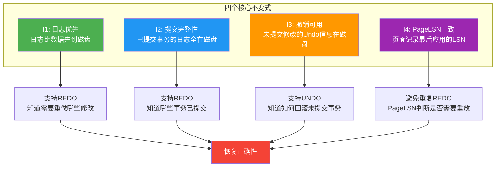
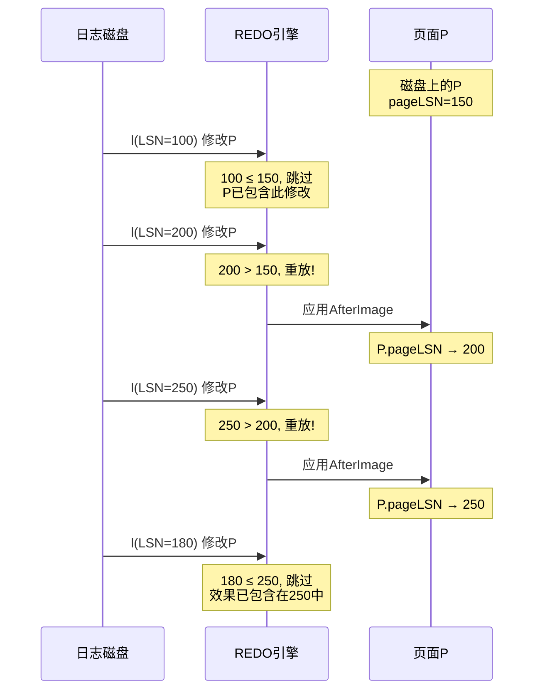
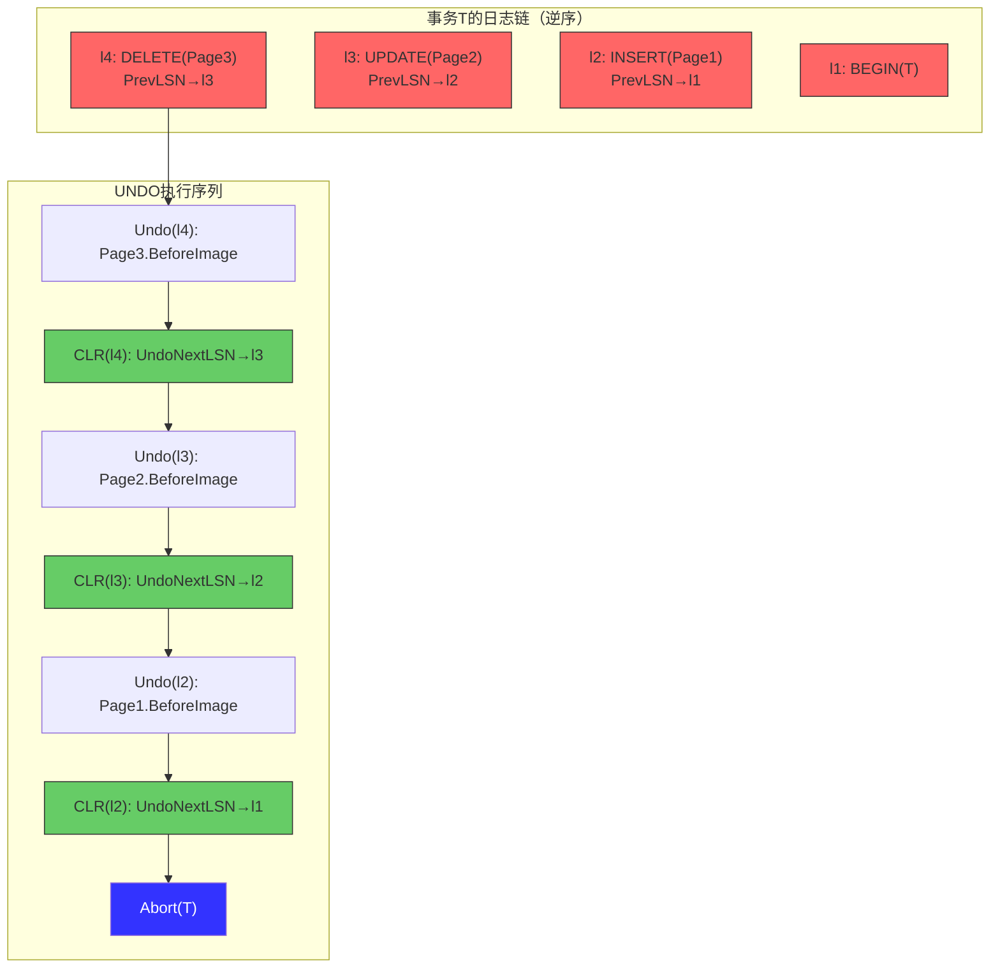
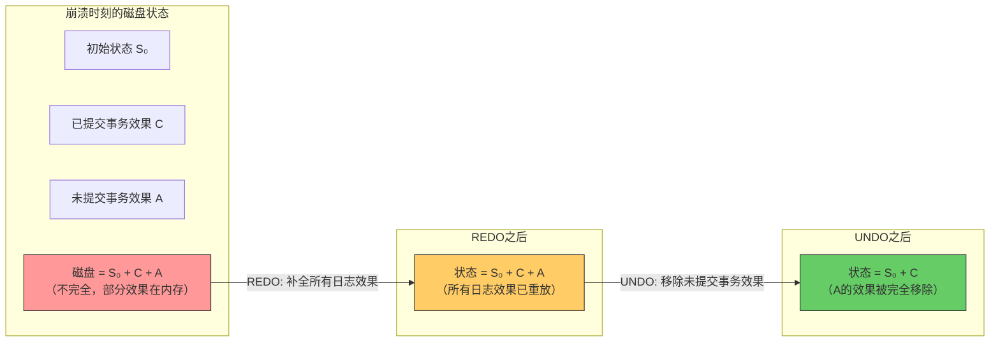

## 11.5 WAL的正确性证明

前面的章节分别定义了WAL的三条核心规则（11.2节）和ARIES恢复算法的三阶段流程（11.3节）。一个自然的问题是：**这个算法真的能正确恢复数据库吗？** 换言之，在任何可能的崩溃场景下，ARIES能否保证恢复后的数据库恰好等于"所有已提交事务的效果叠加在初始状态上"的结果？

这个问题的答案不是直觉上的"看起来应该可以"，而是需要严格的数学证明。本节将构建WAL恢复正确性的形式化证明，从系统模型定义到不变式建立，再到REDO和UNDO正确性的逐一论证，最终给出完整恢复正确性的定理与证明。这不仅是学术上的严谨要求，更是工程实践中建立对数据库恢复机制信心的基石。

### 11.5.1 系统模型与假设

形式化证明的第一步是精确定义系统模型。模型定义了我们讨论问题的"宇宙"——哪些实体存在、哪些操作允许、哪些假设成立。

#### 11.5.1.1 核心实体

```mermaid
graph TD
    subgraph "实体关系"
        T[事务集合 T = {T1, T2, ..., Tn}]
        L[日志记录集合 L = {l1, l2, ..., lm}]
        P[数据页面集合 P = {p1, p2, ..., pk}]
        S[稳定存储 S = 磁盘]
        V[易失存储 V = 内存]
    end

    T -->|产生| L
    L -->|描述| P
    P -->|驻留于| V
    V -->|持久化到| S
    L -->|持久化到| S
```

**事务（Transaction）**：一个事务 $T$ 是一个有限的操作序列 $(o_1, o_2, \ldots, o_n)$，其中每个操作 $o_i$ 读取或写入某个数据页面。事务具有ACID属性，其生命周期包括：
- `BEGIN(T)`：事务开始
- 若干 `WRITE(T, p, v)`：事务T将页面p修改为值v
- `COMMIT(T)` 或 `ABORT(T)`：事务结束

**日志记录（Log Record）**：每条日志记录 $l$ 是一个五元组：

l = (LSN(l), TxnID(l), Type(l), PageID(l), Payload(l))

其中：
- `LSN(l)`：日志序列号，全局唯一且单调递增
- `TxnID(l)`：所属事务ID
- `Type(l)`：记录类型（UPDATE/INSERT/DELETE/COMMIT/ABORT/CLR）
- `PageID(l)`：涉及的数据页面（COMMIT/ABORT记录除外）
- `Payload(l)`：操作的Before Image和After Image

**数据页面（Data Page）**：磁盘和内存中的数据页面。每个页面有一个关联的元数据字段 `pageLSN`，记录最后一条已应用到该页面的日志记录的LSN。

**稳定存储与易失存储**：
- **稳定存储（Stable Storage, S）**：崩溃后内容可能保留也可能丢失的存储介质（即磁盘）。一次 `flush` 操作后，数据在大多数崩溃场景下持久化，但不排除极端硬件故障。
- **易失存储（Volatile Storage, V）**：崩溃后内容完全丢失的存储介质（即内存）。

#### 11.5.1.2 操作语义

系统支持以下原子操作：

| 操作 | 语义 | 持久性保证 |
|------|------|-----------|
| `append(l)` | 将日志记录l追加到日志缓冲区（内存） | 崩溃后丢失 |
| `flush(L_set)` | 将日志记录集合L_set从内存刷入稳定存储 | flush后在大多数崩溃下持久化 |
| `write(P, data)` | 将数据写入缓冲池中的页面P | 崩溃后丢失 |
| `flush_page(P)` | 将页面P从缓冲池刷入稳定存储 | flush后在大多数崩溃下持久化 |
| `install(P, data)` | 将数据安装到磁盘上的页面P | 立即持久化 |

#### 11.5.1.3 崩溃模型

我们假设崩溃（crash）是以下三种情形之一：

1. **系统断电**：所有易失存储（内存）内容立即丢失，稳定存储（磁盘）上已完成 `flush` 的内容保留。
2. **进程崩溃**：数据库进程异常终止，效果等价于系统断电。
3. **操作系统崩溃**：操作系统重启后，磁盘上 flush 过的数据保留，未 flush 的数据丢失。

**关键假设**：
- **假设A1（原子性刷盘）**：一次 `flush` 要么全部成功，要么全部失败。不会出现"日志刷了一半"的情况。这个假设依赖于文件系统和磁盘固件的原子写入保证。
- **假设A2（有序性）**：如果 `flush(l1)` 先于 `flush(l2)` 执行，那么在恢复时，要么两者都在磁盘上，要么只有 `l1` 在磁盘上。即刷盘保持了日志的写入顺序。
- **假设A3（崩溃不可预测）**：崩溃可能发生在任何时刻，且不能保证在某个特定操作之前或之后发生。

#### 11.5.1.4 正确性目标

恢复正确性的精确定义是：

> **定义（恢复正确性）**：设 $S_0$ 为数据库初始一致状态，$C$ 为崩溃前已提交事务集合，$A$ 为崩溃前活跃（未提交）事务集合。恢复算法是正确的，当且仅当恢复后的数据库状态 $S_{recovered}$ 满足：
>
> $$S_{recovered} = Apply(S_0, \bigcup_{T \in C} Effects(T))$$
>
> 其中 $Apply(S, Effects)$ 表示将事务效果依次应用到状态S上的结果。

用通俗语言说：恢复后的数据库应该恰好等于"初始状态 + 所有已提交事务的效果"。既不多（未提交事务的效果被撤销），也不少（已提交事务的效果全部保留）。

### 11.5.2 WAL核心不变式

证明正确性的关键在于建立**不变式（Invariant）**——系统运行过程中始终成立的性质。如果WAL的不变式在正常运行期间成立，那么崩溃后恢复算法只需要修复不变式被破坏的部分即可。

#### 11.5.2.1 不变式I1：日志优先（Log Priority）

> **不变式I1**：对于任何数据页面P的任何修改 $m$，描述该修改的日志记录 $l(m)$ 在稳定存储上的时间一定不晚于包含该修改的页面P在稳定存储上的时间。

形式化表述：

$$\forall m: \text{flush}(l(m)) \leq \text{flush}(P)$$

其中 $\leq$ 表示"不晚于"的时间序关系。

**证明I1成立**：

I1直接由WAL规则1（日志先于数据）保证。规则1要求 `flush(L(P))` 必须先于 `write(P)`。由于 `flush` 操作的语义是将数据从易失存储转移到稳定存储，而 `write(P)` 是将修改应用到缓冲池（随后可能被刷入磁盘），因此：

1. 日志记录 $l(m)$ 先被追加到日志缓冲区
2. 日志缓冲区先于数据页面被 flush 到磁盘（规则1的要求）
3. 数据页面P可能在之后的任意时刻被刷入磁盘

所以 $l(m)$ 到达稳定存储的时间一定不晚于P到达稳定存储的时间。 □

#### 11.5.2.2 不变式I2：提交完整性（Commit Completeness）

> **不变式I2**：如果事务T已向应用返回提交成功，则描述T的所有日志记录（包括COMMIT记录）都已在稳定存储上。

形式化表述：

$$\text{committed}(T) \implies \forall l: \text{TxnID}(l) = T \implies \text{flushed}(l)$$

**证明I2成立**：

I2由WAL规则2（提交先于完成）直接保证。规则2要求：在向应用返回提交成功之前，`flush(all_logs(T))` 必须完成。因此，一旦应用收到提交确认，T的所有日志记录都已在稳定存储上。 □

#### 11.5.2.3 不变式I3：撤销信息可用（Undo Information Availability）

> **不变式I3**：对于任何未提交事务T的任何修改 $m$，如果该修改对应的数据页面P已被刷入磁盘，则描述该修改的Undo信息（Before Image）一定已在稳定存储上。

形式化表述：

$$\text{flushed}(P) \land \text{TxnID}(m) = T \land \neg\text{committed}(T) \implies \text{flushed}(\text{Undo}(m))$$

**证明I3成立**：

I3由WAL规则3（撤销先于完成）直接保证。规则3要求：在页面P被刷入磁盘之前，对应的Undo信息必须已经持久化。因此，如果未提交事务的修改已出现在磁盘上，其Undo信息一定也在磁盘上。 □

#### 11.5.2.4 不变式I4：PageLSN一致性

> **不变式I4**：对于任何数据页面P（无论在内存还是磁盘上），P.pageLSN 等于最后一条已应用到P的日志记录的LSN。

形式化表述：

$$P.\text{pageLSN} = \max\{l.\text{LSN} \mid l \text{ 已应用到 } P\}$$

**证明I4成立**：

这是ARIES写入协议的直接推论。ARIES规定：
1. 先写日志记录 $l$，获得 LSN(l)
2. 将修改应用到缓冲池中的页面P
3. 设置 P.pageLSN = LSN(l)

每次修改页面时都执行步骤3，因此 pageLSN 始终等于最后应用的LSN。 □

#### 11.5.2.5 不变式总结



### 11.5.3 REDO正确性证明

REDO（重做）是恢复过程的第一阶段，负责将数据库"前滚"到崩溃前的状态。我们需要证明：**REDO阶段结束后，所有在崩溃时存在于磁盘上的修改都被正确重放，且不多不少。**

#### 11.5.3.1 REDO阶段的形式化描述

设 $L_{log}$ 为磁盘上可用的日志记录集合（按LSN排序），$L_{ckpt}$ 为最近检查点记录，$DPT_{ckpt}$ 为检查点中的脏页面表。

REDO阶段的算法为：

REDO_PASS:
  redo_lsn = min{ RecLSN(p) | p ∈ DPT }
  for each log record l in L_log, ordered by LSN:
    if l.LSN ≥ redo_lsn AND l.Type ∈ {UPDATE, INSERT, DELETE}:
      P = load_page(l.PageID)
      if l.LSN > P.pageLSN:
        apply(l.AfterImage, P)
        P.pageLSN = l.LSN
        flush_page(P)

#### 11.5.3.2 定理1：REDO正确性

> **定理1**：REDO阶段结束后，对于每一个数据页面P，P的状态恰好等于所有LSN ≤ P.pageLSN 的日志记录的效果依次应用后的结果。

证明分三步进行：

**步骤1：REDO的起点正确**

REDO从 $redo\_lsn = \min\{RecLSN(p) \mid p \in DPT\}$ 开始。RecLSN(p)的含义是页面p第一次变脏的日志位置。根据不变式I4，p.pageLSN ≥ RecLSN(p)。因此，任何可能需要重放的日志记录（即LSN > p.pageLSN的记录）的LSN一定 ≥ RecLSN(p) ≥ redo_lsn。

这意味着：从redo_lsn开始扫描，不会遗漏任何需要重放的日志记录。 □

**步骤2：REDO不会跳过需要重放的记录**

考虑任意日志记录 $l$（修改了页面P）满足：$l.LSN > \text{disk\_P.pageLSN}$（即磁盘上的P尚未包含l的修改）。

在REDO遍历到 $l$ 时，有两种情况：

- **情况A**：页面P尚未被加载到内存。此时从磁盘读取P，其 pageLSN = disk_P.pageLSN < l.LSN。条件 `l.LSN > P.pageLSN` 成立，修改被正确重放。

- **情况B**：页面P已被加载到内存，且已被之前某条日志记录 $l'$（$LSN(l') > LSN(l)$）重放过。此时内存中 P.pageLSN = LSN(l') > LSN(l)。条件 `l.LSN > P.pageLSN` 不成立，跳过。但这是正确的——因为 $l'$ 的修改在时间上晚于 $l$，且 $l'$ 本身已被正确重放，所以 $l$ 的修改效果已经包含在 $l'$ 的修改中（因为 $l'$ 应用的是页面的完整After Image，包含了 $l$ 的效果）。

> **关键引理**：如果页面P的修改序列 $l_1, l_2, \ldots, l_k$（按LSN递增），那么重放 $l_k$ 等价于依次重放 $l_1, l_2, \ldots, l_k$。

**引理证明**：在ARIES的生理日志模型中，每条日志记录描述的是页面某个偏移处的字节修改。如果 $l_i$ 修改了偏移 $[a_i, b_i)$ 处的字节，而 $l_j$（$j > i$）修改了偏移 $[a_j, b_j)$ 处的字节：

- 如果两个修改的偏移范围不重叠，顺序无关紧要
- 如果两个修改的偏移范围重叠，ARIES要求 $l_j$ 的Before Image包含 $l_i$ 修改后的值（因为 $l_j$ 记录的是基于 $l_i$ 之后的状态所做的修改），因此 $l_j$ 的After Image自然包含了 $l_i$ 的效果

在任何情况下，重放最新一条修改页面某区域的日志记录，等价于依次重放所有修改该区域的日志记录。 □

**步骤3：REDO不会过度重放**

REDO只重放 `l.LSN > P.pageLSN` 的记录。对于磁盘上的P，如果 $l.LSN \leq P.pageLSN$，说明P已经包含了l的修改（或更新的修改），跳过是正确的。对于内存中加载的P，如果某条记录的重放导致P.pageLSN被更新到 $l'.LSN$，后续 $LSN < l'.LSN$ 的记录会被自动跳过，因为它们的效果已经包含在 $l'$ 中。

因此，REDO阶段结束后，每个页面P的状态恰好反映了所有有效修改的最终效果。 □

#### 11.5.3.3 REDO正确性的图示



### 11.5.4 UNDO正确性证明

UNDO（撤销）是恢复过程的第二阶段，负责回滚崩溃时仍在活跃（未提交）的事务。我们需要证明：**UNDO阶段结束后，所有未提交事务的修改效果被完全清除，且不伤害已提交事务的效果。**

#### 11.5.4.1 UNDO阶段的形式化描述

设 $ATT$ 为分析阶段构建的活动事务表，$l_{last}(T)$ 为事务T的最后一条日志记录（通过ATT获取）。UNDO阶段的算法为：

UNDO_PASS:
  // 从日志尾部向前扫描
  for each log record l in L_log, in reverse LSN order:
    if l.TxnID ∈ ActiveTxns:
      if l.Type ∈ {UPDATE, INSERT, DELETE}:
        P = load_page(l.PageID)
        apply(l.BeforeImage, P)   // 应用前镜像，恢复到修改前
        flush_page(P)

        // 写入CLR（补偿日志记录）
        clr = CompensationLogRecord(
          UndoNextLSN = PrevLSN(l),
          RedoData = l.BeforeImage   // CLR的Redo信息是原操作的Undo
        )
        append(clr)
        flush(clr)

      if l.Type = CLR:
        // CLR本身也需要重放其Redo部分
        P = load_page(l.PageID)
        if l.LSN > P.pageLSN:
          apply(l.RedoData, P)
          P.pageLSN = l.LSN

      if l = l_last(T):
        // T的所有操作已Undo完毕
        append(Abort(T))
        flush(Abort(T))
        ActiveTxns.remove(T)

#### 11.5.4.2 定理2：UNDO正确性

> **定理2**：UNDO阶段结束后，对于每个未提交事务 $T$，T的所有修改效果被完全撤销，数据库中不存在T的任何痕迹。

证明同样分步进行：

**步骤1：UNDO覆盖了所有需要撤销的修改**

分析阶段构建了 $ATT$，记录了崩溃时所有活跃事务。每个活跃事务T的 $LastLSN$ 指向T的最后一条日志记录。通过Prev_LSN链（每条日志记录的Prev_LSN指向前一条），可以从LastLSN回溯到T的所有日志记录。

因此，UNDO遍历会覆盖T的每一条UPDATE/INSERT/DELETE记录。 □

**步骤2：UNDO的顺序正确（逆序撤销）**

UNDO从日志尾部向头部扫描（逆LSN序），这意味着对于事务T，先撤销最后一条修改，再撤销倒数第二条，以此类推。

这个逆序的必要性在于：**日志中的修改顺序反映了操作间的依赖关系**。如果 $l_1$ 先于 $l_2$（$LSN(l_1) < LSN(l_2)$），那么 $l_2$ 的Before Image记录的是 $l_1$ 执行后的状态。逆序撤销确保我们先用 $l_2$ 的Before Image恢复到 $l_1$ 执行后的状态，再用 $l_1$ 的Before Image恢复到 $l_1$ 执行前的状态。

如果正序撤销（先撤销 $l_1$），则需要用 $l_1$ 的Before Image恢复，但此时 $l_2$ 的修改仍存在，可能导致页面处于不一致状态。 □

**步骤3：CLR保证幂等性**

补偿日志记录（CLR）是ARIES的一个关键设计。每次Undo一条日志记录 $l$ 时，系统不是简单地丢弃 $l$，而是写入一条CLR记录，其内容是：

CLR(l) = (LSN=新分配, TxnID=T, Type=CLR, 
          UndoNextLSN=PrevLSN(l),
          RedoData=l.BeforeImage)

CLR的两个关键性质：

**性质1（幂等性）**：如果在Undo $l$ 之后、写入CLR之前再次崩溃，恢复时REDO阶段会重放CLR的RedoData（即Before Image），效果等价于再次Undo。而再次Undo是安全的——对已经恢复到修改前状态的页面应用Before Image是幂等操作（页面不变）。

**性质2（跳过已Undo的操作）**：CLR中的UndoNextLSN告诉恢复算法：从这个LSN继续向前Undo，跳过CLR和它Undo过的记录。这避免了重复Undo导致的性能问题，同时保证正确性。

形式化地，设 $l_1 \to l_2 \to l_3 \to \cdots \to l_k$ 是事务T的Prev_LSN链。UNDO的执行序列为：

Undo(l_k), CLR(l_k), Undo(l_{k-1}), CLR(l_{k-1}), ..., Undo(l_1), CLR(l_1), Abort(T)

如果在Undo(l_j)后崩溃：
- REDO阶段会重放 CLR(l_j) 的 RedoData，页面不变（幂等）
- 分析阶段发现T仍活跃
- UNDO从 CLR(l_j).UndoNextLSN = l_{j-1} 继续，跳过已Undo的 $l_j, l_{j+1}, \ldots, l_k$

因此，无论崩溃发生在UNDO过程的哪个时刻，恢复结果都是一致的。 □

**步骤4：UNDO不伤害已提交事务**

UNDO只处理ATT中的活跃事务。分析阶段在构建ATT时，已经根据日志中的COMMIT记录将已提交事务排除在外。因此，UNDO只修改未提交事务涉及的页面。

对于已提交事务T和未提交事务U可能修改了同一页面P的情况：UNDO会先将P的Before Image（U修改前的状态）恢复，但这可能覆盖了T的修改。此时REDO阶段已经完成了T的修改的重放（因为UNDO在REDO之后执行），所以REDO后的页面P包含T的效果。UNDO覆盖T的效果后，需要再次重放T的修改——但这是不可能发生的，因为UNDO只处理未提交事务的日志记录。

更精确地说：如果T已提交，T的COMMIT记录在磁盘上（不变式I2）。分析阶段看到COMMIT记录后，将T从ATT中移除。UNDO不会处理T的任何记录。因此T的效果不会被Undo。 □

#### 11.5.4.3 UNDO正确性的图示



### 11.5.5 完整恢复正确性定理

将REDO和UNDO的正确性合并，我们得到完整的恢复正确性定理。

#### 11.5.5.1 定理3：ARIES恢复的正确性

> **定理3**：在满足不变式I1-I4和假设A1-A3的系统中，ARIES三阶段恢复（分析-重做-撤销）后的数据库状态 $S_{recovered}$ 等于初始状态 $S_0$ 上叠加所有已提交事务的效果：
>
> $$S_{recovered} = Apply(S_0, \bigcup_{T \in C} Effects(T))$$

**证明**：

恢复后的数据库由两部分组成：
1. REDO阶段后的状态 $S_{redo}$
2. UNDO阶段后的状态 $S_{undo}$（= $S_{recovered}$）

**Part A：REDO阶段的正确性**

根据定理1的证明，REDO阶段确保每个页面P的状态等于其 pageLSN 及之前所有日志记录的效果。这包括：
- 已提交事务的修改（如果其LSN ≤ P.pageLSN且未被更晚的日志覆盖）
- 未提交事务的修改（如果其LSN ≤ P.pageLSN）
- 更晚的日志记录覆盖更早日志记录的效果

因此 $S_{redo}$ 包含了崩溃前所有日志记录对数据页面的累积效果——既包括已提交事务，也包括未提交事务。

**Part B：UNDO阶段的正确性**

根据定理2的证明，UNDO阶段完全移除了所有未提交事务的修改效果，且不伤害已提交事务的效果。

设 $Effects(C)$ 为已提交事务的修改效果集合，$Effects(A)$ 为未提交事务的修改效果集合。则：

$$S_{redo} = Apply(S_0, Effects(C) \cup Effects(A))$$

UNDO阶段的效果为：

$$S_{undo} = S_{redo} \ominus Effects(A)$$

其中 $\ominus$ 表示"移除效果"。

因此：

$$S_{undo} = Apply(S_0, Effects(C) \cup Effects(A)) \ominus Effects(A) = Apply(S_0, Effects(C))$$

即恢复后的状态恰好等于初始状态加上所有已提交事务的效果。 □

#### 11.5.5.2 定理的直观理解



### 11.5.6 边界条件与极端场景

正确性定理在理想模型下成立。实际系统中存在多种边界条件需要分析。

#### 11.5.6.1 场景1：崩溃发生在事务提交过程中

时序：应用调用COMMIT → 日志缓冲区写入COMMIT记录 → **[CRASH]** → 日志尚未flush到磁盘

**分析**：根据不变式I2，向应用返回提交成功前必须完成flush。如果在flush之前崩溃，COMMIT记录不在磁盘上。分析阶段找不到T的COMMIT记录，T被加入ATT（活跃事务表），UNDO会撤销T的所有修改。

**结论**：应用收到了什么取决于崩溃的确切时刻。如果崩溃在COMMIT记录flush之后但在返回给应用之前，应用可能没有收到确认，但T在恢复后已提交（因为COMMIT记录在磁盘上）。这是"不确定提交"（In-Doubt Transaction）场景，上层应用需要通过查询数据库状态来确认。

#### 11.5.6.2 场景2：检查点不一致

时序：系统正在写检查点记录，**[CRASH]** 在检查点写入一半时发生

**分析**：ARIES的检查点记录本身需要保证原子性。有两种实现策略：

- **策略A**：检查点记录只在完全写入后才被视为有效（通过一个标记位或校验和判断）
- **策略B**：写入两份检查点记录（头部和尾部），恢复时取完整的一份

无论哪种策略，如果检查点记录不完整，恢复算法将其视为不存在，从上一个完整的检查点开始恢复。这会扩大恢复扫描范围，但不影响正确性——只是恢复时间变长。

#### 11.5.6.3 场景3：日志文件损坏

如果日志文件本身被部分损坏（磁盘坏道、文件系统错误），恢复时可能无法读取某些日志记录。

**分析**：这超出了ARIES的标准假设范围。ARIES假设稳定存储是可靠的（即假设A1-A3中隐含的存储完整性）。实际系统中，日志文件损坏需要通过备份恢复。这正是11.2.10节中"WAL不能替代备份"的理论基础。

#### 11.5.6.4 场景4：多个页面共享同一LSN范围

如果多个事务并发修改不同的页面，它们的日志记录会交错排列。UNDO需要处理这种情况。

**分析**：UNDO只修改未提交事务涉及的页面。如果事务U修改了页面P1，事务V修改了页面P2，UNDO(U)只影响P1，UNDO(V)只影响P2。即使P1和P2的日志记录交错，UNDO也能正确工作——因为每条日志记录明确标注了其所属事务和目标页面。 □

#### 11.5.6.5 场景5：MHO（Modified Home Order）异常

在极端情况下，页面P可能被修改后刷入磁盘，然后又修改，又刷入。日志记录的LSN是递增的，但页面的修改可能不是严格单调的。

**分析**：PageLSN机制完美处理了这种情况。即使页面被反复修改和刷盘，每次刷盘时P.pageLSN被更新为最后应用的LSN。恢复时，只需要重放LSN > P.pageLSN的记录，不会遗漏也不会重复。 □

### 11.5.7 假设的严格性分析

任何数学证明的可靠性取决于其假设的合理性。本节分析WAL正确性证明中各假设的严格程度。

#### 11.5.7.1 原子性刷盘假设（A1）

A1假设一次 `flush` 操作要么全部成功要么全部失败。在现实中：

| 场景 | A1成立？ | 后果 | 缓解措施 |
|------|---------|------|---------|
| 单个日志记录的写入 | 部分成立 | 如果日志记录跨扇区写入且只写了一半，记录损坏 | 日志记录头部包含长度和校验和，可以检测不完整记录 |
| 多个日志记录的批量flush | 成立（顺序写入） | 一次fsync保证之前所有写入的数据落盘 | 文件系统语义保证 |
| 操作系统崩溃 | 可能违反 | 页缓存中的脏数据可能丢失 | 使用O_DIRECT绕过页缓存，或使用带断电保护的SSD |
| 磁盘固件bug | 可能违反 | 磁盘报告写入完成但数据仍在易失性缓存 | 使用企业级SSD，启用Write Barriers |

**实际影响**：A1的轻微违反通常导致日志记录损坏或丢失，但这可以通过日志记录的校验和检测。一旦检测到损坏，系统需要从最近的备份恢复——这回到了"WAL + 备份"的完整保护方案。

#### 11.5.7.2 有序性假设（A2）

A2假设刷盘保持了日志的写入顺序。文件系统的fsync语义保证了这一点——fsync确保之前所有 `write` 系统调用的数据都已到达磁盘。但如果使用了写缓存（write-back caching）的磁盘，fsync可能不生效。

**缓解措施**：使用 `O_DSYNC` 或 `O_SYNC` 标志打开日志文件，或者在每次fsync后执行读回验证（read-back verification）。

#### 11.5.7.3 崩溃不可预测假设（A3）

A3假设崩溃可能发生在任何时刻。这意味着我们的证明必须覆盖所有可能的崩溃点。上述定理3的证明确实是"对所有可能的崩溃点成立"的——因为证明过程没有假设崩溃发生在特定时刻，而是对REDO和UNDO的任意中间状态都证明了正确性。

### 11.5.8 正确性证明的实际意义

数学证明不只是学术练习。理解WAL的正确性证明对实际工程有以下重要指导：

#### 11.5.8.1 对数据库开发者

**设计验证清单**：

| 不变式 | 开发时的检查项 |
|--------|---------------|
| I1（日志优先） | 代码中是否有可能先写数据页后写日志的路径？ |
| I2（提交完整性） | COMMIT记录的flush是否在返回应用之前完成？ |
| I3（撤销可用） | Steal策略下，脏页刷盘前是否确认Undo信息已持久化？ |
| I4（PageLSN） | 每次修改页面后是否更新了pageLSN？ |

一个常见的Bug模式：开发者在优化路径中直接修改数据页面而不经过日志（"快速路径"），违反I1。正确性证明告诉我们：任何违反I1的代码路径都可能导致恢复失败。

#### 11.5.8.2 对数据库管理员

正确性证明明确了WAL的边界：

1. **WAL能保证什么**：崩溃恢复后，已提交事务的效果不丢失，未提交事务的效果不残留
2. **WAL不能保证什么**：介质故障（磁盘损坏）、人为误操作、逻辑错误
3. **如何增强保护**：WAL + 定期全量备份 + WAL归档 = 完整的数据保护方案

#### 11.5.8.3 对系统架构师

正确性证明中的假设分析为架构决策提供依据：

- 如果系统运行在廉价SSD上（A1可能违反），需要更保守的fsync策略
- 如果系统需要跨机房容灾，需要将WAL复制到远程节点（满足A1-A3的分布式版本）
- 如果系统需要零数据丢失（Zero RPO），需要同步复制WAL到至少一个远程节点

### 11.5.9 与其他恢复方案的正确性对比

WAL不是唯一的恢复方案。本节简要对比影子分页（11.4节）和BANK算法的正确性保证。

| 对比维度 | WAL + ARIES | 影子分页 | BANK算法 |
|----------|------------|---------|----------|
| 正确性依赖的不变式 | I1-I4（四个） | 根指针原子性（一个） | 无（基于反向日志） |
| 证明复杂度 | 中等（需要REDO+UNDO两阶段） | 简单（恢复=读页表） | 低（线性扫描即可） |
| 崩溃安全性来源 | 日志的持久化顺序 | COW + 原子指针切换 | 旧值的完整保存 |
| 假设严格程度 | 中（需要原子刷盘） | 较高（需要原子指针更新） | 低（只需顺序IO） |
| 正确性证明的关键难点 | REDO的幂等性保证 | 根指针切换的原子性 | 遗漏的反向操作处理 |

影子分页的正确性证明更简单（只需证明"根指针要么指向旧页表要么指向新页表"），但代价是写放大和并发限制。WAL的证明更复杂，但换来了更好的写入性能和更高的并发度。

### 11.5.10 本节小结

本节严格证明了WAL恢复机制（特别是ARIES算法）的正确性。核心论证结构为：

WAL三条规则
    ↓ 保证
四个不变式（I1-I4）
    ↓ 支撑
REDO正确性（定理1）+ UNDO正确性（定理2）
    ↓ 合并
完整恢复正确性（定理3）
    ↓ 结论
恢复后的数据库 = 初始状态 + 所有已提交事务的效果

正确性证明的核心洞察是：

1. **日志是时间的保险**：只要日志先于数据到达磁盘（I1），崩溃后就有足够的信息重放所有修改
2. **COMMIT标记是决策依据**：COMMIT记录是否在磁盘上决定了事务在恢复后是提交还是回滚
3. **PageLSN是去重机制**：避免了同一修改的重复重放，保证REDO的幂等性
4. **CLR是容错机制**：使UNDO过程本身可以被中断和恢复

这四个机制环环相扣，共同构建了一个在任何崩溃场景下都能正确恢复的系统。理解这个证明，不仅能帮助开发者避免引入破坏正确性的Bug，也能帮助DBA理解WAL配置参数的理论基础——每一个参数背后都有严格的数学推导。

**核心公式回顾**：

正确性 = ∀ crash_point:
  REDO(S_crash, L_log, DPT)  →  S_redo = S₀ + C + A
  UNDO(S_redo, ATT)          →  S_undo = S₀ + C

其中：
  S₀ = 初始一致状态
  C  = 已提交事务集合
  A  = 未提交事务集合
  L_log = 磁盘上的日志记录
  DPT = 脏页面表
  ATT = 活动事务表

**关键文献**：
- Mohan, C., et al. "ARIES: A Transaction Recovery Method Supporting Fine-Granularity Locking and Partial Rollbacks Using Write-Ahead Logging." *ACM TODS*, 1992.
- Gray, J. and Reuter, A. *Transaction Processing: Concepts and Techniques.* Morgan Kaufmann, 1993.
- Bernstein, P.A. and Hadzilacos, V. *Concurrency Control and Recovery in Database Systems.* Addison-Wesley, 1987.
