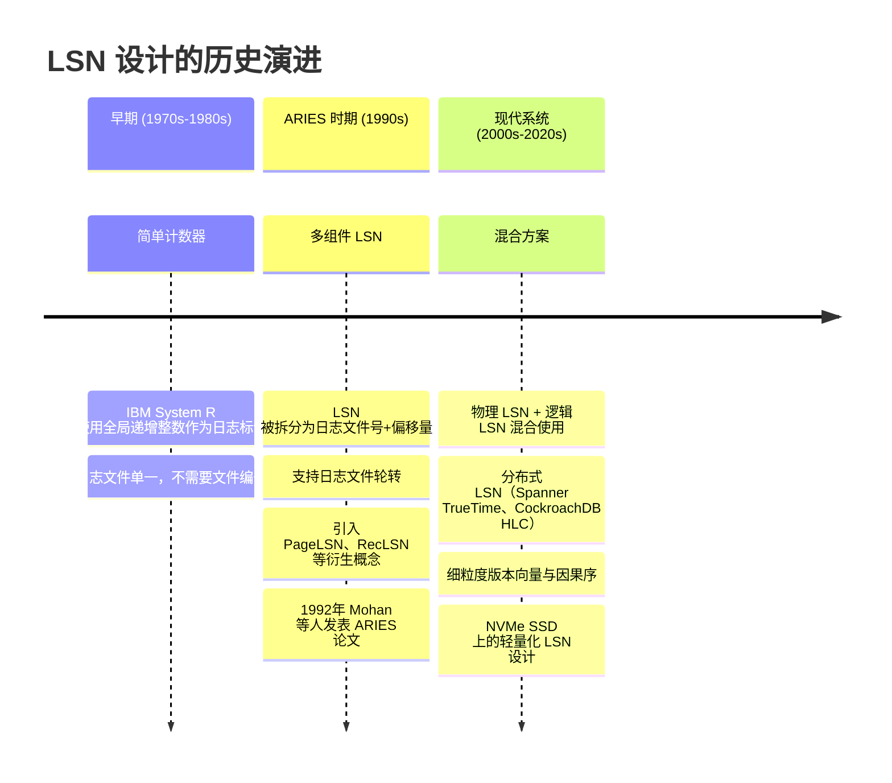
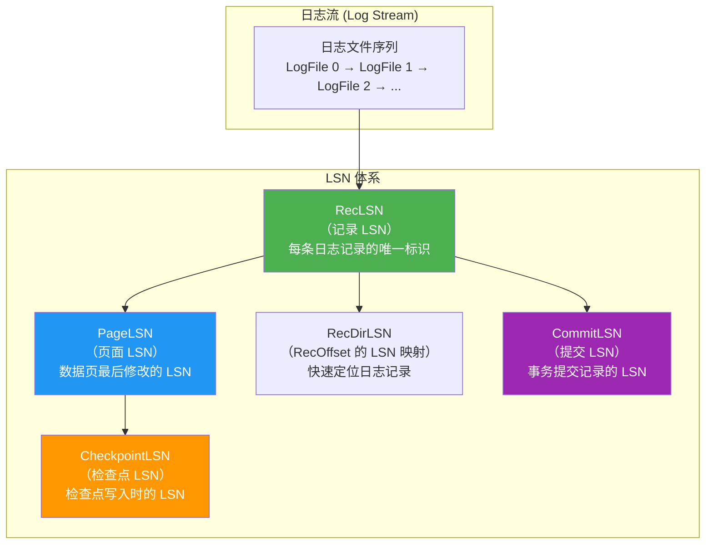
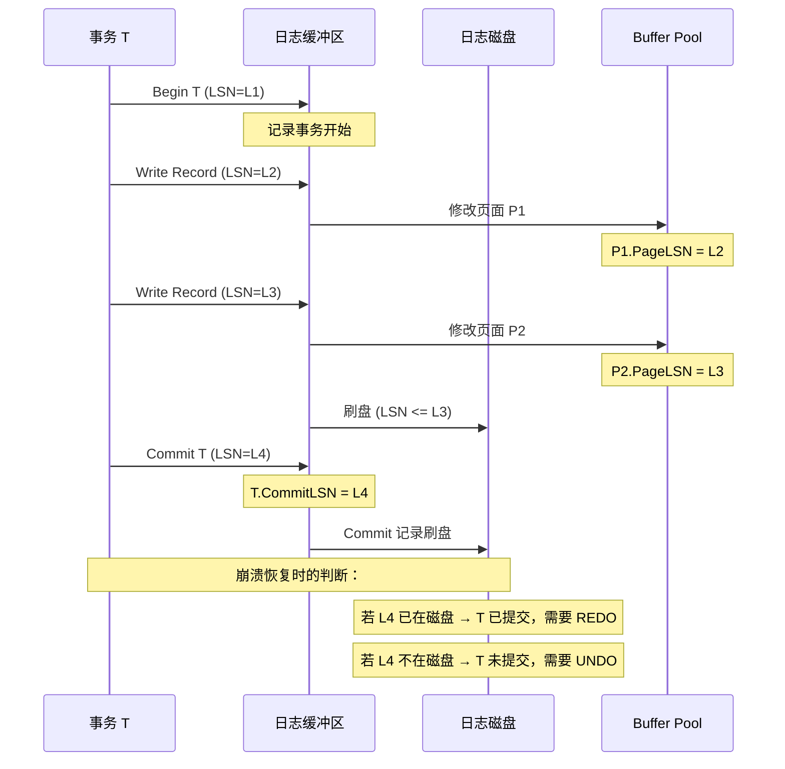
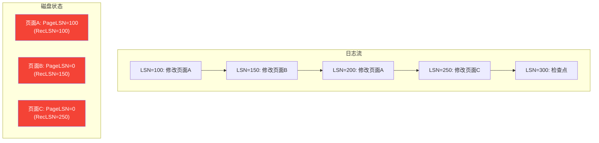
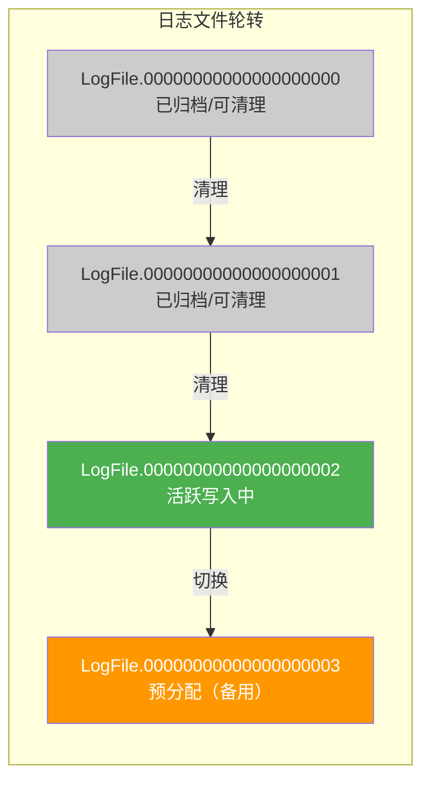
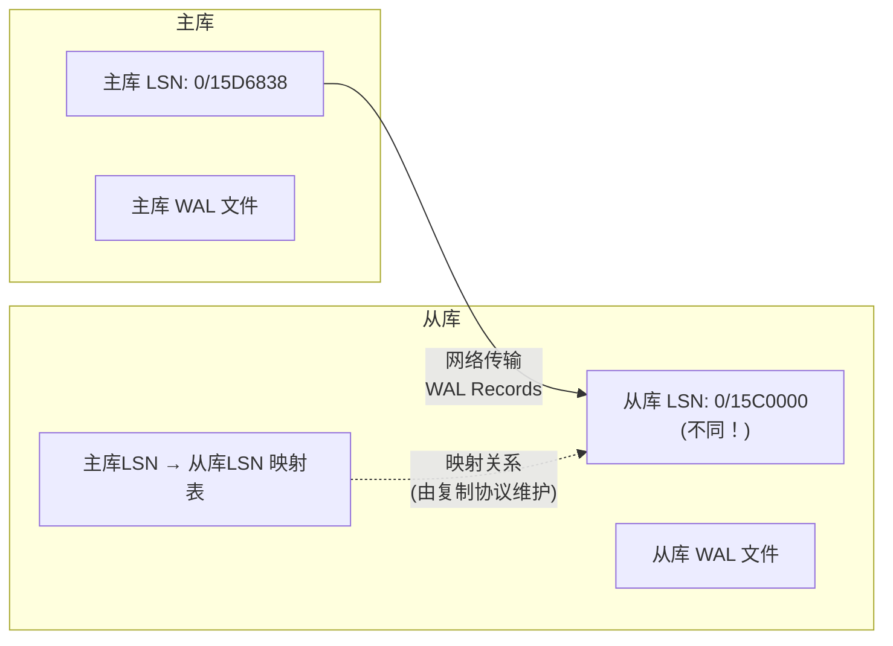

# 11.6 日志序列号（LSN）的设计

## 1. 概述与背景

### 1.1 什么是日志序列号（LSN）

日志序列号（Log Sequence Number，简称 LSN）是 WAL（Write-Ahead Logging）机制中每一个日志记录的唯一标识符。它是数据库恢复子系统中最基础、最关键的数据结构之一——没有 LSN，我们就无法建立日志记录之间的时序关系，无法确定数据页的最新版本，也无法保证事务恢复的正确性。

从本质上说，LSN 回答了一个看似简单却至关重要的问题：**在一条日志流中，"第几条"记录出现在"什么时候"？**这个问题的答案是整个 ARIES 恢复模型的基石。

LSN 的重要性可以通过一个类比来理解：如果 WAL 是一部纪录片，那么 LSN 就是每一帧的帧号。没有帧号，我们无法定位特定画面、无法确定画面顺序、无法在断点处恢复播放——数据库的崩溃恢复正是这种"断点恢复"。

### 1.2 为什么需要 LSN

在没有 LSN 的日志系统中，恢复过程面临三个根本性难题：

**难题一：时序定位。** 当数据库崩溃时，恢复管理器需要从日志中找到特定事务的所有操作记录。如果日志只有"内容"没有"序号"，系统就必须逐条扫描整条日志来定位目标事务——这在日志量达到 GB 级别时是不可接受的。有了 LSN，系统可以将 LSN 作为索引键，在 O(log N) 时间内定位到目标位置。

**难题二：页面版本追踪。** 数据库通过 "steal/no-force" 策略运行时，磁盘上的数据页可能落后于日志中的修改。恢复时需要知道每个数据页最后一次刷盘对应日志中的哪个位置，这需要一个精确的锚点——LSN 正是这个锚点。PageLSN 机制（后文详述）将数据页与日志流绑定在一起，使恢复引擎能够精确判断"这条日志是否需要重放"。

**难题三：检查点协调。** 检查点机制需要记录"截止到此刻，所有脏页都已写入磁盘"这一事实。LSN 为检查点提供了与日志流对齐的时间坐标。没有 LSN，检查点就无法与日志流建立关联，恢复起点也无法确定。

**难题四：复制一致性。** 在主从复制架构中，从库需要精确知道"已经接收并应用到哪个位置"。LSN 提供了这个进度坐标，使复制协议能够准确追踪同步状态，实现断点续传。

### 1.3 历史演进



早期的 System R 采用简单的全局递增计数器，这在单文件日志中足够用。但随着日志文件轮转、分布式复制等需求出现，纯整数方案逐渐力不从心。1992 年 Mohan、Haderle、Lindsay、Pirahesh 和 Schwarz 等人提出的 ARIES 恢复模型确立了现代 LSN 设计的标准范式——将 LSN 拆分为（日志文件号，文件内偏移量）的二元组，并引入 PageLSN、RecLSN 等衍生概念，形成了一套完整的 LSN 体系。

进入 2000 年代后，Google Spanner（2012）和 CockroachDB（2017）等分布式数据库将 LSN 的概念从单机扩展到跨节点，引入了 TrueTime、混合逻辑时钟（HLC）等时间同步机制来解决分布式环境下的全局排序问题。

---

## 2. LSN 的基本设计

### 2.1 经典二元组结构

现代数据库系统（PostgreSQL、MySQL InnoDB、SQL Server）普遍采用的 LSN 结构是一个二元组：

LSN = (LogFileNumber, Offset)

其中：
- **LogFileNumber**：日志文件的编号，当一个日志文件写满后递增
- **Offset**：该日志记录在当前日志文件中的字节偏移量

以 PostgreSQL 为例，其 LSN 被定义为一个 64 位无符号整数，内部按 32 位分割为高端和低端两部分。在 `pg_lsn` 类型中，LSN 以十六进制表示为 `X/Y` 格式，其中 `X` 是高位（LogFileNumber 的某种映射），`Y` 是低位（Offset）。

```c
// PostgreSQL LSN 的内部表示 (简化自 src/include/access/xlog.h)
typedef uint64 XLogRecPtr;

// 从文件号和偏移量构造 LSN
// segno: WAL 段编号, offset: 段内偏移
#define XLogSegNoOffsetToRecPtr(segno, offset, dest) \
    ((dest) = ((segno) * wal_segment_size + (offset)))

// 从 LSN 提取文件号和偏移量
#define XLByteToSeg(xlrp, segno, wal_segsz_bytes) \
    ((segno) = (xlrp) / (wal_segsz_bytes))

// 提取段内偏移
#define XLogSegmentOffset(xlrp, segsz_bytes) \
    ((xlrp) % (segsz_bytes))
```

MySQL InnoDB 使用类似的 64 位设计：

```c
// InnoDB LSN 表示 (简化自 storage/innobase/include/log0log.h)
typedef uint64 lsn_t;  // ib_uint64_t

// LSN 到日志文件偏移的转换
// log_file_size 是单个日志文件的大小（由 innodb_log_file_size 控制）
static inline void lsn_to_file_offset(
    lsn_t lsn, lsn_t log_file_size,
    uint32_t *file_no,  // 输出：文件编号
    lsn_t *offset       // 输出：文件内偏移
) {
    *file_no = (uint32_t)(lsn / log_file_size);
    *offset  = lsn % log_file_size;
}
```

### 2.2 为什么选择二元组而非纯整数

纯递增整数（如 `1, 2, 3, ...`）看似更简单，但在实际系统中有严重缺陷：

| 对比维度 | 纯递增整数 | 二元组 (FileNo, Offset) |
|---------|-----------|------------------------|
| 日志文件轮转 | 不支持——无法标识"第几个文件中的第几个字节" | 天然支持——文件号对应文件轮转 |
| 磁盘空间映射 | LSN 到磁盘位置需要额外的映射表 | LSN 直接编码了磁盘位置，O(1) 计算 |
| 分布式复制 | 需要全局协调保证唯一性 | 各节点可在本地分配，事后合并 |
| 并行写入 | 单一计数器成为瓶颈 | 不同文件可并行写入 |
| 日志压缩/清理 | 无法记录"文件已被清理" | 文件号递增后，旧文件可安全删除 |
| 存储效率 | 随日志量线性增长，可能溢出 | 固定 64 位，永不溢出 |

关键优势在于**空间局部性**：二元组中的 Offset 字段直接告诉系统"在第 N 号文件的第 M 字节"，恢复时可以立刻定位到磁盘上的具体位置，而不需要维护额外的索引结构。

### 2.3 LSN 的编码规范

一个设计良好的 LSN 编码需要满足以下四个核心性质：

**单调递增性：** 对于任意两条日志记录 R1 和 R2，如果 R1 在日志流中先于 R2 写入，那么 `LSN(R1) < LSN(R2)`。这是恢复算法正确性的基础假设。违反此性质将导致 REDO 阶段无法正确判断重放顺序。

**唯一性：** 每条日志记录拥有且仅有一个 LSN。不存在两条不同的日志记录共享同一个 LSN。这保证了日志流中每一点都有精确的坐标。

**可比较性：** 两个 LSN 之间可以进行全序比较（`<`, `>`, `==`），比较结果与实际写入顺序一致。这对于日志扫描、复制进度比较等操作至关重要。

**空间可定位：** 给定一个 LSN，可以在 O(1) 时间内计算出对应的磁盘文件和偏移位置。这是高效恢复和复制的前提条件。

```python
class LSN:
    """LSN 的 Python 伪代码表示"""
    def __init__(self, file_no: int, offset: int):
        self.file_no = file_no
        self.offset = offset

    def __lt__(self, other):
        # 先比较文件号，文件号相同再比较偏移量
        if self.file_no != other.file_no:
            return self.file_no < other.file_no
        return self.offset < other.offset

    def __eq__(self, other):
        return self.file_no == other.file_no and self.offset == other.offset

    def __sub__(self, other):
        """计算两个 LSN 之间的字节差（同文件内）"""
        if self.file_no != other.file_no:
            raise ValueError("Cannot compute diff across files")
        return self.offset - other.offset

    def to_disk_position(self, segment_size: int):
        """将 LSN 转换为磁盘绝对位置"""
        return self.file_no * segment_size + self.offset

    @classmethod
    def from_disk_position(cls, pos: int, segment_size: int):
        """从磁盘绝对位置还原 LSN"""
        return cls(pos // segment_size, pos % segment_size)

    def __repr__(self):
        return f"LSN({self.file_no}, 0x{self.offset:08x})"
```

### 2.4 LSN 的溢出与边界处理

在实际系统中，64 位 LSN 理论上可以表示 2^64 字节（约 18 EB）的日志空间，在当前技术条件下不会溢出。但在设计时仍需考虑边界情况：

**回绕问题：** 某些早期系统使用 32 位 LSN（如 SQL Server 7.0），当 LSN 回绕到 0 时需要特殊处理。现代系统通过 64 位宽度彻底解决了这个问题。

**无穷大 LSN：** ARIES 算法中经常使用一个"无穷大 LSN"（`LSN_MAX`）作为哨兵值，表示"比任何实际 LSN 都大"。例如，当一个事务尚未产生任何日志记录时，其 `lastLSN` 字段被初始化为 `LSN_MAX`。

```python
LSN_MAX = LSN(file_no=0xFFFFFFFF, offset=0xFFFFFFFF)

def next_after(current: LSN, rec_len: int, segment_size: int) -> LSN:
    """计算下一条日志记录的 LSN"""
    new_offset = current.offset + rec_len
    if new_offset >= segment_size:
        # 跨越文件边界，进入下一个文件
        return LSN(current.file_no + 1, 0)
    return LSN(current.file_no, new_offset)
```

---

## 3. LSN 体系中的核心概念

ARIES 恢复模型在基本 LSN 之上建立了一套完整的 LSN 体系。理解这些概念是掌握 WAL 恢复机制的关键。

### 3.1 五种核心 LSN 类型



| LSN 类型 | 存储位置 | 含义 | 用途 |
|----------|---------|------|------|
| **RecLSN** | 日志记录头部 | 该条日志记录自身的 LSN | 日志遍历、事务回滚 |
| **PageLSN** | 数据页头部 | 该页最后一次被修改时的 RecLSN | 恢复时判断是否需要重放 |
| **RecOffset (→LSN)** | 日志管理器内存 | 日志缓冲区中每条记录到 LSN 的映射 | 快速将内存中的记录转换为 LSN |
| **CheckpointLSN** | 检查点记录 | 检查点时刻的当前 LSN | 确定恢复起点 |
| **CommitLSN** | 提交日志记录 | 事务 COMMIT 记录的 LSN | 判断事务是否已提交 |

此外，ARIES 还定义了一些辅助 LSN 概念：

- **LastLSN**：每个活跃事务在内存中维护的"最后一条日志记录的 LSN"，用于 UNDO 阶段的逆序回滚
- **UndoNextLSN**：每条 UPDATE 日志记录中存储的"该事务的前一条操作的 LSN"，用于跳过已经被撤销的操作
- **MinRecLSN**：脏页表中所有 RecLSN 的最小值，即 REDO 扫描的起点

### 3.2 PageLSN：数据页与日志的纽带

PageLSN 是整个 LSN 体系中最精妙的设计。它将数据页（Buffer Pool 中的页面）与日志流（WAL）关联起来，构成了恢复时"该不该重放这条日志"的判断依据。

**写入规则（Write-Ahead Log Rule 的细化）：**

当事务 T 修改数据页 P 时，写入顺序必须满足：

1. 将修改记录写入日志缓冲区（获得 LSN = L_new）
2. 将修改应用到缓冲池中的页面 P
3. 设置 P.PageLSN = L_new
4. （稍后）将页面 P 刷入磁盘

这个顺序有一个关键约束：**步骤 1 必须在步骤 2 之前完成**。如果先修改页面再写日志，崩溃后可能丢失日志记录，导致恢复时无法重放——这违反了 WAL 的核心原则。

**恢复判断规则：**

在崩溃恢复的 REDO 阶段，对于日志记录 L（修改了页面 P）：

- 如果 `L.LSN > P.PageLSN`：需要重放（因为页面上的修改落后于日志）
- 如果 `L.LSN <= P.PageLSN`：跳过（页面已经包含了这次修改或更新的修改）

这个判断的正确性建立在一个关键不变式之上：**PageLSN 永远等于最后一条已应用到该页的日志记录的 LSN。**

```python
def redo_page(log_record, page):
    """ARIES REDO 阶段的页面级判断"""
    if log_record.lsn > page.page_lsn:
        # 这条日志的修改尚未反映在页面上，需要重放
        apply_change(page, log_record)
        page.page_lsn = log_record.lsn
        # 刷盘
        flush_page(page)
    else:
        # 页面已经包含了这条日志或更新的日志的修改，跳过
        pass
```

**PageLSN 的实践意义：** 在实际数据库中，PageLSN 使得 REDO 阶段变成幂等操作——同一条日志记录重放多次不会产生副作用。这在崩溃恢复（可能多次扫描同一段日志）和物理复制（从库可能收到重复记录）中都至关重要。

### 3.3 RecLSN 与脏页表

RecLSN 是脏页表的核心字段，记录的是某个页面**第一次**变脏（即第一次被修改且未刷盘）时的日志 LSN。注意是"第一次"而非"最后一次"——这个区别直接影响 REDO 扫描的起点计算。

```python
# 脏页表维护逻辑
class DirtyPageTable:
    def __init__(self):
        self.entries = {}  # {page_id: rec_lsn}

    def on_page_modified(self, page_id: str, current_lsn: int):
        """页面被修改时更新脏页表"""
        if page_id not in self.entries:
            # 第一次变脏：记录当前 LSN 作为 RecLSN
            self.entries[page_id] = current_lsn
        # 如果已经变脏，不更新 RecLSN（保持第一次的值）

    def on_page_flushed(self, page_id: str):
        """页面刷盘后从脏页表移除"""
        self.entries.pop(page_id, None)

    def redo_start_lsn(self):
        """计算 REDO 扫描起点"""
        if not self.entries:
            return None
        return min(self.entries.values())
```

### 3.4 CheckpointLSN：恢复的锚点

检查点（Checkpoint）是恢复过程的起点锚定机制。没有检查点，恢复时必须从日志的最早位置开始扫描——这对大型数据库系统是不可接受的。

**模糊检查点（Fuzzy Checkpoint）流程：**

1. 写入 Checkpoint 开始记录（记录当前 LSN = L_ckpt_start）
2. 遍历 Buffer Pool，记录所有脏页的 (PageID, PageLSN) 列表
3. 写入 Checkpoint 结束记录（记录 LSN = L_ckpt_end）
4. （异步）将步骤 2 中记录的脏页刷入磁盘

恢复时，系统从最新的 Checkpoint 结束记录开始，但**不需要等待所有脏页刷盘完成**——因为恢复时会逐条检查 `L.LSN > P.PageLSN`，未刷盘的页面会被正确重放。这就是"模糊"的含义：检查点记录时磁盘状态不必完全一致。

**PostgreSQL 的检查点实现细节：**

```sql
-- 控制检查点频率的参数
-- checkpoint_timeout: 两次检查点之间的时间间隔（默认 5 分钟）
-- checkpoint_completion_target: 检查点写盘的目标完成比例（默认 0.9）
-- max_wal_size: 触发检查点的 WAL 累积大小阈值（默认 1GB）
ALTER SYSTEM SET checkpoint_timeout = '10min';
ALTER SYSTEM SET max_wal_size = '2GB';
```

### 3.5 LSN 与事务状态的关系



事务提交的正确性保证：**Commit 记录必须在事务的所有修改记录之后写入日志，且 Commit 记录刷入磁盘后，事务才算真正提交成功。** 这就是为什么 LSN 的单调递增性如此重要——它保证了"修改在提交之前"这个时序约束。

### 3.6 LastLSN 与 UndoNextLSN

在 ARIES 的 UNDO 阶段，系统需要从最后一条操作开始逆序回滚每个活跃事务。这依赖两个辅助 LSN：

**LastLSN**：每个事务在内存中维护的指针，指向该事务最后一条日志记录的 LSN。崩溃恢复时，从 LastLSN 开始，沿着日志链逆序回滚。

**UndoNextLSN**：每条 UPDATE 日志记录中存储的字段，指向前一条需要撤销的操作的 LSN。它允许跳过已经被其他操作覆盖的记录，避免重复撤销。

```python
# UNDO 阶段的事务回滚
def undo_transaction(txn_id, last_lsn, log_buffer):
    """回滚单个事务的所有修改"""
    current_lsn = last_lsn
    while current_lsn != LSN_MAX:
        record = log_buffer.read(current_lsn)
        if record.type == 'UPDATE' and record.txn_id == txn_id:
            # 应用 before-image 反向补偿
            page = load_page(record.page_id)
            apply_before_image(page, record)
            flush_page(page)
            # 跳到前一条操作
            current_lsn = record.undo_next_lsn
        elif record.type == 'BEGIN' and record.txn_id == txn_id:
            # 事务的开始记录，回滚完成
            write_abort_record(txn_id)
            break
        else:
            current_lsn = record.undo_next_lsn
```

---

## 4. LSN 在恢复过程中的作用

### 4.1 ARIES 三阶段恢复

ARIES 恢复算法分为三个阶段，每个阶段都深度依赖 LSN：

**阶段一：分析阶段（Analysis Pass）**

从最近的检查点开始向后扫描日志，构建两个关键数据结构：

- **脏页表（Dirty Page Table）**：记录每个脏页的 RecLSN（即该页第一次变脏的日志位置）
- **活跃事务表（Active Transaction Table）**：记录崩溃时仍在运行的事务

```python
def analysis_pass(checkpoint_lsn, log_records):
    """分析阶段：确定恢复起点和需要处理的页面"""
    dirty_pages = {}    # {page_id: rec_lsn}
    active_txns = {}    # {txn_id: last_lsn}

    for record in log_records:
        if record.lsn < checkpoint_lsn:
            continue  # 跳过检查点之前的记录

        if record.type == 'UPDATE':
            page_id = record.page_id
            if page_id not in dirty_pages:
                dirty_pages[page_id] = record.lsn  # RecLSN：第一次变脏的位置
            active_txns[record.txn_id] = record.lsn

        elif record.type == 'COMMIT':
            # 已提交的事务从活跃列表中移除
            active_txns.pop(record.txn_id, None)

        elif record.type == 'ABORT':
            # 已回滚的事务也从活跃列表中移除
            active_txns.pop(record.txn_id, None)

    # 恢复起点 = min(所有脏页的 RecLSN)
    # 这个最小值确保所有可能未刷盘的修改都能被覆盖
    redo_lsn = min(dirty_pages.values()) if dirty_pages else checkpoint_lsn

    return dirty_pages, active_txns, redo_lsn
```

**阶段二：重做阶段（Redo Pass）**

从 `redo_lsn`（所有脏页中最早的 RecLSN）开始向后扫描，逐条重放所有日志记录（无论事务是否已提交），使用 PageLSN 判断是否需要实际重放。

```python
def redo_pass(redo_lsn, log_records, dirty_pages):
    """重做阶段：前滚所有修改，无论事务是否提交"""
    for record in log_records:
        if record.lsn < redo_lsn:
            continue

        if record.type == 'UPDATE':
            page = load_page(record.page_id)
            if record.lsn > page.page_lsn:
                # 需要重放：日志比页面更新
                apply_change(page, record)
                page.page_lsn = record.lsn
                flush_page(page)  # 写入磁盘
            # 否则跳过：页面已经包含了这次修改
```

**阶段三：撤销阶段（Undo Pass）**

对崩溃时仍在活跃的事务进行回滚。从日志尾部向前扫描，按照 LSN 逆序撤销每个活跃事务的操作。

```python
def undo_pass(active_txns, log_records):
    """撤销阶段：回滚未提交的事务"""
    # 按 LSN 逆序处理
    for record in reversed(log_records):
        if record.txn_id in active_txns:
            if record.type == 'UPDATE':
                # 应用反向补偿操作（before-image）
                apply_undo(record.page_id, record.before_image)

            elif record.type == 'ABORT':
                # 记录事务已回滚
                write_log_record(TxnAbort(record.txn_id))
```

### 4.2 LSN 在 redo_lsn 计算中的关键作用

`redo_lsn` 的计算是恢复正确性的核心。它的含义是：**从这个位置开始，可能存在磁盘上尚未反映的日志修改。**

redo_lsn = min { RecLSN(P) | P 是脏页表中的页面 }

为什么取最小值？考虑以下场景：



脏页表：`{A: 100, B: 150, C: 250}`，因此 `redo_lsn = 100`。恢复从 LSN=100 开始扫描，对页面 A 会发现 LSN=200 的记录需要重放（因为 `200 > 100`），而 LSN=100 的记录会被跳过（因为 `100 <= 100`）。

如果错误地取了最大值 250，那么 LSN=100 和 LSN=150 对页面 A 和 B 的修改就会被遗漏，导致数据丢失。这是恢复算法中最常见的实现错误之一。

### 4.3 完整的崩溃恢复 Walkthrough

下面通过一个端到端的具体例子，演示 LSN 在崩溃恢复中的完整工作流程。

**初始场景：** 数据库在 LSN=500 时崩溃，最近的检查点在 LSN=400。

检查点记录 (LSN=400):
  脏页表: {P1: RecLSN=350, P2: RecLSN=380}
  活跃事务: {T1}

日志流:
  LSN=350: T1 UPDATE P1 (修改字段 X=10)
  LSN=370: T2 UPDATE P1 (修改字段 Y=20)
  LSN=380: T1 UPDATE P2 (修改字段 Z=30)
  LSN=390: T2 COMMIT
  LSN=410: T1 UPDATE P3 (修改字段 W=40)
  LSN=420: [CRASH HERE]

**分析阶段：**
1. 从检查点 LSN=400 开始扫描
2. 扫到 LSN=410（T1 UPDATE P3）：P3 第一次出现，dirty_pages={P1:350, P2:380, P3:410}，active_txns={T1:410}
3. redo_lsn = min(350, 380, 410) = 350
4. 活跃事务：{T1}（T2 已在 LSN=390 提交，不在活跃列表中）

**重做阶段：**
从 LSN=350 开始逐条扫描：

| LSN | 操作 | 目标页 | PageLSN | 需要重放？ |
|-----|------|--------|---------|-----------|
| 350 | T1 UPDATE P1 | P1 | 假设=0 | 是 (350>0) |
| 370 | T2 UPDATE P1 | P1 | 现在=350 | 是 (370>350) |
| 380 | T1 UPDATE P2 | P2 | 假设=0 | 是 (380>0) |
| 390 | T2 COMMIT | - | - | 不适用 |
| 410 | T1 UPDATE P3 | P3 | 假设=0 | 是 (410>0) |

重做后：P1.PageLSN=370, P2.PageLSN=380, P3.PageLSN=410

**撤销阶段：**
活跃事务 {T1} 需要回滚。从日志尾部逆序扫描：

1. LSN=410：T1 UPDATE P3 → 撤销（恢复 P3 的 before-image）
2. LSN=380：T1 UPDATE P2 → 撤销（恢复 P2 的 before-image）
3. LSN=350：T1 UPDATE P1 → 撤销（恢复 P1 的 before-image）
4. 写入 T1 ABORT 记录

最终结果：T2 的修改（LSN=370, 390）保留，T1 的所有修改被回滚。数据库恢复到一致状态。

### 4.4 LSN 间隙与跳过

在实际运行中，LSN 序列中可能出现间隙（gap）。间隙通常由以下原因产生：

**日志记录失败：** 某次日志写入因磁盘错误失败，LSN 已分配但记录未完整写入。恢复时会遇到不完整的记录，此时需要截断日志到最后一个完整记录的位置。

**事务中止：** 事务在写入过程中中止，已分配的 LSN 不会被回收。这些间隙是正常的，不影响恢复正确性。

**并发分配：** 多个线程同时分配 LSN 时，由于原子操作的特性，LSN 值是连续的，不会产生真正的间隙。但某些实现（如使用 CAS 循环）可能在高竞争下产生间隙。

```sql
-- PostgreSQL: 检测 WAL 文件中的间隙
-- pg_walfile_name_offset 可以验证 LSN 的连续性
SELECT pg_walfile_name_offset(lsn) FROM pg_control_checkpoint();
-- 如果 WAL 文件中存在间隙，recovery 会报错并停止
```

---

## 5. LSN 的空间管理与日志文件轮转

### 5.1 日志文件轮转机制

日志文件不能无限增长，需要定期轮转（Log File Rotation）。LSN 的二元组结构天然支持这一机制。



PostgreSQL 的 WAL 文件轮转参数：

| 参数 | 默认值 | 含义 |
|------|--------|------|
| `wal_level` | replica | WAL 日志级别（minimal/replica/logical） |
| `max_wal_size` | 1GB | 触发检查点的最大 WAL 大小 |
| `min_wal_size` | 80MB | 保留的最小 WAL 大小 |
| `wal_segment_size` | 16MB | 单个 WAL 文件大小 |
| `wal_recycle` | on | 是否复用旧 WAL 文件（而非删除后新建） |

### 5.2 检查点与日志回收的关系

日志文件不能无限制地被回收——只有在以下条件全部满足时，旧的日志文件才可以安全删除：

1. 该文件中的所有日志记录已被刷入磁盘
   （即所有修改过的脏页的 PageLSN 都小于该文件中最大的 LSN）

2. 没有正在进行的复制连接需要该文件
   （对于主从复制架构）

3. 没有正在进行的逻辑解码（Logical Decoding）需要该文件

PostgreSQL 使用 `oldestLSNNeeded` 来追踪这个边界：

```sql
-- 查看当前 WAL 保留情况
SELECT pg_current_wal_lsn();           -- 当前 WAL 写入位置
SELECT pg_walfile_name(pg_current_wal_lsn());  -- 当前 WAL 文件名

-- 查看复制槽的保留位置
SELECT slot_name, restart_lsn, confirmed_flush_lsn
FROM pg_replication_slots;

-- 计算 WAL 使用量
SELECT pg_size_pretty(
    pg_wal_lsn_diff(pg_current_wal_lsn(), restart_lsn)
) AS wal_retained
FROM pg_replication_slots;
```

### 5.3 WAL 段文件命名规范

LSN 与 WAL 文件名的对应关系在 PostgreSQL 中如下：

WAL 文件名 = TimelineID (8位) + LogSegmentNo (16位)

其中 LogSegmentNo = LSN / wal_segment_size

示例：
  wal_segment_size = 16MB = 0x1000000

  LSN = 0/15D6838
  段号 = 0x15D6838 / 0x1000000 = 0x1 = 1
  文件名 = 000000010000000000000001

  LSN = 0/1000000
  段号 = 0x1000000 / 0x1000000 = 16
  文件名 = 000000010000000000000010（十六进制 10 = 十进制 16）

**timeline_id 的意义：** 当 PostgreSQL 发生 failover（如 standby 提升为主库）时，会创建新的 timeline。文件名中的前 8 位 timeline_id 用于区分不同 timeline 的 WAL 文件，防止文件名冲突。

---

## 6. LSN 在复制与分布式系统中的扩展

### 6.1 从单机 LSN 到分布式 LSN

在单机数据库中，LSN 是一个全局唯一的 64 位整数，天然满足全序关系。但在分布式系统中，每个节点都有自己的日志流，需要将多个独立的 LSN 序列合并为一个全局一致的排序。

**方案一：集中式 LSN 分配**

所有节点向一个中心协调者请求 LSN。优点是简单，缺点是协调者成为单点瓶颈，且跨地域部署时延迟较高。

**方案二：逻辑时钟 + 节点 ID**

分布式 LSN = (Timestamp, NodeID, LocalOffset)

每个节点维护本地递增的 LSN，全局排序通过 Lamport 时钟或向量时钟实现。

**方案三：TrueTime / 混合逻辑时钟**

Google Spanner 使用 TrueTime API 提供的全局时间戳作为 LSN 的替代。TrueTime 通过 GPS + 原子钟提供有界误差的时间区间，保证跨节点的外部一致性。CockroachDB 使用混合逻辑时钟（HLC）达到类似效果，但不依赖专用硬件。

### 6.2 主从复制中的 LSN 映射

在主从复制架构中，从库需要将主库的 LSN 映射到自己的本地日志位置：



**PostgreSQL 流复制的 LSN 追踪：**

```sql
-- 主库端：查看复制状态
SELECT
    client_addr,
    sent_lsn,          -- 已发送到从库的 LSN（主库本地）
    write_lsn,         -- 从库已写入 WAL 的 LSN
    flush_lsn,         -- 从库已刷盘的 LSN
    replay_lsn,        -- 从库已重放的 LSN
    replay_lag         -- 从库重放延迟
FROM pg_stat_replication;

-- 从库端：查看当前复制进度
SELECT
    pg_is_in_recovery(),                    -- 是否处于恢复模式
    pg_last_wal_receive_lsn(),              -- 最后接收到的 WAL 位置
    pg_last_wal_replay_lsn(),               -- 最后重放的 WAL 位置
    pg_last_xact_replay_timestamp();        -- 最后重放的事务时间戳
```

**LSN 映射的关键问题：**

主库 LSN=15D6838 和从库 LSN=15C0000 是两个完全不同的值，因为它们属于不同的日志流。从库的 LSN 只在从库本地有意义。复制协议通过以下方式维护映射：

1. **物理复制**：主库直接将 WAL 记录的二进制流发送给从库，从库按相同的 offset 写入本地 WAL 文件，因此 LSN 值通常一致（但如果从库的 wal_segment_size 配置不同，值可能不同）
2. **逻辑复制**：主库将 WAL 记录解析为逻辑变更发送，从库用本地 LSN 追踪消费进度，两个 LSN 完全独立

### 6.3 逻辑复制中的 LSN 演进

逻辑复制（Logical Replication）将 WAL 记录解析为逻辑变更（INSERT/UPDATE/DELETE），此时 LSN 的含义从"物理位置"变为"逻辑位置"：

```sql
-- 创建逻辑复制槽
SELECT pg_create_logical_replication_slot('my_slot', 'pgoutput');

-- 消费逻辑复制流
SELECT lsn, data
FROM pg_logical_slot_get_messages('my_slot', NULL, NULL,
    'proto_version', '1');

-- lsn 字段即为逻辑位置标识
-- confirmed_flush_lsn 表示已消费到的位置
```

逻辑复制槽的 `restart_lsn` 确保了即使消费端暂时离线，对应的 WAL 日志也不会被回收。但如果消费端长期不消费，WAL 会持续堆积直到磁盘空间耗尽——这是逻辑复制的常见运维陷阱。

### 6.4 分布式数据库中的全局 LSN

**Google Spanner 的 TrueTime LSN：**

Spanner 不使用传统 LSN，而是用 TrueTime 时间戳作为事务的全局排序依据。TrueTime API 返回一个时间区间 `[earliest, latest]`，Spanner 选择区间上界作为提交时间戳，保证外部一致性（任何事务的提交时间戳都大于其读到的所有数据的时间戳）。

TrueTime.now() → [earliest, latest]
commit_timestamp = latest
// 保证：对于任意两个事务 T1, T2，如果 T1 先于 T2 提交，
// 则 commit_timestamp(T1) < commit_timestamp(T2)

**CockroachDB 的混合逻辑时钟（HLC）：**

CockroachDB 使用 HLC 将物理时钟和逻辑计数器结合：`HLC = (physical_time, logical_counter)`。当物理时钟前进时，逻辑计数器重置为 0；当物理时钟回退时（如 NTP 调整），逻辑计数器递增。这保证了全局单调递增性。

```go
// CockroachDB HLC 的简化表示
type HybridTimestamp struct {
    WallTime  int64  // 物理时钟（纳秒）
    Logical   int32  // 逻辑计数器
}

func (h *HybridTimestamp) Next() HybridTimestamp {
    now := physicalClock()
    if now > h.WallTime {
        return HybridTimestamp{WallTime: now, Logical: 0}
    }
    return HybridTimestamp{WallTime: h.WallTime, Logical: h.Logical + 1}
}
```

---

## 7. LSN 的分配策略与性能优化

### 7.1 LSN 分配的并发控制

LSN 的分配是 WAL 写入路径上的热路径——每次日志写入都需要分配一个新的 LSN。在高并发场景下（如每秒数万次事务提交），LSN 分配的效率直接影响系统吞吐量。

**策略一：原子递增（主流方案）**

```c
// PostgreSQL WAL 插入的简化逻辑 (src/backend/access/transam/xloginsert.c)
static XLogRecPtr LogInsertRecord(XLogRecData *rdata, uint16 rec_len) {
    // 1. 原子递增 next_lsn，获取新 LSN 的起始位置
    XLogRecPtr startpos;
    startpos = AtomicAdd64(&amp;WriteLog.next_lsn, rec_len);

    // 2. 将日志数据写入 WAL 缓冲区的对应位置
    memcpy(XLogBufferGetPtr(startpos), rdata, rec_len);

    return startpos;
}
```

这是最常用的方案。`AtomicAdd64` 在 x86-64 上通过 `LOCK XADD` 指令实现，单次操作耗时约 10-20 纳秒。PostgreSQL 9.6+ 使用此方案取代了早期的互斥锁方案，性能提升约 30%。

**策略二：Per-Thread LSN 预分配**

某些系统为每个线程预分配一段 LSN 范围，避免线程间竞争：

```python
class PerThreadLSNAllocator:
    """每个线程预分配一段 LSN 范围"""
    def __init__(self, chunk_size=256):
        self.chunk_size = chunk_size
        self.global_counter = AtomicCounter()  # 唯一的全局竞争点
        self.thread_local = threading.local()

    def allocate(self):
        tl = self.thread_local
        if not hasattr(tl, 'current_range') or tl.current_range[1] == 0:
            # 当前范围用完，预分配新范围
            start = self.global_counter.add(self.chunk_size)
            tl.current_range = (start, self.chunk_size)
            tl.offset = 0
        lsn = tl.current_range[0] + tl.offset
        tl.offset += 1
        if tl.offset >= tl.current_range[1]:
            tl.current_range = (0, 0)  # 标记需要重新分配
        return lsn
```

这种方案在极端高并发下（>100K TPS）比原子递增更优，因为大部分分配操作完全无竞争。

**策略三：分段无锁分配**

```python
class SegmentedLSNAllocator:
    """分段无锁分配：高 32 位为段号，低 32 位为段内偏移"""
    def __init__(self):
        self.segments = [AtomicCounter() for _ in range(256)]  # 256 个段
        self.current_segment = 0

    def allocate(self):
        seg = self.segments[self.current_segment]
        offset = seg.increment()
        if offset >= (1 << 32):  # 段满了
            self.current_segment += 1
            # ... 处理段切换
        return (self.current_segment << 32) | offset
```

### 7.2 LSN 的性能考量

LSN 的操作频率极高（每次日志写入都会涉及），因此其设计直接影响系统吞吐量：

**原子读写：** LSN 的读取和更新必须是原子操作。在 64 位平台上，对齐的 64 位读写通常是原子的（x86-64 保证 8 字节对齐的读写原子性）；在 32 位平台上可能需要使用 CAS（Compare-And-Swap）操作。

**缓存行对齐：** LSN 变量应放置在独立的缓存行中（通常 64 字节），避免与其他频繁修改的数据产生 false sharing。在 C/C++ 中通过 `__attribute__((aligned(64)))` 或 `alignas(64)` 实现。

```c
// PostgreSQL 中的缓存行对齐示例
typedef struct XLogwrtRqst {
    XLogRecPtr  Write;   // 已写入 WAL 缓冲区的位置
    XLogRecPtr  Flush;   // 已刷入磁盘的位置
    // 每个字段独占缓存行，避免 false sharing
} XLogwrtRqst;
```

**批量刷盘：** WAL 刷盘通常不是逐条进行的，而是批量刷到某个 LSN 位置。这减少了 fsync 的调用次数，提升吞吐量。PostgreSQL 通过 `wal_writer_delay` 参数控制 WAL writer 的刷盘频率。

### 7.3 LSN 与 MVCC 的交互

LSN 不仅用于恢复，还与多版本并发控制（MVCC）有密切关系：

**事务可见性判断：** PostgreSQL 的 MVCC 使用事务 ID（XID）而非 LSN 来判断可见性。但在某些场景下（如快照隔离），需要通过 LSN 来确定"事务提交的精确时间点"。

**快照构建：** 当事务开始时，系统会记录当前的 LSN（或 XID），作为快照的边界。此后该事务只能看到在快照边界之前提交的数据。

**序列化快照隔离（SSI）：** PostgreSQL 的 SSI 实现通过追踪读写事务之间的 LSN 关系来检测序列化冲突。如果事务 A 在 LSN=100 读取了某个值，事务 B 在 LSN=150 修改了同一个值并提交，SSI 会检测到这种先读后写的模式并可能中止其中一个事务。

```sql
-- PostgreSQL: 查看事务的快照信息
SELECT txid_current_snapshot();
-- 返回格式: xmin:xmax:xip_list
-- xmin: 所有 xid < xmin 的事务都可见
-- xmax: 所有 xid >= xmax 的事务都不可见
-- xip_list: xmin <= xid < xmax 且正在运行的事务列表
```

---

## 8. 高级主题与工程实践

### 8.1 LSN 与日志压缩（Log Compaction）

在某些系统中，日志不仅是恢复工具，还是主要的数据存储。此时 LSN 的设计需要考虑压缩场景：

**Kafka 的 Offset：** Kafka 使用偏移量（offset）作为 LSN 的等价物，每个分区独立编号。Kafka 的日志压缩（Log Compaction）会删除同一 key 的旧版本记录，但保留最新版本。压缩后的日志中，offset 不再连续，但仍然保持顺序——这与 ARIES 中的 LSN 间隙处理类似。

**EventStoreDB 的双 LSN：** EventStoreDB 使用 prepare position / commit position 双 LSN 设计。prepare position 是事件写入时的 LSN，commit position 是事件提交时的 LSN。未提交的事件可以通过 prepare position 读取，但只有到了 commit position 后才对订阅者可见。

**RocksDB 的 SequenceNumber：** RocksDB 的 `SequenceNumber` 是一个全局递增的 64 位整数，用于 MVCC 和 WAL 之间的协调。每个 SST 文件的元数据中记录了该文件包含的最大 SequenceNumber，用于判断读操作是否需要检查该文件。

### 8.2 WAL 压缩与 LSN

现代数据库（如 MySQL 8.0.20+、PostgreSQL 16+）支持 WAL 压缩。压缩改变了 LSN 与物理存储之间的关系：

- **压缩前**：一条日志记录的 LSN 偏移量等于其实际物理字节偏移
- **压缩后**：一条日志记录的 LSN 偏移量可能与其物理字节偏移不一致

这要求压缩层必须在不改变 LSN 语义的前提下透明工作。MySQL 通过在压缩的 WAL 块头部存储原始 LSN 来实现这一点。

```sql
-- MySQL: 启用 WAL 压缩
-- innodb_log_compress_pages = ON (默认 OFF)
-- 压缩率通常在 40%-70% 之间
SHOW VARIABLES LIKE 'innodb_log_compress%';
```

### 8.3 NVMe SSD 上的 LSN 优化

NVMe SSD 的出现改变了 LSN 的性能优化方向。传统优化关注减少 fsync 次数，因为磁盘写入延迟高（HDD: ~10ms, SATA SSD: ~100μs）。但 NVMe SSD 的 fsync 延迟极低（~10μs），这使得：

- 批量刷盘的收益降低（因为单次 fsync 已经很快）
- LSN 分配和日志缓冲区管理成为新的瓶颈
- 某些系统开始采用每事务独立的 WAL 缓冲区，减少 LSN 分配竞争

### 8.4 常见误区与调试技巧

**误区一：混淆 LSN 与事务 ID（XID）**

LSN 标识日志记录的位置，XID 标识事务的身份。一个事务可以产生多条日志记录（多个 LSN），但每条日志记录只属于一个事务（一个 XID）。

```sql
-- PostgreSQL: 通过 LSN 找到对应的事务
SELECT * FROM pg_walfile_name_offset('0/15D6838');
-- 返回该 LSN 所在的 WAL 文件名和文件内偏移

-- 解析 WAL 文件内容
SELECT * FROM pg_walroscope_start('0/15D6838', 'immediate');
```

**误区二：认为 LSN 越大数据越新**

在多主复制或逻辑复制环境中，节点 A 的 LSN=1000 不一定比节点 B 的 LSN=2000 "更旧"。LSN 只在同一日志流内具有时序语义。

**误区三：忽略 PageLSN 的刷盘时序**

PageLSN 的写入必须在数据修改之后、在对应的日志记录刷盘之前完成。如果 PageLSN 的写入与数据修改之间没有正确的顺序保证，恢复时可能出现"该重放的不重放"的严重错误。

**误区四：误以为 CheckpointLSN 是 REDO 起点**

CheckpointLSN 是检查点写入时的 LSN，但 REDO 的起点是脏页表中 RecLSN 的最小值（即 `redo_lsn`）。`redo_lsn` 可能远小于 CheckpointLSN，因为它需要覆盖检查点之前就已变脏且未刷盘的页面。

**调试技巧一：使用 pg_waldump 分析 WAL**

```bash
# 导出指定 LSN 范围的 WAL 记录
pg_waldump -s 0/15D6838 -e 0/15D6900 pg_wal/000000010000000000000001

# 统计 WAL 记录类型分布
pg_waldump pg_wal/000000010000000000000001 | \
  grep -oP 'type: \K\w+' | sort | uniq -c | sort -rn
```

**调试技巧二：监控 WAL 积压**

```sql
-- 检查 WAL 是否积压
SELECT
    slot_name,
    pg_size_pretty(pg_wal_lsn_diff(pg_current_wal_lsn(), restart_lsn)) AS retained_wal,
    pg_size_pretty(pg_wal_lsn_diff(pg_current_wal_lsn(), confirmed_flush_lsn)) AS unconsumed
FROM pg_replication_slots;

-- 检查 WAL 写入速度
SELECT
    pg_current_wal_lsn() AS current_lsn,
    pg_current_wal_insert_lsn() AS insert_lsn,
    pg_current_wal_insert_lsn() - pg_current_wal_lsn() AS pending_bytes;
```

### 8.5 监控与诊断

```sql
-- PostgreSQL: WAL 状态监控
SELECT
    pg_current_wal_lsn()                      AS current_lsn,
    pg_walfile_name(pg_current_wal_lsn())     AS current_file,
    pg_current_wal_insert_lsn()               AS insert_lsn,
    pg_current_wal_insert_lsn() - pg_current_wal_lsn() AS pending_bytes;

-- 查看 WAL 使用率
SELECT
    pg_size_pretty(pg_wal_lsn_diff(pg_current_wal_lsn(), restart_lsn)) AS replication_lag,
    slot_name
FROM pg_replication_slots;

-- MySQL InnoDB: LSN 相关状态
SHOW ENGINE INNODB STATUS\G
-- 关注 Log sequence number、Log flushed up to、Pages flushed up to
```

InnoDB 的三个关键 LSN 指标：

| 指标 | 含义 | 关系 |
|------|------|------|
| Log sequence number | 日志缓冲区中最新的 LSN | 最大 |
| Log flushed up to | 已刷入磁盘的日志最大 LSN | ≤ Log sequence number |
| Pages flushed up to | 已刷盘的数据页对应的最后 LSN | ≤ Log flushed up to |

三者之间的差距（`Log sequence number - Pages flushed up_to`）反映了 Buffer Pool 中尚未刷盘的数据量，是调优 `innodb_flush_log_at_trx_commit` 参数的重要参考。

innodb_flush_log_at_trx_commit 取值：
  0: 每秒刷盘一次，可能丢失 1 秒数据
  1: 每次提交都刷盘（最安全，最慢）
  2: 每次提交写入 OS 缓存，每秒刷盘（折中方案）

---

## 9. 设计 LSN 方案的决策框架

在设计或选择 LSN 方案时，可以参考以下决策框架：

| 决策维度 | 选项 A | 选项 B | 选项 C | 适用场景 |
|---------|--------|--------|--------|---------|
| LSN 编码 | 64位整数（PostgreSQL 风格） | (FileNo, Offset) 二元组 | UUID / GUID | 整数紧凑；二元组直观；UUID 适合分布式 |
| 全局序 vs 局部序 | 每节点独立 LSN | 全局协调 LSN | 向量时钟 | 单机用全局序；分布式用局部序或向量时钟 |
| 检查点策略 | 按时间间隔 | 按 WAL 大小阈值 | 空闲时检查点 | 写入均匀用时间；写入突发用大小；低负载用空闲检查点 |
| 日志文件大小 | 固定大小（PostgreSQL 16MB） | 自适应大小 | 巨页日志 | 固定大小易管理；自适应更灵活 |
| 复制延迟容忍 | 同步复制 | 异步复制 | 半同步复制 | 金融用同步；一般业务用异步；关键业务用半同步 |
| LSN 分配策略 | 原子递增 | Per-Thread 预分配 | 分段无锁 | 通用用原子递增；超高并发用预分配或分段 |
| 压缩支持 | 无压缩 | 透明压缩 | 逻辑压缩 | 低延迟用无压缩；节省空间用透明压缩 |

---

## 10. 本节小结

日志序列号（LSN）看似只是一个简单的编号，实则是 WAL 恢复机制的神经中枢。它同时承担了四个关键角色：

1. **时序坐标**：为所有日志记录建立全局有序的编号体系，使恢复引擎能够精确追踪操作顺序
2. **空间锚点**：将逻辑日志位置映射到物理磁盘位置，实现 O(1) 的磁盘定位
3. **版本标记**：通过 PageLSN 跟踪数据页的最新修改版本，使 REDO 判断成为幂等操作
4. **恢复边界**：通过 CheckpointLSN 和 redo_lsn 确定恢复扫描范围，避免从日志头开始扫描

设计一个好的 LSN 方案需要在以下维度之间取得平衡：

- **编码效率**：紧凑的位表示，避免浪费存储空间
- **空间映射**：O(1) 的磁盘定位，支持快速随机访问
- **并发性能**：无锁原子操作，避免在高并发下成为瓶颈
- **可扩展性**：分布式环境支持，与逻辑时钟或物理时钟协同工作
- **可调试性**：LSN 到磁盘位置的映射清晰可查，便于故障排查

理解 LSN 不仅是理解 WAL 的基础，更是深入数据库内核、进行性能调优和故障诊断的必备知识。从 PostgreSQL 的 `pg_current_wal_lsn()` 到 InnoDB 的 `Log sequence number`，从单机恢复到分布式一致性——LSN 的设计哲学贯穿了整个数据库系统架构。
