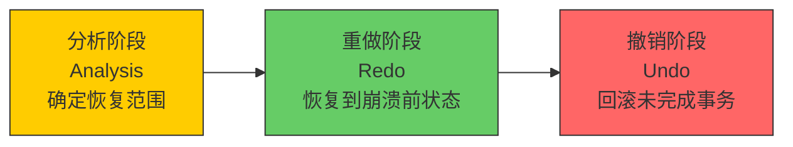
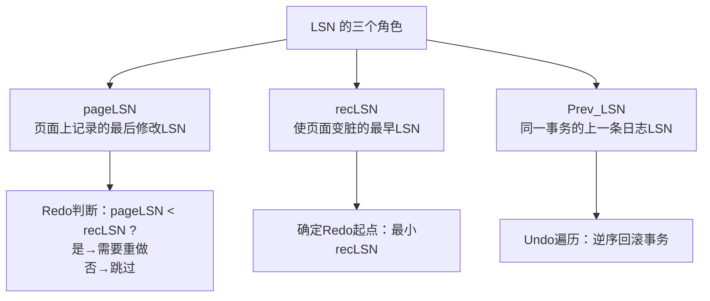
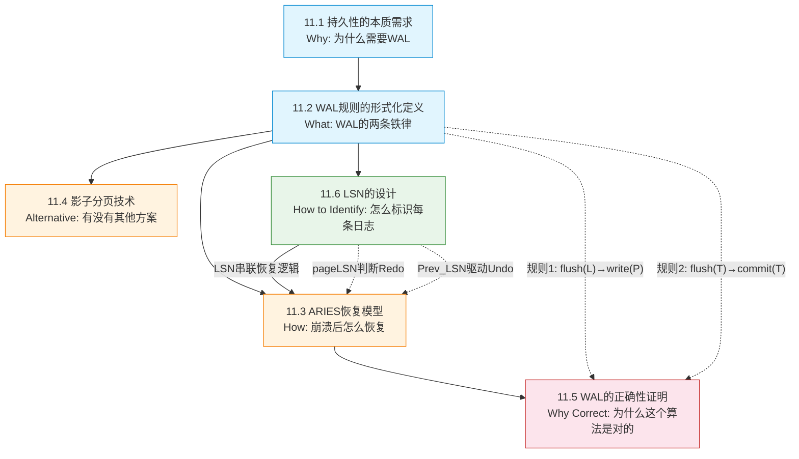

## 11.7 本节小结 — 理论框架的完整回顾

### 本节学习目标

完成理论基础部分的学习后，你应该能够回答以下核心问题：

1. **为什么**数据库需要WAL？（持久性的本质需求）
2. **什么是**WAL的两条不可违反的规则？（形式化定义）
3. **如何**在崩溃后正确恢复数据？（ARIES三阶段）
4. **有没有**替代方案？WAL为何胜出？（影子分页对比）
5. **凭什么**说WAL是正确的？（正确性证明）
6. **怎样**用一个标识符串联整个体系？（LSN设计）

理论基础部分从这六个维度构建了WAL的完整知识体系：从"为什么需要持久化"出发，到"WAL规则的形式化定义"，再经由"ARIES恢复模型"理解崩溃恢复机制，通过"影子分页"建立对比视角，用"正确性证明"确认WAL的理论完备性，最终以"LSN设计"串联所有组件。本节将这些知识点编织成一张完整的逻辑网络，帮助你在进入核心技巧部分之前建立稳固的认知框架。

---

### 核心知识点回顾

#### 1. 持久性的本质需求（11.1）

ACID中的"D"——持久性（Durability）——要求事务一旦提交，其效果必须永久保留，即使系统发生崩溃。这一需求的本质来源于一个现实：**磁盘写入不是原子的**。数据库页面通常以8KB或16KB为单位写入，而一笔事务可能涉及多个页面的修改。在"页面A已写入、页面B未写入"的中间状态下断电，数据就会处于不一致状态。

**核心结论**：持久性不是"数据一直在磁盘上"，而是"崩溃后能恢复到一致状态"。WAL是实现这一目标的核心机制。

**需要区分的概念**：

| 概念 | 含义 | 关系 |
|------|------|------|
| 持久性（Durability） | 已提交事务的效果不可丢失 | ACID的组成部分 |
| 崩溃恢复（Crash Recovery） | 系统崩溃后恢复到一致状态 | 实现持久性的手段 |
| WAL | 先写日志再写数据的协议 | 崩溃恢复的主流实现 |
| 原子性（Atomicity） | 事务要么全部完成要么全部回滚 | WAL同时保证原子性和持久性 |

**常见误区**：很多人认为持久性就是"数据写到磁盘了"，其实不然。即使数据已经写入磁盘，如果只是部分页面写入（例如事务涉及3个页面，只写了1个），崩溃后数据仍然不一致。持久性的真正含义是：**通过日志记录，恢复程序能够在崩溃后将数据库推进到某个一致性状态**——要么事务全部完成（Redo），要么事务全部撤销（Undo），不存在中间态。

#### 2. WAL规则的形式化定义（11.2）

WAL的核心被浓缩为两条不可违反的规则：

**规则1——日志先于数据**：如果数据页面P的修改对应的日志记录为L，那么L必须在P之前刷到磁盘。形式化表述：

flush(L) → write(P)

这里的"→"表示"发生在之前"，即L的flush完成之后，才允许P的write发生。这条规则保证了：**任何时候崩溃，日志都比数据更完整**——要么日志和数据都在磁盘上（正常），要么日志在但数据不在（恢复时可重做），但绝不会出现数据在而日志不在的情况。

**规则2——提交先于完成**：如果事务T提交，那么T的所有日志记录必须已经在磁盘上。形式化表述：

flush(all_logs(T)) → commit_return(T)

规则2保证了：当应用收到"提交成功"的确认时，即使下一微秒系统崩溃，恢复程序也能从日志中找到该事务的所有修改并重做。**这条规则是"提交承诺"的磁盘级保障**。

**日志记录的关键字段**：

| 字段 | 作用 | 在恢复中的角色 |
|------|------|---------------|
| LSN | 日志记录的唯一标识（字节偏移量） | 驱动Redo判断：pageLSN < recLSN 时需要重做 |
| Prev_LSN | 该事务上一条日志的LSN | Undo时逆序遍历事务日志链 |
| TxnID | 事务标识 | 判断事务是否活跃（需要回滚） |
| Type | 日志类型（Update/Commit/Abort/CLR） | 决定恢复时的处理逻辑 |
| PageID | 被修改的页面标识 | 定位需要Redo的物理页面 |
| Before Image | 修改前的页面内容（或行内容） | Undo时恢复原值 |
| After Image | 修改后的内容 | Redo时重新应用修改 |

**常见误区**：规则2中的"all_logs(T)"指的是事务T的**所有**日志记录，不仅仅是COMMIT记录。如果一条更新日志没有刷盘，即使COMMIT记录已经刷盘，恢复时也无法重做那条更新。因此，COMMIT记录本身并不需要先于其他日志刷盘——但规则要求它必须在**所有**日志之后刷盘。在实际实现中，这意味着COMMIT记录的刷盘是通过一次sync操作同时保证所有日志都已持久化的。

#### 3. ARIES恢复模型（11.3）

ARIES（Algorithms for Recovery and Isolation Exploiting Semantics）由IBM于1992年提出，是现代数据库恢复的事实标准。其核心思想是**生理恢复**（Physiological Recovery）：日志记录在物理层面描述"哪个页面的哪个偏移"，在逻辑层面描述"做了什么操作"。这种"物理+逻辑"的混合方式既保证了恢复的精确性，又允许一定程度的平台无关性。

三个阶段按固定顺序执行，不可颠倒：

**阶段1：分析（Analysis）**——从最后一个检查点开始扫描日志，确定三件事：
- 崩溃时哪些事务是活跃的（需要回滚）
- 每个脏页面的recLSN（最早使该页面变脏的日志LSN）
- Redo的起始LSN（所有脏页面中最小的recLSN）

分析阶段的输出是Redo和Undo阶段的"任务清单"——没有这个清单，后续阶段无从下手。

**阶段2：重做（Redo）**——从Redo起始LSN开始，逐条重放日志记录。对于每条更新日志，检查 `page.pageLSN < record.LSN`：如果成立，说明该修改尚未反映到磁盘，需要重新应用；否则跳过（幂等性保证）。Redo阶段的关键特性是**前向扫描**（forward scan）——它不关心事务是否已提交，只关心页面是否需要修复。已提交事务和未提交事务的修改都会被重做，这是因为未提交事务的修改会在Undo阶段被撤销。

**阶段3：撤销（Undo）**——对所有活跃事务，利用Prev_LSN链逆序回滚。每回滚一条记录，写入一条**补偿日志记录**（CLR，Compensation Log Record）。CLR的设计精妙之处在于：它只记录Redo信息、永远不需要被Undo。这保证了如果恢复过程中再次崩溃，重做阶段能正确重放CLR的效果，而Undo阶段不会重复撤销。CLR的这种"只进不退"的特性，使得ARIES能够在**任意时刻崩溃后正确恢复**——即使崩溃发生在恢复过程中。

**为什么顺序不可颠倒**：分析阶段确定的Redo起点和活跃事务列表是后续阶段的基础。没有分析结果，Redo不知道从哪里开始，Undo不知道回滚谁。Redo必须在Undo之前，因为Undo产生的CLR需要被Redo正确重放。如果先Undo再Redo，可能会出现：Undo已经撤销了某个修改，但Redo又把它重做了回来，导致最终状态不一致。

**常见误区**：Redo阶段"重做所有修改（包括未提交事务）"这一点常常让人困惑。直觉上，未提交事务的修改不应该被重做。但ARIES的设计哲学是：**先将磁盘恢复到崩溃前的精确状态，再清理不需要的修改**。这样做有两个好处：一是Redo逻辑更简单（不需要检查事务状态），二是CLR机制已经优雅地解决了Undo问题。

#### 4. 影子分页技术（11.4）

影子分页是WAL的主要替代方案，其核心思路是**不原地修改**：修改页面时，将修改后的完整页面写入磁盘的新位置，然后更新指向该页面的指针。未修改的页面继续指向原位置（"影子"）。

| 对比维度 | WAL | 影子分页 |
|----------|-----|---------| 
| 日志开销 | 需要日志文件 | 无需日志 |
| 写入量 | 日志记录（通常远小于完整页面） | 完整页面副本 |
| 恢复方式 | 日志重放 | 页面指针链遍历 |
| 空间效率 | 日志可顺序追加、循环利用 | 每次修改产生新页面，空间浪费 |
| 并发支持 | 读写可并发（MVCC） | 并发控制复杂 |
| 垃圾回收 | 简单（日志段轮转） | 需要复杂的页面回收机制 |
| 实际采用 | PostgreSQL、MySQL、Oracle、SQL Server | 极少（LMDB等嵌入式DB在特定场景使用） |

**影子分页的根本劣势**：每次修改都写入完整页面（如8KB-16KB），而WAL只需要写入几十到几百字节的日志记录。对于随机修改密集的OLTP场景，WAL的空间效率高出1-2个数量级。此外，影子分页的指针链遍历恢复速度远慢于WAL的日志顺序重放。

**影子分页的适用场景**：尽管影子分页在通用数据库中已很少使用，但在某些嵌入式场景下仍有价值。LMDB（Lightning Memory-Mapped Database）采用B+树+copy-on-write的方式，适合读多写少、数据量可控、不需要复杂事务支持的场景。它的优势在于：读操作零拷贝（直接通过mmap访问）、写操作原子性天然保证、无需单独的垃圾回收线程。理解影子分页，有助于你在面对嵌入式存储选型时做出更准确的判断。

#### 5. WAL的正确性证明（11.5）

正确性证明的核心是建立两个不变量，证明只要WAL规则被遵守，恢复结果就一定是正确的。

**不变量1（原子性保证）**：如果一个事务的所有日志记录都在磁盘上，那么恢复时ARIES能够找到该事务的全部修改并正确重做，或者找到其ABORT日志并正确回滚。不存在"日志说提交了但数据只写了一半"的状态。

**不变量2（持久性保证）**：如果一个事务的COMMIT日志记录已经在磁盘上，那么即使系统崩溃，恢复程序也一定能重做该事务的所有修改。这是因为COMMIT记录的持久化依赖于规则2 `flush(all_logs(T)) → commit_return(T)`，而规则1 `flush(L) → write(P)` 保证了每条日志先于对应的页面修改。

**证明的关键依赖**：
- **LSN的单调递增性**：保证日志序与物理时间序一致。如果LSN不是单调的，恢复时的排序和判断都会出错。
- **Redo的幂等性**：同一条日志重放多次结果相同（先检查pageLSN）。这是ARIES能在多次崩溃后正确恢复的基石——同一条日志可能在第一次恢复中被重做，如果恢复过程中又崩溃了，第二次恢复可能再次重做同一条日志，结果必须一致。
- **CLR的不可撤销性**：补偿操作一旦记录就不会被撤销，即使恢复中再次崩溃。这保证了Undo过程的幂等性——多次Undo的结果与一次Undo相同。

**为什么正确性证明对工程师重要**：正确性证明不是学术装饰，而是工程决策的基石。当你需要修改WAL实现（如调整刷盘策略、优化恢复流程）时，正确性证明告诉你哪些不变量不能违反。违反不变量 = 引入数据丢失风险，这是不可接受的。

#### 6. LSN的设计（11.6）

LSN（Log Sequence Number）是WAL系统的"万能钥匙"——同一个标识符在日志、页面、恢复逻辑中扮演不同角色，串联起整个体系。

**LSN的本质**：通常是日志文件中的字节偏移量。例如PostgreSQL中LSN是一个64位整数，低32位是日志文件内的偏移，高32位是时间线ID。MySQL InnoDB则使用简单的64位递增序号。不同实现的LSN编码不同，但核心语义一致：**LSN越大，表示日志记录越新**。

**LSN在恢复中的三个角色**：

- **pageLSN**：记录在每个数据页面的头部，表示"最后修改该页面的日志LSN"。恢复时用它判断页面是否已经包含最新修改。如果页面的pageLSN ≥ 当前日志记录的LSN，说明该修改已经反映到磁盘上，无需重做。
- **recLSN**：记录在每个脏页面上，表示"最早使该页面变脏的日志LSN"。分析阶段通过扫描所有页面的recLSN，找到全局最小值作为Redo起点。这个设计确保了Redo不会遗漏任何需要重做的修改。
- **Prev_LSN**：记录在每条日志中，指向同一事务的上一条日志。Undo阶段通过Prev_LSN链逆序遍历，逐条撤销。当Prev_LSN为NULL时，表示已到达该事务的第一条日志，回滚完成。

**LSN的存储编码**：通常使用8字节（64位）整数。以当前日志写入速度（每秒数MB），一个64位LSN可以支持数百年的持续运行，无需担心溢出。但如果使用32位LSN（如早期某些嵌入式数据库），在高写入场景下可能在数天内耗尽，导致系统不可用。

**LSN的跨系统差异**：

| 数据库 | LSN编码 | 特点 |
|--------|---------|------|
| PostgreSQL | 64位 = 时间线ID(32) + 偏移(32) | 支持时间线切换（PITR基础） |
| MySQL InnoDB | 64位递增序号 | 简单直接，不区分日志文件 |
| SQL Server | LSN = 三元组(虚拟设备号, 偏移, 序号) | 支持多日志文件 |
| SQLite WAL | 32位递增帧号 | 轻量级，适用于嵌入式场景 |

---

### 理论框架的知识地图

六个知识点之间不是线性递进，而是网状关联：

六个知识点之间不是线性递进，而是网状关联：

- **WAL规则**（11.2）是整个体系的基石——ARIES恢复依赖它，正确性证明围绕它，LSN是它的执行载体。理解规则1和规则2，就理解了WAL的"为什么"。
- **ARIES三阶段**（11.3）是WAL规则在崩溃场景下的具体执行方案。分析→重做→撤销的顺序不是任意的，而是由数据依赖关系决定的。
- **LSN**（11.6）是串联分析→重做→撤销的纽带——分析阶段产出LSN信息，Redo阶段用LSN判断是否需要重做，Undo阶段用LSN遍历回滚链。没有LSN，ARIES的三个阶段就失去了协调机制。
- **正确性证明**（11.5）从数学角度确认：只要遵守WAL规则，ARIES恢复的结果一定正确。它回答了"凭什么相信这个方案"的终极问题。
- **影子分页**（11.4）通过对比反衬WAL的优势——不是"WAL很好"，而是"在所有替代方案中，WAL在空间效率、恢复速度、并发支持三个维度上都占优"。理解替代方案的劣势，才能真正理解WAL的优势。

**一句话总结整个理论框架**：WAL通过两条规则保证日志比数据更完整，ARIES利用这些规则在崩溃后执行分析→重做→撤销三阶段恢复，LSN作为唯一标识符串联整个流程，正确性证明确认这套机制在数学上是完备的。

---

### 核心公式与不变量速查

| 公式/不变量 | 形式化表述 | 直觉理解 |
|------------|-----------|---------|
| WAL规则1 | `flush(L) → write(P)` | 日志比数据先到磁盘——万一数据写到一半崩溃，日志完整，恢复可重做 |
| WAL规则2 | `flush(all_logs(T)) → commit_return(T)` | 提交前日志全部到盘——"提交成功"的承诺有磁盘级保证 |
| Redo条件 | `page.pageLSN < record.LSN` | 页面的日志版本落后于当前日志→需要补上这次修改 |
| 原子性不变量 | 日志全在盘 → 修改可恢复 | 崩溃后要么全做完（Redo），要么全不做（Undo） |
| 持久性不变量 | COMMIT日志在盘 → 效果不可丢失 | 已确认的提交不会因崩溃而消失 |
| LSN单调性 | LSN(n+1) > LSN(n) | 日志序号只增不减，保证恢复判断的一致性 |
| Redo幂等性 | Redo(Redo(X)) = Redo(X) | 同一条日志重放多次结果不变——崩溃恢复中可能重复重做 |
| CLR不可逆 | Undo(CLR) = 无操作 | 补偿记录一旦写入就无法撤销——即使恢复中再次崩溃 |

---

### 理论部分的常见误区

在学习WAL理论的过程中，以下误区经常出现：

| 误区 | 正确理解 | 深层原因 |
|------|---------|---------|
| "持久性 = 数据写到磁盘" | 持久性 = 崩溃后能恢复到一致状态 | 混淆了"写入"和"一致" |
| "COMMIT记录先于其他日志刷盘" | COMMIT记录是最后刷盘的——它依赖所有日志已持久化 | 误解了规则2的依赖方向 |
| "Redo只重做已提交事务" | Redo重做所有修改（包括未提交的），由Undo负责清理 | ARIES的"先恢复后清理"哲学 |
| "WAL保证性能" | WAL的首要目标是正确性，性能优化是工程实现层面的事 | 混淆了设计目标和副作用 |
| "LSN只用于日志" | LSN同时存在于日志、数据页面、恢复逻辑中 | LSN是跨组件的协调机制 |
| "检查点是恢复的起点" | 检查点是分析阶段的起点，Redo的起点是分析阶段确定的最小recLSN | 简化了恢复流程 |
| "影子分页没有日志" | 影子分页不需要单独的日志文件，但页面指针变更本身也需要持久化 | "无需日志"是指无需单独的日志文件 |

---

### 自我检测：确认你掌握了这些内容

读完理论部分后，尝试回答以下问题。如果某个问题回答困难，说明对应的知识点需要回看。

**基础理解（必须掌握）**：

1. 为什么数据库不能直接修改数据文件，而要先写日志？用一个具体场景说明。
   > 提示：考虑一个事务修改3个页面，只写完第1个页面时崩溃的情况。如果没有日志，恢复程序无法知道第1个页面应该被修改（已写入）还是应该恢复原值（因为事务未完成）。

2. WAL的两条规则分别保证了什么？如果违反其中一条会怎样？
   > 提示：违反规则1——数据先于日志刷盘，崩溃后日志不完整，无法重做。违反规则2——COMMIT先于日志刷盘，应用以为提交成功，但恢复时发现日志不完整。

3. ARIES恢复的三个阶段分别解决什么问题？为什么顺序不能是"重做→分析→撤销"？
   > 提示：没有分析结果，Redo不知道从LSN哪里开始，Undo不知道回滚哪些事务。分析阶段的输出是后续阶段的"任务清单"。

**深入理解（建议掌握）**：

4. Redo阶段的判断条件 `pageLSN < recLSN` 为什么能保证正确性？如果省略这个判断（每次都重做）会怎样？
   > 提示：省略判断不会导致不正确（幂等性保证），但会导致大量不必要的页面写入，严重影响恢复性能。pageLSN检查是一种优化——它利用了"页面可能已经包含最新修改"这个事实。

5. CLR（补偿日志记录）为什么只需要Redo信息而不需要Undo信息？如果恢复中再次崩溃，CLR如何保证正确性？
   > 提示：CLR记录的是"已经撤销了什么"，这是一个确定性操作。如果重做CLR，结果与第一次撤销相同（幂等性）。如果再次Undo CLR，则可能出现"撤销了撤销"的无限循环。

6. LSN的pageLSN和recLSN分别在恢复的哪个阶段被使用？它们的角色有什么区别？
   > 提示：pageLSN在Redo阶段使用（判断是否需要重做），recLSN在分析阶段使用（确定Redo起点）。pageLSN是"最后修改时间"，recLSN是"最早修改时间"。

**进阶思考（选读）**：

7. 影子分页在什么场景下可能比WAL更有优势？
   > 提示：考虑三个维度——(1)写入模式：顺序写入大块数据时，影子分页的完整页面写入代价与WAL差距缩小；(2)并发需求：读多写少、不需要复杂MVCC的嵌入式场景；(3)资源约束：内存和CPU极度受限，无法维护日志缓冲区和恢复逻辑。

8. 如果将LSN从64位改为32位，在什么条件下会出问题？
   > 提示：32位LSN最大值约42亿。如果日志写入速度为100MB/s，每条日志记录100字节，则每秒约100万条日志。42亿条日志约4200秒（70分钟）就会耗尽。高写入场景下，32位LSN可能在不到一天内溢出。

9. WAL规则2中的"flush"是否必须是同步刷盘？在什么条件下可以放松？
   > 提示：如果操作系统保证断电时刷盘缓冲区的内容不丢失（如电池-backed RAID控制器），可以放松为异步刷盘。但这引入了硬件依赖——如果电池失效或RAID控制器故障，放松的规则可能导致数据丢失。

---

### 从理论到实践的桥梁

理论基础回答了"为什么WAL能保证数据安全"。但知道"为什么"还不够——生产环境中你面对的真实问题是：

| 理论假设 | 工程现实 | 代价 |
|---------|---------|------|
| 每次写入都刷盘 | fsync延迟1-10ms，高并发下吞吐量骤降 | 需要组提交优化 |
| 日志文件无限增长 | 磁盘空间有限，需要定期清理 | 需要段轮转和归档策略 |
| 崩溃后立即恢复 | 日志积累10GB，恢复要重放多久？ | 需要检查点缩短恢复时间 |
| 日志缓冲区是内存与磁盘的桥梁 | 缓冲区大小、刷盘时机影响性能 | 需要精细的缓冲区管理 |
| WAL和MVCC/锁独立工作 | 并发控制需要与日志协同 | 需要理解LSN与事务状态的关系 |

这些问题将在**核心技巧**部分（11.8-11.13）逐一解答。核心技巧部分的六个主题与理论基础的对应关系：

| 理论基础（为什么） | 核心技巧（怎么做） | 核心权衡 |
|------------------|-------------------|---------|
| WAL规则要求日志先于数据 | 组提交：多事务合并一次fsync，将规则2的代价分摊 | 延迟 vs 吞吐量 |
| ARIES需要日志持久化 | fsync的正确使用：理解POSIX语义，避免虚假安全 | 正确性 vs 性能 |
| 检查点是分析阶段的起点 | 检查点策略：模糊检查点 vs 同步检查点 | 恢复时间 vs 写入性能 |
| 日志缓冲区是内存与磁盘的桥梁 | 日志缓冲区管理：双缓冲、WAL Writer线程、写入策略 | 内存占用 vs 刷盘频率 |
| 日志文件持续增长 | WAL文件生命周期：段轮转、归档、PITR | 存储成本 vs 数据可恢复性 |
| LSN驱动恢复判断 | 并发控制协同：WAL与MVCC、锁的配合 | 并发度 vs 恢复复杂度 |

理论基础建立认知框架，核心技巧解决工程实现。掌握了"为什么"，你就能在面对具体问题时做出正确的设计决策，而不是机械地复制配置参数。

---

### 学习路径建议

不同背景的读者，建议的学习路径有所不同：

**如果你是数据库初学者**：
1. 先通读11.1（持久性需求）和11.2（WAL规则），建立直觉
2. 重点理解11.3（ARIES三阶段），用mermaid图辅助记忆
3. 11.4（影子分页）快速浏览，重点看对比表格
4. 11.5（正确性证明）和11.6（LSN）可以先跳过，等核心技巧部分学完再回看
5. 做完基础理解的3道自测题即可进入核心技巧部分

**如果你有数据库使用经验但未深入原理**：
1. 11.1-11.3快速回顾，重点关注形式化定义和ARIES三阶段
2. 11.4对比WAL和影子分页，思考"为什么几乎所有数据库都选WAL"
3. 11.5-11.6认真阅读，理解正确性保证和LSN的串联作用
4. 做完基础+深入理解的6道自测题
5. 对进阶思考题尝试回答，即使不确定也值得思考

**如果你是数据库内核开发者或研究者**：
1. 全部六个小节精读，特别关注11.5的正确性证明逻辑
2. 对照ARIES原始论文（1992年Mohan et al.）理解本节的简化描述
3. 研究LSN在不同数据库中的编码差异，思考设计取舍
4. 完成全部9道自测题
5. 尝试修改一个不变量（如放松规则2），分析会导致什么问题

---

### 进一步学习资源

**学术论文**：
- Mohan C, Haderle D, Lindsay B, et al. "ARIES: A Transaction Recovery Method Supporting Fine-Granularity Locking and Partial Rollbacks Using Write-Ahead Logging." *ACM Transactions on Database Systems*, 17(1):94-162, 1992. — ARIES的原始论文，恢复模型的权威来源。建议重点阅读Section 3（ARIES概述）和Section 6（恢复算法）。
- Bernstein P, Hadzilacos V, Goodman N. "Concurrency Control and Recovery in Database Systems." Addison-Wesley, 1987. — 事务处理的经典教材，覆盖WAL的理论基础和并发控制的数学模型。
- Gray J, Reuter A. "Transaction Processing: Concepts and Techniques." Morgan Kaufmann, 1993. — Jim Gray的"圣经级"著作，第14章专门讨论WAL，第7章讨论恢复。适合深入理解工程实现与理论的桥梁。

**开源项目源码**（按难度排序）：
- SQLite `src/wal.c` — 轻量级WAL的精简实现（约3000行），适合入门阅读。可以从`walFrames()`函数开始，理解WAL写入的基本流程。
- PostgreSQL `src/backend/access/transam/xlog.c` — WAL实现的最完整参考（约10000行）。重点阅读`XLogInsertRecord()`（日志插入）和`StartupXLOG()`（恢复启动）。
- MySQL InnoDB `storage/innobase/log/log0log.cc` — Redo Log的循环缓冲区实现。重点阅读`log_group_check_file_is_ok()`（检查点）和`recv_recovery_from_checkpoint_start()`（恢复）。
- LMDB `libraries/libmdb/mdb.c` — 影子分页的实际实现，用于对比理解。`mdb_page_touch()`函数展示了copy-on-write的页面管理。

**实践建议**：
- 使用 `pg_waldump`（PostgreSQL）或 `ib_logfile0`（MySQL）观察真实WAL日志的结构，将字段与11.2节的日志记录格式表对应
- 在SQLite中切换 `PRAGMA journal_mode=WAL`，对比DELETE模式和WAL模式的性能差异（可用 `PRAGMA journal_mode` 查看当前模式）
- 人为模拟崩溃（`kill -9`），观察数据库恢复过程的日志输出，验证ARIES三阶段是否如11.3节所述顺序执行
- 使用 `pg_controldata`（PostgreSQL）查看控制文件中的LSN信息，将理论中的LSN概念与实际存储对应
- 在MySQL中设置 `innodb_flush_log_at_trx_commit=0/1/2`，测试不同刷盘策略对性能和安全性的影响，体会WAL规则2的实际含义
