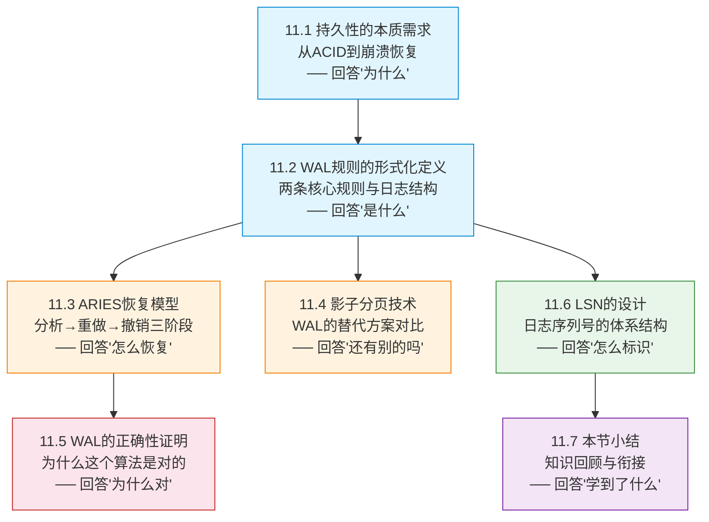

# 第一部分：理论基础

> **本部分定位**：从持久性的本质需求出发，建立WAL的完整理论框架。这是理解后续所有工程技巧和实战案例的根基——不懂"为什么"，就无法在生产环境中做出正确的设计决策。

## 为什么必须先学理论

许多工程师在使用数据库时，只关注"怎么配置WAL参数"，却很少思考"WAL为什么能保证数据不丢失"。这种知其然不知其所以然的做法，在以下场景中会暴露严重短板：

**场景一：生产事故无法定位根因**

数据库崩溃恢复后发现部分数据丢失。如果只懂配置，你只能逐个尝试调整参数（增大WAL缓冲区、改fsync策略……），像无头苍蝇一样碰运气。但如果你理解了WAL规则2（提交前日志必须刷盘），就会立即检查 `synchronous_commit` 的设置——如果是 `off`，那事务提交时日志可能根本没有刷盘，丢失是"符合设计"的，根本不是bug。

**场景二：性能调优陷入两难**

写入吞吐量上不去，DBA建议增大 `wal_buffers`，但你不知道这是否有效。如果你理解组提交（Group Commit）的原理，就会明白瓶颈可能不在缓冲区大小，而在 `commit_delay` 的等待时间窗口——组提交把多个事务的日志合并后一次fsync刷盘，等待窗口决定了合并的事务数量，这比缓冲区大小对吞吐量的影响大一个数量级。

**场景三：架构选型缺乏理论依据**

要为新系统选择数据库——PostgreSQL还是MySQL？你在网上搜到的帖子各说各话。但如果你从理论上对比两者的WAL实现：PostgreSQL采用追加式WAL（支持PITR和逻辑复制），MySQL InnoDB采用循环Redo Log（空间管理简单但不支持归档），你就能根据业务需求（是否需要时间点恢复？是否需要CDC？）做出有据可依的决策，而不是被社区偏见误导。

**场景四：自研存储系统埋下隐患**

要设计自己的WAL子系统，如果没有形式化的正确性证明，你可能写出"在测试环境正常、在生产环境崩溃后丢数据"的代码。ARIES恢复模型的不变量分析——"如果一个事务的所有日志记录都在磁盘上，那么该事务的所有修改也都在磁盘上"——是验证自研WAL正确性的理论基石。

> **一句话总结**：理论不是象牙塔里的装饰品，而是你在生产环境中做出正确决策的底层操作系统。没有理论支撑的"经验"，在边界场景下不堪一击。

## 本部分的知识地图

以下是理论基础部分七个小节的逻辑关系。每一步都建立在前一步的基础上，形成"需求→规则→恢复→替代→证明→标识→总结"的完整链条：

**阅读路径说明**：这七个小节不是孤立的知识点，而是一条推理链。11.1提出问题（为什么需要持久化？），11.2给出解决方案（WAL规则），11.3展示恢复过程（ARIES），11.4对比替代方案（影子分页），11.5证明正确性（形式化证明），11.6剖析核心数据结构（LSN），11.7总结回顾。**建议按顺序阅读，不要跳节。** 如果你时间有限，11.1→11.2→11.6是最低限度的核心路径。

## 核心思维模型：两个规则，三个阶段

在深入各节细节之前，先建立一个高层次的心智模型。整个WAL理论可以浓缩为"**两个规则 + 三个阶段 + 一个标识符**"：

| 概念 | 一句话 | 类比 | 为什么重要 |
|------|--------|------|-----------|
| **WAL规则1**：日志先于数据 | 数据页面写入磁盘前，对应的日志必须已刷盘 | 先拍照片再移动家具——万一搬坏了，照片能证明原来的样子 | 保证**原子性**：崩溃后能撤销未完成的修改 |
| **WAL规则2**：提交先于完成 | 事务返回"提交成功"前，其所有日志必须已刷盘 | 银行告诉你"转账成功"之前，交易记录必须已写入账本 | 保证**持久性**：已提交的数据不会丢失 |
| **ARIES三阶段**：分析→重做→撤销 | 崩溃恢复按固定顺序执行三个步骤 | 先勘察现场（分析），再恢复原状（重做），最后清理未完成的工作（撤销） | 保证恢复的**正确性**和**效率** |
| **LSN** | 每条日志的唯一身份证，单调递增 | 快递单号——保证每件包裹可追踪、可排序 | 串联上述所有机制的核心数据结构 |

把这个表记在脑子里，后续七个小节的内容都是在展开这个骨架。

## 从直觉到形式化：WAL的三重理解层次

WAL可以用三个层次来理解，每个层次都更深一层：

### 第一层：直觉理解（11.1 → 5分钟）

> "数据库要保证数据不丢，就得在写数据之前先把'我打算做什么'记到一个安全的地方。"

这是WAL最朴素的直觉。就像你搬家前先拍一组照片——如果搬家过程中东西摔坏了，你可以根据照片恢复原状。日志就是那组照片，数据就是家具。

这个直觉在11.1中通过银行转账场景建立。读完11.1后，你应该能回答："如果没有WAL，断电后数据库会发生什么？"

### 第二层：规则理解（11.2 → 15分钟）

> "WAL有两条不可违反的铁律：规则1保证'先记后改'，规则2保证'先记后认'。"

从直觉上升到规则。11.2将WAL的形式化定义为两条规则，并解释了为什么主流数据库选择 No-Force + Steal 缓冲策略——因为这个组合在性能和恢复复杂度之间取得了最佳平衡，代价是必须同时支持 Undo 和 Redo。

读完11.2后，你应该能回答："为什么规则1能保证原子性？规则2能保证持久性？"

### 第三层：证明理解（11.3 + 11.5 → 30分钟）

> "ARIES通过分析→重做→撤销三阶段恢复，正确性可以通过两个不变量严格证明。"

从规则上升到证明。11.3展示恢复算法的具体执行过程，11.5从数学角度证明这个算法为什么是正确的。这两节合起来构成了WAL理论的"硬核"部分。

读完11.3和11.5后，你应该能回答："如果恢复过程中再次崩溃，ARIES为什么还能正确恢复？"——答案是CLR（补偿日志）的精妙设计。

## 前置知识自查

在开始本部分之前，请确认你具备以下基础知识。如果某项不熟悉，建议先回顾对应章节（参见章节概览中的前置知识表）：

| 知识点 | 需要掌握到什么程度 | 缺失的影响 | 建议 |
|--------|-------------------|-----------|------|
| **文件系统基础** | 理解文件写入流程、page cache 的存在 | 无法理解为什么"写入文件"不等于"写入磁盘"，这是WAL规则1的物理基础 | 至少知道 fsync 的作用 |
| **磁盘I/O特性** | 知道顺序写远快于随机写（SSD约100:1，HDD约1000:1） | 无法理解WAL"用顺序写保护随机写"这一核心设计哲学 | 不需要知道具体数字，知道量级差异即可 |
| **事务基础** | 知道ACID四个属性的含义，理解"提交"和"回滚"的区别 | 无法理解WAL要解决的核心问题 | 如果不熟悉，11.1中有详细讲解 |
| **基本的数据结构** | 理解链表、偏移量的概念 | 无法理解Prev_LSN链和LSN的字节偏移量编码 | 大多数程序员已具备 |

> **零基础也可以开始**：即使某些前置知识不完全具备，11.1从最基础的概念讲起，会帮你建立必要的上下文。但如果你对"page cache"和"fsync"完全陌生，建议先浏览第6章（文件系统）和第7章（I/O模型）的核心概念。

## 各节详细导读

以下是理论基础七个小节的详细导读，包括每节的核心问题、学习目标、难点预警和学习建议。

---

### 11.1 持久性的本质需求 — 为什么必须持久化

**核心问题**：数据库断电后，如何保证已提交的数据不丢失？

**本节在做什么**：从ACID中"D（Durability）"的定义出发，用银行转账场景直观展示没有持久化保证时会发生什么灾难，然后分析磁盘写入为什么不是原子操作，进而引出WAL作为解决方案的必然性。本节是整个理论体系的逻辑起点——后面所有规则和算法，都是为了满足这一节提出的需求。

**学完你应该能回答**：
- 持久性的形式化定义是什么？它和"崩溃恢复"有什么区别？
- 为什么"把数据写入磁盘"这个看似简单的操作，实际上非常困难？
- Steal/Force策略矩阵的四种组合分别意味着什么？

**关键概念**：持久性（Durability）、崩溃恢复（Crash Recovery）、原子性（Atomicity）、ACID模型、缓冲策略矩阵

**难点预警**：本节没有技术难点，但需要仔细理解持久性的形式化定义。那个数学公式 `∀T (committed(T) → after_crash(effects(T) ⊂ disk))` 不是装样子——后续的正确性证明全部建立在这个定义之上。

**学习建议**：初学者必读，不要跳过。有经验的开发者可快速浏览，但建议重点关注11.1.2节"为什么持久性如此困难"——即使你已经知道答案，重新审视这个分析也会加深理解。

**预计时间**：15-20分钟

---

### 11.2 WAL规则的形式化定义 — 两条铁律

**核心问题**：WAL到底规定了什么？为什么是"先写日志"而不是其他顺序？

**本节在做什么**：将WAL的核心规则形式化为两条不可违反的铁律，并解释为什么主流数据库选择 No-Force + Steal 缓冲策略。同时详细解析日志记录的内部结构，包括每个字段的设计意图。本节是整个理论部分最核心的一节——理解了这两条规则，后面所有的恢复算法和正确性证明都迎刃而解。

**学完你应该能回答**：
- WAL规则1（`flush(L) → write(P)`）和规则2（`flush(all_logs(T)) → commit_return(T)`）分别保证什么？
- 为什么主流数据库选择 No-Force + Steal？这个选择的代价是什么？
- 一条日志记录里有哪些字段？Redo信息和Undo信息分别存什么？

**关键概念**：WAL规则1（日志先于数据）、WAL规则2（提交前日志刷盘）、Steal/No-Steal、Force/No-Force、日志记录结构、Redo信息与Undo信息

**难点预警**：形式化定义使用了数学符号（`flush(L) → write(P)`），不熟悉的读者可能觉得抽象。建议用具体的时间线例子来理解——比如画出"日志刷盘时刻T1"和"数据页面写入时刻T2"的时序图，确认T1 < T2。

**学习建议**：这是理论部分最重要的一节。建议反复阅读，直到能用自己的话解释两条规则的含义。本节的缓冲策略矩阵（Steal/Force 2×2）是一个重要的分析框架，后续对比不同数据库实现时会反复用到。

**预计时间**：25-30分钟

---

### 11.3 ARIES恢复模型 — 恢复的三阶段

**核心问题**：崩溃发生后，数据库如何从日志中恢复到一致状态？

**本节在做什么**：详细拆解ARIES（Algorithms for Recovery and Isolation Exploiting Semantics）恢复算法的三个阶段——分析（Analysis）、重做（Redo）、撤销（Undo），以及补偿日志（CLR）的精妙设计。ARIES是IBM于1992年提出的恢复算法，被PostgreSQL、MySQL InnoDB、SQL Server等几乎所有现代关系数据库采用。

**学完你应该能回答**：
- ARIES三个阶段分别解决什么问题？为什么顺序不能颠倒？
- Redo的判断条件是什么？（`page.pageLSN < record.LSN`）
- CLR为什么只记录Redo信息、永远不会被Undo？这对"恢复中再次崩溃"有什么意义？
- 活动事务表（ATT）和脏页表（DPT）在恢复中扮演什么角色？

**关键概念**：分析阶段、重做阶段、撤销阶段、生理恢复（Physiological Recovery）、补偿日志（CLR）、Redo条件、Undo链、活动事务表（ATT）、脏页表（DPT）

**难点预警**：这是理论部分最复杂也最重要的一节。难点在于需要同时理解多个交互变量（LSN、pageLSN、recLSN、CLR、Prev_LSN链）以及它们在三个阶段中如何协作。初学者最常见的两个困惑是：
1. "为什么Redo要在Undo之前？"——因为Redo确保所有已修改的页面恢复到崩溃前的状态，然后Undo才能正确地回滚未提交事务。
2. "CLR为什么只记Redo不记Undo？"——因为CLR记录的是"补偿操作已经执行"这一事实。如果恢复过程中再次崩溃，CLR只需要重做（重新执行补偿），不需要再次撤销补偿。这是一个优雅的递归终止条件。

**学习建议**：这是理论部分的核心章节，建议预留充足时间。推荐的学习策略是：先通读一遍理解三个阶段各自的目标，然后用一个3-5条日志的小例子，手动画出三阶段的执行过程，最后再回头精读形式化定义。本节中的代码示例就是为了辅助这个过程设计的——不要跳过。

**预计时间**：40-50分钟

---

### 11.4 影子分页技术 — WAL的替代方案

**核心问题**：除了WAL，还有没有其他方式保证持久性？为什么WAL胜出？

**本节在做什么**：分析影子分页（Shadow Paging）的工作原理——这是一种不需要日志的持久化方案，通过Copy-on-Write机制实现崩溃恢复。然后从空间开销、恢复速度、并发控制、空间回收四个维度与WAL进行系统对比，说明为什么现代数据库几乎都选择了WAL。

**学完你应该能回答**：
- 影子分页是如何通过指针更新实现崩溃恢复的？
- 为什么影子分页在空间效率、恢复速度、并发支持三个方面都不如WAL？
- 有哪些现代系统仍在使用影子分页的思想？（提示：LMDB、BoltDB等嵌入式数据库）

**关键概念**：影子分页、Copy-on-Write、指针更新、垃圾回收、空间效率对比

**难点预警**：本节技术难度不高，但需要理解影子分页的空间回收问题——每次修改都产生新页面副本，旧页面需要垃圾回收，这在高更新频率的OLTP场景下是致命的。

**学习建议**：虽然现代关系数据库很少使用影子分页，但理解它有助于深入认识WAL的设计优势。本节也是理解Copy-on-Write思想（在Redis AOF重写、Linux fork、Docker分层文件系统中广泛使用）的好机会。建议重点对比两者的恢复机制差异。

**预计时间**：15-20分钟

---

### 11.5 WAL的正确性证明 — 为什么WAL是对的

**核心问题**：如何证明WAL规则能保证事务的原子性和持久性？

**本节在做什么**：从形式化角度建立两个不变量，证明WAL的两条规则能够保证事务的原子性和持久性。核心思路是展示日志序与磁盘写入序之间的因果关系——LSN的单调递增性质保证了这种因果链的正确性。

**学完你应该能回答**：
- 不变量1（原子性）和不变量2（持久性）的精确表述是什么？
- 为什么LSN的单调递增是证明正确性的关键前提？
- 如果打破WAL规则1或规则2，具体会在什么场景下导致数据丢失？

**关键概念**：形式化证明、不变量、原子性保证、持久性保证、因果序与时间序

**难点预警**：这是理论性最强的一节，使用了较多数学符号和逻辑推理。如果你对形式化方法不熟悉，不必纠结于每个符号的精确含义，重点理解证明的整体思路：**WAL规则确保了"日志先于数据"的因果序，LSN确保了这个因果序是可追溯的，恢复算法利用这个因果序就能正确恢复。**

**学习建议**：这是理论部分最"硬核"的一节。适合希望深入理解WAL本质的读者，特别是自研存储系统的工程师——正确性证明是验证你自己的WAL实现是否正确的理论依据。如果时间有限，可以先跳过，回头再精读。但至少浏览一遍，了解证明的整体框架。

**预计时间**：25-30分钟

---

### 11.6 日志序列号（LSN）的设计 — 日志的身份证

**核心问题**：LSN如何保证日志的有序性、唯一性和可恢复性？

**本节在做什么**：深入讲解LSN（Log Sequence Number）的设计体系——它是WAL系统中最关键的数据结构，串联了日志记录、页面修改、恢复判断等所有环节。内容包括LSN的本质（字节偏移量编码）、全局作用（pageLSN、recLSN、Prev_LSN）、存储方式以及跨文件的LSN管理。

**学完你应该能回答**：
- LSN为什么通常编码为日志文件的字节偏移量？
- pageLSN和recLSN分别驱动了什么判断逻辑？
- Prev_LSN链在Undo过程中如何工作？
- 当日志文件轮转（从一个文件切换到下一个文件）时，LSN如何保持全局唯一？

**关键概念**：LSN、pageLSN、recLSN、Prev_LSN、日志文件偏移量、全局唯一性

**难点预警**：LSN本身不难理解（就是一个单调递增的编号），但它的三种用法（pageLSN控制Redo、recLSN确定恢复起点、Prev_LSN链支持Undo）需要仔细区分。最常见的混淆是把pageLSN和recLSN搞反——简单记忆：**pageLSN是"这个页面最后被哪条日志改过"，recLSN是"这个页面最早被哪条日志改脏"。**

**学习建议**：LSN是串联整个WAL体系的核心线索。理解了LSN，才能真正理解ARIES恢复模型中"什么时候需要Redo、什么时候不需要"的判断逻辑。建议结合11.3的ARIES恢复模型一起理解——LSN不是孤立的概念，它在恢复的三个阶段中各有用途。

**预计时间**：20-25分钟

---

### 11.7 本节小结 — 理论框架的完整回顾

**核心内容**：回顾本部分的六个知识点，梳理它们之间的逻辑关系，提炼核心公式和不变量，为进入下一部分（核心技巧）做好衔接。

**学完你应该能回答以下问题**（如果全部能回答，说明理论部分已掌握）：

1. WAL的两条规则分别保证了什么？用一句话概括每条规则。
2. ARIES三个阶段分别解决什么问题？顺序为什么不能颠倒？
3. LSN在恢复过程中扮演什么角色？pageLSN和recLSN有什么区别？
4. 为什么影子分页没有成为主流方案？
5. WAL正确性证明的两个不变量分别是什么？

**学习建议**：读完全部六节后，再看本节小结。不要先看小结——它假设你已经理解了各节内容，先看会失去检验效果。建议先尝试不翻书回答上面五个问题，答不出的再回去翻对应的节。

**预计时间**：10分钟

---

## 学习路径与策略

根据不同读者的基础和目标，推荐以下三种学习路径：

### 路径A：完整学习（推荐，约2.5-3小时）

11.1 → 11.2 → 11.3 → 11.4 → 11.5 → 11.6 → 11.7
  ↓       ↓       ↓       ↓       ↓       ↓       ↓
 建立需求  理解规则  掌握恢复  了解替代  证明正确  深入LSN  总结回顾

适合：初学者、自研存储系统工程师、希望建立完整知识框架的读者。

### 路径B：核心速通（约1.5小时）

11.1 → 11.2 → 11.3 → 11.6 → 11.7
  ↓       ↓       ↓       ↓       ↓
 快速过  重点读  精读    重点读  总结

跳过11.4（影子分页，现代数据库不常用）和11.5（正确性证明，偏理论）。适合：时间有限的后端开发者、DBA。**注意**：11.5建议日后补读，正确性证明对理解WAL的边界条件很有价值。

### 路径C：速览概要（约30分钟）

阅读本索引页 → 11.1前两节 → 11.2的规则定义 → 11.7小结

快速建立WAL的核心概念框架。适合：已有WAL经验、只需补充理论基础的高级工程师。

## 理论部分的核心公式与不变量

以下是本部分需要牢记的核心公式和不变量。它们是WAL理论的骨架，后续所有分析都围绕这些展开：

| 概念 | 公式/不变量 | 含义 | 保证了什么 |
|------|------------|------|-----------|
| **WAL规则1** | `flush(L) → write(P)` | 日志L刷盘先于数据页面P写入 | 原子性：崩溃后可重做或撤销 |
| **WAL规则2** | `flush(all_logs(T)) → commit_return(T)` | 事务T的所有日志刷盘先于提交返回 | 持久性：已提交数据不可丢失 |
| **Redo条件** | `page.pageLSN < record.LSN` | 页面最后修改LSN < 当前日志LSN时需要重做 | 恢复效率：跳过不需要重做的日志 |
| **原子性不变量** | 事务日志全在磁盘 → 事务修改全在磁盘 | 如果日志完整，恢复一定能重做所有修改 | 保证恢复的完整性 |
| **持久性不变量** | 事务日志已提交 → 事务效果不可丢失 | 如果日志已刷盘，即使崩溃也不丢数据 | 保证提交的可靠性 |

> **记忆技巧**：规则1管"过程安全"（操作顺序），规则2管"结果安全"（提交确认）。两个规则合起来覆盖了从"开始修改"到"告诉用户成功"的全过程。

## 本部分在全章中的位置

理论基础（本部分）──→ 核心技巧 ──→ 实战案例 ──→ 常见误区 ──→ 练习方法
     ↓                    ↓             ↓             ↓
  建立"为什么"         解决"怎么做"   验证"真的对吗"  防止"踩坑"

理论基础回答的是两个根本问题："**为什么WAL能保证数据安全**"和"**ARIES恢复为什么正确**"。后续的核心技巧部分将在此基础上，解决"怎么让WAL跑得更快"的工程优化问题（组提交、fsync策略、检查点、日志缓冲区管理）；实战案例部分则展示"真实系统中WAL是怎么设计的"（PostgreSQL WAL、MySQL Redo Log、SQLite WAL、分布式WAL）。

没有理论基础的工程实践，就像不看图纸就施工——可能碰巧不出问题，但一旦出问题就不知道为什么。

## 阅读时间预估

| 节 | 内容 | 阅读时间 | 难度 | 建议优先级 |
|----|------|---------|------|-----------|
| 11.1 | 持久性的本质需求 | 15-20min | ★★☆☆ | 必读 |
| 11.2 | WAL规则的形式化定义 | 25-30min | ★★★☆ | 必读 |
| 11.3 | ARIES恢复模型 | 40-50min | ★★★★ | 必读 |
| 11.4 | 影子分页技术 | 15-20min | ★★★☆ | 可选 |
| 11.5 | WAL的正确性证明 | 25-30min | ★★★★ | 建议读 |
| 11.6 | LSN的设计 | 20-25min | ★★★☆ | 必读 |
| 11.7 | 本节小结 | 10min | ★☆☆☆ | 必读 |
| **合计** | | **约2.5-3h** | — | — |

> **时间建议**：11.3 ARIES恢复模型是理论部分最核心也最复杂的章节，建议预留充足时间，不要和其它节连着读——消化需要时间。如果对形式化证明不感兴趣，11.5可以跳过，但11.2和11.6是理解后续所有内容的必备基础，绝对不要跳过。

## 常见学习误区

在学习理论基础部分时，初学者容易犯以下错误：

**误区一：跳过形式化定义，只看直觉解释**

直觉解释能帮你"大概理解"WAL，但无法帮你"精确诊断"生产问题。形式化定义（`flush(L) → write(P)`）看起来抽象，但它是理解ARIES恢复算法和正确性证明的唯一入口。花10分钟把形式化定义和直觉解释对应起来，后续会节省数小时的困惑。

**误区二：只记结论不理解推导**

"WAL规则1保证原子性，规则2保证持久性"——这个结论谁都能背，但如果不理解为什么，遇到变体问题（比如"如果规则1被违反了会怎样？"）就答不上来。建议在学习每条规则时，主动思考："如果我违反这条规则，具体会在什么场景下出什么问题？"

**误区三：把ARIES三阶段当成流程图死记**

ARIES的三个阶段不是随便排列的——分析阶段构建ATT和DPT，重做阶段利用这些数据结构恢复页面状态，撤销阶段利用ATT和Prev_LSN链回滚未提交事务。理解每个阶段"需要什么输入"和"产出什么输出"，比死记三阶段顺序更重要。

**误区四：觉得LSN"只是一个编号"**

LSN确实是单调递增的编号，但它的三种用法（pageLSN、recLSN、Prev_LSN）构成了ARIES恢复的判断逻辑核心。把LSN仅仅当成"日志的序号"会严重低估它的重要性——它是"什么时候需要Redo"和"怎么Undo"的唯一判断依据。

## 读后检验清单

读完理论基础全部七节后，用以下问题检验自己的理解深度：

### 基础检验（能回答说明达到了理解水平）

- [ ] 我能用自己的话解释WAL规则1和规则2，不需要看笔记
- [ ] 我能说明Steal/No-Steal和Force/No-Force四个策略组合的含义
- [ ] 我能解释为什么主流数据库选择 No-Force + Steal
- [ ] 我能说出ARIES三个阶段各自的输入和输出

### 进阶检验（能回答说明达到了掌握水平）

- [ ] 我能解释CLR为什么只记Redo不记Undo，以及这对"恢复中再次崩溃"的意义
- [ ] 我能区分pageLSN和recLSN，并说明它们分别驱动了什么判断逻辑
- [ ] 我能解释Prev_LSN链在Undo过程中如何工作
- [ ] 我能说明影子分页的Copy-on-Write机制，以及它为什么不适合高更新频率场景

### 深度检验（能回答说明达到了精通水平）

- [ ] 我能形式化表述WAL正确性证明的两个不变量
- [ ] 我能解释LSN的单调递增性质如何保证恢复算法的正确性
- [ ] 我能设计一个违反WAL规则的场景，并分析它会导致什么后果
- [ ] 我能说明ARIES的"生理恢复"设计为什么比纯物理恢复或纯逻辑恢复更优
