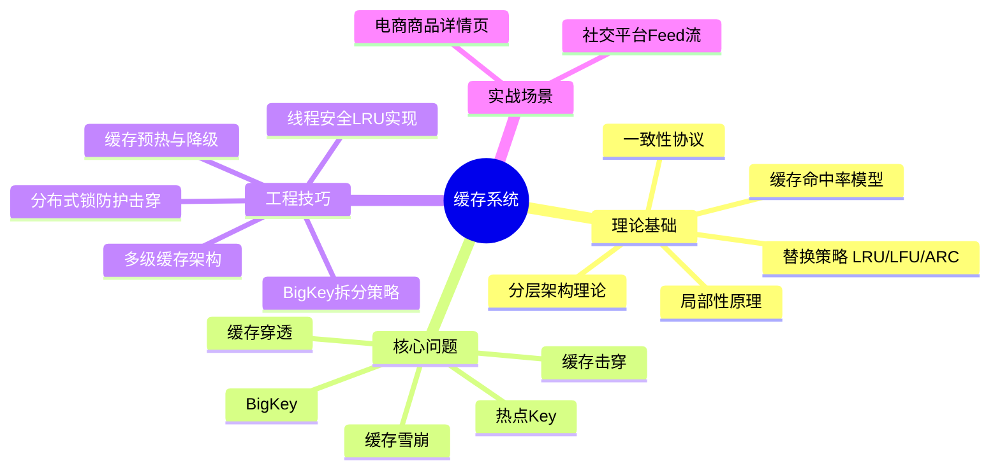

# 第12章 缓存系统

## 本章概览

缓存是计算机科学中历史最悠久、应用最广泛的性能优化手段。从CPU芯片上的L1/L2/L3高速缓存，到操作系统的页缓存（Page Cache），再到应用层的Redis、Memcached分布式缓存，缓存的身影无处不在。理解缓存系统——它的原理、陷阱和工程实践——是每一个后端工程师、架构师的必备能力。

**缓存的本质是空间换时间**：将频繁访问的数据复制到更快的存储介质中，减少对慢速数据源（数据库、磁盘、远程服务）的直接访问，从而显著降低系统延迟、提升吞吐量。但缓存绝非"加一层就能变快"那么简单——它引入了一致性问题、失效策略选择、容量规划、热点处理等一系列工程挑战。处理不当，缓存反而可能成为系统稳定性的最大隐患。

本章将从理论到实践，系统性地覆盖缓存设计的核心知识。

## 知识体系全景

## 本章结构与阅读指南

本章按照 **理论→技巧→实战** 的递进逻辑组织，共分为三个核心板块：

### 理论基础篇

| 小节 | 主题 | 核心内容 |
|------|------|----------|
| 12.1.1 | 为什么需要缓存 | 局部性原理、缓存性能模型（命中率/加速比公式）、缓存的分类体系（按位置、按更新策略、按失效策略） |
| 12.1.2 | 缓存一致性协议MESI | CPU缓存一致性问题、MESI四状态模型、总线嗅探机制、多核环境下的伪共享问题 |
| 12.1.3 | 应用层缓存策略 | Cache-Aside、Read-Through、Write-Through、Write-Behind四种模式的对比与选型 |
| 12.1.4 | 缓存穿透击穿雪崩 | 三大经典问题的定义、成因分析和系统性解决方案 |
| 12.1.5 | Redis与Memcached架构对比 | 单线程模型、持久化机制（RDB/AOF）、集群模式、数据结构差异、适用场景选型 |

**建议阅读顺序**：先读12.1.1建立全局认知，再按12.1.2→12.1.3→12.1.4的顺序理解一致性问题从硬件到应用层的递进，最后通过12.1.5了解主流实现的差异。

### 核心技巧篇

| 小节 | 主题 | 核心内容 |
|------|------|----------|
| 12.2.1 | 实现一个线程安全的LRU缓存 | 双向链表+哈希表实现、并发安全设计、锁粒度选择、性能测试 |
| 12.2.2 | 缓存击穿防护分布式锁 | Redis分布式锁实现、锁的续期与防死锁、单机锁与分布式锁的选择 |
| 12.2.3 | 多级缓存架构 | L1进程内缓存+L2分布式缓存的协作机制、一致性维护、级联失效处理 |
| 12.2.4 | 缓存预热与降级策略 | 预热时机与方式、降级触发条件、默认值策略、熔断机制 |
| 12.2.5 | BigKey拆分策略 | BigKey的检测与影响、拆分方案（hash分片、本地缓存）、热Key与BigKey的区别 |

**建议阅读顺序**：12.2.1是基础实现能力必读；12.2.2和12.2.3是高并发场景的核心；12.2.4和12.2.5是生产环境的运维保障。

### 实战案例篇

| 小节 | 主题 | 核心内容 |
|------|------|----------|
| 12.3.1 | 电商商品详情页缓存雪崩 | 大促场景下的缓存失效分析、多层防护方案设计、压测验证 |
| 12.3.2 | 社交平台Feed流缓存设计 | 推拉结合的缓存策略、时间线缓存、用户个性化缓存、冷热数据分离 |

## 前置知识

学习本章前，建议具备以下基础：

- **内存管理**（第5章）：理解内存层次结构、虚拟内存、页面替换算法
- **进程与线程**（第7章）：理解并发控制、锁机制、竞态条件
- **网络基础**（第8章）：理解TCP/IP、网络延迟、分布式通信
- **数据结构基础**：哈希表、链表、跳表的基本原理和操作复杂度
- **数据库基础**：SQL查询、索引、事务的基本概念

## 核心公式速查

以下公式在本章中反复出现，建议牢记：

**平均访问时间**：

T_avg = H × T_cache + (1 - H) × T_source

其中 H 为命中率，T_cache 为缓存访问时间，T_source 为数据源访问时间。

**缓存加速比**（当 T_cache << T_source 时近似为 1/(1-H)）：

Speedup = 1 / (H × (T_cache/T_source) + (1 - H))

**布隆过滤器假阳性率**：

p ≈ (1 - e^(-kn/m))^k

其中 m 为位数组长度，n 为插入元素数，k 为哈希函数个数。

**Zipf分布下的LRU命中率近似**：

H_LRU ≈ 1 - (C/M)^(1-α) / (1-α)

其中 C 为缓存大小，M 为数据项总数，α 为Zipf参数（通常0.7~1.0）。

## 关键概念索引

| 概念 | 简要定义 | 详见 |
|------|----------|------|
| 局部性原理 | 时间局部性+空间局部性，缓存存在的理论基础 | 12.1.1 |
| LRU | 驱逐最久未使用的条目，最常用的替换策略 | 12.1.1 |
| LFU | 驱逐访问频率最低的条目，适合稳定访问模式 | 12.1.1 |
| W-TinyLFU | Caffeine采用的算法，LFU+LRU窗口的混合策略 | 12.1.1 |
| ARC | 自适应替换缓存，动态在LRU和LFU间切换 | 12.1.1 |
| MESI | CPU缓存一致性四状态协议（Modified/Exclusive/Shared/Invalid） | 12.1.2 |
| Cache-Aside | 最常用的缓存模式：读写都由应用层控制 | 12.1.3 |
| 缓存穿透 | 查询不存在的key，请求直达数据库 | 12.1.4 |
| 缓存击穿 | 热点key过期瞬间的并发穿透 | 12.1.4 |
| 缓存雪崩 | 大量key同时过期导致数据库崩溃 | 12.1.4 |
| 布隆过滤器 | 概率型数据结构，高效判断元素是否存在 | 12.2.1 |
| 一致性哈希 | 分布式缓存节点扩缩容时减少数据迁移 | 12.2.3 |
| BigKey | 单个key存储过大的value，影响网络和内存 | 12.2.5 |

## 本章学习目标

完成本章学习后，你应该能够：

1. **理解原理**：掌握局部性原理、缓存命中率的数学模型，能定量评估缓存效果
2. **选型决策**：根据业务场景选择合适的缓存替换策略、一致性模式、存储实现
3. **问题诊断**：识别并解决缓存穿透、击穿、雪崩、BigKey等典型问题
4. **架构设计**：设计多级缓存架构，平衡性能、一致性和可用性
5. **工程落地**：实现线程安全的LRU缓存，配置分布式锁防护击穿，完成缓存预热与降级
6. **实战应用**：在电商、社交等场景中设计合理的缓存方案

## 技术选型速查

面对实际项目时，快速定位适合你的方案：

| 场景特征 | 推荐方案 | 关键考量 |
|----------|----------|----------|
| 单机应用，数据量<1M | 进程内缓存（Caffeine/Guava） | 注意内存溢出，设置上限 |
| 多节点共享，数据量GB级 | Redis集群 | 关注网络延迟、持久化策略 |
| 读多写少，容忍秒级延迟 | Cache-Aside + TTL | 做好穿透/雪崩防护 |
| 写密集，允许数据丢失 | Write-Behind | 关注故障恢复机制 |
| 大促/秒杀场景 | 多级缓存 + 预热 + 熔断降级 | 全链路压测验证 |
| Feed流/时间线 | 推拉结合 + 时间线缓存 | 关注内存增长和冷热分离 |

***

接下来，让我们从第一章"为什么需要缓存"开始，逐步深入缓存系统的每一个核心主题。
