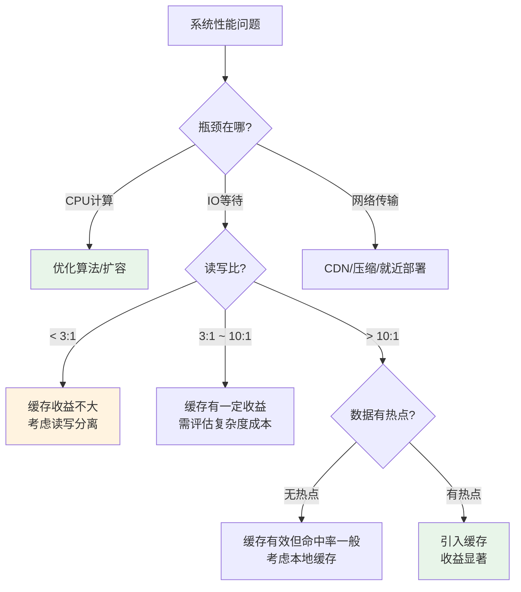
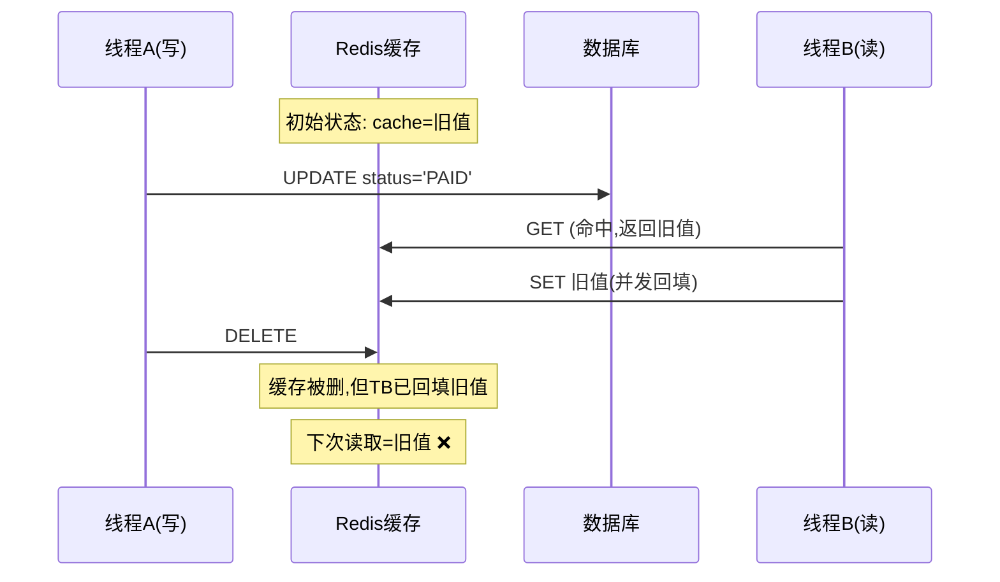
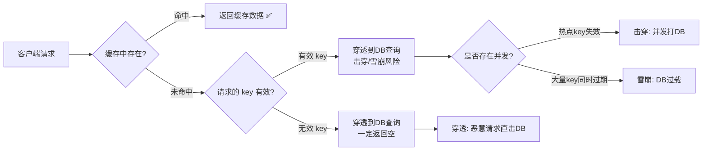
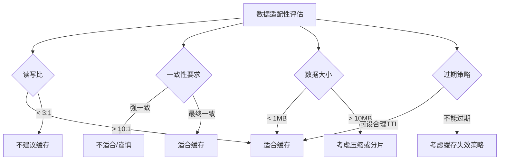

# 第12章 缓存系统 — 常见误区

## 引言：为什么缓存误区如此致命

缓存是提升系统性能最常见、最有效的手段之一，但也是最容易踩坑的技术领域。根据阿里云和腾讯云的生产事故统计，**超过 30% 的线上故障与缓存使用不当直接相关**，包括缓存穿透导致数据库崩溃、缓存雪崩造成大面积服务不可用、缓存与数据库不一致引发资金损失等。

本章汇总了工程实践中最高频的十大缓存误区。每个误区都遵循"错误认知 → 问题分析 → 正确做法 → 最佳实践"的结构，帮助读者不仅知道"怎么做"，更理解"为什么这样做"。在阅读之前，建议先熟悉本章前面的理论基础（缓存穿透/击穿/雪崩原理、MESI协议、应用层缓存策略），以便将误区与原理对应起来。

---

## 误区一：缓存可以解决所有性能问题

### 错误认知

> "系统响应慢了？加个 Redis 缓存就好了。"

这是最常见的误区。许多团队在遇到性能问题时，第一反应就是引入缓存层，而没有先做系统的瓶颈分析。

```python
# ❌ 盲目加缓存：每次写操作后都清大量缓存键
def update_user(user_id, data):
    db.update("users", user_id, data)
    redis.delete(f"user:{user_id}")
    redis.delete(f"user:{user_id}:profile")
    redis.delete(f"user:{user_id}:settings")
    redis.delete(f"user:{user_id}:preferences")
    redis.delete(f"user:{user_id}:recent_orders")
    # 写入频繁时，缓存命中率可能低于10%，白白增加复杂度
```

### 问题分析

引入缓存前必须回答三个核心问题：

1. **瓶颈是否在数据读取？** 如果瓶颈在 CPU 计算（如图片处理、加密运算），缓存毫无帮助；如果瓶颈在 IO 等待（数据库查询、远程调用），缓存才有效。
2. **读写比是否足够高？** 缓存的本质是"用空间换时间"，只有读远大于写时才划算。
3. **数据访问是否有热点？** 如果数据被均匀访问，缓存命中率会很低。

下面的决策树可以帮助判断是否需要缓存：



### 正确做法：先监控，再决策

```python
# ✅ 第一步：收集读写比指标
import time
from collections import Counter

class CacheMetrics:
    def __init__(self):
        self.stats = Counter()

    def record(self, operation: str):
        self.stats[operation] += 1

    def get_read_write_ratio(self, window_seconds=60):
        """返回指定窗口内的读写比"""
        reads = self.stats.get("read", 0)
        writes = self.stats.get("write", 0)
        if writes == 0:
            return float("inf")
        return reads / writes

    def should_use_cache(self):
        ratio = self.get_read_write_ratio()
        if ratio < 3:
            return False, f"读写比 {ratio:.1f}:1，缓存收益有限"
        elif ratio < 10:
            return True, f"读写比 {ratio:.1f}:1，可以尝试缓存"
        else:
            return True, f"读写比 {ratio:.1f}:1，缓存价值显著"
```

**量化判断标准：**

| 读写比 | 缓存建议 | 典型场景 |
|--------|----------|----------|
| < 1:1 | 不建议缓存 | 日志系统、写密集型任务队列 |
| 1:1 ~ 3:1 | 勉强可缓存，但需评估复杂度 | 后台管理系统 |
| 3:1 ~ 10:1 | 建议缓存，注意一致性成本 | 普通 Web 应用 |
| 10:1 ~ 100:1 | 强烈建议缓存 | 电商商品页、新闻资讯 |
| > 100:1 | 必须缓存 | 配置信息、字典表、排行榜 |

---

## 误区二：缓存与数据库的一致性不需要考虑

### 错误认知

> "先更新数据库，再删除缓存，不可能出问题吧？"

许多开发者认为"先更新 DB 再删缓存"就能保证一致性，但在并发场景下，这个方案存在已知的时序漏洞。

### 问题分析：先更新 DB 再删缓存的竞态条件



问题时序：

1. **线程 A** 更新数据库 status = PAID
2. **线程 B** 读缓存——此时缓存还在（删除尚未执行），得到旧值 status = UNPAID
3. **线程 B** 将 status = UNPAID 写回缓存
4. **线程 A** 删除缓存
5. **结果**：数据库已是 PAID，但缓存中是旧值 UNPAID，直到缓存过期才能恢复

虽然这个竞态窗口很小（只发生在"DB 更新完成"到"缓存删除完成"之间），但在高并发场景下，它会持续触发。

### 正确做法：四种方案对比

#### 方案一：延迟双删

```python
import threading

# ✅ 延迟双删：第一次删是为了减少竞态窗口，第二次删是为了兜底
def update_order(order_id, status):
    redis.delete(f"order:{order_id}")  # 第一次删除
    db.execute("UPDATE orders SET status=%s WHERE id=%s", status, order_id)

    # 延迟时间应大于"一次读请求的耗时 + 一次网络传输耗时"
    # 通常 500ms 左右，可根据 P99 延迟调整
    def delayed_delete():
        time.sleep(0.5)
        redis.delete(f"order:{order_id}")

    threading.Thread(target=delayed_delete, daemon=True).start()
```

**优点**：实现简单，对现有架构改动小。
**缺点**：延迟时间难以精确控制，极端情况下仍可能不一致。

#### 方案二：基于 binlog 的异步更新（推荐生产环境）

```python
# ✅ 使用 Canal 监听 MySQL binlog → 解析 → 更新 Redis
# 这是阿里巴巴开源方案，也是业界最成熟的缓存一致性方案

# 架构:
# MySQL → binlog → Canal Server → MQ → Consumer → Redis
#
# 优点：
# - 对业务代码零侵入
# - 最终一致性，延迟通常 < 1秒
# - Canal 支持集群部署，高可用
#
# 缺点：
# - 架构复杂度增加
# - 需要运维 Canal 集群
```

#### 方案三：订阅 binlog 的轻量替代（Debezium）

```bash
# 如果用 PostgreSQL 或不想引入 Canal，可以用 Debezium
# Debezium 支持 MySQL/PostgreSQL/MongoDB 的 CDC (Change Data Capture)

# docker-compose.yml
services:
  debezium:
    image: debezium/connect
    environment:
      BOOTSTRAP_SERVERS: kafka:9092
      GROUP_ID: cache-sync
      CONFIG_STORAGE_TOPIC: connect-configs
      OFFSET_STORAGE_TOPIC: connect-offsets
```

#### 方案四：基于 Redis 事务的读写合并

```python
# ✅ 将读写操作在 Redis 端合并，避免竞态
def get_or_update_user(user_id, update_data=None):
    if update_data:
        # 写：先更新 DB，再删缓存
        db.update("users", user_id, update_data)
        redis.delete(f"user:{user_id}")
    else:
        # 读：使用 Redis 守护模式，缓存 miss 时加锁回源
        cached = redis.get(f"user:{user_id}")
        if cached:
            return json.loads(cached)

        lock_key = f"lock:user:{user_id}"
        if redis.set(lock_key, "1", nx=True, ex=5):
            try:
                # 获取锁的线程负责回源
                user = db.query("SELECT * FROM users WHERE id=%s", user_id)
                redis.setex(f"user:{user_id}", 300, json.dumps(user))
                return user
            finally:
                redis.delete(lock_key)
        else:
            # 未获取锁的线程等待后重试
            time.sleep(0.1)
            return get_or_update_user(user_id)
```

**四种方案对比表：**

| 方案 | 一致性级别 | 实现复杂度 | 对业务侵入 | 适用场景 |
|------|-----------|-----------|-----------|---------|
| 延迟双删 | 弱一致 | 低 | 低 | 低并发、容忍短暂不一致 |
| Canal + binlog | 最终一致 | 中 | 零 | 高并发生产环境（推荐） |
| Debezium CDC | 最终一致 | 中 | 零 | 多数据库类型场景 |
| 读写锁合并 | 强一致 | 中 | 中 | 写操作也需缓存最新值 |

---

## 误区三：有了缓存就不需要防数据库穿透

### 错误认知

> "加了 Redis 缓存之后，数据库压力应该会小很多，不用额外防护了。"

缓存只能保护"有缓存数据"的请求。对于缓存中不存在的 key（新注册用户、恶意攻击的 ID），请求会直接穿透到数据库，这就是**缓存穿透**。更危险的是，当大量请求同时穿透时，会形成**缓存击穿**（热点 key 失效瞬间）或**缓存雪崩**（大量 key 同时过期）。

### 问题分析：三种攻击模式的区别



- **缓存穿透**：查询一定不存在的数据，每次都穿透到 DB。常见于恶意攻击（如遍历不存在的用户 ID）。
- **缓存击穿**：某个热点 key 在失效瞬间，大量并发请求同时打到 DB。
- **缓存雪崩**：大量 key 在同一时间失效，或 Redis 实例宕机，导致请求全部打到 DB。

### 正确做法：三层防护体系

#### 第一层：布隆过滤器防穿透

```python
from pybloom_live import BloomFilter
import redis
import json

class CacheProtection:
    def __init__(self):
        self.redis = redis.Redis()
        self.bloom = BloomFilter(capacity=1_000_000, error_rate=0.01)

    def load_bloom_filter(self):
        """启动时从数据库加载所有有效 ID 到布隆过滤器"""
        all_ids = db.query("SELECT id FROM users")
        for row in all_ids:
            self.bloom.add(row["id"])

    def get_user(self, user_id):
        # 第一层：布隆过滤器快速拒绝无效 ID
        if user_id not in self.bloom:
            return None  # 一定不存在，直接返回

        # 第二层：缓存层
        cached = self.redis.get(f"user:{user_id}")
        if cached == b"__NULL__":
            return None  # 空值缓存，防止穿透
        if cached:
            return json.loads(cached)

        # 第三层：回源查询
        user = db.query("SELECT * FROM users WHERE id=%s", user_id)
        if user:
            self.redis.setex(f"user:{user_id}", 300, json.dumps(user))
        else:
            # 空值缓存，TTL 较短，防止长期占用内存
            self.redis.setex(f"user:{user_id}", 60, "__NULL__")
        return user
```

**布隆过滤器关键参数选择：**

| 参数 | 推荐值 | 说明 |
|------|--------|------|
| capacity | 预估总 key 数 × 1.5 | 预留 50% 空间防止误判率飙升 |
| error_rate | 0.01 (1%) | 生产环境推荐 0.1%~1% |
| 重建周期 | 每天/每次数据变更 | 布隆过滤器不支持删除，需定期重建 |

#### 第二层：分布式锁防击穿

```python
import redis
import json
import time

def get_hot_data_with_lock(key, db_query_fn, ttl=300):
    """
    使用分布式锁防止缓存击穿
    只有一个线程去回源查询，其他线程等待并重试
    """
    r = redis.Redis()
    lock_key = f"lock:{key}"

    cached = r.get(key)
    if cached:
        return json.loads(cached)

    # 尝试获取锁
    if r.set(lock_key, "1", nx=True, ex=10):
        try:
            # 获取锁成功，负责回源
            data = db_query_fn()
            if data is not None:
                r.setex(key, ttl, json.dumps(data))
            else:
                r.setex(key, 60, "__NULL__")
            return data
        finally:
            r.delete(lock_key)
    else:
        # 获取锁失败，等待后重试（最多3次）
        for _ in range(3):
            time.sleep(0.1)
            cached = r.get(key)
            if cached:
                return json.loads(cached)
        return None  # 降级返回空
```

#### 第三层：限流兜底

```python
import time
from collections import defaultdict

class SlidingWindowRateLimiter:
    """滑动窗口限流器，防止缓存 miss 时的流量洪峰"""

    def __init__(self, max_requests=100, window_seconds=1):
        self.max_requests = max_requests
        self.window = window_seconds
        self.requests = defaultdict(list)

    def is_allowed(self, key):
        now = time.time()
        window_start = now - self.window
        # 清理过期记录
        self.requests[key] = [
            t for t in self.requests[key] if t > window_start
        ]
        if len(self.requests[key]) >= self.max_requests:
            return False
        self.requests[key].append(now)
        return True

# 使用示例
limiter = SlidingWindowRateLimiter(max_requests=100, window_seconds=1)

def get_user_limited(user_id):
    if not limiter.is_allowed(f"db:{user_id}"):
        return None  # 限流拒绝，返回空或默认值
    return cache_protection.get_user(user_id)
```

---

## 误区四：Redis 单线程所以不用考虑并发安全

### 错误认知

> "Redis 是单线程模型，所有命令串行执行，不需要加锁。"

Redis **命令执行**确实是单线程的（Redis 6.0 后 IO 多线程，但命令执行仍单线程），但**客户端是多线程并发的**。当两个客户端同时执行"读-判断-写"这种非原子操作序列时，仍然存在竞态条件。

### 问题分析：超卖问题的经典案例

```python
# ❌ 典型超卖问题
# 商品库存 100，100 个请求同时到达
def deduct_stock_naive(product_id, count):
    stock = int(redis.get(f"stock:{product_id}"))  # 读：stock=100
    if stock >= count:
        # ⚠️ 这里其他 99 个线程也都读到了 stock=100
        redis.set(f"stock:{product_id}", stock - count)
        return True
    return False

# 结果：100 个线程全部通过检查，各扣 1 个
# 最终 stock = 0，但实际卖出了 100 个——看起来没问题？
# 但如果 count=50，100 个线程各扣 50，实际库存只有 100，超卖 4900 个！
```

Redis 的单线程只保证**单条命令**的原子性，不保证**多条命令的组合操作**是原子的。

### 正确做法

#### 方案一：Lua 脚本（推荐）

```python
# ✅ Lua 脚本在 Redis 中原子执行，保证 "读-判断-写" 三步操作的原子性
DEDUCT_STOCK_SCRIPT = """
local stock = tonumber(redis.call('GET', KEYS[1]))
if stock == nil then
    return -1  -- key 不存在
end
if stock >= tonumber(ARGV[1]) then
    redis.call('DECRBY', KEYS[1], tonumber(ARGV[1]))
    return 1   -- 扣减成功
end
return 0       -- 库存不足
"""

deduct_stock = redis.register_script(DEDUCT_STOCK_SCRIPT)

def deduct_stock_safe(product_id, count):
    result = deduct_stock(keys=[f"stock:{product_id}"], args=[count])
    if result == 1:
        return True
    elif result == 0:
        raise ValueError("库存不足")
    else:
        raise ValueError("商品不存在")
```

#### 方案二：Redis 事务 + WATCH（乐观锁）

```python
# ✅ WATCH 机制实现乐观锁
def deduct_stock_watch(product_id, count):
    r = redis.Redis()
    stock_key = f"stock:{product_id}"

    while True:
        try:
            r.watch(stock_key)
            stock = int(r.get(stock_key))
            if stock < count:
                r.unwatch()
                return False

            # 用事务包起来
            pipe = r.pipeline(True)
            pipe.decrby(stock_key, count)
            pipe.execute()
            # 如果在 WATCH 和 EXEC 之间 stock_key 被修改，
            # EXEC 返回 None，循环重试
            return True
        except redis.WatchError:
            continue  # 乐观锁冲突，重试
```

#### 方案三：Redis 原子命令

```python
# ✅ 如果逻辑简单，直接用原子命令
# INCRBY/DECRBY 本身就是原子的
def increment_counter(key, amount=1):
    return redis.incrby(key, amount)

# SETNX 实现简单的分布式锁
def try_lock(lock_name, expire=10):
    return redis.set(f"lock:{lock_name}", "1", nx=True, ex=expire)

# Redis 2.6.12+ SET 命令支持 EX/NX/XX 参数组合
```

**并发安全方案选择指南：**

| 场景 | 推荐方案 | 原因 |
|------|---------|------|
| 库存扣减/余额操作 | Lua 脚本 | 逻辑复杂，需要原子性判断+修改 |
| 简单计数器 | INCRBY | Redis 原生原子命令，最简单 |
| 分布式锁 | SET NX + Lua 释放 | 防止误删别人的锁 |
| 重试友好的场景 | WATCH 乐观锁 | 冲突少时性能好 |

---

## 误区五：缓存容量不设上限

### 错误认知

> "服务器有 64GB 内存，Redis 放个 50GB 没问题吧？"

不设 `maxmemory` 的后果是 Redis 在内存不足时的行为不可预测——可能触发操作系统的 OOM Killer 直接杀掉 Redis 进程，导致整个缓存层瞬间失效，所有请求打到数据库，引发连锁故障。

### 正确做法：多层容量控制

#### 1. Redis 服务端配置

```bash
# redis.conf — 生产环境必配
maxmemory 4gb                    # 根据物理内存的 60-70% 设置
maxmemory-policy allkeys-lru     # LRU 淘汰策略

# 淘汰策略选择指南：
# noeviction    — 不淘汰，内存满了直接报错（适合不允许丢失数据的场景）
# allkeys-lru   — 所有 key 中淘汰最近最少使用的（通用推荐）
# allkeys-lfu   — 所有 key 中淘汰使用频率最低的（Redis 4.0+，有热点时更好）
# volatile-lru  — 只淘汰有 TTL 的 key（不想淘汰持久 key 时用）
# volatile-lfu  — 只淘汰有 TTL 的 key 中使用频率最低的
# volatile-ttl  — 优先淘汰 TTL 最小的 key
# allkeys-random — 随机淘汰（均匀访问场景）
```

#### 2. 代码层面控制

```python
import json
import logging

logger = logging.getLogger(__name__)

MAX_VALUE_SIZE = 1024 * 1024  # 1MB
MAX_KEY_LENGTH = 128

def safe_set(key, value, ttl=3600):
    """带防护的缓存写入"""
    # 检查 key 长度
    if len(key) > MAX_KEY_LENGTH:
        logger.warning(f"Key 过长, 跳过缓存: {key[:50]}...")
        return False

    serialized = json.dumps(value, ensure_ascii=False)

    # 检查 value 大小
    if len(serialized) > MAX_VALUE_SIZE:
        logger.warning(
            f"Value 过大: key={key}, "
            f"size={len(serialized)/1024:.1f}KB, "
            f"limit={MAX_VALUE_SIZE/1024:.1f}KB"
        )
        return False

    # 检查 TTL 合理性
    if ttl <= 0:
        logger.error(f"TTL 不能为 0 或负数: key={key}, ttl={ttl}")
        return False
    if ttl > 86400 * 7:
        logger.warning(f"TTL 过长(>7天): key={key}, ttl={ttl}s")

    redis.setex(key, ttl, serialized)
    return True
```

#### 3. 内存监控与告警

```bash
#!/bin/bash
# 内存监控脚本，定期检查 Redis 内存使用率
REDIS_MEM=$(redis-cli info memory | grep used_memory_human | cut -d: -f2 | tr -d '\r')
USED_BYTES=$(redis-cli info memory | grep used_memory: | head -1 | cut -d: -f2 | tr -d '\r')
MAX_BYTES=$(redis-cli config get maxmemory | tail -1)

if [ "$MAX_BYTES" = "0" ]; then
    echo "WARNING: maxmemory 未设置!"
    exit 1
fi

USAGE_PCT=$((USED_BYTES * 100 / MAX_BYTES))
echo "Redis 内存使用: ${REDIS_MEM} (${USAGE_PCT}%)"

if [ $USAGE_PCT -gt 85 ]; then
    echo "CRITICAL: 内存使用率 ${USAGE_PCT}% > 85%，需要扩容或优化"
    # 发送告警通知
fi
```

---

## 误区六：缓存预热就是启动时全量加载

### 错误认知

> "启动时把数据库的所有数据都加载到 Redis，这样缓存命中率最高。"

全量预热有两个致命问题：
1. **启动时间过长**：1 亿条记录，每条 1KB，全量加载需要传输 100GB 数据，即使 Redis 吞吐 10 万/s，也需要 15 分钟以上。
2. **打崩数据库**：大量并发查询会耗尽数据库连接池，导致真正的用户请求无法执行。

### 正确做法：分层预热策略

#### 第一步：识别热点数据

```python
def get_hot_keys_from_access_log(log_path, top_n=10000):
    """从访问日志中统计热点 key"""
    from collections import Counter

    key_counter = Counter()
    with open(log_path) as f:
        for line in f:
            key = parse_key_from_log(line)
            if key:
                key_counter[key] += 1

    return [key for key, _ in key_counter.most_common(top_n)]

def get_hot_keys_from_redis(lfudecay=10):
    """使用 Redis 内置的 LFU 策略找出热点 key（需配置 maxmemory-policy=*lfu*）"""
    import subprocess

    result = subprocess.run(
        ["redis-cli", "--hotkeys"],
        capture_output=True, text=True
    )
    # 解析输出，提取 top N key
    keys = []
    for line in result.stdout.split('\n'):
        if 'Key' in line:
            key = line.split()[-1]
            keys.append(key)
    return keys[:10000]
```

#### 第二步：分批预热

```python
import time
import redis
import json

def startup_warmup():
    """分批预热：每批 100 个 key，批间休眠，避免打崩 DB"""
    r = redis.Redis()

    hot_keys = get_hot_keys_from_access_log("/var/log/app/access.log", top_n=10000)
    print(f"待预热 key 数量: {len(hot_keys)}")

    total = 0
    for i in range(0, len(hot_keys), 100):
        batch = hot_keys[i:i+100]

        pipe = r.pipeline()
        for key in batch:
            data = db.query_by_key(key)  # 从数据库查询
            if data:
                pipe.setex(key, 3600, json.dumps(data))
        pipe.execute()

        total += len(batch)
        progress = total / len(hot_keys) * 100
        print(f"预热进度: {progress:.1f}% ({total}/{len(hot_keys)})")

        time.sleep(0.1)  # 批间休眠 100ms

    print(f"预热完成，共加载 {total} 个 key")
```

#### 第三步：灰度预热（更安全的方式）

```python
def gradual_warmup():
    """
    灰度预热：先预热 1% 最热的 key，观察系统负载后逐步扩大
    配合监控，一旦 DB 连接数或 CPU 超过阈值就暂停
    """
    r = redis.Redis()
    hot_keys = get_hot_keys_from_access_log("/var/log/app/access.log", top_n=100000)

    # 第一轮：预热 Top 1% (1000个)
    # 第二轮：预热 Top 10% (10000个)
    # 第三轮：预热 Top 30% (30000个)
    # 视情况决定是否预热更多

    tiers = [
        int(len(hot_keys) * 0.01),
        int(len(hot_keys) * 0.10),
        int(len(hot_keys) * 0.30),
    ]

    for tier_idx, count in enumerate(tiers):
        print(f"第 {tier_idx + 1} 轮预热: Top {count} 个 key")
        batch = hot_keys[:count]

        pipe = r.pipeline()
        for key in batch:
            data = db.query_by_key(key)
            if data:
                pipe.setex(key, 3600, json.dumps(data))
        pipe.execute()

        # 检查 DB 负载是否正常
        db_conn_usage = get_db_connection_usage()
        if db_conn_usage > 80:
            print(f"DB 连接使用率 {db_conn_usage}%，暂停预热")
            break

        time.sleep(5)  # 轮间休眠，观察效果
```

---

## 误区七：所有数据都适合用缓存

### 错误认知

> "把数据库里的所有数据都放到缓存中，查询速度肯定更快。"

并非所有数据都适合缓存。不恰当的缓存策略不仅浪费内存资源，还可能因为数据不一致带来更严重的问题。

### 适配性分析

| 数据类型 | 是否适合缓存 | 原因 | 缓存策略 |
|---------|-------------|------|---------|
| 用户基本信息 | ✅ 适合 | 读多写少，变更频率低 | 长 TTL + 主动失效 |
| 商品详情页 | ✅ 适合 | 读远大于写，热点集中 | 长 TTL + 多级缓存 |
| Session / Token | ✅ 适合 | 天然临时数据，高并发读 | Redis 原生存储 + TTL |
| 报表统计数据 | ✅ 适合 | 可以容忍分钟级延迟 | 定时批量刷新 |
| 搜索结果 | ✅ 适合 | 可以容忍短暂不一致 | 短 TTL + 主动刷新 |
| 库存数量 | ⚠️ 谨慎 | 需要强一致性，超卖有资金损失 | 短 TTL + Lua 原子扣减 |
| 金融余额 | ❌ 不适合 | 必须强一致，任何不一致都是事故 | 直接查 DB + 事务保证 |
| 用户密码哈希 | ❌ 不适合 | 安全敏感数据不应缓存到 Redis | 定期修改密码的场景极少，直接查 DB |
| 配置中心数据 | ✅ 适合 | 读极多写极少 | 本地缓存 + 配置推送失效 |
| 地理位置数据 | ⚠️ 谨慎 | 变化频繁，但读也频繁 | 短 TTL + 滑动窗口更新 |

### 判断准则

一个数据是否适合缓存，可以通过以下四个维度来评估：



---

## 误区八：缓存 key 设计随意

### 错误认知

> "key 叫什么都行，能用就行。"

混乱的 key 命名会导致以下问题：
- **调试困难**：线上排查问题时，无法从 key 名推断其含义。
- **内存浪费**：key 过长直接浪费 Redis 内存（每个 key 额外开销约 50-60 字节元数据）。
- **冲突风险**：不同业务模块使用相同的 key 前缀，互相覆盖。
- **管理混乱**：无法通过 key 前缀进行批量操作（如批量删除）。

### 正确做法：统一命名规范

# 推荐格式：{业务模块}:{实体类型}:{实体ID}[:{子字段}]
# 示例：
user:profile:12345
user:settings:12345
order:detail:67890
order:items:67890
product:stock:10001
product:price:10001
cache:search:iphone15
lock:order:create:67890

# 禁止：
12345                           # 无业务含义
user_profile_12345_settings     # 使用下划线而非冒号分隔
u:p:12345                       # 缩写过度，可读性差

**命名规范要点：**

| 规则 | 说明 | 示例 |
|------|------|------|
| 使用冒号分隔 | Redis CLI 友好，支持 keys 命令通配 | `user:profile:123` |
| 全小写 | 避免大小写混淆 | `order:detail` 而非 `Order:Detail` |
| key 长度 ≤ 44 字节 | 超过 64 字节的 key 在 ziplist 编码下性能下降 | — |
| 包含实体 ID | 便于问题排查和批量操作 | `product:stock:10001` |
| 前缀统一管理 | 便于批量删除和监控 | 按前缀统计 key 数量 |

```python
# ✅ 使用常量定义 key 前缀，避免硬编码
class CacheKeys:
    USER_PROFILE = "user:profile:{}"
    USER_SETTINGS = "user:settings:{}"
    ORDER_DETAIL = "order:detail:{}"
    ORDER_ITEMS = "order:items:{}"
    PRODUCT_STOCK = "product:stock:{}"
    SEARCH_CACHE = "cache:search:{}"
    LOCK_PREFIX = "lock:{}"

# 使用
cache_key = CacheKeys.USER_PROFILE.format(user_id)
```

---

## 误区九：缓存 TTL 随意设置

### 错误认知

> "TTL 随便设个 3600 秒就行，过期了再查数据库。"

TTL 设置过长会导致数据不一致窗口过大；设置过短会增加数据库压力。不同业务场景需要差异化的 TTL 策略。

### 正确做法：基于业务特征分级设置

```python
class CacheTTLConfig:
    """根据数据变更频率和一致性要求分级设置 TTL"""

    # 不常变化的数据：长 TTL
    CONFIG_DATA = 86400          # 配置数据：24小时
    DICTIONARY_DATA = 86400 * 7  # 字典数据：7天

    # 变化不太频繁的数据：中 TTL
    USER_PROFILE = 3600          # 用户资料：1小时
    PRODUCT_INFO = 1800          # 商品信息：30分钟
    SEARCH_RESULT = 300          # 搜索结果：5分钟

    # 变化频繁的数据：短 TTL
    SESSION_DATA = 1800          # Session：30分钟
    USER_BALANCE = 60            # 用户余额：1分钟（甚至不缓存）

    # 热点数据：极短 TTL + 主动刷新
    FLASH_SALE_STOCK = 3         # 秒杀库存：3秒
    REALTIME_PRICE = 5           # 实时价格：5秒

    @staticmethod
    def get_ttl_for_type(data_type: str) -> int:
        mapping = {
            "config": CacheTTLConfig.CONFIG_DATA,
            "user_profile": CacheTTLConfig.USER_PROFILE,
            "product": CacheTTLConfig.PRODUCT_INFO,
            "search": CacheTTLConfig.SEARCH_RESULT,
            "session": CacheTTLConfig.SESSION_DATA,
            "balance": CacheTTLConfig.USER_BALANCE,
        }
        return mapping.get(data_type, 300)  # 默认5分钟
```

### 防止缓存雪崩的 TTL 抖动

```python
import random

def set_with_jitter(key, value, base_ttl, jitter_range=0.2):
    """
    添加 TTL 抖动，防止大量 key 同时过期造成雪崩

    base_ttl=300, jitter_range=0.2
    实际 TTL = 300 ± 300*0.2 = 240~360 秒之间随机
    """
    jitter = int(base_ttl * jitter_range)
    actual_ttl = base_ttl + random.randint(-jitter, jitter)
    redis.setex(key, actual_ttl, value)
```

---

## 误区十：忽略缓存监控和告警

### 错误认知

> "缓存上线后就不用管了，等出问题再说。"

没有监控的缓存系统就像没有仪表盘的汽车——你不知道它什么时候会抛锚。以下是最需要关注的缓存指标：

### 必须监控的核心指标

```bash
#!/bin/bash
# cache_monitor.sh — 缓存健康检查脚本

# 1. 命中率（最重要！）
# 如果命中率 < 80%，说明缓存效果不佳
HITS=$(redis-cli info stats | grep keyspace_hits | cut -d: -f2 | tr -d '\r')
MISSES=$(redis-cli info stats | grep keyspace_misses | cut -d: -f2 | tr -d '\r')
TOTAL=$((HITS + MISSES))
if [ $TOTAL -gt 0 ]; then
    HIT_RATE=$(echo "scale=2; $HITS * 100 / $TOTAL" | bc)
    echo "缓存命中率: ${HIT_RATE}%"
    if [ $(echo "$HIT_RATE < 80" | bc) -eq 1 ]; then
        echo "WARNING: 命中率低于80%，需要排查"
    fi
fi

# 2. 内存使用率
USED_MEM=$(redis-cli info memory | grep used_memory: | head -1 | cut -d: -f2 | tr -d '\r')
MAX_MEM=$(redis-cli config get maxmemory | tail -1)
if [ "$MAX_MEM" != "0" ]; then
    MEM_PCT=$((USED_MEM * 100 / MAX_MEM))
    echo "内存使用率: ${MEM_PCT}%"
fi

# 3. 慢查询数量
SLOW_LOG=$(redis-cli slowlog len)
echo "慢查询数量: ${SLOW_LOG}"

# 4. 连接数
CONN=$(redis-cli info clients | grep connected_clients | cut -d: -f2 | tr -d '\r')
echo "当前连接数: ${CONN}"

# 5. 淘汰 key 数量（每分钟增量）
EVICTED=$(redis-cli info stats | grep evicted_keys | cut -d: -f2 | tr -d '\r')
echo "已淘汰 key 数: ${EVICTED}"
```

### 关键告警阈值

| 指标 | 正常范围 | 警告阈值 | 严重阈值 | 说明 |
|------|---------|---------|---------|------|
| 缓存命中率 | > 90% | < 80% | < 50% | 命中率低说明缓存策略有问题 |
| 内存使用率 | < 70% | > 85% | > 95% | 接近 maxmemory 会触发淘汰 |
| 慢查询数量 | 0 | > 10 | > 100 | 持续增长说明有 O(N) 命令 |
| 连接数 | < 500 | > 500 | > 900 | 默认 maxclients=10000，但按实例评估 |
| 淘汰 key 数/分 | 0 | > 100 | > 1000 | 持续淘汰说明内存不足 |

---

## 总结：缓存误区检查清单

在上线缓存方案前，用以下清单逐项检查：

| 检查项 | 误区对应 | 通过标准 |
|--------|---------|---------|
| 是否做了瓶颈分析？ | 误区一 | 能提供读写比数据，证明缓存有收益 |
| 是否处理了缓存一致性？ | 误区二 | 有明确的一致性方案，且有回退机制 |
| 是否防止了穿透/击穿？ | 误区三 | 有布隆过滤器 + 空值缓存 + 限流 |
| 是否保证了并发安全？ | 误区四 | 涉及计数/库存的操作使用 Lua 或原子命令 |
| 是否设置了容量上限？ | 误区五 | maxmemory 已配置，淘汰策略已选择 |
| 是否做了智能预热？ | 误区六 | 只预热热点数据，分批加载 |
| 是否评估了数据适配性？ | 误区七 | 敏感/强一致数据已排除出缓存 |
| key 命名是否规范？ | 误区八 | 有统一的命名规范文档 |
| TTL 是否合理分级？ | 误区九 | 不同类型数据有差异化 TTL |
| 是否有监控告警？ | 误区十 | 命中率、内存、慢查询等关键指标已监控 |

---

## 延伸阅读

- **缓存穿透/击穿/雪崩的原理**：参考本章理论基础部分《缓存穿透、击穿与雪崩》
- **分布式锁实战**：参考核心技巧部分《缓存击穿防护与分布式锁》
- **多级缓存架构**：参考核心技巧部分《多级缓存架构》
- **缓存预热与降级**：参考核心技巧部分《缓存预热与降级策略》
- **BigKey 问题**：参考核心技巧部分《BigKey 拆分策略》
