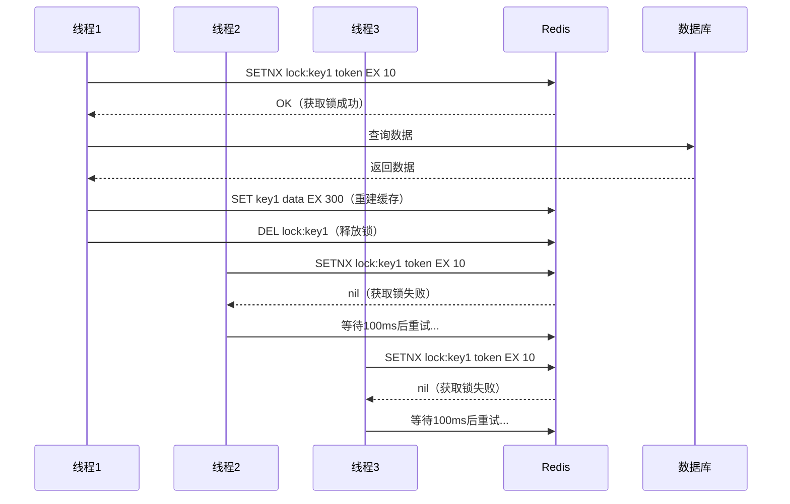
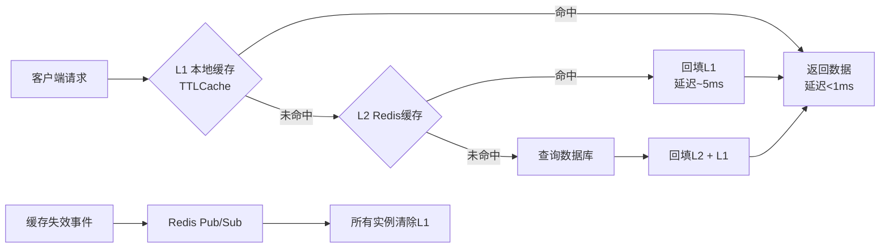
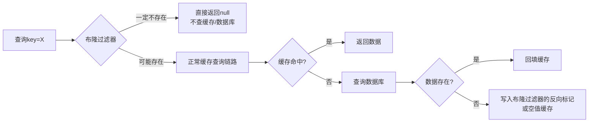
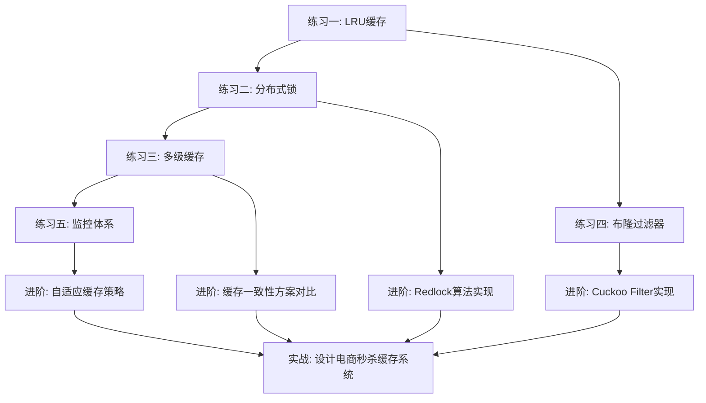

# 第12章 缓存系统 — 练习方法

## 导学：如何高效练习缓存系统

本章提供了5个递进式练习，覆盖从基础数据结构到生产级系统的全链段。每个练习对应本章的一个核心知识点，建议按顺序完成：

| 练习 | 对应知识点 | 难度 | 预计耗时 |
|------|-----------|------|---------|
| 练习一 | LRU缓存实现 | 入门 | 1-2小时 |
| 练习二 | 缓存击穿防护 | 中级 | 2-3小时 |
| 练习三 | 多级缓存架构 | 中级 | 3-4小时 |
| 练习四 | 缓存穿透防护 | 进阶 | 2-3小时 |
| 练习五 | 缓存监控体系 | 进阶 | 3-4小时 |

### 环境准备

开始练习前，确保你的环境满足以下要求：

```bash
# Python 3.8+
python3 --version

# 安装依赖（每个练习按需安装）
pip install redis            # 练习二、三、五
pip install cachetools       # 练习三 TTLCache
pip install aiohttp          # 练习二 异步锁（可选）
pip install prometheus_client # 练习五 指标导出
pip install locust           # 练习三 压测（可选）

# Redis 服务（练习二、三、五需要）
# Docker 方式：
docker run -d --name redis-practice -p 6379:6379 redis:7
# 本地安装方式：
# Ubuntu: sudo apt install redis-server
# macOS: brew install redis
```

### 练习方法论

每个练习都遵循"理解→实现→测试→优化"的四步循环：

1. **理解问题**：先阅读需求，用纸笔画出数据结构和流程
2. **基础实现**：写出最小可用版本，不追求完美
3. **测试验证**：用验收标准中的测试用例验证正确性
4. **优化迭代**：添加线程安全、异常处理、性能优化等

> **核心原则**：先让代码跑起来，再让代码跑得好。不要在第一步就追求完美实现。

---

## 练习一：手写LRU缓存（入门）

**目标**：掌握LRU缓存的核心数据结构和操作逻辑

**前置知识**：哈希表、双向链表、时间复杂度分析

**要求**：
- 使用Python实现，支持 `get(key)` 和 `put(key, value)` 操作
- 时间复杂度O(1)（读写操作均为常数时间）
- 容量满时淘汰最久未使用的元素
- 所有操作必须考虑边界条件（空缓存、容量为1、重复key等）

**实现步骤**：

### 步骤1：基础版本（OrderedDict）

先用Python内置的 `OrderedDict` 快速实现，理解LRU的语义：

```python
from collections import OrderedDict

class LRUCacheOrderedDict:
    """基于OrderedDict的LRU缓存（入门版）"""
    
    def __init__(self, capacity: int):
        if capacity <= 0:
            raise ValueError("容量必须大于0")
        self.capacity = capacity
        self.cache = OrderedDict()
    
    def get(self, key: int) -> int:
        if key not in self.cache:
            return -1
        # 访问后移到末尾（标记为最近使用）
        self.cache.move_to_end(key)
        return self.cache[key]
    
    def put(self, key: int, value: int) -> None:
        if key in self.cache:
            self.cache.move_to_end(key)
        self.cache[key] = value
        if len(self.cache) > self.capacity:
            # 弹出最久未使用的（首部）
            self.cache.popitem(last=False)
```

> **为什么先用OrderedDict？** 让你先专注于LRU的语义逻辑（访问即刷新、满时淘汰末尾），而不是被数据结构细节分散注意力。

### 步骤2：完整版本（双向链表 + HashMap）

这是面试和实际工程中最常见的实现方式。核心思路：HashMap存key→节点的映射实现O(1)查找，双向链表维护访问顺序实现O(1)移动和淘汰。

```python
class DLinkedNode:
    """双向链表节点"""
    __slots__ = ('key', 'value', 'prev', 'next')
    
    def __init__(self, key: int = 0, value: int = 0):
        self.key = key
        self.value = value
        self.prev = None
        self.next = None

class LRUCache:
    """手写双向链表LRU缓存"""
    
    def __init__(self, capacity: int):
        if capacity <= 0:
            raise ValueError("容量必须大于0")
        self.capacity = capacity
        self.cache = {}  # key -> DLinkedNode
        # 哨兵节点，简化边界处理
        self.head = DLinkedNode()
        self.tail = DLinkedNode()
        self.head.next = self.tail
        self.tail.prev = self.head
    
    def _remove(self, node: DLinkedNode) -> None:
        """从链表中移除节点"""
        node.prev.next = node.next
        node.next.prev = node.prev
    
    def _add_to_head(self, node: DLinkedNode) -> None:
        """在头部（最近使用端）插入节点"""
        node.prev = self.head
        node.next = self.head.next
        self.head.next.prev = node
        self.head.next = node
    
    def _move_to_head(self, node: DLinkedNode) -> None:
        """将节点移到头部（标记为最近使用）"""
        self._remove(node)
        self._add_to_head(node)
    
    def get(self, key: int) -> int:
        if key not in self.cache:
            return -1
        node = self.cache[key]
        self._move_to_head(node)
        return node.value
    
    def put(self, key: int, value: int) -> None:
        if key in self.cache:
            node = self.cache[key]
            node.value = value
            self._move_to_head(node)
        else:
            node = DLinkedNode(key, value)
            self.cache[key] = node
            self._add_to_head(node)
            if len(self.cache) > self.capacity:
                # 淘汰尾部节点（最久未使用）
                lru = self.tail.prev
                self._remove(lru)
                del self.cache[lru.key]
```

> **哨兵节点的作用**：`head` 和 `tail` 哨兵节点消除了所有 `if node is None` 的边界判断，让链表操作代码更简洁。这是生产级链表实现的标准手法。

### 步骤3：添加线程安全支持

生产环境中，LRU缓存通常被多线程并发访问。用 `threading.Lock` 保护关键操作：

```python
import threading

class ThreadSafeLRUCache(LRUCache):
    """线程安全的LRU缓存"""
    
    def __init__(self, capacity: int):
        super().__init__(capacity)
        self._lock = threading.RLock()  # 可重入锁，防止死锁
    
    def get(self, key: int) -> int:
        with self._lock:
            return super().get(key)
    
    def put(self, key: int, value: int) -> None:
        with self._lock:
            super().put(key, value)
```

### 步骤4：编写单元测试

```python
import unittest

class TestLRUCache(unittest.TestCase):
    
    def test_basic_operations(self):
        """基本读写和淘汰"""
        cache = LRUCache(2)
        cache.put(1, 1)
        cache.put(2, 2)
        self.assertEqual(cache.get(1), 1)   # 访问key=1，key=1变为最近使用
        cache.put(3, 3)                      # 容量满，淘汰最久未使用的key=2
        self.assertEqual(cache.get(2), -1)   # key=2已被淘汰
        self.assertEqual(cache.get(3), 3)    # key=3存在
    
    def test_update_existing(self):
        """更新已有key的值"""
        cache = LRUCache(2)
        cache.put(1, 1)
        cache.put(1, 10)  # 更新value，不新增节点
        self.assertEqual(cache.get(1), 10)
        # key=1更新后仍存在，不会触发淘汰
        cache.put(2, 2)
        cache.put(3, 3)
        self.assertEqual(cache.get(1), 10)  # key=1仍在
    
    def test_capacity_one(self):
        """容量为1的边界情况"""
        cache = LRUCache(1)
        cache.put(1, 1)
        self.assertEqual(cache.get(1), 1)
        cache.put(2, 2)  # 淘汰key=1
        self.assertEqual(cache.get(1), -1)
        self.assertEqual(cache.get(2), 2)
    
    def test_access_refreshes_order(self):
        """访问操作刷新LRU顺序"""
        cache = LRUCache(3)
        cache.put(1, 1)
        cache.put(2, 2)
        cache.put(3, 3)
        cache.get(1)      # 访问key=1，刷新顺序：1最近，2最旧
        cache.put(4, 4)   # 淘汰key=2
        self.assertEqual(cache.get(2), -1)
        self.assertEqual(cache.get(1), 1)
    
    def test_empty_cache(self):
        """空缓存操作"""
        cache = LRUCache(5)
        self.assertEqual(cache.get(1), -1)  # 返回-1，不报错

if __name__ == "__main__":
    unittest.main()
```

**验收标准**：
- 所有测试用例通过
- 能用纸笔画出每次操作后链表的节点连接状态
- 能口头解释为什么get和put的时间复杂度都是O(1)

**常见误区**：

| 误区 | 正确做法 |
|------|---------|
| 忘记在put新key时同时更新HashMap和链表 | 两个数据结构必须同步操作 |
| 淘汰时只删除链表节点，不删HashMap | 必须同时清理两个数据结构 |
| 没有处理key已存在时的put操作 | 应先更新value，再移到头部 |
| 用单向链表实现 | 单向链表删除节点需要O(n)遍历，无法满足O(1)要求 |

---

## 练习二：实现分布式缓存锁（中级）

**目标**：理解缓存击穿的解决方案，掌握基于Redis的分布式锁设计

**前置知识**：Redis基本操作、并发编程基础、CAP理论

**要求**：
- 实现基于Redis的分布式锁，保证互斥性
- 支持锁超时（防止死锁）和自动续期（看门狗机制）
- 用锁保护缓存重建过程，防止并发穿透到数据库
- 锁的释放必须是原子操作（防止误删他人的锁）

**核心原理**：

缓存击穿发生在热点key过期的瞬间，大量并发请求同时穿透到数据库。分布式锁的核心思路是：只允许一个线程获取锁去重建缓存，其他线程等待重试。



### 步骤1：实现基本的Redis分布式锁

```python
import redis
import uuid
import time
import threading

class RedisLock:
    """带超时和自动续期的Redis分布式锁"""
    
    def __init__(self, redis_client: redis.Redis, key: str, timeout: int = 10):
        self.redis = redis_client
        self.key = f"lock:{key}"
        self.timeout = timeout
        self._token = str(uuid.uuid4())  # 用UUID而非时间戳，避免碰撞
        self._watchdog = None
        self._is_held = False
    
    def acquire(self, retry_count: int = 3, retry_delay: float = 0.1) -> bool:
        """
        尝试获取锁，支持重试
        retry_count: 重试次数
        retry_delay: 每次重试间隔（秒）
        """
        for _ in range(retry_count):
            if self.redis.set(self.key, self._token, nx=True, ex=self.timeout):
                self._is_held = True
                self.start_watchdog()
                return True
            time.sleep(retry_delay)
        return False
    
    def release(self) -> bool:
        """释放锁（原子操作，只删自己的锁）"""
        self.stop_watchdog()
        # Lua脚本保证GET + 比较 + DEL的原子性
        script = """
        if redis.call('GET', KEYS[1]) == ARGV[1] then
            return redis.call('DEL', KEYS[1])
        end
        return 0
        """
        result = self.redis.eval(script, 1, self.key, self._token)
        self._is_held = False
        return result == 1
    
    def start_watchdog(self):
        """看门狗：在锁过期前自动续期"""
        def renew():
            while self._is_held:
                time.sleep(self.timeout / 3)  # 每1/3超时时间续期一次
                if self._is_held:
                    self.redis.expire(self.key, self.timeout)
        self._watchdog = threading.Thread(target=renew, daemon=True)
        self._watchdog.start()
    
    def stop_watchdog(self):
        """停止看门狗"""
        self._is_held = False
        if self._watchdog:
            self._watchdog.join(timeout=2)
            self._watchdog = None
    
    def __enter__(self):
        if not self.acquire():
            raise TimeoutError(f"无法获取锁: {self.key}")
        return self
    
    def __exit__(self, exc_type, exc_val, exc_tb):
        self.release()
```

> **为什么释放锁要用Lua脚本？** Redis的GET和DEL是两条命令，如果不保证原子性，在GET之后、DEL之前，锁可能刚好过期被其他线程获取，导致误删他人的锁。Lua脚本在Redis中是原子执行的。

### 步骤2：用锁保护缓存查询

```python
import json

class CacheService:
    """带分布式锁的缓存服务"""
    
    def __init__(self, redis_client: redis.Redis):
        self.redis = redis_client
    
    def get_with_lock(self, key: str, fetch_fn, ttl: int = 300) -> str:
        """
        先查缓存，未命中时用锁保护重建
        fetch_fn: 从数据库获取数据的函数
        """
        # 第一层：直接查缓存
        data = self.redis.get(f"cache:{key}")
        if data:
            return json.loads(data)
        
        # 第二层：缓存未命中，尝试获取锁重建
        lock = RedisLock(self.redis, key)
        with lock:
            # 双重检查：获取锁后再次确认缓存是否已被其他线程重建
            data = self.redis.get(f"cache:{key}")
            if data:
                return json.loads(data)
            
            # 从数据库查询并重建缓存
            data = fetch_fn(key)
            self.redis.setex(f"cache:{key}", ttl, json.dumps(data))
            return data
```

### 步骤3：模拟并发场景测试

```python
import concurrent.futures

def simulate_concurrent_access():
    """模拟100个并发线程同时访问过期缓存"""
    r = redis.Redis(host='localhost', port=6379, db=15)
    r.flushdb()
    
    db_query_count = 0  # 数据库查询计数器
    counter_lock = threading.Lock()
    
    def fetch_from_db(key: str) -> dict:
        nonlocal db_query_count
        with counter_lock:
            db_query_count += 1
        time.sleep(0.05)  # 模拟数据库查询耗时
        return {"key": key, "value": "from_db"}
    
    cache = CacheService(r)
    
    # 启动100个线程并发请求同一个key
    results = []
    with concurrent.futures.ThreadPoolExecutor(max_workers=100) as executor:
        futures = [executor.submit(cache.get_with_lock, "hot_key", fetch_from_db) 
                   for _ in range(100)]
        results = [f.result() for f in concurrent.futures.as_completed(futures)]
    
    print(f"总请求数: {len(results)}")
    print(f"数据库查询次数: {db_query_count}")
    # 验证：数据库应该只被查询1次
    assert db_query_count == 1, f"期望1次数据库查询，实际{db_query_count}次"
    print("✅ 测试通过：数据库只收到1次查询")

# simulate_concurrent_access()
```

**验收标准**：用100个并发线程同时访问同一个过期的缓存key，数据库只收到1次查询

**常见误区**：

| 误区 | 后果 | 正确做法 |
|------|------|---------|
| 用时间戳做锁token | 碰撞概率高，且无法区分不同线程的锁 | 使用UUID或随机字符串 |
| 释放锁时不做身份验证 | 误删其他线程的锁，破坏互斥性 | Lua脚本验证token后再DEL |
| 获取锁后不设超时 | 线程崩溃导致锁永远不释放（死锁） | 必须设置EX过期时间 |
| 没有双重检查 | 获取锁后仍可能重复重建缓存 | 加锁后再次查缓存 |

**进阶挑战**：
- 实现可重入锁（同一个线程可以多次获取同一把锁）
- 实现公平锁（按请求顺序获取锁，而非竞争抢占）
- 对比Redisson（Java）和Redlock的实现差异

---

## 练习三：实现多级缓存系统（中级）

**目标**：掌握L1/L2多级缓存的设计与实现，理解本地缓存与分布式缓存的协作机制

**前置知识**：进程内缓存（TTLCache）、Redis操作、发布订阅模式

**要求**：
- L1使用进程内缓存（基于 `cachetools.TTLCache`），L2使用Redis
- 支持缓存回填（L2 → DB → L2 → L1的逐级回填）
- 支持缓存失效传播（通过Redis Pub/Sub通知所有实例清除L1）
- 测量命中率和延迟，对比单级缓存与多级缓存的性能差异

**设计原理**：



### 步骤1：实现多级缓存

```python
import time
import json
import hashlib
import threading
from typing import Any, Optional
from cachetools import TTLCache
import redis

class MultiLevelCache:
    """L1(本地) + L2(Redis) 多级缓存"""
    
    def __init__(
        self,
        redis_client: redis.Redis,
        l1_maxsize: int = 1000,
        l1_ttl: int = 60,       # L1本地缓存TTL较短，减少不一致窗口
        l2_ttl: int = 300,      # L2 Redis缓存TTL较长
        namespace: str = "cache"
    ):
        self.redis = redis_client
        self.namespace = namespace
        self.l2_ttl = l2_ttl
        
        # L1：进程内TTL缓存（线程安全由TTLCache保证）
        self.l1 = TTLCache(maxsize=l1_maxsize, ttl=l1_ttl)
        self._lock = threading.Lock()
        
        # 统计
        self.stats = {"l1_hit": 0, "l2_hit": 0, "db_hit": 0, "total": 0}
        
        # 启动失效监听
        self._start_invalidation_listener()
    
    def _key(self, key: str) -> str:
        return f"{self.namespace}:{key}"
    
    def get(self, key: str) -> Optional[Any]:
        self.stats["total"] += 1
        
        # L1查询（进程内，纳秒级）
        with self._lock:
            if key in self.l1:
                self.stats["l1_hit"] += 1
                return self.l1[key]
        
        # L2查询（Redis，毫秒级）
        data = self.redis.get(self._key(key))
        if data:
            self.stats["l2_hit"] += 1
            value = json.loads(data)
            # 回填L1
            with self._lock:
                self.l1[key] = value
            return value
        
        # 未命中任何缓存
        self.stats["db_hit"] += 1
        return None
    
    def set(self, key: str, value: Any, l2_ttl: int = None) -> None:
        ttl = l2_ttl or self.l2_ttl
        # 写入L2
        self.redis.setex(self._key(key), ttl, json.dumps(value))
        # 写入L1
        with self._lock:
            self.l1[key] = value
        # 通知其他实例失效L1
        self._publish_invalidation(key)
    
    def delete(self, key: str) -> None:
        self.redis.delete(self._key(key))
        with self._lock:
            self.l1.pop(key, None)
        self._publish_invalidation(key)
    
    def _publish_invalidation(self, key: str) -> None:
        """发布缓存失效事件"""
        self.redis.publish(f"{self.namespace}:invalidate", key)
    
    def _start_invalidation_listener(self) -> None:
        """后台线程监听缓存失效事件，清除本地L1"""
        def listener():
            pubsub = self.redis.pubsub()
            pubsub.subscribe(f"{self.namespace}:invalidate")
            for message in pubsub.listen():
                if message["type"] == "message":
                    key = message["data"].decode()
                    with self._lock:
                        self.l1.pop(key, None)
        
        t = threading.Thread(target=listener, daemon=True)
        t.start()
    
    def get_hit_rate(self) -> dict:
        total = self.stats["total"] or 1
        return {
            "l1_hit_rate": f"{self.stats['l1_hit'] / total * 100:.1f}%",
            "l2_hit_rate": f"{self.stats['l2_hit'] / total * 100:.1f}%",
            "db_hit_rate": f"{self.stats['db_hit'] / total * 100:.1f}%",
            "total_requests": self.stats["total"]
        }
```

### 步骤2：性能对比测试

```python
import random
import statistics

def benchmark_multilevel_cache():
    """对比单级Redis缓存与多级缓存的延迟"""
    r = redis.Redis(host='localhost', port=6379, db=15)
    r.flushdb()
    
    # 预热：写入10000条数据
    data = {f"key:{i}": {"id": i, "name": f"item_{i}"} for i in range(10000)}
    for k, v in data.items():
        r.setex(f"cache:{k}", 300, json.dumps(v))
    
    multi_cache = MultiLevelCache(r)
    # 预热L1
    for k in list(data.keys())[:1000]:
        multi_cache.get(k)
    
    keys = list(data.keys())
    
    # 测试单级Redis缓存延迟
    redis_latencies = []
    for _ in range(1000):
        key = random.choice(keys)
        start = time.perf_counter()
        r.get(f"cache:{key}")
        end = time.perf_counter()
        redis_latencies.append((end - start) * 1000)  # 转为毫秒
    
    # 测试多级缓存延迟（L1命中）
    multi_latencies = []
    for _ in range(1000):
        key = random.choice(keys)
        start = time.perf_counter()
        multi_cache.get(key)
        end = time.perf_counter()
        multi_latencies.append((end - start) * 1000)
    
    print("=== 性能对比 ===")
    print(f"单级Redis:  P50={statistics.median(redis_latencies):.3f}ms  "
          f"P99={sorted(redis_latencies)[990]:.3f}ms")
    print(f"多级缓存:   P50={statistics.median(multi_latencies):.3f}ms  "
          f"P99={sorted(multi_latencies)[990]:.3f}ms")
    print(f"命中率: {multi_cache.get_hit_rate()}")

# benchmark_multilevel_cache()
```

**验收标准**：多级缓存相比单级Redis缓存，L1命中时P99延迟降低50%以上

**关键设计决策**：

| 设计点 | 选择 | 原因 |
|--------|------|------|
| L1 TTL | 比L2短（60s vs 300s） | 本地缓存更新不及时的代价更高，短TTL减少不一致窗口 |
| 失效传播 | Redis Pub/Sub | 简单直接，无需引入消息队列 |
| L1容量 | 1000条 | 进程内缓存不宜过大，避免GC压力 |
| 锁粒度 | dict级别 | 比全局锁更细，减少锁竞争 |

**常见误区**：

| 误区 | 正确做法 |
|------|---------|
| L1 TTL设置过长 | 本地缓存不一致窗口太大，应比L2短 |
| 忘记做失效传播 | 其他实例的L1会一直返回脏数据 |
| L1容量无限制 | 进程内缓存过大会导致GC暂停，应设上限 |
| 只在写入时失效L1 | 通过数据库直连修改数据时也会导致不一致 |

---

## 练习四：缓存穿透防护（进阶）

**目标**：手写布隆过滤器并集成到缓存查询链路，理解概率性数据结构在缓存防护中的应用

**前置知识**：哈希函数、位运算、概率与统计基础

**要求**：
- 手写一个简单的布隆过滤器，支持add和contains操作
- 理解误报率与位数组大小、哈希函数数量的关系
- 集成到缓存查询链路中作为前置过滤器
- 对比有无布隆过滤器的穿透率

**核心原理**：

布隆过滤器是一种概率性数据结构，用于判断元素是否"可能存在"或"一定不存在"。它用一个位数组和多个哈希函数，将元素映射到位数组的多个位置。



### 步骤1：实现布隆过滤器

```python
import hashlib
import math
import struct

class BloomFilter:
    """布隆过滤器实现"""
    
    def __init__(self, expected_items: int, fp_rate: float = 0.01):
        """
        expected_items: 预期存储的元素数量
        fp_rate: 可接受的误报率（默认1%）
        """
        self.expected_items = expected_items
        self.fp_rate = fp_rate
        
        # 计算最优位数组大小和哈希函数数量
        # 公式来源: https://en.wikipedia.org/wiki/Bloom_filter#Optimal_number_of_hash_functions
        self.size = self._optimal_size(expected_items, fp_rate)
        self.hash_count = self._optimal_hash_count(self.size, expected_items)
        
        # 使用bytearray代替list[0/1]，内存占用减少8倍
        self.bit_array = bytearray((self.size + 7) // 8)
        self.count = 0  # 已添加元素数
    
    def _optimal_size(self, n: int, p: float) -> int:
        """最优位数组大小: m = -(n * ln(p)) / (ln(2)^2)"""
        m = -(n * math.log(p)) / (math.log(2) ** 2)
        return int(math.ceil(m))
    
    def _optimal_hash_count(self, m: int, n: int) -> int:
        """最优哈希函数数量: k = (m/n) * ln(2)"""
        k = (m / n) * math.log(2)
        return max(1, int(math.ceil(k)))
    
    def _get_bit(self, pos: int) -> bool:
        byte_pos = pos // 8
        bit_pos = pos % 8
        return bool(self.bit_array[byte_pos] &amp; (1 << bit_pos))
    
    def _set_bit(self, pos: int) -> None:
        byte_pos = pos // 8
        bit_pos = pos % 8
        self.bit_array[byte_pos] |= (1 << bit_pos)
    
    def _hashes(self, item: str) -> list:
        """
        使用double hashing生成多个哈希值
        h_i(x) = h1(x) + i * h2(x)
        比每次计算独立哈希更高效
        """
        h1 = int(hashlib.md5(item.encode()).hexdigest(), 16)
        h2 = int(hashlib.sha1(item.encode()).hexdigest(), 16)
        return [(h1 + i * h2) % self.size for i in range(self.hash_count)]
    
    def add(self, item: str) -> None:
        """添加元素"""
        for pos in self._hashes(item):
            self._set_bit(pos)
        self.count += 1
    
    def contains(self, item: str) -> bool:
        """检查元素是否可能存在"""
        return all(self._get_bit(pos) for pos in self._hashes(item))
    
    def estimated_fp_rate(self) -> float:
        """计算当前实际误报率: (1 - e^(-kn/m))^k"""
        k = self.hash_count
        m = self.size
        n = self.count
        return (1 - math.exp(-k * n / m)) ** k
```

> **为什么用double hashing而不是多个独立哈希？** 每计算一次完整哈希（MD5/SHA1）需要约1微秒，double hashing只需计算两次就能生成任意多个哈希值，速度提升数倍。

### 步骤2：集成到缓存查询链路

```python
class ProtectedCacheService:
    """带布隆过滤器防护的缓存服务"""
    
    def __init__(self, redis_client: redis.Redis, expected_keys: int = 100000):
        self.redis = redis_client
        self.bloom = BloomFilter(expected_items=expected_keys, fp_rate=0.01)
        self._load_existing_keys()
    
    def _load_existing_keys(self):
        """启动时从Redis加载已有key到布隆过滤器"""
        cursor = 0
        while True:
            cursor, keys = self.redis.scan(cursor, match="cache:*", count=1000)
            for key in keys:
                self.bloom.add(key.decode().replace("cache:", ""))
            if cursor == 0:
                break
    
    def get(self, key: str) -> Optional[dict]:
        # 第一层防护：布隆过滤器
        if not self.bloom.contains(key):
            # 一定不存在，直接返回，不查缓存也不查数据库
            return None
        
        # 第二层：查缓存
        data = self.redis.get(f"cache:{key}")
        if data:
            return json.loads(data)
        
        # 第三层：查数据库（可能是误报穿透）
        return None
    
    def put(self, key: str, value: dict) -> None:
        self.redis.setex(f"cache:{key}", 300, json.dumps(value))
        self.bloom.add(key)
```

### 步骤3：对比测试

```python
def test_bloom_filter_effectiveness():
    """测试布隆过滤器的防护效果"""
    r = redis.Redis(host='localhost', port=6379, db=14)
    r.flushdb()
    
    # 预热：写入10000个真实key
    for i in range(10000):
        r.setex(f"cache:user:{i}", 300, json.dumps({"id": i}))
    
    service = ProtectedCacheService(r, expected_keys=10000)
    
    # 模拟攻击：随机生成10000个不存在的key
    import random
    import string
    random_keys = [
        ''.join(random.choices(string.ascii_lowercase, k=20))
        for _ in range(10000)
    ]
    
    # 测试：这些随机key应该几乎全部被布隆过滤器拦截
    blocked = sum(1 for k in random_keys if not service.bloom.contains(k))
    passed = len(random_keys) - blocked
    
    print(f"随机key总数: {len(random_keys)}")
    print(f"被布隆过滤器拦截: {blocked} ({blocked/len(random_keys)*100:.1f}%)")
    print(f"穿透到缓存层: {passed} ({passed/len(random_keys)*100:.1f}%)")
    print(f"布隆过滤器误报率(实测): {passed/len(random_keys)*100:.2f}%")
    print(f"布隆过滤器误报率(理论): {service.bloom.estimated_fp_rate()*100:.2f}%")
    print(f"位数组大小: {service.bloom.size} bits ({service.bloom.size//8} bytes)")
    print(f"哈希函数数量: {service.bloom.hash_count}")

# test_bloom_filter_effectiveness()
```

**验收标准**：
- 布隆过滤器的实测误报率 < 2%
- 穿透到数据库的无效请求减少99%以上
- 能解释误报率、位数组大小、哈希函数数量三者的关系

**参数调优指南**：

| 预期元素数 | 目标误报率 | 位数组大小 | 哈希函数数 | 内存占用 |
|-----------|-----------|-----------|-----------|---------|
| 10,000 | 1% | 95,850 bits | 7 | ~12 KB |
| 100,000 | 1% | 958,505 bits | 7 | ~117 KB |
| 1,000,000 | 1% | 9,585,058 bits | 7 | ~1.1 MB |
| 1,000,000 | 0.1% | 14,377,587 bits | 10 | ~1.7 MB |

**常见误区**：

| 误区 | 正确做法 |
|------|---------|
| 布隆过滤器只能加不能删 | 标准布隆过滤器确实不支持删除，需要用Cuckoo Filter |
| 误报率设为0 | 误报率越低，内存占用越大，需要权衡 |
| 不做启动预热 | 服务重启后布隆过滤器为空，会放过所有请求 |
| 只靠布隆过滤器防护 | 应与空值缓存、限流等策略组合使用 |

---

## 练习五：生产级缓存监控（进阶）

**目标**：搭建完整的缓存监控体系，包括指标采集、存储、可视化和告警

**前置知识**：Redis运维基础、Prometheus/Grafana基本概念

**要求**：
- 监控Redis的核心指标：命中率、内存使用、连接数、QPS
- 监控热点key（Top 100访问频率最高的key）
- 监控慢查询（执行时间超过阈值的命令）
- 配置告警规则：命中率<90%、内存>80%、慢查询>100ms

### 步骤1：Redis指标采集脚本

```python
#!/usr/bin/env python3
"""Redis缓存监控指标采集器"""

import time
import redis
from prometheus_client import start_http_server, Gauge, Counter, Histogram

class RedisMetricsCollector:
    """从Redis采集指标并导出到Prometheus"""
    
    def __init__(self, redis_client: redis.Redis, port: int = 9121):
        self.redis = redis_client
        self.port = port
        
        # Prometheus指标定义
        self.hit_rate = Gauge(
            'redis_hit_rate', 'Redis缓存命中率 (%)')
        self.memory_used = Gauge(
            'redis_memory_used_bytes', 'Redis已用内存 (bytes)')
        self.memory_max = Gauge(
            'redis_memory_max_bytes', 'Redis最大内存 (bytes)')
        self.connected_clients = Gauge(
            'redis_connected_clients', 'Redis连接数')
        self.total_commands = Counter(
            'redis_commands_total', 'Redis总命令数', ['command'])
        self.slow_queries = Gauge(
            'redis_slow_queries', 'Redis慢查询数量')
        self.qps = Gauge(
            'redis_qps', 'Redis每秒查询数')
        self.keyspace_hits = Gauge(
            'redis_keyspace_hits_total', 'Redis key命中总次数')
        self.keyspace_misses = Gauge(
            'redis_keyspace_misses_total', 'Redis key未命中总次数')
        self.evicted_keys = Gauge(
            'redis_evicted_keys_total', 'Redis淘汰key总数')
        self.expired_keys = Gauge(
            'redis_expired_keys_total', 'Redis过期key总数')
    
    def collect(self):
        """采集一次所有指标"""
        info = self.redis.info()
        
        # 命中率
        hits = info.get('keyspace_hits', 0)
        misses = info.get('keyspace_misses', 0)
        total = hits + misses
        rate = (hits / total * 100) if total > 0 else 0
        self.hit_rate.set(rate)
        self.keyspace_hits.set(hits)
        self.keyspace_misses.set(misses)
        
        # 内存
        self.memory_used.set(info.get('used_memory', 0))
        self.memory_max.set(info.get('maxmemory', 0))
        
        # 连接和QPS
        self.connected_clients.set(info.get('connected_clients', 0))
        self.qps.set(info.get('instantaneous_ops_per_sec', 0))
        
        # 慢查询
        slowlog = self.redis.slowlog_len()
        self.slow_queries.set(slowlog)
        
        # 淘汰和过期
        self.evicted_keys.set(info.get('evicted_keys', 0))
        self.expired_keys.set(info.get('expired_keys', 0))
    
    def start(self, interval: int = 15):
        """启动采集器"""
        start_http_server(self.port)
        print(f"Prometheus指标端口: {self.port}")
        print(f"采集间隔: {interval}秒")
        while True:
            self.collect()
            time.sleep(interval)
```

### 步骤2：热点Key分析

```python
def analyze_hot_keys(redis_client: redis.Redis, top_n: int = 100):
    """
    分析热点Key
    注意: --hotkeys 需要Redis配置maxmemory-policy为LFU策略
    """
    print("=== 热点Key分析 ===")
    
    # 方法1: 使用redis-cli --hotkeys（需要LFU策略）
    print("\n方法1: LFU热点Key（需要maxmemory-policy=*lfu）")
    try:
        result = redis_client.execute_command(
            'OBJECT', 'IDLETIME', 'somekey')
        print(f"  LFU信息: {result}")
    except redis.ResponseError as e:
        print(f"  需要配置LFU策略: {e}")
    
    # 方法2: 手动扫描统计（通用方案）
    print(f"\n方法2: 手动扫描统计（Top {top_n}）")
    key_access = {}
    cursor = 0
    scanned = 0
    
    while True:
        cursor, keys = redis_client.scan(cursor, count=100)
        for key in keys:
            decoded = key.decode()
            # 通过OBJECT FREQ获取访问频率（需要LFU）
            try:
                freq = redis_client.execute_command('OBJECT', 'FREQ', key)
                key_access[decoded] = freq
            except redis.ResponseError:
                # 回退：用随机采样估算
                key_access[decoded] = 0
        
        scanned += len(keys)
        if cursor == 0:
            break
    
    # 排序输出Top N
    sorted_keys = sorted(key_access.items(), key=lambda x: x[1], reverse=True)
    print(f"\n扫描key总数: {scanned}")
    print(f"\nTop {min(top_n, len(sorted_keys))} 热点Key:")
    print(f"{'排名':>4}  {'Key':<40} {'访问频率':>10}")
    print("-" * 60)
    for i, (key, freq) in enumerate(sorted_keys[:top_n]):
        print(f"{i+1:>4}  {key:<40} {freq:>10}")
```

### 步骤3：Grafana告警配置

```yaml
# prometheus/alerts/cache_alerts.yml
groups:
  - name: cache_alerts
    rules:
      # 命中率告警
      - alert: CacheHitRateLow
        expr: redis_hit_rate < 90
        for: 5m
        labels:
          severity: warning
        annotations:
          summary: "Redis缓存命中率过低"
          description: "缓存命中率 {{ $value }}%，低于90%阈值，持续超过5分钟"
      
      # 内存告警
      - alert: CacheMemoryHigh
        expr: (redis_memory_used_bytes / redis_memory_max_bytes) > 0.8
        for: 3m
        labels:
          severity: critical
        annotations:
          summary: "Redis内存使用超过80%"
          description: "内存使用率 {{ $value | humanizePercentage }}，可能触发key淘汰"
      
      # 慢查询告警
      - alert: CacheSlowQueries
        expr: redis_slow_queries > 100
        for: 2m
        labels:
          severity: warning
        annotations:
          summary: "Redis慢查询过多"
          description: "慢查询队列中有 {{ $value }} 条记录"
      
      # 连接数告警
      - alert: CacheConnectionHigh
        expr: redis_connected_clients > 1000
        for: 5m
        labels:
          severity: warning
        annotations:
          summary: "Redis连接数过高"
          description: "当前连接数 {{ $value }}，可能存在连接泄漏"
```

### 步骤4：Redis慢查询配置与排查

```bash
# 1. 配置慢查询日志
redis-cli CONFIG SET slowlog-log-slower-than 10000  # 10ms以上的命令记录
redis-cli CONFIG SET slowlog-max-len 128            # 最多保存128条

# 2. 查看慢查询
redis-cli SLOWLOG GET 10           # 最近10条慢查询
redis-cli SLOWLOG LEN              # 慢查询总数
redis-cli SLOWLOG RESET            # 清空慢查询日志

# 3. 分析慢查询原因
# 常见原因：
# - KEYS * 命令（生产环境禁止使用）
# - 大key操作（HGETALL、LRANGE 0 -1）
# - 阻塞式命令（SORT、SAVE）
# - 网络延迟（检查Redis服务器网络）

# 4. 查看大key
redis-cli --bigkeys                  # 扫描大key
redis-cli MEMORY USAGE <key>         # 查看单个key的内存占用

# 5. 实时监控命令
redis-cli MONITOR                    # 实时打印所有命令（调试用，生产慎用）
redis-cli INFO memory                # 内存详情
redis-cli INFO stats                 # 统计信息
redis-cli INFO clients               # 客户端信息
```

**验收标准**：
- 能在Grafana面板中实时看到缓存的命中率趋势、内存曲线、热点key列表
- 命中率下降时自动触发告警通知
- 能通过慢查询日志定位性能瓶颈

**监控面板应包含的核心图表**：

| 图表 | 数据源 | 告警阈值 |
|------|--------|---------|
| 命中率趋势 | redis_hit_rate | < 90% 持续5分钟 |
| 内存使用率 | redis_memory_used / redis_memory_max | > 80% 持续3分钟 |
| QPS曲线 | redis_qps | 突增/突降 > 50% |
| 连接数 | redis_connected_clients | > 1000 持续5分钟 |
| 慢查询数量 | redis_slow_queries | > 100 持续2分钟 |
| 淘汰key速率 | redis_evicted_keys (rate) | > 0 持续1分钟 |
| Top 100热点Key | OBJECT FREQ 扫描 | 每5分钟刷新 |

---

## 练习进阶路径

完成以上5个练习后，可以按以下路径继续深入：



### 推荐学习顺序

1. **入门阶段**：先完成练习一，确保理解LRU的数据结构本质
2. **中级阶段**：完成练习二和练习三，掌握分布式场景下的缓存问题
3. **进阶阶段**：完成练习四和练习五，建立完整的缓存防护和监控体系
4. **实战阶段**：综合运用所有知识，设计一个完整的缓存解决方案

### 拓展阅读

- Redis官方文档：https://redis.io/docs/
- Google Caching Paper：https://research.google/pubs/pub31240/
- Facebook TAO缓存论文：https://www.usenix.org/system/files/conference/atc13/atc13-bronson.pdf
- Netflix EVCache设计：https://netflix.github.io/evcache/
- Twitter cacheserver源码：https://github.com/twitter/cacheerver
