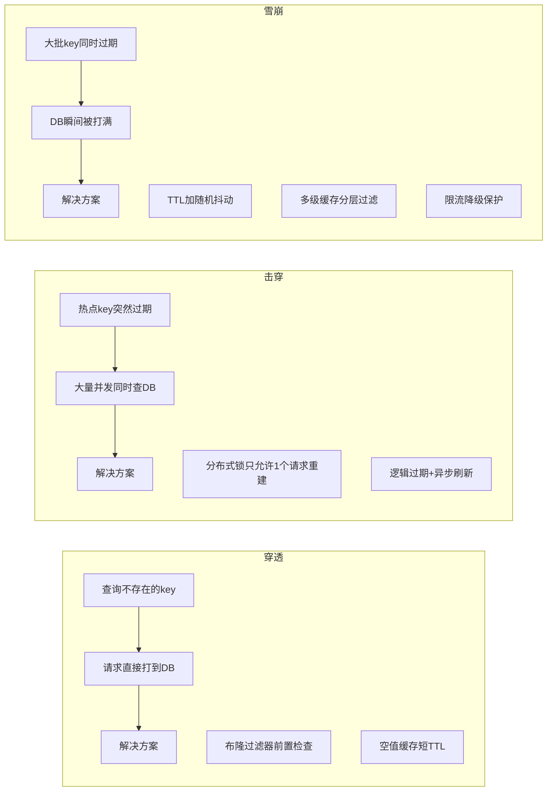
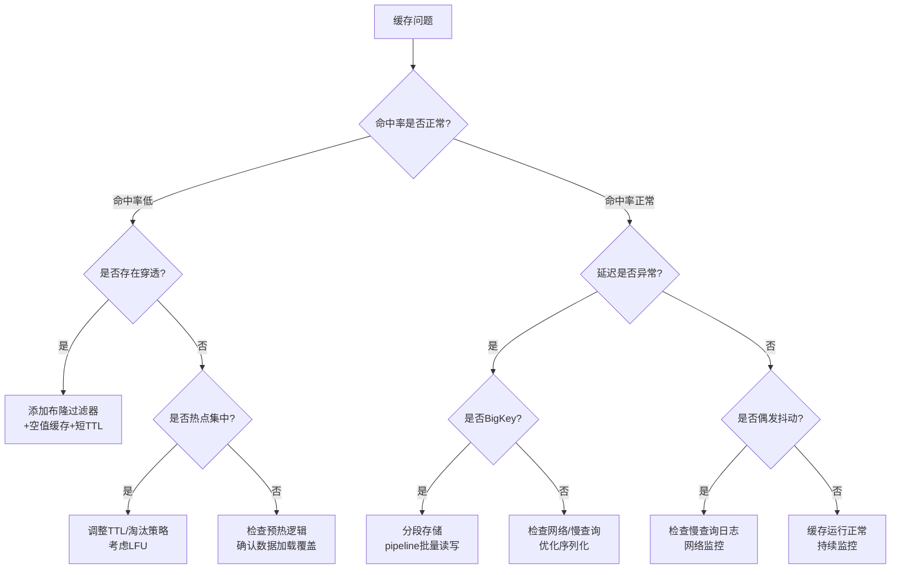
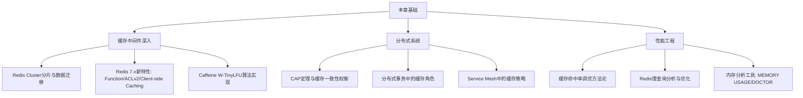

# 第12章 缓存系统 — 本章小结

## 知识体系全景图

本章从硬件层面的CPU缓存一致性，到应用层的分布式缓存架构，构建了一套完整的缓存知识体系。以下用"道法术器"四层框架梳理全章核心内容：

```mermaid
graph TD
    subgraph 道-理论根基
        A[为什么需要缓存] --> A1[存储金字塔: L1→SSD延迟差1000万倍]
        A --> A2[命中率是核心指标: 99%命中=100倍性能提升]
        B[MESI一致性协议] --> B1[M/E/S/I四状态保证多核缓存一致]
        B --> B2[伪共享: 64字节缓存行粒度引发的性能陷阱]
    end
    
    subgraph 法-策略方法
        C[应用层缓存策略] --> C1[Cache-Aside: 读写都由应用控制]
        C --> C2[Read-Through/Write-Through: 缓存层代理DB]
        C --> C3[Write-Behind: 异步写回, 高性能但有数据丢失风险]
        D[三大异常模式] --> D1[穿透: 查不存在的数据]
        D --> D2[击穿: 热点key过期]
        D --> D3[雪崩: 大面积同时过期]
    end
    
    subgraph 术-实战技巧
        E1[线程安全LRU: HashMap+双向链表]
        E2[分布式锁防击穿: SET NX EX + 看门狗]
        E3[多级缓存: L1本地+L2 Redis+失效广播]
        E4[缓存预热与降级: Top N分批加载+熔断降级]
        E5[BigKey拆分: 分段存储+pipeline批量读写]
        E6[缓存一致性: Canal binlog监听 / 延迟双删]
    end
    
    subgraph 器-工具选型
        F1[Redis: 持久化/丰富数据结构/发布订阅]
        F2[Memcached: 多线程/简单KV/纯内存]
        F3[Caffeine: JVM本地缓存/W-TinyLFU最优算法]
        F4[Canal: MySQL binlog→Redis异步同步]
    end
    
    A --> E1
    B --> E2
    C --> E3
    D --> E3
    E3 --> F1
```



## 核心知识点深度回顾

### 1. 缓存的本质：用空间换时间

缓存不是万能药，而是一种有明确适用条件的优化手段。其价值取决于三个关键参数：

| 参数 | 含义 | 决策依据 |
|------|------|----------|
| 读写比 | 读操作与写操作的比例 | 读写比 < 3:1 时缓存收益有限，> 10:1 时价值显著 |
| 数据热度分布 | 热点数据集中程度 | 遵循二八法则（20%数据承载80%流量）时缓存效果最佳 |
| 后端延迟 | 数据源的单次查询耗时 | 延迟越高、缓存命中带来的收益越大 |

存储金字塔从L1缓存（~1ns）到HDD（~10ms），延迟差距达到千万倍量级。这个物理事实决定了：**在任何层次加入缓存，都能带来数量级的性能提升**。

**局部性原理**是缓存存在的理论根基：
- **时间局部性**：最近被访问的数据很可能再次被访问（如用户反复查看自己的订单）
- **空间局部性**：与已访问数据相邻的数据很可能被访问（如数据库B+树的叶子节点顺序扫描）

### 2. 缓存一致性：MESI协议与伪共享

多核CPU时代，每个核心拥有独立的L1/L2缓存。MESI协议通过写失效（Write Invalidate）机制保证一致性，四种状态的转换遵循严格的规则：

| 状态 | 含义 | 其他核可读 | 其他核可写 |
|------|------|-----------|-----------|
| **M**odified | 本核独占且已修改 | 否（需先写回） | 否 |
| **E**xclusive | 本核独占且未修改 | 否 | 否 |
| **S**hared | 多核共享同一副本 | 是 | 否 |
| **I**nvalid | 缓存行已失效 | 否 | 否 |

**伪共享**是MESI协议的副作用：两个线程操作同一缓存行中的不同变量，会导致缓存行在核间反复失效，性能暴跌。解决方案：

```java
// Java 8+ 使用 @Contended 注解填充缓存行
@sun.misc.Contended  // 自动填充到不同缓存行（需要加 JVM 参数 -XX:-RestrictContended）
volatile long counterA;
```

```c
// C/C++ 使用 __attribute__((aligned(64)))
struct {
    long counterA __attribute__((aligned(64)));
    long counterB __attribute__((aligned(64)));
} Counter;
```

### 3. 缓存淘汰策略的选择

| 策略 | 原理 | 适用场景 | 代表实现 |
|------|------|----------|----------|
| **LRU** | 淘汰最久未访问的数据 | 通用场景，大多数业务 | Redis allkeys-lru |
| **LFU** | 淘汰访问频率最低的数据 | 热点数据稳定的场景 | Redis allkeys-lfu |
| **FIFO** | 先进先出淘汰 | 有时序性的数据流 | 适用面窄 |
| **ARC** | 自适应在LRU和LFU间切换 | 访问模式多变的场景 | ZFS/部分开源实现 |
| **W-TinyLFU** | LFU+LRU混合，带衰减 | 最优方案，兼顾频率与新近度 | Caffeine(Java) |

**选择建议**：没有银弹。通用业务首选LRU；如果热点分布稳定且需精确频率控制，选LFU；Java生态追求极致性能选Caffeine（W-TinyLFU）；访问模式频繁变化选ARC。

### 4. 应用层缓存模式对比

| 模式 | 读流程 | 写流程 | 一致性 | 复杂度 |
|------|--------|--------|--------|--------|
| **Cache-Aside** | 应用先查缓存→miss则查DB→写缓存 | 应用先更新DB→再删缓存 | 最终一致 | 低 |
| **Read-Through** | 应用查缓存→miss时缓存层自动查DB | 与Cache-Aside相同 | 最终一致 | 中 |
| **Write-Through** | 与Read-Through相同 | 应用写缓存→缓存同步写DB | 强一致 | 中 |
| **Write-Behind** | 与Read-Through相同 | 应用写缓存→缓存异步批量写DB | 弱一致（有丢失风险） | 高 |

**生产推荐**：大多数场景使用 Cache-Aside，实现简单且可控；需要强一致时考虑 Write-Through；Write-Behind 适合写密集且可容忍少量数据丢失的场景（如计数器、日志）。

### 5. 三大异常模式及应对



**关键区分**：穿透是"查不存在的数据"，击穿是"单个热点key过期"，雪崩是"大面积key同时过期"。三者的解决方案可以叠加使用。

**生产防护优先级**：穿透防护（布隆过滤器）→ 击穿防护（分布式锁）→ 雪崩防护（TTL随机化 + 多级缓存 + 限流降级）。

### 6. 多级缓存架构

单层缓存在高并发下存在瓶颈，多级缓存通过分层过滤将大部分请求拦截在离用户最近的一层：

| 层级 | 存储介质 | 典型延迟 | 容量 | 一致性 | 适用TTL |
|------|----------|----------|------|--------|---------|
| L1 本地缓存 | JVM堆/进程内存 | ~100ns | MB级 | 弱（各实例独立） | 30秒~5分钟 |
| L2 分布式缓存 | Redis/Memcached | ~1ms | GB-TB级 | 最终一致 | 5分钟~数小时 |
| L3 数据库 | MySQL/PostgreSQL | ~10ms | TB级 | 强一致 | 无 |

**设计要点**：L1缓存的TTL要远小于L2，否则多级缓存失去意义。L1适合短周期热点，L2适合中长周期数据。多层之间的失效传播通过Redis Pub/Sub或本地事件总线实现。

### 7. Redis vs Memcached 选型

| 维度 | Redis | Memcached |
|------|-------|-----------|
| 数据结构 | String/Hash/List/Set/ZSet/Stream | 纯KV |
| 持久化 | RDB + AOF | 无 |
| 线程模型 | 单线程（6.0+支持多线程IO） | 多线程 |
| 集群 | Redis Cluster（16384 slot分片） | 客户端一致性哈希 |
| 内存效率 | 有额外元数据开销 | 更紧凑 |
| 适用场景 | 功能丰富的缓存/消息队列/排行榜 | 纯KV高并发缓存 |

**选型建议**：需要持久化、复杂数据结构、发布订阅等功能时选Redis；纯KV缓存且追求极致多核性能时选Memcached。

### 8. 生产级实战要点

**缓存预热**：启动时只预热Top N热点key（基于访问日志），分批加载避免打崩DB。切忌全量预热。

```python
# 生产级缓存预热伪代码
def startup_warmup():
    hot_keys = get_hot_keys_from_log(top_n=10000)  # 从访问日志提取热点
    for batch in chunked(hot_keys, 100):             # 分批加载
        pipe = redis.pipeline()
        for key in batch:
            data = db.query_by_key(key)
            if data:
                pipe.setex(key, 3600, json.dumps(data))
        pipe.execute()
        time.sleep(0.1)  # 避免打崩DB
```

**降级策略**：Redis不可用时返回缓存中的陈旧数据或降级值，而非直接报错。数据库也不可用时返回兜底默认值。

**BigKey治理**：单个value超过10KB时，使用分段存储（如 `{prefix}:seg:0`, `{prefix}:seg:1`...）配合pipeline批量读写。

**缓存一致性**：优先使用Canal监听MySQL binlog异步更新Redis（生产推荐），次选延迟双删方案。延迟双删的关键是第二次删除的等待时间要大于一次主从同步延迟（通常50~100ms）。

**非原子操作用Lua脚本**：Redis单线程只保证单条命令的原子性，多条命令的组合操作需要Lua脚本保证原子性。

## 关键公式速查与实例

| 公式 | 表达式 | 计算示例 |
|------|--------|----------|
| 平均访问时间 | T_avg = H × T_cache + (1-H) × T_backend | H=90%, T_cache=1ms, T_backend=100ms → **10.9ms** |
| 缓存加速比 | Speedup ≈ 1/(1-H)（当T_cache << T_backend时） | H=95% → 加速 **20倍**；H=99% → 加速 **100倍** |
| 后端压力比 | Backend_load = 1 - H | H=99% → 后端仅承受 **1%** 请求 |
| 布隆过滤器误报率 | FP ≈ (1 - e^(-kn/m))^k | k=7, n=100万, m=960万 → FP ≈ **0.8%** |
| 布隆过滤器最优大小 | m = -n × ln(p) / (ln2)^2 | p=1%, n=100万 → m ≈ **958万位 ≈ 1.14MB** |

> **工程经验法则**：缓存命中率从90%提升到99%，后端压力降低10倍。在高并发系统中，这1%的命中率差异可能意味着从"勉强扛住"到"轻松应对"。

## 常见误区警示

| 误区 | 错误做法 | 正确做法 |
|------|----------|----------|
| 缓存万能论 | 系统慢了就加缓存 | 先分析瓶颈是否在读取，确认读写比再决定 |
| 一致性忽视 | 先更新DB再删缓存就完事 | 延迟双删或Canal监听binlog异步更新 |
| 防穿透缺失 | 有缓存就不管DB压力了 | 布隆过滤器+空值缓存+限流三重防护 |
| 并发安全 | Redis单线程所以不用考虑并发 | 非原子操作用Lua脚本保证原子性 |
| 容量失控 | 不设maxmemory和TTL | 配置maxmemory-policy + 代码层面控制单value大小 |
| 全量预热 | 启动时加载所有数据 | 只预热Top N热点，分批加载 |
| 万物缓存 | 所有数据都放到缓存 | 金融余额等需强一致性的数据不适合缓存 |

## 故障排查决策树

遇到缓存相关问题时，按以下流程定位：



## 典型面试题与解答

以下是本章知识在技术面试中的高频考点：

**Q1：Redis为什么快？**
> 三个原因：(1) 纯内存操作，延迟~100ns；(2) 单线程避免上下文切换和锁竞争（6.0+多线程仅用于网络IO）；(3) 高效数据结构（SDS、跳表、压缩列表等）。面试官追问时要区分"单线程模型"和"单线程执行命令"——Redis 6.0的多线程IO并不改变命令执行的单线程本质。

**Q2：缓存和数据库如何保证一致性？**
> 策略从弱到强排列：(1) Cache-Aside + 先更新DB再删缓存（最终一致，绝大多数场景够用）；(2) 延迟双删（减少不一致窗口）；(3) Canal监听binlog异步更新Redis（生产推荐，延迟<1秒）；(4) Read-Through + 分布式事务（强一致但性能差）。面试时要说明选择依据：业务对不一致的容忍度决定了方案选择。

**Q3：缓存穿透、击穿、雪崩的区别？**
> 穿透：查询不存在的数据，每次都打到DB。解法：布隆过滤器 + 空值缓存。击穿：单个热点key过期瞬间，并发请求同时打到DB。解法：分布式锁 + 逻辑过期。雪崩：大量key同时过期（或Redis宕机），DB被打满。解法：TTL随机化 + 多级缓存 + 限流降级。三者可以叠加防护。

**Q4：如何设计一个支持过期的LRU缓存？**
> 双向链表 + HashMap：get/put均为O(1)。每次访问时将节点移到链表头部，容量满时删除链表尾部。过期支持可以在get时检查时间戳，或用额外的定时器惰性清理。线程安全：ConcurrentHashMap + 分段锁（参考Redis的LRU实现思路）。

**Q5：Redis Cluster如何做数据分片？**
> 16384个slot分布在多个节点上，key通过CRC16取模确定slot归属。节点扩容时通过slot迁移（在线迁移，不停服）实现数据重分布。客户端通过MOVED/ASK重定向感知slot变化。面试要提到Gossip协议用于节点间状态同步。

## 监控指标速查

生产环境必须监控的缓存核心指标：

| 指标 | 采集命令 | 告警阈值 | 含义 |
|------|----------|----------|------|
| 命中率 | `INFO stats` → `keyspace_hits / (hits+misses)` | < 90% | 缓存有效性的核心指标 |
| 内存使用率 | `INFO memory` → `used_memory / maxmemory` | > 80% | 接近上限时触发淘汰 |
| 连接数 | `INFO clients` → `connected_clients` | > maxclients×80% | 连接耗尽风险 |
| 慢查询数 | `SLOWLOG GET 10` | 单次>100ms | 定位性能瓶颈 |
| 内存碎片率 | `INFO memory` → `mem_fragmentation_ratio` | > 1.5 或 < 1.0 | 碎片率过高浪费内存，过低可能使用了swap |
| 驱逐数 | `INFO stats` → `evicted_keys` | 持续增长 | 缓存容量不足的信号 |

```bash
# Redis慢查询日志配置（建议生产环境开启）
redis-cli CONFIG SET slowlog-log-slower-than 10000  # 10ms
redis-cli CONFIG SET slowlog-max-len 128
redis-cli SLOWLOG GET 10

# 查看热点key（需要配置 maxmemory-policy 为 LFU）
redis-cli --hotkeys
```

## 跨章节知识关联

缓存系统不是孤立的知识点，它与本书多个章节紧密关联：

| 关联章节 | 关联内容 | 本章中的体现 |
|----------|----------|--------------|
| 第5章 内存管理 | 虚拟内存、页面替换算法（LRU/FIFO/Clock） | LRU淘汰策略的理论基础直接源自操作系统页面置换 |
| 第7章 并发与锁 | 互斥锁、读写锁、CAS | 线程安全LRU实现中的锁粒度选择，Redis分布式锁的SET NX EX |
| 第8章 网络基础 | TCP/IP、网络延迟、连接池 | Redis客户端连接池配置，Redis Cluster的MOVED重定向 |
| 第9章 数据库 | 索引、查询优化、事务 | 缓存与DB的一致性保证，Canal监听binlog |
| 第10章 分布式系统 | CAP定理、一致性模型、分布式事务 | Redis Cluster的一致性选择（AP为主），最终一致性方案 |
| 第11章 消息队列 | 异步处理、事件驱动 | Write-Behind模式的异步写入与MQ理念一致 |

> **学习建议**：如果对某个关联章节不熟悉，建议先回顾再回来看缓存中的对应应用，理解会更深刻。

## 实践自测清单

完成以下任务，验证是否掌握本章核心内容：

- [ ] **手写LRU缓存**：用双向链表+HashMap实现，能解释每次操作后链表的状态变化
  - 提示：先画图模拟 get(1)→put(2,2)→get(1)→put(3,3) 的链表变化
- [ ] **实现分布式锁防击穿**：100并发线程同时访问同一个过期key，数据库只收到1次查询
  - 提示：注意锁的唯一token和Lua脚本释放，防止误删其他线程的锁
- [ ] **设计多级缓存**：L1本地+L2 Redis，实现失效传播，P99延迟相比单级Redis降低50%+
  - 提示：用Redis Pub/Sub广播失效事件，L1 TTL设为L2的1/5~1/10
- [ ] **实现布隆过滤器**：手写简单版，实测误报率 < 2%，穿透到DB的请求减少99%
  - 提示：m = -n × ln(p) / (ln2)^2 计算最优位数组大小
- [ ] **搭建缓存监控**：Grafana面板实时展示命中率趋势、内存曲线、热点key Top 100
  - 提示：用 redis_exporter 采集指标，Prometheus 存储，Grafana 展示
- [ ] **解决缓存雪崩**：给TTL加随机抖动 + 本地缓存作为第一级防御 + 限流降级
  - 提示：TTL = base_ttl + random(0, base_ttl * 0.2)，用Guava/Caffeine做L1
- [ ] **理解MESI协议**：能画出M/E/S/I四状态转换图，解释伪共享的成因和解决方案
  - 提示：重点理解"读命中Shared状态"和"写触发Invalidate广播"

## 进阶学习路径



| 方向 | 推荐资源 | 学习目标 |
|------|----------|----------|
| Redis深入 | 《Redis设计与实现》/ redis.io文档 | 理解底层数据结构与集群原理 |
| 分布式缓存 | 《数据密集型应用系统设计》第5章 | CAP/一致性模型在缓存中的应用 |
| JVM缓存 | Caffeine GitHub Wiki + 论文"TinyLFU" | 理解现代缓存淘汰算法的前沿 |
| 性能监控 | Prometheus+Grafana实战 | 搭建生产级缓存监控告警体系 |
| CDN缓存 | 《Web性能权威指南》第12章 | 从浏览器缓存到CDN的完整缓存链路 |

## 技术演进方向

缓存技术仍在快速演进，以下是值得关注的趋势：

| 方向 | 代表技术 | 核心价值 |
|------|----------|----------|
| 客户端缓存追踪 | Redis 6.0+ CLIENT TRACKING | 服务端主动通知客户端失效，避免无效查询，减少带宽 |
| Redis Functions | Redis 7.0 Functions | 替代EVAL脚本，支持持久化Lua函数，更安全的原子操作 |
| 无缓存架构探索 | CRDT-based DBs（如NATS JetStream） | 通过数据结构本身保证一致性，减少缓存层复杂度 |
| 智能缓存预热 | 基于ML的访问模式预测 | 利用机器学习预测热点，提前加载，提升命中率 |
| 内存数据库融合 | DragonflyDB / Kvrocks | Redis协议兼容，多线程+更高内存效率 |

## 一句话总结

**缓存是用空间换时间的艺术，核心在于命中率。理解存储金字塔的物理约束，选择合适的淘汰策略，构建多级防御体系应对穿透/击穿/雪崩三大异常，配合监控体系持续调优，再关注客户端缓存追踪等新特性——这就是构建高可用缓存系统的完整方法论。**
