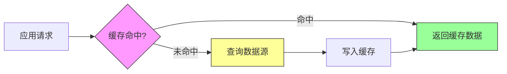
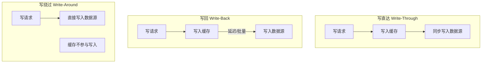
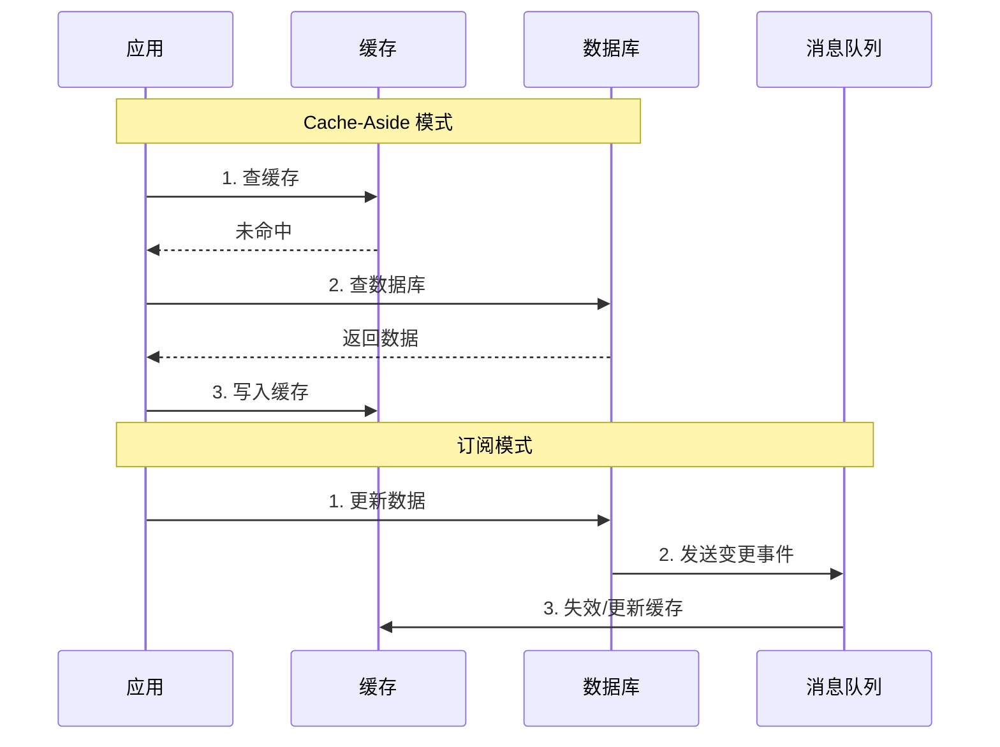
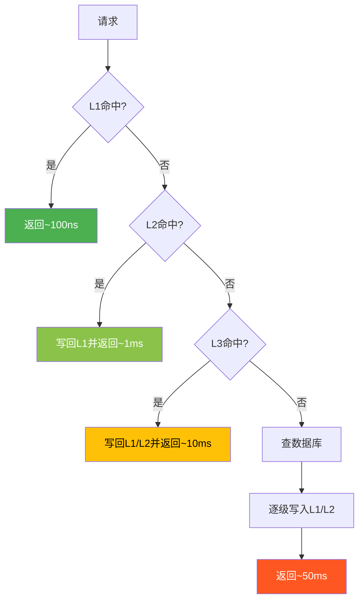
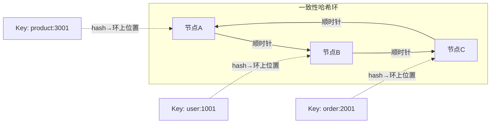

# 第12章 缓存系统

## 章节概述

缓存是计算机科学中最古老也最有效的性能优化技术之一。从CPU的L1/L2/L3缓存，到操作系统的页面缓存，再到应用层的分布式缓存，缓存无处不在。本章将深入探讨缓存系统的核心原理、主流架构和工程实践。

缓存的本质是一种**空间换时间**的策略：通过将频繁访问的数据存储在更快的介质中，减少对慢速数据源的访问，从而提高系统的整体性能。然而，缓存的引入也带来了数据一致性、缓存失效策略、容量管理等一系列复杂问题。理解这些权衡（trade-off），是掌握缓存系统设计的关键。



## 章节结构

本章分为六个部分，由理论到实践，层层递进：

| 章节 | 内容 | 适合读者 |
|------|------|----------|
| [理论基础](理论基础/) | 缓存原理、替换策略、一致性模型、命中率数学模型 | 所有读者 |
| [核心技巧](核心技巧/) | 穿透/击穿/雪崩防护、一致性哈希、热点Key、多级缓存 | 有基础的工程师 |
| [实战案例](实战案例/) | Redis架构原理、Memcached、CDN、数据库缓存 | 需要实战经验的工程师 |
| [常见误区](04-常见误区.md) | 8个常见认知误区及其纠正 | 所有读者 |
| [练习方法](05-练习方法.md) | 13个系统性练习，从实现算法到搭建集群 | 希望动手实践的读者 |
| [本章小结](06-本章小结.md) | 核心知识点回顾、关键概念表、进一步学习指引 | 复习和查阅 |

## 学习目标

完成本章学习后，读者应该能够：

1. **理解原理**：掌握缓存系统的核心原理和性能模型，理解局部性原理如何驱动缓存设计
2. **掌握策略**：能够根据工作负载特征选择合适的缓存替换策略（LRU/LFU/ARC/W-TinyLFU）
3. **解决一致性**：了解缓存一致性问题的各种解决方案及其适用场景
4. **架构设计**：熟悉Redis和Memcached的架构设计，能够设计和实现多级缓存系统
5. **实战运维**：能够处理缓存穿透、击穿、雪崩等典型问题，并进行缓存容量规划

## 前置知识

| 前置章节 | 相关内容 | 重要程度 |
|----------|----------|----------|
| 第5章：内存管理 | 内存层次结构、缓存友好性 | 必需 |
| 第7章：进程与线程 | 并发控制、锁机制 | 必需 |
| 第8章：网络基础 | 分布式缓存的网络通信 | 重要 |
| 数据结构基础 | 哈希表、链表、跳表 | 必需 |


***

# 12.1 缓存系统的理论基础

## 12.1.1 缓存的基本原理

### 什么是缓存

缓存（Cache）一词来源于法语"cacher"（隐藏），在计算机科学中指的是一种高速数据存储层，用于存储频繁访问的数据的副本。缓存的核心假设是**局部性原理**（Principle of Locality），这是缓存存在的理论基础。

局部性原理之所以成立，根源在于程序的行为特征：程序倾向于反复访问相同的数据（循环变量、热点配置），也倾向于顺序访问相邻的数据（数组遍历、顺序文件读取）。这种行为模式使得"把最近访问过的数据放在更快的地方"成为一个有效的优化策略。

### 局部性原理

局部性原理包括两个维度：

**时间局部性（Temporal Locality）**：如果一个数据项被访问，那么在不久的将来它很可能再次被访问。这个原理基于程序的行为特征——循环中的变量、反复查询的配置信息、热点用户的会话数据等都具有时间局部性。

**空间局部性（Spatial Locality）**：如果一个数据项被访问，那么与它地址相邻的数据项也很可能被访问。这个原理基于程序的数据访问模式——数组遍历、顺序文件读取、B+树的叶子节点扫描等都具有空间局部性。

现代计算机系统在多个层次利用局部性原理：

| 层级 | 利用的局部性 | 典型介质 | 访问延迟 |
|------|-------------|----------|----------|
| CPU寄存器 | 时间局部性 | 触发器电路 | 亚纳秒 |
| L1 Cache | 时间+空间局部性 | SRAM | ~1ns |
| L2 Cache | 时间+空间局部性 | SRAM | ~4ns |
| L3 Cache | 时间+空间局部性 | SRAM | ~12ns |
| 页面缓存 | 空间局部性 | DRAM | ~50ns |
| 应用层缓存 | 时间局部性 | 内存/SSD | ~0.1ms |
| 分布式缓存 | 时间局部性 | 内存集群 | ~1ms |
| SSD缓存 | 时间局部性 | NAND Flash | ~0.1ms |

### 缓存的基本架构

缓存系统的基本架构包含以下组件：

**缓存存储（Cache Store）**：存储数据副本的高速存储介质。可以是内存、SSD或其他高速存储设备。选择什么介质取决于容量需求、成本预算和延迟要求。

**缓存索引（Cache Index）**：用于快速查找缓存条目的数据结构。通常使用哈希表实现，支持O(1)的查找时间复杂度。索引的设计直接影响缓存的查找性能。

**替换策略（Eviction Policy）**：当缓存满时，决定哪些缓存条目应该被驱逐的算法。替换策略的选择对缓存命中率有决定性影响，本章12.1.2节将详细分析。

**一致性机制（Consistency Mechanism）**：保证缓存数据与源数据一致的机制。这是缓存系统中最复杂的问题之一，涉及读写路径的设计和失效策略的选择。

### 缓存的性能模型

缓存系统的性能可以通过以下核心指标来衡量：

**命中率（Hit Rate）**：

Hit Rate = Cache Hits / (Cache Hits + Cache Misses)

命中率是缓存系统最重要的性能指标。一般来说：

| 命中率范围 | 评估 | 建议 |
|-----------|------|------|
| > 90% | 优秀 | 保持当前策略，持续监控 |
| 80%-90% | 良好 | 可优化替换策略或增加缓存容量 |
| 70%-80% | 一般 | 需要分析访问模式，调整缓存策略 |
| < 70% | 较差 | 重新评估是否需要引入缓存 |

**平均访问时间（Average Access Time）**：

T_avg = H × T_cache + (1 - H) × T_source

其中：
- H = 命中率（Hit Rate）
- T_cache = 缓存访问时间（通常为纳秒到微秒级）
- T_source = 数据源访问时间（通常为毫秒到秒级）

**缓存加速比（Speedup）**：

Speedup = T_source / T_avg = 1 / (H × (T_cache/T_source) + (1 - H))

当T_cache远小于T_source时，加速比近似为1/(1-H)。例如：
- 命中率90%：加速比约10倍
- 命中率95%：加速比约20倍
- 命中率99%：加速比约100倍

这个公式揭示了一个关键洞察：**命中率从90%提升到99%，性能提升不是10%，而是10倍**。这就是为什么缓存优化的边际收益如此重要。

### 缓存的分类

**按位置分类**：

| 分类 | 典型实现 | 延迟 | 容量 | 共享范围 |
|------|----------|------|------|----------|
| 客户端缓存 | 浏览器缓存、APP本地缓存 | 纳秒级 | MB级 | 单用户 |
| 进程内缓存 | Guava Cache、Caffeine、lru-cache | 纳秒级 | MB级 | 单进程 |
| 分布式缓存 | Redis、Memcached | 毫秒级 | GB-TB级 | 集群 |
| 数据库缓存 | MySQL Buffer Pool、查询缓存 | 微秒级 | GB级 | 单实例 |
| CDN缓存 | Nginx、CloudFlare、Akamai | 毫秒级 | TB-PB级 | 全球 |

**按更新策略分类**：

- **写直达（Write-Through）**：写入缓存时同步写入数据源。数据安全性高但写入延迟较大。
- **写回（Write-Back）**：写入缓存，延迟写入数据源。写入延迟低但存在数据丢失风险。
- **写绕过（Write-Around）**：写入绕过缓存，直接写入数据源。避免缓存污染但首次读取延迟高。



**按失效策略分类**：

- **TTL（Time-To-Live）**：基于时间的失效，设置固定的过期时间。简单可控但可能造成不必要的失效或过期数据被访问。
- **LRU/LFU**：基于访问模式的失效，由替换策略决定何时驱逐。自适应但实现复杂度较高。
- **主动失效**：由数据源通知缓存失效。一致性最好但需要可靠的通知机制。

## 12.1.2 缓存替换策略

当缓存空间已满，需要载入新的数据项时，必须选择一个或多个现有的缓存条目进行驱逐。不同的替换策略适用于不同的访问模式，选择合适的策略对缓存命中率有决定性影响。

### LRU（Least Recently Used）

**原理**：驱逐最久未被访问的缓存条目。基于时间局部性假设——如果一个数据很久没被访问，那么它将来被访问的概率也较低。

**数据结构**：通常使用双向链表 + 哈希表实现。

```text
哈希表:  key → 链表节点指针     (O(1)查找)
双向链表: head ↔ node1 ↔ node2 ↔ ... ↔ nodeN ↔ tail
                    ↑ 最近访问                        ↑ 最久未访问
```

- 哈希表：O(1)查找
- 双向链表：O(1)插入和删除，维护访问顺序

**操作复杂度**：查找 O(1)，插入 O(1)，驱逐 O(1)。

**优点**：
- 实现简单，性能稳定
- 适合具有时间局部性的访问模式
- 广泛应用，经过大量实践验证

**缺点**：
- 对扫描型访问（一次性访问大量数据）不友好，可能导致缓存污染
- 不考虑访问频率，偶尔访问一次的冷数据可能驱逐频繁访问的热数据
- 在某些工作负载下，命中率不如LFU

**LRU的变体**：

- **LRU-K**：记录最近K次访问的时间，使用第K次访问的时间来决定驱逐顺序。K=1时退化为标准LRU。LRU-K可以更好地识别周期性访问模式，减少一次性扫描对缓存的污染。
- **2Q（Two Queues）**：使用两个队列——A1（最近访问一次）和Am（最近访问多次）。新数据先进入A1，被再次访问后移到Am。驱逐时优先从A1中选择。2Q在大多数工作负载下表现优于标准LRU。

### LFU（Least Frequently Used）

**原理**：驱逐访问频率最低的缓存条目。基于频率假设——访问频率高的数据更可能被再次访问。

**数据结构**：使用频率计数器 + 频率桶链表。

```text
频率桶结构:
  freq=1: [A] → [B] → [C]
  freq=2: [D] → [E]
  freq=3: [F]
  min_freq = 1

  每次访问: 从当前桶移到freq+1的桶尾
  驱逐: 从min_freq桶头取
```

**操作复杂度**：查找 O(1)，插入 O(1)，驱逐 O(1)（使用频率桶时）。

**优点**：
- 对访问频率敏感，能更好地保留热数据
- 在稳定的访问模式下表现优异

**缺点**：
- 频率计数器随时间累积，新加入的高质量数据难以获得足够的频率计数
- 需要定期衰减频率计数，增加了实现复杂度
- 对访问模式的突然变化响应较慢

**LFU的变体**：

- **W-TinyLFU**：Caffeine缓存库采用的算法，结合了LFU的频率统计和LRU的时效性。使用Count-Min Sketch来高效估计访问频率（节省内存），使用一个小型LRU窗口（Window LRU，约占总容量1%）来保护新加入的条目。主缓存采用分段LRU（Segmented LRU），分为Protected和Probation两个区域。这种设计在保持LFU高命中率的同时，解决了新数据难以上位的问题。
- **LFU with Aging**：定期将所有频率计数器减半（aging），使得旧的高频条目逐渐失去优势，新的访问模式能够更快地反映在频率统计中。Redis的LFU实现就采用了这种策略（`lfu-decay-time`配置项）。

### ARC（Adaptive Replacement Cache）

**原理**：自适应地在LRU和LFU之间切换，根据工作负载特征动态调整。ARC由IBM研究员Nimrod Megiddo和Dharmendra Modha于2003年提出，理论上有最优的竞争比。

**数据结构**：使用四个列表：

```text
┌─────────────────────────────────────┐
│           缓存容量 = C              │
│  ┌──────────┬──────────┐            │
│  │    T1    │    T2    │  ← 实际数据│
│  │ (1次访问)│ (多次访问)│            │
│  └──────────┴──────────┘            │
│  ┌──────────┬──────────┐            │
│  │    B1    │    B2    │  ← Ghost  │
│  │(T1驱逐) │(T2驱逐) │  (仅记录key)│
│  └──────────┴──────────┘            │
└─────────────────────────────────────┘
```

- T1：最近访问一次的条目（Recency）
- T2：最近访问多次的条目（Frequency）
- B1：最近从T1驱逐的条目（Ghost entries，仅记录key不存数据）
- B2：最近从T2驱逐的条目（Ghost entries）

**自适应机制**：
- 如果在B1中命中（说明T1太小，recency重要），增加T1的容量
- 如果在B2中命中（说明T2太小，frequency重要），增加T2的容量
- 通过参数p动态平衡T1和T2的容量

**优点**：自适应工作负载变化，在多种工作负载下都表现良好，理论上有最优的竞争比。

**缺点**：实现复杂度较高，需要维护Ghost entries占用额外空间，在某些简单工作负载下可能不如专门优化的LRU或LFU。

### 其他替换策略

**FIFO（First In First Out）**：驱逐最早进入缓存的条目。实现最简单，但性能通常最差。在某些访问模式均匀的场景中可用。

**Random Replacement**：随机选择一个缓存条目进行驱逐。实现简单，在某些场景下性能接近LRU。CPU的L3 cache就采用了近似Random Replacement的策略。

**Clock Algorithm**：LRU的近似实现，使用一个环形缓冲区和一个时钟指针。比精确LRU实现更简单，适合操作系统页面替换（Linux的页面缓存就使用了Clock的变体）。

### 策略对比总结

| 策略 | 命中率 | 实现复杂度 | 内存开销 | 适用场景 |
|------|--------|-----------|---------|----------|
| LRU | 良好 | 低 | 低 | 通用场景，时间局部性强 |
| LFU | 优秀 | 中 | 中 | 频率差异大的场景 |
| ARC | 优秀 | 高 | 高（Ghost entries） | 工作负载多变 |
| W-TinyLFU | 优秀 | 高 | 低（Count-Min Sketch） | 大规模缓存（Caffeine） |
| FIFO | 一般 | 极低 | 低 | 简单场景或作为辅助策略 |
| Random | 一般 | 极低 | 低 | 嵌入式/硬件缓存 |
| Clock | 良好 | 低 | 低 | 操作系统页面替换 |

## 12.1.3 缓存一致性问题

### 缓存一致性的定义

缓存一致性（Cache Consistency）是指缓存中的数据与数据源中的数据保持一致的状态。由于缓存是数据的副本，当数据源发生更新时，缓存中的数据可能变得过时（stale）。缓存一致性的核心挑战在于：**更新数据源和更新缓存是两个独立的操作，无法保证原子性**。

### 一致性模型

**强一致性（Strong Consistency）**：缓存中的数据始终与数据源一致。任何读操作都能读到最新的写入结果。这是最严格的一致性模型，但性能代价最高。

**弱一致性（Weak Consistency）**：缓存中的数据可能暂时与数据源不一致，但最终会达到一致状态。写操作完成后，后续的读操作不保证能立即读到最新值。

**最终一致性（Eventual Consistency）**：一种特殊的弱一致性——如果没有新的写入操作，经过足够的时间后，所有副本最终会达到一致状态。这是分布式系统中最常见的折中选择。

### 缓存一致性的挑战

**更新顺序问题**：当多个客户端同时更新数据源和缓存时，由于网络延迟的不确定性，更新的到达顺序可能与发起顺序不同，导致缓存中存储的是过时的数据。

例如，一个经典的不一致场景：
1. 客户端A读取数据X，缓存未命中，从数据库读到v1
2. 客户端B将数据X更新为v2，先写数据库，再删缓存
3. 客户端A将v1写入缓存（在B删除缓存之后）
4. 此时缓存中是v1，但数据库中是v2——不一致

**原子性问题**：更新数据源和更新缓存是两个独立的操作，无法保证原子性。如果在更新数据源后、更新缓存前发生故障，缓存中将保留过时的数据。这是所有缓存一致性方案都必须面对的根本挑战。

### 缓存一致性协议

**Cache-Aside（旁路缓存）**：

```text
读路径: 应用 → 查缓存 → 命中? → 返回
                      → 未命中 → 查数据源 → 写入缓存 → 返回

写路径: 应用 → 更新数据源 → 删除缓存
```

- 读：先查缓存，未命中则查数据源并更新缓存
- 写：先更新数据源，再删除缓存（而非更新缓存）
- 优点：实现简单，适合读多写少的场景，是目前最广泛使用的模式
- 缺点：存在短暂的不一致窗口，首次访问延迟较高

**Read-Through / Write-Through**：

- 读：缓存层自动从数据源加载数据，应用层无感知
- 写：同步更新缓存和数据源，保证两者一致
- 优点：应用层逻辑简单，数据一致性好
- 缺点：写入延迟较高（需要同时写两处），缓存层实现复杂

**Write-Behind（异步写回）**：

- 读：缓存层自动从数据源加载数据
- 写：只更新缓存，异步批量写入数据源
- 优点：写入延迟低，支持批量写入减少IO
- 缺点：缓存故障可能导致数据丢失，一致性保证最弱

**订阅模式（Subscribe-Based Invalidation）**：

- 数据源在更新时通过消息队列或CDC（Change Data Capture）通知缓存进行失效或更新
- 需要可靠的消息传递机制（如Kafka、MySQL binlog）
- 适合分布式系统，能保证最终一致性



## 12.1.4 缓存穿透、击穿与雪崩

这三个问题是缓存系统中最常见的故障模式，理解它们的区别和解决方案是缓存设计的基本功。

### 缓存穿透（Cache Penetration）

**定义**：查询一个一定不存在的数据，由于缓存中没有该数据，每次请求都会穿透缓存直达数据源。

**影响**：大量无效请求直接打到数据库，可能导致数据库过载。在恶意攻击场景下（如遍历不存在的ID），穿透的危害尤为严重。

**解决方案**：

1. **布隆过滤器（Bloom Filter）**：在缓存之前加一层布隆过滤器，快速判断一个key是否可能存在。布隆过滤器有假阳性（false positive）但没有假阴性（false negative），即如果布隆过滤器说key不存在，那么key一定不存在。假阳性率：p ≈ (1 - e^(-kn/m))^k，其中m是位数组大小，n是元素数量，k是哈希函数个数。

2. **缓存空值**：将查询结果为空的key也缓存起来，设置较短的TTL（如60秒）。防止短时间内大量相同空查询穿透。

3. **接口层校验**：在接口层对请求参数进行合法性校验，拦截明显无效的请求（如负数ID、超大ID）。

### 缓存击穿（Cache Breakdown）

**定义**：某个热点key在过期的瞬间，大量并发请求同时到达，全部穿透缓存直达数据源。

**影响**：瞬间的高并发可能导致数据库压力骤增。击穿与穿透的区别在于：击穿的数据是真实存在的热点数据，只是缓存刚好过期。

**解决方案**：

1. **互斥锁（Mutex）**：当缓存未命中时，使用分布式锁（如Redis SETNX）确保只有一个请求去查询数据源，其他请求等待或返回默认值。
2. **永不过期 + 异步更新**：热点数据不设置TTL，通过后台任务定期更新。避免了缓存过期导致的击穿问题。
3. **逻辑过期**：在缓存值中存储逻辑过期时间，当发现数据过期时，异步更新数据，同时返回旧数据（降级方案）。

### 缓存雪崩（Cache Avalanche）

**定义**：大量缓存条目在同一时间过期，或者缓存服务整体不可用，导致大量请求同时打到数据源。

**影响**：数据库瞬间承受巨大压力，可能导致数据库崩溃，进而导致整个系统不可用（级联故障）。

**解决方案**：

1. **过期时间随机化**：在基础TTL上增加一个随机偏移，避免大量key同时过期。
2. **多级缓存**：使用多级缓存架构，即使一级缓存失效，二级缓存仍然可以提供服务。
3. **熔断降级**：当检测到数据源压力过大时，启动熔断机制，返回默认值或降级数据。
4. **缓存预热**：在系统启动或缓存失效前，提前加载热点数据。

### 三者对比

| 问题 | 触发条件 | 影响范围 | 核心解决思路 |
|------|----------|----------|-------------|
| 穿透 | 查询不存在的数据 | 单条请求 | 布隆过滤器 + 缓存空值 |
| 击穿 | 热点key过期瞬间 | 热点key的所有请求 | 互斥锁 + 逻辑过期 |
| 雪崩 | 大量key同时过期或缓存宕机 | 全局 | 随机化TTL + 多级缓存 + 熔断 |

## 12.1.5 缓存的分层架构

### 为什么需要多级缓存

单级缓存在很多场景下无法满足需求：
- 本地缓存访问快但容量有限，无法在多个进程间共享
- 分布式缓存容量大但需要网络通信，延迟较高
- 不同层级的缓存适合存储不同类型的数据

多级缓存通过组合不同层级的优势，在性能、容量和一致性之间取得平衡。

### 典型的多级缓存架构

```text
请求 → L1（进程内缓存）→ L2（分布式缓存）→ L3（CDN/磁盘缓存）→ 数据源

L1: Caffeine/Guava  | 容量: MB级  | 延迟: ~100ns  | 范围: 单进程
L2: Redis/Memcached | 容量: GB级  | 延迟: ~1ms    | 范围: 集群
L3: CDN/Nginx       | 容量: TB级  | 延迟: ~10ms   | 范围: 全球
```

**L1：进程内缓存**
- 容量：KB到MB级别
- 访问延迟：纳秒级（~100ns）
- 适用数据：频繁访问的热点数据、配置信息、会话数据
- 实现：Guava Cache、Caffeine、ConcurrentHashMap
- 特点：零网络开销，但进程重启后数据丢失

**L2：分布式缓存**
- 容量：GB到TB级别
- 访问延迟：亚毫秒到毫秒级（~1ms）
- 适用数据：需要在多进程/多节点间共享的数据
- 实现：Redis、Memcached
- 特点：跨进程共享，但有网络开销

**L3：CDN缓存**
- 容量：TB到PB级别
- 访问延迟：毫秒到数十毫秒
- 适用数据：静态资源、API响应、视频流
- 实现：Nginx、Varnish、CloudFlare、Akamai
- 特点：就近访问，减少跨地域延迟

### 多级缓存的一致性维护

多级缓存引入了额外的一致性挑战：

1. **级联失效**：当数据源更新时，需要同时失效多个层级的缓存。L1和L2可能位于不同进程/节点，失效操作需要协调。
2. **更新顺序**：不同层级的缓存可能以不同的顺序收到更新通知。L1是进程内的，可以精确控制；L2通过消息队列失效，可能有延迟。
3. **部分失败**：某一层级的缓存失效成功，但另一层级失败。需要有兜底机制（如TTL）。

解决方案通常采用：
- **版本号机制**：每个数据项带版本号，低版本的更新被忽略
- **最终一致**：接受短暂的不一致，通过TTL保证最终一致
- **统一失效通道**：通过统一的消息总线（如Redis Pub/Sub、Kafka）广播失效事件



## 12.1.6 缓存命中率的数学模型

### 独立引用模型

假设缓存大小为C，访问序列长度为N，不同数据项的数量为M。在最简单的独立引用模型（IRP）中，每次访问独立地选择数据项，选择第i个数据项的概率为p_i。

在稳态下，缓存命中率的期望值为：

E[Hit Rate] = Σ(p_i × I(i ∈ Cache))

其中I(i ∈ Cache)是指示函数，表示数据项i是否在缓存中。

### Zipf分布

实际的Web访问模式通常服从Zipf分布：

P(访问第k个热门项目) ∝ 1/k^α

其中α是Zipf参数（通常在0.7到1.0之间）。Zipf分布意味着少量热门项目占据了大部分访问量。例如，在一个典型的电商网站中，前1%的商品可能占据了50%以上的访问量。

在Zipf分布下，LRU的命中率可以近似计算为：

H_LRU ≈ 1 - (C/M)^(1-α) / (1-α)

### 缓存大小与命中率的关系

缓存命中率与缓存大小之间通常呈现对数关系：

H(C) ≈ 1 - a × e^(-b×C)

这意味着：
- 初始增加缓存大小可以显著提高命中率（高收益区）
- 当缓存大小超过某个阈值后，增加缓存大小的边际收益递减（饱和区）
- 存在一个"最优"的缓存大小，在成本和性能之间取得平衡

实际工程中，缓存大小通常设置为工作集（Working Set）大小的1.5-2倍，即可达到90%以上的命中率。

### 工作集大小估计

工作集（Working Set）是指在给定时间窗口内被访问的不同数据项的集合。工作集大小是缓存容量规划的重要参考。

估计工作集大小的方法：
1. **滑动窗口法**：统计最近W次访问中的不同数据项数量。简单直观，但需要存储访问历史。
2. **HyperLogLog**：使用概率数据结构估计基数（不同元素数量）。空间效率极高（~12KB可估计10亿级基数），但有~2%的误差。
3. **采样法**：采样一部分访问记录（如1%），推断整体的工作集大小。适合大规模系统。

## 12.1.7 本节小结

本节深入探讨了缓存系统的理论基础，包括：

- **局部性原理**是缓存存在的理论基础，时间局部性和空间局部性在计算机系统各层次被广泛利用
- **性能模型**揭示了命中率对系统性能的指数级影响（90%命中率≈10倍加速，99%≈100倍加速）
- **替换策略**各有优劣：LRU通用但怕扫描，LFU精准但怕突变，ARC自适应但实现复杂
- **一致性问题**是缓存系统最复杂的挑战，Cache-Aside是目前最广泛使用的方案
- **穿透/击穿/雪崩**是三种典型的缓存故障模式，需要针对性的防护措施
- **分层架构**通过组合不同层级的缓存，在性能和容量之间取得平衡

这些理论为后续学习缓存系统的实现和优化奠定了坚实的基础。接下来我们将深入各种缓存问题的具体解决方案。


***

# 12.2 缓存系统的核心技巧

## 12.2.1 缓存穿透的解决方案

### 布隆过滤器（Bloom Filter）

布隆过滤器是一种空间效率极高的概率数据结构，用于判断一个元素是否在集合中。它由Burton Howard Bloom于1970年提出。

**工作原理**：
1. 初始化一个m位的位数组，所有位设为0
2. 使用k个独立的哈希函数
3. 插入元素x时，计算k个哈希值，将对应位置设为1
4. 查询元素x时，检查k个哈希值对应的位置是否全为1

**特性**：
- 如果返回"不存在"，则一定不存在（无假阴性）
- 如果返回"存在"，可能存在（有假阳性）
- 假阳性率：p ≈ (1 - e^(-kn/m))^k

**在缓存中的应用**：

```python
class BloomFilterCache:
    """带布隆过滤器的缓存，防止缓存穿透"""
    
    def __init__(self, cache, db, expected_items, fp_rate=0.01):
        self.cache = cache
        self.db = db
        self.bloom = BloomFilter(expected_items, fp_rate)
    
    def get(self, key):
        # 第一层防线：布隆过滤器
        if not self.bloom.might_contain(key):
            return None  # key一定不存在，直接返回
        
        # 第二层防线：缓存
        value = self.cache.get(key)
        if value is not None:
            return value
        
        # 第三层：查询数据库
        value = self.db.get(key)
        if value is not None:
            self.cache.set(key, value)
            self.bloom.add(key)
        else:
            # 缓存空值，防止短时间内重复穿透
            self.cache.set(key, NULL_VALUE, ttl=60)
        return value
    
    def put(self, key, value):
        self.db.put(key, value)
        self.cache.set(key, value)
        self.bloom.add(key)
```

**布隆过滤器的局限**：
- 不支持删除操作（删除可能导致假阴性，因为可能影响其他元素的位）
- 需要预先知道大致的元素数量（用于确定m和k的值）
- 假阳性率随元素增多而上升

**Counting Bloom Filter**：支持删除的变体，使用计数器替代位数组。删除时将对应计数器减1。但空间开销增大（每位需要4bit计数器），且计数器溢出是一个潜在问题。

**Redisson的RedissonBloomFilter**提供了生产级的布隆过滤器实现：

```java
RBloomFilter<String> bloomFilter = redisson.getBloomFilter("userFilter");
// 初始化: 预期100万元素, 1%误判率
bloomFilter.tryInit(1_000_000L, 0.01);

// 添加元素
bloomFilter.add("user:1001");

// 判断是否存在
boolean exists = bloomFilter.contains("user:1001");
```

### 缓存空值策略

对于数据量不大、空值查询较多的场景，可以直接缓存空值：

**实现要点**：
- 空值的TTL应该较短（如60秒），避免占用过多缓存空间
- 需要区分"未查询"和"查询结果为空"两种状态
- 可以使用特殊的标记值（如`NULL_SENTINEL`）来表示空值
- Redis中可以用`SET key NULL EX 60 NX`实现原子性的空值缓存

**局限**：
- 如果攻击者使用大量不同的不存在的key进行攻击，缓存空间可能被空值占满
- 需要配合其他策略（如布隆过滤器或接口校验）使用

## 12.2.2 缓存击穿的解决方案

### 分布式锁

当热点key过期时，使用分布式锁确保只有一个请求去查询数据源：

```python
def get_with_mutex(cache, db, key):
    """使用分布式锁防止缓存击穿"""
    value = cache.get(key)
    if value is not None:
        return value
    
    # 尝试获取分布式锁
    lock_key = f"lock:{key}"
    if acquire_lock(lock_key, timeout=5):
        try:
            # 双重检查：获取锁后再次检查缓存
            value = cache.get(key)
            if value is not None:
                return value
            
            # 查询数据库并更新缓存
            value = db.get(key)
            if value is not None:
                cache.set(key, value, ttl=3600)
            else:
                cache.set(key, NULL_VALUE, ttl=300)
            return value
        finally:
            release_lock(lock_key)
    else:
        # 未获取到锁：短暂等待后重试（最多3次）
        for _ in range(3):
            time.sleep(0.1)
            value = cache.get(key)
            if value is not None:
                return value
        # 重试仍失败，返回默认值
        return get_default_value(key)
```

**注意事项**：
- 锁的超时时间要合理设置，避免死锁（建议5-10秒）
- 使用双重检查模式，避免锁释放后的重复查询
- 重试次数要有上限，避免无限等待
- 考虑使用Redlock算法实现更可靠的分布式锁

### 逻辑过期

在缓存值中嵌入逻辑过期时间，不使用Redis的TTL：

```python
class LogicalExpiryCache:
    """逻辑过期缓存：数据永不从Redis中过期，由应用层判断是否过期"""
    
    def __init__(self, cache, db):
        self.cache = cache
        self.db = db
    
    def get(self, key):
        entry = self.cache.get(key)
        if entry is None:
            # 缓存中没有数据（首次访问）
            return self._load_from_db(key)
        
        value, logical_ttl = entry
        if time.time() > logical_ttl:
            # 数据已逻辑过期，异步刷新
            self._async_refresh(key)
            # 返回旧数据作为降级
            return value
        
        return value
    
    def _async_refresh(self, key):
        """异步刷新：使用线程池或消息队列"""
        refresh_lock = f"refresh:{key}"
        if acquire_lock(refresh_lock, timeout=1):
            try:
                value = self.db.get(key)
                self.cache.set(key, (value, time.time() + 3600))
            finally:
                release_lock(refresh_lock)
    
    def _load_from_db(self, key):
        value = self.db.get(key)
        if value is not None:
            self.cache.set(key, (value, time.time() + 3600))
        return value
```

**优点**：
- 读操作不会被阻塞
- 可以返回旧数据作为降级方案
- 异步更新避免了并发查询对数据库的冲击

**缺点**：
- 数据可能短暂过时（取决于异步刷新的速度）
- 异步更新失败时需要有重试机制

## 12.2.3 缓存雪崩的解决方案

### 过期时间随机化

```python
import random

def set_with_jitter(cache, key, value, base_ttl, jitter_pct=0.1):
    """设置带随机抖动的过期时间，防止大量key同时过期"""
    jitter = base_ttl * jitter_pct * random.random()
    ttl = base_ttl + jitter
    cache.set(key, value, ttl=ttl)

# 示例：base_ttl=3600秒(1小时), jitter_pct=0.1
# 实际TTL范围: 3600~3960秒
# 1000个key的过期时间会分散在6分钟的窗口内
```

**参数选择**：
- jitter_pct=0.1：在基础TTL上增加0-10%的随机偏移，适合大多数场景
- 对于大量key同时加载的场景（如缓存预热），jitter_pct可以设置更大（0.2-0.3）
- jitter_pct太大可能导致数据不一致窗口增大，需要权衡

### 多级缓存防护

```text
请求 → L1缓存（进程内） → L2缓存（Redis） → 数据库
```

即使L2缓存全部失效，L1缓存仍然可以提供服务。由于L1缓存是进程内的，不同进程的L1缓存不会同时失效（除非所有进程同时重启）。L1的命中率通常在10%-30%，这足以大幅削减到达L2和数据库的请求量。

### 熔断降级

使用熔断器（Circuit Breaker）模式保护数据库：

```python
class CacheWithCircuitBreaker:
    """带熔断器的缓存层：在缓存和数据库之间增加保护"""
    
    def __init__(self, cache, db):
        self.cache = cache
        self.db = db
        self.circuit = CircuitBreaker(
            failure_threshold=5,     # 连续5次失败触发熔断
            recovery_timeout=30      # 30秒后尝试恢复
        )
    
    def get(self, key):
        # 第一层：查缓存
        value = self.cache.get(key)
        if value is not None:
            return value
        
        # 第二层：熔断器检查
        if self.circuit.is_open():
            return self._get_fallback(key)
        
        # 第三层：查数据库
        try:
            value = self.db.get(key)
            self.cache.set(key, value)
            self.circuit.record_success()
            return value
        except Exception as e:
            self.circuit.record_failure()
            return self._get_fallback(key)
    
    def _get_fallback(self, key):
        """降级方案：返回默认值、缓存的旧数据、或预设的静态数据"""
        # 优先返回本地缓存的过期数据
        stale = self.cache.get_stale(key)
        if stale is not None:
            return stale
        # 其次返回预设的默认值
        return get_default_value(key)
```

## 12.2.4 一致性哈希

### 基本原理

一致性哈希（Consistent Hashing）是分布式缓存中用于数据分片的核心技术。传统的取模哈希（hash(key) % N）在节点数量N变化时，几乎所有key都需要重新映射，导致大规模缓存失效。一致性哈希在节点增减时只需要重新映射约1/N的数据项。

**环形哈希空间**：将整个哈希空间组织成一个环（0 ~ 2^32-1）。每个缓存节点被映射到环上的一个或多个位置。每个数据项被映射到环上，然后顺时针找到第一个缓存节点，该节点负责存储该数据项。



**虚拟节点**：为了解决节点分布不均匀的问题，每个物理节点对应多个虚拟节点（通常100-200个）。虚拟节点均匀分布在哈希环上，提高了数据分布的均匀性。虚拟节点数量越多，数据分布越均匀，但内存开销也越大。

### 节点增减的影响

- **添加节点**：只有新节点与其前一个节点之间的数据项需要重新映射
- **删除节点**：只有被删除节点上的数据项需要重新映射到下一个节点

在N个节点的集群中，添加或删除一个节点，平均只需要重新映射1/N的数据项。例如，5个节点的集群增加1个节点，只需要重新映射约1/6（17%）的数据，而取模哈希需要重新映射约83%的数据。

### 一致性哈希的实现

```python
import hashlib
import bisect

class ConsistentHash:
    """一致性哈希实现，支持虚拟节点"""
    
    def __init__(self, nodes=None, virtual_nodes=150):
        self.virtual_nodes = virtual_nodes
        self.ring = {}       # hash_val → node
        self.sorted_keys = [] # 排序的哈希值列表
        
        if nodes:
            for node in nodes:
                self.add_node(node)
    
    def _hash(self, key):
        """使用MD5生成64位哈希值"""
        return int(hashlib.md5(key.encode()).hexdigest(), 16)
    
    def add_node(self, node):
        """添加一个物理节点（及其虚拟节点）到环上"""
        for i in range(self.virtual_nodes):
            virtual_key = f"{node}:vn{i}"
            hash_val = self._hash(virtual_key)
            self.ring[hash_val] = node
            bisect.insort(self.sorted_keys, hash_val)
    
    def remove_node(self, node):
        """从环上移除一个物理节点及其所有虚拟节点"""
        for i in range(self.virtual_nodes):
            virtual_key = f"{node}:vn{i}"
            hash_val = self._hash(virtual_key)
            if hash_val in self.ring:
                del self.ring[hash_val]
            self.sorted_keys.remove(hash_val)
    
    def get_node(self, key):
        """根据key找到负责存储的节点"""
        if not self.ring:
            return None
        hash_val = self._hash(key)
        # 二分查找顺时针方向的第一个节点
        idx = bisect.bisect_right(self.sorted_keys, hash_val)
        if idx == len(self.sorted_keys):
            idx = 0  # 环形，回到起点
        return self.ring[self.sorted_keys[idx]]
```

### 一致性哈希的变体

- **Jump Consistent Hash**：Google提出的算法，使用更少的空间（O(1)），分布非常均匀，但只支持添加/删除最后一个节点（适合线性扩展场景）。
- **Maglev Hashing**：Google提出的另一种算法，用于网络负载均衡。查找时间O(1)，分布非常均匀，支持节点增删。
- **Karger's Consistent Hashing**：最原始的一致性哈希论文，使用随机节点位置而非虚拟节点。

## 12.2.5 热点Key处理

### 热点Key的识别

热点Key是指访问频率远高于其他key的数据项。识别热点Key是处理它的前提。

**监控方法**：
1. 统计每个key的访问频率（Redis MONITOR或INFO commandstats）
2. 设置阈值（如每秒1000次），超过阈值的key被标记为热点
3. 实时更新热点key列表

**采样方法**：
1. 对请求进行采样（如1%），统计采样数据中的热点key
2. 使用Count-Min Sketch或Heavy Hitter算法（如Space-Saving）高效识别
3. 推断整体的热点分布

### 热点Key的处理策略

**本地缓存**：将热点key缓存在应用进程的内存中，避免每次访问都打到分布式缓存。适合访问频率极高（如每秒数万次）的key。

**读写分离**：热点key的读请求分发到多个副本，写请求只发到主节点。读副本数量可以远多于写副本。

**Key分片**：将一个热点key拆分为多个子key，分布在不同的缓存节点上。读取时聚合所有子key的结果。

```python
def get_hot_key(cache, key, num_shards=10):
    """读取分片的热点key：将一个key的压力分散到多个槽位"""
    values = []
    for i in range(num_shards):
        shard_key = f"{key}:shard:{i}"
        value = cache.get(shard_key)
        if value:
            values.append(value)
    return combine_values(values)

def set_hot_key(cache, key, value, num_shards=10):
    """写入分片的热点key：将value拆分后写入多个槽位"""
    shards = split_value(value, num_shards)
    pipe = cache.pipeline()
    for i, shard in enumerate(shards):
        shard_key = f"{key}:shard:{i}"
        pipe.set(shard_key, shard)
    pipe.execute()
```

## 12.2.6 缓存预热

### 预热的时机

1. **系统启动时**：在系统启动后、上线服务前，预先加载热点数据到缓存。避免冷启动时大量请求穿透到数据库。
2. **缓存切换时**：切换到新的缓存集群时，需要将数据预热到新集群。
3. **定时预热**：在业务高峰期到来前（如电商大促前1小时），预先加载可能需要的数据。

### 预热的策略

**全量预热**：加载所有数据到缓存。适用于数据量不大（<10万条）且启动时间要求不严格的场景。

**热点预热**：只加载热点数据。需要有历史访问数据来识别热点（如按访问频率Top 10%）。

**渐进式预热**：分批加载数据，避免对数据源造成过大压力。建议每次加载1000条，间隔100ms。

```python
class CacheWarmer:
    """缓存预热器：支持多种预热策略"""
    
    def __init__(self, cache, db, batch_size=1000):
        self.cache = cache
        self.db = db
        self.batch_size = batch_size
    
    def warmup_by_frequency(self, hot_keys):
        """按频率预热热点key：适合已知热点列表的场景"""
        for i in range(0, len(hot_keys), self.batch_size):
            batch = hot_keys[i:i+self.batch_size]
            values = self.db.batch_get(batch)
            pipe = self.cache.pipeline()
            for key, value in zip(batch, values):
                pipe.set(key, value)
            pipe.execute()
            # 控制预热速率，避免打爆数据库
            time.sleep(0.1)
    
    def warmup_by_scan(self, pattern="*"):
        """扫描数据库预热：适合全量预热的场景"""
        cursor = 0
        count = 0
        while True:
            keys, cursor = self.db.scan(cursor, pattern, self.batch_size)
            if not keys:
                break
            values = self.db.batch_get(keys)
            pipe = self.cache.pipeline()
            for key, value in zip(keys, values):
                if value is not None:
                    pipe.set(key, value)
            pipe.execute()
            count += len(keys)
            time.sleep(0.1)
        return count
```

## 12.2.7 缓存降级

### 降级的场景

1. **缓存服务不可用**：Redis集群宕机或网络分区
2. **缓存响应超时**：Redis响应时间超过阈值（如100ms）
3. **缓存命中率过低**：低于阈值说明缓存可能已失效

### 降级的策略

**返回默认值**：当缓存不可用时，返回预设的默认值（如"系统繁忙，请稍后重试"）。适用于对数据新鲜度要求不高的场景。

**直接查询数据库**：绕过缓存，直接访问数据源。需要做好限流保护，防止数据库被打垮。

**返回过期数据**：使用本地缓存的过期数据作为降级方案。数据可能不是最新的，但优于返回错误。

**功能降级**：关闭非核心功能（如推荐、评论），保证核心功能可用。

### 降级策略的选择原则

| 降级方案 | 数据新鲜度 | 实现复杂度 | 数据源压力 | 适用场景 |
|----------|-----------|-----------|-----------|----------|
| 返回默认值 | 无 | 极低 | 零 | 展示类功能 |
| 过期数据 | 延迟 | 低 | 零 | 读多写少场景 |
| 直连数据库 | 实时 | 低 | 高 | 写多读少场景 |
| 功能降级 | 部分可用 | 中 | 降低 | 大促/故障场景 |

## 12.2.8 本节小结

本节介绍了缓存系统的核心技术，涵盖8个关键领域：

- **穿透防护**：布隆过滤器 + 缓存空值是基础防线
- **击穿防护**：分布式锁保证热点key的串行加载，逻辑过期实现零阻塞读取
- **雪崩防护**：TTL随机化 + 多级缓存 + 熔断降级形成三层防线
- **一致性哈希**：分布式缓存的数据分片基石，虚拟节点解决数据倾斜
- **热点Key**：本地缓存 + 读写分离 + Key分片三种策略组合使用
- **缓存预热**：系统启动和高峰期前的数据准备
- **缓存降级**：缓存故障时的兜底方案

在实际应用中，需要根据具体的业务场景和系统特征选择合适的策略组合。**没有银弹，只有权衡**。


***

# 12.3 缓存系统实战案例

## 12.3.1 Redis架构原理

### Redis的单线程模型

Redis的核心处理逻辑运行在单线程中，这是Redis设计中最关键的架构决策之一。

**为什么选择单线程？**

1. **简化并发控制**：单线程避免了锁竞争、死锁等并发问题，简化了代码实现。所有命令串行执行，不需要考虑数据竞争。
2. **避免上下文切换开销**：多线程需要频繁的上下文切换（每次约1-10微秒），单线程避免了这些开销。
3. **内存操作足够快**：Redis的操作都是内存操作（~100纳秒），单线程已经可以达到很高的吞吐量。
4. **CPU不是瓶颈**：Redis的瓶颈通常在网络I/O（~微秒级）和内存带宽，而不是CPU。

**单线程如何处理并发？**

Redis使用I/O多路复用（epoll/kqueue/select）来同时处理多个客户端连接：

```text
客户端1 ──┐
客户端2 ──┤     ┌──────────────┐
客户端3 ──┼────→│ epoll/kqueue │────→ 单线程事件循环
客户端4 ──┤     └──────────────┘
客户端N ──┘
```

事件循环的处理流程：
1. 使用epoll_wait等待I/O事件
2. 处理就绪的读事件（接收客户端请求）
3. 执行命令（单线程串行执行）
4. 处理就绪的写事件（发送响应）

**Redis 6.0的多线程I/O**

Redis 6.0引入了多线程I/O（而非多线程命令执行）：
- 命令执行仍然是单线程
- 网络I/O（读取请求、写入响应）使用多线程
- 解决了网络I/O成为瓶颈的问题（特别是在高并发场景下）

```yaml
# redis.conf
io-threads 4               # I/O线程数，建议设置为CPU核心数的一半
io-threads-do-reads yes    # 启用读取多线程（写入默认多线程）
```

### Redis的数据结构

Redis的高性能很大程度上得益于其精心设计的内部数据结构：

**SDS（Simple Dynamic String）**：
- 二进制安全的字符串实现（可以存储任意二进制数据）
- 预分配和惰性释放策略减少内存分配次数（从O(N)降到均摊O(1)）
- O(1)的字符串长度获取（维护len字段，不需要遍历）
- 相比C字符串，支持append操作时避免了缓冲区溢出

**ZipList（压缩列表）**：
- 紧凑的列表实现，适合小数据量（元素数<128且每个元素<64字节）
- 连续内存存储，缓存友好（减少cache miss）
- 级联更新是一个潜在的性能问题（插入/删除可能导致后续所有元素的位置调整）
- Redis 7.0用ListPack替代了ZipList，解决了级联更新问题

**SkipList（跳表）**：
- 用于有序集合（Sorted Set）的底层实现
- 平均O(log N)的查找、插入、删除
- 实现比平衡树简单，范围查询更高效（顺序遍历链表即可）
- 支持rank、range等有序集合特有操作

**IntSet（整数集合）**：
- 整数集合的紧凑实现，适合纯整数的小集合
- 支持自动升级（如从16位升级到32位再升级到64位）
- 二分查找实现O(log N)的查找
- 当元素数超过`set-max-intset-entries`（默认512）时自动转换为HT

**Dict（字典/哈希表）**：
- 哈希表实现，Redis最核心的数据结构之一
- 渐进式rehash避免了集中rehash导致的性能抖动（每次CRUD操作时迁移一小部分桶）
- 使用SipHash作为哈希函数（抗HashDoS攻击）
- 负载因子超过1（或5时强制rehash）触发扩容

### Redis的持久化

**RDB（Redis Database）持久化**：

RDB是将Redis在某个时间点的完整数据快照保存到磁盘的.rdb文件中。

触发方式：
- `SAVE`命令：阻塞主线程，生产环境禁用
- `BGSAVE`命令：fork子进程执行，不阻塞主线程
- 配置自动触发：`save 900 1`（900秒内至少1次修改则触发）

RDB的实现原理：
1. fork()创建子进程（利用操作系统的COW——Copy On Write机制，父子进程共享内存页）
2. 子进程遍历所有数据，序列化到临时文件
3. 完成后替换旧的RDB文件（原子操作）

优点：文件紧凑（二进制格式），恢复速度快，适合备份和灾备
缺点：可能丢失最后一次快照后的数据（最多丢失一个快照间隔的数据）

**AOF（Append Only File）持久化**：

AOF以日志追加的方式记录每个写命令，可以设置三种同步策略：
- `always`：每个写命令都fsync。最安全（零数据丢失）但最慢（~每秒几百次fsync）。
- `everysec`（默认）：每秒fsync一次。平衡安全性和性能，最多丢失1秒数据。
- `no`：由操作系统决定何时fsync。最快但最不安全。

AOF重写（Rewrite）：定期压缩AOF文件，去除冗余命令。使用子进程执行重写，不阻塞主进程。重写期间的新命令写入重写缓冲区，完成后追加到新AOF文件。

**Redis 4.0+的混合持久化**：

AOF重写时，前半部分使用RDB格式（快速恢复），后半部分使用AOF格式（低数据丢失）。兼具两种方式的优点。

```yaml
# redis.conf
aof-use-rdb-preamble yes    # 启用混合持久化
```

### Redis集群

**主从复制（Replication）**：

```text
主节点 (Master)
  ├── 从节点1 (Slave)
  ├── 从节点2 (Slave)
  └── 从节点3 (Slave)
```

复制过程：
1. 从节点发送`PSYNC`命令
2. 首次复制：全量同步（主节点BGSAVE生成RDB文件发送给从节点）
3. 后续复制：增量同步（通过积压缓冲区repl_backlog发送增量命令）
4. 断线重连：部分同步（从节点发送offset，主节点检查积压缓冲区是否包含该offset之后的数据）

**哨兵模式（Sentinel）**：

Sentinel用于监控和自动故障转移：
- 监控主从节点是否正常工作（每秒PING）
- 主节点故障时自动选举新主节点（需要多数Sentinel同意）
- 通知客户端新的主节点地址（通过Pub/Sub机制）
- 建议部署3个以上Sentinel节点（避免脑裂）

**Cluster模式**：

Redis Cluster使用16384个哈希槽（Hash Slot）进行数据分片：
- 每个主节点负责一部分槽（3个主节点各约5461个槽）
- 客户端发送命令时，根据`CRC16(key) % 16384`确定目标节点
- 支持在线扩缩容（迁移槽时使用MIGRATE命令原子迁移）

```text
节点A: 槽 0-5460
节点B: 槽 5461-10922
节点C: 槽 10923-16383
```

故障转移：
- 节点之间通过Gossip协议通信（每秒随机选择几个节点交换状态）
- 当一个主节点被多数主节点标记为PFAIL（疑似故障）时，升级为FAIL
- 该主节点的从节点发起选举，获得多数票后成为新主节点

## 12.3.2 Memcached架构

### Memcached的设计哲学

Memcached是一个高性能的分布式内存对象缓存系统，其设计哲学是"简单就是美"：

- **只做缓存**：不支持持久化，不支持复杂数据结构。重启后数据全部丢失。
- **客户端分片**：一致性哈希在客户端实现，服务端无状态。这意味着服务端可以水平扩展而不需要协调。
- **多线程**：使用多线程处理请求，充分利用多核CPU（相比Redis早期的单线程模型有优势）。
- **Slab内存管理**：预分配固定大小的内存块，减少内存碎片。

### 内存管理：Slab Allocator

Memcached使用Slab Allocator管理内存，避免了传统malloc/free的内存碎片问题：

```text
内存池
  ├── Slab Class 1:  Page 1 → [Chunk 64B][Chunk 64B][Chunk 64B]...
  ├── Slab Class 2:  Page 1 → [Chunk 96B][Chunk 96B]...
  ├── Slab Class 3:  Page 1 → [Chunk 128B][Chunk 128B]...
  ├── ...
  └── Slab Class N:  Page 1 → [Chunk 1MB]
```

每个Slab Class包含多个Page（默认1MB），每个Page被切分为固定大小的Chunk。

**优点**：
- 分配和释放都是O(1)操作
- 没有内存碎片
- 预分配避免了频繁的系统调用

**缺点**：
- 内存利用率不高（不同大小的对象使用不同大小的chunk，小对象浪费空间）
- 可能出现"slab calcification"（某些slab class被占满，其他空闲，导致内存浪费）

### Memcached vs Redis

| 特性 | Memcached | Redis |
|------|-----------|-------|
| 数据结构 | 仅字符串 | 多种（String/List/Set/Hash/ZSet/Stream） |
| 持久化 | 不支持 | RDB + AOF + 混合持久化 |
| 线程模型 | 多线程 | 单线程（6.0后I/O多线程） |
| 集群 | 客户端分片 | 服务端分片（Cluster） |
| 内存管理 | Slab Allocator | jemalloc/libc |
| 最大value | 1MB | 512MB |
| 发布/订阅 | 不支持 | 支持 |
| 脚本 | 不支持 | Lua脚本 |
| 适用场景 | 简单KV缓存、大value | 复杂数据结构、需要持久化 |

**选择建议**：
- 需要复杂数据结构、持久化、发布订阅 → Redis
- 纯KV缓存、追求极致简单、多线程性能 → Memcached
- 已有Memcached运维经验 → 继续使用Memcached
- 新项目选型 → 默认Redis（生态更丰富）

## 12.3.3 CDN缓存

### CDN的工作原理

CDN（Content Delivery Network，内容分发网络）通过在全球部署边缘节点，将内容缓存到离用户最近的位置，减少网络传输延迟。

```text
用户请求 → DNS解析 → 就近的边缘节点
                     → 命中? → 直接返回
                     → 未命中 → 回源站(Origin) → 缓存 → 返回
```

**缓存层级**：
1. **边缘缓存（Edge Cache）**：部署在CDN边缘节点，直接服务用户请求。通常位于ISP机房或城市级数据中心。
2. **中间层缓存（Mid-Tier Cache）**：CDN内部的聚合缓存，减少回源请求。当多个边缘节点请求同一资源时，中间层可以合并请求。
3. **源站（Origin Server）**：内容的原始服务器。CDN通过回源获取最新内容。

### CDN缓存策略

**基于URL的缓存**：不同的URL对应不同的缓存内容。URL是缓存的唯一标识。

**基于Header的缓存**：使用HTTP头控制缓存行为：
- `Cache-Control: max-age=3600`：缓存1小时
- `Cache-Control: no-cache`：每次使用前必须验证
- `Cache-Control: no-store`：不缓存
- `ETag: "abc123"`：资源标识符，用于条件请求（304 Not Modified）
- `Last-Modified: Wed, 21 Oct 2024 07:28:00 GMT`：最后修改时间

**主动推送**：源站主动将内容推送到CDN边缘节点。适合大文件分发（如视频、安装包）或预热场景。

### CDN缓存失效

- **TTL过期**：设置缓存过期时间，到期后自动失效
- **主动刷新**：通过CDN提供的API主动清除缓存（如阿里云CDN的`RefreshObjectCaches`接口）
- **版本化URL**：在URL中加入版本号（如`style.css?v=2.0`），更新时使用新的URL，旧缓存自然过期

### CDN的性能指标

| 指标 | 说明 | 目标值 |
|------|------|--------|
| 缓存命中率 | CDN返回的缓存响应占总请求的比例 | > 95% |
| 回源率 | 回源请求占总请求的比例 | < 5% |
| 首字节时间(TTFB) | 从请求到收到第一个字节的时间 | < 200ms |
| 带宽利用率 | CDN带宽占总带宽的比例 | > 80% |

## 12.3.4 数据库查询缓存

### MySQL查询缓存

MySQL曾经提供查询缓存功能（8.0版本已移除），将SELECT语句的结果缓存起来：

```sql
-- MySQL 5.7查询缓存的工作流程
SELECT * FROM users WHERE id = 1;
-- 1. 检查查询缓存（精确匹配SQL文本，包括空格和大小写）
-- 2. 如果命中，直接返回缓存结果
-- 3. 如果未命中，执行查询并缓存结果
```

**为什么MySQL移除了查询缓存？**

这是一个重要的设计教训：
- 任何表的任何修改（UPDATE/INSERT/DELETE）都会导致该表**所有**查询缓存失效
- 在高并发写入场景下，缓存失效过于频繁，命中率接近0
- 查询缓存使用全局锁，锁竞争严重影响了性能
- 命中率在大多数实际场景下很低（OLTP场景写入比例通常>10%）

**替代方案**：MySQL 8.0推荐使用应用层缓存（Redis）或MySQL的Buffer Pool。

### PostgreSQL的缓冲池

PostgreSQL使用共享缓冲池（Shared Buffers）来缓存数据页：

```sql
-- 查看缓冲池使用情况
SELECT * FROM pg_buffercache;

-- 查看缓冲池命中率（应该>99%）
SELECT 
    sum(blks_hit) / (sum(blks_hit) + sum(blks_read)) as hit_ratio
FROM pg_stat_database;

-- 调整缓冲池大小（postgresql.conf）
-- shared_buffers = '4GB'  -- 建议设置为系统内存的25%
```

### InnoDB Buffer Pool

MySQL InnoDB存储引擎使用Buffer Pool缓存数据页和索引页：

```sql
-- 查看Buffer Pool状态
SHOW ENGINE INNODB STATUS\G

-- 关键指标
-- Buffer pool hit rate: 999 / 1000  -- 命中率应>99%
-- Pages read: 14       -- 从磁盘读取的页数
-- Pages created: 5     -- 新创建的页数
-- Pages written: 3     -- 写入磁盘的页数

-- 调整Buffer Pool大小
SET GLOBAL innodb_buffer_pool_size = 8 * 1024 * 1024 * 1024;  -- 8GB
```

## 12.3.5 本节小结

本节通过分析Redis、Memcached、CDN和数据库缓存的具体实现，展示了缓存技术在不同场景下的应用：

- **Redis**：以其丰富的数据结构、持久化能力和集群支持成为最流行的缓存解决方案。单线程模型保证了操作的原子性，多线程I/O解决了网络瓶颈。
- **Memcached**：以简洁高效著称，多线程模型和Slab Allocator使其在纯KV缓存场景下表现出色。
- **CDN**：解决了全球内容分发的问题，通过就近访问显著降低了用户感知的延迟。
- **数据库缓冲池**：是数据库性能的基石，Buffer Pool的命中率直接影响查询性能。


***

# 12.4 缓存系统的常见误区

## 12.4.1 "缓存一定能提高性能"的误解

### 误区描述

许多开发者认为在任何场景下引入缓存都能提升系统性能，这是一个常见的过度乐观假设。

### 真实情况

缓存并不总是能提高性能，以下场景可能适得其反：

1. **写多读少的工作负载**：如果系统写入比例>30%，缓存命中率会很低，但每次写入还需要维护缓存一致性（双写/失效），增加了额外开销。缓存不仅没帮上忙，反而成了负担。

2. **数据访问完全随机**：如果数据访问模式完全随机（没有时间或空间局部性），缓存命中率接近0，引入缓存只增加了系统复杂度和延迟。

3. **缓存一致性开销过大**：在需要强一致性的场景中（如金融交易），维护缓存一致性的开销（分布式锁、延迟双删、消息队列）可能超过直接访问数据源的成本。

4. **缓存容量不足**：如果缓存容量相对于工作集太小，命中率会很低，缓存的效果微乎其微。

### 如何判断是否需要缓存

在引入缓存之前，应该做以下评估：
- 测量当前系统的瓶颈是否在数据访问层（如果不是，加缓存没用）
- 评估数据访问模式是否具有局部性（可以用访问日志分析Zipf指数）
- 计算预期的缓存命中率和收益（使用12.1.6节的数学模型）
- 考虑缓存引入的额外复杂度和维护成本（一致性、监控、运维）
- 做A/B测试对比有缓存和无缓存的实际性能差异

## 12.4.2 "缓存和数据库的一致性很容易保证"

### 误区描述

认为只要"先更新数据库，再删除缓存"就能保证一致性，这是一个过度简化的认知。

### 真实情况

即使采用"先更新数据库，再删除缓存"的策略，仍然存在不一致的窗口：

**时序问题**：
1. 线程A读取缓存，未命中
2. 线程B更新数据库（值从v1变为v2）
3. 线程B删除缓存
4. 线程A查询数据库（此时读到旧值v1，因为B的删除在A的查询之前到达）
5. 线程A将旧值v1写入缓存

结果：缓存中存储的是v1，但数据库中是v2——不一致。

**解决方案**：

1. **延迟双删**：更新数据库后删除缓存，延迟一段时间（约一个读操作的耗时）后再次删除缓存。第二次删除可以清除在第一次删除后被其他线程写入的旧值。

2. **基于版本号的更新**：在缓存值中包含版本号（或时间戳），更新时只接受更高版本的值。低版本的写入自动被忽略。

3. **使用消息队列**：将缓存失效操作通过消息队列异步执行，保证操作的顺序性。

4. **订阅数据库变更（CDC）**：使用数据库的变更数据捕获机制（如MySQL的binlog、PostgreSQL的逻辑复制）来触发缓存更新。这是最可靠的一致性方案，推荐使用Canal或Debezium。

## 12.4.3 对缓存容量规划的不当理解

### 误区描述

认为缓存容量越大越好，或者简单地按照数据总量来规划缓存容量。

### 真实情况

**缓存容量与命中率的关系**：
- 命中率与缓存大小呈对数关系（边际收益递减）
- 存在一个"拐点"，超过这个点增加容量的收益很小
- 典型情况：覆盖工作集1.5-2倍的缓存容量即可达到90%+命中率

**容量规划的考虑因素**：

1. **工作集大小**：缓存容量应该覆盖系统的工作集（频繁访问的数据集合），而不是全部数据。一个100GB的数据库，工作集可能只有10GB。

2. **数据访问分布**：如果访问服从Zipf分布（少数热点数据占大部分访问），较小的缓存容量就能达到较高的命中率。Zipf指数越大（分布越陡），需要的缓存越小。

3. **内存成本**：需要权衡缓存带来的性能提升和内存成本。Redis每GB内存成本约0.1-0.5元/小时（云服务器）。

4. **冷启动时间**：缓存容量越大，冷启动时预热所需的时间越长。过大的缓存可能导致启动时间过长。

### 最佳实践

- 通过监控确定实际的工作集大小（使用Redis的`INFO memory`或自定义监控）
- 根据命中率目标确定最小缓存容量（命中率曲线的拐点）
- 预留20-30%的缓冲空间应对访问模式的变化
- 定期评估和调整缓存容量（建议每月review一次）

## 12.4.4 "Redis单线程性能差"

### 误区描述

认为Redis的单线程模型限制了其性能，不如多线程的Memcached。

### 真实情况

Redis的单线程模型在大多数场景下性能非常好：

1. **内存操作的速度**：Redis的操作都是内存操作，纳秒级别。单线程每秒可以处理10万+的请求（标准GET/SET操作QPS约10-15万）。

2. **避免锁开销**：单线程避免了多线程的锁竞争、上下文切换等开销。在高并发场景下，锁开销可能占到30-50%的CPU时间。

3. **瓶颈在网络**：Redis的性能瓶颈通常在网络I/O而不是CPU。Redis 6.0引入的多线程I/O正是为了解决这个问题。

4. **实际性能对比**：在标准的基准测试中，Redis的单线程性能通常优于或等于Memcached（因为Memcached的多线程引入了锁开销）。

**Redis单线程的局限**：
- 无法利用多核CPU（单实例只能使用1个核心）
- 大key操作（如SMEMBERS百万级Set）会阻塞其他请求
- 某些CPU密集型操作（如大集合的排序、Lua脚本执行）可能成为瓶颈

**应对方案**：
- 使用Redis Cluster分片，将负载分散到多个节点
- 避免大key操作，使用SCAN代替KEYS
- 将CPU密集型操作拆分为小批次

## 12.4.5 "缓存雪崩只在过期时间相同时发生"

### 误区描述

认为缓存雪崩只在大量key设置了相同的过期时间时发生。

### 真实情况

缓存雪崩还可能由以下原因引起：

1. **缓存服务宕机**：整个Redis集群不可用，所有请求直接打到数据库。这是最严重的雪崩场景。
2. **网络分区**：缓存服务虽然正常运行，但应用无法访问缓存（网络超时、DNS故障等）。
3. **缓存预热失败**：系统启动时缓存预热失败或未完成，大量请求穿透到数据库。
4. **热点key集中失效**：虽然过期时间不同，但某些热点key在短时间内集中失效（如大促商品同时上架）。
5. **内存淘汰**：Redis内存达到maxmemory限制，大量key被LRU/LFU淘汰。

### 全面的防护措施

- 多级缓存架构（本地缓存 + 分布式缓存）
- 缓存集群的高可用部署（Sentinel + 至少3从2主）
- 熔断降级机制（Hystrix/Sentinel/Resilience4j）
- 过期时间随机化（TTL + 0-10%抖动）
- 缓存预热和容量规划
- 监控告警（Redis健康检查 + 命中率监控 + 数据库QPS监控）

## 12.4.6 混淆缓存淘汰和缓存失效

### 误区描述

将缓存淘汰（Eviction）和缓存失效（Invalidation）视为同一概念。

### 真实情况

**缓存淘汰（Eviction）**：
- 由缓存容量不足触发
- 使用LRU/LFU等算法选择要驱逐的条目
- 是缓存系统的内部机制，应用层无感知
- 淘汰后的数据不会丢失（数据源中仍然存在）

**缓存失效（Invalidation）**：
- 由数据源更新触发
- 需要主动通知缓存进行失效（通过应用层逻辑或CDC）
- 是缓存一致性机制的一部分
- 失效后下次读取会从数据源重新加载

两者的关系：同一个缓存条目可能因为任何一种原因被移除，但触发机制和处理逻辑完全不同。

## 12.4.7 "本地缓存和分布式缓存可以随意替换"

### 误区描述

认为本地缓存和分布式缓存是等价的，可以随意替换使用。

### 真实情况

两者有本质区别：

| 特性 | 本地缓存 | 分布式缓存 |
|------|----------|------------|
| 访问延迟 | 纳秒级（~100ns） | 毫秒级（~1ms） |
| 数据一致性 | 进程内一致 | 多节点间需要同步 |
| 容量 | 受限于单进程堆内存 | 可水平扩展 |
| 共享 | 进程独占 | 多进程/节点共享 |
| 持久化 | 进程重启丢失 | 支持持久化 |
| 数据结构 | 灵活（语言原生） | 受限于缓存工具 |
| 适用场景 | 进程私有的热点数据 | 需要共享的数据 |

**选择建议**：
- 需要跨进程共享 → 分布式缓存
- 超低延迟要求（<1μs） → 本地缓存
- 数据量大（>1GB） → 分布式缓存
- 热点数据 → 本地缓存作为L1，分布式缓存作为L2（最佳方案）

## 12.4.8 本节小结

本节澄清了关于缓存系统的七个常见误区：

1. 缓存不是万能的，写多读少场景可能适得其反
2. 一致性维护远比想象的复杂，需要根据业务需求选择合适的一致性级别
3. 容量规划需要数据驱动，不是越大越好
4. Redis的单线程并非劣势，反而是性能保证
5. 缓存雪崩有多种触发原因，需要全方位防护
6. 淘汰和失效是两个不同的概念
7. 本地缓存和分布式缓存各有适用场景，不能随意替换


***

# 12.5 缓存系统的练习方法

## 12.5.1 实现缓存替换算法

### 练习1：实现LRU缓存

**目标**：从零实现一个线程安全的LRU缓存。

**数据结构**：
- 哈希表：key → 链表节点
- 双向链表：维护访问顺序

**要求**：
- 支持get和put操作，时间复杂度O(1)
- 支持容量限制，满时自动驱逐最久未使用的条目
- 支持过期时间（TTL）
- 线程安全

**参考实现**：

```python
import threading
import time

class Node:
    """双向链表节点"""
    def __init__(self, key, value, ttl=None):
        self.key = key
        self.value = value
        self.ttl = ttl
        self.expire_at = time.time() + ttl if ttl else None
        self.prev = None
        self.next = None

class LRUCache:
    """线程安全的LRU缓存"""
    
    def __init__(self, capacity):
        self.capacity = capacity
        self.cache = {}
        self.head = Node(None, None)  # 哨兵头节点（最近使用）
        self.tail = Node(None, None)  # 哨兵尾节点（最久未用）
        self.head.next = self.tail
        self.tail.prev = self.head
        self.lock = threading.Lock()
    
    def _remove_node(self, node):
        """从链表中移除节点"""
        node.prev.next = node.next
        node.next.prev = node.prev
    
    def _add_to_head(self, node):
        """在头部（最近使用端）添加节点"""
        node.next = self.head.next
        node.prev = self.head
        self.head.next.prev = node
        self.head.next = node
    
    def _move_to_head(self, node):
        """将节点移到头部（标记为最近使用）"""
        self._remove_node(node)
        self._add_to_head(node)
    
    def _is_expired(self, node):
        """检查节点是否已过期"""
        return node.expire_at and time.time() > node.expire_at
    
    def get(self, key):
        with self.lock:
            if key not in self.cache:
                return None
            node = self.cache[key]
            if self._is_expired(node):
                self._remove_node(node)
                del self.cache[key]
                return None
            self._move_to_head(node)
            return node.value
    
    def put(self, key, value, ttl=None):
        with self.lock:
            if key in self.cache:
                node = self.cache[key]
                node.value = value
                node.expire_at = time.time() + ttl if ttl else None
                self._move_to_head(node)
            else:
                if len(self.cache) >= self.capacity:
                    # 驱逐最久未使用的节点
                    lru = self.tail.prev
                    self._remove_node(lru)
                    del self.cache[lru.key]
                node = Node(key, value, ttl)
                self.cache[key] = node
                self._add_to_head(node)
```

**验证方法**：
- 单元测试：验证基本的get/put操作
- 容量测试：验证超出容量时的驱逐行为（最久未使用的先被驱逐）
- 并发测试：多线程并发读写，验证线程安全（无数据竞争）
- 性能测试：测量QPS和延迟（目标：>100万次/秒）

### 练习2：实现LFU缓存

**目标**：实现LFU缓存，使用频率桶优化驱逐操作。

**数据结构**：
- key_to_node：key → 节点
- freq_to_list：频率 → 双向链表
- min_freq：当前最小频率

**关键操作**：
- 每次get/put时，将节点从当前频率桶移到频率+1的桶
- 驱逐时从min_freq桶的尾部取
- 当min_freq桶为空时，min_freq加1

### 练习3：实现ARC缓存

**目标**：实现ARC缓存，包含T1、T2、B1、B2四个列表。

**挑战**：
- 正确实现自适应参数p的调整（根据Ghost entry命中率）
- 处理Ghost entries的命中（只记录key不存数据）
- 平衡四个列表的容量分配

### 练习4：实现W-TinyLFU缓存

**目标**：实现Caffeine采用的W-TinyLFU算法。

**组件**：
- 窗口LRU（Window LRU）：约占总容量1%，保护新加入的条目
- 主缓存（Segmented LRU）：分为Protected（80%）和Probation（20%）
- 频率统计（Count-Min Sketch）：4-bit计数器，高效估计访问频率
- 门控机制（Admission）：比较新条目和被淘汰条目的频率，决定是否准入

## 12.5.2 搭建Redis集群

### 练习5：搭建Redis主从复制

**目标**：搭建一个一主两从的Redis复制架构。

```bash
# 启动主节点
redis-server --port 6379 --daemonize yes

# 启动从节点1
redis-server --port 6380 --daemonize yes --replicaof 127.0.0.1 6379

# 启动从节点2
redis-server --port 6381 --daemonize yes --replicaof 127.0.0.1 6379

# 验证复制状态
redis-cli -p 6379 info replication
```

**测试内容**：
- 验证数据同步（主节点写入，从节点读取）
- 模拟主节点故障（kill主节点进程），观察从节点行为
- 验证故障转移后新主节点的数据完整性

### 练习6：搭建Redis Sentinel

**目标**：搭建Redis Sentinel实现自动故障转移。

```bash
# sentinel.conf
sentinel monitor mymaster 127.0.0.1 6379 2
sentinel down-after-milliseconds mymaster 5000
sentinel failover-timeout mymaster 10000
sentinel parallel-syncs mymaster 1

# 启动3个Sentinel
redis-sentinel sentinel-26379.conf
redis-sentinel sentinel-26380.conf
redis-sentinel sentinel-26381.conf
```

### 练习7：搭建Redis Cluster

**目标**：搭建一个三主三从的Redis Cluster。

```bash
# 创建6个节点的配置
for port in 7000 7001 7002 7003 7004 7005; do
    mkdir -p /tmp/redis-cluster/$port
    cat > /tmp/redis-cluster/$port/redis.conf << EOF
port $port
cluster-enabled yes
cluster-config-file nodes.conf
cluster-node-timeout 5000
appendonly yes
appendfilename "appendonly.aof"
EOF
done

# 启动所有节点
for port in 7000 7001 7002 7003 7004 7005; do
    redis-server /tmp/redis-cluster/$port/redis.conf --daemonize yes
done

# 创建集群（3主3从，每个主节点1个从节点）
redis-cli --cluster create \
    127.0.0.1:7000 127.0.0.1:7001 127.0.0.1:7002 \
    127.0.0.1:7003 127.0.0.1:7004 127.0.0.1:7005 \
    --cluster-replicas 1

# 验证集群状态
redis-cli -p 7000 cluster info
redis-cli -p 7000 cluster nodes
```

## 12.5.3 缓存性能基准测试

### 练习8：Redis基准测试

**目标**：使用redis-benchmark测量Redis在不同场景下的性能。

```bash
# 基础性能测试（50并发，10万请求）
redis-benchmark -h 127.0.0.1 -p 6379 -c 50 -n 100000

# 测试不同数据大小（256字节value）
redis-benchmark -h 127.0.0.1 -p 6379 -c 50 -n 100000 -d 256

# 测试Pipeline（批量发送10条命令）
redis-benchmark -h 127.0.0.1 -p 6379 -c 50 -n 100000 -P 10

# 测试不同命令
redis-benchmark -h 127.0.0.1 -p 6379 -c 50 -n 100000 -t get,set,lpush,lpop
```

**预期结果**（单核服务器）：
- GET/SET: ~10万QPS
- Pipeline(10): ~50万QPS
- List操作: ~15万QPS

### 练习9：缓存命中率分析

**目标**：分析不同缓存策略在不同访问模式下的命中率。

**测试方法**：
1. 生成不同分布的访问序列（均匀分布、Zipf分布、高斯分布）
2. 分别使用LRU、LFU、ARC策略
3. 统计不同缓存大小下的命中率
4. 绘制命中率-缓存大小曲线

```python
import numpy as np
import matplotlib.pyplot as plt

def generate_zipf(n_items, alpha, n_requests):
    """生成Zipf分布的访问序列"""
    ranks = np.arange(1, n_items + 1)
    probs = 1.0 / ranks ** alpha
    probs /= probs.sum()
    return np.random.choice(n_items, size=n_requests, p=probs)

def test_cache(cache, access_sequence):
    """测试缓存命中率"""
    hits = 0
    for item in access_sequence:
        if cache.get(item):
            hits += 1
        else:
            cache.put(item, f"value_{item}")
    return hits / len(access_sequence)

# 测试不同缓存大小
sizes = [100, 500, 1000, 5000, 10000]
lru_rates = []
lfu_rates = []

access_seq = generate_zipf(10000, 0.9, 100000)

for size in sizes:
    lru = LRUCache(size)
    lfu = LFUCache(size)
    lru_rates.append(test_cache(lru, access_seq))
    lfu_rates.append(test_cache(lfu, access_seq))

plt.figure(figsize=(10, 6))
plt.plot(sizes, lru_rates, 'o-', label='LRU', linewidth=2)
plt.plot(sizes, lfu_rates, 's-', label='LFU', linewidth=2)
plt.xlabel('Cache Size')
plt.ylabel('Hit Rate')
plt.title('Cache Hit Rate vs Cache Size (Zipf α=0.9)')
plt.legend()
plt.grid(True, alpha=0.3)
plt.savefig('cache_hit_rate.png', dpi=150)
```

## 12.5.4 缓存一致性实验

### 练习10：Cache-Aside模式验证

**目标**：验证Cache-Aside模式下的数据一致性。

**测试场景**：
1. 并发读写：一个线程更新数据，另一个线程读取
2. 验证"先更新数据库，再删除缓存"策略的一致性窗口
3. 实现延迟双删并验证效果

### 练习11：分布式缓存一致性

**目标**：在Redis Cluster环境下验证缓存一致性。

**测试内容**：
- 跨槽的数据一致性
- 节点故障时的数据一致性
- 扩容缩容时的数据一致性

## 12.5.5 阅读源码

### 练习12：阅读Redis源码

**推荐的源码阅读路径**（由浅入深）：

1. `src/server.c`：服务器主循环和命令处理
2. `src/object.c`：Redis对象系统（robj）
3. `src/t_string.c`：字符串命令实现
4. `src/t_zset.c`：有序集合实现（跳表）
5. `src/dict.c`：字典实现（渐进式rehash）
6. `src/rdb.c`：RDB持久化
7. `src/aof.c`：AOF持久化
8. `src/cluster.c`：集群实现

**阅读重点**：
- 单线程事件循环的实现（ae.c）
- 内存管理策略（zmalloc.c）
- 渐进式rehash的细节
- 复制机制的实现

### 练习13：阅读Caffeine缓存库源码

**推荐的源码文件**：
1. `caffeine/src/main/java/com/github/benmanes/caffeine/cache/BoundedLocalCache.java`：有界缓存的核心实现
2. `caffeine/src/main/java/com/github/benmanes/caffeine/cache/FrequencySketch.java`：Count-Min Sketch的实现
3. `caffeine/src/main/java/com/github/benmanes/caffeine/cache/SegmentedLru.java`：分段LRU的实现

## 12.5.6 学习资源推荐

### 论文

1. **"Anatomy of a Cache System"** - 系统性地分析缓存系统的设计原则
2. **"The LRU-K page replacement algorithm for database disk buffering"** - LRU-K算法的原始论文（O'Neil et al., 1993）
3. **"ARC: A Self-Tuning, Low Overhead Replacement Cache"** - ARC算法的原始论文（Megiddo & Modha, 2003）
4. **"TinyLFU: A Highly Efficient Cache Admission Policy"** - TinyLFU算法（Einziger et al., 2017）
5. **"Consistent Hashing and Random Trees"** - 一致性哈希的理论基础（Karger et al., 1997）

### 书籍

1. **"Redis设计与实现"** - 黄健宏。深入分析Redis的内部实现，适合想理解Redis源码的读者。
2. **"Redis开发与运维"** - 于旭泽等。Redis的实践指南，涵盖运维和调优。
3. **"Designing Data-Intensive Applications"** - Martin Kleppmann（第5章）。分布式缓存的系统性分析。

### 在线资源

1. Redis官方文档：https://redis.io/documentation
2. Redis源码：https://github.com/redis/redis
3. Caffeine缓存库：https://github.com/ben-manes/caffeine
4. Redis University：https://university.redis.com/（免费课程）
5. Redis最佳实践：https://redis.io/docs/operational/optimization/（官方性能优化指南）

## 12.5.7 本节小结

本节提供了系统性的缓存系统学习路径，包括13个练习，覆盖从理论到实战的完整知识链：

- **算法实现**（练习1-4）：通过实现LRU/LFU/ARC/W-TinyLFU深入理解替换策略
- **集群搭建**（练习5-7）：通过搭建Redis主从/Sentinel/Cluster理解分布式缓存架构
- **性能测试**（练习8-9）：通过基准测试和命中率分析理解缓存性能
- **一致性验证**（练习10-11）：通过并发实验验证一致性理论
- **源码阅读**（练习12-13）：通过阅读Redis和Caffeine源码理解工程实现

建议按照由浅入深的顺序完成：先实现缓存算法理解核心原理，然后搭建和使用Redis深化理解，最后通过性能测试和一致性验证检验学习成果。


***

# 12.6 本章小结

## 核心知识点回顾

### 缓存的本质

缓存是一种空间换时间的策略，利用数据访问的局部性原理，将频繁访问的数据存储在更快的介质中。缓存的性能由命中率决定，命中率受缓存大小、替换策略和访问模式共同影响。核心公式：加速比≈1/(1-命中率)。

### 缓存替换策略

| 策略 | 原理 | 适用场景 | 代表实现 |
|------|------|----------|----------|
| LRU | 驱逐最久未访问 | 通用，时间局部性强 | Redis默认策略 |
| LFU | 驱逐访问频率最低 | 频率差异大 | Redis LFU模式 |
| ARC | 自适应LRU/LFU | 工作负载多变 | IBM zSeries |
| W-TinyLFU | 窗口LRU+频率门控 | 大规模缓存 | Caffeine |

选择替换策略时需要考虑工作负载特征：时间局部性强用LRU，频率差异大用LFU，变化多端用ARC。

### 缓存一致性问题

缓存一致性是缓存系统中最复杂的挑战之一。主要策略：

| 策略 | 一致性 | 性能 | 复杂度 | 适用场景 |
|------|--------|------|--------|----------|
| Cache-Aside | 最终一致 | 读快写中 | 低 | 读多写少 |
| Write-Through | 强一致 | 读快写慢 | 中 | 一致性要求高 |
| Write-Behind | 弱一致 | 读写都快 | 高 | 写密集场景 |
| CDC订阅 | 最终一致 | 非阻塞 | 高 | 分布式系统 |

### 缓存穿透/击穿/雪崩

| 问题 | 原因 | 核心方案 |
|------|------|----------|
| 穿透 | 查询不存在的数据 | 布隆过滤器 + 缓存空值 |
| 击穿 | 热点key过期 | 互斥锁 + 逻辑过期 |
| 雪崩 | 大量key同时过期或缓存宕机 | TTL随机化 + 多级缓存 + 熔断降级 |

### Redis架构

Redis是当前最流行的缓存解决方案：
- **单线程模型**：简化并发控制，避免锁开销，单实例QPS约10-15万
- **丰富数据结构**：String/List/Set/Hash/ZSet/Stream/HyperLogLog/Bitmap
- **持久化**：RDB（快照）+ AOF（日志）+ 混合持久化
- **集群**：主从复制 → Sentinel自动故障转移 → Cluster分布式分片

### 多级缓存设计

典型的多级缓存架构：

```text
请求 → L1（进程内缓存，~100ns）→ L2（分布式缓存，~1ms）→ 数据源（~10ms）
```

- L1：访问快、容量小、进程私有（Caffeine/Guava）
- L2：容量大、跨进程共享、需要网络通信（Redis/Memcached）

## 关键概念

| 概念 | 定义 | 重要程度 |
|------|------|----------|
| 命中率 | 缓存命中次数 / 总访问次数 | ★★★★★ |
| 局部性原理 | 时间局部性 + 空间局部性 | ★★★★★ |
| Cache-Aside | 应用层管理缓存的读写模式 | ★★★★★ |
| 一致性哈希 | 分布式缓存的数据分片算法 | ★★★★☆ |
| 布隆过滤器 | 判断元素是否存在的概率数据结构 | ★★★★☆ |
| 穿透/击穿/雪崩 | 缓存系统的三种典型故障模式 | ★★★★★ |
| 工作集 | 给定时间窗口内被访问的数据集合 | ★★★☆☆ |
| Ghost Entry | ARC中仅记录key不存数据的条目 | ★★★☆☆ |

## 设计启示

1. **先测量再优化**：在引入缓存前，先确认瓶颈确实在数据访问层，并评估预期的命中率。没有数据支撑的优化是盲目的。

2. **一致性是权衡**：强一致性有性能代价，需要根据业务需求选择合适的一致性级别。大多数互联网业务最终一致性就够了。

3. **简单优先**：从Cache-Aside模式开始，只有在必要时才引入更复杂的缓存策略。过度设计是工程中的常见陷阱。

4. **监控是关键**：持续监控缓存命中率、内存使用、响应时间等指标，及时发现和解决问题。没有监控的缓存系统是定时炸弹。

5. **缓存不是银弹**：缓存引入了额外的复杂度（一致性、失效、容量管理），需要权衡收益和成本。有时候，优化数据库查询比加缓存更有效。

## 进一步学习

### 推荐论文
- "ARC: A Self-Tuning, Low Overhead Replacement Cache" (Megiddo & Modha, 2003)
- "TinyLFU: A Highly Efficient Cache Admission Policy" (Einziger et al., 2017)
- "Consistent Hashing and Random Trees" (Karger et al., 1997)

### 推荐书籍
- "Redis设计与实现" - 黄健宏
- "Designing Data-Intensive Applications" - Martin Kleppmann（第5章：复制、分区和事务）
- "Redis开发与运维" - 于旭泽等

### 推荐实践
- 实现一个LRU/LFU缓存（理解核心数据结构）
- 搭建和使用Redis集群（理解分布式缓存架构）
- 分析真实系统的缓存命中率（使用Redis INFO命令监控）

### 与其他章节的关联
- **第5章 内存管理**：缓存的内存管理与操作系统的内存管理密切相关（COW、页面替换算法）
- **第8章 网络基础**：分布式缓存的网络通信（TCP、I/O多路复用）
- **第11章 WAL与持久化**：Redis的持久化机制（RDB/AOF的设计哲学）
- **第13章 关系型数据库架构**：数据库的缓冲池管理（Buffer Pool、查询优化）

下一章我们将深入探讨关系型数据库的架构，了解查询是如何被处理的，以及数据库如何利用缓存来加速查询。
