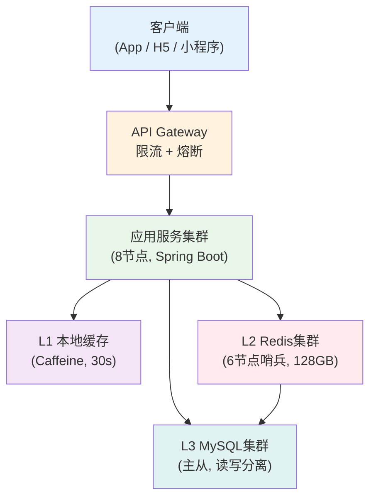
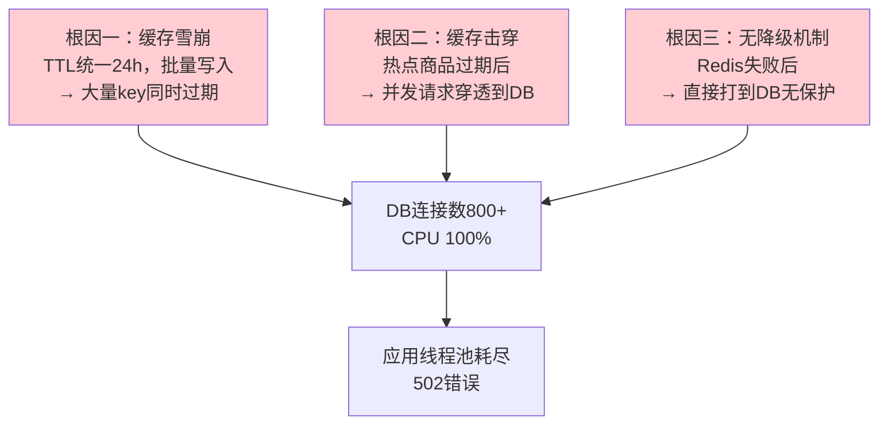
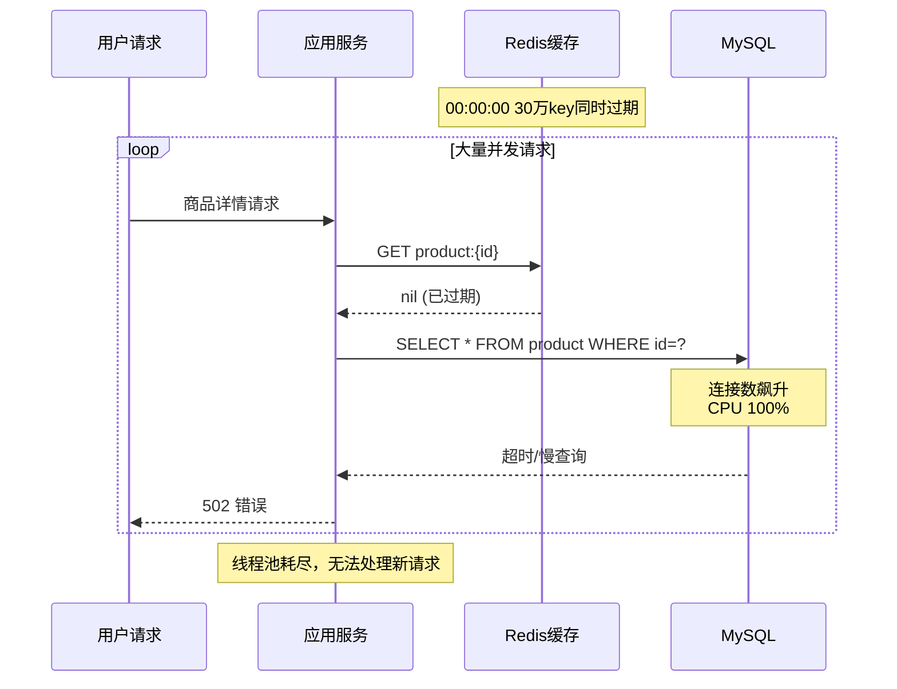
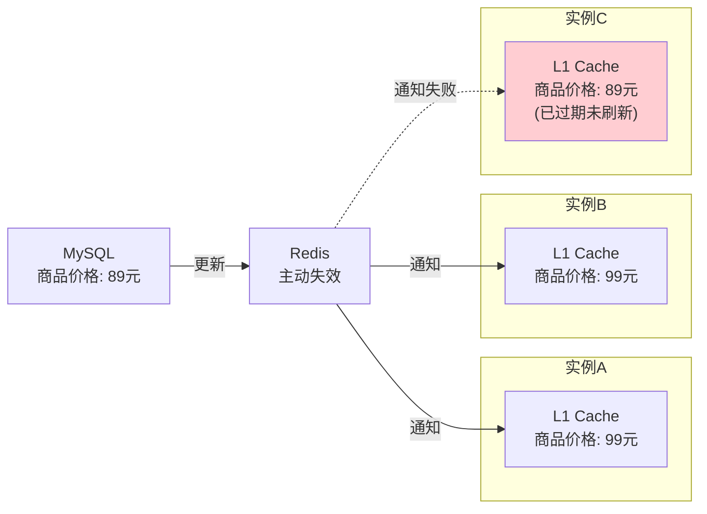
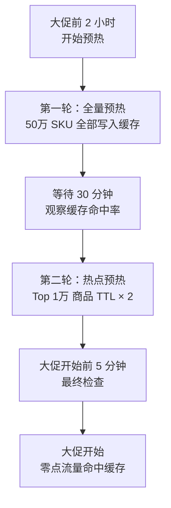
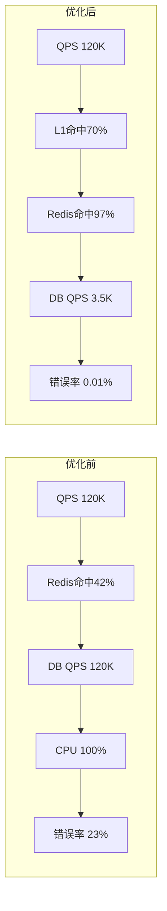
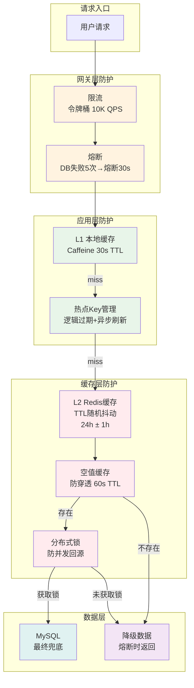
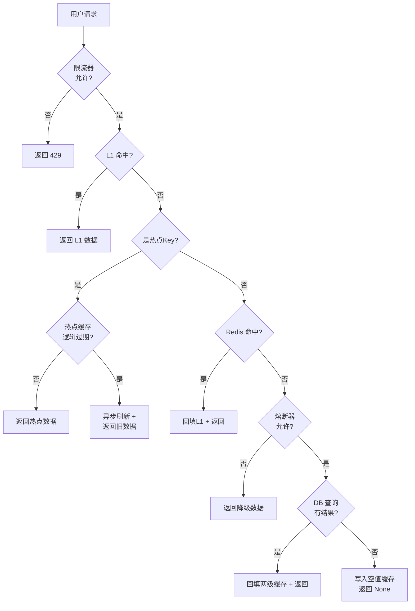

## 案例一：电商商品详情页缓存雪崩

> **案例背景**：某中型电商平台（日活 200 万+，SKU 50 万+）在"双11"零点大促遭遇缓存雪崩级联故障，商品详情页 P99 延迟从 50ms 飙升至 5.2 秒，数据库 CPU 打满，23% 的请求返回 502 错误。本文完整还原从故障发现、根因分析到分层治理的全过程。

**本案例你将学到：**

- 如何通过时间线还原和监控数据快速定位缓存雪崩的根因
- 缓存雪崩、击穿、穿透三重问题的叠加机制与区分方法
- 从 TTL 抖动、热点保护、多级缓存到限流熔断的四层防御体系设计与实现
- 缓存预热策略——如何在大促前安全地填充缓存
- 生产环境的监控告警体系与容量规划方法
- 完整的故障复盘模板，可直接用于团队复盘

---

### 一、场景还原与故障现象

#### 1.1 系统架构概览

该电商平台商品详情页的读链路采用经典的三级架构：



正常情况下，商品详情页的请求链路为：**本地缓存 → Redis → MySQL**。缓存命中率稳定在 97% 以上，P99 延迟约 50ms。各级缓存的定位和作用如下：

| 层级 | 技术选型 | 容量 | TTL | 核心作用 |
|------|----------|------|-----|----------|
| L1 本地缓存 | Caffeine（进程内） | 10,000 key | 30 秒 | 拦截热数据，零网络开销 |
| L2 分布式缓存 | Redis 6 节点哨兵 | 128GB 内存 | 24 小时 | 全局数据共享，跨实例一致 |
| L3 数据库 | MySQL 主从读写分离 | 50 万 SKU | — | 最终数据源，兜底查询 |

#### 1.2 故障时间线

| 时间 | 事件 | 系统状态 |
|------|------|----------|
| 23:55 | 大促预热结束，运营批量导入商品数据并设置缓存 | Redis 写入 30 万+ key，TTL 统一 24 小时 |
| 00:00:00 | 大促零点开始，流量瞬间涌入 | QPS 从 5,000 飙升至 120,000 |
| 00:00:01 | 10 万+ 商品缓存 key 同时过期 | Redis 命中率从 97% 跌至 42% |
| 00:00:03 | 大量请求穿透到 MySQL | MySQL 连接数从 50 飙升至 800+ |
| 00:00:05 | MySQL CPU 100%，查询超时 | 应用线程池耗尽，开始大量超时 |
| 00:00:10 | 用户侧 502 错误率 23% | 告警触发，开始紧急排查 |
| 00:15 | 紧急重启应用实例，部分流量恢复 | 错误率回落至 8%，但 DB 仍处于高负载 |
| 00:30 | 手动清除 Redis 中残留的热点 key，强制回源刷新 | 命中率缓慢回升至 65% |
| 00:45 | DB 连接数回落至 200 以下 | 系统基本恢复，开始复盘 |


> **复盘启示**：从故障发生到告警触发耗时 10 秒，从告警到基本恢复耗时 35 分钟。如果当时有完善的监控告警和自动降级机制，恢复时间可以缩短到 5 分钟以内。这个时间差正是本案例要解决的核心问题。

#### 1.3 关键监控指标

故障发生时，运维团队通过以下命令快速定位了问题：

```bash
# 1. Redis 命中率监控 —— 命中率跌至 42%，远低于正常的 97%
redis-cli info stats | grep -E "keyspace_hits|keyspace_misses"
# keyspace_hits:8234567
# keyspace_misses:9876543
# 命中率 = 8234567 / (8234567+9876543) ≈ 45.4%

# 2. 数据库连接数监控 —— 正常值 <50，此刻已突破 800
mysqladmin extended-status | grep Threads_running
# Threads_running: 847

# 3. Redis 内存与 key 数量 —— 内存使用正常，但 key 数量骤降
redis-cli info memory | grep used_memory_human
redis-cli dbsize
# dbsize: 127432  ← 正常应为 30 万+，说明大量 key 已过期删除

# 4. 应用层线程池监控 —— 线程池已满，队列堆积
curl -s localhost:8080/actuator/metrics/tomcat.threads.busy
# value: 200/200（最大线程数已满）

# 5. Redis 响应延迟 —— 本身响应正常，问题不在 Redis 性能
redis-cli --latency-history -i 1
# min: 0, max: 3, avg: 1 (ms)  ← Redis 本身没有性能问题
```

**定位思路**：Redis 响应正常（延迟 < 3ms）→ 但 key 数量骤降（从 30 万降至 12 万）→ 说明大量 key 在同一时间窗口过期 → 导致请求穿透到 MySQL → MySQL 被打满。这是一个典型的**缓存雪崩**场景，而非 Redis 本身的性能瓶颈。

---

### 二、根因分析

#### 2.1 三重问题叠加

经过深入排查，故障由三个独立问题在时间窗口内叠加触发，形成了级联崩溃：



**根因一：缓存雪崩 —— TTL 设计缺陷**

商品数据的缓存 TTL 统一设置为 24 小时（86400 秒），且是运营在大促前同一批次导入的。这意味着同一天写入的 30 万+ 个 key 会在同一时刻（零点）集中过期。雪崩的本质是**缓存层整体失效**，导致所有请求瞬间穿透到数据库。

> **为什么"统一 TTL"是致命的？** 假设 30 万个 key 在同一秒过期，按 12 万 QPS 计算，这一秒内会有 12 万个请求直接打到 MySQL。而 MySQL 正常只承受 3,500 QPS，瞬间增长了 34 倍，远超其处理能力。如果 TTL 加了 1 小时的随机抖动，过期分散到 3600 秒内，每秒只有约 83 个 key 过期（12 万 / 3600），对应的穿透请求仅为正常水平的 2.4%，完全可控。

**根因二：缓存击穿 —— 热点 key 过期保护缺失**

iPhone、华为 Mate 等热门商品是典型的热点 key，单个 key 的 QPS 可达数千。这类 key 过期后，大量并发请求同时穿透到数据库，触发"惊群效应"。代码中未对热点 key 做特殊保护（如永不过期 + 异步刷新），也没有用分布式锁控制并发回源。

**根因三：无降级机制 —— 缺少兜底保护**

Redis 访问失败或超时后，应用直接回源查询数据库，没有限流、熔断或降级机制。当数据库已经被打满时，所有回源请求都超时，超时又占用线程，进一步恶化了系统状态，形成正反馈恶性循环。

**三个根因的叠加效应**：雪崩制造了大面积的缓存失效，击穿放大了热点 key 的穿透压力，而缺乏降级机制使得系统在压力面前毫无缓冲。三者缺一，系统或许还能扛住；三者同时发生，则必然导致级联崩溃。

#### 2.2 数据流时序分析



#### 2.3 雪崩、击穿、穿透的区别

很多团队在复盘时混淆这三种问题，但它们的触发条件和应对策略截然不同：

| 故障模式 | 触发条件 | 影响范围 | 危害程度 | 应对策略 |
|----------|----------|----------|----------|----------|
| **缓存雪崩** | 大量 key 同时过期（TTL 统一） | 全局性——整个缓存层失效 | 灾难级——所有请求穿透 | TTL 随机抖动 + 缓存预热 |
| **缓存击穿** | 单个热点 key 过期 | 局部性——仅热点数据受影响 | 严重——热点 QPS 集中穿透 | 逻辑过期 + 异步刷新 + 分布式锁 |
| **缓存穿透** | 查询不存在的数据 | 无差别——每次请求都穿透 | 中等——取决于恶意请求量 | 布隆过滤器 + 空值缓存 |

---

### 三、解决方案：分层治理

针对三重根因，我们设计了分层防御体系，从缓存层、应用层到网关层逐层加固。每一层解决一个问题，同时作为下一层的缓冲。

#### 3.1 第一层：TTL 随机抖动 —— 治雪崩

**原理**：给每个 key 的 TTL 加一个随机偏移量，让原本同时过期的 key 分散在时间窗口内，避免集中失效。

```python
import random
import json

def set_cache_with_jitter(redis_client, key, data, base_ttl=86400, jitter_range=3600):
    """
    带随机抖动的缓存写入
    
    参数:
        redis_client: Redis连接
        key: 缓存key
        data: 要缓存的数据
        base_ttl: 基础过期时间（秒），默认24小时
        jitter_range: 抖动范围（秒），默认1小时
    
    效果:
        30万个key的TTL从统一的86400秒
        变为 86400 ~ 87600秒 的均匀分布
        过期时间窗口从瞬间变为1小时
    """
    jitter = random.randint(0, jitter_range)
    ttl = base_ttl + jitter
    redis_client.setex(key, ttl, json.dumps(data))
    return ttl  # 返回实际TTL用于日志追踪


def batch_set_with_jitter(redis_client, products, base_ttl=86400):
    """批量写入带抖动的缓存"""
    pipeline = redis_client.pipeline()
    ttl_stats = []
    
    for product in products:
        key = f"product:{product['id']}"
        jitter = random.randint(0, 3600)
        ttl = base_ttl + jitter
        pipeline.setex(key, ttl, json.dumps(product))
        ttl_stats.append(ttl)
    
    pipeline.execute()
    
    # 验证TTL分布是否合理
    min_ttl = min(ttl_stats)
    max_ttl = max(ttl_stats)
    print(f"批量写入 {len(products)} 个key")
    print(f"TTL范围: {min_ttl}s ~ {max_ttl}s（窗口: {(max_ttl-min_ttl)/60:.0f}分钟）")
```

**抖动策略选择**：

| 策略 | 实现 | 适用场景 | 优缺点 |
|------|------|----------|--------|
| 均匀随机 | `base + rand(0, N)` | 通用场景，key 数量适中 | 简单有效，但大量 key 仍有小概率碰撞 |
| 高斯随机 | `base + gauss(μ, σ)` | key 数量大、分布敏感 | 过期更集中于均值附近，避免极端值 |
| 分桶策略 | 按 key hash 分 N 个桶 | 精确控制过期节奏 | 复杂度高，但过期分布最均匀 |
| 渐进式续期 | 每次读取时续期 | 读多写少场景 | 防雪崩效果最好，但增加 Redis 写操作 |

```python
import random
import math

def gaussian_jitter(base_ttl=86400, mean=1800, stddev=600):
    """高斯分布抖动：大部分key集中在均值附近，减少极端偏移"""
    jitter = int(random.gauss(mean, stddev))
    jitter = max(0, min(jitter, 3600))  # 截断到 [0, 3600]
    return base_ttl + jitter


def bucket_jitter(key, base_ttl=86400, bucket_count=12, bucket_size=3600):
    """
    分桶策略：将key按hash分到N个桶，每桶内的key同时过期
    效果：30万key分12桶，每桶2.5万key，过期间隔30分钟
    """
    bucket = hash(key) % bucket_count
    offset = bucket * bucket_size
    return base_ttl + offset
```

**策略选择建议**：对于绝大多数业务场景，均匀随机抖动（jitter 范围 = base_ttl × 5%~10%）已经足够。只有在以下情况才需要更复杂的策略：
- key 数量超过百万级且对过期均匀度有严格要求 → 使用分桶策略
- 业务读写比极高（> 100:1）且希望完全避免雪崩 → 使用渐进式续期
- 需要过期时间集中在某个合理范围内，避免过早或过晚 → 使用高斯随机

**TTL 抖动的注意事项**：抖动范围不宜过大。如果 base_ttl = 24 小时，jitter = 12 小时，意味着有些 key 12 小时就过期，有些要 36 小时才过期——这会导致数据新鲜度差异过大。一般建议 jitter_range ≤ base_ttl × 10%。

#### 3.2 第二层：热点 key 永不过期 + 异步刷新 —— 治击穿

**原理**：热点 key 不设置 Redis 物理过期时间，而是在 value 中嵌入逻辑过期时间。读取时判断是否逻辑过期，若过期则异步刷新，当前请求返回旧数据。

```python
import time
import json
import threading

class HotKeyManager:
    """
    热点key管理器：逻辑过期 + 分布式锁 + 异步刷新
    
    核心思想：
    - 物理上key永不过期，不会被Redis自动删除
    - 业务层维护逻辑过期时间，读取时判断
    - 过期后异步刷新，当前请求返回旧数据（短暂不一致）
    - 分布式锁保证同一时刻只有一个线程在刷新
    """
    
    def __init__(self, redis_client):
        self.redis = redis_client
    
    def get_hot_data(self, key, fetch_fn, expire_seconds=3600):
        """
        获取热点数据
        
        参数:
            key: 缓存key
            fetch_fn: 数据加载函数（当缓存miss或过期时调用）
            expire_seconds: 逻辑过期时间（秒）
        
        返回: 数据值（可能是旧数据）
        """
        value = self.redis.get(key)
        
        if value is None:
            # 首次加载：必须同步加载，因为没有任何数据可返回
            data = fetch_fn()
            cache_data = {
                "value": data,
                "expire_at": time.time() + expire_seconds
            }
            self.redis.set(key, json.dumps(cache_data, default=str))
            return data
        
        # 解析缓存数据
        cache_data = json.loads(value)
        
        # 未逻辑过期：直接返回
        if time.time() < cache_data["expire_at"]:
            return cache_data["value"]
        
        # 已逻辑过期：尝试异步刷新
        lock_key = f"lock:hot:{key}"
        acquired = self.redis.set(lock_key, "1", nx=True, ex=10)
        
        if acquired:
            # 拿到锁：异步刷新
            threading.Thread(
                target=self._async_refresh,
                args=(key, fetch_fn, expire_seconds),
                daemon=True
            ).start()
        
        # 无论是否刷新，都返回旧数据
        # 这是"最终一致性"换取"高可用性"的经典取舍
        return cache_data["value"]
    
    def _async_refresh(self, key, fetch_fn, expire_seconds):
        """异步刷新：在后台线程中更新缓存"""
        try:
            new_data = fetch_fn()
            cache_data = {
                "value": new_data,
                "expire_at": time.time() + expire_seconds
            }
            self.redis.set(key, json.dumps(cache_data, default=str))
        except Exception as e:
            # 刷新失败：记录日志，下次读取时会重试
            print(f"[HotKeyManager] 异步刷新失败 key={key}: {e}")
        finally:
            # 释放分布式锁
            self.redis.delete(f"lock:hot:{key}")


# 使用示例
def get_product_from_db(product_id):
    """从数据库加载商品数据"""
    # 实际应使用连接池和ORM
    cursor = db.cursor()
    cursor.execute("SELECT * FROM products WHERE id = %s", (product_id,))
    return cursor.fetchone()


hot_manager = HotKeyManager(redis_client)

# 对热门商品（如iPhone）使用热点key管理
iphone_data = hot_manager.get_hot_data(
    key="hot:product:10086",
    fetch_fn=lambda: get_product_from_db(10086),
    expire_seconds=1800  # 30分钟逻辑过期
)
```

> **生产环境注意**：上述代码使用 Python threading 实现异步刷新，适用于同步框架（如 Flask、Django）。在异步框架（如 FastAPI、Tornado）中，应使用 `asyncio.create_task()` 替代线程；在 Java Spring Boot 中，应使用 `@Async` 注解或 `CompletableFuture.supplyAsync()` 提交到线程池。无论哪种方式，都要确保刷新任务有超时控制（建议 5-10 秒），避免慢查询阻塞刷新线程。

**热点 key 识别方案**：

在生产环境中，需要自动识别热点 key。以下是基于滑动窗口的热点发现方案：

```python
import collections
import time

class HotKeyDetector:
    """
    基于滑动窗口的热点key检测器
    
    原理：
    - 定期采样 Redis 的 keyspace 访问日志
    - 统计每个key的访问频次
    - 频次超过阈值的key自动升级为热点key
    """
    
    def __init__(self, redis_client, window_seconds=60, threshold=100):
        self.redis = redis_client
        self.window_seconds = window_seconds
        self.threshold = threshold
        self.counter = collections.Counter()
        self.last_reset = time.time()
    
    def record_access(self, key):
        """记录key的访问"""
        self.counter[key] += 1
        # 窗口到期自动重置
        if time.time() - self.last_reset >= self.window_seconds:
            self.detect()  # 重置前先检测
    
    def detect(self):
        """检测当前窗口内的热点key"""
        hot_keys = []
        for key, count in self.counter.items():
            if count >= self.threshold:
                hot_keys.append((key, count))
        
        # 重置计数器（滑动窗口）
        self.counter.clear()
        self.last_reset = time.time()
        
        # 按访问频次降序排列
        hot_keys.sort(key=lambda x: x[1], reverse=True)
        return hot_keys
```

**更高效的生产方案**：上述方案在应用层做统计，适合中小规模。大规模场景推荐以下方案：

| 方案 | 实现方式 | 优点 | 缺点 |
|------|----------|------|------|
| Redis MONITOR + 采样 | 每秒采样 10% 的命令，统计 key 频次 | 无需改应用代码 | MONITOR 有 10-20% 性能损耗，仅用于诊断 |
| Redis LFU 淘汰策略 | `maxmemory-policy allkeys-lfu`，用 `OBJECT FREQ` 查看访问频率 | 零额外开销 | 需要 Redis 4.0+，仅统计被访问到的 key |
| 应用层计数器 | 本地 Counter + 定期上报（如上面的 HotKeyDetector） | 精确可控 | 需要改代码，多实例需要聚合 |
| 代理层统计 | 在 Redis Proxy（如 Twemproxy）层做频次统计 | 对应用完全透明 | 架构复杂度增加 |

#### 3.3 第三层：缓存穿透防护 —— 治穿透

**原理**：当查询的数据在数据库中根本不存在时（如恶意构造的不存在的 ID），每次请求都会穿透缓存直达数据库。防御手段是**在缓存层拦截无效请求**，不让它们到达数据库。

**方案一：空值缓存（Null Cache）**

当数据库查询返回空结果时，仍在缓存中写入一个空值标记，设置较短的 TTL（如 60 秒）。后续相同请求命中缓存后直接返回空，不再穿透到数据库。

```python
import json

NULL_PLACEHOLDER = "__NULL__"
NULL_TTL = 60  # 空值缓存60秒，比正常数据短得多

def get_with_null_protection(redis_client, key, fetch_fn, normal_ttl=86400):
    """
    带空值缓存保护的查询
    
    原理：
    - 正常数据：缓存TTL为24小时
    - 空结果：缓存TTL为60秒
    - 恶意请求的相同key在60秒内直接返回空，不穿透到DB
    """
    value = redis_client.get(key)
    
    if value == NULL_PLACEHOLDER:
        return None  # 命中空值缓存，直接返回None
    
    if value is not None:
        return json.loads(value)
    
    # 缓存miss，查询数据库
    data = fetch_fn()
    
    if data is None:
        # 写入空值缓存，防止穿透
        redis_client.setex(key, NULL_TTL, NULL_PLACEHOLDER)
    else:
        # 写入正常缓存
        redis_client.setex(key, normal_ttl, json.dumps(data, default=str))
    
    return data
```

**方案二：布隆过滤器（Bloom Filter）**

布隆过滤器是一种概率型数据结构，可以判断一个元素"可能存在"或"一定不存在"。在缓存层前置一个布隆过滤器，拦截所有查询不存在 key 的请求。

```python
# 使用 redis-bloom 模块（Redis 4.0+ 需安装 RedisBloom 模块）
# 或使用 pybloom_live 库在应用层实现

from pybloom_live import BloomFilter

class BloomFilterCache:
    """
    布隆过滤器 + 缓存 双重防护
    
    流程：
    1. 请求到达 → 先查布隆过滤器
    2. 布隆过滤器说"不存在" → 直接返回空（100%准确）
    3. 布隆过滤器说"可能存在" → 查缓存 → 查DB
    
    布隆过滤器的误判率（假阳性）：
    - 50万元素，1%误判率 → 约 600KB 内存
    - 50万元素，0.1%误判率 → 约 900KB 内存
    """
    
    def __init__(self, expected_items=500000, error_rate=0.01):
        self.bf = BloomFilter(capacity=expected_items, error_rate=error_rate)
    
    def add(self, key):
        """添加key到布隆过滤器"""
        self.bf.add(key)
    
    def might_contain(self, key):
        """判断key是否可能存在"""
        return key in self.bf
```

**方案对比与选型建议**：

| 方案 | 实现复杂度 | 内存开销 | 准确度 | 适用场景 |
|------|-----------|----------|--------|----------|
| 空值缓存 | 低（改代码即可） | 极低（每个空值 < 100B） | 100% 准确 | 通用场景，优先使用 |
| 布隆过滤器 | 中（需维护过滤器） | 低（50万 key ≈ 600KB） | 有假阳性（< 1%） | 恶意攻击场景，需要前置拦截 |
| 参数校验 | 低（入口校验） | 无 | 100% 准确 | ID 格式固定的场景（如纯数字） |

> **推荐组合**：空值缓存作为基础防线（所有场景必加），布隆过滤器作为加强防线（高安全要求场景），参数校验作为第一道关卡（格式不对直接拒绝）。

#### 3.4 第四层：多级缓存 + 本地缓存兜底 —— 抗波动

**原理**：在应用进程内增加 L1 本地缓存（如 Caffeine / Guava Cache），即使 Redis 全部过期，本地缓存仍能挡住大部分请求，避免直接穿透到数据库。

```python
from cachetools import TTLCache
import json
import time

class L1L2Cache:
    """
    两级缓存架构
    
    L1: 本地缓存（进程内，Caffeine/TTLCache）
        - 容量：10,000 个 key
        - TTL：30 秒（短生命周期，避免长期不一致）
        - 优点：零网络开销，微秒级访问
        - 缺点：多实例间数据不一致
    
    L2: Redis 缓存（分布式）
        - 容量：不限（受内存限制）
        - TTL：5 分钟
        - 优点：全局一致，容量大
        - 缺点：网络开销，毫秒级访问
    
    L3: MySQL 数据库
        - 最终数据源
        - 受连接数和CPU限制，不能承受高并发直击
    """
    
    def __init__(self, redis_client, local_maxsize=10000, local_ttl=30, redis_ttl=300):
        self.redis = redis_client
        self.local = TTLCache(maxsize=local_maxsize, ttl=local_ttl)
        self.redis_ttl = redis_ttl
        self.stats = {"l1_hit": 0, "l2_hit": 0, "db_hit": 0}
    
    def get(self, key, fetch_fn):
        """
        三级查找：L1 → L2 → L3
        
        fetch_fn: 数据库查询函数（仅在L1和L2都miss时调用）
        """
        # L1: 本地缓存
        if key in self.local:
            self.stats["l1_hit"] += 1
            return self.local[key]
        
        # L2: Redis
        value = self.redis.get(key)
        if value:
            decoded = json.loads(value)
            self.local[key] = decoded  # 回填L1
            self.stats["l2_hit"] += 1
            return decoded
        
        # L3: 数据库
        self.stats["db_hit"] += 1
        data = fetch_fn()
        if data is not None:
            self.local[key] = data  # 回填L1
            self.redis.setex(key, self.redis_ttl, json.dumps(data, default=str))  # 回填L2
        return data
    
    def invalidate(self, key):
        """失效指定key（用于数据更新后的一致性维护）"""
        self.local.pop(key, None)
        self.redis.delete(key)
    
    def get_hit_rate(self):
        """返回缓存命中率统计"""
        total = sum(self.stats.values())
        if total == 0:
            return {"l1_hit": 0, "l2_hit": 0, "db_hit": 0}
        return {k: f"{v/total*100:.1f}%" for k, v in self.stats.items()}


# 使用示例
cache = L1L2Cache(
    redis_client=redis_client,
    local_maxsize=10000,  # 最多缓存1万个商品
    local_ttl=30,         # 本地缓存30秒
    redis_ttl=300         # Redis缓存5分钟
)

product = cache.get(
    key="product:10086",
    fetch_fn=lambda: get_product_from_db(10086)
)
```

**本地缓存的多实例一致性问题**：



解决多实例 L1 不一致的常用方案：

| 方案 | 一致性保证 | 实现复杂度 | 延迟 | 适用场景 |
|------|-----------|-----------|------|----------|
| 短 TTL 强制过期 | 最终一致（TTL 内） | 最低 | ≤ TTL | 对一致性要求不高的读场景 |
| Redis Pub/Sub 广播 | 近实时（毫秒级） | 中 | < 100ms | 大多数业务场景（推荐） |
| Canal 监听 binlog | 实时（毫秒级） | 高 | < 200ms | 对一致性要求极高的场景 |

```python
import redis
import json

class LocalCacheInvalidator:
    """基于Redis Pub/Sub的本地缓存失效机制"""
    
    CHANNEL = "cache:invalidate"
    
    def __init__(self, redis_client, local_cache):
        self.redis = redis_client
        self.local_cache = local_cache
        self.pubsub = self.redis.pubsub()
        self.pubsub.subscribe(**{self.CHANNEL: self._on_message})
    
    def invalidate(self, key):
        """失效缓存并广播通知其他实例"""
        # 1. 清除Redis缓存
        self.redis.delete(key)
        # 2. 清除本地缓存
        self.local_cache.pop(key, None)
        # 3. 广播给其他实例
        self.redis.publish(self.CHANNEL, json.dumps({"key": key}))
    
    def _on_message(self, message):
        """接收广播消息，清除本地缓存"""
        data = json.loads(message["data"])
        self.local_cache.pop(data["key"], None)
    
    def start_listener(self):
        """启动监听线程"""
        import threading
        thread = threading.Thread(target=self.pubsub.run_in_thread, daemon=True)
        thread.start()
```

#### 3.5 第五层：限流与熔断 —— 治级联崩溃

**原理**：即使上述缓存层防护全部失败，网关层的限流和熔断机制可以兜底，防止数据库被彻底打垮。

```python
import time
import threading

class TokenBucketRateLimiter:
    """
    令牌桶限流器
    
    参数:
        rate: 每秒产生的令牌数（即QPS上限）
        capacity: 令牌桶容量（允许的突发量）
    
    原理:
    - 令牌以固定速率放入桶中
    - 桶满则丢弃新令牌
    - 请求消耗令牌，桶空则拒绝请求
    """
    
    def __init__(self, rate, capacity):
        self.rate = rate
        self.capacity = capacity
        self.tokens = capacity
        self.last_refill = time.time()
        self.lock = threading.Lock()
    
    def allow(self):
        """尝试获取令牌，返回是否允许通过"""
        with self.lock:
            now = time.time()
            # 补充令牌
            elapsed = now - self.last_refill
            self.tokens = min(self.capacity, self.tokens + elapsed * self.rate)
            self.last_refill = now
            
            if self.tokens >= 1:
                self.tokens -= 1
                return True
            return False


class CircuitBreaker:
    """
    熔断器：三态模型
    
    状态转换:
    CLOSED（正常）→ 失败率达阈值 → OPEN（熔断）→ 超时后 → HALF_OPEN（半开）→ 成功 → CLOSED
                                                                    └→ 失败 → OPEN
    """
    
    CLOSED = "closed"
    OPEN = "open"
    HALF_OPEN = "half_open"
    
    def __init__(self, failure_threshold=5, recovery_timeout=30, success_threshold=3):
        self.failure_threshold = failure_threshold  # 连续失败多少次触发熔断
        self.recovery_timeout = recovery_timeout    # 熔断后多久尝试恢复（秒）
        self.success_threshold = success_threshold  # 半开状态下连续成功多少次恢复
        
        self.state = self.CLOSED
        self.failure_count = 0
        self.success_count = 0
        self.last_failure_time = 0
    
    def allow(self):
        """判断是否允许请求通过"""
        if self.state == self.CLOSED:
            return True
        
        if self.state == self.OPEN:
            if time.time() - self.last_failure_time > self.recovery_timeout:
                self.state = self.HALF_OPEN
                self.success_count = 0
                return True
            return False
        
        if self.state == self.HALF_OPEN:
            return True  # 允许少量请求通过以测试恢复
    
    def record_success(self):
        """记录成功"""
        if self.state == self.HALF_OPEN:
            self.success_count += 1
            if self.success_count >= self.success_threshold:
                self.state = self.CLOSED
                self.failure_count = 0
        elif self.state == self.CLOSED:
            self.failure_count = 0
    
    def record_failure(self):
        """记录失败"""
        self.failure_count += 1
        self.last_failure_time = time.time()
        
        if self.state == self.HALF_OPEN:
            self.state = self.OPEN
        elif self.state == self.CLOSED and self.failure_count >= self.failure_threshold:
            self.state = self.OPEN
```

**限流与熔断的区别**：

| 维度 | 限流（Rate Limiting） | 熔断（Circuit Breaking） |
|------|----------------------|--------------------------|
| 防护目标 | 保护下游服务不被过载 | 保护自身不被下游拖垮 |
| 触发条件 | 请求量超过阈值 | 下游服务故障率超过阈值 |
| 恢复方式 | 等待令牌补充 | 定时半开试探 |
| 返回策略 | 拒绝请求（429 Too Many Requests） | 返回降级数据 |
| 典型配置 | QPS 上限 10,000 | 失败 5 次 → 熔断 30 秒 |

#### 3.6 方案组合：完整的商品详情页服务

将上述所有方案组合成一个完整的服务类：

```python
import json
import time
import random

class ProductService:
    """
    完整的商品详情页服务：五层防护
    
    0. 空值缓存保护（治穿透）
    1. L1 本地缓存（Caffeine, 30s）
    2. L2 Redis 缓存（TTL带抖动, 24h±1h）
    3. 热点key永不过期 + 异步刷新（治击穿）
    4. 限流 + 熔断兜底（治级联崩溃）
    """
    
    NULL_PLACEHOLDER = "__NULL__"
    NULL_TTL = 60
    
    def __init__(self, redis_client, db_pool):
        self.redis = redis_client
        self.db_pool = db_pool
        self.l1_cache = TTLCache(maxsize=10000, ttl=30)
        self.hot_manager = HotKeyManager(redis_client)
        self.rate_limiter = TokenBucketRateLimiter(rate=10000, capacity=5000)
        self.db_breaker = CircuitBreaker(failure_threshold=5, recovery_timeout=30)
        self.hot_keys = set()  # 热点key集合（由HotKeyDetector动态更新）
    
    def get_product(self, product_id):
        """获取商品详情（完整防护链路）"""
        
        # 第零层：限流保护
        if not self.rate_limiter.allow():
            raise Exception("请求过于频繁，请稍后再试")
        
        key = f"product:{product_id}"
        
        # 判断是否为热点key
        if key in self.hot_keys:
            return self.hot_manager.get_hot_data(
                key=key,
                fetch_fn=lambda: self._load_from_db(product_id)
            )
        
        # 第一层：L1本地缓存
        if key in self.l1_cache:
            return self.l1_cache[key]
        
        # 第二层：L2 Redis缓存（含空值保护）
        value = self.redis.get(key)
        if value == self.NULL_PLACEHOLDER:
            return None  # 空值缓存命中，不穿透到DB
        if value:
            data = json.loads(value)
            self.l1_cache[key] = data
            return data
        
        # 第三层：数据库（带熔断保护）
        return self._load_from_db(product_id)
    
    def _load_from_db(self, product_id):
        """从数据库加载（带熔断保护 + 空值缓存）"""
        if not self.db_breaker.allow():
            # 熔断中：返回降级数据（如缓存中的旧数据或默认值）
            return self._get_fallback_data(product_id)
        
        try:
            conn = self.db_pool.get_connection()
            cursor = conn.cursor(dictionary=True)
            cursor.execute("SELECT * FROM products WHERE id = %s", (product_id,))
            data = cursor.fetchone()
            
            key = f"product:{product_id}"
            if data:
                # 回填两级缓存，TTL带随机抖动
                jitter = random.randint(0, 3600)
                self.redis.setex(key, 86400 + jitter, json.dumps(data, default=str))
                self.l1_cache[key] = data
            else:
                # 空值缓存：防止后续请求穿透
                self.redis.setex(key, self.NULL_TTL, self.NULL_PLACEHOLDER)
            
            self.db_breaker.record_success()
            return data
        except Exception as e:
            self.db_breaker.record_failure()
            raise
        finally:
            if conn:
                self.db_pool.return_connection(conn)
    
    def _get_fallback_data(self, product_id):
        """降级数据：返回兜底信息"""
        return {
            "id": product_id,
            "name": "商品信息暂时无法加载",
            "price": None,
            "message": "系统繁忙，请稍后刷新",
            "degraded": True
        }
```

---

### 四、缓存预热：大促前的关键准备

缓存预热是防止雪崩的第一道防线。如果缓存在大促前已经填充好，零点流量涌入时直接命中缓存，就不会出现集中过期的问题。

#### 4.1 预热时机与策略



```python
import random
import time

def cache_warming(redis_client, db_pool, batch_size=1000):
    """
    缓存预热脚本
    
    关键设计：
    1. 分批写入，避免瞬间压力过大
    2. TTL 带随机抖动，防止预热数据同时过期
    3. 热点商品额外加长 TTL
    4. 记录预热进度，支持断点续传
    """
    cursor = db_pool.cursor(dictionary=True)
    cursor.execute("SELECT id FROM products")
    all_ids = [row["id"] for row in cursor.fetchall()]
    
    # 热点商品列表（由业务侧提供或历史数据统计）
    hot_product_ids = set(get_hot_product_ids())  # 假设已实现
    
    warmed = 0
    for i in range(0, len(all_ids), batch_size):
        batch = all_ids[i:i+batch_size]
        pipeline = redis_client.pipeline()
        
        for pid in batch:
            key = f"product:{pid}"
            cursor.execute("SELECT * FROM products WHERE id = %s", (pid,))
            product = cursor.fetchone()
            
            if product:
                # 基础TTL 24小时 + 随机抖动
                base_ttl = 86400
                if pid in hot_product_ids:
                    base_ttl = 172800  # 热点商品TTL × 2
                
                jitter = random.randint(0, 3600)
                pipeline.setex(key, base_ttl + jitter, json.dumps(product, default=str))
        
        pipeline.execute()
        warmed += len(batch)
        print(f"预热进度: {warmed}/{len(all_ids)} ({warmed/len(all_ids)*100:.1f}%)")
        
        # 每批之间短暂休息，避免打满Redis带宽
        time.sleep(0.1)
    
    print(f"预热完成: {warmed} 个key")
```

#### 4.2 预热注意事项

| 事项 | 说明 | 为什么重要 |
|------|------|-----------|
| 分批写入 | 每批 1000 个 key，间隔 100ms | 避免瞬间写入压力打满 Redis 带宽 |
| TTL 抖动 | 基础 TTL + 随机偏移 | 预热数据不能在同一时间过期，否则重蹈覆辙 |
| 热点加长 TTL | 热点商品 TTL × 2 | 热点数据更不容易过期，减少击穿风险 |
| 断点续传 | 记录预热进度到 Redis | 预热脚本中断后可以从中断处继续，不需要从头开始 |
| 预热验证 | 预热后检查 key 数量和命中率 | 确保预热成功，而不是写入了空数据 |
| 避开业务高峰 | 在大促前 2 小时预热 | 预热本身有写入压力，不能和正常业务抢资源 |

> **预热 vs TTL 抖动**：预热解决的是"冷启动"问题（缓存为空时的穿透），TTL 抖动解决的是"批量过期"问题（缓存同时失效时的雪崩）。两者必须同时使用——预热保证初始状态有缓存，抖动保证后续不会同时过期。

---

### 五、验证结果与效果对比

#### 5.1 核心指标对比

| 指标 | 优化前 | 优化后 | 改善幅度 |
|------|--------|--------|----------|
| P99 延迟 | 5,200ms | 45ms | 99.1% ↓ |
| P95 延迟 | 3,800ms | 28ms | 99.3% ↓ |
| 数据库 CPU | 100% | 35% | 65% ↓ |
| 数据库 QPS | 120,000 | 3,500 | 97.1% ↓ |
| 错误率 | 23% | 0.01% | 99.96% ↓ |
| 缓存命中率 | 42% | 97% | 54.8% ↑ |
| 线程池利用率 | 100%（满载） | 45% | 55% ↓ |

#### 5.2 效果分析



**关键改善点解读**：

1. **TTL 抖动**：将 30 万个 key 的过期时间从"同一秒"分散到"1 小时窗口"，过期速率从每秒数万个降至每秒约 8 个
2. **热点 key 保护**：Top 100 热门商品的 QPS 从 DB 直打的数千降至 Redis/L1 拦截的 0
3. **空值缓存**：不存在的商品 ID 请求（约占总请求的 3%）不再穿透到 DB，直接在 Redis 层返回空
4. **本地缓存**：L1 命中率 70% 意味着 70% 的请求在进程内完成，零网络开销
5. **限流熔断**：极端情况下，QPS 被限制在 10,000 以内，DB 永远不会被打满

---

### 六、防御体系全景图

将所有防护措施整合为一张防御层次图：



**请求在防御体系中的完整流转**：



---

### 七、常见误区与最佳实践

#### 7.1 常见误区

| 误区 | 问题描述 | 正确做法 |
|------|----------|----------|
| TTL 统一设置 | 所有 key 用相同 TTL，同时过期 | 加随机抖动，分散过期时间 |
| 只加随机抖动就完事 | 抖动只解决雪崩，不解决击穿 | 雪崩（TTL抖动）+ 击穿（热点保护）+ 穿透（布隆过滤器/空值缓存）要一起做 |
| 本地缓存 TTL 设太长 | L1 TTL > 5分钟，数据严重不一致 | L1 TTL 控制在 10-30 秒，容忍短暂不一致 |
| 热点 key 用互斥锁 | 分布式锁会引入锁竞争，降低吞吐 | 用"逻辑过期 + 异步刷新"，读请求不阻塞 |
| 限流阈值设太低 | 正常流量被误限 | 根据历史峰值的 1.5-2 倍设置阈值 |
| 熔断后直接返回 500 | 用户体验差 | 返回降级数据或缓存中的旧数据 |
| 忽略空值缓存 | 恶意请求直接穿透到 DB | 查询结果为空时写入短 TTL 空值标记 |
| 预热时不做 TTL 抖动 | 预热数据在同一时间过期 | 预热时同样加随机抖动 |
| 监控告警阈值不合理 | 告警太灵敏导致疲劳，或太迟钝导致错过 | 基于历史数据设置动态阈值 |

#### 7.2 预防性监控告警

```bash
#!/bin/bash
# 缓存健康度监控脚本（建议每分钟执行一次）

# 1. 检查Redis命中率（低于90%告警）
HITS=$(redis-cli info stats | grep keyspace_hits | cut -d: -f2)
MISSES=$(redis-cli info stats | grep keyspace_misses | cut -d: -f2)
HIT_RATE=$(echo "scale=2; $HITS * 100 / ($HITS + $MISSES)" | bc)
if (( $(echo "$HIT_RATE < 90" | bc -l) )); then
    echo "ALERT: Redis命中率过低: ${HIT_RATE}%"
fi

# 2. 检查即将过期的key比例（采样法，避免全量扫描）
# 从随机位置扫描1000个key，统计TTL < 300s的比例
EXPIRING=0
SCANNED=0
CURSOR=0
while [ "$SCANNED" -lt 1000 ]; do
    RESULT=$(redis-cli SCAN $CURSOR COUNT 100)
    CURSOR=$(echo "$RESULT" | head -1)
    KEYS=$(echo "$RESULT" | tail -n +2)
    for key in $KEYS; do
        TTL=$(redis-cli TTL "$key")
        if [ "$TTL" -gt 0 ] &amp;&amp; [ "$TTL" -lt 300 ]; then
            EXPIRING=$((EXPIRING + 1))
        fi
        SCANNED=$((SCANNED + 1))
        if [ "$SCANNED" -ge 1000 ]; then break; fi
    done
    if [ "$CURSOR" -eq 0 ]; then break; fi  # SCAN循环完毕
done
EXPIRE_PCT=$(echo "scale=2; $EXPIRING * 100 / $SCANNED" | bc)
if (( $(echo "$EXPIRE_PCT > 30" | bc -l) )); then
    echo "ALERT: 5分钟内将有过期的key占比 ${EXPIRE_PCT}%（样本: $EXPIRING/$SCANNED）"
fi

# 3. 检查数据库连接数（超过200告警）
DB_THREADS=$(mysqladmin extended-status | grep Threads_running | awk '{print $NF}')
if [ "$DB_THREADS" -gt 200 ]; then
    echo "ALERT: 数据库活跃连接数过高: ${DB_THREADS}"
fi

# 4. 检查Redis响应延迟（超过10ms告警）
LATENCY=$(redis-cli --no-auth-warning latency latest 2>/dev/null | grep redis | awk '{print $4}')
if [ -n "$LATENCY" ] &amp;&amp; [ "$LATENCY" -gt 10 ]; then
    echo "ALERT: Redis响应延迟过高: ${LATENCY}ms"
fi
```

> **监控脚本改进说明**：原版脚本使用 Lua 脚本在 Redis 内部做 SCAN 遍历，但 Redis 的 SCAN 命令在 Lua 脚本中无法循环迭代（每次只能调用一次 SCAN），导致只扫描了部分 key。改进版在 Bash 层面做循环 SCAN，通过采样 1000 个 key 估算即将过期的比例，既准确又高效。对于百万级 key 的场景，采样 1000 个已经足够反映整体趋势（统计误差 < 5%）。

#### 7.3 容量规划建议

| 指标 | 推荐值 | 说明 |
|------|--------|------|
| Redis 命中率 | ≥ 95% | 低于 90% 需排查缓存策略 |
| L1 命中率 | ≥ 60% | 低于 50% 需增大本地缓存容量或调整 TTL |
| 热点 key 占比 | ≤ 5% | 超过 10% 说明热点判定阈值过低 |
| DB QPS | ≤ 5,000 | 超过需加强缓存层或增加从库 |
| 限流拒绝率 | ≤ 1% | 超过 5% 需扩容或调整限流阈值 |
| 熔断触发次数 | ≤ 0 | 超过需排查 DB 或 Redis 稳定性 |
| 缓存预热完成率 | 100% | 大促前必须 100% 预热完成 |
| 空值缓存占比 | ≤ 3% | 超过 5% 说明有大量无效请求，需加强参数校验 |

---

### 八、故障复盘模板

以下是本次故障的复盘模板，可直接用于团队复盘会议：

| 复盘维度 | 内容 |
|----------|------|
| **故障概述** | 双11零点大促，商品详情页缓存雪崩，P99 延迟 5.2s，错误率 23% |
| **影响范围** | 日活 200 万用户的商品详情页，持续约 35 分钟 |
| **根因分析** | 三重叠加：TTL 统一导致雪崩 + 热点 key 无保护导致击穿 + 无降级机制导致级联崩溃 |
| **时间线** | 00:00 故障发生 → 00:10 告警 → 00:15 紧急重启 → 00:45 基本恢复 |
| **改进措施** | TTL 抖动 + 热点保护 + 空值缓存 + 限流熔断 + 缓存预热 |
| **预防措施** | 监控告警体系 + 容量规划 + 大促前压测 + 复盘模板 |
| **责任归属** | 缓存策略设计缺陷（开发）+ 未做压测验证（测试）+ 监控阈值不合理（运维） |

**复盘的五个为什么（5 Whys）**：

1. **为什么错误率 23%？** → 应用线程池耗尽，无法处理新请求
2. **为什么线程池耗尽？** → 大量请求超时占用线程，DB 查询平均耗时 > 3 秒
3. **为什么 DB 查询这么慢？** → MySQL 连接数 800+，CPU 100%，远超处理能力
4. **为什么 DB 连接数飙升？** → Redis 缓存命中率从 97% 跌至 42%，请求穿透到 DB
5. **为什么命中率暴跌？** → 30 万 key 在同一秒过期（TTL 统一 24 小时，批量写入）

---

### 九、本案例小结

**核心教训**：

1. **雪崩、击穿、穿透是三种不同的问题**，虽然经常被混为一谈，但需要分别治理。雪崩用 TTL 抖动，击穿用热点保护，穿透用布隆过滤器或空值缓存
2. **防御必须分层**。任何单一层级的防护都不够可靠——Redis 可能宕机、本地缓存可能不一致、DB 可能被拖慢。多层防御才能确保在任何单点故障时系统仍可用
3. **限流和熔断是最后的底线**。前面的缓存优化都是在"尽力避免"问题发生，而限流和熔断是在"问题已经发生"时保护系统不至于彻底崩溃
4. **监控先行**。如果没有 Redis 命中率、DB 连接数等关键指标的监控和告警，故障只能靠用户反馈来发现。预防永远优于事后救火
5. **预热是第一道防线**。缓存预热解决了"冷启动"问题，TTL 抖动解决了"批量过期"问题，两者缺一不可

**可复用的防御模式**：

本案例的五层防护架构（空值缓存 → TTL 抖动 → 热点保护 → 多级缓存 → 限流熔断）是通用的缓存雪崩防御模式，适用于几乎所有使用 Redis 做缓存的业务场景——无论是电商商品详情页、社交媒体 Feed 流，还是在线游戏的排行榜。关键在于根据业务特点调整各层的参数：读多写少的场景加大 L1 TTL，写多读少的场景缩小本地缓存容量，热点集中的场景加强热点保护的灵敏度。

**延伸阅读**：

- 本章理论基础部分的"缓存穿透、击穿与雪崩：三大缓存故障模式全解"——深入了解三种故障的原理机制
- 本章核心技巧部分的"缓存击穿防护：分布式锁的正确姿势"——学习分布式锁在缓存回源中的应用
- 本章核心技巧部分的"缓存预热与降级策略"——掌握大促前的缓存预热方法论
- 案例二"社交平台 Feed 流缓存设计"——对比读多写少场景与写扩散场景的缓存设计差异
