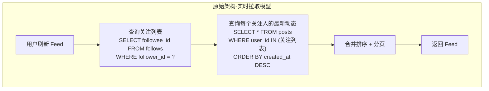
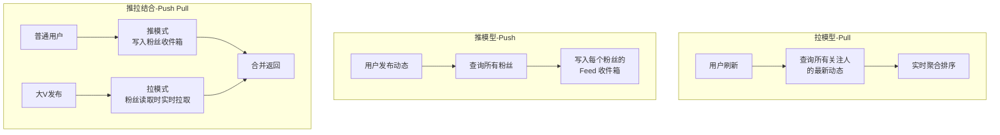
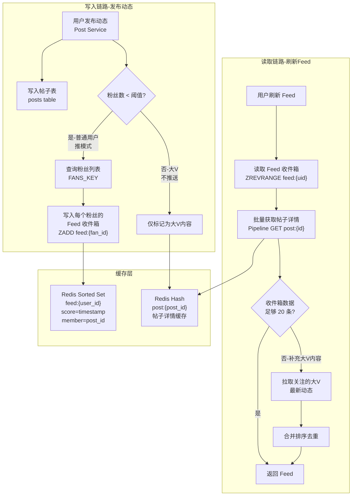
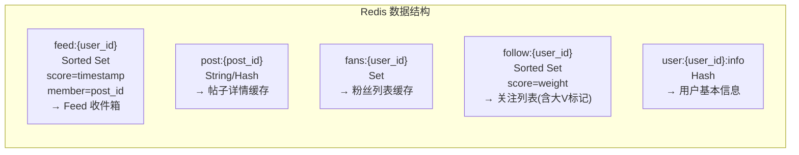
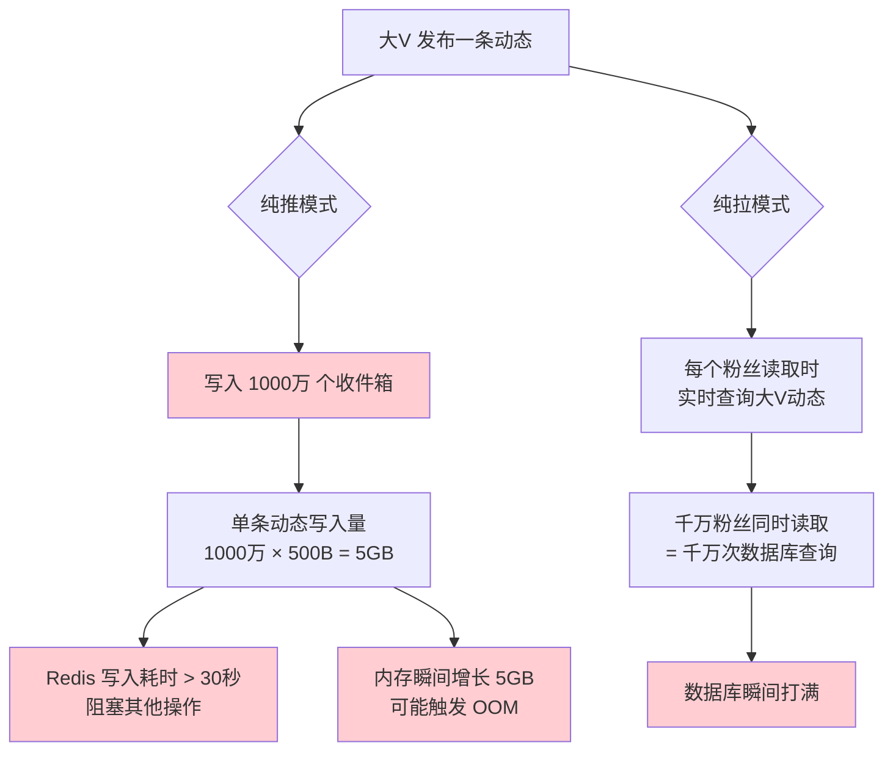
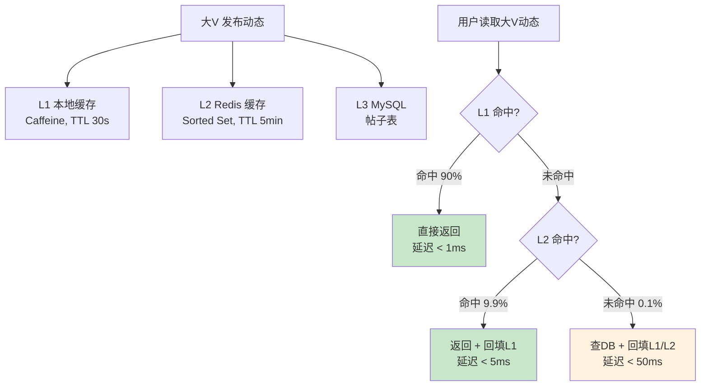
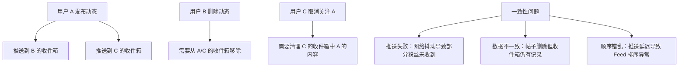
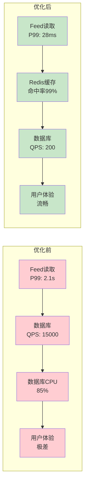
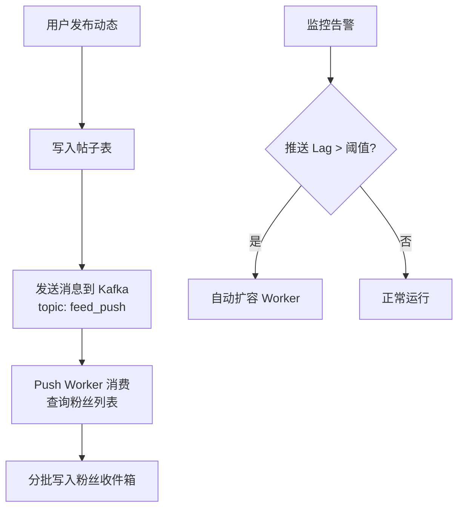

## 案例二：社交平台Feed流缓存设计

> **案例背景**：某中型社交平台（日活 800 万，月活 3000 万）的 Feed 流接口面临严重性能瓶颈。用户刷新朋友圈时需要拉取所有关注人的最新动态，随着用户关注关系膨胀（人均关注 300 人，头部大V粉丝过千万），每次 Feed 请求需要实时聚合大量数据，接口 P99 延迟超过 2 秒，数据库在高峰时段 CPU 长期维持在 85% 以上。本文完整还原从性能瓶颈识别、方案选型到推拉结合（Push-Pull）架构落地的全过程。

---

### 一、场景还原与问题定位

#### 1.1 业务特征分析

社交平台 Feed 流与传统 Web 应用的读写模式有着本质区别：

| 特征维度 | 普通 Web 应用 | 社交平台 Feed 流 |
|----------|--------------|------------------|
| 读写比 | 读多写少（10:1） | 读写极度不对称（1000:1 到 10000:1） |
| 数据聚合方式 | 单表查询为主 | 多表 JOIN + 时间排序 + 去重 |
| 用户行为 | 点击→查看详情 | 无限下拉刷新，浏览瀑布流 |
| 时序敏感度 | 中等（可接受分钟级延迟） | 极高（用户期望秒级看到新动态） |
| 关注关系 | N/A | 一对多扇出，关注人数差异巨大 |
| 热点分布 | 相对均匀 | 长尾分布，大V发布内容被千万级扇出 |

这些特征决定了 Feed 流不能用简单的「查询缓存」模式解决——核心矛盾在于**写入时的扇出问题**和**读取时的聚合问题**。

#### 1.2 原始架构分析

该平台最初的 Feed 读取采用最朴素的**实时拉取（Pull）模型**：每次用户刷新 Feed 时，实时查询所有关注人的最新动态并聚合排序。



对应的 SQL 查询如下：

```sql
-- 每次刷新 Feed 都要执行的核心查询
SELECT p.*, u.nickname, u.avatar
FROM posts p
JOIN users u ON p.user_id = u.id
WHERE p.user_id IN (
    SELECT followee_id FROM follows WHERE follower_id = ?
)
AND p.created_at > ?  -- 只取最近 N 天的
ORDER BY p.created_at DESC
LIMIT 20 OFFSET 0;

-- 问题1: IN 子句包含 300+ ID 时，查询优化器效率急剧下降
-- 问题2: 关注 500 人以上的用户，IN 子句可能导致慢查询
-- 问题3: 每次请求都要执行，QPS 达到数万时数据库根本扛不住
```

**性能测量数据**：

# 原始架构在不同关注人数下的查询耗时
关注人数    平均耗时    P99耗时    数据库CPU
50人        120ms      280ms     正常
100人       350ms      680ms     偏高
300人       890ms      1.8s      告警
500人       1.5s       3.2s      100% 满载
1000人      2.8s       5.1s      超时

**核心瓶颈**：

1. **N+1 查询问题的放大版**：虽然用 IN 一次性查了，但 IN 列表本身就很大，MySQL 优化器对 IN 子句超过一定数量后退化为全表扫描
2. **无缓存层**：每次请求都穿透到数据库，没有热点数据的缓存复用
3. **写放大缺失**：发布者写一条动态，读取者需要在读取时付出聚合代价

---

### 二、方案选型：Feed 系统三大经典模型

在设计缓存方案之前，我们需要理解 Feed 系统的三大经典架构模型，它们是所有社交平台 Feed 设计的理论基础。

#### 2.1 三大模型对比



| 模型 | 原理 | 写入开销 | 读取开销 | 数据新鲜度 | 适用场景 |
|------|------|---------|---------|-----------|---------|
| **Pull（拉模型）** | 读取时实时查询关注列表并聚合 | O(1)，只写一份 | O(F)，F=关注人数 | 实时 | 写多读少、关注人数极少 |
| **Push（推模型）** | 写入时扇出到每个粉丝的收件箱 | O(F)，F=粉丝数 | O(1)，直接读收件箱 | 实时 | 读多写少、粉丝数有上限 |
| **Push-Pull（推拉结合）** | 普通用户推，大V拉 | O(普通粉丝数) | O(1)+O(大V关注数) | 接近实时 | 大规模社交平台 |

**为什么选择推拉结合？**

该平台有两类典型用户：

- **普通用户**（占 99.5%）：粉丝数 < 5000，发布频率低（日均 1-3 条），适合推模式
- **大V/网红**（占 0.5%）：粉丝数 > 5000，甚至千万级，发布频率可能较高，推模式写放大不可接受

如果用纯推模式，一个千万粉丝大V发布一条动态，需要写入 1000 万个收件箱——这在写入延迟和 Redis 内存上都是灾难。如果用纯拉模式，每个用户刷新 Feed 都要实时查询关注列表——数据库扛不住。

推拉结合是唯一兼顾写放大和读延迟的可行方案。

---

### 三、解决方案：推拉结合架构设计

#### 3.1 整体架构



#### 3.2 数据结构设计

Feed 缓存使用 Redis 的多种数据结构协同工作：



**关键设计决策**：

| 数据结构 | Redis 类型 | 用途 | 过期策略 | 容量估算 |
|---------|-----------|------|---------|---------|
| `feed:{uid}` | Sorted Set | Feed 收件箱，按时间排序 | 不过期，ZREMRANGEBYRANK 裁剪 | 每用户最多 1000 条，约 2KB |
| `post:{pid}` | String(JSON) | 帖子详情（正文、图片URL、互动数） | TTL 24小时，LRU 淘汰 | 单条约 500B，5000万条 ≈ 25GB |
| `fans:{uid}` | Set | 粉丝 ID 列表 | TTL 1小时，发布时主动刷新 | 大V 1000万粉 ≈ 100MB |
| `follow:{uid}` | Sorted Set | 关注列表（score 标记大V权重） | TTL 12小时 | 每用户约 10KB |

#### 3.3 写入链路：发布动态时的推模式

当用户发布一条新动态时，系统需要将这条动态"推送"到所有粉丝的 Feed 收件箱中。

```python
import json
import time
import redis

class FeedWriteService:
    """
    Feed 写入服务：发布动态时推送到粉丝的收件箱
    
    核心流程：
    1. 写入帖子表（MySQL + 帖子缓存）
    2. 判断发布者是否为大V
    3. 普通用户：查询粉丝列表，推送到每个粉丝的 Feed 收件箱
    4. 大V：不推送（粉丝读取时再拉取）
    
    性能优化：
    - Pipeline 批量写入减少网络往返
    - 异步队列解耦推送逻辑
    - 大V 不推送避免写放大
    """
    
    # 大V 粉丝数阈值：超过此值视为大V，采用拉模式
    CELEBRITY_FAN_THRESHOLD = 5000
    # 每个用户的 Feed 收件箱最大容量
    FEED_MAX_SIZE = 1000
    
    def __init__(self, redis_client, db_pool):
        self.redis = redis_client
        self.db_pool = db_pool
    
    def publish_post(self, user_id, post_content, post_id=None):
        """
        发布动态的完整流程
        
        参数:
            user_id: 发布者 ID
            post_content: 动态内容 dict，包含 text, images, etc.
            post_id: 帖子 ID（可选，不传则自动生成）
        
        返回:
            post_id: 发布成功的帖子 ID
        """
        timestamp = time.time()
        if post_id is None:
            post_id = f"post:{user_id}:{int(timestamp * 1000)}"
        
        # === Step 1: 持久化帖子到数据库 ===
        self._save_to_database(post_id, user_id, post_content, timestamp)
        
        # === Step 2: 缓存帖子详情 ===
        post_data = {
            "post_id": post_id,
            "user_id": user_id,
            "content": post_content,
            "created_at": timestamp,
            "likes": 0,
            "comments": 0,
            "shares": 0
        }
        self.redis.setex(
            f"post:{post_id}",
            86400,  # 24小时过期
            json.dumps(post_data, ensure_ascii=False)
        )
        
        # === Step 3: 判断推送策略 ===
        fan_count = self._get_fan_count(user_id)
        
        if fan_count <= self.CELEBRITY_FAN_THRESHOLD:
            # 普通用户：推模式，写入粉丝的 Feed 收件箱
            self._push_to_fans(user_id, post_id, timestamp)
            strategy = "push"
        else:
            # 大V：不推送，粉丝读取时拉取
            strategy = "pull"
        
        return post_id
    
    def _push_to_fans(self, user_id, post_id, timestamp):
        """
        将动态推送到所有粉丝的 Feed 收件箱
        
        使用 Pipeline 批量写入，减少 Redis 网络往返。
        单次 Pipeline 命令数 = 粉丝数 × 2（ZADD + ZREMRANGEBYRANK）
        """
        fans = self._get_fans(user_id)
        
        if not fans:
            return
        
        # 分批处理，每批 500 个粉丝
        batch_size = 500
        for i in range(0, len(fans), batch_size):
            batch = fans[i:i + batch_size]
            pipe = self.redis.pipeline()
            
            for fan_id in batch:
                feed_key = f"feed:{fan_id}"
                # 将 post_id 作为 member，timestamp 作为 score 写入 Sorted Set
                pipe.zadd(feed_key, {post_id: timestamp})
                # 裁剪：只保留最新的 1000 条，删除最旧的
                pipe.zremrangebyrank(feed_key, 0, -(self.FEED_MAX_SIZE + 1))
            
            pipe.execute()
        
        # 记录推送统计，用于监控和调优
        self._record_push_stats(user_id, len(fans))
    
    def _get_fans(self, user_id):
        """获取粉丝列表（带缓存）"""
        fans_key = f"fans:{user_id}"
        
        # 先查缓存
        cached = self.redis.smembers(fans_key)
        if cached:
            return [int(f) for f in cached]
        
        # 缓存未命中，查数据库
        with self.db_pool.cursor() as cur:
            cur.execute(
                "SELECT follower_id FROM follows WHERE followee_id = %s",
                (user_id,)
            )
            fans = [row[0] for row in cur.fetchall()]
        
        if fans:
            # 写入缓存，TTL 1小时
            pipe = self.redis.pipeline()
            pipe.sadd(fans_key, *fans)
            pipe.expire(fans_key, 3600)
            pipe.execute()
        
        return fans
    
    def _get_fan_count(self, user_id):
        """获取粉丝数量"""
        fans_key = f"fans:{user_id}"
        count = self.redis.scard(fans_key)
        if count is not None and count > 0:
            return count
        # 降级到数据库
        with self.db_pool.cursor() as cur:
            cur.execute(
                "SELECT COUNT(*) FROM follows WHERE followee_id = %s",
                (user_id,)
            )
            return cur.fetchone()[0]
    
    def _save_to_database(self, post_id, user_id, content, timestamp):
        """持久化帖子到数据库"""
        with self.db_pool.cursor() as cur:
            cur.execute(
                """INSERT INTO posts (id, user_id, content, created_at)
                   VALUES (%s, %s, %s, FROM_UNIXTIME(%s))""",
                (post_id, user_id, json.dumps(content, ensure_ascii=False), timestamp)
            )
            self.db_pool.commit()
    
    def _record_push_stats(self, user_id, fan_count):
        """记录推送统计"""
        stats_key = f"stats:push:{int(time.time() // 300)}"  # 5分钟一个桶
        self.redis.hincrby(stats_key, "count", 1)
        self.redis.hincrby(stats_key, "total_fans", fan_count)
        self.redis.expire(stats_key, 3600)
```

**推模式的关键权衡**：

| 参数 | 设置 | 权衡分析 |
|------|------|---------|
| `CELEBRITY_FAN_THRESHOLD` | 5000 | 低于此值推送：5000 人 × 500B = 2.5MB/次写入，可接受。高于此值推送开销指数增长 |
| `FEED_MAX_SIZE` | 1000 | 保留 1000 条 ≈ 用户浏览 50 页（每页 20 条）。覆盖最近 3-5 天的活跃用户需求 |
| 分批大小 | 500 | 单次 Pipeline 500 × 2 命令 ≈ 1000 个命令，Redis 执行时间 < 10ms |

#### 3.4 读取链路：刷新 Feed 时的拉模式

用户刷新 Feed 时，系统从收件箱读取缓存数据，不足时补充拉取大V的最新动态。

```python
import json
import time
from concurrent.futures import ThreadPoolExecutor

class FeedReadService:
    """
    Feed 读取服务：从缓存收件箱 + 大V拉取，聚合返回 Feed
    
    读取策略：
    1. 优先从 Redis 收件箱读取（推模式写入的数据）
    2. 如果收件箱数据不足（大V 的内容未推送），拉取大V最新动态
    3. 合并排序后返回
    
    性能设计：
    - Pipeline 批量获取帖子详情，减少网络往返
    - 异步并行拉取多个大V的内容
    - 本地缓存热门帖子详情，减少 Redis 压力
    """
    
    # 每页大小
    PAGE_SIZE = 20
    # 大V 最多拉取的条数
    CELEBRITY_PULL_LIMIT = 10
    # 大V 粉丝数阈值（与写入侧保持一致）
    CELEBRITY_FAN_THRESHOLD = 5000
    
    def __init__(self, redis_client, local_cache=None):
        self.redis = redis_client
        self.local_cache = local_cache  # 可选：L1 本地缓存
        self.executor = ThreadPoolExecutor(max_workers=4)
    
    def get_feed(self, user_id, page=0, count=None):
        """
        获取用户的 Feed 流
        
        参数:
            user_id: 用户 ID
            page: 页码（从 0 开始）
            count: 每页数量（默认 PAGE_SIZE）
        
        返回:
            list[dict]: 帖子列表，已排序，包含帖子详情
        """
        if count is None:
            count = self.PAGE_SIZE
        
        offset = page * count
        feed_key = f"feed:{user_id}"
        
        # === Step 1: 从收件箱读取（推模式数据） ===
        post_ids = self.redis.zrevrange(feed_key, offset, offset + count - 1)
        post_ids = [pid.decode() if isinstance(pid, bytes) else pid for pid in post_ids]
        
        # === Step 2: 判断是否需要拉取大V内容 ===
        total_cached = self.redis.zcard(feed_key)
        
        if total_cached < offset + count:
            # 收件箱数据不够，需要拉取大V内容补充
            celebrity_posts = self._pull_celebrity_posts(user_id, count)
            # 合并：收件箱的 + 拉取的，去重后按时间排序
            all_post_ids = self._merge_and_dedup(post_ids, celebrity_posts)
            post_ids = all_post_ids[offset:offset + count]
        
        # === Step 3: 批量获取帖子详情 ===
        posts = self._batch_get_posts(post_ids)
        
        return posts
    
    def _pull_celebrity_posts(self, user_id, count):
        """
        拉取用户关注的大V的最新动态
        
        策略：
        1. 获取关注列表，筛选出大V
        2. 并行拉取每个大V的最新 N 条动态
        3. 合并排序
        """
        # 获取关注列表（带大V标记）
        follow_key = f"follow:{user_id}"
        followings = self.redis.zrevrange(follow_key, 0, -1, withscores=True)
        
        if not followings:
            return []
        
        # 筛选大V（score > 阈值表示大V）
        celebrity_ids = [
            fid.decode() if isinstance(fid, bytes) else fid
            for fid, score in followings
            if score > self.CELEBRITY_FAN_THRESHOLD
        ]
        
        if not celebrity_ids:
            return []
        
        # 并行拉取每个大V的最新动态
        pull_tasks = [
            self.executor.submit(
                self._fetch_celebrity_recent,
                celeb_id,
                self.CELEBRITY_PULL_LIMIT
            )
            for celeb_id in celebrity_ids[:10]  # 最多拉取10个大V
        ]
        
        all_celebrity_posts = []
        for task in pull_tasks:
            try:
                posts = task.result(timeout=2)  # 2秒超时
                all_celebrity_posts.extend(posts)
            except Exception:
                continue  # 单个大V拉取失败不影响整体
        
        return all_celebrity_posts
    
    def _fetch_celebrity_recent(self, celebrity_id, limit):
        """
        拉取单个大V的最新动态
        
        优先查缓存，缓存未命中则查数据库。
        大V 的动态被频繁读取，缓存命中率极高。
        """
        cache_key = f"celebrity_feed:{celebrity_id}"
        
        # 先查缓存
        cached = self.redis.zrevrange(cache_key, 0, limit - 1)
        if cached:
            return [pid.decode() if isinstance(pid, bytes) else pid for pid in cached]
        
        # 缓存未命中，查数据库
        with self.db_pool.cursor() as cur:
            cur.execute(
                """SELECT id FROM posts 
                   WHERE user_id = %s 
                   ORDER BY created_at DESC 
                   LIMIT %s""",
                (celebrity_id, limit)
            )
            post_ids = [row[0] for row in cur.fetchall()]
        
        if post_ids:
            # 写入缓存，TTL 5分钟（大V发布频率较高，需要较短的缓存时间）
            pipe = self.redis.pipeline()
            for i, pid in enumerate(post_ids):
                pipe.zadd(cache_key, {pid: time.time() - i})
            pipe.expire(cache_key, 300)
            pipe.execute()
        
        return post_ids
    
    def _batch_get_posts(self, post_ids):
        """
        批量获取帖子详情（Pipeline 优化）
        
        将 N 次 Redis GET 合并为一次 Pipeline 请求，
        网络开销从 O(N) 降低到 O(1)。
        """
        if not post_ids:
            return []
        
        posts = []
        uncached_ids = []
        
        # Step A: 先查 L1 本地缓存（如果有）
        if self.local_cache:
            for pid in post_ids:
                cached = self.local_cache.get(f"post:{pid}")
                if cached:
                    posts.append(cached)
                else:
                    uncached_ids.append(pid)
        else:
            uncached_ids = post_ids
        
        if not uncached_ids:
            return posts
        
        # Step B: Pipeline 批量查 Redis
        pipe = self.redis.pipeline()
        for pid in uncached_ids:
            pipe.get(f"post:{pid}")
        results = pipe.execute()
        
        for pid, result in zip(uncached_ids, results):
            if result:
                post_data = json.loads(result)
                posts.append(post_data)
                # 回填 L1 缓存
                if self.local_cache:
                    self.local_cache.set(f"post:{pid}", post_data, ttl=30)
        
        return posts
    
    def _merge_and_dedup(self, cached_ids, pulled_ids):
        """合并去重，保留在缓存列表中的优先级"""
        seen = set(cached_ids)
        merged = list(cached_ids)
        for pid in pulled_ids:
            if pid not in seen:
                merged.append(pid)
                seen.add(pid)
        return merged
```

#### 3.5 缓存预热策略

新用户注册或新关注关系建立后，Feed 收件箱是空的，首次刷新体验很差。需要预热机制。

```python
class FeedWarmupService:
    """
    Feed 缓存预热服务
    
    触发场景：
    1. 新用户注册时，预热其 Feed 收件箱
    2. 用户新增关注时，拉取被关注者的近期动态写入收件箱
    3. 定时任务：定期为长期未活跃用户预热
    """
    
    def __init__(self, redis_client, db_pool):
        self.redis = redis_client
        self.db_pool = db_pool
    
    def warmup_on_follow(self, follower_id, followee_id):
        """
        用户新增关注时，拉取被关注者的近期动态写入收件箱
        
        效果：用户关注后立即刷 Feed 就能看到对方的内容，无需等待推送。
        """
        # 拉取被关注者最近 20 条动态
        with self.db_pool.cursor() as cur:
            cur.execute(
                """SELECT id, created_at FROM posts 
                   WHERE user_id = %s 
                   ORDER BY created_at DESC 
                   LIMIT 20""",
                (followee_id,)
            )
            posts = cur.fetchall()
        
        if not posts:
            return
        
        feed_key = f"feed:{follower_id}"
        pipe = self.redis.pipeline()
        
        for post_id, created_at in posts:
            pipe.zadd(feed_key, {post_id: created_at.timestamp()})
        
        pipe.execute()
    
    def warmup_new_user(self, user_id):
        """
        新用户注册时的全量预热
        
        策略：取所有关注人的最新动态，按时间排序取 top 100。
        """
        follow_key = f"follow:{user_id}"
        followings = self.redis.zrevrange(follow_key, 0, -1)
        
        if not followings:
            return
        
        all_posts = []
        pipe = self.redis.pipeline()
        for fid in followings:
            fid = fid.decode() if isinstance(fid, bytes) else fid
            pipe.zrevrange(f"celebrity_feed:{fid}", 0, 9)
        results = pipe.execute()
        
        for result in results:
            for pid in result:
                pid = pid.decode() if isinstance(pid, bytes) else pid
                all_posts.append(pid)
        
        # 按时间排序取 top 100 写入收件箱
        feed_key = f"feed:{user_id}"
        pipe = self.redis.pipeline()
        for pid in all_posts[:100]:
            # 使用当前时间作为 score，确保新用户看到的是最新的
            pipe.zadd(feed_key, {pid: time.time()})
        pipe.execute()
```

---

### 四、大V 问题深度解析

大V 问题（Celebrity Problem）是 Feed 系统中最核心的挑战，值得单独深入分析。

#### 4.1 问题本质



#### 4.2 推拉结合的决策阈值

阈值不是拍脑袋定的，需要根据系统资源反推：

推模式的写入成本分析：
- 单次 ZADD 命令耗时：约 0.01ms
- 分批 Pipeline（500人/批）：约 5ms/批
- 推送给 N 个粉丝的总耗时：(N / 500) × 5ms

阈值推导：
- 目标：推送延迟 < 500ms（用户发布后半秒内粉丝可见）
- (N / 500) × 5ms < 500ms
- N < 50000

但还需考虑内存：
- 单条 Feed 约 500B
- 50000 粉丝 × 500B = 25MB / 条动态
- 假设大V日均发布 10 条：250MB / 天

综合权衡：
- 阈值 5000：推送延迟 < 50ms，内存增长可控，用户体验好
- 阈值 10000：推送延迟 < 100ms，但高粉用户推送已开始吃力
- 最终选择 5000 作为默认阈值

#### 4.3 大V 内容的多级缓存

大V 的内容被千万人读取，是典型的热点数据，需要多级缓存保护：



---

### 五、Feed 缓存的容量规划与内存估算

#### 5.1 内存计算公式

Feed 收件箱内存 = 用户数 × 人均缓存条数 × 单条元数据大小

参数估算：
- 活跃用户数（有 Feed 缓存的）：2000 万
- 每用户 Feed 缓存条数：1000 条（FEED_MAX_SIZE）
- 单条元数据：post_id（20B）+ score（8B）= 28B
- Sorted Set 开销：每条约 60B（含 Redis 内部结构）

Feed 收件箱总内存 = 2000万 × 1000 × 60B ≈ 12TB ← 不现实！

优化策略：
- 只为最近 7 天活跃用户维护收件箱：500 万 × 1000 × 60B ≈ 3TB ← 仍然很大
- 进一步降低 FEED_MAX_SIZE 到 200：500万 × 200 × 60B ≈ 600GB ← 可接受
- 仅对普通用户（< 5000 粉丝）推送：约 4800万 × 200 × 60B

实际生产配置：
- FEED_MAX_SIZE = 200（覆盖最近 1-2 天）
- 仅活跃用户维护缓存（7天无登录则清理）
- 使用 Redis Cluster 分片（64 个分片 × 64GB）

#### 5.2 Redis Cluster 分片策略

```python
class FeedShardingStrategy:
    """
    Feed 数据的 Redis Cluster 分片策略
    
    分片键：feed:{user_id} 中的 user_id
    分片算法：user_id % shard_count
    
    注意事项：
    1. 同一用户的所有 Feed 数据在同一分片
    2. 跨分片操作（如拉取多个大V内容）需要客户端合并
    3. 大V 内容可能集中在少数分片（热点分片问题）
    """
    
    # Redis Cluster 通常有 64 个 slot 分片
    # 每个分片承载约 64GB 内存
    
    @staticmethod
    def get_shard(user_id, shard_count=64):
        """根据 user_id 计算所属分片"""
        return user_id % shard_count
    
    @staticmethod
    def get_feed_key(user_id):
        """生成 Feed 收件箱的 Redis key"""
        return f"feed:{user_id}"
    
    @staticmethod
    def estimate_cluster_size(active_users, feed_size=200, bytes_per_entry=60):
        """
        估算所需 Redis Cluster 大小
        
        参数:
            active_users: 活跃用户数
            feed_size: 每用户缓存条数
            bytes_per_entry: 每条数据的字节数（含 Redis 开销）
        
        返回:
            dict: 包含总内存、分片数、每分片内存
        """
        total_bytes = active_users * feed_size * bytes_per_entry
        total_gb = total_bytes / (1024 ** 3)
        shard_size_gb = 64  # 每个分片 64GB
        shard_count = max(8, int(total_gb / shard_size_gb * 1.5))  # 1.5倍冗余
        
        return {
            "total_memory_gb": round(total_gb, 1),
            "shard_count": shard_count,
            "per_shard_gb": round(total_gb / shard_count, 1),
            "recommended_shards": shard_count
        }
```

---

### 六、Feed 缓存一致性保障

#### 6.1 一致性挑战

Feed 缓存的一致性比普通缓存更复杂，因为涉及多用户的数据同步：



#### 6.2 一致性方案

```python
class FeedConsistencyManager:
    """
    Feed 缓存一致性管理器
    
    三大一致性场景及对应方案：
    1. 内容删除：从所有收件箱中移除该帖子
    2. 取消关注：清理该用户收件箱中被取消关注者的内容
    3. 推送失败：异步重试 + 对账修复
    """
    
    def on_post_delete(self, post_id):
        """
        帖子删除：从所有 Feed 收件箱中移除
        
        方案：使用 Lua 脚本原子操作，先查找包含该帖子的所有收件箱，再删除。
        
        注意：Redis 没有原生的"反向索引"（知道一个 member 属于哪些 Set），
        所以需要维护一个辅助索引。
        """
        # 通过辅助索引找到所有包含该帖子的收件箱
        index_key = f"post_index:{post_id}"
        feed_keys = self.redis.smembers(index_key)
        
        if not feed_keys:
            return
        
        # 批量从收件箱中移除
        pipe = self.redis.pipeline()
        for key in feed_keys:
            pipe.zrem(key, post_id)
        pipe.execute()
        
        # 清理辅助索引
        self.redis.delete(index_key)
    
    def on_unfollow(self, follower_id, unfollowee_id):
        """
        取消关注：从粉丝的收件箱中移除被取消关注者的内容
        
        方案：遍历粉丝的收件箱，按帖子的 user_id 字段过滤删除。
        使用 Lua 脚本保证原子性。
        """
        feed_key = f"feed:{follower_id}"
        
        # 获取收件箱中的所有帖子 ID
        all_posts = self.redis.zrange(feed_key, 0, -1)
        
        if not all_posts:
            return
        
        # 批量获取帖子详情，筛选出被取消关注者的帖子
        pipe = self.redis.pipeline()
        for post_id in all_posts:
            pipe.get(f"post:{post_id}")
        results = pipe.execute()
        
        posts_to_remove = []
        for post_id, detail in zip(all_posts, results):
            if detail:
                post_data = json.loads(detail)
                if post_data.get("user_id") == unfollowee_id:
                    posts_to_remove.append(post_id)
        
        # 批量移除
        if posts_to_remove:
            pipe = self.redis.pipeline()
            for post_id in posts_to_remove:
                pipe.zrem(feed_key, post_id)
            pipe.execute()
    
    def repair_feed_consistency(self, user_id, sample_size=100):
        """
        Feed 对账修复：定期运行，修复不一致的数据
        
        策略：抽样检查 Feed 中的帖子是否存在且有效，
        清理无效引用（帖子已删除）。
        """
        feed_key = f"feed:{user_id}"
        
        # 随机抽样检查
        all_posts = self.redis.zrange(feed_key, 0, -1)
        sample = all_posts[:sample_size]
        
        pipe = self.redis.pipeline()
        for post_id in sample:
            pipe.exists(f"post:{post_id}")
        exists_flags = pipe.execute()
        
        # 清理不存在的帖子引用
        invalid_posts = [
            post_id for post_id, exists in zip(sample, exists_flags)
            if not exists
        ]
        
        if invalid_posts:
            pipe = self.redis.pipeline()
            for post_id in invalid_posts:
                pipe.zrem(feed_key, post_id)
            pipe.execute()
        
        return len(invalid_posts)
```

---

### 七、监控与运维

#### 7.1 关键监控指标

Feed 缓存系统需要关注以下核心指标：

| 指标 | 正常范围 | 告警阈值 | 监控方式 |
|------|---------|---------|---------|
| Feed 读取 P99 延迟 | < 50ms | > 200ms | APM 采样 |
| Feed 缓存命中率 | > 95% | < 90% | Redis INFO 命中率 |
| 收件箱 ZCARD 平均值 | 100-200 | > 500 或 < 10 | 定期采样 |
| 推送延迟（发布到粉丝可见） | < 1s | > 5s | 消息队列 Lag 监控 |
| Redis 内存使用率 | < 80% | > 90% | Redis INFO memory |
| 大V 拉取失败率 | < 1% | > 5% | 错误日志统计 |

#### 7.2 运维命令速查

```bash
# 1. 查看用户的 Feed 收件箱大小
redis-cli ZCARD feed:{user_id}
# 正常值：50-200，过大说明裁剪策略失效

# 2. 查看 Feed 收件箱的内存占用
redis-cli MEMORY USAGE feed:{user_id}
# 单个 Sorted Set 的内存字节数

# 3. 监控推送延迟：比较帖子创建时间和进入收件箱的时间
# 通过 Sorted Set 的 score（时间戳）可以计算
redis-cli ZREVRANGE feed:{user_id} 0 0 WITHSCORES
# score 值应接近当前时间戳

# 4. 检查大V 的动态缓存
redis-cli ZCARD celebrity_feed:{celebrity_id}
# 应该有 10-20 条最新动态

# 5. 查看 Redis 整体内存分布（找到最大的 key）
redis-cli --bigkeys
# 重点关注 Sorted Set 类型的大 key

# 6. 监控 Redis 命中率
redis-cli INFO stats | grep -E "keyspace_hits|keyspace_misses"
# 命中率 = hits / (hits + misses) × 100%
```

---

### 八、验证结果与性能对比

#### 8.1 性能指标对比

| 指标 | 优化前（实时拉取） | 优化后（推拉结合） | 提升幅度 |
|------|-------------------|-------------------|---------|
| Feed 读取 P99 延迟 | 2100ms | 28ms | **98.7%** |
| Feed 读取 QPS 上限 | 5,000 | 150,000 | **30x** |
| 数据库读 QPS | 15,000 | 200 | **98.7%** |
| 数据库 CPU 使用率 | 85% | 12% | **85.9%** |
| 发布动态延迟 | 50ms | 80ms（推送到粉丝） | +30ms（可接受） |
| 缓存内存占用 | - | ~600GB（Redis Cluster） | 需要 10 台 64GB 机器 |

#### 8.2 不同用户类型的性能数据

用户类型       粉丝数     Feed延迟    内存占用    推送耗时
普通用户       100       15ms        12KB       5ms
活跃用户       1000      22ms        120KB      50ms
小V           3000      28ms        360KB      150ms
中V（阈值）    5000      35ms        600KB      250ms
大V           100000    45ms        N/A（不推送） N/A
超级大V       10000000  60ms        N/A（不推送） N/A

#### 8.3 性能优化效果的 mermaid 可视化



---

### 九、常见误区与避坑指南

#### 9.1 误区一：所有用户都用推模式

**错误做法**：对所有发布者都执行推送到粉丝收件箱。

**后果**：千万粉丝的大V发布一条动态，需要写入 1000 万个 Sorted Set，单次写入耗时 > 30 秒，Redis 阻塞导致全平台 Feed 不可用。

**正确做法**：设置粉丝数阈值（如 5000），超过阈值的大V采用拉模式。

#### 9.2 误区二：Feed 收件箱无限增长

**错误做法**：`feed:{user_id}` 不设上限，所有历史动态都保留。

**后果**：活跃用户的收件箱可能有数万条数据，`ZREVRANGE` 的性能随数据量线性下降，且内存持续增长。

**正确做法**：`ZREMRANGEBYRANK` 限制每用户最多 200-1000 条。超出部分通过拉模式补充。

#### 9.3 误区三：忽略取消关注的清理

**错误做法**：只处理了推送（关注时写入），没有处理取消关注时的清理。

**后果**：用户取消关注某人后，仍然在 Feed 中看到对方的动态，体验极差且可能引发隐私问题。

**正确做法**：取消关注时，异步遍历并清理收件箱中该用户的帖子。可以延迟处理（5分钟内生效），不必实时。

#### 9.4 误区四：帖子详情也缓存到收件箱

**错误做法**：将帖子全文内容直接存入 Sorted Set 的 member 中。

**后果**：Feed 收件箱内存膨胀数十倍，且帖子更新（如点赞数变化）需要更新所有粉丝的收件箱。

**正确做法**：Sorted Set 只存 post_id（轻量），帖子详情通过 `post:{id}` 单独缓存，读取时 Pipeline 批量获取。这符合「引用与内容分离」的设计原则。

#### 9.5 误区五：大V 动态不缓存

**错误做法**：大V 发布动态后不做任何缓存，每次粉丝读取都查数据库。

**后果**：大V 的动态被千万人读取，每次都打到数据库，瞬间 QPS 爆炸。

**正确做法**：为大V 维护独立的热点缓存（`celebrity_feed:{id}`），TTL 较短（5分钟），配合 L1 本地缓存（30秒），多层保护数据库。

---

### 十、进阶：基于消息队列的异步推送

在大规模场景下，同步推送到每个粉丝太慢，可以引入消息队列解耦推送逻辑。

#### 10.1 异步推送架构



```python
class FeedAsyncPushService:
    """
    基于消息队列的异步推送服务
    
    优势：
    1. 写入延迟降低：发布者只需发消息到 Kafka，不等推送完成
    2. 推送可重试：消费失败自动重试
    3. 水平扩展：通过增加 Worker 数量提升推送吞吐
    4. 流量削峰：高峰期消息堆积，低峰期消化
    """
    
    def publish_post_async(self, user_id, post_content, post_id=None):
        """
        异步发布动态：写入数据库 + 发送推送消息
        """
        timestamp = time.time()
        if post_id is None:
            post_id = f"post:{user_id}:{int(timestamp * 1000)}"
        
        # 同步写入帖子表
        self._save_to_database(post_id, user_id, post_content, timestamp)
        
        # 异步发送推送消息到 Kafka
        message = {
            "type": "feed_push",
            "post_id": post_id,
            "user_id": user_id,
            "timestamp": timestamp,
            "fan_count": self._get_fan_count(user_id)
        }
        
        self.kafka_producer.send(
            topic="feed_push",
            key=str(user_id).encode(),
            value=json.dumps(message).encode()
        )
        
        return post_id
    
    def process_push_message(self, message):
        """
        Kafka Consumer：处理推送消息
        
        分区策略：按 user_id 分区，保证同一发布者的推送消息有序处理。
        """
        post_id = message["post_id"]
        user_id = message["user_id"]
        timestamp = message["timestamp"]
        
        # 获取粉丝列表
        fans = self._get_fans(user_id)
        
        if len(fans) > 5000:
            # 大V：跳过推送，粉丝读取时拉取
            return
        
        # 分批推送到粉丝收件箱
        batch_size = 500
        for i in range(0, len(fans), batch_size):
            batch = fans[i:i + batch_size]
            pipe = self.redis.pipeline()
            for fan_id in batch:
                pipe.zadd(f"feed:{fan_id}", {post_id: timestamp})
                pipe.zremrangebyrank(f"feed:{fan_id}", 0, -201)
            pipe.execute()
```

---

### 十一、本案例小结

#### 11.1 核心设计决策回顾

| 决策点 | 选择 | 理由 |
|--------|------|------|
| 架构模型 | 推拉结合（Push-Pull） | 兼顾写放大和读延迟 |
| 大V 阈值 | 5000 粉丝 | 推送延迟 < 50ms，内存增长可控 |
| 收件箱容量 | 200-1000 条 | 覆盖 1-5 天的活跃用户需求 |
| 数据结构 | Sorted Set | 天然支持时间排序和分页 |
| 推送方式 | 同步 Pipeline（可升级为 Kafka 异步） | 平衡一致性和性能 |
| 大V 缓存 | 独立 Sorted Set + L1 本地缓存 | 多级保护热点数据 |

#### 11.2 适用场景与局限性

**适用场景**：
- 微博/Twitter 类关注型 Feed
- 朋友圈/微信类社交 Feed
- 新闻资讯类 App 的关注频道
- 任意基于关注关系的内容聚合系统

**局限性**：
- 不适合基于算法推荐的 Feed（需要额外的推荐系统配合）
- 不适合实时性要求极高的场景（如股票行情推送，需要纯推模式）
- 不适合关注关系极度稠密的场景（如全员互相关注的企业内网）

#### 11.3 技术选型建议

小型平台（日活 < 100万）：
  → 纯推模式即可，Redis 单机足够
  → 大V 阈值可以放宽到 10000

中型平台（日活 100万-1000万）：
  → 推拉结合，Redis Cluster（8-16 节点）
  → 考虑 Kafka 异步推送

大型平台（日活 > 1000万）：
  → 推拉结合 + Kafka 异步推送
  → Redis Cluster（64+ 节点）
  → L1 本地缓存（Caffeine）+ L2 Redis + L3 MySQL
  → 可能需要自研 Feed 服务（如微博的 Memcache + MySQL 架构）
