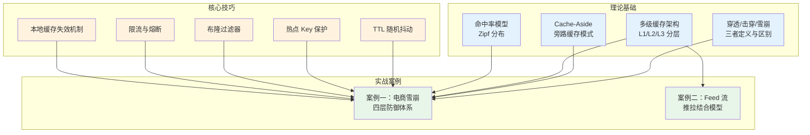
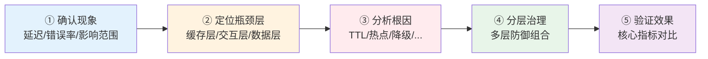

# 缓存系统实战案例

> 理论是骨架，实战是血肉。本节通过两个真实场景的深度还原，展示缓存系统在生产环境中的典型问题、排查思路和分层治理方案。

## 为什么需要实战案例

缓存系统的学习存在一个普遍的断层：理论书籍能告诉你 LRU、布隆过滤器、一致性哈希的原理，但在生产环境中面对的问题往往是**多种故障叠加、多层架构交互、多因素互相影响**的复合场景。

一个典型的例子是"缓存雪崩"——教科书上的定义是"大量 key 同时过期"，但在真实的大促场景中，雪崩往往与击穿、穿透同时发生，还会因为缺少熔断机制而导致级联崩溃。单靠任何一条理论都无法解决这种复合问题，必须将理论组合成分层防御体系。

本节的两个案例正是围绕这种"理论到实战的鸿沟"展开的：

- **案例一** 还原了一次电商大促的完整故障——从凌晨零点的流量洪峰，到 30 万缓存 key 集中过期，再到数据库被打满、用户侧 23% 错误率。这个案例完整展示了**雪崩、击穿、穿透三重问题叠加**时如何逐层定位和治理。

- **案例二** 展示了一个社交平台 Feed 流从实时查询到推拉结合缓存架构的演进过程。这个案例聚焦于**高写入场景下的缓存设计**——当一个大 V 发布动态时，如何高效地将内容推送到数百万粉丝的 Feed 缓存中。

## 案例全景对比

| 维度 | 案例一：电商商品详情页 | 案例二：社交平台 Feed 流 |
|------|----------------------|--------------------------|
| 核心问题 | 缓存雪崩 + 击穿 + 穿透 | 高并发 Feed 流读写 |
| 业务特征 | 读多写少，热点集中 | 写扩散（大 V 发帖影响百万级用户） |
| 流量模型 | 突发流量（大促零点），12 万 QPS | 持续高流量，读写比例约 100:1 |
| 缓存架构 | L1 本地缓存 + L2 Redis + MySQL | Redis Sorted Set（Feed 时间线）+ MySQL |
| 关键策略 | TTL 随机抖动、热点 key 逻辑过期、多级缓存、限流熔断 | 推拉结合（Push-Pull）模型、Feed 滑窗裁剪 |
| 涉及的缓存问题 | 雪崩治理、击穿防护、穿透防护、降级兜底 | 写扩散优化、大 V 特殊处理、缓存一致性 |
| 核心数据结构 | String（KV 缓存） | Sorted Set（Feed 时间线）、Set（粉丝列表） |
| 复杂度 | 中等（多层防御组合） | 较高（推拉模型的工程取舍） |

## 两个案例的知识映射

这两个案例并非孤立存在，它们与本章前面的理论和技巧形成了紧密的映射关系：

## 阅读建议

**如果你是初学者**：建议按顺序阅读。先从案例一开始，它系统性地展示了缓存问题的排查流程（故障现象 → 监控指标 → 根因分析 → 分层治理 → 效果验证），这个排查框架本身就是一套可复用的方法论。

**如果你有实战经验**：可以重点阅读案例二的推拉结合模型设计。Feed 流是社交平台最核心的场景之一，其中涉及的"大 V 问题"（粉丝量极大导致写扩散成本过高）是一个在推拉模型中必须面对的经典工程取舍。

**如果你想深入某个具体技术点**：每个案例都提供了完整的代码实现，你可以直接参考：

| 你想了解的技术 | 在哪个案例 | 在哪个章节 |
|----------------|------------|------------|
| TTL 随机抖动（均匀/高斯/分桶） | 案例一 | 3.1 第一层 |
| 热点 Key 永不过期 + 异步刷新 | 案例一 | 3.2 第二层 |
| 多级缓存 L1 + L2 实现 | 案例一 | 3.3 第三层 |
| 本地缓存多实例一致性 | 案例一 | 3.3 第三层（Pub/Sub / Canal） |
| 令牌桶限流器 | 案例一 | 3.4 第四层 |
| 熔断器三态模型 | 案例一 | 3.4 第四层 |
| Redis Sorted Set 做 Feed 时间线 | 案例二 | 解决方案 |
| 推拉结合（Push-Pull）模型 | 案例二 | mermaid 架构图 + 代码 |

## 缓存问题的排查方法论

无论面对什么业务场景，缓存问题的排查都遵循一个通用的四步框架：

**第一步：确认现象**——P99 延迟飙升到多少？错误率是多少？是全面受影响还是特定接口？这些数据决定了问题的严重程度和影响范围。

**第二步：定位瓶颈层**——是缓存层本身的问题（Redis 内存满、连接数耗尽），还是缓存与数据库之间的交互问题（穿透、击穿），还是数据库本身的问题（慢查询、连接池打满）？通过监控指标逐层排查。

**第三步：分析根因**——找到瓶颈层后，深挖为什么会出现这个问题。是 TTL 设计不当？是热点 key 没有保护？是缺少降级机制？根因往往不止一个，需要识别所有叠加因素。

**第四步：分层治理**——针对每个根因设计对应的防护措施，形成多层防御体系。任何单层防护都不可靠（Redis 可能宕机、本地缓存可能不一致），只有分层防御才能确保在各种异常情况下系统仍然可用。

这两个案例都严格遵循了这个框架：从故障/问题现象出发，通过监控数据定位瓶颈，分析出具体的根因，然后设计分层的解决方案，最后用数据验证效果。掌握这个框架后，面对任何缓存相关的问题你都有了系统化的排查思路。

## 本节目录

1. [案例一：电商商品详情页缓存雪崩](01-案例一电商商品详情页缓存雪崩.md) —— 从大促零点的 30 万 key 集中过期，到 23% 用户看到 502 错误，完整还原一次缓存级联故障的排查与治理过程。

2. [案例二：社交平台 Feed 流缓存设计](02-案例二社交平台Feed流缓存设计.md) —— 从实时查询的 2 秒延迟到推拉结合模型的 28 毫秒响应，展示 Feed 流场景下的缓存架构演进。
