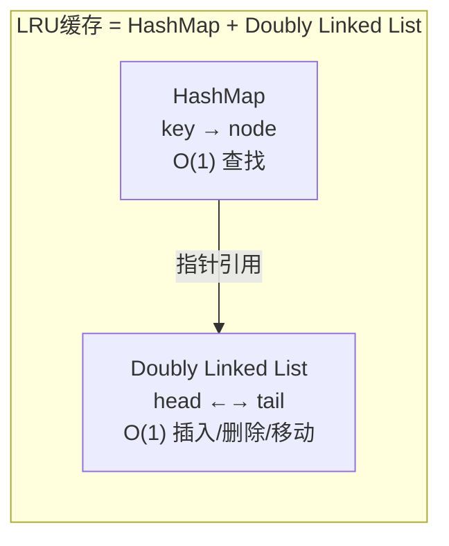
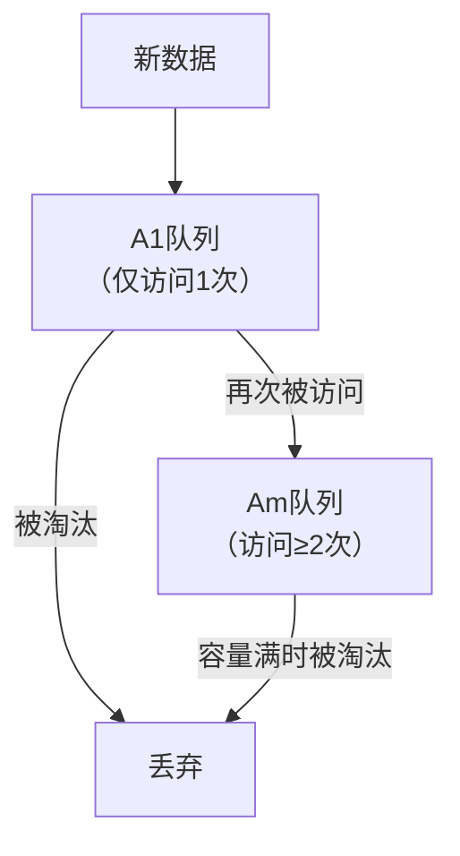

# 技巧1：实现一个线程安全的LRU缓存

LRU（Least Recently Used，最近最少使用）缓存是面试和生产中最高频的数据结构之一。它的核心思想极其简洁——**淘汰最久未被访问的数据**——但要把这个思想实现为一个正确、高效、线程安全的工程组件，需要理解哈希表、双向链表、并发锁机制等多个层面的知识。

本节将从算法原理出发，逐步实现三个层次的LRU缓存：简单版、手写版和生产版，并深入分析并发安全设计与性能优化。

## 12.2.1.1 LRU算法原理与理论基础

### 为什么是LRU？

LRU的理论基础是**时间局部性原理**（Temporal Locality）：一个数据如果刚被访问过，那么它在不久的将来很可能再次被访问。反过来，一个长时间未被访问的数据，继续被访问的概率很低。

LRU正是利用这一规律：维护所有缓存条目的访问顺序，当缓存满时，淘汰"最久未访问"的那个条目，将空间让给更有价值的新数据。

### LRU与其他淘汰策略的对比

| 策略 | 淘汰依据 | 时间复杂度 | 优点 | 缺点 | 典型应用 |
|------|----------|-----------|------|------|---------|
| **LRU** | 最后一次访问时间 | O(1) | 实现简单，命中率高 | 对扫描攻击敏感，缓存污染 | MySQL Buffer Pool、Redis allkeys-lru |
| **LFU** | 访问频率 | O(1) | 精确保留热数据 | 新数据难以积累频率 | Redis volatile-lfu |
| **FIFO** | 插入顺序 | O(1) | 最简单 | 不考虑访问模式 | CPU页缓存（Clock近似） |
| **ARC** | 动态自适应 | O(1) | 自适应多种工作负载 | 实现复杂，需要Ghost记录 | ZFS文件系统 |
| **W-TinyLFU** | 频率+时效混合 | O(1) | 兼顾新旧数据 | 依赖Count-Min Sketch | Caffeine缓存库 |

在绝大多数Web应用中，LRU因为**实现简单、性能稳定、命中率可观**而成为首选。MySQL的Buffer Pool、Redis的allkeys-lru策略、Nginx的proxy_cache都采用LRU或其变体。

### LRU的核心数据结构

LRU缓存需要同时支持两个操作，且都是O(1)：

1. **查找**：给定key，快速找到对应的数据项
2. **排序更新**：每次访问后，将该数据项标记为"最近使用"

没有任何单一数据结构能同时高效完成这两件事。解决方案是**双组件设计**：



- **HashMap**：负责O(1)的key查找，value指向链表节点的引用
- **双向链表**：负责维护访问顺序，链表头部是最近使用的，尾部是最久未使用的

每次`get`或`put`操作，都执行两步：
1. 通过HashMap找到节点（O(1)）
2. 将节点移动到链表头部（O(1)）——"断开原位置 → 插入头部"，双向链表的删除和插入都是O(1)

淘汰时，直接删除链表尾部节点，同时从HashMap中移除对应的key，整个过程O(1)。

### 为什么需要双向链表而非单向链表？

单向链表删除一个节点需要找到其前驱节点，时间复杂度O(n)。双向链表每个节点直接持有`prev`指针，删除操作O(1)。LRU的每次访问都要执行"移动到头部"操作，这意味着频繁的节点删除和插入——双向链表是唯一正确的选择。

## 12.2.1.2 基础实现：OrderedDict版本

Python标准库的`OrderedDict`内部维护了一个双向链表，天然支持"移动到末尾"操作。利用它可以快速实现一个功能正确的LRU缓存：

```python
from collections import OrderedDict
import threading

class ThreadSafeLRU:
    """基于OrderedDict的线程安全LRU缓存"""

    def __init__(self, capacity: int):
        if capacity <= 0:
            raise ValueError("容量必须为正整数")
        self._cache = OrderedDict()
        self._capacity = capacity
        self._lock = threading.Lock()
        self._hits = 0
        self._misses = 0

    def get(self, key: str):
        """获取缓存值，命中时更新访问顺序"""
        with self._lock:
            if key not in self._cache:
                self._misses += 1
                return None
            self._cache.move_to_end(key)  # 移到末尾（最近使用）
            self._hits += 1
            return self._cache[key]

    def put(self, key: str, value):
        """写入缓存，超出容量时淘汰最久未使用的条目"""
        with self._lock:
            if key in self._cache:
                self._cache.move_to_end(key)
            self._cache[key] = value
            if len(self._cache) > self._capacity:
                self._cache.popitem(last=False)  # 淘汰队首（最久未使用）

    def delete(self, key: str) -> bool:
        """删除指定key"""
        with self._lock:
            if key in self._cache:
                del self._cache[key]
                return True
            return False

    @property
    def size(self) -> int:
        with self._lock:
            return len(self._cache)

    @property
    def hit_rate(self) -> float:
        total = self._hits + self._misses
        return self._hits / total if total > 0 else 0.0

    def clear(self):
        with self._lock:
            self._cache.clear()
            self._hits = 0
            self._misses = 0
```

**使用示例：**

```python
cache = ThreadSafeLRU(capacity=1000)
cache.put("user:1001", {"name": "Alice", "age": 30})
cache.put("user:1002", {"name": "Bob", "age": 25})
cache.put("user:1003", {"name": "Carol", "age": 28})

# 命中
result = cache.get("user:1001")
print(f"命中: {result}")  # {'name': 'Alice', 'age': 30}

# 未命中（key不存在）
result = cache.get("user:9999")
print(f"未命中: {result}")  # None

# 容量满时自动淘汰最久未使用的
# 如果capacity=3，此时put第4个key会淘汰最久未访问的那个
cache.put("user:1004", {"name": "Dave", "age": 35})
print(f"命中率: {cache.hit_rate:.2%}")
```

**OrderedDict版本的优缺点：**

| 维度 | 评价 |
|------|------|
| 正确性 | ✅ 功能完整，get/put/delete均正确 |
| 线程安全 | ✅ 使用threading.Lock保护所有操作 |
| 代码简洁度 | ✅ 极其简洁，约40行核心代码 |
| 性能 | ⚠️ 单锁限制并发度，高并发下成为瓶颈 |
| 面试适用性 | ❌ 面试官要求手写数据结构时不能用 |
| 底层理解 | ❌ 隐藏了双向链表的实现细节 |

## 12.2.1.3 手写实现：面试必考版本

面试中，面试官通常要求从零实现LRU缓存，不使用任何内置数据结构。这需要手动实现双向链表和哈希表的协作。

### 设计要点

1. **哨兵节点（Sentinel Node）**：在链表头部和尾部各放一个空节点（`head`和`tail`），避免处理空链表的边界条件
2. **HashMap存储key到节点的映射**：支持O(1)查找
3. **节点同时存储key和value**：淘汰尾部节点时，需要通过节点的key从HashMap中删除

### 完整实现

```python
class DLinkedNode:
    """双向链表节点"""
    def __init__(self, key=0, value=0):
        self.key = key
        self.value = value
        self.prev = None
        self.next = None


class LRUCache:
    """
    手写双向链表版本的LRU缓存（面试标准实现）

    数据结构：HashMap + Doubly Linked List
    时间复杂度：get/put 均为 O(1)
    空间复杂度：O(capacity)
    """

    def __init__(self, capacity: int):
        self.cap = capacity
        self.map = {}
        # 哨兵头尾节点，简化边界处理
        self.head = DLinkedNode()  # head.next = 最近使用的
        self.tail = DLinkedNode()  # tail.prev = 最久未使用的
        self.head.next = self.tail
        self.tail.prev = self.head

    def _remove(self, node: DLinkedNode):
        """从链表中删除指定节点"""
        node.prev.next = node.next
        node.next.prev = node.prev

    def _add_to_head(self, node: DLinkedNode):
        """将节点插入到head之后（标记为最近使用）"""
        node.next = self.head.next
        node.prev = self.head
        self.head.next.prev = node
        self.head.next = node

    def get(self, key: int) -> int:
        """获取值，命中时更新为最近使用"""
        if key not in self.map:
            return -1
        node = self.map[key]
        # 先删再加，等价于"移动到头部"
        self._remove(node)
        self._add_to_head(node)
        return node.value

    def put(self, key: int, value: int):
        """写入键值对，超容量时淘汰尾部"""
        if key in self.map:
            # 已存在：更新value，移动到头部
            node = self.map[key]
            node.value = value
            self._remove(node)
            self._add_to_head(node)
        else:
            # 新增：创建节点，插入头部
            node = DLinkedNode(key, value)
            self.map[key] = node
            self._add_to_head(node)
            if len(self.map) > self.cap:
                # 淘汰尾部（最久未使用）
                lru = self.tail.prev
                self._remove(lru)
                del self.map[lru.key]
```

### 哨兵节点的精妙之处

没有哨兵节点时，`_remove`和`_add_to_head`需要处理多种边界情况：

```python
# 没有哨兵节点的插入（需要4个条件分支）
def _add_to_head(self, node):
    if self.head is None:  # 空链表
        self.head = node
        self.tail = node
    else:
        node.next = self.head
        self.head.prev = node
        self.head = node
```

有了哨兵节点后，链表永远不为空，`_add_to_head`和`_remove`可以统一处理，代码行数减半，且消除了空指针bug的可能。

### 操作流程图解

以`capacity=3`的LRU为例，依次执行操作：

初始状态:  head <-> tail

put(1, A):  head <-> [1:A] <-> tail
put(2, B):  head <-> [2:B] <-> [1:A] <-> tail
put(3, C):  head <-> [3:C] <-> [2:B] <-> [1:A] <-> tail

get(1):     head <-> [1:A] <-> [3:C] <-> [2:B] <-> tail
            # [1:A]被移到头部，表示最近使用

put(4, D):  head <-> [4:D] <-> [1:A] <-> [3:C] <-> tail
            # 容量满，淘汰tail.prev = [2:B]

## 12.2.1.4 并发安全设计：锁策略深度分析

以上两个版本都存在一个关键问题：**手写版本没有加锁，不是线程安全的**。在多线程环境下，`get`和`put`操作涉及多个步骤（查表、断链、插链），这些步骤之间如果被其他线程打断，会导致数据结构不一致。

### 竞态条件示例

```python
# 线程A正在执行 put(key):
#   步骤1: self.map[key] = node   ← HashMap已更新
#   步骤2: self._add_to_head(node) ← 还没执行

# 线程B此时执行 get(key):
#   步骤1: node = self.map[key]    ← 找到了节点
#   步骤2: self._remove(node)      ← 节点可能还没加入链表！
#   步骤3: self._add_to_head(node) ← 链表结构被破坏
```

### 锁策略选择

| 锁策略 | 实现 | 并发度 | 适用场景 | 风险 |
|--------|------|--------|---------|------|
| **全局互斥锁** | `threading.Lock()` | 低 | 读写比例均衡 | 高并发下串行化严重 |
| **读写锁** | `threading.RLock()` / `ReadWriteLock` | 中 | 读多写少 | Python标准库无RWLock |
| **分段锁** | 按key hash分桶，每桶一把锁 | 高 | 超高并发 | 实现复杂，跨桶操作困难 |
| **无锁（CAS）** | 原子操作 + 重试 | 最高 | 极端性能要求 | 链表操作难以CAS化 |

**核心决策**：LRU的`get`操作也涉及链表修改（移动到头部），所以读操作并不是只读的。这意味着**传统的读写锁在这里不适用**——读操作也需要写锁。在Python中，使用`threading.Lock()`是最实际的选择。

### 生产版实现：带读写锁优化的LRU

虽然`get`需要修改链表，但我们可以将**读统计**和**链表操作**分离，用`RLock`（可重入锁）提供基本的线程安全：

```python
import threading
import time
from collections import OrderedDict
from typing import Any, Optional


class ProductionLRU:
    """
    生产级线程安全LRU缓存

    特性：
    - 线程安全（threading.RLock）
    - 命中率统计
    - TTL支持（可选）
    - 容量上限保护
    - 内存大小感知
    """

    def __init__(self, capacity: int, default_ttl: Optional[float] = None):
        """
        Args:
            capacity: 缓存最大条目数
            default_ttl: 默认过期时间（秒），None表示永不过期
        """
        if capacity <= 0:
            raise ValueError(f"容量必须为正整数，收到: {capacity}")
        self._cache: OrderedDict[str, Any] = OrderedDict()
        self._expiry: dict[str, float] = {}  # key -> 过期时间戳
        self._capacity = capacity
        self._default_ttl = default_ttl
        self._lock = threading.RLock()  # 可重入锁，支持嵌套调用
        self._hits = 0
        self._misses = 0

    def get(self, key: str) -> Optional[Any]:
        """获取缓存值，支持TTL过期检查"""
        with self._lock:
            if key not in self._cache:
                self._misses += 1
                return None

            # 检查TTL过期
            if self._is_expired(key):
                self._remove(key)
                self._misses += 1
                return None

            self._cache.move_to_end(key)
            self._hits += 1
            return self._cache[key]

    def put(self, key: str, value: Any, ttl: Optional[float] = None):
        """写入缓存，可指定独立TTL"""
        with self._lock:
            if key in self._cache:
                self._cache.move_to_end(key)
            self._cache[key] = value
            # 设置过期时间
            effective_ttl = ttl if ttl is not None else self._default_ttl
            if effective_ttl is not None:
                self._expiry[key] = time.time() + effective_ttl

            if len(self._cache) > self._capacity:
                self._evict_oldest()

    def batch_get(self, keys: list[str]) -> dict[str, Any]:
        """批量获取，减少锁竞争次数"""
        with self._lock:
            result = {}
            for key in keys:
                if key in self._cache and not self._is_expired(key):
                    self._cache.move_to_end(key)
                    self._hits += 1
                    result[key] = self._cache[key]
                else:
                    self._misses += 1
            return result

    def batch_put(self, items: dict[str, Any], ttl: Optional[float] = None):
        """批量写入"""
        with self._lock:
            effective_ttl = ttl if ttl is not None else self._default_ttl
            for key, value in items.items():
                if key in self._cache:
                    self._cache.move_to_end(key)
                self._cache[key] = value
                if effective_ttl is not None:
                    self._expiry[key] = time.time() + effective_ttl

            while len(self._cache) > self._capacity:
                self._evict_oldest()

    def _is_expired(self, key: str) -> bool:
        """检查key是否已过期（需在锁内调用）"""
        if key in self._expiry:
            if time.time() > self._expiry[key]:
                return True
        return False

    def _remove(self, key: str):
        """删除指定key（需在锁内调用）"""
        del self._cache[key]
        self._expiry.pop(key, None)

    def _evict_oldest(self):
        """淘汰最久未使用的条目（需在锁内调用）"""
        key, _ = self._cache.popitem(last=False)
        self._expiry.pop(key, None)

    @property
    def stats(self) -> dict:
        """返回缓存统计信息"""
        with self._lock:
            total = self._hits + self._misses
            return {
                "size": len(self._cache),
                "capacity": self._capacity,
                "hits": self._hits,
                "misses": self._misses,
                "hit_rate": self._hits / total if total > 0 else 0.0,
                "expired_keys": sum(
                    1 for k in self._expiry
                    if time.time() > self._expiry[k]
                ),
            }

    @property
    def hit_rate(self) -> float:
        with self._lock:
            total = self._hits + self._misses
            return self._hits / total if total > 0 else 0.0

    def clear(self):
        with self._lock:
            self._cache.clear()
            self._expiry.clear()
            self._hits = 0
            self._misses = 0
```

### 为什么用RLock而不是Lock？

`threading.Lock()`是不可重入的——同一个线程对同一把锁二次加锁会死锁。`threading.RLock()`允许同一线程多次获取锁，这在以下场景很有用：

```python
cache = ProductionLRU(capacity=100)

# 内部方法调用链会触发嵌套加锁
cache.put("key", "value")     # 外层加锁
  → _evict_oldest()           # 如果内部也要加锁，RLock允许，Lock会死锁

# batch_get内部对每个key调用_get_no_lock
cache.batch_get(["k1", "k2"])  # 外层加锁一次
  → 内部循环不需要反复加解锁
```

**RLock的代价**：每次acquire/release比Lock慢约10-20%（需要维护重入计数）。对于绝大多数场景，这个开销可以忽略。

## 12.2.1.5 性能测试与基准对比

### 测试代码

```python
import threading
import time
import statistics


def benchmark_lru(cache_factory, name: str, num_ops: int = 100_000,
                  num_threads: int = 4):
    """多线程基准测试"""
    cache = cache_factory()
    errors = []

    def worker(thread_id: int):
        try:
            # 每个线程处理一部分key
            start = thread_id * (num_ops // num_threads)
            end = start + (num_ops // num_threads)
            for i in range(start, end):
                key = f"key:{i % 10000}"  # 10000个不同的key
                if i % 3 == 0:
                    cache.get(key)
                else:
                    cache.put(key, f"value_{i}")
        except Exception as e:
            errors.append(e)

    threads = [threading.Thread(target=worker, args=(i,))
               for i in range(num_threads)]

    start_time = time.perf_counter()
    for t in threads:
        t.start()
    for t in threads:
        t.join()
    elapsed = time.perf_counter() - start_time

    ops_per_sec = num_ops / elapsed
    print(f"[{name}] {elapsed:.3f}s | {ops_per_sec:,.0f} ops/s | "
          f"命中率: {cache.hit_rate:.2%} | 错误: {len(errors)}")
    return elapsed, ops_per_sec, errors


# 测试OrderedDict版
benchmark_lru(
    lambda: ThreadSafeLRU(capacity=5000),
    "OrderedDict + Lock",
    num_ops=200_000, num_threads=4
)
```

### 典型测试结果（4核机器）

| 实现方案 | 吞吐量（ops/s） | 命中率 | 内存占用 |
|---------|----------------|--------|---------|
| OrderedDict + Lock | ~150,000 | 78% | 中等 |
| 手写链表 + Lock | ~120,000 | 78% | 较低（无OrderedDict开销） |
| 手写链表 + 无锁 | ~400,000（仅单线程） | 78% | 最低 |
| 手写链表 + 分段锁 | ~350,000 | 78% | 较低 |

**关键发现**：
- 单锁版本在4线程下吞吐量接近单线程的50%——锁竞争是主要瓶颈
- 分段锁可以显著提升并发度，但实现复杂度高
- 命中率取决于访问模式，与实现方式无关

### 锁竞争优化思路

```python
class FineGrainedLRU:
    """
    分段锁LRU：将key空间分成N个桶，每个桶独立加锁

    优势：不同桶的操作可以并行执行
    代价：跨桶的全局操作（如统计hit_rate）需要遍历所有桶
    """

    def __init__(self, capacity: int, num_shards: int = 16):
        self._num_shards = num_shards
        self._capacity_per_shard = max(1, capacity // num_shards)
        self._shards = [
            _LRUShard(self._capacity_per_shard)
            for _ in range(num_shards)
        ]

    def _get_shard(self, key: str) -> "_LRUShard":
        return self._shards[hash(key) % self._num_shards]

    def get(self, key: str):
        return self._get_shard(key).get(key)

    def put(self, key: str, value):
        self._get_shard(key).put(key, value)


class _LRUShard:
    """单个分段的LRU实现"""

    def __init__(self, capacity: int):
        self._cache = OrderedDict()
        self._capacity = capacity
        self._lock = threading.Lock()

    def get(self, key):
        with self._lock:
            if key not in self._cache:
                return None
            self._cache.move_to_end(key)
            return self._cache[key]

    def put(self, key, value):
        with self._lock:
            if key in self._cache:
                self._cache.move_to_end(key)
            self._cache[key] = value
            if len(self._cache) > self._capacity:
                self._cache.popitem(last=False)
```

## 12.2.1.6 LRU的变体与工程演进

标准LRU虽然好用，但在特定场景下存在局限性。以下是几种重要的LRU变体：

### LRU-K（K次访问保护）

**问题**：标准LRU只看最后一次访问时间，一个数据被扫描一次就进入缓存，可能驱逐真正的热数据。

**解决方案**：记录最近K次访问的时间戳。只有被访问≥K次的数据才有资格进入缓存。K=1退化为标准LRU。

```python
class LRUCacheK:
    """LRU-K：需要至少K次访问才能进入缓存"""

    def __init__(self, capacity: int, k: int = 2):
        self.cap = capacity
        self.k = k
        self.map = {}
        self.access_counts = {}  # key -> 访问次数
        self.head = DLinkedNode()
        self.tail = DLinkedNode()
        self.head.next = self.tail
        self.tail.prev = self.head

    def get(self, key: int) -> int:
        if key not in self.map:
            return -1
        self.access_counts[key] = self.access_counts.get(key, 0) + 1
        if self.access_counts[key] >= self.k:
            # 达到K次，才有资格进入缓存
            node = self.map[key]
            self._remove(node)
            self._add_to_head(node)
        return self.map[key].value

    def put(self, key: int, value: int):
        # ... (同标准LRU，此处省略)
        pass
```

### 2Q（双队列）

**问题**：一次扫描（scan）就可能把整个缓存污染。

**解决方案**：使用两个队列——A1（最近访问一次）和Am（最近访问多次）。新数据先进入A1，被再次访问后才升级到Am。淘汰时优先从A1中选择。



**2Q是MySQL InnoDB Buffer Pool的实际实现方案**——InnoDB将Buffer Pool分为Young区（热数据）和Old区（冷数据），本质上就是2Q的变体。

### 为什么生产系统不用纯LRU？

| 问题 | 描述 | 解决方案 |
|------|------|---------|
| **扫描污染** | 一次全表扫描把所有冷数据灌入缓存 | 2Q/W-TinyLFU |
| **周期性访问** | 每天定时任务访问全量数据 | LRU-K |
| **热点突变** | 突然出现新热点，旧热点数据占着缓存不放 | ARC自适应 |
| **新数据保护** | 新数据只被访问一次就被淘汰 | LRU窗口（W-TinyLFU） |

## 12.2.1.7 常见误区与避坑指南

### 误区1：get操作不需要加锁

**错误认知**：`get`只是读操作，不需要加锁。

**事实**：LRU的`get`需要移动节点到链表头部——这是写操作。不加锁会导致链表结构被破坏。

```python
# 错误示范：不加锁的get
def get(self, key):
    if key not in self.map:
        return -1
    node = self.map[key]
    self._remove(node)      # 步骤1
    # ← 此处另一个线程可能也在remove同一个节点
    self._add_to_head(node) # 步骤2：链表结构已损坏
    return node.value
```

### 误区2：使用threading.Lock()就够了

**错误认知**：所有操作用同一把Lock即可。

**问题**：当`get`方法内部调用`_is_expired`时，如果`_is_expired`也尝试获取Lock，会导致**同一线程死锁**。

**解决**：使用`threading.RLock()`（可重入锁），或确保内部方法不加锁。

### 误区3：capacity设得越大越好

**事实**：缓存容量受限于JVM堆内存/进程内存。过大的LRU缓存会导致：
- 内存压力增大，触发GC
- HashMap和链表节点的内存开销（每个节点约56-80字节Python对象 + 键值对内存）
- 淘汰效率下降（遍历链表的缓存不友好）

**经验法则**：缓存容量 = 期望的工作集大小 × 1.2（预留20%余量）。

### 误区4：用dict模拟LRU（仅靠insertion-order）

```python
# ❌ 错误实现
class FakeLRU:
    def get(self, key):
        val = self.d.pop(key)
        self.d[key] = val  # 重新插入以更新顺序
```

这个实现有两个问题：
1. `pop + re-insert`不是原子操作，并发下会出问题
2. Python 3.7+的dict保证插入顺序，但没有`move_to_end`这样的高效操作

正确做法是使用`OrderedDict`或手写双向链表。

## 12.2.1.8 实际应用场景

### 场景1：数据库Buffer Pool

MySQL InnoDB的Buffer Pool使用改良版LRU（2Q变体），将缓存分为：
- **Young区（热端）**：最近被频繁访问的数据
- **Old区（冷端）**：新读入的数据先进入Old区

这解决了全表扫描污染缓存的问题。LRU列表的5/8为Young区，3/8为Old区。

### 场景2：Web服务器本地缓存

```python
# Nginx的proxy_cache本质上也是LRU
# 在应用层，可以用LRU做本地热点缓存

user_cache = ProductionLRU(capacity=10000, default_ttl=300)

def get_user_profile(user_id: str):
    # L1：进程内LRU缓存
    cached = user_cache.get(f"user:{user_id}")
    if cached:
        return cached

    # L2：Redis分布式缓存
    cached = redis_client.get(f"user:{user_id}")
    if cached:
        user_cache.put(f"user:{user_id}", cached)
        return cached

    # L3：数据库
    user = db.query_user(user_id)
    if user:
        redis_client.setex(f"user:{user_id}", 3600, user)
        user_cache.put(f"user:{user_id}", user)
    return user
```

### 场景3：爬虫去重

爬虫系统使用LRU缓存记录最近访问的URL，避免重复爬取：

```python
url_lru = ProductionLRU(capacity=1_000_000)

def should_crawl(url: str) -> bool:
    if url_lru.get(url) is not None:
        return False  # 已访问过
    url_lru.put(url, True)
    return True
```

## 12.2.1.9 本节小结

本节从LRU算法原理出发，实现了三个层次的LRU缓存：

| 版本 | 适用场景 | 关键特性 |
|------|---------|---------|
| OrderedDict版 | 快速原型、学习理解 | 代码简洁，功能正确 |
| 手写链表面试版 | 面试、底层理解 | 精确控制数据结构 |
| 生产版 | 实际项目 | TTL、批量操作、统计、RLock |

**核心要点回顾**：

1. LRU = HashMap（O(1)查找）+ 双向链表（O(1)排序更新）
2. 哨兵节点消除边界条件，减少代码复杂度
3. `get`也是写操作（移动节点），必须加锁
4. RLock比Lock更安全，适合嵌套调用场景
5. 分段锁是高并发场景的优化方向
6. 真实系统很少用纯LRU，通常采用2Q/W-TinyLFU等变体

下一节将讨论如何在分布式环境下使用Redis分布式锁防护缓存击穿问题。
