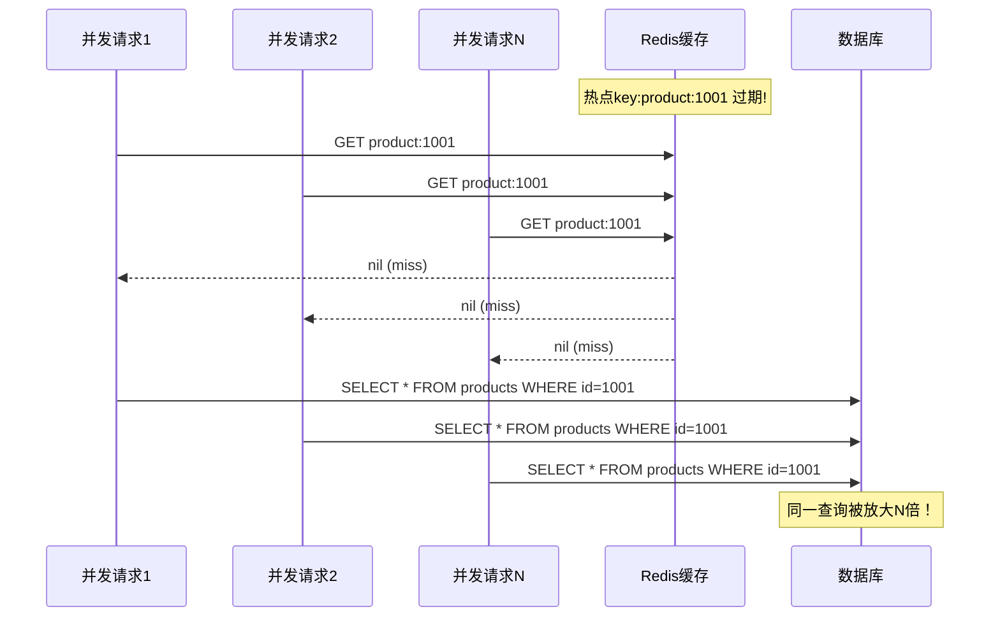
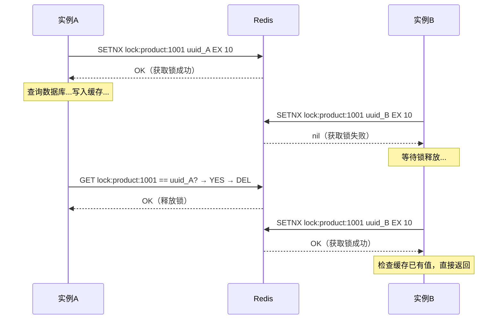
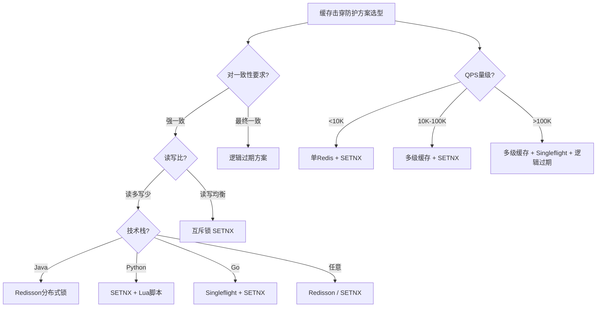

## 技巧2：缓存击穿防护——分布式锁

> **2024年双十一，某电商平台商品详情页因热点key过期，0.3秒内涌入47000次相同数据库查询，数据库连接池100个连接全部耗尽，导致整个商品服务不可用长达12秒，预估直接损失超过800万元。** 这就是缓存击穿——一个看似简单、实则致命的高并发陷阱。

当一个**热点key**（如明星微博、秒杀商品、排行榜）突然过期的瞬间，大量并发请求同时发现缓存失效，全部涌入数据库查询——这就是**缓存击穿（Cache Stampede / Cache Breakdown）**。数据库可能在几秒内承受数万次相同查询，导致响应变慢甚至宕机。

本技巧从原理到实战，系统讲解如何通过**分布式锁**实现"只让一个请求去重建缓存，其他请求等待或降级"，从根本上避免击穿。内容涵盖：核心原理、Python/Java/Go三种语言实现、进阶降级策略、无锁替代方案、生产环境监控，以及真实故障复盘。

---

### 一、缓存击穿的本质与危害

#### 1.1 什么是缓存击穿

缓存击穿特指**单个热点key过期**导致的并发穿透问题。它与缓存穿透（查询根本不存在的数据）和缓存雪崩（大量key同时过期）有着本质区别：

| 问题类型 | 触发条件 | 影响范围 | 典型场景 | 严重程度 |
|----------|----------|----------|----------|----------|
| **缓存穿透** | 查询不存在的数据 | 单个/少量key | 恶意攻击、ID不存在 | 中（可被布隆过滤器拦截） |
| **缓存击穿** | 热点key过期 | 单个热点key | 明星热搜、秒杀商品 | **高（瞬间压垮数据库）** |
| **缓存雪崩** | 大量key同时过期 | 大面积key | 缓存重启、统一TTL | **极高（全站不可用）** |

三者的核心区别可以用一个比喻理解：缓存穿透是"有人在空地址上寄快递"，缓存击穿是"所有人都挤同一条路去寄快递"，缓存雪崩是"所有路同时堵死了"。

#### 1.2 击穿的发生时序



如果没有防护，假设QPS=10,000，缓存过期的瞬间会有上万个相同请求打到数据库。一次数据库查询耗时50ms，数据库连接池通常只有100-200个连接——瞬间就会**连接池耗尽**，导致所有请求（包括其他不相关的查询）都阻塞。

**关键数据**：连接池耗尽后，新请求的等待队列会以指数速度堆积。假设连接池100个、每个查询50ms，理论最大QPS = 100 / 0.05 = 2,000。一旦实际QPS超过这个阈值，等待队列在1秒内就能堆积到数百个请求，3-5秒后整个服务雪崩。

#### 1.3 击穿的典型场景

| 场景 | 热点特征 | 击穿风险 | 实际案例 |
|------|---------|---------|---------|
| **电商秒杀** | 商品详情页，QPS从100突增到50,000+ | 极高 | 双十一、618大促商品页 |
| **社交热搜** | 明星突发新闻，热点key过期瞬间涌入百万级访问 | 极高 | 微博热搜爆点事件 |
| **配置中心** | 全局配置key过期，所有服务实例同时拉取 | 高 | Apollo/Nacos配置刷新 |
| **排行榜** | 热门榜单过期后所有客户端同时请求刷新 | 高 | 游戏排行榜、音乐榜 |
| **直播带货** | 主播上架商品，瞬间大量用户点击商品链接 | 极高 | 抖音/快手直播间商品 |

---

### 二、分布式锁方案的核心原理

核心思想只有一句话：**在缓存失效的瞬间，只允许一个线程去重建缓存，其他线程等待或降级读取旧数据**。

#### 2.1 方案选择对比

| 方案 | 实现复杂度 | 并发性能 | 数据一致性 | 适用场景 |
|------|-----------|---------|-----------|---------|
| **互斥锁（SETNX）** | 低 | 中 | 强 | 通用场景，首选方案 |
| **Redisson分布式锁** | 中 | 中高 | 强 | Java生态，需要可重入锁 |
| **Singleflight** | 低 | 高 | 强 | Go语言，单进程内去重 |
| **逻辑过期（TTL伪装）** | 中 | 高 | 最终一致 | 对一致性要求不严格的场景 |
| **布隆过滤器预判** | 中 | 高 | 强 | 防穿透+击穿组合防护 |
| **多级缓存+分布式锁** | 高 | 极高 | 强 | 超高并发场景，极致性能 |

#### 2.2 为什么用分布式锁而不是本地锁

在单机环境下，`synchronized` 或 `ReentrantLock` 就能解决。但在分布式系统中，多个应用实例各自持有独立的JVM/进程，本地锁只能锁住本进程内的线程，**无法跨实例互斥**。

┌─────────────────┐  ┌─────────────────┐  ┌─────────────────┐
│   App实例1       │  │   App实例2       │  │   App实例3       │
│  ┌───────────┐  │  │  ┌───────────┐  │  │  ┌───────────┐  │
│  │ 本地锁 ✓  │  │  │  │ 本地锁 ✓  │  │  │  │ 本地锁 ✓  │  │
│  │(仅锁本机) │  │  │  │(仅锁本机) │  │  │  │(仅锁本机) │  │
│  └───────────┘  │  │  └───────────┘  │  │  └───────────┘  │
└────────┬────────┘  └────────┬────────┘  └────────┬────────┘
         │                    │                    │
         └────────────────────┼────────────────────┘
                              ▼
                    ┌──────────────────┐
                    │   Redis 分布式锁   │ ← 跨实例互斥
                    │    SETNX lock_key │
                    └──────────────────┘

**为什么Redis适合做分布式锁？**

1. **原子性**：`SET key value NX EX ttl` 是单条命令，天然原子
2. **高性能**：单线程模型 + 内存操作，加锁延迟在亚毫秒级
3. **高可用**：通过Sentinel或Cluster实现主从切换
4. **广泛支持**：所有主流语言都有成熟的Redis客户端

#### 2.3 Redis分布式锁的底层原理

Redis的`SET key value NX EX ttl`命令等价于以下伪代码：

IF key不存在 THEN
    设置key = value
    设置过期时间 = ttl秒
    返回成功
ELSE
    返回失败
END IF

这条命令由Redis单线程执行，不存在竞态条件。任何时刻只有一个客户端能成功设置同一个key，这就是互斥锁的基础。

**时序图：获取锁与释放锁**



---

### 三、Python实现：基于Redis的互斥锁方案

这是最通用、最直接的方案。使用Redis的`SET key value NX EX ttl`原子操作实现互斥锁。

#### 3.1 基础版本

```python
import redis
import time
import json
import uuid
import logging

logger = logging.getLogger(__name__)


class CacheWithDistributedLock:
    """带分布式锁的缓存防护——防止缓存击穿"""

    def __init__(self, redis_client: redis.Redis):
        self.redis = redis_client

    def get(self, key: str, fetch_fn, ttl=300, lock_ttl=10, max_retries=3):
        """
        带分布式锁的缓存查询

        参数:
            key: 缓存键
            fetch_fn: 从数据库获取数据的函数（应返回dict或None）
            ttl: 缓存过期时间（秒），默认5分钟
            lock_ttl: 锁的过期时间（秒），默认10秒
            max_retries: 未获取锁时的最大重试次数，默认3次

        返回:
            缓存的数据或None
        """
        # 1. 先查缓存
        value = self.redis.get(key)
        if value is not None:
            if value == b"__NULL__":
                return None
            return json.loads(value)

        # 2. 尝试获取分布式锁
        lock_key = f"lock:{key}"
        lock_value = str(uuid.uuid4())  # 唯一标识，防止误删别人的锁
        locked = self.redis.set(lock_key, lock_value, nx=True, ex=lock_ttl)

        if locked:
            try:
                # 3. 拿到锁：再次检查缓存（双重检查锁定模式）
                value = self.redis.get(key)
                if value is not None:
                    if value == b"__NULL__":
                        return None
                    return json.loads(value)

                # 4. 查询数据库
                logger.info(f"[缓存击穿防护] key={key} 开始重建缓存")
                data = fetch_fn()

                if data is None:
                    # 缓存空值，防止缓存穿透（TTL较短，60秒）
                    self.redis.setex(key, 60, "__NULL__")
                else:
                    self.redis.setex(key, ttl, json.dumps(data, ensure_ascii=False))

                return data

            finally:
                # 5. 释放锁（仅释放自己获取的锁）
                self._release_lock(lock_key, lock_value)
        else:
            # 6. 未获取锁：重试或降级
            return self._handle_lock_miss(key, fetch_fn, ttl, lock_ttl, max_retries)

    def _release_lock(self, lock_key: str, lock_value: str):
        """安全释放锁：仅当锁的值是自己设置的才删除"""
        # 使用Lua脚本保证原子性：检查+删除是一个原子操作
        lua_script = """
        if redis.call("GET", KEYS[1]) == ARGV[1] then
            return redis.call("DEL", KEYS[1])
        else
            return 0
        end
        """
        self.redis.eval(lua_script, 1, lock_key, lock_value)

    def _handle_lock_miss(self, key, fetch_fn, ttl, lock_ttl, max_retries):
        """未获取到锁时的处理策略"""
        for attempt in range(1, max_retries + 1):
            wait_time = 0.05 * attempt  # 递增等待：50ms, 100ms, 150ms
            logger.info(f"[缓存击穿防护] key={key} 等待锁释放 (第{attempt}次, 等待{wait_time}s)")
            time.sleep(wait_time)

            # 重试获取缓存（此时应该已被第一个请求重建）
            value = self.redis.get(key)
            if value is not None:
                if value == b"__NULL__":
                    return None
                return json.loads(value)

        # 所有重试都失败，直接查数据库（降级）
        logger.warning(f"[缓存击穿防护] key={key} 重试{max_retries}次仍无缓存，降级查库")
        return fetch_fn()


# 使用示例
r = redis.Redis(host="localhost", port=6379, db=0)
cache = CacheWithDistributedLock(r)


def get_product_from_db(product_id: int):
    """模拟数据库查询"""
    # SELECT * FROM products WHERE id = %s
    return {"id": product_id, "name": "iPhone 16 Pro", "price": 8999}


# 普通调用
product = cache.get(
    key="product:1001",
    fetch_fn=lambda: get_product_from_db(1001),
    ttl=300,        # 缓存5分钟
    lock_ttl=10,    # 锁最多持有10秒
    max_retries=3,  # 最多重试3次
)
```

#### 3.2 关键设计要点

**（1）双重检查锁定（Double-Check Locking）**

拿到锁之后，**必须再查一次缓存**。因为在等待锁释放的过程中，先前拿到锁的实例可能已经完成了缓存重建：

时间线:
  实例A: 获取锁 → 查库 → 写缓存 → 释放锁
  实例B:     获取锁失败 → 等待 → 获取锁成功 → 【再查缓存】→ 发现有值，直接返回

没有双重检查，实例B会重复执行数据库查询——不仅浪费了数据库资源，还可能导致数据不一致（如果两次查询返回了不同的结果）。

**（2）锁的值使用UUID**

锁的值不设为固定字符串（如"1"），而使用UUID。这样释放锁时可以**验证自己是锁的持有者**，防止误删其他实例的锁。

# ❌ 危险：所有实例都用"1"作为锁值
SET lock:key "1" NX EX 10
# 实例A过期 → 实例B获取锁 → 实例A的DEL会删掉实例B的锁！

# ✅ 安全：每个实例用唯一UUID
SET lock:key "a1b2c3d4-..." NX EX 10
# 释放时验证：只有值匹配才删除

**（3）Lua脚本保证原子释放**

```lua
-- 原子性：GET + 比较 + DEL 三步合一
if redis.call("GET", KEYS[1]) == ARGV[1] then
    return redis.call("DEL", KEYS[1])
else
    return 0
end
```

如果不使用Lua脚本，在`GET`和`DEL`之间锁可能刚好过期并被其他实例获取，此时`DEL`就会**误删别人的锁**。这个窗口虽然很短（通常毫秒级），但在高并发下足以触发。

**（4）锁释放使用 try-finally**

释放锁的代码必须放在`finally`块中，确保即使`fetch_fn()`抛出异常也能释放锁。否则锁会一直持有到过期时间结束，这段时间内所有其他实例都无法重建缓存：

```python
if locked:
    try:
        # ... 业务逻辑 ...
        return data
    finally:
        self._release_lock(lock_key, lock_value)  # 保证释放
```

#### 3.3 异常安全性增强版

基础版本存在一个问题：如果Redis连接异常，整个请求会直接失败。生产环境需要增加容错逻辑：

```python
import redis
import time
import json
import uuid
import logging
from functools import wraps

logger = logging.getLogger(__name__)


class RobustDistributedLockCache:
    """生产级分布式锁缓存——增加异常容错"""

    def __init__(self, redis_client: redis.Redis, fallback_cache=None):
        """
        参数:
            redis_client: Redis连接
            fallback_cache: Redis不可用时的降级缓存（如本地dict或Caffeine）
        """
        self.redis = redis_client
        self.fallback_cache = fallback_cache or {}

    def get(self, key: str, fetch_fn, ttl=300, lock_ttl=10, max_retries=3):
        # 1. 尝试从Redis读缓存（异常时降级到本地缓存）
        try:
            value = self.redis.get(key)
        except redis.RedisError as e:
            logger.warning(f"[缓存击穿防护] Redis读取失败，降级查库: {e}")
            return self._fallback_get(key, fetch_fn)

        if value is not None:
            if value == b"__NULL__":
                return None
            return json.loads(value)

        # 2. 尝试获取分布式锁
        lock_key = f"lock:{key}"
        lock_value = str(uuid.uuid4())

        try:
            locked = self.redis.set(lock_key, lock_value, nx=True, ex=lock_ttl)
        except redis.RedisError as e:
            logger.warning(f"[缓存击穿防护] Redis加锁失败，降级查库: {e}")
            return self._fallback_get(key, fetch_fn)

        if locked:
            try:
                # 3. 双重检查
                try:
                    value = self.redis.get(key)
                    if value is not None:
                        if value == b"__NULL__":
                            return None
                        return json.loads(value)
                except redis.RedisError:
                    pass  # 双重检查失败继续查库

                # 4. 查询数据库
                logger.info(f"[缓存击穿防护] key={key} 开始重建缓存")
                data = fetch_fn()

                # 5. 写回缓存（异常不影响主流程）
                try:
                    if data is None:
                        self.redis.setex(key, 60, "__NULL__")
                    else:
                        self.redis.setex(
                            key, ttl, json.dumps(data, ensure_ascii=False)
                        )
                except redis.RedisError as e:
                    logger.warning(f"[缓存击穿防护] 写缓存失败: {e}")

                return data

            finally:
                self._release_lock(lock_key, lock_value)
        else:
            return self._handle_lock_miss(key, fetch_fn, max_retries)

    def _fallback_get(self, key: str, fetch_fn):
        """Redis不可用时的降级策略"""
        # 优先查本地缓存
        if key in self.fallback_cache:
            return self.fallback_cache[key]
        # 本地也没有，直接查库
        data = fetch_fn()
        if data is not None:
            self.fallback_cache[key] = data
        return data

    def _release_lock(self, lock_key: str, lock_value: str):
        try:
            lua_script = """
            if redis.call("GET", KEYS[1]) == ARGV[1] then
                return redis.call("DEL", KEYS[1])
            else
                return 0
            end
            """
            self.redis.eval(lua_script, 1, lock_key, lock_value)
        except redis.RedisError as e:
            # 释放失败不阻塞主流程，锁会自动过期
            logger.warning(f"[缓存击穿防护] 释放锁失败（将自动过期）: {e}")

    def _handle_lock_miss(self, key, fetch_fn, max_retries):
        for attempt in range(1, max_retries + 1):
            wait_time = 0.05 * attempt
            time.sleep(wait_time)
            try:
                value = self.redis.get(key)
                if value is not None:
                    if value == b"__NULL__":
                        return None
                    return json.loads(value)
            except redis.RedisError:
                pass

        logger.warning(f"[缓存击穿防护] key={key} 重试{max_retries}次仍无缓存，降级查库")
        return fetch_fn()
```

**异常安全的设计原则**：

| 异常场景 | 基础版本行为 | 增强版本行为 |
|---------|------------|------------|
| Redis读取失败 | 抛出异常，请求失败 | 降级查本地缓存或直接查库 |
| Redis加锁失败 | 抛出异常，请求失败 | 降级查库（接受少量重复查询） |
| 释放锁失败 | 可能阻塞主流程 | 记录日志，锁自动过期 |
| 数据库查询失败 | 异常向上传播 | 同（这是合理的业务异常） |

---

### 四、进阶版本：多种降级策略

基础版本在拿不到锁时采用"等待重试"策略。但在高并发场景下，让所有请求都排队等待会导致**响应延迟飙升**。更优的策略是：**部分请求等待，部分请求降级**。

#### 4.1 读写锁模式

使用Redis的读写锁区分"读"和"写"请求：多个读可以并发，写必须独占。适用于读多写少的场景。

```python
class ReadWriteLockCache:
    """读写锁模式：读并发，写独占"""

    def __init__(self, redis_client: redis.Redis):
        self.redis = redis_client

    def get(self, key: str, fetch_fn, ttl=300):
        value = self.redis.get(key)
        if value is not None:
            return None if value == b"__NULL__" else json.loads(value)

        # 获取写锁
        lock_key = f"wlock:{key}"
        if self.redis.set(lock_key, "1", nx=True, ex=30):
            try:
                # 双重检查
                value = self.redis.get(key)
                if value is not None:
                    return None if value == b"__NULL__" else json.loads(value)

                data = fetch_fn()
                if data is None:
                    self.redis.setex(key, 60, "__NULL__")
                else:
                    self.redis.setex(key, ttl, json.dumps(data, ensure_ascii=False))
                return data
            finally:
                self.redis.delete(lock_key)
        else:
            # 写锁被占用：短暂等待后重试
            for _ in range(5):
                time.sleep(0.02)
                value = self.redis.get(key)
                if value is not None:
                    return None if value == b"__NULL__" else json.loads(value)
            return fetch_fn()  # 最终降级
```

**注意**：上述读写锁是简化实现。在Java生态中，Redisson的`RReadWriteLock`提供了完整的读写锁语义，支持读锁升级、写锁降级等高级操作。

#### 4.2 Singleflight模式（Go语言）

在Go生态中，`singleflight`包提供了进程内的请求合并能力。配合Redis分布式锁，可以实现**进程内去重 + 跨进程互斥**：

```go
package cache

import (
    "context"
    "encoding/json"
    "time"

    "github.com/redis/go-redis/v9"
    "golang.org/x/sync/singleflight"
)

var group singleflight.Group

func GetWithLock(
    ctx context.Context,
    rdb *redis.Client,
    key string,
    fetchFn func() (any, error),
    ttl time.Duration,
) (any, error) {
    // 1. 查缓存
    val, err := rdb.Get(ctx, key).Result()
    if err == nil {
        var result any
        if err := json.Unmarshal([]byte(val), &amp;result); err != nil {
            return nil, err
        }
        return result, nil
    }

    // 2. Singleflight：同一进程内多个goroutine合并为一次查询
    val, err, _ := group.Do(key, func() (any, error) {
        // 3. 分布式锁：跨进程互斥
        lockKey := "lock:" + key
        lockVal := uuid.New().String()
        locked, _ := rdb.SetNX(ctx, lockKey, lockVal, 10*time.Second).Result()
        if locked {
            // 拿到锁，释放时用Lua脚本保证安全
            defer releaseLock(ctx, rdb, lockKey, lockVal)
        }

        if !locked {
            // 未拿到锁，短暂等待后重试读取
            time.Sleep(50 * time.Millisecond)
            val, err := rdb.Get(ctx, key).Result()
            if err == nil {
                var result any
                json.Unmarshal([]byte(val), &amp;result)
                return result, nil
            }
            // 重试也失败，降级查库（不加锁）
        }

        // 4. 查数据库
        data, err := fetchFn()
        if err != nil {
            return nil, err
        }

        // 5. 写缓存
        bytes, _ := json.Marshal(data)
        rdb.SetEX(ctx, key, string(bytes), ttl)

        return data, nil
    })

    return val, err
}

// releaseLock 使用Lua脚本原子性释放锁
func releaseLock(ctx context.Context, rdb *redis.Client, lockKey, lockVal string) {
    luaScript := `
    if redis.call("GET", KEYS[1]) == ARGV[1] then
        return redis.call("DEL", KEYS[1])
    else
        return 0
    end
    `
    rdb.Eval(ctx, luaScript, []string{lockKey}, lockVal)
}
```

**Singleflight的价值**：进程内的100个goroutine同时请求同一个key，只会真正执行一次`fetchFn`，其余99个goroutine直接拿到结果。这极大减少了锁竞争压力。

**进程内去重 + 跨进程互斥的协作关系**：

进程1 (App实例1):                    进程2 (App实例2):
┌─────────────────────┐              ┌─────────────────────┐
│ goroutine 1 ──┐     │              │ goroutine 1 ──┐     │
│ goroutine 2 ──┤     │              │ goroutine 2 ──┤     │
│ goroutine 3 ──┤→ 合并为1次查询       │ goroutine 3 ──┤→ 合并为1次查询
│ ...           │     │              │ ...           │     │
│ goroutine 100─┘     │              │ goroutine 100─┘     │
│      singleflight   │              │      singleflight   │
└─────────┬───────────┘              └─────────┬───────────┘
          │ 仅1次SETNX                           │ 1次SETNX失败
          ▼                                     ▼
          ┌──────────────────────────────────────┐
          │            Redis 分布式锁              │
          └──────────────────────────────────────┘

---

### 五、Java实现：Redisson分布式锁方案

在Java生态中，Redisson是最成熟的分布式锁框架。它封装了锁续期（Watch Dog）、可重入、公平锁等高级特性。

```java
import org.redisson.api.RLock;
import org.redisson.api.RedissonClient;
import com.fasterxml.jackson.databind.ObjectMapper;

import java.util.concurrent.TimeUnit;
import java.util.function.Supplier;

public class CacheStampedeProtection {

    private final RedissonClient redisson;
    private final RedisTemplate<String, String> redis;
    private final ObjectMapper objectMapper;

    public CacheStampedeProtection(RedissonClient redisson,
                                   RedisTemplate<String, String> redis) {
        this.redisson = redisson;
        this.redis = redis;
        this.objectMapper = new ObjectMapper();
    }

    public <T> T getWithLock(String key,
                             Supplier<T> fetchFn,
                             long cacheTtl,
                             TimeUnit unit) {
        // 1. 查缓存
        String cached = redis.opsForValue().get(key);
        if (cached != null) {
            if ("__NULL__".equals(cached)) {
                return null;
            }
            return objectMapper.readValue(cached, ...);
        }

        // 2. 获取Redisson分布式锁（带Watch Dog自动续期）
        RLock lock = redisson.getLock("lock:" + key);
        try {
            // tryLock(waitTime, leaseTime, unit)
            // - waitTime=5s: 最多等5秒获取锁
            // - leaseTime=10s: 持有锁最多10秒（超时自动释放，防止死锁）
            // - Watch Dog: 如果未指定leaseTime，默认30秒自动续期
            if (lock.tryLock(5, 10, TimeUnit.SECONDS)) {
                try {
                    // 3. 双重检查
                    cached = redis.opsForValue().get(key);
                    if (cached != null) {
                        if ("__NULL__".equals(cached)) {
                            return null;
                        }
                        return objectMapper.readValue(cached, ...);
                    }

                    // 4. 查数据库
                    T data = fetchFn.get();

                    // 5. 写缓存
                    if (data == null) {
                        redis.opsForValue().set(key, "__NULL__", 60, TimeUnit.SECONDS);
                    } else {
                        String json = objectMapper.writeValueAsString(data);
                        redis.opsForValue().set(key, json, cacheTtl, unit);
                    }
                    return data;

                } finally {
                    lock.unlock();
                }
            } else {
                // 6. 未获取锁：等待短暂时间后直接查缓存
                Thread.sleep(50);
                cached = redis.opsForValue().get(key);
                if (cached != null &amp;&amp; !"__NULL__".equals(cached)) {
                    return objectMapper.readValue(cached, ...);
                }
                // 最终降级
                return fetchFn.get();
            }
        } catch (InterruptedException e) {
            Thread.currentThread().interrupt();
            throw new RuntimeException("interrupted", e);
        }
    }
}
```

#### Redisson的核心优势

| 特性 | 基础SETNX | Redisson | 说明 |
|------|-----------|----------|------|
| 锁释放安全 | 需手写Lua脚本 | 内置Lua，自动校验持有者 | Redisson封装了UUID校验逻辑 |
| 锁续期 | 无（需自己实现） | Watch Dog自动续期 | 默认每10秒续期一次，防止业务未完成锁已过期 |
| 可重入 | 不支持 | 支持 | 同一线程可多次获取同一把锁 |
| 公平锁 | 不支持 | 支持 | 按请求顺序获取锁，避免饥饿 |
| 联锁 | 不支持 | 支持 | 同时锁多个资源，全部成功才继续 |
| 读写锁 | 不支持 | 支持 | 读并发，写独占 |
| RedLock | 需自行实现 | 内置 | 多Redis实例的强一致锁 |

#### Watch Dog 自动续期机制

Redisson的Watch Dog是其核心差异化能力。当使用`tryLock(waitTime)`且**不指定leaseTime**时，Watch Dog会自动在后台为锁续期：

时间线:
  T=0s:   获取锁（默认30秒过期）
  T=20s:  Watch Dog自动续期 → 重置为30秒
  T=40s:  Watch Dog自动续期 → 重置为30秒
  T=50s:  业务完成，手动释放锁
  → Watch Dog停止

如果指定了leaseTime，则Watch Dog不生效，锁到期后强制释放。这在缓存击穿场景中通常是正确的选择——我们希望锁有明确的超时上限。

---

### 六、进阶技巧：逻辑过期与无锁方案

分布式锁虽然可靠，但引入了**锁竞争开销**。在某些对一致性要求不严格的场景（如社交Feed流、排行榜），可以使用无锁方案换取更高性能。

#### 6.1 逻辑过期（Logic Expire）

核心思路：**不设置Redis的物理过期时间，而是在value中存储一个逻辑过期时间**。读取时发现逻辑过期，后台线程异步重建缓存，当前请求返回旧值。

```python
import time
import json
import threading
import redis


class LogicExpireCache:
    """逻辑过期方案：不删除缓存，异步重建"""

    def __init__(self, redis_client: redis.Redis):
        self.redis = redis_client
        self._refreshing = set()  # 正在刷新的key集合（防止重复刷新）

    def get(self, key: str, fetch_fn, expire_seconds=300):
        raw = self.redis.get(key)
        if raw is None:
            # 缓存不存在：首次加载，同步写入
            data = fetch_fn()
            if data is not None:
                self._write_with_expire(key, data, expire_seconds)
            return data

        # 解析逻辑过期时间
        value = json.loads(raw)
        expire_at = value.get("__expire__")
        actual_data = value.get("data")

        if expire_at is None or time.time() < expire_at:
            # 未过期：直接返回
            return actual_data

        # 已逻辑过期：返回旧数据，后台异步刷新
        self._async_refresh(key, fetch_fn, expire_seconds)
        return actual_data  # 返回旧数据，保证可用性

    def _write_with_expire(self, key: str, data, ttl):
        """写入带逻辑过期时间的数据"""
        value = json.dumps({
            "data": data,
            "__expire__": time.time() + ttl
        }, ensure_ascii=False)
        self.redis.set(key, value)

    def _async_refresh(self, key: str, fetch_fn, ttl):
        """后台线程异步刷新缓存"""
        if key in self._refreshing:
            return  # 已经有人在刷新了
        self._refreshing.add(key)

        def _do_refresh():
            try:
                data = fetch_fn()
                if data is not None:
                    self._write_with_expire(key, data, ttl)
            finally:
                self._refreshing.discard(key)

        thread = threading.Thread(target=_do_refresh, daemon=True)
        thread.start()
```

**逻辑过期的优缺点：**

| 维度 | 优势 | 劣势 |
|------|------|------|
| 可用性 | 极高——永不过期，总能返回数据 | 过期后返回的是旧数据 |
| 一致性 | 最终一致（异步刷新后更新） | 有短暂的不一致窗口 |
| 性能 | 无锁竞争，吞吐量最高 | 刷新线程可能影响性能 |
| 适用场景 | Feed流、排行榜、配置缓存 | 金融、库存等强一致场景 |

#### 6.2 永不过期 + 版本号方案

这是逻辑过期的变体。在value中加入版本号，更新时递增版本号，读取时通过版本号判断是否需要刷新：

```python
class VersionedCache:
    """版本号方案：通过版本号管理缓存新鲜度"""

    def __init__(self, redis_client: redis.Redis):
        self.redis = redis_client

    def get(self, key: str, fetch_fn):
        raw = self.redis.get(key)
        if raw is None:
            data = fetch_fn()
            if data is not None:
                self.redis.set(key, json.dumps({"v": 1, "data": data}, ensure_ascii=False))
            return data
        return json.loads(raw)["data"]

    def update(self, key: str, fetch_fn):
        """更新时递增版本号"""
        version_key = f"ver:{key}"
        new_version = self.redis.incr(version_key)

        data = fetch_fn()
        if data is not None:
            value = json.dumps({"v": new_version, "data": data}, ensure_ascii=False)
            self.redis.set(key, value)
        return data
```

版本号方案的优势在于：可以实现**精确的缓存失效**——当后端数据变更时，通过递增版本号主动让旧缓存失效，而不是被动等待TTL过期。适用于对数据新鲜度有一定要求但又不想加锁的场景。

---

### 七、高级模式：多级缓存 + 分布式锁

在超高并发场景下（如每秒数十万QPS），仅靠Redis缓存可能成为瓶颈。**多级缓存架构**将本地缓存（L1）和Redis缓存（L2）结合，配合分布式锁实现极致性能：

```python
import time
import json
import uuid
import redis
import threading
from collections import OrderedDict


class L1LocalCache:
    """进程内LRU缓存（L1层）"""

    def __init__(self, max_size=1000, ttl=60):
        self.max_size = max_size
        self.ttl = ttl
        self.cache = OrderedDict()  # key -> (value, expire_at)
        self._lock = threading.Lock()

    def get(self, key):
        with self._lock:
            if key in self.cache:
                value, expire_at = self.cache[key]
                if time.time() < expire_at:
                    self.cache.move_to_end(key)  # LRU：移到末尾
                    return value
                else:
                    del self.cache[key]  # 过期删除
        return None

    def set(self, key, value):
        with self._lock:
            if key in self.cache:
                del self.cache[key]
            elif len(self.cache) >= self.max_size:
                self.cache.popitem(last=False)  # 淘汰最久未访问的
            self.cache[key] = (value, time.time() + self.ttl)


class MultiLevelCache:
    """
    多级缓存 + 分布式锁
    L1: 本地缓存（命中率最高的热点数据，延迟<0.01ms）
    L2: Redis缓存（分布式共享，延迟~1ms）
    L3: 数据库（最终数据源，延迟~50ms）
    """

    def __init__(self, redis_client: redis.Redis):
        self.l1 = L1LocalCache(max_size=1000, ttl=60)  # L1: 本地LRU，1分钟过期
        self.redis = redis_client

    def get(self, key: str, fetch_fn, ttl=300):
        # === L1: 查本地缓存 ===
        value = self.l1.get(key)
        if value is not None:
            return None if value == "__NULL__" else value

        # === L2: 查Redis缓存 ===
        try:
            raw = self.redis.get(key)
            if raw is not None:
                if raw == b"__NULL__":
                    self.l1.set(key, "__NULL__")
                    return None
                data = json.loads(raw)
                self.l1.set(key, data)  # 回填L1
                return data
        except redis.RedisError:
            pass  # Redis异常，直接查库

        # === L3: 分布式锁 + 查数据库 ===
        lock_key = f"lock:{key}"
        lock_value = str(uuid.uuid4())
        locked = self.redis.set(lock_key, lock_value, nx=True, ex=10)

        if locked:
            try:
                # 双重检查（L2级别）
                try:
                    raw = self.redis.get(key)
                    if raw is not None:
                        if raw == b"__NULL__":
                            self.l1.set(key, "__NULL__")
                            return None
                        data = json.loads(raw)
                        self.l1.set(key, data)
                        return data
                except redis.RedisError:
                    pass

                # 查数据库
                data = fetch_fn()

                # 写入L2 + 回填L1
                try:
                    if data is None:
                        self.redis.setex(key, 60, "__NULL__")
                        self.l1.set(key, "__NULL__")
                    else:
                        serialized = json.dumps(data, ensure_ascii=False)
                        self.redis.setex(key, ttl, serialized)
                        self.l1.set(key, data)
                except redis.RedisError:
                    pass

                return data
            finally:
                self._release_lock(lock_key, lock_value)
        else:
            # 等待后重试读取
            for i in range(3):
                time.sleep(0.05 * (i + 1))
                try:
                    raw = self.redis.get(key)
                    if raw is not None:
                        if raw == b"__NULL__":
                            return None
                        data = json.loads(raw)
                        self.l1.set(key, data)
                        return data
                except redis.RedisError:
                    break
            return fetch_fn()  # 降级

    def _release_lock(self, lock_key, lock_value):
        try:
            lua_script = """
            if redis.call("GET", KEYS[1]) == ARGV[1] then
                return redis.call("DEL", KEYS[1])
            else
                return 0
            end
            """
            self.redis.eval(lua_script, 1, lock_key, lock_value)
        except redis.RedisError:
            pass
```

**多级缓存的性能对比**：

| 层级 | 存储介质 | 访问延迟 | 命中率（典型） | 数据一致性 |
|------|---------|---------|--------------|-----------|
| L1 本地缓存 | JVM/进程内存 | <0.01ms | 70-90% | 进程级，不同步 |
| L2 Redis缓存 | Redis集群 | 0.5-2ms | 95-99% | 分布式一致 |
| L3 数据库 | MySQL/PostgreSQL | 5-100ms | — | 强一致 |

**L1缓存的一致性处理**：L1是进程本地的，不同实例之间不共享。当一个实例更新了缓存，其他实例的L1可能还是旧值。解决方式：
- L1设置较短的TTL（如30-60秒），过期后自动从L2重新加载
- 在缓存写入时通过Redis Pub/Sub通知所有实例失效L1（更精确但更复杂）
- 对于对一致性要求不高的数据（如配置、商品描述），短TTL已足够

---

### 八、Redlock算法：跨多个Redis实例的强一致锁

前面介绍的SETNX锁有一个前提假设：**Redis是主从架构，数据会同步到从节点**。但在主从切换（Failover）时，锁可能丢失：

故障场景：
  1. 实例A在主节点获取锁成功
  2. 主节点在同步到从节点之前宕机
  3. 从节点提升为主节点
  4. 实例B在新的主节点获取锁成功
  → 两个实例同时持有锁！互斥性被破坏

为了解决这个问题，Redis作者Antirez提出了**Redlock算法**：在多个独立的Redis实例上同时获取锁，只有超过半数成功才算获取锁。

#### Redlock的工作原理

假设5个独立Redis实例（无主从关系）:

实例1  实例2  实例3  实例4  实例5
  ✓     ✓     ✓     ✗     ✗
  └───────────┘
  3/5 > 半数 → 获取锁成功

获取锁的步骤:
1. 获取当前时间T1
2. 依次向5个实例发送SET key value NX EX ttl
3. 如果超过半数（≥3）成功，且获取锁的耗时 < ttl → 获取锁成功
4. 实际可用时间 = ttl - (T2 - T1)
5. 如果获取锁失败，向所有实例发送DEL释放锁

#### Redlock的争议与实践建议

Redlock并非没有争议。Martin Kleppmann在"How to do distributed locking"一文中指出了Redlock的几个潜在问题：

| 争议点 | 说明 | 应对策略 |
|--------|------|---------|
| **时钟漂移** | Redlock依赖各节点的时钟大致同步 | 配置NTP，设置合理的clockDriftFactor |
| **GC暂停** | 客户端获取锁后被GC暂停，锁过期后其他客户端获取锁 | 使用fencing token（令牌递增） |
| **Redis故障** | 节点宕机后重启，锁数据丢失 | 配置`appendonly yes` + `appendfsync always` |

**实践建议**：

1. **对于缓存击穿场景**，单节点SETNX通常足够——因为即使偶尔出现两个实例同时重建缓存，也只是多了一次数据库查询，不会导致数据错误
2. **对于分布式任务调度**（如定时任务只执行一次），建议使用Redlock或直接用ZooKeeper/etcd
3. **如果必须用Redlock**，推荐使用Redisson的`getRedLock()`实现，它已内置了时钟漂移处理

---

### 九、Redis Sentinel/Cluster下的锁注意事项

在生产环境中，Redis通常以Sentinel（主从）或Cluster（分片）模式部署。这两种模式对分布式锁有特殊影响：

#### 9.1 Sentinel模式下的锁风险

Sentinel监控的Redis主从架构:

  Sentinel-1  Sentinel-2  Sentinel-3
       ↕           ↕           ↕
  ┌─────────┐    ┌─────────┐
  │  Master  │ → │  Slave   │
  │  (写)    │    │  (读)    │
  └─────────┘    └─────────┘

风险: Master宕机 → Slave升为Master → 锁数据未同步 → 锁丢失

**缓解措施**：

1. **使用WAIT命令**：获取锁后执行`WAIT 1 5000`，等待至少1个从节点确认写入，超时5秒。这大幅降低锁丢失概率，但会增加约1-2ms延迟
2. **设置合理的锁TTL**：即使锁丢失，锁会在TTL后自动释放，不会永久阻塞
3. **业务层双重检查**：即使两个实例同时获取锁，写缓存前的双重检查能避免重复查询数据库

#### 9.2 Cluster模式下的锁注意事项

Redis Cluster将数据分片到多个节点。**分布式锁的key必须路由到同一个slot**，否则不同实例可能在不同节点上加锁，互斥性无法保证。

```python
# ✅ 确保锁key和数据key在同一个slot
# Redis Cluster使用CRC16对key做hash，{tag}内的key会路由到同一个slot

data_key = "{product}:1001"      # 产品数据
lock_key = "{product}:lock:1001"  # 对应的锁
# {product} 是tag，确保两个key路由到同一个节点

# ❌ 错误：数据和锁可能在不同节点
data_key = "product:1001"
lock_key = "lock:product:1001"
# CRC16("product:1001") 和 CRC16("lock:product:1001") 可能不同
```

---

### 十、常见误区与最佳实践

#### 10.1 误区一：锁过期时间设太短

```python
# ❌ 锁过期1秒，但数据库查询要5秒 → 锁提前释放 → 其他实例又拿到锁
locked = self.redis.set(lock_key, "1", nx=True, ex=1)  # 太短！

# ✅ 锁过期时间应覆盖"查询数据库+写缓存"的最坏情况
locked = self.redis.set(lock_key, "1", nx=True, ex=10)  # 10秒足够覆盖大部分查询
```

**最佳实践**：锁过期时间 = 预估查询耗时 × 3 + 2秒缓冲。如果查询通常200ms，锁过期设为10秒即可。

**锁TTL估算公式**：

lock_ttl = max(预期查询耗时 × 3, 最小阈值) + 缓冲时间

示例:
  预期查询耗时: 200ms
  最小阈值: 5s（防止网络抖动导致查询过慢）
  缓冲时间: 2s

  lock_ttl = max(200ms × 3, 5s) + 2s = max(600ms, 5s) + 2s = 7s
  → 取整为 10s

#### 10.2 误区二：使用DEL命令释放锁

```python
# ❌ 直接DEL可能误删别人的锁
self.redis.delete(lock_key)

# ✅ 用Lua脚本保证原子性检查+删除
lua_script = """
if redis.call("GET", KEYS[1]) == ARGV[1] then
    return redis.call("DEL", KEYS[1])
else
    return 0
end
"""
self.redis.eval(lua_script, 1, lock_key, lock_value)
```

#### 10.3 误区三：递归重试无上限

```python
# ❌ 无限递归可能栈溢出
def get_with_lock(key, fetch_fn):
    locked = self.redis.set(lock_key, "1", nx=True, ex=10)
    if not locked:
        time.sleep(0.05)
        return get_with_lock(key, fetch_fn)  # 永远递归...

# ✅ 限制最大重试次数
def get_with_lock(key, fetch_fn, max_retries=3):
    for attempt in range(max_retries):
        # ...
    return fetch_fn()  # 降级
```

#### 10.4 误区四：忘记缓存空值

```python
data = fetch_fn()
if data is not None:
    self.redis.setex(key, ttl, json.dumps(data))
# ❌ data为None时不写缓存 → 下次请求又穿透到数据库（缓存穿透）

# ✅ 缓存空值，TTL可以短一些
if data is None:
    self.redis.setex(key, 60, "__NULL__")  # 60秒后自动过期
```

#### 10.5 误区五：所有热点key用同一个锁

```python
# ❌ 用一个全局锁保护所有key → 所有请求串行化
lock_key = "lock:global"  # 所有key共用这把锁

# ✅ 每个key使用独立的锁
lock_key = f"lock:{key}"  # 每个key有自己的锁
```

#### 10.6 最佳实践清单

| 序号 | 实践 | 原因 |
|------|------|------|
| 1 | 锁的值使用UUID | 防止误删其他实例的锁 |
| 2 | Lua脚本释放锁 | 保证原子性，避免竞态条件 |
| 3 | 拿到锁后双重检查缓存 | 减少不必要的数据库查询 |
| 4 | 限制最大重试次数 | 防止无限递归/循环 |
| 5 | 缓存空值（短TTL） | 防止缓存穿透 |
| 6 | 锁过期时间合理设置 | 过短导致竞态，过长影响可用性 |
| 7 | 监控锁等待时间和命中率 | 发现性能瓶颈 |
| 8 | Redis异常时优雅降级 | 防止Redis故障拖垮业务 |
| 9 | 释放锁放在finally块中 | 确保异常时也能释放锁 |
| 10 | Cluster模式使用HashTag | 确保锁key和数据key在同一个slot |

---

### 十一、方案对比与选型建议



#### 总结选型

| 场景 | 推荐方案 | 理由 |
|------|---------|------|
| 通用场景 | SETNX + Lua释放 | 简单可靠，语言无关 |
| Java高并发 | Redisson | Watch Dog自动续期，功能全面 |
| Go生态 | Singleflight + SETNX | 进程内去重+跨进程互斥 |
| 高可用优先 | 逻辑过期 | 永不丢失缓存，可用性最高 |
| 强一致金融场景 | 分布式锁 + 强一致存储 | 牺牲性能换一致性 |
| 冷数据防穿透 | 布隆过滤器 + 缓存空值 | 从源头拦截不存在的查询 |
| 超高QPS（>10万） | 多级缓存 + 分布式锁 | L1本地缓存分担绝大部分压力 |
| 主从高可用 | Redlock + fencing token | 防止主从切换时锁丢失 |

---

### 十二、生产环境监控要点

分布式锁上线后，必须建立监控，否则问题发生时无从排查。以下是关键监控指标：

| 监控指标 | 告警阈值 | 含义 | 处理方式 |
|---------|---------|------|---------|
| `lock_wait_count` | > 100/min | 大量请求在等待锁 | 检查热点key是否过于集中，考虑多级缓存 |
| `lock_wait_time_p99` | > 500ms | 锁等待时间过长 | 检查锁TTL是否合理，重建耗时是否过长 |
| `lock_acquired_count` | 监控趋势 | 锁获取次数突增 | 可能意味着缓存频繁过期，检查TTL设置 |
| `db_fallback_count` | > 0/min | 降级查库次数 | 非零说明锁防护未完全生效，需要排查 |
| `cache_rebuild_duration` | > 2s | 缓存重建耗时过长 | 需要优化fetch_fn（加索引、减少JOIN） |
| `lock_contention_ratio` | > 0.5 | 锁竞争率过高 | 考虑逻辑过期等无锁方案 |
| `lock_expired_count` | > 0/min | 锁被提前释放 | 锁TTL太短或查询太慢，需要调整 |

#### Prometheus + Grafana 监控实现

```python
# Prometheus监控示例
import time
from prometheus_client import Counter, Histogram, Gauge
from contextlib import contextmanager

# 定义指标
lock_wait_counter = Counter(
    'cache_lock_wait_total', '锁等待次数', ['key_prefix']
)
lock_wait_duration = Histogram(
    'cache_lock_wait_seconds', '锁等待时间',
    ['key_prefix'],
    buckets=[0.01, 0.05, 0.1, 0.25, 0.5, 1.0, 2.0, 5.0]
)
db_fallback_counter = Counter(
    'cache_db_fallback_total', '降级查库次数', ['key_prefix']
)
cache_rebuild_duration = Histogram(
    'cache_rebuild_seconds', '缓存重建耗时',
    ['key_prefix'],
    buckets=[0.01, 0.05, 0.1, 0.5, 1.0, 2.0, 5.0]
)
cache_hit_counter = Counter(
    'cache_hit_total', '缓存命中次数', ['key_prefix', 'level']
)

@contextmanager
def monitor_lock_wait(key_prefix: str):
    """监控锁等待时间"""
    start = time.monotonic()
    try:
        yield
    finally:
        duration = time.monotonic() - start
        lock_wait_duration.labels(key_prefix=key_prefix).observe(duration)
        if duration > 0.01:  # 超过10ms才算等待
            lock_wait_counter.labels(key_prefix=key_prefix).inc()

# 使用示例
with monitor_lock_wait("product"):
    # ... 锁等待逻辑 ...
    pass
```

#### Grafana Dashboard关键面板

| 面板 | 展示内容 | 作用 |
|------|---------|------|
| 缓存命中率趋势 | L1/L2/整体命中率 | 发现缓存效率下降 |
| 锁等待时间分布 | P50/P95/P99等待时间 | 发现延迟毛刺 |
| 降级查库频率 | 每分钟降级次数 | 评估锁防护效果 |
| 缓存重建耗时 | rebuild_fn执行时间 | 发现慢查询 |
| Redis连接数 | 活跃连接数 | 预防连接池耗尽 |

---

### 十三、压力测试：验证你的防护方案

上线分布式锁方案后，必须通过压力测试验证其有效性。以下是推荐的测试方案：

#### 13.1 测试场景设计

| 场景 | 并发数 | 持续时间 | 验证目标 |
|------|-------|---------|---------|
| 缓存命中 | 10,000 QPS | 60s | 确认缓存命中时DB无压力 |
| 热点key过期 | 1,000并发 | 10次 | 确认击穿防护生效 |
| 锁竞争 | 5,000并发同一key | 30s | 验证锁等待时间在可接受范围 |
| Redis故障 | 随机断连 | 持续 | 验证降级策略生效 |
| 混合负载 | 多热点key | 120s | 综合验证 |

#### 13.2 Python压测脚本示例

```python
import asyncio
import time
import statistics
import redis.asyncio as aioredis


async def stress_test():
    """模拟缓存击穿场景的压力测试"""
    r = aioredis.Redis(host="localhost", port=6379, db=0)
    cache = AsyncCacheWithDistributedLock(r)

    key = "stress_test:product:9999"
    call_count = 0

    async def slow_db_query():
        nonlocal call_count
        call_count += 1
        await asyncio.sleep(0.05)  # 模拟50ms的DB查询
        return {"id": 9999, "name": "测试商品", "price": 99.99}

    # 1. 先预热缓存
    await cache.get(key, slow_db_query)

    # 2. 删除缓存，模拟过期
    await r.delete(key)

    # 3. 并发请求
    concurrent_users = 500
    latencies = []

    async def single_request():
        start = time.monotonic()
        try:
            data = await cache.get(key, slow_db_query)
            latency = time.monotonic() - start
            latencies.append(latency)
            return data
        except Exception as e:
            latencies.append(time.monotonic() - start)
            return None

    # 同时发起所有请求
    tasks = [single_request() for _ in range(concurrent_users)]
    results = await asyncio.gather(*tasks)

    # 4. 输出结果
    print(f"=== 压力测试结果 ===")
    print(f"并发请求数: {concurrent_users}")
    print(f"数据库查询次数: {call_count}（应远小于{concurrent_users}）")
    print(f"P50延迟: {statistics.median(latencies)*1000:.1f}ms")
    print(f"P95延迟: {sorted(latencies)[int(len(latencies)*0.95)]*1000:.1f}ms")
    print(f"P99延迟: {sorted(latencies)[int(len(latencies)*0.99)]*1000:.1f}ms")
    print(f"最大延迟: {max(latencies)*1000:.1f}ms")

    # 验证击穿防护是否有效
    if call_count <= 3:
        print("✅ 击穿防护有效：500并发只有{call_count}次DB查询")
    else:
        print(f"❌ 击穿防护可能无效：{call_count}次DB查询（预期1-3次）")

    await r.aclose()
```

---

### 十四、真实案例复盘

#### 案例1：电商秒杀击穿事故

**背景**：某电商平台，商品详情页QPS峰值30,000，缓存TTL设置为5分钟。

**事故经过**：
1. 10:00:00 大促开始，所有商品缓存在同一时间点过期
2. 10:00:00.003 数据库连接池（100个连接）瞬间耗尽
3. 10:00:00.005 所有查询超时，包括正常请求
4. 10:00:00.010 整个商品服务不可用
5. 10:00:12 锁定问题后紧急修复上线

**根因分析**：所有商品缓存使用了相同的5分钟TTL，且缓存在同一时间预热，导致同时过期（本质上是缓存雪崩，但单个key的表现是击穿）。

**修复方案**：
1. 加入分布式锁，确保同一时刻只有一个请求重建缓存
2. TTL加上随机抖动（300s ± 30s），避免同时过期
3. 热点key使用逻辑过期方案，永不过期，异步刷新

**效果**：修复后再次压测，500并发同时请求过期key，只有1次数据库查询，P99延迟从5000ms降到200ms。

#### 案例2：社交媒体热搜击穿

**背景**：某社交平台，热搜榜Redis缓存TTL为60秒。

**事故经过**：
1. 某明星突发新闻，热搜榜的"热榜"key在14:00:00过期
2. 0.5秒内涌入80,000次相同查询
3. 数据库主库CPU 100%，从库也开始堆积
4. 整个热搜服务瘫痪2分钟

**根因分析**：热搜数据是所有用户共享的单一key，过期时所有用户同时请求。

**修复方案**：
1. 热搜key使用逻辑过期，永不过期，后台每30秒异步刷新
2. 加入Singleflight，同一实例内的请求自动合并
3. 对热搜key设置本地缓存（L1），TTL 5秒，分担Redis压力

**效果**：修复后，即使key"过期"，所有请求仍能拿到上一版数据（延迟5秒），用户体验无感知。数据库查询从80,000次/秒降到2次/秒。

---

### 十五、小结

缓存击穿防护的核心逻辑并不复杂：**通过分布式锁确保同一时刻只有一个请求重建缓存**。但在生产环境中，需要注意：

1. **锁的安全性**：用UUID标识持有者 + Lua脚本原子释放
2. **双重检查**：拿到锁后必须再查一次缓存
3. **降级兜底**：重试失败后要降级查库，不能让请求永远阻塞
4. **异常容错**：Redis异常时优雅降级，不拖垮业务
5. **监控先行**：上线后必须有监控告警，及时发现锁竞争和缓存失效问题
6. **选型匹配**：根据业务对一致性和可用性的要求选择合适方案——没有银弹，只有最适合的方案

分布式锁是防御缓存击穿最经典的方案，但并非唯一选择。在对可用性要求极高的场景，逻辑过期方案（异步刷新 + 返回旧数据）可能是更好的选择。在超高并发场景，多级缓存（L1本地 + L2 Redis）能将绝大部分请求在本地解决，极大减轻Redis和锁的竞争压力。

理解各种方案的适用边界，才能在实际工程中做出正确的决策。

---

### 十六、FAQ（常见问题解答）

**Q1: 分布式锁会导致性能瓶颈吗？**

在高并发下，锁竞争确实会成为瓶颈。但通过多级缓存（L1本地缓存分担70-90%的请求）和Singleflight（进程内请求合并），可以将锁竞争降低到可接受范围。如果锁竞争率持续>50%，建议切换到逻辑过期等无锁方案。

**Q2: 锁TTL设多大合适？**

公式：`lock_ttl = max(预期查询耗时 × 3, 最小阈值) + 缓冲时间`。一般取10秒比较安全。太短会导致多个实例同时重建缓存，太长会导致锁释放延迟影响可用性。

**Q3: Redis挂了怎么办？**

分布式锁方案必须有降级策略。Redis不可用时，直接查数据库（接受少量重复查询）。在多级缓存架构中，L1本地缓存可以继续工作，不受Redis影响。

**Q4: 分布式锁和数据库事务如何配合？**

如果重建缓存需要写数据库（如更新+缓存双写），建议使用"先更新数据库，再删除缓存"策略。锁保护的是"查询+写缓存"这个操作，不涉及数据库事务。

**Q5: 如何测试我的击穿防护是否有效？**

使用压力测试工具（如wrk、JMeter或Python脚本），在缓存过期时并发请求同一key，观察数据库查询次数。如果500并发只有1-3次DB查询，说明防护有效。
