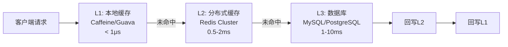
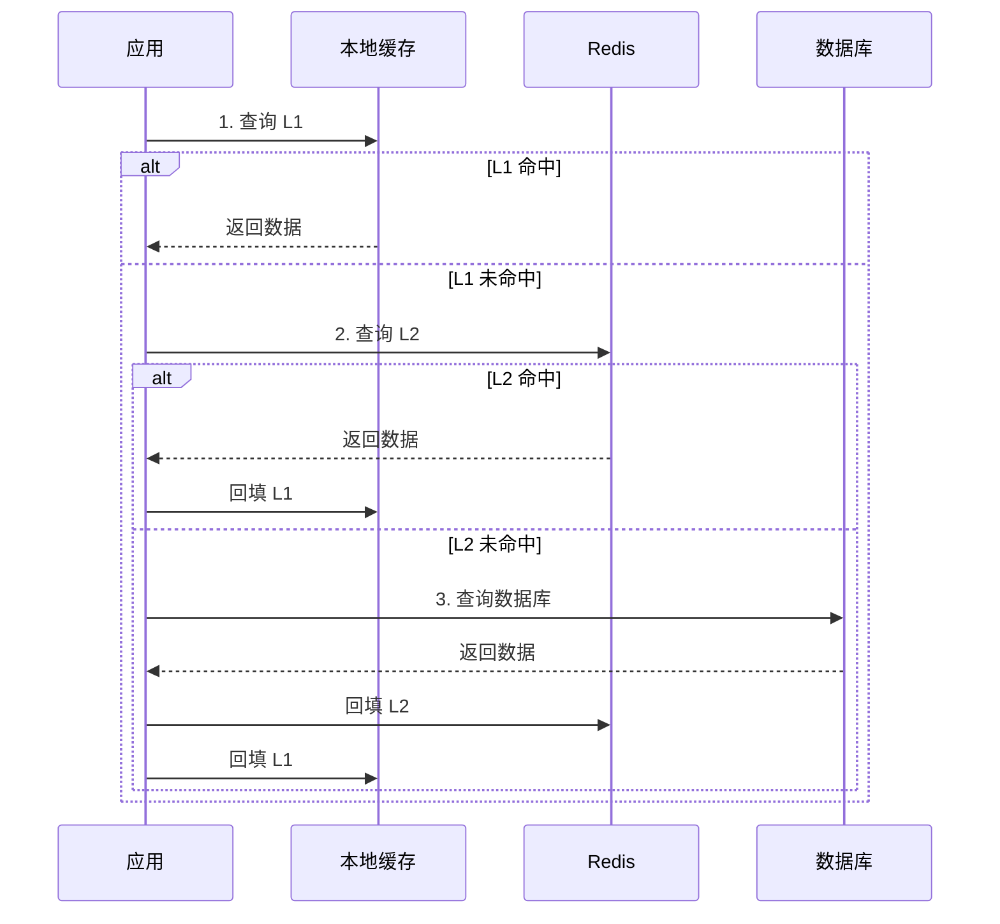
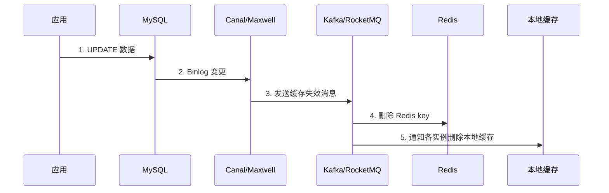
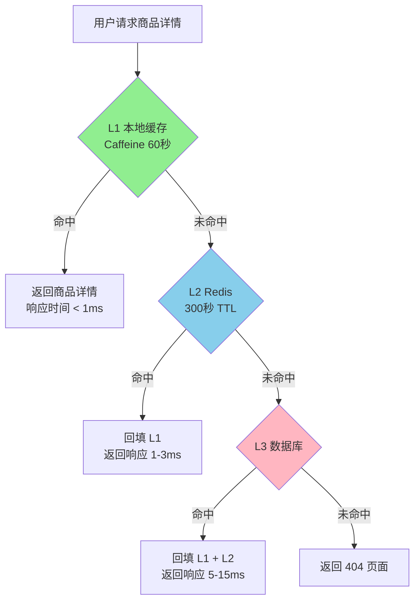

## 技巧3：多级缓存架构

单层缓存在高并发场景下存在明显的性能天花板：本地缓存容量有限且不跨实例共享，分布式缓存网络延迟在毫秒级但仍远高于纳秒级的内存访问。**多级缓存（Multi-Level Cache）** 通过分层组织不同速度和容量的缓存，让绝大多数请求在最近的一层命中，只有少数请求穿透到下层，实现"**用空间换时间，用层级换吞吐**"。

本技巧从理论原理、架构模式、一致性策略、实战代码到生产踩坑，全面讲解多级缓存的设计与实现。

---

### 一、为什么需要多级缓存

#### 1.1 单层缓存的困境

在典型的 Web 应用中，单层缓存架构面临以下瓶颈：

| 痛点 | 原因 | 影响 |
|------|------|------|
| **本地缓存容量有限** | JVM 堆内缓存受内存限制，通常只能存几百 MB 到几 GB | 大量冷数据无法缓存，命中率低 |
| **本地缓存不共享** | 每个实例独立维护缓存，数据不一致 | 同一请求路由到不同实例时结果不同 |
| **分布式缓存有网络开销** | Redis 访问延迟约 0.5-2ms（同机房） | 在 QPS 10 万+ 的场景下，网络成为瓶颈 |
| **分布式缓存有热点问题** | 大量请求集中在少数 key 上 | Redis 单分片压力过大，响应变慢 |
| **缓存穿透/击穿/雪崩** | 缓存失效瞬间大量请求打到 DB | 数据库压力剧增，可能雪崩 |

#### 1.2 多级缓存如何解决这些问题

多级缓存的核心思想借鉴了 CPU 的 L1/L2/L3 缓存层级：

访问速度：  L1 (ns级) >> L2 (μs级) >> L3 (ms级) >> DB (10ms级)
容量大小：  L1 (小)    << L2 (中)    << L3 (大)    << DB (海量)
命中概率：  L1 (高)    >> L2 (中)    >> L3 (低)

在 Web 应用中，典型的多级缓存架构是：

- **L1（进程内缓存）**：JVM 堆内的 Caffeine/Guava Cache，访问延迟 < 1μs，容量几百 MB
- **L2（分布式缓存）**：Redis Cluster / Memcached，访问延迟 0.5-2ms，容量 TB 级
- **L3（数据库缓存/磁盘缓存）**：MySQL Buffer Pool、OS Page Cache，访问延迟 1-10ms



#### 1.3 性能数据对比

以一个典型电商商品详情页为例，不同缓存层级的性能表现：

| 架构方案 | 平均响应时间 | P99 响应时间 | DB QPS | 单实例吞吐量 |
|----------|------------|-------------|--------|-------------|
| 无缓存（直接查 DB） | 15ms | 50ms | 10,000 | 500 QPS |
| 仅 Redis | 2ms | 8ms | 500 | 5,000 QPS |
| 仅本地缓存 | 0.1ms | 0.5ms | 100 | 50,000 QPS |
| 本地 + Redis | 0.3ms | 2ms | 20 | 100,000 QPS |

关键结论：**多级缓存可以将 DB 压力降低 99% 以上，同时将平均响应时间压缩到亚毫秒级**。

---

### 二、多级缓存的分层设计

#### 2.1 L1：进程内缓存

进程内缓存是速度最快的一层，直接在 JVM/进程堆内存中存储数据。

**常见选型对比：**

| 特性 | Caffeine | Guava Cache | EhCache 3 | ConcurrentHashMap |
|------|----------|-------------|-----------|-------------------|
| **淘汰算法** | W-TinyLFU | LRU | LRU/LFU/FIFO | 无淘汰 |
| **最大容量** | 支持 | 支持 | 支持 | 无限制 |
| **过期策略** | 写后过期/访问后过期 | 写后过期/访问后过期 | 支持 | 不支持 |
| **统计信息** | 命中率/驱逐数 | 命中率/驱逐数 | 命中率 | 无 |
| **异步加载** | 支持 | 支持 | 支持 | 不支持 |
| **推荐场景** | 生产首选 | 轻量级场景 | 需要持久化 | 简单键值存储 |

**Caffeine 推荐配置：**

```java
// Java 生产级 Caffeine 配置
Cache<String, Product> productCache = Caffeine.newBuilder()
    .maximumSize(10_000)              // 最大缓存条目数
    .expireAfterWrite(Duration.ofSeconds(60))  // 写入后60秒过期
    .refreshAfterWrite(Duration.ofSeconds(30)) // 写入后30秒异步刷新
    .recordStats()                     // 开启统计（命中率等）
    .executor(Executors.newFixedThreadPool(4)) // 异步刷新线程池
    .build();
```

**关键设计原则：**

1. **容量控制**：L1 容量不宜过大，否则频繁 GC 会反而降低性能。一般控制在堆内存的 10%-20% 以内
2. **过期时间短**：L1 TTL 通常设为 30-120 秒，比 L2 短得多，确保多层之间的数据时效性差异可控
3. **淘汰算法选 W-TinyLFU**：Caffeine 的 W-TinyLFU 比传统 LRU 命中率高 5-20%，特别适合访问模式不均匀的场景

#### 2.2 L2：分布式缓存

分布式缓存提供跨实例的数据共享和大容量存储。

**Redis Cluster 部署建议：**

# 3主3从的典型部署
Node1 (M) ←→ Node2 (M) ←→ Node3 (M)
  ↕              ↕              ↕
Node1 (S)    Node2 (S)    Node3 (S)

# slot 分布
Node1: 0-5460
Node2: 5461-10922
Node3: 10923-16383

**Redis 连接池配置要点：**

```python
import redis

# 推荐的 Redis 连接池配置
pool = redis.ConnectionPool(
    host='redis-cluster.internal',
    port=6379,
    max_connections=50,          # 连接池最大连接数
    socket_timeout=1.0,          # 读写超时1秒
    socket_connect_timeout=0.5,  # 连接超时0.5秒
    retry_on_timeout=True,       # 超时自动重试
    decode_responses=True        # 自动解码为字符串
)
client = redis.Redis(connection_pool=pool)
```

#### 2.3 L3：数据库缓存层

数据库自身的缓存也是多级缓存的重要一环：

- **MySQL InnoDB Buffer Pool**：默认 128MB，生产环境建议设为物理内存的 60%-80%
- **OS Page Cache**：操作系统对文件 I/O 的缓存，MySQL 的双缓冲（Buffer Pool + OS Cache）实际上也是多级缓存
- **连接池**：HikariCP / Druid 维护数据库连接复用，减少连接建立开销

---

### 三、读写策略详解

多级缓存的核心挑战在于：**数据写入时如何同步更新各层缓存，读取时如何协调各层的一致性**。

#### 3.1 读取策略：Read-Through（读穿透）



**Read-Through 的特点：**
- 应用代码不感知缓存层级，通过统一接口透明访问
- 未命中时自动从下层加载并回填
- 回填是同步操作，首次请求会稍慢

#### 3.2 读取策略：Read-Behind（异步回填）

Read-Behind 也叫 Write-Back（回写），核心思想是：**L1 命中后立即返回，后台异步从 L2 加载缺失数据**。

```java
// Read-Behind 模式
public Product getProduct(long id) {
    String key = "product:" + id;
    
    // L1 同步读取
    Product product = localCache.getIfPresent(key);
    if (product != null) {
        return product;  // L1 命中，立即返回
    }
    
    // L1 未命中，异步加载（不阻塞当前请求）
    CompletableFuture.runAsync(() -> {
        String data = redis.get(key);
        if (data != null) {
            localCache.put(key, deserialize(data));
        } else {
            // 可以直接返回 null 或降级值
            // DB 加载放到定时任务中批量处理
        }
    });
    
    return null;  // 返回空，前端显示 loading 或降级数据
}
```

**Read-Behind 适用场景：**
- 对数据一致性要求不高（如社交 Feed 流、新闻列表）
- 允许短暂的数据延迟（几秒到几分钟）
- 追求极致的读取速度

#### 3.3 写入策略对比

| 策略 | 写入流程 | 一致性 | 性能 | 适用场景 |
|------|---------|--------|------|---------|
| **Write-Through** | 同步写 DB → 同步写 L2 → 同步写 L1 | 强一致 | 写入慢 | 金融交易、库存扣减 |
| **Write-Behind** | 写 DB → 异步批量写 L2/L1 | 最终一致 | 写入快 | 日志采集、用户行为 |
| **Write-Around** | 写 DB → 失效 L1/L2（不主动填充） | 强一致 | 写入快 | 大文件、不常读的数据 |
| **Write-Invalidate** | 写 DB → 仅失效 L1/L2 | 强一致 | 写入最快 | 通用场景（推荐） |

**Write-Invalidate（写失效）** 是最常用的策略：写入数据库后，不主动更新缓存，而是删除（失效）L1 和 L2 中的对应 key，让下次读取时重新加载。

为什么推荐"删除"而不是"更新"缓存？

1. **避免并发写覆盖**：线程 A 和线程 B 同时更新同一个 key，缓存中可能出现脏数据
2. **懒加载更安全**：删除后下次读取时从 DB 加载最新值，保证缓存一定是最新数据
3. **代码更简单**：不需要处理缓存更新失败的情况

---

### 四、缓存一致性解决方案

多级缓存最大的挑战是**一致性**：如何保证 L1、L2、DB 三层数据的一致性？

#### 4.1 一致性问题的根源

典型的一致性问题：

1. 先更新 DB，再删除 L2，再删除 L1
   - 问题：删除 L1 失败 → L1 中存在脏数据
   - 影响：下次请求读到旧值，直到 L1 过期

2. 先更新 DB，再删除 L2，再删除 L1
   - 问题：删除 L2 失败 → L2 中存在脏数据
   - 影响：其他实例的 L1 回填时从 L2 拿到旧值

3. 并发场景
   - 请求 A 读取 L1 未命中 → 从 L2 加载 → 回填 L1
   - 请求 B 更新 DB → 删除 L1/L2
   - 结果：请求 A 的回填覆盖了请求 B 的删除

#### 4.2 解决方案一：延迟双删

```python
import threading
import time

class DelayedDoubleDelete:
    """延迟双删：确保并发场景下缓存一致性"""
    
    def __init__(self, local_cache, redis_client):
        self.local = local_cache
        self.redis = redis_client
    
    def update(self, key: str, value):
        # 1. 先删除 L1
        self.local.pop(key, None)
        
        # 2. 更新数据库
        self._update_db(key, value)
        
        # 3. 再删除 L2
        self.redis.delete(key)
        
        # 4. 延迟后再次删除 L1（处理并发读取的回填）
        def delayed_delete():
            time.sleep(0.5)  # 延迟 500ms
            self.local.pop(key, None)
        
        threading.Thread(target=delayed_delete, daemon=True).start()
```

**延迟双删的适用条件：**
- 延迟时间应大于一次完整的"查询 L2 → 回填 L1"耗时（通常 500ms-1s 足够）
- 不适用于对一致性要求极高的场景（金融级）
- 是一个"工程妥协"方案，在大多数业务场景下够用

#### 4.3 解决方案二：基于订阅 Binlog 的最终一致性



**Binlog 订阅方案的实现：**

```java
// Canal 消费者：监听 Binlog 变更，自动失效缓存
@Component
public class CacheInvalidationListener {
    
    @Autowired
    private RedisClient redis;
    
    @Autowired
    private LocalCacheManager localCache;
    
    @KafkaListener(topics = "canal-product")
    public void onBinlogEvent(CanalMessage message) {
        String tableName = message.getTableName();
        
        if ("product".equals(tableName)) {
            // 从 Binlog 中提取主键 ID
            Long productId = extractPrimaryKey(message);
            String cacheKey = "product:" + productId;
            
            // 失效 Redis 缓存
            redis.delete(cacheKey);
            
            // 广播失效所有实例的本地缓存
            // 方式一：Redis Pub/Sub
            redis.publish("cache:invalidate", cacheKey);
            
            // 方式二：通过 HTTP 通知每个实例（适用于小集群）
            // notifyAllInstances(cacheKey);
        }
    }
}
```

**本地缓存失效的广播方式对比：**

| 方式 | 原理 | 优点 | 缺点 | 适用场景 |
|------|------|------|------|---------|
| Redis Pub/Sub | 发布/订阅失效消息 | 简单，实时性好 | 不持久化，实例重启丢失 | 小集群（<20 实例） |
| RocketMQ/Kafka | 消息队列广播 | 持久化，可重放 | 延迟稍高 | 大集群，需要审计 |
| HTTP 回调 | 主动通知各实例 | 精确控制 | 实例管理复杂 | 微服务架构 |
| 文件标记 | 写入共享文件标记版本 | 无需额外组件 | 轮询延迟 | 简单场景 |

#### 4.4 解决方案三：基于缓存版本号的一致性

```python
class VersionedCache:
    """基于版本号的缓存一致性方案"""
    
    def __init__(self, redis_client):
        self.redis = redis_client
    
    def get(self, key: str):
        # 先获取版本号
        version_key = f"{key}:version"
        cached_version = self.local.get(version_key)
        
        # 获取当前最新版本号
        latest_version = self.redis.get(version_key)
        
        if cached_version != latest_version:
            # 版本不匹配，本地缓存已过期
            data = self.redis.get(key)
            self.local[version_key] = latest_version
            return data
        
        # 版本匹配，使用本地缓存
        return self.local.get(key)
    
    def invalidate(self, key: str):
        # 删除数据时，递增版本号
        version_key = f"{key}:version"
        self.redis.incr(version_key)
        self.redis.delete(key)
        self.local.pop(f"{key}:version", None)
```

---

### 五、防缓存击穿的多级缓存方案

在技巧 2 中我们介绍了通过分布式锁防护缓存击穿。在多级缓存架构中，击穿问题有新的应对策略。

#### 5.1 单飞模式（Singleflight）

Singleflight 的核心思想：**同一个 key 的并发请求，只有一个去查 DB，其余等待结果共享**。Go 标准库提供了 `golang.org/x/sync/singleflight`，Java 可用 `Striped64` 或自行实现。

```python
import threading
from concurrent.futures import Future

class SingleFlight:
    """防击穿的 Singleflight 实现"""
    
    def __init__(self):
        self._in_flight = {}  # key -> Future
        self._lock = threading.Lock()
    
    def do(self, key: str, fn):
        with self._lock:
            if key in self._in_flight:
                # 已有相同 key 的请求在执行，直接等待结果
                return self._in_flight[key].result()
            
            future = Future()
            self._in_flight[key] = future
        
        try:
            result = fn()
            future.set_result(result)
            return result
        except Exception as e:
            future.set_exception(e)
            raise
        finally:
            with self._lock:
                self._in_flight.pop(key, None)
```

#### 5.2 多级缓存 + Singleflight 的完整实现

```python
import json
import time
import threading
from concurrent.futures import Future
from typing import Any, Callable, Optional

class MultiLevelCache:
    """生产级多级缓存：L1(本地) + L2(Redis) + L3(DB) + Singleflight"""
    
    def __init__(self, redis_client, local_ttl=60):
        self.redis = redis_client
        self.local_ttl = local_ttl
        self._local = {}          # L1: 本地缓存 {key: (value, expire_time)}
        self._local_lock = {}     # L1 key 级别的锁
        self._singleflight = {}   # 防击穿: {key: Future}
        self._sf_lock = threading.Lock()
        self._stats = {
            'l1_hits': 0, 'l2_hits': 0, 'db_hits': 0, 'misses': 0
        }
    
    def get(self, key: str, fetch_fn: Callable, l2_ttl=300) -> Any:
        """
        多级缓存查询
        :param key: 缓存键
        :param fetch_fn: 数据库查询函数（无参数）
        :param l2_ttl: L2 缓存过期时间（秒）
        :return: 查询结果，未找到返回 None
        """
        # ---- L1 查询 ----
        value = self._get_l1(key)
        if value is not None:
            self._stats['l1_hits'] += 1
            return value
        
        # ---- L2 查询 ----
        value = self._get_l2(key)
        if value is not None:
            self._stats['l2_hits'] += 1
            self._set_l1(key, value)  # 回填 L1
            return value
        
        # ---- DB 查询（带 Singleflight 防击穿）----
        value = self._get_db_with_singleflight(key, fetch_fn, l2_ttl)
        if value is not None:
            self._stats['db_hits'] += 1
            return value
        
        self._stats['misses'] += 1
        return None
    
    def _get_l1(self, key: str) -> Optional[Any]:
        """查询本地缓存"""
        if key in self._local:
            value, expire = self._local[key]
            if time.time() < expire:
                return value
            del self._local[key]
        return None
    
    def _get_l2(self, key: str) -> Optional[Any]:
        """查询 Redis 缓存"""
        try:
            raw = self.redis.get(key)
            if raw is not None:
                return json.loads(raw)
        except Exception:
            # Redis 异常时降级：跳过 L2，直接查 DB
            pass
        return None
    
    def _get_db_with_singleflight(self, key: str, fetch_fn: Callable, l2_ttl: int) -> Optional[Any]:
        """带 Singleflight 的 DB 查询，防止缓存击穿"""
        future = None
        
        with self._sf_lock:
            if key in self._singleflight:
                future = self._singleflight[key]
            else:
                future = Future()
                self._singleflight[key] = future
                # 当前线程负责查询 DB
        
        if future.done():
            # 其他线程等待结果
            return future.result()
        
        try:
            result = fetch_fn()
            if result is not None:
                self._set_l2(key, result, l2_ttl)
                self._set_l1(key, result)
            future.set_result(result)
            return result
        except Exception as e:
            future.set_exception(e)
            raise
        finally:
            with self._sf_lock:
                self._singleflight.pop(key, None)
    
    def _set_l1(self, key: str, value: Any):
        """写入本地缓存"""
        self._local[key] = (value, time.time() + self.local_ttl)
    
    def _set_l2(self, key: str, value: Any, ttl: int):
        """写入 Redis 缓存"""
        try:
            self.redis.setex(key, ttl, json.dumps(value))
        except Exception:
            pass  # Redis 写入失败不影响主流程
    
    def invalidate(self, key: str):
        """同时失效 L1 和 L2"""
        self._local.pop(key, None)
        try:
            self.redis.delete(key)
        except Exception:
            pass
    
    def invalidate_pattern(self, pattern: str):
        """按模式批量失效（注意：Redis SCAN 有性能开销）"""
        # 先清理本地缓存中匹配的 key
        keys_to_delete = [k for k in self._local if k.startswith(pattern.replace('*', ''))]
        for k in keys_to_delete:
            self._local.pop(k, None)
        
        # 再清理 Redis 中匹配的 key
        try:
            cursor = 0
            while True:
                cursor, keys = self.redis.scan(cursor=cursor, match=pattern, count=100)
                if keys:
                    self.redis.delete(*keys)
                if cursor == 0:
                    break
        except Exception:
            pass
    
    def get_stats(self) -> dict:
        """获取缓存命中率统计"""
        total = sum(self._stats.values())
        if total == 0:
            return {**self._stats, 'total': 0, 'hit_rate': 'N/A'}
        l1_rate = self._stats['l1_hits'] / total * 100
        l2_rate = self._stats['l2_hits'] / total * 100
        overall_hit_rate = (self._stats['l1_hits'] + self._stats['l2_hits']) / total * 100
        return {
            **self._stats,
            'total': total,
            'l1_hit_rate': f"{l1_rate:.1f}%",
            'l2_hit_rate': f"{l2_rate:.1f}%",
            'overall_hit_rate': f"{overall_hit_rate:.1f}%"
        }
```

---

### 六、本地缓存失效：跨实例一致性

L1 缓存是进程内的，当 DB 数据更新时，如何让所有实例的 L1 都失效？

#### 6.1 方案一：Redis Pub/Sub 广播

```python
import json
import redis
import threading

class LocalCacheInvalidator:
    """通过 Redis Pub/Sub 实现本地缓存失效广播"""
    
    def __init__(self, redis_client, local_cache):
        self.redis = redis_client
        self.local = local_cache
        self._channel = "cache:invalidate"
        self._running = False
    
    def start_listener(self):
        """启动后台监听线程"""
        self._running = True
        
        def _listen():
            pubsub = self.redis.pubsub()
            pubsub.subscribe(self._channel)
            
            for message in pubsub.listen():
                if not self._running:
                    break
                if message['type'] == 'message':
                    try:
                        data = json.loads(message['data'])
                        key = data['key']
                        self.local.pop(key, None)
                    except Exception:
                        pass
        
        thread = threading.Thread(target=_listen, daemon=True)
        thread.start()
    
    def invalidate(self, key: str):
        """广播失效消息"""
        self.local.pop(key, None)  # 先删自己的 L1
        self.redis.publish(self._channel, json.dumps({'key': key}))
    
    def stop(self):
        self._running = False
```

**Redis Pub/Sub 的局限：**
- 不持久化：实例重启后会丢失未消费的消息
- 消息堆积：如果实例断连，重连后不会收到断连期间的消息
- 解决方案：结合"版本号对比"做兜底，定期检查本地缓存的版本是否与 Redis 一致

#### 6.2 方案二：定时版本校验

```python
import time
import threading

class VersionChecker:
    """定时校验本地缓存与 Redis 缓存的版本一致性"""
    
    def __init__(self, redis_client, local_cache, check_interval=10):
        self.redis = redis_client
        self.local = local_cache
        self.check_interval = check_interval
        self._running = False
    
    def start(self):
        """启动定时校验"""
        self._running = True
        
        def _check():
            while self._running:
                time.sleep(self.check_interval)
                self._do_check()
        
        thread = threading.Thread(target=_check, daemon=True)
        thread.start()
    
    def _do_check(self):
        """遍历本地缓存，校验版本号"""
        keys_to_invalidate = []
        
        for key in list(self.local.keys()):
            version_key = f"{key}:ver"
            local_version = self.local.get(version_key)
            remote_version = self.redis.get(version_key)
            
            if remote_version is not None and local_version != remote_version:
                keys_to_invalidate.append(key)
        
        for key in keys_to_invalidate:
            self.local.pop(key, None)
            self.local.pop(f"{key}:ver", None)
```

#### 6.3 方案三：TTL 兜底 + 主动失效

最简单也最可靠的方案：**给 L1 设置较短的 TTL（30-120 秒），同时在数据更新时主动广播失效**。

主动失效 + TTL 兜底的双保险机制：

1. 数据更新时 → 发布失效消息 → 各实例删除 L1（毫秒级生效）
2. 如果消息丢失 → L1 自然过期（30-120 秒后生效）
3. 结果：最坏情况下，脏数据最多存在一个 TTL 周期

**推荐配置：**
- L1 TTL：30-60 秒（高一致性场景）/ 60-120 秒（一般场景）
- L2 TTL：5-15 分钟
- 主动失效：写操作后立即广播

---

### 七、缓存预热与降级

#### 7.1 多级缓存预热策略

```python
import json
from concurrent.futures import ThreadPoolExecutor

class CacheWarmer:
    """多级缓存预热器"""
    
    def __init__(self, multi_level_cache, db_pool):
        self.cache = multi_level_cache
        self.db = db_pool
    
    def warmup_hot_keys(self, key_list: list, fetch_fn):
        """
        并行预热热点数据
        :param key_list: 需要预热的 key 列表
        :param fetch_fn: 数据加载函数 (key) -> value
        """
        def _warm_one(key):
            try:
                value = fetch_fn(key)
                if value is not None:
                    # 预热到 L2（Redis），L1 在首次访问时自动加载
                    self.cache._set_l2(key, value, l2_ttl=3600)
                    return True
            except Exception as e:
                print(f"预热失败 key={key}: {e}")
            return False
        
        with ThreadPoolExecutor(max_workers=10) as executor:
            results = list(executor.map(_warm_one, key_list))
        
        success = sum(1 for r in results if r)
        print(f"预热完成: {success}/{len(key_list)} 成功")
    
    def warmup_from_db(self, table: str, key_column: str, limit=1000):
        """
        从数据库批量加载热点数据
        """
        with self.db.cursor() as cursor:
            cursor.execute(
                f"SELECT * FROM {table} ORDER BY view_count DESC LIMIT %s",
                (limit,)
            )
            rows = cursor.fetchall()
        
        for row in rows:
            key = f"{table}:{row[key_column]}"
            self.cache._set_l2(key, row, l2_ttl=3600)
        
        print(f"从 {table} 预热了 {len(rows)} 条数据")
```

#### 7.2 降级策略

当 L2（Redis）不可用时，系统应该如何降级？

```python
class ResilientMultiLevelCache:
    """带降级的多级缓存"""
    
    def __init__(self, redis_client, local_ttl=60):
        self.redis = redis_client
        self.local_ttl = local_ttl
        self._local = {}
        self._circuit_open = False   # 熔断器状态
        self._circuit_open_until = 0
    
    def get(self, key: str, fetch_fn, l2_ttl=300, fallback_value=None):
        """带降级的查询"""
        # L1 查询
        value = self._get_l1(key)
        if value is not None:
            return value
        
        # 熔断器检查：如果 Redis 熔断，直接查 DB
        if self._circuit_open:
            if time.time() < self._circuit_open_until:
                return self._query_db_or_fallback(key, fetch_fn, fallback_value)
            else:
                # 尝试恢复
                self._circuit_open = False
        
        # L2 查询（带超时）
        try:
            value = self.redis.get(key)
            if value is not None:
                decoded = json.loads(value)
                self._set_l1(key, decoded)
                return decoded
        except Exception as e:
            # Redis 异常，触发熔断
            self._circuit_open = True
            self._circuit_open_until = time.time() + 30  # 30 秒后尝试恢复
        
        # DB 查询（带降级）
        return self._query_db_or_fallback(key, fetch_fn, fallback_value)
    
    def _query_db_or_fallback(self, key, fetch_fn, fallback_value):
        try:
            data = fetch_fn()
            if data is not None:
                self._set_l1(key, data)
                # 尝试恢复 Redis 写入
                if not self._circuit_open:
                    self.redis.setex(key, 300, json.dumps(data))
            return data
        except Exception:
            # DB 也挂了，返回降级值
            return fallback_value
    
    def _get_l1(self, key):
        if key in self._local:
            value, expire = self._local[key]
            if time.time() < expire:
                return value
            del self._local[key]
        return None
    
    def _set_l1(self, key, value):
        self._local[key] = (value, time.time() + self.local_ttl)
```

**降级策略分级：**

| 级别 | Redis 状态 | DB 状态 | 行为 |
|------|-----------|---------|------|
| **L1** | 正常 | 正常 | 正常多级缓存流程 |
| **L2** | 异常 | 正常 | 跳过 Redis，L1 → DB，触发熔断 |
| **L3** | 异常 | 异常 | 返回 L1 缓存或降级值 |
| **L4** | 异常 | 异常 | 返回兜底值（静态数据/默认值/空页面） |

---

### 八、性能监控与调优

#### 8.1 关键监控指标

```python
import time
from contextlib import contextmanager
from dataclasses import dataclass, field

@dataclass
class CacheMetrics:
    """缓存监控指标"""
    l1_requests: int = 0
    l1_hits: int = 0
    l2_requests: int = 0
    l2_hits: int = 0
    db_queries: int = 0
    l1_evictions: int = 0
    errors: int = 0
    latencies: list = field(default_factory=list)
    
    def l1_hit_rate(self) -> float:
        return self.l1_hits / self.l1_requests * 100 if self.l1_requests > 0 else 0
    
    def l2_hit_rate(self) -> float:
        return self.l2_hits / self.l2_requests * 100 if self.l2_requests > 0 else 0
    
    def overall_hit_rate(self) -> float:
        total = self.l1_requests + self.l2_requests + self.db_queries
        hits = self.l1_hits + self.l2_hits
        return hits / total * 100 if total > 0 else 0
    
    def avg_latency_ms(self) -> float:
        return sum(self.latencies) / len(self.latencies) * 1000 if self.latencies else 0
    
    def report(self) -> str:
        return (
            f"缓存监控报告\n"
            f"  L1 命中率: {self.l1_hit_rate():.1f}% ({self.l1_hits}/{self.l1_requests})\n"
            f"  L2 命中率: {self.l2_hit_rate():.1f}% ({self.l2_hits}/{self.l2_requests})\n"
            f"  总体命中率: {self.overall_hit_rate():.1f}%\n"
            f"  DB 查询次数: {self.db_queries}\n"
            f"  L1 驱逐次数: {self.l1_evictions}\n"
            f"  平均延迟: {self.avg_latency_ms():.2f}ms\n"
            f"  错误次数: {self.errors}"
        )
```

#### 8.2 命中率调优

当 L1 命中率低于预期时的排查清单：

L1 命中率低的常见原因及对策：

1. TTL 设得太短 → 延长 L1 TTL（但注意一致性影响）
2. 缓存容量不够 → 增加 maximumSize，或优化 key 设计
3. 访问模式太分散 → 检查是否有大量冷数据污染缓存
4. 驱逐算法不合适 → Caffeine 使用 W-TinyLFU（默认）
5. 预热不充分 → 启动时加载热点数据
6. key 设计不合理 → 过细的 key 导致命中率分散

#### 8.3 延迟分布监控

```python
import time
from contextlib import contextmanager

@contextmanager
def cache_timer(metrics: CacheMetrics):
    """缓存操作计时装饰器"""
    start = time.monotonic()
    try:
        yield
    finally:
        elapsed = time.monotonic() - start
        metrics.latencies.append(elapsed)
        # 保持最近 10000 个样本
        if len(metrics.latencies) > 10000:
            metrics.latencies = metrics.latencies[-5000:]

# 使用示例
metrics = CacheMetrics()

with cache_timer(metrics):
    result = cache.get("product:12345", fetch_product)
```

---

### 九、生产环境踩坑与最佳实践

#### 9.1 常见踩坑

**坑 1：L1 和 L2 的 TTL 相同导致缓存雪崩**

错误做法：L1 TTL = L2 TTL = 300 秒
问题：300 秒后所有缓存同时过期，大量请求同时打到 DB
正确做法：L1 TTL < L2 TTL，且加入随机抖动

L1 TTL: 50-70 秒（基准 60 秒 ± 随机 10 秒）
L2 TTL: 280-320 秒（基准 300 秒 ± 随机 20 秒）

```python
import random

def get_ttl(base_ttl: int, jitter_pct: float = 0.1) -> int:
    """带随机抖动的 TTL"""
    jitter = int(base_ttl * jitter_pct)
    return base_ttl + random.randint(-jitter, jitter)

# 使用
l1_ttl = get_ttl(60)   # 54-66 秒
l2_ttl = get_ttl(300)  # 270-330 秒
```

**坑 2：序列化/反序列化性能问题**

问题：JSON 序列化在高 QPS 下成为瓶颈
对策：
  - 小对象（<1KB）：用 msgpack 或 protobuf
  - 大对象（>10KB）：压缩后序列化（snappy/zstd）
  - Java 场景：用 Kryo 序列化，比 JSON 快 5-10 倍
  - 避免每次查询都序列化：L1 直接存储对象引用（本地缓存不需要序列化）

**坑 3：Redis 大 Key 导致网络阻塞**

问题：单个 Redis key 存储了 10MB+ 的数据
影响：
  - 读取时阻塞 Redis 单线程，影响其他 key 的访问
  - 网络传输时间长，客户端超时
  - 内存分配/释放产生碎片

对策：
  - 大对象拆分为多个小 key（如 user:123:profile, user:123:orders）
  - 或使用 Redis Hash 存储，只获取需要的字段
  - L1 缓存大对象时设置容量上限

**坑 4：本地缓存的内存泄漏**

```python
# 反面教材：使用 dict 作为本地缓存
cache = {}  # 没有容量限制，没有过期机制
cache[key] = value  # 永远不会被清理 → 内存泄漏

# 正面教材：使用 Caffeine / 带过期机制的 dict
from cachetools import TTLCache
cache = TTLCache(maxsize=10000, ttl=60)  # 最大 10000 条，60 秒过期
cache[key] = value  # 超过容量自动驱逐，过期自动清理
```

**坑 5：并发更新导致缓存与 DB 不一致**

时间线：
T1: 请求 A 读取 product:1 → DB 返回旧数据 {price: 100}
T2: 请求 B 更新 product:1 → DB 写入新数据 {price: 200} → 删除 Redis key
T3: 请求 A 回填 L1 → L1 中存入 {price: 100}（旧数据）

结果：L1 中是 100，DB 中是 200，直到 L1 过期才恢复一致

解决方案：
1. 写操作后延迟 500ms 再删除 L1（延迟双删）
2. 使用 Binlog 订阅方案（更可靠）
3. 接受短暂不一致，靠 TTL 兜底（最简单）

#### 9.2 最佳实践总结

| 实践 | 说明 |
|------|------|
| **L1 TTL < L2 TTL** | L1 设 30-120 秒，L2 设 5-15 分钟，形成时间梯度 |
| **TTL 加随机抖动** | 避免所有 key 同时过期造成雪崩 |
| **写操作只失效不更新** | 先写 DB，再删除缓存（不是更新缓存） |
| **单飞模式防击穿** | 同一 key 的并发查询共享结果 |
| **熔断降级保护** | Redis 不可用时自动降级到 DB 查询 |
| **监控命中率** | L1 命中率低于 80% 需要排查原因 |
| **预热热点数据** | 启动时批量加载 Top-N 热点 key |
| **序列化选型** | L1 存对象引用，L2 用高效序列化（msgpack/protobuf） |
| **避免大 Key** | 单个 Redis key 控制在 100KB 以内 |
| **日志审计** | 记录缓存失效事件，便于排查一致性问题 |

---

### 十、实际案例：电商商品详情页多级缓存

一个完整的电商商品详情页多级缓存方案：



**关键配置：**

```python
# 商品详情页多级缓存配置
PRODUCT_CACHE_CONFIG = {
    'l1': {
        'max_size': 10000,           # 最多缓存 1 万个商品
        'ttl': 60,                    # 60 秒过期
        'refresh_after': 30,          # 30 秒后异步刷新
    },
    'l2': {
        'ttl': 300,                   # 5 分钟过期
        'key_prefix': 'product:',     # key 前缀
        'serializer': 'msgpack',      # 高效序列化
    },
    'singleflight': {
        'timeout': 5,                 # 5 秒超时
    },
    'fallback': {
        'enabled': True,              # 启用降级
        'stale_ttl': 600,             # 降级时使用过期缓存，最多 10 分钟
    }
}
```

**效果数据：**

| 指标 | 优化前（仅 Redis） | 优化后（多级缓存） | 提升 |
|------|-------------------|-------------------|------|
| 平均响应时间 | 3.2ms | 0.8ms | **75%** |
| P99 响应时间 | 12ms | 3ms | **75%** |
| Redis QPS | 80,000 | 15,000 | **Redis 负载降低 81%** |
| DB QPS | 2,000 | 200 | **DB 负载降低 90%** |
| 单实例吞吐量 | 8,000 QPS | 50,000 QPS | **提升 6 倍** |

---

### 十一、常见误区

#### 误区 1：多级缓存一定能提升性能

**真相：** 多级缓存增加了写入延迟（需要更新多层）和复杂度。如果读写比不高（< 10:1），或者数据变化频繁（TTL < 10 秒），多级缓存可能反而降低性能。只有在**读多写少、热点集中的场景**下，多级缓存才有明显收益。

#### 误区 2：L1 缓存越大越好

**真相：** L1 缓存过大会导致：
- GC 停顿时间增加（JVM 需要扫描更多堆内存）
- CPU 缓存命中率下降（数据超出 L2/L3 CPU 缓存）
- 多实例间的数据不一致范围扩大

建议：L1 控制在 100MB-1GB 之间，根据 GC 监控数据调整。

#### 误区 3：缓存命中率越高越好

**真相：** 极高的命中率（> 99%）可能意味着：
- 缓存容量远大于实际数据量（浪费资源）
- TTL 设得过长（数据可能过期）
- 有些场景需要及时反映数据变更（如库存），命中率应适当降低

#### 误区 4：Redis 是分布式缓存的唯一选择

**真相：** 不同场景有不同选择：
- **Redis**：通用场景，支持丰富数据结构
- **Memcached**：纯 KV 缓存，多线程模型，性能更稳定
- **本地 + 一致性哈希**：超低延迟场景（如游戏服务器）
- **Caffeine + 进程间共享内存**：同机多进程共享缓存

---

### 十二、本节小结

多级缓存架构是解决高并发场景下缓存性能和容量矛盾的核心方案：

1. **分层思想**：L1（本地）提供极速访问，L2（分布式）提供大容量共享，形成速度-容量互补
2. **读写策略**：读穿透实现自动加载，写失效保证一致性，单飞模式防止击穿
3. **一致性方案**：延迟双删是简单有效方案，Binlog 订阅是高可靠方案，TTL 是兜底方案
4. **降级保护**：熔断器 + 降级值确保 Redis 不可用时系统仍能运行
5. **监控调优**：持续监控命中率和延迟分布，根据数据调整 TTL、容量等参数

核心原则：**L1 快而小、L2 大而共享、L3 持久可靠，三层协同各司其职**。
