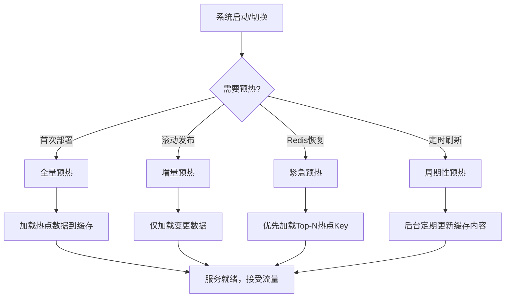
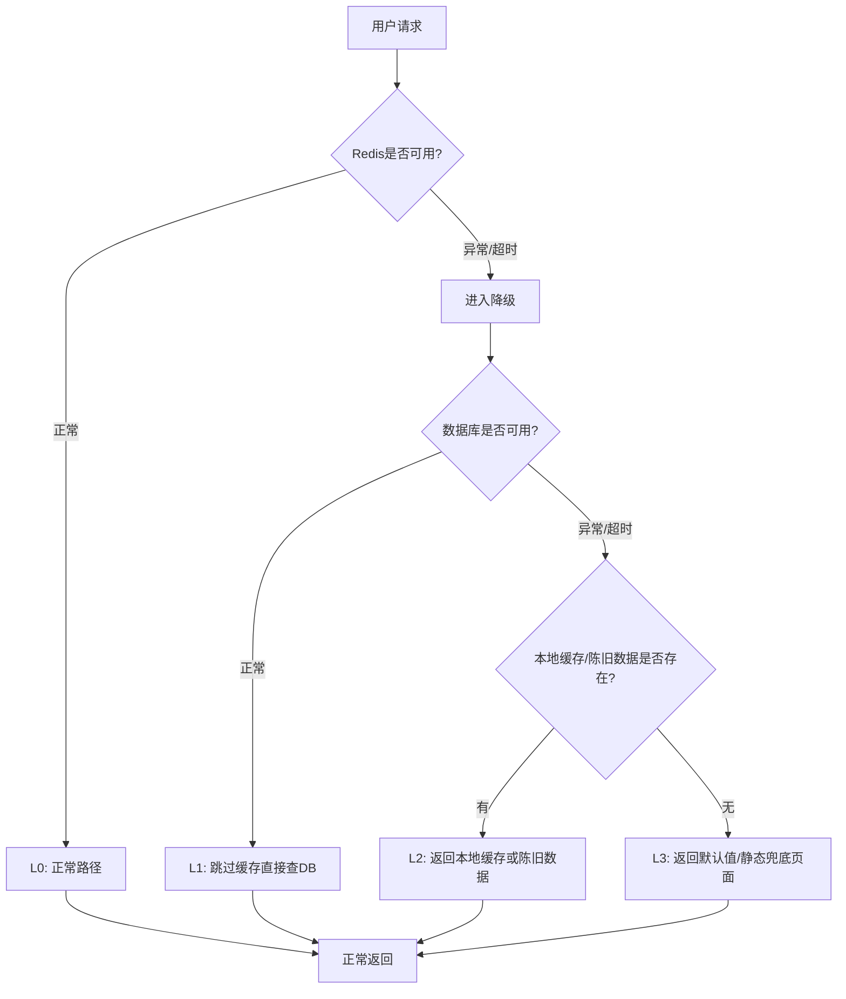
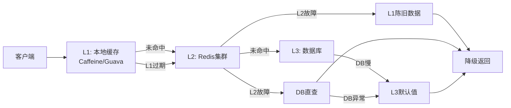
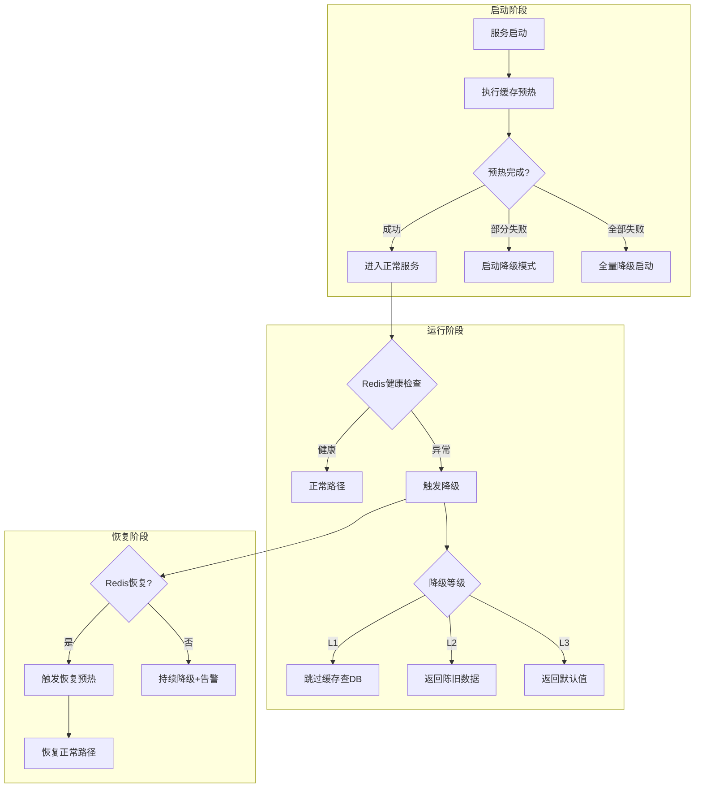

## 技巧4：缓存预热与降级策略

在生产环境中，缓存系统的价值不仅体现在"有数据时加速访问"，更体现在"极端情况下保障可用性"。缓存预热确保系统启动或切换后不会因冷启动导致雪崩，缓存降级则在缓存层异常时保护后端数据库不被击垮。这两个策略是高可用架构的基石，也是面试和实战中的高频考点。

---

### 一、缓存预热（Cache Warmup）

#### 1.1 为什么需要缓存预热

缓存预热的核心问题是**冷启动**（Cold Start）。当以下场景发生时，缓存中没有数据，所有请求会直接穿透到数据库：

| 触发场景 | 典型原因 | 影响程度 |
|---------|---------|---------|
| 服务首次部署 | 新实例启动，本地缓存为空 | 高（全量穿透） |
| Redis 故障恢复 | Redis 主从切换或重启后缓存清空 | 极高（瞬时全量请求涌入 DB） |
| 缓存 Key 过期集中 | 大量 Key 同时过期（如设置统一 TTL） | 高（"缓存雪崩"） |
| 发版重启 | 应用进程重启，本地缓存失效 | 中（单实例影响） |
| 流量突增 | 新活动上线，热点 Key 未缓存 | 中到高（取决于预热覆盖度） |

**未预热的后果**：假设系统 QPS 为 10,000，缓存命中率 95%，正常情况下数据库承受 500 QPS。若缓存全部失效，10,000 QPS 直接打到数据库，数据库连接池瞬间耗尽，引发级联故障——这就是经典的**缓存雪崩**（Cache Avalanche）。

#### 1.2 预热时机



**四个关键时机：**

- **启动预热**：服务进程启动后、开始接受流量前，主动将热点数据加载到缓存
- **滚动预热**：滚动发布时，新实例先完成预热再接入负载均衡
- **故障恢复预热**：Redis 从故障中恢复后，主动重建缓存而不是被动等待穿透
- **周期性预热**：定时任务持续刷新缓存，保证数据新鲜度（适用于可容忍短暂不一致的场景）

#### 1.3 预热策略全景

##### 策略一：全量加载（Full Load）

将所有需要缓存的数据一次性加载。适用于数据量小（<10万条）、可容忍短暂加载时间的场景。

```python
import json
import redis
from concurrent.futures import ThreadPoolExecutor, as_completed

class FullWarmupStrategy:
    """全量预热策略：适合数据量小、启动时间容忍度高的场景"""
    
    def __init__(self, redis_client: redis.Redis, concurrency: int = 10):
        self.redis = redis_client
        self.concurrency = concurrency
    
    def warmup(self, keys_and_loaders: dict, ttl: int = 3600):
        """
        全量预热：并发加载所有数据到缓存
        
        Args:
            keys_and_loaders: {key: (loader_fn, ttl_override_or_None)}
            ttl: 默认过期时间（秒）
        """
        pipe = self.redis.pipeline()
        loaded = 0
        failed = 0
        
        for key, item in keys_and_loaders.items():
            try:
                if callable(item):
                    data = item()
                    key_ttl = ttl
                else:
                    data, key_ttl = item[0](), item[1] or ttl
                
                if data is not None:
                    serialized = json.dumps(data, ensure_ascii=False)
                    pipe.setex(key, key_ttl, serialized)
                    loaded += 1
                else:
                    failed += 1
            except Exception as e:
                failed += 1
                print(f"预热失败 key={key}: {e}")
        
        pipe.execute()
        print(f"全量预热完成: 成功={loaded}, 失败={failed}, 总计={len(keys_and_loaders)}")
        return loaded, failed
```

##### 策略二：Top-N 热点加载（Hot Keys Only）

基于访问频率统计，只预热最热的 N 个 Key。适用于数据量大、热点集中的场景（符合二八定律——20% 的 Key 承担 80% 的流量）。

```python
import time
from collections import defaultdict

class HotKeyWarmupStrategy:
    """热点预热策略：基于访问频率统计，只加载Top-N热点数据"""
    
    def __init__(self, redis_client: redis.Redis):
        self.redis = redis_client
        self.access_counter_key = "cache:access_counter"
    
    def record_access(self, key: str):
        """记录Key被访问的次数（用于统计热点）"""
        self.redis.zincrby(self.access_counter_key, 1, key)
    
    def get_hot_keys(self, top_n: int = 100) -> list:
        """获取访问量最高的Top-N Key"""
        return self.redis.zrevrange(self.access_counter_key, 0, top_n - 1)
    
    def warmup_hot_keys(self, key_loader_map: dict, top_n: int = 100, ttl: int = 3600):
        """
        预热热点Key：只加载访问频率最高的N个Key
        
        适用场景：Redis故障恢复后、大促前的主动预热
        """
        hot_keys = self.get_hot_keys(top_n)
        loaded = 0
        
        pipe = self.redis.pipeline()
        for hot_key_bytes in hot_keys:
            hot_key = hot_key_bytes.decode() if isinstance(hot_key_bytes, bytes) else hot_key_bytes
            if hot_key in key_loader_map:
                try:
                    data = key_loader_map[hot_key]()
                    if data is not None:
                        pipe.setex(hot_key, ttl, json.dumps(data, ensure_ascii=False))
                        loaded += 1
                except Exception as e:
                    print(f"热点预热失败 key={hot_key}: {e}")
        
        pipe.execute()
        print(f"热点预热完成: 加载了 {loaded}/{len(hot_keys)} 个热点Key")
        return loaded
```

##### 策略三：定时刷新（Scheduled Refresh）

后台任务周期性刷新缓存，确保数据不陈旧。适用于可接受短暂不一致、但要求最终一致的场景（如推荐列表、排行榜）。

```python
import threading
import time

class ScheduledWarmupStrategy:
    """定时预热策略：后台线程周期性刷新缓存数据"""
    
    def __init__(self, redis_client: redis.Redis):
        self.redis = redis_client
        self._stop_event = threading.Event()
        self._thread = None
    
    def start(self, refresh_tasks: list, interval_seconds: int = 300):
        """
        启动定时预热线程
        
        Args:
            refresh_tasks: [(task_name, loader_fn, cache_key, ttl)]
            interval_seconds: 刷新间隔（秒）
        """
        def _run():
            while not self._stop_event.is_set():
                for name, loader, key, ttl in refresh_tasks:
                    try:
                        data = loader()
                        if data is not None:
                            self.redis.setex(key, ttl, json.dumps(data, ensure_ascii=False))
                            print(f"[定时预热] {name} 刷新成功")
                    except Exception as e:
                        print(f"[定时预热] {name} 刷新失败: {e}")
                
                self._stop_event.wait(interval_seconds)
        
        self._thread = threading.Thread(target=_run, daemon=True)
        self._thread.start()
        print(f"定时预热已启动，间隔={interval_seconds}s，共{len(refresh_tasks)}个任务")
    
    def stop(self):
        """停止定时预热"""
        self._stop_event.set()
        if self._thread:
            self._thread.join(timeout=10)
        print("定时预热已停止")
```

##### 策略四：懒加载 + 预热混合（Lazy + Warm Hybrid）

先通过预热加载高确定性的热点数据，其余数据采用懒加载模式——首次访问时加载并缓存。这是生产环境中最常用的模式。

```python
class HybridWarmupStrategy:
    """混合预热策略：预热确定性热点 + 懒加载长尾数据"""
    
    def __init__(self, redis_client: redis.Redis):
        self.redis = redis_client
        self.local_cache = {}  # 可选：本地缓存层
        self.local_cache_lock = threading.Lock()
    
    def get(self, key: str, loader_fn, ttl: int = 3600, 
            local_ttl: int = 60):
        """
        混合读取：Redis → 懒加载回源 → 写回缓存
        
        流程：
        1. 检查Redis缓存
        2. Redis未命中 → 调用loader_fn回源
        3. 回源成功 → 写回Redis，下次命中
        4. 回源失败 → 返回None（上层决定降级逻辑）
        """
        # 第一层：Redis缓存
        try:
            cached = self.redis.get(key)
            if cached:
                return json.loads(cached)
        except redis.RedisError:
            pass  # Redis不可用，继续尝试回源
        
        # 第二层：回源加载
        try:
            data = loader_fn()
            if data is not None:
                # 写回Redis
                try:
                    self.redis.setex(key, ttl, json.dumps(data, ensure_ascii=False))
                except redis.RedisError:
                    pass  # Redis写入失败不影响本次返回
                return data
        except Exception as e:
            print(f"回源加载失败 key={key}: {e}")
        
        return None
```

#### 1.4 预热数据来源

预热哪些数据？这不是拍脑袋决定的，需要基于数据驱动：

| 数据来源 | 分析方法 | 适用场景 |
|---------|---------|---------|
| 访问日志分析 | 统计最近 N 天/小时的 Key 访问频率 | 通用场景 |
| 业务热点清单 | 运营/产品指定的活动商品、热门内容 | 大促、活动场景 |
| 数据库慢查询日志 | 提取慢查询涉及的表和查询模式 | 读多写少场景 |
| 用户行为预测 | 基于历史数据预测即将到来的流量高峰 | 周期性流量（如每日早高峰） |
| 实时监控指标 | 根据 QPS、延迟等实时指标动态触发 | 动态流量模式 |

#### 1.5 预热的核心注意事项

**1. 避免预热风暴**

预热本身也可能成为攻击目标——如果预热时大量并发请求同时触发同一个 Key 的加载，会导致"惊群效应"（Thundering Herd）。

```python
import time
import random

class ThunderingHerdProtection:
    """防止预热时的惊群效应"""
    
    def __init__(self, redis_client: redis.Redis):
        self.redis = redis_client
    
    def get_with_lock(self, key: str, loader_fn, ttl: int = 3600, 
                      lock_ttl: int = 10):
        """
        分布式锁保护的缓存加载：同一时刻只有一个进程/实例加载数据
        
        原理：
        1. 尝试获取Redis分布式锁
        2. 获取成功 → 加载数据并写入缓存
        3. 获取失败 → 等待并重试读取缓存（另一个进程正在加载）
        """
        lock_key = f"lock:warmup:{key}"
        
        # 尝试获取锁
        acquired = self.redis.set(lock_key, "1", nx=True, ex=lock_ttl)
        
        if acquired:
            try:
                # 获取锁成功，执行加载
                data = loader_fn()
                if data is not None:
                    self.redis.setex(key, ttl, json.dumps(data, ensure_ascii=False))
                    return data
            finally:
                self.redis.delete(lock_key)
        else:
            # 获取锁失败，等待后重试读取缓存
            for _ in range(5):
                time.sleep(0.2)
                cached = self.redis.get(key)
                if cached:
                    return json.loads(cached)
        
        # 兜底：锁获取失败且缓存未就绪，直接回源
        return loader_fn()
```

**2. 控制预热速率**

```python
import time

class RateLimitedWarmup:
    """带速率控制的预热：防止一次性加载拖垮数据库"""
    
    def __init__(self, redis_client: redis.Redis, 
                 max_per_second: int = 100):
        self.redis = redis_client
        self.max_per_second = max_per_second
        self._last_second = 0
        self._count_in_second = 0
    
    def warmup(self, keys_and_loaders: dict, ttl: int = 3600):
        """
        速率受限预热：每秒最多加载max_per_second个Key
        
        避免预热时对数据库产生过大压力
        """
        total = len(keys_and_loaders)
        loaded = 0
        failed = 0
        
        for key, loader in keys_and_loaders.items():
            # 速率控制
            current_second = int(time.time())
            if current_second != self._last_second:
                self._last_second = current_second
                self._count_in_second = 0
            
            if self._count_in_second >= self.max_per_second:
                sleep_time = 1.0 - (time.time() % 1.0) + 0.01
                time.sleep(sleep_time)
                self._last_second = int(time.time())
                self._count_in_second = 0
            
            try:
                data = loader()
                if data is not None:
                    self.redis.setex(key, ttl, json.dumps(data, ensure_ascii=False))
                    loaded += 1
                self._count_in_second += 1
            except Exception as e:
                failed += 1
                print(f"预热失败 key={key}: {e}")
        
        print(f"速率受限预热完成: 成功={loaded}, 失败={failed}, 总计={total}")
        return loaded, failed
```

**3. 其他关键注意事项**

- **过期时间分散**：不要所有预热数据设置相同的 TTL，否则会在同一时间集中过期导致雪崩。使用 `base_ttl + random(0, 300)` 的方式打散过期时间
- **预热失败重试**：预热过程中某个 Key 加载失败不应阻塞其他 Key，记录失败列表并定期重试
- **资源消耗监控**：预热会消耗大量网络带宽和数据库连接，需要监控数据库 CPU、连接数、网络IO
- **优雅关闭**：预热过程应支持中断，服务不可用时立即停止预热，避免资源浪费

---

### 二、缓存降级（Cache Degradation）

#### 2.1 为什么需要缓存降级

降级的本质是**有损服务好过完全不可用**。当缓存系统出现异常时，如果不做降级处理，会有两种灾难性后果：

- **后果一**：所有请求直接打到数据库，数据库连接池耗尽，整个系统瘫痪
- **后果二**：应用层因为等待 Redis 响应而阻塞，线程池耗尽，服务整体不可用

降级策略的核心思想是：**在缓存层异常时，通过牺牲数据新鲜度或功能完整性，换取系统的整体可用性**。

#### 2.2 降级等级划分



| 降级等级 | 触发条件 | 处理方式 | 数据质量 | 用户感知 |
|---------|---------|---------|---------|---------|
| L0 正常 | 一切正常 | Redis → DB → 返回 | 100% 实时 | 无感知 |
| L1 跳过缓存 | Redis不可用 | 直接查 DB，结果写回 Redis 用于恢复后 | 100% 实时 | 可能变慢 |
| L2 陈旧数据 | Redis+DB都慢/异常 | 返回本地缓存、CDN缓存或Redis中已过期的数据 | 有延迟 | 数据可能不够新 |
| L3 兜底数据 | 所有后端都不可用 | 返回默认值、静态页面、功能降级 | 最低 | 功能受限但可用 |

#### 2.3 降级实现：逐级递进

##### Level 1：跳过缓存直接查数据库

这是最基本的降级策略。Redis 故障时，不阻塞在 Redis 连接上，直接回源查询。

```python
import redis
import json
import time
from functools import wraps

class CacheDegradationManager:
    """
    缓存降级管理器：根据后端状态自动选择降级策略
    
    支持的降级等级：
    - L0: 正常路径（Redis → DB）
    - L1: 跳过缓存，直接查DB
    - L2: 返回本地缓存或陈旧数据
    - L3: 返回默认值/静态兜底
    """
    
    # 降级状态枚举
    STATUS_NORMAL = "normal"
    STATUS_DEGRADED_DB = "degraded_db"      # L1: 跳过缓存
    STATUS_DEGRADED_STALE = "degraded_stale" # L2: 陈旧数据
    STATUS_DEGRADED_FALLBACK = "degraded_fb" # L3: 兜底数据
    
    def __init__(self, redis_client: redis.Redis):
        self.redis = redis_client
        self.status = self.STATUS_NORMAL
        self.local_cache = {}  # L2: 本地内存缓存
        self.local_cache_ttl = {}
        self.fallback_data = {}  # L3: 兜底静态数据
        self._last_health_check = 0
        self._health_check_interval = 5  # 健康检查间隔（秒）
    
    def set_fallback(self, key: str, value, ttl: int = 3600):
        """设置L3级别的兜底数据"""
        self.fallback_data[key] = {
            "value": value,
            "expire_at": time.time() + ttl
        }
    
    def _is_redis_healthy(self) -> bool:
        """检查Redis是否健康"""
        now = time.time()
        if now - self._last_health_check < self._health_check_interval:
            return self.status == self.STATUS_NORMAL
        
        self._last_health_check = now
        try:
            self.redis.ping()
            if self.status != self.STATUS_NORMAL:
                print("[降级恢复] Redis恢复正常，从降级状态恢复")
                self.status = self.STATUS_NORMAL
            return True
        except redis.RedisError:
            if self.status == self.STATUS_NORMAL:
                print("[降级触发] Redis连接异常，进入降级状态")
            return False
    
    def get(self, key: str, loader_fn=None, ttl: int = 3600, 
            timeout: float = 0.5):
        """
        带降级的缓存读取
        
        按优先级尝试：Redis → DB → 本地缓存 → 兜底数据
        
        Args:
            key: 缓存键
            loader_fn: 回源加载函数（可选）
            ttl: 缓存过期时间
            timeout: Redis操作超时时间（秒）
        """
        # ---- L0: 尝试从Redis读取 ----
        if self._is_redis_healthy():
            try:
                value = self.redis.get(key)
                if value is not None:
                    parsed = json.loads(value)
                    # 同时写入本地缓存（为L2做准备）
                    self.local_cache[key] = parsed
                    self.local_cache_ttl[key] = time.time() + ttl
                    return parsed
            except (redis.RedisError, json.JSONDecodeError, redis.TimeoutError) as e:
                print(f"[L0失败] Redis读取异常 key={key}: {e}")
        
        # ---- L1: 跳过缓存，直接查数据库 ----
        if loader_fn:
            try:
                data = loader_fn(timeout=2.0)  # 给DB查询也设超时
                if data is not None:
                    # 尝试回写Redis（为恢复后准备）
                    try:
                        self.redis.setex(key, ttl, json.dumps(data, ensure_ascii=False))
                    except redis.RedisError:
                        pass
                    # 更新本地缓存
                    self.local_cache[key] = data
                    self.local_cache_ttl[key] = time.time() + ttl
                    print(f"[L1降级] 从数据库加载 key={key}")
                    return data
            except Exception as e:
                print(f"[L1失败] 数据库查询异常 key={key}: {e}")
        
        # ---- L2: 返回本地缓存或陈旧数据 ----
        if key in self.local_cache:
            expire_at = self.local_cache_ttl.get(key, 0)
            if expire_at > time.time() + 300:  # 允许最多过期5分钟的陈旧数据
                # 完全过期但数据存在，作为降级使用
                pass
            if key in self.local_cache:
                print(f"[L2降级] 返回陈旧缓存 key={key}")
                return self.local_cache[key]
        
        # ---- L3: 返回兜底数据 ----
        if key in self.fallback_data:
            fb = self.fallback_data[key]
            if fb["expire_at"] > time.time():
                print(f"[L3降级] 返回兜底数据 key={key}")
                return fb["value"]
        
        # 所有降级策略都失败
        print(f"[全部降级] 无法获取数据 key={key}")
        return None
```

##### Level 2：基于超时的快速失败

Redis 操作不应无限等待。设置合理的超时时间，超时即降级。

```python
class TimeoutBasedDegradation:
    """基于超时的快速失败降级"""
    
    def __init__(self, redis_client: redis.Redis):
        self.redis = redis_client
        # 使用连接池自带的超时控制
        self.redis_pool = redis.ConnectionPool(
            host='localhost', port=6379,
            socket_timeout=0.5,       # 单次操作超时500ms
            socket_connect_timeout=1,  # 连接超时1秒
            max_connections=20
        )
        self.redis = redis.Redis(connection_pool=self.redis_pool)
    
    def get_with_timeout(self, key: str, loader_fn=None, 
                         timeout: float = 0.5):
        """
        带超时的缓存读取
        
        Redis操作在timeout内未完成就触发降级，
        防止单个慢请求阻塞整个线程。
        """
        try:
            value = self.redis.get(key)
            if value:
                return json.loads(value)
        except redis.TimeoutError:
            print(f"[超时降级] Redis操作超时 key={key}")
        except redis.RedisError as e:
            print(f"[异常降级] Redis错误 key={key}: {e}")
        
        # 回源
        if loader_fn:
            return loader_fn()
        return None
```

##### Level 3：熔断器模式（Circuit Breaker）

当 Redis 故障频率超过阈值时，自动切换到降级模式，避免持续尝试已知不可用的后端。

```python
import time
import threading

class CircuitBreaker:
    """
    熔断器：保护后端服务不被持续压测
    
    三种状态：
    - CLOSED: 正常状态，请求正常通过
    - OPEN: 熔断状态，所有请求直接降级，不再尝试后端
    - HALF_OPEN: 半开状态，允许少量请求试探后端是否恢复
    """
    
    STATE_CLOSED = "closed"
    STATE_OPEN = "open"
    STATE_HALF_OPEN = "half_open"
    
    def __init__(self, failure_threshold: int = 5, 
                 recovery_timeout: float = 30,
                 half_open_max_calls: int = 3):
        self.failure_threshold = failure_threshold  # 连续失败次数阈值
        self.recovery_timeout = recovery_timeout    # 熔断恢复超时
        self.half_open_max_calls = half_open_max_calls  # 半开状态最大试探次数
        
        self.state = self.STATE_CLOSED
        self.failure_count = 0
        self.success_count = 0
        self.last_failure_time = 0
        self._lock = threading.Lock()
    
    def call(self, fn, fallback_fn, *args, **kwargs):
        """
        通过熔断器执行操作
        
        - CLOSED状态：正常执行，失败则累计计数
        - OPEN状态：直接调用fallback
        - HALF_OPEN状态：允许少量请求试探
        """
        with self._lock:
            # 检查是否应该从OPEN切换到HALF_OPEN
            if self.state == self.STATE_OPEN:
                if time.time() - self.last_failure_time > self.recovery_timeout:
                    self.state = self.STATE_HALF_OPEN
                    self.success_count = 0
                    print(f"[熔断器] OPEN → HALF_OPEN，尝试恢复")
        
        if self.state == self.STATE_OPEN:
            return fallback_fn() if fallback_fn else None
        
        if self.state == self.STATE_HALF_OPEN:
            with self._lock:
                if self.success_count >= self.half_open_max_calls:
                    self.state = self.STATE_CLOSED
                    self.failure_count = 0
                    print(f"[熔断器] HALF_OPEN → CLOSED，服务恢复")
        
        try:
            result = fn(*args, **kwargs)
            # 成功
            if self.state == self.STATE_HALF_OPEN:
                with self._lock:
                    self.success_count += 1
            elif self.state == self.STATE_CLOSED:
                with self._lock:
                    self.failure_count = 0
            return result
        except Exception as e:
            # 失败
            with self._lock:
                self.failure_count += 1
                self.last_failure_time = time.time()
                if self.failure_count >= self.failure_threshold:
                    self.state = self.STATE_OPEN
                    print(f"[熔断器] CLOSED → OPEN，连续失败{self.failure_count}次")
            return fallback_fn() if fallback_fn else None


# 使用示例
breaker = CircuitBreaker(failure_threshold=5, recovery_timeout=30)

def safe_redis_get(key: str):
    """带熔断器的Redis读取"""
    return breaker.call(
        fn=lambda: redis_client.get(key),
        fallback_fn=lambda: None,
    )
```

#### 2.4 多级缓存降级架构

在生产环境中，通常会组合多级缓存形成完整的降级链路：



```python
class MultiLevelCache:
    """多级缓存：本地缓存 → Redis → 数据库，逐级降级"""
    
    def __init__(self, redis_client: redis.Redis):
        self.redis = redis_client
        self.local_cache = {}       # L1: 进程内缓存
        self.local_cache_ts = {}    # L1: 时间戳
        self.local_ttl = 10         # L1: 本地缓存过期10秒
        self.redis_ttl = 300        # L2: Redis缓存过期5分钟
        self.circuit_breaker = CircuitBreaker()
    
    def get(self, key: str, loader_fn=None):
        """
        多级缓存读取流程：
        1. L1本地缓存命中 → 直接返回
        2. L2 Redis命中 → 返回并更新L1
        3. L2 Redis异常 → 熔断器保护，返回L1陈旧数据
        4. 回源DB → 返回并更新L1和L2
        5. DB异常 → 返回L3默认值
        """
        now = time.time()
        
        # ---- L1: 本地缓存 ----
        if key in self.local_cache:
            ts = self.local_cache_ts.get(key, 0)
            # 未过期：直接返回
            if now - ts < self.local_ttl:
                return self.local_cache[key]
            # 已过期但还在容忍窗口内（30秒），仍可使用
            elif now - ts < self.local_ttl + 30:
                # 异步尝试刷新（这里简化为同步）
                pass
        
        # ---- L2: Redis ----
        def _read_redis():
            raw = self.redis.get(key)
            return json.loads(raw) if raw else None
        
        def _redis_fallback():
            """Redis不可用时，返回L1陈旧数据"""
            if key in self.local_cache:
                print(f"[L2降级] Redis不可用，返回L1陈旧数据 key={key}")
                return self.local_cache[key]
            return None
        
        data = self.circuit_breaker.call(_read_redis, _redis_fallback)
        
        if data is not None:
            self.local_cache[key] = data
            self.local_cache_ts[key] = now
            return data
        
        # ---- L3: 回源数据库 ----
        if loader_fn:
            try:
                data = loader_fn()
                if data is not None:
                    # 回写Redis
                    try:
                        ttl_jitter = self.redis_ttl + (hash(key) % 60)
                        self.redis.setex(key, ttl_jitter, 
                                        json.dumps(data, ensure_ascii=False))
                    except Exception:
                        pass
                    # 更新本地缓存
                    self.local_cache[key] = data
                    self.local_cache_ts[key] = now
                    return data
            except Exception as e:
                print(f"[L3降级] 数据库异常 key={key}: {e}")
        
        return None
```

#### 2.5 降级策略的实际应用场景

##### 场景一：电商大促

大促期间流量可能是平时的 10-100 倍，缓存系统承受巨大压力。降级策略：

| 功能 | 降级方案 | 用户感知 |
|-----|---------|---------|
| 商品详情页 | 关闭个性化推荐，返回通用版本 | 推荐不精准 |
| 评论区 | 展示缓存的前100条评论 | 评论不够实时 |
| 库存查询 | 返回本地缓存，减少实时查询 | 可能显示超卖 |
| 优惠券 | 返回静态兜底信息，提示稍后刷新 | 暂时无法使用 |
| 搜索 | 禁用实时排序，返回静态排序结果 | 搜索结果不个性化 |

##### 场景二：Redis 集群故障

Redis 主节点宕机，从节点尚未提升为主节点的窗口期（通常 10-30 秒）：

```python
class RedisFailoverDegradation:
    """Redis故障切换期间的降级处理"""
    
    def __init__(self):
        self.local_cache = {}
        self.degraded = False
        self.degraded_since = 0
    
    def get_during_failover(self, key: str, loader_fn=None):
        """故障切换期间的降级策略"""
        # 检查本地缓存
        if key in self.local_cache:
            data, ts = self.local_cache[key]
            age = time.time() - ts
            if age < 300:  # 5分钟内的数据仍然可用
                print(f"[故障切换] 返回{age:.0f}秒前的本地缓存 key={key}")
                return data
        
        # 尝试回源（如果DB能扛住）
        if loader_fn:
            try:
                data = loader_fn()
                if data:
                    self.local_cache[key] = (data, time.time())
                    return data
            except Exception:
                pass
        
        return None
```

#### 2.6 降级监控与告警

降级不是"设了就忘"，必须配套完善的监控：

| 监控指标 | 告警阈值 | 处理动作 |
|---------|---------|---------|
| Redis 连接失败率 | >5% 持续 1 分钟 | 通知运维排查 |
| 降级触发次数 | >100 次/分钟 | 自动扩容或切流 |
| 本地缓存命中率 | 低于 50% | 检查热点 Key 分布 |
| 数据库 QPS | 超过阈值的 80% | 启用更激进的降级策略 |
| 降级持续时间 | >5 分钟 | 上报故障，启动应急预案 |

```python
class DegradationMonitor:
    """降级监控：记录降级事件和统计指标"""
    
    def __init__(self):
        self.degradation_events = []
        self.stats = {
            "l0_hits": 0,
            "l1_fallbacks": 0,
            "l2_stale_hits": 0,
            "l3_default_hits": 0,
            "total_requests": 0,
        }
    
    def record(self, level: str, key: str, latency_ms: float):
        """记录一次降级事件"""
        self.stats["total_requests"] += 1
        
        event = {
            "timestamp": time.time(),
            "level": level,
            "key": key,
            "latency_ms": latency_ms,
        }
        self.degradation_events.append(event)
        
        # 更新统计
        counter_key = f"{level.lower()}_hits" if "L" in level else f"{level}_fallbacks"
        if counter_key in self.stats:
            self.stats[counter_key] += 1
    
    def get_report(self) -> dict:
        """生成降级报告"""
        total = self.stats["total_requests"] or 1
        return {
            "total_requests": self.stats["total_requests"],
            "normal_rate": f"{self.stats['l0_hits']/total*100:.1f}%",
            "degradation_rate": f"{(total - self.stats['l0_hits'])/total*100:.1f}%",
            "l1_rate": f"{self.stats['l1_fallbacks']/total*100:.1f}%",
            "l2_rate": f"{self.stats['l2_stale_hits']/total*100:.1f}%",
            "l3_rate": f"{self.stats['l3_default_hits']/total*100:.1f}%",
        }
```

---

### 三、预热与降级的协同

预热和降级不是独立的两个策略，它们需要协同工作才能构建真正的高可用缓存系统。

#### 3.1 协同工作流



#### 3.2 完整的生产级实现

```python
class ProductionCacheManager:
    """
    生产级缓存管理器：集成预热、降级、监控
    
    特性：
    - 启动时自动预热
    - Redis异常自动降级
    - 熔断器保护后端
    - 本地缓存兜底
    - 降级监控和告警
    """
    
    def __init__(self, redis_client: redis.Redis):
        self.redis = redis_client
        self.local_cache = {}
        self.local_cache_ts = {}
        self.circuit_breaker = CircuitBreaker(failure_threshold=3, recovery_timeout=30)
        self.monitor = DegradationMonitor()
        self._warmup_done = False
    
    def warmup(self, keys_and_loaders: dict, ttl: int = 3600, 
               max_concurrent: int = 5):
        """启动预热：带速率控制和错误容忍"""
        import concurrent.futures
        
        loaded = 0
        failed_keys = []
        
        def _load_item(item):
            key, loader = item
            try:
                data = loader()
                if data is not None:
                    self.redis.setex(key, ttl + (hash(key) % 120), 
                                    json.dumps(data, ensure_ascii=False))
                    self.local_cache[key] = data
                    self.local_cache_ts[key] = time.time()
                    return (key, True)
            except Exception as e:
                return (key, str(e))
            return (key, "empty")
        
        with concurrent.futures.ThreadPoolExecutor(max_workers=max_concurrent) as pool:
            futures = {pool.submit(_load_item, item): item 
                      for item in keys_and_loaders.items()}
            for future in concurrent.futures.as_completed(futures):
                result = future.result()
                if result[1] is True:
                    loaded += 1
                else:
                    failed_keys.append(result)
        
        self._warmup_done = True
        print(f"[预热完成] 成功={loaded}, 失败={len(failed_keys)}, "
              f"总计={len(keys_and_loaders)}")
        
        if failed_keys:
            print(f"[预热失败Key] {failed_keys[:10]}")  # 只打印前10个
        
        return loaded
    
    def get(self, key: str, loader_fn=None, ttl: int = 3600):
        """带完整降级链的缓存读取"""
        start_time = time.time()
        level = "L0"
        
        # L0: Redis
        def _redis_get():
            return self.redis.get(key)
        
        raw = self.circuit_breaker.call(_redis_get, lambda: None)
        if raw:
            data = json.loads(raw)
            self.local_cache[key] = data
            self.local_cache_ts[key] = time.time()
            latency = (time.time() - start_time) * 1000
            self.monitor.record("L0", key, latency)
            return data
        
        # L1: 跳过缓存查DB
        if loader_fn:
            level = "L1"
            try:
                data = loader_fn()
                if data is not None:
                    try:
                        self.redis.setex(key, ttl, 
                                        json.dumps(data, ensure_ascii=False))
                    except Exception:
                        pass
                    self.local_cache[key] = data
                    self.local_cache_ts[key] = time.time()
                    latency = (time.time() - start_time) * 1000
                    self.monitor.record("L1", key, latency)
                    return data
            except Exception:
                pass
        
        # L2: 本地陈旧数据
        if key in self.local_cache:
            level = "L2"
            latency = (time.time() - start_time) * 1000
            self.monitor.record("L2", key, latency)
            return self.local_cache[key]
        
        # L3: 返回None（上层处理）
        level = "L3"
        latency = (time.time() - start_time) * 1000
        self.monitor.record("L3", key, latency)
        return None
```

---

### 四、常见误区与最佳实践

#### 4.1 常见误区

| 误区 | 问题描述 | 正确做法 |
|-----|---------|---------|
| 所有 Key 统一 TTL | 大量 Key 同时过期导致雪崩 | TTL 加随机偏移量打散 |
| 预热时不做速率控制 | 预热风暴打垮数据库 | 限速加载，分批进行 |
| 降级后不设恢复机制 | 永久处于降级状态 | 定期健康检查 + 自动恢复 |
| 只监控缓存命中率 | 忽略降级比例和延迟 | 监控降级等级分布 |
| 降级值不设过期 | 过期的降级值被永久使用 | 兜底数据设TTL |
| 预热数据不分散过期 | 恢复后所有数据同时过期 | 使用 `base_ttl + random()` |
| 忽略序列化开销 | 大对象JSON序列化阻塞线程 | 序列化结果缓存或用更高效格式 |

#### 4.2 最佳实践清单

1. **预热阶段**：
   - 优先加载业务侧确定的热点数据
   - 预热速率不超过数据库正常承载能力的 50%
   - TTL 加随机偏移量，避免集中过期
   - 预热失败不应阻塞服务启动
   - 记录预热结果，便于事后分析

2. **降级阶段**：
   - Redis 操作必须设置超时（推荐 500ms 以内）
   - 使用熔断器避免对故障后端的无效重试
   - 本地缓存作为最后的防线，永远保留最近一次成功的数据
   - 降级时返回的数据质量逐级降低，但可用性逐级升高
   - 降级期间增加监控频率，实时掌握系统状态

3. **恢复阶段**：
   - Redis 恢复后触发恢复预热，不要完全依赖被动加载
   - 恢复过程同样需要速率控制，避免对数据库造成二次冲击
   - 恢复后确认缓存命中率回升到正常水平再降低监控频率

---

### 五、本节小结

| 策略 | 核心目标 | 适用场景 | 关键实现 |
|-----|---------|---------|---------|
| 缓存预热 | 避免冷启动雪崩 | 服务部署、故障恢复、大促前 | 全量加载、热点Top-N、定时刷新 |
| 缓存降级 | 保障系统可用性 | Redis故障、流量突增、级联风险 | 超时控制、熔断器、多级缓存 |
| 协同机制 | 预热 + 降级联动 | 生产环境全流程 | 启动预热→运行降级→恢复预热 |

缓存预热解决的是"没有数据怎么办"的问题，缓存降级解决的是"数据源不可用怎么办"的问题。两者结合，才能让缓存系统在任何场景下都表现稳健。在实际架构中，预热策略应根据数据特征和流量模式定制，降级策略应根据业务容忍度分级设计。切记：**降级不是妥协，而是架构设计中"最坏情况准备"的体现**。
