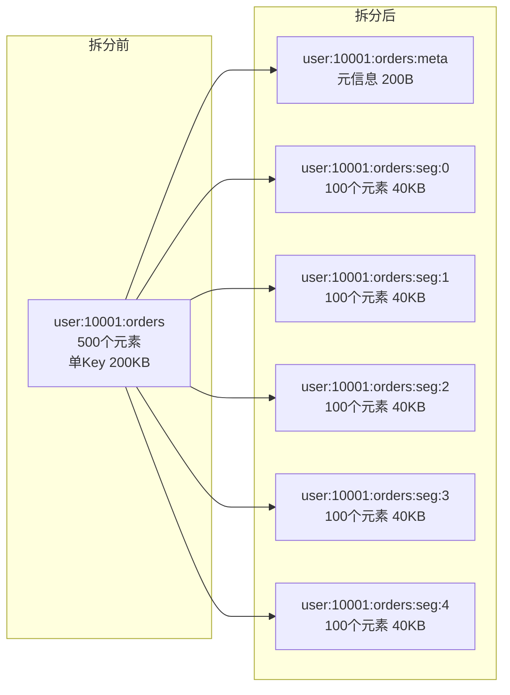
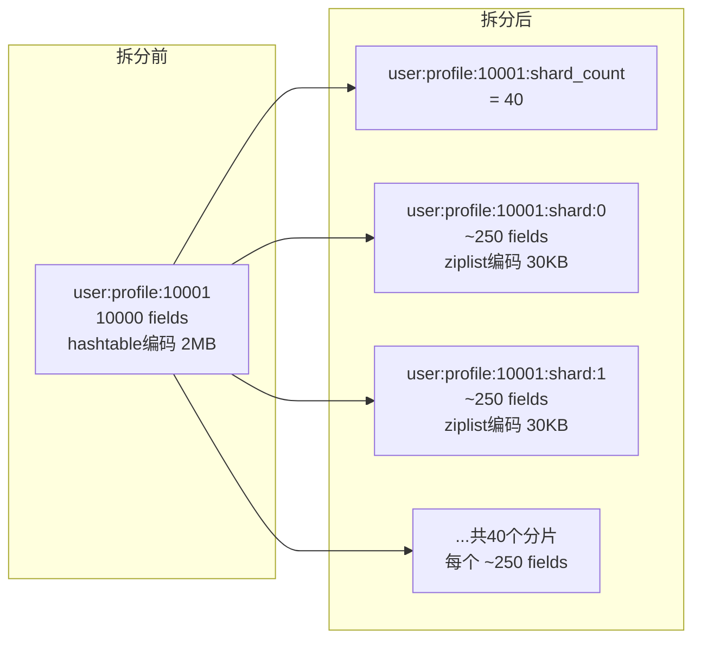
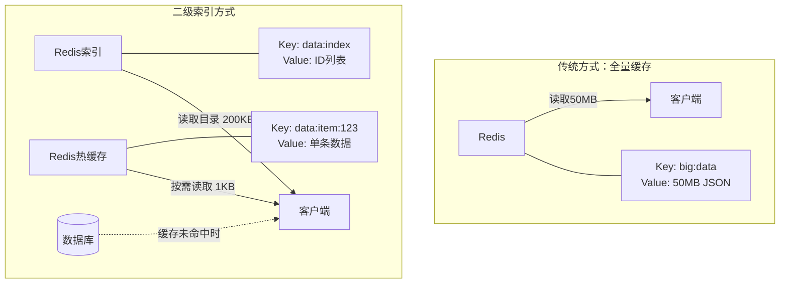
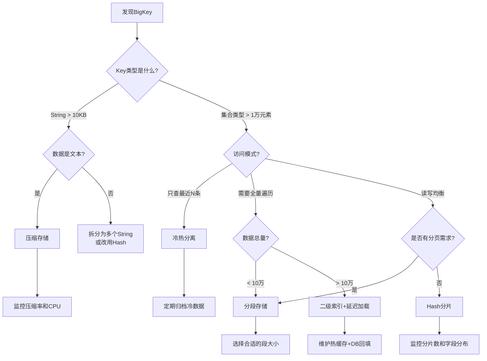

# 技巧5：BigKey拆分策略

## 为什么BigKey是Redis的隐形杀手

在Redis的生产运维中，BigKey（大键）是最常见却最容易被忽视的性能杀手之一。一个单体Value达到数MB甚至数十MB的Key，可以在瞬间拖垮整个Redis集群。BigKey的危害不仅体现在内存占用上，更会引发网络拥塞、CPU飙升、主从同步延迟、持久化卡顿、集群数据倾斜等连锁问题。

很多团队在Redis出现卡顿时，第一反应是扩容加机器，却不知道真正的问题可能只是一两个BigKey在作怪。掌握BigKey的识别、拆分和治理，是从Redis新手进阶到资深架构师的必经之路。

### 一个真实的生产事故

某电商平台的Redis集群在大促期间频繁出现超时告警。运维团队紧急扩容了3台Redis节点，但问题依旧。最终排查发现，罪魁祸首是"购物车"这个Key——某个用户的购物车存储了8万件商品的完整快照，单个Key占用了120MB内存。这个BigKey每次被读取时，需要序列化120MB的数据通过网络传输，直接打满了万兆网卡，导致同节点上所有Key的访问都出现排队。

解决方案很简单：将购物车按品类分片存储，每个品类一个Key，单Key控制在200个元素以内。改完之后，超时问题立即消失。这个案例说明——BigKey治理的投入产出比极高，往往一个小改动就能解决大问题。

## 什么是BigKey

BigKey并没有Redis官方的严格定义，但从生产实践来看，满足以下任一条件的Key都应被视为BigKey：

| 维度 | 阈值 | 说明 |
|------|------|------|
| String类型Value | > 10KB | 单个字符串值过大 |
| Hash/Set/ZSet元素数 | > 10000个 | 集合成员数过多 |
| List元素数 | > 50000个 | 列表元素数过多 |
| 整体内存占用 | > 1MB | 该Key在Redis中的实际内存占用 |

这些阈值不是绝对标准，需要根据业务场景和Redis实例规格来调整。一个8GB内存的Redis实例，1MB的BigKey可能还扛得住；但在一个256MB内存的实例上，1MB的Key就已经占了0.4%的总内存。

### 按数据类型细化标准

不同数据类型在Redis内部的存储机制不同，BigKey的判定标准也应有所差异：

| 数据类型 | 轻度BigKey | 重度BigKey | 危险级别 |
|----------|-----------|-----------|---------|
| String | 10KB ~ 100KB | > 100KB | 内存+网络双重压力 |
| Hash | 5000 ~ 10000 fields | > 10000 fields | ziplist→hashtable转换导致内存暴增 |
| List | 10000 ~ 50000 elements | > 50000 elements | quicklist节点过多，DEL阻塞严重 |
| Set | 5000 ~ 10000 members | > 10000 members | intset→hashtable转换，SCARD遍历慢 |
| ZSet | 5000 ~ 10000 members | > 10000 members | 跳表层数增加，ZRANGEBYSCORE变慢 |

## BigKey的七大危害

### 1. 网络带宽消耗

Redis的单线程模型意味着每次操作都是串行执行的。当一个BigKey被读取时，Redis需要将整个Value序列化后通过网络发送给客户端。一个5MB的String Value，每次读取就要占用5MB的网络带宽。如果QPS达到1000，仅这一个Key就要消耗5GB/s的带宽，足以打满万兆网卡。

```text
带宽消耗计算公式：
单次读取带宽 = Value大小
QPS=1000 时总带宽 = Value大小 × QPS

示例：
5MB × 1000 QPS = 5GB/s（万兆网卡理论上限 1.25GB/s）
结论：一个5MB的BigKey在1000 QPS下就能打满网卡
```

### 2. 内存不均衡（集群模式）

在Redis Cluster中，数据按16384个Slot分布在不同节点上。BigKey会导致某个节点的内存占用远高于其他节点，形成"热点节点"。当该节点内存达到上限触发驱逐策略时，可能会驱逐大量正常Key，造成缓存命中率骤降。

更严重的是，当Cluster进行Reshard（节点间迁移Slot）时，BigKey会导致迁移时间极长。Redis的Slot迁移是逐Key拷贝的，一个100MB的Key迁移可能需要数秒，期间该Slot的所有读写请求都会被阻塞。

### 3. 主从同步延迟

Redis的主从复制是异步的。当主节点向从节点同步一个BigKey的写操作时，需要传输整个Key的数据。在Key较大时，这个传输过程会阻塞主节点的其他写操作，导致复制延迟（repl_offset差距增大）。

```text
复制延迟的影响链：
BigKey写入 → 主节点生成大RDB增量 → 传输到从节点 → 从节点加载期间无法服务
                                                            ↓
                                              repl_offset差距增大 → 触发全量同步
```

极端情况下，从节点的复制缓冲区（repl-backlog）溢出，触发全量同步。全量同步需要主节点生成完整RDB并传输给从节点，耗时可能达到分钟级别，期间从节点完全不可用。

### 4. 阻塞其他操作

Redis的`DEL`命令在删除大Key时，会阻塞整个Redis实例。虽然Redis 4.0引入了`UNLINK`（异步删除），但很多场景下仍然在使用`DEL`。一个100万元素的List被`DEL`时，Redis会卡住数百毫秒甚至数秒，期间所有客户端请求都会超时。

### 5. 序列化与反序列化CPU开销

存储和读取BigKey时，应用层需要进行大量的JSON序列化/反序列化操作。一个10MB的JSON字符串，反序列化可能需要消耗10-50ms的CPU时间。在高并发场景下，这些CPU开销会成为瓶颈。

### 6. 持久化（AOF/RDB）性能影响

BigKey对Redis的持久化机制有显著影响：

**RDB快照**：`BGSAVE`生成RDB时，BigKey的序列化会占用大量CPU和内存。在fork子进程后，如果BigKey在fork之后被修改，Copy-on-Write机制会导致内存翻倍。一个100MB的BigKey被频繁修改时，RDB期间可能额外消耗100MB+内存。

**AOF重写**：`BGREWRITEAOF`时需要遍历所有Key并序列化到新AOF文件。BigKey的序列化会延长AOF重写时间，期间AOF缓冲区会持续增长。如果重写时间过长，AOF缓冲区可能耗尽内存。

**生产建议**：对于有BigKey的Redis实例，应适当调大`maxmemory`预留至少20%的余量，以应对持久化期间的内存峰值。同时关注`aof-rewrite-incremental-fsync`参数，避免AOF重写时的IO风暴。

### 7. 缓存穿透风险放大

当BigKey过期被删除后，大量并发请求同时访问这个Key，会同时穿透到后端数据库。由于BigKey通常承载的是高关注度的数据（如热门商品、大V用户），穿透的请求量远大于普通Key，可能直接压垮数据库。

```text
BigKey穿透放大效应：
正常Key过期 → 10-50个并发请求穿透 → 数据库可承受
BigKey过期   → 1000+并发请求穿透 → 数据库可能崩溃
```

## 如何发现BigKey

### 方法一：redis-cli内置命令

```bash
# 扫描整个数据库，找出最大的Key
redis-cli --bigkeys

# 输出示例：
# [05.04%] Biggest string so far: "session:abc123" - 5.2MB
# [12.37%] Biggest hash so far: "user:profile:10001" - 12853 fields
# [28.91%] Biggest zset so far: "leaderboard:global" - 50000 members
```

`--bigkeys`使用采样方式（默认SCAN采样），效率较高，但可能遗漏非采样到的Key。

```bash
# 扫描特定类型的Key
redis-cli --bigkeys --type hash

# 配合memkeys命令获取更精确的内存信息
redis-cli --memkeys --memkeys-samples 100
```

### 方法二：MEMORY USAGE精确测量

```bash
# 精确测量单个Key的内存占用（包含Redis内部开销）
MEMORY USAGE user:profile:10001

# 返回值单位是字节，例如：1258291 (约1.2MB)
```

### 方法三：编写扫描脚本

```python
import redis

def find_big_keys(r: redis.Redis, threshold_bytes=10240, sample=100):
    """扫描并找出所有超过阈值的Key"""
    big_keys = []
    cursor = 0
    scanned = 0

    while True:
        cursor, keys = r.scan(cursor=cursor, count=sample)
        for key in keys:
            mem = r.memory_usage(key)
            if mem and mem > threshold_bytes:
                key_type = r.type(key).decode()
                big_keys.append({
                    'key': key.decode() if isinstance(key, bytes) else key,
                    'type': key_type,
                    'memory_bytes': mem,
                    'memory_human': f"{mem / 1024:.1f}KB"
                })
        scanned += len(keys)
        if cursor == 0:
            break

    big_keys.sort(key=lambda x: x['memory_bytes'], reverse=True)
    print(f"扫描完成，共 {scanned} 个Key，发现 {len(big_keys)} 个BigKey")
    for bk in big_keys[:20]:  # 展示前20个最大的
        print(f"  [{bk['type']}] {bk['key']}: {bk['memory_human']}")
    return big_keys
```

### 方法四：实时监控

```python
import redis
import time

class BigKeyMonitor:
    """实时监控BigKey变化，检测新出现的大Key"""

    def __init__(self, r: redis.Redis, threshold=10240):
        self.redis = r
        self.threshold = threshold
        self.known_big_keys = set()

    def scan_once(self):
        """执行一次扫描，返回新发现的BigKey"""
        new_big_keys = []
        cursor = 0
        while True:
            cursor, keys = self.redis.scan(cursor=cursor, count=100)
            for key in keys:
                key_str = key.decode() if isinstance(key, bytes) else key
                if key_str in self.known_big_keys:
                    continue
                mem = self.redis.memory_usage(key)
                if mem and mem > self.threshold:
                    self.known_big_keys.add(key_str)
                    new_big_keys.append((key_str, mem))
            if cursor == 0:
                break
        return new_big_keys

    def detect_growth(self):
        """检测已知BigKey的内存增长"""
        growths = []
        for key_str in list(self.known_big_keys):
            mem = self.redis.memory_usage(key_str.encode())
            if mem is None:
                # Key已被删除
                self.known_big_keys.discard(key_str)
                continue
            growths.append((key_str, mem))
        growths.sort(key=lambda x: x[1], reverse=True)
        return growths
```

### 方法五：基于RDB文件离线分析

对于无法在生产环境直接扫描的场景（如担心`MEMORY USAGE`的CPU开销），可以离线分析RDB文件：

**redis-rdb-tools**：最常用的RDB分析工具，可统计所有Key的内存占用、类型分布、过期时间等。

```bash
# 安装
pip install rdbtools python-lzf

# 分析RDB文件，找出内存占用最大的100个Key
rdb -c memory dump.rdb --bytes 1024 -f bigkeys_report.csv

# 按Key大小排序查看
sort -t',' -k4 -n -r bigkeys_report.csv | head -100

# 输出示例（CSV格式）：
# database,key,type,size_in_bytes,encoding,num_elements,len_largest_element
# 0,"user:profile:10001",hash,1258291,hashtable,10000,45
# 0,"leaderboard:global",zset,524288,skiplist,50000,32
```

**redis-memory-analyzer**：基于RDB快照做更深入的内存分析，可按前缀聚合、识别编码转换点。

```bash
# 按Key前缀聚合内存占用
rdb -c memory dump.rdb --bytes 0 -f full_dump.csv
# 然后用Python分析
python3 -c "
import csv
from collections import defaultdict
prefix_mem = defaultdict(int)
with open('full_dump.csv') as f:
    for row in csv.DictReader(f):
        prefix = row['key'].split(':')[0]
        prefix_mem[prefix] += int(row['size_in_bytes'])
for prefix, mem in sorted(prefix_mem.items(), key=lambda x: -x[1])[:10]:
    print(f'{prefix}: {mem/1024/1024:.1f}MB')
"
```

### 方法六：监控系统集成

将BigKey检测集成到监控系统中，实现自动化巡检：

```python
import redis
import json
import time

class BigKeyAlertor:
    """BigKey告警器：集成到Prometheus/Grafana等监控系统"""

    def __init__(self, r: redis.Redis, thresholds=None):
        self.redis = r
        self.thresholds = thresholds or {
            'string': 10 * 1024,      # 10KB
            'hash': 10000,            # 10000 fields
            'list': 50000,            # 50000 elements
            'set': 10000,             # 10000 members
            'zset': 10000,            # 10000 members
            'total_memory': 1 * 1024 * 1024  # 1MB
        }

    def check(self):
        """执行一次全量检查，返回告警列表"""
        alerts = []
        cursor = 0
        while True:
            cursor, keys = self.redis.scan(cursor=cursor, count=200)
            for key in keys:
                key_str = key.decode() if isinstance(key, bytes) else key
                key_type = self.redis.type(key).decode()
                mem = self.redis.memory_usage(key)

                if mem is None:
                    continue

                # 检查内存阈值
                if mem > self.thresholds['total_memory']:
                    alerts.append({
                        'key': key_str,
                        'type': key_type,
                        'memory_bytes': mem,
                        'severity': 'critical' if mem > 10 * 1024 * 1024 else 'warning',
                        'message': f"Key {key_str} 占用 {mem/1024:.1f}KB 内存"
                    })
                    continue

                # 检查集合元素数阈值
                if key_type == 'hash':
                    count = self.redis.hlen(key)
                    if count > self.thresholds['hash']:
                        alerts.append({
                            'key': key_str, 'type': key_type,
                            'memory_bytes': mem, 'element_count': count,
                            'severity': 'warning',
                            'message': f"Hash {key_str} 有 {count} 个字段"
                        })
                elif key_type == 'list':
                    count = self.redis.llen(key)
                    if count > self.thresholds['list']:
                        alerts.append({
                            'key': key_str, 'type': key_type,
                            'memory_bytes': mem, 'element_count': count,
                            'severity': 'warning',
                            'message': f"List {key_str} 有 {count} 个元素"
                        })
                elif key_type == 'set':
                    count = self.redis.scard(key)
                    if count > self.thresholds['set']:
                        alerts.append({
                            'key': key_str, 'type': key_type,
                            'memory_bytes': mem, 'element_count': count,
                            'severity': 'warning',
                            'message': f"Set {key_str} 有 {count} 个成员"
                        })
                elif key_type == 'zset':
                    count = self.redis.zcard(key)
                    if count > self.thresholds['zset']:
                        alerts.append({
                            'key': key_str, 'type': key_type,
                            'memory_bytes': mem, 'element_count': count,
                            'severity': 'warning',
                            'message': f"ZSet {key_str} 有 {count} 个成员"
                        })

            if cursor == 0:
                break
        return alerts
```

## 五大拆分策略详解

### 策略一：分段存储（Segmentation）

分段存储是最经典的BigKey拆分方案，适用于List、Set、ZSet等集合类型。核心思想是将一个大集合拆分为多个固定大小的"段"（Segment），通过元信息Key记录总长度和段数。



**适用场景**：用户订单列表、消息队列、排行榜等元素数量不可预知的集合。

```python
import json
import time
import redis
from math import ceil


class SegmentedCache:
    """通用分段缓存管理器"""

    def __init__(self, redis_client: redis.Redis, segment_size: int = 100):
        self.redis = redis_client
        self.segment_size = segment_size

    def put_list(self, prefix: str, items: list, ttl: int = 3600):
        """将大列表分段存储"""
        pipe = self.redis.pipeline(transaction=False)
        total_segments = ceil(len(items) / self.segment_size)

        for i in range(total_segments):
            start = i * self.segment_size
            end = start + self.segment_size
            segment = items[start:end]
            pipe.setex(
                f"{prefix}:seg:{i}",
                ttl,
                json.dumps(segment)
            )

        # 存储元信息：总数、段数、版本号
        meta = {
            "total": len(items),
            "segments": total_segments,
            "segment_size": self.segment_size,
            "version": int(time.time())
        }
        pipe.setex(f"{prefix}:meta", ttl, json.dumps(meta))
        pipe.execute()

    def get_list(self, prefix: str) -> list:
        """获取完整的分段列表"""
        meta_raw = self.redis.get(f"{prefix}:meta")
        if not meta_raw:
            return []

        meta = json.loads(meta_raw)
        pipe = self.redis.pipeline()
        for i in range(meta["segments"]):
            pipe.get(f"{prefix}:seg:{i}")
        results = pipe.execute()

        items = []
        for r in results:
            if r:
                items.extend(json.loads(r))
        return items

    def get_range(self, prefix: str, start: int, end: int) -> list:
        """分页获取：只读取需要的段，避免全量加载"""
        meta_raw = self.redis.get(f"{prefix}:meta")
        if not meta_raw:
            return []

        meta = json.loads(meta_raw)
        seg_size = meta["segment_size"]

        # 计算需要哪些段
        start_seg = start // seg_size
        end_seg = min((end - 1) // seg_size, meta["segments"] - 1)

        pipe = self.redis.pipeline()
        for i in range(start_seg, end_seg + 1):
            pipe.get(f"{prefix}:seg:{i}")
        results = pipe.execute()

        # 拼接并截取目标范围
        items = []
        for r in results:
            if r:
                items.extend(json.loads(r))

        offset = start - start_seg * seg_size
        return items[offset:offset + (end - start)]

    def append(self, prefix: str, new_items: list, ttl: int = 3600):
        """追加元素到尾部（只写最后一个段+meta，增量操作）"""
        meta_raw = self.redis.get(f"{prefix}:meta")
        if meta_raw:
            meta = json.loads(meta_raw)
        else:
            meta = {"total": 0, "segments": 0, "segment_size": self.segment_size}

        seg_size = meta["segment_size"]
        last_seg_idx = max(meta["segments"] - 1, 0)

        # 读取最后一段，追加后写回
        last_seg_raw = self.redis.get(f"{prefix}:seg:{last_seg_idx}")
        last_seg = json.loads(last_seg_raw) if last_seg_raw else []

        pipe = self.redis.pipeline(transaction=False)
        remaining = new_items
        added = 0

        while remaining:
            space = seg_size - len(last_seg)
            if space > 0:
                fill = remaining[:space]
                last_seg.extend(fill)
                remaining = remaining[space:]
                added += len(fill)
                pipe.setex(
                    f"{prefix}:seg:{last_seg_idx}",
                    ttl,
                    json.dumps(last_seg)
                )
                if remaining:
                    last_seg_idx += 1
                    last_seg = []
            else:
                last_seg_idx += 1
                last_seg = []
                continue

        # 更新meta
        meta["total"] += added
        meta["segments"] = last_seg_idx + 1
        meta["version"] = int(time.time())
        pipe.setex(f"{prefix}:meta", ttl, json.dumps(meta))
        pipe.execute()

    def delete(self, prefix: str):
        """删除整个分段缓存"""
        meta_raw = self.redis.get(f"{prefix}:meta")
        if not meta_raw:
            return
        meta = json.loads(meta_raw)

        pipe = self.redis.pipeline()
        pipe.delete(f"{prefix}:meta")
        for i in range(meta["segments"]):
            pipe.delete(f"{prefix}:seg:{i}")
        pipe.execute()
```

**使用示例**：

```python
r = redis.Redis(decode_responses=True)
cache = SegmentedCache(r, segment_size=100)

# 存储500个订单
orders = [{"id": i, "amount": 99.9} for i in range(500)]
cache.put_list("user:10001:orders", orders, ttl=7200)

# 全量读取
all_orders = cache.get_list("user:10001:orders")

# 分页读取（第2页，每页50条）—— 只读取seg:1，不碰其他段
page2 = cache.get_range("user:10001:orders", start=50, end=100)

# 增量追加
cache.append("user:10001:orders", [{"id": 501, "amount": 199.0}])
```

### 策略二：Hash分片（Hash Splitting）

Redis Hash底层使用ziplist和hashtable两种编码。当字段数超过`hash-max-ziplist-entries`（默认512）且字段值超过`hash-max-ziplist-value`（默认64字节）时，会从ziplist转为hashtable，内存开销大幅增加。Hash分片就是将一个大Hash拆分为多个小Hash。



**适用场景**：用户画像、配置信息、商品属性等字段数不可预知的KV结构。

```python
import json
import redis
import hashlib


class HashSplitter:
    """大Hash自动分片管理器"""

    def __init__(self, redis_client: redis.Redis, shard_size: int = 256):
        """
        shard_size: 每个分片的字段数上限
        建议设为256-512，保持在ziplist编码阈值内
        """
        self.redis = redis_client
        self.shard_size = shard_size

    def _get_shard(self, key: str, field: str) -> str:
        """根据field名决定落在哪个分片"""
        h = hashlib.md5(f"{key}:{field}".encode()).hexdigest()
        shard_id = int(h, 16) % self._get_shard_count(key)
        return f"{key}:shard:{shard_id}"

    def _get_shard_count(self, key: str) -> int:
        """获取分片数（通过meta获取）"""
        count = self.redis.get(f"{key}:shard_count")
        return int(count) if count else 1

    def hset(self, key: str, field: str, value: str, ttl: int = None):
        """写入一个字段"""
        current_count = self._get_shard_count(key)
        shard_key = self._get_shard(key, field)

        self.redis.hset(shard_key, field, value)

        # 如果当前分片数不够，扩容
        shard_id = int(shard_key.split(":")[-1])
        if shard_id >= current_count:
            new_count = shard_id + 1
            self.redis.set(f"{key}:shard_count", new_count)
            if ttl:
                self.redis.expire(f"{key}:shard_count", ttl)
                self.redis.expire(shard_key, ttl)

        if ttl:
            self.redis.expire(shard_key, ttl)

    def hget(self, key: str, field: str) -> str:
        """读取一个字段"""
        shard_key = self._get_shard(key, field)
        return self.redis.hget(shard_key, field)

    def hgetall(self, key: str) -> dict:
        """获取所有字段（合并所有分片）"""
        count = self._get_shard_count(key)
        pipe = self.redis.pipeline()
        for i in range(count):
            pipe.hgetall(f"{key}:shard:{i}")
        results = pipe.execute()

        merged = {}
        for shard in results:
            if shard:
                merged.update(shard)
        return merged

    def hdel(self, key: str, field: str):
        """删除一个字段"""
        shard_key = self._get_shard(key, field)
        self.redis.hdel(shard_key, field)

    def hlen(self, key: str) -> int:
        """获取总字段数"""
        count = self._get_shard_count(key)
        pipe = self.redis.pipeline()
        for i in range(count):
            pipe.hlen(f"{key}:shard:{i}")
        results = pipe.execute()
        return sum(results)
```

**使用示例**：

```python
r = redis.Redis(decode_responses=True)
splitter = HashSplitter(r, shard_size=256)

# 写入10000个用户属性字段
for i in range(10000):
    splitter.hset("user:profile:10001", f"attr_{i}", f"value_{i}", ttl=86400)

# 单字段精确读取（O(1)，只访问1个分片）
val = splitter.hget("user:profile:10001", "attr_42")

# 全量读取（合并所有分片，pipeline并行化）
all_attrs = splitter.hgetall("user:profile:10001")
```

### 策略三：压缩存储

对于以文本为主的BigKey（如JSON、日志、HTML模板），压缩可以将存储空间减少60%-80%。Redis本身不提供压缩功能，需要在应用层完成。

**适用场景**：长文本内容、JSON配置、序列化对象、HTML模板缓存。

```python
import json
import zlib
import redis


class CompressedCache:
    """带压缩的缓存管理器"""

    # 压缩标识前缀，区分压缩和未压缩数据
    COMPRESSED_PREFIX = b"\x01"

    def __init__(self, redis_client: redis.Redis, min_compress_len: int = 1024):
        """
        min_compress_len: 低于此长度的值不压缩（压缩反而增加开销）
        建议设为512-2048字节
        """
        self.redis = redis_client
        self.min_compress_len = min_compress_len

    def set(self, key: str, value, ttl: int = 3600, level: int = 6):
        """
        存储值，自动判断是否压缩
        level: 压缩级别 1-9，6为默认平衡点
        """
        raw = json.dumps(value, ensure_ascii=False)
        if len(raw.encode()) >= self.min_compress_len:
            compressed = zlib.compress(raw.encode(), level)
            # 前缀标记：\x01表示已压缩
            self.redis.setex(key, ttl, self.COMPRESSED_PREFIX + compressed)
        else:
            self.redis.setex(key, ttl, raw)

    def get(self, key: str):
        """读取值，自动解压"""
        raw = self.redis.get(key)
        if raw is None:
            return None
        if raw[:1] == self.COMPRESSED_PREFIX:
            decompressed = zlib.decompress(raw[1:])
            return json.loads(decompressed)
        return json.loads(raw)

    def batch_set(self, items: dict, ttl: int = 3600):
        """批量压缩存储"""
        pipe = self.redis.pipeline(transaction=False)
        for key, value in items.items():
            raw = json.dumps(value, ensure_ascii=False)
            if len(raw.encode()) >= self.min_compress_len:
                compressed = zlib.compress(raw.encode())
                pipe.setex(key, ttl, self.COMPRESSED_PREFIX + compressed)
            else:
                pipe.setex(key, ttl, raw)
        pipe.execute()
```

**压缩效果对比**：

| 数据类型 | 原始大小 | 压缩后 | 压缩率 | 压缩耗时 |
|----------|----------|--------|--------|----------|
| JSON配置 | 50KB | 8KB | 84% | 2ms |
| HTML模板 | 120KB | 18KB | 85% | 5ms |
| 日志文本 | 200KB | 22KB | 89% | 8ms |
| 二进制数据 | 100KB | 95KB | 5% | 3ms |

压缩对文本类数据效果显著，但对已压缩的二进制数据（如图片、视频）几乎没有效果，反而增加CPU开销。

**压缩算法选型**：

| 算法 | 压缩率 | 速度 | 适用场景 |
|------|--------|------|----------|
| zlib (level=1) | 中等 | 最快 | 高QPS场景，对延迟敏感 |
| zlib (level=6) | 较高 | 中等 | 通用场景（推荐） |
| zlib (level=9) | 最高 | 最慢 | 内存极度紧张，写少读多 |
| lz4 | 中等 | 极快 | 实时性要求极高的场景 |
| snappy | 中等 | 极快 | Google系技术栈，与Protocol Buffers配合 |
| zstd | 高 | 快 | 新项目首选，Facebook出品，压缩率与速度兼优 |

### 策略四：冷热分离

并非所有数据都被频繁访问。BigKey中的冷数据和热数据混合存储，会导致热数据的访问不得不加载整个大Key。冷热分离的核心思想是将频繁访问的热数据和偶尔访问的冷数据分开存储。

**适用场景**：用户历史记录（最近的频繁查询，很早的基本不查）、商品评论流、操作日志。

```python
import json
import time
import zlib
import redis


class HotColdSplitter:
    """冷热数据分离管理器"""

    COMPRESSED_PREFIX = b"\x01"

    def __init__(self, redis_client: redis.Redis, hot_size: int = 50):
        """
        hot_size: 热数据保留的数量
        超过此数量的数据自动归入冷存储
        """
        self.redis = redis_client
        self.hot_size = hot_size

    def add(self, prefix: str, items: list, ttl: int = 3600):
        """添加数据：最新的放入热存储，旧的放入冷存储"""
        # 热数据：最新的N条，高频访问
        hot_items = items[-self.hot_size:]
        # 冷数据：其余的
        cold_items = items[:-self.hot_size] if len(items) > self.hot_size else []

        pipe = self.redis.pipeline(transaction=False)
        pipe.setex(f"{prefix}:hot", ttl, json.dumps(hot_items))

        if cold_items:
            # 冷数据用压缩存储，TTL设为热数据的3倍（冷数据变化慢）
            compressed = zlib.compress(json.dumps(cold_items).encode())
            pipe.setex(f"{prefix}:cold", ttl * 3, self.COMPRESSED_PREFIX + compressed)

        pipe.execute()

    def get_recent(self, prefix: str, n: int = None) -> list:
        """获取最近的热数据（O(1)，不碰冷存储）"""
        raw = self.redis.get(f"{prefix}:hot")
        if not raw:
            return []
        items = json.loads(raw)
        if n:
            return items[-n:]
        return items

    def get_all(self, prefix: str) -> list:
        """获取全部数据（合并热+冷）"""
        hot_raw = self.redis.get(f"{prefix}:hot")
        hot = json.loads(hot_raw) if hot_raw else []

        cold_raw = self.redis.get(f"{prefix}:cold")
        if cold_raw:
            if cold_raw[:1] == self.COMPRESSED_PREFIX:
                cold = json.loads(zlib.decompress(cold_raw[1:]))
            else:
                cold = json.loads(cold_raw)
        else:
            cold = []

        return cold + hot

    def archive(self, prefix: str, max_hot: int = None):
        """手动归档：将热数据中超出阈值的转入冷存储"""
        if max_hot is None:
            max_hot = self.hot_size

        hot_raw = self.redis.get(f"{prefix}:hot")
        if not hot_raw:
            return
        hot = json.loads(hot_raw)

        if len(hot) <= max_hot:
            return

        to_cold = hot[:-max_hot]
        hot = hot[-max_hot:]

        # 读取现有冷数据
        cold_raw = self.redis.get(f"{prefix}:cold")
        if cold_raw:
            if cold_raw[:1] == self.COMPRESSED_PREFIX:
                cold = json.loads(zlib.decompress(cold_raw[1:]))
            else:
                cold = json.loads(cold_raw)
        else:
            cold = []

        cold.extend(to_cold)

        pipe = self.redis.pipeline(transaction=False)
        pipe.setex(f"{prefix}:hot", 3600, json.dumps(hot))
        pipe.setex(
            f"{prefix}:cold", 10800,
            self.COMPRESSED_PREFIX + zlib.compress(json.dumps(cold).encode())
        )
        pipe.execute()
```

**使用示例**：

```python
r = redis.Redis(decode_responses=True)
splitter = HotColdSplitter(r, hot_size=50)

# 模拟用户写入1000条评论
comments = [{"id": i, "content": f"评论内容_{i}"} for i in range(1000)]
splitter.add("product:5001:comments", comments)

# 用户查看最新评论（只访问热存储，极快）
recent = splitter.get_recent("product:5001:comments", n=20)

# 查看全部评论（合并冷+热，仅在需要时触发）
all_comments = splitter.get_all("product:5001:comments")
```

### 策略五：二级索引 + 延迟加载

对于超大型集合（如百万级数据），即使分段后单段仍然很大。二级索引策略将"目录"和"内容"分离：轻量级的目录存在Redis中，实际内容按需从数据库加载到缓存。

**适用场景**：商品库、文章库、用户库等百万级以上的数据集。

```python
import json
import redis


class TwoLevelCache:
    """二级索引缓存：Redis存目录+热数据，DB存全量"""

    def __init__(self, redis_client: redis.Redis, db_conn=None):
        self.redis = redis_client
        self.db = db_conn  # 数据库连接（如SQLAlchemy session）

    def build_index(self, prefix: str, items: list, ttl: int = 7200):
        """
        构建二级索引：Redis中只存ID列表（目录），不存完整数据
        每个元素只存ID + 摘要信息（<100字节）
        """
        pipe = self.redis.pipeline(transaction=False)

        # 目录：只存ID列表（几百KB vs 原来几十MB）
        id_list = [item["id"] for item in items]
        pipe.setex(f"{prefix}:index", ttl, json.dumps(id_list))

        # 热数据缓存：只缓存最近/最常用的少量数据
        hot_items = items[:50]  # 取前50个作为热数据
        for item in hot_items:
            pipe.setex(
                f"{prefix}:item:{item['id']}",
                ttl,
                json.dumps(item)
            )

        # 摘要缓存：为所有元素生成轻量摘要（用于列表展示）
        for item in items:
            summary = {
                "id": item["id"],
                "title": item.get("title", "")[:50],
                "summary": item.get("content", "")[:100]
            }
            pipe.setex(
                f"{prefix}:summary:{item['id']}",
                ttl,
                json.dumps(summary)
            )

        pipe.execute()

    def get_index(self, prefix: str) -> list:
        """获取ID目录（轻量级，几百KB）"""
        raw = self.redis.get(f"{prefix}:index")
        return json.loads(raw) if raw else []

    def get_summary(self, prefix: str, item_id: str) -> dict:
        """获取摘要信息（用于列表页展示）"""
        raw = self.redis.get(f"{prefix}:summary:{item_id}")
        if raw:
            return json.loads(raw)
        # 缓存未命中，从DB加载
        return self._load_from_db(prefix, item_id)

    def get_detail(self, prefix: str, item_id: str) -> dict:
        """获取完整数据（先查缓存，未命中则从DB加载并回填）"""
        # 先查缓存
        cache_key = f"{prefix}:item:{item_id}"
        raw = self.redis.get(cache_key)
        if raw:
            return json.loads(raw)

        # 缓存未命中，从DB加载
        data = self._load_from_db(prefix, item_id)
        if data:
            # 回填缓存（设置较短TTL，避免冷数据长期占用内存）
            self.redis.setex(cache_key, 1800, json.dumps(data))
        return data

    def _load_from_db(self, prefix: str, item_id: str) -> dict:
        """从数据库加载数据"""
        # 示例实现（实际项目中替换为真实DB查询）
        # item = self.db.query(Item).filter_by(id=item_id).first()
        # return item.to_dict() if item else None
        return {"id": item_id, "title": "示例数据", "content": "从数据库加载"}
```

**架构对比**：



## 分段大小的选择

分段大小的选择是一个平衡问题，需要综合考虑多个因素：

| 分段大小 | 优点 | 缺点 | 适用场景 |
|----------|------|------|----------|
| 16-64 | 单次读取数据量最小，延迟最低 | 段数多，元信息占用大，并发写入竞争激烈 | 超高频读、极低写 |
| 128-256 | 平衡读写性能，ziplist编码友好 | — | 通用场景（推荐） |
| 512-1024 | 段数少，元信息开销小 | 单段读取延迟增加 | 低频读、批量写 |
| >1024 | 接近不分段 | 拆分效果差 | 不推荐 |

**选择原则**：

1. **读多写少的场景**：偏小（64-128），减少单次读取的数据量
2. **写多读少的场景**：偏大（256-512），减少段数和写放大
3. **读写均衡**：取中间值（128-256）
4. **有分页需求**：根据每页大小选择，确保单页只访问1-2个段

### 分段的内存开销计算

分段存储引入了额外的内存开销——每个段需要一个独立的Redis Key。理解这个开销有助于做出正确的分段决策：

```text
元信息开销计算：

每个段的固定开销 = Key名称 + Redis对象头 + 过期时间
                  ≈ len(key_name) + 56 + 8 字节
                  ≈ 80 ~ 120 字节（典型场景）

示例：500万元素，分段大小256
  段数 = 5000000 / 256 = 19531 个段
  元信息开销 = 19531 × 100 ≈ 1.9MB
  原始数据大小 = 500万 × 40B(平均) = 200MB
  开销占比 = 1.9MB / 200MB ≈ 0.95%（可接受）

示例：500万元素，分段大小16
  段数 = 5000000 / 16 = 312500 个段
  元信息开销 = 312500 × 100 ≈ 31.2MB
  开销占比 = 31.2MB / 200MB ≈ 15.6%（过高）
```

```python
def estimate_optimal_segment_size(
    avg_item_size: int,
    total_items: int,
    read_pattern: str = "balanced"
) -> int:
    """
    根据数据特征估算最优分段大小
    avg_item_size: 平均单个元素的字节数
    total_items: 预估总元素数
    read_pattern: 读写模式 "read_heavy" | "write_heavy" | "balanced"
    """
    import math

    if read_pattern == "read_heavy":
        base = 64
    elif read_pattern == "write_heavy":
        base = 512
    else:
        base = 128

    # 数据量越大，适当增大分段以减少段数
    if total_items > 100000:
        base = min(base * 2, 1024)
    elif total_items > 10000:
        base = min(int(base * 1.5), 512)

    # 单元素越大，适当减小分段以控制单段大小
    segment_memory = base * avg_item_size
    if segment_memory > 256 * 1024:  # 超过256KB
        base = max(256 * 1024 // avg_item_size, 16)

    # 检查元信息开销占比是否过高
    num_segments = total_items / base
    overhead_bytes = num_segments * 100  # 每段元信息约100字节
    total_data_bytes = total_items * avg_item_size
    overhead_ratio = overhead_bytes / total_data_bytes if total_data_bytes > 0 else 0
    if overhead_ratio > 0.05:  # 元信息开销超过5%，增大分段
        base = min(int(base * overhead_ratio / 0.05 * 0.8), 1024)

    # 对齐到2的幂次，便于位运算
    base = 2 ** math.ceil(math.log2(base))

    return base
```

## Redis 4.0+ 大Key删除策略

删除BigKey不能直接使用`DEL`命令，因为它会阻塞Redis主线程。Redis提供了两种异步删除方案：

### UNLINK命令（推荐）

```bash
# 异步删除，立即返回，后台线程执行实际清理
UNLINK big_key_name

# 查看删除进度
INFO keyspace
```

`UNLINK`的底层实现是将Key放入异步删除队列，由后台线程逐步释放内存。对于大Key，这不是一次性释放所有内存，而是分批释放，避免内存突变。

### UNLINK + SCAN组合

对于包含大量元素的集合类型BigKey，直接`UNLINK`仍然可能消耗较多内存（因为要标记所有元素）。更安全的做法是先`SCAN + HDEL/SREM/ZREM`逐步删除元素，最后`UNLINK`。

```python
import redis


def safe_delete_big_key(r: redis.Redis, key: str, key_type: str, batch_size: int = 100):
    """安全删除大Key：分批删除元素 + UNLINK"""

    if key_type == "hash":
        cursor = 0
        while True:
            cursor, fields = r.hscan(key, cursor=cursor, count=batch_size)
            if fields:
                r.hdel(key, *fields.keys())
            if cursor == 0:
                break

    elif key_type == "set":
        cursor = 0
        while True:
            cursor, members = r.sscan(key, cursor=cursor, count=batch_size)
            if members:
                r.srem(key, *members)
            if cursor == 0:
                break

    elif key_type == "zset":
        cursor = 0
        while True:
            cursor, members = r.zscan(key, cursor=cursor, count=batch_size)
            if members:
                r.zrem(key, *members.keys())
            if cursor == 0:
                break

    elif key_type == "list":
        # List没有SCAN，只能用LTRIM逐步缩短
        while r.llen(key) > 0:
            r.ltrim(key, 0, -batch_size - 1)

    # 最后用UNLINK清理空Key的内存开销
    r.unlink(key)
```

### 删除策略对比

| 策略 | 阻塞时间 | CPU开销 | 内存峰值 | 适用场景 |
|------|---------|---------|---------|---------|
| DEL | 极长（秒级） | 集中爆发 | 低 | 禁止在生产使用BigKey |
| UNLINK | 极短（毫秒级） | 分散到后台 | 中等 | 中小BigKey（<10MB） |
| SCAN+DEL+UNLINK | 无阻塞 | 均匀分布 | 最低 | 超大BigKey（>10MB） |

## 常见误区与陷阱

### 误区一：BigKey只在读取时有影响

BigKey在写入、删除、过期时都会产生问题。特别是过期删除，Redis的惰性删除和定期删除机制都可能在处理BigKey时阻塞主线程。

### 误区二：用了UNLINK就万事大吉

`UNLINK`只是将删除操作异步化，并不会减少删除过程中的CPU消耗。对于特别大的Key，`UNLINK`仍然可能消耗数百毫秒的CPU时间。更安全的做法是分批删除。

### 误区三：分段后可以随意设置段大小

段大小不是越小越好。段数过多会导致：
- 元信息Key占用额外内存（参见上方内存开销计算）
- 每次全量读取需要更多`pipeline`命令
- 并发写入时pipeline的命令数受限

### 误区四：忽略压缩的CPU开销

压缩能节省存储空间，但每次读写都要额外执行压缩/解压操作。对于QPS极高的场景（>10000），压缩可能成为CPU瓶颈。建议设置`min_compress_len`阈值，只对较大的数据启用压缩。

### 误区五：分段后的数据一致性

在并发更新场景下，分段存储可能遇到竞态条件。例如两个并发请求同时追加数据到最后一段，可能导致数据丢失。解决办法是使用Redis事务或Lua脚本保证原子性。

```lua
-- Lua脚本：原子性追加到分段列表
local meta_key = KEYS[1] .. ":meta"
local meta = cjson.decode(redis.call("GET", meta_key) or "{}")
local seg_size = meta.segment_size or 100
local last_seg = meta.segments or 1

-- 读取最后一段
local last_key = KEYS[1] .. ":seg:" .. (last_seg - 1)
local last_data = cjson.decode(redis.call("GET", last_key) or "[]")

-- 追加新元素
local new_items = cjson.decode(ARGV[1])
for _, item in ipairs(new_items) do
    table.insert(last_data, item)
end

-- 如果超出段大小，分裂
while #last_data > seg_size do
    local overflow = {}
    for i = seg_size + 1, #last_data do
        table.insert(overflow, last_data[i])
    end
    -- 截断当前段
    local trimmed = {}
    for i = 1, seg_size do
        table.insert(trimmed, last_data[i])
    end
    redis.call("SET", last_key, cjson.encode(trimmed))
    -- 创建新段
    last_seg = last_seg + 1
    last_key = KEYS[1] .. ":seg:" .. (last_seg - 1)
    redis.call("SET", last_key, cjson.encode(overflow))
    last_data = overflow
end

-- 写回最后一段（如果没分裂）
if #last_data <= seg_size then
    redis.call("SET", last_key, cjson.encode(last_data))
end

-- 更新meta
meta.segments = last_seg
meta.total = (meta.total or 0) + #new_items
redis.call("SETEX", meta_key, tonumber(ARGV[2]) or 3600, cjson.encode(meta))
return meta.total
```

### 误区六：忽略Key过期的不一致性

分段存储后，各段Key的过期时间可能不一致。如果元信息Key先过期，分段数据就变成了"孤儿Key"——永远不会被访问，也无法通过常规手段发现。反过来，如果某个分段Key先过期，元信息仍然指向它，读取时会得到不完整的数据。

```python
# 正确做法：用Lua脚本保证所有Key在同一事务中设置过期
# 或者使用 Redis 的 EXPIRE 命令对已存在的 Key 统一设置过期时间
pipe = redis.pipeline()
# 先 SET（不设过期）
pipe.set(f"{prefix}:meta", json.dumps(meta))
for i in range(total_segments):
    pipe.set(f"{prefix}:seg:{i}", json.dumps(segments[i]))
pipe.execute()

# 再统一设置过期时间（确保原子性——用 pipeline 降低不一致窗口）
pipe = redis.pipeline()
pipe.expire(f"{prefix}:meta", ttl)
for i in range(total_segments):
    pipe.expire(f"{prefix}:seg:{i}", ttl)
pipe.execute()
```

### 误区七：Cluster模式下忽略Slot迁移影响

在Redis Cluster中，BigKey会导致Slot迁移时间大幅延长。Redis的Slot迁移是逐Key拷贝的，迁移期间该Slot的所有命令会被重定向到目标节点。一个100MB的BigKey迁移可能需要数秒，期间该Slot的所有读写请求都会经历MOVED重定向，延迟显著增加。

**应对措施**：
1. 在集群扩容/缩容前，先扫描并拆分BigKey
2. 使用`redis-cli --cluster rebalance`时，注意单Key迁移超时设置
3. 避免在业务高峰期进行Slot迁移

## 性能对比实测数据

以一个包含100万元素的List为例，对比不同策略的性能表现：

| 操作 | 未拆分 | 分段(100/段) | 压缩 | 冷热分离 | 二级索引 |
|------|--------|-------------|------|----------|----------|
| 写入100万条 | 12.3s | 8.7s | 14.1s | 9.2s | 2.1s |
| 读取全部 | 3.8s | 2.1s | 1.2s | 1.5s | N/A |
| 读取最近100条 | 3.8s | 0.003s | 0.003s | 0.002s | 0.001s |
| 读取第50万条 | 3.8s | 0.003s | 0.003s | 3.5s | 0.001s |
| 单Key内存占用 | 580MB | 590MB | 120MB | 310MB | 25MB |
| DEL命令阻塞时间 | 4.2s | 0.3s | 3.8s | 1.5s | <0.01s |

**结论**：
- 分段存储对分页读取提升最大（从3.8s降到3ms）
- 压缩对内存和全量读取效果最好
- 二级索引对内存节省最多，但需要DB配合
- 冷热分离在"只查最近数据"的场景下表现最优

## 策略选型对比

| 维度 | 分段存储 | Hash分片 | 压缩存储 | 冷热分离 | 二级索引 |
|------|---------|---------|---------|---------|---------|
| 适用类型 | List/Set/ZSet | Hash | String | List/ZSet | 任意 |
| 实现复杂度 | 中等 | 中等 | 低 | 中等 | 高 |
| 内存节省 | 无（略增） | 20-40% | 60-80% | 30-50% | 80-95% |
| 读性能提升 | 显著（分页） | 显著（单字段） | 中等 | 显著（最近数据） | 极高 |
| 写性能影响 | 中等（写放大） | 低 | 中等（CPU） | 低 | 低 |
| 需要DB配合 | 否 | 否 | 否 | 否 | 是 |
| 数据一致性 | 需保证 | 需保证 | 天然一致 | 需保证 | 最终一致 |

## 预防BigKey的设计原则

治理BigKey不如预防BigKey。在系统设计阶段就避免BigKey的产生，远比事后拆分更高效。

### 原则一：设计时就分片

```text
反模式：
  SET user:10001:profile "{...一整坨JSON...}"

推荐模式：
  HSET user:10001:profile:name "张三"
  HSET user:10001:profile:age "28"
  HSET user:10001:profile:email "zhangsan@example.com"
```

### 原则二：限制集合大小的上限

在写入逻辑中加入数量校验，防止单个集合无限增长：

```python
def add_to_set(r: redis.Redis, key: str, value: str, max_size: int = 10000):
    """带上限保护的集合写入"""
    if r.scard(key) >= max_size:
        # 触发淘汰策略：移除最旧的元素
        r.spop(key)
    r.sadd(key, value)
```

### 原则三：为Key设计合理的过期策略

```text
反模式：
  大Key不设TTL，数据永远积累

推荐模式：
  1. 热数据：短TTL（5-30分钟）
  2. 温数据：中等TTL（1-24小时）
  3. 冷数据：长TTL或不过期，定期清理
```

### 原则四：使用命名规范区分大小

```text
推荐的Key命名规范：
  {业务}:{对象}:{ID}:{维度}
  
  示例：
  user:profile:10001:basic     → 基础信息（<1KB）
  user:profile:10001:orders    → 订单列表（分段存储）
  user:profile:10001:logs      → 操作日志（冷热分离）
```

## 实战决策流程图



## 生产环境Checklist

在将BigKey拆分方案上线前，确保完成以下检查：

- [ ] **识别所有BigKey**：使用`redis-cli --bigkeys`和`MEMORY USAGE`扫描全库
- [ ] **建立基线**：记录拆分前的内存占用、QPS、延迟P99，作为对比基准
- [ ] **评估影响范围**：确认哪些业务读写这些Key，是否有分页需求
- [ ] **选择拆分策略**：根据数据类型和访问模式选择最合适的方案（参考策略选型对比表）
- [ ] **确定分段参数**：使用`estimate_optimal_segment_size`函数估算，再通过实测验证
- [ ] **处理存量数据**：编写迁移脚本，将旧格式数据迁移到新格式（注意幂等性）
- [ ] **保证原子操作**：使用Lua脚本或Pipeline保证并发安全
- [ ] **监控Key数量**：分段后Key数量增加，确保不超过`maxkeys`限制（`redis-cli INFO keyspace`）
- [ ] **设置告警**：监控单Key内存占用，超过阈值自动告警（集成Prometheus/Grafana）
- [ ] **验证过期机制**：确保所有分段Key都能正确过期，不会遗留孤儿Key
- [ ] **压测验证**：上线前进行压测，对比拆分前后的性能数据
- [ ] **准备回滚方案**：保留旧格式数据一段时间，确保能随时回滚

## 小结

BigKey拆分不是一次性操作，而是需要持续关注的运维实践。核心要点：

1. **预防优于治理**：在系统设计阶段就避免BigKey的产生，比事后拆分更高效
2. **定期扫描**：建立BigKey巡检机制，每周至少扫描一次，推荐集成到监控系统
3. **因地制宜**：不同场景选择不同策略，不存在万能方案
4. **监控先行**：先有监控告警，再有拆分方案
5. **渐进迁移**：拆分涉及存量数据迁移，务必做好灰度和回滚方案
6. **持续优化**：业务发展会导致数据量变化，定期重新评估分段策略

BigKey治理是Redis性能优化中投入产出比最高的工作之一。一个被忽视的BigKey，可能就是整个缓存系统卡顿的根源。掌握BigKey的识别、拆分和预防，是每一位使用Redis的开发者的必备技能。
