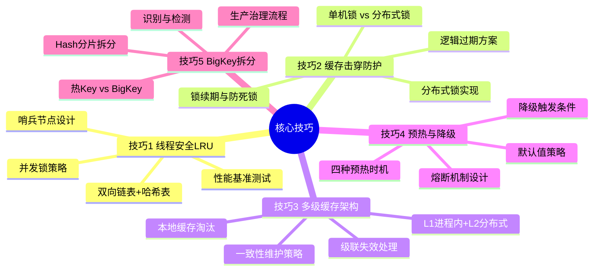
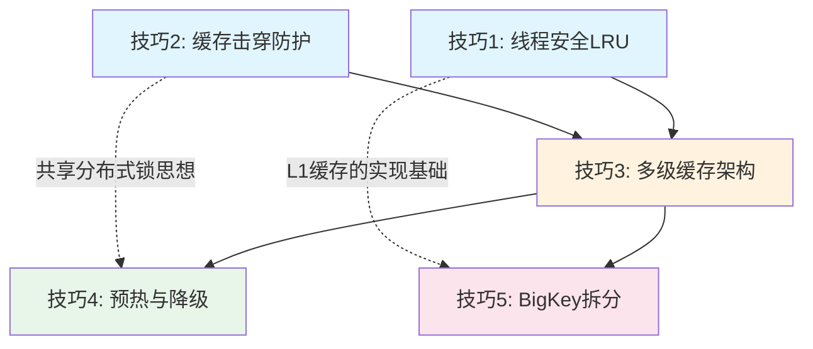

# 12.2 缓存系统核心技巧

理论是地基，技巧是建筑。在掌握了缓存的基本原理（局部性、替换策略、一致性模型）和经典问题（穿透、击穿、雪崩）之后，本节将深入五个最关键的工程技巧——它们是高并发系统中缓存架构的核心支柱，也是面试和实战中的高频考点。

**核心理念**：缓存的真正价值不在于"加一层"，而在于"加对一层"。错误的缓存策略比没有缓存更危险——它会引入一致性问题、雪崩风险和运维复杂度。本节的每一个技巧，都是从真实生产事故中提炼出的"防坑指南"。

## 本节知识全景

## 五大技巧概览

| # | 技巧 | 解决的核心问题 | 难度 | 篇幅 |
|---|------|---------------|------|------|
| 1 | 线程安全LRU缓存 | 如何正确实现一个高并发缓存容器 | ⭐⭐⭐ | 详细实现+基准测试 |
| 2 | 缓存击穿防护——分布式锁 | 热点key过期瞬间的并发穿透 | ⭐⭐⭐⭐ | 锁设计+多种方案对比 |
| 3 | 多级缓存架构 | 单层缓存的性能天花板 | ⭐⭐⭐⭐⭐ | 架构设计+一致性+代码 |
| 4 | 缓存预热与降级策略 | 冷启动和极端异常场景的可用性 | ⭐⭐⭐ | 预热方案+降级框架 |
| 5 | BigKey拆分策略 | Redis大key的性能杀手 | ⭐⭐⭐⭐ | 检测+拆分+治理流程 |

## 技巧之间的关系

这五个技巧并非孤立存在，而是形成了一个有机的整体。理解它们之间的依赖和协作关系，是设计健壮缓存架构的前提：

- **技巧1→技巧3**：多级缓存的L1层（进程内缓存）本质上就是一个线程安全的LRU容器。技巧1是技巧3的实现基础。
- **技巧2→技巧3**：分布式锁防护击穿的思路，在多级缓存架构中同样适用——当L1缓存miss时，需要防止大量请求同时穿透到L2。
- **技巧3→技巧4**：多级缓存架构需要预热策略来填充各级缓存，也需要降级策略来应对缓存层整体失效。
- **技巧3→技巧5**：BigKey的拆分是为了让多级缓存架构更健康——单个超大key会打破分层缓存的均衡性。
- **技巧2↔技巧4**：分布式锁和熔断降级在本质上都是"流量控制"——前者控制并发重建，后者控制故障扩散。

## 阅读指南

### 按角色推荐阅读路径

| 你的角色 | 推荐顺序 | 重点关注 |
|---------|---------|---------|
| **初级开发者** | 1→5→2→3→4 | 先掌握基础LRU实现和BigKey检测（日常最常用），再理解击穿防护 |
| **高级开发者** | 1→2→3→4→5 | 按技巧顺序通读，重点掌握分布式锁和多级缓存架构设计 |
| **架构师** | 3→4→2→5→1 | 从架构全局出发，先理解多级缓存，再深入每个技巧的细节 |
| **面试准备** | 1→2→5 | LRU手写+分布式锁是最高频的两个面试题，BigKey是加分项 |

### 按场景速查

| 你遇到的场景 | 先读 | 再读 |
|-------------|------|------|
| 需要自己实现LRU缓存（面试/项目） | 技巧1 | — |
| 热点key过期导致数据库被打爆 | 技巧2 | 技巧4 |
| 单机Redis扛不住高并发 | 技巧3 | 技巧5 |
| Redis重启后缓存全空，请求涌入DB | 技巧4 | 技巧2 |
| Redis内存暴涨、响应变慢 | 技巧5 | 技巧3 |
| 设计全新的缓存架构 | 技巧3→技巧4→技巧5 | 技巧1→技巧2 |

## 前置知识检查

在学习本节之前，确保你已经理解以下概念：

- **数据结构基础**：哈希表的O(1)查找原理、双向链表的O(1)插入/删除、哨兵节点的作用
- **并发编程基础**：互斥锁（Mutex）、可重入锁（RLock）、竞态条件（Race Condition）
- **Redis基本操作**：GET/SET/HSET/LPUSH/SADD等命令，TTL设置，过期策略
- **分布式系统概念**：CAP定理、最终一致性、分布式锁的基本思想

如果对以上任何概念不熟悉，建议先阅读第7章（进程与线程）和第8章（网络基础）的相关内容。

## 核心概念速查表

| 概念 | 一句话定义 | 在哪个技巧中详解 |
|------|-----------|----------------|
| LRU | 淘汰最久未被访问的数据项 | 技巧1 |
| 哨兵节点 | 链表头尾的空节点，消除边界条件 | 技巧1 |
| 缓存击穿 | 单个热点key过期瞬间的并发穿透 | 技巧2 |
| 分布式锁 | 跨进程的互斥访问控制机制 | 技巧2 |
| 锁续期（WatchDog） | 自动延长分布式锁的持有时间 | 技巧2 |
| 多级缓存 | 按速度/容量分层组织的缓存体系 | 技巧3 |
| 本地缓存 | 进程内的内存缓存（Caffeine/Guava） | 技巧3 |
| 缓存预热 | 系统启动前主动填充热点数据 | 技巧4 |
| 缓存降级 | 缓存异常时的兜底策略 | 技巧4 |
| 熔断 | 错误率超阈值时暂时切断请求 | 技巧4 |
| BigKey | 单个key的value过大（>10KB或>10000元素） | 技巧5 |
| 热Key | 访问频率远高于平均值的key | 技巧5 |
| Hash分片 | 将大key拆成多个小key的策略 | 技巧5 |

## 技巧1：实现一个线程安全的LRU缓存

**核心命题**：如何从零实现一个既正确又高效的线程安全LRU缓存？

这是缓存系统最基础的工程能力。LRU（Least Recently Used）的思想极其简洁——淘汰最久未访问的数据——但要将其落地为生产级组件，涉及双向链表、哈希表、哨兵节点、并发锁策略等多个层面的知识。

本技巧覆盖三个递进层次的实现：

| 层次 | 实现方式 | 适用场景 | 代码行数 |
|------|---------|---------|---------|
| 入门版 | Python `OrderedDict` + `Lock` | 快速验证、小型项目 | ~40行 |
| 面试版 | 手写双向链表 + 哈希表 | 面试手撕代码 | ~60行 |
| 生产版 | TTL支持 + 批量操作 + 统计 | 高并发生产环境 | ~120行 |

**关键洞察**：
- LRU的`get`操作也涉及链表修改（移动到头部），所以**读操作不是只读的**——传统读写锁在这里不适用
- 哨兵节点将链表操作的边界条件从4种简化为1种，代码行数减半
- RLock（可重入锁）比Lock慢约10-20%，但在嵌套调用场景下是必须的

**延伸阅读**：如果面试官追问"LRU有什么缺点？"——它对扫描攻击（Scan Attack）敏感：一次性遍历大量冷数据会污染缓存，驱逐所有热数据。解决方案是LRU-K或W-TinyLFU，详见理论基础中的替换策略部分。

## 技巧2：缓存击穿防护——分布式锁

**核心命题**：如何防止热点key过期瞬间，大量并发请求同时穿透到数据库？

缓存击穿（Cache Stampede）是高并发系统中最常见的故障模式之一。假设QPS=10000，热点key过期的瞬间，上万个相同查询涌入数据库——数据库连接池（通常100-200个）瞬间耗尽，导致所有请求（包括不相关的查询）全部阻塞。

本技巧的核心方案是**分布式锁**：只允许一个请求去重建缓存，其他请求等待或降级。但实现细节中暗藏大量陷阱：

| 方案 | 实现 | 优点 | 缺点 |
|------|------|------|------|
| Redis `SETNX` | `SET key val NX EX 10` | 实现简单 | 锁续期困难 |
| Redisson WatchDog | 后台线程自动续期 | 自动续期、可重入 | 依赖Redisson客户端 |
| 逻辑过期 | value中存过期时间，异步更新 | 无锁等待 | 数据短暂不一致 |
| 永不过期 + 后台刷新 | TTL设为不过期，定时任务更新 | 无击穿风险 | 数据延迟取决于刷新频率 |

**关键洞察**：
- 分布式锁必须设置**超时时间**，否则持锁进程崩溃会导致死锁
- 单机锁（`synchronized`/`ReentrantLock`）只在同一JVM内有效，分布式环境下无效
- "等待+重试"和"降级返回默认值"是两种完全不同的策略，需要根据业务容忍度选择

**与其他技巧的关联**：分布式锁的思想在技巧4（熔断降级）中也有体现——两者本质上都是"在异常情况下控制流量"。

## 技巧3：多级缓存架构

**核心命题**：如何设计一个兼顾速度、容量和一致性的多级缓存体系？

单层缓存存在明显的性能天花板：本地缓存容量有限且不跨实例共享，分布式缓存有网络延迟（0.5-2ms）。多级缓存通过分层组织，让绝大多数请求在最近的一层命中：

访问延迟：L1 (进程内, <1μs) >> L2 (Redis, 0.5-2ms) >> L3 (MySQL, 1-10ms)
容量大小：L1 (几百MB)       << L2 (TB级)           << L3 (海量)
命中概率：L1 (最高)          >> L2 (中)             >> L3 (最低)

本技巧是本节篇幅最长、复杂度最高的部分，涵盖：

- **架构设计**：L1/L2/L3的职责划分、数据路由策略
- **一致性维护**：写操作如何同步失效多级缓存、版本号机制、统一失效通道
- **级联失效处理**：当L2失效时L1如何兜底、缓存降级链
- **生产代码**：完整的多级缓存实现，包括读写路径、失效通知、统计监控
- **常见陷阱**：本地缓存与分布式缓存的数据不一致、缓存null值的必要性、过期时间的随机化

**关键洞察**：
- 多级缓存的一致性是**最终一致性**——接受短暂的不一致，通过TTL和失效通知保证最终一致
- L1缓存的过期时间应**短于**L2——否则L1中的过期数据会先于L2被发现，导致不必要的穿透
- 缓存null值（空结果缓存）是防止穿透的最后一道防线，但需要设置较短的TTL

## 技巧4：缓存预热与降级策略

**核心命题**：如何在冷启动和极端异常场景下保障系统可用性？

缓存预热解决"从无到有"的问题——系统启动或Redis重启后，缓存为空，所有请求直击数据库。缓存降级解决"从有到无"的问题——缓存层整体异常时，如何保护后端数据库不被击垮。

### 预热策略矩阵

| 预热时机 | 触发条件 | 预热方式 | 预热范围 |
|---------|---------|---------|---------|
| 启动预热 | 服务进程启动后 | 主动加载热点数据 | Top-N热点key |
| 滚动发布 | 新实例启动 | 增量加载变更数据 | 仅变更数据 |
| Redis恢复 | 主从切换/重启 | 紧急预热 | 优先高优先级key |
| 周期性预热 | 定时任务 | 后台定期刷新 | 全量或增量 |

### 降级策略矩阵

| 降级层级 | 触发条件 | 兜底策略 | 数据准确性 |
|---------|---------|---------|-----------|
| L1降级 | 本地缓存miss | 穿透到L2 | 完全准确 |
| L2降级 | Redis不可用 | 返回本地缓存旧数据 | 可能过时 |
| 全面降级 | 缓存层整体异常 | 返回默认值/静态数据 | 不保证准确 |
| 熔断 | 错误率>阈值 | 切断请求，快速失败 | 不提供数据 |

**关键洞察**：
- 预热不是"一次性操作"——需要持续监控缓存命中率，发现命中率下降时自动触发增量预热
- 降级的优先级：**可用性 > 一致性 > 性能**——宁可返回过时数据，也不要返回错误
- 熔断器的三个状态（关闭→打开→半开）需要根据实际错误率动态调整，不能硬编码阈值

## 技巧5：BigKey拆分策略

**核心命题**：如何识别、拆分和治理Redis中的大key？

BigKey是Redis的"隐形杀手"——它不会立即崩溃，而是悄悄拖慢整个集群。一个5MB的String Value，每次读取占用5MB带宽，QPS=1000时仅这一个key就要消耗5GB/s带宽，足以打满万兆网卡。

### BigKey的识别标准

| 数据类型 | 阈值 | 说明 |
|---------|------|------|
| String | Value > 10KB | 单个字符串值过大 |
| Hash/Set/ZSet | 元素数 > 10,000 | 集合成员数过多 |
| List | 元素数 > 50,000 | 列表元素数过多 |
| 整体 | 内存 > 1MB | 该key在Redis中的实际内存占用 |

### 拆分方案对比

| 方案 | 适用场景 | 实现复杂度 | 查询效率 |
|------|---------|-----------|---------|
| Hash分片 | Hash/Set/ZSet元素过多 | 低 | O(1)，需要客户端聚合 |
| 本地缓存 | 热点BigKey，读多写少 | 中 | 极快（进程内） |
| 按业务拆分 | 大key存储了不相关的数据 | 低 | 按业务维度查询 |
| 异步拆写 | 大key的更新操作 | 高 | 最终一致 |

**关键洞察**：
- BigKey和热Key是两个**独立维度**的问题：BigKey是"大"，热Key是"热"。一个key可以又大又热（如秒杀商品详情），也可以大但不热（如历史数据归档）
- 删除BigKey不要用`DEL`——它会阻塞整个Redis实例。Redis 4.0+使用`UNLINK`（异步删除），更老的版本用`SCAN`分批删除
- BigKey的治理需要**持续监控**，不能一劳永逸——随着业务增长，曾经正常的key可能变成BigKey

## 五个技巧的统一视角

从更高的视角看，这五个技巧都在回答同一个核心问题：**如何在有限的资源下，最大化缓存系统的收益，同时最小化其风险？**

| 维度 | 技巧1 | 技巧2 | 技巧3 | 技巧4 | 技巧5 |
|------|-------|-------|-------|-------|-------|
| 优化目标 | 容器性能 | 热点保护 | 整体吞吐 | 可用性 | 资源均衡 |
| 核心机制 | 数据结构 | 并发控制 | 分层架构 | 故障恢复 | 数据拆分 |
| 风险防范 | 线程安全 | 并发穿透 | 一致性 | 冷启动/雪崩 | 性能退化 |
| 适用阶段 | 开发期 | 高并发优化期 | 架构设计期 | 运维保障期 | 生产调优期 |

**实践建议**：不要试图一次性掌握所有技巧。根据你当前的阶段选择优先级——开发阶段先掌握技巧1（LRU实现），上线后关注技巧2（击穿防护），随着流量增长再逐步引入技巧3-5。

## 常见面试题速查

| 面试问题 | 涉及技巧 | 回答要点 |
|---------|---------|---------|
| 手写一个LRU缓存 | 技巧1 | 双向链表+哈希表，哨兵节点，O(1)操作 |
| 缓存击穿怎么解决？ | 技巧2 | 互斥锁/逻辑过期/永不过期+后台刷新 |
| 本地缓存和Redis缓存如何保持一致？ | 技巧3 | 版本号/发布订阅/TTL控制 |
| Redis重启后缓存全空怎么办？ | 技巧4 | 预热策略+降级兜底 |
| 如何发现和处理Redis大key？ | 技巧5 | `redis-cli --bigkeys`/`MEMORY USAGE`/Hash分片 |
| LRU和LFU的区别？ | 技巧1 | LRU看时间，LFU看频率；LRU对扫描敏感，LFU对新数据不友好 |
| 分布式锁怎么实现？有什么坑？ | 技巧2 | SETNX+超时/WatchDog续期/可重入/红锁争议 |

## 本节学习目标

完成本节学习后，你应该能够：

1. **实现能力**：从零手写线程安全的LRU缓存，理解哨兵节点和锁策略的设计权衡
2. **防护能力**：用分布式锁防护缓存击穿，理解锁续期、防死锁和降级的完整方案
3. **架构能力**：设计多级缓存架构，平衡性能、一致性和可用性
4. **运维能力**：实施缓存预热和降级策略，保障系统在极端场景下的可用性
5. **治理能力**：识别和拆分BigKey，建立持续的缓存健康监控机制
