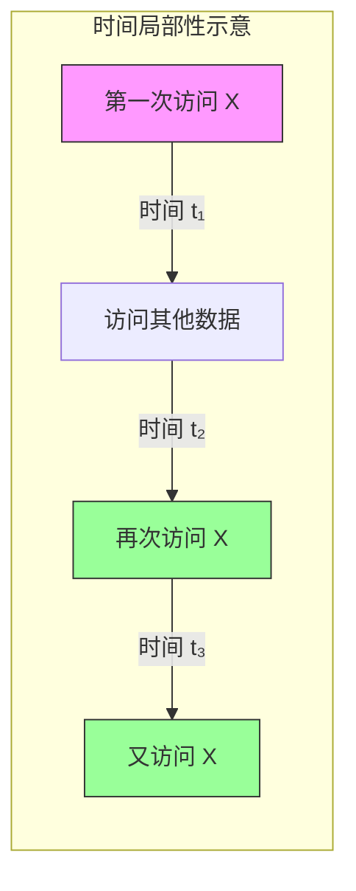
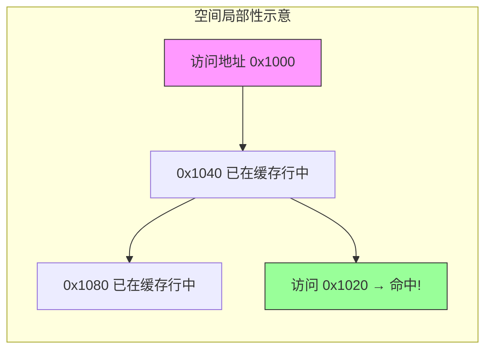
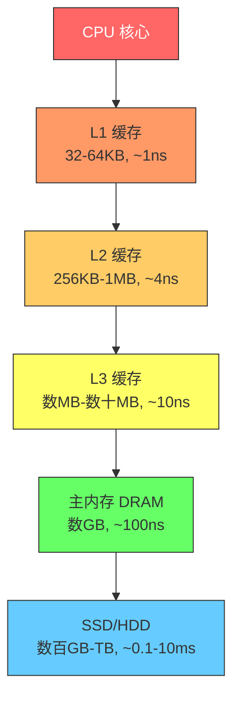
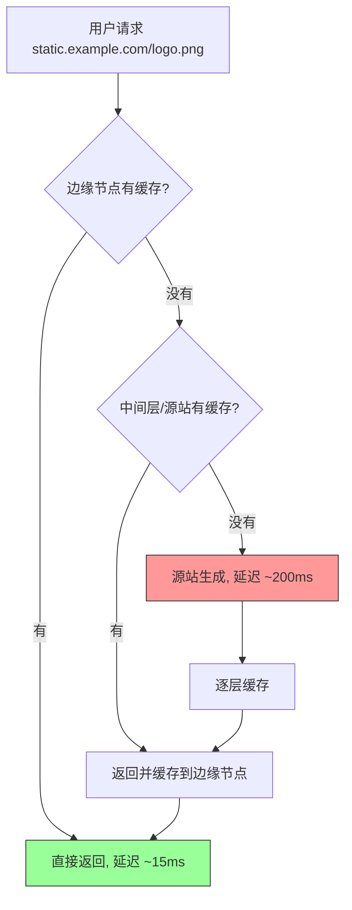

## 12.1 为什么需要缓存

缓存是计算机科学中最古老也最强大的优化手段之一。从 CPU 内部的 L1/L2/L3 三级缓存，到数据库前面的 Redis 层，再到全球用户和服务器之间的 CDN 节点——**缓存无处不在**。理解"为什么需要缓存"，是理解整个缓存系统章节的基石。

---

### 12.1.1 根本矛盾：速度与容量的不可兼得

计算机系统的核心矛盾可以用一句话概括：**越快的存储越贵、越小；越便宜的存储越慢、越大。**

这不是工程上的偶然，而是物理定律决定的必然。SRAM（静态随机存取存储器）每个比特需要 6 个晶体管，而 DRAM（动态随机存取存储器）只需要 1 个晶体管 + 1 个电容。闪存则通过浮栅晶体管实现更密集的存储，但代价是写入时需要量子隧穿效应，速度大幅下降。磁盘更是依赖机械旋转和磁头寻道，受限于物理运动速度。

这个矛盾催生了**存储金字塔**——用少量快速存储做"前台"，大量慢速存储做"后台"，通过缓存算法让热点数据留在前台。

#### 存储金字塔：延迟差四个数量级

下表展示了从 CPU 寄存器到网络存储的完整存储层次。注意最后一列的"相对成本"——这里用一个粗略的量化来帮助理解经济含义。

| 存储层次 | 典型介质 | 访问延迟 | 容量范围 | 相对成本（$/GB） | 带宽 |
|---------|---------|---------|---------|----------------|------|
| CPU 寄存器 | 触发器 | ~0.3ns | 数百字节 | 不可单独购买 | 数 TB/s |
| L1 Cache | SRAM | ~1ns | 32-64 KB | ~$10,000+ | ~1 TB/s |
| L2 Cache | SRAM | ~4ns | 256 KB-1 MB | ~$3,000+ | ~500 GB/s |
| L3 Cache | SRAM | ~10ns | 数 MB-数十 MB | ~$800+ | ~200 GB/s |
| 主内存 | DRAM | ~100ns | 数 GB-数百 GB | ~$3-5 | ~50 GB/s |
| SSD | NAND Flash | ~100μs（随机读） | 数百 GB-数 TB | ~$0.05-0.10 | ~3-7 GB/s |
| HDD | 磁盘 | ~5-10ms（随机读） | 数 TB-数十 TB | ~$0.01-0.03 | ~100-200 MB/s |
| 网络存储（NFS/S3） | 远程服务器 | ~0.5-50ms | 无上限 | ~$0.02 | 取决于带宽 |

**关键洞察**：L1 缓存比主内存快约 100 倍，比 SSD 快约 10 万倍，比 HDD 快约 1000 万倍。这意味着一次 L1 命中的时间里，HDD 还在做第一次寻道。

#### 成本与容量的现实约束

为什么不能全部用 SRAM？来做一道简单的算术题：

- 一台典型服务器需要 256 GB 内存来运行应用
- 如果全部用 SRAM 实现，按保守估计 $800/GB 计算，仅内存成本就是 **$204,800**
- 而同样容量的 DRAM 内存大约 $1,280（按 $5/GB）
- SRAM 方案的内存成本是 DRAM 方案的 **160 倍**

这还没考虑 SRAM 的功耗问题——SRAM 的每瓦存储密度远低于 DRAM，大规模部署时散热和电力成本同样不可承受。

所以现实方案是：**少量 SRAM（KB-MB 级）+ 中等 DRAM（GB 级）+ 大量闪存/磁盘（TB 级）**，通过缓存层次让系统表现得"好像拥有快速大容量存储"。

---

### 12.1.2 局部性原理：缓存为什么有效

缓存之所以能发挥作用，不是靠运气，而是依赖程序行为的一个基本规律——**局部性原理（Principle of Locality）**。

局部性原理包含两个子原理：

#### 时间局部性（Temporal Locality）

**刚被访问的数据，很快会再次被访问。**

典型场景：

- **Web 应用**：热门商品页面在秒杀期间被反复访问，同一份数据在 1 分钟内可能被查询 10,000 次
- **数据库**：电商系统的商品配置表 80% 的查询集中在 20% 的热门商品上
- **文件系统**：编译器在编译时反复读取同一组头文件
- **CPU 执行**：循环体内的指令被执行数十亿次

#### 空间局部性（Spatial Locality）

**刚被访问的数据的邻近数据，很快也会被访问。**

典型场景：

- **数组遍历**：CPU 加载 `arr[i]` 时，会把整个缓存行（通常 64 字节）一起加载，`arr[i+1]` 到 `arr[i+15]` 已经在 L1 缓存中
- **B+ 树索引**：数据库查询命中一个叶子节点后，同一页中的相邻索引键很可能马上被访问
- **Web 页面**：用户打开商品详情页后，大概率会滚动查看关联推荐、评价列表等相邻数据
- **视频流**：播放第 N 帧后，第 N+1、N+2 帧几乎确定会被读取

#### 局部性原理的量化验证

学术界和工业界通过大量实验证实了局部性原理的普遍性：

- **Web 访问模式**：根据 Akamai 的 CDN 统计，全球 Web 流量中约 **60-70%** 的请求集中在 **20%** 的热门内容上（典型的幂律分布/长尾分布）
- **数据库查询**：MySQL 官方文档指出，对于 OLTP 负载，**约 80% 的查询命中 20% 的数据页**
- **文件系统**：NFS（网络文件系统）的研究表明，关闭缓存后，文件打开操作的延迟会增加 **3-10 倍**

这些数据说明：无论什么应用场景，数据访问都呈现出高度的不均匀性——少数数据被频繁访问，多数数据很少被触及。缓存正是利用了这种不均匀性。

---

### 12.1.3 缓存的核心指标体系

理解缓存是否有效，需要一套完整的度量体系。

#### 命中率（Hit Rate）

**命中率是缓存最重要的单一指标**，它直接决定了缓存的价值。

命中率 = 缓存命中次数 / 总请求次数

命中率与系统性能的关系可以用一张表清晰表达：

| 命中率 | 后端查询比例 | 相对无缓存的性能提升 | 平均延迟（缓存1ms + 后端100ms） |
|--------|-------------|-------------------|-------------------------------|
| 0% | 100% | 1x（无加速） | 100ms |
| 50% | 50% | ~2x | 50.5ms |
| 80% | 20% | ~5x | 20.8ms |
| 90% | 10% | ~10x | 10.9ms |
| 95% | 5% | ~20x | 5.95ms |
| 99% | 1% | ~100x | 1.99ms |
| 99.9% | 0.1% | ~1000x | 1.1ms |

**一个关键发现**：命中率从 80% 提升到 99%，看似只有 19 个百分点的差距，但后端查询量从 20% 降到 1%——**减少了 20 倍的后端压力**。在高并发场景下，这意味着后端数据库从可能被打垮变成安然无恙。

#### 平均访问时间（Average Access Time）

缓存的最终目标是降低平均访问时间。公式如下：

T_avg = HitRate × T_cache + (1 - HitRate) × T_backend

**多级缓存的公式**：

T_avg = T_L1 × P(L1_hit) + T_L2 × P(L2_hit) × P(L1_miss) + T_L3 × P(L3_hit) × P(L1_miss) × P(L2_miss) + ... + T_backend × P(all_miss)

**计算示例**（假设 L1 命中率 95%，L2 命中率 60%）：

T_avg = 1ns × 0.95
      + 4ns × 0.60 × 0.05
      + 100ns × 0.40 × 0.05
      = 0.95ns + 0.12ns + 2.0ns
      = 3.07ns

相比全部从 DRAM 读取（100ns），加速了约 32 倍

#### 其他关键指标

| 指标 | 定义 | 重要性 |
|------|------|--------|
| **未命中惩罚**（Miss Penalty） | 缓存未命中时回源查询的额外延迟 | 决定了缓存 miss 的代价有多大 |
| **驱逐率**（Eviction Rate） | 缓存空间不足时被清除的数据比例 | 过高说明缓存容量不够 |
| **缓存利用率** | 已用缓存空间 / 总缓存空间 | 过低浪费资源，过高增加驱逐 |
| **写穿透/写回比例** | 写操作中同步/异步写入后端存储的比例 | 影响数据一致性和写入延迟 |
| **TTL 过期率** | 因 TTL 到期而失效的缓存条目比例 | 过高说明 TTL 设置过短 |
| **热点集中度** | 前 N% 数据占总访问量的比例 | 决定缓存应该多大才够 |

---

### 12.1.4 缓存在各层系统中的角色

缓存不只是一个"在数据库前面放一层 Redis"的概念。在现代计算系统中，缓存以不同形式出现在每一层。

#### CPU 级缓存：硬件透明缓存

CPU 缓存是最早的缓存实现，由硬件自动管理，对软件完全透明。

CPU 缓存的关键特征：

- **缓存行（Cache Line）**：通常 64 字节，是缓存与内存之间数据传输的最小单位。这就是为什么遍历数组比遍历链表快得多——数组的内存连续，一个缓存行就能加载多个元素；链表的节点分散在堆中，每次跳转都可能触发缓存未命中
- **写策略**：直写（Write-Through）每次写入同时更新缓存和内存，一致性好但写入慢；写回（Write-Back）只更新缓存，脏页延迟写入，写入快但崩溃时可能丢失数据
- **MESI 协议**：多核 CPU 的每个核心都有自己的缓存，MESI 协议（Modified/Exclusive/Shared/Invalid）确保多核之间缓存的一致性。详细内容见 12.2 节

#### 操作系统级缓存：页缓存与 Buffer Cache

操作系统内核通过**页缓存（Page Cache）**将磁盘文件数据缓存在内存中。

Linux 的 `free` 命令输出中，`buff/cache` 一列显示的就是被系统用于缓存的内存。很多运维新手看到 cache 占了大量内存会恐慌，实际上这是正常的、有益的——当应用程序需要内存时，系统会自动回收缓存页。

**实际数据**：在典型的 Linux Web 服务器上，Page Cache 可以将文件读取延迟从 SSD 的 ~100μs 降低到内存的 ~100ns，加速约 **1000 倍**。Nginx 的静态文件服务很大程度上依赖 Page Cache 的加速。

#### 数据库级缓存：InnoDB Buffer Pool / MySQL Query Cache

数据库是缓存最密集的应用场景之一。以 MySQL InnoDB 为例：

- **Buffer Pool**：默认 128MB，生产环境通常配置为物理内存的 60-80%。它缓存了数据页和索引页，避免每次查询都读磁盘
- **查询缓存**（MySQL 8.0 已移除）：缓存完整的 SELECT 结果。由于表的任何写操作都会使查询缓存失效，在写密集场景下反而是负担
- **自适应哈希索引（AHI）**：InnoDB 自动为频繁访问的索引页建立哈希索引，将 B+ 树的 O(log n) 查找优化为 O(1)

#### 应用层缓存：Redis / Memcached / 本地缓存

这是大多数后端开发者最直接接触的缓存层：

| 缓存类型 | 代表方案 | 访问延迟 | 容量上限 | 适用场景 |
|---------|---------|---------|---------|---------|
| 进程内缓存 | Caffeine, Guava Cache, LRU Cache | ~100ns | 受限于 JVM 堆内存 | 单机热点数据，极致低延迟 |
| 分布式缓存 | Redis Cluster, Memcached | ~0.5-2ms | 数十 GB-数百 GB | 跨节点共享缓存 |
| CDN 缓存 | Cloudflare, Akamai, 阿里云 CDN | ~10-50ms（边缘节点） | 海量 | 静态资源、视频、图片 |
| DNS 缓存 | 本地 DNS + HTTP DNS | ~1ms | - | 域名解析加速 |

**层级关系**：最佳实践是**多级缓存**——先查本地缓存（L1），再查 Redis 集群（L2），最后查数据库（L3）。每一级都有独立的失效策略和容量规划。详见 12.5 节"多级缓存架构"。

#### CDN 与边缘缓存

CDN（内容分发网络）是缓存思想在全球互联网尺度上的应用。通过在全球部署数以千计的边缘节点，CDN 将热点内容推送到离用户最近的位置。

以一个典型的 CDN 请求流程为例：

CDN 的效果数据：Cloudflare 公开数据显示，启用 CDN 后，静态资源的加载时间平均降低 **60%**，源站带宽消耗降低 **65%** 以上。

---

### 12.1.5 缓存的经济学：为什么 ROI 如此高

理解缓存的价值，必须算一笔经济账。

#### 场景：电商平台秒杀

假设一个电商平台在秒杀活动期间：

| 指标 | 无缓存 | 有缓存（命中率 95%） |
|------|--------|---------------------|
| 峰值 QPS | 100,000 | 100,000 |
| 数据库需要处理的 QPS | 100,000 | 5,000 |
| 数据库单机承载能力 | ~5,000 QPS | - |
| 需要的数据库实例数 | 20 台 | 1 台 |
| 数据库月度成本（云实例） | ~$10,000 | ~$500 |
| Redis 缓存集群成本 | $0 | ~$800 |
| **总基础设施成本** | **~$10,000/月** | **~$1,300/月** |
| **节省比例** | - | **87%** |

在这个场景中，每月 $800 的 Redis 集群投资换来了 $8,700 的数据库成本节省，**ROI 超过 10 倍**。

#### 场景：API 响应加速

| 指标 | 无缓存 | 有缓存 |
|------|--------|--------|
| P99 延迟 | 800ms | 50ms |
| 用户满意度评分 | 3.2/5 | 4.5/5 |
| 月度流失率 | 12% | 6% |
| 年化收入影响（100 万用户） | - | +$数百万 |

Google 的研究表明：**页面加载时间每增加 100ms，用户转化率下降 1%**。对于日活千万级的应用，1% 的转化率差异意味着巨大的收入差距。

---

### 12.1.6 缓存的代价：没有免费的午餐

缓存虽然强大，但引入缓存意味着增加了系统的复杂性。正视这些代价，才能做出正确的架构决策。

#### 1. 数据一致性问题

缓存引入了一个新的数据副本，必须保证缓存中的数据与数据库中的数据一致。常见的一致性模型包括：

| 模型 | 一致性保证 | 性能 | 适用场景 |
|------|-----------|------|---------|
| 强一致性 | 缓存与数据库时刻一致 | 低 | 金融交易、库存扣减 |
| 最终一致性 | 缓存与数据库在一定时间窗口内一致 | 高 | 用户信息、商品详情 |
| 弱一致性 | 允许较长时间的不一致 | 最高 | 统计数据、日志 |

详见 12.3 节关于缓存一致性的讨论。

#### 2. 缓存相关故障模式

缓存层的引入带来了三种经典故障模式，统称为缓存三大问题：

- **缓存穿透**：查询的数据在缓存和数据库中都不存在，每次请求都会穿透到数据库。恶意攻击者可以通过构造大量不存在的 key 来打垮数据库
- **缓存击穿**：某个热点 key 过期的瞬间，大量并发请求同时涌入数据库，形成瞬间流量尖峰
- **缓存雪崩**：大量 key 在同一时间过期，或者缓存服务整体宕机，导致所有请求瞬间涌向数据库

这些故障模式的详细分析和防护方案见 12.4 节。

#### 3. 运维复杂性

引入缓存层后，系统需要额外关注：

- **容量规划**：缓存多大才够？按什么比例配置？
- **监控告警**：缓存命中率下降、内存使用率飙升、连接数异常
- **故障演练**：缓存节点宕机时系统是否能优雅降级？
- **版本升级**：Redis 版本升级时如何保证平滑迁移？

#### 4. 调试困难

当缓存中存在脏数据时，问题的排查链路变长：应用层逻辑是否正确？缓存是否返回了旧数据？数据库的 binlog 是否同步延迟？缓存和数据库之间的时序是否正确？

---

### 12.1.7 什么时候不该用缓存

缓存不是万能药。以下场景需要谨慎评估：

| 场景 | 为什么不适合缓存 | 替代方案 |
|------|----------------|---------|
| **写多读少** | 缓存的价值在于加速读取，写密集场景缓存命中率低，且写入一致性维护成本高 | 数据库分库分表、SSD 存储 |
| **数据更新频率极高** | 缓存频繁失效，驱逐率高，缓存利用率低 | 内存数据库直接存储、CQRS 写端优化 |
| **强一致性要求** | 缓存天然引入数据副本，保证强一致性的代价可能超过收益 | 数据库事务、分布式事务 |
| **数据量极小** | 数据本身就能放入内存或在毫秒级完成查询，缓存带来的收益微乎其微 | 优化查询本身 |
| **数据冷启动频繁** | 系统每次启动后访问模式完全不同，缓存预热成本高 | 按需加载、数据库索引优化 |

**判断标准**：如果读写比低于 3:1，或者单次查询延迟本身已经在个位数毫秒，引入缓存层的边际收益可能不足以抵消其复杂性成本。

---

### 12.1.8 从历史看缓存的演进

缓存的思想几乎和计算机科学一样古老。

- **1960 年代**：IBM System/360 引入了最早的硬件缓存概念，用快速存储加速 CPU 对主存的访问
- **1970 年代**：虚拟内存（页表 + TLB）将缓存思想扩展到内存与磁盘之间
- **1990 年代**：Web 缓存兴起，Varnish、Squid 等工具开始为 HTTP 请求提供缓存加速
- **2000 年代**：Memcached（2003）开创了分布式内存缓存的先河，成为 Facebook、Twitter 等大厂的标配
- **2009 年**：Redis 诞生，将缓存从简单的 key-value 扩展到丰富的数据结构，逐渐成为"瑞士军刀"般的缓存方案
- **2010 年代**：CDN 全球化部署，边缘缓存成为互联网基础设施的核心组件
- **2020 年代**：多级缓存架构成为云原生应用的标准模式，本地缓存 + 分布式缓存 + CDN 的三层架构被广泛采用

这条演进线索揭示了一个核心趋势：**缓存的层次越来越多，离用户越来越近，自动化程度越来越高**。

---

### 12.1.9 本节小结

回到最初的问题：为什么需要缓存？

**一句话回答**：因为存储金字塔中快与大的矛盾不可调和，而程序行为的局部性原理让"用小空间存储热点数据"成为可能且高效的优化手段。

**三个关键认知**：

1. **缓存利用了不均匀性**：无论 CPU 指令流、数据库查询、还是 Web 访问，数据的使用都遵循幂律分布——少数热点占多数访问。缓存的本质是识别并利用这种不均匀性

2. **缓存的效果是指数级的**：命中率从 80% 提升到 99%，后端压力不是降低 19%，而是降低 20 倍。这种非线性关系意味着缓存在高命中率区间的投入产出比极高

3. **缓存有代价**：一致性维护、故障模式、运维复杂性都是真实的成本。不是所有场景都适合加缓存，关键是评估 ROI

在接下来的章节中，我们将深入探讨：缓存一致性协议（12.2）、应用层缓存策略（12.3）、缓存穿透/击穿/雪崩的防护（12.4），以及 Redis 与 Memcached 的架构对比（12.5），最终通过实战案例将这些理论知识融会贯通。
