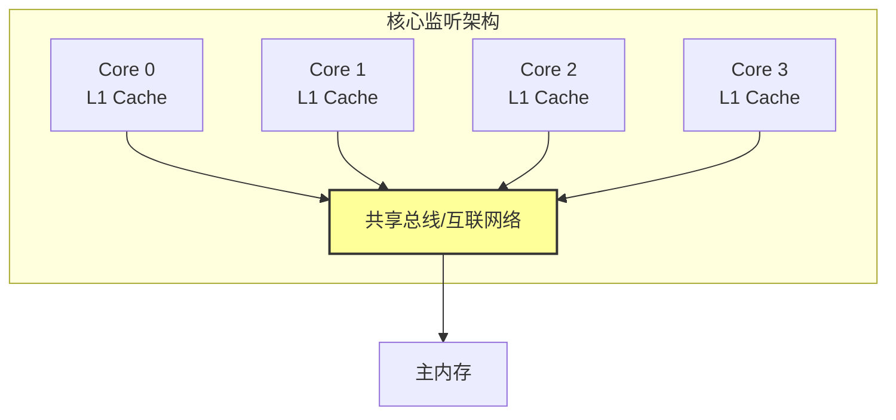
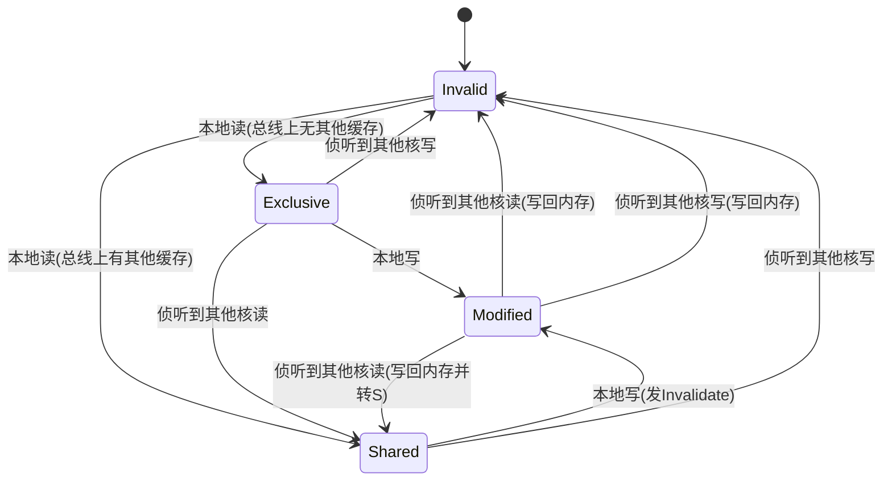
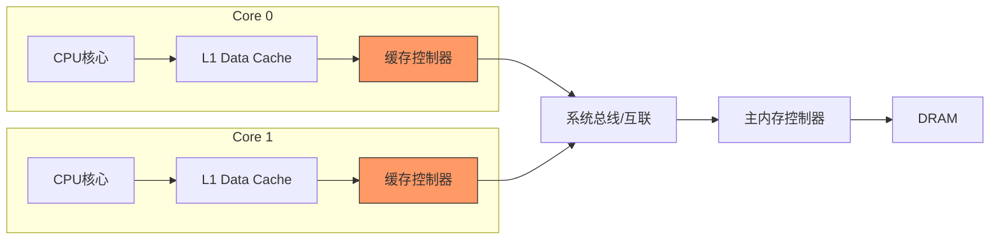
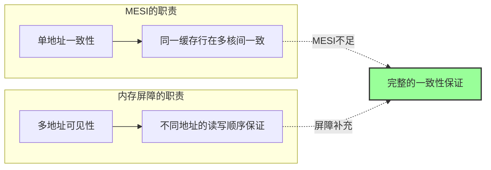

## 12.2 缓存一致性协议：MESI

### 12.2.1 为什么需要缓存一致性

#### 多核时代的根本矛盾

现代CPU早已不是单核时代。一枚芯片上动辄几十个核心同时运行，每个核心都有自己独立的L1/L2缓存。问题随之而来：**当多个核心同时缓存了同一块内存数据时，其中一个核心修改了数据，其他核心看到的还是旧值。**

这不是理论问题，而是每天都在发生的实际故障。考虑以下场景：

```c
// 全局变量
int shared_counter = 0;

// 线程1（运行在Core 0）
void thread1() {
    for (int i = 0; i < 1000000; i++) {
        shared_counter++;  // 读→改→写
    }
}

// 线程2（运行在Core 1）
void thread2() {
    for (int i = 0; i < 1000000; i++) {
        shared_counter++;
    }
}
// 最终 shared_counter 的值？不是 2000000，而是 1347023（举例）
// 两个核心各自读到的值相同，各自+1后写回，互相覆盖——这就是一致性问题
```

**缓存一致性协议（Cache Coherence Protocol）** 解决的核心问题是：**如何让所有核心看到的同一内存地址的数据保持一致。**

注意区分两个相关但不同的概念：

| 概念 | 含义 | 解决方案 |
|------|------|----------|
| **缓存一致性（Cache Coherence）** | 同一地址在多个缓存中的值是否一致 | MESI等硬件协议 |
| **内存一致性（Memory Consistency）** | 不同地址的读写操作之间的可见顺序 | 内存模型（如x86 TSO、ARM弱序） |

MESI解决的是前者——确保你读到的变量值永远是最近一次写入的值。

#### 早期方案的局限

在MESI之前，计算机工程师尝试过多种方案：

**方案一：总线锁（Bus Lock）**

最粗暴的方式——一个核心要修改共享数据时，直接锁住整个系统总线，其他核心全部停顿等待。Intel早期的x86处理器就是这么做的（`LOCK#`信号）。

```c
// x86 汇编中的总线锁
LOCK ADD [shared_counter], 1  // LOCK前缀锁住总线
```

问题很明显：总线锁住期间，整个系统只有一个核心能工作。当核心数增加时，性能急剧下降。4核系统中，理论最差性能只有单核的1/4。

**方案二：目录协议（Directory-based）**

维护一个全局目录，记录每个内存块被哪些核心缓存。修改时查目录，精确通知相关核心。优点是精确，缺点是目录本身成为瓶颈，且需要额外的存储空间。

**方案三：监听协议（Snooping）**

所有核心监听总线上的事务，根据总线上的读写操作自行更新本地缓存。MESI就是一种监听协议——它利用总线的广播特性，让每个核心的缓存控制器"偷听"其他核心的内存操作。



监听协议的关键约束：**总线必须是广播媒介**——一个核心的操作，所有核心都能看到。这在早期总线拓扑的CPU中很自然，但在现代NUMA架构的多路服务器中需要额外的互联网络支持。

#### 写失效 vs 写更新：两种一致性策略

在监听协议的框架下，存在两种根本不同的同步策略：

| 策略 | 工作方式 | 总线流量 | 适用场景 |
|------|---------|---------|---------|
| **写失效（Write-Invalidate）** | 写入者使其他所有副本失效，其他核心下次访问时重新加载 | 写入时一次性广播失效消息，后续无流量 | 写多读少、写操作集中 |
| **写更新（Write-Update）** | 写入者将新值广播给所有持有副本的核心，实时更新 | 每次写入都要广播完整数据 | 读多写少、广播成本低 |

MESI采用**写失效**策略。原因是：在现代多核系统中，大部分共享数据的访问模式是"读多写少"，写失效在写入时只发送一个短小的失效消息（不含数据），而写更新每次写入都要传输完整的缓存行数据（64字节），总线带宽消耗更大。写更新协议（如Dragon协议）在某些特定场景下有优势，但已被主流CPU弃用。

---

### 12.2.2 MESI四种状态详解

MESI是Modified、Exclusive、Shared、Invalid四个状态的缩写，每个缓存行（Cache Line）独立维护这四种状态之一：

| 状态 | 全称 | 含义 | 与内存是否一致 | 其他核是否有副本 | 本核是否可写 |
|------|------|------|--------------|----------------|-------------|
| **M** | Modified | 已修改 | ❌ 不一致 | ❌ 无 | ✅ 可写 |
| **E** | Exclusive | 独占 | ✅ 一致 | ❌ 无 | ✅ 可写 |
| **S** | Shared | 共享 | ✅ 一致 | ✅ 有 | ❌ 不可写 |
| **I** | Invalid | 失效 | — | — | ❌ 不可读写 |

**状态M（Modified）——"只有我知道，而且我改过了"**

本核心拥有该缓存行的唯一有效副本，并且已经修改过，与主内存中的值不一致。当其他核心需要这个数据时，本核心负责将修改后的值写回内存（或直接通过总线传输给请求者）。

**状态E（Exclusive）——"只有我知道，而且和内存一样"**

本核心独占该缓存行，且内容与主内存完全一致。这是一个"干净的独占"状态——如果核心不需要修改，可以一直保持；一旦写入，直接转为M状态，无需通知其他核心（因为其他核心没有副本）。

**状态S（Shared）——"大家都有，而且都一样"**

多个核心同时缓存了该缓存行，且所有副本与主内存一致。此状态下任何核心都不能直接修改，必须先发送无效化消息。

**状态I（Invalid）——"这个数据对我无效"**

缓存行无效，等同于不在缓存中。访问时必须从内存或其他核心获取。

**为什么需要E状态？这是MESI的关键优化。**

如果没有E状态，当一个核心读取某个内存地址时，如果其他核心都没有缓存它，就会进入S状态。但S状态下核心不能直接写入——必须先广播一个"我要写了"的消息，让其他核心确认无效化。而E状态允许核心发现"只有我有这个副本"，之后写入时无需任何总线事务，直接进入M状态。这在单线程程序访问独占数据时能显著减少总线流量。

从性能角度看，E状态的价值体现在：读操作发现没有其他缓存副本时进入E而非S，后续的写操作（常见于首次修改刚读入的数据）可以零总线开销完成。在单线程工作负载中，几乎所有缓存行都处于E状态，整个MESI协议几乎透明无开销。

---

### 12.2.3 状态转换全解析

MESI的状态转换由两类事件驱动：**本地操作**（本核心的读写）和**总线事务**（其他核心的操作被本核心侦听到）。

#### 完整状态转换图



#### 逐状态转换详解

**场景1：冷启动——核心首次读取**

时间线：Core 0 首次读取变量 x

Core 0: 读 x → 缓存未命中 → 在总线上发送 BusRd
总线: BusRd 事务广播
内存: 响应数据
其他核心: 侦听到 BusRd，但没有 x 的缓存，不响应
Core 0: 收到数据，由于没有其他缓存副本 → 状态设为 Exclusive

**场景2：共享读取——第二个核心也来读**

时间线：Core 1 也读取变量 x

Core 1: 读 x → 缓存未命中 → 在总线上发送 BusRd
Core 0: 侦听到 BusRd → 如果状态是 Modified，写回内存并转为 Shared；如果已经是 Shared/Exclusive，直接转为 Shared
Core 1: 收到数据 → 状态设为 Shared

**场景3：写入——修改共享数据**

时间线：Core 0 要写入变量 x（当前状态为 Shared）

Core 0: 写 x → 发送 BusUpgr（Invalidate）
总线: BusUpgr 事务广播
Core 1: 侦听到 BusUpgr → 将 x 的缓存行设为 Invalid
Core 0: 确认所有其他核心已无效化 → 将 x 设为 Modified
Core 0: 执行写入

**场景4：写回——其他核心请求已被修改的数据**

时间线：Core 1 要读变量 x，但 x 只在 Core 0 中且为 Modified

Core 1: 读 x → 缓存未命中 → 在总线上发送 BusRd
Core 0: 侦听到 BusRd → x 当前为 Modified → 拦截内存响应
Core 0: 通过 Intervention 将最新数据直接传给 Core 1 → 自己转为 Shared
Core 1: 收到最新数据 → 状态设为 Shared
（注：某些实现中 Core 0 会先写回内存再让 Core 1 读，不同CPU实现有差异）

**场景5：独占写入——E状态的零开销转换**

时间线：Core 0 要写入变量 x（当前状态为 Exclusive，没有其他核心缓存x）

Core 0: 写 x → 检测到状态为 Exclusive → 无需总线事务
Core 0: 直接将状态改为 Modified → 执行写入
结果：整个写入操作零总线开销，仅消耗L1缓存写入延迟（~4周期）

#### 总线事务类型汇总

| 总线事务 | 发起方操作 | 含义 | 其他核心的响应 |
|----------|-----------|------|--------------|
| **BusRd** | 读（缓存未命中） | 请求读取某地址 | 有M状态的需写回；有E/S状态的转为S |
| **BusRdX** | 写（缓存未命中或S状态） | 请求读取并独占 | 持有者写回数据；所有持有者无效化 |
| **BusUpgr** | 写（缓存命中但为S状态） | 请求升级为独占 | 所有持有者无效化 |
| **Flush** | 其他核请求M状态数据 | 写回并传输最新数据 | — |

---

### 12.2.4 MESI的实际硬件实现

#### 缓存行的存储开销

每个缓存行需要2个bit来存储MESI状态（4种状态 = 2^2）。对于64字节的缓存行：

状态位占比 = 2 bit / (64 × 8 bit) = 2 / 512 = 0.39%

看似微不足道，但在大规模缓存中累加可观。以Intel Skylake为例：

| 缓存 | 大小 | 缓存行数 | 状态位开销 |
|------|------|---------|-----------|
| L1D（32KB） | 32KB | 512行 | 128字节 |
| L2（256KB） | 256KB | 4096行 | 1KB |
| L3（共享，20MB） | 20MB | 327680行 | 80KB |

#### 缓存控制器的实现

缓存一致性并非软件实现，而是由硬件的**缓存控制器（Cache Controller）** 自动管理。每个核心的L1缓存旁边都有一个控制器，负责：

1. **监听总线**：实时检测总线上的读写事务
2. **状态更新**：根据侦听到的事务和本地操作更新缓存行状态
3. **数据传输**：在需要时通过总线发送或接收数据
4. **冲突处理**：处理多个核心同时请求同一缓存行的竞争



#### 缓存行大小的确定

缓存行大小是MESI协议的关键参数。现代主流CPU普遍使用64字节缓存行，但这并非硬件规范：

```bash
# Linux下查看实际缓存行大小
getconf LEVEL1_DCACHE_LINESIZE
# 输出：64

# 更详细的缓存信息
cat /sys/devices/system/cpu/cpu0/cache/index0/coherency_line_size
# 输出：64
```

缓存行大小的选择是**空间局部性**与**一致性开销**之间的权衡：
- **更大的缓存行**：利用空间局部性，减少未命中次数，但每次失效传输的数据更多，总线带宽压力更大
- **更小的缓存行**：一致性粒度更细，并发度更高，但空间局部性利用不足，未命中次数增加

在极端性能优化场景中，应始终通过上述命令确认实际缓存行大小，而非假设64字节。

#### 现代CPU的MESI变体

原始MESI协议在某些场景下效率不够高。现代处理器引入了扩展版本：

| 协议 | 新增状态 | 改进点 | 使用场景 |
|------|---------|--------|---------|
| **MOESI** | **O**wned | 允许"脏共享"——修改后的数据可以在缓存间直接传输，无需先写回内存 | AMD处理器（Zen系列） |
| **MESIF** | **F**orward | 指定一个"前驱者"负责响应读请求，避免多个缓存同时响应造成总线冲突 | Intel处理器（Nehalem及之后） |
| **Illinois** | **U**nique | 区分"唯一共享"和"多核共享"，优化S状态下的写入路径 | 早期多处理器研究 |

**MOESI的O状态详解：**

在原始MESI中，当Core 0处于M状态的数据被Core 1请求时，Core 0必须先写回内存，然后Core 1从内存读取。MOESI引入O状态后，Core 0可以直接把数据传给Core 1，Core 0和Core 1都持有数据，Core 0变为O状态（表示"我有脏数据的最新副本，且内存可能是旧的"）。只有当O状态的数据被逐出或被第三个核心请求时，才需要写回内存。

这意味着：**修改后的数据可以在缓存之间"接力传递"，大幅减少了对内存带宽的占用。** 在多核高并发写入场景下，MOESI相比原始MESI可以减少30%-50%的内存总线流量。

**MESIF的F状态详解：**

当多个缓存行都处于Shared状态时，如果Core 0发起BusRd请求，所有持有S状态的核心理论上都可以响应。MESIF通过指定其中一个核心为Forwarder（通常是最近访问该缓存行的核心），由它负责响应数据请求，其他核心保持沉默。这避免了多个核心同时响应导致的总线冲突，在大规模多核系统中尤为重要。

---

### 12.2.5 MESI对性能的影响

#### 缓存一致性的代价

MESI不是免费的午餐。每个状态转换都伴随着总线事务，而总线带宽是有限的。在多核高并发场景下，缓存一致性可能成为严重的性能瓶颈。

**量化分析：** 假设一个L1缓存未命中需要4个CPU周期，而因MESI协议导致的额外延迟：

| 操作 | 额外延迟 | 场景 |
|------|---------|------|
| S→M（发送Invalidate并等待确认） | ~20-40周期 | 多核写同一缓存行 |
| M→S（写回数据） | ~30-60周期 | 其他核心请求脏数据 |
| I→S（总线读取并同步） | ~10-20周期 | 首次访问 |
| 缓存行抖动（Ping-Pong） | ~50-100周期 | 两个核心交替写同一行 |

**极端情况——缓存行乒乓（Cache Line Ping-Pong）：**

```c
// 两个核心交替修改同一变量
// Core 0
while (running) {
    flag = 1;  // Core 0写
    while (flag != 0);  // Core 0等Core 1清零
}

// Core 1
while (running) {
    while (flag != 1);  // Core 1等Core 0置1
    flag = 0;  // Core 1写
}

// 每次flag的修改都会触发：
// 1. 写入方发送 Invalidate
// 2. 对方收到后将缓存行设为 Invalid
// 3. 对方读取时发送 BusRd
// 4. 写入方侦听到 BusRd，将数据写回
// 5. 对方收到数据，设为 Shared
// 6. 对方写入，发送 Invalidate → 回到步骤1
```

这种模式下，MESI状态在M和I之间疯狂切换，每次切换都消耗30-60个CPU周期的总线带宽。CPU大量时间浪费在等待缓存一致性同步上，而非执行有用计算。

#### MESI与锁的交互

MESI协议对锁的实现有直接影响。当一个核心持有自旋锁（Spinlock）时，其他核心的自旋等待会引发大量的缓存行失效：

```c
// 自旋锁的MESI行为
void spinlock_acquire(spinlock_t *lock) {
    while (atomic_test_and_set(&amp;lock->flag) != 0) {
        // 自旋等待：不断读取 lock->flag
        // 每次锁释放时，flag 从 1 变为 0 再变回 1
        // 所有自旋核心的缓存行都会经历 I→S→I 的抖动
        cpu_relax();  // x86: PAUSE指令，减少自旋开销
    }
}
```

现代CPU引入了**自适应自旋（Adaptive Spinning）**策略：当锁持有时间短时，自旋等待；当锁持有时间长时，退化为操作系统级的线程挂起/唤醒。Linux的`futex`就是这种策略的典型实现。

更高级的优化包括Intel的**事务同步扩展（TSX）**：

; Intel TSX: 硬件事务内存
XBEGIN fallthrough     ; 开始事务（乐观执行）
MOV [shared_data], 1   ; 乐观写入，不触发MESI失效
XEND                   ; 提交事务（如果无冲突，零MESI开销）
fallthrough:
; 事务失败时的回退路径（使用传统锁）

TSX允许在无冲突时绕过MESI的失效机制，直接在本地缓存中执行读写，提交时一次性同步。这对短临界区的并发程序有显著加速。

#### 性能影响的量化观测

在Linux下可以通过`perf`工具观测缓存一致性相关的硬件事件：

```bash
# 查看缓存未命中次数
perf stat -e cache-misses,cache-references ./my_program

# 查看缓存一致性相关事件（需要CPU支持）
perf stat -e L1-dcache-load-misses,L1-dcache-loads ./my_program

# 更详细的缓存分析
perf stat -e LLC-load-misses,LLC-loads,LLC-store-misses,LLC-stores ./my_program

# 针对伪共享的精确检测（Intel CPU）
# XSNP_HITM: 远端核心缓存命中（Modified状态），说明有跨核数据传输
perf stat -e cpu/event=0xd1,umask=0x08/ ./my_program
```

Intel VTune Profiler提供了更精细的"Hotspots"和"Memory Access"分析，能直接看到伪共享造成的性能损失。

---

### 12.2.6 伪共享：MESI的最大隐形杀手

#### 什么是伪共享

伪共享（False Sharing）是MESI协议在实际应用中最常见的性能问题。它的核心矛盾在于：

- **MESI的操作粒度是缓存行（Cache Line）**，通常为64字节
- **程序操作的粒度通常是变量**，可能只有4-8字节
- 当两个核心修改的是**同一缓存行中的不同变量**时，MESI会把整个缓存行当作一个整体来同步，导致两个核心互相使对方的缓存行失效——尽管它们操作的数据根本不重叠

这就是"伪"共享的含义：**看起来是共享（导致了缓存一致性开销），实际上并没有共享（两个核心操作的是不同变量）。**

#### 伪共享的性能损失

伪共享造成的性能下降通常是数量级级别的：

| 场景 | 每次操作的缓存一致性开销 | 相对性能 |
|------|------------------------|---------|
| 无伪共享（变量对齐到不同缓存行） | 0周期 | 1.0x |
| 伪共享（两个变量在同一缓存行） | 30-100周期/次 | 0.1x-0.3x |

一个经典实验：两个线程各自递增自己的计数器1亿次，计数器是否在同一缓存行，性能差距可达10倍以上。

#### 伪共享的真实案例

**案例：LINUX内核中的rq->nr_running**

Linux内核的运行队列（runqueue）结构体中，多个频繁写入的字段如果恰好落在同一缓存行，就会造成伪共享。Linux内核通过精心的结构体布局和`____cacheline_aligned`宏来避免这个问题：

```c
// Linux内核中的缓存行对齐（简化）
struct rq {
    raw_spinlock_t lock;
    // ... 其他字段 ...
    unsigned int nr_running;
    // ... 其他字段 ...
} ____cacheline_aligned;  // 确保rq结构体按缓存行对齐
```

**案例：Java中的AtomicLong数组**

```java
// ❌ 伪共享：数组元素在连续内存中，相邻元素极可能在同一缓存行
class BadCounter {
    final AtomicLong[] counters = new AtomicLong[8]; // 8个计数器
    // counters[0]和counters[1]可能在同一64字节缓存行中
}

// ✅ 解决：使用@Contended注解填充（Java 8+）
class GoodCounter {
    @sun.misc.Contended
    final AtomicLong[] counters = new AtomicLong[8];
    // @Contended会在字段前后各填充128字节（可配置），确保不同@Contended组在不同缓存行
}
```

**案例：Redis的热键竞争**

Redis单线程模型虽然避免了多线程伪共享，但在多核NUMA系统上，Redis的主线程和IO线程（Redis 6.0+）如果访问同一缓存行中的数据结构，仍可能产生伪共享。Redis通过将网络IO线程绑定到不同NUMA节点，并使用独立的IO缓冲区来规避。

#### 检测伪共享的方法

**方法一：perf（Linux）**

```bash
# 监控缓存行失效事件
# 硬件事件名因CPU型号而异，常见名称：
# Intel: MEM_LOAD_L3_HIT_RETIRED.XSNP_HITM
# AMD: 从perf list中查找类似事件
perf record -e mem_load_retired.l3_hit -e cpu/event=0xd1,umask=0x01/ ./your_program
perf report

# 快速筛选伪共享热点
perf report --sort=dso,symbol --mem-mode
```

**方法二：Intel VTune**

VTune的"Memory Access"分析类型会直接标记出伪共享热点，并给出受影响的缓存行地址和涉及的核心。在VTune的"Source"视图中，伪共享会以红色高亮显示。

**方法三：代码插桩**

在可疑变量前后添加`memset`填充，对比有无填充时的性能差异。如果性能差异超过2倍，极可能是伪共享：

```c
// 伪共享诊断模板
#include <string.h>

// 测试版本A：无填充（可能有伪共享）
struct { volatile long a; volatile long b; } test_shared;

// 测试版本B：有填充（无伪共享）
struct { volatile long a; char pad[56]; volatile long b; } test_padded;

// 对比两个版本的性能差异
```

---

### 12.2.7 解决伪共享的工程实践

#### 策略一：缓存行填充（Padding）

最直接的方法——在变量前后填充空白字节，确保不同核心操作的变量落在不同的缓存行。

```c
// C/C++：使用编译器对齐属性
#define CACHELINE_SIZE 64

struct alignas(CACHELINE_SIZE) PaddedCounter {
    volatile long value;
    char padding[CACHELINE_SIZE - sizeof(long)];
};

struct PaddedCounter counter_core0;
struct PaddedCounter counter_core1;  // 确保在不同缓存行
```

```java
// Java 8+：使用@sun.misc.Contended
// 需要JVM参数：-XX:-RestrictContended
class PaddedCounter {
    @sun.misc.Contended
    volatile long counterA;
    
    @sun.misc.Contended
    volatile long counterB;
}
```

```java
// Java 8之前：手动填充
class PaddedCounter {
    volatile long counterA;
    long p1, p2, p3, p4, p5, p6, p7;  // 填充到64字节
    volatile long counterB;
    long p8, p9, p10, p11, p12, p13, p14;
}
```

```go
// Go语言：使用结构体填充
type PaddedCounter struct {
    value int64
    _     [56]byte // 填充到64字节（缓存行大小）
}
```

#### 策略二：数据分片（Sharding）

将共享数据拆分成每个核心独立的副本，最后汇总。这是无锁编程中常用的模式。

```java
// Java 8+ LongAdder 的原理：每个线程有自己的Cell，最后求和
// 源码简化版
class ShardedCounter {
    volatile long[] cells;  // 每个线程一个cell
    volatile long base;
    
    void increment() {
        int idx = Thread.currentThread().threadId() % cells.length;
        cells[idx]++;  // 不同线程操作不同cell，无伪共享
    }
    
    long sum() {
        long total = base;
        for (long cell : cells) total += cell;
        return total;
    }
}
```

#### 策略三：使用原子操作

```c
// C11原子操作：让编译器生成适当的指令序列
#include <stdatomic.h>

atomic_long counter = ATOMIC_VAR_INIT(0);

void increment() {
    atomic_fetch_add_explicit(&amp;counter, 1, memory_order_relaxed);
    // relaxed避免了不必要的内存屏障，但仍保证原子性
    // 缓存一致性的开销由硬件MESI协议处理
}
```

#### 策略四：结构体布局优化

在设计数据结构时，将高频写入的字段集中放在同一缓存行，低频读取的字段放在其他缓存行。

```c
// ❌ 坏布局：热字段和冷字段混在一起
struct BadLayout {
    long hot_field_1;      // 每次请求都写
    long cold_field_1;     // 极少访问
    long hot_field_2;      // 每次请求都写
    long cold_field_2;     // 极少访问
    // 四个字段在同一缓存行，每次写 hot_field 都会把 cold_field 也拉入缓存
};

// ✅ 好布局：热字段集中
struct GoodLayout {
    // 第一个缓存行：热字段
    long hot_field_1;
    long hot_field_2;
    // 第二个缓存行：冷字段
    long cold_field_1;
    long cold_field_2;
};
```

#### 策略五：NUMA感知的内存分配

在多路服务器上，缓存一致性需要跨越CPU之间的互联链路（如Intel QPI/UPI、AMD Infinity Fabric），延迟比片内缓存一致性高5-10倍。因此需要NUMA感知的优化：

```bash
# 将进程绑定到特定NUMA节点
numactl --cpunodebind=0 --membind=0 ./my_program

# 查看NUMA拓扑
numactl --hardware

# 查看缓存一致性跨节点延迟
numastat -p <pid>
```

```c
// 使用libnuma进行NUMA感知的内存分配
#include <numa.h>

// 在当前NUMA节点分配内存，避免跨节点缓存一致性开销
void *ptr = numa_alloc_local(size);

// 绑定线程到特定CPU核心
numa_run_on_node(0);
```

---

### 12.2.8 缓存一致性与内存屏障

MESI保证了单个缓存行的一致性，但不保证**不同内存地址**的访问顺序。这就是内存模型（Memory Model）和内存屏障（Memory Barrier/Fence）存在的原因。

#### 为什么MESI不够

考虑以下代码：

```c
int data = 0;
int ready = 0;

// Core 0
data = 42;
ready = 1;  // ①

// Core 1
while (ready == 0);  // ②
printf("%d\n", data);  // ③
```

MESI保证：当Core 1看到 `ready == 1` 时，`ready` 的值确实是最新的。但不保证 `data = 42` 一定在 `ready = 1` 之前对Core 1可见——因为编译器和CPU可能重排写入顺序。

要解决这个问题，需要在①处插入**写屏障（Store Barrier）**，在②处插入**读屏障（Load Barrier）**：

```c
// Core 0
data = 42;
__asm__ volatile("sfence" ::: "memory");  // 写屏障：确保data的写入对其他核心可见
ready = 1;

// Core 1
while (ready == 0);
__asm__ volatile("lfence" ::: "memory");  // 读屏障：确保读取data时看到最新值
printf("%d\n", data);
```



#### 各语言中的内存屏障

| 语言 | 屏障机制 | 典型用法 |
|------|---------|---------|
| C/C++ | `std::atomic` + `memory_order` | `atomic_store_explicit(&x, 1, memory_order_release)` |
| Java | `volatile` 字段 + `VarHandle` | `volatile int ready` 隐含acquire/release语义 |
| Rust | `AtomicBool::store(..., Ordering::Release)` | 显式指定顺序语义 |
| Go | `sync/atomic` 包 | `atomic.StoreInt64(&x, 1)` |
| x86汇编 | `MFENCE`/`SFENCE`/`LFENCE` 指令 | 显式内存屏障 |

#### 缓存行预取与MESI的交互

现代CPU的硬件预取器（Hardware Prefetcher）会预测程序即将访问的缓存行并提前加载。这与MESI的交互值得关注：

- **预取触发的MESI事务**：预取器在后台发送BusRd，将缓存行拉入本地缓存。如果其他核心有M状态的副本，会触发写回。预取的MESI开销与正常读取相同，但发生在后台，不阻塞CPU执行。
- **跨步预取的伪共享风险**：某些预取模式（如步长预取）可能将不相关的数据拉入缓存，增加总线流量。通过`prctl(PR_SET_TIMERSLACK)`或`/sys/devices/system/cpu/*/l3_prefetch`可以调整预取行为。

```bash
# 查看并调整CPU预取设置
cat /sys/devices/system/cpu/cpu0/cache/index2/prefetch  # L3预取开关

# 使用Intel Performance Counter Monitor观测预取效果
pcm-prefetch ./my_program
```

---

### 12.2.9 MESI在虚拟化环境中的表现

虚拟化技术（VMware ESXi、KVM、Xen）引入了额外的缓存一致性复杂度：

#### 虚拟机之间的缓存隔离

在同一物理主机上运行的多个虚拟机共享CPU缓存，但虚拟化层必须隔离它们的缓存一致性域。这意味着：

- **VM Exit开销**：当一个VM的缓存操作需要通知另一个VM的虚拟核心时，必须通过VM Exit陷入Hypervisor处理，开销比裸机MESI高10-100倍
- **缓存分区**：现代Hypervisor通过cache coloring（缓存着色）技术，将不同VM的缓存行分配到不同的缓存区域，减少跨VM的缓存冲突

#### 容器环境的缓存特征

容器（Docker、Kubernetes）共享宿主机内核，容器间的缓存一致性行为与裸机类似，但需要注意：

```bash
# 将容器绑定到特定CPU核心，减少跨核缓存一致性开销
docker run --cpuset-cpus="0-3" --cpuset-mems="0" my_app

# Kubernetes中通过CPU亲和性配置
# pod.spec.containers[].resources.limits.cpu: "4"
# 配合CPU Manager策略
```

#### 透明大页（THP）与MESI

透明大页将4KB页面合并为2MB大页，减少TLB缺失。但大页对MESI的影响是双面的：

- **正面**：减少页表遍历，间接减少缓存未命中
- **负面**：大页增大了单个页面的缓存范围，如果多个核心频繁访问同一2MB大页的不同区域，会增加缓存行争用

```bash
# 查看THP状态
cat /sys/kernel/mm/transparent_hugepage/enabled

# 对缓存敏感的应用可考虑禁用THP
echo never > /sys/kernel/mm/transparent_hugepage/enabled
```

---

### 12.2.10 MESI对编程模型的启示

不同的并发编程模型对MESI的利用方式截然不同：

| 编程模型 | MESI交互模式 | 性能特征 | 代表技术 |
|---------|-------------|---------|---------|
| **共享内存** | 直接依赖MESI保证一致性，需配合锁/原子操作 | 性能最高，但编程复杂度高 | pthread、Java synchronized、C++ std::mutex |
| **Actor模型** | 每个Actor独占内存，通过消息传递通信 | 避免了大部分MESI开销，但消息序列化有开销 | Erlang/OTP、Akka、Microsoft Orleans |
| **CSP模型** | 类似Actor，但通道（Channel）是核心抽象 | 同上，通道实现决定了缓存行为 | Go goroutine+channel、CSP理论 |
| **事务内存** | 乐观执行，冲突时回退，由硬件或软件处理MESI | 短临界区性能好，长临界区回退开销大 | Intel TSX、Haskell STM |
| **无锁编程** | 直接操作MESI状态，通过CAS等原语避免锁 | 性能好但正确性极难保证 | Java Disruptor、LMAX |

**选择建议：**

- **CPU密集型、低争用**：共享内存模型 + 原子操作，充分利用MESI的E状态零开销优势
- **高争用场景**：考虑分片（如LongAdder）或Actor/CSP模型，避免MESI状态频繁转换
- **短临界区、低冲突**：事务内存（TSX），利用硬件乐观执行
- **分布式系统**：放弃MESI一致性保证，采用最终一致性（如CRDT）

---

### 12.2.11 MESI在分布式缓存中的启示

MESI虽然是硬件层面的协议，但其核心思想深刻影响了分布式缓存系统的设计：

| MESI概念 | 分布式缓存对应 | 示例 |
|----------|--------------|------|
| 状态机（M/E/S/I） | 缓存行状态 → 缓存节点角色 | Redis Cluster的主从关系 |
| 总线监听（Snooping） | 发布/订阅通知 | Redis的Pub/Sub、Redis Keyspace Notifications |
| 无效化（Invalidate） | 缓存失效通知 | Redis DEL广播、Kafka的Cache Invalidation事件 |
| 写回（Write-back） | 异步刷盘/异步复制 | Redis AOF重写、MySQL InnoDB redo log |
| 目录协议 | 中心化协调器 | ZooKeeper、etcd管理的分布式锁 |

**详细映射：Redis集群的缓存一致性**

Redis集群的缓存失效策略可以看作MESI在分布式场景的映射：

1. **写失效（Invalidate）**：当一个节点修改了key，它通过gossip协议通知其他节点使对应的缓存失效——这与MESI的Invalidate消息如出一辙
2. **写回（Write-back）**：Redis的AOF（Append Only File）重写采用异步写回策略，类似MESI的M→I转换时的数据写回
3. **目录协议**：Redis Cluster的16384个slot由特定节点负责，类似目录协议的中心化路由

**分布式MESI的挑战：**

分布式环境下无法实现硬件MESI的精确一致性，原因是：

- **网络延迟不确定**：硬件总线延迟在纳秒级，网络延迟在毫秒级，差异6个数量级
- **网络不可靠**：总线是可靠的广播媒介，网络可能丢包、分区
- **无法广播**：总线天然广播，网络需要显式组播或广播，成本极高

因此，分布式系统普遍采用**最终一致性（Eventual Consistency）**，而非MESI的**强一致性（Strong Consistency）**。CAP定理从理论上证明了在分区容错的前提下，一致性和可用性不可兼得。

---

### 12.2.12 常见误区与纠正

#### 误区1："MESI保证所有多线程程序的正确性"

**纠正：** MESI只保证单个缓存行的一致性。对于涉及多个变量的复合操作（如`flag`+`data`），MESI本身不保证跨变量的可见性顺序。必须配合内存屏障或锁机制才能实现正确的多线程同步。

#### 误区2："伪共享只在高频写入时才有问题"

**纠正：** 即使是读操作，如果和写操作在同一缓存行，也会触发MESI的状态转换。例如，一个热变量被频繁读取，而同缓存行中的另一个变量被某个核心频繁写入，读操作也会因为缓存行频繁失效而变慢。读多写少的场景同样需要关注伪共享。

#### 误区3："@Contended注解能解决所有伪共享问题"

**纠正：** `@Contended`只对标注的字段生效。如果你的共享字段是数组、集合等复合结构，注解无法自动拆分。此时需要手动设计数据布局（如分片、独立对象）。此外，JVM的`-XX:-RestrictContended`参数默认开启，使用`@Contended`前必须关闭它。

#### 误区4："缓存行一定是64字节"

**纠正：** 虽然x86和ARM64的主流CPU使用64字节缓存行，但这不是硬件规范。不同微架构可能不同（如早期ARM使用32字节）。更关键的是，**L1/L2/L3缓存的缓存行大小可能不同**，但为了简化一致性协议，通常统一使用最大的那个。在极端性能优化场景中，应该用`getconf LEVEL1_DCACHE_LINESIZE`确认实际大小。

#### 误区5："MESI是唯一的缓存一致性协议"

**纠正：** MESI是监听协议中最具代表性的，但远非唯一。根据架构和需求，还有：

| 协议 | 类型 | 特点 |
|------|------|------|
| MSI | 监听 | MESI的简化版，没有E状态，总线流量更大 |
| MOESI | 监听 | 增加O状态，支持脏共享，AMD使用 |
| MESIF | 监听 | 增加F状态，指定转发者，Intel使用 |
| Dragon | 监听 | 支持写更新（Write Update），而非写失效 |
| Firefly | 监听 | 用于共享总线多处理器 |
| 目录式 | 目录 | 不依赖广播，适合大规模NUMA系统 |

#### 误区6："MESI状态转换在所有CPU上行为完全一致"

**纠正：** 不同CPU微架构对MESI的实现存在差异。例如：
- **Intel和AMD的干预（Intervention）路径不同**：Intel的MESIF中，Forwarder负责响应；AMD的MOESI中，数据从M/O状态直接传输
- **L3缓存的处理方式不同**：Intel的L3是inclusive（包含L1/L2），AMD的Zen系列L3是exclusive（不包含），这影响了MESI在L3层面的行为
- **多路服务器的互联延迟不同**：Intel UPI延迟约100-150ns，AMD Infinity Fabric延迟约80-120ns

---

### 12.2.13 实战：一个完整的伪共享诊断案例

**问题描述：** 一个8线程的计数器程序，在8核机器上运行异常缓慢，4核机器上反而更快。

**诊断过程：**

**第一步：确认问题**

```bash
# 编译并运行基准测试
gcc -O2 -pthread false_sharing_demo.c -o demo
time ./demo
# 结果：8核机器 12.3秒，4核机器 4.1秒 —— 性能反而下降
```

**第二步：使用perf定位热点**

```bash
# 查看缓存相关事件
perf stat -e L1-dcache-load-misses,L1-dcache-loads,L1-dcache-stores,cycles,instructions ./demo

# 典型输出示例：
#  1,247,832,106  L1-dcache-load-misses
#  8,923,456,789  L1-dcache-loads
#     cache-miss-rate: 14.0%  ← 远高于正常值（<5%），怀疑缓存行争用
```

**第三步：代码审查**

```c
// 发现问题：8个计数器紧密排列在结构体中
struct Counters {
    long values[8];  // 8个long占64字节，刚好一个缓存行！
};

struct Counters g_counters;
// 每个线程写 g_counters.values[i]，但实际上 values[0] 和 values[1] 在同一缓存行
```

**第四步：修复**

```c
// 修复：对齐到缓存行边界
struct Counters {
    long values[8];
} __attribute__((aligned(64)));  // 确保每个数组元素独占缓存行

// 或更精确地：
struct PaddedCounter {
    long value;
    char pad[56];  // 64 - 8 = 56字节填充
} __attribute__((aligned(64)));

struct PaddedCounter g_counters[8];
```

**第五步：验证**

```bash
# 修复后重新测试
time ./demo_fixed
# 结果：8核机器 2.1秒 —— 性能提升近6倍
```

这个案例展示了从问题发现到修复的完整流程，核心教训是：**在多核程序中，数据布局是性能的关键因素，MESI协议的缓存行粒度决定了优化的粒度。**

---

### 12.2.14 本节小结

**核心要点回顾：**

| 要点 | 说明 |
|------|------|
| MESI解决什么 | 多核CPU的缓存一致性问题 |
| 四个状态 | M(已修改)、E(独占)、S(共享)、I(失效) |
| 核心机制 | 基于总线监听的写失效协议 |
| 关键开销 | 状态转换需要总线事务，消耗数十周期 |
| 最大隐形杀手 | 伪共享——同一缓存行中不同变量被不同核心修改 |
| 解决伪共享 | 填充、分片、数据布局优化、@Contended |
| 与其他概念的关系 | MESI保证单地址一致性，内存屏障保证多地址可见性 |
| 变体协议 | MOESI（AMD，脏共享）、MESIF（Intel，指定转发者） |

**学习路径建议：**

1. **入门**：理解四个状态的含义，能画出简单场景的状态转换图
2. **进阶**：理解总线事务类型，能分析MESI对程序性能的影响
3. **精通**：掌握伪共享的检测与优化，理解MESI在不同CPU架构上的变体（MOESI/MESIF）
4. **专家**：将MESI的设计思想应用到分布式缓存系统设计中，理解编程模型与MESI的交互
