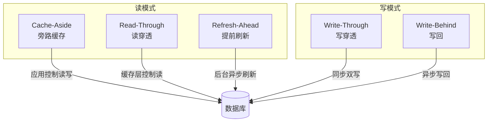
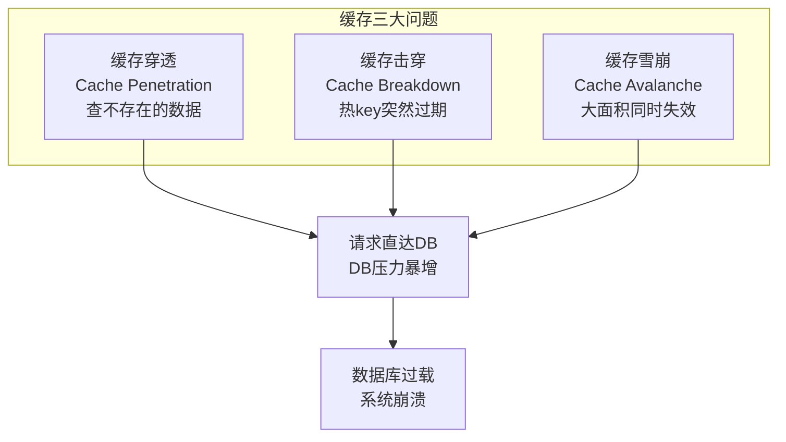
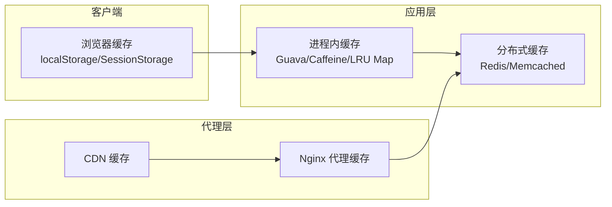
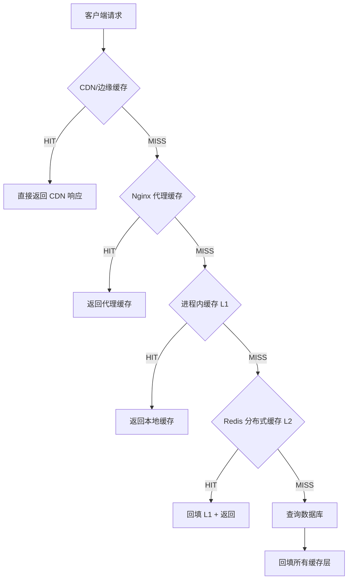
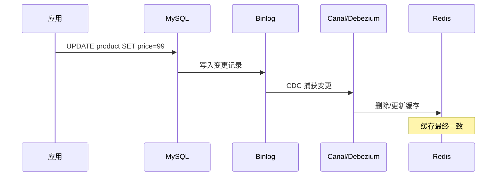

## 12.3 应用层缓存策略

### 12.3.1 什么是应用层缓存

上一节我们讨论了 CPU 硬件缓存的一致性协议 MESI。本节视角上移到软件层——**应用层缓存（Application-Level Caching）**是指开发者在应用程序代码中主动管理的缓存层，它位于业务逻辑与底层存储（数据库、远程服务）之间，目的是减少对慢速存储的访问次数，降低响应延迟，提升系统吞吐。

与硬件缓存的关键区别：

| 维度 | 硬件缓存（L1/L2/L3） | 应用层缓存 |
|------|----------------------|-----------|
| 管理者 | CPU 硬件/微架构 | 应用程序/开发者 |
| 一致性协议 | MESI/MOESI（硬件自动） | 代码逻辑（需手动实现） |
| 存储介质 | SRAM | 内存（堆外/堆内）、Redis、Memcached |
| 可见性 | 单 CPU 核心/单进程 | 跨进程、跨机器 |
| 淘汰粒度 | Cache Line（64字节） | 自定义键粒度（字节到 MB） |

应用层缓存之所以至关重要，是因为**数据库查询通常是系统中最慢的环节**。以 MySQL InnoDB 为例，一次 B+ 树索引查询的随机磁盘 IO 约需 5-10ms，而内存中哈希表查找仅需 100ns 左右——**相差 5-10 万倍**。即使有 SSD（~100μs），内存缓存仍然快 1000 倍。

从架构视角看，应用层缓存解决的核心矛盾是：**数据访问的局部性（时间局部性 + 空间局部性）与底层存储速度之间的鸿沟**。根据帕累托法则，一个系统中 80% 的请求往往集中在 20% 的数据上——这 20% 的"热数据"就是缓存的核心目标。缓存的本质是用空间换时间：用内存空间存储热数据的副本，避免每次请求都付出磁盘 IO 的代价。

### 12.3.2 五种经典缓存读写模式

应用层缓存的核心设计问题可以归纳为一个：**数据在缓存和数据库之间如何流动？** 这催生了五种经典模式，它们在一致性、延迟和复杂度之间做出不同的权衡。



#### 模式一：Cache-Aside（旁路缓存）

**最广泛使用的模式**。应用代码同时管理缓存和数据库的读写，缓存只是"旁路"——应用是唯一的协调者。

读流程：
  1. 应用先查缓存
  2. 命中 → 直接返回
  3. 未命中 → 查数据库 → 写入缓存 → 返回

写流程：
  1. 写数据库
  2. 删除缓存（而非更新缓存）

**为什么写操作要"删除"而不是"更新"？** 这是 Cache-Aside 最关键的设计决策。考虑两个并发写请求：请求 A 更新值为 1，请求 B 更新值为 2。如果按"先写数据库、再更新缓存"执行，由于网络延迟，可能出现：

时序问题（双写不一致）：
  A 写 DB → 1
  B 写 DB → 2
  B 更新缓存 → 2
  A 更新缓存 → 1  ← 脏数据！DB里是2，缓存里是1

而"删除缓存"策略只需等待一次读操作即可自愈，窗口更小、风险更低。

```python
# Cache-Aside 完整实现（Python + Redis）
import redis
import json
import hashlib

r = redis.Redis(host='localhost', port=6379, decode_responses=True)

def get_product(product_id: int) -> dict:
    """读取商品信息，Cache-Aside 模式"""
    cache_key = f"product:{product_id}"
    
    # 1. 先查缓存
    cached = r.get(cache_key)
    if cached:
        return json.loads(cached)
    
    # 2. 缓存未命中，查数据库
    product = db.query("SELECT * FROM products WHERE id = %s", product_id)
    if product is None:
        # 防缓存穿透：空值也缓存，但设短 TTL
        r.setex(cache_key, 60, json.dumps(None))
        return None
    
    # 3. 写入缓存，设置 TTL 防止永久脏数据
    r.setex(cache_key, 3600, json.dumps(product))
    return product

def update_product(product_id: int, data: dict):
    """更新商品信息，Cache-Aside 模式"""
    # 1. 先写数据库
    db.execute(
        "UPDATE products SET name=%s, price=%s WHERE id=%s",
        data['name'], data['price'], product_id
    )
    # 2. 再删除缓存
    r.delete(f"product:{product_id}")
```

**优点**：实现简单、缓存与存储完全解耦、天然支持多种缓存后端。

**缺点**：首次请求必有一次缓存 miss（冷启动问题）；缓存与数据库之间存在短暂不一致窗口。

**适用场景**：绝大多数通用 Web 应用，电商商品、用户信息、配置数据等。

#### 模式二：Read-Through（读穿透）

缓存层封装了数据库读取逻辑，应用只与缓存交互。当缓存未命中时，**缓存层自身**负责从数据库加载数据并填充缓存。

读流程：
  1. 应用查缓存
  2. 命中 → 返回
  3. 未命中 → 缓存层自动查DB → 填充缓存 → 返回

写流程：
  1. 写数据库
  2. 删除缓存

```python
# Read-Through 封装
class ReadThroughCache:
    def __init__(self, redis_client, loader_fn, ttl=3600):
        self.redis = redis_client
        self.loader = loader_fn  # 数据库加载函数
        self.ttl = ttl
    
    def get(self, key: str):
        cached = self.redis.get(key)
        if cached is not None:
            return json.loads(cached)
        
        # 缓存层自动加载，应用无感知
        data = self.loader(key)
        if data is not None:
            self.redis.setex(key, self.ttl, json.dumps(data))
        else:
            self.redis.setex(key, 60, json.dumps(None))
        return data

# 使用：应用只调 cache.get()，不需要自己写"查DB→填缓存"逻辑
product_cache = ReadThroughCache(
    redis_client=r,
    loader_fn=lambda k: db.query("SELECT * FROM products WHERE id=%s", k.split(':')[1])
)

product = product_cache.get("product:12345")
```

**与 Cache-Aside 的区别**：应用不直接接触数据库读取逻辑，封装性更好，团队间协作时数据库访问逻辑集中在缓存层。

**适用场景**：需要统一封装缓存访问的场景，如大型微服务架构中作为基础设施封装。

#### 模式三：Write-Through（写穿透）

写操作**同步**地同时更新缓存和数据库，保证两者数据始终一致。

写流程：
  1. 应用写缓存
  2. 缓存层同步写数据库（事务性）
  3. 两者都成功才返回

读流程：
  1. 直接读缓存（无需查DB）

```python
# Write-Through 实现（伪代码）
class WriteThroughCache:
    def __init__(self, redis_client, db_writer):
        self.redis = redis_client
        self.db_writer = db_writer
    
    def set(self, key: str, value, ttl=3600):
        """同步双写：缓存和数据库要么都成功，要么都回滚"""
        # 使用 Redis 事务 + DB 事务保证原子性
        pipe = self.redis.pipeline()
        try:
            db_tx = db.begin()
            pipe.setex(key, ttl, json.dumps(value))
            self.db_writer(key, value)
            db_tx.commit()
            pipe.execute()
        except Exception as e:
            db_tx.rollback()
            pipe.reset()
            raise

    def get(self, key: str):
        return self.redis.get(key)  # 读缓存即可，因为写保证了一致性
```

**优点**：读性能极高（永远命中缓存），数据一致性最好。

**缺点**：写延迟增加（必须等数据库写入完成），吞吐量受限于数据库写入速度。

**适用场景**：对数据一致性要求高且写入量不大的场景，如用户会话数据、实时库存（配合版本号防超卖）。

#### 模式四：Write-Behind / Write-Back（写回）

写操作**只更新缓存**，数据库更新由后台异步任务批量完成。这是性能最高但风险最大的模式。

写流程：
  1. 应用写缓存，立即返回
  2. 后台线程批量合并变更，异步写入数据库

读流程：
  1. 直接读缓存

```python
# Write-Behind 实现
import threading
from collections import defaultdict
from queue import Queue

class WriteBehindCache:
    def __init__(self, redis_client, batch_size=100, flush_interval=5):
        self.redis = redis_client
        self.write_queue = Queue()
        self.batch_size = batch_size
        self.flush_interval = flush_interval
        # 启动后台刷写线程
        self._start_flush_thread()
    
    def set(self, key: str, value, ttl=3600):
        """写操作：只写缓存，变更入队"""
        self.redis.setex(key, ttl, json.dumps(value))
        self.write_queue.put((key, value))
    
    def _start_flush_thread(self):
        def flush_loop():
            while True:
                batch = []
                # 攒批：凑够 batch_size 或等 flush_interval 秒
                while len(batch) < self.batch_size:
                    try:
                        item = self.write_queue.get(timeout=self.flush_interval)
                        batch.append(item)
                    except:
                        break
                if batch:
                    # 批量合并写入（相同 key 只保留最新值）
                    merged = {}
                    for k, v in batch:
                        merged[k] = v  # 覆盖写，保留最新
                    self._batch_write_db(merged)
        
        t = threading.Thread(target=flush_loop, daemon=True)
        t.start()
    
    def _batch_write_db(self, merged: dict):
        """批量写入数据库"""
        with db.transaction():
            for key, value in merged.items():
                product_id = key.split(':')[1]
                db.execute(
                    "INSERT INTO products (id, data) VALUES (%s, %s) "
                    "ON DUPLICATE KEY UPDATE data = %s",
                    product_id, json.dumps(value), json.dumps(value)
                )
```

**优点**：写延迟极低（仅缓存写入延迟），批量合并减少数据库压力。

**缺点**：缓存宕机可能丢失未刷写的数据；一致性延迟较高。

**适用场景**：写多读多、可容忍短暂不一致的场景，如用户行为日志、浏览历史、点赞计数、限流计数器。

#### 模式五：Refresh-Ahead（提前刷新）

在缓存数据即将过期时，**异步后台任务提前刷新**，保证用户请求永远命中热缓存。

流程：
  1. 设置 TTL 为 T
  2. 在 T × 80% 时刻，后台线程异步刷新缓存
  3. 用户请求到来时，始终命中有效缓存

```python
# Refresh-Ahead 实现
import asyncio

class RefreshAheadCache:
    def __init__(self, redis_client, loader_fn, ttl=3600, refresh_ratio=0.8):
        self.redis = redis_client
        self.loader = loader_fn
        self.ttl = ttl
        self.refresh_threshold = int(ttl * refresh_ratio)  # 80% 时触发刷新
    
    def get(self, key: str):
        remaining_ttl = self.redis.ttl(key)
        
        # TTL 消耗超过阈值，异步刷新
        if 0 < remaining_ttl <= self.refresh_threshold:
            asyncio.create_task(self._async_refresh(key))
        
        cached = self.redis.get(key)
        if cached is not None:
            return json.loads(cached)
        
        # 首次加载
        data = self.loader(key)
        if data:
            self.redis.setex(key, self.ttl, json.dumps(data))
        return data
    
    async def _async_refresh(self, key: str):
        """异步刷新：用户请求不会被阻塞"""
        data = await asyncio.to_thread(self.loader, key)
        if data:
            self.redis.setex(key, self.ttl, json.dumps(data))
```

**优点**：用户请求零延迟（几乎总是命中缓存），体验最好。

**缺点**：实现复杂；需要精确预估数据访问频率；预刷新可能浪费资源。

**适用场景**：访问模式可预测、对延迟极度敏感的场景，如首页热点推荐、社交媒体热门 Feed。

### 12.3.3 五种模式对比总结

| 模式 | 读延迟 | 写延迟 | 一致性 | 实现复杂度 | 数据丢失风险 | 典型场景 |
|------|--------|--------|--------|-----------|-------------|---------|
| Cache-Aside | 中（miss 时查DB） | 中（删缓存+写DB） | 最终一致 | 低 | 低 | 通用 Web 应用 |
| Read-Through | 中（miss 时自动加载） | 中（同 Cache-Aside） | 最终一致 | 中 | 低 | 微服务基础设施封装 |
| Write-Through | 低（始终命中） | 高（同步双写） | 强一致 | 中 | 低 | 实时库存、用户会话 |
| Write-Behind | 低（始终命中） | 极低（异步批量） | 弱一致 | 高 | 中 | 日志、计数器、行为数据 |
| Refresh-Ahead | 极低（预热命中） | 中 | 最终一致 | 高 | 低 | 热点数据、Feed 流 |

**实践建议**：绝大多数项目从 **Cache-Aside** 开始。只有当 Cache-Aside 无法满足特定需求时，才考虑其他模式。不要为了"架构优雅"而引入不必要的复杂性。

### 12.3.4 缓存三大问题：穿透、击穿与雪崩

在实际生产环境中，缓存系统面临的最严峻挑战并非读写模式的选择，而是三大经典问题。这三个问题在面试和生产故障中反复出现，理解它们的成因和解法是每个后端工程师的基本功。



#### 问题一：缓存穿透（Cache Penetration）

**定义**：查询一个**一定不存在**的数据。由于缓存不命中，每次请求都打到数据库，而数据库也查不到，自然不会写入缓存——导致**所有相同请求永远穿透到数据库**。

**典型场景**：
- 恶意攻击：随机生成不存在的 ID 发起大量请求（如 id = -1, id = 999999999）
- 业务 bug：查询条件错误，导致查不到数据
- 爬虫扫描：遍历不存在的资源路径

**危害**：如果每秒 10000 次请求中有一半是不存在的 key，这些请求全部打到数据库，直接导致数据库连接池耗尽、CPU 飙升。

**解决方案**：

**方案 1：缓存空值（最简单）**

```python
def get_product_with_null_cache(product_id: int):
    cache_key = f"product:{product_id}"
    cached = r.get(cache_key)
    
    # 空值标记：如果缓存中存的是 "NULL" 字符串
    if cached == "NULL":
        return None
    if cached:
        return json.loads(cached)
    
    product = db.query("SELECT * FROM products WHERE id = %s", product_id)
    if product is None:
        # 空值也缓存，但 TTL 很短（防止正常数据变更后仍返回空）
        r.setex(cache_key, 60, "NULL")
        return None
    
    r.setex(cache_key, 3600, json.dumps(product))
    return product
```

优点是实现简单，缺点是占用了额外的缓存空间，且如果大量 key 都不存在，空值 key 会挤占正常缓存。通常将空值 TTL 设为正常数据的 1/10~1/30。

**方案 2：布隆过滤器（Bloom Filter，更优雅）**

布隆过滤器是一种概率型数据结构，可以高效判断一个元素"可能存在"或"一定不存在"。在缓存层前置一个布隆过滤器，拦截所有一定不存在的请求：

```python
# 使用 redis-bloom 模块
# Redis 命令：BF.ADD / BF.EXISTS

# 初始化阶段：将数据库所有有效 ID 加入布隆过滤器
def init_bloom_filter():
    all_ids = db.query("SELECT id FROM products")
    pipe = r.pipeline()
    for row in all_ids:
        pipe.execute_command("BF.ADD", "product_bloom", str(row['id']))
    pipe.execute()

# 查询阶段：先检查布隆过滤器
def get_product_with_bloom(product_id: int):
    cache_key = f"product:{product_id}"
    
    # 第一道防线：布隆过滤器拦截不存在的 key
    if not r.execute_command("BF.EXISTS", "product_bloom", str(product_id)):
        return None  # 一定不存在，直接返回
    
    # 第二道防线：正常缓存逻辑
    cached = r.get(cache_key)
    if cached:
        return json.loads(cached) if cached != "NULL" else None
    
    product = db.query("SELECT * FROM products WHERE id = %s", product_id)
    if product is None:
        r.setex(cache_key, 60, "NULL")
        return None
    r.setex(cache_key, 3600, json.dumps(product))
    return product
```

布隆过滤器的优势：空间效率极高（1亿个 ID 仅需 ~120MB），查询速度 O(k)（k 为哈希函数个数，通常 3-7）。缺点是有假阳性（误判存在），但不会漏判（不会误判不存在）——这对防穿透场景是完美的特性。

> **生产选型建议**：ID 有明确范围（如自增 ID）的场景用缓存空值即可；ID 范围不确定（如 UUID）或攻击面大的场景必须上布隆过滤器。两者可以叠加使用。

#### 问题二：缓存击穿（Cache Breakdown / Stampede）

**定义**：某个**热 key**（被大量并发访问的数据）突然过期或失效，大量请求同时打到数据库，形成"集中穿透"效应。与缓存穿透的区别是：穿透查的是不存在的数据，击穿查的是真实存在但缓存刚失效的数据。

**典型场景**：
- 电商秒杀商品：缓存刚好过期，同时有 5000 个请求到达
- 明星微博：热搜话题的缓存失效瞬间，百万粉丝同时刷新
- 热点配置：系统配置缓存失效，所有服务实例同时重新加载

**危害**：单个热 key 的瞬时并发可能达到数万 QPS，直接压垮数据库。与缓存雪崩的区别是：击穿是"单点爆破"（一个 key），雪崩是"面状崩溃"（大面积 key 同时失效）。

**解决方案**：

**方案 1：互斥锁（Mutex Lock）——最经典**

当缓存未命中时，只允许一个线程去查数据库并回填缓存，其他线程等待或返回旧数据：

```python
import time
import threading

def get_product_with_mutex(product_id: int, max_wait=0.5):
    cache_key = f"product:{product_id}"
    lock_key = f"lock:product:{product_id}"
    
    cached = r.get(cache_key)
    if cached:
        return json.loads(cached)
    
    # 尝试获取分布式锁
    acquired = r.set(lock_key, "1", nx=True, ex=10)  # 10秒自动过期
    
    if acquired:
        try:
            # 获取锁成功：查数据库并回填缓存
            product = db.query("SELECT * FROM products WHERE id = %s", product_id)
            if product is None:
                r.setex(cache_key, 60, "NULL")
            else:
                r.setex(cache_key, 3600, json.dumps(product))
            return product
        finally:
            r.delete(lock_key)
    else:
        # 未获取锁：轮询等待缓存回填
        deadline = time.time() + max_wait
        while time.time() < deadline:
            time.sleep(0.05)  # 50ms 轮询间隔
            cached = r.get(cache_key)
            if cached:
                return json.loads(cached) if cached != "NULL" else None
        # 等待超时，降级为直接查数据库
        return db.query("SELECT * FROM products WHERE id = %s", product_id)
```

这种方案保证了缓存失效时只有一个线程查数据库，其他线程要么等待缓存回填，要么降级。缺点是等待期间请求延迟增加，且在高并发下轮询本身也有开销。

**方案 2：逻辑过期（逻辑 TTL 替代物理 TTL）**

在 value 中嵌入逻辑过期时间，查询时判断是否逻辑过期。过期时不删除 key，而是异步更新：

```python
import threading
from dataclasses import dataclass

@dataclass
class CacheValue:
    data: any
    expire_at: int  # 逻辑过期时间戳

def get_product_with_logical_ttl(product_id: int):
    cache_key = f"product:{product_id}"
    cached = r.get(cache_key)
    
    if cached is None:
        return None  # 首次加载，不在击穿讨论范围内
    
    cache_val = json.loads(cached)
    expire_at = cache_val.get('expire_at', 0)
    
    if time.time() < expire_at:
        # 未过期：正常返回
        return cache_val['data']
    
    # 逻辑过期：返回旧数据，异步刷新
    lock_key = f"lock:logical:{product_id}"
    if r.set(lock_key, "1", nx=True, ex=10):
        # 只有一个线程负责异步刷新
        threading.Thread(
            target=_refresh_product,
            args=(product_id, cache_key),
            daemon=True
        ).start()
    
    return cache_val['data']  # 立即返回旧数据，不阻塞用户

def _refresh_product(product_id, cache_key):
    try:
        product = db.query("SELECT * FROM products WHERE id = %s", product_id)
        new_val = {
            'data': product,
            'expire_at': int(time.time()) + 3600
        }
        r.set(cache_key, json.dumps(new_val))
    finally:
        r.delete(f"lock:logical:{product_id}")
```

这种方案的优势是**用户请求零等待**，代价是可能返回稍旧的数据。适用于对一致性要求不高但对延迟极度敏感的场景。

**方案 3：永不过期 + 后台刷新（适合极热数据）**

对于访问量极大的 key（如首页数据），可以设置极长的 TTL（如 24 小时）甚至不设过期，通过后台定时任务主动刷新。这完全消除了击穿的可能性，代价是增加了定时任务的复杂度。

> **方案选择**：一般场景用互斥锁，延迟敏感场景用逻辑过期，极热数据用后台刷新。三者可以分层组合使用。

#### 问题三：缓存雪崩（Cache Avalanche）

**定义**：大量缓存 key 在**同一时间段内集中过期**，导致大量请求瞬间打到数据库。与击穿的区别是：雪崩是"面"的问题（大量 key），击穿是"点"的问题（单个热 key）。

**触发条件**：
- 系统重启后大量 key 同时设置相同的 TTL
- 某个定时任务批量加载数据，统一设置 1 小时过期
- Redis 主节点宕机，所有缓存全部失效

**危害**：这是最严重的缓存故障。正常情况下数据库只承担 20% 的穿透流量，雪崩时突然变成 100%——相当于数据库瞬时承受 5 倍负载，几乎必然导致数据库连接池耗尽、响应超时，进而引发级联故障（上游服务超时 → 重试风暴 → 整个系统雪崩）。

**解决方案**：

**方案 1：TTL 抖动（Jitter）——最基础**

给 TTL 加随机偏移量，让过期时间自然分散，避免同一时刻大量 key 同时失效：

```python
import random

def get_ttl_with_jitter(base_ttl: int, jitter_ratio: float = 0.1) -> int:
    """带抖动的 TTL：base_ttl ± jitter_ratio"""
    jitter = int(base_ttl * jitter_ratio)
    return base_ttl + random.randint(-jitter, jitter)

# 例：基础 TTL 3600s（1小时），抖动 ±10%
# 实际 TTL 范围：3240s ~ 3960s（54分钟 ~ 66分钟）
# 过期时间被自然分散到 12 分钟的窗口内
r.setex("product:12345", get_ttl_with_jitter(3600), json.dumps(product))
```

抖动比例通常设 5%-20%。太小（<5%）分散效果不明显，太大（>30%）会导致同一 key 的不同实例数据不一致时间过长。

**方案 2：多级缓存（L1 + L2）**

引入本地缓存（L1）+ 分布式缓存（L2）的双层架构。即使 Redis 完全宕机，本地缓存仍然能兜底：

```python
# 多级缓存实现
from cachetools import TTLCache

# L1：进程内缓存（10秒 TTL，防止实例间数据差异过大）
l1_cache = TTLCache(maxsize=1000, ttl=10)

# L2：Redis 分布式缓存（1小时 TTL）
L2_TTL = 3600

def get_product_multi_level(product_id: int):
    cache_key = f"product:{product_id}"
    
    # 先查 L1
    if cache_key in l1_cache:
        return l1_cache[cache_key]
    
    # 再查 L2（Redis）
    cached = r.get(cache_key)
    if cached and cached != "NULL":
        data = json.loads(cached)
        l1_cache[cache_key] = data  # 回填 L1
        return data
    
    # 都没命中，查数据库
    product = db.query("SELECT * FROM products WHERE id = %s", product_id)
    if product is None:
        r.setex(cache_key, 60, "NULL")
        l1_cache[cache_key] = None
    else:
        r.setex(cache_key, L2_TTL, json.dumps(product))
        l1_cache[cache_key] = product
    return product
```

这种方案在 Redis 故障时提供了降级能力：L1 仍能命中热点数据（虽然不共享），非热点数据直接打到数据库。**L1 的 TTL 必须很短**（5-30 秒），否则多实例间的数据不一致窗口过大。

**方案 3：Redis 高可用部署**

防雪崩的根本是**Redis 本身不能挂**。部署方案从简单到复杂：

| 部署模式 | 高可用能力 | 适用场景 |
|---------|-----------|---------|
| 单节点 | 无（故障即雪崩） | 开发/测试 |
| 主从 + Sentinel | 自动故障转移，秒级切换 | 中小规模生产 |
| Redis Cluster | 数据分片 + 自动故障转移 | 大规模生产 |
| Redis Cluster + 代理层 | 客户端无感知切换 | 超大规模生产 |

**方案 4：限流降级——最后防线**

当缓存和数据库都扛不住时，限流是最后的防线。确保数据库永远不被压垮：

```python
import time
from collections import deque

class TokenBucketRateLimiter:
    """令牌桶限流器：限制每秒请求到数据库的速率"""
    
    def __init__(self, capacity: int = 100, refill_rate: float = 100):
        self.capacity = capacity        # 桶容量
        self.refill_rate = refill_rate  # 每秒补充令牌数
        self.tokens = capacity
        self.last_refill = time.time()
        self.lock = threading.Lock()
    
    def acquire(self) -> bool:
        with self.lock:
            now = time.time()
            elapsed = now - self.last_refill
            self.tokens = min(self.capacity, self.tokens + elapsed * self.refill_rate)
            self.last_refill = now
            
            if self.tokens >= 1:
                self.tokens -= 1
                return True
            return False

# 使用：缓存未命中时，先获取令牌再查 DB
db_limiter = TokenBucketRateLimiter(capacity=100, refill_rate=100)

def get_product_safe(product_id: int):
    cache_key = f"product:{product_id}"
    cached = r.get(cache_key)
    if cached:
        return json.loads(cached) if cached != "NULL" else None
    
    # 限制数据库查询速率：最多 100 QPS
    if not db_limiter.acquire():
        # 限流：返回兜底数据或降级响应
        return get_product_fallback(product_id)
    
    product = db.query("SELECT * FROM products WHERE id = %s", product_id)
    # ... 回填缓存逻辑
    return product
```

> **三层防御体系**：TTL 抖动（预防）→ 多级缓存 + 高可用（兜底）→ 限流降级（止损）。在生产环境中，这三层应同时部署，形成纵深防御。

#### 三大问题对比总结

| 问题 | 本质 | 触发条件 | 影响范围 | 核心解法 |
|------|------|---------|---------|---------|
| 缓存穿透 | 查不存在的数据 | 恶意请求/业务bug | 所有无效请求 | 缓存空值 / 布隆过滤器 |
| 缓存击穿 | 热key突然失效 | 热点数据过期/失效 | 单个热key的并发 | 互斥锁 / 逻辑过期 / 后台刷新 |
| 缓存雪崩 | 大面积key同时过期 | TTL设置不当/Redis宕机 | 全量请求 | TTL抖动 / 多级缓存 / 限流降级 |

### 12.3.5 缓存放置策略：数据应该存在哪里

除了"怎么读写"，另一个核心问题是"缓存放哪里"。不同的放置位置决定了延迟、容量和运维复杂度。



#### 进程内缓存（Local Cache）

进程内缓存直接存放在应用进程的内存空间中，是最快的缓存层。

| 特性 | 详情 |
|------|------|
| 延迟 | ~100ns（内存直接访问，无网络开销） |
| 容量 | 受限于单机内存，通常 MB 到 GB 级 |
| 一致性 | 进程内强一致，跨进程不一致 |
| 适用工具 | Java: Caffeine, Guava Cache；Python: cachetools, functools.lru_cache；Go: go-cache, sync.Map |

```java
// Java Caffeine 进程内缓存示例
import com.github.benmanes.caffeine.cache.Caffeine;
import com.github.benmanes.caffeine.cache.Cache;
import java.util.concurrent.TimeUnit;

Cache<String, Product> productCache = Caffeine.newBuilder()
    .maximumSize(10_000)           // 最多缓存1万个对象
    .expireAfterWrite(30, TimeUnit.MINUTES)  // 写入30分钟后过期
    .recordStats()                 // 开启命中率统计
    .build();

Product product = productCache.get("product:12345", 
    key -> db.queryProduct(key.split(":")[1]));  // 自动加载
```

```python
# Python cachetools 进程内缓存示例
from cachetools import TTLCache, LRUCache

# TTL 缓存：每条记录 30 分钟过期，最多存 10000 条
product_cache = TTLCache(maxsize=10000, ttl=1800)

def get_product(product_id: int):
    key = f"product:{product_id}"
    if key in product_cache:
        return product_cache[key]
    product = db.query("SELECT * FROM products WHERE id = %s", product_id)
    product_cache[key] = product
    return product
```

**多实例一致性问题**：当应用部署了多个实例时，每个实例各自维护一份进程内缓存，**无法保证跨实例一致性**。解决方案：
- 接受短暂不一致（大多数场景可接受）
- 结合 Redis 做二级缓存，发布/订阅变更事件触发本地缓存失效
- 使用分布式缓存作为唯一真相源

#### 分布式缓存（Distributed Cache）

Redis 和 Memcached 是最主流的分布式缓存方案，它们解决了多实例间的数据共享问题。

| 特性 | Redis | Memcached |
|------|-------|-----------|
| 数据结构 | String/Hash/List/Set/ZSet/Stream | 仅 String（Key-Value） |
| 持久化 | 支持 RDB + AOF | 不支持 |
| 集群 | Redis Cluster（原生分片） | 客户端一致性哈希分片 |
| 延迟 | ~0.5-2ms（取决于网络） | ~0.3-1ms |
| 内存效率 | 中等（有额外数据结构开销） | 高（Slab Allocator） |
| 发布订阅 | 支持 | 不支持 |
| Lua 脚本 | 支持 | 不支持 |

详细对比见下一节 12.5 Redis 与 Memcached 架构对比。

#### CDN 缓存与代理缓存

CDN（Content Delivery Network）和 Nginx 反向代理缓存属于**边缘缓存层**，主要缓存 HTTP 响应。

```nginx
# Nginx 代理缓存配置
proxy_cache_path /tmp/nginx_cache levels=1:2 
    keys_zone=product_cache:10m max_size=1g inactive=60m;

server {
    location /api/product/ {
        proxy_cache product_cache;
        proxy_cache_valid 200 10m;       # 200 响应缓存 10 分钟
        proxy_cache_valid 404 1m;        # 404 缓存 1 分钟
        proxy_cache_use_stale error timeout updating;  # 后端故障时返回旧缓存
        add_header X-Cache-Status $upstream_cache_status;  # 调试头
        
        proxy_pass http://backend;
    }
}
```

通过 `X-Cache-Status` 响应头可以判断缓存状态：`HIT`（命中）、`MISS`（未命中）、`EXPIRED`（已过期）、`STALE`（使用过期数据）。

#### 多级缓存架构设计

在大规模系统中，单一缓存层往往不够——需要将进程内缓存、分布式缓存、CDN/代理缓存组合成多级缓存体系。每一级缓存承担不同的职责：



**设计原则**：

| 原则 | 说明 |
|------|------|
| 越靠近用户越快 | CDN 延迟 < 进程内缓存 < Redis < 数据库 |
| 越靠近用户越不可控 | CDN 缓存刷新困难，进程内缓存一致性最差 |
| TTL 逐级递减 | CDN: 小时级 → 进程内: 秒级 → Redis: 分钟/小时级 |
| 失效自上而下 | 上层缓存先失效，防止用户永远读到旧数据 |

**一致性保障**：当数据变更时，应自上而下逐级清除缓存：先清除 CDN（通过 CDN API 或版本化 URL），再清除进程内缓存（通过 Redis Pub/Sub 广播失效事件），最后清除 Redis 缓存。

### 12.3.6 缓存热 key 与大 key 问题

除了穿透、击穿、雪崩三大经典问题，生产环境中还有两个高频故障源：热 key 和大 key。它们不是"理论问题"，而是直接导致 Redis 性能劣化甚至崩溃的实战问题。

#### 热 key（Hot Key）

**定义**：某个 key 的访问频率远高于其他 key（如热点商品、明星微博），导致单个 Redis 分片承受巨大压力。Redis 单实例 QPS 上限约为 10 万，一个热 key 如果达到数万 QPS，就可能打满单分片。

**识别方法**：

```bash
# 方法1：Redis 4.0+ 的 LFU 策略可以统计访问频率
redis-cli --hotkeys  # 需要 maxmemory-policy 设置为 LFU 类策略

# 方法2：MONITOR 命令采样（生产慎用，性能影响大）
redis-cli MONITOR | head -1000 | awk '{print $NF}' | sort | uniq -c | sort -rn

# 方法3：客户端埋点统计
# 在应用层统计每个 key 的访问次数，定期上报
```

**解决方案**：

| 方案 | 原理 | 适用场景 |
|------|------|---------|
| 本地缓存 | 热 key 缓存到进程内，避开 Redis | 读多写少的热 key |
| key 拆分 | `hot_key` → `hot_key_1`, `hot_key_2`, ... 拆到多个 slot | 写也频繁的热 key |
| 读写分离 | 热 key 的读请求路由到从节点 | 读远大于写 |
| 读复制 | 同一份数据缓存多份到不同 slot | 极端读热点 |

**本地缓存 + Pub/Sub 失效**的完整实现：

```python
# 热 key 本地缓存 + Redis Pub/Sub 实时失效
import redis
import json
from cachetools import TTLCache

# 本地缓存：TTL 5秒（很短，保证基本一致性）
hot_cache = TTLCache(maxsize=500, ttl=5)
pubsub = r.pubsub()

def get_hot_product(product_id: int):
    key = f"product:{product_id}"
    
    # 优先查本地缓存
    if key in hot_cache:
        return hot_cache[key]
    
    # 本地未命中，查 Redis
    cached = r.get(key)
    if cached:
        data = json.loads(cached)
        hot_cache[key] = data  # 回填本地缓存
        return data
    
    # Redis 也未命中，查数据库
    product = db.query("SELECT * FROM products WHERE id = %s", product_id)
    r.setex(key, 3600, json.dumps(product))
    hot_cache[key] = product
    return product

# 后台监听失效事件
def start_invalidation_listener():
    def listener():
        pubsub.subscribe("cache:invalidate")
        for message in pubsub.listen():
            if message['type'] == 'message':
                keys_to_invalidate = json.loads(message['data'])
                for k in keys_to_invalidate:
                    hot_cache.pop(k, None)  # 删除本地缓存
    
    threading.Thread(target=listener, daemon=True).start()

# 数据变更时发布失效消息
def update_product_and_invalidate(product_id: int, data: dict):
    db.execute("UPDATE products SET ... WHERE id = %s", product_id)
    key = f"product:{product_id}"
    r.delete(key)  # 删 Redis 缓存
    # Pub/Sub 广播失效，所有实例的本地缓存同步清除
    r.publish("cache:invalidate", json.dumps([key]))
```

#### 大 key（Big Key）

**定义**：某个 key 存储的 value 体积过大（如 Hash 存了百万字段、String 存了 10MB 的 JSON），导致 Redis 操作阻塞。大 key 的危害是多方面的：

- **读写阻塞**：单个 GET/SET 操作耗时从微秒级退化到毫秒级甚至秒级
- **内存不均**：Redis Cluster 中大 key 所在 slot 的节点内存远高于其他节点
- **网络阻塞**：一次传输 10MB 数据会短暂占满网络带宽
- **删除危险**：`DEL big_key` 是 O(n) 操作，会导致 Redis 阻塞数秒

**识别方法**：

```bash
# 方法1：redis-cli --bigkeys（扫描所有 key，找出各类型的最大 key）
redis-cli --bigkeys

# 方法2：MEMORY USAGE 查看单个 key 的内存占用
redis-cli MEMORY USAGE "product:12345"

# 方法3：RDB 文件离线分析（rdb-tools）
pip install rdbtools python-lzf
rdb -c memory dump.rdb --bytes 1024 -f bigkeys.csv
```

**解决方案**：

| 大 key 类型 | 问题 | 解法 |
|------------|------|------|
| 大 String | 单个 value 过大 | 拆分为多个小 key；压缩（gzip/zstd） |
| 大 Hash | 字段过多 | 按业务维度拆分 hash；使用 zset 分片 |
| 大 List/Set | 元素过多 | 按时间/ID 分段存储 |
| 大 Sorted Set | 成员过多 | 按分数区间拆分 |

**安全删除大 key**：

```python
def safe_delete_big_key(redis_client, key: str):
    """安全删除大 key：使用 UNLINK 异步删除，不阻塞 Redis"""
    # UNLINK 是 Redis 4.0+ 的异步删除命令
    # 它在后台线程中释放内存，不阻塞主线程
    redis_client.unlink(key)

# 对于 Redis 4.0 之前的版本，使用 SCAN 分批删除
def safe_delete_hash(redis_client, key: str, batch_size=100):
    """分批删除大 Hash 的字段"""
    cursor = 0
    while True:
        cursor, fields = redis_client.hscan(key, cursor=cursor, count=batch_size)
        if fields:
            pipe = redis_client.pipeline()
            for field in fields:
                pipe.hdel(key, field)
            pipe.execute()
        if cursor == 0:
            break
    redis_client.delete(key)  # 最后删除空 key
```

### 12.3.7 缓存预热：系统启动时的数据准备

**缓存预热（Cache Preheating）**是指在系统启动或新功能上线前，主动将热点数据加载到缓存中，避免启动初期大量缓存 miss 导致数据库压力骤增。

**为什么需要预热？** 以一个日均 1000 万 PV 的电商首页为例：假设首页有 50 个热点商品，Redis 重启后缓存全部失效，第一个请求到来时触发 50 个缓存 miss，每个 miss 查一次数据库。这本身不算什么。但问题是：**前 50 个请求会在毫秒级内全部到达**，因为前端会并发请求所有商品数据。加上用户看到慢页面后的 F5 刷新、浏览器重试，前几秒的数据库压力可能是稳态的 10-50 倍。

```python
# 缓存预热脚本
def warmup_product_cache():
    """启动时预热商品缓存"""
    # 方法1：全量预热（适合数据量小的场景）
    products = db.query("SELECT * FROM products WHERE is_hot = 1")
    pipe = r.pipeline()
    for product in products:
        key = f"product:{product['id']}"
        pipe.setex(key, 3600, json.dumps(product))
    pipe.execute()
    print(f"预热完成：{len(products)} 个商品")

# 方法2：增量预热（适合数据量大的场景）
def warmup_from_access_log():
    """根据最近的访问日志预热热 key"""
    hot_keys = db.query(
        "SELECT product_id, COUNT(*) as cnt "
        "FROM access_log "
        "WHERE created_at > NOW() - INTERVAL 1 HOUR "
        "GROUP BY product_id ORDER BY cnt DESC LIMIT 100"
    )
    for item in hot_keys:
        product = db.query("SELECT * FROM products WHERE id = %s", item['product_id'])
        r.setex(f"product:{item['product_id']}", 3600, json.dumps(product))
    print(f"增量预热完成：{len(hot_keys)} 个热商品")
```

**预热的注意事项**：
- 预热应该**渐进式执行**，不要一次性加载全量数据导致数据库压力骤增
- 预热期间应用应该使用**优雅启动**（ready probe），在缓存预热完成后再接流量
- Kubernetes 环境下可以用 `postStart` hook 或 initContainer 执行预热脚本

### 12.3.8 缓存淘汰策略

当缓存空间用尽时，需要决定淘汰哪些数据。不同策略适用于不同的访问模式。

| 策略 | 全称 | 原理 | 适用场景 | 缺点 |
|------|------|------|---------|------|
| LRU | Least Recently Used | 淘汰最久未访问的 | 通用 Web（热点集中） | 偶发大量扫描会污染缓存 |
| LFU | Least Frequently Used | 淘汰访问频率最低的 | 长期热点分布稳定 | 对突发热点响应慢 |
| FIFO | First In First Out | 淘汰最早写入的 | 消息队列、日志 | 不考虑访问频率 |
| TTL | Time To Live | 超时自动过期 | 需要时效性的数据 | 不考虑空间压力 |
| Random | 随机淘汰 | 随机移除 | 无明显热点分布 | 不可预测 |
| W-TinyLFU | Window-TinyLFU | LRU + 频率计数混合 | 现代缓存（Caffeine 默认） | 实现复杂 |

**LRU 的经典实现**：双向链表 + 哈希表，所有操作 O(1)：

```python
from collections import OrderedDict

class LRUCache:
    """线程不安全版 LRU Cache，线程安全版参考本章核心技巧1"""
    
    def __init__(self, capacity: int):
        self.capacity = capacity
        self.cache = OrderedDict()
    
    def get(self, key: str):
        if key not in self.cache:
            return None
        # 移到末尾（标记为最近使用）
        self.cache.move_to_end(key)
        return self.cache[key]
    
    def put(self, key: str, value):
        if key in self.cache:
            self.cache.move_to_end(key)
        self.cache[key] = value
        if len(self.cache) > self.capacity:
            # 淘汰最久未使用的（头部）
            self.cache.popitem(last=False)
```

**W-TinyLFU：现代缓存的最优解**。Caffeine（Java）和 dgraph-io/ristretto（Go）采用的算法，结合了 LRU 的空间效率和 LFU 的频率感知，通过 Count-Min Sketch 实现近似频率统计，内存开销仅 8 字节/条目。实测中 W-TinyLFU 的命中率比纯 LRU 高 10%-30%。

**Redis 的淘汰策略配置**：Redis 提供 8 种淘汰策略（`maxmemory-policy`），分为两大类：

- **非精准淘汰**（allkeys / volatile 开头）：allkeys 对所有 key 生效，volatile 只对设了 TTL 的 key 生效
- **淘汰算法**：`noeviction`（不淘汰，写入报错）、`allkeys-lru`、`volatile-lru`、`allkeys-lfu`（Redis 4.0+）、`volatile-lfu`、`allkeys-random`、`volatile-random`、`volatile-ttl`

```bash
# 推荐配置：对所有 key 使用 LFU 策略（Redis 4.0+）
# 如果没有设置 maxmemory-policy 为 LFU，至少用 LRU
redis-cli CONFIG SET maxmemory-policy allkeys-lru

# 设置 Redis 最大内存为 4GB
redis-cli CONFIG SET maxmemory 4gb
```

### 12.3.9 缓存 TTL 策略：过期时间设计

TTL（Time To Live）是控制缓存数据生命周期的核心机制。TTL 设计不当会导致大量问题。

**TTL 选择原则**：

| 数据特征 | 推荐 TTL | 原因 |
|---------|---------|------|
| 实时性高（余额、库存） | 不缓存或 ≤5s | 数据即时性要求高 |
| 准实时（用户资料） | 5-30min | 适度延迟可接受 |
| 准静态（商品分类） | 1-24h | 变更频率低 |
| 静态（国家列表、字典） | 24h 或更长 | 几乎不变 |
| 热点内容（排行榜） | 30s-5min | 需要频繁更新 |

**TTL 抖动（Jitter）：防止缓存雪崩**。当大量缓存 key 同时设置相同 TTL 时，会在同一时刻同时过期，导致大量请求击穿到数据库。解决方案是给 TTL 加一个随机偏移量：

```python
import random

def get_ttl_with_jitter(base_ttl: int, jitter_ratio: float = 0.1) -> int:
    """带抖动的 TTL：base_ttl ± jitter_ratio"""
    jitter = int(base_ttl * jitter_ratio)
    return base_ttl + random.randint(-jitter, jitter)

# 例：基础 TTL 3600s（1小时），抖动 ±10%
# 实际 TTL 范围：3240s ~ 3960s（54分钟 ~ 66分钟）
r.setex("product:12345", get_ttl_with_jitter(3600), json.dumps(product))
```

**热 key 动态 TTL**：根据数据热度动态调整过期时间，热点数据自动续期：

```python
def get_with_auto_renew(key: str, base_ttl: int = 3600, renew_threshold: float = 0.3):
    """热点数据自动续期：TTL 剩余不足30%时自动延长"""
    value = r.get(key)
    if value is None:
        return None
    
    remaining_ttl = r.ttl(key)
    if 0 < remaining_ttl < base_ttl * renew_threshold:
        # 热点数据续期
        r.expire(key, base_ttl)
    
    return json.loads(value)
```

### 12.3.10 缓存与数据库的一致性保障

缓存一致性是应用层缓存中最棘手的问题。以下是最常用的三种方案：

#### 方案一：先删缓存，再更新数据库

请求A: 删除缓存 → [延迟] → 写DB
请求B: 读缓存(miss) → 读DB(旧数据) → 写缓存(旧数据)
结果：缓存中是旧数据，DB中是新数据 ← 不一致！

**不一致窗口**：读请求 B 恰好在删除缓存和写入数据库之间发生，就会读到旧数据并写入缓存。

#### 方案二：先更新数据库，再删除缓存（推荐）

请求A: 写DB → 删除缓存
请求B: 读缓存(miss) → 读DB(新数据) → 写缓存(新数据)
结果：一致！

这是业界推荐的方案。不一致窗口更窄——只有当"读请求在写DB之后、删缓存之前"恰好命中缓存失效时才可能出现问题。而这个窗口通常只有微秒级。

**延迟双删**：进一步缩小不一致窗口：

```python
def update_with_double_delete(product_id: int, data: dict):
    """延迟双删策略"""
    # 1. 先删缓存
    r.delete(f"product:{product_id}")
    
    # 2. 更新数据库
    db.execute("UPDATE products SET ... WHERE id = %s", product_id)
    
    # 3. 延迟后再删一次（等主从同步完成）
    import time
    time.sleep(0.5)  # 等待一次主从同步周期
    r.delete(f"product:{product_id}")
```

#### 方案三：基于 Binlog 的异步同步（最可靠）

通过监听 MySQL binlog / MongoDB oplog，异步更新缓存，彻底解耦缓存与数据库的写入操作。



| 方案 | 一致性保证 | 复杂度 | 性能影响 | 推荐指数 |
|------|-----------|--------|---------|---------|
| 先删缓存再更新DB | 低（窗口大） | 低 | 低 | ⭐⭐ |
| 先更新DB再删缓存 | 中（窗口小） | 低 | 低 | ⭐⭐⭐⭐ |
| 延迟双删 | 中高 | 中 | 中（sleep阻塞） | ⭐⭐⭐ |
| Binlog 异步同步 | 高 | 高 | 低（异步） | ⭐⭐⭐⭐⭐ |

### 12.3.11 批量操作优化：Pipeline 与 Multi-Get

单次缓存操作的网络开销约为 0.5-2ms。当需要读取 100 个 key 时，逐个操作需要 50-200ms，而批量操作只需 1-3ms。

```python
# ❌ 反面教材：逐个查询，N+1 问题
def get_products_bad(product_ids: list) -> list:
    results = []
    for pid in product_ids:
        product = get_product(pid)  # 每次一次网络往返
        results.append(product)
    return results  # 100个key = 100次网络往返

# ✅ 正面教材：MGET 批量查询
def get_products_good(product_ids: list) -> list:
    cache_keys = [f"product:{pid}" for pid in product_ids]
    
    # 批量查缓存
    cached_values = r.mget(cache_keys)
    
    results = []
    missed_ids = []
    for pid, cached in zip(product_ids, cached_values):
        if cached:
            results.append(json.loads(cached))
        else:
            missed_ids.append(pid)
    
    # 批量查数据库（只查缓存未命中的）
    if missed_ids:
        placeholders = ','.join(['%s'] * len(missed_ids))
        db_products = db.query(
            f"SELECT * FROM products WHERE id IN ({placeholders})", 
            *missed_ids
        )
        # 批量回填缓存
        pipe = r.pipeline()
        for p in db_products:
            pipe.setex(f"product:{p['id']}", 3600, json.dumps(p))
        pipe.execute()
        results.extend(db_products)
    
    return results
```

**Redis Pipeline 批量写入**：将多个命令打包成一次网络往返：

```python
# Pipeline 批量写入示例
def batch_set_cache(data_dict: dict, ttl: int = 3600):
    """批量写入缓存，Pipeline 模式"""
    pipe = r.pipeline(transaction=False)  # 非事务 Pipeline，性能更好
    for key, value in data_dict.items():
        pipe.setex(key, ttl, json.dumps(value))
    pipe.execute()  # 一次网络往返发送所有命令
```

**批量操作的注意事项**：
- Pipeline 不适合包含超大 value 的批量操作（单次传输数据量建议 < 10MB）
- 分布式环境下，Pipeline 中的命令是串行执行的，如果某些命令依赖其他命令的结果，需要分多批 Pipeline
- Redis Cluster 的 Pipeline 需要按 slot 分组，每个 Pipeline 只包含同一个 slot 的命令

### 12.3.12 常见误区与最佳实践

#### 误区一：缓存越多越好

缓存不是免费的。每个缓存条目都消耗内存，维护缓存需要额外代码逻辑，缓存一致性问题会引入 bug。**不是所有数据都值得缓存**——只有当缓存带来的性能提升大于其引入的复杂度时，才应该使用缓存。

判断标准：**缓存命中率低于 50% 时，考虑是否值得维护这层缓存**。

#### 误区二：更新缓存比删除缓存好

"更新缓存"在并发场景下极易导致脏数据（见 12.3.2 节 Cache-Aside 的分析）。**默认选择删除缓存**，除非你能严格证明并发场景不会出问题。

#### 误区三：缓存是银弹

缓存不能解决所有性能问题。如果数据库查询本身很慢（缺少索引、全表扫描），缓存只是把问题藏了起来——第一次请求仍然慢。**先优化数据库查询（加索引、优化 SQL），再加缓存**。

#### 误区四：设置永不过期的缓存

"永不过期"的缓存 = 手动管理数据同步 = 维护噩梦。即使数据看起来是"静态"的，也要设置一个较长的 TTL 作为安全网。数据库 schema 变更、数据修复等运维操作可能导致缓存永久脏数据。

#### 误区五：缓存和数据库写操作可以用事务保证一致性

缓存（Redis）和数据库（MySQL）是两个独立的系统，**无法纳入同一个事务**。Redis 的 MULTI/EXEC 事务只能保证 Redis 内部的原子性，不能和 MySQL 事务联动。即使在代码中"先执行 Redis、再执行 MySQL"，如果 MySQL 提交成功但 Redis 执行失败（或反过来），仍然会出现不一致。正确的做法是接受最终一致性，通过延迟双删或 Binlog 同步来缩小不一致窗口。

#### 最佳实践清单

1. **所有缓存 key 必须设置 TTL**，即使是很长的 TTL
2. **TTL 加抖动**，防止同时过期导致雪崩
3. **写操作默认删缓存**而非更新缓存
4. **批量操作用 Pipeline/MGET**，避免 N+1 查询
5. **监控缓存命中率**，低于 50% 需要排查原因
6. **记录缓存 key 的业务含义**，避免"神秘 key"无人维护
7. **空值也缓存**（短 TTL），防止缓存穿透
8. **热 key 拆分 + 本地缓存**，减少 Redis 压力
9. **灰度发布缓存策略变更**，不要一次性全量切换
10. **缓存降级方案**：Redis 故障时自动回退到数据库直读
11. **缓存 key 命名规范化**：`{业务}:{实体}:{ID}`（如 `product:item:12345`），便于管理和排查
12. **避免热 key 与大 key 同时出现**：热 key 的 value 应该尽量小

### 12.3.13 缓存监控指标

没有监控的缓存等于盲人骑马。以下是必须关注的核心指标：

```python
# 缓存健康度检查脚本
import redis
import time

def cache_health_check(redis_client):
    info = redis_client.info('stats')
    
    hits = info['keyspace_hits']
    misses = info['keyspace_misses']
    hit_rate = hits / (hits + misses) * 100 if (hits + misses) > 0 else 0
    
    memory_info = redis_client.info('memory')
    used_memory_mb = memory_info['used_memory'] / 1024 / 1024
    max_memory_mb = memory_info.get('maxmemory', 0) / 1024 / 1024
    
    print(f"缓存命中率: {hit_rate:.1f}%")
    print(f"内存使用: {used_memory_mb:.1f}MB / {max_memory_mb:.1f}MB")
    print(f"Key 总数: {redis_client.dbsize()}")
    
    # 命中率告警
    if hit_rate < 50:
        print("⚠️  警告：缓存命中率低于50%，请排查原因")
    
    if max_memory_mb > 0 and used_memory_mb / max_memory_mb > 0.85:
        print("⚠️  警告：内存使用率超过85%，考虑扩容或优化 key 设计")
    
    return {
        'hit_rate': hit_rate,
        'used_memory_mb': used_memory_mb,
        'key_count': redis_client.dbsize()
    }
```

**关键监控看板指标**：

| 指标 | 正常范围 | 告警阈值 | 含义 |
|------|---------|---------|------|
| 缓存命中率 | 80%-99% | < 50% | 大量请求穿透到DB |
| 缓存内存使用率 | < 80% | > 85% | 即将触发淘汰 |
| 慢查询数量 | 0 | > 10/s | 大 key 或阻塞操作 |
| 连接数 | < 1000 | > 5000 | 连接泄漏 |
| 淘汰 key 数/秒 | 0 | > 100 | 内存不足 |
| 网络输入/输出带宽 | 稳定 | 突增 3 倍 | 异常流量 |

**监控实践**：建议使用 Prometheus + Grafana 搭建缓存监控看板。通过 Redis Exporter 采集指标，设置分层告警：

- **信息级**：命中率 < 80%（不紧急，但需要关注趋势）
- **警告级**：命中率 < 50% 或内存 > 85%（需要在 1 小时内排查）
- **严重级**：命中率 < 30% 或内存 > 95% 或连接数 > 5000（需要立即处理）

### 12.3.14 本节小结

应用层缓存策略的核心设计决策可以归纳为四个问题：

1. **怎么读写？** → 五种模式（Cache-Aside / Read-Through / Write-Through / Write-Behind / Refresh-Ahead），绝大多数场景选 Cache-Aside
2. **放哪里？** → 进程内缓存（极快但不共享） + 分布式缓存（共享但有网络开销） + CDN/代理缓存（边缘加速），大规模系统用多级缓存
3. **怎么保持一致？** → 先更新DB再删缓存 + TTL 兜底 + 监控命中率
4. **怎么防故障？** → 穿透（布隆过滤器）/ 击穿（互斥锁）/ 雪崩（TTL抖动 + 多级缓存 + 限流降级）

缓存是提升系统性能最有效的手段之一，但它带来的复杂度不可忽视。**在简单和正确之间选择正确，在正确和优雅之间选择正确**——先让缓存正确工作，再考虑架构优化。记住一个原则：**能不加缓存就不加，能加简单缓存就不加复杂缓存，能用 Cache-Aside 就不用其他模式。**
