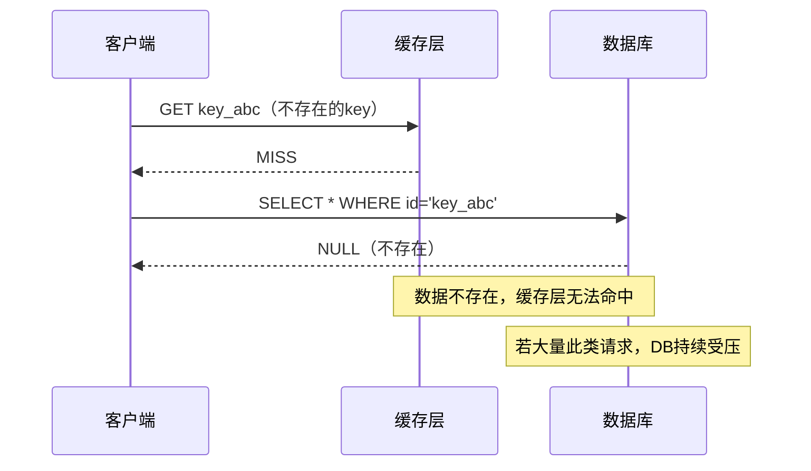
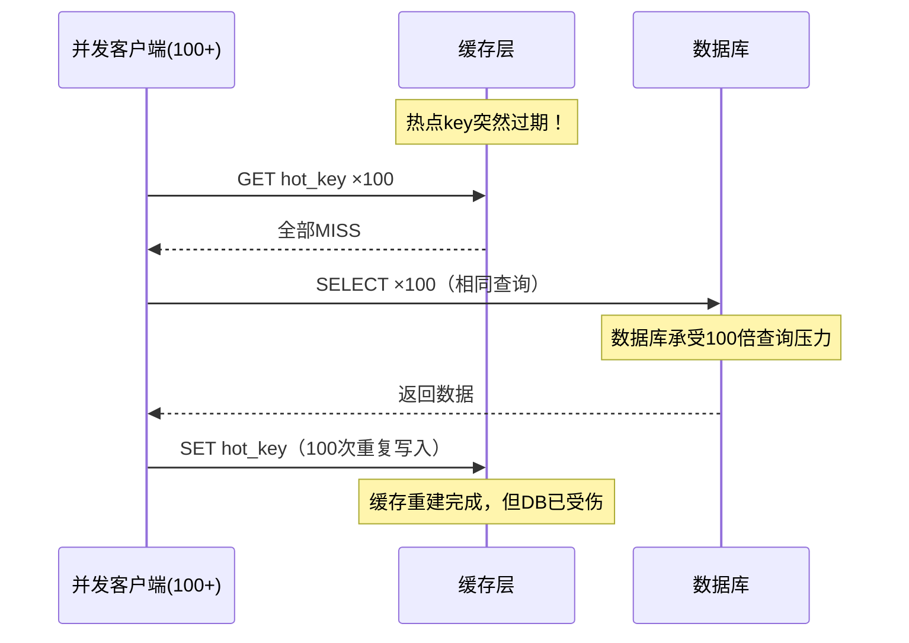
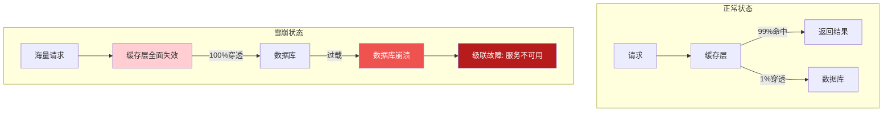
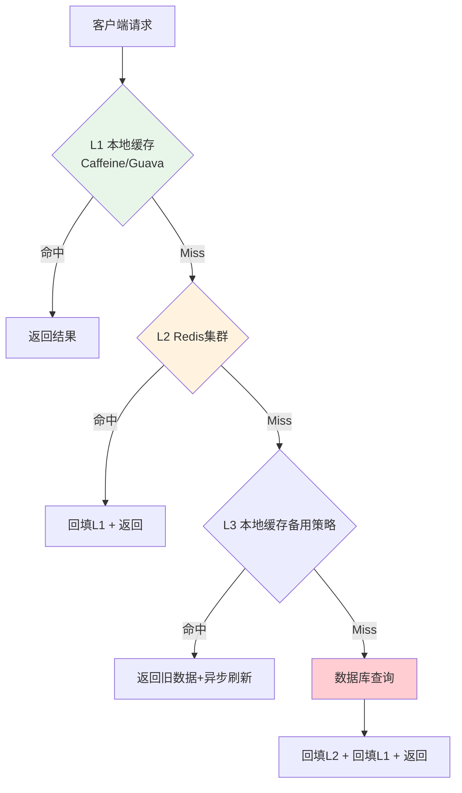
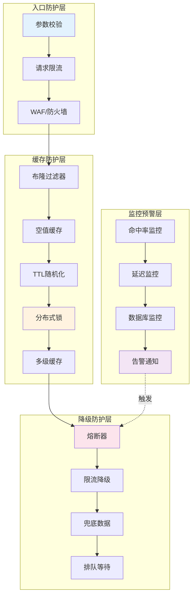

## 缓存穿透、击穿与雪崩：三大缓存故障模式全解

在缓存系统的实际运行中，有三种经典的故障模式如同三把悬在系统头顶的达摩克利斯之剑——**缓存穿透（Cache Penetration）**、**缓存击穿（Cache Breakdown）**和**缓存雪崩（Cache Avalanche）**。它们分别对应不同的触发条件和危害模式，但最终都会导致同一个后果：请求绕过缓存直接冲击后端数据库，引发级联故障。

本节从原理机制、危害分析、检测手段和防御策略四个维度，对这三种故障模式进行系统性剖析，为后续章节的实战技巧和案例打下理论基础。

---

### 一、三大故障模式定义与对比

#### 1.1 缓存穿透（Cache Penetration）

缓存穿透是指**查询一个数据库中根本不存在的数据**。由于缓存中没有、数据库中也没有，请求每次都会穿透缓存层直达数据库。如果大量请求同时查询不存在的key，数据库将持续承受无效查询压力。

**典型触发场景：**

- 恶意攻击：攻击者构造大量随机ID发起请求，如 `GET /product/999999999`
- 业务Bug：前端传入了错误的参数，导致查询不存在的资源
- 数据不一致：缓存数据已过期删除，但数据库中的对应记录也被物理删除



#### 1.2 缓存击穿（Cache Breakdown）

缓存击穿是指**某个热点key突然失效的瞬间**，大量并发请求同时发现缓存miss，全部涌向数据库重建缓存。与穿透不同，击穿查询的数据确实存在于数据库中，只是在缓存失效的间隙形成了"惊群效应"（Thundering Herd）。

**典型触发场景：**

- 热点key过期：明星微博、秒杀商品等超高频访问的key恰好到达TTL时限
- 缓存主动淘汰：LRU策略在内存压力下淘汰了热点key
- Redis节点重启：单节点故障导致该节点上的热点key丢失



#### 1.3 缓存雪崩（Cache Avalanche）

缓存雪崩是指**大量key在同一时间集中失效**，或者**Redis集群整体不可用**，导致海量请求同时涌入数据库。这是三种故障中影响范围最大、破坏力最强的一种。

**典型触发场景：**

- 大批量key设置了相同的TTL：批量导入的数据统一设置 `EXPIRE key 3600`
- Redis集群宕机：主从切换延迟、网络分区导致整个缓存层不可用
- 缓存预热不足：系统启动后大量数据尚未加载到缓存
- 滚动重启：微服务滚动重启期间，缓存实例逐步下线



#### 1.4 三者对比总表

| 维度 | 缓存穿透 | 缓存击穿 | 缓存雪崩 |
|------|----------|----------|----------|
| **本质** | 查询不存在的数据 | 热点key失效瞬间并发重建 | 大批量key同时失效或缓存整体不可用 |
| **影响范围** | 单个/少量无效key | 单个热点key | 大面积key、整个缓存层 |
| **数据存在性** | 数据库中不存在 | 数据库中存在 | 数据库中存在 |
| **并发模式** | 持续性无效查询 | 瞬时高并发重建 | 瞬时海量穿透 |
| **危害等级** | ★★★☆☆ | ★★★★☆ | ★★★★★ |
| **防御核心** | 阻止无效请求到达DB | 串行化重建缓存 | 分散失效时间+高可用 |
| **恢复难度** | 低（加缓存空值即可） | 中（需要锁+降级） | 高（可能需要全链路恢复） |

---

### 二、缓存穿透：深入剖析与防御

#### 2.1 穿透的根本原因

缓存穿透的核心矛盾在于：**缓存只能缓存"已知"的key，而穿透查询的是"未知"的key**。无论缓存的命中率多高，只要有一个不存在的key不在缓存中，它就会永远穿透到数据库。

从概率模型看，假设：
- 缓存中存储 N 个key，每个key的访问概率服从幂律分布（Zipf定律）
- 不存在的key占所有请求的比例为 p

则数据库承受的无效查询量 = 总QPS × p。当 p 达到 5%-10% 时（恶意攻击场景下可能更高），数据库压力将显著增加。

#### 2.2 防御方案一：缓存空值（Null Object Caching）

**原理：** 当数据库返回空结果时，也在缓存中设置一个带短TTL的空值标记。后续相同请求将直接命中缓存的空值，不再穿透到数据库。

```python
import redis
import json

r = redis.Redis(host='localhost', port=6379, db=0)

def get_product(product_id: str, ttl: int = 300) -> dict | None:
    """
    查询商品信息，支持空值缓存防止穿透
    
    Args:
        product_id: 商品ID
        ttl: 缓存过期时间（秒），空值使用较短的TTL
        
    Returns:
        商品信息字典，或None表示不存在
    """
    cache_key = f"product:{product_id}"
    
    # 1. 查缓存
    cached = r.get(cache_key)
    if cached is not None:
        if cached == b'__NULL__':
            return None  # 空值缓存命中，直接返回None
        return json.loads(cached)
    
    # 2. 查数据库
    product = db_query_product(product_id)
    
    if product is None:
        # 3a. 数据不存在 → 缓存空值（TTL较短，避免长期占用内存）
        r.setex(cache_key, ttl, '__NULL__')
        return None
    else:
        # 3b. 数据存在 → 正常缓存
        r.setex(cache_key, 3600, json.dumps(product))
        return product
```

**空值缓存的优缺点：**

| 维度 | 说明 |
|------|------|
| **优点** | 实现简单，立即生效；对不存在的请求有效拦截 |
| **缺点** | 占用额外内存（存储"不存在"的标记）；可能导致短期数据不一致（数据被创建但缓存仍是空值） |
| **适用场景** | 数据相对稳定、不存在频繁创建/删除的场景 |
| **TTL建议** | 空值TTL设为正常值的 1/5 ~ 1/10（如正常值3600s，空值300-600s） |

**注意事项：** 空值缓存的TTL不能太长，否则当真实数据被插入数据库后，缓存中仍是空值，导致数据"假性丢失"。建议空值TTL为正常值的1/5到1/10，兼顾防护效果和数据新鲜度。

#### 2.3 防御方案二：布隆过滤器（Bloom Filter）

**原理：** 在缓存层之前增加一个布隆过滤器（Bloom Filter），它是一个空间效率极高的概率型数据结构，可以判断一个key**是否"可能存在"**。只有通过布隆过滤器校验的请求才允许查询缓存和数据库，不通过的直接拒绝。

```python
from pybloom_live import BloomFilter

# 初始化布隆过滤器：预计存储100万个key，误判率0.01%
bf = BloomFilter(capacity=1_000_000, error_rate=0.0001)

# 系统启动时，将所有有效key加载到布隆过滤器
def init_bloom_filter():
    """启动时从数据库加载所有有效key"""
    all_product_ids = db_fetch_all_ids()  # SELECT id FROM products
    for pid in all_product_ids:
        bf.add(f"product:{pid}")

def get_product_with_bloom(product_id: str) -> dict | None:
    """带布隆过滤器的查询"""
    cache_key = f"product:{product_id}"
    
    # 1. 布隆过滤器检查
    if cache_key not in bf:
        # 一定不存在，直接返回，不查缓存也不查数据库
        return None
    
    # 2. 查缓存（布隆过滤器说"可能存在"，但可能误判）
    cached = r.get(cache_key)
    if cached is not None:
        return None if cached == b'__NULL__' else json.loads(cached)
    
    # 3. 查数据库
    product = db_query_product(product_id)
    
    if product is None:
        r.setex(cache_key, 300, '__NULL__')
    else:
        r.setex(cache_key, 3600, json.dumps(product))
    
    return product
```

**布隆过滤器的工程考量：**

| 因素 | 建议值 | 说明 |
|------|--------|------|
| 容量 | 预计key数 × 1.5 | 留出30%-50%余量，降低误判率 |
| 误判率 | 0.001% - 0.1% | 根据业务容忍度选择，越低占用空间越大 |
| 每1亿key占用内存 | 约 100MB - 200MB | 取决于误判率设定 |
| 更新策略 | 定期全量重建 + 增量更新 | 新增key加入过滤器，删除key无法移除（布隆过滤器的固有局限） |

**布隆过滤器的局限：** 布隆过滤器只支持添加操作，不支持删除。如果需要删除key，可以使用 **Counting Bloom Filter**（计数布隆过滤器）或 **Cuckoo Filter**（布谷鸟过滤器），后者支持删除操作且空间效率更高。

#### 2.4 防御方案三：参数校验与请求拦截

**原理：** 在入口层（网关/CDN/WAF）对请求参数进行严格校验，过滤掉明显非法的请求，从源头阻止穿透。

```python
import re

# 参数校验规则
VALID_PRODUCT_ID = re.compile(r'^P\d{8,12}$')  # 商品ID格式：P + 8-12位数字
MAX_ID_VALUE = 99_999_999_9999  # 最大有效ID

def validate_product_request(product_id: str) -> bool:
    """校验商品ID格式"""
    if not product_id:
        return False
    if not VALID_PRODUCT_ID.match(product_id):
        return False
    # 数值范围校验
    numeric_part = int(product_id[1:])
    if numeric_part > MAX_ID_VALUE or numeric_part <= 0:
        return False
    return True

# 网关层限流：对穿透类异常请求进行限流
from collections import defaultdict
import time

class PenetrationRateLimiter:
    """基于滑动窗口的穿透请求限流器"""
    
    def __init__(self, max_requests: int = 10, window_seconds: int = 60):
        self.max_requests = max_requests
        self.window = window_seconds
        self.ip_records = defaultdict(list)
    
    def is_allowed(self, client_ip: str) -> bool:
        now = time.time()
        # 清理过期记录
        self.ip_records[client_ip] = [
            t for t in self.ip_records[client_ip] 
            if now - t < self.window
        ]
        if len(self.ip_records[client_ip]) >= self.max_requests:
            return False
        self.ip_records[client_ip].append(now)
        return True
```

#### 2.5 穿透防御方案选型

| 方案 | 复杂度 | 内存开销 | 数据一致性 | 推荐场景 |
|------|--------|----------|------------|----------|
| 缓存空值 | 低 | 低（每个空key约50B） | 短暂不一致（秒级） | 数据变化不频繁 |
| 布隆过滤器 | 中 | 中（每亿key约100-200MB） | 需同步更新 | key空间大且可枚举 |
| 参数校验 | 低 | 无 | 无 | 所有场景的第一道防线 |
| 组合方案 | 高 | 中 | 较好 | 生产环境推荐 |

**最佳实践：三层防御体系。** 第一层参数校验拦截明显非法请求，第二层布隆过滤器拦截不存在的key，第三层缓存空值兜底。三层防御形成纵深防御体系，将穿透数据库的无效请求降至最低。

---

### 三、缓存击穿：深入剖析与防御

#### 3.1 击穿的根因分析

缓存击穿的本质是一个**惊群效应（Thundering Herd）**问题。当热点key失效的瞬间，所有正在等待该key结果的并发请求同时检测到miss，开始竞争重建缓存。如果没有适当的协调机制，每个请求都会独立地执行一次数据库查询，造成资源浪费和数据库压力骤增。

从时序角度看，击穿的危险窗口是：**缓存过期到第一个请求成功重建缓存之间的这段时间**。如果数据库查询耗时 100ms，且有 1000 个并发请求，那么在这 100ms 内，数据库将承受 1000 次相同查询。

#### 3.2 防御方案一：互斥锁（Mutex Lock）

**原理：** 使用分布式锁确保同一时刻只有一个请求负责重建缓存，其他请求等待或返回旧数据。

```python
import redis
import time
import json

r = redis.Redis(host='localhost', port=6379, db=0)

class CacheBreakdownGuard:
    """基于分布式锁的缓存击穿防护"""
    
    def __init__(self, redis_client, lock_ttl: int = 10, 
                 wait_timeout: float = 3.0, retry_interval: float = 0.05):
        self.r = redis_client
        self.lock_ttl = lock_ttl          # 锁的过期时间（防死锁）
        self.wait_timeout = wait_timeout  # 等待锁的最大时间
        self.retry_interval = retry_interval  # 重试间隔
    
    def get_with_lock(self, key: str, db_loader, cache_ttl: int = 3600):
        """
        带分布式锁的缓存读取
        
        Args:
            key: 缓存key
            db_loader: 无参callable，负责从数据库加载数据
            cache_ttl: 缓存过期时间
        """
        # 1. 查缓存
        cached = self.r.get(key)
        if cached is not None:
            return json.loads(cached)
        
        # 2. 获取分布式锁
        lock_key = f"lock:{key}"
        lock_acquired = False
        
        try:
            # 等待获取锁
            deadline = time.time() + self.wait_timeout
            while time.time() < deadline:
                lock_acquired = self.r.set(
                    lock_key, "1", nx=True, ex=self.lock_ttl
                )
                if lock_acquired:
                    break
                time.sleep(self.retry_interval)
            
            if not lock_acquired:
                # 等待超时，返回降级数据或再次尝试读缓存
                cached = self.r.get(key)
                return json.loads(cached) if cached else None
            
            # 3. 获取锁成功，再次检查缓存（可能被其他请求重建了）
            cached = self.r.get(key)
            if cached is not None:
                return json.loads(cached)
            
            # 4. 从数据库加载数据
            data = db_loader()
            
            if data is not None:
                self.r.setex(key, cache_ttl, json.dumps(data))
            else:
                self.r.setex(key, 300, '__NULL__')
            
            return data
        
        finally:
            if lock_acquired:
                self.r.delete(lock_key)


# 使用示例
guard = CacheBreakdownGuard(r)

def get_hot_product(product_id: str):
    return guard.get_with_lock(
        key=f"product:{product_id}",
        db_loader=lambda: db_query_product(product_id),
        cache_ttl=3600
    )
```

**分布式锁的关键参数调优：**

| 参数 | 作用 | 调优建议 |
|------|------|----------|
| lock_ttl | 锁自动释放时间 | 设为DB查询耗时的3-5倍，过短会导致锁提前释放 |
| wait_timeout | 等待锁的最大时间 | 设为业务可接受的最大延迟，通常1-5秒 |
| retry_interval | 重试间隔 | 太小导致CPU空转，太大导致等待时间长。建议50-100ms |
| 锁粒度 | 按key加锁 | 锁粒度应细化到单个key，避免全局锁造成串行化 |

#### 3.3 防御方案二：逻辑过期（Logical Expiration）

**原理：** 不设置Redis的物理过期时间（TTL），而是在value中嵌入一个逻辑过期时间字段。读取时检查逻辑过期时间，若未过期则直接返回，若已过期则异步发起重建请求，同时返回旧数据。

```python
import threading
from dataclasses import dataclass
import json

@dataclass
class CacheEntry:
    data: dict
    logical_expire_at: float  # 逻辑过期时间戳

class LogicalExpirationCache:
    """逻辑过期缓存：无物理TTL，业务侧判断是否过期"""
    
    def __init__(self, redis_client):
        self.r = redis_client
        self.rebuilding = set()  # 正在重建的key集合（进程级去重）
    
    def get(self, key: str, db_loader, physical_ttl: int = 86400 * 30):
        """
        读取数据。若逻辑过期，异步重建并返回旧数据。
        
        physical_ttl: Redis物理TTL（极长，作为安全兜底），默认30天
        """
        raw = self.r.get(key)
        if raw is None:
            # 首次加载（无旧数据可返回，必须同步加载）
            data = db_loader()
            if data is None:
                return None
            entry = CacheEntry(
                data=data,
                logical_expire_at=time.time() + 3600  # 逻辑过期1小时
            )
            self.r.setex(key, physical_ttl, json.dumps(
                {'data': entry.data, 'expire_at': entry.logical_expire_at}
            ))
            return entry.data
        
        entry_data = json.loads(raw)
        entry = CacheEntry(data=entry_data['data'], 
                          logical_expire_at=entry_data['expire_at'])
        
        if entry.logical_expire_at > time.time():
            # 未过期，正常返回
            return entry.data
        
        # 逻辑已过期
        if key not in self.rebuilding:
            self.rebuilding.add(key)
            # 异步重建
            def rebuild():
                try:
                    data = db_loader()
                    if data is not None:
                        new_entry = CacheEntry(
                            data=data,
                            logical_expire_at=time.time() + 3600
                        )
                        self.r.setex(key, physical_ttl, json.dumps(
                            {'data': new_entry.data, 
                             'expire_at': new_entry.logical_expire_at}
                        ))
                finally:
                    self.rebuilding.discard(key)
            
            thread = threading.Thread(target=rebuild, daemon=True)
            thread.start()
        
        # 无论是否在重建，都返回旧数据（保证响应时间）
        return entry.data
```

**逻辑过期的优缺点分析：**

| 维度 | 说明 |
|------|------|
| **核心优势** | 不会出现"等待锁"导致的延迟，所有请求都能快速返回（旧数据或新数据） |
| **核心劣势** | 存在数据不一致窗口（过期到重建完成期间返回旧数据）；需要应用层维护过期逻辑 |
| **适用场景** | 对数据实时性要求不高但对延迟极敏感的场景（如商品浏览数、推荐列表） |
| **不适用场景** | 对数据准确性要求极高的场景（如库存数量、账户余额） |

#### 3.4 防御方案三：热点key永不过期 + 主动刷新

**原理：** 热点key不设置过期时间，通过后台任务定期主动刷新数据。这样完全避免了"过期瞬间"的问题，但需要自行管理数据新鲜度。

```python
import schedule
import threading

class HotKeyRefresher:
    """热点key主动刷新器"""
    
    def __init__(self, redis_client):
        self.r = redis_client
        self._running = False
    
    def register_hot_key(self, key: str, db_loader, refresh_interval: int = 300):
        """注册热点key及其刷新逻辑"""
        def refresh_task():
            try:
                data = db_loader()
                if data is not None:
                    self.r.set(key, json.dumps(data))  # 无EXPIRE，永不过期
            except Exception as e:
                # 刷新失败不影响现有缓存
                print(f"Refresh failed for {key}: {e}")
        
        # 首次加载
        refresh_task()
        
        # 定期刷新
        schedule.every(refresh_interval).seconds.do(refresh_task)
    
    def start(self):
        """启动刷新调度器（独立线程）"""
        def _run():
            while self._running:
                schedule.run_pending()
                time.sleep(1)
        
        self._running = True
        t = threading.Thread(target=_run, daemon=True)
        t.start()
```

#### 3.5 击穿防御方案对比

| 方案 | 数据一致性 | 响应延迟 | 实现复杂度 | 适用场景 |
|------|------------|----------|------------|----------|
| 互斥锁 | 强（重建后立即一致） | 等待锁期间有延迟 | 中 | 数据准确性要求高 |
| 逻辑过期 | 弱（有不一致窗口） | 极低（始终快速返回） | 中高 | 对延迟敏感、允许短暂过期 |
| 永不过期+主动刷新 | 中（取决于刷新频率） | 极低 | 低 | 热点数据可预知 |
| 多级缓存降级 | 中 | 低 | 高 | 大型系统综合方案 |

---

### 四、缓存雪崩：深入剖析与防御

#### 4.1 雪崩的两种形态

缓存雪崩实际上包含两种不同的故障模式：

**形态一：大量key同时过期。** 缓存数据集中加载（如定时任务批量导入）并设置了相同的TTL，导致它们在同一时刻集体过期。这本质上是"多个击穿"的叠加，但规模更大、冲击更猛烈。

**形态二：缓存层整体不可用。** Redis集群宕机、网络分区、主从切换延迟等导致整个缓存层暂时失效，所有请求直接打到数据库。

两种形态的防御策略有所不同：前者侧重"分散失效时间"，后者侧重"缓存高可用+降级"。

#### 4.2 防御策略一：TTL随机化（Jitter）

**原理：** 在设置TTL时加入随机偏移量，避免大量key在同一时刻过期。

```python
import random

def set_cache_with_jitter(key: str, value: str, base_ttl: int = 3600, 
                           jitter_ratio: float = 0.2):
    """
    带随机偏移的TTL设置
    
    Args:
        base_ttl: 基础TTL（秒）
        jitter_ratio: 抖动比例，如0.2表示±20%随机偏移
    
    实际TTL范围: base_ttl * (1 - jitter_ratio) ~ base_ttl * (1 + jitter_ratio)
    例: base_ttl=3600, jitter_ratio=0.2 → 实际TTL在2880~4320秒之间随机
    """
    jitter = int(base_ttl * jitter_ratio * (2 * random.random() - 1))
    actual_ttl = base_ttl + jitter
    r.setex(key, actual_ttl, value)

# 批量导入时，对每个key使用不同的随机TTL
def batch_import_with_jitter(products: list[dict]):
    """批量导入商品数据，TTL随机化"""
    pipe = r.pipeline()
    for product in products:
        key = f"product:{product['id']}"
        ttl = 3600 + random.randint(-720, 720)  # 3600 ± 20%
        pipe.setex(key, ttl, json.dumps(product))
    pipe.execute()
```

**抖动参数建议：**

| base_ttl | jitter_ratio | 实际TTL范围 | 过期集中度降低 |
|----------|-------------|-------------|---------------|
| 3600s (1h) | 0.1 | 3240-3960s | 约70%降低 |
| 3600s (1h) | 0.2 | 2880-4320s | 约90%降低 |
| 86400s (1天) | 0.1 | 77760-95040s | 约95%降低 |

> **经验法则：** TTL越长，jitter比例可以越小；TTL越短（如秒杀场景的120秒），需要更大的jitter比例（30%-50%）。

#### 4.3 防御策略二：多级缓存架构

**原理：** 引入多级缓存（L1本地缓存 + L2分布式缓存 + L3数据库），即使L2完全失效，L1仍然能提供部分保护。



```python
from cachetools import TTLCache
import threading

class MultiLevelCache:
    """两级缓存：本地缓存 + Redis"""
    
    def __init__(self, redis_client, local_max_size: int = 10000, 
                 local_ttl: int = 60):
        self.r = redis_client
        self.local = TTLCache(maxsize=local_max_size, ttl=local_ttl)
        self.local_lock = threading.Lock()
    
    def get(self, key: str, db_loader, remote_ttl: int = 3600):
        # L1: 本地缓存
        with self.local_lock:
            if key in self.local:
                return self.local[key]
        
        # L2: Redis
        cached = self.r.get(key)
        if cached is not None and cached != b'__NULL__':
            data = json.loads(cached)
            with self.local_lock:
                self.local[key] = data
            return data
        
        # L3: 数据库
        data = db_loader()
        
        if data is not None:
            with self.local_lock:
                self.local[key] = data
            jitter = int(remote_ttl * 0.2 * (2 * random.random() - 1))
            self.r.setex(key, remote_ttl + jitter, json.dumps(data))
        else:
            self.r.setex(key, 300, '__NULL__')
        
        return data
    
    def invalidate(self, key: str):
        """同时清除本地和远程缓存"""
        with self.local_lock:
            self.local.pop(key, None)
        self.r.delete(key)
```

**多级缓存在雪崩中的保护作用：** 即使Redis集群完全不可用，本地缓存仍然能服务已缓存的key。虽然本地缓存容量有限且不跨节点共享，但可以在Redis恢复的窗口期内提供"缓冲垫"效应，避免数据库被瞬间压垮。

#### 4.4 防御策略三：缓存预热（Cache Warming）

**原理：** 在系统启动或变更后，提前将关键数据加载到缓存中，避免启动初期的缓存miss风暴。

```python
class CacheWarmer:
    """缓存预热器"""
    
    def __init__(self, redis_client):
        self.r = redis_client
    
    def warm_by_pattern(self, pattern: str, db_loader, batch_size: int = 500):
        """按模式预热：加载匹配pattern的所有数据"""
        cursor = 0
        total = 0
        pipe = self.r.pipeline()
        
        while True:
            cursor, keys = self.r.scan(cursor=cursor, match=pattern, 
                                        count=batch_size)
            for key in keys:
                # 从key反推数据ID，加载数据
                data = db_loader(extract_id_from_key(key))
                if data:
                    ttl = 3600 + random.randint(-720, 720)
                    pipe.setex(key, ttl, json.dumps(data))
                    total += 1
                
                if total % batch_size == 0:
                    pipe.execute()
                    pipe = self.r.pipeline()
            
            if cursor == 0:
                break
        
        pipe.execute()
        return total
    
    def warm_top_n(self, n: int = 1000):
        """预热Top-N热门数据"""
        hot_products = db_query_top_products(n)  # SELECT * ORDER BY view_count DESC LIMIT N
        
        pipe = self.r.pipeline()
        for product in hot_products:
            key = f"product:{product['id']}"
            ttl = 3600 + random.randint(-720, 720)
            pipe.setex(key, ttl, json.dumps(product))
        pipe.execute()
        
        return len(hot_products)
```

#### 4.5 防御策略四：熔断降级

**原理：** 当检测到缓存层不可用或数据库压力超过阈值时，自动触发熔断机制，对请求进行降级处理（返回兜底数据、排队等待、拒绝服务等）。

```python
import time
from enum import Enum

class CircuitState(Enum):
    CLOSED = "closed"       # 正常（允许通过）
    OPEN = "open"           # 熔断（拒绝请求）
    HALF_OPEN = "half_open" # 半开（试探性放行）

class CacheCircuitBreaker:
    """缓存熔断器：当Redis不可用时自动降级"""
    
    def __init__(self, redis_client, failure_threshold: int = 5,
                 recovery_timeout: float = 30.0):
        self.r = redis_client
        self.state = CircuitState.CLOSED
        self.failure_count = 0
        self.failure_threshold = failure_threshold
        self.recovery_timeout = recovery_timeout
        self.last_failure_time = 0
    
    def execute(self, cache_op, fallback, *args, **kwargs):
        """
        执行缓存操作，失败时自动降级
        
        cache_op: 缓存操作callable
        fallback: 降级函数callable
        """
        if self.state == CircuitState.OPEN:
            if time.time() - self.last_failure_time > self.recovery_timeout:
                self.state = CircuitState.HALF_OPEN
            else:
                return fallback(*args, **kwargs)
        
        try:
            result = cache_op(*args, **kwargs)
            # 成功：重置计数器
            if self.state == CircuitState.HALF_OPEN:
                self.state = CircuitState.CLOSED
            self.failure_count = 0
            return result
        except redis.ConnectionError:
            self._record_failure()
            return fallback(*args, **kwargs)
        except redis.TimeoutError:
            self._record_failure()
            return fallback(*args, **kwargs)
    
    def _record_failure(self):
        self.failure_count += 1
        self.last_failure_time = time.time()
        if self.failure_count >= self.failure_threshold:
            self.state = CircuitState.OPEN

# 使用示例
breaker = CacheCircuitBreaker(r)

def get_product_safe(product_id: str):
    def cache_op(pid):
        data = r.get(f"product:{pid}")
        return json.loads(data) if data else None
    
    def fallback(pid):
        # 降级策略：查数据库或返回默认数据
        return db_query_product(pid)
    
    return breaker.execute(cache_op, fallback, product_id)
```

#### 4.6 雪崩防御方案对比

| 方案 | 防护能力 | 复杂度 | 数据一致性 | 适用场景 |
|------|----------|--------|------------|----------|
| TTL随机化 | 中（仅防同时过期） | 低 | 无影响 | 所有场景的基础措施 |
| 多级缓存 | 高（本地缓存兜底） | 中高 | 短暂不一致 | 大规模高并发系统 |
| 缓存预热 | 中（减少启动期miss） | 低 | 无影响 | 系统启动、数据更新后 |
| 熔断降级 | 高（防止级联故障） | 中 | 可能返回旧数据 | 生产环境必备 |

---

### 五、监控与检测：如何发现潜在的缓存故障

防御的前提是**及时发现**。以下监控指标可以帮助你在故障发生前识别风险：

#### 5.1 核心监控指标

| 指标 | 计算方式 | 告警阈值 | 说明 |
|------|----------|----------|------|
| 缓存命中率 | hit/(hit+miss) × 100% | < 80% 降级告警 | 持续下降可能预示雪崩 |
| 空值缓存比例 | null_miss/total_miss × 100% | > 30% 告警 | 过高说明恶意请求或数据不一致 |
| 单key QPS | per_key_counter | 远超均值 10x | 识别热点key，预防击穿 |
| 缓存延迟P99 | Redis操作延迟 | > 5ms | Redis性能退化信号 |
| 数据库连接数 | active_connections | > 80% pool_size | 穿透/击穿的间接指标 |

#### 5.2 实时检测脚本

```python
import redis
import time

r = redis.Redis(host='localhost', port=6379, db=0)

def detect_cache_anomalies():
    """定期执行的缓存异常检测"""
    info = r.info()
    stats = r.info('stats')
    
    # 1. 命中率检测
    hits = stats.get('keyspace_hits', 0)
    misses = stats.get('keyspace_misses', 0)
    hit_rate = hits / (hits + misses) * 100 if (hits + misses) > 0 else 100
    
    if hit_rate < 80:
        alert(f"缓存命中率告警: {hit_rate:.1f}% (阈值80%)")
    
    # 2. 内存使用检测
    used_memory = info.get('used_memory', 0)
    max_memory = info.get('maxmemory', 0)
    if max_memory > 0:
        memory_usage = used_memory / max_memory * 100
        if memory_usage > 85:
            alert(f"Redis内存使用告警: {memory_usage:.1f}%")
    
    # 3. 过期key检测
    expired_keys = stats.get('expired_keys', 0)
    evicted_keys = stats.get('evicted_keys', 0)
    if evicted_keys > 0:
        alert(f"Redis正在淘汰key: {evicted_keys}个已淘汰")
    
    # 4. 连接数检测
    connected_clients = info.get('connected_clients', 0)
    max_clients = info.get('maxclients', 10000)
    if connected_clients / max_clients > 0.8:
        alert(f"Redis连接数告警: {connected_clients}/{max_clients}")
    
    return {
        'hit_rate': hit_rate,
        'memory_usage': memory_usage if max_memory > 0 else 0,
        'expired_keys': expired_keys,
        'evicted_keys': evicted_keys,
        'connected_clients': connected_clients
    }

def alert(message: str):
    """发送告警（接入实际告警系统）"""
    print(f"[ALERT] {time.strftime('%Y-%m-%d %H:%M:%S')} - {message}")
    # 实际项目中接入钉钉/企微/PagerDuty等告警渠道
```

---

### 六、实战决策指南：如何选择防御策略

#### 6.1 按业务场景选型

| 场景特征 | 主要威胁 | 推荐方案组合 |
|----------|----------|-------------|
| 电商商品详情页（高读低写） | 击穿（明星商品过期） | 分布式锁 + 本地缓存 + TTL随机化 |
| 用户信息查询（中等并发） | 穿透（恶意ID探测） | 参数校验 + 布隆过滤器 + 空值缓存 |
| 秒杀活动（瞬间超高并发） | 雪崩（缓存预热不足） | 预热 + 限流 + 本地缓存 + 熔断 |
| 社交Feed流（大量key） | 雪崩（批量过期） | TTL随机化 + 多级缓存 + 异步刷新 |
| API网关（面向公网） | 穿透（DDoS攻击） | WAF + 限流 + 布隆过滤器 + 空值缓存 |

#### 6.2 防御体系全景图



#### 6.3 常见误区与纠正

| 误区 | 正确做法 |
|------|----------|
| "用了Redis就不会有穿透" | Redis只是缓存层，不存在的key永远会穿透。必须在Redis之前或之内加防护 |
| "缓存空值就够了" | 空值缓存有TTL限制，且不能防御高频恶意攻击。需要配合限流和布隆过滤器 |
| "分布式锁能解决所有击穿问题" | 锁本身有等待超时，高并发下仍可能导致请求失败。需要配合降级策略 |
| "雪崩只能靠运维避免" | TTL随机化、多级缓存、预热等都是应用层可实施的方案 |
| "缓存命中率99%就很安全" | 如果总QPS是100万，1%的穿透就是1万次DB查询。关注绝对穿透量，而非仅看比率 |
| "本地缓存和Redis缓存二选一" | 两者互补。本地缓存响应快但容量小，Redis容量大但有网络开销。多级缓存是最佳实践 |

---

### 七、进阶：从理论到架构级思考

#### 7.1 一致性与可用性的权衡

缓存穿透、击穿、雪崩的防御本质上是在**CAP定理**框架下做权衡：

- **强一致性方案**（如分布式锁）：保证缓存和数据库数据一致，但牺牲了部分可用性（锁等待期间请求可能超时）
- **高可用方案**（如逻辑过期、本地缓存降级）：保证系统始终可响应，但可能返回过期数据

实际系统中通常选择**最终一致性**：短期内接受数据轻微过期，通过异步刷新机制尽快追平。

#### 7.2 与限流、熔断的关系

缓存故障防护与微服务治理中的限流、熔断机制紧密相连：

- **限流**：在穿透/雪崩场景下限制请求速率，防止数据库被瞬间压垮。是"第一道防线"
- **熔断**：当检测到缓存层异常时自动切断请求流，触发降级。是"最后一道防线"
- **缓存防护**（布隆过滤器、分布式锁等）：在限流和熔断之间的"主战场"

三者形成纵深防御体系：限流挡洪水，缓存防护做精细控制，熔断保底线。

#### 7.3 云原生环境下的新挑战

在 Kubernetes 等云原生环境中，缓存系统面临新的挑战：

- **Pod漂移**：Pod被重新调度后，本地缓存全部失效，等同于"缓存雪崩"
- **弹性伸缩**：新Pod启动时大量缓存miss，需要预热机制
- **多副本一致性**：不同Pod的本地缓存可能持有不同版本的数据

应对策略包括：Pod启动时执行预热脚本、使用共享缓存层（Redis Cluster）、接入服务网格实现流量管理。

---

### 本节小结

| 故障模式 | 一句话定义 | 核心防御 |
|----------|------------|----------|
| 缓存穿透 | 查不存在的数据，永远miss | 参数校验 + 布隆过滤器 + 空值缓存 |
| 缓存击穿 | 热点key失效，惊群重建 | 分布式锁 + 逻辑过期 + 永不过期 |
| 缓存雪崩 | 大面积失效或整体宕机 | TTL随机化 + 多级缓存 + 熔断降级 |

记住一个核心原则：**缓存是加速手段而非数据源**。无论设计多么精妙的防护方案，都要确保最终能回到一个可靠的数据库（或其他持久层）获取真实数据。防御策略的终极目标不是消灭穿透，而是**将穿透控制在数据库可承受的范围内**，同时保证系统的整体可用性。
