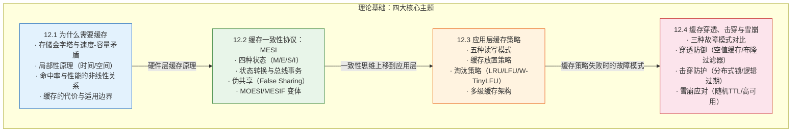
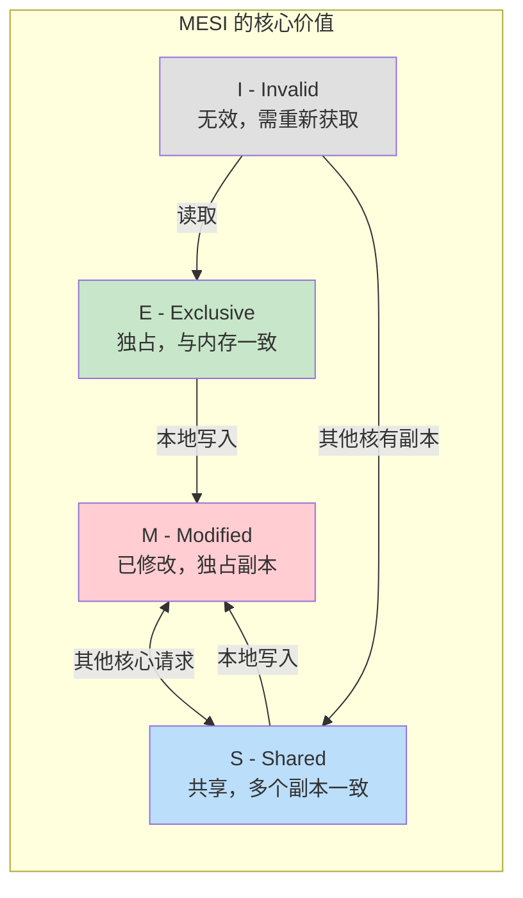
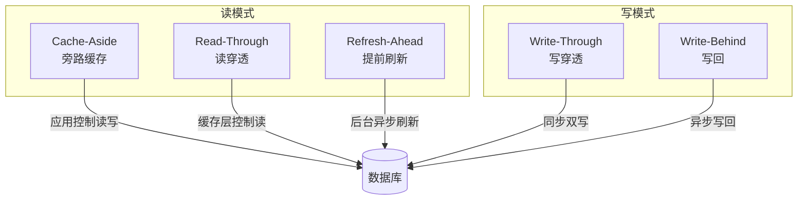
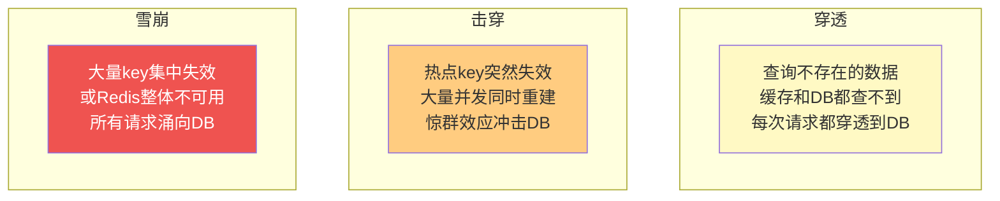
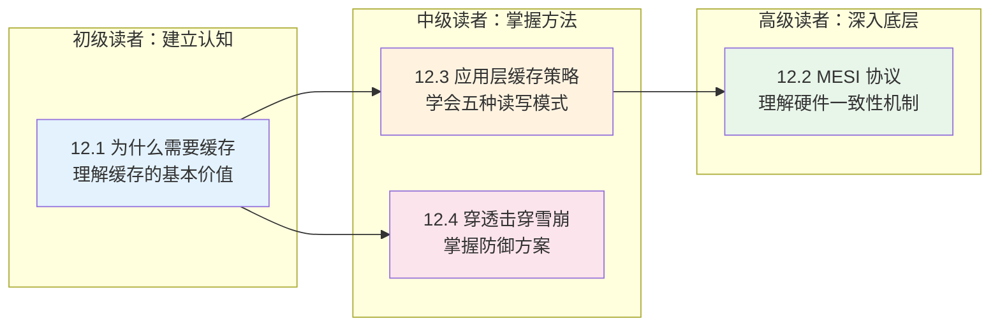
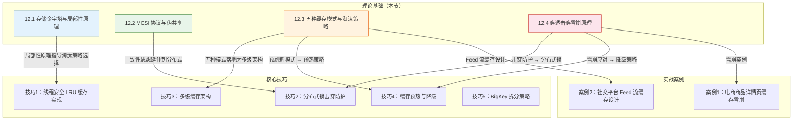

# 理论基础

缓存是计算机系统中**最古老、最普遍、也是投入产出比最高的优化手段**。从 CPU 内部纳秒级的 SRAM 缓存，到操作系统透明管理的页缓存，到数据库的 Buffer Pool，再到全球分布的 CDN 边缘节点——缓存的思想贯穿了计算机体系结构的每一层。理解缓存，不只是理解一个"在数据库前面放一层 Redis"的技巧，而是理解整个计算机系统如何在速度、容量和成本之间做出精妙的权衡。

本节将从四个维度构建缓存系统的完整理论框架，覆盖从硬件底层到应用层的全链路知识体系。这四个维度层层递进：先理解"为什么需要缓存"（动机），再理解"硬件缓存如何保持一致"（底层机制），然后掌握"应用层如何设计缓存策略"（工程方法），最后认识"缓存会怎样失败以及如何防御"（风险治理）。

---

## 知识体系全景

---

## 四大主题定位与逻辑关系

### 12.1 为什么需要缓存——"道"：理解缓存的本质动机

任何技术决策都应从"为什么"开始。12.1 从计算机存储体系的根本矛盾出发——**越快的存储越贵越小，越便宜的存储越慢越大**——解释缓存存在的物理必然性。通过存储金字塔的量化分析（L1 缓存比 HDD 快约 1000 万倍），读者将建立对缓存价值的直觉认知。

本节的核心公式：

T_avg = HitRate × T_cache + (1 - HitRate) × T_backend

这个简单公式揭示了一个反直觉的结论：**命中率从 80% 提升到 99%，后端压力不是降低 19%，而是降低 20 倍**。这种非线性关系意味着缓存在高命中率区间的投入产出比极高。

同时，12.1 也坦诚地讨论了缓存的代价——一致性维护、故障模式引入、运维复杂性增加——并给出了"什么时候不该用缓存"的判断标准。这些内容为后续三节的深入讨论奠定了理论基础。

**关键词：** 局部性原理、存储金字塔、命中率、幂律分布、缓存 ROI

---

### 12.2 缓存一致性协议：MESI——"法"：硬件层的一致性智慧

理解了"为什么需要缓存"之后，自然会遇到一个问题：**当多个 CPU 核心各自缓存了同一块数据时，如何保证它们看到的值是一致的？** 这就是缓存一致性问题。

12.2 深入解析 MESI 协议——现代多核处理器维持缓存一致性的基石。MESI 通过四种状态（Modified、Exclusive、Shared、Invalid）和一套精巧的监听机制，在硬件层面透明地解决了这个问题。

本节最重要的实战洞察是**伪共享（False Sharing）**：两个线程操作的是不同的变量，但由于它们恰好在同一个缓存行（64 字节）中，MESI 协议会把整个缓存行当作一个整体来同步，导致两个线程互相使对方的缓存行失效。伪共享造成的性能损失通常是 **10 倍以上**，而且极难通过常规 profiling 发现。

这一节虽然聚焦于硬件缓存，但其思想对应用层缓存设计有深刻启发——"一致性"是所有缓存系统都必须回答的核心问题。

**关键词：** MESI 协议、缓存行、伪共享、总线事务、MOESI、MESIF

---

### 12.3 应用层缓存策略——"术"：工程实践的核心方法论

12.3 是整个理论基础的**重心**，将视角从硬件层上移到软件层，系统性地讲解应用开发者如何设计和实现缓存。

#### 五种经典缓存读写模式

| 模式 | 读延迟 | 写延迟 | 一致性 | 实现复杂度 | 数据丢失风险 | 典型场景 |
|------|--------|--------|--------|-----------|-------------|---------|
| Cache-Aside | 中 | 中 | 最终一致 | 低 | 低 | 通用 Web 应用 |
| Read-Through | 中 | 中 | 最终一致 | 中 | 低 | 微服务基础设施封装 |
| Write-Through | 低 | 高 | 强一致 | 中 | 低 | 实时库存、用户会话 |
| Write-Behind | 低 | 极低 | 弱一致 | 高 | 中 | 日志、计数器、行为数据 |
| Refresh-Ahead | 极低 | 中 | 最终一致 | 高 | 低 | 热点数据、Feed 流 |

**实践建议：** 绝大多数项目从 **Cache-Aside** 开始。只有当 Cache-Aside 无法满足特定需求时，才考虑其他模式。Cache-Aside 中最关键的设计决策是"写操作删除缓存而非更新缓存"——这避免了并发写导致的脏数据问题。

#### 缓存淘汰策略

当缓存空间用尽时，淘汰策略决定了系统的命中率上限：

| 策略 | 原理 | 适用场景 | 缺点 |
|------|------|---------|------|
| LRU | 淘汰最久未访问的 | 通用 Web（热点集中） | 偶发大量扫描会污染缓存 |
| LFU | 淘汰访问频率最低的 | 长期热点分布稳定 | 对突发热点响应慢 |
| FIFO | 淘汰最早写入的 | 消息队列、日志 | 不考虑访问频率 |
| W-TinyLFU | LRU + 频率计数混合 | 现代缓存（Caffeine 默认） | 实现复杂 |

W-TinyLFU 是当前工业界公认最优的淘汰算法，Caffeine（Java）和 ristretto（Go）均采用此算法，实测命中率比纯 LRU 高 10%-30%。

**关键词：** Cache-Aside、Read-Through、Write-Through、Write-Behind、LRU、W-TinyLFU、进程内缓存、分布式缓存

---

### 12.4 缓存穿透、击穿与雪崩——"器"：风险治理与防御体系

缓存引入了新的故障模式。12.4 对三种经典故障模式进行系统性剖析，从原理机制、危害分析到防御策略，构建完整的风险治理体系。

#### 三种故障模式对比

| 维度 | 缓存穿透 | 缓存击穿 | 缓存雪崩 |
|------|----------|----------|----------|
| **本质** | 查询不存在的数据 | 热点 key 失效瞬间并发重建 | 大批量 key 同时失效或缓存整体不可用 |
| **影响范围** | 单个/少量无效 key | 单个热点 key | 大面积 key、整个缓存层 |
| **数据存在性** | 数据库中不存在 | 数据库中存在 | 数据库中存在 |
| **危害等级** | ★★★☆☆ | ★★★★☆ | ★★★★★ |
| **防御核心** | 阻止无效请求到达 DB | 串行化重建缓存 | 分散失效时间 + 高可用 |

#### 穿透的三层纵深防御

| 层级 | 方案 | 原理 | 复杂度 |
|------|------|------|--------|
| 第一层 | 参数校验 | 在网关层过滤格式非法的请求 | 低 |
| 第二层 | 布隆过滤器 | 概率型数据结构判断 key 是否"可能存在" | 中 |
| 第三层 | 空值缓存 | 数据库返回空时也缓存空值标记（短 TTL） | 低 |

#### 击穿的三种防护模式

| 方案 | 原理 | 优点 | 缺点 |
|------|------|------|------|
| 互斥锁 | 分布式锁确保同一时刻只有一个请求重建缓存 | 实现简单，强控制 | 等待锁引入额外延迟 |
| 逻辑过期 | 不设物理 TTL，业务侧判断过期，异步重建 | 所有请求快速返回 | 存在数据不一致窗口 |
| 永不过期 + 主动刷新 | 后台任务定期刷新热点 key | 完全避免过期问题 | 需要自行管理新鲜度 |

**关键词：** 缓存穿透、缓存击穿、缓存雪崩、布隆过滤器、分布式锁、逻辑过期、惊群效应

---

## 阅读路径建议

- **如果你是后端开发者**：建议从 12.3 开始，掌握 Cache-Aside 模式和淘汰策略，再看 12.4 学习防御方案，最后回到 12.1 建立完整的理论认知
- **如果你是系统架构师**：建议按顺序阅读 12.1 → 12.2 → 12.3 → 12.4，从底层原理到应用实践，构建完整的技术决策框架
- **如果你在排查缓存相关故障**：直接跳到 12.4，对照三种故障模式定位问题，再回到 12.3 检查策略是否合理

---

## 理论基础 → 核心技巧 → 实战案例的衔接

理论基础部分为后续内容提供底层支撑：

1. **12.1 的命中率公式**直接指导"技巧1 LRU 缓存"的容量规划——你需要知道多少缓存才能达到目标命中率
2. **12.2 的一致性思维**从硬件层延伸到分布式系统——MESI 解决单机多核的一致性，分布式锁解决跨节点的一致性
3. **12.3 的五种模式**是后续所有实战方案的理论根基——Cache-Aside 是最常用的起点，多级缓存架构是进阶必经之路
4. **12.4 的故障分析**直接映射到"技巧2 分布式锁"和"技巧4 缓存降级"——理解故障模式才能设计防御方案

---

## 核心公式速查

| 公式 | 含义 | 应用场景 |
|------|------|---------|
| `命中率 = 缓存命中次数 / 总请求次数` | 缓存效能的核心度量 | 评估缓存价值、设定优化目标 |
| `T_avg = H × T_cache + (1-H) × T_backend` | 加权平均访问延迟 | 评估缓存引入后的性能收益 |
| `后端压力 = 总QPS × (1 - 命中率)` | 缓存对后端的保护力度 | 容量规划、数据库选型 |
| `有效带宽提升 ≈ 1 / (1 - 命中率)` | 缓存命中率与系统吞吐的关系 | 高命中率下吞吐量的指数级提升 |

---

## 本节核心结论

> **三个必须记住的认知：**
>
> 1. **缓存利用的是不均匀性**：无论 CPU 指令流、数据库查询还是 Web 访问，数据使用都遵循幂律分布——少数热点占多数访问。缓存的本质是识别并利用这种不均匀性。
>
> 2. **缓存的效果是非线性的**：命中率从 80% 到 99%，后端压力不是降低 19% 而是降低 20 倍。这种非线性关系意味着在高命中率区间的每 1% 提升都价值巨大。
>
> 3. **缓存不是免费的午餐**：一致性维护、故障模式引入、运维复杂性增加都是真实成本。不是所有场景都适合加缓存——关键是评估 ROI。

**关键词：** 缓存系统、存储金字塔、局部性原理、MESI 协议、Cache-Aside、缓存穿透、缓存击穿、缓存雪崩、布隆过滤器、W-TinyLFU

**前置知识：** 基本数据结构（哈希表、链表）、数据库索引基础（第10章）、CPU 架构基础（第1章）
