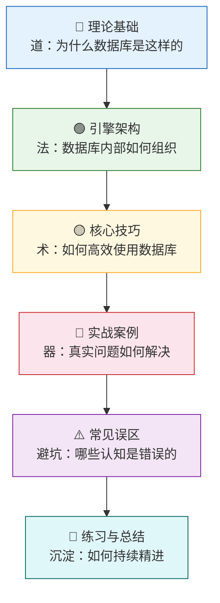
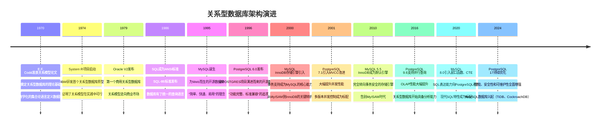

# 第13章 关系型数据库架构

## 章节概览

关系型数据库是现代软件系统最重要的基础设施之一。从银行交易系统到电商平台，从医疗记录管理到社交网络，几乎所有需要可靠存储和高效查询结构化数据的场景都依赖关系型数据库。根据 DB-Engines 2025 年的排名数据，Oracle、MySQL、PostgreSQL 三大关系型数据库占据了数据库市场的核心地位，全球数十亿台服务器上运行着它们的实例。

然而，大多数开发者对关系型数据库的理解停留在"会写 SQL"的层面——知道怎么 JOIN、怎么建索引、怎么写事务，却不了解数据库引擎内部究竟发生了什么。当遇到性能问题时，他们只能凭经验"试一试加个索引"，而不是基于对引擎架构的理解做出系统性的诊断和优化。

本章的目标就是帮助读者从"使用者"转变为"理解者"。我们将从关系模型的数学基础出发，逐层深入到数据库引擎的内部架构，最终建立对关系型数据库的系统性认知。

---

## 本章学习目标

通过本章的学习，读者将达到以下能力水平：

| 层级 | 目标 | 衡量标准 |
|------|------|----------|
| **认知层** | 理解关系模型的数学根基与设计哲学 | 能解释为什么关系模型选择了集合论而非图论作为理论基础 |
| **理解层** | 掌握数据库引擎的分层架构与各子系统的协作关系 | 能画出一条 SQL 从文本到结果的完整执行路径 |
| **分析层** | 能解读执行计划、诊断性能瓶颈、定位根因 | 面对慢查询能在 10 分钟内定位到具体的架构层面原因 |
| **设计层** | 能根据业务场景做出合理的数据库架构选型与配置决策 | 能为一个新项目选择合适的数据库并给出配置方案 |
| **工程层** | 能设计和实施数据库优化方案，包括索引、连接池、事务策略 | 能将一个 P99 延迟 5 秒的查询优化到 50 毫秒以内 |

---

## 为什么学习数据库架构

### 从一个真实问题说起

假设你在维护一个电商系统，数据库是 MySQL。某天早上 10 点，监控告警显示订单查询的平均响应时间从 50ms 飙升到 3 秒。你查看慢查询日志，发现是一条订单查询 SQL 变慢了：

```sql
SELECT o.id, o.total, c.name, c.phone
FROM orders o
JOIN customers c ON o.customer_id = c.id
WHERE o.status = 'pending'
  AND o.created_at > '2025-06-01'
ORDER BY o.created_at DESC
LIMIT 20;
```

如果你只懂 SQL 语法，你能做的可能就是：

1. 试试加个索引？加哪个字段？
2. 试试改 JOIN 顺序？
3. 试试分页优化？

这些都是"猜测式"的优化——运气好能解决，运气不好就陷入无尽的试错循环。

但如果你理解数据库引擎架构，你的诊断路径完全不同：

1. **执行计划分析**：`EXPLAIN` 显示这条 SQL 是否走了全表扫描？JOIN 算法选择是否正确？排序是否在内存中完成？
2. **内存状态检查**：Buffer Pool 是否足够大？`SHOW ENGINE INNODB STATUS` 显示是否发生了大量磁盘 I/O？Buffer Pool 命中率是否低于 99%？
3. **事务影响排查**：事务隔离级别是什么？是否存在大事务导致 MVCC 版本链过长，引发大量回表操作？
4. **锁竞争分析**：是否有其他事务持有行锁？等待图是否显示死锁？`innodb_lock_wait_timeout` 是否被触发？

这就是理解数据库架构的价值——**它让你从"猜测"走向"诊断"，从"试错"走向"根因分析"**。

### 掌握数据库架构的六大价值场景

掌握数据库架构知识，至少在以下场景中能发挥关键作用：

| 场景 | 你需要知道什么 | 价值 |
|------|--------------|------|
| **性能调优** | 执行计划解读、索引选择算法（B-tree 聚簇/二级索引）、Buffer Pool 替换策略、查询优化器的代价模型 | 从根因解决问题，而非碰运气。例如：知道 InnoDB 使用 LRU-K 算法后，你就能理解为什么全表扫描会污染缓存 |
| **容量规划** | 内存架构（共享内存 vs 私有内存）、连接模型（每连接一个线程 vs 线程池）、并发处理机制 | 准确评估系统承载能力。例如：MySQL 默认每个连接分配 256KB sort_buffer，1000 连接就占 250MB |
| **故障诊断** | WAL 机制（WAL 保证崩溃恢复的原子性）、事务恢复流程（Redo + Undo 的协作）、死锁检测原理（等待图算法） | 快速定位并修复问题。例如：理解 WAL 后，你就知道为什么突然断电不会丢数据 |
| **架构选型** | 不同数据库的进程/线程模型差异、MVCC 实现方式（元组版本链 vs Undo Log）、存储引擎特性 | 选择最适合业务需求的数据库。例如：需要 JSONB 索引时选 PostgreSQL 而非 MySQL |
| **数据迁移** | 存储引擎差异（如 InnoDB 的聚簇索引 vs PostgreSQL 的堆表）、事务模型差异（快照隔离 vs 当前读）、SQL 方言差异 | 设计安全可靠的迁移方案。例如：从 MySQL 迁移到 PostgreSQL 时，自增主键的实现方式完全不同 |
| **高可用设计** | 复制机制（物理复制 vs 逻辑复制）、故障转移流程（半同步 vs 组复制）、一致性协议（Raft/Paxos 在 NewSQL 中的应用） | 构建可信赖的高可用架构。例如：理解半同步复制后，你就能设计 RPO=0 的主从方案 |

### 一组数据说明问题

根据 Percona 和 Booking.com 的公开技术博客：

- **Buffer Pool 命中率从 99.9% 降到 99%**：看似只差 0.9%，但对一个日均 1 亿次查询的系统，意味着每天多出 10 万次磁盘 I/O，查询延迟可能从 1ms 飙升到 10ms 以上
- **事务隔离级别从 READ COMMITTED 改为 REPEATABLE READ**：在高并发写入场景下，MVCC 版本链长度可能增加 5-10 倍，导致回表开销显著上升
- **连接池大小从 100 调到 500**：如果超过了 CPU 核心数的 2-4 倍，反而会因为上下文切换导致吞吐量下降

这些数字背后的原理，正是本章要讲解的内容。

---

## 本章的知识地图

本章按照"道→法→术→器"的层次组织，从数学原理到工程实践，层层递进：



### 知识体系全景

下面是本章覆盖的完整知识体系。每个分支代表一个独立的知识域，它们之间通过"数据从用户请求到磁盘存储"的主线串联：

关系型数据库架构
│
├── 📘 理论基础（数学根基）—— 回答"为什么数据库要这样设计"
│   ├── 关系模型的数学定义
│   │   ├── 笛卡尔积与n元关系
│   │   ├── 关系的性质（无序性、唯一性、原子性）
│   │   └── 域（Domain）的概念与SQL类型系统
│   ├── 关系代数（查询语言的理论基础）
│   │   ├── 五种基本运算：选择σ、投影π、并∪、差−、笛卡尔积×
│   │   ├── 四种派生运算：交∩、自然连接⋈、θ连接、除÷
│   │   └── 优化规则：选择下推、投影下推、连接交换律
│   ├── 关系演算（声明式查询的理论来源）
│   │   ├── 元组关系演算（TRC）
│   │   ├── 域关系演算（DRC）
│   │   └── Codd定理：关系代数 ≡ 安全TRC ≡ 安全DRC
│   └── SQL的理论基础
│       ├── SQL与关系代数的映射关系
│       ├── SQL的非关系特性（NULL三值逻辑、允许重复行等）
│       └── 声明式语义与优化空间
│
├── 📗 引擎架构（内部机制）—— 回答"数据库内部如何组织"
│   ├── 整体分层架构
│   │   ├── 客户端接口层（连接管理、协议解析）
│   │   ├── SQL处理层（解析→重写→优化→执行）
│   │   ├── 执行引擎层（火山模型/向量化/代码生成）
│   │   ├── 存储引擎层（数据的实际读写）
│   │   └── 操作系统抽象层（文件I/O、内存映射）
│   ├── 进程/线程模型
│   │   ├── 进程模型（PostgreSQL）：故障隔离好，但开销大
│   │   ├── 线程模型（MySQL）：开销小，但故障隔离差
│   │   └── 线程池模型（OceanBase等）：可控并发，避免上下文切换
│   ├── 内存架构
│   │   ├── 共享内存：Buffer Pool、Log Buffer、Lock Table、Plan Cache
│   │   └── 私有内存：Session State、Sort Buffer、Join Buffer、Temp Buffer
│   └── 存储引擎
│       ├── 行存储：适合OLTP，整行连续存储
│       ├── 列存储：适合OLAP，同列连续存储，压缩率高
│       └── 混合存储：HTAP场景的折中方案
│
├── 📙 核心子系统 —— 回答"各模块如何协作完成任务"
│   ├── 缓冲池管理器
│   │   ├── 页面缓存机制（页大小、对齐、预读）
│   │   ├── LRU/LRU-K/Clock替换策略
│   │   ├── Midpoint Insertion策略（热数据与冷数据分离）
│   │   └── 预取（Prefetch）机制（顺序扫描优化）
│   ├── 事务管理器
│   │   ├── ACID特性的实现机制（哪些特性由什么保证）
│   │   ├── 两阶段锁协议（2PL）（增长阶段与收缩阶段）
│   │   ├── MVCC多版本并发控制（快照读 vs 当前读）
│   │   └── 事务隔离级别与实现（四种级别对应的实现差异）
│   ├── 锁管理器
│   │   ├── 锁粒度：行锁、页锁、表锁（粒度与并发的权衡）
│   │   ├── 锁类型：共享锁、排他锁、意向锁（多粒度锁协议）
│   │   └── 死锁检测与预防（等待图算法、超时机制）
│   ├── 日志管理器
│   │   ├── WAL（Write-Ahead Logging）原理（为什么先写日志）
│   │   ├── LSN（Log Sequence Number）机制（日志的逻辑时钟）
│   │   ├── 检查点（Checkpoint）与恢复（Redo + Undo 协作）
│   │   └── Group Commit优化（批量刷日志提升吞吐）
│   └── 查询处理器
│       ├── 解析器（Parser）：SQL文本→语法树（词法分析+语法分析）
│       ├── 重写器（Rewriter）：语义分析与等价变换（视图展开、子查询扁平化）
│       ├── 优化器（Optimizer）：基于规则/基于代价的优化（RBO→CBO的演进）
│       └── 执行器（Executor）：按计划执行查询（火山模型 vs 批量模型）
│
├── 📕 主流数据库架构对比 —— 回答"不同数据库有什么本质差异"
│   ├── PostgreSQL
│   │   ├── 多进程架构与fork模型（Copy-on-Write 的前世今生）
│   │   ├── MVCC实现（元组版本链 + xmin/xmax 可见性判断）
│   │   ├── WAL机制与同步复制（流复制 vs 逻辑复制）
│   │   └── TOAST大字段存储（自动压缩与外存）
│   ├── MySQL/InnoDB
│   │   ├── 多线程架构（连接线程 + 后台线程协作）
│   │   ├── Buffer Pool管理（LRU链表 + Free链表 + Flush链表）
│   │   ├── Redo Log / Undo Log双日志机制（崩溃恢复的双重保障）
│   │   └── Doublewrite Buffer防止部分写（防止 16KB 页面撕裂）
│   └── SQLite
│       ├── 虚拟机模型与字节码执行（SQL→字节码→结果）
│       ├── B-tree存储与页面组织（单一文件中的 B-tree 森林）
│       ├── WAL模式与并发读写（从 journal 到 WAL 的演进）
│       └── 嵌入式设计哲学（零配置、零依赖、零运维）
│
└── 📓 核心优化技巧 —— 回答"如何让数据库跑得更快"
    ├── EXPLAIN执行计划解读（type/key/Extra 字段详解）
    ├── Buffer Pool状态监控与调优（命中率、脏页比例、预读效率）
    ├── 连接池设计与实现（大小计算公式、连接泄漏检测）
    ├── 事务隔离级别选择策略（业务需求→隔离级别的映射）
    ├── 慢查询分析与优化流程（系统化的排查步骤）
    ├── B-tree页面分裂与合并（页填充分裂因子、碎片整理）
    ├── 分区表实现机制（Range/List/Hash 分区、分区裁剪）
    └── 大表在线DDL（pt-osc、gh-ost 的原理对比）

---

## 章节结构与学习路径

### 章节目录

| 序号 | 模块 | 内容概要 | 适合读者 |
|------|------|---------|---------|
| 13.1 | **理论基础** | 关系模型数学定义、关系代数、关系演算、SQL理论基础、引擎架构、进程/线程模型、内存架构、存储引擎对比 | 想从底层理解数据库的读者 |
| 13.2 | **核心技巧** | EXPLAIN解读、Buffer Pool调优、连接池设计、事务隔离级别选择、慢查询优化 | 想提升数据库使用能力的开发者 |
| 13.3 | **实战案例** | 订单表查询劣化、Buffer Pool不足、大事务锁等待 | 遇到实际问题需要解决方案的运维/DBA |
| 13.4 | **常见误区** | 纠正日常开发中的典型认知偏差 | 所有数据库使用者 |
| 13.5 | **练习方法** | 系统的学习路径与动手实践建议 | 想持续精进的读者 |
| 13.6 | **本章小结** | 核心要点总结、与其他章节的知识关联 | 回顾与复习 |

### 推荐学习路径

不同背景的读者可以选择不同的学习路径：

**路径一：从零开始的系统学习**

适合：对数据库内部机制了解不多，想建立完整知识体系的开发者。

理论基础（13.1） → 核心技巧（13.2） → 实战案例（13.3） → 常见误区（13.4） → 练习方法（13.5） → 本章小结（13.6）

建议时间：2-3 周，每天投入 1-2 小时。理论基础部分可以先快速浏览建立框架感，再回过头精读数学定义部分。

学习检查点：
- 第 1 周末：能解释 Buffer Pool 的工作原理和 LRU-K 算法
- 第 2 周末：能独立解读 EXPLAIN 输出，并设计合理的索引策略
- 第 3 周末：能诊断一个慢查询的根因并给出优化方案

**路径二：以问题为导向的实用学习**

适合：工作中经常遇到数据库性能问题，想快速提升诊断能力的开发者/运维。

常见误区（13.4） → 核心技巧（13.2） → 实战案例（13.3） → 理论基础（13.1 中与问题相关的部分）

建议时间：1 周。先纠正认知偏差，再学习实用技巧，遇到不理解的原理再回理论基础查阅。

学习检查点：
- 第 3 天：能列出至少 5 个常见的数据库认知误区
- 第 5 天：能使用 EXPLAIN + Performance Schema 定位性能瓶颈
- 第 7 天：能独立完成一个慢查询的诊断和优化

**路径三：架构师视角的选型学习**

适合：需要做数据库技术选型的架构师和技术负责人。

理论基础（13.1 中的引擎架构部分） → 主流数据库架构对比 → 核心技巧中的监控调优部分 → 实战案例

建议时间：1 周。重点关注不同数据库的架构差异和适用场景。

学习检查点：
- 第 3 天：能对比 PostgreSQL、MySQL、SQLite 的架构差异
- 第 5 天：能为一个具体业务场景选择合适的数据库并说明理由
- 第 7 天：能设计一个数据库的监控指标体系和告警阈值

### 前置知识

学习本章之前，读者应具备以下基础知识：

1. **数据结构基础**：理解 B-tree、Hash 表、链表等基本数据结构。B-tree 是关系型数据库索引的核心数据结构，不理解它就无法真正理解查询优化。建议能手写一个 B-tree 的插入和删除操作。

2. **操作系统基础**：理解进程与线程的区别、虚拟内存机制、文件系统原理、I/O 模型（阻塞/非阻塞/异步）。数据库引擎的很多设计决策（如 Buffer Pool 管理、WAL 写入策略）都与操作系统特性密切相关。特别是理解 mmap 和 fsync 的语义，对理解数据库持久化机制至关重要。

3. **计算机体系结构**：理解 CPU 缓存层次结构（L1/L2/L3 Cache）、内存访问模式（顺序访问 vs 随机访问的性能差异可达 100 倍以上）、持久化存储特性（SSD vs HDD 的随机写性能差异：SSD 约 100K IOPS，HDD 约 200 IOPS）。

4. **SQL 基础**：能够编写基本的 SQL 查询，理解 SELECT、INSERT、UPDATE、DELETE 等基本操作，能写多表 JOIN 和子查询。本章不会教你怎么写 SQL，但会解释 SQL 背后发生了什么。

5. **事务概念**：了解 ACID 特性的基本含义（原子性、一致性、隔离性、持久性），理解四种事务隔离级别的名称和基本区别。本章会深入到事务的实现机制，但假设你已经知道什么是事务。

如果读者对以上某些知识点不够熟悉，建议先回顾本书前面的相关章节，特别是第2章（软件工程基础）和第11章（系统设计基础）的内容。

---

## 核心指标与评估框架

理解数据库架构的一个重要目的是能够系统性地评估数据库系统的性能。以下是评估关系型数据库架构时需要关注的核心指标：

| 维度 | 指标 | 含义 | 典型值范围 | 架构影响因素 | 异常信号 |
|------|------|------|-----------|-------------|---------|
| 延迟 | 平均查询延迟 | 从请求发出到收到结果的时间 | OLTP: <10ms, OLAP: 秒级~分钟级 | Buffer Pool命中率、索引策略、锁等待 | OLTP 场景 >50ms 即需关注 |
| 延迟 | P99 延迟 | 99%的请求在多少时间内完成 | 通常为平均延迟的5-10倍 | 死锁检测频率、大事务影响、GC停顿 | P99/Avg >20 说明有长尾问题 |
| 吞吐量 | QPS/TPS | 每秒查询数/每秒事务数 | QPS: 10K-100K, TPS: 1K-50K | 进程/线程模型、连接池大小、并发控制 | QPS 突然下降需排查锁/连接问题 |
| 可用性 | 正常运行时间比例 | 系统正常提供服务的时间占比 | 99.9%~99.999% | 复制机制、故障转移速度、WAL可靠性 | 低于 99.9% 需要高可用改造 |
| 一致性 | 数据一致程度 | 多副本间数据的同步状态 | 强一致/最终一致/因果一致 | 复制协议、同步策略、隔离级别 | 主从延迟 >1 秒需告警 |
| 资源利用 | CPU 使用率 | CPU 计算资源的使用比例 | 正常 <70%，告警 >85% | 查询计划质量、连接数、排序缓冲区大小 | 持续 >80% 需要优化查询或扩容 |
| 资源利用 | 内存使用率 | 内存资源的使用比例 | Buffer Pool 通常占50-80%物理内存 | Buffer Pool 配置、连接数、临时表使用 | OOM Killer 触发说明配置不当 |
| 资源利用 | 磁盘 IOPS | 每秒磁盘读写操作次数 | HDD: 100-200, SSD: 10K-100K | WAL写入频率、Buffer Pool命中率、刷盘策略 | 接近设备上限说明有 I/O 瓶颈 |
| 资源利用 | 磁盘使用率 | 磁盘空间使用比例 | 告警阈值通常为80% | 数据增长速度、日志保留策略、清理机制 | >85% 需要清理或扩容 |

**指标之间的因果链**

这些指标不是孤立的，它们之间存在明确的因果关系，理解这些因果链是进行系统性性能调优的前提：

Buffer Pool 命中率低
    → 磁盘 IOPS 增加
    → 查询延迟上升
    → QPS 下降

锁等待时间长
    → P99 延迟飙升
    → 并发吞吐量下降
    → 应用层超时重试增加
    → 数据库负载进一步恶化（雪崩效应）

WAL 写入频繁
    → 磁盘带宽被占用
    → 查询 I/O 变慢
    → 整体性能劣化

连接数过多
    → 上下文切换开销增加
    → CPU 利用率升高
    → 有效吞吐量下降
    → 应用层排队时间增加

掌握这条因果链，你就能在看到一个异常指标时，快速推断出可能的根因方向，而不是盲目地逐个排查。

---

## 关键概念速查

在进入正式学习之前，先快速浏览以下核心概念。这些概念会在后续章节中反复出现，提前建立基本认知有助于理解后续内容。

### 数据存储层

| 概念 | 一句话解释 | 在哪个数据库中最典型 |
|------|-----------|---------------------|
| Buffer Pool（缓冲池） | 在内存中缓存磁盘页面，减少磁盘 I/O。这是数据库性能的核心——命中率从 99% 提升到 99.9% 可能让查询延迟降低一个数量级 | MySQL InnoDB（最典型的Buffer Pool实现，支持配置大小和替换策略） |
| B-tree 索引 | 一种自平衡的多路搜索树，用于高效查找。InnoDB 默认页大小 16KB，一个 B-tree 节点通常存储数百个键值 | 所有主流关系型数据库 |
| LSM-tree | 一种写优化的索引结构，先写内存再合并到磁盘。适合写密集型场景，但读放大是其主要代价 | 不是传统关系型数据库的核心结构（RocksDB、LevelDB使用） |
| WAL（Write-Ahead Logging） | 先写日志再写数据，保证崩溃恢复的原子性。日志是顺序写，数据页是随机写，顺序写的吞吐远高于随机写 | PostgreSQL、MySQL InnoDB、SQLite |
| Redo Log | 记录数据页的物理修改，用于崩溃恢复。即使数据库异常宕机，重启后可通过重放 Redo Log 恢复到一致状态 | MySQL InnoDB |
| Undo Log | 记录数据的旧版本，用于事务回滚和MVCC。当事务需要回滚时，通过 Undo Log 恢复到修改前的状态 | MySQL InnoDB |

### 并发控制层

| 概念 | 一句话解释 | 关键权衡 |
|------|-----------|---------|
| MVCC（多版本并发控制） | 通过保留数据的多个版本来实现读写不阻塞。读操作不需要加锁，只读取事务开始时的快照版本 | 空间换时间，但需要定期清理旧版本（PostgreSQL 的 Vacuum，MySQL 的 purge 线程） |
| 2PL（两阶段锁） | 将锁分为增长阶段（只加锁不释放）和收缩阶段（只释放不加锁），保证可串行化 | 最强隔离级别，但并发性能最低。实际生产中较少使用严格的 2PL |
| 死锁检测 | 通过等待图（Wait-for Graph）检测循环等待。检测算法的复杂度为 O(V+E)，其中 V 是事务数，E 是等待关系数 | 检测本身有开销（每秒扫描一次），但比死锁导致的系统停滞代价小 |
| 隔离级别 | 控制事务间可见性的四个级别：READ UNCOMMITTED → READ COMMITTED → REPEATABLE READ → SERIALIZABLE | 隔离性越强，并发性能越低。大多数场景下 READ COMMITTED 是最佳平衡点 |

### 查询处理层

| 概念 | 一句话解释 | 关键点 |
|------|-----------|--------|
| 执行计划（Execution Plan） | 数据库执行一条 SQL 的具体步骤和顺序 | 用 EXPLAIN 查看，是性能调优的起点。重点关注 type、key、rows、Extra 字段 |
| 代价估算（Cost Estimation） | 优化器估算每种执行计划的资源消耗（CPU代价 + I/O代价） | 基于统计信息，统计信息不准确会导致选错计划。定期 ANALYZE TABLE 更新统计信息 |
| 基数估算（Cardinality Estimation） | 预估查询结果的行数 | 是代价估算的基础，也是最难做准确的部分。多列联合索引的基数估算尤其容易出错 |
| 连接算法 | Nested Loop Join / Hash Join / Sort-Merge Join | 不同算法适用于不同的数据规模和索引条件。小表驱动大表时 Nested Loop 效率最高 |
| 查询缓存 | 缓存 SQL 查询的结果，避免重复执行 | MySQL 8.0已移除，因为并发场景下失效率高（任何表的写操作都会失效所有缓存） |

### 运维调优层

| 概念 | 一句话解释 | 实际影响 |
|------|-----------|---------|
| 连接池 | 预先创建一组数据库连接供应用复用 | 减少连接创建开销（每次创建需三次握手 + 认证），控制并发度 |
| 慢查询日志 | 记录执行时间超过阈值的 SQL | 是发现性能问题的第一手资料。建议阈值设为 1 秒（生产）或 0.1 秒（开发） |
| EXPLAIN ANALYZE | 实际执行查询并显示真实的执行统计 | 比 EXPLAIN 更准确，但会真正执行查询。生产环境慎用（会消耗资源） |
| 在线 DDL | 在不锁表的情况下修改表结构 | 避免 DDL 操作导致业务中断。MySQL 使用 copy/inplace 策略，PostgreSQL 使用 ACCESS EXCLUSIVE 锁 |
| 分区表 | 将一个大表按规则拆分成多个物理存储单元 | 提升查询效率（分区裁剪跳过不相关的分区），简化数据管理（按分区归档/删除） |

---

## 主流数据库架构速览

在深入学习之前，先对三大主流关系型数据库的架构有一个宏观认识：

### PostgreSQL vs MySQL vs SQLite 架构对比

| 特性 | PostgreSQL | MySQL (InnoDB) | SQLite |
|------|-----------|----------------|--------|
| **进程模型** | 多进程（Postmaster + Backend），每个连接一个进程 | 多线程（主线程 + 工作线程），每个连接一个线程 | 单进程（库函数调用），所有操作在同一个进程内 |
| **内存管理** | 共享内存 + 进程私有内存，共享内存存放关键数据结构 | 共享 Buffer Pool + 线程私有缓冲区，Buffer Pool 是核心 | 基于页面缓存的简单内存管理，默认缓存大小 2MB |
| **存储引擎** | 集成式（只有一种引擎，不支持插件） | 插件式（InnoDB、MyISAM 等，可动态切换） | 集成式（B-tree + 垃圾回收，单一实现） |
| **MVCC 实现** | 元组版本链（旧版本存在原表中，需 Vacuum 清理） | Undo Log（旧版本在独立的 Undo 表空间中，由 purge 线程清理） | 通过日志模式实现有限并发，无完整 MVCC |
| **WAL 机制** | WAL 文件（连续追加写入，支持归档和流复制） | Redo Log（循环写入固定大小的文件组） | WAL 模式（SQLite 3.7+，替代旧的 rollback journal） |
| **复制机制** | 流复制（物理）+ 逻辑复制（基于 WAL 解码） | 主从复制 + Group Replication（基于 Paxos 协议） | 无内置复制（可通过第三方工具如 Litestream 实现） |
| **并发限制** | 受限于进程数（数百级别，受 fork 性能约束） | 受限于线程数（数千级别，线程模型更轻量） | 单写多读（WAL 模式下允许并发读） |
| **适用场景** | 企业级 OLTP/OLAP、复杂查询、JSONB 数据处理 | Web 应用、高并发 OLTP、简单查询 | 嵌入式、移动应用、单机场景、原型开发 |

### 架构选择的核心权衡

没有"最好"的数据库，只有"最适合"的数据库。选择时需要权衡以下因素：

**并发模型**：PostgreSQL 的进程模型提供更好的故障隔离（一个 backend 崩溃不会影响其他连接），但进程创建开销大（fork 的 CoW 机制在高并发下可能导致内存膨胀）；MySQL 的线程模型更轻量，但一个线程的错误可能影响整个进程（尽管 InnoDB 有崩溃恢复机制来缓解）。

**存储引擎灵活性**：MySQL 的插件式存储引擎允许针对不同场景选择不同引擎（如历史上 MyISAM 适合读密集、InnoDB 适合事务），但增加了复杂性；PostgreSQL 的集成式设计减少了选择困难，所有特性在单一引擎中实现。

**扩展性**：SQLite 是嵌入式设计，不支持网络连接和并发写入，但部署简单、零配置；PostgreSQL 和 MySQL 支持主从复制和分片，适合分布式部署。

---

## 技术演进时间线

关系型数据库架构的发展经历了多个重要阶段，每个阶段都解决了前一阶段无法应对的核心挑战：



### 每个阶段的关键突破

**1. 理论奠基期（1970-1980）**

Codd 的关系模型论文将数据库从层次/网状模型的复杂指针操作中解放出来，用数学化的集合论语言定义了数据操作。这一突破的核心意义在于：它证明了数据操作可以建立在严格的数学基础之上，而不是依赖于实现者的直觉。System R 项目证明了关系模型不仅在理论上优雅，在实践中也可行——尽管早期的性能远不如层次数据库，但其简洁性和正确性最终赢得了市场。

**2. 商用化时期（1980-1995）**

Oracle、DB2、Ingres 等商用数据库将关系模型推向企业市场。这一时期的关键挑战是如何在保证 ACID 特性的同时实现可接受的性能。解决方案包括：基于代价的查询优化器（CBO）、B-tree 索引的高效实现、缓冲池管理策略的优化。这些技术至今仍是关系型数据库的核心。

**3. 开源崛起期（1995-2010）**

MySQL 和 PostgreSQL 的出现打破了商用数据库的垄断。MySQL 以"简单、快速、易用"著称，成为 LAMP 技术栈的核心组件；PostgreSQL 以"功能完整、标准兼容"著称，吸引了大量对数据完整性要求高的用户。InnoDB 存储引擎的引入使 MySQL 具备了完整的事务支持，这是 MySQL 从"玩具数据库"升级为"生产级数据库"的关键转折点。

**4. 架构创新期（2010-至今）**

现代关系型数据库在架构上持续创新：PostgreSQL 的并行查询引擎使其具备 OLAP 能力，MySQL 的 Group Replication 实现了多主高可用，各种 NewSQL 数据库（如 TiDB、CockroachDB）在关系模型基础上实现了分布式架构，兼顾了关系模型的语义优势和分布式系统的扩展能力。

---

## 本章的学习建议

### 动手实践是最好的学习方式

数据库架构是一个"越动手越理解"的领域。以下建议帮助你从阅读走向实践：

1. **搭建实验环境**：在本地安装 PostgreSQL 和 MySQL，创建测试数据库，亲手执行 EXPLAIN，观察执行计划的变化。建议使用 Docker 快速搭建：
   ```bash
   # PostgreSQL
   docker run -d --name pg -e POSTGRES_PASSWORD=test -p 5432:5432 postgres:16

   # MySQL
   docker run -d --name mysql -e MYSQL_ROOT_PASSWORD=test -p 3306:3306 mysql:8.0
   ```

2. **阅读源码片段**：不需要通读整个数据库源码，但可以重点阅读 Buffer Pool 管理、事务处理等核心模块的关键函数。PostgreSQL 的代码注释非常完善，适合入门阅读。推荐从 `src/backend/storage/buffer/buf_table.c`（缓冲池哈希表）和 `src/backend/access/transam/xact.c`（事务管理）开始。

3. **模拟真实场景**：创建一个有足够数据量的测试表（百万级行数），然后模拟高并发场景，观察锁等待、Buffer Pool 命中率等指标的变化。数据量太小的测试没有参考价值——很多性能问题只有在大数据量下才会暴露。

4. **使用监控工具**：安装 `pg_stat_statements`（PostgreSQL）或 `Performance Schema`（MySQL），观察真实查询的执行统计。这些工具是连接"理论知识"和"实际问题"的桥梁。

### 常见的学习误区

1. **"我只要会写 SQL 就够了"**：SQL 只是接口，理解引擎内部机制才能真正优化性能。一个不理解执行计划的开发者，写出的 SQL 可能比手写循环还慢。例如：`SELECT *` 会导致无法使用覆盖索引，强制回表查询。

2. **"理论太抽象，不如直接看实战"**：关系代数看起来像纯数学，但它是查询优化器的理论基础。不理解选择下推原理，就无法理解为什么 WHERE 条件放在 JOIN 前面和后面性能差异巨大。理论是"知其所以然"的基础。

3. **"MySQL 和 PostgreSQL 差不多"**：它们在架构层面有本质差异（进程模型 vs 线程模型、MVCC 实现方式、日志机制），这些差异直接影响性能特征和适用场景。选错数据库可能导致后期大量的架构改造。

4. **"数据库会帮我优化，我不需要关心"**：数据库优化器很聪明，但它依赖准确的统计信息和合理的查询写法。统计信息过期、查询写法不合理都可能导致优化器选择错误的执行计划。你必须学会和优化器"合作"，而不是完全依赖它。

---

## 与其他章节的关系

本章在整本书的知识体系中起着承上启下的作用：

第2章 软件工程基础（数据结构、算法）
        ↓
第11章 系统设计基础（分布式系统、一致性）
        ↓
┌─────────────────────────────────────────┐
│  第13章 关系型数据库架构（本章）           │
│  理论基础 → 引擎架构 → 核心技巧          │
└─────────────────────────────────────────┘
        ↓                    ↓
第14章 分布式数据库     第15章 NoSQL系统
（PostgreSQL Citus、    （MongoDB、Redis、
 TiDB、CockroachDB）    Cassandra、HBase）

**承上**：本章的很多概念在前面的章节中已有基础介绍。例如：第2章的 B-tree 数据结构是理解索引机制的前提，第11章的一致性模型为理解事务隔离级别奠定了基础。本章会深入到数据库特有的实现细节，将这些通用知识具体化。

**启下**：理解了单机关系型数据库的架构，才能理解分布式数据库如何在此基础上解决扩展性问题。例如：TiDB 在分布式架构上保持 MySQL 兼容性，本质上是将单机的 MVCC 和事务模型扩展到了分布式环境；NoSQL 系统则在 CAP 定理的约束下，选择了与关系型数据库不同的设计方向——牺牲强一致性换取高可用性和分区容错性。

---

通过本章的学习，读者将建立起对关系型数据库的系统性认知——不仅知道"怎么用"，更知道"为什么这样设计"和"如何优化"。这种深入理解将成为后续学习分布式数据库和 NoSQL 系统的坚实基础。
