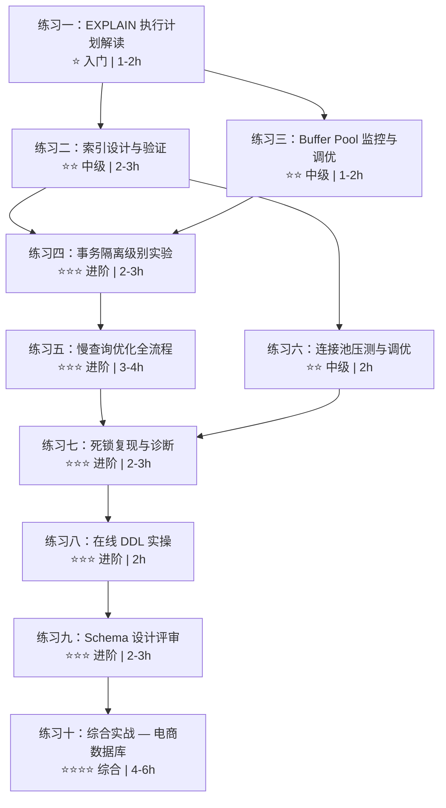

# 第13章 关系型数据库架构 — 练习方法

> **本节定位**：理论、技巧、案例和误区已经建立了正确的知识框架，但知识只有在动手实践中才能真正内化为能力。本节按照「入门→中级→进阶→综合」四个难度阶梯，设计了 10 个系统性练习，覆盖本章全部核心知识点。每个练习都遵循「目标→前置→步骤→验证→陷阱」的结构，确保读者不仅「做了」，而且「做对了」。

## 练习路线图



**建议投入时间**：全部完成约 20-30 小时，建议分 2-3 周推进。如果时间有限，至少完成练习一、二、四、五、十，这 5 个练习覆盖了最核心的能力。

**环境准备**：所有练习默认基于 MySQL 8.0+。请先在本地或 Docker 中搭建实验环境：

```bash
# Docker 一键启动 MySQL 8.0 实验环境
docker run -d \
  --name mysql-practice \
  -e MYSQL_ROOT_PASSWORD=practice123 \
  -p 3306:3306 \
  mysql:8.0 \
  --default-authentication-plugin=mysql_native_password

# 进入 MySQL 命令行
docker exec -it mysql-practice mysql -uroot -ppractice123
```

---

## 练习一：EXPLAIN 执行计划解读（入门）

**对应章节**：核心技巧 — 技巧1 EXPLAIN执行计划解读

**目标**：能读懂执行计划的每一行输出，准确判断查询性能瓶颈所在。

**前置知识**：本章 13.2 节关于查询执行流程和执行引擎层的内容。

### 步骤1：构建测试环境

```sql
-- 创建订单测试表（模拟电商场景）
CREATE TABLE test_orders (
    id BIGINT AUTO_INCREMENT PRIMARY KEY,
    user_id BIGINT NOT NULL,
    status VARCHAR(20) NOT NULL,
    amount DECIMAL(10,2) NOT NULL,
    product_id BIGINT NOT NULL,
    created_at DATETIME NOT NULL,
    updated_at DATETIME DEFAULT CURRENT_TIMESTAMP ON UPDATE CURRENT_TIMESTAMP,
    INDEX idx_user_id (user_id),
    INDEX idx_created_at (created_at),
    INDEX idx_product_id (product_id)
) ENGINE=InnoDB;

-- 批量插入 100 万条测试数据
-- 注意：使用 INSERT ... SELECT 比循环 INSERT 快 100 倍以上
INSERT INTO test_orders (user_id, status, amount, product_id, created_at)
SELECT
    FLOOR(RAND() * 10000) + 1,
    ELT(FLOOR(RAND() * 4) + 1, 'pending', 'paid', 'shipped', 'cancelled'),
    ROUND(RAND() * 500 + 10, 2),
    FLOOR(RAND() * 500) + 1,
    DATE_ADD('2023-01-01', INTERVAL FLOOR(RAND() * 730) DAY)
FROM information_schema.columns a
CROSS JOIN information_schema.columns b
LIMIT 1000000;

-- 更新表统计信息（确保优化器有准确数据可用）
ANALYZE TABLE test_orders;
```

> **为什么要 ANALYZE？** InnoDB 的优化器依赖索引统计信息来估算查询代价。批量插入后统计信息可能过期，导致优化器选择错误的执行计划。生产环境中，MySQL 会自动采样更新统计信息，但在测试环境中手动更新更可靠。

### 步骤2：逐条执行 EXPLAIN，记录关键字段

对以下 6 种典型查询模式分别执行 `EXPLAIN`，重点关注 `type`、`key`、`rows`、`Extra` 四个字段：

```sql
-- 查询 1：主键精确查找（最高效）
EXPLAIN SELECT * FROM test_orders WHERE id = 500000;
-- 预期 type: const, key: PRIMARY, rows: 1

-- 查询 2：二级索引等值查找
EXPLAIN SELECT * FROM test_orders WHERE user_id = 123;
-- 预期 type: ref, key: idx_user_id, rows: ~100

-- 查询 3：范围扫描
EXPLAIN SELECT * FROM test_orders WHERE created_at > '2025-01-01';
-- 预期 type: range, key: idx_created_at, rows: ~20万

-- 查询 4：索引列上的函数导致全表扫描（典型错误）
EXPLAIN SELECT * FROM test_orders WHERE DATE(created_at) = '2024-06-15';
-- 预期 type: ALL, key: NULL（函数包裹索引列，索引失效）

-- 查询 5：复合条件 + 排序
EXPLAIN SELECT * FROM test_orders
WHERE user_id = 123 AND status = 'paid'
ORDER BY created_at DESC LIMIT 10;
-- 预期 type: ref, key: idx_user_id, Extra: Using where; Using filesort

-- 查询 6：覆盖索引（无需回表）
EXPLAIN SELECT user_id, created_at FROM test_orders
WHERE user_id = 123;
-- 预期 type: ref, Extra: Using index（覆盖索引标志）
```

### 步骤3：分析并画出执行流程

对每个查询，在纸上或用 mermaid 画出执行流程，标注：

1. 访问类型（type）—— 数据库如何定位数据行
2. 使用的索引（key）—— 走了哪棵 B+ 树
3. 预估扫描行数（rows）—— 优化器估计要检查多少行
4. 额外信息（Extra）—— 是否有回表、排序、临时表等操作

```sql
-- 对比查询 4 的修正写法
EXPLAIN SELECT * FROM test_orders
WHERE created_at >= '2024-06-15' AND created_at < '2024-06-16';
-- 预期 type: range, key: idx_created_at —— 索引恢复使用
```

### 验收标准

| 能力 | 验证方法 |
|------|---------|
| 能解释 type 字段从 const → ALL 的性能退化原因 | 对照 type 等级表逐级说明 |
| 能识别 Using filesort 和 Using temporary 并判断是否需要优化 | 说明 filesort 何时可接受、何时必须消除 |
| 能指出查询 4 失效原因并给出修正方案 | 解释函数包裹导致全表扫描的原理 |
| 能区分 Using index（覆盖索引）和 Using where（Server 层过滤） | 画出两种场景的数据读取路径 |

### 常见陷阱

- **陷阱 1**：`EXPLAIN` 只是预估，不是实际执行结果。如果需要真实执行统计，使用 `EXPLAIN ANALYZE`（MySQL 8.0+），但注意它会真正执行查询。
- **陷阱 2**：`EXPLAIN` 输出中的 `rows` 是优化器基于统计信息的估算值，可能与实际行数偏差较大。执行 `ANALYZE TABLE` 更新统计信息后再看。
- **陷阱 3**：同一个查询在不同数据量下可能产生不同执行计划。100 行时走全表扫描可能是对的（顺序读比随机读快），100 万行时必须走索引。

---

## 练习二：索引设计与验证（中级）

**对应章节**：核心技巧 — 技巧1 EXPLAIN执行计划解读 + 常见误区 — 索引设计误区

**目标**：根据实际查询模式，设计出覆盖所有高频查询的最优索引方案，且索引数量不超过合理范围。

**前置知识**：理解最左前缀原则、覆盖索引、索引选择性概念。

### 场景设定

一个电商系统的核心表结构如下：

```sql
CREATE TABLE orders (
    id BIGINT AUTO_INCREMENT PRIMARY KEY,
    user_id BIGINT NOT NULL,
    product_id BIGINT NOT NULL,
    status ENUM('pending', 'paid', 'shipped', 'completed', 'cancelled') NOT NULL,
    amount DECIMAL(10,2) NOT NULL,
    created_at DATETIME NOT NULL DEFAULT CURRENT_TIMESTAMP,
    INDEX idx_user_id (user_id),
    INDEX idx_created_at (created_at)
);

CREATE TABLE users (
    id BIGINT AUTO_INCREMENT PRIMARY KEY,
    name VARCHAR(50) NOT NULL,
    email VARCHAR(100) NOT NULL UNIQUE,
    status ENUM('active', 'inactive', 'banned') NOT NULL DEFAULT 'active'
);
```

### 高频查询清单

| 编号 | 查询场景 | SQL 模式 | 执行频率 |
|------|---------|---------|---------|
| Q1 | 用户待付款订单列表 | `WHERE user_id = ? AND status = 'pending' ORDER BY created_at DESC` | 每秒数百次 |
| Q2 | 某商品最近订单 | `WHERE product_id = ? AND created_at > ? ORDER BY created_at DESC LIMIT 100` | 每秒数十次 |
| Q3 | 用户订单状态统计 | `WHERE user_id = ? GROUP BY status` | 每秒数十次 |
| Q4 | 超时订单批量清理 | `WHERE status = 'pending' AND created_at < ? LIMIT 1000` | 每分钟一次 |
| Q5 | 订单详情页（带用户名） | `SELECT o.*, u.name FROM orders o JOIN users u ON o.user_id = u.id WHERE o.id = ?` | 每秒数千次 |

### 任务

1. **分析每个查询的 WHERE、ORDER BY、GROUP BY 子句**，确定哪些字段参与了过滤、排序、分组。
2. **设计索引方案**：要求不超过 5 个索引覆盖 Q1-Q5 所有查询，且没有冗余索引。
3. **创建索引后用 EXPLAIN 验证**每个查询的执行计划。

```sql
-- 你的索引方案写在这里
-- 提示：Q1、Q3、Q5 都涉及 user_id，考虑用一个复合索引覆盖
-- 提示：Q4 涉及 status + created_at 的范围查询，选择性高的字段放前面？
-- 提示：Q2 的 LIMIT 100 意味着只需要扫描索引的前 100 条匹配记录

-- 创建索引后验证
EXPLAIN SELECT * FROM orders WHERE user_id = ? AND status = 'pending' ORDER BY created_at DESC;
-- 验收：type 应为 ref，key 应命中你的复合索引，Extra 不应有 Using filesort

EXPLAIN SELECT * FROM orders WHERE product_id = ? AND created_at > ? ORDER BY created_at DESC LIMIT 100;
-- 验收：type 应为 range，key 命中索引，Extra 无 Using filesort
```

### 验收标准

| 检查项 | 通过条件 |
|--------|---------|
| 索引数量 | Q1-Q5 使用的索引不超过 5 个 |
| 无冗余索引 | 没有被其他索引完全覆盖的冗余索引（如 `(a)` 被 `(a,b)` 覆盖） |
| Q1 执行计划 | type: ref, Extra 无 filesort |
| Q4 执行计划 | type: range, 走 status + created_at 索引 |
| Q5 执行计划 | type: eq_ref（JOIN 条件命中主键） |

### 评估工具

```sql
-- 检测冗余索引（MySQL 8.0+）
SELECT * FROM sys.schema_redundant_indexes WHERE table_schema = DATABASE();

-- 检测未使用索引（需开启 performance_schema）
SELECT * FROM sys.schema_unused_indexes WHERE object_schema = DATABASE();
```

---

## 练习三：Buffer Pool 监控与调优（中级）

**对应章节**：核心技巧 — 技巧2 BufferPool状态监控与调优 + 理论基础 — InnoDB存储引擎架构

**目标**：直观理解 Buffer Pool 命中率与查询性能的关系，掌握用 Python 脚本实时监控 Buffer Pool 状态的方法。

**前置知识**：理解 InnoDB 改进 LRU 算法（Young 区 + Old 区机制）。

### 步骤1：观察不同 Buffer Pool 大小下的命中率变化

```sql
-- 查看当前 Buffer Pool 配置
SHOW VARIABLES LIKE 'innodb_buffer_pool_size';
SHOW STATUS LIKE 'Innodb_buffer_pool%';

-- 核心指标：
-- Innodb_buffer_pool_read_requests  — 逻辑读（从内存读取的次数）
-- Innodb_buffer_pool_reads          — 物理读（从磁盘读取的次数）
-- 命中率 = 1 - (reads / read_requests)
```

```sql
-- 实验：临时调小 Buffer Pool 观察命中率下降
-- 注意：innodb_buffer_pool_size 需要重启生效，且有最小值限制
SET GLOBAL innodb_buffer_pool_size = 67108864;  -- 64MB（MySQL 8.0 支持动态调整）

-- 在另一个终端执行大范围查询，故意产生磁盘 I/O
SELECT * FROM test_orders WHERE created_at > '2023-01-01';
```

### 步骤2：编写 Buffer Pool 监控脚本

```python
#!/usr/bin/env python3
"""
Buffer Pool 实时监控脚本
功能：每 5 秒采集一次命中率、脏页比例、LRU 状态
用法：python3 bp_monitor.py
"""

import mysql.connector
import time
import sys
from datetime import datetime


def get_connection():
    """建立 MySQL 连接"""
    return mysql.connector.connect(
        host='localhost',
        user='root',
        password='practice123',
        database='test',
        charset='utf8mb4'
    )


def collect_metrics(cursor):
    """采集 Buffer Pool 核心指标"""
    cursor.execute("""
        SELECT VARIABLE_NAME, VARIABLE_VALUE
        FROM performance_schema.global_status
        WHERE VARIABLE_NAME IN (
            'Innodb_buffer_pool_read_requests',
            'Innodb_buffer_pool_reads',
            'Innodb_buffer_pool_pages_total',
            'Innodb_buffer_pool_pages_free',
            'Innodb_buffer_pool_pages_dirty'
        )
    """)
    return {row[0]: int(row[1]) for row in cursor.fetchall()}


def compute_hit_rate(stats):
    """计算命中率"""
    requests = stats.get('Innodb_buffer_pool_read_requests', 0)
    reads = stats.get('Innodb_buffer_pool_reads', 0)
    if requests == 0:
        return 0.0
    return (1 - reads / requests) * 100


def format_size(bytes_val):
    """格式化字节数为可读字符串"""
    if bytes_val >= 1024 * 1024 * 1024:
        return f"{bytes_val / (1024**3):.1f} GB"
    elif bytes_val >= 1024 * 1024:
        return f"{bytes_val / (1024**2):.0f} MB"
    else:
        return f"{bytes_val / 1024:.0f} KB"


def monitor(interval=5):
    """主监控循环"""
    conn = get_connection()
    cursor = conn.cursor()

    print("=" * 70)
    print(f"  Buffer Pool 监控启动 | 采集间隔: {interval}s | {datetime.now().strftime('%Y-%m-%d %H:%M:%S')}")
    print("=" * 70)
    print(f"{'时间':>10} | {'命中率':>8} | {'逻辑读':>12} | {'物理读':>10} | {'脏页比':>8} | {'状态'}")
    print("-" * 70)

    prev_requests = 0
    prev_reads = 0

    try:
        while True:
            stats = collect_metrics(cursor)
            hit_rate = compute_hit_rate(stats)

            # 计算增量（本次采集周期内的变化）
            curr_requests = stats['Innodb_buffer_pool_read_requests']
            curr_reads = stats['Innodb_buffer_pool_reads']
            delta_requests = curr_requests - prev_requests
            delta_reads = curr_reads - prev_reads
            delta_hit = (1 - delta_reads / delta_requests) * 100 if delta_requests > 0 else 0

            # 脏页比例
            total_pages = stats.get('Innodb_buffer_pool_pages_total', 1)
            dirty_pages = stats.get('Innodb_buffer_pool_pages_dirty', 0)
            dirty_ratio = dirty_pages / total_pages * 100

            # 命中率状态判定
            if hit_rate >= 99:
                status = "✓ 优秀"
            elif hit_rate >= 95:
                status = "△ 一般"
            else:
                status = "✗ 告警"

            print(
                f"{time.strftime('%H:%M:%S'):>10} | "
                f"{hit_rate:>7.2f}% | "
                f"{curr_requests:>12,} | "
                f"{curr_reads:>10,} | "
                f"{dirty_ratio:>7.2f}% | "
                f"{status}"
            )

            prev_requests = curr_requests
            prev_reads = curr_reads

            time.sleep(interval)

    except KeyboardInterrupt:
        print("\n监控已停止")
    finally:
        cursor.close()
        conn.close()


if __name__ == '__main__':
    interval = int(sys.argv[1]) if len(sys.argv) > 1 else 5
    monitor(interval)
```

### 步骤3：设计对比实验

1. **基线测量**：Buffer Pool 设为 128MB，执行 `SELECT * FROM test_orders` 全表扫描，记录命中率
2. **逐步增大**：分别设为 256MB、512MB、1GB，每次重新全表扫描，记录命中率
3. **观察趋势**：命中率从低到高的变化过程，理解「热数据」被缓存后的效果

### 验收标准

| 能力 | 验证方法 |
|------|---------|
| 能解释命中率从低到高的原因 | 说明 LRU 链表中热数据逐步被缓存的过程 |
| 能区分累计命中率和增量命中率 | 说明为什么增量命中率（本次查询周期）更有诊断价值 |
| 能根据脏页比例判断刷盘压力 | 说明 dirty_ratio > 75% 时的系统行为 |
| 能根据命中率决定是否需要扩容 Buffer Pool | 给出具体的扩容建议阈值 |

---

## 练习四：事务隔离级别实验（进阶）

**对应章节**：核心技巧 — 技巧4 事务隔离级别的选择 + 理论基础 — InnoDB存储引擎架构中的 MVCC 部分

**目标**：通过亲手操作，直观感受四种隔离级别的行为差异，理解 MVCC + Gap Lock 的协作机制。

**前置知识**：理解 Read View、Undo Log 版本链、Next-Key Lock 概念。

### 步骤1：准备测试数据

```sql
CREATE TABLE accounts (
    id INT PRIMARY KEY,
    name VARCHAR(50) NOT NULL,
    balance DECIMAL(12,2) NOT NULL,
    updated_at TIMESTAMP DEFAULT CURRENT_TIMESTAMP ON UPDATE CURRENT_TIMESTAMP
) ENGINE=InnoDB;

INSERT INTO accounts VALUES
(1, 'Alice', 1000.00, NOW()),
(2, 'Bob', 2000.00, NOW()),
(3, 'Charlie', 1500.00, NOW());
```

### 步骤2：RC 隔离级别 — 验证不可重复读

```sql
-- 终端 A：设置 RC 隔离级别
SET SESSION TRANSACTION ISOLATION LEVEL READ COMMITTED;
BEGIN;
SELECT * FROM accounts WHERE id = 1;
-- 预期读到 balance = 1000.00

-- 终端 B：修改数据并提交
BEGIN;
UPDATE accounts SET balance = 800.00 WHERE id = 1;
COMMIT;

-- 终端 A：再次读取（同一事务内）
SELECT * FROM accounts WHERE id = 1;
-- RC 下预期读到 balance = 800.00（不可重复读发生）
-- RR 下预期读到 balance = 1000.00（可重复读，Read View 不变）

-- 终端 A：提交
COMMIT;
```

### 步骤3：RR 隔离级别 — 验证 Gap Lock 对幻读的防护

```sql
-- 终端 A：设置 RR 隔离级别
SET SESSION TRANSACTION ISOLATION LEVEL REPEATABLE READ;
BEGIN;
SELECT * FROM accounts WHERE id BETWEEN 1 AND 5 FOR SHARE;
-- 读到 3 行（id = 1, 2, 3）

-- 终端 B：尝试插入 id = 4 的新行
INSERT INTO accounts VALUES (4, 'Dave', 500.00, NOW());
-- 终端 B 会阻塞！因为 id = 3~5 之间有 Gap Lock

-- 终端 A：再次查询
SELECT * FROM accounts WHERE id BETWEEN 1 AND 5;
-- 仍然只有 3 行（幻读被 Gap Lock 防止）

-- 终端 A：提交
COMMIT;
-- 终端 B 的插入才能执行

-- 终端 A：新开事务查询
BEGIN;
SELECT * FROM accounts WHERE id BETWEEN 1 AND 5;
-- 现在能看到 4 行了（新事务的新 Read View）
COMMIT;
```

### 步骤4：完整对比实验矩阵

在 RC 和 RR 两种隔离级别下，分别测试以下三种场景：

| 场景 | 操作序列 | 观察点 |
|------|---------|--------|
| 脏读 | 终端 A BEGIN → 终端 B UPDATE（不提交）→ 终端 A SELECT | RC/RR 是否能看到未提交的修改 |
| 不可重复读 | 终端 A BEGIN → 终端 B UPDATE + COMMIT → 终端 A SELECT（两次） | 两次 SELECT 结果是否一致 |
| 幻读 | 终端 A BEGIN → SELECT 范围 → 终端 B INSERT + COMMIT → 终端 A 同范围 SELECT | 第二次查询是否多出行 |

### 验收标准

输出一张完整的对比表格：

| 隔离级别 | 脏读 | 不可重复读 | 幻读 | 你的实验结果 |
|---------|------|-----------|------|------------|
| READ COMMITTED | ? | ? | ? | （填入实际观察结果） |
| REPEATABLE READ | ? | ? | ? | （填入实际观察结果） |

并能回答以下问题：
- InnoDB RR 下 Gap Lock 是在什么条件下触发的？（提示：等值查询唯一索引不加 Gap Lock，范围查询或非唯一索引等值查询才会加）
- 为什么互联网公司通常选择 RC 而非 RR？（提示：RC 下没有 Gap Lock，并发性能更好，且不会脏读）

### 常见陷阱

- **陷阱 1**：RR 下的 `SELECT ... FOR UPDATE` 是当前读，直接读最新已提交版本，不走 MVCC。用 `FOR SHARE` 也一样。只有普通 `SELECT` 才走 MVCC。
- **陷阱 2**：Gap Lock 只在 RR 下生效。RC 下没有 Gap Lock，因此 RR 的幻读防护依赖 Gap Lock 而非 MVCC。
- **陷阱 3**：MySQL 8.0 引入了 `innodb_autoinc_lock_mode=2`（交错模式），高并发插入时自增值不保证连续，但不影响 Gap Lock 行为。

---

## 练习五：慢查询优化全流程（进阶）

**对应章节**：核心技巧 — 技巧5 慢查询分析与优化 + 常见误区 — SQL编写误区

**目标**：掌握从「发现慢查询」到「验证优化效果」的完整闭环流程。

**前置知识**：EXPLAIN 解读、索引设计原则、SHOW PROFILE 用法。

### 步骤1：构造慢查询场景

```sql
-- 关闭索引，强制全表扫描（模拟无索引的糟糕场景）
DROP INDEX idx_user_id ON test_orders;
DROP INDEX idx_created_at ON test_orders;
DROP INDEX idx_product_id ON test_orders;

-- 开启慢查询日志（临时生效）
SET GLOBAL slow_query_log = ON;
SET GLOBAL long_query_time = 1;  -- 超过 1 秒记录为慢查询
SET GLOBAL log_queries_not_using_indexes = ON;

-- 执行一条慢查询
SELECT o.id, o.amount, o.status, o.created_at
FROM test_orders o
WHERE o.user_id = 123 AND o.status = 'paid'
ORDER BY o.created_at DESC
LIMIT 20;
-- 执行时间可能超过 3 秒
```

### 步骤2：用慢查询日志定位

```sql
-- 查看慢查询日志文件位置
SHOW VARIABLES LIKE 'slow_query_log_file';

-- 用 mysqldumpslow 分析（在终端中执行）
-- 按平均耗时排序，显示 top 10
mysqldumpslow -s at -t 10 /var/lib/mysql/*.slow

-- 或者使用 pt-query-digest（更强大，推荐安装 Percona Toolkit）
-- pt-query-digest /var/lib/mysql/*.slow | head -50
```

### 步骤3：用 EXPLAIN + SHOW PROFILE 深度分析

```sql
-- EXPLAIN 分析执行计划
EXPLAIN SELECT o.id, o.amount, o.status, o.created_at
FROM test_orders o
WHERE o.user_id = 123 AND o.status = 'paid'
ORDER BY o.created_at DESC LIMIT 20;
-- 预期：type: ALL, key: NULL（全表扫描）

-- SHOW PROFILE 分析各阶段耗时
SET profiling = 1;
SELECT o.id, o.amount, o.status, o.created_at
FROM test_orders o
WHERE o.user_id = 123 AND o.status = 'paid'
ORDER BY o.created_at DESC LIMIT 20;

SHOW PROFILES;
SHOW PROFILE FOR QUERY 1;
-- 重点观察：Sending data、Sorting result、executing 各阶段的耗时
```

### 步骤4：执行优化并验证

```sql
-- 优化方案：创建复合索引
CREATE INDEX idx_user_status_created ON test_orders(user_id, status, created_at);

-- 重新分析
EXPLAIN SELECT o.id, o.amount, o.status, o.created_at
FROM test_orders o
WHERE o.user_id = 123 AND o.status = 'paid'
ORDER BY o.created_at DESC LIMIT 20;
-- 预期：type: ref, key: idx_user_status_created, Extra: Using where

-- 对比耗时
SET profiling = 1;
-- 执行优化后的查询...
SHOW PROFILES;

-- 记录优化前后对比
-- 优化前: ~3.2 秒, type: ALL, rows: 1000000
-- 优化后: ~0.005 秒, type: ref, rows: ~100
-- 提速比: ~600 倍
```

### 验收标准

完成以下闭环并记录到文档中：

发现（慢查询日志） → 定位（pt-query-digest / EXPLAIN） → 分析（SHOW PROFILE 各阶段耗时）
→ 优化（索引 / SQL 改写 / 参数调整） → 验证（EXPLAIN 对比 + 耗时对比） → 监控（持续观察是否复发）

必须输出：
1. 优化前后 EXPLAIN 输出对比
2. 优化前后执行耗时对比
3. 根因分析报告（为什么慢？慢在哪里？）

---

## 练习六：连接池压测与调优（中级）

**对应章节**：核心技巧 — 技巧3 合理使用连接池

**目标**：验证「连接池不是越大越好」这一关键结论，找到当前环境的最优连接数。

**前置知识**：理解连接池参数含义、上下文切换开销。

### 步骤1：编写连接池压测脚本

```python
#!/usr/bin/env python3
"""
连接池大小 vs 吞吐量 压测脚本
测试不同连接数对 QPS 的影响
"""

import mysql.connector
import time
import threading
import statistics

# 被测查询（简单查询，排除 SQL 本身的影响）
TEST_SQL = "SELECT id, user_id, amount FROM test_orders WHERE user_id = %s LIMIT 10"

RESULTS = {}  # pool_size -> [latencies]


def run_queries(pool_size, query_count=100):
    """用指定连接数执行查询，记录延迟"""
    from queue import Queue
    latencies = []

    def worker():
        conn = mysql.connector.connect(
            host='localhost', user='root', password='practice123',
            database='test',
            pool_size=pool_size,  # 部分驱动用 pool_name/pool_size
            connection_timeout=10
        )
        cursor = conn.cursor()
        user_id = int(threading.current_thread().name) % 10000 + 1
        for _ in range(query_count // pool_size):
            start = time.perf_counter()
            cursor.execute(TEST_SQL, (user_id,))
            cursor.fetchall()
            elapsed = time.perf_counter() - start
            latencies.append(elapsed)
        cursor.close()
        conn.close()

    threads = [threading.Thread(target=worker, name=str(i)) for i in range(pool_size)]
    start = time.perf_counter()
    for t in threads:
        t.start()
    for t in threads:
        t.join()
    total_time = time.perf_counter() - start

    qps = query_count / total_time
    avg_latency = statistics.mean(latencies) * 1000  # ms
    p99_latency = sorted(latencies)[int(len(latencies) * 0.99)] * 1000  # ms

    print(f"连接数={pool_size:>3d} | QPS={qps:>8.0f} | 平均延迟={avg_latency:>6.1f}ms | P99={p99_latency:>6.1f}ms")
    return qps


print("=" * 65)
print("  连接池大小压测 | 每组 1000 次查询")
print("=" * 65)

for pool_size in [1, 2, 4, 8, 16, 32, 64, 128]:
    qps = run_queries(pool_size, query_count=1000)
    RESULTS[pool_size] = qps
    time.sleep(1)  # 间隔避免干扰

# 找到最优连接数
best = max(RESULTS, key=RESULTS.get)
print(f"\n最优连接数: {best} (QPS={RESULTS[best]:.0f})")
```

### 步骤2：分析结果

观察 QPS 随连接数的变化曲线：
- 连接数从 1 增加到 N 时，QPS 近似线性增长（并行度提升）
- 超过最优连接数后，QPS 不再增长甚至下降（上下文切换开销抵消了并行收益）
- 超过 CPU 核心数 × 2 后，性能通常开始退化

### 验收标准

- 画出「连接数 vs QPS」曲线图
- 找到当前环境的最优连接数并解释原因
- 能说出生产环境中连接池参数的推荐设置

---

## 练习七：死锁复现与诊断（进阶）

**对应章节**：常见误区 — 死锁无所谓 + 理论基础 — InnoDB锁机制

**目标**：手动构造死锁场景，学会通过 `SHOW ENGINE INNODB STATUS` 分析死锁日志。

**前置知识**：行锁、Gap Lock、等待图概念。

### 步骤1：构造死锁场景

```sql
CREATE TABLE deadlock_test (
    id INT PRIMARY KEY,
    balance INT NOT NULL
) ENGINE=InnoDB;

INSERT INTO deadlock_test VALUES (1, 100), (2, 200), (3, 300);
```

```sql
-- 终端 A
SET SESSION TRANSACTION ISOLATION LEVEL REPEATABLE READ;
BEGIN;
UPDATE deadlock_test SET balance = balance - 10 WHERE id = 1;
-- 持有 id=1 的行锁
-- 此时不提交，等终端 B 执行完后再执行下一步

-- 终端 B
SET SESSION TRANSACTION ISOLATION LEVEL REPEATABLE READ;
BEGIN;
UPDATE deadlock_test SET balance = balance - 10 WHERE id = 2;
-- 持有 id=2 的行锁

-- 终端 A（继续）
UPDATE deadlock_test SET balance = balance - 10 WHERE id = 2;
-- 尝试获取 id=2 的锁 → 被终端 B 阻塞

-- 终端 B（继续）
UPDATE deadlock_test SET balance = balance - 10 WHERE id = 1;
-- 尝试获取 id=1 的锁 → 被终端 A 阻塞 → 死锁！
-- 其中一个终端会报错 ERROR 1213 (40001): Deadlock found
```

### 步骤2：分析死锁日志

```sql
-- 查看 InnoDB 状态（包含最近一次死锁的详细信息）
SHOW ENGINE INNODB STATUS\G
```

在输出中找到 `LATEST DETECTED DEADLOCK` 部分，关注以下字段：
- **TRANSACTION** — 涉及的事务 ID 和持有/等待的锁
- **WAITING FOR THIS LOCK TO BE GRANTED** — 等待中的锁
- **HOLDS THE LOCK(S)** — 已持有的锁
- **WE ROLL BACK TRANSACTION** — 哪个事务被回滚了（代价最小原则）

### 验收标准

- 能构造出至少两种不同类型的死锁（行锁死锁、Gap Lock 死锁）
- 能读懂 `SHOW ENGINE INNODB STATUS` 中的死锁日志
- 能解释 MySQL 为什么选择回滚某个特定事务
- 能提出至少三种预防死锁的策略

---

## 练习八：在线 DDL 实操（进阶）

**对应章节**：核心技巧 — 在线 DDL + 常见误区 — 大表 ALTER 必须停服

**目标**：亲身体验在线 DDL 与传统 DDL 的差异，掌握 pt-online-schema-change 的使用方法。

### 步骤1：对比 DDL 阻塞效果

```sql
-- 创建一个大表（约 500MB）
CREATE TABLE ddl_test (
    id BIGINT AUTO_INCREMENT PRIMARY KEY,
    name VARCHAR(100),
    data TEXT,
    created_at DATETIME
) ENGINE=InnoDB;

-- 批量插入数据（需要几分钟）
-- ...（省略插入脚本，使用与练习一类似的 INSERT ... SELECT 方法）

-- 终端 A：执行传统 DDL（阻塞操作）
ALTER TABLE ddl_test ADD COLUMN status VARCHAR(20) DEFAULT 'active';
-- 注意：在 MySQL 8.0 中，很多 ALTER 操作已支持 INPLACE，不会长时间阻塞
-- 可以用 LOCK=EXCLUSIVE 强制阻塞来观察效果

-- 终端 B：同时执行查询（观察是否被阻塞）
SELECT COUNT(*) FROM ddl_test WHERE name LIKE 'test%';
```

### 步骤2：使用 pt-online-schema-change

```bash
# 安装 Percona Toolkit
apt-get update &amp;&amp; apt-get install -y percona-toolkit

# 使用 pt-osc 在线加列（不锁表）
pt-online-schema-change \
  --alter "ADD COLUMN vip_level INT DEFAULT 0" \
  --execute \
  D=test,t=ddl_test \
  h=localhost,u=root,p=practice123

# pt-osc 工作原理：
# 1. 创建影子表（ddl_test_new），包含新列
# 2. 创建触发器，将 DML 同步到影子表
# 3. 分批复制数据到影子表
# 4. 原子重命名：影子表 → 原表
```

### 验收标准

- 能说明 pt-osc 的四个工作阶段及每阶段的锁行为
- 能判断何时使用 `ALGORITHM=INPLACE` 足够，何时需要 pt-osc
- 能解释为什么 gh-ost 比 pt-osc 更安全（无触发器开销）

---

## 练习九：Schema 设计评审（进阶）

**对应章节**：常见误区 — Schema 设计误区 + 理论基础 — 关系模型

**目标**：对一个真实业务的表结构进行评审，找出所有设计问题并给出改进方案。

### 评审对象

```sql
-- 这是一个"有问题"的表结构，请找出所有问题
CREATE TABLE user_orders (
    order_id VARCHAR(36) PRIMARY KEY,  -- UUID 作为主键
    用户ID BIGINT,
    用户名 VARCHAR(255),
    商品信息 TEXT,  -- 存储 JSON 格式的商品快照
    订单金额 DECIMAL(10,2),
    订单状态 VARCHAR(255),
    下单时间 DATETIME,
    收货地址 VARCHAR(255),
    备注 VARCHAR(255),
    INDEX idx_user (用户ID),
    INDEX idx_time (下单时间),
    INDEX idx_status (订单状态),
    INDEX idx_user_status (用户ID, 订单状态),
    INDEX idx_user_time (用户ID, 下单时间)
);
```

### 评审清单

从以下维度逐项检查，记录发现的问题：

| 维度 | 检查项 | 是否有问题 |
|------|--------|----------|
| 命名规范 | 字段名使用中文、非 snake_case | ? |
| 主键设计 | UUID 作为主键的利弊分析 | ? |
| 数据类型 | VARCHAR(255) 是否合理 | ? |
| 数据类型 | TEXT 存储 JSON 的替代方案 | ? |
| 字段冗余 | 用户名是否应该冗余在订单表中 | ? |
| 索引设计 | 5 个索引是否有冗余 | ? |
| 编码 | 未指定字符集，可能默认 latin1 | ? |
| 引擎 | 未明确指定 ENGINE=InnoDB | ? |

### 验收标准

输出一份完整的 Schema 评审报告，包含：
- 所有问题的编号和描述
- 每个问题的根因分析
- 改进后的建表语句
- 改进理由说明

---

## 练习十：综合实战 — 电商数据库设计（⭐⭐⭐⭐ 综合）

**对应章节**：全章知识综合应用

**目标**：从零设计一个完整的电商数据库，综合运用本章所有知识点。

**前置知识**：完成前面所有练习。

### 业务需求

设计一个电商系统的数据库，支撑以下业务场景：

| 场景 | 核心操作 | 性能要求 |
|------|---------|---------|
| 商品浏览 | 按分类浏览、搜索、详情查看 | 响应时间 < 50ms |
| 下单支付 | 创建订单、扣减库存、记录支付 | 事务一致性，TPS > 1000 |
| 订单查询 | 用户订单列表、订单状态筛选、时间范围查询 | 响应时间 < 100ms |
| 数据报表 | 销售统计、用户分析、库存盘点 | 分钟级响应可接受 |
| 系统运维 | 表结构变更、数据归档、慢查询监控 | 不影响线上业务 |

### 任务分解

**阶段一：表结构设计**
- 设计用户表、商品表、订单表、订单明细表、库存表的完整 DDL
- 每张表都包含：字段定义、类型选择理由、索引设计、约束条件
- 特别注意：选择合适的主键策略（自增 vs UUID vs 雪花算法）

**阶段二：索引策略**
- 根据上面的业务场景，列出所有高频查询
- 为每张表设计最优索引方案
- 说明为什么选择这些索引，以及如何避免冗余

**阶段三：性能保障**
- 设计 Buffer Pool 监控方案（参考练习三的脚本）
- 设计慢查询发现和处理流程（参考练习五）
- 设计连接池参数配置方案（参考练习六）
- 说明事务隔离级别的选择（参考练习四）

**阶段四：可维护性**
- 设计数据归档方案（历史订单如何迁移到归档表）
- 设计在线 DDL 方案（生产环境如何安全变更表结构）
- 设计监控告警规则（哪些指标需要告警、阈值设多少）

### 验收标准

输出一份完整的电商数据库设计方案文档，包含：

| 交付物 | 内容 |
|--------|------|
| ER 图 | 用 mermaid erDiagram 画出表关系 |
| DDL 语句 | 所有建表语句，包含索引、约束、字符集 |
| 索引矩阵 | 每个查询使用了哪个索引的映射表 |
| 性能方案 | Buffer Pool、慢查询、连接池的配置建议 |
| 维护方案 | 归档、DDL、监控的具体操作步骤 |
| 设计决策说明 | 每个关键设计选择的理由（为什么用自增主键不用 UUID？为什么选 RR 不选 RC？） |

---

## 自我评估框架

完成所有练习后，用以下框架评估自己的掌握程度：

| 能力等级 | 标准 | 对应练习 |
|---------|------|---------|
| L1 入门 | 能读懂 EXPLAIN 输出，知道 type/key/rows/Extra 的含义 | 练习一 |
| L2 初级 | 能根据查询模式设计复合索引，能监控 Buffer Pool 命中率 | 练习二、三 |
| L3 中级 | 能复现并诊断死锁，能执行完整的慢查询优化流程 | 练习五、六、七 |
| L4 高级 | 能设计完整的数据库 Schema 并通过评审，能规划在线 DDL 方案 | 练习八、九 |
| L5 专家 | 能从零设计电商级数据库系统，综合运用架构、性能、运维知识 | 练习十 |

**进阶建议**：
- 如果 L1-L2 还不扎实，回头重读本章核心技巧部分的对应技巧
- 如果 L3-L4 遇到困难，回顾常见误区部分的对应误区
- 如果 L5 无法独立完成，说明对全局的理解还不够系统，建议重新梳理本章的知识地图
