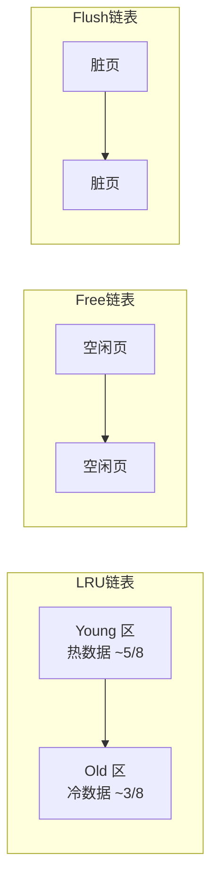
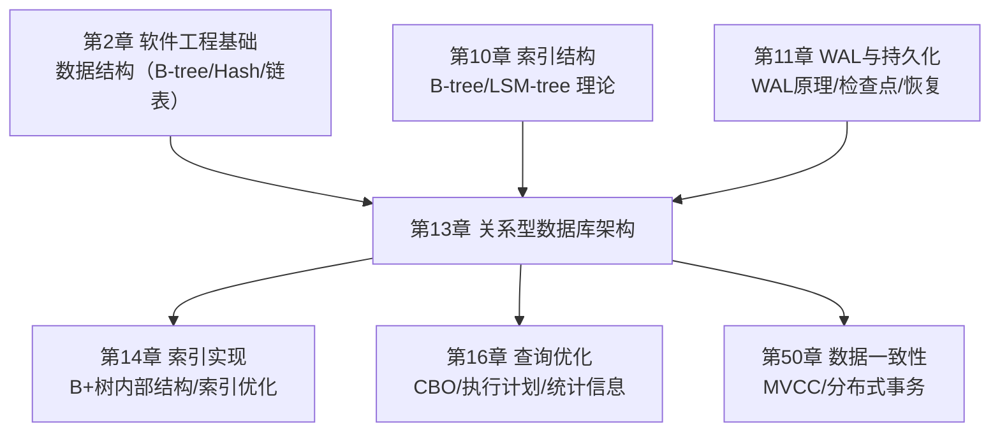

# 第13章 关系型数据库架构 — 本章小结

本章从关系模型的数学根基出发，逐层深入到数据库引擎的内部架构，覆盖了**理论基础、引擎架构、核心子系统、主流数据库对比、实战技巧**五个维度。以下是对全章知识体系的系统性梳理与升华。

---

## 一、核心知识体系回顾

### 1.1 理论根基：关系模型的数学基础

本章从 E.F. Codd 1970 年提出的关系模型出发，建立了数据库的理论框架：

| 理论层次 | 核心内容 | 实践意义 |
|----------|---------|---------|
| 关系的数学定义 | 笛卡尔积的子集，元组无序、唯一、属性原子 | 决定了表设计的规范化要求 |
| 关系代数 | 五种基本运算（σ/π/∪/−/×）+ 四种派生运算 | 查询优化器的等价变换理论基础 |
| 元组关系演算（TRC） | 声明式查询，{t \| φ(t)} | SQL WHERE 子句的理论来源 |
| 域关系演算（DRC） | 域变量替代元组变量 | QBE 查询语言的理论基础 |
| Codd 定理 | 关系代数 ≡ 安全 TRC ≡ 安全 DRC | 证明三种查询语言的表达力等价 |

**核心洞察**：SQL 的非关系特性（允许重复行、NULL 三值逻辑、列有序性）是理论与工程实践之间的妥协。理解这些差异，才能解释为什么 `SELECT` 默认不去重、为什么 `NULL = NULL` 返回 NULL 而非 TRUE。

### 1.2 引擎架构：分层设计的工程哲学

数据库引擎采用分层架构，每层职责清晰、接口标准化：

客户端接口层 → SQL处理层（解析→重写→优化） → 执行引擎层 → 存储引擎层 → OS抽象层

**三种进程模型的权衡**：

| 模型 | 代表数据库 | 优势 | 劣势 | 适用场景 |
|------|-----------|------|------|---------|
| 进程模型 | PostgreSQL | 故障隔离好，一个连接崩溃不影响其他 | 进程创建开销大，内存消耗高 | 企业级 OLTP，强调稳定性 |
| 线程模型 | MySQL/InnoDB | 轻量级，上下文切换快 | 一个线程的错误可能影响整个进程 | Web 应用，高并发 OLTP |
| 混合模型 | OceanBase、TiDB | 可控并发，兼顾隔离与效率 | 实现复杂度高 | 分布式 NewSQL 系统 |

**三种存储引擎类型的对比**：

| 类型 | 数据组织 | 写入优化 | 查询优化 | 典型场景 |
|------|---------|---------|---------|---------|
| 行存储 | 整行连续存储 | 随机写入，单行操作高效 | 适合 OLTP 点查和范围查询 | 订单、用户等事务型表 |
| 列存储 | 同列连续存储 | 批量写入，压缩率高（10:1~100:1） | 列裁剪减少 I/O，向量化执行 | 报表分析、数据仓库 |
| 混合存储 | 行列混合（Delta Store + Main Store） | 兼顾两种工作负载 | HTAP 场景，实时分析+事务 | TiDB、OceanBase 等 NewSQL |

---

## 二、核心子系统深度总结

### 2.1 缓冲池管理器：内存与磁盘的桥梁

Buffer Pool 是数据库性能的**第一道防线**。一次磁盘随机 I/O（HDD ~10ms，SSD ~0.1ms）与一次内存访问（~100ns）之间相差 **5~6 个数量级**。

**改进 LRU 算法的三链表机制**：

- **Young 区**：数据页在 Old 区停留超过 `innodb_old_blocks_time`（默认 1000ms）后晋升，存放热点数据
- **Old 区**：新读入的页面先进入 Old 区头部，防止全表扫描冲刷 Young 区的热点数据
- **Free 链表**：记录所有空闲页，分配新页时从 Free 链表取
- **Flush 链表**：记录所有脏页（被修改但未刷盘的页），由 Page Cleaner 线程定期刷盘

**关键监控指标**：

| 指标 | 含义 | 健康阈值 | 告警阈值 |
|------|------|---------|---------|
| Buffer Pool 命中率 | (1 - reads/requests) × 100% | > 99% | < 95% |
| Free 链表长度 | 可用空闲页数量 | 充足（> 总页数 5%） | 接近 0 |
| Dirty Pages 比例 | 脏页占总页数的比例 | < 75%（触发刷盘） | > innodb_max_dirty_pages_pct |
| LRU 穿透率 | 全表扫描导致的页面替换频率 | 极低 | 频繁替换 |

### 2.2 事务管理器：ACID 的实现机制

**InnoDB 三大日志的协作关系**：

| 日志类型 | 核心功能 | 写入方式 | 数据流向 |
|----------|---------|---------|---------|
| Redo Log | 保证持久性（D），崩溃恢复 | 顺序写，固定大小循环写入 | 内存 → Redo Log → 磁盘 |
| Undo Log | 保证原子性（A），MVCC 版本链 | 追加写入 Undo 表空间 | 修改前旧值 → Undo Log |
| Binlog | 主从复制，数据归档 | 追加写入 | 写完事务 → 写 Binlog |

**两阶段提交（2PC）保证 Redo Log 与 Binlog 一致性**：

1. **Prepare 阶段**：Redo Log 写入磁盘，标记为 prepare 状态
2. **Commit 阶段**：Binlog 写入磁盘，Redo Log 标记为 commit 状态

如果 Binlog 写入成功但 Redo Log 未 commit，MySQL 重启后会根据 Binlog 完整性决定回滚还是提交。

**MVCC 版本可见性判断流程**：

事务快照（Read View）包含当前活跃事务列表
    ↓
读取数据行的隐藏列 trx_id（最后修改该行的事务ID）
    ↓
if trx_id < min_trx_id → 该版本在快照前已提交，可见
if trx_id > max_trx_id → 该版本在快照后产生，不可见
if min_trx_id ≤ trx_id ≤ max_trx_id:
    if trx_id 在活跃列表中 → 未提交，不可见
    if trx_id 不在活跃列表中 → 已提交，可见
    ↓
不可见时，沿 Undo Log 版本链向前查找

**四种隔离级别的实现差异**：

| 隔离级别 | 脏读 | 不可重复读 | 幻读 | InnoDB 实现方式 | 适用场景 |
|----------|------|-----------|------|----------------|---------|
| READ UNCOMMITTED | 可能 | 可能 | 可能 | 直接读最新版本 | 几乎不使用 |
| READ COMMITTED (RC) | ✗ | 可能 | 可能 | 每次 SELECT 创建新 Read View | 互联网高并发场景 |
| REPEATABLE READ (RR) | ✗ | ✗ | 基本避免 | 事务首次 SELECT 创建 Read View + Gap Lock | 金融/电商核心系统 |
| SERIALIZABLE | ✗ | ✗ | ✗ | 所有读加共享锁，完全串行 | 强一致性要求场景 |

> **关键细节**：InnoDB 的 RR 级别通过 MVCC + Next-Key Lock（Record Lock + Gap Lock）**基本解决**了幻读问题，但并非完全消除。在特定场景下（如当前读 + 无索引范围查询）仍可能出现幻读。

### 2.3 查询处理器：从 SQL 到执行结果

**查询执行的完整流水线**：

SQL 文本 → 连接管理 → 解析器（词法+语法） → 预处理器（语义校验）
→ 优化器（RBO/CBO） → 执行计划 → 执行器（Volcano 迭代器模型）
→ 存储引擎 API → 结果集返回

**优化器的两大搜索策略**：

| 策略 | 原理 | 优势 | 劣势 |
|------|------|------|------|
| RBO（基于规则） | 按预定义规则等价变换 | 快速、确定性 | 无法感知数据分布 |
| CBO（基于代价） | 估算每种计划的 I/O/CPU 代价 | 能感知数据分布，选择更优计划 | 依赖统计信息准确性 |

**CBO 代价估算的三大支柱**：

1. **基数估算（Cardinality Estimation）**：预估中间结果行数，是代价估算的基础
2. **选择率估算（Selectivity Estimation）**：谓词过滤后的行比例
3. **代价模型（Cost Model）**：将 I/O、CPU、内存消耗映射为统一代价度量

**三种连接算法对比**：

| 算法 | 时间复杂度 | 空间复杂度 | 最佳适用场景 |
|------|-----------|-----------|-------------|
| Nested Loop Join | O(M × N) | O(1) | 内表有索引，外表较小 |
| Hash Join | O(M + N) | O(N)（哈希表） | 内表无索引，中等数据量 |
| Sort-Merge Join | O(M log M + N log N) | O(M + N) | 两个表都已排序或需要排序输出 |

### 2.4 锁管理器：并发控制的守门人

**锁粒度层级**：

表级锁（Table Lock）
    ↓
意向锁（IS/IX）—— 表级锁与行级锁之间的协调
    ↓
页级锁（Page Lock）—— 部分存储引擎使用
    ↓
行级锁（Row Lock）—— InnoDB 默认，最小粒度

**死锁检测与预防**：

- **检测方式**：等待图（Wait-for Graph）循环检测，InnoDB 默认每秒检测一次
- **超时机制**：`innodb_lock_wait_timeout`（默认 50s），超时后自动回滚代价最小的事务
- **预防策略**：固定加锁顺序、避免大事务、缩短事务持有锁的时间

---

## 三、主流数据库架构对比

### 3.1 PostgreSQL vs MySQL/InnoDB vs SQLite

| 特性 | PostgreSQL | MySQL (InnoDB) | SQLite |
|------|-----------|----------------|--------|
| 进程模型 | 多进程（Postmaster + Backend） | 多线程（主线程 + 工作线程） | 单进程（库函数调用） |
| MVCC 实现 | 元组版本链（旧版本存在原表） | Undo Log（旧版本在 Undo 表空间） | 通过日志模式实现有限并发 |
| WAL 机制 | WAL 文件（连续写入） | Redo Log（循环写入） | WAL 模式（SQLite 3.7+） |
| 复制机制 | 流复制 + 逻辑复制 | 主从复制 + Group Replication | 无内置复制 |
| 并发限制 | 受限于进程数（数百级） | 受限于线程数（数千级） | 单写多读（WAL 模式下） |
| 适用场景 | 企业级 OLTP/OLAP、复杂查询 | Web 应用、高并发 OLTP | 嵌入式、移动应用、单机 |

### 3.2 架构选择的核心权衡

没有"最好"的数据库，只有"最适合"的数据库。选型时需要权衡以下因素：

- **并发模型**：PostgreSQL 进程模型故障隔离好但开销大；MySQL 线程模型轻量但隔离差
- **存储引擎灵活性**：MySQL 插件式引擎允许按场景切换；PostgreSQL 集成式设计减少选择困难
- **数据完整性**：PostgreSQL 类型系统更丰富，严格遵循 SQL 标准；MySQL 在部分标准上更宽松
- **扩展路径**：SQLite 适合单机嵌入式；PostgreSQL/MySQL 支持主从复制和分片

---

## 四、核心技巧总结

### 4.1 EXPLAIN 执行计划解读

**type 字段的性能排序**（从优到差）：

| type | 含义 | 性能 | 说明 |
|------|------|------|------|
| `system` | 表只有一行 | ★★★★★ | 系统表 |
| `const` | 主键/唯一索引等值查询 | ★★★★★ | 最多返回一行 |
| `eq_ref` | JOIN 时主键/唯一索引等值匹配 | ★★★★☆ | 每次 JOIN 只匹配一行 |
| `ref` | 非唯一索引等值查询 | ★★★★☆ | 可能返回多行 |
| `range` | 索引范围扫描 | ★★★☆☆ | BETWEEN、>、<、IN |
| `index` | 全索引扫描 | ★★☆☆☆ | 扫描整棵索引树 |
| `ALL` | 全表扫描 | ★☆☆☆☆ | 最差，需优化 |

**Extra 字段的关键信息**：

| Extra 值 | 含义 | 是否需要优化 |
|----------|------|------------|
| `Using index` | 覆盖索引，无需回表 | ✗ 优秀 |
| `Using where` | Server 层过滤 | 视情况 |
| `Using temporary` | 使用临时表 | ⚠ 可能需要优化 |
| `Using filesort` | 额外排序 | ⚠ 需要检查索引 |
| `Select tables optimized away` | 索引直接聚合 | ✗ 优秀 |

### 4.2 慢查询优化全流程

发现问题（慢查询日志/监控告警）
    ↓
定位根因（pt-query-digest / EXPLAIN / SHOW PROFILE）
    ↓
分析执行计划（type/key/rows/Extra）
    ↓
选择优化策略：
  ├── 索引优化（添加/调整复合索引）
  ├── SQL 改写（避免 SELECT *、避免函数包裹索引列）
  ├── 参数调优（Buffer Pool、连接池、排序缓冲区）
  └── 架构优化（读写分离、分库分表）
    ↓
验证优化效果（对比优化前后 EXPLAIN 和耗时）
    ↓
持续监控（慢查询日志 + Performance Schema）

### 4.3 连接池设计原则

**连接池大小的经验公式**：

连接池大小 = CPU 核心数 × 2 + 有效磁盘数

**为什么不是越大越好？**

| 连接数过多的后果 | 原因 |
|-----------------|------|
| 上下文切换开销剧增 | 每个连接对应一个线程/进程，切换成本 O(1)×N |
| 锁竞争加剧 | 更多并发事务争夺同一行数据 |
| 内存消耗线性增长 | 每个连接需要 Sort Buffer、Join Buffer 等私有内存 |
| 吞吐量反而下降 | 超过最优连接数后，系统大部分时间在切换而非执行 |

**主流连接池参数对比**：

| 参数 | HikariCP | Druid | 说明 |
|------|----------|-------|------|
| `maximumPoolSize` | 默认 10 | 默认 20 | 最大连接数 |
| `minimumIdle` | 默认 = maxPoolSize | 默认 5 | 最小空闲连接 |
| `connectionTimeout` | 30s | 30s | 获取连接超时 |
| `maxLifetime` | 30min | 不限 | 连接最大存活时间 |
| `leakDetectionThreshold` | 60s | - | 连接泄漏检测 |

### 4.4 在线 DDL 方案对比

| 方案 | 原理 | 锁级别 | 数据量限制 | 适用场景 |
|------|------|--------|-----------|---------|
| MySQL 8.0 ALGORITHM=INPLACE | 原地修改元数据 | 元数据锁（短暂） | 大部分操作不限 | 常规 DDL |
| pt-online-schema-change | 创建影子表 + 触发器同步 | 不锁表 | 无限制 | 大表 DDL |
| gh-ost | 创建影子表 + Binlog 同步 | 不锁表 | 无限制 | 大表 DDL（无触发器开销） |

---

## 五、关键公式与经验法则

| 公式 / 法则 | 表达式 | 说明 |
|-------------|--------|------|
| Buffer Pool 命中率 | (1 - reads/requests) × 100% | 应 > 99%，< 95% 需紧急处理 |
| 连接池大小 | CPU 核心数 × 2 + 磁盘数 | 经验公式，需结合实际压测调整 |
| 索引选择性 | distinct(col) / total_rows | 越接近 1 选择性越好，越适合建索引 |
| B+ 树查询复杂度 | O(log_d N) | d 为阶数，N 为记录数，3 层 B+ 树可存约 2000 万行 |
| 慢查询阈值 | long_query_time | MySQL 默认 10s，生产建议 1-2s |
| InnoDB 并发读写比 | 读:写 ≈ 10:1（OLTP 典型值） | 高写入比例需考虑分库分表 |
| Redo Log 容量 | innodb_log_file_size × innodb_log_files_in_group | 典型配置 2G × 2，覆盖至少一个检查点间隔 |

---

## 六、常见误区与纠正

本章列举了 8 个常见误区，核心纠正方向归纳如下：

| 误区 | 错误认知 | 正确认知 |
|------|---------|---------|
| SELECT * 无所谓 | 有索引就行 | 回表开销巨大，覆盖索引可提速 5-10 倍 |
| 索引越多越快 | 每个字段都建索引 | 写入变慢、优化器困惑，需按查询模式设计复合索引 |
| VARCHAR(255) 万能 | 随意设置长度 | 内存临时表按定义长度分配，过大导致退化为磁盘临时表 |
| JOIN 一定比子查询差 | 子查询性能差 | MySQL 8.0 自动将 IN 子查询转为 Semi-Join |
| 大表 ALTER 必须停服 | 等同于停机 | 在线 DDL / pt-osc / gh-ost 可不锁表完成 |
| utf8 够用 | MySQL 的 utf8 = 完整 UTF-8 | MySQL 的 utf8 只支持 3 字节，utf8mb4 才是完整 UTF-8 |
| COUNT(*) 很慢 | 全表扫描 | InnoDB 优化器选择最小索引遍历，近似值可直接用 EXPLAIN |
| 自增主键无页分裂 | 顺序插入不会分裂 | 高并发下仍可能有并发冲突，UUID 做业务主键 + 自增 ID 做物理主键更优 |

---

## 七、实践清单

完成本章学习后，你应当能够独立完成以下操作：

**基础能力**：
- [ ] 读懂 EXPLAIN 执行计划，准确判断 type、key、rows、Extra 的含义
- [ ] 根据查询模式设计复合索引，遵循最左前缀原则
- [ ] 理解 Buffer Pool 的改进 LRU 算法（Young 区 + Old 区机制）
- [ ] 区分 Redo Log、Undo Log、Binlog 各自的职责和写入时机
- [ ] 解释四种事务隔离级别的区别及各自的 MVCC 实现差异

**进阶能力**：
- [ ] 使用 Performance Schema 和 pt-query-digest 定位慢查询根因
- [ ] 配置和调优连接池参数，理解连接数与吞吐量的非线性关系
- [ ] 使用 pt-online-schema-change 或 gh-ost 完成大表在线 DDL
- [ ] 分析死锁日志（`SHOW ENGINE INNODB STATUS`），定位死锁根因并修复
- [ ] 设计监控方案，持续跟踪 Buffer Pool 命中率、慢查询趋势、连接数变化

**架构能力**：
- [ ] 根据业务特征选择合适的事务隔离级别（RC vs RR vs SERIALIZABLE）
- [ ] 对比 PostgreSQL 和 MySQL 的架构差异，为技术选型提供依据
- [ ] 评估数据库容量规划，预判数据增长对性能的影响

---

## 八、与其他章节的知识关联

本章在整本书的知识体系中起着**承上启下**的关键作用：

| 关联章节 | 知识衔接点 |
|----------|-----------|
| **第2章 软件工程基础** | B-tree、Hash 表等数据结构是索引实现的基石 |
| **第10章 索引结构** | 本章介绍了 B+ 树在 InnoDB 中的应用，第 14 章将深入 B+ 树内部的分裂、合并、页面组织 |
| **第11章 WAL 与持久化** | 本章讲解了 Redo Log 的 WAL 原理，第 11 章从操作系统层面解释了 WAL 为何能保证持久性 |
| **第14章 索引实现** | 本章的 EXPLAIN 和索引设计技巧将在第 14 章获得更深层的理论解释 |
| **第16章 查询优化** | 本章介绍了 CBO 的基本概念，第 16 章将深入代价估算模型和统计信息维护 |
| **第50章 数据一致性** | 本章的 MVCC 是一致性模型的基础，第 50 章将扩展到分布式场景的一致性协议 |

---

## 九、下一步学习建议

### 深入理论
- 阅读 *Database Internals*（Alex Petrov）—— 现代数据库内部机制的最佳参考
- 研读 CMU 15-445/645（Andy Pavlo）—— 从零构建一个简易数据库
- 阅读 InnoDB 源码中 Buffer Pool 管理和事务处理的核心模块

### 强化实践
- 在本地搭建 MySQL + PostgreSQL 实验环境，亲手执行 EXPLAIN 观察执行计划
- 模拟百万级数据的高并发场景，观察锁等待、Buffer Pool 命中率等指标
- 安装 `pg_stat_statements`（PostgreSQL）或 Performance Schema（MySQL），监控真实查询行为

### 进阶方向
- **第14章 索引实现**：深入 B+ 树的内部结构、聚簇索引与二级索引的关系、索引下推（ICP）
- **第16章 查询优化**：掌握代价估算模型、统计信息维护、SQL 改写技巧
- **PostgreSQL MVCC 对比**：了解 PostgreSQL 的元组版本链实现与 InnoDB Undo Log 的本质差异
- **NewSQL 架构**：探索 TiDB、CockroachDB 如何在分布式架构上保持关系模型兼容性

---

## 十、本章核心要点速查卡

┌─────────────────────────────────────────────────────────────┐
│                   关系型数据库架构 · 速查卡                    │
├─────────────────────────────────────────────────────────────┤
│  理论根基：关系代数（σ/π/∪/−/×）→ CBO 优化器的理论基础       │
│  引擎架构：SQL层 → 执行引擎 → 存储引擎 → OS抽象层             │
│  核心日志：Redo(持久性) + Undo(回滚+MVCC) + Binlog(复制)     │
│  Buffer Pool：改进LRU（Young+Old），命中率需 > 99%           │
│  MVCC：Read View + Undo Log 版本链，RC每次/RR首次创建        │
│  死锁：等待图检测 + 超时回滚 + 固定加锁顺序预防               │
│  连接池：CPU×2 + 磁盘数，不是越大越好                         │
│  EXPLAIN：type 看访问方式，Extra 看是否有 Using index        │
│  在线DDL：pt-osc / gh-ost，大表变更无需停服                  │
│  选型：PostgreSQL(功能完整) / MySQL(高并发OLTP) / SQLite(嵌入)│
└─────────────────────────────────────────────────────────────┘
