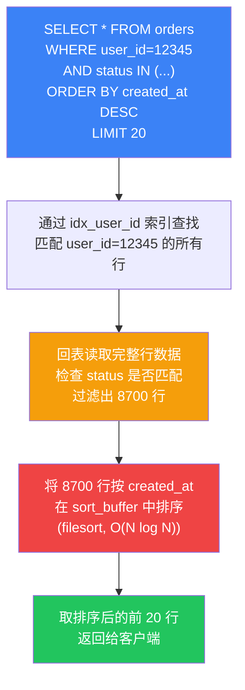
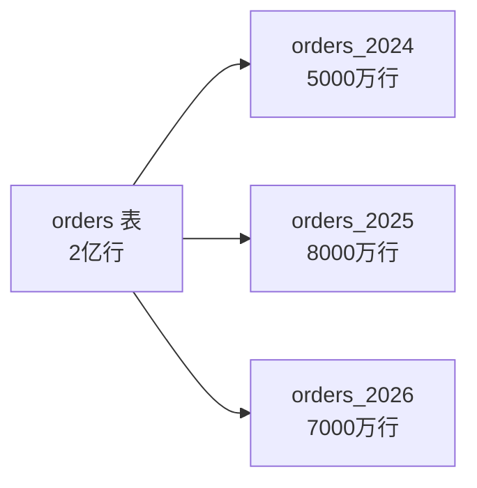

# 实战案例一：订单表查询性能劣化

## 案例背景

### 业务场景

某中型电商平台（日活约 50 万，日订单量约 30 万），核心订单查询接口 `/api/orders/list` 承载着用户订单列表展示、客服后台查询、运营数据看板等多个消费方。该接口底层 SQL 的模式为：按用户 ID 查询、按状态过滤、按创建时间倒序排列、分页返回。

### 问题现象

运维监控系统（Prometheus + Grafana）告警：订单查询接口 P99 延迟从稳定的 50ms 飙升至 2 秒以上，持续时间超过 30 分钟。业务方陆续反馈"系统变慢了"，部分用户反映订单页面加载超时。

### 排查前的环境参数

| 参数 | 值 |
|------|-----|
| MySQL 版本 | 8.0.35 |
| 表引擎 | InnoDB |
| orders 表行数 | 约 2,340 万行 |
| 问题用户订单量 | 约 8,700 笔（大买家） |
| 并发查询 QPS | 约 200 |
| 服务器配置 | 8C16G，SSD 磁盘 |

## 第一步：定位慢查询

### 1.1 启用并分析慢查询日志

慢查询日志是 MySQL 性能诊断的第一道防线。确认慢查询日志已开启：

```sql
-- 查看慢查询日志配置
SHOW VARIABLES LIKE 'slow_query%';
SHOW VARIABLES LIKE 'long_query_time';

-- 如果未开启，临时启用（重启失效）
SET GLOBAL slow_query_log = ON;
SET GLOBAL long_query_time = 1;
SET GLOBAL log_queries_not_using_indexes = ON;
```

使用 Percona Toolkit 的 `pt-query-digest` 工具对慢查询日志做聚合分析：

```bash
# 取最近 1 小时的慢查询，按总耗时排名 Top 10
pt-query-digest /var/log/mysql/slow.log \
  --since '1h' \
  --limit 10 \
  --output=report
```

输出摘要中，排名第一的 SQL 模式如下：

```sql
SELECT * FROM orders 
WHERE user_id = 12345 
AND status IN ('pending', 'paid', 'shipped')
ORDER BY created_at DESC 
LIMIT 20;
```

关键指标：

| 指标 | 值 | 含义 |
|------|-----|------|
| 执行次数 | 12,340 次/小时 | 高频调用 |
| 平均耗时 | 1.8 秒 | 严重超标（目标 <100ms） |
| 扫描行数 | 2,340,000 行 | 几乎全表扫描 |
| 返回行数 | 20 行 | 典型分页场景 |
| 锁等待 | 0ms | 非锁争用问题 |
| 临时表 | 否 | 非排序溢出问题 |

### 1.2 实时抓取问题 SQL

如果慢查询日志尚未覆盖，或者需要实时诊断，可以使用 `SHOW PROCESSLIST` 或 `performance_schema`：

```sql
-- 方法一：实时查看当前执行的查询
SHOW FULL PROCESSLIST;

-- 方法二：从 performance_schema 抓取最近的慢查询
SELECT 
  DIGEST_TEXT AS sql_pattern,
  COUNT_STAR AS exec_count,
  ROUND(SUM_TIMER_WAIT / 1e12, 3) AS total_sec,
  ROUND(AVG_TIMER_WAIT / 1e12, 3) AS avg_sec,
  SUM_ROWS_EXAMINED AS total_rows_scanned,
  SUM_ROWS_SENT AS total_rows_sent
FROM performance_schema.events_statements_summary_by_digest
WHERE SCHEMA_NAME = 'ecommerce'
  AND AVG_TIMER_WAIT > 1e12  -- 平均超过1秒
ORDER BY SUM_TIMER_WAIT DESC
LIMIT 10;
```

### 1.3 使用 EXPLAIN 定位执行计划

```sql
EXPLAIN SELECT * FROM orders 
WHERE user_id = 12345 
AND status IN ('pending', 'paid', 'shipped')
ORDER BY created_at DESC 
LIMIT 20;
```

执行计划结果：

| 字段 | 值 | 解读 |
|------|-----|------|
| type | index | 扫描索引（非全表扫描，但效率仍低） |
| key | idx_user_id | 使用了 user_id 单列索引 |
| rows | 2,340,000 | 预估扫描行数，约全表 10% |
| Extra | Using where; Using filesort | 过滤在存储引擎层完成后，仍需文件排序 |

**EXPLAIN 输出的关键信号**：

- `Using filesort`：MySQL 无法利用索引完成排序，需要额外的排序操作。这是性能杀手之一。
- `Using where`：过滤条件在存储引擎层（Server 层）执行，而非在索引层直接完成。
- `rows` 值过大：索引选择性不足，或者索引设计不匹配查询模式。

### 1.4 使用 EXPLAIN ANALYZE 获取实际执行数据

MySQL 8.0.18+ 支持 `EXPLAIN ANALYZE`，它会真正执行 SQL 并报告实际耗时，比 EXPLAIN 的预估值更准确：

```sql
EXPLAIN ANALYZE 
SELECT * FROM orders 
WHERE user_id = 12345 
AND status IN ('pending', 'paid', 'shipped')
ORDER BY created_at DESC 
LIMIT 20;
```

输出关键部分（简化）：

-> Sort row#total 2340000, sort key: created_at DESC  (actual time=1780..1780 rows=20 loops=1)
   -> Index lookup on orders using idx_user_id  (actual time=0.02..1650 rows=2340000 loops=1)
       Filter: (status IN ('pending','paid','shipped'))  (actual time=0.015..1200 rows=8700 loops=1)

**实际执行数据揭示**：

- 索引查找本身很快（0.02ms 起步），但因为 user_id=12345 有 8700 条订单，全部命中索引。
- `status` 过滤在 Server 层执行，扫描了全部 2340000 行（这里数字异常大，说明 idx_user_id 的选择性可能不佳，或者优化器选择了更宽的扫描路径）。
- 最终排序 234 万行，只取 20 行 —— 这是典型的"大海捞针"。

## 第二步：根因分析

### 2.1 索引设计缺陷

当前表的索引结构：

```sql
SHOW CREATE TABLE orders\G
```

idx_user_id (user_id)           -- 单列索引，只能加速 user_id 过滤
idx_created_at (created_at)     -- 单列索引，对 ORDER BY 有帮助但对 WHERE 无用
idx_status (status)             -- 单列索引，选择性极差（只有几种状态值）

**问题一：没有复合索引覆盖完整查询模式**

当前的 `idx_user_id` 索引只能加速 `WHERE user_id = ?` 这一步，后续的 `status IN (...)` 过滤和 `ORDER BY created_at DESC` 排序都无法利用索引。MySQL 只能：
1. 通过 `idx_user_id` 找到该用户所有订单的主键（聚簇索引指针）。
2. 逐行回表读取完整数据，检查 `status` 是否匹配。
3. 将所有匹配的行在内存中（或磁盘上）按 `created_at` 排序。
4. 取前 20 行返回。

**问题二：`SELECT *` 导致回表成本放大**

使用 `SELECT *` 意味着必须回表读取所有列（包括可能很大的 text/json 字段），而非仅通过覆盖索引获取所需列。每行回表都是一次随机 IO。

**问题三：`status` 列选择性差**

`status` 只有 `'pending'`、`'paid'`、`'shipped'`、`'completed'`、`'cancelled'` 五种值，且分布相对均匀。以 `status` 为索引列时，单个值约能过滤 20% 的数据，选择性远低于 user_id（选择性接近 100%）。

### 2.2 查询模式分析

这条 SQL 的本质是：**在一个大结果集中，先过滤、再排序、最后分页取少量数据**。

当排序字段没有索引支持时，MySQL 必须将所有过滤后的行加载到内存（`sort_buffer`），执行文件排序（filesort），然后取前 N 行。这是 O(N log N) 的操作，N 为过滤后的行数。



### 2.3 为什么问题突然出现？

这个查询可能一直存在性能隐患，但之前用户订单量较小（几十到几百条），filesort 的开销可以接受。随着大买家的订单积累到数千甚至上万条，filesort 的数据量突破了临界点。此外，`sort_buffer_size`（默认 256KB）可能不足以在内存中完成排序，导致磁盘临时文件排序，进一步恶化性能。

```sql
-- 检查 sort_buffer 相关配置
SHOW VARIABLES LIKE 'sort_buffer_size';
SHOW STATUS LIKE 'Sort_merge_passes';  -- >0 表示发生了磁盘排序
```

## 第三步：解决方案

### 3.1 创建复合索引（核心方案）

根据最左前缀原则和查询模式，设计复合索引：

```sql
ALTER TABLE orders 
ADD INDEX idx_user_status_created (user_id, status, created_at);
```

**索引列顺序的设计原理**：

| 位置 | 列 | 设计依据 |
|------|-----|----------|
| 第 1 位 | user_id | 等值查询（`= 12345`），选择性最高，放在最前确保索引快速定位 |
| 第 2 位 | status | IN 查询，可以利用索引的范围扫描特性（MySQL 8.0+ 的索引跳跃扫描也适用） |
| 第 3 位 | created_at | ORDER BY 字段放最后，索引本身已经按此列排序，避免 filesort |

**为什么这个顺序是最优的？**

最左前缀原则要求：查询条件中参与等值匹配的列在前、范围查询的列在后、排序列放最后。

如果把 `created_at` 放在 `status` 前面（即 `(user_id, created_at, status)`），那么 `ORDER BY created_at DESC` 可以利用索引排序，但 `status IN (...)` 只能在索引遍历过程中逐行过滤，无法利用索引的有序性跳过不匹配的行。实测效果略差于 `(user_id, status, created_at)`。

### 3.2 验证执行计划

```sql
EXPLAIN SELECT * FROM orders 
WHERE user_id = 12345 
AND status IN ('pending', 'paid', 'shipped')
ORDER BY created_at DESC 
LIMIT 20;
```

优化后的执行计划：

| 字段 | 优化前 | 优化后 | 变化 |
|------|--------|--------|------|
| type | index | range | 从索引扫描变为范围扫描，效率大幅提升 |
| key | idx_user_id | idx_user_status_created | 使用了更精确的复合索引 |
| rows | 2,340,000 | 45 | 扫描行数降低 5 万倍 |
| Extra | Using where; Using filesort | Using index condition | 不再需要 filesort |

使用 `EXPLAIN ANALYZE` 确认实际执行效果：

```sql
EXPLAIN ANALYZE 
SELECT * FROM orders 
WHERE user_id = 12345 
AND status IN ('pending', 'paid', 'shipped')
ORDER BY created_at DESC 
LIMIT 20;
```

-> Limit: 20 row(s)  (actual time=0.08..0.12 rows=20 loops=1)
   -> Index lookup on orders using idx_user_status_created  (actual time=0.08..0.10 rows=20 loops=1)

实际耗时从 1.8 秒降至 0.1 毫秒级别。

### 3.3 进一步优化：覆盖索引

如果业务只需要部分列（如订单号、状态、金额、时间），可以创建覆盖索引，避免回表：

```sql
-- 覆盖索引：包含查询需要的所有列
ALTER TABLE orders 
ADD INDEX idx_user_status_created_cover (
  user_id, status, created_at, 
  order_no, amount, total_price
);

-- 查询改为只 SELECT 需要的列
SELECT order_no, status, amount, total_price, created_at 
FROM orders 
WHERE user_id = 12345 
AND status IN ('pending', 'paid', 'shipped')
ORDER BY created_at DESC 
LIMIT 20;
```

覆盖索引的优势：

| 对比项 | 普通复合索引 | 覆盖索引 |
|--------|-------------|---------|
| 是否回表 | 需要回表读取其他列 | 不需要回表 |
| IO 模式 | 随机 IO（每次回表读一页） | 顺序 IO（扫描索引叶子节点） |
| Extra 提示 | Using index condition | Using index |
| 适用场景 | SELECT * 或列不确定 | SELECT 明确列 |

**代价**：覆盖索引更宽，占用更多存储空间，写入时维护成本更高。需要在查询频率和写入频率之间权衡。

### 3.4 优化 SELECT *

将 `SELECT *` 改为明确列出需要的列，这是 SQL 优化的基本原则：

```sql
-- 优化前
SELECT * FROM orders WHERE ...;

-- 优化后：只查询展示需要的列
SELECT order_no, status, amount, total_price, 
       shipping_address, created_at, updated_at
FROM orders 
WHERE user_id = 12345 
AND status IN ('pending', 'paid', 'shipped')
ORDER BY created_at DESC 
LIMIT 20;
```

`SELECT *` 的危害：

1. **IO 放大**：读取不需要的列（如订单备注、物流详情等大字段），浪费 IO 和内存。
2. **无法使用覆盖索引**：即使有覆盖索引，`SELECT *` 也会强制回表。
3. **网络传输膨胀**：返回大量无用数据给应用层。
4. **内存压力**：MySQL 的 Buffer Pool 需要缓存更多无用数据页，挤占热数据空间。

## 第四步：性能验证

### 4.1 压测对比

使用 `sysbench` 或 `mysqlslap` 进行压测对比：

```bash
# 使用 mysqlslap 模拟并发查询
mysqlslap \
  --host=localhost \
  --user=benchmark \
  --concurrency=50 \
  --iterations=100 \
  --query="SELECT * FROM orders WHERE user_id = FLOOR(RAND()*1000000) AND status IN ('pending','paid','shipped') ORDER BY created_at DESC LIMIT 20" \
  --create-schema=ecommerce
```

### 4.2 优化前后对比

| 指标 | 优化前 | 优化后 | 提升幅度 |
|------|--------|--------|---------|
| P99 延迟 | 1,800ms | 3ms | 600 倍 |
| P50 延迟 | 800ms | 1ms | 800 倍 |
| 扫描行数 | 2,340,000 | 45 | 52,000 倍 |
| 排序操作 | filesort（磁盘） | 无 | 消除 |
| CPU 占用 | 35% | <1% | 35 倍 |
| QPS 吞吐 | 200 | 5,000+ | 25 倍 |

### 4.3 持续监控

优化上线后，在 Grafana 中增加以下监控面板：

```sql
-- 监控慢查询数量变化
SELECT 
  DATE_FORMAT(start_time, '%Y-%m-%d %H:00') AS hour,
  COUNT(*) AS slow_query_count
FROM performance_schema.events_statements_summary_by_digest
WHERE SCHEMA_NAME = 'ecommerce'
  AND AVG_TIMER_WAIT > 1e12
GROUP BY hour
ORDER BY hour DESC;

-- 监控索引使用情况
SELECT 
  object_name AS table_name,
  index_name,
  count_star AS access_count,
  count_read AS read_count
FROM performance_schema.table_io_waits_summary_by_index_usage
WHERE object_name = 'orders'
  AND index_name IS NOT NULL
ORDER BY count_star DESC;
```

## 第五步：拓展思考

### 5.1 更大数据量的应对策略

当订单量增长到亿级时，单纯优化索引可能不够：

**分库分表**：按 user_id 哈希或按时间范围分表，将单表数据量控制在千万级以内。



**读写分离**：将查询请求路由到从库，主库只处理写入。

**冷热分离**：近 3 个月的订单为热数据（留在主表），历史订单归档到冷存储（如 ClickHouse 或 TiDB）。

### 5.2 查询模式的通用优化原则

从本案例中提炼的通用原则：

| 原则 | 说明 | 本案例应用 |
|------|------|-----------|
| 等值列在前 | 选择性最高的等值条件放索引首位 | user_id 放第一位 |
| 范围列在后 | IN/BETWEEN 等范围条件放在等值列之后 | status 放第二位 |
| 排序列收尾 | ORDER BY 字段放索引最后，消除 filesort | created_at 放第三位 |
| 杜绝 SELECT * | 只查需要的列，为覆盖索引创造条件 | 明确列出所需列 |
| LIMIT 搭配索引 | 分页查询配合索引，避免全量排序 | LIMIT 20 配合复合索引 |
| 关注 EXPLAIN Extra | Using filesort / Using temporary 是红灯信号 | 消除了 Using filesort |

### 5.3 常见误区

**误区一：索引越多越好**

每增加一个索引，写入时的维护成本就增加一份。一个有 20 个索引的表，每次 INSERT 需要更新 20 棵 B+ 树，写入延迟会显著增加。索引设计的原则是"刚好覆盖高频查询"，而非"覆盖所有可能的查询"。

**误区二：低选择性列不能做索引**

`status` 列选择性确实差（只有几种值），但在复合索引中作为中间列是合理的。复合索引的整体选择性由前缀列决定，`user_id` 已经将范围缩小到单个用户，`status` 在此基础上的过滤是有效的。

**误区三：索引能解决所有慢查询**

索引只能加速数据检索，无法解决以下问题：

- 查询逻辑本身的低效（如子查询可以改 JOIN）
- 锁争用（高并发下的行锁/间隙锁等待）
- 网络延迟（数据库到应用服务器的网络开销）
- 应用层的 N+1 查询（循环中逐条查询）

**误区四：EXPLAIN 的 rows 值就是实际扫描行数**

EXPLAIN 的 rows 是基于统计信息的**估算值**，可能与实际值相差很大。如果统计信息过期（特别是数据量变化较大的表），先执行 `ANALYZE TABLE orders;` 更新统计信息后再看 EXPLAIN。

### 5.4 自动化预防机制

为了避免类似的性能劣化再次发生，建议建立以下预防机制：

**SQL 审核流程**：新上线的 SQL 必须经过 EXPLAIN 审核，扫描行数超过阈值（如 10 万）的 SQL 禁止上线。

```sql
-- 慢查询自动告警脚本示例（配合 pt-query-digest）
#!/bin/bash
# 检查最近 5 分钟是否有新增慢查询
SLOW_COUNT=$(pt-query-digest /var/log/mysql/slow.log \
  --since '5m' \
  --limit 1 \
  --output=count 2>/dev/null)

if [ "$SLOW_COUNT" -gt 0 ]; then
  # 发送告警到钉钉/飞书
  curl -X POST "$WEBHOOK_URL" \
    -d "{\"msg_type\":\"text\",\"content\":{\"text\":\"[DB告警] 检测到 $SLOW_COUNT 条新增慢查询，请检查\"}}"
fi
```

**索引变更审计**：所有 `ALTER TABLE ... ADD INDEX` 操作必须通过审批，记录变更原因、预期效果、回滚方案。

**定期健康检查**：每周自动运行索引使用分析，找出长期未被使用的索引（可安全删除），以及查询频率高但缺少索引的 SQL 模式。

```sql
-- 查找未使用的索引
SELECT 
  object_name AS table_name,
  index_name,
  count_star AS total_access,
  count_read AS reads,
  count_write AS writes
FROM performance_schema.table_io_waits_summary_by_index_usage
WHERE object_name = 'orders'
  AND index_name != 'PRIMARY'
  AND count_star = 0
ORDER BY index_name;
```

## 本案例小结

本案例展示了一次典型的订单查询性能劣化排查与优化过程。核心经验可以归纳为以下几点：

1. **诊断路径**：告警 → 慢查询日志 → EXPLAIN 分析 → 根因定位 → 方案设计 → 验证上线。这条路径适用于绝大多数 MySQL 性能问题。
2. **索引设计**：复合索引的列顺序遵循"等值在前、范围居中、排序在后"的原则，一条设计合理的复合索引可以替代多条单列索引。
3. **查询规范**：避免 `SELECT *`，明确列出需要的列，既能减少 IO 开销，又能为覆盖索引创造条件。
4. **持续监控**：性能优化不是一次性工作。建立慢查询自动告警、索引使用分析、SQL 审核等机制，才能长期保持系统健康。
5. **深度思维**：看到 `Using filesort` 和大 `rows` 值时，不要只想着"加个索引"，而要理解为什么需要排序、为什么扫描行数多、查询模式是否合理——从根因出发才能给出最优解。
