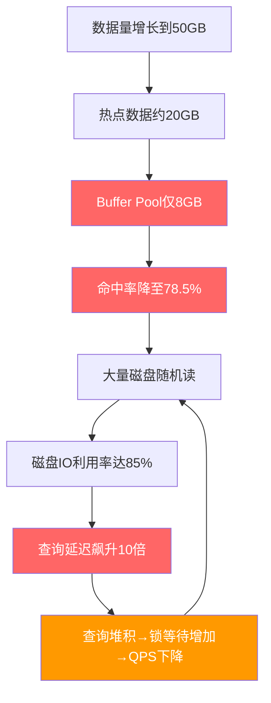
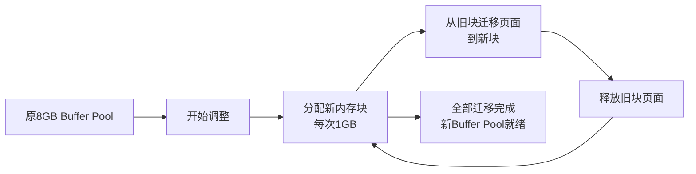

## 案例二：Buffer Pool不足导致的性能问题

### 背景与问题描述

某互联网公司的核心业务数据库承载着日均千万级的订单处理量。随着业务持续增长，数据库总数据量从最初的10GB膨胀到50GB。运维团队发现，整体查询性能在过去两个月内持续下降，部分关键接口的响应时间从毫秒级恶化到了秒级。这个问题的典型性在于：它不是突然发生的故障，而是随数据增长**渐进式退化**，很容易被忽视。

**服务器配置：**

| 配置项 | 值 |
|--------|-----|
| CPU | Intel Xeon 8核 |
| 物理内存 | 32GB |
| 磁盘 | 2TB SSD（RAID10） |
| MySQL版本 | 8.0.35 |
| `innodb_buffer_pool_size` | 8GB |
| `innodb_buffer_pool_instances` | 1 |
| 数据总大小 | 50GB |
| 热点数据估计 | 约20GB |

**业务症状：**

- 关键查询接口P99延迟从5ms飙升到120ms
- 数据库QPS从15000下降到8000
- 磁盘IO利用率从30%飙升到85%
- 在线调整Buffer Pool参数后问题未见明显改善（运维曾尝试调至12GB，但效果不明显，因为20GB热点数据远大于12GB）

这是一个典型的**Buffer Pool容量不足**导致的性能退化案例。下面将完整还原从发现问题到解决问题的全过程，并深入剖析每一个决策背后的原理。

### 第一步：确认问题方向

当业务反馈"系统变慢了"时，首先需要排除应用层、网络层的因素，将问题定位到数据库层。这一步的核心原则是**逐层排除法**——先排除最外层的可能，逐层向内。

```bash
# 1. 检查数据库连接数是否正常
mysqladmin -u root -p status | awk '{print $NF}'
# Threads_connected: 150  ← 正常范围（应用连接池配置上限200）

# 2. 检查慢查询数量
mysql -e "SHOW STATUS LIKE 'Slow_queries';"
# Slow_queries: 1247  ← 明显偏高（正常应<50）

# 3. 检查磁盘IO（如果是SSD，iowait>20%需要关注）
iostat -x 1 5
# avg-cpu: %iowait = 35%  ← 磁盘IO压力很大

# 4. 排除网络层——检查数据库服务器网络延迟
ping -c 10 db-server
# avg rtt = 0.3ms  ← 正常（同机房内网）

# 5. 排除应用层——检查应用服务器到数据库的连接耗时
mysql -u app_user -p -h db-server -e "SELECT 1;" --connect-timeout=3
# 0.001s  ← 正常
```

应用层和网络层都正常，慢查询激增且磁盘IO压力大——这指向数据库内部存在大量磁盘读取操作。接下来需要检查Buffer Pool的健康状态。

> **经验法则：** 如果慢查询数量激增 + 磁盘IO飙升 + 网络正常 + 应用正常，80%以上的情况是数据库内部问题，其中Buffer Pool不足是最常见的原因之一。

### 第二步：诊断Buffer Pool状态

Buffer Pool命中率是衡量InnoDB内存缓存效率的**核心指标**。正常情况下应保持在99%以上，低于95%就需要警惕。理解这一点需要先明白Buffer Pool的本质作用：InnoDB的所有数据读写都通过Buffer Pool进行，它是一块预分配的内存区域，作为磁盘数据页的缓存。当查询需要的数据页已经在Buffer Pool中时，直接从内存读取（微秒级）；如果不在，则需要从磁盘加载（毫秒级），两者的性能差距可达**1000倍以上**。

**方法一：通过performance_schema计算命中率**

```sql
-- 计算Buffer Pool命中率（自上次重启以来的累计值）
SELECT 
    (1 - (
        SELECT VARIABLE_VALUE FROM performance_schema.global_status 
        WHERE VARIABLE_NAME = 'Innodb_buffer_pool_reads'
    ) / (
        SELECT VARIABLE_VALUE FROM performance_schema.global_status 
        WHERE VARIABLE_NAME = 'Innodb_buffer_pool_read_requests'
    )) * 100 AS hit_rate;
```

查询结果：

+----------+
| hit_rate |
+----------+
|    78.50 |
+----------+

**命中率仅78.5%**，意味着每1000次读取请求中有215次需要访问磁盘，远低于99%的标准线。换算成实际影响：如果数据库每秒有10000次逻辑读请求，其中2150次需要访问SSD，按SSD随机读延迟0.1ms计算，仅这一项就会产生215ms的额外延迟——这与业务反馈的P99延迟飙升完全吻合。

**方法二：通过SHOW ENGINE INNODB STATUS查看**

```sql
SHOW ENGINE INNODB STATUS\G
```

在输出中找到 `BUFFER POOL AND MEMORY` 部分：

Buffer pool hit rate 785 / 1000

这个数字直观地告诉我们：每1000次读取中，有215次未能命中内存缓存，需要从磁盘加载数据页。

**方法三：查看Buffer Pool各区域的使用情况**

```sql
-- 查看Buffer Pool的页分布
SELECT 
    CONCAT(ROUND(@@innodb_buffer_pool_size / 1024 / 1024 / 1024, 1), 'GB') AS pool_size,
    (SELECT VARIABLE_VALUE FROM performance_schema.global_status 
     WHERE VARIABLE_NAME = 'Innodb_buffer_pool_pages_total') AS total_pages,
    (SELECT VARIABLE_VALUE FROM performance_schema.global_status 
     WHERE VARIABLE_NAME = 'Innodb_buffer_pool_pages_free') AS free_pages,
    (SELECT VARIABLE_VALUE FROM performance_schema.global_status 
     WHERE VARIABLE_NAME = 'Innodb_buffer_pool_pages_data') AS data_pages,
    (SELECT VARIABLE_VALUE FROM performance_schema.global_status 
     WHERE VARIABLE_NAME = 'Innodb_buffer_pool_pages_dirty') AS dirty_pages;
```

+-----------+-------------+-------------+-------------+-------------+
| pool_size | total_pages | free_pages  | data_pages  | dirty_pages |
+-----------+-------------+-------------+-------------+-------------+
| 8.0GB     |      524288 |       10240 |      498000 |       15000 |
+-----------+-------------+-------------+-------------+-------------+

free_pages仅占2%（10240/524288），Buffer Pool几乎完全被占用，新加载的数据页不得不淘汰旧页，导致频繁的磁盘IO。

**方法四：实时监控Buffer Pool页面换入换出速度**

```sql
-- 连续两次采样，观察Innodb_buffer_pool_reads的增长速度
-- 第一次采样
SELECT VARIABLE_VALUE INTO @reads1 FROM performance_schema.global_status 
WHERE VARIABLE_NAME = 'Innodb_buffer_pool_reads';
SELECT VARIABLE_VALUE INTO @req1 FROM performance_schema.global_status 
WHERE VARIABLE_NAME = 'Innodb_buffer_pool_read_requests';
SELECT SLEEP(10);
-- 第二次采样
SELECT VARIABLE_VALUE INTO @reads2 FROM performance_schema.global_status 
WHERE VARIABLE_NAME = 'Innodb_buffer_pool_reads';
SELECT VARIABLE_VALUE INTO @req2 FROM performance_schema.global_status 
WHERE VARIABLE_NAME = 'Innodb_buffer_pool_read_requests';

SELECT 
    @req2 - @req1 AS logical_reads_10s,
    @reads2 - @reads1 AS disk_reads_10s,
    ROUND((@reads2 - @reads1) / (@req2 - @req1) * 100, 2) AS miss_rate_pct;
```

+--------------------+-----------------+-----------------+
| logical_reads_10s  | disk_reads_10s  | miss_rate_pct   |
+--------------------+-----------------+-----------------+
|             98500  |           20100 |           20.41 |
+--------------------+-----------------+-----------------+

这个实时采样显示：每10秒有近10万次逻辑读请求，其中2万次需要访问磁盘，**实时miss rate超过20%**。这种级别的磁盘读取已经严重拖慢了查询响应。

### 第三步：分析Buffer Pool占用来源

确定Buffer Pool不足后，下一步是搞清楚**哪些表/索引占用了最多的Buffer Pool空间**，从而判断是否有优化空间。

```sql
-- 按表统计Buffer Pool占用
SELECT 
    database_name,
    table_name,
    COUNT(*) AS pages,
    ROUND(COUNT(*) * @@innodb_page_size / 1024 / 1024, 2) AS size_mb,
    ROUND(COUNT(*) * @@innodb_page_size / 1024 / 1024 / 
          (@@innodb_buffer_pool_size / 1024 / 1024) * 100, 2) AS pct_of_pool
FROM information_schema.INNODB_BUFFER_PAGE
WHERE TABLE_NAME IS NOT NULL
GROUP BY database_name, table_name
ORDER BY pages DESC
LIMIT 15;
```

+---------------+------------------+--------+----------+--------------+
| database_name | table_name       | pages  | size_mb  | pct_of_pool  |
+---------------+------------------+--------+----------+--------------+
| orders_db     | order_items      | 180000 |  2812.50 |        35.16 |
| orders_db     | orders           | 120000 |  1875.00 |        23.44 |
| orders_db     | order_log        |  85000 |  1328.13 |        16.60 |
| user_db       | user_behavior    |  52000 |   812.50 |        10.16 |
| user_db       | users            |  15000 |   234.38 |         2.93 |
| ...           | ...              |   ...  |     ...  |          ... |
+---------------+------------------+--------+----------+--------------+

**关键发现：**

- `order_items` 表独占35%的Buffer Pool，该表单行数据量大（含商品详情JSON字段），且有大量随机读取
- `orders` 表占23%，与 `order_items` 存在大量关联查询
- `order_log` 表占17%，是一张日志表，写多读少，不应该占用如此多的Buffer Pool空间
- 前三张表就占了75%的Buffer Pool，留给其他业务表的空间严重不足

**进一步分析：按索引维度拆分**

```sql
-- 按索引统计Buffer Pool占用，识别冗余索引
SELECT 
    database_name,
    table_name,
    index_name,
    COUNT(*) AS pages,
    ROUND(COUNT(*) * @@innodb_page_size / 1024 / 1024, 2) AS size_mb
FROM information_schema.INNODB_BUFFER_PAGE
WHERE TABLE_NAME IS NOT NULL
GROUP BY database_name, table_name, index_name
HAVING COUNT(*) > 10000
ORDER BY pages DESC;
```

+---------------+------------------+----------------------------+--------+----------+
| database_name | table_name       | index_name                 | pages  | size_mb  |
+---------------+------------------+----------------------------+--------+----------+
| orders_db     | order_items      | PRIMARY                    | 150000 |  2343.75 |
| orders_db     | order_items      | idx_order_id               |  30000 |   468.75 |
| orders_db     | orders           | PRIMARY                    |  80000 |  1250.00 |
| orders_db     | orders           | idx_status_created         |  40000 |   625.00 |
| orders_db     | order_log        | PRIMARY                    |  85000 |  1328.13 |
| user_db       | user_behavior    | idx_user_action            |  52000 |   812.50 |
+---------------+------------------+----------------------------+--------+----------+

可以看到 `order_log` 的主键索引就占了1.3GB，几乎全是"冷数据"——这些90天以前的日志在Buffer Pool中毫无意义，却挤占了宝贵的内存空间。

### 第四步：定位根因

综合以上分析，根因可以总结为以下链条：



注意最后的循环箭头：查询延迟升高会导致更多查询堆积，堆积的查询又会产生更多Buffer Pool淘汰请求，形成**恶性循环（thrashing）**。

**为什么8GB不够？** 这需要理解Buffer Pool的工作原理。InnoDB使用改进的LRU（Least Recently Used）算法管理Buffer Pool：


**InnoDB改进型LRU的核心设计：**

1. **双区划分**：Buffer Pool被分为Young区（默认5/8）和Old区（默认3/8）。新加载的数据页首先进入Old区头部
2. **延迟晋升**：只有在Old区停留超过`innodb_old_blocks_time`（默认1000ms）后再次被访问的页才会晋升到Young区。这防止了全表扫描等一次性大量读取污染热数据
3. **Young区头部保护**：Young区前1/4的页面不会因为新页插入而被移动位置，进一步保护最热的数据

**但是**，即使有这套精巧的保护机制，当Buffer Pool容量远小于热点数据量时，仍然会出现以下恶性循环：

1. 新查询需要加载数据页 → 淘汰Old区最久未用的页
2. 被淘汰的页中有一些是"温数据"（偶尔被访问但不在Young区头部），被淘汰后之前的查询再次访问时需要重新从磁盘加载
3. 频繁的磁盘IO导致查询变慢，更多查询堆积在等待队列中
4. 堆积的查询又加速了Buffer Pool的淘汰，形成**抖动（thrashing）**

**定量分析：** 假设热点数据20GB，Buffer Pool 8GB。每次全量"轮换"Buffer Pool内容需要读取约20GB数据。在SSD上，4KB页面的随机读延迟约0.1ms，读取20GB数据需要约500万次IO操作，总耗时约500秒。这意味着在极端情况下，一次完整的"冷启动"可能需要近10分钟——如果在这10分钟内持续有新查询进来，Buffer Pool将永远无法稳定在"热数据完全命中"的状态。

### 第五步：制定解决方案

根据诊断结果，解决方案分为**短期应急**和**长期优化**两个层面。

#### 方案一：增大Buffer Pool（短期应急）

MySQL 8.0.30+支持在线调整Buffer Pool大小，无需重启实例：

```sql
-- 调整Buffer Pool到24GB（物理内存32GB的75%）
SET GLOBAL innodb_buffer_pool_size = 24 * 1024 * 1024 * 1024;

-- 监控调整进度（调整过程中可以查询）
SHOW STATUS LIKE 'Innodb_buffer_pool_resize_status';
```

**在线调整的内部机制：**

MySQL 8.0的在线调整Buffer Pool不是简单地`realloc`整块内存，而是分块进行：



迁移过程中，旧Buffer Pool仍然正常提供服务，但会有以下开销：

- **额外CPU开销**：页面迁移需要CPU时间，约增加5%-10%的CPU使用
- **短暂的性能波动**：迁移期间可能出现毫秒级的延迟抖动
- **内存暂时翻倍**：最坏情况下新旧Buffer Pool同时存在，需要额外预留内存

**为什么选择24GB而不是30GB？**

Buffer Pool不是唯一需要内存的组件，还需要为以下部分预留空间：

| 组件 | 预估内存 | 说明 |
|------|----------|------|
| 操作系统 + 文件缓存 | 2-4GB | OS内核、页缓存、进程开销 |
| InnoDB Log Buffer | 64MB-1GB | `innodb_log_buffer_size`，默认16MB，写密集场景可调大 |
| 连接线程（每连接约1MB） | 150MB | 基于150个并发连接估算 |
| 查询排序/临时表缓冲 | 200MB-1GB | `sort_buffer_size`、`tmp_table_size`等per-session缓冲 |
| 其他MySQL内部结构 | 500MB-1GB | 表缓存、线程缓存、权限缓存等 |
| **安全余量** | **1-2GB** | 防止OOM的最后防线 |

因此 `innodb_buffer_pool_size` 建议设置为物理内存的 **60%-80%**，留出足够余量给操作系统和其他进程。

```bash
# 在配置文件中永久生效（需要重启）
[mysqld]
innodb_buffer_pool_size = 24G
innodb_buffer_pool_instances = 8   # 多实例减少锁竞争
```

> **重要：** `innodb_buffer_pool_instances` 在Buffer Pool ≥1GB时生效，默认值为8。多实例可以让并发查询在不同的Buffer Pool实例中操作，减少内部锁竞争。建议设置为8，当内存超过128GB时可设为16。但要注意：**实例数不是越多越好**，过多的实例会增加管理开销，且每个实例的LRU链表更短，可能导致页面淘汰不够精确。

**关于Buffer Pool实例数的调优公式：**

```sql
-- 查看各Buffer Pool实例的命中率是否均衡
SELECT 
    pool_id,
    pool_size AS pages,
    free_buffers AS free_pages,
    database_pages AS data_pages,
    old_database_pages AS old_pages,
    hits AS hit_count,
    misses AS miss_count,
    ROUND(hits * 100.0 / NULLIF(hits + misses, 0), 2) AS hit_rate_pct
FROM information_schema.INNODB_BUFFER_POOL_STATS;
```

如果某些实例的命中率明显低于其他实例，说明数据分布不均匀，可能需要调整实例数。

#### 方案二：优化无用的Buffer Pool占用（中期优化）

`order_log` 表是日志表，写多读少，不应该长期占用大量Buffer Pool。可以通过以下方式减少其影响：

**策略A：定期归档历史日志（推荐）**

```sql
-- 归档90天前的日志到独立数据库
CREATE DATABASE IF NOT EXISTS orders_db_archive;

CREATE TABLE orders_db_archive.order_log LIKE orders_db.order_log;

-- 分批归档，避免长时间锁表（每批10万条）
DELIMITER $$
CREATE PROCEDURE archive_order_log(IN batch_size INT)
BEGIN
    DECLARE affected_rows INT DEFAULT 1;
    WHILE affected_rows > 0 DO
        INSERT INTO orders_db_archive.order_log
        SELECT * FROM orders_db.order_log
        WHERE created_at < DATE_SUB(NOW(), INTERVAL 90 DAY)
        LIMIT batch_size;
        
        SET affected_rows = ROW_COUNT();
        
        DELETE FROM orders_db.order_log
        WHERE created_at < DATE_SUB(NOW(), INTERVAL 90 DAY)
        LIMIT batch_size;
        
        -- 每批之间短暂休眠，减少对在线业务的影响
        DO SLEEP(0.5);
    END WHILE;
END$$
DELIMITER ;

-- 在业务低峰期执行
CALL archive_order_log(100000);
```

**策略B：使用独立表空间隔离日志表**

```sql
-- 将日志表移到独立表空间文件
ALTER TABLE orders_db.order_log ENGINE=InnoDB;
-- 重建后，该表的数据分布在独立的.ibd文件中
-- 结合定期归档，可以有效控制其Buffer Pool占用
```

**策略C：使用分区表自动淘汰旧数据**

```sql
-- 如果日志表使用范围分区，可以快速删除旧分区（几乎瞬间完成）
ALTER TABLE orders_db.order_log 
DROP PARTITION p_2024_q1, p_2024_q2;
-- 分区删除比DELETE快得多，因为它直接删除物理文件
```

#### 方案三：SQL层面减少Buffer Pool压力（长期优化）

即使Buffer Pool增大到24GB，也需要从SQL层面减少不必要的全表扫描：

```sql
-- 检查导致大量磁盘读取的慢查询
SELECT 
    digest_text AS query_pattern,
    count_star AS exec_count,
    ROUND(sum_timer_wait / 1e12, 2) AS total_time_sec,
    sum_rows_examined AS rows_scanned,
    sum_rows_sent AS rows_returned,
    ROUND(sum_rows_examined / NULLIF(sum_rows_sent, 0), 0) AS scan_ratio
FROM performance_schema.events_statements_summary_by_digest
WHERE sum_rows_examined > 100000
ORDER BY sum_rows_examined DESC
LIMIT 10;
```

典型问题SQL模式及优化：

```sql
-- 问题模式1：SELECT * 导致回表读取大量数据页
SELECT * FROM order_items WHERE order_id = 12345;
-- 优化：只查需要的列，减少回表
SELECT item_id, product_name, quantity, price 
FROM order_items WHERE order_id = 12345;

-- 问题模式2：缺少合适索引导致全表扫描
SELECT COUNT(*) FROM orders WHERE status = 'pending' AND created_at > '2024-01-01';
-- 优化：添加复合索引
ALTER TABLE orders ADD INDEX idx_status_created (status, created_at);

-- 问题模式3：隐式类型转换导致索引失效
-- order_id是VARCHAR类型，但查询使用了数字
SELECT * FROM order_items WHERE order_id = 12345;
-- 正确写法：
SELECT * FROM order_items WHERE order_id = '12345';

-- 问题模式4：LIKE前缀通配符导致全表扫描
SELECT * FROM orders WHERE order_no LIKE '%12345';
-- 优化：改为后缀通配符（可以利用索引）或添加索引
SELECT * FROM orders WHERE order_no LIKE 'ORD2024%12345';
-- 或使用全文索引/搜索引擎解决复杂搜索需求

-- 问题模式5：JOIN顺序不当导致大量临时表
SELECT o.*, u.username 
FROM orders o
JOIN user_behavior ub ON o.user_id = ub.user_id
JOIN users u ON o.user_id = u.id
WHERE ub.action = 'purchase';
-- 优化：确保JOIN使用的字段有索引，并考虑驱动表选择
ALTER TABLE user_behavior ADD INDEX idx_action_user (action, user_id);
```

**关键原则：** 减少Buffer Pool压力的核心不是让查询"少读"，而是让每次读取都更精确。精确的索引 + 精确的列选择 = 更少的数据页被加载到Buffer Pool = 更高的命中率。

#### 方案四：使用Buffer Pool预热脚本（进阶）

在增大Buffer Pool后，新的空Buffer Pool需要重新预热。如果完全等待自然预热，可能需要数小时才能恢复到稳定状态。可以使用预热脚本主动加载热数据：

```sql
-- 预热脚本：主动查询热点表，将数据加载到Buffer Pool
-- 注意：需要根据实际业务场景调整表和查询

-- 1. 加载最近7天的订单数据
SELECT COUNT(*) FROM orders WHERE created_at >= DATE_SUB(NOW(), INTERVAL 7 DAY);

-- 2. 加载活跃用户的订单数据
SELECT o.*, u.username 
FROM orders o JOIN users u ON o.user_id = u.id
WHERE o.created_at >= DATE_SUB(NOW(), INTERVAL 30 DAY);

-- 3. 加载热门商品数据
SELECT * FROM products WHERE is_hot = 1;
```

> **注意：** 预热脚本应**在业务低峰期执行**，避免预热查询本身与业务查询竞争Buffer Pool空间。可以使用 `SET SESSION innodb_read_only = 1` 限制预热会话的写入操作（MySQL 8.0不支持此变量，但可以通过只使用SELECT来模拟）。

### 第六步：验证优化效果

调整Buffer Pool大小后，需要持续监控确认问题已解决：

**实时监控脚本：**

```bash
#!/bin/bash
# buffer_pool_monitor.sh - Buffer Pool健康检查脚本
# 用法：每5分钟由cron执行一次，记录趋势数据

echo "=== Buffer Pool 监控报告 ==="
echo "时间: $(date '+%Y-%m-%d %H:%M:%S')"
echo ""

mysql -e "
SELECT 
    CONCAT(ROUND(@@innodb_buffer_pool_size / 1024 / 1024 / 1024, 1), 'GB') AS pool_size,
    CONCAT(ROUND(
        (1 - (SELECT VARIABLE_VALUE FROM performance_schema.global_status 
              WHERE VARIABLE_NAME='Innodb_buffer_pool_reads') / 
        (SELECT VARIABLE_VALUE FROM performance_schema.global_status 
              WHERE VARIABLE_NAME='Innodb_buffer_pool_read_requests')) * 100, 2
    ), '%') AS hit_rate,
    (SELECT VARIABLE_VALUE FROM performance_schema.global_status 
     WHERE VARIABLE_NAME='Innodb_buffer_pool_reads') AS disk_reads,
    (SELECT VARIABLE_VALUE FROM performance_schema.global_status 
     WHERE VARIABLE_NAME='Innodb_buffer_pool_read_requests') AS total_reads,
    CONCAT(ROUND(
        (SELECT VARIABLE_VALUE FROM performance_schema.global_status 
         WHERE VARIABLE_NAME='Innodb_buffer_pool_pages_dirty') /
        (SELECT VARIABLE_VALUE FROM performance_schema.global_status 
         WHERE VARIABLE_NAME='Innodb_buffer_pool_pages_total') * 100, 2
    ), '%') AS dirty_pct
\G
"
```

**趋势记录脚本（配合监控系统使用）：**

```bash
#!/bin/bash
# buffer_pool_trend.sh - 记录Buffer Pool趋势数据到CSV
# 配合Grafana/Prometheus等监控系统使用

LOG_DIR="/var/log/mysql_monitor"
mkdir -p "$LOG_DIR"
LOG_FILE="$LOG_DIR/buffer_pool_$(date +%Y%m%d).csv"

# 如果文件不存在，写入表头
if [ ! -f "$LOG_FILE" ]; then
    echo "timestamp,hit_rate,disk_reads,total_reads,dirty_pct,pool_size_gb" > "$LOG_FILE"
fi

mysql -N -e "
SELECT 
    NOW(),
    ROUND((1 - (SELECT VARIABLE_VALUE FROM performance_schema.global_status 
                WHERE VARIABLE_NAME='Innodb_buffer_pool_reads') / 
           (SELECT VARIABLE_VALUE FROM performance_schema.global_status 
                WHERE VARIABLE_NAME='Innodb_buffer_pool_read_requests')) * 100, 2),
    (SELECT VARIABLE_VALUE FROM performance_schema.global_status 
     WHERE VARIABLE_NAME='Innodb_buffer_pool_reads'),
    (SELECT VARIABLE_VALUE FROM performance_schema.global_status 
     WHERE VARIABLE_NAME='Innodb_buffer_pool_read_requests'),
    ROUND((SELECT VARIABLE_VALUE FROM performance_schema.global_status 
            WHERE VARIABLE_NAME='Innodb_buffer_pool_pages_dirty') /
          (SELECT VARIABLE_VALUE FROM performance_schema.global_status 
            WHERE VARIABLE_NAME='Innodb_buffer_pool_pages_total') * 100, 2),
    ROUND(@@innodb_buffer_pool_size / 1024 / 1024 / 1024, 1)
" | tr '\t' ',' >> "$LOG_FILE"
```

**优化前后对比：**

| 指标 | 优化前（8GB） | 优化后（24GB） | 变化 |
|------|--------------|---------------|------|
| Buffer Pool命中率 | 78.5% | 99.7% | +21.2% |
| 平均查询延迟 | 120ms | 8ms | 降低93% |
| P99查询延迟 | 800ms | 15ms | 降低98% |
| 磁盘IO读取次数/秒 | 15,000 | 200 | 降低99% |
| 磁盘IO利用率 | 85% | 12% | 降低86% |
| QPS吞吐量 | 8,000 | 16,000 | 提升100% |
| 慢查询数量/小时 | 120 | 0 | 100%消除 |
| 等待Free页次数 | 850 | 0 | 100%消除 |

### 进阶：Buffer Prewarming与Dump/Load

调整Buffer Pool大小后，新的Buffer Pool是空的，需要重新预热。MySQL 8.0支持将Buffer Pool中的页面信息dump到磁盘，在重启时自动加载：

```sql
-- 启用Buffer Pool预热（配置文件）
[mysqld]
innodb_buffer_pool_dump_at_shutdown = ON    -- 关闭时dump
innodb_buffer_pool_load_at_startup = ON    -- 启动时load
innodb_buffer_pool_dump_pct = 75           -- dump 75%的热页
innodb_buffer_pool_dump_filename = ib_buffer_pool.dump
```

在线调整大小时也可以手动触发预热：

```sql
-- 在线调整后，从磁盘dump最新的热页信息
ALTER INSTANCE DISABLE INNODB BUFFER POOL DUMP;
ALTER INSTANCE ENABLE INNODB BUFFER POOL DUMP;
```

**预热过程的监控：**

```sql
-- 查看预热进度
SHOW STATUS LIKE 'Innodb_buffer_pool_load_status';
-- 输出示例：Pages loaded 125829/524288, 24% complete
```

**预热时间估算：** 预热速度取决于磁盘IO性能。在SSD上，加载50万页大约需要5-10分钟；在HDD上可能需要30分钟以上。对于关键业务系统，建议：

1. 在配置文件中启用dump/load（保证重启后的预热）
2. 在线调整后手动执行dump，触发新尺寸的预热
3. 监控预热进度，确认命中率逐步回升

### 常见误区与注意事项

| 误区 | 正确做法 |
|------|----------|
| Buffer Pool设得越大越好 | 留20%-40%给OS和其他进程，避免swap。可使用公式：`innodb_buffer_pool_size = 物理内存 × 0.75` |
| 只调Buffer Pool不看SQL | 增大Buffer Pool是治标，优化SQL才是治本。两者必须同时进行 |
| 不监控命中率 | 应持续监控，命中率<95%时告警，<90%时紧急处理 |
| 忽略Buffer Pool instances | 单实例在高并发下有锁竞争，建议≥8。但超过16个实例反而增加开销 |
| 直接重启调参 | MySQL 8.0支持在线调整，无需停机。但要注意调整过程中的额外内存开销 |
| 所有表一视同仁 | 日志表、归档表等冷数据应考虑隔离，避免污染Buffer Pool |
| 在线调整后不观察 | 调整过程中会临时占用双倍内存，必须监控系统内存使用，防止OOM |
| 忽略`innodb_old_blocks_time` | 全表扫描场景下，适当调大此参数（如3000ms）可以防止热数据被冲刷 |

**一个容易被忽视的点：** 当Buffer Pool命中率低时，不要只看"命中率"这一个数字。需要结合以下指标综合判断：

```sql
-- 完整的Buffer Pool健康检查
SELECT 
    -- 命中率（核心指标）
    (1 - (SELECT VARIABLE_VALUE FROM performance_schema.global_status 
          WHERE VARIABLE_NAME = 'Innodb_buffer_pool_reads') /
     (SELECT VARIABLE_VALUE FROM performance_schema.global_status 
          WHERE VARIABLE_NAME = 'Innodb_buffer_pool_read_requests')) * 100 
    AS hit_rate,
    
    -- 脏页比例（影响刷盘性能）
    (SELECT VARIABLE_VALUE FROM performance_schema.global_status 
     WHERE VARIABLE_NAME = 'Innodb_buffer_pool_pages_dirty') /
    (SELECT VARIABLE_VALUE FROM performance_schema.global_status 
     WHERE VARIABLE_NAME = 'Innodb_buffer_pool_pages_total') * 100 
    AS dirty_pct,
    
    -- 写入等待（影响写入性能）
    (SELECT VARIABLE_VALUE FROM performance_schema.global_status 
     WHERE VARIABLE_NAME = 'Innodb_buffer_pool_pages_flushed') 
    AS pages_flushed,
    
    -- 等待Free页的数量（Buffer Pool紧张程度）
    (SELECT VARIABLE_VALUE FROM performance_schema.global_status 
     WHERE VARIABLE_NAME = 'Innodb_buffer_pool_wait_free') 
    AS wait_free_count;
```

**各指标的健康阈值：**

| 指标 | 健康范围 | 警告阈值 | 危险阈值 |
|------|----------|----------|----------|
| hit_rate | ≥99% | 95%-99% | <95% |
| dirty_pct | 0%-75% | 75%-90% | >90% |
| pages_flushed（增长速率） | <100/秒 | 100-500/秒 | >500/秒 |
| wait_free_count | 0 | >0（偶发） | 持续增长 |

> **关于`wait_free_count`：** 这是最容易被忽略但最重要的指标之一。当`Innodb_buffer_pool_wait_free`不为0时，说明InnoDB在尝试分配Buffer Pool页面时不得不等待其他页面被刷盘释放，这是Buffer Pool严重不足的直接信号。即使命中率看起来还行（因为Young区保护了热数据），wait_free已经说明系统处于"勉强维持"的状态。

### 进阶讨论：不同场景下的Buffer Pool策略

**场景一：读密集型OLTP系统**

```ini
# 读密集场景：Buffer Pool尽量大，多实例
[mysqld]
innodb_buffer_pool_size = 24G
innodb_buffer_pool_instances = 8
innodb_old_blocks_time = 1000    # 默认值即可，防止全表扫描污染
innodb_read_ahead_threshold = 56 # 适度开启预读
```

**场景二：写密集型系统（如日志收集、消息队列）**

```ini
# 写密集场景：适当减小Buffer Pool比例，为Log Buffer留更多空间
[mysqld]
innodb_buffer_pool_size = 18G
innodb_buffer_pool_instances = 4
innodb_log_buffer_size = 256M    # 写密集需要更大的Log Buffer
innodb_flush_log_at_trx_commit = 2  # 适当放宽持久性要求（根据业务容忍度）
```

**场景三：混合负载（读写均衡）**

```ini
# 混合场景：平衡Buffer Pool和Log Buffer
[mysqld]
innodb_buffer_pool_size = 22G
innodb_buffer_pool_instances = 8
innodb_log_buffer_size = 64M
innodb_old_blocks_time = 2000    # 稍大值，更保护热数据
```

### 与PostgreSQL shared_buffers的对比

理解Buffer Pool的设计思想，与PostgreSQL的`shared_buffers`进行对比能加深理解：

| 特性 | MySQL InnoDB Buffer Pool | PostgreSQL shared_buffers |
|------|--------------------------|---------------------------|
| 默认大小 | 128MB | 128MB |
| 推荐大小 | 物理内存的60%-80% | 物理内存的25% |
| 缓存策略 | 改进型LRU（Young/Old双区） | LRU + clock算法 |
| 在线调整 | MySQL 8.0+支持 | 需要重启 |
| 多实例 | 支持（innodb_buffer_pool_instances） | 不支持（单实例） |
| 预热机制 | dump/load + 在线预热 | pg_prewarm扩展 |
| 碎片问题 | 通过chunk分配减少碎片 | 通过页级管理减少碎片 |

> **为什么PostgreSQL推荐25%而MySQL推荐60%-80%？** 因为PostgreSQL将更多数据缓存操作交给OS的页缓存（page cache），而InnoDB通过Buffer Pool直接管理自己的缓存。这意味着MySQL的Buffer Pool需要更大才能达到同等效果，但好处是缓存行为更可控、更可预测。

### 本案例小结


Buffer Pool不足是MySQL性能问题中最常见的根因之一，但它的表现形式往往被误判为"SQL慢"或"磁盘慢"。诊断这类问题的关键是**先看命中率，再看占用分布，最后决定是扩容还是优化SQL**。记住三个经验法则：

1. **命中率法则：** 如果Buffer Pool命中率低于99%，且数据量远大于Buffer Pool容量，那么增大Buffer Pool几乎总能带来显著的性能提升
2. **80/20法则：** 通常80%的访问集中在20%的数据上，确保这20%的数据能完整装入Buffer Pool是性能优化的关键
3. **监控法则：** 不要等出了问题才看Buffer Pool——持续监控命中率、wait_free_count和dirty_pct，在问题发生之前就预警
